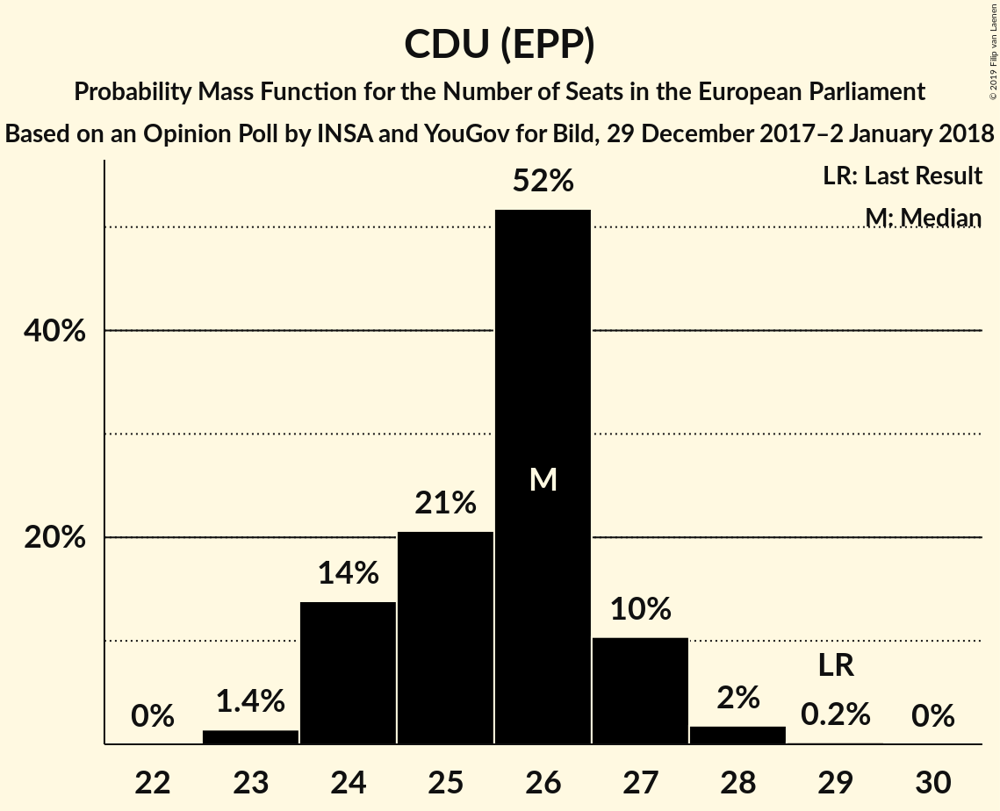
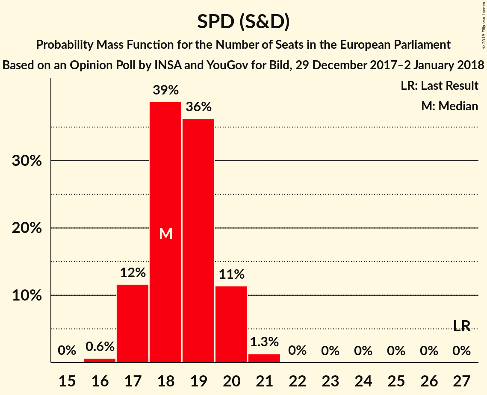
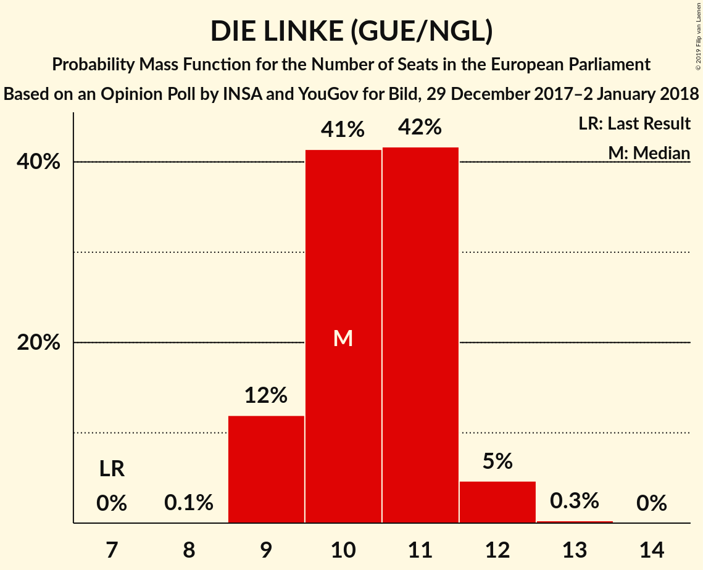
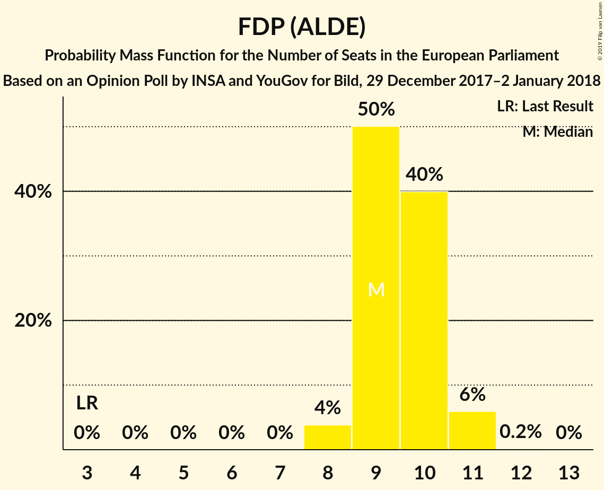
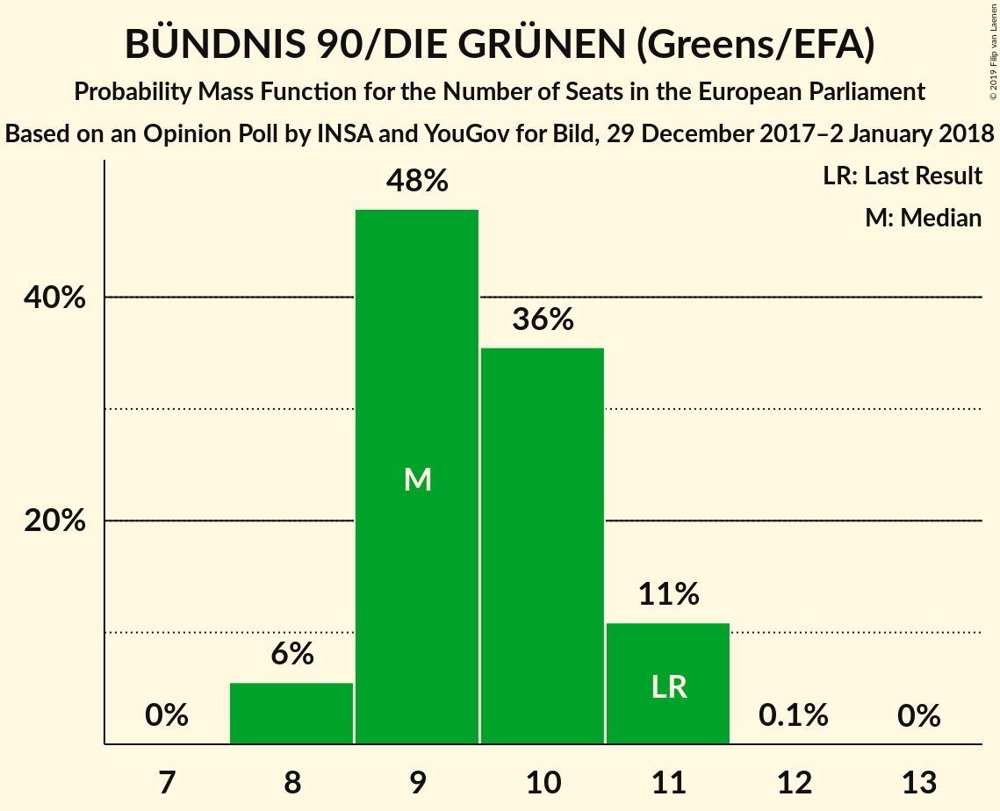
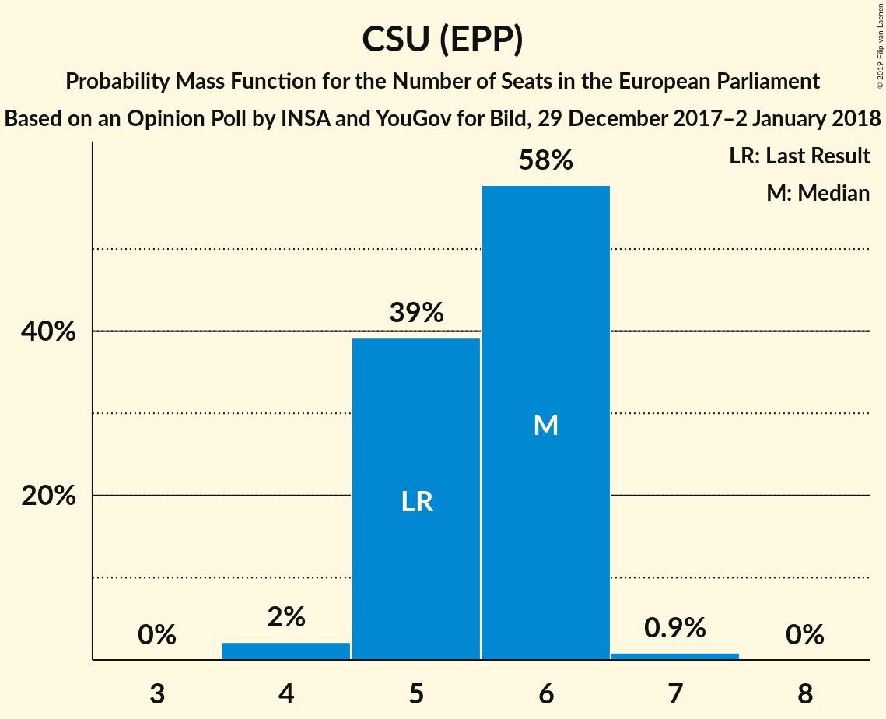
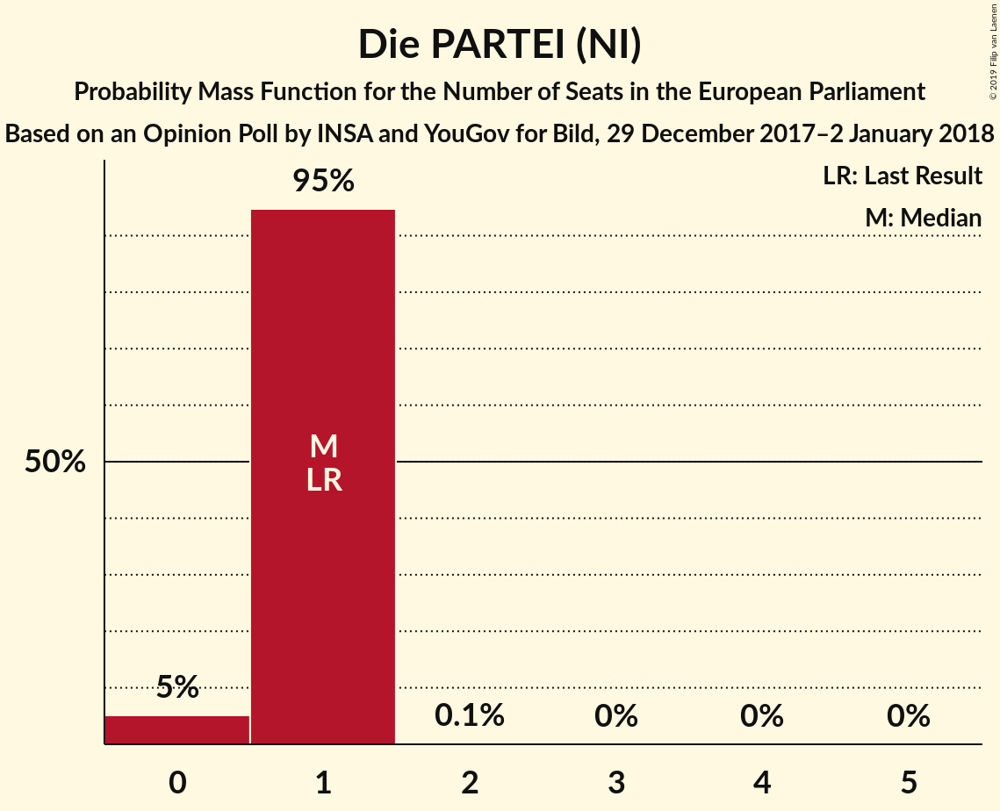

# Opinion Poll by INSA and YouGov for Bild, 29 December 2017–2 January 2018

<a href="#voting-intentions">Voting Intentions</a> | <a href="#seats">Seats</a> | <a href="#coalitions">Coalitions</a> | <a href="#technical-information">Technical Information</a>

## Voting Intentions

### Confidence Intervals

| Party | Last Result | Poll Result | 80% Confidence Interval | 90% Confidence Interval | 95% Confidence Interval | 99% Confidence Interval |
|:-----:|:-----------:|:-----------:|:-----------------------:|:-----------------------:|:-----------------------:|:-----------------------:|
| CDU (EPP) | 30.0% | 26.9% | 25.6–28.2% |25.3–28.6% |25.0–28.9% |24.4–29.5% |
| SPD (S&D) | 27.3% | 19.5% | 18.4–20.7% |18.1–21.0% |17.8–21.3% |17.3–21.9% |
| Alternative für Deutschland (EFDD) | 7.0% | 13.0% | 12.1–14.0% |11.8–14.3% |11.6–14.6% |11.2–15.1% |
| DIE LINKE (GUE/NGL) | 7.4% | 11.0% | 10.1–11.9% |9.9–12.2% |9.7–12.4% |9.3–12.9% |
| FDP (ALDE) | 3.4% | 10.0% | 9.2–10.9% |8.9–11.2% |8.7–11.4% |8.4–11.8% |
| BÜNDNIS 90/DIE GRÜNEN (Greens/EFA) | 10.7% | 10.0% | 9.2–10.9% |8.9–11.2% |8.7–11.4% |8.4–11.8% |
| CSU (EPP) | 5.3% | 5.6% | 5.0–6.3% |4.8–6.5% |4.7–6.7% |4.4–7.1% |
| FREIE WÄHLER (ALDE) | 1.5% | 0.8% | 0.6–1.1% |0.5–1.2% |0.5–1.3% |0.4–1.5% |
| Die PARTEI (NI) | 0.6% | 0.8% | 0.6–1.1% |0.5–1.2% |0.5–1.3% |0.4–1.5% |
| Partei Mensch Umwelt Tierschutz (GUE/NGL) | 1.2% | 0.6% | 0.5–0.9% |0.4–1.0% |0.4–1.1% |0.3–1.3% |

*Note:* The poll result column reflects the actual value used in the calculations. Published results may vary slightly, and in addition be rounded to fewer digits.

## Seats

### Confidence Intervals

| Party | Last Result | Median | 80% Confidence Interval | 90% Confidence Interval | 95% Confidence Interval | 99% Confidence Interval |
|:-----:|:-----------:|:------:|:-----------------------:|:-----------------------:|:-----------------------:|:-----------------------:|
| <a href="#cdu-(epp)">CDU (EPP)</a> | 29 | 25 | 24–27 |24–27 |23–28 |23–28 |
| <a href="#spd-(s&d)">SPD (S&D)</a> | 27 | 19 | 17–20 |17–20 |17–20 |16–21 |
| <a href="#alternative-für-deutschland-(efdd)">Alternative für Deutschland (EFDD)</a> | 7 | 13 | 11–13 |11–14 |11–14 |10–14 |
| <a href="#die-linke-(gue/ngl)">DIE LINKE (GUE/NGL)</a> | 7 | 11 | 10–11 |9–11 |9–12 |9–12 |
| <a href="#fdp-(alde)">FDP (ALDE)</a> | 3 | 10 | 9–10 |9–11 |8–11 |8–11 |
| <a href="#bündnis-90/die-grünen-(greens/efa)">BÜNDNIS 90/DIE GRÜNEN (Greens/EFA)</a> | 11 | 9 | 8–11 |8–11 |8–11 |8–11 |
| <a href="#csu-(epp)">CSU (EPP)</a> | 5 | 6 | 5–6 |5–6 |5–6 |4–7 |
| <a href="#freie-wähler-(alde)">FREIE WÄHLER (ALDE)</a> | 1 | 1 | 1 |1 |0–1 |0–1 |
| <a href="#die-partei-(ni)">Die PARTEI (NI)</a> | 1 | 1 | 1 |1 |1 |0–1 |
| <a href="#partei-mensch-umwelt-tierschutz-(gue/ngl)">Partei Mensch Umwelt Tierschutz (GUE/NGL)</a> | 1 | 1 | 1 |0–1 |0–1 |0–1 |

### CDU (EPP)

*For a full overview of the results for this party, see the [CDU (EPP)](party-cduepp.html) page.*

| Number of Seats | Probability | Accumulated | Special Marks |
|:---------------:|:-----------:|:-----------:|:-------------:|
| 23 | 3% | 100% |  |
| 24 | 45% | 97% |  |
| 25 | 14% | 53% | Median |
| 26 | 20% | 39% |  |
| 27 | 16% | 19% |  |
| 28 | 2% | 3% |  |
| 29 | 0.1% | 0.1% | Last Result |
| 30 | 0% | 0% |  |

### SPD (S&D)

*For a full overview of the results for this party, see the [SPD (S&D)](party-spdsd.html) page.*

| Number of Seats | Probability | Accumulated | Special Marks |
|:---------------:|:-----------:|:-----------:|:-------------:|
| 16 | 0.9% | 100% |  |
| 17 | 14% | 99.1% |  |
| 18 | 19% | 85% |  |
| 19 | 48% | 65% | Median |
| 20 | 17% | 17% |  |
| 21 | 0.6% | 0.6% |  |
| 22 | 0% | 0% |  |
| 23 | 0% | 0% |  |
| 24 | 0% | 0% |  |
| 25 | 0% | 0% |  |
| 26 | 0% | 0% |  |
| 27 | 0% | 0% | Last Result |

### Alternative für Deutschland (EFDD)

*For a full overview of the results for this party, see the [Alternative für Deutschland (EFDD)](party-alternativefürdeutschlandefdd.html) page.*

| Number of Seats | Probability | Accumulated | Special Marks |
|:---------------:|:-----------:|:-----------:|:-------------:|
| 7 | 0% | 100% | Last Result |
| 8 | 0% | 100% |  |
| 9 | 0% | 100% |  |
| 10 | 0.9% | 100% |  |
| 11 | 22% | 99.1% |  |
| 12 | 11% | 77% |  |
| 13 | 58% | 66% | Median |
| 14 | 8% | 8% |  |
| 15 | 0% | 0% |  |

### DIE LINKE (GUE/NGL)

*For a full overview of the results for this party, see the [DIE LINKE (GUE/NGL)](party-dielinkeguengl.html) page.*

| Number of Seats | Probability | Accumulated | Special Marks |
|:---------------:|:-----------:|:-----------:|:-------------:|
| 7 | 0% | 100% | Last Result |
| 8 | 0.1% | 100% |  |
| 9 | 8% | 99.9% |  |
| 10 | 27% | 92% |  |
| 11 | 61% | 65% | Median |
| 12 | 4% | 4% |  |
| 13 | 0.1% | 0.1% |  |
| 14 | 0% | 0% |  |

### FDP (ALDE)

*For a full overview of the results for this party, see the [FDP (ALDE)](party-fdpalde.html) page.*

| Number of Seats | Probability | Accumulated | Special Marks |
|:---------------:|:-----------:|:-----------:|:-------------:|
| 3 | 0% | 100% | Last Result |
| 4 | 0% | 100% |  |
| 5 | 0% | 100% |  |
| 6 | 0% | 100% |  |
| 7 | 0% | 100% |  |
| 8 | 4% | 100% |  |
| 9 | 38% | 96% |  |
| 10 | 49% | 58% | Median |
| 11 | 9% | 9% |  |
| 12 | 0.1% | 0.1% |  |
| 13 | 0% | 0% |  |

### BÜNDNIS 90/DIE GRÜNEN (Greens/EFA)

*For a full overview of the results for this party, see the [BÜNDNIS 90/DIE GRÜNEN (Greens/EFA)](party-bündnis90diegrünengreensefa.html) page.*

| Number of Seats | Probability | Accumulated | Special Marks |
|:---------------:|:-----------:|:-----------:|:-------------:|
| 7 | 0.2% | 100% |  |
| 8 | 35% | 99.8% |  |
| 9 | 23% | 65% | Median |
| 10 | 31% | 42% |  |
| 11 | 11% | 11% | Last Result |
| 12 | 0.1% | 0.1% |  |
| 13 | 0% | 0% |  |

### CSU (EPP)

*For a full overview of the results for this party, see the [CSU (EPP)](party-csuepp.html) page.*

| Number of Seats | Probability | Accumulated | Special Marks |
|:---------------:|:-----------:|:-----------:|:-------------:|
| 4 | 2% | 100% |  |
| 5 | 37% | 98% | Last Result |
| 6 | 59% | 61% | Median |
| 7 | 1.2% | 1.2% |  |
| 8 | 0% | 0% |  |

### FREIE WÄHLER (ALDE)

*For a full overview of the results for this party, see the [FREIE WÄHLER (ALDE)](party-freiewähleralde.html) page.*

| Number of Seats | Probability | Accumulated | Special Marks |
|:---------------:|:-----------:|:-----------:|:-------------:|
| 0 | 4% | 100% |  |
| 1 | 96% | 96% | Last Result, Median |
| 2 | 0.4% | 0.4% |  |
| 3 | 0% | 0% |  |

### Die PARTEI (NI)

*For a full overview of the results for this party, see the [Die PARTEI (NI)](party-dieparteini.html) page.*

| Number of Seats | Probability | Accumulated | Special Marks |
|:---------------:|:-----------:|:-----------:|:-------------:|
| 0 | 2% | 100% |  |
| 1 | 98% | 98% | Last Result, Median |
| 2 | 0.1% | 0.1% |  |
| 3 | 0% | 0% |  |

### Partei Mensch Umwelt Tierschutz (GUE/NGL)

*For a full overview of the results for this party, see the [Partei Mensch Umwelt Tierschutz (GUE/NGL)](party-parteimenschumwelttierschutzguengl.html) page.*

| Number of Seats | Probability | Accumulated | Special Marks |
|:---------------:|:-----------:|:-----------:|:-------------:|
| 0 | 8% | 100% |  |
| 1 | 92% | 92% | Last Result, Median |
| 2 | 0% | 0% |  |

## Coalitions

### Confidence Intervals

| Coalition | Last Result | Median | Majority? | 80% Confidence Interval | 90% Confidence Interval | 95% Confidence Interval | 99% Confidence Interval |
|:---------:|:-----------:|:------:|:---------:|:-----------------------:|:-----------------------:|:-----------------------:|:-----------------------:|
| CDU (EPP) – CSU (EPP) | 34 | 30 | 0% | 30–32 | 29–33 | 29–33 | 28–34 |
| SPD (S&D) | 27 | 19 | 0% | 17–20 | 17–20 | 17–20 | 16–21 |
| Alternative für Deutschland (EFDD) | 7 | 13 | 0% | 11–13 | 11–14 | 11–14 | 10–14 |
| FDP (ALDE) – FREIE WÄHLER (ALDE) | 4 | 11 | 0% | 10–11 | 9–12 | 9–12 | 9–12 |
| Die PARTEI (NI) | 1 | 1 | 0% | 1 | 1 | 1 | 0–1 |

### CDU (EPP) – CSU (EPP)

| Number of Seats | Probability | Accumulated | Special Marks |
|:---------------:|:-----------:|:-----------:|:-------------:|
| 28 | 1.0% | 100% |  |
| 29 | 4% | 99.0% |  |
| 30 | 51% | 95% |  |
| 31 | 19% | 44% | Median |
| 32 | 18% | 25% |  |
| 33 | 6% | 7% |  |
| 34 | 0.5% | 0.6% | Last Result |
| 35 | 0% | 0% |  |

### SPD (S&D)

| Number of Seats | Probability | Accumulated | Special Marks |
|:---------------:|:-----------:|:-----------:|:-------------:|
| 16 | 0.9% | 100% |  |
| 17 | 14% | 99.1% |  |
| 18 | 19% | 85% |  |
| 19 | 48% | 65% | Median |
| 20 | 17% | 17% |  |
| 21 | 0.6% | 0.6% |  |
| 22 | 0% | 0% |  |
| 23 | 0% | 0% |  |
| 24 | 0% | 0% |  |
| 25 | 0% | 0% |  |
| 26 | 0% | 0% |  |
| 27 | 0% | 0% | Last Result |

### Alternative für Deutschland (EFDD)

| Number of Seats | Probability | Accumulated | Special Marks |
|:---------------:|:-----------:|:-----------:|:-------------:|
| 7 | 0% | 100% | Last Result |
| 8 | 0% | 100% |  |
| 9 | 0% | 100% |  |
| 10 | 0.9% | 100% |  |
| 11 | 22% | 99.1% |  |
| 12 | 11% | 77% |  |
| 13 | 58% | 66% | Median |
| 14 | 8% | 8% |  |
| 15 | 0% | 0% |  |

### FDP (ALDE) – FREIE WÄHLER (ALDE)

| Number of Seats | Probability | Accumulated | Special Marks |
|:---------------:|:-----------:|:-----------:|:-------------:|
| 4 | 0% | 100% | Last Result |
| 5 | 0% | 100% |  |
| 6 | 0% | 100% |  |
| 7 | 0% | 100% |  |
| 8 | 0.1% | 100% |  |
| 9 | 6% | 99.9% |  |
| 10 | 36% | 94% |  |
| 11 | 49% | 58% | Median |
| 12 | 9% | 9% |  |
| 13 | 0.1% | 0.1% |  |
| 14 | 0% | 0% |  |

### Die PARTEI (NI)

| Number of Seats | Probability | Accumulated | Special Marks |
|:---------------:|:-----------:|:-----------:|:-------------:|
| 0 | 2% | 100% |  |
| 1 | 98% | 98% | Last Result, Median |
| 2 | 0.1% | 0.1% |  |
| 3 | 0% | 0% |  |

## Technical Information

### Opinion Poll

+ **Polling firm:** INSA and YouGov
+ **Commissioner(s):** Bild
+ **Fieldwork period:** 29 December 2017–2 January 2018

### Calculations

+ **Sample size:** 2012
+ **Simulations done:** 131,072
+ **Error estimate:** 1.78%

