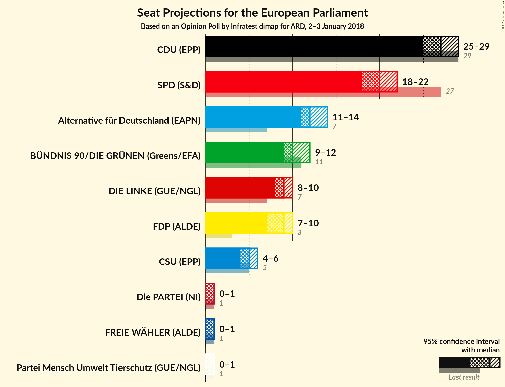
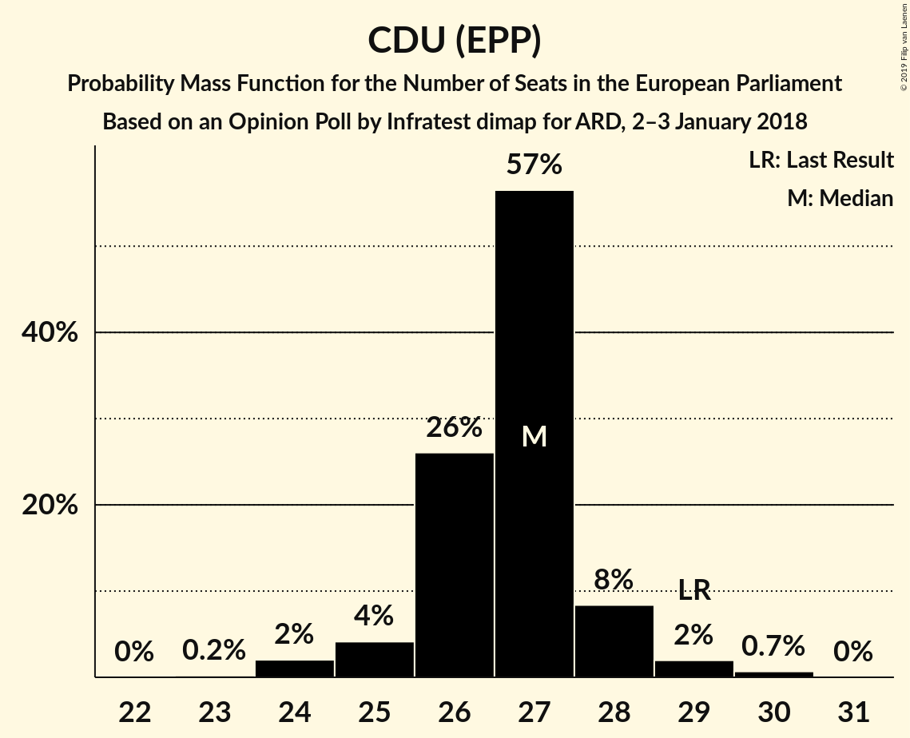
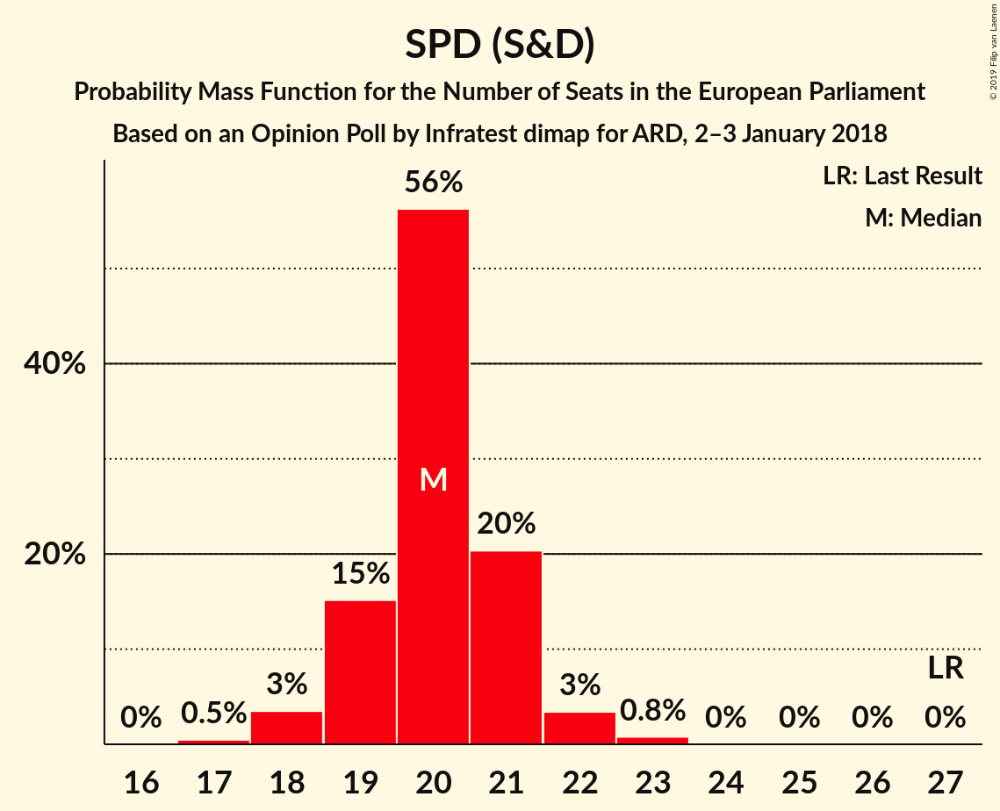
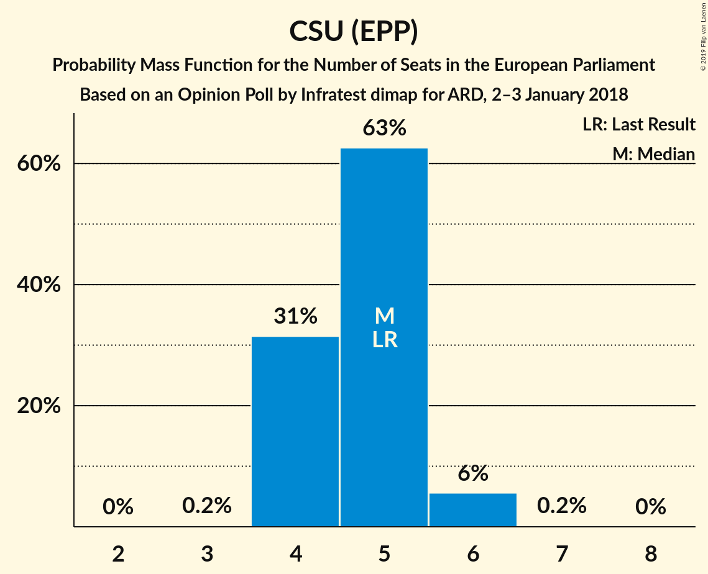
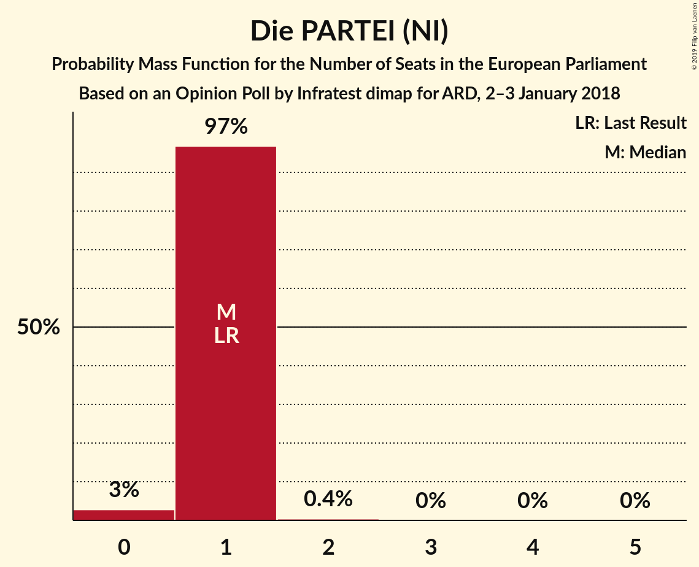
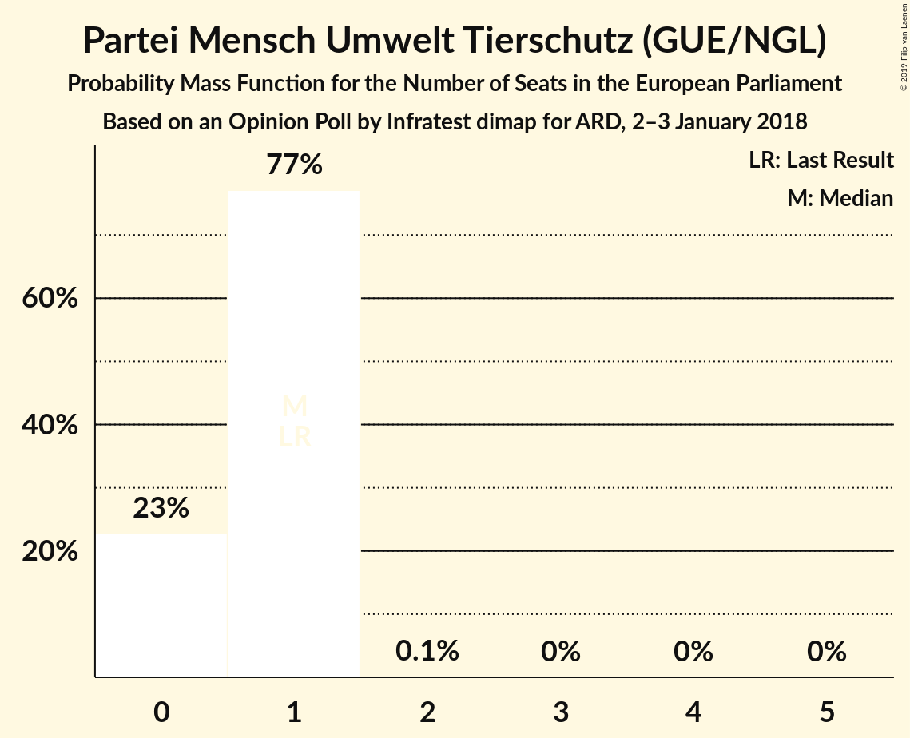
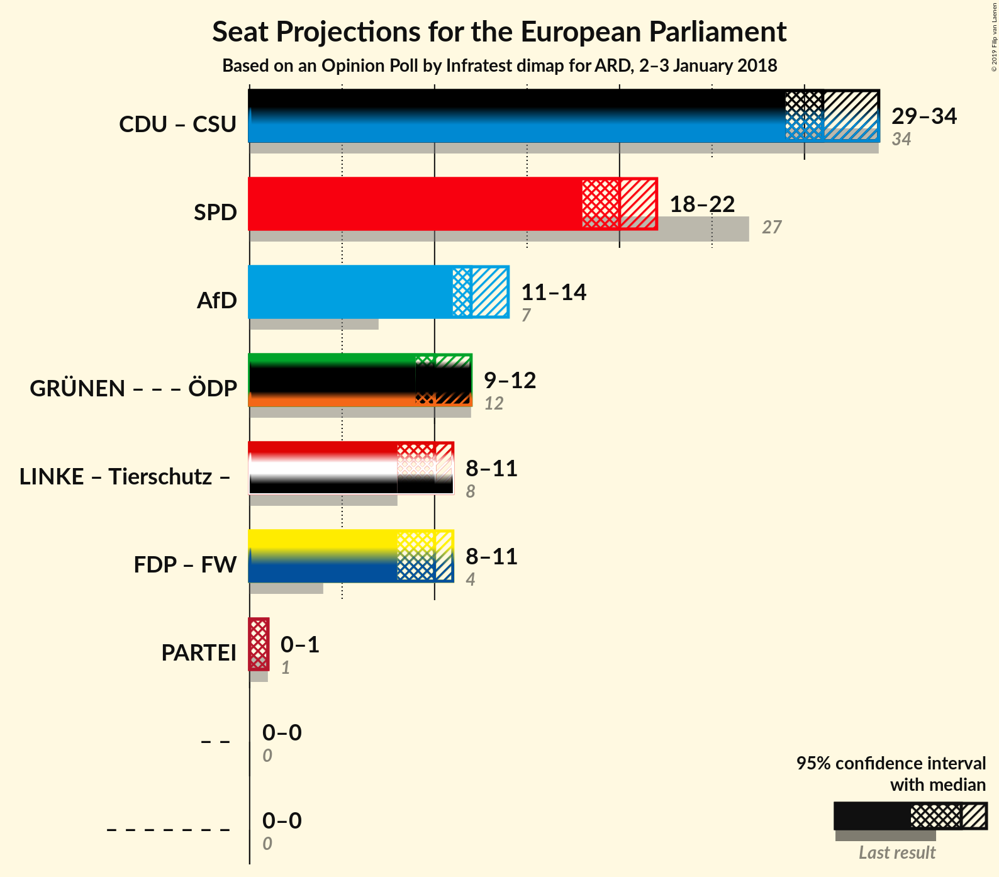

# Opinion Poll by Infratest dimap for ARD, 2–3 January 2018

<a href="#voting-intentions">Voting Intentions</a> | <a href="#seats">Seats</a> | <a href="#coalitions">Coalitions</a> | <a href="#technical-information">Technical Information</a>

## Voting Intentions

### Confidence Intervals

| Party | Last Result | Poll Result | 80% Confidence Interval | 90% Confidence Interval | 95% Confidence Interval | 99% Confidence Interval |
|:-----:|:-----------:|:-----------:|:-----------------------:|:-----------------------:|:-----------------------:|:-----------------------:|
| CDU (EPP) | 30.0% | 28.0% | 26.6–29.6% |26.2–30.0% |25.8–30.3% |25.1–31.1% |
| SPD (S&D) | 27.3% | 21.0% | 19.7–22.4% |19.3–22.8% |19.0–23.1% |18.4–23.8% |
| Alternative für Deutschland (EFDD) | 7.0% | 13.0% | 11.9–14.2% |11.7–14.5% |11.4–14.8% |10.9–15.4% |
| BÜNDNIS 90/DIE GRÜNEN (Greens/EFA) | 10.7% | 11.0% | 10.0–12.1% |9.8–12.4% |9.5–12.7% |9.1–13.3% |
| FDP (ALDE) | 3.4% | 9.0% | 8.1–10.0% |7.9–10.3% |7.7–10.6% |7.3–11.1% |
| DIE LINKE (GUE/NGL) | 7.4% | 9.0% | 8.1–10.0% |7.9–10.3% |7.7–10.6% |7.3–11.1% |
| CSU (EPP) | 5.3% | 5.0% | 4.3–5.8% |4.1–6.0% |4.0–6.2% |3.7–6.6% |
| FREIE WÄHLER (ALDE) | 1.5% | 0.8% | 0.6–1.2% |0.5–1.3% |0.5–1.4% |0.4–1.6% |
| Die PARTEI (NI) | 0.6% | 0.8% | 0.6–1.2% |0.5–1.3% |0.5–1.4% |0.4–1.6% |
| Partei Mensch Umwelt Tierschutz (GUE/NGL) | 1.2% | 0.7% | 0.5–1.0% |0.4–1.1% |0.4–1.2% |0.3–1.4% |

*Note:* The poll result column reflects the actual value used in the calculations. Published results may vary slightly, and in addition be rounded to fewer digits.

## Seats

### Confidence Intervals

| Party | Last Result | Median | 80% Confidence Interval | 90% Confidence Interval | 95% Confidence Interval | 99% Confidence Interval |
|:-----:|:-----------:|:------:|:-----------------------:|:-----------------------:|:-----------------------:|:-----------------------:|
| <a href="#cdu-(epp)">CDU (EPP)</a> | 29 | 27 | 26–28 |25–28 |25–29 |24–30 |
| <a href="#spd-(s&d)">SPD (S&D)</a> | 27 | 20 | 19–21 |19–21 |18–22 |18–23 |
| <a href="#alternative-für-deutschland-(efdd)">Alternative für Deutschland (EFDD)</a> | 7 | 12 | 12–13 |11–14 |11–14 |10–14 |
| <a href="#bündnis-90/die-grünen-(greens/efa)">BÜNDNIS 90/DIE GRÜNEN (Greens/EFA)</a> | 11 | 10 | 10–11 |10–12 |9–12 |9–13 |
| <a href="#fdp-(alde)">FDP (ALDE)</a> | 3 | 9 | 8–10 |8–10 |7–10 |7–10 |
| <a href="#die-linke-(gue/ngl)">DIE LINKE (GUE/NGL)</a> | 7 | 9 | 8–9 |8–10 |8–10 |7–10 |
| <a href="#csu-(epp)">CSU (EPP)</a> | 5 | 5 | 4–5 |4–6 |4–6 |4–6 |
| <a href="#freie-wähler-(alde)">FREIE WÄHLER (ALDE)</a> | 1 | 1 | 1 |0–1 |0–1 |0–1 |
| <a href="#die-partei-(ni)">Die PARTEI (NI)</a> | 1 | 1 | 1 |1 |0–1 |0–1 |
| <a href="#partei-mensch-umwelt-tierschutz-(gue/ngl)">Partei Mensch Umwelt Tierschutz (GUE/NGL)</a> | 1 | 1 | 0–1 |0–1 |0–1 |0–1 |

### CDU (EPP)

*For a full overview of the results for this party, see the [CDU (EPP)](party-cduepp.html) page.*

| Number of Seats | Probability | Accumulated | Special Marks |
|:---------------:|:-----------:|:-----------:|:-------------:|
| 23 | 0.2% | 100% |  |
| 24 | 2% | 99.8% |  |
| 25 | 4% | 98% |  |
| 26 | 26% | 94% |  |
| 27 | 57% | 68% | Median |
| 28 | 8% | 11% |  |
| 29 | 2% | 3% | Last Result |
| 30 | 0.7% | 0.7% |  |
| 31 | 0% | 0% |  |

### SPD (S&D)

*For a full overview of the results for this party, see the [SPD (S&D)](party-spdsd.html) page.*

| Number of Seats | Probability | Accumulated | Special Marks |
|:---------------:|:-----------:|:-----------:|:-------------:|
| 17 | 0.5% | 100% |  |
| 18 | 3% | 99.5% |  |
| 19 | 15% | 96% |  |
| 20 | 56% | 81% | Median |
| 21 | 20% | 25% |  |
| 22 | 3% | 4% |  |
| 23 | 0.8% | 0.8% |  |
| 24 | 0% | 0% |  |
| 25 | 0% | 0% |  |
| 26 | 0% | 0% |  |
| 27 | 0% | 0% | Last Result |

### Alternative für Deutschland (EFDD)

*For a full overview of the results for this party, see the [Alternative für Deutschland (EFDD)](party-alternativefürdeutschlandefdd.html) page.*

| Number of Seats | Probability | Accumulated | Special Marks |
|:---------------:|:-----------:|:-----------:|:-------------:|
| 7 | 0% | 100% | Last Result |
| 8 | 0% | 100% |  |
| 9 | 0% | 100% |  |
| 10 | 0.7% | 100% |  |
| 11 | 5% | 99.3% |  |
| 12 | 48% | 94% | Median |
| 13 | 37% | 46% |  |
| 14 | 9% | 9% |  |
| 15 | 0.4% | 0.4% |  |
| 16 | 0% | 0% |  |

### BÜNDNIS 90/DIE GRÜNEN (Greens/EFA)

*For a full overview of the results for this party, see the [BÜNDNIS 90/DIE GRÜNEN (Greens/EFA)](party-bündnis90diegrünengreensefa.html) page.*

| Number of Seats | Probability | Accumulated | Special Marks |
|:---------------:|:-----------:|:-----------:|:-------------:|
| 8 | 0.1% | 100% |  |
| 9 | 5% | 99.9% |  |
| 10 | 60% | 95% | Median |
| 11 | 28% | 35% | Last Result |
| 12 | 7% | 7% |  |
| 13 | 0.5% | 0.5% |  |
| 14 | 0% | 0% |  |

### FDP (ALDE)

*For a full overview of the results for this party, see the [FDP (ALDE)](party-fdpalde.html) page.*

| Number of Seats | Probability | Accumulated | Special Marks |
|:---------------:|:-----------:|:-----------:|:-------------:|
| 3 | 0% | 100% | Last Result |
| 4 | 0% | 100% |  |
| 5 | 0% | 100% |  |
| 6 | 0.1% | 100% |  |
| 7 | 3% | 99.9% |  |
| 8 | 43% | 97% |  |
| 9 | 43% | 53% | Median |
| 10 | 10% | 10% |  |
| 11 | 0.3% | 0.3% |  |
| 12 | 0% | 0% |  |

### DIE LINKE (GUE/NGL)

*For a full overview of the results for this party, see the [DIE LINKE (GUE/NGL)](party-dielinkeguengl.html) page.*

| Number of Seats | Probability | Accumulated | Special Marks |
|:---------------:|:-----------:|:-----------:|:-------------:|
| 6 | 0.1% | 100% |  |
| 7 | 2% | 99.9% | Last Result |
| 8 | 35% | 98% |  |
| 9 | 55% | 63% | Median |
| 10 | 8% | 8% |  |
| 11 | 0.3% | 0.3% |  |
| 12 | 0% | 0% |  |

### CSU (EPP)

*For a full overview of the results for this party, see the [CSU (EPP)](party-csuepp.html) page.*

| Number of Seats | Probability | Accumulated | Special Marks |
|:---------------:|:-----------:|:-----------:|:-------------:|
| 3 | 0.2% | 100% |  |
| 4 | 31% | 99.8% |  |
| 5 | 63% | 68% | Last Result, Median |
| 6 | 6% | 6% |  |
| 7 | 0.2% | 0.2% |  |
| 8 | 0% | 0% |  |

### FREIE WÄHLER (ALDE)

*For a full overview of the results for this party, see the [FREIE WÄHLER (ALDE)](party-freiewähleralde.html) page.*

| Number of Seats | Probability | Accumulated | Special Marks |
|:---------------:|:-----------:|:-----------:|:-------------:|
| 0 | 5% | 100% |  |
| 1 | 94% | 95% | Last Result, Median |
| 2 | 0.2% | 0.2% |  |
| 3 | 0% | 0% |  |

### Die PARTEI (NI)

*For a full overview of the results for this party, see the [Die PARTEI (NI)](party-dieparteini.html) page.*

| Number of Seats | Probability | Accumulated | Special Marks |
|:---------------:|:-----------:|:-----------:|:-------------:|
| 0 | 3% | 100% |  |
| 1 | 97% | 97% | Last Result, Median |
| 2 | 0.4% | 0.4% |  |
| 3 | 0% | 0% |  |

### Partei Mensch Umwelt Tierschutz (GUE/NGL)

*For a full overview of the results for this party, see the [Partei Mensch Umwelt Tierschutz (GUE/NGL)](party-parteimenschumwelttierschutzguengl.html) page.*

| Number of Seats | Probability | Accumulated | Special Marks |
|:---------------:|:-----------:|:-----------:|:-------------:|
| 0 | 23% | 100% |  |
| 1 | 77% | 77% | Last Result, Median |
| 2 | 0.1% | 0.1% |  |
| 3 | 0% | 0% |  |

## Coalitions

### Confidence Intervals

| Coalition | Last Result | Median | Majority? | 80% Confidence Interval | 90% Confidence Interval | 95% Confidence Interval | 99% Confidence Interval |
|:---------:|:-----------:|:------:|:---------:|:-----------------------:|:-----------------------:|:-----------------------:|:-----------------------:|
| CDU (EPP) – CSU (EPP) | 34 | 31 | 0% | 31–33 | 30–33 | 29–34 | 28–34 |
| SPD (S&D) | 27 | 20 | 0% | 19–21 | 19–21 | 18–22 | 18–23 |
| Alternative für Deutschland (EFDD) | 7 | 12 | 0% | 12–13 | 11–14 | 11–14 | 10–14 |
| FDP (ALDE) – FREIE WÄHLER (ALDE) | 4 | 10 | 0% | 9–10 | 9–11 | 8–11 | 8–11 |
| Die PARTEI (NI) | 1 | 1 | 0% | 1 | 1 | 0–1 | 0–1 |

### CDU (EPP) – CSU (EPP)

| Number of Seats | Probability | Accumulated | Special Marks |
|:---------------:|:-----------:|:-----------:|:-------------:|
| 27 | 0.1% | 100% |  |
| 28 | 0.5% | 99.9% |  |
| 29 | 3% | 99.5% |  |
| 30 | 5% | 97% |  |
| 31 | 46% | 92% |  |
| 32 | 36% | 46% | Median |
| 33 | 7% | 10% |  |
| 34 | 3% | 3% | Last Result |
| 35 | 0.3% | 0.4% |  |
| 36 | 0.1% | 0.1% |  |
| 37 | 0% | 0% |  |

### SPD (S&D)

| Number of Seats | Probability | Accumulated | Special Marks |
|:---------------:|:-----------:|:-----------:|:-------------:|
| 17 | 0.5% | 100% |  |
| 18 | 3% | 99.5% |  |
| 19 | 15% | 96% |  |
| 20 | 56% | 81% | Median |
| 21 | 20% | 25% |  |
| 22 | 3% | 4% |  |
| 23 | 0.8% | 0.8% |  |
| 24 | 0% | 0% |  |
| 25 | 0% | 0% |  |
| 26 | 0% | 0% |  |
| 27 | 0% | 0% | Last Result |

### Alternative für Deutschland (EFDD)

| Number of Seats | Probability | Accumulated | Special Marks |
|:---------------:|:-----------:|:-----------:|:-------------:|
| 7 | 0% | 100% | Last Result |
| 8 | 0% | 100% |  |
| 9 | 0% | 100% |  |
| 10 | 0.7% | 100% |  |
| 11 | 5% | 99.3% |  |
| 12 | 48% | 94% | Median |
| 13 | 37% | 46% |  |
| 14 | 9% | 9% |  |
| 15 | 0.4% | 0.4% |  |
| 16 | 0% | 0% |  |

### FDP (ALDE) – FREIE WÄHLER (ALDE)

| Number of Seats | Probability | Accumulated | Special Marks |
|:---------------:|:-----------:|:-----------:|:-------------:|
| 4 | 0% | 100% | Last Result |
| 5 | 0% | 100% |  |
| 6 | 0% | 100% |  |
| 7 | 0.4% | 100% |  |
| 8 | 4% | 99.6% |  |
| 9 | 45% | 96% |  |
| 10 | 41% | 50% | Median |
| 11 | 9% | 9% |  |
| 12 | 0.3% | 0.3% |  |
| 13 | 0% | 0% |  |

### Die PARTEI (NI)

| Number of Seats | Probability | Accumulated | Special Marks |
|:---------------:|:-----------:|:-----------:|:-------------:|
| 0 | 3% | 100% |  |
| 1 | 97% | 97% | Last Result, Median |
| 2 | 0.4% | 0.4% |  |
| 3 | 0% | 0% |  |

## Technical Information

### Opinion Poll

+ **Polling firm:** Infratest dimap
+ **Commissioner(s):** ARD
+ **Fieldwork period:** 2–3 January 2018

### Calculations

+ **Sample size:** 1506
+ **Simulations done:** 1,048,576
+ **Error estimate:** 0.96%

