# Opinion Poll by Forsa for Stern and RTL, 2–5 January 2018

<a href="#voting-intentions">Voting Intentions</a> | <a href="#seats">Seats</a> | <a href="#coalitions">Coalitions</a> | <a href="#technical-information">Technical Information</a>

## Voting Intentions

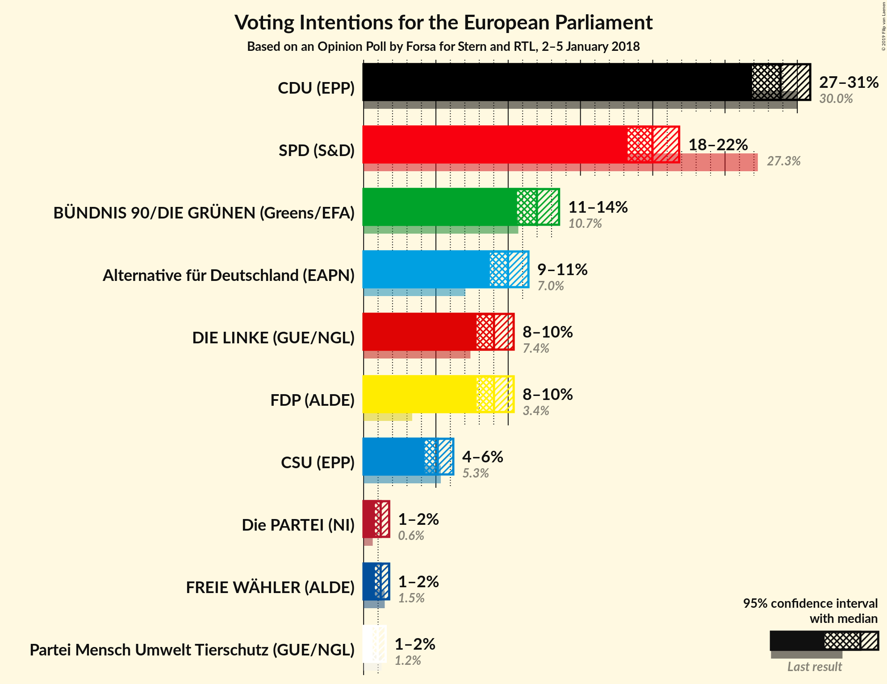

### Confidence Intervals

| Party | Last Result | Poll Result | 80% Confidence Interval | 90% Confidence Interval | 95% Confidence Interval | 99% Confidence Interval |
|:-----:|:-----------:|:-----------:|:-----------------------:|:-----------------------:|:-----------------------:|:-----------------------:|
| CDU (EPP) | 30.0% | 28.8% | 27.5–30.2% |27.2–30.6% |26.9–30.9% |26.3–31.6% |
| SPD (S&D) | 27.3% | 20.0% | 18.9–21.2% |18.5–21.5% |18.3–21.8% |17.7–22.4% |
| BÜNDNIS 90/DIE GRÜNEN (Greens/EFA) | 10.7% | 12.0% | 11.1–13.0% |10.8–13.3% |10.6–13.5% |10.2–14.0% |
| Alternative für Deutschland (EAPN) | 7.0% | 10.0% | 9.2–10.9% |8.9–11.2% |8.7–11.4% |8.4–11.9% |
| FDP (ALDE) | 3.4% | 9.0% | 8.2–9.9% |8.0–10.2% |7.8–10.4% |7.5–10.8% |
| DIE LINKE (GUE/NGL) | 7.4% | 9.0% | 8.2–9.9% |8.0–10.2% |7.8–10.4% |7.5–10.8% |
| CSU (EPP) | 5.3% | 5.1% | 4.5–5.8% |4.4–6.0% |4.2–6.2% |4.0–6.6% |
| FREIE WÄHLER (ALDE) | 1.5% | 1.2% | 0.9–1.6% |0.8–1.7% |0.8–1.8% |0.7–2.0% |
| Die PARTEI (NI) | 0.6% | 1.2% | 0.9–1.6% |0.8–1.7% |0.8–1.8% |0.7–2.0% |
| Partei Mensch Umwelt Tierschutz (GUE/NGL) | 1.2% | 1.0% | 0.7–1.3% |0.7–1.4% |0.6–1.5% |0.5–1.7% |

*Note:* The poll result column reflects the actual value used in the calculations. Published results may vary slightly, and in addition be rounded to fewer digits.

## Seats

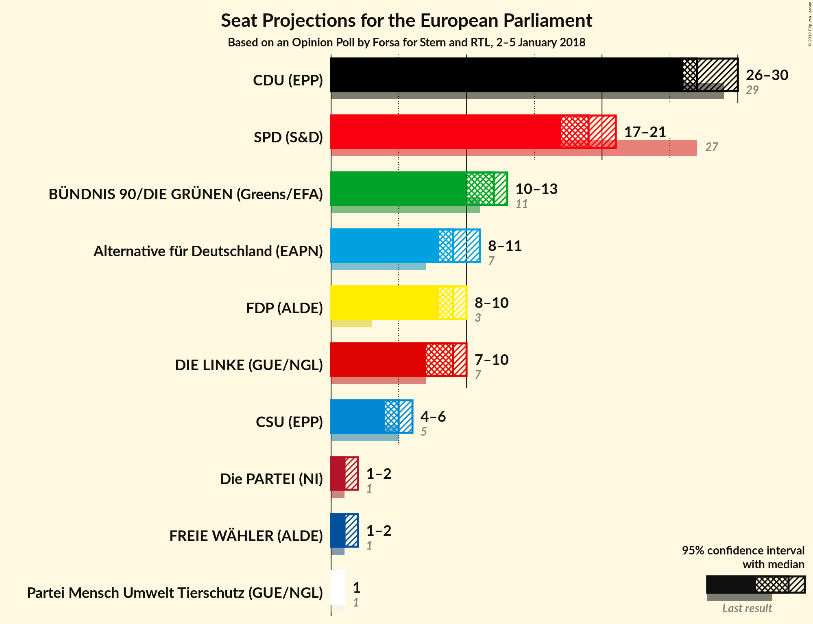

### Confidence Intervals

| Party | Last Result | Median | 80% Confidence Interval | 90% Confidence Interval | 95% Confidence Interval | 99% Confidence Interval |
|:-----:|:-----------:|:------:|:-----------------------:|:-----------------------:|:-----------------------:|:-----------------------:|
| <a href="#cdu-(epp)">CDU (EPP)</a> | 29 | 27 | 26–29 |26–29 |26–30 |25–30 |
| <a href="#spd-(s&d)">SPD (S&D)</a> | 27 | 19 | 18–20 |18–20 |17–21 |17–21 |
| <a href="#bündnis-90/die-grünen-(greens/efa)">BÜNDNIS 90/DIE GRÜNEN (Greens/EFA)</a> | 11 | 12 | 11–13 |10–13 |10–13 |10–13 |
| <a href="#alternative-für-deutschland-(eapn)">Alternative für Deutschland (EAPN)</a> | 7 | 9 | 9–10 |8–11 |8–11 |8–11 |
| <a href="#fdp-(alde)">FDP (ALDE)</a> | 3 | 9 | 8–10 |8–10 |8–10 |7–11 |
| <a href="#die-linke-(gue/ngl)">DIE LINKE (GUE/NGL)</a> | 7 | 9 | 8–10 |8–10 |7–10 |7–10 |
| <a href="#csu-(epp)">CSU (EPP)</a> | 5 | 5 | 4–6 |4–6 |4–6 |4–6 |
| <a href="#freie-wähler-(alde)">FREIE WÄHLER (ALDE)</a> | 1 | 1 | 1–2 |1–2 |1–2 |1–2 |
| <a href="#die-partei-(ni)">Die PARTEI (NI)</a> | 1 | 1 | 1 |1–2 |1–2 |1–2 |
| <a href="#partei-mensch-umwelt-tierschutz-(gue/ngl)">Partei Mensch Umwelt Tierschutz (GUE/NGL)</a> | 1 | 1 | 1 |1 |1 |0–2 |

### CDU (EPP)

*For a full overview of the results for this party, see the [CDU (EPP)](party-cduepp.html) page.*

| Number of Seats | Probability | Accumulated | Special Marks |
|:---------------:|:-----------:|:-----------:|:-------------:|
| 24 | 0.1% | 100% |  |
| 25 | 0.7% | 99.9% |  |
| 26 | 14% | 99.3% |  |
| 27 | 44% | 86% | Median |
| 28 | 22% | 42% |  |
| 29 | 17% | 20% | Last Result |
| 30 | 2% | 3% |  |
| 31 | 0.2% | 0.2% |  |
| 32 | 0% | 0% |  |

### SPD (S&D)

*For a full overview of the results for this party, see the [SPD (S&D)](party-spdsd.html) page.*

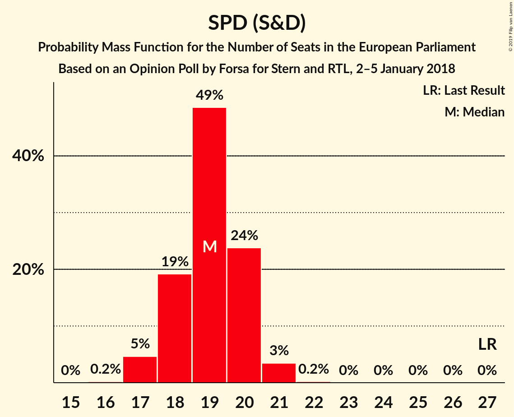

| Number of Seats | Probability | Accumulated | Special Marks |
|:---------------:|:-----------:|:-----------:|:-------------:|
| 16 | 0.2% | 100% |  |
| 17 | 5% | 99.8% |  |
| 18 | 19% | 95% |  |
| 19 | 49% | 76% | Median |
| 20 | 24% | 27% |  |
| 21 | 3% | 4% |  |
| 22 | 0.2% | 0.2% |  |
| 23 | 0% | 0% |  |
| 24 | 0% | 0% |  |
| 25 | 0% | 0% |  |
| 26 | 0% | 0% |  |
| 27 | 0% | 0% | Last Result |

### BÜNDNIS 90/DIE GRÜNEN (Greens/EFA)

*For a full overview of the results for this party, see the [BÜNDNIS 90/DIE GRÜNEN (Greens/EFA)](party-bündnis90diegrünengreensefa.html) page.*

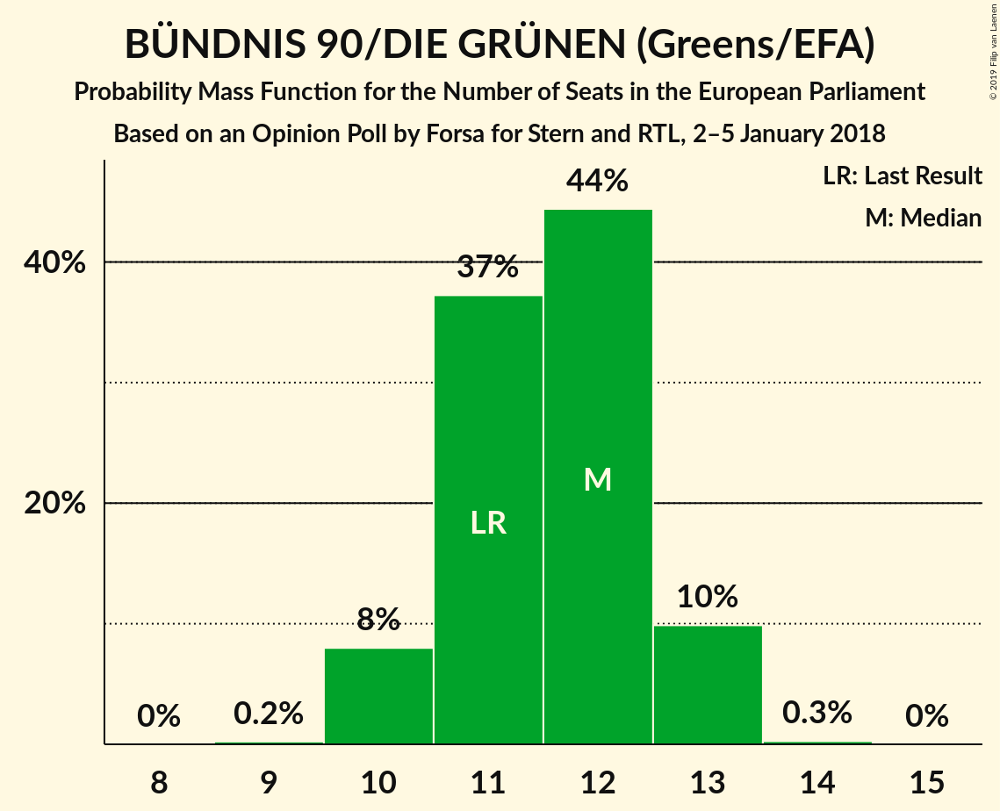

| Number of Seats | Probability | Accumulated | Special Marks |
|:---------------:|:-----------:|:-----------:|:-------------:|
| 9 | 0.2% | 100% |  |
| 10 | 8% | 99.8% |  |
| 11 | 37% | 92% | Last Result |
| 12 | 44% | 55% | Median |
| 13 | 10% | 10% |  |
| 14 | 0.3% | 0.3% |  |
| 15 | 0% | 0% |  |

### Alternative für Deutschland (EAPN)

*For a full overview of the results for this party, see the [Alternative für Deutschland (EAPN)](party-alternativefürdeutschlandeapn.html) page.*

| Number of Seats | Probability | Accumulated | Special Marks |
|:---------------:|:-----------:|:-----------:|:-------------:|
| 7 | 0% | 100% | Last Result |
| 8 | 6% | 100% |  |
| 9 | 44% | 94% | Median |
| 10 | 41% | 50% |  |
| 11 | 9% | 9% |  |
| 12 | 0.3% | 0.3% |  |
| 13 | 0% | 0% |  |

### FDP (ALDE)

*For a full overview of the results for this party, see the [FDP (ALDE)](party-fdpalde.html) page.*

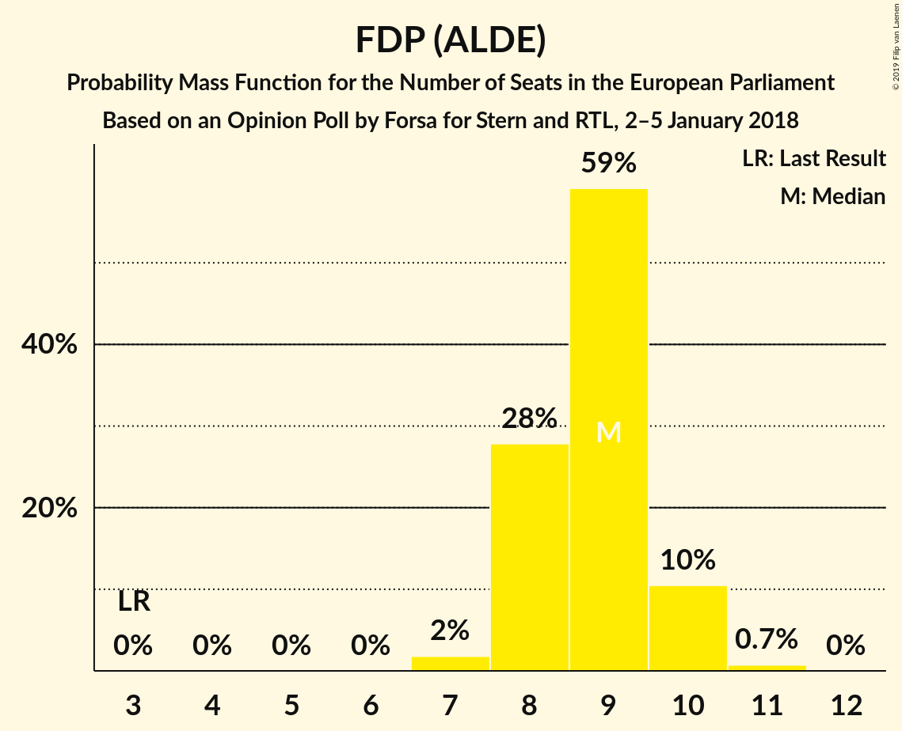

| Number of Seats | Probability | Accumulated | Special Marks |
|:---------------:|:-----------:|:-----------:|:-------------:|
| 3 | 0% | 100% | Last Result |
| 4 | 0% | 100% |  |
| 5 | 0% | 100% |  |
| 6 | 0% | 100% |  |
| 7 | 2% | 100% |  |
| 8 | 28% | 98% |  |
| 9 | 59% | 70% | Median |
| 10 | 10% | 11% |  |
| 11 | 0.7% | 0.7% |  |
| 12 | 0% | 0% |  |

### DIE LINKE (GUE/NGL)

*For a full overview of the results for this party, see the [DIE LINKE (GUE/NGL)](party-dielinkeguengl.html) page.*

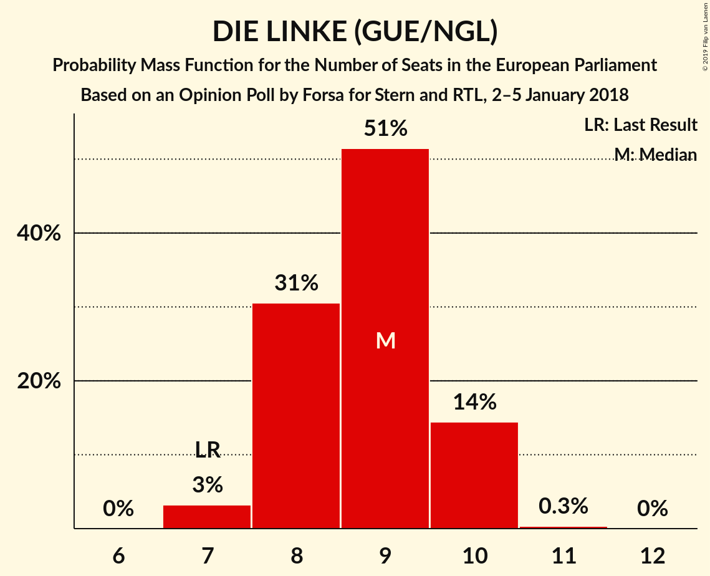

| Number of Seats | Probability | Accumulated | Special Marks |
|:---------------:|:-----------:|:-----------:|:-------------:|
| 7 | 3% | 100% | Last Result |
| 8 | 31% | 97% |  |
| 9 | 51% | 66% | Median |
| 10 | 14% | 15% |  |
| 11 | 0.3% | 0.3% |  |
| 12 | 0% | 0% |  |

### CSU (EPP)

*For a full overview of the results for this party, see the [CSU (EPP)](party-csuepp.html) page.*

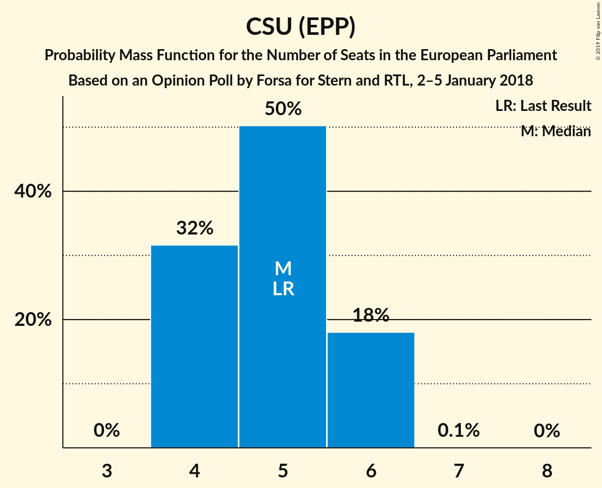

| Number of Seats | Probability | Accumulated | Special Marks |
|:---------------:|:-----------:|:-----------:|:-------------:|
| 4 | 32% | 100% |  |
| 5 | 50% | 68% | Last Result, Median |
| 6 | 18% | 18% |  |
| 7 | 0.1% | 0.1% |  |
| 8 | 0% | 0% |  |

### FREIE WÄHLER (ALDE)

*For a full overview of the results for this party, see the [FREIE WÄHLER (ALDE)](party-freiewähleralde.html) page.*

| Number of Seats | Probability | Accumulated | Special Marks |
|:---------------:|:-----------:|:-----------:|:-------------:|
| 1 | 89% | 100% | Last Result, Median |
| 2 | 11% | 11% |  |
| 3 | 0% | 0% |  |

### Die PARTEI (NI)

*For a full overview of the results for this party, see the [Die PARTEI (NI)](party-dieparteini.html) page.*

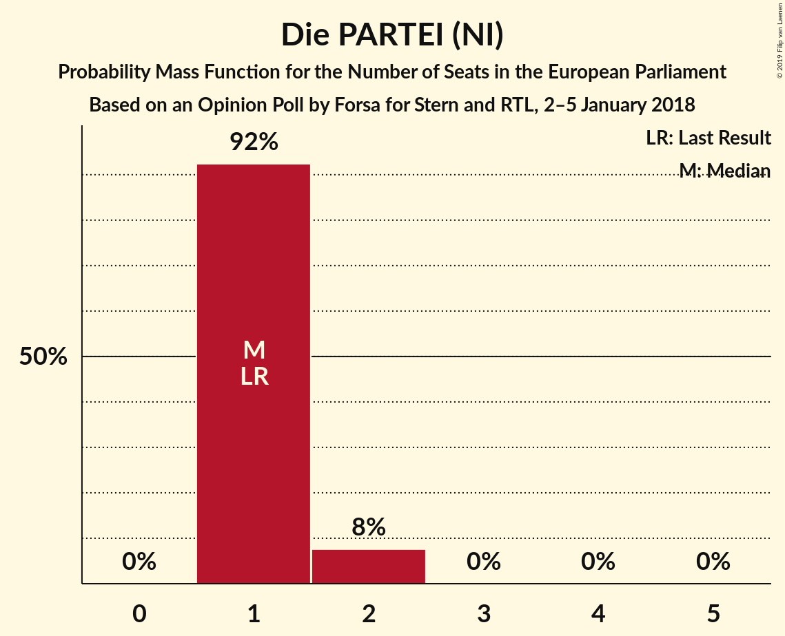

| Number of Seats | Probability | Accumulated | Special Marks |
|:---------------:|:-----------:|:-----------:|:-------------:|
| 1 | 92% | 100% | Last Result, Median |
| 2 | 8% | 8% |  |
| 3 | 0% | 0% |  |

### Partei Mensch Umwelt Tierschutz (GUE/NGL)

*For a full overview of the results for this party, see the [Partei Mensch Umwelt Tierschutz (GUE/NGL)](party-parteimenschumwelttierschutzguengl.html) page.*

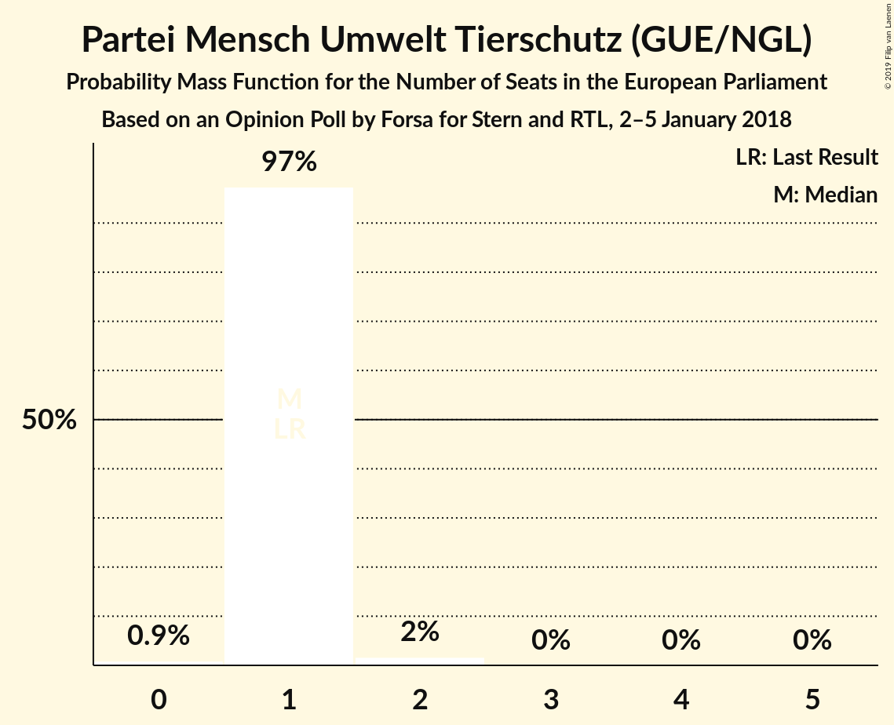

| Number of Seats | Probability | Accumulated | Special Marks |
|:---------------:|:-----------:|:-----------:|:-------------:|
| 0 | 0.9% | 100% |  |
| 1 | 97% | 99.1% | Last Result, Median |
| 2 | 2% | 2% |  |
| 3 | 0% | 0% |  |

## Coalitions

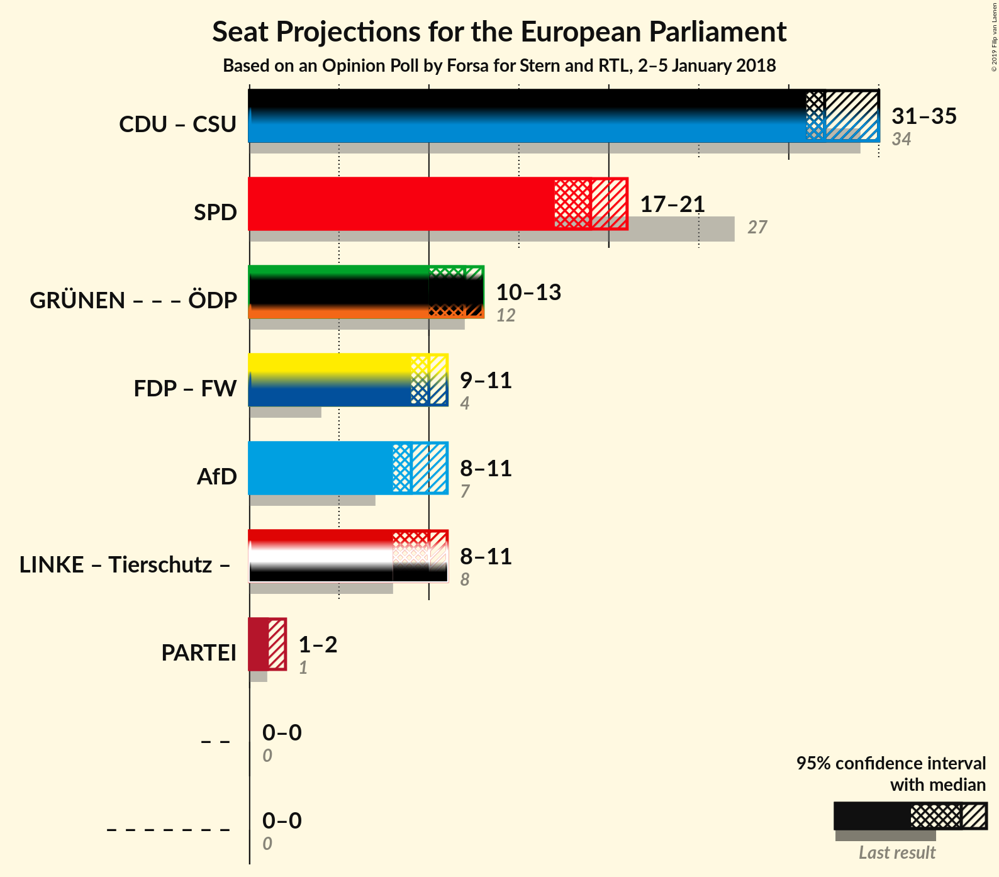

### Confidence Intervals

| Coalition | Last Result | Median | Majority? | 80% Confidence Interval | 90% Confidence Interval | 95% Confidence Interval | 99% Confidence Interval |
|:---------:|:-----------:|:------:|:---------:|:-----------------------:|:-----------------------:|:-----------------------:|:-----------------------:|
| CDU (EPP) – CSU (EPP) | 34 | 32 | 0% | 31–34 | 31–34 | 31–35 | 30–35 |
| SPD (S&D) | 27 | 19 | 0% | 18–20 | 18–20 | 17–21 | 17–21 |
| FDP (ALDE) – FREIE WÄHLER (ALDE) | 4 | 10 | 0% | 9–11 | 9–11 | 9–11 | 8–12 |
| Alternative für Deutschland (EAPN) | 7 | 9 | 0% | 9–10 | 8–11 | 8–11 | 8–11 |
| Die PARTEI (NI) | 1 | 1 | 0% | 1 | 1–2 | 1–2 | 1–2 |

### CDU (EPP) – CSU (EPP)

| Number of Seats | Probability | Accumulated | Special Marks |
|:---------------:|:-----------:|:-----------:|:-------------:|
| 29 | 0.2% | 100% |  |
| 30 | 0.7% | 99.8% |  |
| 31 | 34% | 99.1% |  |
| 32 | 24% | 65% | Median |
| 33 | 14% | 41% |  |
| 34 | 23% | 27% | Last Result |
| 35 | 4% | 4% |  |
| 36 | 0.3% | 0.3% |  |
| 37 | 0% | 0% |  |

### SPD (S&D)

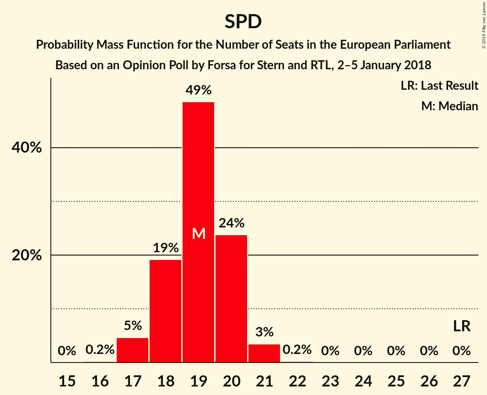

| Number of Seats | Probability | Accumulated | Special Marks |
|:---------------:|:-----------:|:-----------:|:-------------:|
| 16 | 0.2% | 100% |  |
| 17 | 5% | 99.8% |  |
| 18 | 19% | 95% |  |
| 19 | 49% | 76% | Median |
| 20 | 24% | 27% |  |
| 21 | 3% | 4% |  |
| 22 | 0.2% | 0.2% |  |
| 23 | 0% | 0% |  |
| 24 | 0% | 0% |  |
| 25 | 0% | 0% |  |
| 26 | 0% | 0% |  |
| 27 | 0% | 0% | Last Result |

### FDP (ALDE) – FREIE WÄHLER (ALDE)

| Number of Seats | Probability | Accumulated | Special Marks |
|:---------------:|:-----------:|:-----------:|:-------------:|
| 4 | 0% | 100% | Last Result |
| 5 | 0% | 100% |  |
| 6 | 0% | 100% |  |
| 7 | 0% | 100% |  |
| 8 | 1.5% | 100% |  |
| 9 | 24% | 98.5% |  |
| 10 | 57% | 74% | Median |
| 11 | 16% | 17% |  |
| 12 | 1.3% | 1.4% |  |
| 13 | 0% | 0% |  |

### Alternative für Deutschland (EAPN)

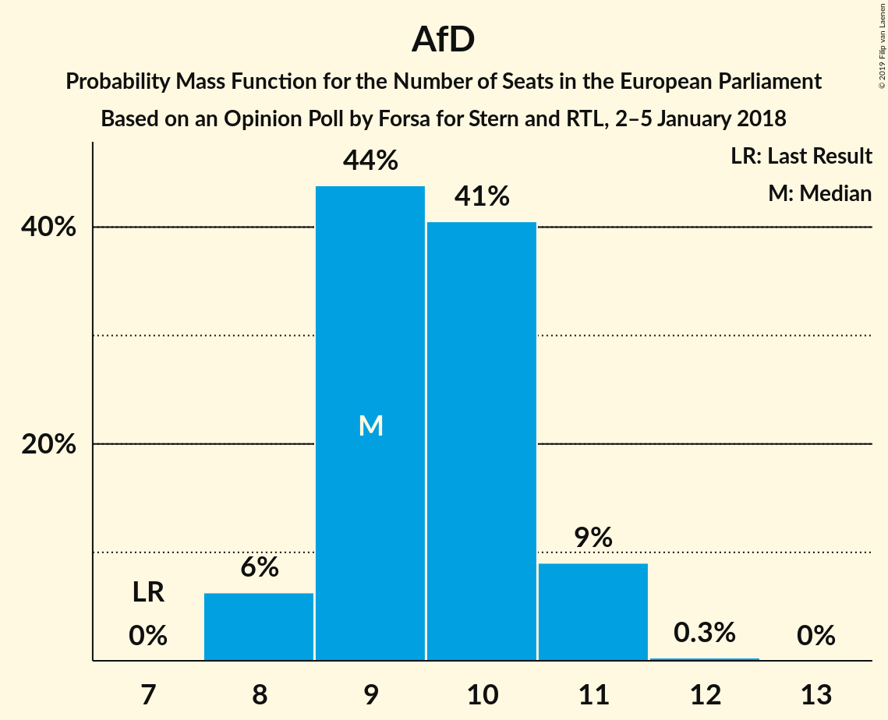

| Number of Seats | Probability | Accumulated | Special Marks |
|:---------------:|:-----------:|:-----------:|:-------------:|
| 7 | 0% | 100% | Last Result |
| 8 | 6% | 100% |  |
| 9 | 44% | 94% | Median |
| 10 | 41% | 50% |  |
| 11 | 9% | 9% |  |
| 12 | 0.3% | 0.3% |  |
| 13 | 0% | 0% |  |

### Die PARTEI (NI)

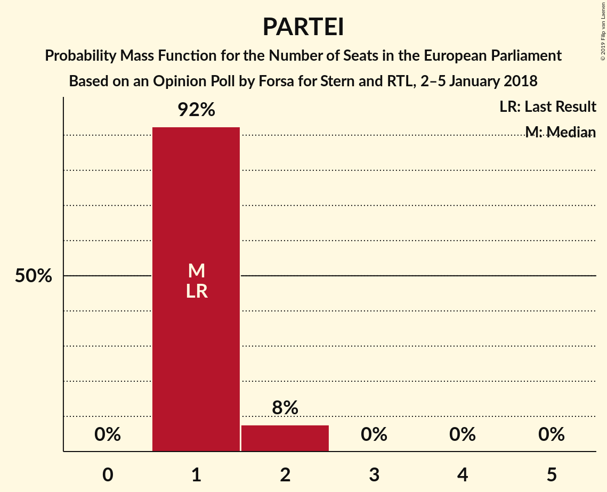

| Number of Seats | Probability | Accumulated | Special Marks |
|:---------------:|:-----------:|:-----------:|:-------------:|
| 1 | 92% | 100% | Last Result, Median |
| 2 | 8% | 8% |  |
| 3 | 0% | 0% |  |

## Technical Information

### Opinion Poll

+ **Polling firm:** Forsa
+ **Commissioner(s):** Stern and RTL
+ **Fieldwork period:** 2–5 January 2018

### Calculations

+ **Sample size:** 1952
+ **Simulations done:** 1,048,576
+ **Error estimate:** 1.37%

