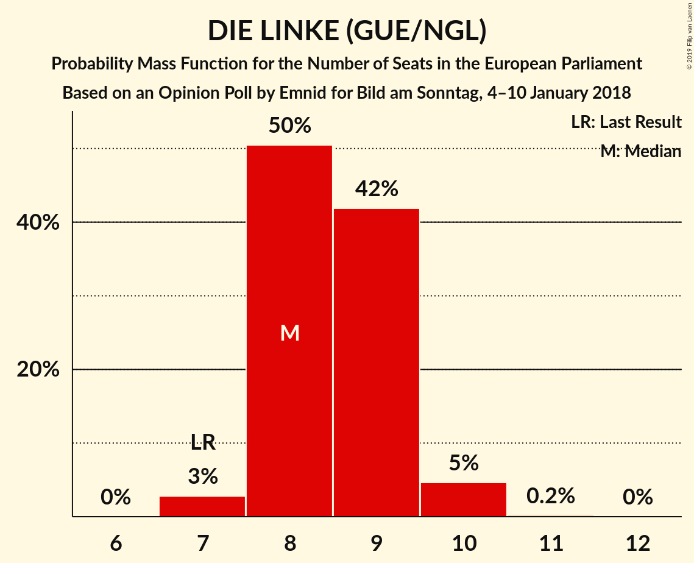
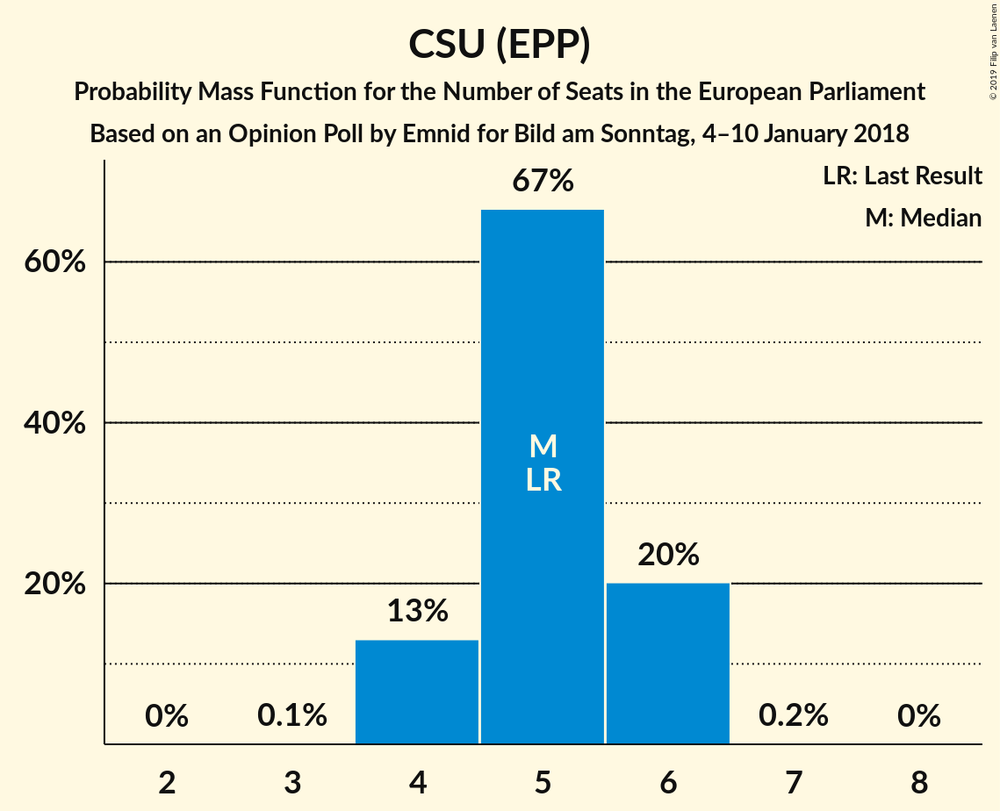
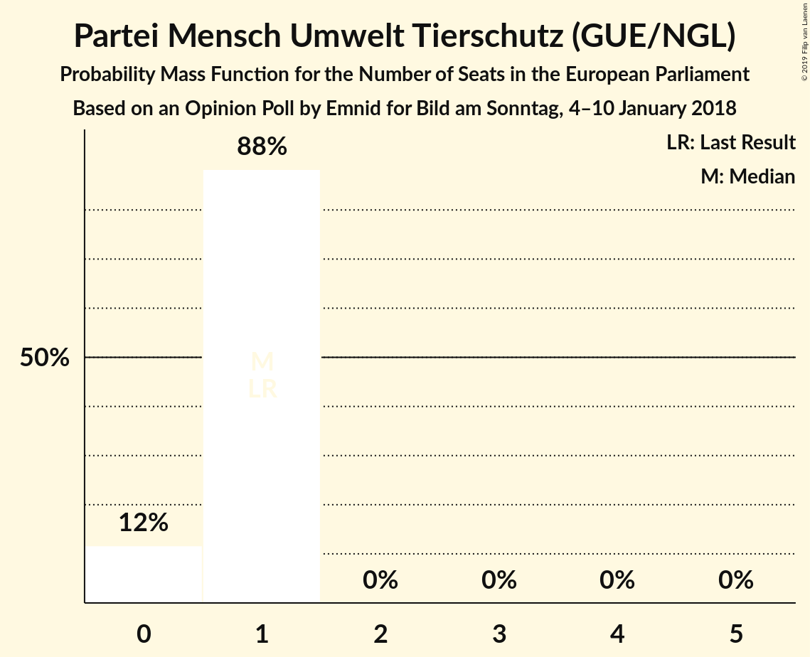
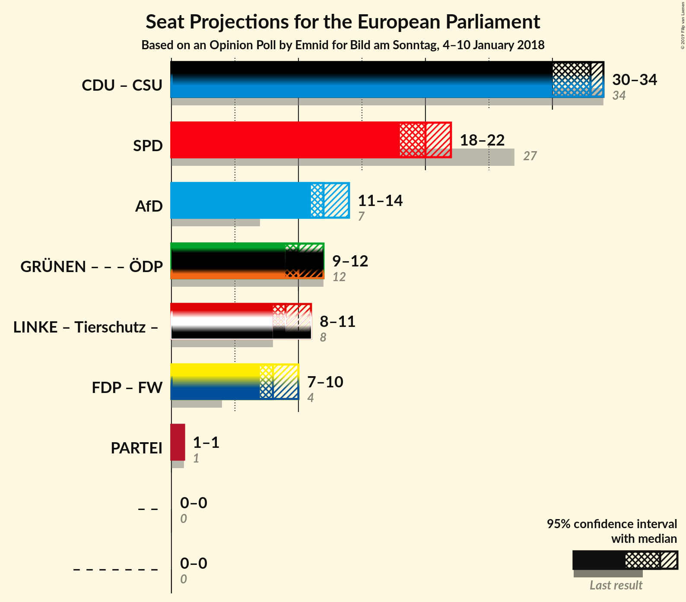

# Opinion Poll by Emnid for Bild am Sonntag, 4–10 January 2018

<a href="#voting-intentions">Voting Intentions</a> | <a href="#seats">Seats</a> | <a href="#coalitions">Coalitions</a> | <a href="#technical-information">Technical Information</a>

## Voting Intentions

### Confidence Intervals

| Party | Last Result | Poll Result | 80% Confidence Interval | 90% Confidence Interval | 95% Confidence Interval | 99% Confidence Interval |
|:-----:|:-----------:|:-----------:|:-----------------------:|:-----------------------:|:-----------------------:|:-----------------------:|
| CDU (EPP) | 30.0% | 28.9% | 27.5–30.2% |27.2–30.6% |26.9–30.9% |26.2–31.6% |
| SPD (S&D) | 27.3% | 21.0% | 19.8–22.3% |19.5–22.6% |19.2–22.9% |18.7–23.5% |
| Alternative für Deutschland (EFDD) | 7.0% | 13.0% | 12.1–14.1% |11.8–14.3% |11.6–14.6% |11.1–15.1% |
| BÜNDNIS 90/DIE GRÜNEN (Greens/EFA) | 10.7% | 11.0% | 10.1–12.0% |9.9–12.3% |9.7–12.5% |9.3–13.0% |
| DIE LINKE (GUE/NGL) | 7.4% | 9.0% | 8.2–9.9% |8.0–10.2% |7.8–10.4% |7.4–10.8% |
| FDP (ALDE) | 3.4% | 8.0% | 7.3–8.9% |7.0–9.1% |6.9–9.3% |6.5–9.7% |
| CSU (EPP) | 5.3% | 5.2% | 4.6–5.9% |4.4–6.1% |4.3–6.3% |4.0–6.6% |
| FREIE WÄHLER (ALDE) | 1.5% | 0.8% | 0.6–1.1% |0.5–1.2% |0.5–1.3% |0.4–1.5% |
| Die PARTEI (NI) | 0.6% | 0.8% | 0.6–1.1% |0.5–1.2% |0.5–1.3% |0.4–1.5% |
| Partei Mensch Umwelt Tierschutz (GUE/NGL) | 1.2% | 0.6% | 0.4–0.9% |0.4–1.0% |0.4–1.1% |0.3–1.3% |

*Note:* The poll result column reflects the actual value used in the calculations. Published results may vary slightly, and in addition be rounded to fewer digits.

## Seats

### Confidence Intervals

| Party | Last Result | Median | 80% Confidence Interval | 90% Confidence Interval | 95% Confidence Interval | 99% Confidence Interval |
|:-----:|:-----------:|:------:|:-----------------------:|:-----------------------:|:-----------------------:|:-----------------------:|
| <a href="#cdu-(epp)">CDU (EPP)</a> | 29 | 28 | 26–29 |26–29 |26–30 |25–30 |
| <a href="#spd-(s&d)">SPD (S&D)</a> | 27 | 19 | 19–20 |19–21 |19–21 |18–23 |
| <a href="#alternative-für-deutschland-(efdd)">Alternative für Deutschland (EFDD)</a> | 7 | 13 | 12–13 |12–14 |11–14 |11–14 |
| <a href="#bündnis-90/die-grünen-(greens/efa)">BÜNDNIS 90/DIE GRÜNEN (Greens/EFA)</a> | 11 | 10 | 10–11 |10–12 |9–12 |9–13 |
| <a href="#die-linke-(gue/ngl)">DIE LINKE (GUE/NGL)</a> | 7 | 9 | 8–9 |8–9 |8–9 |7–10 |
| <a href="#fdp-(alde)">FDP (ALDE)</a> | 3 | 7 | 7–8 |7–9 |7–9 |6–9 |
| <a href="#csu-(epp)">CSU (EPP)</a> | 5 | 5 | 5 |4–5 |4–6 |4–6 |
| <a href="#freie-wähler-(alde)">FREIE WÄHLER (ALDE)</a> | 1 | 1 | 1 |1 |1 |0–1 |
| <a href="#die-partei-(ni)">Die PARTEI (NI)</a> | 1 | 1 | 1 |1 |1 |0–1 |
| <a href="#partei-mensch-umwelt-tierschutz-(gue/ngl)">Partei Mensch Umwelt Tierschutz (GUE/NGL)</a> | 1 | 1 | 1 |0–1 |0–1 |0–1 |

### CDU (EPP)

*For a full overview of the results for this party, see the [CDU (EPP)](party-cduepp.html) page.*

| Number of Seats | Probability | Accumulated | Special Marks |
|:---------------:|:-----------:|:-----------:|:-------------:|
| 25 | 1.2% | 100% |  |
| 26 | 10% | 98.8% |  |
| 27 | 10% | 89% |  |
| 28 | 50% | 79% | Median |
| 29 | 26% | 29% | Last Result |
| 30 | 3% | 3% |  |
| 31 | 0.1% | 0.1% |  |
| 32 | 0% | 0% |  |

### SPD (S&D)

*For a full overview of the results for this party, see the [SPD (S&D)](party-spdsd.html) page.*

| Number of Seats | Probability | Accumulated | Special Marks |
|:---------------:|:-----------:|:-----------:|:-------------:|
| 18 | 0.7% | 100% |  |
| 19 | 55% | 99.2% | Median |
| 20 | 36% | 44% |  |
| 21 | 7% | 8% |  |
| 22 | 0.4% | 1.3% |  |
| 23 | 0.8% | 1.0% |  |
| 24 | 0.1% | 0.1% |  |
| 25 | 0% | 0% |  |
| 26 | 0% | 0% |  |
| 27 | 0% | 0% | Last Result |

### Alternative für Deutschland (EFDD)

*For a full overview of the results for this party, see the [Alternative für Deutschland (EFDD)](party-alternativefürdeutschlandefdd.html) page.*

| Number of Seats | Probability | Accumulated | Special Marks |
|:---------------:|:-----------:|:-----------:|:-------------:|
| 7 | 0% | 100% | Last Result |
| 8 | 0% | 100% |  |
| 9 | 0% | 100% |  |
| 10 | 0.1% | 100% |  |
| 11 | 4% | 99.9% |  |
| 12 | 37% | 95% |  |
| 13 | 53% | 59% | Median |
| 14 | 6% | 6% |  |
| 15 | 0.1% | 0.1% |  |
| 16 | 0% | 0% |  |

### BÜNDNIS 90/DIE GRÜNEN (Greens/EFA)

*For a full overview of the results for this party, see the [BÜNDNIS 90/DIE GRÜNEN (Greens/EFA)](party-bündnis90diegrünengreensefa.html) page.*

| Number of Seats | Probability | Accumulated | Special Marks |
|:---------------:|:-----------:|:-----------:|:-------------:|
| 9 | 5% | 100% |  |
| 10 | 78% | 95% | Median |
| 11 | 11% | 17% | Last Result |
| 12 | 5% | 6% |  |
| 13 | 1.1% | 1.1% |  |
| 14 | 0% | 0% |  |

### DIE LINKE (GUE/NGL)

*For a full overview of the results for this party, see the [DIE LINKE (GUE/NGL)](party-dielinkeguengl.html) page.*

| Number of Seats | Probability | Accumulated | Special Marks |
|:---------------:|:-----------:|:-----------:|:-------------:|
| 7 | 0.6% | 100% | Last Result |
| 8 | 33% | 99.4% |  |
| 9 | 65% | 66% | Median |
| 10 | 0.8% | 0.9% |  |
| 11 | 0.1% | 0.1% |  |
| 12 | 0% | 0% |  |

### FDP (ALDE)

*For a full overview of the results for this party, see the [FDP (ALDE)](party-fdpalde.html) page.*

| Number of Seats | Probability | Accumulated | Special Marks |
|:---------------:|:-----------:|:-----------:|:-------------:|
| 3 | 0% | 100% | Last Result |
| 4 | 0% | 100% |  |
| 5 | 0% | 100% |  |
| 6 | 1.3% | 100% |  |
| 7 | 80% | 98.7% | Median |
| 8 | 10% | 19% |  |
| 9 | 9% | 9% |  |
| 10 | 0% | 0% |  |

### CSU (EPP)

*For a full overview of the results for this party, see the [CSU (EPP)](party-csuepp.html) page.*

| Number of Seats | Probability | Accumulated | Special Marks |
|:---------------:|:-----------:|:-----------:|:-------------:|
| 3 | 0.1% | 100% |  |
| 4 | 6% | 99.9% |  |
| 5 | 89% | 94% | Last Result, Median |
| 6 | 5% | 5% |  |
| 7 | 0% | 0% |  |

### FREIE WÄHLER (ALDE)

*For a full overview of the results for this party, see the [FREIE WÄHLER (ALDE)](party-freiewähleralde.html) page.*

| Number of Seats | Probability | Accumulated | Special Marks |
|:---------------:|:-----------:|:-----------:|:-------------:|
| 0 | 0.9% | 100% |  |
| 1 | 99.0% | 99.1% | Last Result, Median |
| 2 | 0.1% | 0.1% |  |
| 3 | 0% | 0% |  |

### Die PARTEI (NI)

*For a full overview of the results for this party, see the [Die PARTEI (NI)](party-dieparteini.html) page.*

| Number of Seats | Probability | Accumulated | Special Marks |
|:---------------:|:-----------:|:-----------:|:-------------:|
| 0 | 2% | 100% |  |
| 1 | 98% | 98% | Last Result, Median |
| 2 | 0% | 0% |  |

### Partei Mensch Umwelt Tierschutz (GUE/NGL)

*For a full overview of the results for this party, see the [Partei Mensch Umwelt Tierschutz (GUE/NGL)](party-parteimenschumwelttierschutzguengl.html) page.*

| Number of Seats | Probability | Accumulated | Special Marks |
|:---------------:|:-----------:|:-----------:|:-------------:|
| 0 | 10% | 100% |  |
| 1 | 90% | 90% | Last Result, Median |
| 2 | 0.1% | 0.1% |  |
| 3 | 0% | 0% |  |

## Coalitions

### Confidence Intervals

| Coalition | Last Result | Median | Majority? | 80% Confidence Interval | 90% Confidence Interval | 95% Confidence Interval | 99% Confidence Interval |
|:---------:|:-----------:|:------:|:---------:|:-----------------------:|:-----------------------:|:-----------------------:|:-----------------------:|
| CDU (EPP) – CSU (EPP) | 34 | 33 | 0% | 31–34 | 31–34 | 31–34 | 30–35 |
| SPD (S&D) | 27 | 19 | 0% | 19–20 | 19–21 | 19–21 | 18–23 |
| Alternative für Deutschland (EFDD) | 7 | 13 | 0% | 12–13 | 12–14 | 11–14 | 11–14 |
| FDP (ALDE) – FREIE WÄHLER (ALDE) | 4 | 8 | 0% | 8–9 | 8–10 | 8–10 | 7–10 |
| Die PARTEI (NI) | 1 | 1 | 0% | 1 | 1 | 1 | 0–1 |

### CDU (EPP) – CSU (EPP)

| Number of Seats | Probability | Accumulated | Special Marks |
|:---------------:|:-----------:|:-----------:|:-------------:|
| 30 | 1.1% | 100% |  |
| 31 | 14% | 98.9% |  |
| 32 | 4% | 85% |  |
| 33 | 52% | 81% | Median |
| 34 | 29% | 30% | Last Result |
| 35 | 1.0% | 1.0% |  |
| 36 | 0% | 0% |  |

### SPD (S&D)

| Number of Seats | Probability | Accumulated | Special Marks |
|:---------------:|:-----------:|:-----------:|:-------------:|
| 18 | 0.7% | 100% |  |
| 19 | 55% | 99.2% | Median |
| 20 | 36% | 44% |  |
| 21 | 7% | 8% |  |
| 22 | 0.4% | 1.3% |  |
| 23 | 0.8% | 1.0% |  |
| 24 | 0.1% | 0.1% |  |
| 25 | 0% | 0% |  |
| 26 | 0% | 0% |  |
| 27 | 0% | 0% | Last Result |

### Alternative für Deutschland (EFDD)

| Number of Seats | Probability | Accumulated | Special Marks |
|:---------------:|:-----------:|:-----------:|:-------------:|
| 7 | 0% | 100% | Last Result |
| 8 | 0% | 100% |  |
| 9 | 0% | 100% |  |
| 10 | 0.1% | 100% |  |
| 11 | 4% | 99.9% |  |
| 12 | 37% | 95% |  |
| 13 | 53% | 59% | Median |
| 14 | 6% | 6% |  |
| 15 | 0.1% | 0.1% |  |
| 16 | 0% | 0% |  |

### FDP (ALDE) – FREIE WÄHLER (ALDE)

| Number of Seats | Probability | Accumulated | Special Marks |
|:---------------:|:-----------:|:-----------:|:-------------:|
| 4 | 0% | 100% | Last Result |
| 5 | 0% | 100% |  |
| 6 | 0% | 100% |  |
| 7 | 2% | 100% |  |
| 8 | 80% | 98% | Median |
| 9 | 10% | 18% |  |
| 10 | 8% | 8% |  |
| 11 | 0% | 0% |  |

### Die PARTEI (NI)

| Number of Seats | Probability | Accumulated | Special Marks |
|:---------------:|:-----------:|:-----------:|:-------------:|
| 0 | 2% | 100% |  |
| 1 | 98% | 98% | Last Result, Median |
| 2 | 0% | 0% |  |

## Technical Information

### Opinion Poll

+ **Polling firm:** Emnid
+ **Commissioner(s):** Bild am Sonntag
+ **Fieldwork period:** 4–10 January 2018

### Calculations

+ **Sample size:** 1899
+ **Simulations done:** 131,072
+ **Error estimate:** 1.71%

