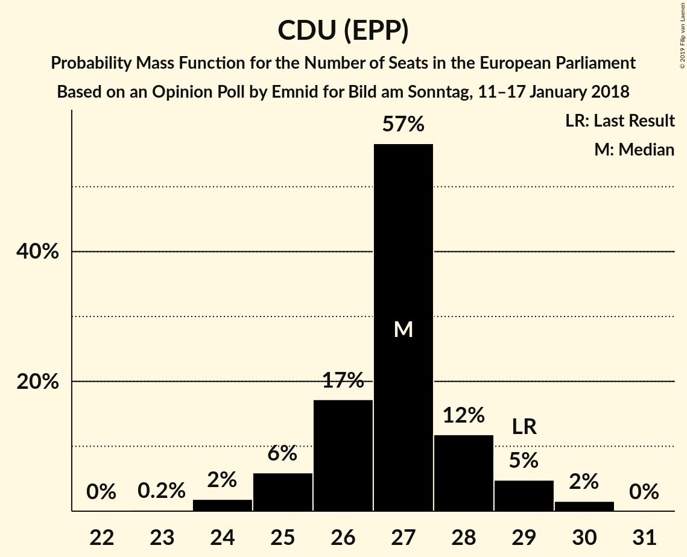
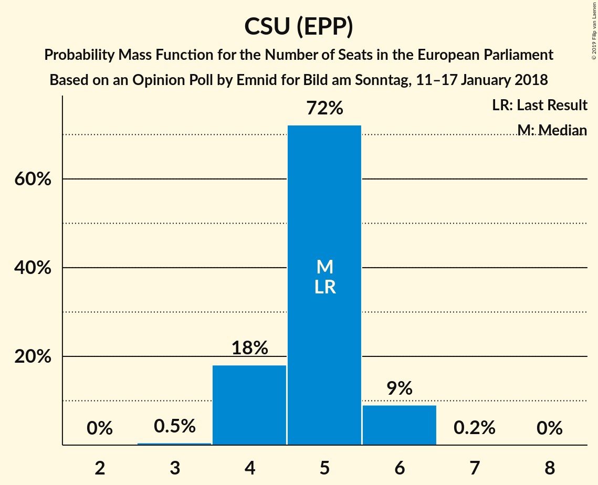

# Opinion Poll by Emnid for Bild am Sonntag, 11–17 January 2018

<a href="#voting-intentions">Voting Intentions</a> | <a href="#seats">Seats</a> | <a href="#coalitions">Coalitions</a> | <a href="#technical-information">Technical Information</a>

## Voting Intentions

### Confidence Intervals

| Party | Last Result | Poll Result | 80% Confidence Interval | 90% Confidence Interval | 95% Confidence Interval | 99% Confidence Interval |
|:-----:|:-----------:|:-----------:|:-----------------------:|:-----------------------:|:-----------------------:|:-----------------------:|
| CDU (EPP) | 30.0% | 28.0% | 26.6–29.6% |26.1–30.1% |25.8–30.5% |25.1–31.2% |
| SPD (S&D) | 27.3% | 21.0% | 19.7–22.4% |19.3–22.8% |19.0–23.2% |18.3–23.9% |
| Alternative für Deutschland (EAPN) | 7.0% | 13.0% | 11.9–14.2% |11.6–14.5% |11.3–14.8% |10.8–15.4% |
| DIE LINKE (GUE/NGL) | 7.4% | 10.0% | 9.1–11.1% |8.8–11.4% |8.6–11.7% |8.1–12.2% |
| BÜNDNIS 90/DIE GRÜNEN (Greens/EFA) | 10.7% | 10.0% | 9.1–11.1% |8.8–11.4% |8.6–11.7% |8.1–12.2% |
| FDP (ALDE) | 3.4% | 8.0% | 7.2–9.0% |6.9–9.3% |6.7–9.6% |6.3–10.1% |
| CSU (EPP) | 5.3% | 5.0% | 4.3–5.8% |4.1–6.1% |4.0–6.3% |3.7–6.7% |
| FREIE WÄHLER (ALDE) | 1.5% | 1.0% | 0.7–1.4% |0.6–1.5% |0.6–1.7% |0.5–1.9% |
| Die PARTEI (NI) | 0.6% | 1.0% | 0.7–1.4% |0.6–1.5% |0.6–1.7% |0.5–1.9% |
| Partei Mensch Umwelt Tierschutz (GUE/NGL) | 1.2% | 0.8% | 0.5–1.2% |0.5–1.3% |0.4–1.4% |0.3–1.6% |

*Note:* The poll result column reflects the actual value used in the calculations. Published results may vary slightly, and in addition be rounded to fewer digits.

## Seats

### Confidence Intervals

| Party | Last Result | Median | 80% Confidence Interval | 90% Confidence Interval | 95% Confidence Interval | 99% Confidence Interval |
|:-----:|:-----------:|:------:|:-----------------------:|:-----------------------:|:-----------------------:|:-----------------------:|
| <a href="#cdu-(epp)">CDU (EPP)</a> | 29 | 27 | 26–28 |25–29 |25–29 |24–30 |
| <a href="#spd-(s&d)">SPD (S&D)</a> | 27 | 20 | 19–21 |18–22 |18–22 |17–23 |
| <a href="#alternative-für-deutschland-(eapn)">Alternative für Deutschland (EAPN)</a> | 7 | 12 | 11–13 |11–14 |11–14 |10–15 |
| <a href="#die-linke-(gue/ngl)">DIE LINKE (GUE/NGL)</a> | 7 | 10 | 9–10 |8–11 |8–11 |8–12 |
| <a href="#bündnis-90/die-grünen-(greens/efa)">BÜNDNIS 90/DIE GRÜNEN (Greens/EFA)</a> | 11 | 10 | 9–10 |8–11 |8–11 |8–12 |
| <a href="#fdp-(alde)">FDP (ALDE)</a> | 3 | 7 | 7–9 |7–9 |6–9 |6–10 |
| <a href="#csu-(epp)">CSU (EPP)</a> | 5 | 5 | 4–5 |4–6 |4–6 |3–6 |
| <a href="#freie-wähler-(alde)">FREIE WÄHLER (ALDE)</a> | 1 | 1 | 1 |1 |1–2 |0–2 |
| <a href="#die-partei-(ni)">Die PARTEI (NI)</a> | 1 | 1 | 1 |1 |1–2 |0–2 |
| <a href="#partei-mensch-umwelt-tierschutz-(gue/ngl)">Partei Mensch Umwelt Tierschutz (GUE/NGL)</a> | 1 | 1 | 1 |0–1 |0–1 |0–2 |

### CDU (EPP)

*For a full overview of the results for this party, see the [CDU (EPP)](party-cduepp.html) page.*

| Number of Seats | Probability | Accumulated | Special Marks |
|:---------------:|:-----------:|:-----------:|:-------------:|
| 23 | 0.2% | 100% |  |
| 24 | 2% | 99.8% |  |
| 25 | 6% | 98% |  |
| 26 | 17% | 92% |  |
| 27 | 57% | 75% | Median |
| 28 | 12% | 18% |  |
| 29 | 5% | 6% | Last Result |
| 30 | 2% | 2% |  |
| 31 | 0% | 0% |  |

### SPD (S&D)

*For a full overview of the results for this party, see the [SPD (S&D)](party-spdsd.html) page.*

| Number of Seats | Probability | Accumulated | Special Marks |
|:---------------:|:-----------:|:-----------:|:-------------:|
| 17 | 0.6% | 100% |  |
| 18 | 6% | 99.4% |  |
| 19 | 29% | 94% |  |
| 20 | 44% | 65% | Median |
| 21 | 14% | 21% |  |
| 22 | 6% | 7% |  |
| 23 | 0.6% | 0.6% |  |
| 24 | 0.1% | 0.1% |  |
| 25 | 0% | 0% |  |
| 26 | 0% | 0% |  |
| 27 | 0% | 0% | Last Result |

### Alternative für Deutschland (EAPN)

*For a full overview of the results for this party, see the [Alternative für Deutschland (EAPN)](party-alternativefürdeutschlandeapn.html) page.*

| Number of Seats | Probability | Accumulated | Special Marks |
|:---------------:|:-----------:|:-----------:|:-------------:|
| 7 | 0% | 100% | Last Result |
| 8 | 0% | 100% |  |
| 9 | 0% | 100% |  |
| 10 | 1.2% | 100% |  |
| 11 | 9% | 98.8% |  |
| 12 | 63% | 89% | Median |
| 13 | 19% | 26% |  |
| 14 | 6% | 7% |  |
| 15 | 0.7% | 0.7% |  |
| 16 | 0% | 0% |  |

### DIE LINKE (GUE/NGL)

*For a full overview of the results for this party, see the [DIE LINKE (GUE/NGL)](party-dielinkeguengl.html) page.*

| Number of Seats | Probability | Accumulated | Special Marks |
|:---------------:|:-----------:|:-----------:|:-------------:|
| 7 | 0.1% | 100% | Last Result |
| 8 | 6% | 99.9% |  |
| 9 | 24% | 94% |  |
| 10 | 63% | 70% | Median |
| 11 | 7% | 7% |  |
| 12 | 0.5% | 0.5% |  |
| 13 | 0% | 0% |  |

### BÜNDNIS 90/DIE GRÜNEN (Greens/EFA)

*For a full overview of the results for this party, see the [BÜNDNIS 90/DIE GRÜNEN (Greens/EFA)](party-bündnis90diegrünengreensefa.html) page.*

| Number of Seats | Probability | Accumulated | Special Marks |
|:---------------:|:-----------:|:-----------:|:-------------:|
| 7 | 0.1% | 100% |  |
| 8 | 6% | 99.9% |  |
| 9 | 22% | 94% |  |
| 10 | 67% | 72% | Median |
| 11 | 5% | 6% | Last Result |
| 12 | 0.5% | 0.5% |  |
| 13 | 0% | 0% |  |

### FDP (ALDE)

*For a full overview of the results for this party, see the [FDP (ALDE)](party-fdpalde.html) page.*

| Number of Seats | Probability | Accumulated | Special Marks |
|:---------------:|:-----------:|:-----------:|:-------------:|
| 3 | 0% | 100% | Last Result |
| 4 | 0% | 100% |  |
| 5 | 0% | 100% |  |
| 6 | 3% | 100% |  |
| 7 | 50% | 97% | Median |
| 8 | 36% | 46% |  |
| 9 | 9% | 10% |  |
| 10 | 1.2% | 1.2% |  |
| 11 | 0% | 0% |  |

### CSU (EPP)

*For a full overview of the results for this party, see the [CSU (EPP)](party-csuepp.html) page.*

| Number of Seats | Probability | Accumulated | Special Marks |
|:---------------:|:-----------:|:-----------:|:-------------:|
| 3 | 0.5% | 100% |  |
| 4 | 18% | 99.5% |  |
| 5 | 72% | 81% | Last Result, Median |
| 6 | 9% | 9% |  |
| 7 | 0.2% | 0.2% |  |
| 8 | 0% | 0% |  |

### FREIE WÄHLER (ALDE)

*For a full overview of the results for this party, see the [FREIE WÄHLER (ALDE)](party-freiewähleralde.html) page.*

| Number of Seats | Probability | Accumulated | Special Marks |
|:---------------:|:-----------:|:-----------:|:-------------:|
| 0 | 0.9% | 100% |  |
| 1 | 96% | 99.1% | Last Result, Median |
| 2 | 3% | 3% |  |
| 3 | 0% | 0% |  |

### Die PARTEI (NI)

*For a full overview of the results for this party, see the [Die PARTEI (NI)](party-dieparteini.html) page.*

| Number of Seats | Probability | Accumulated | Special Marks |
|:---------------:|:-----------:|:-----------:|:-------------:|
| 0 | 0.6% | 100% |  |
| 1 | 95% | 99.4% | Last Result, Median |
| 2 | 5% | 5% |  |
| 3 | 0% | 0% |  |

### Partei Mensch Umwelt Tierschutz (GUE/NGL)

*For a full overview of the results for this party, see the [Partei Mensch Umwelt Tierschutz (GUE/NGL)](party-parteimenschumwelttierschutzguengl.html) page.*

| Number of Seats | Probability | Accumulated | Special Marks |
|:---------------:|:-----------:|:-----------:|:-------------:|
| 0 | 6% | 100% |  |
| 1 | 93% | 94% | Last Result, Median |
| 2 | 0.5% | 0.5% |  |
| 3 | 0% | 0% |  |

## Coalitions

### Confidence Intervals

| Coalition | Last Result | Median | Majority? | 80% Confidence Interval | 90% Confidence Interval | 95% Confidence Interval | 99% Confidence Interval |
|:---------:|:-----------:|:------:|:---------:|:-----------------------:|:-----------------------:|:-----------------------:|:-----------------------:|
| CDU (EPP) – CSU (EPP) | 34 | 32 | 0% | 30–33 | 30–34 | 29–34 | 29–35 |
| SPD (S&D) | 27 | 20 | 0% | 19–21 | 18–22 | 18–22 | 17–23 |
| Alternative für Deutschland (EAPN) | 7 | 12 | 0% | 11–13 | 11–14 | 11–14 | 10–15 |
| FDP (ALDE) – FREIE WÄHLER (ALDE) | 4 | 8 | 0% | 8–10 | 8–10 | 7–10 | 7–11 |
| Die PARTEI (NI) | 1 | 1 | 0% | 1 | 1 | 1–2 | 0–2 |

### CDU (EPP) – CSU (EPP)

| Number of Seats | Probability | Accumulated | Special Marks |
|:---------------:|:-----------:|:-----------:|:-------------:|
| 27 | 0.1% | 100% |  |
| 28 | 0.4% | 99.9% |  |
| 29 | 3% | 99.5% |  |
| 30 | 11% | 97% |  |
| 31 | 12% | 86% |  |
| 32 | 57% | 74% | Median |
| 33 | 11% | 17% |  |
| 34 | 5% | 6% | Last Result |
| 35 | 1.4% | 1.4% |  |
| 36 | 0% | 0% |  |

### SPD (S&D)

| Number of Seats | Probability | Accumulated | Special Marks |
|:---------------:|:-----------:|:-----------:|:-------------:|
| 17 | 0.6% | 100% |  |
| 18 | 6% | 99.4% |  |
| 19 | 29% | 94% |  |
| 20 | 44% | 65% | Median |
| 21 | 14% | 21% |  |
| 22 | 6% | 7% |  |
| 23 | 0.6% | 0.6% |  |
| 24 | 0.1% | 0.1% |  |
| 25 | 0% | 0% |  |
| 26 | 0% | 0% |  |
| 27 | 0% | 0% | Last Result |

### Alternative für Deutschland (EAPN)

| Number of Seats | Probability | Accumulated | Special Marks |
|:---------------:|:-----------:|:-----------:|:-------------:|
| 7 | 0% | 100% | Last Result |
| 8 | 0% | 100% |  |
| 9 | 0% | 100% |  |
| 10 | 1.2% | 100% |  |
| 11 | 9% | 98.8% |  |
| 12 | 63% | 89% | Median |
| 13 | 19% | 26% |  |
| 14 | 6% | 7% |  |
| 15 | 0.7% | 0.7% |  |
| 16 | 0% | 0% |  |

### FDP (ALDE) – FREIE WÄHLER (ALDE)

| Number of Seats | Probability | Accumulated | Special Marks |
|:---------------:|:-----------:|:-----------:|:-------------:|
| 4 | 0% | 100% | Last Result |
| 5 | 0% | 100% |  |
| 6 | 0.1% | 100% |  |
| 7 | 3% | 99.9% |  |
| 8 | 49% | 97% | Median |
| 9 | 37% | 48% |  |
| 10 | 10% | 11% |  |
| 11 | 2% | 2% |  |
| 12 | 0% | 0% |  |

### Die PARTEI (NI)

| Number of Seats | Probability | Accumulated | Special Marks |
|:---------------:|:-----------:|:-----------:|:-------------:|
| 0 | 0.6% | 100% |  |
| 1 | 95% | 99.4% | Last Result, Median |
| 2 | 5% | 5% |  |
| 3 | 0% | 0% |  |

## Technical Information

### Opinion Poll

+ **Polling firm:** Emnid
+ **Commissioner(s):** Bild am Sonntag
+ **Fieldwork period:** 11–17 January 2018

### Calculations

+ **Sample size:** 1419
+ **Simulations done:** 1,048,576
+ **Error estimate:** 1.04%

