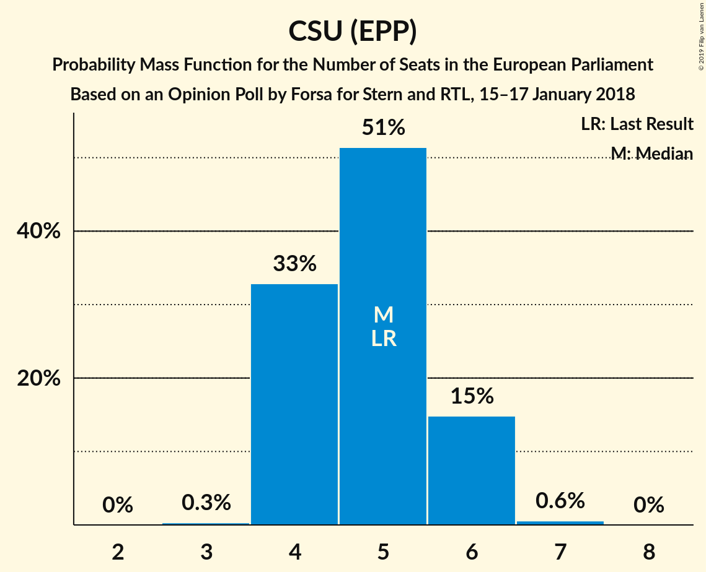

# Opinion Poll by Forsa for Stern and RTL, 15–17 January 2018

<a href="#voting-intentions">Voting Intentions</a> | <a href="#seats">Seats</a> | <a href="#coalitions">Coalitions</a> | <a href="#technical-information">Technical Information</a>

## Voting Intentions

### Confidence Intervals

| Party | Last Result | Poll Result | 80% Confidence Interval | 90% Confidence Interval | 95% Confidence Interval | 99% Confidence Interval |
|:-----:|:-----------:|:-----------:|:-----------------------:|:-----------------------:|:-----------------------:|:-----------------------:|
| CDU (EPP) | 30.0% | 28.9% | 27.4–30.4% |27.0–30.8% |26.6–31.2% |25.9–31.9% |
| SPD (S&D) | 27.3% | 18.0% | 16.8–19.3% |16.4–19.7% |16.2–20.1% |15.6–20.7% |
| Alternative für Deutschland (EFDD) | 7.0% | 12.0% | 10.9–13.1% |10.7–13.4% |10.4–13.7% |10.0–14.3% |
| BÜNDNIS 90/DIE GRÜNEN (Greens/EFA) | 10.7% | 12.0% | 10.9–13.1% |10.7–13.4% |10.4–13.7% |10.0–14.3% |
| DIE LINKE (GUE/NGL) | 7.4% | 10.0% | 9.0–11.0% |8.8–11.3% |8.6–11.6% |8.1–12.1% |
| FDP (ALDE) | 3.4% | 8.0% | 7.1–8.9% |6.9–9.2% |6.7–9.5% |6.3–10.0% |
| CSU (EPP) | 5.3% | 5.1% | 4.5–5.9% |4.3–6.2% |4.1–6.4% |3.8–6.8% |
| FREIE WÄHLER (ALDE) | 1.5% | 1.2% | 0.9–1.6% |0.8–1.8% |0.7–1.9% |0.6–2.1% |
| Die PARTEI (NI) | 0.6% | 1.2% | 0.9–1.6% |0.8–1.8% |0.7–1.9% |0.6–2.1% |
| Partei Mensch Umwelt Tierschutz (GUE/NGL) | 1.2% | 1.0% | 0.7–1.4% |0.7–1.5% |0.6–1.6% |0.5–1.9% |

*Note:* The poll result column reflects the actual value used in the calculations. Published results may vary slightly, and in addition be rounded to fewer digits.

## Seats

### Confidence Intervals

| Party | Last Result | Median | 80% Confidence Interval | 90% Confidence Interval | 95% Confidence Interval | 99% Confidence Interval |
|:-----:|:-----------:|:------:|:-----------------------:|:-----------------------:|:-----------------------:|:-----------------------:|
| <a href="#cdu-(epp)">CDU (EPP)</a> | 29 | 27 | 27–28 |26–29 |26–30 |25–31 |
| <a href="#spd-(s&d)">SPD (S&D)</a> | 27 | 16 | 16–18 |16–18 |16–18 |15–19 |
| <a href="#alternative-für-deutschland-(efdd)">Alternative für Deutschland (EFDD)</a> | 7 | 12 | 11–13 |11–13 |10–13 |10–14 |
| <a href="#bündnis-90/die-grünen-(greens/efa)">BÜNDNIS 90/DIE GRÜNEN (Greens/EFA)</a> | 11 | 12 | 11–13 |11–13 |10–13 |10–14 |
| <a href="#die-linke-(gue/ngl)">DIE LINKE (GUE/NGL)</a> | 7 | 10 | 9–10 |9–10 |8–11 |8–11 |
| <a href="#fdp-(alde)">FDP (ALDE)</a> | 3 | 8 | 7–8 |7–8 |7–8 |6–9 |
| <a href="#csu-(epp)">CSU (EPP)</a> | 5 | 5 | 4–5 |4–6 |4–6 |4–7 |
| <a href="#freie-wähler-(alde)">FREIE WÄHLER (ALDE)</a> | 1 | 1 | 1–2 |1–2 |1–2 |1–2 |
| <a href="#die-partei-(ni)">Die PARTEI (NI)</a> | 1 | 1 | 1–2 |1–2 |1–2 |1–2 |
| <a href="#partei-mensch-umwelt-tierschutz-(gue/ngl)">Partei Mensch Umwelt Tierschutz (GUE/NGL)</a> | 1 | 1 | 1 |1 |1 |1–2 |

### CDU (EPP)

*For a full overview of the results for this party, see the [CDU (EPP)](party-cduepp.html) page.*

| Number of Seats | Probability | Accumulated | Special Marks |
|:---------------:|:-----------:|:-----------:|:-------------:|
| 24 | 0.2% | 100% |  |
| 25 | 0.7% | 99.8% |  |
| 26 | 9% | 99.1% |  |
| 27 | 45% | 90% | Median |
| 28 | 39% | 45% |  |
| 29 | 2% | 6% | Last Result |
| 30 | 2% | 4% |  |
| 31 | 2% | 2% |  |
| 32 | 0.1% | 0.1% |  |
| 33 | 0% | 0% |  |

### SPD (S&D)

*For a full overview of the results for this party, see the [SPD (S&D)](party-spdsd.html) page.*

| Number of Seats | Probability | Accumulated | Special Marks |
|:---------------:|:-----------:|:-----------:|:-------------:|
| 14 | 0.1% | 100% |  |
| 15 | 1.5% | 99.9% |  |
| 16 | 50% | 98% | Median |
| 17 | 32% | 49% |  |
| 18 | 15% | 17% |  |
| 19 | 2% | 2% |  |
| 20 | 0.4% | 0.4% |  |
| 21 | 0% | 0% |  |
| 22 | 0% | 0% |  |
| 23 | 0% | 0% |  |
| 24 | 0% | 0% |  |
| 25 | 0% | 0% |  |
| 26 | 0% | 0% |  |
| 27 | 0% | 0% | Last Result |

### Alternative für Deutschland (EFDD)

*For a full overview of the results for this party, see the [Alternative für Deutschland (EFDD)](party-alternativefürdeutschlandefdd.html) page.*

| Number of Seats | Probability | Accumulated | Special Marks |
|:---------------:|:-----------:|:-----------:|:-------------:|
| 7 | 0% | 100% | Last Result |
| 8 | 0% | 100% |  |
| 9 | 0.5% | 100% |  |
| 10 | 4% | 99.5% |  |
| 11 | 13% | 96% |  |
| 12 | 41% | 83% | Median |
| 13 | 41% | 42% |  |
| 14 | 0.8% | 0.8% |  |
| 15 | 0% | 0% |  |

### BÜNDNIS 90/DIE GRÜNEN (Greens/EFA)

*For a full overview of the results for this party, see the [BÜNDNIS 90/DIE GRÜNEN (Greens/EFA)](party-bündnis90diegrünengreensefa.html) page.*

| Number of Seats | Probability | Accumulated | Special Marks |
|:---------------:|:-----------:|:-----------:|:-------------:|
| 9 | 0.1% | 100% |  |
| 10 | 4% | 99.9% |  |
| 11 | 38% | 96% | Last Result |
| 12 | 28% | 57% | Median |
| 13 | 29% | 30% |  |
| 14 | 0.6% | 0.6% |  |
| 15 | 0% | 0% |  |

### DIE LINKE (GUE/NGL)

*For a full overview of the results for this party, see the [DIE LINKE (GUE/NGL)](party-dielinkeguengl.html) page.*

| Number of Seats | Probability | Accumulated | Special Marks |
|:---------------:|:-----------:|:-----------:|:-------------:|
| 7 | 0% | 100% | Last Result |
| 8 | 3% | 100% |  |
| 9 | 46% | 97% |  |
| 10 | 47% | 51% | Median |
| 11 | 4% | 4% |  |
| 12 | 0.4% | 0.4% |  |
| 13 | 0% | 0% |  |

### FDP (ALDE)

*For a full overview of the results for this party, see the [FDP (ALDE)](party-fdpalde.html) page.*

| Number of Seats | Probability | Accumulated | Special Marks |
|:---------------:|:-----------:|:-----------:|:-------------:|
| 3 | 0% | 100% | Last Result |
| 4 | 0% | 100% |  |
| 5 | 0% | 100% |  |
| 6 | 1.3% | 100% |  |
| 7 | 36% | 98.6% |  |
| 8 | 61% | 63% | Median |
| 9 | 2% | 2% |  |
| 10 | 0.3% | 0.3% |  |
| 11 | 0% | 0% |  |

### CSU (EPP)

*For a full overview of the results for this party, see the [CSU (EPP)](party-csuepp.html) page.*

| Number of Seats | Probability | Accumulated | Special Marks |
|:---------------:|:-----------:|:-----------:|:-------------:|
| 4 | 50% | 100% |  |
| 5 | 44% | 50% | Last Result, Median |
| 6 | 5% | 6% |  |
| 7 | 0.8% | 0.8% |  |
| 8 | 0% | 0% |  |

### FREIE WÄHLER (ALDE)

*For a full overview of the results for this party, see the [FREIE WÄHLER (ALDE)](party-freiewähleralde.html) page.*

| Number of Seats | Probability | Accumulated | Special Marks |
|:---------------:|:-----------:|:-----------:|:-------------:|
| 1 | 75% | 100% | Last Result, Median |
| 2 | 25% | 25% |  |
| 3 | 0% | 0% |  |

### Die PARTEI (NI)

*For a full overview of the results for this party, see the [Die PARTEI (NI)](party-dieparteini.html) page.*

| Number of Seats | Probability | Accumulated | Special Marks |
|:---------------:|:-----------:|:-----------:|:-------------:|
| 1 | 70% | 100% | Last Result, Median |
| 2 | 30% | 30% |  |
| 3 | 0% | 0% |  |

### Partei Mensch Umwelt Tierschutz (GUE/NGL)

*For a full overview of the results for this party, see the [Partei Mensch Umwelt Tierschutz (GUE/NGL)](party-parteimenschumwelttierschutzguengl.html) page.*

| Number of Seats | Probability | Accumulated | Special Marks |
|:---------------:|:-----------:|:-----------:|:-------------:|
| 0 | 0.2% | 100% |  |
| 1 | 98% | 99.8% | Last Result, Median |
| 2 | 2% | 2% |  |
| 3 | 0% | 0% |  |

## Coalitions

### Confidence Intervals

| Coalition | Last Result | Median | Majority? | 80% Confidence Interval | 90% Confidence Interval | 95% Confidence Interval | 99% Confidence Interval |
|:---------:|:-----------:|:------:|:---------:|:-----------------------:|:-----------------------:|:-----------------------:|:-----------------------:|
| CDU (EPP) – CSU (EPP) | 34 | 32 | 0% | 31–33 | 31–35 | 31–36 | 30–36 |
| SPD (S&D) | 27 | 16 | 0% | 16–18 | 16–18 | 16–18 | 15–19 |
| Alternative für Deutschland (EFDD) | 7 | 12 | 0% | 11–13 | 11–13 | 10–13 | 10–14 |
| FDP (ALDE) – FREIE WÄHLER (ALDE) | 4 | 9 | 0% | 8–10 | 8–10 | 8–10 | 7–11 |
| Die PARTEI (NI) | 1 | 1 | 0% | 1–2 | 1–2 | 1–2 | 1–2 |

### CDU (EPP) – CSU (EPP)

| Number of Seats | Probability | Accumulated | Special Marks |
|:---------------:|:-----------:|:-----------:|:-------------:|
| 29 | 0.4% | 100% |  |
| 30 | 2% | 99.6% |  |
| 31 | 21% | 98% |  |
| 32 | 66% | 77% | Median |
| 33 | 3% | 11% |  |
| 34 | 2% | 8% | Last Result |
| 35 | 3% | 6% |  |
| 36 | 4% | 4% |  |
| 37 | 0.1% | 0.1% |  |
| 38 | 0% | 0% |  |

### SPD (S&D)

| Number of Seats | Probability | Accumulated | Special Marks |
|:---------------:|:-----------:|:-----------:|:-------------:|
| 14 | 0.1% | 100% |  |
| 15 | 1.5% | 99.9% |  |
| 16 | 50% | 98% | Median |
| 17 | 32% | 49% |  |
| 18 | 15% | 17% |  |
| 19 | 2% | 2% |  |
| 20 | 0.4% | 0.4% |  |
| 21 | 0% | 0% |  |
| 22 | 0% | 0% |  |
| 23 | 0% | 0% |  |
| 24 | 0% | 0% |  |
| 25 | 0% | 0% |  |
| 26 | 0% | 0% |  |
| 27 | 0% | 0% | Last Result |

### Alternative für Deutschland (EFDD)

| Number of Seats | Probability | Accumulated | Special Marks |
|:---------------:|:-----------:|:-----------:|:-------------:|
| 7 | 0% | 100% | Last Result |
| 8 | 0% | 100% |  |
| 9 | 0.5% | 100% |  |
| 10 | 4% | 99.5% |  |
| 11 | 13% | 96% |  |
| 12 | 41% | 83% | Median |
| 13 | 41% | 42% |  |
| 14 | 0.8% | 0.8% |  |
| 15 | 0% | 0% |  |

### FDP (ALDE) – FREIE WÄHLER (ALDE)

| Number of Seats | Probability | Accumulated | Special Marks |
|:---------------:|:-----------:|:-----------:|:-------------:|
| 4 | 0% | 100% | Last Result |
| 5 | 0% | 100% |  |
| 6 | 0% | 100% |  |
| 7 | 1.2% | 100% |  |
| 8 | 34% | 98.8% |  |
| 9 | 39% | 64% | Median |
| 10 | 25% | 26% |  |
| 11 | 0.6% | 0.6% |  |
| 12 | 0% | 0% |  |

### Die PARTEI (NI)

| Number of Seats | Probability | Accumulated | Special Marks |
|:---------------:|:-----------:|:-----------:|:-------------:|
| 1 | 70% | 100% | Last Result, Median |
| 2 | 30% | 30% |  |
| 3 | 0% | 0% |  |

## Technical Information

### Opinion Poll

+ **Polling firm:** Forsa
+ **Commissioner(s):** Stern and RTL
+ **Fieldwork period:** 15–17 January 2018

### Calculations

+ **Sample size:** 1504
+ **Simulations done:** 131,072
+ **Error estimate:** 1.34%

