# Opinion Poll by Allensbach for Frankfurter Allgemeine Zeitung, 5–18 January 2018

<a href="#voting-intentions">Voting Intentions</a> | <a href="#seats">Seats</a> | <a href="#coalitions">Coalitions</a> | <a href="#technical-information">Technical Information</a>

## Voting Intentions

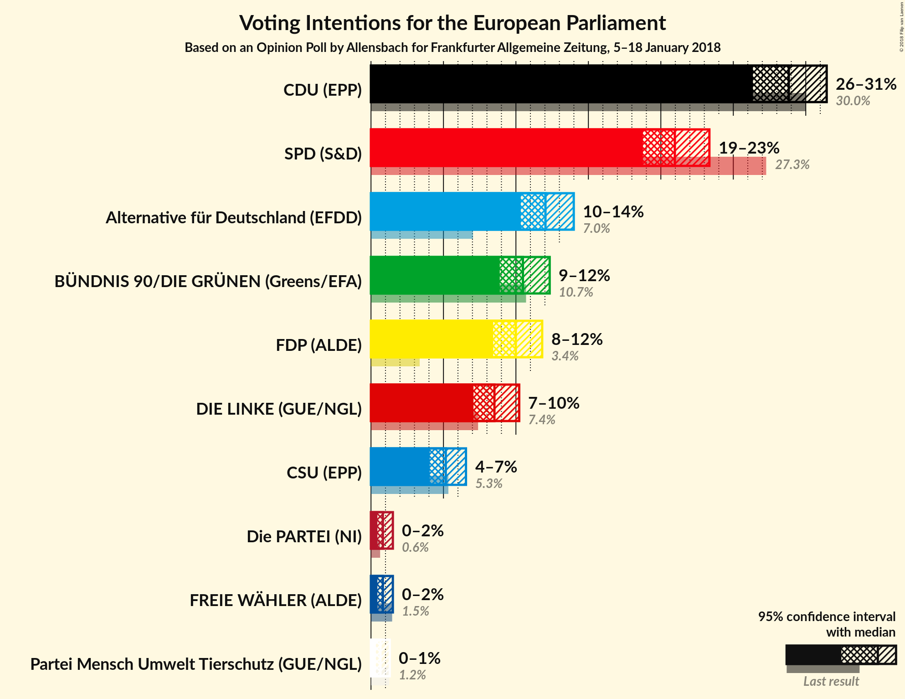

### Confidence Intervals

| Party | Last Result | Poll Result | 80% Confidence Interval | 90% Confidence Interval | 95% Confidence Interval | 99% Confidence Interval |
|:-----:|:-----------:|:-----------:|:-----------------------:|:-----------------------:|:-----------------------:|:-----------------------:|
| CDU (EPP) | 30.0% | 28.8% | 27.2–30.5% |26.7–31.0% |26.4–31.4% |25.6–32.3% |
| SPD (S&D) | 27.3% | 21.0% | 19.5–22.5% |19.1–23.0% |18.8–23.4% |18.1–24.1% |
| Alternative für Deutschland (EFDD) | 7.0% | 12.0% | 10.9–13.3% |10.6–13.7% |10.3–14.0% |9.8–14.6% |
| BÜNDNIS 90/DIE GRÜNEN (Greens/EFA) | 10.7% | 10.5% | 9.4–11.7% |9.1–12.0% |8.9–12.3% |8.4–12.9% |
| FDP (ALDE) | 3.4% | 10.0% | 9.0–11.2% |8.7–11.5% |8.4–11.8% |8.0–12.4% |
| DIE LINKE (GUE/NGL) | 7.4% | 8.5% | 7.6–9.6% |7.3–10.0% |7.1–10.2% |6.6–10.8% |
| CSU (EPP) | 5.3% | 5.2% | 4.4–6.1% |4.2–6.3% |4.1–6.6% |3.7–7.0% |
| FREIE WÄHLER (ALDE) | 1.5% | 0.8% | 0.6–1.3% |0.5–1.4% |0.4–1.5% |0.4–1.8% |
| Die PARTEI (NI) | 0.6% | 0.8% | 0.6–1.3% |0.5–1.4% |0.4–1.5% |0.4–1.8% |
| Partei Mensch Umwelt Tierschutz (GUE/NGL) | 1.2% | 0.7% | 0.4–1.1% |0.4–1.2% |0.3–1.3% |0.2–1.5% |

*Note:* The poll result column reflects the actual value used in the calculations. Published results may vary slightly, and in addition be rounded to fewer digits.

## Seats

### Confidence Intervals

| Party | Last Result | Median | 80% Confidence Interval | 90% Confidence Interval | 95% Confidence Interval | 99% Confidence Interval |
|:-----:|:-----------:|:------:|:-----------------------:|:-----------------------:|:-----------------------:|:-----------------------:|
| <a href="#cdu-(epp)">CDU (EPP)</a> | 29 | 28 | 26–29 |26–30 |25–30 |24–31 |
| <a href="#spd-(s&d)">SPD (S&D)</a> | 27 | 20 | 19–21 |18–22 |18–22 |17–24 |
| <a href="#alternative-für-deutschland-(efdd)">Alternative für Deutschland (EFDD)</a> | 7 | 12 | 10–13 |10–13 |9–13 |9–13 |
| <a href="#bündnis-90/die-grünen-(greens/efa)">BÜNDNIS 90/DIE GRÜNEN (Greens/EFA)</a> | 11 | 10 | 9–11 |9–11 |8–12 |8–12 |
| <a href="#fdp-(alde)">FDP (ALDE)</a> | 3 | 9 | 9–10 |9–11 |8–11 |8–12 |
| <a href="#die-linke-(gue/ngl)">DIE LINKE (GUE/NGL)</a> | 7 | 7 | 6–9 |6–9 |6–10 |6–10 |
| <a href="#csu-(epp)">CSU (EPP)</a> | 5 | 5 | 4–6 |4–6 |4–6 |4–7 |
| <a href="#freie-wähler-(alde)">FREIE WÄHLER (ALDE)</a> | 1 | 1 | 0–1 |0–1 |0–1 |0–2 |
| <a href="#die-partei-(ni)">Die PARTEI (NI)</a> | 1 | 1 | 1 |1 |1 |0–2 |
| <a href="#partei-mensch-umwelt-tierschutz-(gue/ngl)">Partei Mensch Umwelt Tierschutz (GUE/NGL)</a> | 1 | 1 | 1 |0–1 |0–1 |0–1 |

### CDU (EPP)

*For a full overview of the results for this party, see the [CDU (EPP)](party-cduepp.html) page.*

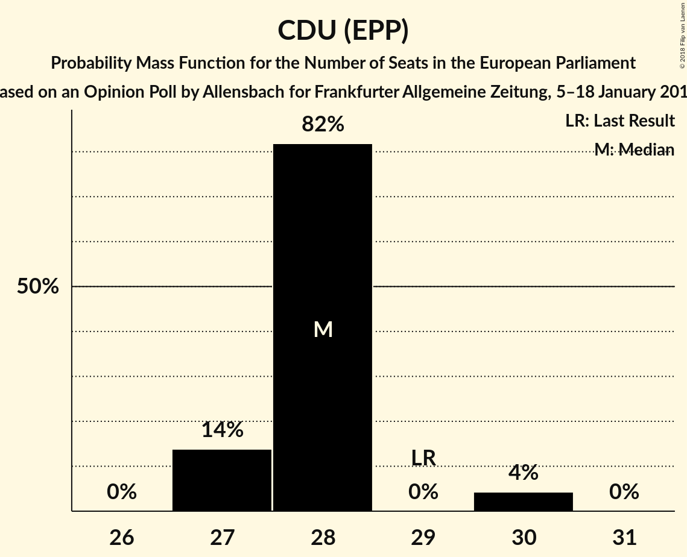

| Number of Seats | Probability | Accumulated | Special Marks |
|:---------------:|:-----------:|:-----------:|:-------------:|
| 23 | 0.2% | 100% |  |
| 24 | 0.5% | 99.8% |  |
| 25 | 4% | 99.4% |  |
| 26 | 10% | 95% |  |
| 27 | 12% | 86% |  |
| 28 | 52% | 73% | Median |
| 29 | 13% | 21% | Last Result |
| 30 | 8% | 8% |  |
| 31 | 0.7% | 0.7% |  |
| 32 | 0% | 0% |  |

### SPD (S&D)

*For a full overview of the results for this party, see the [SPD (S&D)](party-spdsd.html) page.*

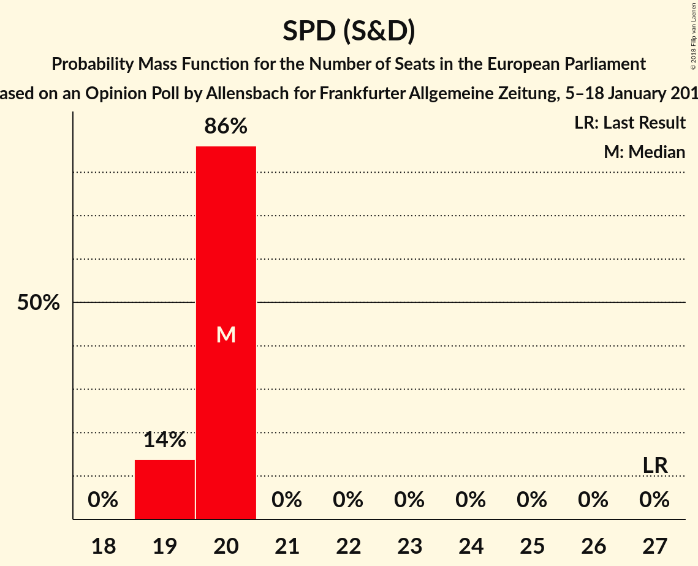

| Number of Seats | Probability | Accumulated | Special Marks |
|:---------------:|:-----------:|:-----------:|:-------------:|
| 16 | 0.1% | 100% |  |
| 17 | 2% | 99.9% |  |
| 18 | 5% | 98% |  |
| 19 | 15% | 93% |  |
| 20 | 34% | 78% | Median |
| 21 | 37% | 44% |  |
| 22 | 6% | 7% |  |
| 23 | 1.0% | 2% |  |
| 24 | 0.7% | 0.7% |  |
| 25 | 0% | 0% |  |
| 26 | 0% | 0% |  |
| 27 | 0% | 0% | Last Result |

### Alternative für Deutschland (EFDD)

*For a full overview of the results for this party, see the [Alternative für Deutschland (EFDD)](party-alternativefürdeutschlandefdd.html) page.*

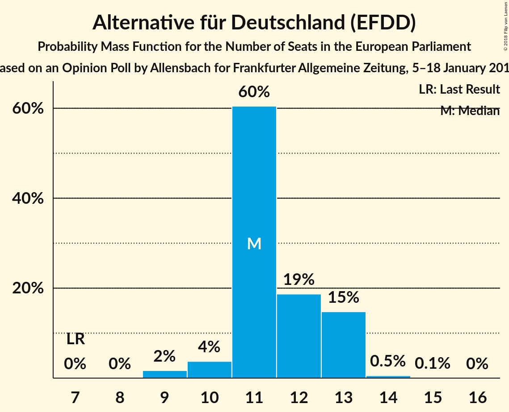

| Number of Seats | Probability | Accumulated | Special Marks |
|:---------------:|:-----------:|:-----------:|:-------------:|
| 7 | 0% | 100% | Last Result |
| 8 | 0% | 100% |  |
| 9 | 5% | 100% |  |
| 10 | 8% | 95% |  |
| 11 | 25% | 88% |  |
| 12 | 27% | 62% | Median |
| 13 | 35% | 35% |  |
| 14 | 0.3% | 0.4% |  |
| 15 | 0.1% | 0.1% |  |
| 16 | 0% | 0% |  |

### BÜNDNIS 90/DIE GRÜNEN (Greens/EFA)

*For a full overview of the results for this party, see the [BÜNDNIS 90/DIE GRÜNEN (Greens/EFA)](party-bündnis90diegrünengreensefa.html) page.*

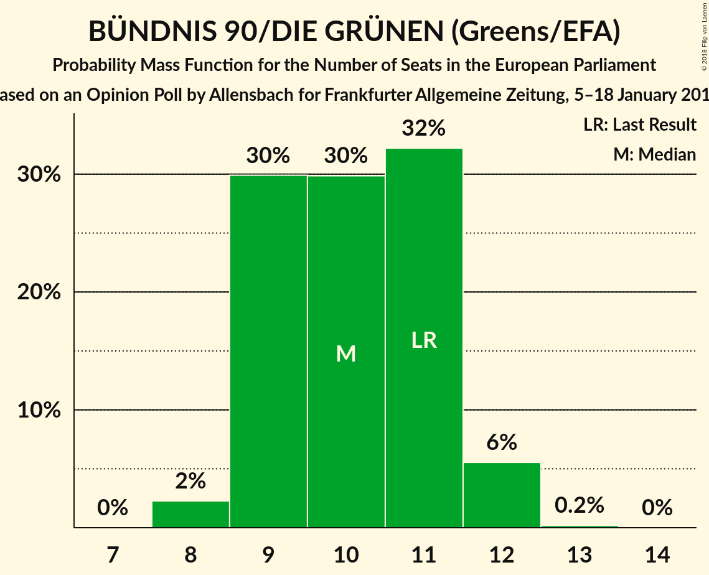

| Number of Seats | Probability | Accumulated | Special Marks |
|:---------------:|:-----------:|:-----------:|:-------------:|
| 8 | 4% | 100% |  |
| 9 | 42% | 96% |  |
| 10 | 23% | 54% | Median |
| 11 | 27% | 31% | Last Result |
| 12 | 4% | 4% |  |
| 13 | 0.1% | 0.1% |  |
| 14 | 0% | 0% |  |

### FDP (ALDE)

*For a full overview of the results for this party, see the [FDP (ALDE)](party-fdpalde.html) page.*

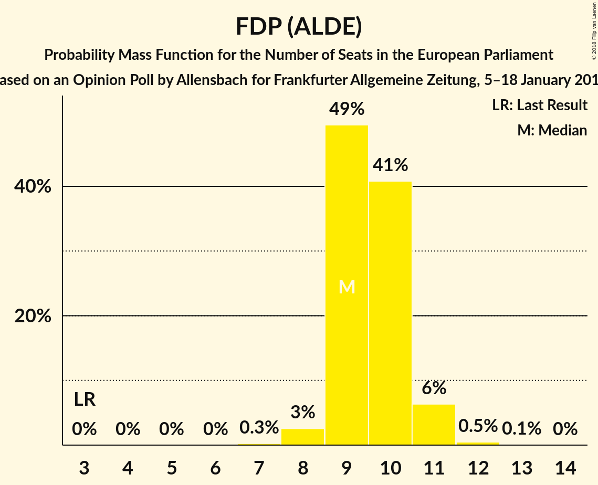

| Number of Seats | Probability | Accumulated | Special Marks |
|:---------------:|:-----------:|:-----------:|:-------------:|
| 3 | 0% | 100% | Last Result |
| 4 | 0% | 100% |  |
| 5 | 0% | 100% |  |
| 6 | 0% | 100% |  |
| 7 | 0.3% | 100% |  |
| 8 | 3% | 99.7% |  |
| 9 | 49% | 97% | Median |
| 10 | 41% | 48% |  |
| 11 | 6% | 7% |  |
| 12 | 0.5% | 0.5% |  |
| 13 | 0.1% | 0.1% |  |
| 14 | 0% | 0% |  |

### DIE LINKE (GUE/NGL)

*For a full overview of the results for this party, see the [DIE LINKE (GUE/NGL)](party-dielinkeguengl.html) page.*

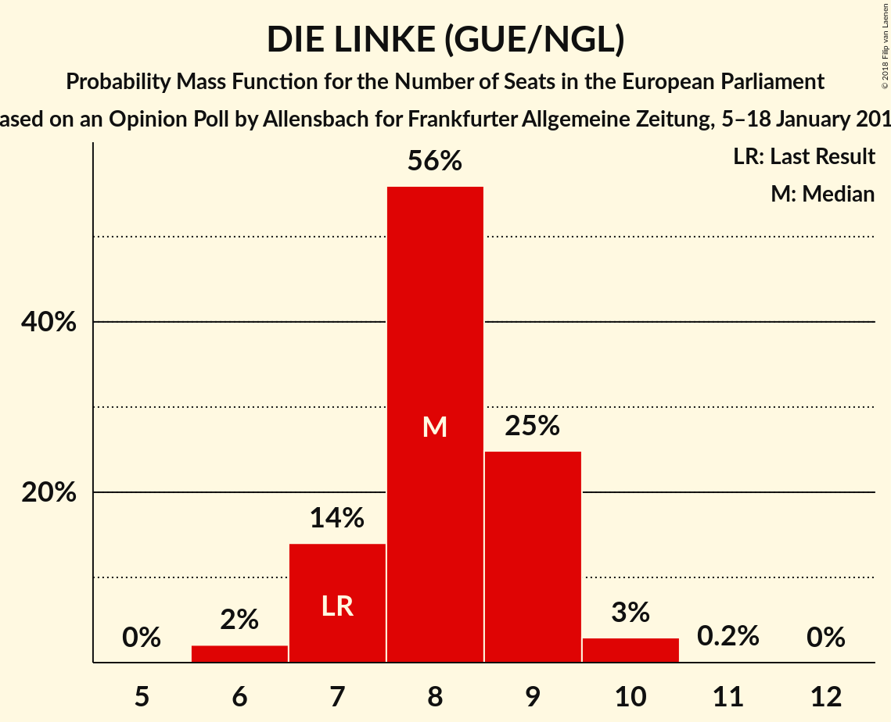

| Number of Seats | Probability | Accumulated | Special Marks |
|:---------------:|:-----------:|:-----------:|:-------------:|
| 6 | 24% | 100% |  |
| 7 | 39% | 76% | Last Result, Median |
| 8 | 16% | 37% |  |
| 9 | 18% | 21% |  |
| 10 | 3% | 3% |  |
| 11 | 0.2% | 0.2% |  |
| 12 | 0% | 0% |  |

### CSU (EPP)

*For a full overview of the results for this party, see the [CSU (EPP)](party-csuepp.html) page.*

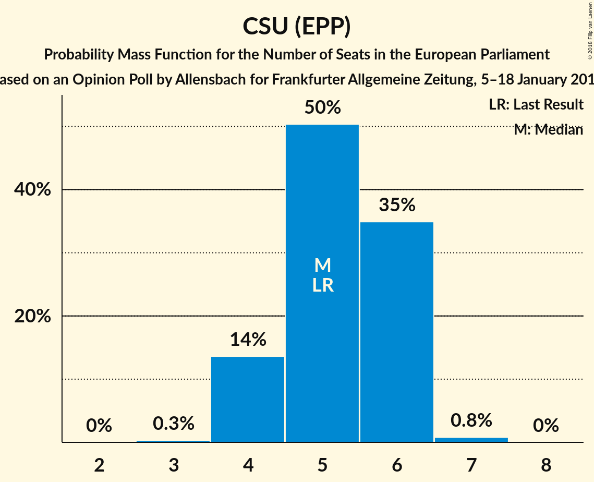

| Number of Seats | Probability | Accumulated | Special Marks |
|:---------------:|:-----------:|:-----------:|:-------------:|
| 3 | 0.2% | 100% |  |
| 4 | 14% | 99.8% |  |
| 5 | 70% | 85% | Last Result, Median |
| 6 | 14% | 15% |  |
| 7 | 1.2% | 1.3% |  |
| 8 | 0% | 0% |  |

### FREIE WÄHLER (ALDE)

*For a full overview of the results for this party, see the [FREIE WÄHLER (ALDE)](party-freiewähleralde.html) page.*

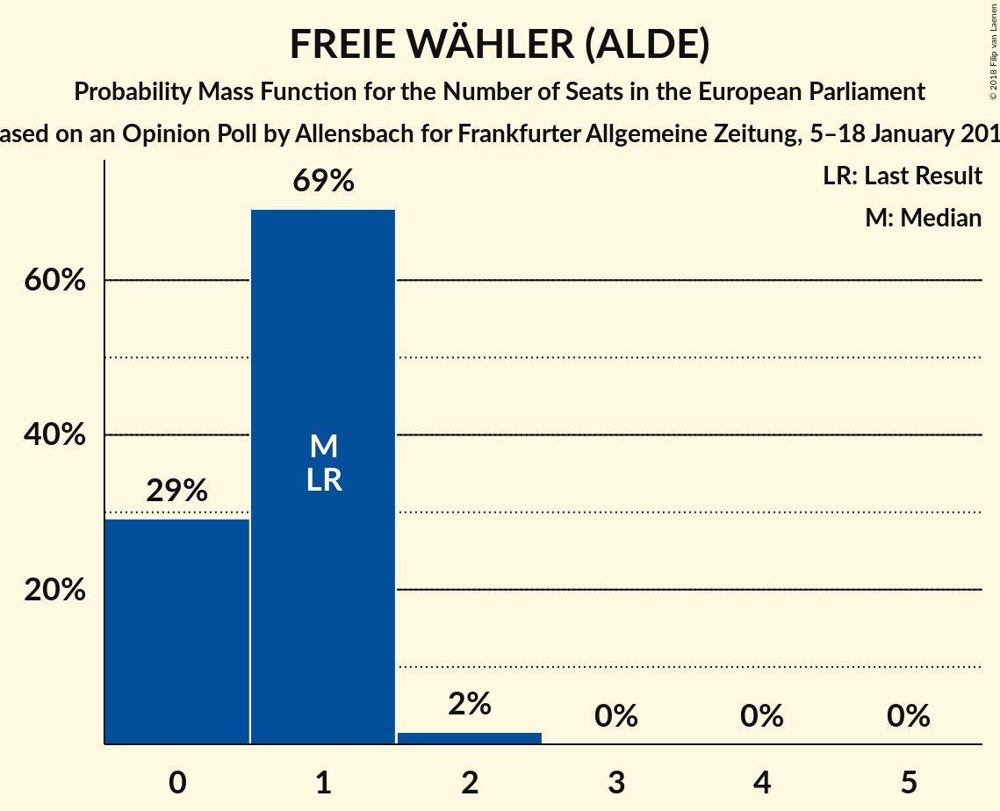

| Number of Seats | Probability | Accumulated | Special Marks |
|:---------------:|:-----------:|:-----------:|:-------------:|
| 0 | 29% | 100% |  |
| 1 | 69% | 71% | Last Result, Median |
| 2 | 2% | 2% |  |
| 3 | 0% | 0% |  |

### Die PARTEI (NI)

*For a full overview of the results for this party, see the [Die PARTEI (NI)](party-dieparteini.html) page.*

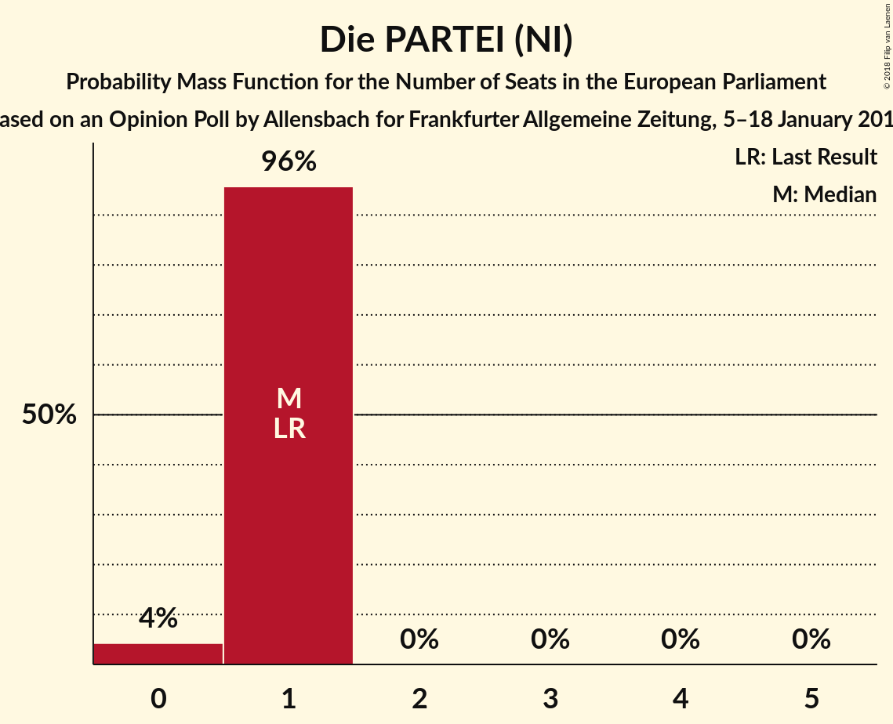

| Number of Seats | Probability | Accumulated | Special Marks |
|:---------------:|:-----------:|:-----------:|:-------------:|
| 0 | 2% | 100% |  |
| 1 | 96% | 98% | Last Result, Median |
| 2 | 1.2% | 1.2% |  |
| 3 | 0% | 0% |  |

### Partei Mensch Umwelt Tierschutz (GUE/NGL)

*For a full overview of the results for this party, see the [Partei Mensch Umwelt Tierschutz (GUE/NGL)](party-parteimenschumwelttierschutzguengl.html) page.*

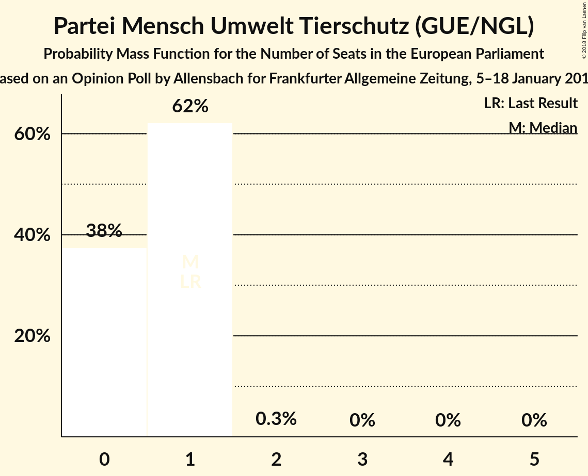

| Number of Seats | Probability | Accumulated | Special Marks |
|:---------------:|:-----------:|:-----------:|:-------------:|
| 0 | 9% | 100% |  |
| 1 | 91% | 91% | Last Result, Median |
| 2 | 0.3% | 0.3% |  |
| 3 | 0% | 0% |  |

## Coalitions

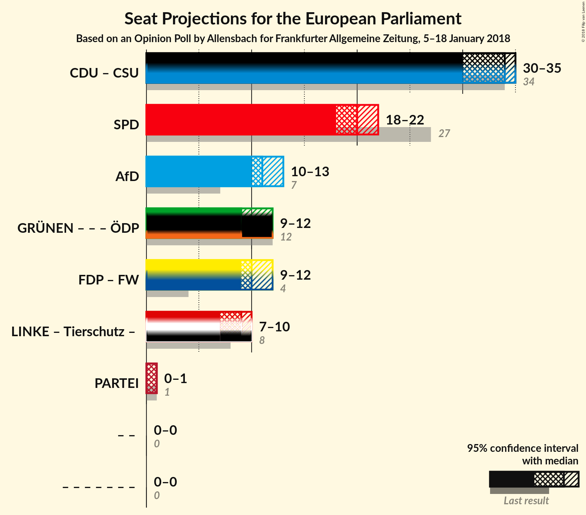

### Confidence Intervals

| Coalition | Last Result | Median | Majority? | 80% Confidence Interval | 90% Confidence Interval | 95% Confidence Interval | 99% Confidence Interval |
|:---------:|:-----------:|:------:|:---------:|:-----------------------:|:-----------------------:|:-----------------------:|:-----------------------:|
| CDU (EPP) – CSU (EPP) | 34 | 33 | 0% | 31–34 | 31–35 | 30–35 | 29–36 |
| SPD (S&D) | 27 | 20 | 0% | 19–21 | 18–22 | 18–22 | 17–24 |
| Alternative für Deutschland (EFDD) | 7 | 12 | 0% | 10–13 | 10–13 | 9–13 | 9–13 |
| FDP (ALDE) – FREIE WÄHLER (ALDE) | 4 | 10 | 0% | 9–11 | 9–12 | 9–12 | 8–13 |
| Die PARTEI (NI) | 1 | 1 | 0% | 1 | 1 | 1 | 0–2 |

### CDU (EPP) – CSU (EPP)

| Number of Seats | Probability | Accumulated | Special Marks |
|:---------------:|:-----------:|:-----------:|:-------------:|
| 27 | 0.1% | 100% |  |
| 28 | 0.1% | 99.9% |  |
| 29 | 2% | 99.8% |  |
| 30 | 2% | 98% |  |
| 31 | 12% | 96% |  |
| 32 | 14% | 84% |  |
| 33 | 45% | 70% | Median |
| 34 | 16% | 25% | Last Result |
| 35 | 8% | 9% |  |
| 36 | 2% | 2% |  |
| 37 | 0.1% | 0.1% |  |
| 38 | 0% | 0% |  |

### SPD (S&D)

| Number of Seats | Probability | Accumulated | Special Marks |
|:---------------:|:-----------:|:-----------:|:-------------:|
| 16 | 0.1% | 100% |  |
| 17 | 2% | 99.9% |  |
| 18 | 5% | 98% |  |
| 19 | 15% | 93% |  |
| 20 | 34% | 78% | Median |
| 21 | 37% | 44% |  |
| 22 | 6% | 7% |  |
| 23 | 1.0% | 2% |  |
| 24 | 0.7% | 0.7% |  |
| 25 | 0% | 0% |  |
| 26 | 0% | 0% |  |
| 27 | 0% | 0% | Last Result |

### Alternative für Deutschland (EFDD)

| Number of Seats | Probability | Accumulated | Special Marks |
|:---------------:|:-----------:|:-----------:|:-------------:|
| 7 | 0% | 100% | Last Result |
| 8 | 0% | 100% |  |
| 9 | 5% | 100% |  |
| 10 | 8% | 95% |  |
| 11 | 25% | 88% |  |
| 12 | 27% | 62% | Median |
| 13 | 35% | 35% |  |
| 14 | 0.3% | 0.4% |  |
| 15 | 0.1% | 0.1% |  |
| 16 | 0% | 0% |  |

### FDP (ALDE) – FREIE WÄHLER (ALDE)

| Number of Seats | Probability | Accumulated | Special Marks |
|:---------------:|:-----------:|:-----------:|:-------------:|
| 4 | 0% | 100% | Last Result |
| 5 | 0% | 100% |  |
| 6 | 0% | 100% |  |
| 7 | 0% | 100% |  |
| 8 | 0.6% | 100% |  |
| 9 | 30% | 99.4% |  |
| 10 | 21% | 69% | Median |
| 11 | 41% | 48% |  |
| 12 | 7% | 7% |  |
| 13 | 0.6% | 0.7% |  |
| 14 | 0.1% | 0.1% |  |
| 15 | 0% | 0% |  |

### Die PARTEI (NI)

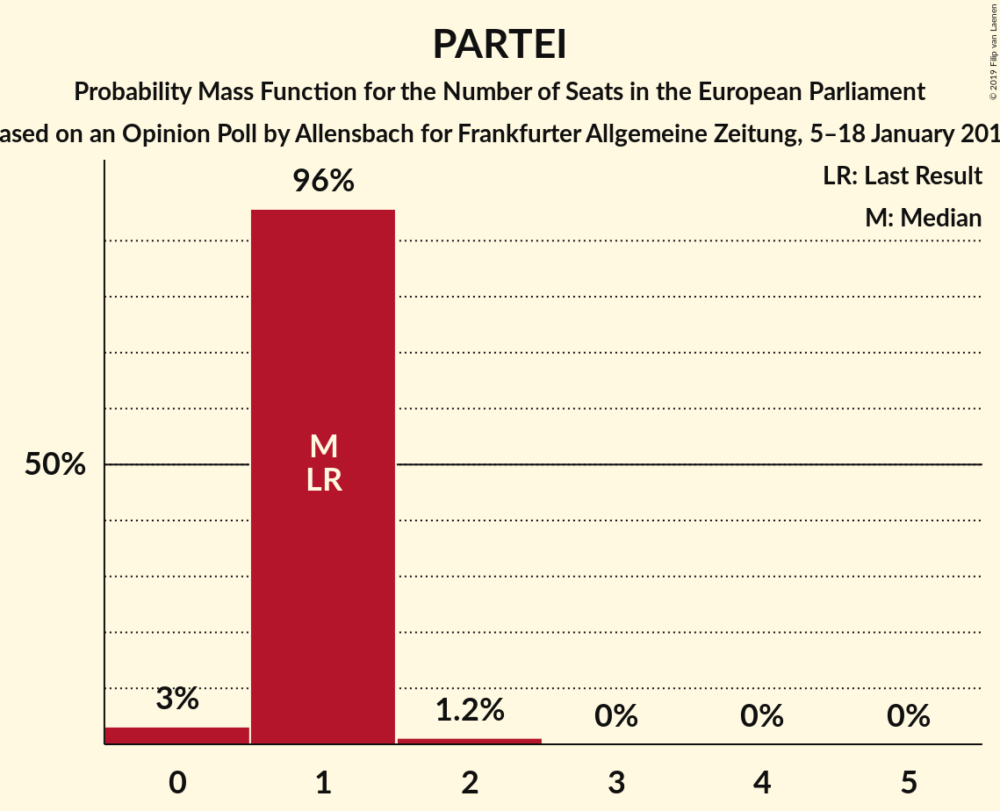

| Number of Seats | Probability | Accumulated | Special Marks |
|:---------------:|:-----------:|:-----------:|:-------------:|
| 0 | 2% | 100% |  |
| 1 | 96% | 98% | Last Result, Median |
| 2 | 1.2% | 1.2% |  |
| 3 | 0% | 0% |  |

## Technical Information

### Opinion Poll

+ **Polling firm:** Allensbach
+ **Commissioner(s):** Frankfurter Allgemeine Zeitung
+ **Fieldwork period:** 5–18 January 2018

### Calculations

+ **Sample size:** 1221
+ **Simulations done:** 131,072
+ **Error estimate:** 1.30%

