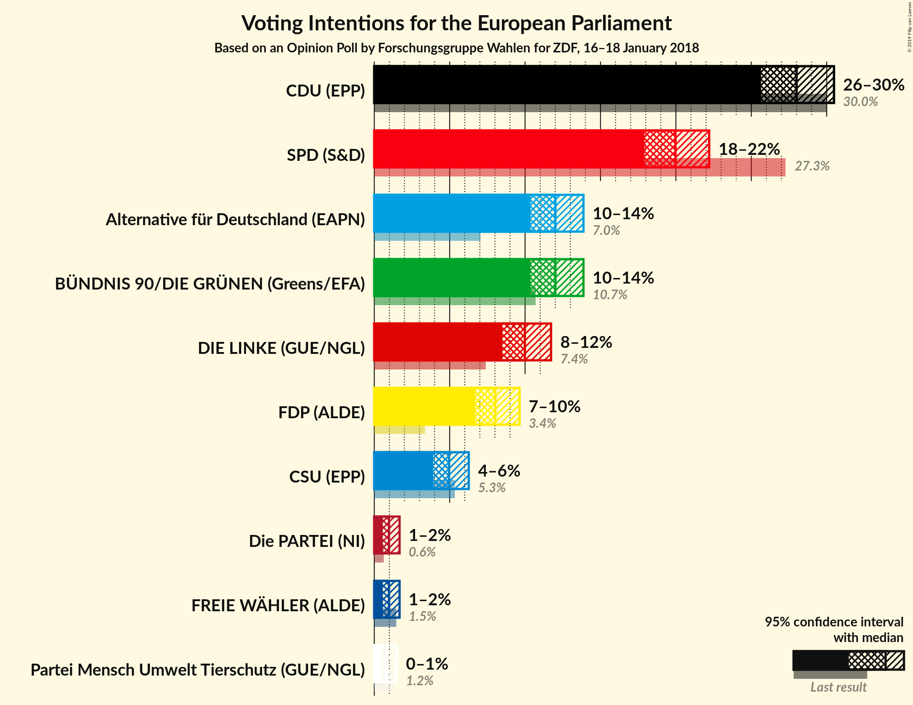

# Opinion Poll by Forschungsgruppe Wahlen for ZDF, 16–18 January 2018

<a href="#voting-intentions">Voting Intentions</a> | <a href="#seats">Seats</a> | <a href="#coalitions">Coalitions</a> | <a href="#technical-information">Technical Information</a>

## Voting Intentions

### Confidence Intervals

| Party | Last Result | Poll Result | 80% Confidence Interval | 90% Confidence Interval | 95% Confidence Interval | 99% Confidence Interval |
|:-----:|:-----------:|:-----------:|:-----------------------:|:-----------------------:|:-----------------------:|:-----------------------:|
| CDU (EPP) | 30.0% | 28.0% | 26.5–29.6% |26.0–30.1% |25.7–30.5% |24.9–31.3% |
| SPD (S&D) | 27.3% | 20.0% | 18.6–21.4% |18.2–21.9% |17.9–22.2% |17.3–22.9% |
| Alternative für Deutschland (EFDD) | 7.0% | 12.0% | 10.9–13.2% |10.6–13.6% |10.4–13.9% |9.9–14.5% |
| BÜNDNIS 90/DIE GRÜNEN (Greens/EFA) | 10.7% | 12.0% | 10.9–13.2% |10.6–13.6% |10.4–13.9% |9.9–14.5% |
| DIE LINKE (GUE/NGL) | 7.4% | 10.0% | 9.0–11.1% |8.7–11.4% |8.5–11.7% |8.0–12.3% |
| FDP (ALDE) | 3.4% | 8.0% | 7.1–9.1% |6.9–9.4% |6.7–9.6% |6.3–10.1% |
| CSU (EPP) | 5.3% | 5.0% | 4.3–5.8% |4.1–6.1% |3.9–6.3% |3.6–6.7% |
| FREIE WÄHLER (ALDE) | 1.5% | 1.0% | 0.7–1.4% |0.6–1.6% |0.6–1.7% |0.5–1.9% |
| Die PARTEI (NI) | 0.6% | 1.0% | 0.7–1.4% |0.6–1.6% |0.6–1.7% |0.5–1.9% |
| Partei Mensch Umwelt Tierschutz (GUE/NGL) | 1.2% | 0.8% | 0.6–1.2% |0.5–1.4% |0.5–1.5% |0.4–1.7% |

*Note:* The poll result column reflects the actual value used in the calculations. Published results may vary slightly, and in addition be rounded to fewer digits.

## Seats

### Confidence Intervals

| Party | Last Result | Median | 80% Confidence Interval | 90% Confidence Interval | 95% Confidence Interval | 99% Confidence Interval |
|:-----:|:-----------:|:------:|:-----------------------:|:-----------------------:|:-----------------------:|:-----------------------:|
| <a href="#cdu-(epp)">CDU (EPP)</a> | 29 | 24 | 24–27 |24–30 |24–31 |23–31 |
| <a href="#spd-(s&d)">SPD (S&D)</a> | 27 | 23 | 19–23 |18–23 |17–23 |16–23 |
| <a href="#alternative-für-deutschland-(efdd)">Alternative für Deutschland (EFDD)</a> | 7 | 11 | 11–12 |10–12 |9–15 |9–15 |
| <a href="#bündnis-90/die-grünen-(greens/efa)">BÜNDNIS 90/DIE GRÜNEN (Greens/EFA)</a> | 11 | 9 | 9–13 |9–13 |9–15 |9–15 |
| <a href="#die-linke-(gue/ngl)">DIE LINKE (GUE/NGL)</a> | 7 | 10 | 8–10 |8–10 |8–10 |8–12 |
| <a href="#fdp-(alde)">FDP (ALDE)</a> | 3 | 8 | 7–8 |6–8 |6–8 |6–8 |
| <a href="#csu-(epp)">CSU (EPP)</a> | 5 | 5 | 3–5 |3–5 |3–5 |3–6 |
| <a href="#freie-wähler-(alde)">FREIE WÄHLER (ALDE)</a> | 1 | 1 | 1 |1 |1 |1 |
| <a href="#die-partei-(ni)">Die PARTEI (NI)</a> | 1 | 1 | 1 |1–2 |1–2 |1–2 |
| <a href="#partei-mensch-umwelt-tierschutz-(gue/ngl)">Partei Mensch Umwelt Tierschutz (GUE/NGL)</a> | 1 | 1 | 0–1 |0–1 |0–1 |0–1 |

### CDU (EPP)

*For a full overview of the results for this party, see the [CDU (EPP)](party-cduepp.html) page.*

| Number of Seats | Probability | Accumulated | Special Marks |
|:---------------:|:-----------:|:-----------:|:-------------:|
| 22 | 0.1% | 100% |  |
| 23 | 0.6% | 99.9% |  |
| 24 | 58% | 99.3% | Median |
| 25 | 5% | 41% |  |
| 26 | 0% | 36% |  |
| 27 | 30% | 36% |  |
| 28 | 0.3% | 6% |  |
| 29 | 0.9% | 6% | Last Result |
| 30 | 0.3% | 5% |  |
| 31 | 5% | 5% |  |
| 32 | 0% | 0% |  |

### SPD (S&D)

*For a full overview of the results for this party, see the [SPD (S&D)](party-spdsd.html) page.*

| Number of Seats | Probability | Accumulated | Special Marks |
|:---------------:|:-----------:|:-----------:|:-------------:|
| 16 | 1.4% | 100% |  |
| 17 | 3% | 98.6% |  |
| 18 | 5% | 96% |  |
| 19 | 7% | 91% |  |
| 20 | 5% | 84% |  |
| 21 | 0.2% | 78% |  |
| 22 | 20% | 78% |  |
| 23 | 58% | 58% | Median |
| 24 | 0% | 0% |  |
| 25 | 0% | 0% |  |
| 26 | 0% | 0% |  |
| 27 | 0% | 0% | Last Result |

### Alternative für Deutschland (EFDD)

*For a full overview of the results for this party, see the [Alternative für Deutschland (EFDD)](party-alternativefürdeutschlandefdd.html) page.*

| Number of Seats | Probability | Accumulated | Special Marks |
|:---------------:|:-----------:|:-----------:|:-------------:|
| 7 | 0% | 100% | Last Result |
| 8 | 0% | 100% |  |
| 9 | 5% | 100% |  |
| 10 | 1.4% | 95% |  |
| 11 | 66% | 94% | Median |
| 12 | 25% | 28% |  |
| 13 | 0.1% | 3% |  |
| 14 | 0% | 3% |  |
| 15 | 3% | 3% |  |
| 16 | 0% | 0% |  |

### BÜNDNIS 90/DIE GRÜNEN (Greens/EFA)

*For a full overview of the results for this party, see the [BÜNDNIS 90/DIE GRÜNEN (Greens/EFA)](party-bündnis90diegrünengreensefa.html) page.*

| Number of Seats | Probability | Accumulated | Special Marks |
|:---------------:|:-----------:|:-----------:|:-------------:|
| 9 | 58% | 100% | Median |
| 10 | 3% | 42% |  |
| 11 | 21% | 38% | Last Result |
| 12 | 7% | 18% |  |
| 13 | 6% | 10% |  |
| 14 | 0.1% | 5% |  |
| 15 | 5% | 5% |  |
| 16 | 0% | 0% |  |

### DIE LINKE (GUE/NGL)

*For a full overview of the results for this party, see the [DIE LINKE (GUE/NGL)](party-dielinkeguengl.html) page.*

| Number of Seats | Probability | Accumulated | Special Marks |
|:---------------:|:-----------:|:-----------:|:-------------:|
| 7 | 0% | 100% | Last Result |
| 8 | 20% | 100% |  |
| 9 | 12% | 80% |  |
| 10 | 66% | 68% | Median |
| 11 | 1.2% | 2% |  |
| 12 | 0.6% | 0.6% |  |
| 13 | 0% | 0% |  |

### FDP (ALDE)

*For a full overview of the results for this party, see the [FDP (ALDE)](party-fdpalde.html) page.*

| Number of Seats | Probability | Accumulated | Special Marks |
|:---------------:|:-----------:|:-----------:|:-------------:|
| 3 | 0% | 100% | Last Result |
| 4 | 0% | 100% |  |
| 5 | 0.2% | 100% |  |
| 6 | 5% | 99.8% |  |
| 7 | 8% | 94% |  |
| 8 | 86% | 86% | Median |
| 9 | 0% | 0.5% |  |
| 10 | 0.2% | 0.5% |  |
| 11 | 0.3% | 0.3% |  |
| 12 | 0% | 0% |  |

### CSU (EPP)

*For a full overview of the results for this party, see the [CSU (EPP)](party-csuepp.html) page.*

| Number of Seats | Probability | Accumulated | Special Marks |
|:---------------:|:-----------:|:-----------:|:-------------:|
| 3 | 20% | 100% |  |
| 4 | 10% | 80% |  |
| 5 | 70% | 70% | Last Result, Median |
| 6 | 0.8% | 0.8% |  |
| 7 | 0% | 0% |  |

### FREIE WÄHLER (ALDE)

*For a full overview of the results for this party, see the [FREIE WÄHLER (ALDE)](party-freiewähleralde.html) page.*

| Number of Seats | Probability | Accumulated | Special Marks |
|:---------------:|:-----------:|:-----------:|:-------------:|
| 0 | 0.5% | 100% |  |
| 1 | 99.2% | 99.5% | Last Result, Median |
| 2 | 0.3% | 0.3% |  |
| 3 | 0% | 0% |  |

### Die PARTEI (NI)

*For a full overview of the results for this party, see the [Die PARTEI (NI)](party-dieparteini.html) page.*

| Number of Seats | Probability | Accumulated | Special Marks |
|:---------------:|:-----------:|:-----------:|:-------------:|
| 1 | 93% | 100% | Last Result, Median |
| 2 | 7% | 7% |  |
| 3 | 0% | 0% |  |

### Partei Mensch Umwelt Tierschutz (GUE/NGL)

*For a full overview of the results for this party, see the [Partei Mensch Umwelt Tierschutz (GUE/NGL)](party-parteimenschumwelttierschutzguengl.html) page.*

| Number of Seats | Probability | Accumulated | Special Marks |
|:---------------:|:-----------:|:-----------:|:-------------:|
| 0 | 15% | 100% |  |
| 1 | 85% | 85% | Last Result, Median |
| 2 | 0% | 0% |  |

## Coalitions

### Confidence Intervals

| Coalition | Last Result | Median | Majority? | 80% Confidence Interval | 90% Confidence Interval | 95% Confidence Interval | 99% Confidence Interval |
|:---------:|:-----------:|:------:|:---------:|:-----------------------:|:-----------------------:|:-----------------------:|:-----------------------:|
| CDU (EPP) – CSU (EPP) | 34 | 29 | 0% | 29–32 | 29–34 | 29–35 | 29–35 |
| SPD (S&D) | 27 | 23 | 0% | 19–23 | 18–23 | 17–23 | 16–23 |
| Alternative für Deutschland (EFDD) | 7 | 11 | 0% | 11–12 | 10–12 | 9–15 | 9–15 |
| FDP (ALDE) – FREIE WÄHLER (ALDE) | 4 | 9 | 0% | 8–9 | 7–9 | 7–9 | 7–10 |
| Die PARTEI (NI) | 1 | 1 | 0% | 1 | 1–2 | 1–2 | 1–2 |

### CDU (EPP) – CSU (EPP)

| Number of Seats | Probability | Accumulated | Special Marks |
|:---------------:|:-----------:|:-----------:|:-------------:|
| 27 | 0.1% | 100% |  |
| 28 | 0% | 99.9% |  |
| 29 | 64% | 99.9% | Median |
| 30 | 20% | 36% |  |
| 31 | 0.1% | 16% |  |
| 32 | 10% | 16% |  |
| 33 | 0.4% | 6% |  |
| 34 | 1.2% | 6% | Last Result |
| 35 | 5% | 5% |  |
| 36 | 0% | 0% |  |

### SPD (S&D)

| Number of Seats | Probability | Accumulated | Special Marks |
|:---------------:|:-----------:|:-----------:|:-------------:|
| 16 | 1.4% | 100% |  |
| 17 | 3% | 98.6% |  |
| 18 | 5% | 96% |  |
| 19 | 7% | 91% |  |
| 20 | 5% | 84% |  |
| 21 | 0.2% | 78% |  |
| 22 | 20% | 78% |  |
| 23 | 58% | 58% | Median |
| 24 | 0% | 0% |  |
| 25 | 0% | 0% |  |
| 26 | 0% | 0% |  |
| 27 | 0% | 0% | Last Result |

### Alternative für Deutschland (EFDD)

| Number of Seats | Probability | Accumulated | Special Marks |
|:---------------:|:-----------:|:-----------:|:-------------:|
| 7 | 0% | 100% | Last Result |
| 8 | 0% | 100% |  |
| 9 | 5% | 100% |  |
| 10 | 1.4% | 95% |  |
| 11 | 66% | 94% | Median |
| 12 | 25% | 28% |  |
| 13 | 0.1% | 3% |  |
| 14 | 0% | 3% |  |
| 15 | 3% | 3% |  |
| 16 | 0% | 0% |  |

### FDP (ALDE) – FREIE WÄHLER (ALDE)

| Number of Seats | Probability | Accumulated | Special Marks |
|:---------------:|:-----------:|:-----------:|:-------------:|
| 4 | 0% | 100% | Last Result |
| 5 | 0% | 100% |  |
| 6 | 0.1% | 100% |  |
| 7 | 5% | 99.9% |  |
| 8 | 9% | 94% |  |
| 9 | 85% | 86% | Median |
| 10 | 0.2% | 0.5% |  |
| 11 | 0% | 0.3% |  |
| 12 | 0% | 0.3% |  |
| 13 | 0.3% | 0.3% |  |
| 14 | 0% | 0% |  |

### Die PARTEI (NI)

| Number of Seats | Probability | Accumulated | Special Marks |
|:---------------:|:-----------:|:-----------:|:-------------:|
| 1 | 93% | 100% | Last Result, Median |
| 2 | 7% | 7% |  |
| 3 | 0% | 0% |  |

## Technical Information

### Opinion Poll

+ **Polling firm:** Forschungsgruppe Wahlen
+ **Commissioner(s):** ZDF
+ **Fieldwork period:** 16–18 January 2018

### Calculations

+ **Sample size:** 1332
+ **Simulations done:** 1,024
+ **Error estimate:** 3.60%

