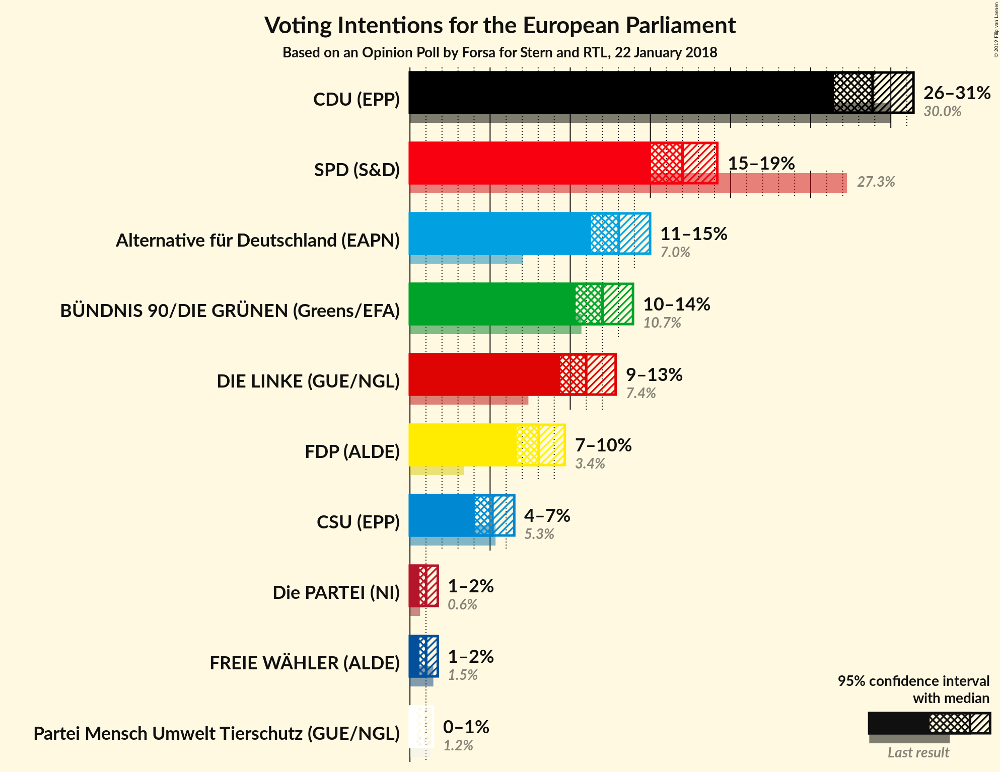
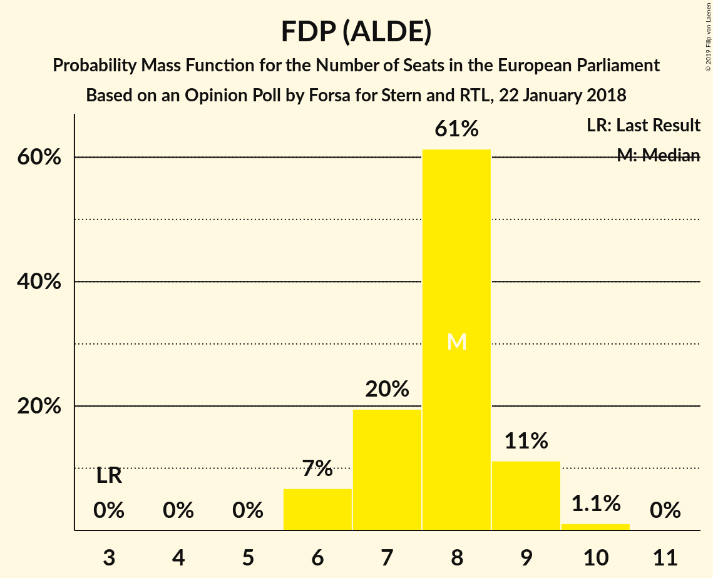

# Opinion Poll by Forsa for Stern and RTL, 22 January 2018

<a href="#voting-intentions">Voting Intentions</a> | <a href="#seats">Seats</a> | <a href="#coalitions">Coalitions</a> | <a href="#technical-information">Technical Information</a>

## Voting Intentions

### Confidence Intervals

| Party | Last Result | Poll Result | 80% Confidence Interval | 90% Confidence Interval | 95% Confidence Interval | 99% Confidence Interval |
|:-----:|:-----------:|:-----------:|:-----------------------:|:-----------------------:|:-----------------------:|:-----------------------:|
| CDU (EPP) | 30.0% | 28.9% | 27.3–30.5% |26.8–31.0% |26.4–31.4% |25.7–32.2% |
| SPD (S&D) | 27.3% | 17.0% | 15.7–18.4% |15.3–18.8% |15.0–19.2% |14.4–19.9% |
| Alternative für Deutschland (EFDD) | 7.0% | 13.0% | 11.9–14.3% |11.6–14.7% |11.3–15.0% |10.8–15.6% |
| BÜNDNIS 90/DIE GRÜNEN (Greens/EFA) | 10.7% | 12.0% | 10.9–13.3% |10.6–13.6% |10.3–13.9% |9.8–14.5% |
| DIE LINKE (GUE/NGL) | 7.4% | 11.0% | 9.9–12.2% |9.6–12.5% |9.4–12.8% |8.9–13.4% |
| FDP (ALDE) | 3.4% | 8.0% | 7.1–9.1% |6.9–9.4% |6.7–9.7% |6.2–10.2% |
| CSU (EPP) | 5.3% | 5.1% | 4.4–6.0% |4.2–6.3% |4.1–6.5% |3.7–7.0% |
| FREIE WÄHLER (ALDE) | 1.5% | 1.0% | 0.7–1.5% |0.7–1.6% |0.6–1.7% |0.5–2.0% |
| Die PARTEI (NI) | 0.6% | 1.0% | 0.7–1.5% |0.7–1.6% |0.6–1.7% |0.5–2.0% |
| Partei Mensch Umwelt Tierschutz (GUE/NGL) | 1.2% | 0.8% | 0.5–1.2% |0.5–1.3% |0.4–1.4% |0.3–1.7% |

*Note:* The poll result column reflects the actual value used in the calculations. Published results may vary slightly, and in addition be rounded to fewer digits.

## Seats

### Confidence Intervals

| Party | Last Result | Median | 80% Confidence Interval | 90% Confidence Interval | 95% Confidence Interval | 99% Confidence Interval |
|:-----:|:-----------:|:------:|:-----------------------:|:-----------------------:|:-----------------------:|:-----------------------:|
| <a href="#cdu-(epp)">CDU (EPP)</a> | 29 | 27 | 25–27 |25–27 |25–28 |24–29 |
| <a href="#spd-(s&d)">SPD (S&D)</a> | 27 | 18 | 14–19 |14–19 |14–20 |14–21 |
| <a href="#alternative-für-deutschland-(efdd)">Alternative für Deutschland (EFDD)</a> | 7 | 12 | 10–16 |10–16 |10–16 |10–16 |
| <a href="#bündnis-90/die-grünen-(greens/efa)">BÜNDNIS 90/DIE GRÜNEN (Greens/EFA)</a> | 11 | 12 | 11–12 |11–12 |11–13 |10–14 |
| <a href="#die-linke-(gue/ngl)">DIE LINKE (GUE/NGL)</a> | 7 | 9 | 9–12 |9–12 |8–12 |7–13 |
| <a href="#fdp-(alde)">FDP (ALDE)</a> | 3 | 9 | 7–9 |7–10 |7–10 |6–11 |
| <a href="#csu-(epp)">CSU (EPP)</a> | 5 | 5 | 5 |4–5 |3–6 |3–7 |
| <a href="#freie-wähler-(alde)">FREIE WÄHLER (ALDE)</a> | 1 | 1 | 1–2 |1–2 |1–2 |1–2 |
| <a href="#die-partei-(ni)">Die PARTEI (NI)</a> | 1 | 1 | 1 |0–1 |0–2 |0–2 |
| <a href="#partei-mensch-umwelt-tierschutz-(gue/ngl)">Partei Mensch Umwelt Tierschutz (GUE/NGL)</a> | 1 | 1 | 1 |1 |0–1 |0–2 |

### CDU (EPP)

*For a full overview of the results for this party, see the [CDU (EPP)](party-cduepp.html) page.*

| Number of Seats | Probability | Accumulated | Special Marks |
|:---------------:|:-----------:|:-----------:|:-------------:|
| 23 | 0.3% | 100% |  |
| 24 | 0.7% | 99.7% |  |
| 25 | 35% | 99.0% |  |
| 26 | 2% | 64% |  |
| 27 | 59% | 62% | Median |
| 28 | 1.4% | 3% |  |
| 29 | 2% | 2% | Last Result |
| 30 | 0.1% | 0.1% |  |
| 31 | 0% | 0% |  |

### SPD (S&D)

*For a full overview of the results for this party, see the [SPD (S&D)](party-spdsd.html) page.*

| Number of Seats | Probability | Accumulated | Special Marks |
|:---------------:|:-----------:|:-----------:|:-------------:|
| 13 | 0% | 100% |  |
| 14 | 32% | 99.9% |  |
| 15 | 6% | 68% |  |
| 16 | 2% | 62% |  |
| 17 | 3% | 60% |  |
| 18 | 46% | 57% | Median |
| 19 | 7% | 11% |  |
| 20 | 3% | 4% |  |
| 21 | 0.6% | 0.6% |  |
| 22 | 0% | 0% |  |
| 23 | 0% | 0% |  |
| 24 | 0% | 0% |  |
| 25 | 0% | 0% |  |
| 26 | 0% | 0% |  |
| 27 | 0% | 0% | Last Result |

### Alternative für Deutschland (EFDD)

*For a full overview of the results for this party, see the [Alternative für Deutschland (EFDD)](party-alternativefürdeutschlandefdd.html) page.*

| Number of Seats | Probability | Accumulated | Special Marks |
|:---------------:|:-----------:|:-----------:|:-------------:|
| 7 | 0% | 100% | Last Result |
| 8 | 0% | 100% |  |
| 9 | 0.5% | 100% |  |
| 10 | 46% | 99.5% |  |
| 11 | 2% | 54% |  |
| 12 | 7% | 52% | Median |
| 13 | 8% | 45% |  |
| 14 | 6% | 37% |  |
| 15 | 0.5% | 31% |  |
| 16 | 31% | 31% |  |
| 17 | 0% | 0% |  |

### BÜNDNIS 90/DIE GRÜNEN (Greens/EFA)

*For a full overview of the results for this party, see the [BÜNDNIS 90/DIE GRÜNEN (Greens/EFA)](party-bündnis90diegrünengreensefa.html) page.*

| Number of Seats | Probability | Accumulated | Special Marks |
|:---------------:|:-----------:|:-----------:|:-------------:|
| 10 | 1.3% | 100% |  |
| 11 | 32% | 98.7% | Last Result |
| 12 | 63% | 67% | Median |
| 13 | 2% | 3% |  |
| 14 | 2% | 2% |  |
| 15 | 0% | 0% |  |

### DIE LINKE (GUE/NGL)

*For a full overview of the results for this party, see the [DIE LINKE (GUE/NGL)](party-dielinkeguengl.html) page.*

| Number of Seats | Probability | Accumulated | Special Marks |
|:---------------:|:-----------:|:-----------:|:-------------:|
| 7 | 0.8% | 100% | Last Result |
| 8 | 4% | 99.2% |  |
| 9 | 49% | 95% | Median |
| 10 | 8% | 46% |  |
| 11 | 7% | 39% |  |
| 12 | 31% | 31% |  |
| 13 | 0.8% | 0.8% |  |
| 14 | 0% | 0% |  |

### FDP (ALDE)

*For a full overview of the results for this party, see the [FDP (ALDE)](party-fdpalde.html) page.*

| Number of Seats | Probability | Accumulated | Special Marks |
|:---------------:|:-----------:|:-----------:|:-------------:|
| 3 | 0% | 100% | Last Result |
| 4 | 0% | 100% |  |
| 5 | 0.1% | 100% |  |
| 6 | 2% | 99.9% |  |
| 7 | 44% | 98% |  |
| 8 | 2% | 54% |  |
| 9 | 45% | 52% | Median |
| 10 | 5% | 6% |  |
| 11 | 1.3% | 1.3% |  |
| 12 | 0% | 0% |  |

### CSU (EPP)

*For a full overview of the results for this party, see the [CSU (EPP)](party-csuepp.html) page.*

| Number of Seats | Probability | Accumulated | Special Marks |
|:---------------:|:-----------:|:-----------:|:-------------:|
| 3 | 5% | 100% |  |
| 4 | 3% | 95% |  |
| 5 | 88% | 92% | Last Result, Median |
| 6 | 3% | 4% |  |
| 7 | 1.2% | 1.2% |  |
| 8 | 0% | 0% |  |

### FREIE WÄHLER (ALDE)

*For a full overview of the results for this party, see the [FREIE WÄHLER (ALDE)](party-freiewähleralde.html) page.*

| Number of Seats | Probability | Accumulated | Special Marks |
|:---------------:|:-----------:|:-----------:|:-------------:|
| 1 | 90% | 100% | Last Result, Median |
| 2 | 10% | 10% |  |
| 3 | 0.4% | 0.4% |  |
| 4 | 0% | 0% |  |

### Die PARTEI (NI)

*For a full overview of the results for this party, see the [Die PARTEI (NI)](party-dieparteini.html) page.*

| Number of Seats | Probability | Accumulated | Special Marks |
|:---------------:|:-----------:|:-----------:|:-------------:|
| 0 | 8% | 100% |  |
| 1 | 88% | 92% | Last Result, Median |
| 2 | 4% | 4% |  |
| 3 | 0% | 0% |  |

### Partei Mensch Umwelt Tierschutz (GUE/NGL)

*For a full overview of the results for this party, see the [Partei Mensch Umwelt Tierschutz (GUE/NGL)](party-parteimenschumwelttierschutzguengl.html) page.*

| Number of Seats | Probability | Accumulated | Special Marks |
|:---------------:|:-----------:|:-----------:|:-------------:|
| 0 | 4% | 100% |  |
| 1 | 95% | 96% | Last Result, Median |
| 2 | 1.1% | 1.1% |  |
| 3 | 0% | 0% |  |

## Coalitions

### Confidence Intervals

| Coalition | Last Result | Median | Majority? | 80% Confidence Interval | 90% Confidence Interval | 95% Confidence Interval | 99% Confidence Interval |
|:---------:|:-----------:|:------:|:---------:|:-----------------------:|:-----------------------:|:-----------------------:|:-----------------------:|
| CDU (EPP) – CSU (EPP) | 34 | 32 | 0% | 30–32 | 30–32 | 30–33 | 29–35 |
| SPD (S&D) | 27 | 18 | 0% | 14–19 | 14–19 | 14–20 | 14–21 |
| Alternative für Deutschland (EFDD) | 7 | 12 | 0% | 10–16 | 10–16 | 10–16 | 10–16 |
| FDP (ALDE) – FREIE WÄHLER (ALDE) | 4 | 10 | 0% | 8–10 | 8–12 | 8–12 | 7–13 |
| Die PARTEI (NI) | 1 | 1 | 0% | 1 | 0–1 | 0–2 | 0–2 |

### CDU (EPP) – CSU (EPP)

| Number of Seats | Probability | Accumulated | Special Marks |
|:---------------:|:-----------:|:-----------:|:-------------:|
| 27 | 0.3% | 100% |  |
| 28 | 0% | 99.7% |  |
| 29 | 0.6% | 99.7% |  |
| 30 | 39% | 99.1% |  |
| 31 | 2% | 60% |  |
| 32 | 54% | 58% | Median |
| 33 | 1.1% | 3% |  |
| 34 | 0.9% | 2% | Last Result |
| 35 | 1.4% | 1.4% |  |
| 36 | 0% | 0% |  |

### SPD (S&D)

| Number of Seats | Probability | Accumulated | Special Marks |
|:---------------:|:-----------:|:-----------:|:-------------:|
| 13 | 0% | 100% |  |
| 14 | 32% | 99.9% |  |
| 15 | 6% | 68% |  |
| 16 | 2% | 62% |  |
| 17 | 3% | 60% |  |
| 18 | 46% | 57% | Median |
| 19 | 7% | 11% |  |
| 20 | 3% | 4% |  |
| 21 | 0.6% | 0.6% |  |
| 22 | 0% | 0% |  |
| 23 | 0% | 0% |  |
| 24 | 0% | 0% |  |
| 25 | 0% | 0% |  |
| 26 | 0% | 0% |  |
| 27 | 0% | 0% | Last Result |

### Alternative für Deutschland (EFDD)

| Number of Seats | Probability | Accumulated | Special Marks |
|:---------------:|:-----------:|:-----------:|:-------------:|
| 7 | 0% | 100% | Last Result |
| 8 | 0% | 100% |  |
| 9 | 0.5% | 100% |  |
| 10 | 46% | 99.5% |  |
| 11 | 2% | 54% |  |
| 12 | 7% | 52% | Median |
| 13 | 8% | 45% |  |
| 14 | 6% | 37% |  |
| 15 | 0.5% | 31% |  |
| 16 | 31% | 31% |  |
| 17 | 0% | 0% |  |

### FDP (ALDE) – FREIE WÄHLER (ALDE)

| Number of Seats | Probability | Accumulated | Special Marks |
|:---------------:|:-----------:|:-----------:|:-------------:|
| 4 | 0% | 100% | Last Result |
| 5 | 0% | 100% |  |
| 6 | 0.1% | 100% |  |
| 7 | 1.3% | 99.9% |  |
| 8 | 42% | 98.6% |  |
| 9 | 4% | 56% |  |
| 10 | 46% | 52% | Median |
| 11 | 0.4% | 7% |  |
| 12 | 5% | 6% |  |
| 13 | 1.2% | 1.2% |  |
| 14 | 0% | 0% |  |

### Die PARTEI (NI)

| Number of Seats | Probability | Accumulated | Special Marks |
|:---------------:|:-----------:|:-----------:|:-------------:|
| 0 | 8% | 100% |  |
| 1 | 88% | 92% | Last Result, Median |
| 2 | 4% | 4% |  |
| 3 | 0% | 0% |  |

## Technical Information

### Opinion Poll

+ **Polling firm:** Forsa
+ **Commissioner(s):** Stern and RTL
+ **Fieldwork period:** 22 January 2018

### Calculations

+ **Sample size:** 1282
+ **Simulations done:** 1,024
+ **Error estimate:** 4.30%

