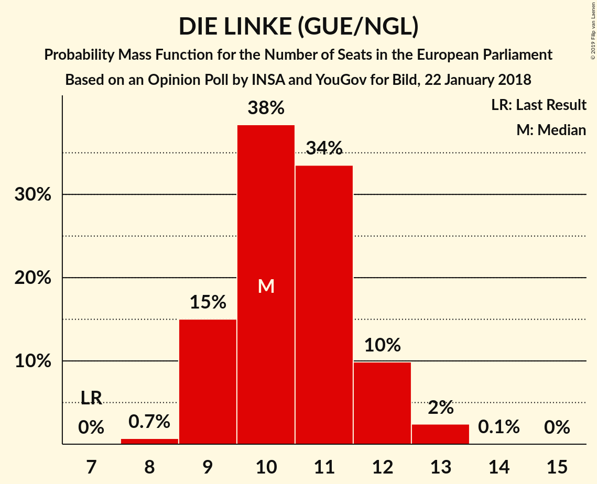
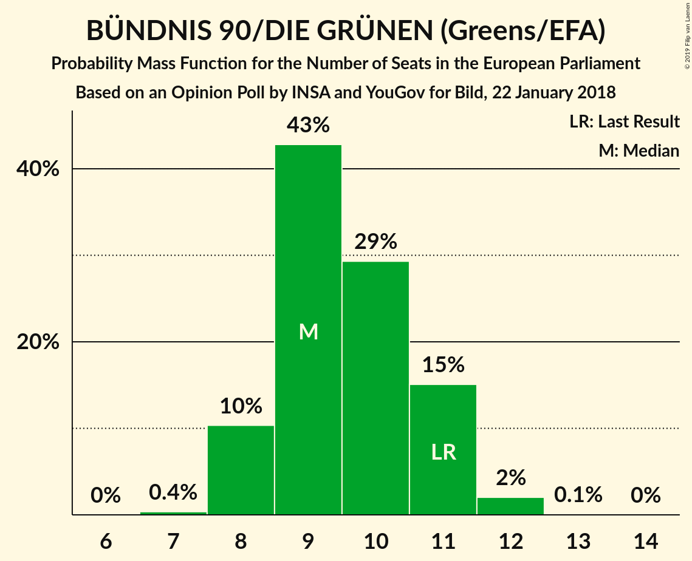
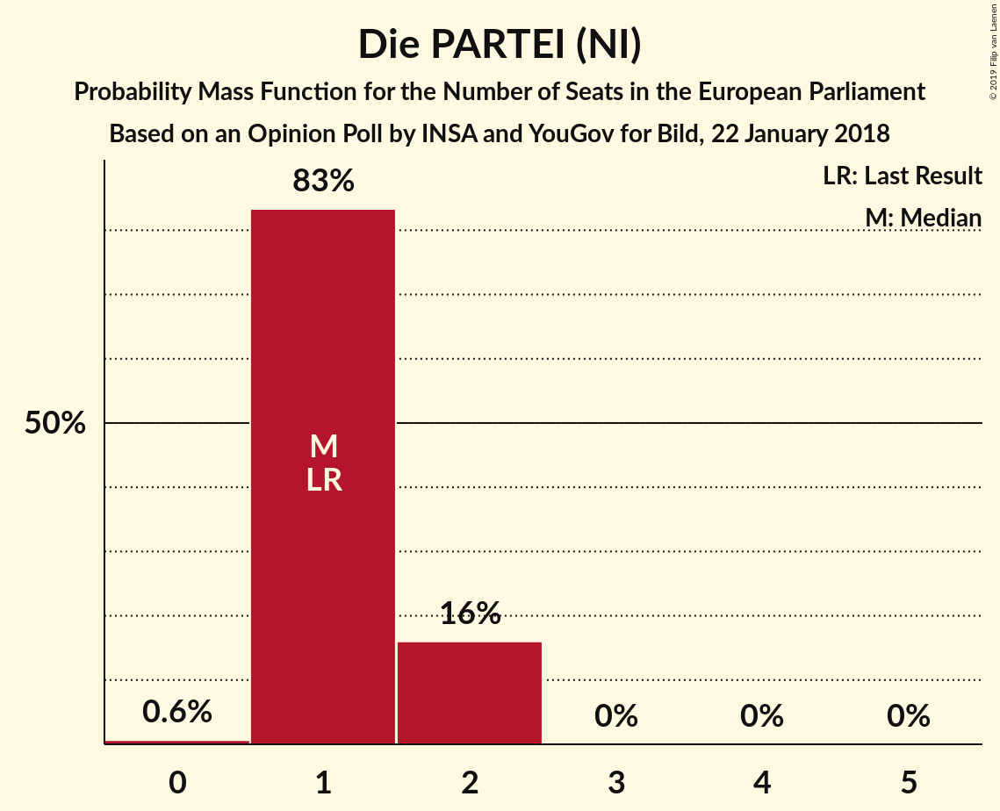
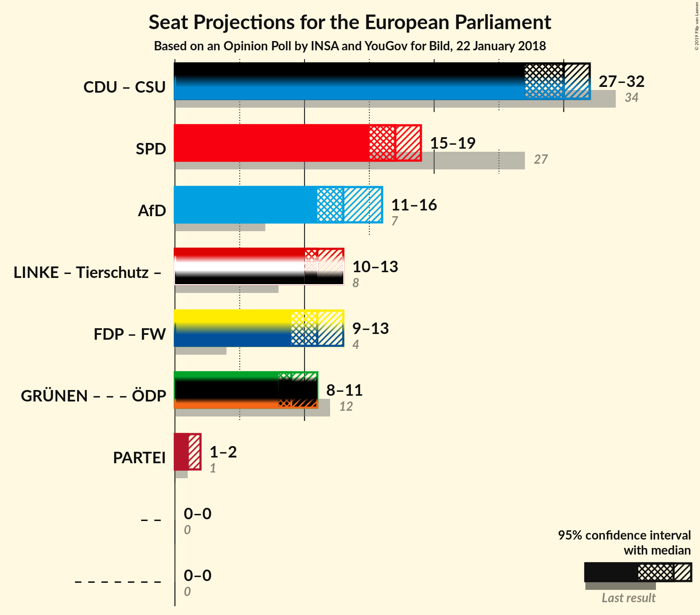

# Opinion Poll by INSA and YouGov for Bild, 22 January 2018

<a href="#voting-intentions">Voting Intentions</a> | <a href="#seats">Seats</a> | <a href="#coalitions">Coalitions</a> | <a href="#technical-information">Technical Information</a>

## Voting Intentions

### Confidence Intervals

| Party | Last Result | Poll Result | 80% Confidence Interval | 90% Confidence Interval | 95% Confidence Interval | 99% Confidence Interval |
|:-----:|:-----------:|:-----------:|:-----------------------:|:-----------------------:|:-----------------------:|:-----------------------:|
| CDU (EPP) | 30.0% | 25.6% | 24.0–27.3% |23.5–27.8% |23.2–28.2% |22.4–29.0% |
| SPD (S&D) | 27.3% | 18.0% | 16.6–19.5% |16.2–19.9% |15.9–20.3% |15.2–21.0% |
| Alternative für Deutschland (EFDD) | 7.0% | 14.0% | 12.8–15.4% |12.5–15.8% |12.1–16.1% |11.6–16.8% |
| DIE LINKE (GUE/NGL) | 7.4% | 11.0% | 9.9–12.3% |9.6–12.7% |9.4–13.0% |8.9–13.6% |
| FDP (ALDE) | 3.4% | 10.0% | 9.0–11.2% |8.7–11.6% |8.4–11.9% |7.9–12.5% |
| BÜNDNIS 90/DIE GRÜNEN (Greens/EFA) | 10.7% | 10.0% | 9.0–11.2% |8.7–11.6% |8.4–11.9% |7.9–12.5% |
| CSU (EPP) | 5.3% | 5.9% | 5.1–6.9% |4.9–7.2% |4.7–7.4% |4.3–7.9% |
| FREIE WÄHLER (ALDE) | 1.5% | 1.1% | 0.8–1.6% |0.7–1.8% |0.7–1.9% |0.5–2.2% |
| Die PARTEI (NI) | 0.6% | 1.1% | 0.8–1.6% |0.7–1.8% |0.7–1.9% |0.5–2.2% |
| Partei Mensch Umwelt Tierschutz (GUE/NGL) | 1.2% | 0.9% | 0.6–1.3% |0.5–1.4% |0.5–1.6% |0.4–1.8% |

*Note:* The poll result column reflects the actual value used in the calculations. Published results may vary slightly, and in addition be rounded to fewer digits.

## Seats

### Confidence Intervals

| Party | Last Result | Median | 80% Confidence Interval | 90% Confidence Interval | 95% Confidence Interval | 99% Confidence Interval |
|:-----:|:-----------:|:------:|:-----------------------:|:-----------------------:|:-----------------------:|:-----------------------:|
| <a href="#cdu-(epp)">CDU (EPP)</a> | 29 | 24 | 23–25 |22–26 |22–26 |21–28 |
| <a href="#spd-(s&d)">SPD (S&D)</a> | 27 | 17 | 16–19 |16–19 |16–19 |15–20 |
| <a href="#alternative-für-deutschland-(efdd)">Alternative für Deutschland (EFDD)</a> | 7 | 13 | 12–14 |11–15 |11–15 |11–16 |
| <a href="#die-linke-(gue/ngl)">DIE LINKE (GUE/NGL)</a> | 7 | 10 | 9–12 |9–13 |9–13 |8–13 |
| <a href="#fdp-(alde)">FDP (ALDE)</a> | 3 | 10 | 9–11 |8–11 |8–11 |8–11 |
| <a href="#bündnis-90/die-grünen-(greens/efa)">BÜNDNIS 90/DIE GRÜNEN (Greens/EFA)</a> | 11 | 10 | 8–11 |8–12 |8–12 |8–12 |
| <a href="#csu-(epp)">CSU (EPP)</a> | 5 | 6 | 5–7 |5–7 |5–7 |4–7 |
| <a href="#freie-wähler-(alde)">FREIE WÄHLER (ALDE)</a> | 1 | 1 | 1–2 |1–2 |1–2 |1–2 |
| <a href="#die-partei-(ni)">Die PARTEI (NI)</a> | 1 | 1 | 1–2 |1–2 |1–2 |0–2 |
| <a href="#partei-mensch-umwelt-tierschutz-(gue/ngl)">Partei Mensch Umwelt Tierschutz (GUE/NGL)</a> | 1 | 1 | 1 |1 |1 |0–2 |

### CDU (EPP)

*For a full overview of the results for this party, see the [CDU (EPP)](party-cduepp.html) page.*

| Number of Seats | Probability | Accumulated | Special Marks |
|:---------------:|:-----------:|:-----------:|:-------------:|
| 21 | 0.5% | 100% |  |
| 22 | 5% | 99.5% |  |
| 23 | 16% | 95% |  |
| 24 | 44% | 78% | Median |
| 25 | 27% | 35% |  |
| 26 | 5% | 7% |  |
| 27 | 1.3% | 2% |  |
| 28 | 0.8% | 0.8% |  |
| 29 | 0% | 0% | Last Result |

### SPD (S&D)

*For a full overview of the results for this party, see the [SPD (S&D)](party-spdsd.html) page.*

| Number of Seats | Probability | Accumulated | Special Marks |
|:---------------:|:-----------:|:-----------:|:-------------:|
| 14 | 0.4% | 100% |  |
| 15 | 2% | 99.6% |  |
| 16 | 22% | 98% |  |
| 17 | 28% | 76% | Median |
| 18 | 21% | 47% |  |
| 19 | 24% | 26% |  |
| 20 | 2% | 2% |  |
| 21 | 0.2% | 0.2% |  |
| 22 | 0% | 0% |  |
| 23 | 0% | 0% |  |
| 24 | 0% | 0% |  |
| 25 | 0% | 0% |  |
| 26 | 0% | 0% |  |
| 27 | 0% | 0% | Last Result |

### Alternative für Deutschland (EFDD)

*For a full overview of the results for this party, see the [Alternative für Deutschland (EFDD)](party-alternativefürdeutschlandefdd.html) page.*

| Number of Seats | Probability | Accumulated | Special Marks |
|:---------------:|:-----------:|:-----------:|:-------------:|
| 7 | 0% | 100% | Last Result |
| 8 | 0% | 100% |  |
| 9 | 0% | 100% |  |
| 10 | 0% | 100% |  |
| 11 | 8% | 100% |  |
| 12 | 27% | 92% |  |
| 13 | 36% | 65% | Median |
| 14 | 20% | 29% |  |
| 15 | 8% | 9% |  |
| 16 | 1.2% | 1.3% |  |
| 17 | 0% | 0% |  |

### DIE LINKE (GUE/NGL)

*For a full overview of the results for this party, see the [DIE LINKE (GUE/NGL)](party-dielinkeguengl.html) page.*

| Number of Seats | Probability | Accumulated | Special Marks |
|:---------------:|:-----------:|:-----------:|:-------------:|
| 7 | 0% | 100% | Last Result |
| 8 | 1.2% | 100% |  |
| 9 | 16% | 98.8% |  |
| 10 | 47% | 83% | Median |
| 11 | 26% | 37% |  |
| 12 | 4% | 10% |  |
| 13 | 6% | 6% |  |
| 14 | 0.3% | 0.3% |  |
| 15 | 0% | 0% |  |

### FDP (ALDE)

*For a full overview of the results for this party, see the [FDP (ALDE)](party-fdpalde.html) page.*

| Number of Seats | Probability | Accumulated | Special Marks |
|:---------------:|:-----------:|:-----------:|:-------------:|
| 3 | 0% | 100% | Last Result |
| 4 | 0% | 100% |  |
| 5 | 0% | 100% |  |
| 6 | 0% | 100% |  |
| 7 | 0.5% | 100% |  |
| 8 | 7% | 99.5% |  |
| 9 | 35% | 93% |  |
| 10 | 31% | 58% | Median |
| 11 | 26% | 27% |  |
| 12 | 0.4% | 0.5% |  |
| 13 | 0.1% | 0.1% |  |
| 14 | 0% | 0% |  |

### BÜNDNIS 90/DIE GRÜNEN (Greens/EFA)

*For a full overview of the results for this party, see the [BÜNDNIS 90/DIE GRÜNEN (Greens/EFA)](party-bündnis90diegrünengreensefa.html) page.*

| Number of Seats | Probability | Accumulated | Special Marks |
|:---------------:|:-----------:|:-----------:|:-------------:|
| 7 | 0.2% | 100% |  |
| 8 | 13% | 99.8% |  |
| 9 | 31% | 87% |  |
| 10 | 27% | 55% | Median |
| 11 | 20% | 28% | Last Result |
| 12 | 7% | 7% |  |
| 13 | 0.1% | 0.1% |  |
| 14 | 0% | 0% |  |

### CSU (EPP)

*For a full overview of the results for this party, see the [CSU (EPP)](party-csuepp.html) page.*

| Number of Seats | Probability | Accumulated | Special Marks |
|:---------------:|:-----------:|:-----------:|:-------------:|
| 4 | 1.4% | 100% |  |
| 5 | 32% | 98.6% | Last Result |
| 6 | 52% | 67% | Median |
| 7 | 15% | 15% |  |
| 8 | 0.1% | 0.1% |  |
| 9 | 0% | 0% |  |

### FREIE WÄHLER (ALDE)

*For a full overview of the results for this party, see the [FREIE WÄHLER (ALDE)](party-freiewähleralde.html) page.*

| Number of Seats | Probability | Accumulated | Special Marks |
|:---------------:|:-----------:|:-----------:|:-------------:|
| 0 | 0.2% | 100% |  |
| 1 | 88% | 99.8% | Last Result, Median |
| 2 | 11% | 11% |  |
| 3 | 0% | 0% |  |

### Die PARTEI (NI)

*For a full overview of the results for this party, see the [Die PARTEI (NI)](party-dieparteini.html) page.*

| Number of Seats | Probability | Accumulated | Special Marks |
|:---------------:|:-----------:|:-----------:|:-------------:|
| 0 | 0.8% | 100% |  |
| 1 | 75% | 99.2% | Last Result, Median |
| 2 | 24% | 25% |  |
| 3 | 0% | 0% |  |

### Partei Mensch Umwelt Tierschutz (GUE/NGL)

*For a full overview of the results for this party, see the [Partei Mensch Umwelt Tierschutz (GUE/NGL)](party-parteimenschumwelttierschutzguengl.html) page.*

| Number of Seats | Probability | Accumulated | Special Marks |
|:---------------:|:-----------:|:-----------:|:-------------:|
| 0 | 2% | 100% |  |
| 1 | 97% | 98% | Last Result, Median |
| 2 | 1.0% | 1.0% |  |
| 3 | 0% | 0% |  |

## Coalitions

### Confidence Intervals

| Coalition | Last Result | Median | Majority? | 80% Confidence Interval | 90% Confidence Interval | 95% Confidence Interval | 99% Confidence Interval |
|:---------:|:-----------:|:------:|:---------:|:-----------------------:|:-----------------------:|:-----------------------:|:-----------------------:|
| CDU (EPP) – CSU (EPP) | 34 | 30 | 0% | 28–32 | 28–32 | 28–32 | 27–34 |
| SPD (S&D) | 27 | 17 | 0% | 16–19 | 16–19 | 16–19 | 15–20 |
| Alternative für Deutschland (EFDD) | 7 | 13 | 0% | 12–14 | 11–15 | 11–15 | 11–16 |
| FDP (ALDE) – FREIE WÄHLER (ALDE) | 4 | 11 | 0% | 10–12 | 9–12 | 9–12 | 9–13 |
| Die PARTEI (NI) | 1 | 1 | 0% | 1–2 | 1–2 | 1–2 | 0–2 |

### CDU (EPP) – CSU (EPP)

| Number of Seats | Probability | Accumulated | Special Marks |
|:---------------:|:-----------:|:-----------:|:-------------:|
| 26 | 0.4% | 100% |  |
| 27 | 0.9% | 99.5% |  |
| 28 | 11% | 98.7% |  |
| 29 | 30% | 87% |  |
| 30 | 22% | 57% | Median |
| 31 | 19% | 36% |  |
| 32 | 14% | 17% |  |
| 33 | 2% | 2% |  |
| 34 | 0.1% | 0.5% | Last Result |
| 35 | 0.4% | 0.4% |  |
| 36 | 0% | 0% |  |

### SPD (S&D)

| Number of Seats | Probability | Accumulated | Special Marks |
|:---------------:|:-----------:|:-----------:|:-------------:|
| 14 | 0.4% | 100% |  |
| 15 | 2% | 99.6% |  |
| 16 | 22% | 98% |  |
| 17 | 28% | 76% | Median |
| 18 | 21% | 47% |  |
| 19 | 24% | 26% |  |
| 20 | 2% | 2% |  |
| 21 | 0.2% | 0.2% |  |
| 22 | 0% | 0% |  |
| 23 | 0% | 0% |  |
| 24 | 0% | 0% |  |
| 25 | 0% | 0% |  |
| 26 | 0% | 0% |  |
| 27 | 0% | 0% | Last Result |

### Alternative für Deutschland (EFDD)

| Number of Seats | Probability | Accumulated | Special Marks |
|:---------------:|:-----------:|:-----------:|:-------------:|
| 7 | 0% | 100% | Last Result |
| 8 | 0% | 100% |  |
| 9 | 0% | 100% |  |
| 10 | 0% | 100% |  |
| 11 | 8% | 100% |  |
| 12 | 27% | 92% |  |
| 13 | 36% | 65% | Median |
| 14 | 20% | 29% |  |
| 15 | 8% | 9% |  |
| 16 | 1.2% | 1.3% |  |
| 17 | 0% | 0% |  |

### FDP (ALDE) – FREIE WÄHLER (ALDE)

| Number of Seats | Probability | Accumulated | Special Marks |
|:---------------:|:-----------:|:-----------:|:-------------:|
| 4 | 0% | 100% | Last Result |
| 5 | 0% | 100% |  |
| 6 | 0% | 100% |  |
| 7 | 0% | 100% |  |
| 8 | 0.5% | 100% |  |
| 9 | 5% | 99.5% |  |
| 10 | 37% | 95% |  |
| 11 | 23% | 58% | Median |
| 12 | 34% | 35% |  |
| 13 | 0.9% | 1.1% |  |
| 14 | 0.2% | 0.2% |  |
| 15 | 0% | 0% |  |

### Die PARTEI (NI)

| Number of Seats | Probability | Accumulated | Special Marks |
|:---------------:|:-----------:|:-----------:|:-------------:|
| 0 | 0.8% | 100% |  |
| 1 | 75% | 99.2% | Last Result, Median |
| 2 | 24% | 25% |  |
| 3 | 0% | 0% |  |

## Technical Information

### Opinion Poll

+ **Polling firm:** INSA and YouGov
+ **Commissioner(s):** Bild
+ **Fieldwork period:** 22 January 2018

### Calculations

+ **Sample size:** 1169
+ **Simulations done:** 131,072
+ **Error estimate:** 1.95%

