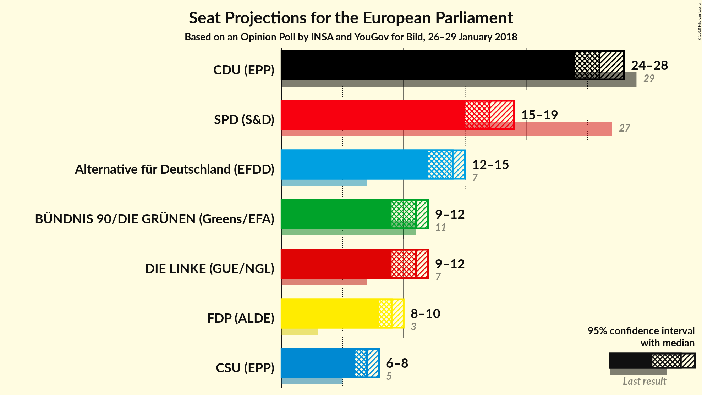
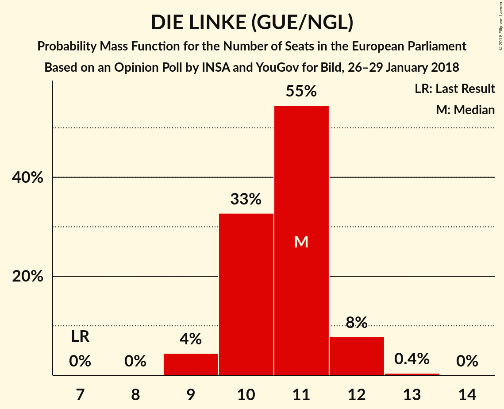
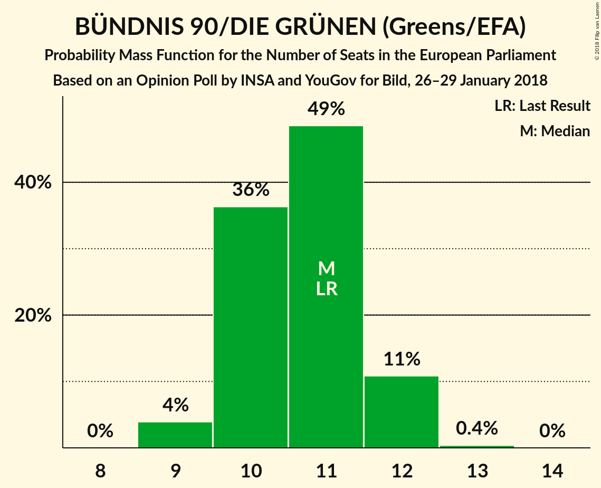
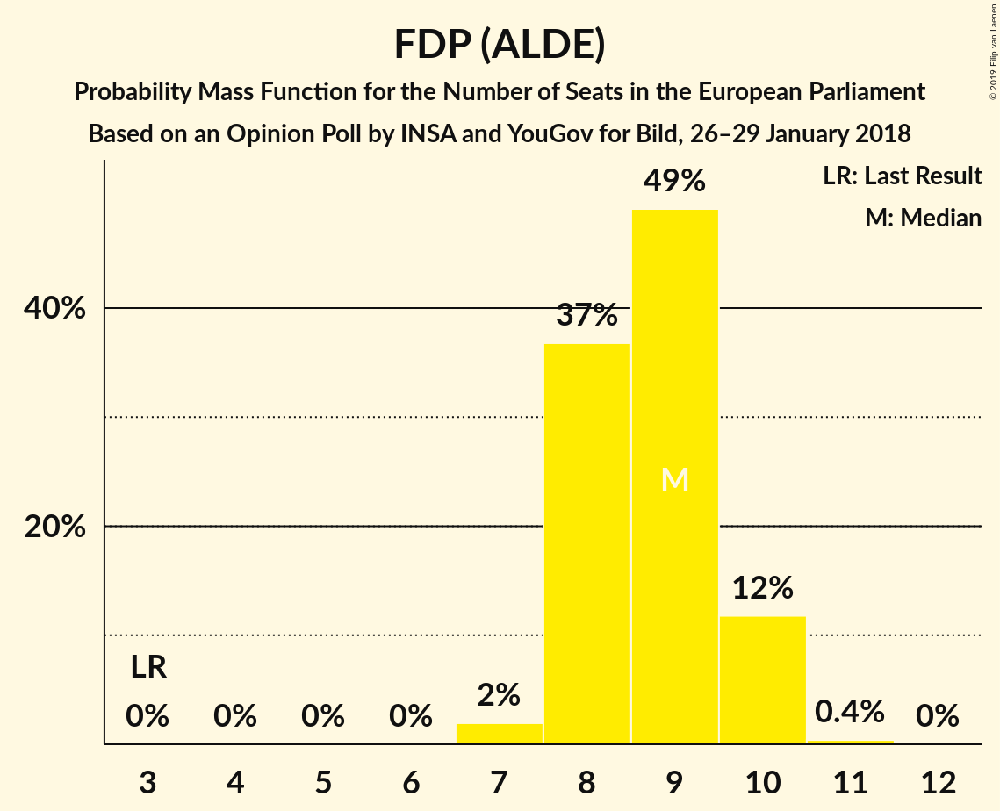
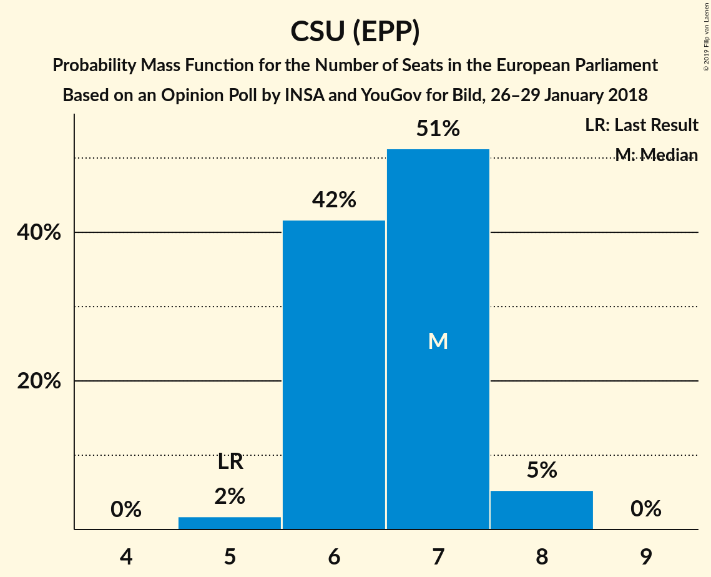
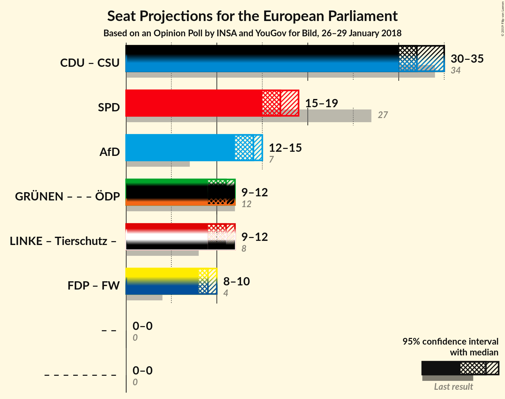

# Opinion Poll by INSA and YouGov for Bild, 26–29 January 2018

<a href="#voting-intentions">Voting Intentions</a> | <a href="#seats">Seats</a> | <a href="#coalitions">Coalitions</a> | <a href="#technical-information">Technical Information</a>

## Voting Intentions

### Confidence Intervals

| Party | Last Result | Poll Result | 80% Confidence Interval | 90% Confidence Interval | 95% Confidence Interval | 99% Confidence Interval |
|:-----:|:-----------:|:-----------:|:-----------------------:|:-----------------------:|:-----------------------:|:-----------------------:|
| CDU (EPP) | 30.0% | 27.0% | 25.7–28.2% |25.4–28.6% |25.1–28.9% |24.5–29.5% |
| SPD (S&D) | 27.3% | 17.7% | 16.6–18.8% |16.3–19.1% |16.1–19.4% |15.6–19.9% |
| Alternative für Deutschland (EFDD) | 7.0% | 14.1% | 13.2–15.2% |12.9–15.5% |12.7–15.7% |12.3–16.2% |
| DIE LINKE (GUE/NGL) | 7.4% | 11.1% | 10.2–12.0% |10.0–12.3% |9.8–12.5% |9.4–13.0% |
| BÜNDNIS 90/DIE GRÜNEN (Greens/EFA) | 10.7% | 11.1% | 10.2–12.0% |10.0–12.3% |9.8–12.5% |9.4–13.0% |
| FDP (ALDE) | 3.4% | 9.1% | 8.3–9.9% |8.1–10.2% |7.9–10.4% |7.5–10.8% |
| CSU (EPP) | 5.3% | 6.8% | 6.2–7.6% |6.0–7.8% |5.8–8.0% |5.5–8.4% |

*Note:* The poll result column reflects the actual value used in the calculations. Published results may vary slightly, and in addition be rounded to fewer digits.

## Seats

### Confidence Intervals

| Party | Last Result | Median | 80% Confidence Interval | 90% Confidence Interval | 95% Confidence Interval | 99% Confidence Interval |
|:-----:|:-----------:|:------:|:-----------------------:|:-----------------------:|:-----------------------:|:-----------------------:|
| <a href="#cdu-(epp)">CDU (EPP)</a> | 29 | 26 | 25–27 |24–27 |24–28 |23–28 |
| <a href="#spd-(s&d)">SPD (S&D)</a> | 27 | 17 | 16–18 |16–18 |15–19 |15–19 |
| <a href="#alternative-für-deutschland-(efdd)">Alternative für Deutschland (EFDD)</a> | 7 | 14 | 13–15 |12–15 |12–15 |12–16 |
| <a href="#die-linke-(gue/ngl)">DIE LINKE (GUE/NGL)</a> | 7 | 11 | 10–11 |10–12 |9–12 |9–12 |
| <a href="#bÜndnis-90/die-grÜnen-(greens/efa)">BÜNDNIS 90/DIE GRÜNEN (Greens/EFA)</a> | 11 | 11 | 10–12 |10–12 |9–12 |9–12 |
| <a href="#fdp-(alde)">FDP (ALDE)</a> | 3 | 9 | 8–10 |8–10 |8–10 |7–10 |
| <a href="#csu-(epp)">CSU (EPP)</a> | 5 | 7 | 6–7 |6–8 |6–8 |5–8 |

### CDU (EPP)

*For a full overview of the results for this party, see the [CDU (EPP)](party-cduepp.html) page.*

| Number of Seats | Probability | Accumulated | Special Marks |
|:---------------:|:-----------:|:-----------:|:-------------:|
| 23 | 0.6% | 100% |  |
| 24 | 7% | 99.4% |  |
| 25 | 29% | 92% |  |
| 26 | 39% | 63% | Median |
| 27 | 20% | 24% |  |
| 28 | 4% | 4% |  |
| 29 | 0.3% | 0.3% | Last Result |
| 30 | 0% | 0% |  |

### SPD (S&D)

*For a full overview of the results for this party, see the [SPD (S&D)](party-spdsd.html) page.*

| Number of Seats | Probability | Accumulated | Special Marks |
|:---------------:|:-----------:|:-----------:|:-------------:|
| 14 | 0.1% | 100% |  |
| 15 | 4% | 99.9% |  |
| 16 | 27% | 96% |  |
| 17 | 44% | 69% | Median |
| 18 | 22% | 25% |  |
| 19 | 3% | 3% |  |
| 20 | 0.1% | 0.1% |  |
| 21 | 0% | 0% |  |
| 22 | 0% | 0% |  |
| 23 | 0% | 0% |  |
| 24 | 0% | 0% |  |
| 25 | 0% | 0% |  |
| 26 | 0% | 0% |  |
| 27 | 0% | 0% | Last Result |

### Alternative für Deutschland (EFDD)

*For a full overview of the results for this party, see the [Alternative für Deutschland (EFDD)](party-alternativefürdeutschlandefdd.html) page.*

| Number of Seats | Probability | Accumulated | Special Marks |
|:---------------:|:-----------:|:-----------:|:-------------:|
| 7 | 0% | 100% | Last Result |
| 8 | 0% | 100% |  |
| 9 | 0% | 100% |  |
| 10 | 0% | 100% |  |
| 11 | 0.2% | 100% |  |
| 12 | 7% | 99.8% |  |
| 13 | 41% | 93% |  |
| 14 | 42% | 52% | Median |
| 15 | 10% | 10% |  |
| 16 | 0.6% | 0.6% |  |
| 17 | 0% | 0% |  |

### DIE LINKE (GUE/NGL)

*For a full overview of the results for this party, see the [DIE LINKE (GUE/NGL)](party-dielinkeguengl.html) page.*

| Number of Seats | Probability | Accumulated | Special Marks |
|:---------------:|:-----------:|:-----------:|:-------------:|
| 7 | 0% | 100% | Last Result |
| 8 | 0% | 100% |  |
| 9 | 4% | 100% |  |
| 10 | 36% | 96% |  |
| 11 | 50% | 60% | Median |
| 12 | 10% | 10% |  |
| 13 | 0.4% | 0.4% |  |
| 14 | 0% | 0% |  |

### BÜNDNIS 90/DIE GRÜNEN (Greens/EFA)

*For a full overview of the results for this party, see the [BÜNDNIS 90/DIE GRÜNEN (Greens/EFA)](party-bÜndnis90diegrÜnengreensefa.html) page.*

| Number of Seats | Probability | Accumulated | Special Marks |
|:---------------:|:-----------:|:-----------:|:-------------:|
| 9 | 4% | 100% |  |
| 10 | 37% | 96% |  |
| 11 | 48% | 59% | Last Result, Median |
| 12 | 10% | 11% |  |
| 13 | 0.4% | 0.4% |  |
| 14 | 0% | 0% |  |

### FDP (ALDE)

*For a full overview of the results for this party, see the [FDP (ALDE)](party-fdpalde.html) page.*

| Number of Seats | Probability | Accumulated | Special Marks |
|:---------------:|:-----------:|:-----------:|:-------------:|
| 3 | 0% | 100% | Last Result |
| 4 | 0% | 100% |  |
| 5 | 0% | 100% |  |
| 6 | 0% | 100% |  |
| 7 | 2% | 100% |  |
| 8 | 36% | 98% |  |
| 9 | 50% | 62% | Median |
| 10 | 11% | 12% |  |
| 11 | 0.3% | 0.3% |  |
| 12 | 0% | 0% |  |

### CSU (EPP)

*For a full overview of the results for this party, see the [CSU (EPP)](party-csuepp.html) page.*

| Number of Seats | Probability | Accumulated | Special Marks |
|:---------------:|:-----------:|:-----------:|:-------------:|
| 5 | 2% | 100% | Last Result |
| 6 | 42% | 98% |  |
| 7 | 51% | 56% | Median |
| 8 | 5% | 6% |  |
| 9 | 0% | 0% |  |

## Coalitions

### Confidence Intervals

| Coalition | Last Result | Median | Majority? | 80% Confidence Interval | 90% Confidence Interval | 95% Confidence Interval | 99% Confidence Interval |
|:---------:|:-----------:|:------:|:---------:|:-----------------------:|:-----------------------:|:-----------------------:|:-----------------------:|
| CDU (EPP) – CSU (EPP) | 34 | 32 | 0% | 31–34 | 31–34 | 30–35 | 30–35 |
| SPD (S&D) | 27 | 17 | 0% | 16–18 | 16–18 | 15–19 | 15–19 |
| Alternative für Deutschland (EFDD) | 7 | 14 | 0% | 13–15 | 12–15 | 12–15 | 12–16 |

### CDU (EPP) – CSU (EPP)

| Number of Seats | Probability | Accumulated | Special Marks |
|:---------------:|:-----------:|:-----------:|:-------------:|
| 29 | 0.2% | 100% |  |
| 30 | 3% | 99.8% |  |
| 31 | 15% | 97% |  |
| 32 | 35% | 82% |  |
| 33 | 32% | 47% | Median |
| 34 | 12% | 15% | Last Result |
| 35 | 2% | 3% |  |
| 36 | 0.2% | 0.2% |  |
| 37 | 0% | 0% |  |

### SPD (S&D)

| Number of Seats | Probability | Accumulated | Special Marks |
|:---------------:|:-----------:|:-----------:|:-------------:|
| 14 | 0.1% | 100% |  |
| 15 | 4% | 99.9% |  |
| 16 | 27% | 96% |  |
| 17 | 44% | 69% | Median |
| 18 | 22% | 25% |  |
| 19 | 3% | 3% |  |
| 20 | 0.1% | 0.1% |  |
| 21 | 0% | 0% |  |
| 22 | 0% | 0% |  |
| 23 | 0% | 0% |  |
| 24 | 0% | 0% |  |
| 25 | 0% | 0% |  |
| 26 | 0% | 0% |  |
| 27 | 0% | 0% | Last Result |

### Alternative für Deutschland (EFDD)

| Number of Seats | Probability | Accumulated | Special Marks |
|:---------------:|:-----------:|:-----------:|:-------------:|
| 7 | 0% | 100% | Last Result |
| 8 | 0% | 100% |  |
| 9 | 0% | 100% |  |
| 10 | 0% | 100% |  |
| 11 | 0.2% | 100% |  |
| 12 | 7% | 99.8% |  |
| 13 | 41% | 93% |  |
| 14 | 42% | 52% | Median |
| 15 | 10% | 10% |  |
| 16 | 0.6% | 0.6% |  |
| 17 | 0% | 0% |  |

## Technical Information

### Opinion Poll

+ **Polling firm:** INSA and YouGov
+ **Commissioner(s):** Bild
+ **Fieldwork period:** 26–29 January 2018

### Calculations

+ **Sample size:** 2073
+ **Simulations done:** 2,097,152
+ **Error estimate:** 0.90%

