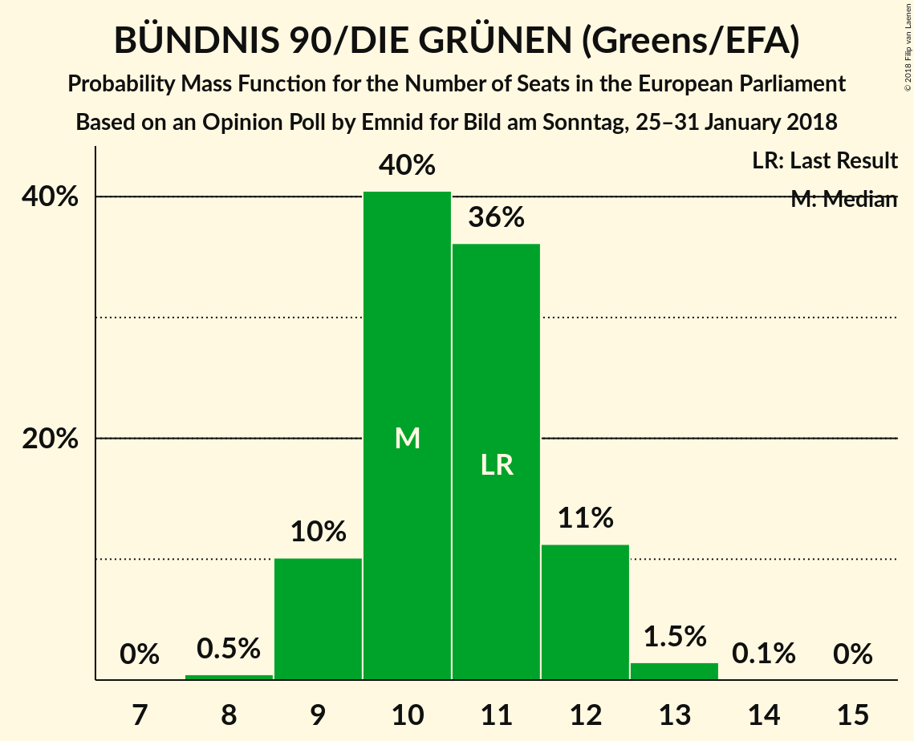
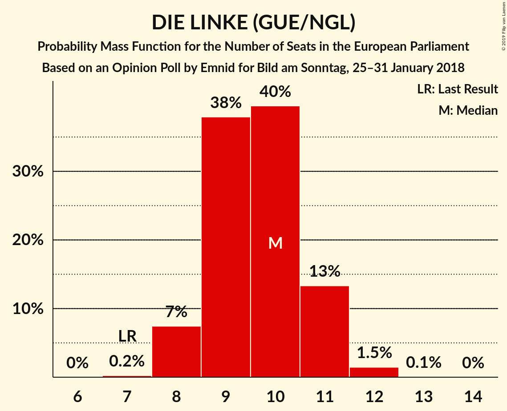

# Opinion Poll by Emnid for Bild am Sonntag, 25–31 January 2018

<a href="#voting-intentions">Voting Intentions</a> | <a href="#seats">Seats</a> | <a href="#coalitions">Coalitions</a> | <a href="#technical-information">Technical Information</a>

## Voting Intentions

### Confidence Intervals

| Party | Last Result | Poll Result | 80% Confidence Interval | 90% Confidence Interval | 95% Confidence Interval | 99% Confidence Interval |
|:-----:|:-----------:|:-----------:|:-----------------------:|:-----------------------:|:-----------------------:|:-----------------------:|
| CDU (EPP) | 30.0% | 28.0% | 26.4–29.7% |25.9–30.1% |25.6–30.6% |24.8–31.4% |
| SPD (S&D) | 27.3% | 20.0% | 18.6–21.5% |18.2–21.9% |17.8–22.3% |17.2–23.0% |
| Alternative für Deutschland (EFDD) | 7.0% | 13.0% | 11.8–14.3% |11.5–14.7% |11.2–15.0% |10.7–15.6% |
| BÜNDNIS 90/DIE GRÜNEN (Greens/EFA) | 10.7% | 11.0% | 9.9–12.2% |9.6–12.5% |9.4–12.8% |8.9–13.5% |
| DIE LINKE (GUE/NGL) | 7.4% | 10.0% | 9.0–11.2% |8.7–11.5% |8.5–11.8% |8.0–12.4% |
| FDP (ALDE) | 3.4% | 9.0% | 8.0–10.1% |7.7–10.4% |7.5–10.7% |7.1–11.3% |
| CSU (EPP) | 5.3% | 5.0% | 4.3–5.9% |4.1–6.1% |3.9–6.3% |3.6–6.8% |

*Note:* The poll result column reflects the actual value used in the calculations. Published results may vary slightly, and in addition be rounded to fewer digits.

## Seats

### Confidence Intervals

| Party | Last Result | Median | 80% Confidence Interval | 90% Confidence Interval | 95% Confidence Interval | 99% Confidence Interval |
|:-----:|:-----------:|:------:|:-----------------------:|:-----------------------:|:-----------------------:|:-----------------------:|
| <a href="#cdu-(epp)">CDU (EPP)</a> | 29 | 27 | 25–28 |25–29 |24–29 |24–30 |
| <a href="#spd-(s&d)">SPD (S&D)</a> | 27 | 19 | 18–20 |17–21 |17–21 |16–22 |
| <a href="#alternative-für-deutschland-(efdd)">Alternative für Deutschland (EFDD)</a> | 7 | 13 | 11–13 |11–14 |11–14 |10–15 |
| <a href="#bÜndnis-90/die-grÜnen-(greens/efa)">BÜNDNIS 90/DIE GRÜNEN (Greens/EFA)</a> | 11 | 10 | 10–12 |9–12 |9–12 |9–13 |
| <a href="#die-linke-(gue/ngl)">DIE LINKE (GUE/NGL)</a> | 7 | 10 | 9–11 |8–11 |8–11 |8–12 |
| <a href="#fdp-(alde)">FDP (ALDE)</a> | 3 | 9 | 8–10 |7–10 |7–10 |7–11 |
| <a href="#csu-(epp)">CSU (EPP)</a> | 5 | 5 | 4–6 |4–6 |4–6 |3–7 |

### CDU (EPP)

*For a full overview of the results for this party, see the [CDU (EPP)](party-cduepp.html) page.*

| Number of Seats | Probability | Accumulated | Special Marks |
|:---------------:|:-----------:|:-----------:|:-------------:|
| 23 | 0.2% | 100% |  |
| 24 | 5% | 99.8% |  |
| 25 | 7% | 95% |  |
| 26 | 27% | 88% |  |
| 27 | 27% | 61% | Median |
| 28 | 27% | 34% |  |
| 29 | 5% | 7% | Last Result |
| 30 | 1.5% | 2% |  |
| 31 | 0.1% | 0.1% |  |
| 32 | 0% | 0% |  |

### SPD (S&D)

*For a full overview of the results for this party, see the [SPD (S&D)](party-spdsd.html) page.*

| Number of Seats | Probability | Accumulated | Special Marks |
|:---------------:|:-----------:|:-----------:|:-------------:|
| 16 | 0.9% | 100% |  |
| 17 | 6% | 99.1% |  |
| 18 | 28% | 94% |  |
| 19 | 32% | 66% | Median |
| 20 | 24% | 33% |  |
| 21 | 7% | 9% |  |
| 22 | 1.4% | 2% |  |
| 23 | 0.1% | 0.1% |  |
| 24 | 0% | 0% |  |
| 25 | 0% | 0% |  |
| 26 | 0% | 0% |  |
| 27 | 0% | 0% | Last Result |

### Alternative für Deutschland (EFDD)

*For a full overview of the results for this party, see the [Alternative für Deutschland (EFDD)](party-alternativefürdeutschlandefdd.html) page.*

| Number of Seats | Probability | Accumulated | Special Marks |
|:---------------:|:-----------:|:-----------:|:-------------:|
| 7 | 0% | 100% | Last Result |
| 8 | 0% | 100% |  |
| 9 | 0% | 100% |  |
| 10 | 2% | 100% |  |
| 11 | 17% | 98% |  |
| 12 | 25% | 81% |  |
| 13 | 47% | 56% | Median |
| 14 | 7% | 9% |  |
| 15 | 1.5% | 2% |  |
| 16 | 0.1% | 0.1% |  |
| 17 | 0% | 0% |  |

### BÜNDNIS 90/DIE GRÜNEN (Greens/EFA)

*For a full overview of the results for this party, see the [BÜNDNIS 90/DIE GRÜNEN (Greens/EFA)](party-bÜndnis90diegrÜnengreensefa.html) page.*

| Number of Seats | Probability | Accumulated | Special Marks |
|:---------------:|:-----------:|:-----------:|:-------------:|
| 8 | 0.4% | 100% |  |
| 9 | 8% | 99.6% |  |
| 10 | 42% | 91% | Median |
| 11 | 36% | 50% | Last Result |
| 12 | 12% | 14% |  |
| 13 | 1.3% | 1.4% |  |
| 14 | 0.1% | 0.1% |  |
| 15 | 0% | 0% |  |

### DIE LINKE (GUE/NGL)

*For a full overview of the results for this party, see the [DIE LINKE (GUE/NGL)](party-dielinkeguengl.html) page.*

| Number of Seats | Probability | Accumulated | Special Marks |
|:---------------:|:-----------:|:-----------:|:-------------:|
| 7 | 0.3% | 100% | Last Result |
| 8 | 7% | 99.7% |  |
| 9 | 35% | 93% |  |
| 10 | 43% | 58% | Median |
| 11 | 13% | 15% |  |
| 12 | 2% | 2% |  |
| 13 | 0.1% | 0.1% |  |
| 14 | 0% | 0% |  |

### FDP (ALDE)

*For a full overview of the results for this party, see the [FDP (ALDE)](party-fdpalde.html) page.*

| Number of Seats | Probability | Accumulated | Special Marks |
|:---------------:|:-----------:|:-----------:|:-------------:|
| 3 | 0% | 100% | Last Result |
| 4 | 0% | 100% |  |
| 5 | 0% | 100% |  |
| 6 | 0.2% | 100% |  |
| 7 | 9% | 99.8% |  |
| 8 | 35% | 91% |  |
| 9 | 43% | 56% | Median |
| 10 | 12% | 13% |  |
| 11 | 0.9% | 0.9% |  |
| 12 | 0% | 0% |  |

### CSU (EPP)

*For a full overview of the results for this party, see the [CSU (EPP)](party-csuepp.html) page.*

| Number of Seats | Probability | Accumulated | Special Marks |
|:---------------:|:-----------:|:-----------:|:-------------:|
| 3 | 0.6% | 100% |  |
| 4 | 28% | 99.4% |  |
| 5 | 56% | 71% | Last Result, Median |
| 6 | 15% | 15% |  |
| 7 | 0.6% | 0.6% |  |
| 8 | 0% | 0% |  |

## Coalitions

### Confidence Intervals

| Coalition | Last Result | Median | Majority? | 80% Confidence Interval | 90% Confidence Interval | 95% Confidence Interval | 99% Confidence Interval |
|:---------:|:-----------:|:------:|:---------:|:-----------------------:|:-----------------------:|:-----------------------:|:-----------------------:|
| CDU (EPP) – CSU (EPP) | 34 | 32 | 0% | 30–33 | 29–34 | 29–34 | 29–35 |
| SPD (S&D) | 27 | 19 | 0% | 18–20 | 17–21 | 17–21 | 16–22 |
| Alternative für Deutschland (EFDD) | 7 | 13 | 0% | 11–13 | 11–14 | 11–14 | 10–15 |

### CDU (EPP) – CSU (EPP)

| Number of Seats | Probability | Accumulated | Special Marks |
|:---------------:|:-----------:|:-----------:|:-------------:|
| 28 | 0.4% | 100% |  |
| 29 | 6% | 99.5% |  |
| 30 | 12% | 93% |  |
| 31 | 23% | 81% |  |
| 32 | 25% | 58% | Median |
| 33 | 28% | 33% |  |
| 34 | 5% | 6% | Last Result |
| 35 | 1.0% | 1.2% |  |
| 36 | 0.2% | 0.2% |  |
| 37 | 0% | 0% |  |

### SPD (S&D)

| Number of Seats | Probability | Accumulated | Special Marks |
|:---------------:|:-----------:|:-----------:|:-------------:|
| 16 | 0.9% | 100% |  |
| 17 | 6% | 99.1% |  |
| 18 | 28% | 94% |  |
| 19 | 32% | 66% | Median |
| 20 | 24% | 33% |  |
| 21 | 7% | 9% |  |
| 22 | 1.4% | 2% |  |
| 23 | 0.1% | 0.1% |  |
| 24 | 0% | 0% |  |
| 25 | 0% | 0% |  |
| 26 | 0% | 0% |  |
| 27 | 0% | 0% | Last Result |

### Alternative für Deutschland (EFDD)

| Number of Seats | Probability | Accumulated | Special Marks |
|:---------------:|:-----------:|:-----------:|:-------------:|
| 7 | 0% | 100% | Last Result |
| 8 | 0% | 100% |  |
| 9 | 0% | 100% |  |
| 10 | 2% | 100% |  |
| 11 | 17% | 98% |  |
| 12 | 25% | 81% |  |
| 13 | 47% | 56% | Median |
| 14 | 7% | 9% |  |
| 15 | 1.5% | 2% |  |
| 16 | 0.1% | 0.1% |  |
| 17 | 0% | 0% |  |

## Technical Information

### Opinion Poll

+ **Polling firm:** Emnid
+ **Commissioner(s):** Bild am Sonntag
+ **Fieldwork period:** 25–31 January 2018

### Calculations

+ **Sample size:** 1247
+ **Simulations done:** 131,072
+ **Error estimate:** 1.42%

