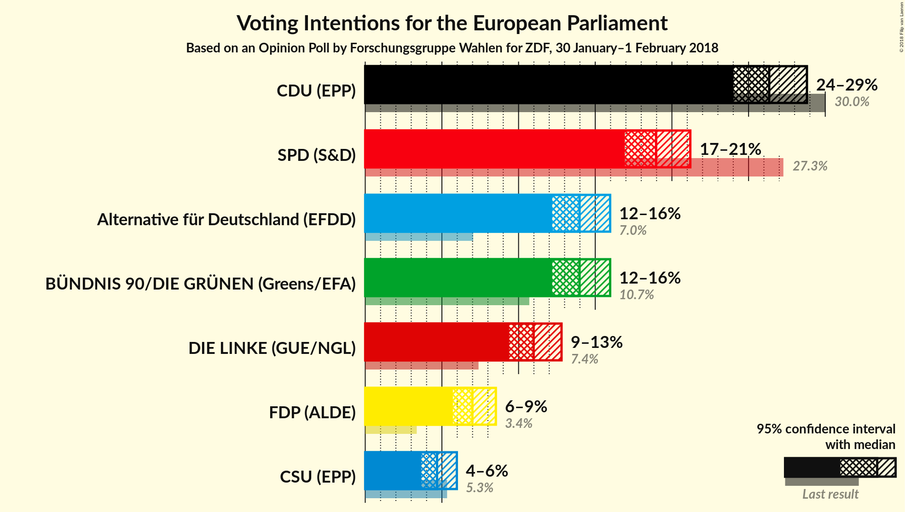
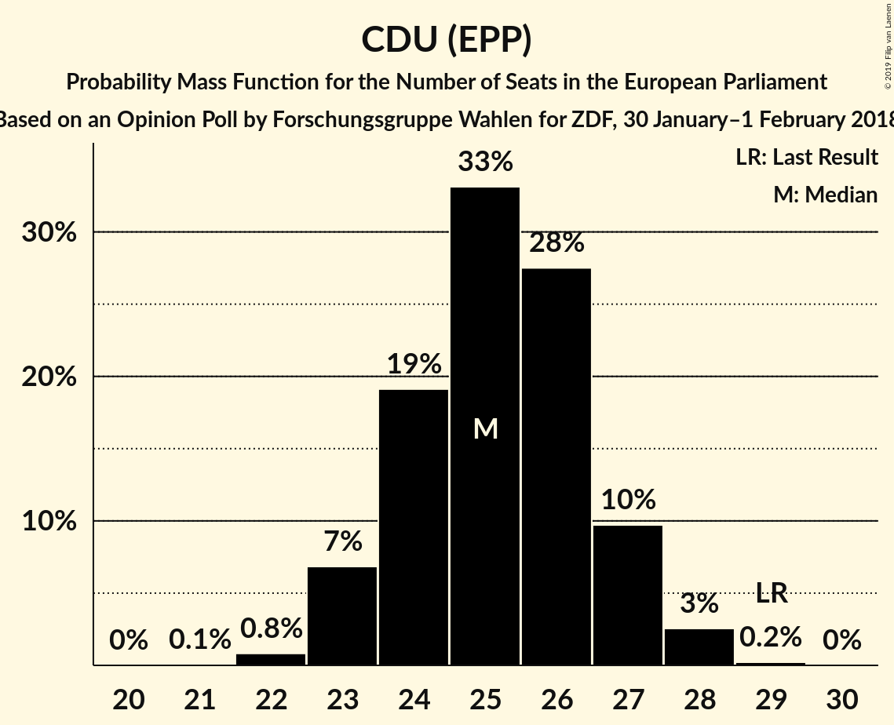
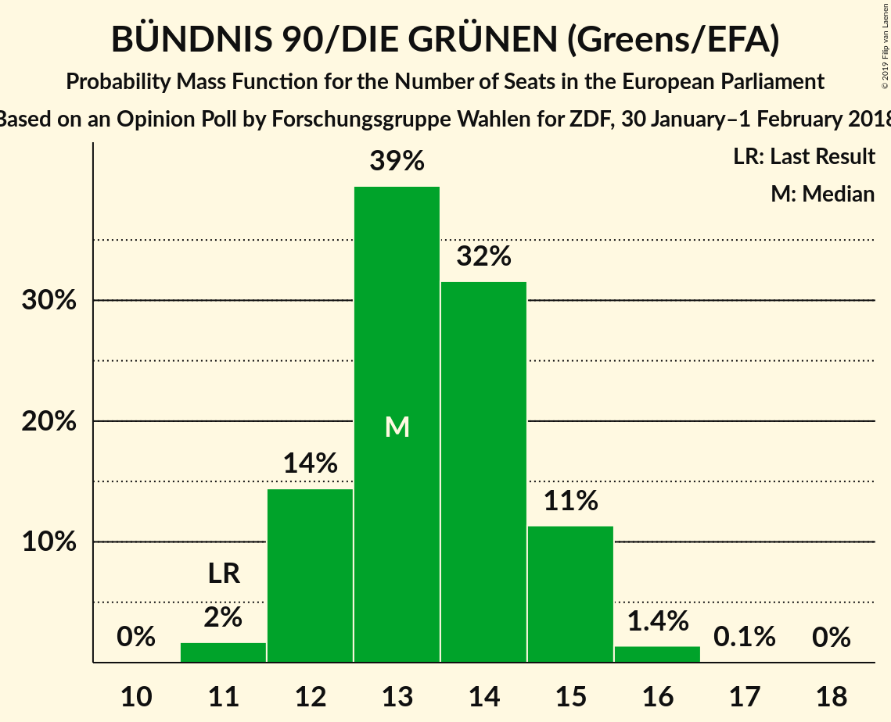
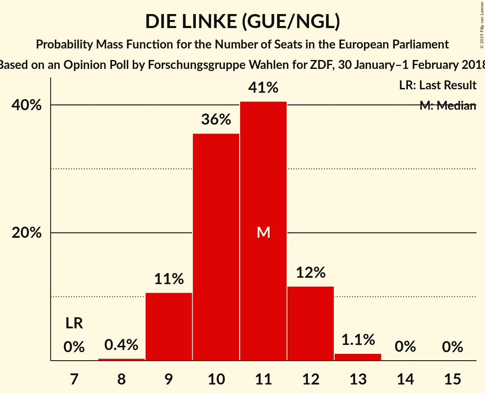
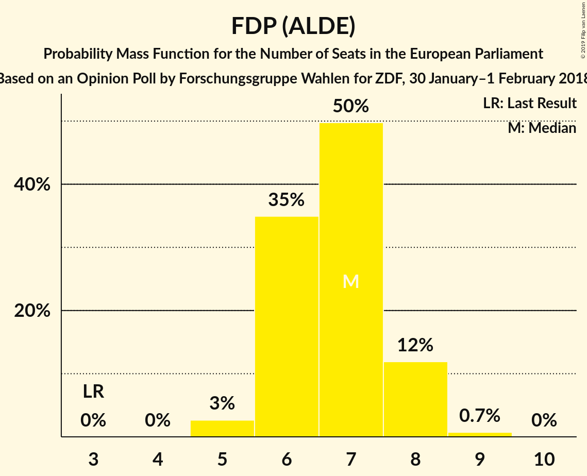
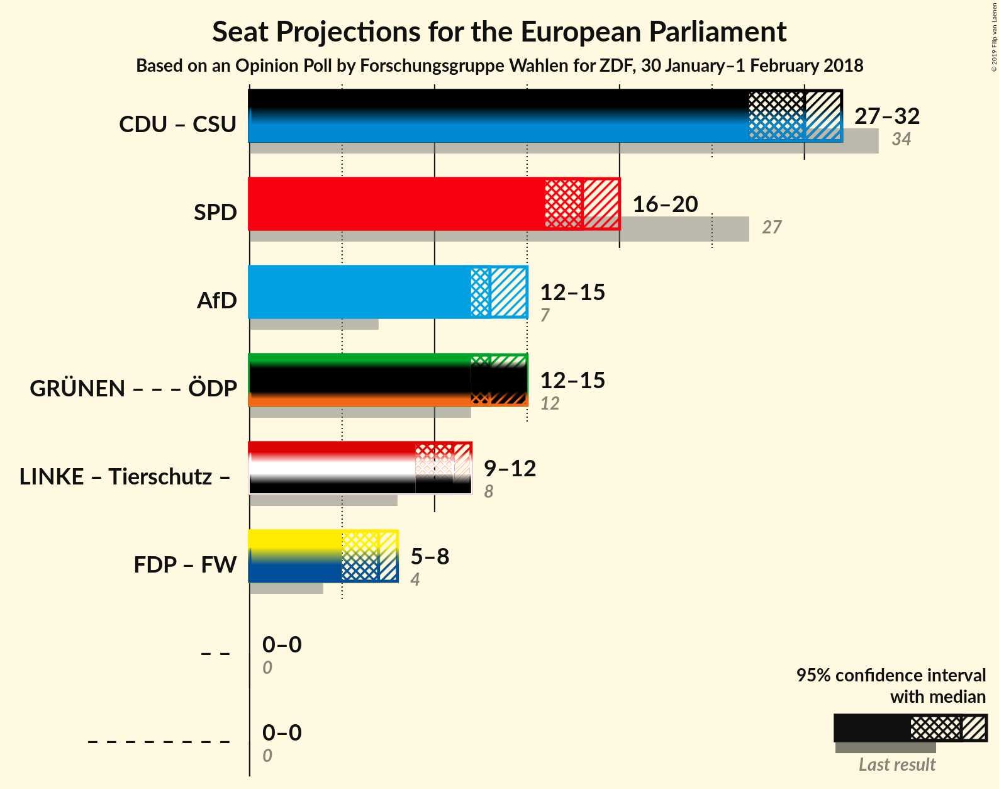
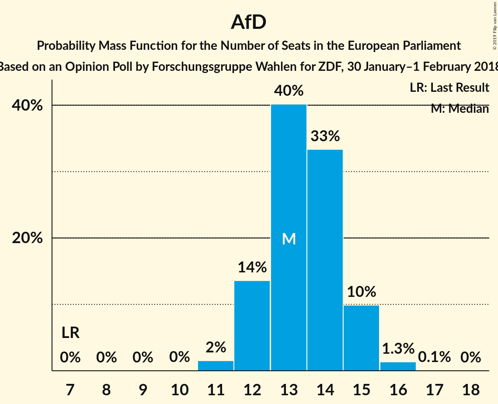

# Opinion Poll by Forschungsgruppe Wahlen for ZDF, 30 January–1 February 2018

<a href="#voting-intentions">Voting Intentions</a> | <a href="#seats">Seats</a> | <a href="#coalitions">Coalitions</a> | <a href="#technical-information">Technical Information</a>

## Voting Intentions

### Confidence Intervals

| Party | Last Result | Poll Result | 80% Confidence Interval | 90% Confidence Interval | 95% Confidence Interval | 99% Confidence Interval |
|:-----:|:-----------:|:-----------:|:-----------------------:|:-----------------------:|:-----------------------:|:-----------------------:|
| CDU (EPP) | 30.0% | 26.3% | 24.8–28.0% |24.4–28.4% |24.0–28.8% |23.3–29.6% |
| SPD (S&D) | 27.3% | 19.0% | 17.6–20.4% |17.3–20.8% |16.9–21.2% |16.3–21.9% |
| Alternative für Deutschland (EAPN) | 7.0% | 14.0% | 12.8–15.3% |12.5–15.7% |12.2–16.0% |11.7–16.6% |
| BÜNDNIS 90/DIE GRÜNEN (Greens/EFA) | 10.7% | 14.0% | 12.8–15.3% |12.5–15.7% |12.2–16.0% |11.7–16.6% |
| DIE LINKE (GUE/NGL) | 7.4% | 11.0% | 9.9–12.2% |9.6–12.5% |9.4–12.8% |8.9–13.4% |
| FDP (ALDE) | 3.4% | 7.0% | 6.2–8.0% |5.9–8.3% |5.7–8.5% |5.3–9.0% |
| CSU (EPP) | 5.3% | 4.7% | 4.0–5.5% |3.8–5.8% |3.7–6.0% |3.4–6.4% |
| FREIE WÄHLER (ALDE) | 1.5% | 0.8% | N/A |N/A |N/A |N/A |
| Die PARTEI (NI) | 0.6% | 0.8% | N/A |N/A |N/A |N/A |
| Partei Mensch Umwelt Tierschutz (GUE/NGL) | 1.2% | 0.6% | N/A |N/A |N/A |N/A |

*Note:* The poll result column reflects the actual value used in the calculations. Published results may vary slightly, and in addition be rounded to fewer digits.

## Seats

### Confidence Intervals

| Party | Last Result | Median | 80% Confidence Interval | 90% Confidence Interval | 95% Confidence Interval | 99% Confidence Interval |
|:-----:|:-----------:|:------:|:-----------------------:|:-----------------------:|:-----------------------:|:-----------------------:|
| <a href="#cdu-(epp)">CDU (EPP)</a> | 29 | 25 | 24–27 |23–27 |23–28 |22–28 |
| <a href="#spd-(s&d)">SPD (S&D)</a> | 27 | 18 | 17–19 |17–20 |16–20 |16–21 |
| <a href="#alternative-für-deutschland-(eapn)">Alternative für Deutschland (EAPN)</a> | 7 | 13 | 12–15 |12–15 |12–15 |11–16 |
| <a href="#bündnis-90/die-grünen-(greens/efa)">BÜNDNIS 90/DIE GRÜNEN (Greens/EFA)</a> | 11 | 13 | 12–15 |12–15 |12–15 |11–16 |
| <a href="#die-linke-(gue/ngl)">DIE LINKE (GUE/NGL)</a> | 7 | 11 | 9–12 |9–12 |9–12 |9–13 |
| <a href="#fdp-(alde)">FDP (ALDE)</a> | 3 | 7 | 6–8 |6–8 |5–8 |5–9 |
| <a href="#csu-(epp)">CSU (EPP)</a> | 5 | 5 | 4–5 |4–6 |4–6 |3–6 |
| <a href="#freie-wähler-(alde)">FREIE WÄHLER (ALDE)</a> | 1 | N/A | N/A |N/A |N/A |N/A |
| <a href="#die-partei-(ni)">Die PARTEI (NI)</a> | 1 | N/A | N/A |N/A |N/A |N/A |
| <a href="#partei-mensch-umwelt-tierschutz-(gue/ngl)">Partei Mensch Umwelt Tierschutz (GUE/NGL)</a> | 1 | N/A | N/A |N/A |N/A |N/A |

### CDU (EPP)

*For a full overview of the results for this party, see the [CDU (EPP)](party-cduepp.html) page.*

| Number of Seats | Probability | Accumulated | Special Marks |
|:---------------:|:-----------:|:-----------:|:-------------:|
| 21 | 0.1% | 100% |  |
| 22 | 0.8% | 99.9% |  |
| 23 | 7% | 99.1% |  |
| 24 | 19% | 92% |  |
| 25 | 33% | 73% | Median |
| 26 | 28% | 40% |  |
| 27 | 10% | 13% |  |
| 28 | 3% | 3% |  |
| 29 | 0.2% | 0.2% | Last Result |
| 30 | 0% | 0% |  |

### SPD (S&D)

*For a full overview of the results for this party, see the [SPD (S&D)](party-spdsd.html) page.*

| Number of Seats | Probability | Accumulated | Special Marks |
|:---------------:|:-----------:|:-----------:|:-------------:|
| 15 | 0.4% | 100% |  |
| 16 | 4% | 99.6% |  |
| 17 | 22% | 95% |  |
| 18 | 35% | 73% | Median |
| 19 | 28% | 38% |  |
| 20 | 8% | 10% |  |
| 21 | 2% | 2% |  |
| 22 | 0.1% | 0.1% |  |
| 23 | 0% | 0% |  |
| 24 | 0% | 0% |  |
| 25 | 0% | 0% |  |
| 26 | 0% | 0% |  |
| 27 | 0% | 0% | Last Result |

### Alternative für Deutschland (EAPN)

*For a full overview of the results for this party, see the [Alternative für Deutschland (EAPN)](party-alternativefürdeutschlandeapn.html) page.*

| Number of Seats | Probability | Accumulated | Special Marks |
|:---------------:|:-----------:|:-----------:|:-------------:|
| 7 | 0% | 100% | Last Result |
| 8 | 0% | 100% |  |
| 9 | 0% | 100% |  |
| 10 | 0% | 100% |  |
| 11 | 2% | 100% |  |
| 12 | 14% | 98% |  |
| 13 | 40% | 85% | Median |
| 14 | 33% | 45% |  |
| 15 | 10% | 11% |  |
| 16 | 1.3% | 1.4% |  |
| 17 | 0.1% | 0.1% |  |
| 18 | 0% | 0% |  |

### BÜNDNIS 90/DIE GRÜNEN (Greens/EFA)

*For a full overview of the results for this party, see the [BÜNDNIS 90/DIE GRÜNEN (Greens/EFA)](party-bündnis90diegrünengreensefa.html) page.*

| Number of Seats | Probability | Accumulated | Special Marks |
|:---------------:|:-----------:|:-----------:|:-------------:|
| 11 | 2% | 100% | Last Result |
| 12 | 14% | 98% |  |
| 13 | 39% | 84% | Median |
| 14 | 32% | 44% |  |
| 15 | 11% | 13% |  |
| 16 | 1.4% | 1.4% |  |
| 17 | 0.1% | 0.1% |  |
| 18 | 0% | 0% |  |

### DIE LINKE (GUE/NGL)

*For a full overview of the results for this party, see the [DIE LINKE (GUE/NGL)](party-dielinkeguengl.html) page.*

| Number of Seats | Probability | Accumulated | Special Marks |
|:---------------:|:-----------:|:-----------:|:-------------:|
| 7 | 0% | 100% | Last Result |
| 8 | 0.4% | 100% |  |
| 9 | 11% | 99.6% |  |
| 10 | 36% | 89% |  |
| 11 | 41% | 53% | Median |
| 12 | 12% | 13% |  |
| 13 | 1.1% | 1.2% |  |
| 14 | 0% | 0.1% |  |
| 15 | 0% | 0% |  |

### FDP (ALDE)

*For a full overview of the results for this party, see the [FDP (ALDE)](party-fdpalde.html) page.*

| Number of Seats | Probability | Accumulated | Special Marks |
|:---------------:|:-----------:|:-----------:|:-------------:|
| 3 | 0% | 100% | Last Result |
| 4 | 0% | 100% |  |
| 5 | 3% | 100% |  |
| 6 | 35% | 97% |  |
| 7 | 50% | 62% | Median |
| 8 | 12% | 13% |  |
| 9 | 0.7% | 0.7% |  |
| 10 | 0% | 0% |  |

### CSU (EPP)

*For a full overview of the results for this party, see the [CSU (EPP)](party-csuepp.html) page.*

| Number of Seats | Probability | Accumulated | Special Marks |
|:---------------:|:-----------:|:-----------:|:-------------:|
| 3 | 2% | 100% |  |
| 4 | 46% | 98% |  |
| 5 | 47% | 52% | Last Result, Median |
| 6 | 5% | 5% |  |
| 7 | 0.1% | 0.1% |  |
| 8 | 0% | 0% |  |

## Coalitions

### Confidence Intervals

| Coalition | Last Result | Median | Majority? | 80% Confidence Interval | 90% Confidence Interval | 95% Confidence Interval | 99% Confidence Interval |
|:---------:|:-----------:|:------:|:---------:|:-----------------------:|:-----------------------:|:-----------------------:|:-----------------------:|
| CDU (EPP) – CSU (EPP) | 34 | 30 | 0% | 28–31 | 28–32 | 27–32 | 27–33 |
| SPD (S&D) | 27 | 18 | 0% | 17–19 | 17–20 | 16–20 | 16–21 |
| Alternative für Deutschland (EAPN) | 7 | 13 | 0% | 12–15 | 12–15 | 12–15 | 11–16 |
| FDP (ALDE) – FREIE WÄHLER (ALDE) | 4 | 7 | 0% | 6–8 | 6–8 | 5–8 | 5–9 |

### CDU (EPP) – CSU (EPP)

| Number of Seats | Probability | Accumulated | Special Marks |
|:---------------:|:-----------:|:-----------:|:-------------:|
| 26 | 0.4% | 100% |  |
| 27 | 3% | 99.6% |  |
| 28 | 13% | 96% |  |
| 29 | 25% | 84% |  |
| 30 | 31% | 59% | Median |
| 31 | 19% | 27% |  |
| 32 | 7% | 8% |  |
| 33 | 1.3% | 1.4% |  |
| 34 | 0.2% | 0.2% | Last Result |
| 35 | 0% | 0% |  |

### SPD (S&D)

| Number of Seats | Probability | Accumulated | Special Marks |
|:---------------:|:-----------:|:-----------:|:-------------:|
| 15 | 0.4% | 100% |  |
| 16 | 4% | 99.6% |  |
| 17 | 22% | 95% |  |
| 18 | 35% | 73% | Median |
| 19 | 28% | 38% |  |
| 20 | 8% | 10% |  |
| 21 | 2% | 2% |  |
| 22 | 0.1% | 0.1% |  |
| 23 | 0% | 0% |  |
| 24 | 0% | 0% |  |
| 25 | 0% | 0% |  |
| 26 | 0% | 0% |  |
| 27 | 0% | 0% | Last Result |

### Alternative für Deutschland (EAPN)

| Number of Seats | Probability | Accumulated | Special Marks |
|:---------------:|:-----------:|:-----------:|:-------------:|
| 7 | 0% | 100% | Last Result |
| 8 | 0% | 100% |  |
| 9 | 0% | 100% |  |
| 10 | 0% | 100% |  |
| 11 | 2% | 100% |  |
| 12 | 14% | 98% |  |
| 13 | 40% | 85% | Median |
| 14 | 33% | 45% |  |
| 15 | 10% | 11% |  |
| 16 | 1.3% | 1.4% |  |
| 17 | 0.1% | 0.1% |  |
| 18 | 0% | 0% |  |

### FDP (ALDE) – FREIE WÄHLER (ALDE)

| Number of Seats | Probability | Accumulated | Special Marks |
|:---------------:|:-----------:|:-----------:|:-------------:|
| 4 | 0% | 100% | Last Result |
| 5 | 3% | 100% |  |
| 6 | 35% | 97% |  |
| 7 | 50% | 62% | Median |
| 8 | 12% | 13% |  |
| 9 | 0.7% | 0.7% |  |
| 10 | 0% | 0% |  |

## Technical Information

### Opinion Poll

+ **Polling firm:** Forschungsgruppe Wahlen
+ **Commissioner(s):** ZDF
+ **Fieldwork period:** 30 January–1 February 2018

### Calculations

+ **Sample size:** 1302
+ **Simulations done:** 1,048,576
+ **Error estimate:** 0.75%

