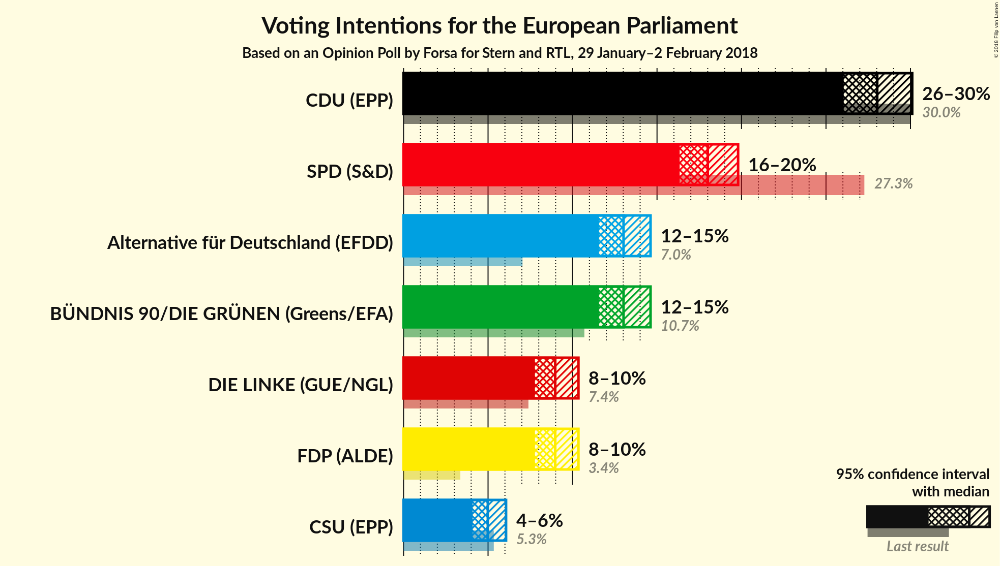
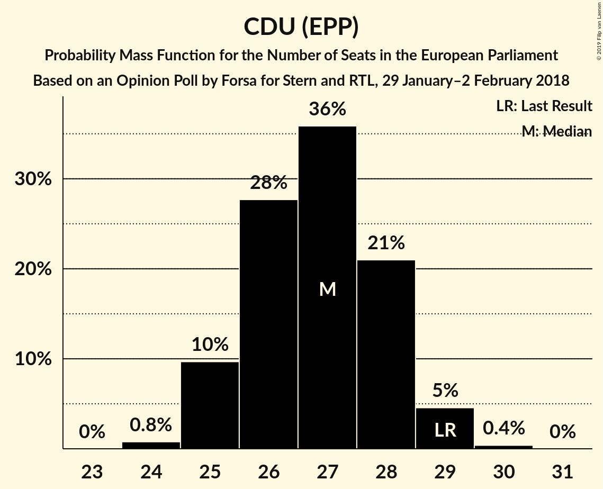
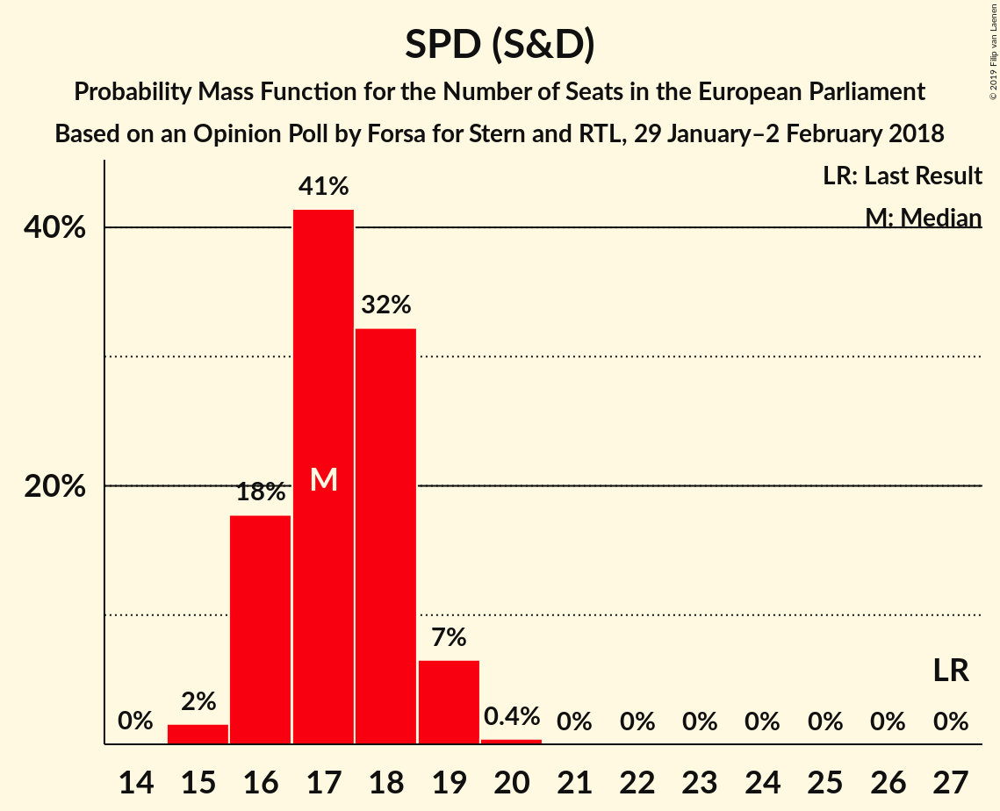
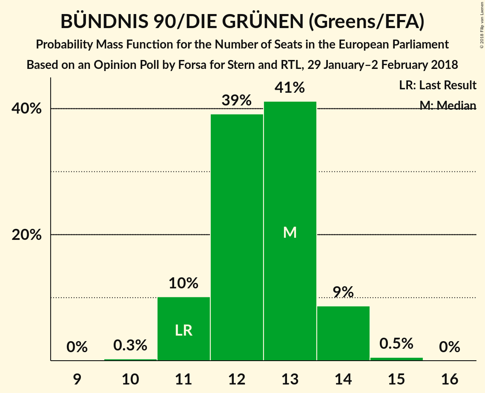
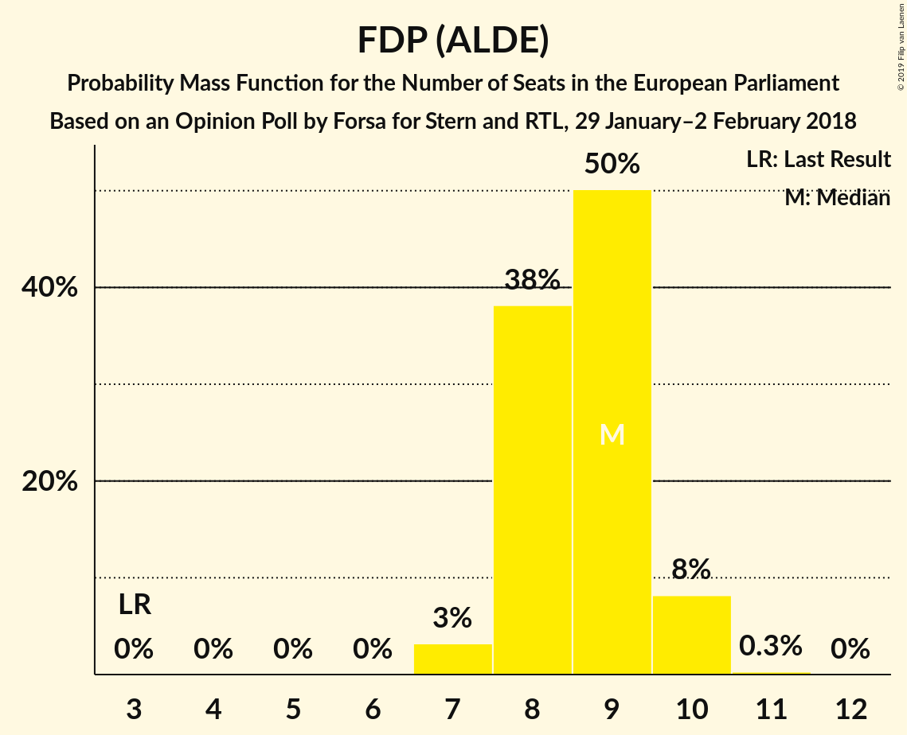
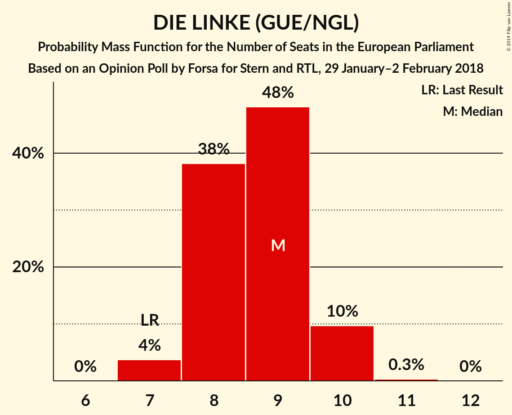
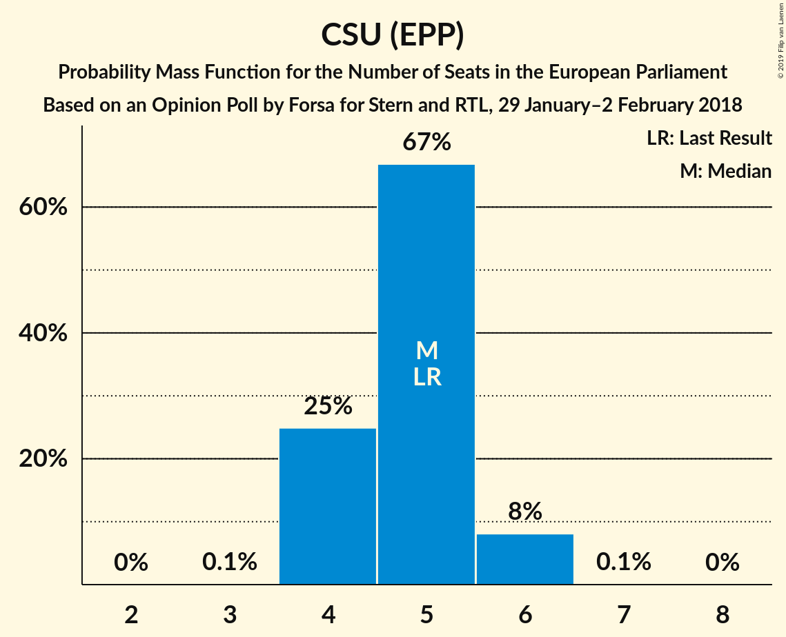
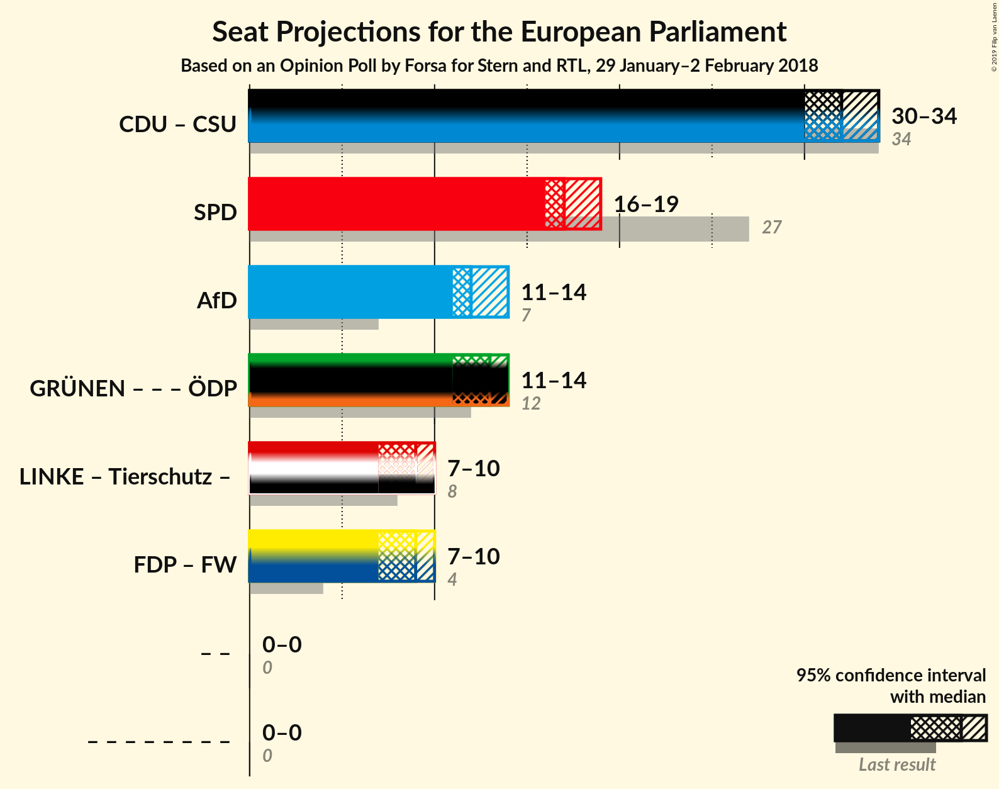

# Opinion Poll by Forsa for Stern and RTL, 29 January–2 February 2018

<a href="#voting-intentions">Voting Intentions</a> | <a href="#seats">Seats</a> | <a href="#coalitions">Coalitions</a> | <a href="#technical-information">Technical Information</a>

## Voting Intentions

### Confidence Intervals

| Party | Last Result | Poll Result | 80% Confidence Interval | 90% Confidence Interval | 95% Confidence Interval | 99% Confidence Interval |
|:-----:|:-----------:|:-----------:|:-----------------------:|:-----------------------:|:-----------------------:|:-----------------------:|
| CDU (EPP) | 30.0% | 28.0% | 26.7–29.4% |26.4–29.8% |26.0–30.1% |25.4–30.8% |
| SPD (S&D) | 27.3% | 18.0% | 16.9–19.2% |16.6–19.5% |16.3–19.8% |15.8–20.4% |
| Alternative für Deutschland (EFDD) | 7.0% | 13.0% | 12.1–14.1% |11.8–14.4% |11.6–14.6% |11.1–15.1% |
| BÜNDNIS 90/DIE GRÜNEN (Greens/EFA) | 10.7% | 13.0% | 12.1–14.1% |11.8–14.4% |11.6–14.6% |11.1–15.1% |
| FDP (ALDE) | 3.4% | 9.0% | 8.2–9.9% |8.0–10.1% |7.8–10.3% |7.4–10.8% |
| DIE LINKE (GUE/NGL) | 7.4% | 9.0% | 8.2–9.9% |8.0–10.1% |7.8–10.3% |7.4–10.8% |
| CSU (EPP) | 5.3% | 5.0% | 4.4–5.7% |4.2–5.9% |4.1–6.1% |3.8–6.4% |

*Note:* The poll result column reflects the actual value used in the calculations. Published results may vary slightly, and in addition be rounded to fewer digits.

## Seats

### Confidence Intervals

| Party | Last Result | Median | 80% Confidence Interval | 90% Confidence Interval | 95% Confidence Interval | 99% Confidence Interval |
|:-----:|:-----------:|:------:|:-----------------------:|:-----------------------:|:-----------------------:|:-----------------------:|
| <a href="#cdu-(epp)">CDU (EPP)</a> | 29 | 28 | 28 |28 |27–28 |25–28 |
| <a href="#spd-(s&d)">SPD (S&D)</a> | 27 | 17 | 16–17 |16–17 |16–17 |15–20 |
| <a href="#alternative-für-deutschland-(efdd)">Alternative für Deutschland (EFDD)</a> | 7 | 12 | 12 |12 |12 |12–14 |
| <a href="#bÜndnis-90/die-grÜnen-(greens/efa)">BÜNDNIS 90/DIE GRÜNEN (Greens/EFA)</a> | 11 | 13 | 12–13 |12–13 |12–13 |12–14 |
| <a href="#fdp-(alde)">FDP (ALDE)</a> | 3 | 8 | 8 |8 |8–9 |7–10 |
| <a href="#die-linke-(gue/ngl)">DIE LINKE (GUE/NGL)</a> | 7 | 9 | 9 |9 |9 |8–9 |
| <a href="#csu-(epp)">CSU (EPP)</a> | 5 | 5 | 5 |5 |5–6 |4–6 |

### CDU (EPP)

*For a full overview of the results for this party, see the [CDU (EPP)](party-cduepp.html) page.*

| Number of Seats | Probability | Accumulated | Special Marks |
|:---------------:|:-----------:|:-----------:|:-------------:|
| 24 | 0% | 100% |  |
| 25 | 0.6% | 99.9% |  |
| 26 | 0.4% | 99.3% |  |
| 27 | 4% | 98.9% |  |
| 28 | 95% | 95% | Median |
| 29 | 0% | 0.3% | Last Result |
| 30 | 0.3% | 0.3% |  |
| 31 | 0% | 0% |  |

### SPD (S&D)

*For a full overview of the results for this party, see the [SPD (S&D)](party-spdsd.html) page.*

| Number of Seats | Probability | Accumulated | Special Marks |
|:---------------:|:-----------:|:-----------:|:-------------:|
| 15 | 2% | 100% |  |
| 16 | 37% | 98% |  |
| 17 | 60% | 61% | Median |
| 18 | 0.5% | 1.2% |  |
| 19 | 0% | 0.7% |  |
| 20 | 0.6% | 0.6% |  |
| 21 | 0% | 0% |  |
| 22 | 0% | 0% |  |
| 23 | 0% | 0% |  |
| 24 | 0% | 0% |  |
| 25 | 0% | 0% |  |
| 26 | 0% | 0% |  |
| 27 | 0% | 0% | Last Result |

### Alternative für Deutschland (EFDD)

*For a full overview of the results for this party, see the [Alternative für Deutschland (EFDD)](party-alternativefürdeutschlandefdd.html) page.*

| Number of Seats | Probability | Accumulated | Special Marks |
|:---------------:|:-----------:|:-----------:|:-------------:|
| 7 | 0% | 100% | Last Result |
| 8 | 0% | 100% |  |
| 9 | 0% | 100% |  |
| 10 | 0% | 100% |  |
| 11 | 0.1% | 100% |  |
| 12 | 98% | 99.9% | Median |
| 13 | 0.9% | 1.5% |  |
| 14 | 0.4% | 0.6% |  |
| 15 | 0.2% | 0.2% |  |
| 16 | 0% | 0% |  |

### BÜNDNIS 90/DIE GRÜNEN (Greens/EFA)

*For a full overview of the results for this party, see the [BÜNDNIS 90/DIE GRÜNEN (Greens/EFA)](party-bÜndnis90diegrÜnengreensefa.html) page.*

| Number of Seats | Probability | Accumulated | Special Marks |
|:---------------:|:-----------:|:-----------:|:-------------:|
| 11 | 0.3% | 100% | Last Result |
| 12 | 39% | 99.7% |  |
| 13 | 60% | 61% | Median |
| 14 | 0.5% | 0.5% |  |
| 15 | 0% | 0% |  |

### FDP (ALDE)

*For a full overview of the results for this party, see the [FDP (ALDE)](party-fdpalde.html) page.*

| Number of Seats | Probability | Accumulated | Special Marks |
|:---------------:|:-----------:|:-----------:|:-------------:|
| 3 | 0% | 100% | Last Result |
| 4 | 0% | 100% |  |
| 5 | 0% | 100% |  |
| 6 | 0% | 100% |  |
| 7 | 0.5% | 100% |  |
| 8 | 96% | 99.5% | Median |
| 9 | 2% | 4% |  |
| 10 | 2% | 2% |  |
| 11 | 0% | 0% |  |

### DIE LINKE (GUE/NGL)

*For a full overview of the results for this party, see the [DIE LINKE (GUE/NGL)](party-dielinkeguengl.html) page.*

| Number of Seats | Probability | Accumulated | Special Marks |
|:---------------:|:-----------:|:-----------:|:-------------:|
| 7 | 0.1% | 100% | Last Result |
| 8 | 0.5% | 99.9% |  |
| 9 | 99.0% | 99.4% | Median |
| 10 | 0.4% | 0.4% |  |
| 11 | 0% | 0% |  |

### CSU (EPP)

*For a full overview of the results for this party, see the [CSU (EPP)](party-csuepp.html) page.*

| Number of Seats | Probability | Accumulated | Special Marks |
|:---------------:|:-----------:|:-----------:|:-------------:|
| 4 | 0.7% | 100% |  |
| 5 | 96% | 99.3% | Last Result, Median |
| 6 | 3% | 4% |  |
| 7 | 0.1% | 0.1% |  |
| 8 | 0% | 0% |  |

## Coalitions

### Confidence Intervals

| Coalition | Last Result | Median | Majority? | 80% Confidence Interval | 90% Confidence Interval | 95% Confidence Interval | 99% Confidence Interval |
|:---------:|:-----------:|:------:|:---------:|:-----------------------:|:-----------------------:|:-----------------------:|:-----------------------:|
| CDU (EPP) – CSU (EPP) | 34 | 33 | 0% | 33 | 33 | 33 | 29–33 |
| SPD (S&D) | 27 | 17 | 0% | 16–17 | 16–17 | 16–17 | 15–20 |
| Alternative für Deutschland (EFDD) | 7 | 12 | 0% | 12 | 12 | 12 | 12–14 |

### CDU (EPP) – CSU (EPP)

| Number of Seats | Probability | Accumulated | Special Marks |
|:---------------:|:-----------:|:-----------:|:-------------:|
| 28 | 0.1% | 100% |  |
| 29 | 0.6% | 99.9% |  |
| 30 | 0% | 99.3% |  |
| 31 | 0.4% | 99.3% |  |
| 32 | 0.1% | 98.9% |  |
| 33 | 98% | 98.8% | Median |
| 34 | 0.1% | 0.4% | Last Result |
| 35 | 0.3% | 0.3% |  |
| 36 | 0% | 0% |  |

### SPD (S&D)

| Number of Seats | Probability | Accumulated | Special Marks |
|:---------------:|:-----------:|:-----------:|:-------------:|
| 15 | 2% | 100% |  |
| 16 | 37% | 98% |  |
| 17 | 60% | 61% | Median |
| 18 | 0.5% | 1.2% |  |
| 19 | 0% | 0.7% |  |
| 20 | 0.6% | 0.6% |  |
| 21 | 0% | 0% |  |
| 22 | 0% | 0% |  |
| 23 | 0% | 0% |  |
| 24 | 0% | 0% |  |
| 25 | 0% | 0% |  |
| 26 | 0% | 0% |  |
| 27 | 0% | 0% | Last Result |

### Alternative für Deutschland (EFDD)

| Number of Seats | Probability | Accumulated | Special Marks |
|:---------------:|:-----------:|:-----------:|:-------------:|
| 7 | 0% | 100% | Last Result |
| 8 | 0% | 100% |  |
| 9 | 0% | 100% |  |
| 10 | 0% | 100% |  |
| 11 | 0.1% | 100% |  |
| 12 | 98% | 99.9% | Median |
| 13 | 0.9% | 1.5% |  |
| 14 | 0.4% | 0.6% |  |
| 15 | 0.2% | 0.2% |  |
| 16 | 0% | 0% |  |

## Technical Information

### Opinion Poll

+ **Polling firm:** Forsa
+ **Commissioner(s):** Stern and RTL
+ **Fieldwork period:** 29 January–2 February 2018

### Calculations

+ **Sample size:** 1905
+ **Simulations done:** 1,024
+ **Error estimate:** 2.45%

