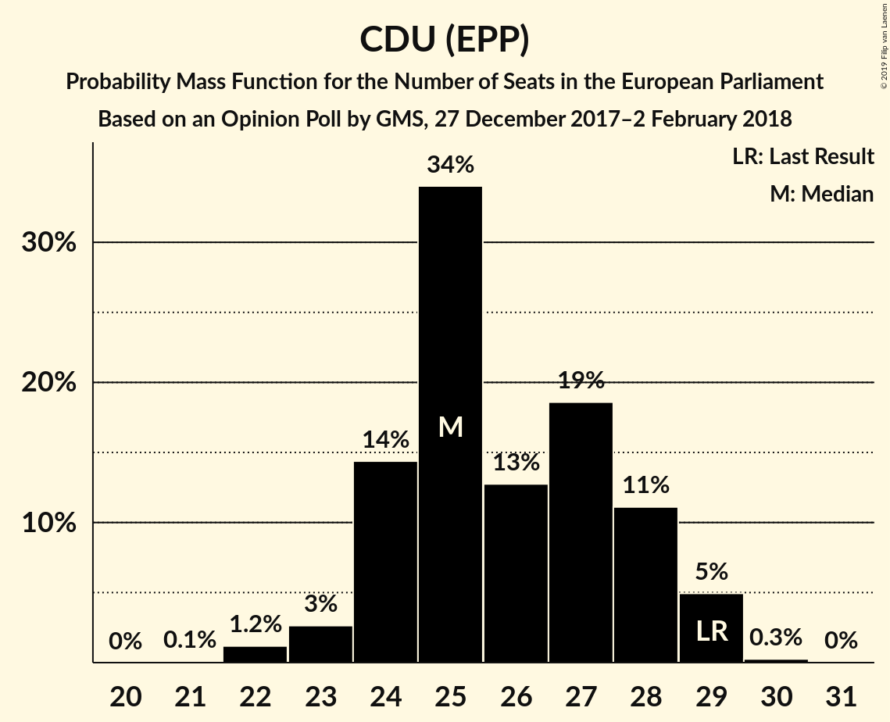
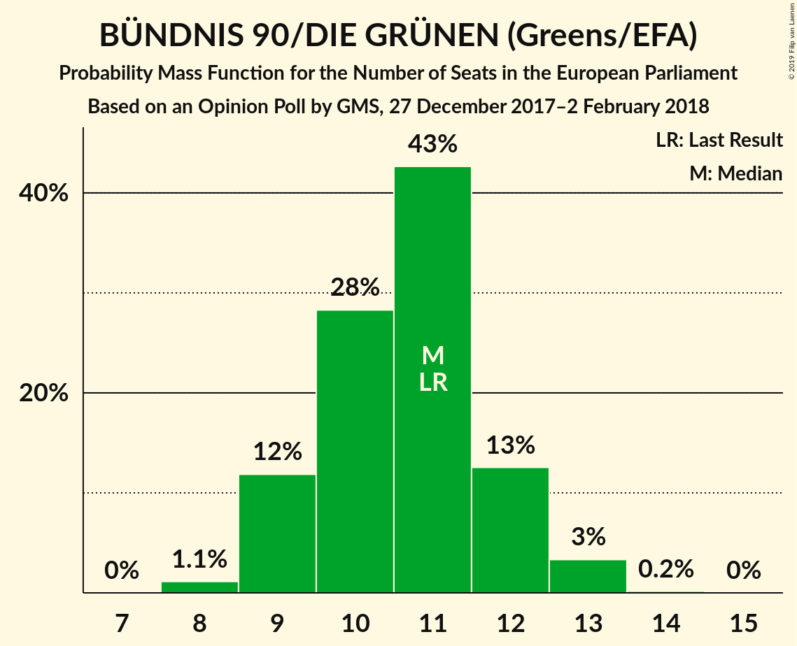
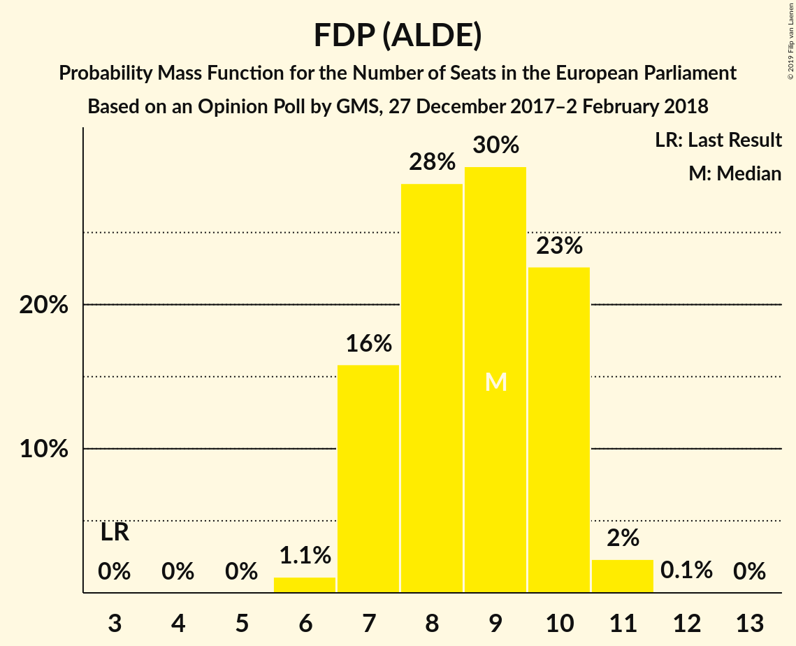

# Opinion Poll by GMS, 27 December 2017–2 February 2018

<a href="#voting-intentions">Voting Intentions</a> | <a href="#seats">Seats</a> | <a href="#coalitions">Coalitions</a> | <a href="#technical-information">Technical Information</a>

## Voting Intentions

### Confidence Intervals

| Party | Last Result | Poll Result | 80% Confidence Interval | 90% Confidence Interval | 95% Confidence Interval | 99% Confidence Interval |
|:-----:|:-----------:|:-----------:|:-----------------------:|:-----------------------:|:-----------------------:|:-----------------------:|
| CDU (EPP) | 30.0% | 27.2% | 25.4–29.0% |24.9–29.6% |24.5–30.0% |23.7–30.9% |
| SPD (S&D) | 27.3% | 20.0% | 18.4–21.7% |18.0–22.2% |17.6–22.6% |16.9–23.4% |
| Alternative für Deutschland (EFDD) | 7.0% | 14.0% | 12.7–15.5% |12.3–16.0% |12.0–16.3% |11.4–17.1% |
| BÜNDNIS 90/DIE GRÜNEN (Greens/EFA) | 10.7% | 11.0% | 9.9–12.4% |9.5–12.8% |9.3–13.1% |8.7–13.8% |
| DIE LINKE (GUE/NGL) | 7.4% | 10.0% | 8.9–11.4% |8.6–11.8% |8.3–12.1% |7.8–12.7% |
| FDP (ALDE) | 3.4% | 9.0% | 7.9–10.2% |7.6–10.6% |7.3–10.9% |6.9–11.5% |
| CSU (EPP) | 5.3% | 4.9% | 4.1–5.9% |3.9–6.1% |3.7–6.4% |3.4–6.9% |
| FREIE WÄHLER (ALDE) | 1.5% | 0.8% | 0.5–1.3% |0.5–1.4% |0.4–1.6% |0.3–1.8% |
| Die PARTEI (NI) | 0.6% | 0.8% | 0.5–1.3% |0.5–1.4% |0.4–1.6% |0.3–1.8% |
| Partei Mensch Umwelt Tierschutz (GUE/NGL) | 1.2% | 0.6% | 0.4–1.1% |0.3–1.2% |0.3–1.3% |0.2–1.6% |

*Note:* The poll result column reflects the actual value used in the calculations. Published results may vary slightly, and in addition be rounded to fewer digits.

## Seats

### Confidence Intervals

| Party | Last Result | Median | 80% Confidence Interval | 90% Confidence Interval | 95% Confidence Interval | 99% Confidence Interval |
|:-----:|:-----------:|:------:|:-----------------------:|:-----------------------:|:-----------------------:|:-----------------------:|
| <a href="#cdu-(epp)">CDU (EPP)</a> | 29 | 28 | 24–29 |24–29 |24–29 |21–29 |
| <a href="#spd-(s&d)">SPD (S&D)</a> | 27 | 18 | 17–18 |17–18 |17–20 |15–21 |
| <a href="#alternative-für-deutschland-(efdd)">Alternative für Deutschland (EFDD)</a> | 7 | 14 | 12–16 |12–16 |12–16 |11–16 |
| <a href="#bündnis-90/die-grünen-(greens/efa)">BÜNDNIS 90/DIE GRÜNEN (Greens/EFA)</a> | 11 | 11 | 10–11 |10–11 |9–11 |8–14 |
| <a href="#die-linke-(gue/ngl)">DIE LINKE (GUE/NGL)</a> | 7 | 8 | 7–14 |7–14 |7–14 |7–14 |
| <a href="#fdp-(alde)">FDP (ALDE)</a> | 3 | 7 | 7–10 |7–10 |7–11 |7–11 |
| <a href="#csu-(epp)">CSU (EPP)</a> | 5 | 4 | 4–5 |4–5 |4–6 |3–7 |
| <a href="#freie-wähler-(alde)">FREIE WÄHLER (ALDE)</a> | 1 | 1 | 1–2 |1–2 |1–2 |0–2 |
| <a href="#die-partei-(ni)">Die PARTEI (NI)</a> | 1 | 1 | 0–1 |0–1 |0–1 |0–2 |
| <a href="#partei-mensch-umwelt-tierschutz-(gue/ngl)">Partei Mensch Umwelt Tierschutz (GUE/NGL)</a> | 1 | 1 | 0–1 |0–1 |0–1 |0–1 |

### CDU (EPP)

*For a full overview of the results for this party, see the [CDU (EPP)](party-cduepp.html) page.*

| Number of Seats | Probability | Accumulated | Special Marks |
|:---------------:|:-----------:|:-----------:|:-------------:|
| 20 | 0.3% | 100% |  |
| 21 | 0.6% | 99.7% |  |
| 22 | 0% | 99.1% |  |
| 23 | 0.2% | 99.1% |  |
| 24 | 30% | 98.9% |  |
| 25 | 0.4% | 69% |  |
| 26 | 4% | 69% |  |
| 27 | 2% | 65% |  |
| 28 | 40% | 63% | Median |
| 29 | 23% | 23% | Last Result |
| 30 | 0% | 0% |  |

### SPD (S&D)

*For a full overview of the results for this party, see the [SPD (S&D)](party-spdsd.html) page.*

| Number of Seats | Probability | Accumulated | Special Marks |
|:---------------:|:-----------:|:-----------:|:-------------:|
| 15 | 1.5% | 100% |  |
| 16 | 0.6% | 98.5% |  |
| 17 | 24% | 98% |  |
| 18 | 70% | 74% | Median |
| 19 | 2% | 4% |  |
| 20 | 2% | 3% |  |
| 21 | 0.6% | 0.7% |  |
| 22 | 0.1% | 0.1% |  |
| 23 | 0% | 0% |  |
| 24 | 0% | 0% |  |
| 25 | 0% | 0% |  |
| 26 | 0% | 0% |  |
| 27 | 0% | 0% | Last Result |

### Alternative für Deutschland (EFDD)

*For a full overview of the results for this party, see the [Alternative für Deutschland (EFDD)](party-alternativefürdeutschlandefdd.html) page.*

| Number of Seats | Probability | Accumulated | Special Marks |
|:---------------:|:-----------:|:-----------:|:-------------:|
| 7 | 0% | 100% | Last Result |
| 8 | 0% | 100% |  |
| 9 | 0% | 100% |  |
| 10 | 0% | 100% |  |
| 11 | 2% | 99.9% |  |
| 12 | 32% | 98% |  |
| 13 | 2% | 67% |  |
| 14 | 40% | 65% | Median |
| 15 | 1.3% | 25% |  |
| 16 | 23% | 23% |  |
| 17 | 0.3% | 0.3% |  |
| 18 | 0% | 0% |  |

### BÜNDNIS 90/DIE GRÜNEN (Greens/EFA)

*For a full overview of the results for this party, see the [BÜNDNIS 90/DIE GRÜNEN (Greens/EFA)](party-bündnis90diegrünengreensefa.html) page.*

| Number of Seats | Probability | Accumulated | Special Marks |
|:---------------:|:-----------:|:-----------:|:-------------:|
| 8 | 2% | 100% |  |
| 9 | 2% | 98% |  |
| 10 | 41% | 97% |  |
| 11 | 54% | 56% | Last Result, Median |
| 12 | 0.4% | 2% |  |
| 13 | 0.1% | 2% |  |
| 14 | 1.0% | 2% |  |
| 15 | 0.5% | 0.5% |  |
| 16 | 0% | 0% |  |

### DIE LINKE (GUE/NGL)

*For a full overview of the results for this party, see the [DIE LINKE (GUE/NGL)](party-dielinkeguengl.html) page.*

| Number of Seats | Probability | Accumulated | Special Marks |
|:---------------:|:-----------:|:-----------:|:-------------:|
| 7 | 23% | 100% | Last Result |
| 8 | 42% | 77% | Median |
| 9 | 2% | 35% |  |
| 10 | 0.9% | 33% |  |
| 11 | 0.4% | 32% |  |
| 12 | 2% | 32% |  |
| 13 | 0% | 30% |  |
| 14 | 30% | 30% |  |
| 15 | 0% | 0% |  |

### FDP (ALDE)

*For a full overview of the results for this party, see the [FDP (ALDE)](party-fdpalde.html) page.*

| Number of Seats | Probability | Accumulated | Special Marks |
|:---------------:|:-----------:|:-----------:|:-------------:|
| 3 | 0% | 100% | Last Result |
| 4 | 0% | 100% |  |
| 5 | 0% | 100% |  |
| 6 | 0% | 100% |  |
| 7 | 70% | 100% | Median |
| 8 | 2% | 30% |  |
| 9 | 0.7% | 28% |  |
| 10 | 24% | 27% |  |
| 11 | 3% | 3% |  |
| 12 | 0% | 0.1% |  |
| 13 | 0.1% | 0.1% |  |
| 14 | 0% | 0% |  |

### CSU (EPP)

*For a full overview of the results for this party, see the [CSU (EPP)](party-csuepp.html) page.*

| Number of Seats | Probability | Accumulated | Special Marks |
|:---------------:|:-----------:|:-----------:|:-------------:|
| 3 | 1.2% | 100% |  |
| 4 | 65% | 98.8% | Median |
| 5 | 30% | 34% | Last Result |
| 6 | 2% | 3% |  |
| 7 | 2% | 2% |  |
| 8 | 0% | 0% |  |

### FREIE WÄHLER (ALDE)

*For a full overview of the results for this party, see the [FREIE WÄHLER (ALDE)](party-freiewähleralde.html) page.*

| Number of Seats | Probability | Accumulated | Special Marks |
|:---------------:|:-----------:|:-----------:|:-------------:|
| 0 | 2% | 100% |  |
| 1 | 56% | 98% | Last Result, Median |
| 2 | 42% | 42% |  |
| 3 | 0.1% | 0.1% |  |
| 4 | 0% | 0% |  |

### Die PARTEI (NI)

*For a full overview of the results for this party, see the [Die PARTEI (NI)](party-dieparteini.html) page.*

| Number of Seats | Probability | Accumulated | Special Marks |
|:---------------:|:-----------:|:-----------:|:-------------:|
| 0 | 25% | 100% |  |
| 1 | 73% | 75% | Last Result, Median |
| 2 | 2% | 2% |  |
| 3 | 0% | 0% |  |

### Partei Mensch Umwelt Tierschutz (GUE/NGL)

*For a full overview of the results for this party, see the [Partei Mensch Umwelt Tierschutz (GUE/NGL)](party-parteimenschumwelttierschutzguengl.html) page.*

| Number of Seats | Probability | Accumulated | Special Marks |
|:---------------:|:-----------:|:-----------:|:-------------:|
| 0 | 24% | 100% |  |
| 1 | 76% | 76% | Last Result, Median |
| 2 | 0.1% | 0.1% |  |
| 3 | 0% | 0% |  |

## Coalitions

### Confidence Intervals

| Coalition | Last Result | Median | Majority? | 80% Confidence Interval | 90% Confidence Interval | 95% Confidence Interval | 99% Confidence Interval |
|:---------:|:-----------:|:------:|:---------:|:-----------------------:|:-----------------------:|:-----------------------:|:-----------------------:|
| CDU (EPP) – CSU (EPP) | 34 | 32 | 0% | 29–33 | 29–33 | 29–33 | 27–33 |
| SPD (S&D) | 27 | 18 | 0% | 17–18 | 17–18 | 17–20 | 15–21 |
| Alternative für Deutschland (EFDD) | 7 | 14 | 0% | 12–16 | 12–16 | 12–16 | 11–16 |
| FDP (ALDE) – FREIE WÄHLER (ALDE) | 4 | 9 | 0% | 8–11 | 8–11 | 8–12 | 8–12 |
| Die PARTEI (NI) | 1 | 1 | 0% | 0–1 | 0–1 | 0–1 | 0–2 |

### CDU (EPP) – CSU (EPP)

| Number of Seats | Probability | Accumulated | Special Marks |
|:---------------:|:-----------:|:-----------:|:-------------:|
| 24 | 0.3% | 100% |  |
| 25 | 0% | 99.7% |  |
| 26 | 0% | 99.7% |  |
| 27 | 0.6% | 99.7% |  |
| 28 | 0.1% | 99.1% |  |
| 29 | 31% | 99.0% |  |
| 30 | 0.7% | 68% |  |
| 31 | 2% | 67% |  |
| 32 | 41% | 66% | Median |
| 33 | 25% | 25% |  |
| 34 | 0% | 0% | Last Result |

### SPD (S&D)

| Number of Seats | Probability | Accumulated | Special Marks |
|:---------------:|:-----------:|:-----------:|:-------------:|
| 15 | 1.5% | 100% |  |
| 16 | 0.6% | 98.5% |  |
| 17 | 24% | 98% |  |
| 18 | 70% | 74% | Median |
| 19 | 2% | 4% |  |
| 20 | 2% | 3% |  |
| 21 | 0.6% | 0.7% |  |
| 22 | 0.1% | 0.1% |  |
| 23 | 0% | 0% |  |
| 24 | 0% | 0% |  |
| 25 | 0% | 0% |  |
| 26 | 0% | 0% |  |
| 27 | 0% | 0% | Last Result |

### Alternative für Deutschland (EFDD)

| Number of Seats | Probability | Accumulated | Special Marks |
|:---------------:|:-----------:|:-----------:|:-------------:|
| 7 | 0% | 100% | Last Result |
| 8 | 0% | 100% |  |
| 9 | 0% | 100% |  |
| 10 | 0% | 100% |  |
| 11 | 2% | 99.9% |  |
| 12 | 32% | 98% |  |
| 13 | 2% | 67% |  |
| 14 | 40% | 65% | Median |
| 15 | 1.3% | 25% |  |
| 16 | 23% | 23% |  |
| 17 | 0.3% | 0.3% |  |
| 18 | 0% | 0% |  |

### FDP (ALDE) – FREIE WÄHLER (ALDE)

| Number of Seats | Probability | Accumulated | Special Marks |
|:---------------:|:-----------:|:-----------:|:-------------:|
| 4 | 0% | 100% | Last Result |
| 5 | 0% | 100% |  |
| 6 | 0% | 100% |  |
| 7 | 0% | 100% |  |
| 8 | 30% | 100% | Median |
| 9 | 42% | 70% |  |
| 10 | 0.7% | 28% |  |
| 11 | 24% | 27% |  |
| 12 | 3% | 3% |  |
| 13 | 0% | 0.1% |  |
| 14 | 0.1% | 0.1% |  |
| 15 | 0% | 0% |  |

### Die PARTEI (NI)

| Number of Seats | Probability | Accumulated | Special Marks |
|:---------------:|:-----------:|:-----------:|:-------------:|
| 0 | 25% | 100% |  |
| 1 | 73% | 75% | Last Result, Median |
| 2 | 2% | 2% |  |
| 3 | 0% | 0% |  |

## Technical Information

### Opinion Poll

+ **Polling firm:** GMS
+ **Commissioner(s):** —
+ **Fieldwork period:** 27 December 2017–2 February 2018

### Calculations

+ **Sample size:** 1005
+ **Simulations done:** 1,024
+ **Error estimate:** 3.31%

