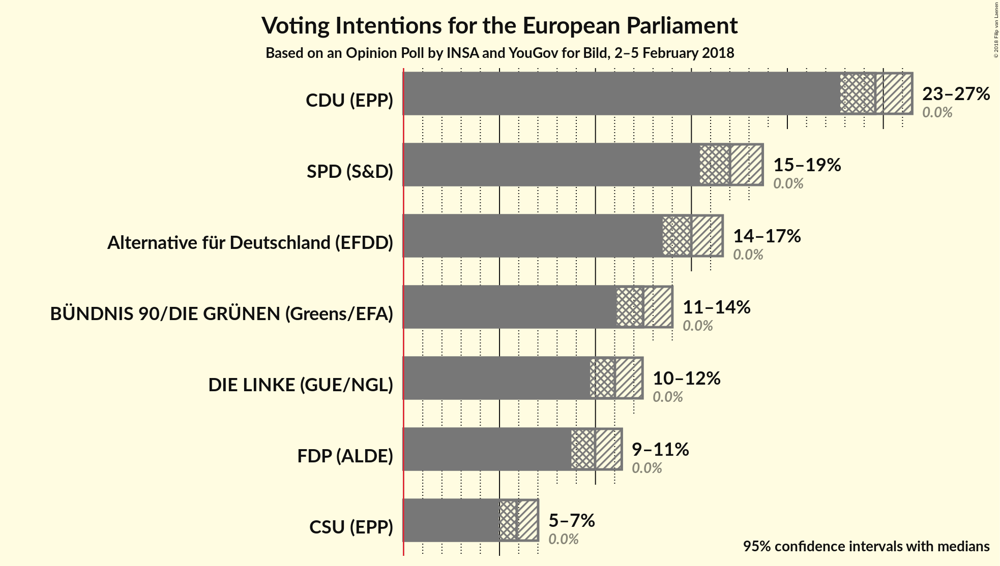
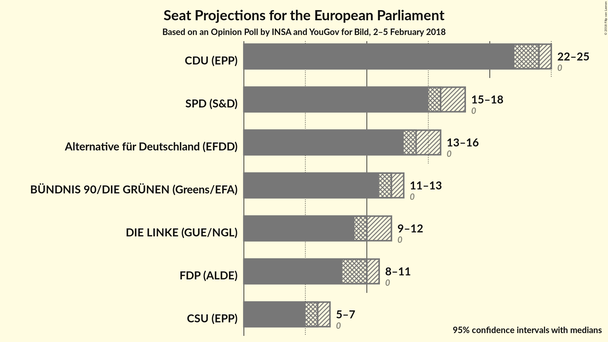
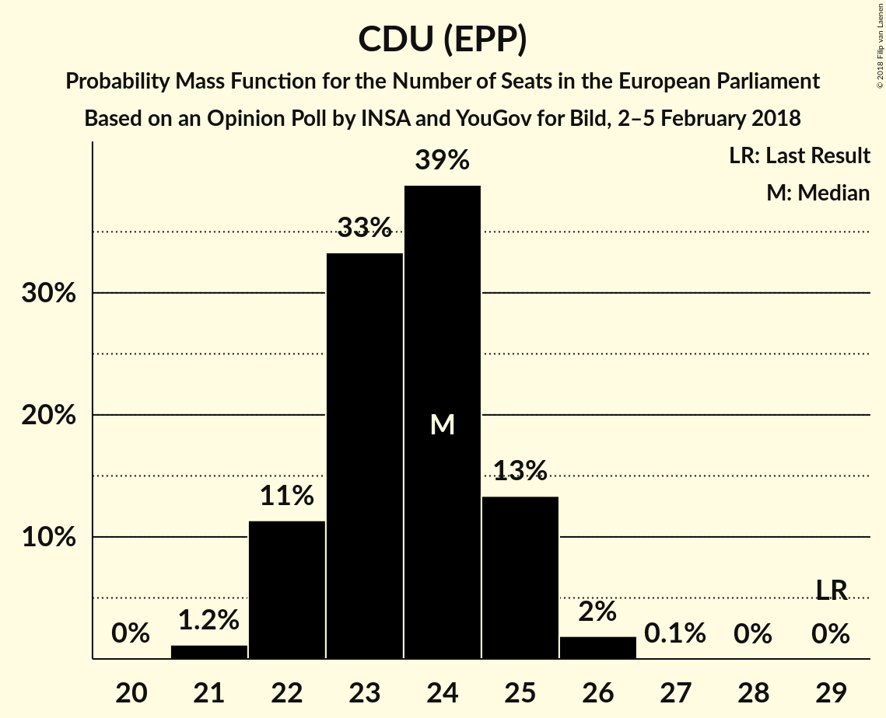
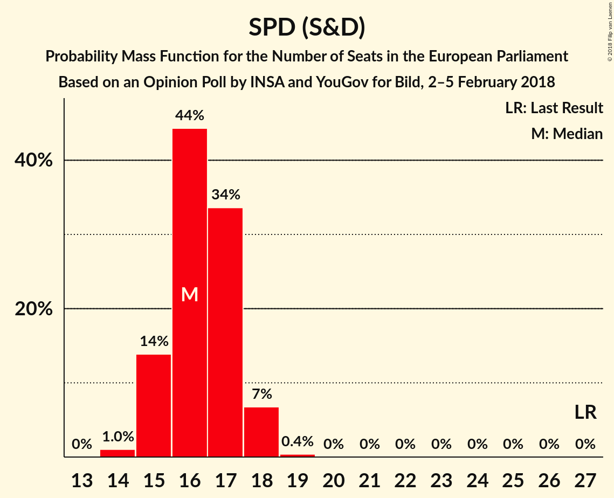
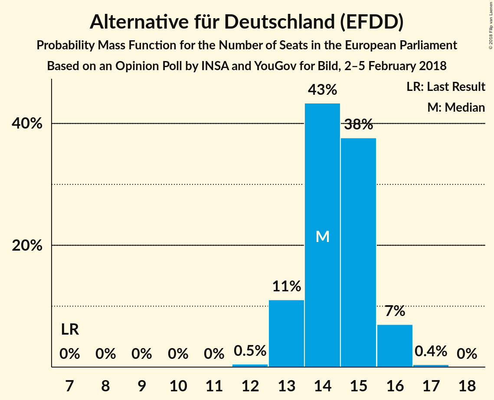
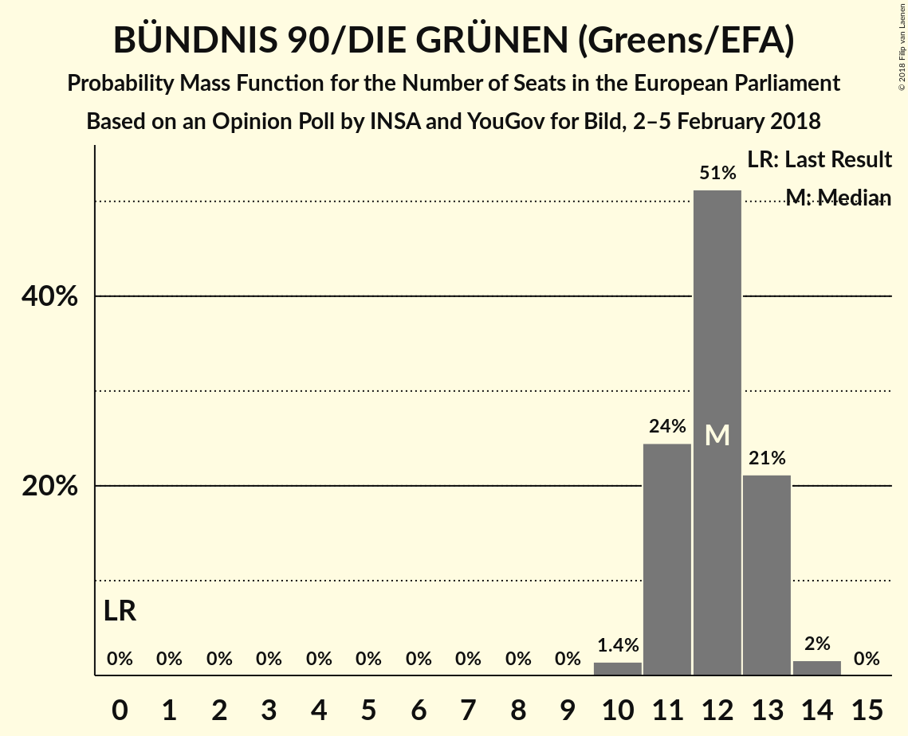
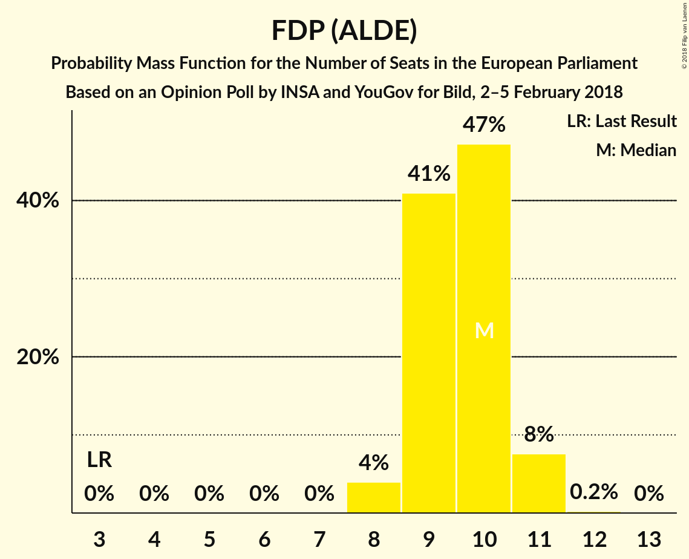
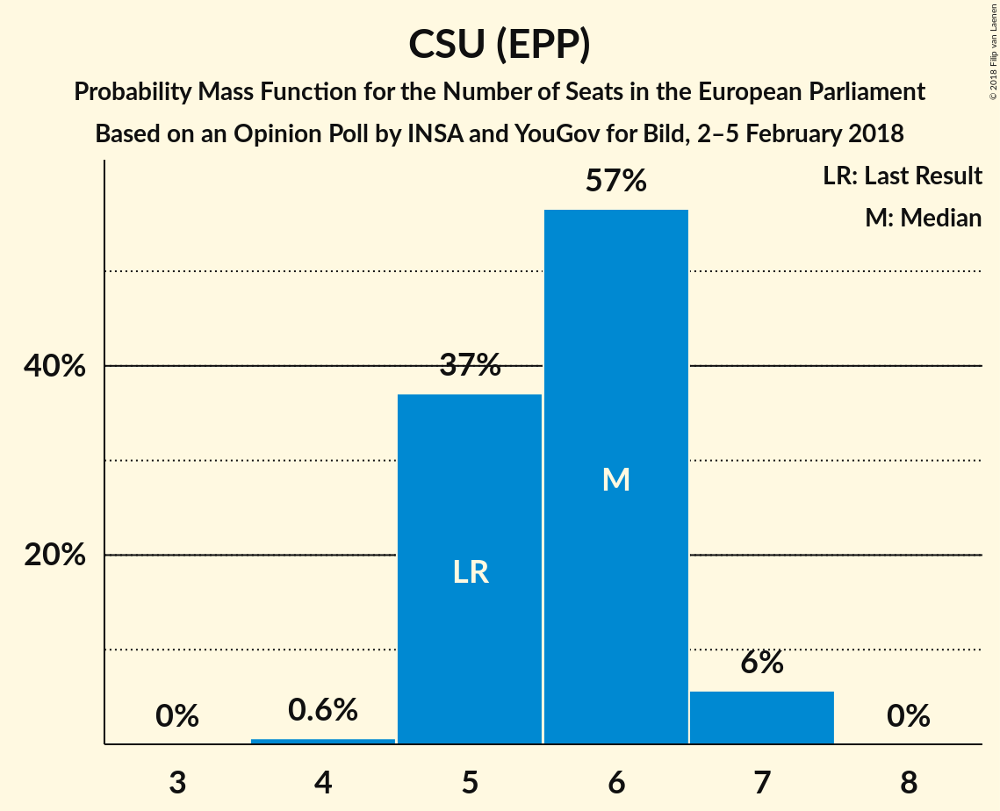
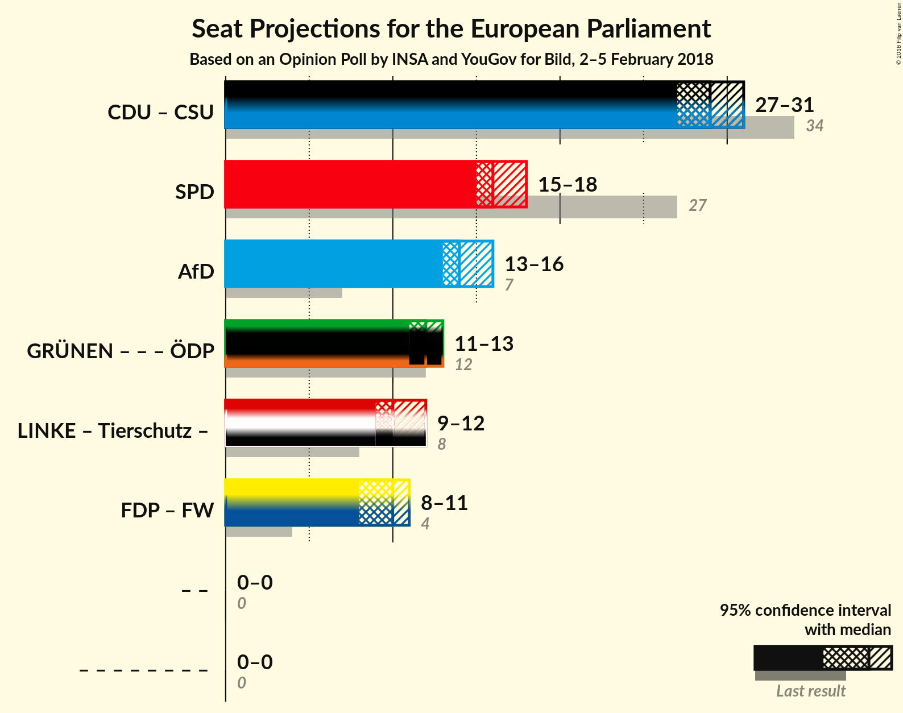

# Opinion Poll by INSA and YouGov for Bild, 2–5 February 2018

<a href="#voting-intentions">Voting Intentions</a> | <a href="#seats">Seats</a> | <a href="#coalitions">Coalitions</a> | <a href="#technical-information">Technical Information</a>

## Voting Intentions

### Confidence Intervals

| Party | Last Result | Poll Result | 80% Confidence Interval | 90% Confidence Interval | 95% Confidence Interval | 99% Confidence Interval |
|:-----:|:-----------:|:-----------:|:-----------------------:|:-----------------------:|:-----------------------:|:-----------------------:|
| CDU (EPP) | 30.0% | 24.6% | 23.4–25.8% |23.0–26.2% |22.8–26.5% |22.2–27.1% |
| SPD (S&D) | 27.3% | 17.0% | 16.0–18.1% |15.7–18.4% |15.4–18.7% |15.0–19.3% |
| Alternative für Deutschland (EFDD) | 7.0% | 15.0% | 14.0–16.1% |13.7–16.4% |13.5–16.6% |13.0–17.1% |
| BÜNDNIS 90/DIE GRÜNEN (Greens/EFA) | 10.7% | 12.5% | 11.6–13.5% |11.3–13.8% |11.1–14.0% |10.7–14.5% |
| DIE LINKE (GUE/NGL) | 7.4% | 11.0% | 10.2–11.9% |9.9–12.2% |9.7–12.5% |9.3–12.9% |
| FDP (ALDE) | 3.4% | 10.0% | 9.2–10.9% |8.9–11.1% |8.7–11.4% |8.4–11.8% |
| CSU (EPP) | 5.3% | 5.9% | 5.3–6.6% |5.1–6.8% |5.0–7.0% |4.7–7.4% |

*Note:* The poll result column reflects the actual value used in the calculations. Published results may vary slightly, and in addition be rounded to fewer digits.

## Seats

### Confidence Intervals

| Party | Last Result | Median | 80% Confidence Interval | 90% Confidence Interval | 95% Confidence Interval | 99% Confidence Interval |
|:-----:|:-----------:|:------:|:-----------------------:|:-----------------------:|:-----------------------:|:-----------------------:|
| <a href="#cdu-(epp)">CDU (EPP)</a> | 29 | 24 | 22–25 |22–25 |22–25 |21–26 |
| <a href="#spd-(s&d)">SPD (S&D)</a> | 27 | 16 | 15–17 |15–18 |15–18 |14–18 |
| <a href="#alternative-für-deutschland-(efdd)">Alternative für Deutschland (EFDD)</a> | 7 | 14 | 13–15 |13–16 |13–16 |12–16 |
| <a href="#bÜndnis-90/die-grÜnen-(greens/efa)">BÜNDNIS 90/DIE GRÜNEN (Greens/EFA)</a> | 11 | 12 | 11–13 |11–13 |11–13 |10–14 |
| <a href="#die-linke-(gue/ngl)">DIE LINKE (GUE/NGL)</a> | 7 | 10 | 10–12 |10–12 |9–12 |9–12 |
| <a href="#fdp-(alde)">FDP (ALDE)</a> | 3 | 10 | 9–10 |9–11 |8–11 |8–11 |
| <a href="#csu-(epp)">CSU (EPP)</a> | 5 | 6 | 5–6 |5–7 |5–7 |4–7 |

### CDU (EPP)

*For a full overview of the results for this party, see the [CDU (EPP)](party-cduepp.html) page.*

| Number of Seats | Probability | Accumulated | Special Marks |
|:---------------:|:-----------:|:-----------:|:-------------:|
| 21 | 1.1% | 100% |  |
| 22 | 11% | 98.8% |  |
| 23 | 34% | 88% |  |
| 24 | 38% | 53% | Median |
| 25 | 14% | 16% |  |
| 26 | 2% | 2% |  |
| 27 | 0.1% | 0.1% |  |
| 28 | 0% | 0% |  |
| 29 | 0% | 0% | Last Result |

### SPD (S&D)

*For a full overview of the results for this party, see the [SPD (S&D)](party-spdsd.html) page.*

| Number of Seats | Probability | Accumulated | Special Marks |
|:---------------:|:-----------:|:-----------:|:-------------:|
| 14 | 1.0% | 100% |  |
| 15 | 14% | 99.0% |  |
| 16 | 44% | 85% | Median |
| 17 | 34% | 41% |  |
| 18 | 7% | 7% |  |
| 19 | 0.4% | 0.4% |  |
| 20 | 0% | 0% |  |
| 21 | 0% | 0% |  |
| 22 | 0% | 0% |  |
| 23 | 0% | 0% |  |
| 24 | 0% | 0% |  |
| 25 | 0% | 0% |  |
| 26 | 0% | 0% |  |
| 27 | 0% | 0% | Last Result |

### Alternative für Deutschland (EFDD)

*For a full overview of the results for this party, see the [Alternative für Deutschland (EFDD)](party-alternativefürdeutschlandefdd.html) page.*

| Number of Seats | Probability | Accumulated | Special Marks |
|:---------------:|:-----------:|:-----------:|:-------------:|
| 7 | 0% | 100% | Last Result |
| 8 | 0% | 100% |  |
| 9 | 0% | 100% |  |
| 10 | 0% | 100% |  |
| 11 | 0% | 100% |  |
| 12 | 0.5% | 100% |  |
| 13 | 11% | 99.5% |  |
| 14 | 44% | 88% | Median |
| 15 | 37% | 44% |  |
| 16 | 7% | 7% |  |
| 17 | 0.4% | 0.4% |  |
| 18 | 0% | 0% |  |

### BÜNDNIS 90/DIE GRÜNEN (Greens/EFA)

*For a full overview of the results for this party, see the [BÜNDNIS 90/DIE GRÜNEN (Greens/EFA)](party-bÜndnis90diegrÜnengreensefa.html) page.*

| Number of Seats | Probability | Accumulated | Special Marks |
|:---------------:|:-----------:|:-----------:|:-------------:|
| 10 | 1.4% | 100% |  |
| 11 | 23% | 98.6% | Last Result |
| 12 | 52% | 76% | Median |
| 13 | 22% | 24% |  |
| 14 | 2% | 2% |  |
| 15 | 0% | 0% |  |

### DIE LINKE (GUE/NGL)

*For a full overview of the results for this party, see the [DIE LINKE (GUE/NGL)](party-dielinkeguengl.html) page.*

| Number of Seats | Probability | Accumulated | Special Marks |
|:---------------:|:-----------:|:-----------:|:-------------:|
| 7 | 0% | 100% | Last Result |
| 8 | 0% | 100% |  |
| 9 | 4% | 100% |  |
| 10 | 50% | 96% | Median |
| 11 | 34% | 46% |  |
| 12 | 11% | 11% |  |
| 13 | 0.2% | 0.2% |  |
| 14 | 0% | 0% |  |

### FDP (ALDE)

*For a full overview of the results for this party, see the [FDP (ALDE)](party-fdpalde.html) page.*

| Number of Seats | Probability | Accumulated | Special Marks |
|:---------------:|:-----------:|:-----------:|:-------------:|
| 3 | 0% | 100% | Last Result |
| 4 | 0% | 100% |  |
| 5 | 0% | 100% |  |
| 6 | 0% | 100% |  |
| 7 | 0% | 100% |  |
| 8 | 4% | 100% |  |
| 9 | 42% | 96% |  |
| 10 | 46% | 54% | Median |
| 11 | 8% | 8% |  |
| 12 | 0.2% | 0.2% |  |
| 13 | 0% | 0% |  |

### CSU (EPP)

*For a full overview of the results for this party, see the [CSU (EPP)](party-csuepp.html) page.*

| Number of Seats | Probability | Accumulated | Special Marks |
|:---------------:|:-----------:|:-----------:|:-------------:|
| 4 | 0.6% | 100% |  |
| 5 | 36% | 99.4% | Last Result |
| 6 | 58% | 64% | Median |
| 7 | 6% | 6% |  |
| 8 | 0% | 0% |  |

## Coalitions

### Confidence Intervals

| Coalition | Last Result | Median | Majority? | 80% Confidence Interval | 90% Confidence Interval | 95% Confidence Interval | 99% Confidence Interval |
|:---------:|:-----------:|:------:|:---------:|:-----------------------:|:-----------------------:|:-----------------------:|:-----------------------:|
| CDU (EPP) – CSU (EPP) | 34 | 29 | 0% | 28–31 | 28–31 | 27–31 | 27–32 |
| SPD (S&D) | 27 | 16 | 0% | 15–17 | 15–18 | 15–18 | 14–18 |
| Alternative für Deutschland (EFDD) | 7 | 14 | 0% | 13–15 | 13–16 | 13–16 | 12–16 |

### CDU (EPP) – CSU (EPP)

| Number of Seats | Probability | Accumulated | Special Marks |
|:---------------:|:-----------:|:-----------:|:-------------:|
| 26 | 0.3% | 100% |  |
| 27 | 4% | 99.7% |  |
| 28 | 19% | 96% |  |
| 29 | 35% | 77% |  |
| 30 | 30% | 41% | Median |
| 31 | 10% | 11% |  |
| 32 | 1.4% | 2% |  |
| 33 | 0.1% | 0.1% |  |
| 34 | 0% | 0% | Last Result |

### SPD (S&D)

| Number of Seats | Probability | Accumulated | Special Marks |
|:---------------:|:-----------:|:-----------:|:-------------:|
| 14 | 1.0% | 100% |  |
| 15 | 14% | 99.0% |  |
| 16 | 44% | 85% | Median |
| 17 | 34% | 41% |  |
| 18 | 7% | 7% |  |
| 19 | 0.4% | 0.4% |  |
| 20 | 0% | 0% |  |
| 21 | 0% | 0% |  |
| 22 | 0% | 0% |  |
| 23 | 0% | 0% |  |
| 24 | 0% | 0% |  |
| 25 | 0% | 0% |  |
| 26 | 0% | 0% |  |
| 27 | 0% | 0% | Last Result |

### Alternative für Deutschland (EFDD)

| Number of Seats | Probability | Accumulated | Special Marks |
|:---------------:|:-----------:|:-----------:|:-------------:|
| 7 | 0% | 100% | Last Result |
| 8 | 0% | 100% |  |
| 9 | 0% | 100% |  |
| 10 | 0% | 100% |  |
| 11 | 0% | 100% |  |
| 12 | 0.5% | 100% |  |
| 13 | 11% | 99.5% |  |
| 14 | 44% | 88% | Median |
| 15 | 37% | 44% |  |
| 16 | 7% | 7% |  |
| 17 | 0.4% | 0.4% |  |
| 18 | 0% | 0% |  |

## Technical Information

### Opinion Poll

+ **Polling firm:** INSA and YouGov
+ **Commissioner(s):** Bild
+ **Fieldwork period:** 2–5 February 2018

### Calculations

+ **Sample size:** 2034
+ **Simulations done:** 0
+ **Error estimate:** 100.00%

