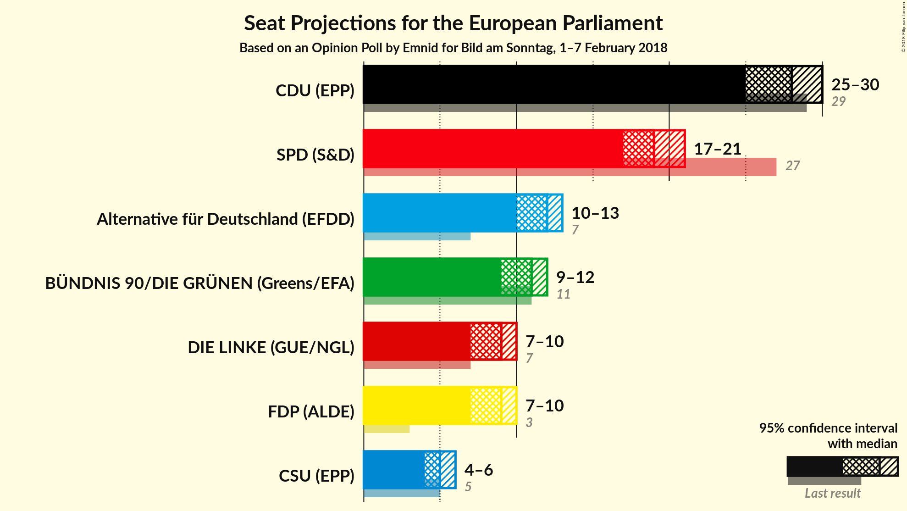
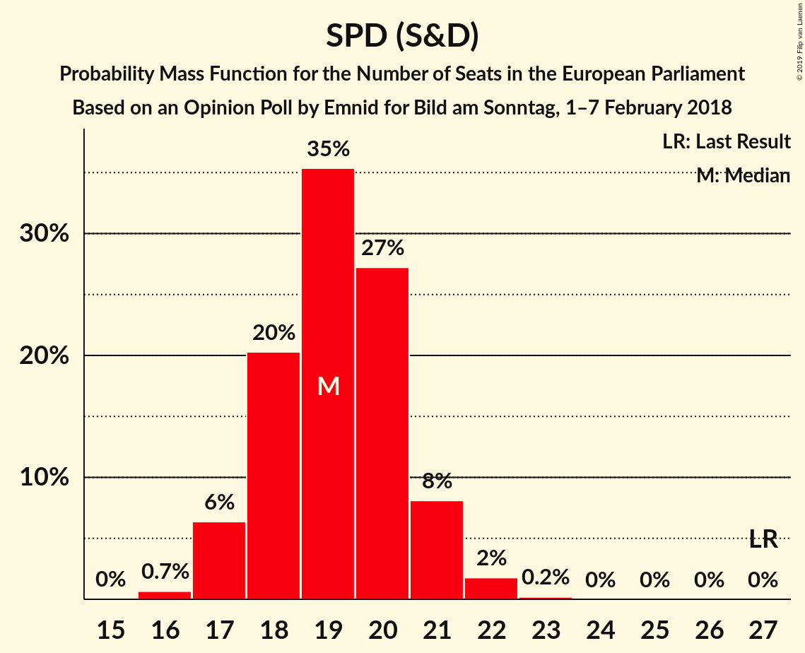
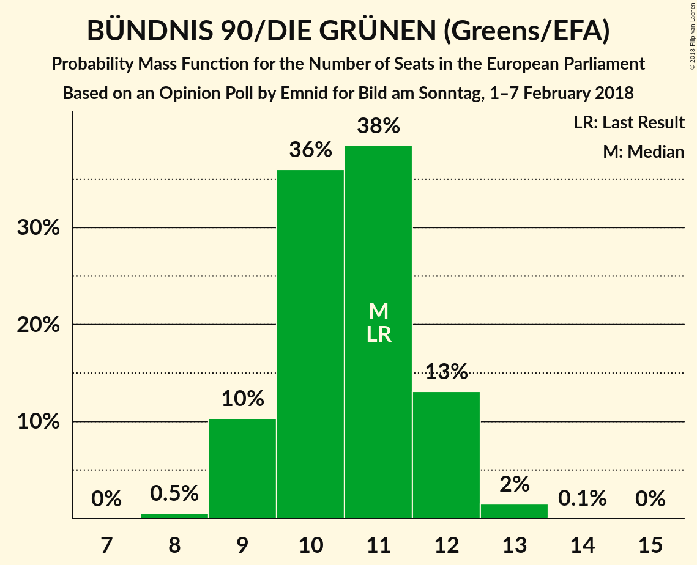
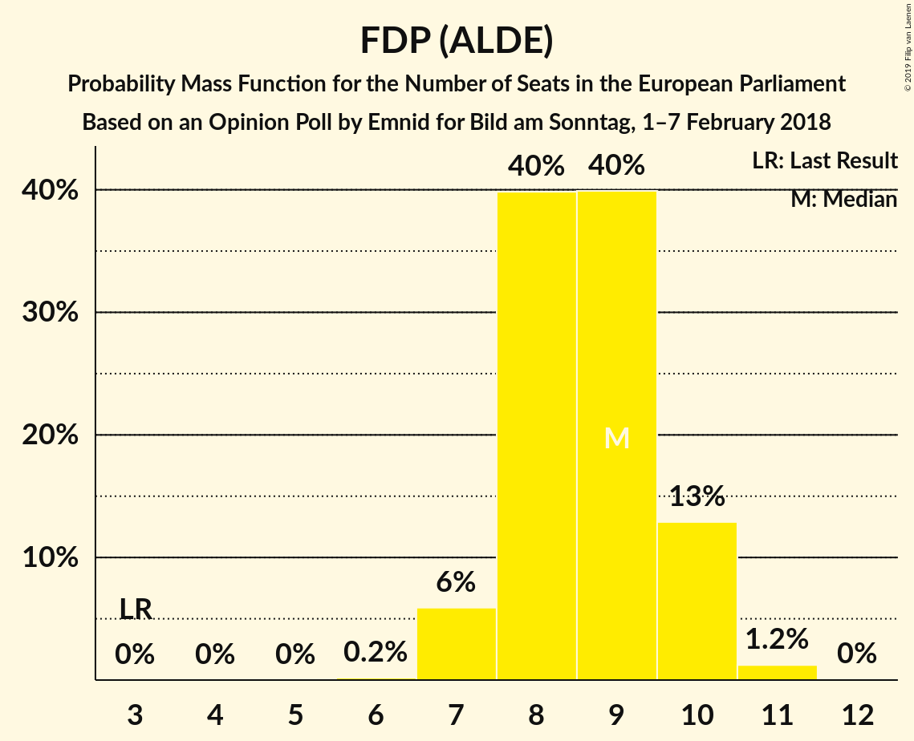

# Opinion Poll by Emnid for Bild am Sonntag, 1–7 February 2018

<a href="#voting-intentions">Voting Intentions</a> | <a href="#seats">Seats</a> | <a href="#coalitions">Coalitions</a> | <a href="#technical-information">Technical Information</a>

## Voting Intentions

### Confidence Intervals

| Party | Last Result | Poll Result | 80% Confidence Interval | 90% Confidence Interval | 95% Confidence Interval | 99% Confidence Interval |
|:-----:|:-----------:|:-----------:|:-----------------------:|:-----------------------:|:-----------------------:|:-----------------------:|
| CDU (EPP) | 30.0% | 28.9% | 27.3–30.6% |26.8–31.1% |26.4–31.5% |25.6–32.3% |
| SPD (S&D) | 27.3% | 20.0% | 18.6–21.5% |18.2–21.9% |17.8–22.3% |17.2–23.1% |
| Alternative für Deutschland (EFDD) | 7.0% | 12.0% | 10.9–13.3% |10.5–13.6% |10.3–13.9% |9.8–14.6% |
| BÜNDNIS 90/DIE GRÜNEN (Greens/EFA) | 10.7% | 11.0% | 9.9–12.2% |9.6–12.6% |9.4–12.9% |8.9–13.5% |
| FDP (ALDE) | 3.4% | 9.0% | 8.0–10.1% |7.7–10.4% |7.5–10.7% |7.1–11.3% |
| DIE LINKE (GUE/NGL) | 7.4% | 9.0% | 8.0–10.1% |7.7–10.4% |7.5–10.7% |7.1–11.3% |
| CSU (EPP) | 5.3% | 5.1% | 4.4–6.1% |4.2–6.3% |4.0–6.5% |3.7–7.0% |
| FREIE WÄHLER (ALDE) | 1.5% | 1.0% | N/A |N/A |N/A |N/A |
| Die PARTEI (NI) | 0.6% | 1.0% | N/A |N/A |N/A |N/A |
| Partei Mensch Umwelt Tierschutz (GUE/NGL) | 1.2% | 0.8% | N/A |N/A |N/A |N/A |

*Note:* The poll result column reflects the actual value used in the calculations. Published results may vary slightly, and in addition be rounded to fewer digits.

## Seats

### Confidence Intervals

| Party | Last Result | Median | 80% Confidence Interval | 90% Confidence Interval | 95% Confidence Interval | 99% Confidence Interval |
|:-----:|:-----------:|:------:|:-----------------------:|:-----------------------:|:-----------------------:|:-----------------------:|
| <a href="#cdu-(epp)">CDU (EPP)</a> | 29 | 28 | 26–29 |26–30 |25–30 |24–31 |
| <a href="#spd-(s&d)">SPD (S&D)</a> | 27 | 19 | 18–21 |17–21 |17–21 |16–22 |
| <a href="#alternative-für-deutschland-(efdd)">Alternative für Deutschland (EFDD)</a> | 7 | 12 | 10–13 |10–13 |10–13 |9–14 |
| <a href="#bÜndnis-90/die-grÜnen-(greens/efa)">BÜNDNIS 90/DIE GRÜNEN (Greens/EFA)</a> | 11 | 11 | 9–12 |9–12 |9–12 |8–13 |
| <a href="#fdp-(alde)">FDP (ALDE)</a> | 3 | 9 | 8–10 |7–10 |7–10 |7–11 |
| <a href="#die-linke-(gue/ngl)">DIE LINKE (GUE/NGL)</a> | 7 | 9 | 8–10 |7–10 |7–10 |7–11 |
| <a href="#csu-(epp)">CSU (EPP)</a> | 5 | 5 | 4–6 |4–6 |4–6 |4–7 |
| <a href="#freie-wÄhler-(alde)">FREIE WÄHLER (ALDE)</a> | 1 | N/A | N/A |N/A |N/A |N/A |
| <a href="#die-partei-(ni)">Die PARTEI (NI)</a> | 1 | N/A | N/A |N/A |N/A |N/A |
| <a href="#partei-mensch-umwelt-tierschutz-(gue/ngl)">Partei Mensch Umwelt Tierschutz (GUE/NGL)</a> | 1 | N/A | N/A |N/A |N/A |N/A |

### CDU (EPP)

*For a full overview of the results for this party, see the [CDU (EPP)](party-cduepp.html) page.*

| Number of Seats | Probability | Accumulated | Special Marks |
|:---------------:|:-----------:|:-----------:|:-------------:|
| 24 | 0.6% | 100% |  |
| 25 | 4% | 99.4% |  |
| 26 | 14% | 96% |  |
| 27 | 27% | 82% |  |
| 28 | 31% | 54% | Median |
| 29 | 16% | 23% | Last Result |
| 30 | 6% | 7% |  |
| 31 | 1.0% | 1.1% |  |
| 32 | 0.1% | 0.1% |  |
| 33 | 0% | 0% |  |

### SPD (S&D)

*For a full overview of the results for this party, see the [SPD (S&D)](party-spdsd.html) page.*

| Number of Seats | Probability | Accumulated | Special Marks |
|:---------------:|:-----------:|:-----------:|:-------------:|
| 16 | 0.7% | 100% |  |
| 17 | 6% | 99.3% |  |
| 18 | 20% | 93% |  |
| 19 | 35% | 73% | Median |
| 20 | 27% | 37% |  |
| 21 | 8% | 10% |  |
| 22 | 2% | 2% |  |
| 23 | 0.2% | 0.2% |  |
| 24 | 0% | 0% |  |
| 25 | 0% | 0% |  |
| 26 | 0% | 0% |  |
| 27 | 0% | 0% | Last Result |

### Alternative für Deutschland (EFDD)

*For a full overview of the results for this party, see the [Alternative für Deutschland (EFDD)](party-alternativefürdeutschlandefdd.html) page.*

| Number of Seats | Probability | Accumulated | Special Marks |
|:---------------:|:-----------:|:-----------:|:-------------:|
| 7 | 0% | 100% | Last Result |
| 8 | 0% | 100% |  |
| 9 | 0.9% | 100% |  |
| 10 | 12% | 99.1% |  |
| 11 | 36% | 87% |  |
| 12 | 38% | 50% | Median |
| 13 | 11% | 12% |  |
| 14 | 1.4% | 2% |  |
| 15 | 0.1% | 0.1% |  |
| 16 | 0% | 0% |  |

### BÜNDNIS 90/DIE GRÜNEN (Greens/EFA)

*For a full overview of the results for this party, see the [BÜNDNIS 90/DIE GRÜNEN (Greens/EFA)](party-bÜndnis90diegrÜnengreensefa.html) page.*

| Number of Seats | Probability | Accumulated | Special Marks |
|:---------------:|:-----------:|:-----------:|:-------------:|
| 8 | 0.5% | 100% |  |
| 9 | 10% | 99.5% |  |
| 10 | 36% | 89% |  |
| 11 | 38% | 53% | Last Result, Median |
| 12 | 13% | 15% |  |
| 13 | 2% | 2% |  |
| 14 | 0.1% | 0.1% |  |
| 15 | 0% | 0% |  |

### FDP (ALDE)

*For a full overview of the results for this party, see the [FDP (ALDE)](party-fdpalde.html) page.*

| Number of Seats | Probability | Accumulated | Special Marks |
|:---------------:|:-----------:|:-----------:|:-------------:|
| 3 | 0% | 100% | Last Result |
| 4 | 0% | 100% |  |
| 5 | 0% | 100% |  |
| 6 | 0.2% | 100% |  |
| 7 | 6% | 99.8% |  |
| 8 | 40% | 94% |  |
| 9 | 40% | 54% | Median |
| 10 | 13% | 14% |  |
| 11 | 1.2% | 1.3% |  |
| 12 | 0% | 0% |  |

### DIE LINKE (GUE/NGL)

*For a full overview of the results for this party, see the [DIE LINKE (GUE/NGL)](party-dielinkeguengl.html) page.*

| Number of Seats | Probability | Accumulated | Special Marks |
|:---------------:|:-----------:|:-----------:|:-------------:|
| 6 | 0.2% | 100% |  |
| 7 | 7% | 99.8% | Last Result |
| 8 | 40% | 93% |  |
| 9 | 40% | 53% | Median |
| 10 | 12% | 13% |  |
| 11 | 1.0% | 1.1% |  |
| 12 | 0% | 0% |  |

### CSU (EPP)

*For a full overview of the results for this party, see the [CSU (EPP)](party-csuepp.html) page.*

| Number of Seats | Probability | Accumulated | Special Marks |
|:---------------:|:-----------:|:-----------:|:-------------:|
| 3 | 0.4% | 100% |  |
| 4 | 21% | 99.6% |  |
| 5 | 59% | 79% | Last Result, Median |
| 6 | 19% | 19% |  |
| 7 | 0.9% | 1.0% |  |
| 8 | 0% | 0% |  |

## Coalitions

### Confidence Intervals

| Coalition | Last Result | Median | Majority? | 80% Confidence Interval | 90% Confidence Interval | 95% Confidence Interval | 99% Confidence Interval |
|:---------:|:-----------:|:------:|:---------:|:-----------------------:|:-----------------------:|:-----------------------:|:-----------------------:|
| CDU (EPP) – CSU (EPP) | 34 | 33 | 0% | 31–34 | 30–35 | 30–35 | 29–36 |
| SPD (S&D) | 27 | 19 | 0% | 18–21 | 17–21 | 17–21 | 16–22 |
| Alternative für Deutschland (EFDD) | 7 | 12 | 0% | 10–13 | 10–13 | 10–13 | 9–14 |
| FDP (ALDE) – FREIE WÄHLER (ALDE) | 4 | 9 | 0% | 8–10 | 7–10 | 7–10 | 7–11 |

### CDU (EPP) – CSU (EPP)

| Number of Seats | Probability | Accumulated | Special Marks |
|:---------------:|:-----------:|:-----------:|:-------------:|
| 28 | 0.1% | 100% |  |
| 29 | 0.8% | 99.9% |  |
| 30 | 4% | 99.1% |  |
| 31 | 16% | 95% |  |
| 32 | 25% | 79% |  |
| 33 | 28% | 54% | Median |
| 34 | 17% | 25% | Last Result |
| 35 | 6% | 8% |  |
| 36 | 1.5% | 2% |  |
| 37 | 0.2% | 0.2% |  |
| 38 | 0% | 0% |  |

### SPD (S&D)

| Number of Seats | Probability | Accumulated | Special Marks |
|:---------------:|:-----------:|:-----------:|:-------------:|
| 16 | 0.7% | 100% |  |
| 17 | 6% | 99.3% |  |
| 18 | 20% | 93% |  |
| 19 | 35% | 73% | Median |
| 20 | 27% | 37% |  |
| 21 | 8% | 10% |  |
| 22 | 2% | 2% |  |
| 23 | 0.2% | 0.2% |  |
| 24 | 0% | 0% |  |
| 25 | 0% | 0% |  |
| 26 | 0% | 0% |  |
| 27 | 0% | 0% | Last Result |

### Alternative für Deutschland (EFDD)

| Number of Seats | Probability | Accumulated | Special Marks |
|:---------------:|:-----------:|:-----------:|:-------------:|
| 7 | 0% | 100% | Last Result |
| 8 | 0% | 100% |  |
| 9 | 0.9% | 100% |  |
| 10 | 12% | 99.1% |  |
| 11 | 36% | 87% |  |
| 12 | 38% | 50% | Median |
| 13 | 11% | 12% |  |
| 14 | 1.4% | 2% |  |
| 15 | 0.1% | 0.1% |  |
| 16 | 0% | 0% |  |

### FDP (ALDE) – FREIE WÄHLER (ALDE)

| Number of Seats | Probability | Accumulated | Special Marks |
|:---------------:|:-----------:|:-----------:|:-------------:|
| 4 | 0% | 100% | Last Result |
| 5 | 0% | 100% |  |
| 6 | 0.2% | 100% |  |
| 7 | 6% | 99.8% |  |
| 8 | 40% | 94% |  |
| 9 | 40% | 54% | Median |
| 10 | 13% | 14% |  |
| 11 | 1.2% | 1.3% |  |
| 12 | 0% | 0% |  |

## Technical Information

### Opinion Poll

+ **Polling firm:** Emnid
+ **Commissioner(s):** Bild am Sonntag
+ **Fieldwork period:** 1–7 February 2018

### Calculations

+ **Sample size:** 1226
+ **Simulations done:** 1,048,576
+ **Error estimate:** 0.93%

