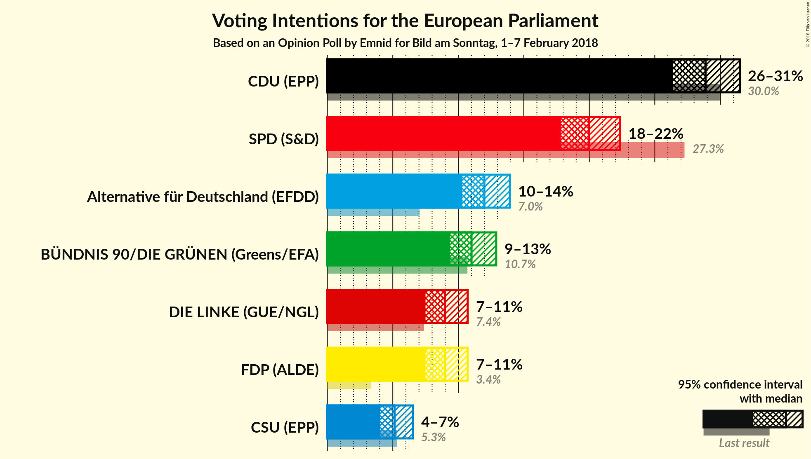

# Opinion Poll by Emnid for Bild am Sonntag, 1–7 February 2018

<a href="#voting-intentions">Voting Intentions</a> | <a href="#seats">Seats</a> | <a href="#coalitions">Coalitions</a> | <a href="#technical-information">Technical Information</a>

## Voting Intentions

### Confidence Intervals

| Party | Last Result | Poll Result | 80% Confidence Interval | 90% Confidence Interval | 95% Confidence Interval | 99% Confidence Interval |
|:-----:|:-----------:|:-----------:|:-----------------------:|:-----------------------:|:-----------------------:|:-----------------------:|
| CDU (EPP) | 0.0% | 28.9% | N/A |N/A |N/A |N/A |
| SPD (S&D) | 0.0% | 20.0% | N/A |N/A |N/A |N/A |
| Alternative für Deutschland (EFDD) | 0.0% | 12.0% | N/A |N/A |N/A |N/A |
| BÜNDNIS 90/DIE GRÜNEN (Greens/EFA) | 0.0% | 11.0% | N/A |N/A |N/A |N/A |
| FDP (ALDE) | 0.0% | 9.0% | N/A |N/A |N/A |N/A |
| DIE LINKE (GUE/NGL) | 0.0% | 9.0% | N/A |N/A |N/A |N/A |
| CSU (EPP) | 0.0% | 5.1% | N/A |N/A |N/A |N/A |

*Note:* The poll result column reflects the actual value used in the calculations. Published results may vary slightly, and in addition be rounded to fewer digits.

## Seats

### Confidence Intervals

| Party | Last Result | Median | 80% Confidence Interval | 90% Confidence Interval | 95% Confidence Interval | 99% Confidence Interval |
|:-----:|:-----------:|:------:|:-----------------------:|:-----------------------:|:-----------------------:|:-----------------------:|
| <a href="#cdu-(epp)">CDU (EPP)</a> | 0 | N/A | N/A |N/A |N/A |N/A |
| <a href="#spd-(s&d)">SPD (S&D)</a> | 0 | N/A | N/A |N/A |N/A |N/A |
| <a href="#alternative-für-deutschland-(efdd)">Alternative für Deutschland (EFDD)</a> | 0 | N/A | N/A |N/A |N/A |N/A |
| <a href="#bÜndnis-90/die-grÜnen-(greens/efa)">BÜNDNIS 90/DIE GRÜNEN (Greens/EFA)</a> | 0 | N/A | N/A |N/A |N/A |N/A |
| <a href="#fdp-(alde)">FDP (ALDE)</a> | 0 | N/A | N/A |N/A |N/A |N/A |
| <a href="#die-linke-(gue/ngl)">DIE LINKE (GUE/NGL)</a> | 0 | N/A | N/A |N/A |N/A |N/A |
| <a href="#csu-(epp)">CSU (EPP)</a> | 0 | N/A | N/A |N/A |N/A |N/A |

## Coalitions

## Technical Information

### Opinion Poll

+ **Polling firm:** Emnid
+ **Commissioner(s):** Bild am Sonntag
+ **Fieldwork period:** 1–7 February 2018

### Calculations

+ **Sample size:** 1226
+ **Simulations done:** 0
+ **Error estimate:** 100.00%

