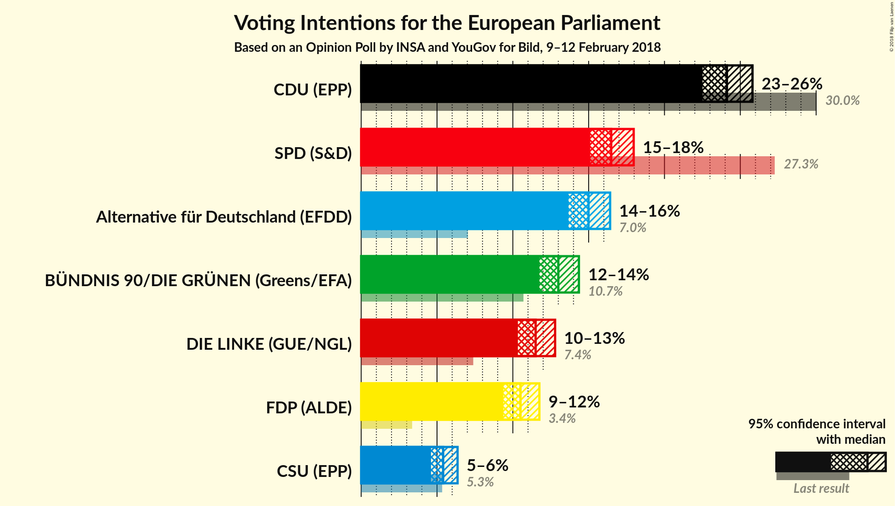
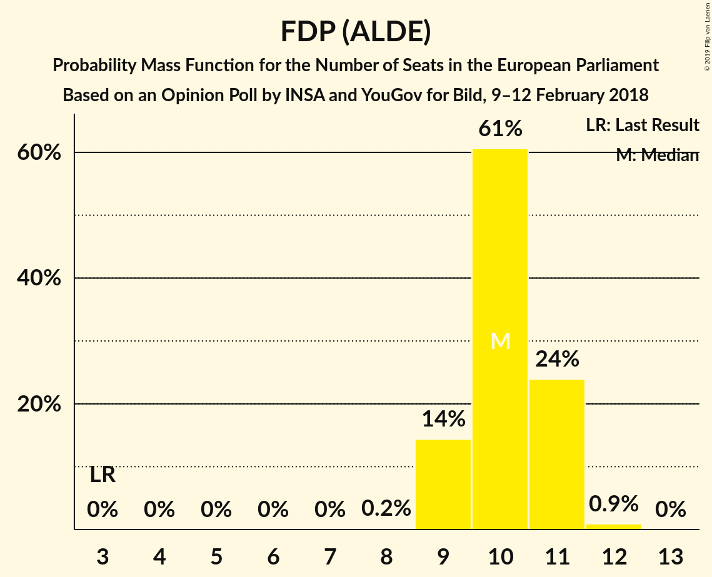
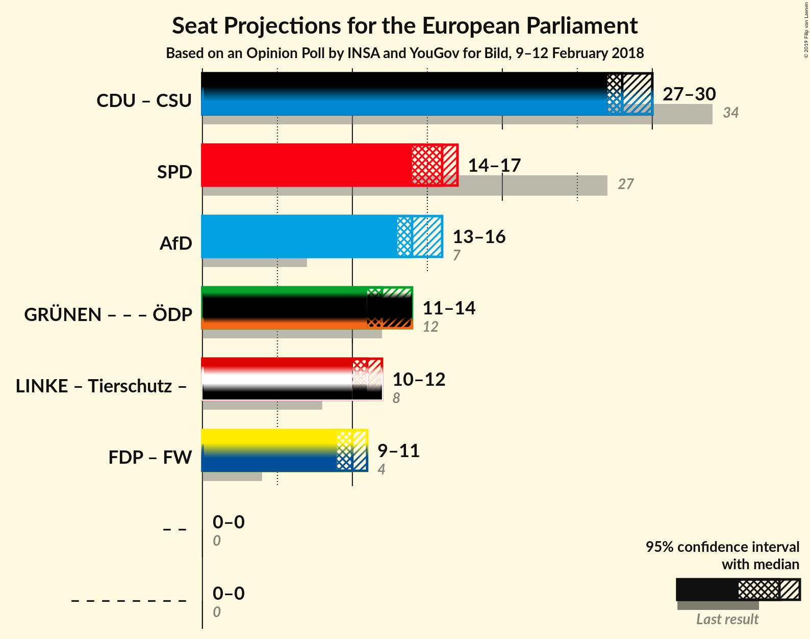

# Opinion Poll by INSA and YouGov for Bild, 9–12 February 2018

<a href="#voting-intentions">Voting Intentions</a> | <a href="#seats">Seats</a> | <a href="#coalitions">Coalitions</a> | <a href="#technical-information">Technical Information</a>

## Voting Intentions

### Confidence Intervals

| Party | Last Result | Poll Result | 80% Confidence Interval | 90% Confidence Interval | 95% Confidence Interval | 99% Confidence Interval |
|:-----:|:-----------:|:-----------:|:-----------------------:|:-----------------------:|:-----------------------:|:-----------------------:|
| CDU (EPP) | 30.0% | 24.1% | 23.1–25.2% |22.8–25.5% |22.5–25.8% |22.0–26.3% |
| SPD (S&D) | 27.3% | 16.5% | 15.6–17.5% |15.3–17.7% |15.1–18.0% |14.7–18.4% |
| Alternative für Deutschland (EFDD) | 7.0% | 15.0% | 14.1–15.9% |13.9–16.2% |13.7–16.4% |13.3–16.9% |
| BÜNDNIS 90/DIE GRÜNEN (Greens/EFA) | 10.7% | 13.0% | 12.2–13.9% |11.9–14.1% |11.8–14.4% |11.4–14.8% |
| DIE LINKE (GUE/NGL) | 7.4% | 11.5% | 10.7–12.3% |10.5–12.6% |10.3–12.8% |10.0–13.2% |
| FDP (ALDE) | 3.4% | 10.5% | 9.8–11.3% |9.6–11.6% |9.4–11.8% |9.0–12.1% |
| CSU (EPP) | 5.3% | 5.4% | 4.9–6.0% |4.7–6.2% |4.6–6.4% |4.4–6.7% |
| FREIE WÄHLER (ALDE) | 1.5% | 0.8% | N/A |N/A |N/A |N/A |
| Die PARTEI (NI) | 0.6% | 0.8% | N/A |N/A |N/A |N/A |
| Partei Mensch Umwelt Tierschutz (GUE/NGL) | 1.2% | 0.7% | N/A |N/A |N/A |N/A |

*Note:* The poll result column reflects the actual value used in the calculations. Published results may vary slightly, and in addition be rounded to fewer digits.

## Seats

### Confidence Intervals

| Party | Last Result | Median | 80% Confidence Interval | 90% Confidence Interval | 95% Confidence Interval | 99% Confidence Interval |
|:-----:|:-----------:|:------:|:-----------------------:|:-----------------------:|:-----------------------:|:-----------------------:|
| <a href="#cdu-(epp)">CDU (EPP)</a> | 29 | 23 | 22–24 |22–25 |22–25 |21–25 |
| <a href="#spd-(s&d)">SPD (S&D)</a> | 27 | 16 | 15–17 |15–17 |14–17 |14–18 |
| <a href="#alternative-für-deutschland-(efdd)">Alternative für Deutschland (EFDD)</a> | 7 | 14 | 14–15 |13–16 |13–16 |13–16 |
| <a href="#bündnis-90/die-grünen-(greens/efa)">BÜNDNIS 90/DIE GRÜNEN (Greens/EFA)</a> | 11 | 12 | 12–13 |11–14 |11–14 |11–14 |
| <a href="#die-linke-(gue/ngl)">DIE LINKE (GUE/NGL)</a> | 7 | 11 | 10–12 |10–12 |10–12 |10–13 |
| <a href="#fdp-(alde)">FDP (ALDE)</a> | 3 | 10 | 9–11 |9–11 |9–11 |9–12 |
| <a href="#csu-(epp)">CSU (EPP)</a> | 5 | 5 | 5–6 |5–6 |4–6 |4–6 |
| <a href="#freie-wähler-(alde)">FREIE WÄHLER (ALDE)</a> | 1 | N/A | N/A |N/A |N/A |N/A |
| <a href="#die-partei-(ni)">Die PARTEI (NI)</a> | 1 | N/A | N/A |N/A |N/A |N/A |
| <a href="#partei-mensch-umwelt-tierschutz-(gue/ngl)">Partei Mensch Umwelt Tierschutz (GUE/NGL)</a> | 1 | N/A | N/A |N/A |N/A |N/A |

### CDU (EPP)

*For a full overview of the results for this party, see the [CDU (EPP)](party-cduepp.html) page.*

| Number of Seats | Probability | Accumulated | Special Marks |
|:---------------:|:-----------:|:-----------:|:-------------:|
| 21 | 2% | 100% |  |
| 22 | 18% | 98% |  |
| 23 | 48% | 80% | Median |
| 24 | 26% | 32% |  |
| 25 | 5% | 6% |  |
| 26 | 0.3% | 0.3% |  |
| 27 | 0% | 0% |  |
| 28 | 0% | 0% |  |
| 29 | 0% | 0% | Last Result |

### SPD (S&D)

*For a full overview of the results for this party, see the [SPD (S&D)](party-spdsd.html) page.*

| Number of Seats | Probability | Accumulated | Special Marks |
|:---------------:|:-----------:|:-----------:|:-------------:|
| 14 | 3% | 100% |  |
| 15 | 37% | 97% |  |
| 16 | 46% | 61% | Median |
| 17 | 14% | 15% |  |
| 18 | 1.3% | 1.3% |  |
| 19 | 0% | 0% |  |
| 20 | 0% | 0% |  |
| 21 | 0% | 0% |  |
| 22 | 0% | 0% |  |
| 23 | 0% | 0% |  |
| 24 | 0% | 0% |  |
| 25 | 0% | 0% |  |
| 26 | 0% | 0% |  |
| 27 | 0% | 0% | Last Result |

### Alternative für Deutschland (EFDD)

*For a full overview of the results for this party, see the [Alternative für Deutschland (EFDD)](party-alternativefürdeutschlandefdd.html) page.*

| Number of Seats | Probability | Accumulated | Special Marks |
|:---------------:|:-----------:|:-----------:|:-------------:|
| 7 | 0% | 100% | Last Result |
| 8 | 0% | 100% |  |
| 9 | 0% | 100% |  |
| 10 | 0% | 100% |  |
| 11 | 0% | 100% |  |
| 12 | 0.2% | 100% |  |
| 13 | 9% | 99.8% |  |
| 14 | 48% | 91% | Median |
| 15 | 38% | 43% |  |
| 16 | 5% | 5% |  |
| 17 | 0.1% | 0.1% |  |
| 18 | 0% | 0% |  |

### BÜNDNIS 90/DIE GRÜNEN (Greens/EFA)

*For a full overview of the results for this party, see the [BÜNDNIS 90/DIE GRÜNEN (Greens/EFA)](party-bündnis90diegrünengreensefa.html) page.*

| Number of Seats | Probability | Accumulated | Special Marks |
|:---------------:|:-----------:|:-----------:|:-------------:|
| 10 | 0.1% | 100% |  |
| 11 | 6% | 99.9% | Last Result |
| 12 | 48% | 94% | Median |
| 13 | 40% | 46% |  |
| 14 | 6% | 6% |  |
| 15 | 0.1% | 0.1% |  |
| 16 | 0% | 0% |  |

### DIE LINKE (GUE/NGL)

*For a full overview of the results for this party, see the [DIE LINKE (GUE/NGL)](party-dielinkeguengl.html) page.*

| Number of Seats | Probability | Accumulated | Special Marks |
|:---------------:|:-----------:|:-----------:|:-------------:|
| 7 | 0% | 100% | Last Result |
| 8 | 0% | 100% |  |
| 9 | 0.4% | 100% |  |
| 10 | 17% | 99.6% |  |
| 11 | 60% | 82% | Median |
| 12 | 22% | 23% |  |
| 13 | 1.0% | 1.0% |  |
| 14 | 0% | 0% |  |

### FDP (ALDE)

*For a full overview of the results for this party, see the [FDP (ALDE)](party-fdpalde.html) page.*

| Number of Seats | Probability | Accumulated | Special Marks |
|:---------------:|:-----------:|:-----------:|:-------------:|
| 3 | 0% | 100% | Last Result |
| 4 | 0% | 100% |  |
| 5 | 0% | 100% |  |
| 6 | 0% | 100% |  |
| 7 | 0% | 100% |  |
| 8 | 0.2% | 100% |  |
| 9 | 14% | 99.8% |  |
| 10 | 61% | 85% | Median |
| 11 | 24% | 25% |  |
| 12 | 0.9% | 0.9% |  |
| 13 | 0% | 0% |  |

### CSU (EPP)

*For a full overview of the results for this party, see the [CSU (EPP)](party-csuepp.html) page.*

| Number of Seats | Probability | Accumulated | Special Marks |
|:---------------:|:-----------:|:-----------:|:-------------:|
| 4 | 4% | 100% |  |
| 5 | 72% | 96% | Last Result, Median |
| 6 | 24% | 24% |  |
| 7 | 0.2% | 0.2% |  |
| 8 | 0% | 0% |  |

## Coalitions

### Confidence Intervals

| Coalition | Last Result | Median | Majority? | 80% Confidence Interval | 90% Confidence Interval | 95% Confidence Interval | 99% Confidence Interval |
|:---------:|:-----------:|:------:|:---------:|:-----------------------:|:-----------------------:|:-----------------------:|:-----------------------:|
| CDU (EPP) – CSU (EPP) | 34 | 28 | 0% | 27–30 | 27–30 | 27–30 | 26–31 |
| SPD (S&D) | 27 | 16 | 0% | 15–17 | 15–17 | 14–17 | 14–18 |
| Alternative für Deutschland (EFDD) | 7 | 14 | 0% | 14–15 | 13–16 | 13–16 | 13–16 |
| FDP (ALDE) – FREIE WÄHLER (ALDE) | 4 | 10 | 0% | 9–11 | 9–11 | 9–11 | 9–12 |

### CDU (EPP) – CSU (EPP)

| Number of Seats | Probability | Accumulated | Special Marks |
|:---------------:|:-----------:|:-----------:|:-------------:|
| 25 | 0.1% | 100% |  |
| 26 | 2% | 99.9% |  |
| 27 | 14% | 98% |  |
| 28 | 43% | 84% | Median |
| 29 | 31% | 42% |  |
| 30 | 9% | 10% |  |
| 31 | 1.0% | 1.0% |  |
| 32 | 0% | 0% |  |
| 33 | 0% | 0% |  |
| 34 | 0% | 0% | Last Result |

### SPD (S&D)

| Number of Seats | Probability | Accumulated | Special Marks |
|:---------------:|:-----------:|:-----------:|:-------------:|
| 14 | 3% | 100% |  |
| 15 | 37% | 97% |  |
| 16 | 46% | 61% | Median |
| 17 | 14% | 15% |  |
| 18 | 1.3% | 1.3% |  |
| 19 | 0% | 0% |  |
| 20 | 0% | 0% |  |
| 21 | 0% | 0% |  |
| 22 | 0% | 0% |  |
| 23 | 0% | 0% |  |
| 24 | 0% | 0% |  |
| 25 | 0% | 0% |  |
| 26 | 0% | 0% |  |
| 27 | 0% | 0% | Last Result |

### Alternative für Deutschland (EFDD)

| Number of Seats | Probability | Accumulated | Special Marks |
|:---------------:|:-----------:|:-----------:|:-------------:|
| 7 | 0% | 100% | Last Result |
| 8 | 0% | 100% |  |
| 9 | 0% | 100% |  |
| 10 | 0% | 100% |  |
| 11 | 0% | 100% |  |
| 12 | 0.2% | 100% |  |
| 13 | 9% | 99.8% |  |
| 14 | 48% | 91% | Median |
| 15 | 38% | 43% |  |
| 16 | 5% | 5% |  |
| 17 | 0.1% | 0.1% |  |
| 18 | 0% | 0% |  |

### FDP (ALDE) – FREIE WÄHLER (ALDE)

| Number of Seats | Probability | Accumulated | Special Marks |
|:---------------:|:-----------:|:-----------:|:-------------:|
| 4 | 0% | 100% | Last Result |
| 5 | 0% | 100% |  |
| 6 | 0% | 100% |  |
| 7 | 0% | 100% |  |
| 8 | 0.2% | 100% |  |
| 9 | 14% | 99.8% |  |
| 10 | 61% | 85% | Median |
| 11 | 24% | 25% |  |
| 12 | 0.9% | 0.9% |  |
| 13 | 0% | 0% |  |

## Technical Information

### Opinion Poll

+ **Polling firm:** INSA and YouGov
+ **Commissioner(s):** Bild
+ **Fieldwork period:** 9–12 February 2018

### Calculations

+ **Sample size:** 2608
+ **Simulations done:** 1,048,576
+ **Error estimate:** 0.69%

