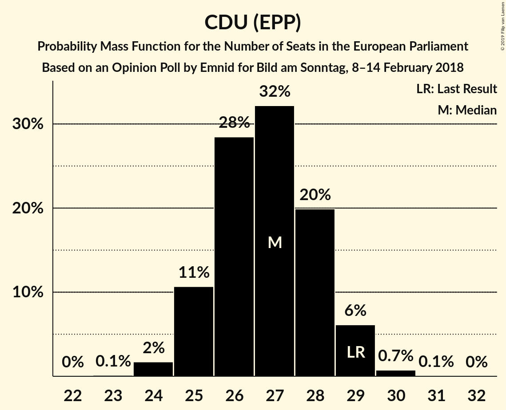
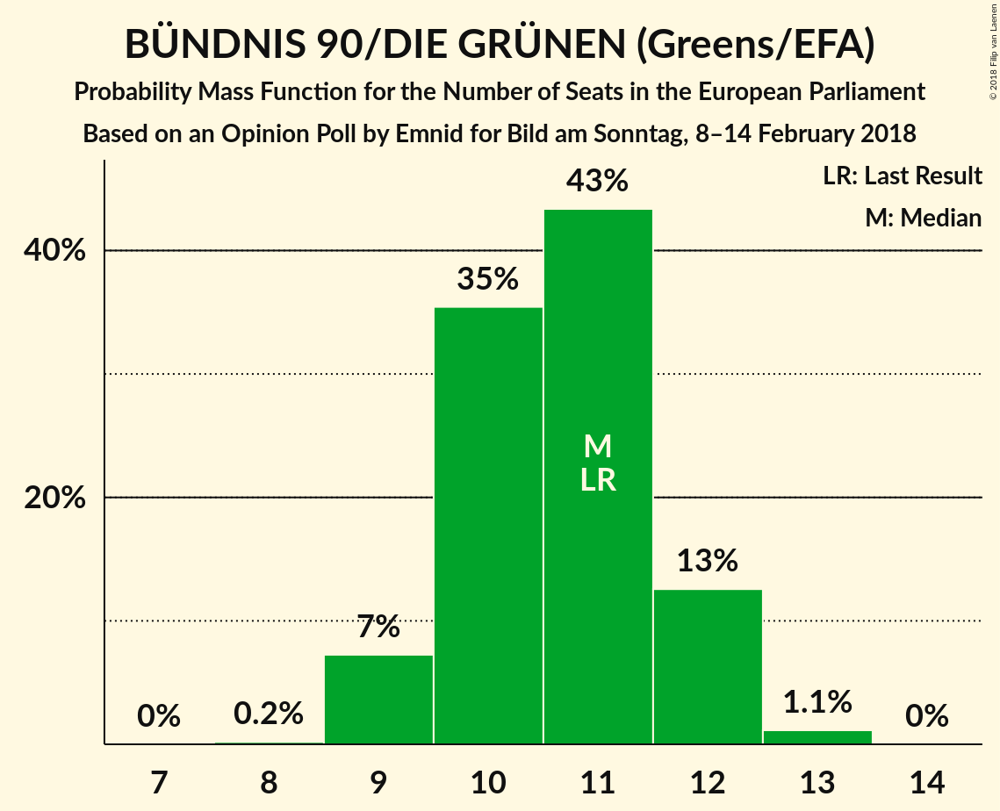
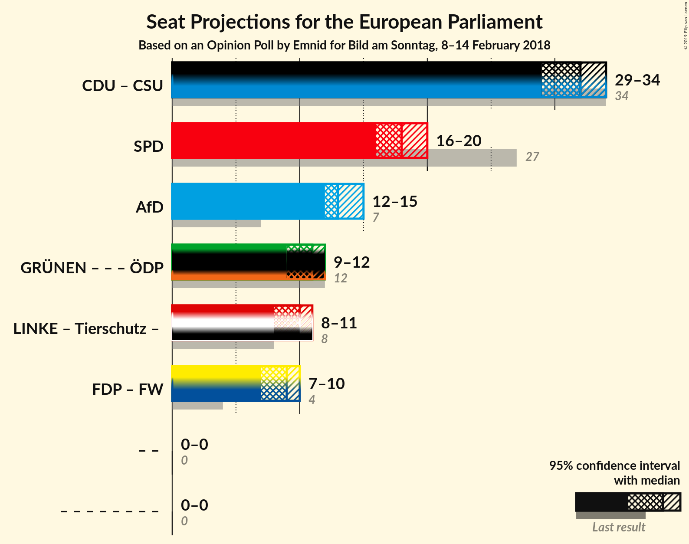

# Opinion Poll by Emnid for Bild am Sonntag, 8–14 February 2018

<a href="#voting-intentions">Voting Intentions</a> | <a href="#seats">Seats</a> | <a href="#coalitions">Coalitions</a> | <a href="#technical-information">Technical Information</a>

## Voting Intentions

### Confidence Intervals

| Party | Last Result | Poll Result | 80% Confidence Interval | 90% Confidence Interval | 95% Confidence Interval | 99% Confidence Interval |
|:-----:|:-----------:|:-----------:|:-----------------------:|:-----------------------:|:-----------------------:|:-----------------------:|
| CDU (EPP) | 30.0% | 28.0% | 26.6–29.6% |26.1–30.0% |25.8–30.4% |25.1–31.1% |
| SPD (S&D) | 27.3% | 19.0% | 17.7–20.4% |17.4–20.8% |17.1–21.1% |16.5–21.8% |
| Alternative für Deutschland (EFDD) | 7.0% | 14.0% | 12.9–15.2% |12.6–15.6% |12.3–15.9% |11.8–16.5% |
| BÜNDNIS 90/DIE GRÜNEN (Greens/EFA) | 10.7% | 11.0% | 10.0–12.1% |9.8–12.5% |9.5–12.7% |9.1–13.3% |
| DIE LINKE (GUE/NGL) | 7.4% | 10.0% | 9.1–11.1% |8.8–11.4% |8.6–11.7% |8.2–12.2% |
| FDP (ALDE) | 3.4% | 9.0% | 8.1–10.0% |7.8–10.3% |7.6–10.6% |7.2–11.1% |
| CSU (EPP) | 5.3% | 5.0% | 4.3–5.8% |4.2–6.1% |4.0–6.2% |3.7–6.7% |
| FREIE WÄHLER (ALDE) | 1.5% | 0.8% | N/A |N/A |N/A |N/A |
| Die PARTEI (NI) | 0.6% | 0.8% | N/A |N/A |N/A |N/A |
| Partei Mensch Umwelt Tierschutz (GUE/NGL) | 1.2% | 0.7% | N/A |N/A |N/A |N/A |

*Note:* The poll result column reflects the actual value used in the calculations. Published results may vary slightly, and in addition be rounded to fewer digits.

## Seats

### Confidence Intervals

| Party | Last Result | Median | 80% Confidence Interval | 90% Confidence Interval | 95% Confidence Interval | 99% Confidence Interval |
|:-----:|:-----------:|:------:|:-----------------------:|:-----------------------:|:-----------------------:|:-----------------------:|
| <a href="#cdu-(epp)">CDU (EPP)</a> | 29 | 27 | 25–28 |25–29 |25–29 |24–30 |
| <a href="#spd-(s&d)">SPD (S&D)</a> | 27 | 18 | 17–19 |17–20 |16–20 |16–21 |
| <a href="#alternative-für-deutschland-(efdd)">Alternative für Deutschland (EFDD)</a> | 7 | 13 | 12–15 |12–15 |12–15 |11–16 |
| <a href="#bÜndnis-90/die-grÜnen-(greens/efa)">BÜNDNIS 90/DIE GRÜNEN (Greens/EFA)</a> | 11 | 11 | 10–12 |9–12 |9–12 |9–13 |
| <a href="#die-linke-(gue/ngl)">DIE LINKE (GUE/NGL)</a> | 7 | 10 | 9–11 |8–11 |8–11 |8–12 |
| <a href="#fdp-(alde)">FDP (ALDE)</a> | 3 | 9 | 8–10 |8–10 |7–10 |7–11 |
| <a href="#csu-(epp)">CSU (EPP)</a> | 5 | 5 | 4–6 |4–6 |4–6 |4–6 |
| <a href="#freie-wÄhler-(alde)">FREIE WÄHLER (ALDE)</a> | 1 | N/A | N/A |N/A |N/A |N/A |
| <a href="#die-partei-(ni)">Die PARTEI (NI)</a> | 1 | N/A | N/A |N/A |N/A |N/A |
| <a href="#partei-mensch-umwelt-tierschutz-(gue/ngl)">Partei Mensch Umwelt Tierschutz (GUE/NGL)</a> | 1 | N/A | N/A |N/A |N/A |N/A |

### CDU (EPP)

*For a full overview of the results for this party, see the [CDU (EPP)](party-cduepp.html) page.*

| Number of Seats | Probability | Accumulated | Special Marks |
|:---------------:|:-----------:|:-----------:|:-------------:|
| 23 | 0.1% | 100% |  |
| 24 | 2% | 99.9% |  |
| 25 | 11% | 98% |  |
| 26 | 28% | 87% |  |
| 27 | 32% | 59% | Median |
| 28 | 20% | 27% |  |
| 29 | 6% | 7% | Last Result |
| 30 | 0.7% | 0.8% |  |
| 31 | 0.1% | 0.1% |  |
| 32 | 0% | 0% |  |

### SPD (S&D)

*For a full overview of the results for this party, see the [SPD (S&D)](party-spdsd.html) page.*

| Number of Seats | Probability | Accumulated | Special Marks |
|:---------------:|:-----------:|:-----------:|:-------------:|
| 15 | 0.2% | 100% |  |
| 16 | 3% | 99.8% |  |
| 17 | 21% | 96% |  |
| 18 | 37% | 76% | Median |
| 19 | 28% | 38% |  |
| 20 | 9% | 10% |  |
| 21 | 1.2% | 1.2% |  |
| 22 | 0.1% | 0.1% |  |
| 23 | 0% | 0% |  |
| 24 | 0% | 0% |  |
| 25 | 0% | 0% |  |
| 26 | 0% | 0% |  |
| 27 | 0% | 0% | Last Result |

### Alternative für Deutschland (EFDD)

*For a full overview of the results for this party, see the [Alternative für Deutschland (EFDD)](party-alternativefürdeutschlandefdd.html) page.*

| Number of Seats | Probability | Accumulated | Special Marks |
|:---------------:|:-----------:|:-----------:|:-------------:|
| 7 | 0% | 100% | Last Result |
| 8 | 0% | 100% |  |
| 9 | 0% | 100% |  |
| 10 | 0% | 100% |  |
| 11 | 1.0% | 100% |  |
| 12 | 13% | 99.0% |  |
| 13 | 41% | 86% | Median |
| 14 | 34% | 46% |  |
| 15 | 10% | 11% |  |
| 16 | 1.0% | 1.1% |  |
| 17 | 0% | 0% |  |

### BÜNDNIS 90/DIE GRÜNEN (Greens/EFA)

*For a full overview of the results for this party, see the [BÜNDNIS 90/DIE GRÜNEN (Greens/EFA)](party-bÜndnis90diegrÜnengreensefa.html) page.*

| Number of Seats | Probability | Accumulated | Special Marks |
|:---------------:|:-----------:|:-----------:|:-------------:|
| 8 | 0.2% | 100% |  |
| 9 | 7% | 99.8% |  |
| 10 | 35% | 93% |  |
| 11 | 43% | 57% | Last Result, Median |
| 12 | 13% | 14% |  |
| 13 | 1.1% | 1.2% |  |
| 14 | 0% | 0% |  |

### DIE LINKE (GUE/NGL)

*For a full overview of the results for this party, see the [DIE LINKE (GUE/NGL)](party-dielinkeguengl.html) page.*

| Number of Seats | Probability | Accumulated | Special Marks |
|:---------------:|:-----------:|:-----------:|:-------------:|
| 7 | 0.1% | 100% | Last Result |
| 8 | 7% | 99.9% |  |
| 9 | 36% | 93% |  |
| 10 | 46% | 57% | Median |
| 11 | 10% | 11% |  |
| 12 | 0.9% | 0.9% |  |
| 13 | 0% | 0% |  |

### FDP (ALDE)

*For a full overview of the results for this party, see the [FDP (ALDE)](party-fdpalde.html) page.*

| Number of Seats | Probability | Accumulated | Special Marks |
|:---------------:|:-----------:|:-----------:|:-------------:|
| 3 | 0% | 100% | Last Result |
| 4 | 0% | 100% |  |
| 5 | 0% | 100% |  |
| 6 | 0.1% | 100% |  |
| 7 | 5% | 99.9% |  |
| 8 | 37% | 95% |  |
| 9 | 47% | 59% | Median |
| 10 | 11% | 11% |  |
| 11 | 0.7% | 0.7% |  |
| 12 | 0% | 0% |  |

### CSU (EPP)

*For a full overview of the results for this party, see the [CSU (EPP)](party-csuepp.html) page.*

| Number of Seats | Probability | Accumulated | Special Marks |
|:---------------:|:-----------:|:-----------:|:-------------:|
| 3 | 0.3% | 100% |  |
| 4 | 27% | 99.7% |  |
| 5 | 62% | 73% | Last Result, Median |
| 6 | 11% | 12% |  |
| 7 | 0.3% | 0.3% |  |
| 8 | 0% | 0% |  |

## Coalitions

### Confidence Intervals

| Coalition | Last Result | Median | Majority? | 80% Confidence Interval | 90% Confidence Interval | 95% Confidence Interval | 99% Confidence Interval |
|:---------:|:-----------:|:------:|:---------:|:-----------------------:|:-----------------------:|:-----------------------:|:-----------------------:|
| CDU (EPP) – CSU (EPP) | 34 | 32 | 0% | 30–33 | 30–34 | 29–34 | 29–35 |
| SPD (S&D) | 27 | 18 | 0% | 17–19 | 17–20 | 16–20 | 16–21 |
| Alternative für Deutschland (EFDD) | 7 | 13 | 0% | 12–15 | 12–15 | 12–15 | 11–16 |
| FDP (ALDE) – FREIE WÄHLER (ALDE) | 4 | 9 | 0% | 8–10 | 8–10 | 7–10 | 7–11 |

### CDU (EPP) – CSU (EPP)

| Number of Seats | Probability | Accumulated | Special Marks |
|:---------------:|:-----------:|:-----------:|:-------------:|
| 28 | 0.3% | 100% |  |
| 29 | 3% | 99.6% |  |
| 30 | 14% | 96% |  |
| 31 | 29% | 83% |  |
| 32 | 30% | 54% | Median |
| 33 | 17% | 24% |  |
| 34 | 5% | 6% | Last Result |
| 35 | 0.8% | 0.9% |  |
| 36 | 0.1% | 0.1% |  |
| 37 | 0% | 0% |  |

### SPD (S&D)

| Number of Seats | Probability | Accumulated | Special Marks |
|:---------------:|:-----------:|:-----------:|:-------------:|
| 15 | 0.2% | 100% |  |
| 16 | 3% | 99.8% |  |
| 17 | 21% | 96% |  |
| 18 | 37% | 76% | Median |
| 19 | 28% | 38% |  |
| 20 | 9% | 10% |  |
| 21 | 1.2% | 1.2% |  |
| 22 | 0.1% | 0.1% |  |
| 23 | 0% | 0% |  |
| 24 | 0% | 0% |  |
| 25 | 0% | 0% |  |
| 26 | 0% | 0% |  |
| 27 | 0% | 0% | Last Result |

### Alternative für Deutschland (EFDD)

| Number of Seats | Probability | Accumulated | Special Marks |
|:---------------:|:-----------:|:-----------:|:-------------:|
| 7 | 0% | 100% | Last Result |
| 8 | 0% | 100% |  |
| 9 | 0% | 100% |  |
| 10 | 0% | 100% |  |
| 11 | 1.0% | 100% |  |
| 12 | 13% | 99.0% |  |
| 13 | 41% | 86% | Median |
| 14 | 34% | 46% |  |
| 15 | 10% | 11% |  |
| 16 | 1.0% | 1.1% |  |
| 17 | 0% | 0% |  |

### FDP (ALDE) – FREIE WÄHLER (ALDE)

| Number of Seats | Probability | Accumulated | Special Marks |
|:---------------:|:-----------:|:-----------:|:-------------:|
| 4 | 0% | 100% | Last Result |
| 5 | 0% | 100% |  |
| 6 | 0.1% | 100% |  |
| 7 | 5% | 99.9% |  |
| 8 | 37% | 95% |  |
| 9 | 47% | 59% | Median |
| 10 | 11% | 11% |  |
| 11 | 0.7% | 0.7% |  |
| 12 | 0% | 0% |  |

## Technical Information

### Opinion Poll

+ **Polling firm:** Emnid
+ **Commissioner(s):** Bild am Sonntag
+ **Fieldwork period:** 8–14 February 2018

### Calculations

+ **Sample size:** 1478
+ **Simulations done:** 1,048,576
+ **Error estimate:** 1.13%

