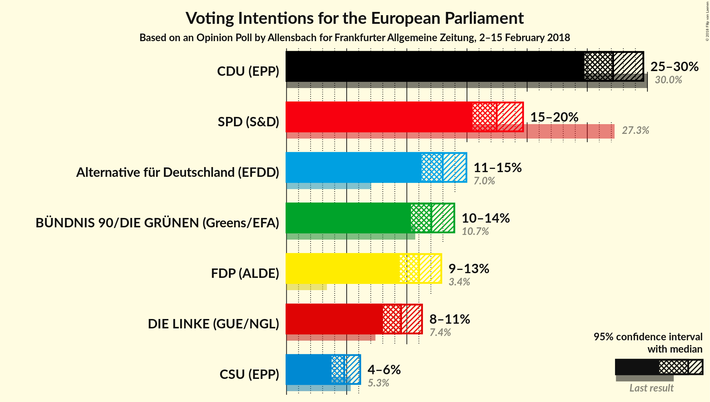
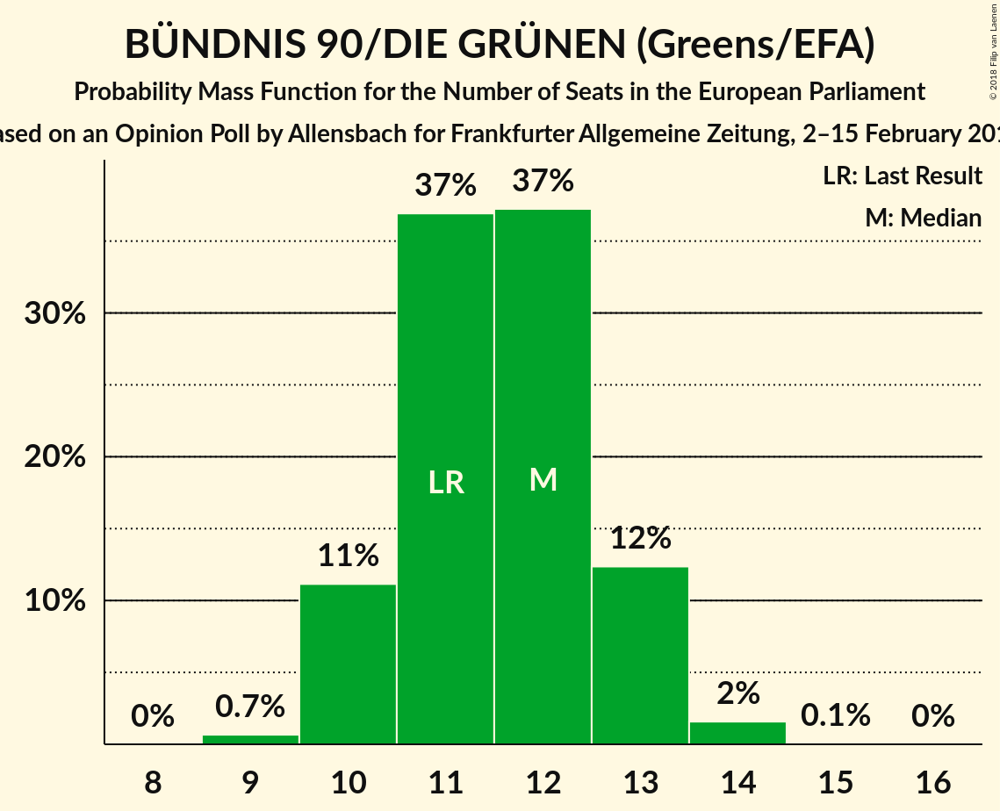

# Opinion Poll by Allensbach for Frankfurter Allgemeine Zeitung, 2–15 February 2018

<a href="#voting-intentions">Voting Intentions</a> | <a href="#seats">Seats</a> | <a href="#coalitions">Coalitions</a> | <a href="#technical-information">Technical Information</a>

## Voting Intentions

### Confidence Intervals

| Party | Last Result | Poll Result | 80% Confidence Interval | 90% Confidence Interval | 95% Confidence Interval | 99% Confidence Interval |
|:-----:|:-----------:|:-----------:|:-----------------------:|:-----------------------:|:-----------------------:|:-----------------------:|
| CDU (EPP) | 30.0% | 27.1% | 25.6–28.8% |25.1–29.3% |24.8–29.7% |24.0–30.5% |
| SPD (S&D) | 27.3% | 17.5% | 16.2–18.9% |15.8–19.3% |15.5–19.7% |14.9–20.4% |
| Alternative für Deutschland (EFDD) | 7.0% | 13.0% | 11.8–14.3% |11.5–14.6% |11.2–15.0% |10.7–15.6% |
| BÜNDNIS 90/DIE GRÜNEN (Greens/EFA) | 10.7% | 12.0% | 10.9–13.3% |10.6–13.6% |10.3–13.9% |9.8–14.6% |
| FDP (ALDE) | 3.4% | 11.0% | 10.0–12.2% |9.7–12.6% |9.4–12.9% |8.9–13.5% |
| DIE LINKE (GUE/NGL) | 7.4% | 9.5% | 8.5–10.7% |8.3–11.0% |8.0–11.3% |7.6–11.8% |
| CSU (EPP) | 5.3% | 4.8% | 4.1–5.7% |3.9–5.9% |3.7–6.1% |3.4–6.6% |

*Note:* The poll result column reflects the actual value used in the calculations. Published results may vary slightly, and in addition be rounded to fewer digits.

## Seats

### Confidence Intervals

| Party | Last Result | Median | 80% Confidence Interval | 90% Confidence Interval | 95% Confidence Interval | 99% Confidence Interval |
|:-----:|:-----------:|:------:|:-----------------------:|:-----------------------:|:-----------------------:|:-----------------------:|
| <a href="#cdu-(epp)">CDU (EPP)</a> | 29 | 26 | 25–27 |23–28 |23–28 |22–29 |
| <a href="#spd-(s&d)">SPD (S&D)</a> | 27 | 18 | 16–20 |16–20 |15–20 |15–20 |
| <a href="#alternative-für-deutschland-(efdd)">Alternative für Deutschland (EFDD)</a> | 7 | 12 | 11–14 |11–14 |10–14 |10–15 |
| <a href="#bÜndnis-90/die-grÜnen-(greens/efa)">BÜNDNIS 90/DIE GRÜNEN (Greens/EFA)</a> | 11 | 10 | 10–13 |10–13 |10–13 |10–13 |
| <a href="#fdp-(alde)">FDP (ALDE)</a> | 3 | 10 | 9–13 |9–14 |9–14 |8–14 |
| <a href="#die-linke-(gue/ngl)">DIE LINKE (GUE/NGL)</a> | 7 | 9 | 8–10 |8–10 |7–11 |7–11 |
| <a href="#csu-(epp)">CSU (EPP)</a> | 5 | 4 | 4–5 |3–5 |3–7 |3–7 |

### CDU (EPP)

*For a full overview of the results for this party, see the [CDU (EPP)](party-cduepp.html) page.*

| Number of Seats | Probability | Accumulated | Special Marks |
|:---------------:|:-----------:|:-----------:|:-------------:|
| 22 | 2% | 100% |  |
| 23 | 4% | 98% |  |
| 24 | 3% | 95% |  |
| 25 | 31% | 92% |  |
| 26 | 34% | 61% | Median |
| 27 | 20% | 26% |  |
| 28 | 5% | 6% |  |
| 29 | 1.3% | 1.4% | Last Result |
| 30 | 0.1% | 0.1% |  |
| 31 | 0% | 0% |  |

### SPD (S&D)

*For a full overview of the results for this party, see the [SPD (S&D)](party-spdsd.html) page.*

| Number of Seats | Probability | Accumulated | Special Marks |
|:---------------:|:-----------:|:-----------:|:-------------:|
| 14 | 0.4% | 100% |  |
| 15 | 4% | 99.5% |  |
| 16 | 9% | 95% |  |
| 17 | 32% | 86% |  |
| 18 | 8% | 54% | Median |
| 19 | 31% | 46% |  |
| 20 | 15% | 15% |  |
| 21 | 0% | 0% |  |
| 22 | 0% | 0% |  |
| 23 | 0% | 0% |  |
| 24 | 0% | 0% |  |
| 25 | 0% | 0% |  |
| 26 | 0% | 0% |  |
| 27 | 0% | 0% | Last Result |

### Alternative für Deutschland (EFDD)

*For a full overview of the results for this party, see the [Alternative für Deutschland (EFDD)](party-alternativefürdeutschlandefdd.html) page.*

| Number of Seats | Probability | Accumulated | Special Marks |
|:---------------:|:-----------:|:-----------:|:-------------:|
| 7 | 0% | 100% | Last Result |
| 8 | 0% | 100% |  |
| 9 | 0% | 100% |  |
| 10 | 3% | 100% |  |
| 11 | 20% | 97% |  |
| 12 | 38% | 77% | Median |
| 13 | 10% | 39% |  |
| 14 | 28% | 29% |  |
| 15 | 1.0% | 1.1% |  |
| 16 | 0.1% | 0.1% |  |
| 17 | 0% | 0% |  |

### BÜNDNIS 90/DIE GRÜNEN (Greens/EFA)

*For a full overview of the results for this party, see the [BÜNDNIS 90/DIE GRÜNEN (Greens/EFA)](party-bÜndnis90diegrÜnengreensefa.html) page.*

| Number of Seats | Probability | Accumulated | Special Marks |
|:---------------:|:-----------:|:-----------:|:-------------:|
| 9 | 0% | 100% |  |
| 10 | 50% | 99.9% | Median |
| 11 | 9% | 50% | Last Result |
| 12 | 10% | 41% |  |
| 13 | 31% | 31% |  |
| 14 | 0.1% | 0.3% |  |
| 15 | 0.2% | 0.2% |  |
| 16 | 0% | 0% |  |

### FDP (ALDE)

*For a full overview of the results for this party, see the [FDP (ALDE)](party-fdpalde.html) page.*

| Number of Seats | Probability | Accumulated | Special Marks |
|:---------------:|:-----------:|:-----------:|:-------------:|
| 3 | 0% | 100% | Last Result |
| 4 | 0% | 100% |  |
| 5 | 0% | 100% |  |
| 6 | 0% | 100% |  |
| 7 | 0% | 100% |  |
| 8 | 1.0% | 100% |  |
| 9 | 29% | 99.0% |  |
| 10 | 30% | 70% | Median |
| 11 | 29% | 41% |  |
| 12 | 0.2% | 11% |  |
| 13 | 5% | 11% |  |
| 14 | 6% | 6% |  |
| 15 | 0% | 0% |  |

### DIE LINKE (GUE/NGL)

*For a full overview of the results for this party, see the [DIE LINKE (GUE/NGL)](party-dielinkeguengl.html) page.*

| Number of Seats | Probability | Accumulated | Special Marks |
|:---------------:|:-----------:|:-----------:|:-------------:|
| 7 | 5% | 100% | Last Result |
| 8 | 27% | 95% |  |
| 9 | 36% | 68% | Median |
| 10 | 27% | 32% |  |
| 11 | 5% | 5% |  |
| 12 | 0.1% | 0.1% |  |
| 13 | 0% | 0% |  |

### CSU (EPP)

*For a full overview of the results for this party, see the [CSU (EPP)](party-csuepp.html) page.*

| Number of Seats | Probability | Accumulated | Special Marks |
|:---------------:|:-----------:|:-----------:|:-------------:|
| 3 | 5% | 100% |  |
| 4 | 50% | 95% | Median |
| 5 | 40% | 44% | Last Result |
| 6 | 1.0% | 4% |  |
| 7 | 3% | 3% |  |
| 8 | 0% | 0% |  |

## Coalitions

### Confidence Intervals

| Coalition | Last Result | Median | Majority? | 80% Confidence Interval | 90% Confidence Interval | 95% Confidence Interval | 99% Confidence Interval |
|:---------:|:-----------:|:------:|:---------:|:-----------------------:|:-----------------------:|:-----------------------:|:-----------------------:|
| CDU (EPP) – CSU (EPP) | 34 | 30 | 0% | 30–32 | 27–33 | 27–33 | 27–33 |
| SPD (S&D) | 27 | 18 | 0% | 16–20 | 16–20 | 15–20 | 15–20 |
| Alternative für Deutschland (EFDD) | 7 | 12 | 0% | 11–14 | 11–14 | 10–14 | 10–15 |

### CDU (EPP) – CSU (EPP)

| Number of Seats | Probability | Accumulated | Special Marks |
|:---------------:|:-----------:|:-----------:|:-------------:|
| 27 | 8% | 100% |  |
| 28 | 0.3% | 92% |  |
| 29 | 0.2% | 92% |  |
| 30 | 58% | 91% | Median |
| 31 | 24% | 34% |  |
| 32 | 4% | 10% |  |
| 33 | 6% | 7% |  |
| 34 | 0% | 0.1% | Last Result |
| 35 | 0% | 0.1% |  |
| 36 | 0.1% | 0.1% |  |
| 37 | 0% | 0% |  |

### SPD (S&D)

| Number of Seats | Probability | Accumulated | Special Marks |
|:---------------:|:-----------:|:-----------:|:-------------:|
| 14 | 0.4% | 100% |  |
| 15 | 4% | 99.5% |  |
| 16 | 9% | 95% |  |
| 17 | 32% | 86% |  |
| 18 | 8% | 54% | Median |
| 19 | 31% | 46% |  |
| 20 | 15% | 15% |  |
| 21 | 0% | 0% |  |
| 22 | 0% | 0% |  |
| 23 | 0% | 0% |  |
| 24 | 0% | 0% |  |
| 25 | 0% | 0% |  |
| 26 | 0% | 0% |  |
| 27 | 0% | 0% | Last Result |

### Alternative für Deutschland (EFDD)

| Number of Seats | Probability | Accumulated | Special Marks |
|:---------------:|:-----------:|:-----------:|:-------------:|
| 7 | 0% | 100% | Last Result |
| 8 | 0% | 100% |  |
| 9 | 0% | 100% |  |
| 10 | 3% | 100% |  |
| 11 | 20% | 97% |  |
| 12 | 38% | 77% | Median |
| 13 | 10% | 39% |  |
| 14 | 28% | 29% |  |
| 15 | 1.0% | 1.1% |  |
| 16 | 0.1% | 0.1% |  |
| 17 | 0% | 0% |  |

## Technical Information

### Opinion Poll

+ **Polling firm:** Allensbach
+ **Commissioner(s):** Frankfurter Allgemeine Zeitung
+ **Fieldwork period:** 2–15 February 2018

### Calculations

+ **Sample size:** 1271
+ **Simulations done:** 1,024
+ **Error estimate:** 3.14%

