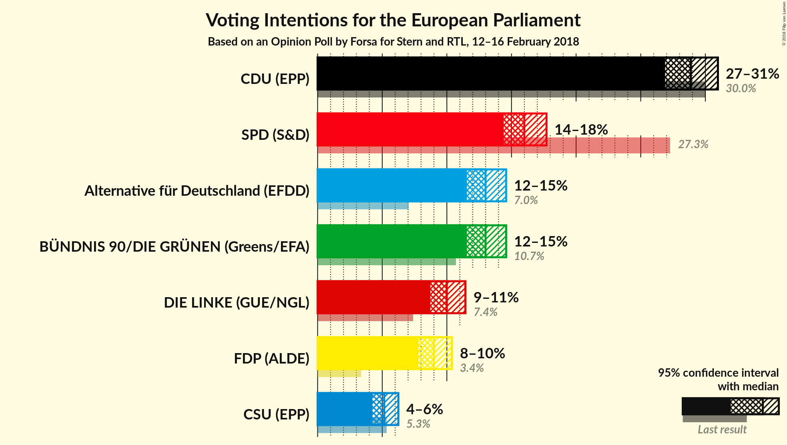
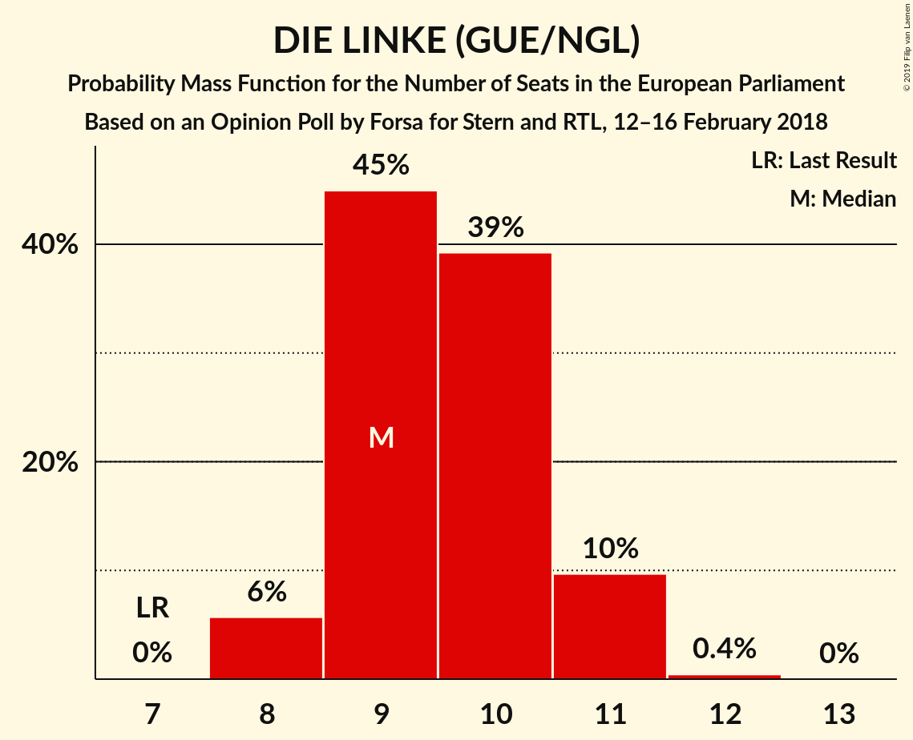
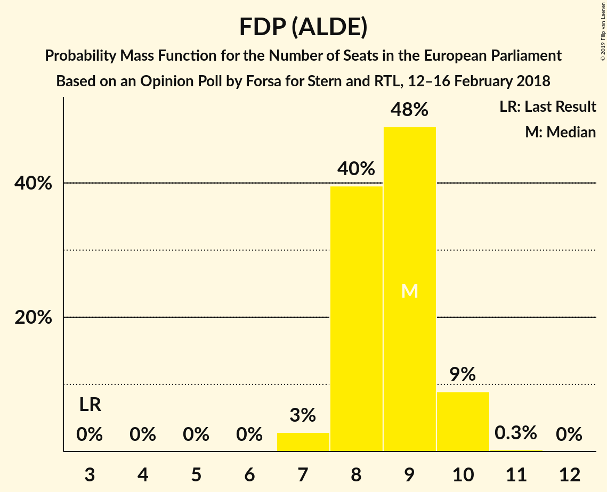
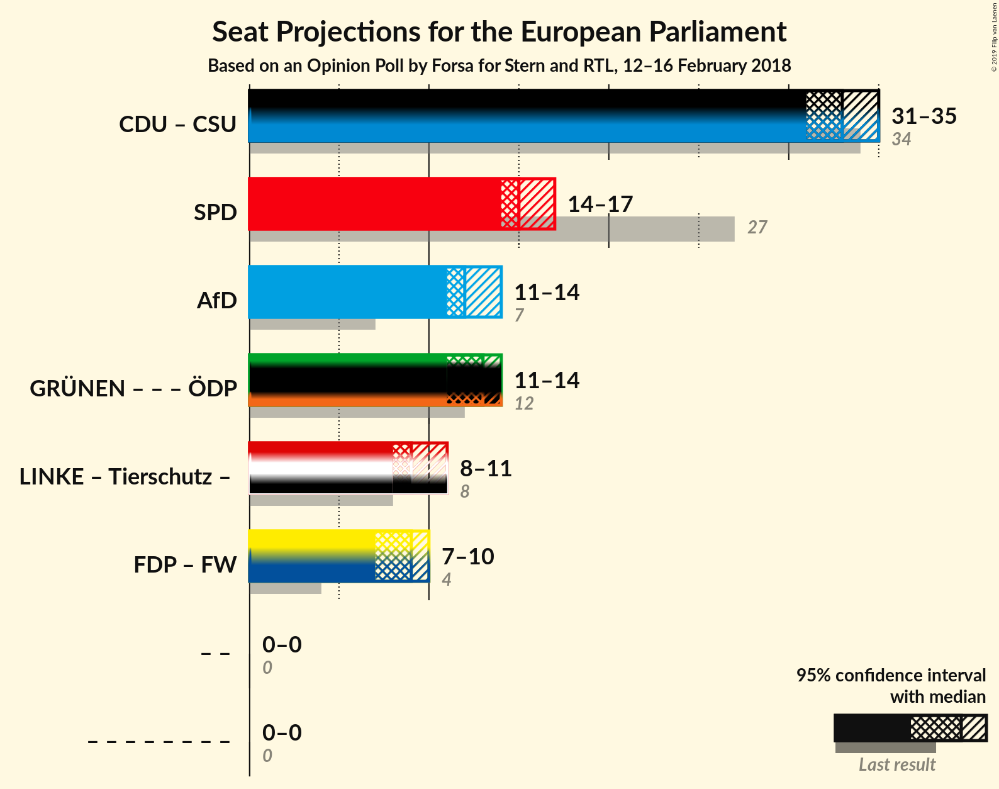

# Opinion Poll by Forsa for Stern and RTL, 12–16 February 2018

<a href="#voting-intentions">Voting Intentions</a> | <a href="#seats">Seats</a> | <a href="#coalitions">Coalitions</a> | <a href="#technical-information">Technical Information</a>

## Voting Intentions

### Confidence Intervals

| Party | Last Result | Poll Result | 80% Confidence Interval | 90% Confidence Interval | 95% Confidence Interval | 99% Confidence Interval |
|:-----:|:-----------:|:-----------:|:-----------------------:|:-----------------------:|:-----------------------:|:-----------------------:|
| CDU (EPP) | 30.0% | 28.9% | 27.6–30.2% |27.2–30.6% |26.9–31.0% |26.3–31.6% |
| SPD (S&D) | 27.3% | 16.0% | 15.0–17.1% |14.7–17.4% |14.4–17.7% |13.9–18.3% |
| Alternative für Deutschland (EFDD) | 7.0% | 13.0% | 12.0–14.0% |11.8–14.3% |11.6–14.6% |11.1–15.1% |
| BÜNDNIS 90/DIE GRÜNEN (Greens/EFA) | 10.7% | 13.0% | 12.0–14.0% |11.8–14.3% |11.6–14.6% |11.1–15.1% |
| DIE LINKE (GUE/NGL) | 7.4% | 10.0% | 9.2–10.9% |8.9–11.2% |8.7–11.4% |8.3–11.9% |
| FDP (ALDE) | 3.4% | 9.0% | 8.2–9.9% |8.0–10.2% |7.8–10.4% |7.4–10.8% |
| CSU (EPP) | 5.3% | 5.2% | 4.6–5.9% |4.4–6.1% |4.2–6.2% |4.0–6.6% |

*Note:* The poll result column reflects the actual value used in the calculations. Published results may vary slightly, and in addition be rounded to fewer digits.

## Seats

### Confidence Intervals

| Party | Last Result | Median | 80% Confidence Interval | 90% Confidence Interval | 95% Confidence Interval | 99% Confidence Interval |
|:-----:|:-----------:|:------:|:-----------------------:|:-----------------------:|:-----------------------:|:-----------------------:|
| <a href="#cdu-(epp)">CDU (EPP)</a> | 29 | 28 | 27–29 |27–29 |27–29 |27–29 |
| <a href="#spd-(s&d)">SPD (S&D)</a> | 27 | 16 | 14–16 |14–16 |14–16 |13–17 |
| <a href="#alternative-für-deutschland-(efdd)">Alternative für Deutschland (EFDD)</a> | 7 | 12 | 12–13 |12–13 |12–14 |11–14 |
| <a href="#bÜndnis-90/die-grÜnen-(greens/efa)">BÜNDNIS 90/DIE GRÜNEN (Greens/EFA)</a> | 11 | 13 | 12–13 |12–13 |12–13 |12–14 |
| <a href="#die-linke-(gue/ngl)">DIE LINKE (GUE/NGL)</a> | 7 | 9 | 9–10 |9–10 |9–11 |9–11 |
| <a href="#fdp-(alde)">FDP (ALDE)</a> | 3 | 8 | 8–10 |8–10 |8–10 |8–10 |
| <a href="#csu-(epp)">CSU (EPP)</a> | 5 | 5 | 5–6 |5–6 |4–6 |4–7 |

### CDU (EPP)

*For a full overview of the results for this party, see the [CDU (EPP)](party-cduepp.html) page.*

| Number of Seats | Probability | Accumulated | Special Marks |
|:---------------:|:-----------:|:-----------:|:-------------:|
| 26 | 0.2% | 100% |  |
| 27 | 27% | 99.8% |  |
| 28 | 62% | 73% | Median |
| 29 | 10% | 10% | Last Result |
| 30 | 0.2% | 0.2% |  |
| 31 | 0% | 0% |  |

### SPD (S&D)

*For a full overview of the results for this party, see the [SPD (S&D)](party-spdsd.html) page.*

| Number of Seats | Probability | Accumulated | Special Marks |
|:---------------:|:-----------:|:-----------:|:-------------:|
| 13 | 2% | 100% |  |
| 14 | 41% | 98% |  |
| 15 | 4% | 56% |  |
| 16 | 51% | 52% | Median |
| 17 | 1.1% | 1.3% |  |
| 18 | 0.1% | 0.1% |  |
| 19 | 0% | 0% |  |
| 20 | 0% | 0% |  |
| 21 | 0% | 0% |  |
| 22 | 0% | 0% |  |
| 23 | 0% | 0% |  |
| 24 | 0% | 0% |  |
| 25 | 0% | 0% |  |
| 26 | 0% | 0% |  |
| 27 | 0% | 0% | Last Result |

### Alternative für Deutschland (EFDD)

*For a full overview of the results for this party, see the [Alternative für Deutschland (EFDD)](party-alternativefürdeutschlandefdd.html) page.*

| Number of Seats | Probability | Accumulated | Special Marks |
|:---------------:|:-----------:|:-----------:|:-------------:|
| 7 | 0% | 100% | Last Result |
| 8 | 0% | 100% |  |
| 9 | 0% | 100% |  |
| 10 | 0% | 100% |  |
| 11 | 1.4% | 100% |  |
| 12 | 64% | 98.6% | Median |
| 13 | 30% | 34% |  |
| 14 | 4% | 4% |  |
| 15 | 0% | 0% |  |

### BÜNDNIS 90/DIE GRÜNEN (Greens/EFA)

*For a full overview of the results for this party, see the [BÜNDNIS 90/DIE GRÜNEN (Greens/EFA)](party-bÜndnis90diegrÜnengreensefa.html) page.*

| Number of Seats | Probability | Accumulated | Special Marks |
|:---------------:|:-----------:|:-----------:|:-------------:|
| 10 | 0.1% | 100% |  |
| 11 | 0.2% | 99.9% | Last Result |
| 12 | 34% | 99.8% |  |
| 13 | 64% | 66% | Median |
| 14 | 2% | 2% |  |
| 15 | 0% | 0% |  |

### DIE LINKE (GUE/NGL)

*For a full overview of the results for this party, see the [DIE LINKE (GUE/NGL)](party-dielinkeguengl.html) page.*

| Number of Seats | Probability | Accumulated | Special Marks |
|:---------------:|:-----------:|:-----------:|:-------------:|
| 7 | 0% | 100% | Last Result |
| 8 | 0.2% | 100% |  |
| 9 | 65% | 99.8% | Median |
| 10 | 31% | 35% |  |
| 11 | 4% | 4% |  |
| 12 | 0% | 0% |  |

### FDP (ALDE)

*For a full overview of the results for this party, see the [FDP (ALDE)](party-fdpalde.html) page.*

| Number of Seats | Probability | Accumulated | Special Marks |
|:---------------:|:-----------:|:-----------:|:-------------:|
| 3 | 0% | 100% | Last Result |
| 4 | 0% | 100% |  |
| 5 | 0% | 100% |  |
| 6 | 0% | 100% |  |
| 7 | 0.2% | 100% |  |
| 8 | 61% | 99.8% | Median |
| 9 | 13% | 39% |  |
| 10 | 25% | 25% |  |
| 11 | 0% | 0% |  |

### CSU (EPP)

*For a full overview of the results for this party, see the [CSU (EPP)](party-csuepp.html) page.*

| Number of Seats | Probability | Accumulated | Special Marks |
|:---------------:|:-----------:|:-----------:|:-------------:|
| 4 | 5% | 100% |  |
| 5 | 83% | 95% | Last Result, Median |
| 6 | 11% | 12% |  |
| 7 | 0.5% | 0.5% |  |
| 8 | 0% | 0% |  |

## Coalitions

### Confidence Intervals

| Coalition | Last Result | Median | Majority? | 80% Confidence Interval | 90% Confidence Interval | 95% Confidence Interval | 99% Confidence Interval |
|:---------:|:-----------:|:------:|:---------:|:-----------------------:|:-----------------------:|:-----------------------:|:-----------------------:|
| CDU (EPP) – CSU (EPP) | 34 | 33 | 0% | 32–34 | 32–34 | 32–34 | 31–35 |
| SPD (S&D) | 27 | 16 | 0% | 14–16 | 14–16 | 14–16 | 13–17 |
| Alternative für Deutschland (EFDD) | 7 | 12 | 0% | 12–13 | 12–13 | 12–14 | 11–14 |

### CDU (EPP) – CSU (EPP)

| Number of Seats | Probability | Accumulated | Special Marks |
|:---------------:|:-----------:|:-----------:|:-------------:|
| 31 | 0.8% | 100% |  |
| 32 | 29% | 99.2% |  |
| 33 | 51% | 71% | Median |
| 34 | 18% | 19% | Last Result |
| 35 | 1.1% | 1.1% |  |
| 36 | 0% | 0% |  |

### SPD (S&D)

| Number of Seats | Probability | Accumulated | Special Marks |
|:---------------:|:-----------:|:-----------:|:-------------:|
| 13 | 2% | 100% |  |
| 14 | 41% | 98% |  |
| 15 | 4% | 56% |  |
| 16 | 51% | 52% | Median |
| 17 | 1.1% | 1.3% |  |
| 18 | 0.1% | 0.1% |  |
| 19 | 0% | 0% |  |
| 20 | 0% | 0% |  |
| 21 | 0% | 0% |  |
| 22 | 0% | 0% |  |
| 23 | 0% | 0% |  |
| 24 | 0% | 0% |  |
| 25 | 0% | 0% |  |
| 26 | 0% | 0% |  |
| 27 | 0% | 0% | Last Result |

### Alternative für Deutschland (EFDD)

| Number of Seats | Probability | Accumulated | Special Marks |
|:---------------:|:-----------:|:-----------:|:-------------:|
| 7 | 0% | 100% | Last Result |
| 8 | 0% | 100% |  |
| 9 | 0% | 100% |  |
| 10 | 0% | 100% |  |
| 11 | 1.4% | 100% |  |
| 12 | 64% | 98.6% | Median |
| 13 | 30% | 34% |  |
| 14 | 4% | 4% |  |
| 15 | 0% | 0% |  |

## Technical Information

### Opinion Poll

+ **Polling firm:** Forsa
+ **Commissioner(s):** Stern and RTL
+ **Fieldwork period:** 12–16 February 2018

### Calculations

+ **Sample size:** 1901
+ **Simulations done:** 1,024
+ **Error estimate:** 2.30%

