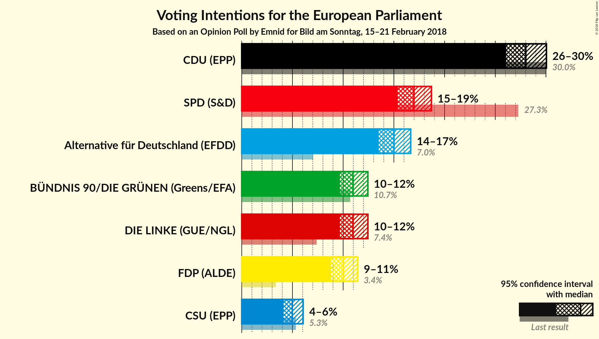
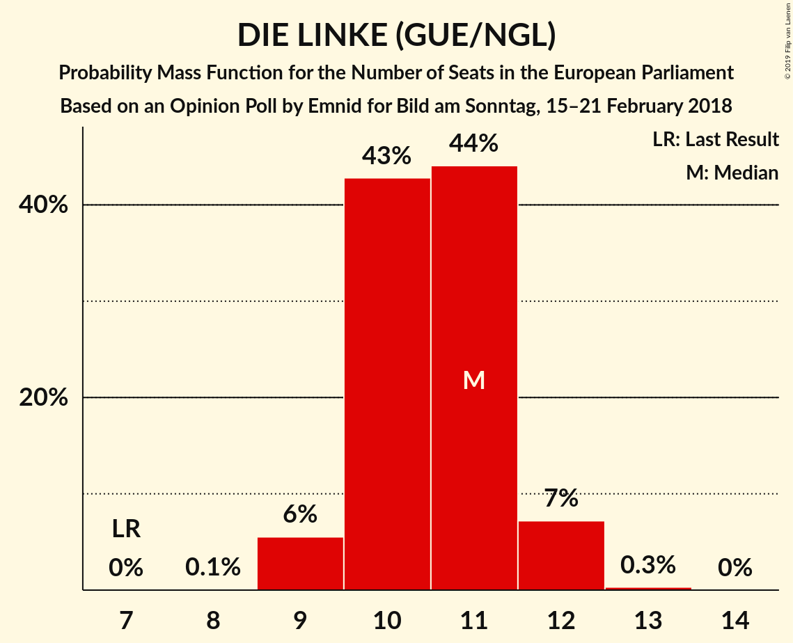

# Opinion Poll by Emnid for Bild am Sonntag, 15–21 February 2018

<a href="#voting-intentions">Voting Intentions</a> | <a href="#seats">Seats</a> | <a href="#coalitions">Coalitions</a> | <a href="#technical-information">Technical Information</a>

## Voting Intentions

### Confidence Intervals

| Party | Last Result | Poll Result | 80% Confidence Interval | 90% Confidence Interval | 95% Confidence Interval | 99% Confidence Interval |
|:-----:|:-----------:|:-----------:|:-----------------------:|:-----------------------:|:-----------------------:|:-----------------------:|
| CDU (EPP) | 30.0% | 28.0% | 26.7–29.3% |26.4–29.7% |26.1–30.0% |25.5–30.7% |
| SPD (S&D) | 27.3% | 17.0% | 15.9–18.1% |15.6–18.4% |15.4–18.7% |14.9–19.3% |
| Alternative für Deutschland (EFDD) | 7.0% | 15.0% | 14.0–16.1% |13.7–16.4% |13.5–16.7% |13.0–17.2% |
| DIE LINKE (GUE/NGL) | 7.4% | 11.0% | 10.1–11.9% |9.9–12.2% |9.7–12.4% |9.3–12.9% |
| BÜNDNIS 90/DIE GRÜNEN (Greens/EFA) | 10.7% | 11.0% | 10.1–11.9% |9.9–12.2% |9.7–12.4% |9.3–12.9% |
| FDP (ALDE) | 3.4% | 10.0% | 9.2–10.9% |9.0–11.2% |8.8–11.4% |8.4–11.9% |
| CSU (EPP) | 5.3% | 5.0% | 4.4–5.7% |4.3–5.9% |4.1–6.1% |3.8–6.4% |

*Note:* The poll result column reflects the actual value used in the calculations. Published results may vary slightly, and in addition be rounded to fewer digits.

## Seats

### Confidence Intervals

| Party | Last Result | Median | 80% Confidence Interval | 90% Confidence Interval | 95% Confidence Interval | 99% Confidence Interval |
|:-----:|:-----------:|:------:|:-----------------------:|:-----------------------:|:-----------------------:|:-----------------------:|
| <a href="#cdu-(epp)">CDU (EPP)</a> | 29 | 27 | 24–30 |24–30 |24–30 |23–31 |
| <a href="#spd-(s&d)">SPD (S&D)</a> | 27 | 17 | 15–18 |15–18 |15–18 |14–18 |
| <a href="#alternative-für-deutschland-(efdd)">Alternative für Deutschland (EFDD)</a> | 7 | 13 | 12–16 |12–16 |12–16 |12–17 |
| <a href="#die-linke-(gue/ngl)">DIE LINKE (GUE/NGL)</a> | 7 | 10 | 9–12 |9–12 |9–12 |9–14 |
| <a href="#bÜndnis-90/die-grÜnen-(greens/efa)">BÜNDNIS 90/DIE GRÜNEN (Greens/EFA)</a> | 11 | 11 | 9–11 |9–12 |9–12 |9–13 |
| <a href="#fdp-(alde)">FDP (ALDE)</a> | 3 | 10 | 9–10 |9–11 |9–11 |8–12 |
| <a href="#csu-(epp)">CSU (EPP)</a> | 5 | 4 | 4–6 |4–6 |4–6 |4–7 |

### CDU (EPP)

*For a full overview of the results for this party, see the [CDU (EPP)](party-cduepp.html) page.*

| Number of Seats | Probability | Accumulated | Special Marks |
|:---------------:|:-----------:|:-----------:|:-------------:|
| 23 | 0.8% | 100% |  |
| 24 | 10% | 99.2% |  |
| 25 | 4% | 89% |  |
| 26 | 35% | 85% |  |
| 27 | 2% | 50% | Median |
| 28 | 7% | 49% |  |
| 29 | 27% | 42% | Last Result |
| 30 | 14% | 15% |  |
| 31 | 1.3% | 1.3% |  |
| 32 | 0% | 0% |  |

### SPD (S&D)

*For a full overview of the results for this party, see the [SPD (S&D)](party-spdsd.html) page.*

| Number of Seats | Probability | Accumulated | Special Marks |
|:---------------:|:-----------:|:-----------:|:-------------:|
| 14 | 1.1% | 100% |  |
| 15 | 10% | 98.9% |  |
| 16 | 20% | 89% |  |
| 17 | 51% | 68% | Median |
| 18 | 17% | 17% |  |
| 19 | 0.2% | 0.2% |  |
| 20 | 0% | 0% |  |
| 21 | 0% | 0% |  |
| 22 | 0% | 0% |  |
| 23 | 0% | 0% |  |
| 24 | 0% | 0% |  |
| 25 | 0% | 0% |  |
| 26 | 0% | 0% |  |
| 27 | 0% | 0% | Last Result |

### Alternative für Deutschland (EFDD)

*For a full overview of the results for this party, see the [Alternative für Deutschland (EFDD)](party-alternativefürdeutschlandefdd.html) page.*

| Number of Seats | Probability | Accumulated | Special Marks |
|:---------------:|:-----------:|:-----------:|:-------------:|
| 7 | 0% | 100% | Last Result |
| 8 | 0% | 100% |  |
| 9 | 0% | 100% |  |
| 10 | 0% | 100% |  |
| 11 | 0.1% | 100% |  |
| 12 | 17% | 99.9% |  |
| 13 | 59% | 83% | Median |
| 14 | 3% | 25% |  |
| 15 | 5% | 22% |  |
| 16 | 17% | 17% |  |
| 17 | 0.3% | 0.6% |  |
| 18 | 0.3% | 0.3% |  |
| 19 | 0% | 0% |  |

### DIE LINKE (GUE/NGL)

*For a full overview of the results for this party, see the [DIE LINKE (GUE/NGL)](party-dielinkeguengl.html) page.*

| Number of Seats | Probability | Accumulated | Special Marks |
|:---------------:|:-----------:|:-----------:|:-------------:|
| 7 | 0% | 100% | Last Result |
| 8 | 0.2% | 100% |  |
| 9 | 15% | 99.8% |  |
| 10 | 37% | 84% | Median |
| 11 | 10% | 47% |  |
| 12 | 36% | 37% |  |
| 13 | 0.7% | 1.3% |  |
| 14 | 0.6% | 0.6% |  |
| 15 | 0% | 0% |  |

### BÜNDNIS 90/DIE GRÜNEN (Greens/EFA)

*For a full overview of the results for this party, see the [BÜNDNIS 90/DIE GRÜNEN (Greens/EFA)](party-bÜndnis90diegrÜnengreensefa.html) page.*

| Number of Seats | Probability | Accumulated | Special Marks |
|:---------------:|:-----------:|:-----------:|:-------------:|
| 9 | 11% | 100% |  |
| 10 | 4% | 89% |  |
| 11 | 79% | 86% | Last Result, Median |
| 12 | 6% | 7% |  |
| 13 | 0.9% | 1.0% |  |
| 14 | 0.1% | 0.1% |  |
| 15 | 0% | 0% |  |

### FDP (ALDE)

*For a full overview of the results for this party, see the [FDP (ALDE)](party-fdpalde.html) page.*

| Number of Seats | Probability | Accumulated | Special Marks |
|:---------------:|:-----------:|:-----------:|:-------------:|
| 3 | 0% | 100% | Last Result |
| 4 | 0% | 100% |  |
| 5 | 0% | 100% |  |
| 6 | 0% | 100% |  |
| 7 | 0.3% | 100% |  |
| 8 | 0.9% | 99.7% |  |
| 9 | 29% | 98.9% |  |
| 10 | 60% | 70% | Median |
| 11 | 8% | 10% |  |
| 12 | 1.5% | 1.5% |  |
| 13 | 0% | 0% |  |

### CSU (EPP)

*For a full overview of the results for this party, see the [CSU (EPP)](party-csuepp.html) page.*

| Number of Seats | Probability | Accumulated | Special Marks |
|:---------------:|:-----------:|:-----------:|:-------------:|
| 4 | 78% | 100% | Median |
| 5 | 10% | 22% | Last Result |
| 6 | 11% | 12% |  |
| 7 | 0.6% | 0.6% |  |
| 8 | 0% | 0% |  |

## Coalitions

### Confidence Intervals

| Coalition | Last Result | Median | Majority? | 80% Confidence Interval | 90% Confidence Interval | 95% Confidence Interval | 99% Confidence Interval |
|:---------:|:-----------:|:------:|:---------:|:-----------------------:|:-----------------------:|:-----------------------:|:-----------------------:|
| CDU (EPP) – CSU (EPP) | 34 | 32 | 0% | 29–34 | 28–34 | 28–34 | 28–35 |
| SPD (S&D) | 27 | 17 | 0% | 15–18 | 15–18 | 15–18 | 14–18 |
| Alternative für Deutschland (EFDD) | 7 | 13 | 0% | 12–16 | 12–16 | 12–16 | 12–17 |

### CDU (EPP) – CSU (EPP)

| Number of Seats | Probability | Accumulated | Special Marks |
|:---------------:|:-----------:|:-----------:|:-------------:|
| 27 | 0.1% | 100% |  |
| 28 | 9% | 99.9% |  |
| 29 | 2% | 91% |  |
| 30 | 28% | 89% |  |
| 31 | 3% | 61% | Median |
| 32 | 15% | 58% |  |
| 33 | 22% | 43% |  |
| 34 | 20% | 21% | Last Result |
| 35 | 2% | 2% |  |
| 36 | 0% | 0% |  |

### SPD (S&D)

| Number of Seats | Probability | Accumulated | Special Marks |
|:---------------:|:-----------:|:-----------:|:-------------:|
| 14 | 1.1% | 100% |  |
| 15 | 10% | 98.9% |  |
| 16 | 20% | 89% |  |
| 17 | 51% | 68% | Median |
| 18 | 17% | 17% |  |
| 19 | 0.2% | 0.2% |  |
| 20 | 0% | 0% |  |
| 21 | 0% | 0% |  |
| 22 | 0% | 0% |  |
| 23 | 0% | 0% |  |
| 24 | 0% | 0% |  |
| 25 | 0% | 0% |  |
| 26 | 0% | 0% |  |
| 27 | 0% | 0% | Last Result |

### Alternative für Deutschland (EFDD)

| Number of Seats | Probability | Accumulated | Special Marks |
|:---------------:|:-----------:|:-----------:|:-------------:|
| 7 | 0% | 100% | Last Result |
| 8 | 0% | 100% |  |
| 9 | 0% | 100% |  |
| 10 | 0% | 100% |  |
| 11 | 0.1% | 100% |  |
| 12 | 17% | 99.9% |  |
| 13 | 59% | 83% | Median |
| 14 | 3% | 25% |  |
| 15 | 5% | 22% |  |
| 16 | 17% | 17% |  |
| 17 | 0.3% | 0.6% |  |
| 18 | 0.3% | 0.3% |  |
| 19 | 0% | 0% |  |

## Technical Information

### Opinion Poll

+ **Polling firm:** Emnid
+ **Commissioner(s):** Bild am Sonntag
+ **Fieldwork period:** 15–21 February 2018

### Calculations

+ **Sample size:** 1985
+ **Simulations done:** 1,024
+ **Error estimate:** 2.51%

