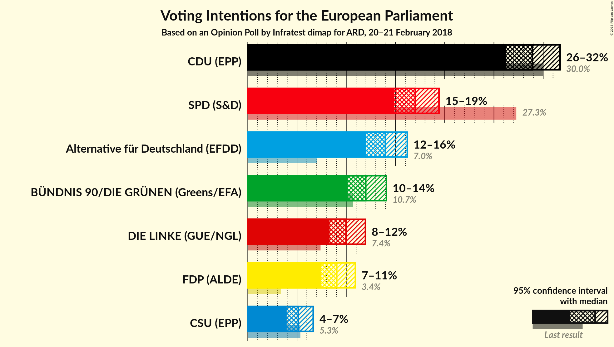
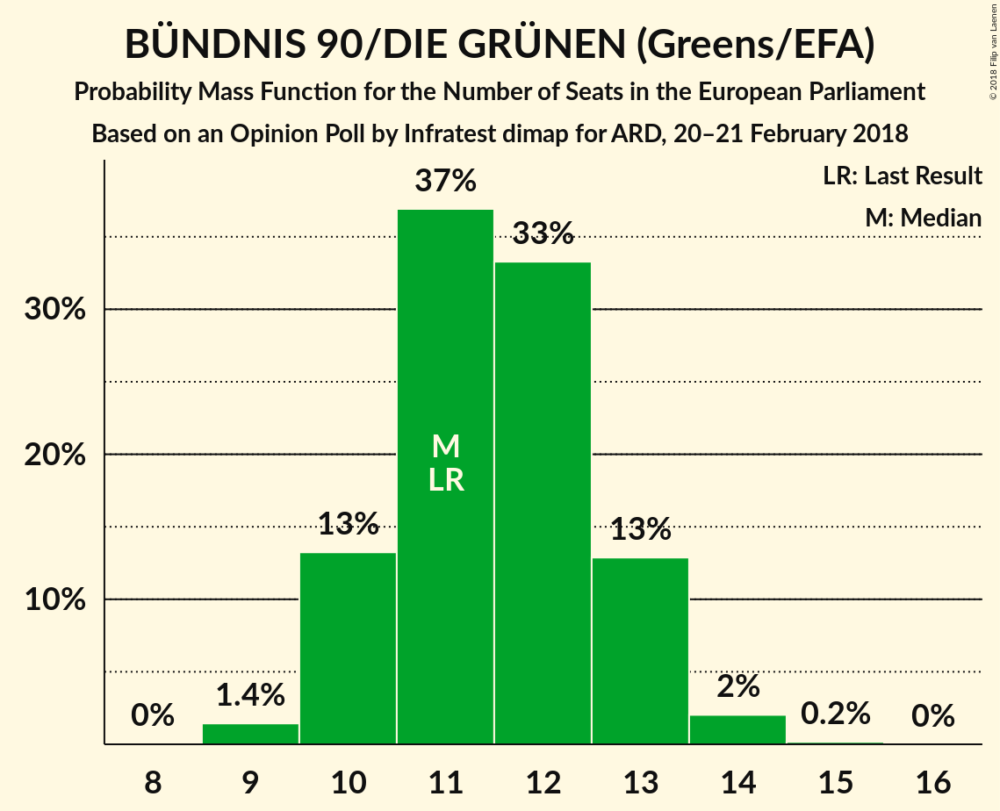

# Opinion Poll by Infratest dimap for ARD, 20–21 February 2018

<a href="#voting-intentions">Voting Intentions</a> | <a href="#seats">Seats</a> | <a href="#coalitions">Coalitions</a> | <a href="#technical-information">Technical Information</a>

## Voting Intentions

### Confidence Intervals

| Party | Last Result | Poll Result | 80% Confidence Interval | 90% Confidence Interval | 95% Confidence Interval | 99% Confidence Interval |
|:-----:|:-----------:|:-----------:|:-----------------------:|:-----------------------:|:-----------------------:|:-----------------------:|
| CDU (EPP) | 30.0% | 28.9% | 27.1–30.7% |26.7–31.3% |26.2–31.7% |25.4–32.6% |
| SPD (S&D) | 27.3% | 17.0% | 15.6–18.6% |15.2–19.0% |14.9–19.4% |14.2–20.2% |
| Alternative für Deutschland (EFDD) | 7.0% | 14.0% | 12.7–15.4% |12.3–15.9% |12.0–16.2% |11.4–16.9% |
| BÜNDNIS 90/DIE GRÜNEN (Greens/EFA) | 10.7% | 12.0% | 10.8–13.4% |10.4–13.7% |10.2–14.1% |9.6–14.8% |
| DIE LINKE (GUE/NGL) | 7.4% | 10.0% | 8.9–11.3% |8.6–11.6% |8.3–11.9% |7.8–12.6% |
| FDP (ALDE) | 3.4% | 9.0% | 8.0–10.3% |7.7–10.6% |7.4–10.9% |7.0–11.5% |
| CSU (EPP) | 5.3% | 5.1% | 4.4–6.1% |4.1–6.4% |3.9–6.6% |3.6–7.1% |

*Note:* The poll result column reflects the actual value used in the calculations. Published results may vary slightly, and in addition be rounded to fewer digits.

## Seats

### Confidence Intervals

| Party | Last Result | Median | 80% Confidence Interval | 90% Confidence Interval | 95% Confidence Interval | 99% Confidence Interval |
|:-----:|:-----------:|:------:|:-----------------------:|:-----------------------:|:-----------------------:|:-----------------------:|
| <a href="#cdu-(epp)">CDU (EPP)</a> | 29 | 29 | 29 |26–29 |24–29 |24–29 |
| <a href="#spd-(s&d)">SPD (S&D)</a> | 27 | 14 | 14 |14–18 |14–19 |14–19 |
| <a href="#alternative-für-deutschland-(efdd)">Alternative für Deutschland (EFDD)</a> | 7 | 13 | 12–13 |12–13 |12–14 |11–15 |
| <a href="#bÜndnis-90/die-grÜnen-(greens/efa)">BÜNDNIS 90/DIE GRÜNEN (Greens/EFA)</a> | 11 | 10 | 10–12 |10–12 |10–12 |10–13 |
| <a href="#die-linke-(gue/ngl)">DIE LINKE (GUE/NGL)</a> | 7 | 11 | 10–11 |9–11 |9–11 |8–13 |
| <a href="#fdp-(alde)">FDP (ALDE)</a> | 3 | 9 | 9–10 |9–10 |9–11 |9–11 |
| <a href="#csu-(epp)">CSU (EPP)</a> | 5 | 6 | 5–6 |5–6 |5–6 |4–7 |

### CDU (EPP)

*For a full overview of the results for this party, see the [CDU (EPP)](party-cduepp.html) page.*

| Number of Seats | Probability | Accumulated | Special Marks |
|:---------------:|:-----------:|:-----------:|:-------------:|
| 23 | 0.1% | 100% |  |
| 24 | 3% | 99.9% |  |
| 25 | 0.9% | 97% |  |
| 26 | 4% | 96% |  |
| 27 | 0% | 92% |  |
| 28 | 0.1% | 92% |  |
| 29 | 92% | 92% | Last Result, Median |
| 30 | 0.1% | 0.1% |  |
| 31 | 0% | 0.1% |  |
| 32 | 0% | 0.1% |  |
| 33 | 0% | 0% |  |

### SPD (S&D)

*For a full overview of the results for this party, see the [SPD (S&D)](party-spdsd.html) page.*

| Number of Seats | Probability | Accumulated | Special Marks |
|:---------------:|:-----------:|:-----------:|:-------------:|
| 13 | 0.1% | 100% |  |
| 14 | 92% | 99.9% | Median |
| 15 | 2% | 8% |  |
| 16 | 0.5% | 6% |  |
| 17 | 0% | 6% |  |
| 18 | 0.7% | 5% |  |
| 19 | 5% | 5% |  |
| 20 | 0% | 0% |  |
| 21 | 0% | 0% |  |
| 22 | 0% | 0% |  |
| 23 | 0% | 0% |  |
| 24 | 0% | 0% |  |
| 25 | 0% | 0% |  |
| 26 | 0% | 0% |  |
| 27 | 0% | 0% | Last Result |

### Alternative für Deutschland (EFDD)

*For a full overview of the results for this party, see the [Alternative für Deutschland (EFDD)](party-alternativefürdeutschlandefdd.html) page.*

| Number of Seats | Probability | Accumulated | Special Marks |
|:---------------:|:-----------:|:-----------:|:-------------:|
| 7 | 0% | 100% | Last Result |
| 8 | 0% | 100% |  |
| 9 | 0% | 100% |  |
| 10 | 0% | 100% |  |
| 11 | 0.6% | 100% |  |
| 12 | 42% | 99.4% |  |
| 13 | 55% | 58% | Median |
| 14 | 2% | 3% |  |
| 15 | 0.5% | 0.7% |  |
| 16 | 0.1% | 0.1% |  |
| 17 | 0% | 0% |  |

### BÜNDNIS 90/DIE GRÜNEN (Greens/EFA)

*For a full overview of the results for this party, see the [BÜNDNIS 90/DIE GRÜNEN (Greens/EFA)](party-bÜndnis90diegrÜnengreensefa.html) page.*

| Number of Seats | Probability | Accumulated | Special Marks |
|:---------------:|:-----------:|:-----------:|:-------------:|
| 9 | 0.1% | 100% |  |
| 10 | 57% | 99.9% | Median |
| 11 | 0.4% | 43% | Last Result |
| 12 | 41% | 43% |  |
| 13 | 1.5% | 2% |  |
| 14 | 0% | 0% |  |

### DIE LINKE (GUE/NGL)

*For a full overview of the results for this party, see the [DIE LINKE (GUE/NGL)](party-dielinkeguengl.html) page.*

| Number of Seats | Probability | Accumulated | Special Marks |
|:---------------:|:-----------:|:-----------:|:-------------:|
| 7 | 0.1% | 100% | Last Result |
| 8 | 2% | 99.9% |  |
| 9 | 4% | 98% |  |
| 10 | 39% | 95% |  |
| 11 | 53% | 55% | Median |
| 12 | 0% | 2% |  |
| 13 | 2% | 2% |  |
| 14 | 0% | 0% |  |

### FDP (ALDE)

*For a full overview of the results for this party, see the [FDP (ALDE)](party-fdpalde.html) page.*

| Number of Seats | Probability | Accumulated | Special Marks |
|:---------------:|:-----------:|:-----------:|:-------------:|
| 3 | 0% | 100% | Last Result |
| 4 | 0% | 100% |  |
| 5 | 0% | 100% |  |
| 6 | 0% | 100% |  |
| 7 | 0.1% | 100% |  |
| 8 | 0.1% | 99.9% |  |
| 9 | 58% | 99.8% | Median |
| 10 | 39% | 42% |  |
| 11 | 3% | 3% |  |
| 12 | 0% | 0.2% |  |
| 13 | 0.1% | 0.1% |  |
| 14 | 0% | 0% |  |

### CSU (EPP)

*For a full overview of the results for this party, see the [CSU (EPP)](party-csuepp.html) page.*

| Number of Seats | Probability | Accumulated | Special Marks |
|:---------------:|:-----------:|:-----------:|:-------------:|
| 3 | 0.1% | 100% |  |
| 4 | 2% | 99.9% |  |
| 5 | 44% | 98% | Last Result |
| 6 | 54% | 55% | Median |
| 7 | 0.8% | 0.8% |  |
| 8 | 0% | 0% |  |

## Coalitions

### Confidence Intervals

| Coalition | Last Result | Median | Majority? | 80% Confidence Interval | 90% Confidence Interval | 95% Confidence Interval | 99% Confidence Interval |
|:---------:|:-----------:|:------:|:---------:|:-----------------------:|:-----------------------:|:-----------------------:|:-----------------------:|
| CDU (EPP) – CSU (EPP) | 34 | 35 | 0% | 34–35 | 31–35 | 30–35 | 29–35 |
| SPD (S&D) | 27 | 14 | 0% | 14 | 14–18 | 14–19 | 14–19 |
| Alternative für Deutschland (EFDD) | 7 | 13 | 0% | 12–13 | 12–13 | 12–14 | 11–15 |

### CDU (EPP) – CSU (EPP)

| Number of Seats | Probability | Accumulated | Special Marks |
|:---------------:|:-----------:|:-----------:|:-------------:|
| 29 | 2% | 100% |  |
| 30 | 2% | 98% |  |
| 31 | 3% | 96% |  |
| 32 | 0.4% | 93% |  |
| 33 | 0.2% | 92% |  |
| 34 | 39% | 92% | Last Result |
| 35 | 53% | 53% | Median |
| 36 | 0% | 0.1% |  |
| 37 | 0% | 0.1% |  |
| 38 | 0% | 0% |  |

### SPD (S&D)

| Number of Seats | Probability | Accumulated | Special Marks |
|:---------------:|:-----------:|:-----------:|:-------------:|
| 13 | 0.1% | 100% |  |
| 14 | 92% | 99.9% | Median |
| 15 | 2% | 8% |  |
| 16 | 0.5% | 6% |  |
| 17 | 0% | 6% |  |
| 18 | 0.7% | 5% |  |
| 19 | 5% | 5% |  |
| 20 | 0% | 0% |  |
| 21 | 0% | 0% |  |
| 22 | 0% | 0% |  |
| 23 | 0% | 0% |  |
| 24 | 0% | 0% |  |
| 25 | 0% | 0% |  |
| 26 | 0% | 0% |  |
| 27 | 0% | 0% | Last Result |

### Alternative für Deutschland (EFDD)

| Number of Seats | Probability | Accumulated | Special Marks |
|:---------------:|:-----------:|:-----------:|:-------------:|
| 7 | 0% | 100% | Last Result |
| 8 | 0% | 100% |  |
| 9 | 0% | 100% |  |
| 10 | 0% | 100% |  |
| 11 | 0.6% | 100% |  |
| 12 | 42% | 99.4% |  |
| 13 | 55% | 58% | Median |
| 14 | 2% | 3% |  |
| 15 | 0.5% | 0.7% |  |
| 16 | 0.1% | 0.1% |  |
| 17 | 0% | 0% |  |

## Technical Information

### Opinion Poll

+ **Polling firm:** Infratest dimap
+ **Commissioner(s):** ARD
+ **Fieldwork period:** 20–21 February 2018

### Calculations

+ **Sample size:** 1052
+ **Simulations done:** 1,024
+ **Error estimate:** 3.72%

