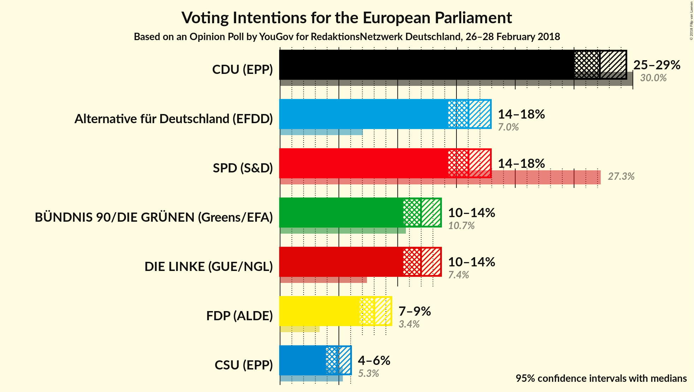
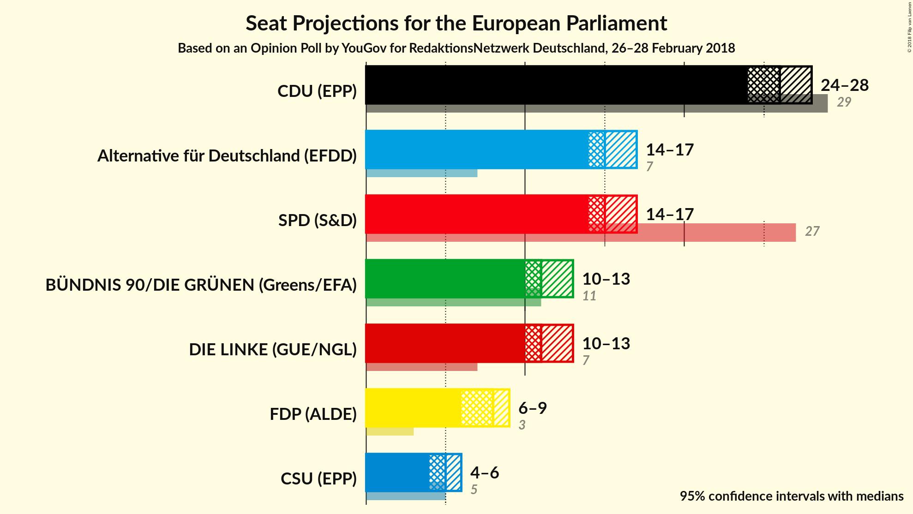
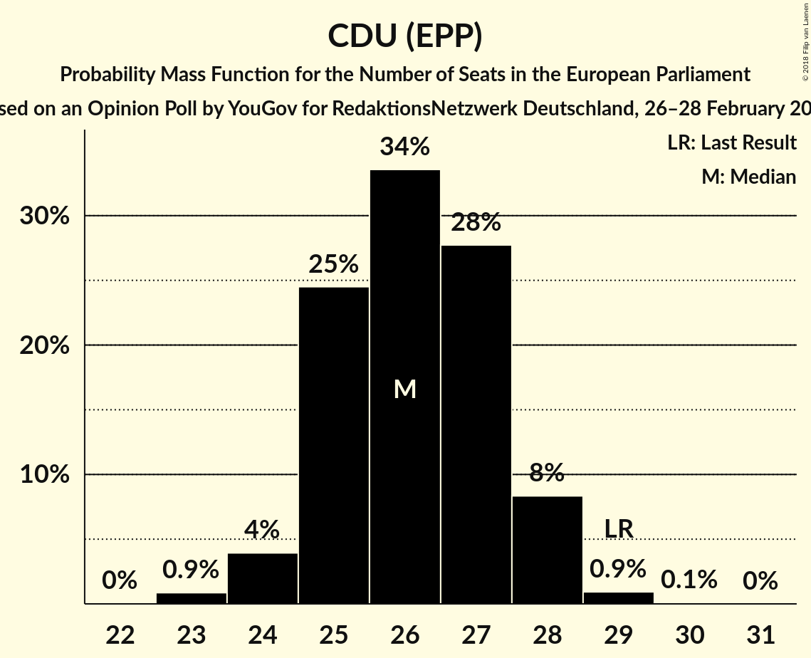
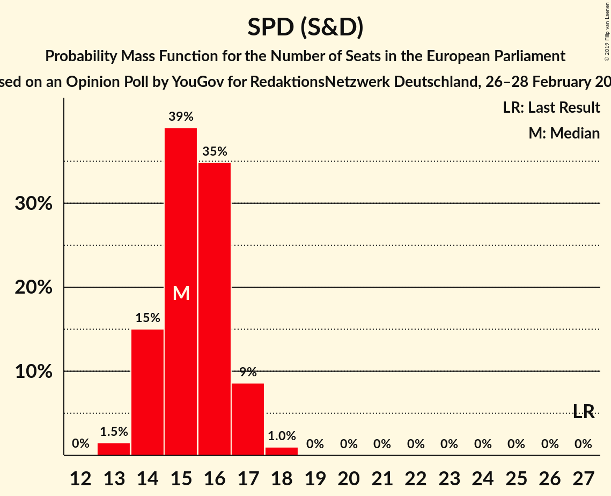
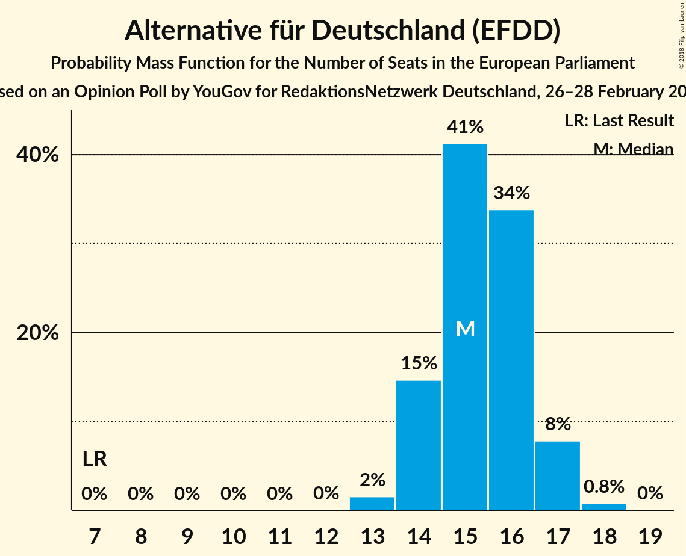
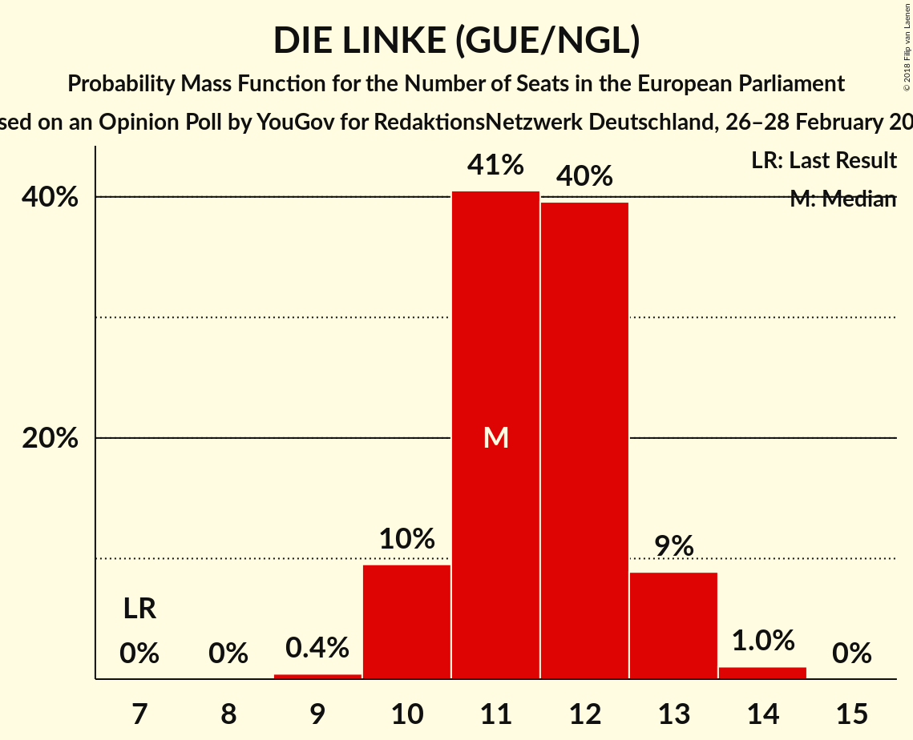
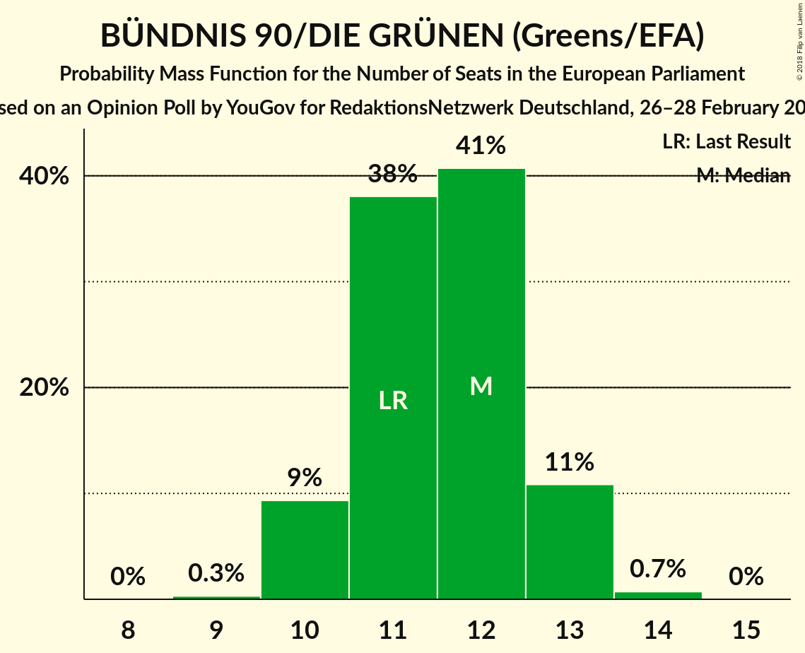
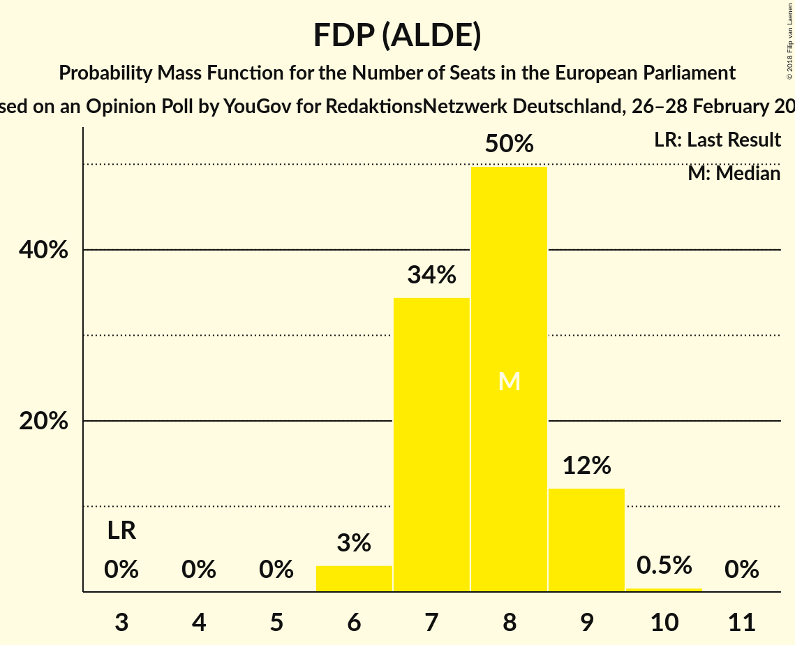
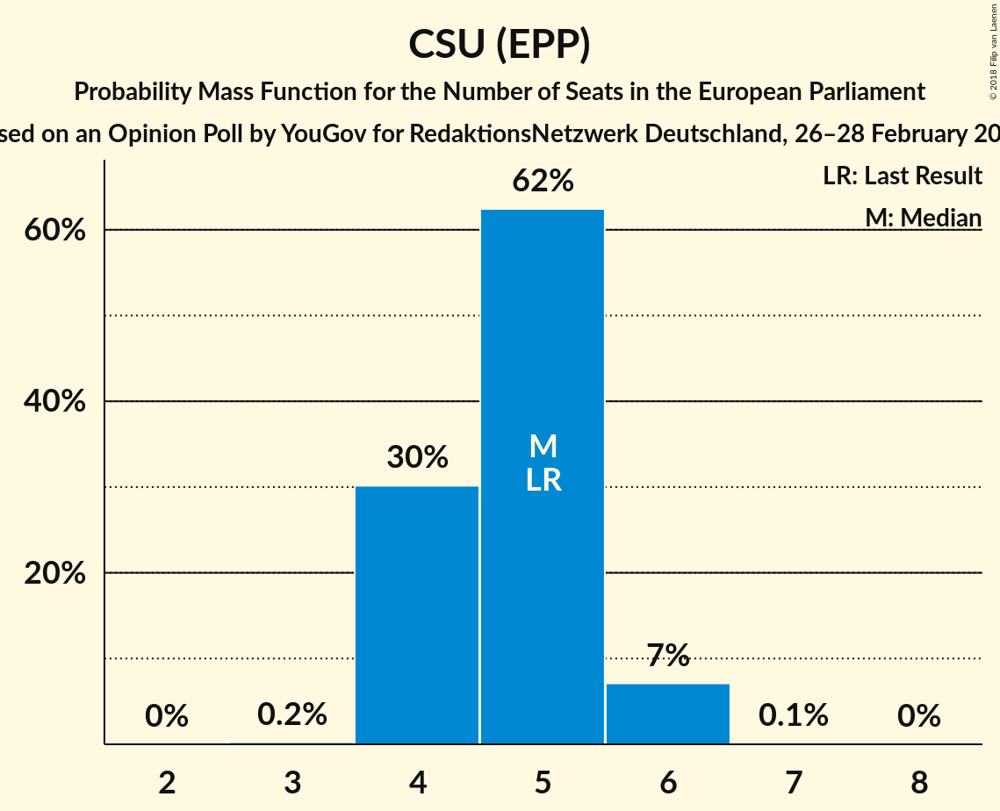
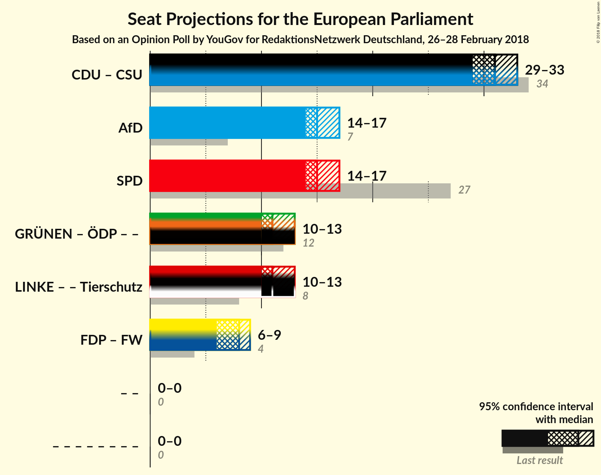

# Opinion Poll by YouGov for RedaktionsNetzwerk Deutschland, 26–28 February 2018

<a href="#voting-intentions">Voting Intentions</a> | <a href="#seats">Seats</a> | <a href="#coalitions">Coalitions</a> | <a href="#technical-information">Technical Information</a>

## Voting Intentions

### Confidence Intervals

| Party | Last Result | Poll Result | 80% Confidence Interval | 90% Confidence Interval | 95% Confidence Interval | 99% Confidence Interval |
|:-----:|:-----------:|:-----------:|:-----------------------:|:-----------------------:|:-----------------------:|:-----------------------:|
| CDU (EPP) | 30.0% | 27.2% | 25.8–28.7% |25.4–29.1% |25.1–29.4% |24.4–30.2% |
| SPD (S&D) | 27.3% | 16.0% | 14.9–17.3% |14.6–17.6% |14.3–17.9% |13.8–18.5% |
| Alternative für Deutschland (EFDD) | 7.0% | 16.0% | 14.9–17.3% |14.6–17.6% |14.3–17.9% |13.8–18.5% |
| DIE LINKE (GUE/NGL) | 7.4% | 12.0% | 11.0–13.1% |10.7–13.4% |10.5–13.7% |10.0–14.2% |
| BÜNDNIS 90/DIE GRÜNEN (Greens/EFA) | 10.7% | 12.0% | 11.0–13.1% |10.7–13.4% |10.5–13.7% |10.0–14.2% |
| FDP (ALDE) | 3.4% | 8.0% | 7.2–9.0% |7.0–9.2% |6.8–9.5% |6.4–9.9% |
| CSU (EPP) | 5.3% | 4.9% | 4.2–5.6% |4.1–5.9% |3.9–6.0% |3.6–6.4% |
| FREIE WÄHLER (ALDE) | 1.5% | 1.6% | N/A |N/A |N/A |N/A |
| Die PARTEI (NI) | 0.6% | 0.7% | N/A |N/A |N/A |N/A |
| ÖDP (Greens/EFA) | 0.6% | 0.4% | N/A |N/A |N/A |N/A |

*Note:* The poll result column reflects the actual value used in the calculations. Published results may vary slightly, and in addition be rounded to fewer digits.

## Seats

### Confidence Intervals

| Party | Last Result | Median | 80% Confidence Interval | 90% Confidence Interval | 95% Confidence Interval | 99% Confidence Interval |
|:-----:|:-----------:|:------:|:-----------------------:|:-----------------------:|:-----------------------:|:-----------------------:|
| <a href="#cdu-(epp)">CDU (EPP)</a> | 29 | 26 | 25–27 |24–28 |24–28 |23–29 |
| <a href="#spd-(s&d)">SPD (S&D)</a> | 27 | 15 | 14–16 |14–17 |14–17 |13–18 |
| <a href="#alternative-für-deutschland-(efdd)">Alternative für Deutschland (EFDD)</a> | 7 | 15 | 14–16 |14–17 |14–17 |13–18 |
| <a href="#die-linke-(gue/ngl)">DIE LINKE (GUE/NGL)</a> | 7 | 11 | 11–12 |10–13 |10–13 |10–14 |
| <a href="#bÜndnis-90/die-grÜnen-(greens/efa)">BÜNDNIS 90/DIE GRÜNEN (Greens/EFA)</a> | 11 | 11 | 10–13 |10–13 |10–13 |10–14 |
| <a href="#fdp-(alde)">FDP (ALDE)</a> | 3 | 8 | 7–9 |7–9 |6–9 |6–9 |
| <a href="#csu-(epp)">CSU (EPP)</a> | 5 | 5 | 4–5 |4–6 |4–6 |4–6 |
| <a href="#freie-wÄhler-(alde)">FREIE WÄHLER (ALDE)</a> | 1 | N/A | N/A |N/A |N/A |N/A |
| <a href="#die-partei-(ni)">Die PARTEI (NI)</a> | 1 | N/A | N/A |N/A |N/A |N/A |
| <a href="#Ödp-(greens/efa)">ÖDP (Greens/EFA)</a> | 1 | N/A | N/A |N/A |N/A |N/A |

### CDU (EPP)

*For a full overview of the results for this party, see the [CDU (EPP)](party-cduepp.html) page.*

| Number of Seats | Probability | Accumulated | Special Marks |
|:---------------:|:-----------:|:-----------:|:-------------:|
| 23 | 0.7% | 100% |  |
| 24 | 6% | 99.2% |  |
| 25 | 26% | 93% |  |
| 26 | 35% | 67% | Median |
| 27 | 24% | 32% |  |
| 28 | 7% | 9% |  |
| 29 | 1.2% | 1.3% | Last Result |
| 30 | 0.1% | 0.1% |  |
| 31 | 0% | 0% |  |

### SPD (S&D)

*For a full overview of the results for this party, see the [SPD (S&D)](party-spdsd.html) page.*

| Number of Seats | Probability | Accumulated | Special Marks |
|:---------------:|:-----------:|:-----------:|:-------------:|
| 13 | 1.5% | 100% |  |
| 14 | 15% | 98% |  |
| 15 | 39% | 83% | Median |
| 16 | 35% | 44% |  |
| 17 | 9% | 10% |  |
| 18 | 1.0% | 1.0% |  |
| 19 | 0% | 0% |  |
| 20 | 0% | 0% |  |
| 21 | 0% | 0% |  |
| 22 | 0% | 0% |  |
| 23 | 0% | 0% |  |
| 24 | 0% | 0% |  |
| 25 | 0% | 0% |  |
| 26 | 0% | 0% |  |
| 27 | 0% | 0% | Last Result |

### Alternative für Deutschland (EFDD)

*For a full overview of the results for this party, see the [Alternative für Deutschland (EFDD)](party-alternativefürdeutschlandefdd.html) page.*

| Number of Seats | Probability | Accumulated | Special Marks |
|:---------------:|:-----------:|:-----------:|:-------------:|
| 7 | 0% | 100% | Last Result |
| 8 | 0% | 100% |  |
| 9 | 0% | 100% |  |
| 10 | 0% | 100% |  |
| 11 | 0% | 100% |  |
| 12 | 0% | 100% |  |
| 13 | 2% | 100% |  |
| 14 | 15% | 98% |  |
| 15 | 41% | 84% | Median |
| 16 | 34% | 42% |  |
| 17 | 8% | 9% |  |
| 18 | 0.8% | 0.9% |  |
| 19 | 0% | 0% |  |

### DIE LINKE (GUE/NGL)

*For a full overview of the results for this party, see the [DIE LINKE (GUE/NGL)](party-dielinkeguengl.html) page.*

| Number of Seats | Probability | Accumulated | Special Marks |
|:---------------:|:-----------:|:-----------:|:-------------:|
| 7 | 0% | 100% | Last Result |
| 8 | 0% | 100% |  |
| 9 | 0.4% | 100% |  |
| 10 | 10% | 99.6% |  |
| 11 | 41% | 90% | Median |
| 12 | 40% | 50% |  |
| 13 | 9% | 10% |  |
| 14 | 1.0% | 1.1% |  |
| 15 | 0% | 0% |  |

### BÜNDNIS 90/DIE GRÜNEN (Greens/EFA)

*For a full overview of the results for this party, see the [BÜNDNIS 90/DIE GRÜNEN (Greens/EFA)](party-bÜndnis90diegrÜnengreensefa.html) page.*

| Number of Seats | Probability | Accumulated | Special Marks |
|:---------------:|:-----------:|:-----------:|:-------------:|
| 9 | 0.3% | 100% |  |
| 10 | 11% | 99.7% |  |
| 11 | 41% | 89% | Last Result, Median |
| 12 | 37% | 48% |  |
| 13 | 11% | 12% |  |
| 14 | 1.1% | 1.1% |  |
| 15 | 0% | 0% |  |

### FDP (ALDE)

*For a full overview of the results for this party, see the [FDP (ALDE)](party-fdpalde.html) page.*

| Number of Seats | Probability | Accumulated | Special Marks |
|:---------------:|:-----------:|:-----------:|:-------------:|
| 3 | 0% | 100% | Last Result |
| 4 | 0% | 100% |  |
| 5 | 0% | 100% |  |
| 6 | 3% | 100% |  |
| 7 | 34% | 97% |  |
| 8 | 50% | 62% | Median |
| 9 | 12% | 13% |  |
| 10 | 0.5% | 0.5% |  |
| 11 | 0% | 0% |  |

### CSU (EPP)

*For a full overview of the results for this party, see the [CSU (EPP)](party-csuepp.html) page.*

| Number of Seats | Probability | Accumulated | Special Marks |
|:---------------:|:-----------:|:-----------:|:-------------:|
| 3 | 0.2% | 100% |  |
| 4 | 30% | 99.8% |  |
| 5 | 62% | 70% | Last Result, Median |
| 6 | 7% | 7% |  |
| 7 | 0.1% | 0.1% |  |
| 8 | 0% | 0% |  |

## Coalitions

### Confidence Intervals

| Coalition | Last Result | Median | Majority? | 80% Confidence Interval | 90% Confidence Interval | 95% Confidence Interval | 99% Confidence Interval |
|:---------:|:-----------:|:------:|:---------:|:-----------------------:|:-----------------------:|:-----------------------:|:-----------------------:|
| CDU (EPP) – CSU (EPP) | 34 | 31 | 0% | 29–32 | 29–33 | 29–33 | 28–34 |
| Alternative für Deutschland (EFDD) | 7 | 15 | 0% | 14–16 | 14–17 | 14–17 | 13–18 |
| SPD (S&D) | 27 | 15 | 0% | 14–16 | 14–17 | 14–17 | 13–18 |
| FDP (ALDE) – FREIE WÄHLER (ALDE) | 4 | 8 | 0% | 7–9 | 7–9 | 6–9 | 6–9 |

### CDU (EPP) – CSU (EPP)

| Number of Seats | Probability | Accumulated | Special Marks |
|:---------------:|:-----------:|:-----------:|:-------------:|
| 27 | 0.1% | 100% |  |
| 28 | 2% | 99.9% |  |
| 29 | 11% | 98% |  |
| 30 | 29% | 87% |  |
| 31 | 32% | 58% | Median |
| 32 | 19% | 26% |  |
| 33 | 6% | 7% |  |
| 34 | 1.0% | 1.1% | Last Result |
| 35 | 0.1% | 0.1% |  |
| 36 | 0% | 0% |  |

### Alternative für Deutschland (EFDD)

| Number of Seats | Probability | Accumulated | Special Marks |
|:---------------:|:-----------:|:-----------:|:-------------:|
| 7 | 0% | 100% | Last Result |
| 8 | 0% | 100% |  |
| 9 | 0% | 100% |  |
| 10 | 0% | 100% |  |
| 11 | 0% | 100% |  |
| 12 | 0% | 100% |  |
| 13 | 2% | 100% |  |
| 14 | 15% | 98% |  |
| 15 | 41% | 84% | Median |
| 16 | 34% | 42% |  |
| 17 | 8% | 9% |  |
| 18 | 0.8% | 0.9% |  |
| 19 | 0% | 0% |  |

### SPD (S&D)

| Number of Seats | Probability | Accumulated | Special Marks |
|:---------------:|:-----------:|:-----------:|:-------------:|
| 13 | 1.5% | 100% |  |
| 14 | 15% | 98% |  |
| 15 | 39% | 83% | Median |
| 16 | 35% | 44% |  |
| 17 | 9% | 10% |  |
| 18 | 1.0% | 1.0% |  |
| 19 | 0% | 0% |  |
| 20 | 0% | 0% |  |
| 21 | 0% | 0% |  |
| 22 | 0% | 0% |  |
| 23 | 0% | 0% |  |
| 24 | 0% | 0% |  |
| 25 | 0% | 0% |  |
| 26 | 0% | 0% |  |
| 27 | 0% | 0% | Last Result |

### FDP (ALDE) – FREIE WÄHLER (ALDE)

| Number of Seats | Probability | Accumulated | Special Marks |
|:---------------:|:-----------:|:-----------:|:-------------:|
| 4 | 0% | 100% | Last Result |
| 5 | 0% | 100% |  |
| 6 | 3% | 100% |  |
| 7 | 34% | 97% |  |
| 8 | 50% | 62% | Median |
| 9 | 12% | 13% |  |
| 10 | 0.5% | 0.5% |  |
| 11 | 0% | 0% |  |

## Technical Information

### Opinion Poll

+ **Polling firm:** YouGov
+ **Commissioner(s):** RedaktionsNetzwerk Deutschland
+ **Fieldwork period:** 26–28 February 2018

### Calculations

+ **Sample size:** 1585
+ **Simulations done:** 1,048,576
+ **Error estimate:** 1.04%

