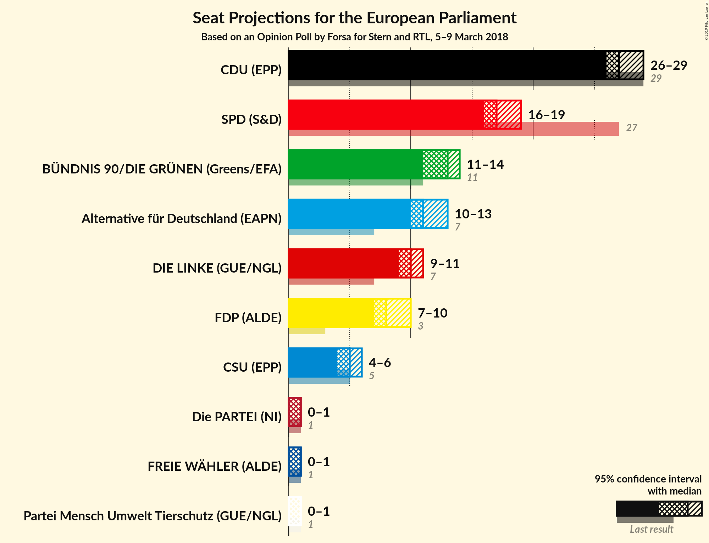

# Opinion Poll by Forsa for Stern and RTL, 5–9 March 2018

<a href="#voting-intentions">Voting Intentions</a> | <a href="#seats">Seats</a> | <a href="#coalitions">Coalitions</a> | <a href="#technical-information">Technical Information</a>

## Voting Intentions

### Confidence Intervals

| Party | Last Result | Poll Result | 80% Confidence Interval | 90% Confidence Interval | 95% Confidence Interval | 99% Confidence Interval |
|:-----:|:-----------:|:-----------:|:-----------------------:|:-----------------------:|:-----------------------:|:-----------------------:|
| CDU (EPP) | 30.0% | 28.9% | 27.6–30.2% |27.2–30.6% |26.9–31.0% |26.3–31.6% |
| SPD (S&D) | 27.3% | 18.0% | 16.9–19.2% |16.6–19.5% |16.3–19.8% |15.8–20.4% |
| BÜNDNIS 90/DIE GRÜNEN (Greens/EFA) | 10.7% | 13.0% | 12.1–14.1% |11.8–14.4% |11.6–14.6% |11.1–15.1% |
| Alternative für Deutschland (EFDD) | 7.0% | 12.0% | 11.1–13.0% |10.9–13.3% |10.6–13.6% |10.2–14.1% |
| DIE LINKE (GUE/NGL) | 7.4% | 10.0% | 9.2–11.0% |8.9–11.2% |8.7–11.5% |8.4–11.9% |
| FDP (ALDE) | 3.4% | 9.0% | 8.2–9.9% |8.0–10.1% |7.8–10.3% |7.4–10.8% |
| CSU (EPP) | 5.3% | 5.1% | 4.5–5.9% |4.4–6.1% |4.2–6.2% |4.0–6.6% |
| FREIE WÄHLER (ALDE) | 1.5% | 0.8% | 1.4–2.1% |1.3–2.3% |1.2–2.4% |1.1–2.6% |
| Die PARTEI (NI) | 0.6% | 0.8% | 0.5–1.0% |0.4–1.1% |0.4–1.2% |0.3–1.3% |
| Partei Mensch Umwelt Tierschutz (GUE/NGL) | 1.2% | 0.6% | N/A |N/A |N/A |N/A |

*Note:* The poll result column reflects the actual value used in the calculations. Published results may vary slightly, and in addition be rounded to fewer digits.

## Seats

### Confidence Intervals

| Party | Last Result | Median | 80% Confidence Interval | 90% Confidence Interval | 95% Confidence Interval | 99% Confidence Interval |
|:-----:|:-----------:|:------:|:-----------------------:|:-----------------------:|:-----------------------:|:-----------------------:|
| <a href="#cdu-(epp)">CDU (EPP)</a> | 29 | 28 | 28 |28 |28 |27–28 |
| <a href="#spd-(s&d)">SPD (S&D)</a> | 27 | 19 | 17–19 |17–19 |17–19 |17–19 |
| <a href="#bÜndnis-90/die-grÜnen-(greens/efa)">BÜNDNIS 90/DIE GRÜNEN (Greens/EFA)</a> | 11 | 12 | 12 |12 |12 |12–13 |
| <a href="#alternative-für-deutschland-(efdd)">Alternative für Deutschland (EFDD)</a> | 7 | 11 | 11–13 |11–13 |11–13 |11–13 |
| <a href="#die-linke-(gue/ngl)">DIE LINKE (GUE/NGL)</a> | 7 | 9 | 9 |9 |9 |9–10 |
| <a href="#fdp-(alde)">FDP (ALDE)</a> | 3 | 8 | 8 |8 |8 |8 |
| <a href="#csu-(epp)">CSU (EPP)</a> | 5 | 6 | 4–6 |4–6 |4–6 |4–6 |
| <a href="#freie-wÄhler-(alde)">FREIE WÄHLER (ALDE)</a> | 1 | 1 | 1–2 |1–2 |1–2 |1–2 |
| <a href="#die-partei-(ni)">Die PARTEI (NI)</a> | 1 | 1 | 1 |1 |1 |1 |
| <a href="#partei-mensch-umwelt-tierschutz-(gue/ngl)">Partei Mensch Umwelt Tierschutz (GUE/NGL)</a> | 1 | N/A | N/A |N/A |N/A |N/A |

