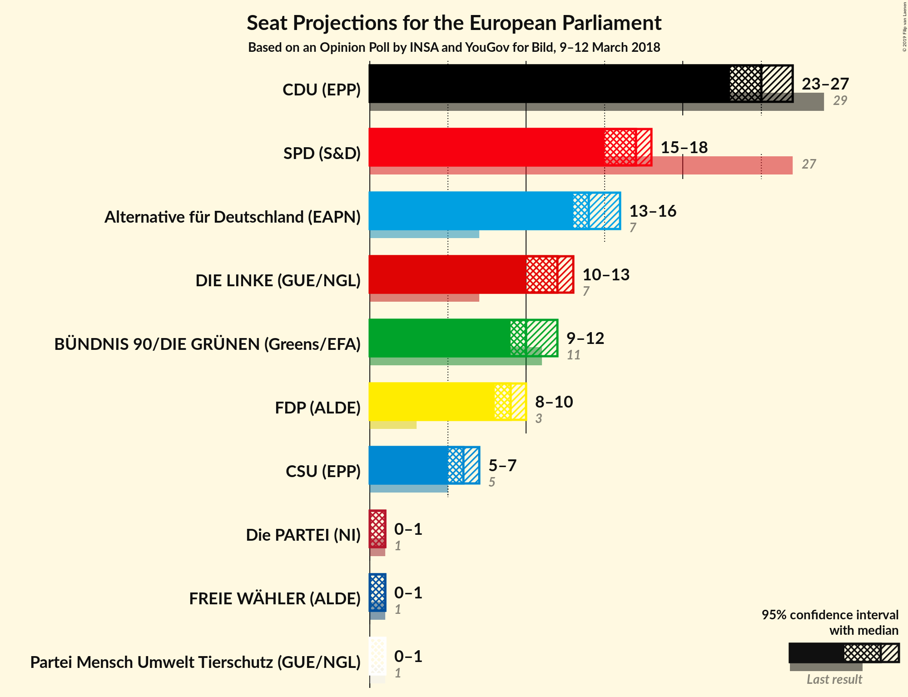

# Opinion Poll by INSA and YouGov for Bild, 9–12 March 2018

<a href="#voting-intentions">Voting Intentions</a> | <a href="#seats">Seats</a> | <a href="#coalitions">Coalitions</a> | <a href="#technical-information">Technical Information</a>

## Voting Intentions

### Confidence Intervals

| Party | Last Result | Poll Result | 80% Confidence Interval | 90% Confidence Interval | 95% Confidence Interval | 99% Confidence Interval |
|:-----:|:-----------:|:-----------:|:-----------------------:|:-----------------------:|:-----------------------:|:-----------------------:|
| CDU (EPP) | 30.0% | 25.9% | 24.7–27.2% |24.4–27.6% |24.1–27.9% |23.5–28.5% |
| SPD (S&D) | 27.3% | 17.5% | 16.5–18.6% |16.2–19.0% |15.9–19.2% |15.4–19.8% |
| Alternative für Deutschland (EFDD) | 7.0% | 15.0% | 14.0–16.1% |13.7–16.4% |13.5–16.6% |13.0–17.1% |
| DIE LINKE (GUE/NGL) | 7.4% | 12.0% | 11.1–13.0% |10.9–13.3% |10.7–13.5% |10.2–14.0% |
| BÜNDNIS 90/DIE GRÜNEN (Greens/EFA) | 10.7% | 11.0% | 10.2–12.0% |9.9–12.2% |9.7–12.5% |9.3–12.9% |
| FDP (ALDE) | 3.4% | 9.5% | 8.7–10.4% |8.5–10.6% |8.3–10.9% |7.9–11.3% |
| CSU (EPP) | 5.3% | 6.1% | 5.5–6.8% |5.3–7.0% |5.1–7.2% |4.8–7.6% |
| FREIE WÄHLER (ALDE) | 1.5% | 0.6% | 1.0–1.6% |0.9–1.7% |0.8–1.8% |0.7–2.0% |
| Die PARTEI (NI) | 0.6% | 0.6% | 0.4–0.8% |0.3–0.9% |0.3–1.0% |0.2–1.1% |
| Partei Mensch Umwelt Tierschutz (GUE/NGL) | 1.2% | 0.5% | N/A |N/A |N/A |N/A |

*Note:* The poll result column reflects the actual value used in the calculations. Published results may vary slightly, and in addition be rounded to fewer digits.

## Seats

### Confidence Intervals

| Party | Last Result | Median | 80% Confidence Interval | 90% Confidence Interval | 95% Confidence Interval | 99% Confidence Interval |
|:-----:|:-----------:|:------:|:-----------------------:|:-----------------------:|:-----------------------:|:-----------------------:|
| <a href="#cdu-(epp)">CDU (EPP)</a> | 29 | 24 | 24 |24–26 |23–28 |23–28 |
| <a href="#spd-(s&d)">SPD (S&D)</a> | 27 | 19 | 17–19 |17–19 |16–19 |15–19 |
| <a href="#alternative-für-deutschland-(efdd)">Alternative für Deutschland (EFDD)</a> | 7 | 13 | 13 |13–16 |12–16 |12–16 |
| <a href="#die-linke-(gue/ngl)">DIE LINKE (GUE/NGL)</a> | 7 | 11 | 11 |11–12 |11–12 |11–12 |
| <a href="#bÜndnis-90/die-grÜnen-(greens/efa)">BÜNDNIS 90/DIE GRÜNEN (Greens/EFA)</a> | 11 | 10 | 10 |10–11 |10–11 |9–11 |
| <a href="#fdp-(alde)">FDP (ALDE)</a> | 3 | 9 | 9 |8–9 |7–9 |7–9 |
| <a href="#csu-(epp)">CSU (EPP)</a> | 5 | 6 | 6 |6 |6 |5–6 |
| <a href="#freie-wÄhler-(alde)">FREIE WÄHLER (ALDE)</a> | 1 | 1 | 1 |1–2 |1–2 |1–2 |
| <a href="#die-partei-(ni)">Die PARTEI (NI)</a> | 1 | 1 | 1 |1 |1 |0–1 |
| <a href="#partei-mensch-umwelt-tierschutz-(gue/ngl)">Partei Mensch Umwelt Tierschutz (GUE/NGL)</a> | 1 | N/A | N/A |N/A |N/A |N/A |

