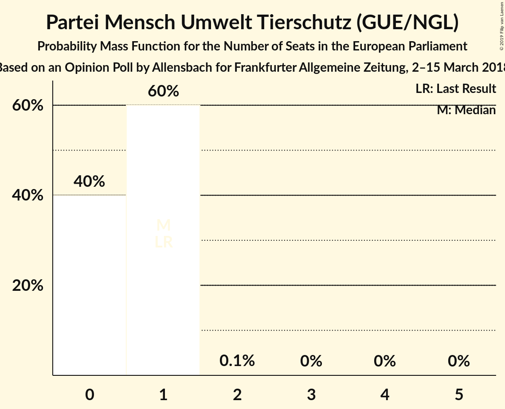

# Opinion Poll by Allensbach for Frankfurter Allgemeine Zeitung, 2–15 March 2018

<a href="#voting-intentions">Voting Intentions</a> | <a href="#seats">Seats</a> | <a href="#coalitions">Coalitions</a> | <a href="#technical-information">Technical Information</a>

## Voting Intentions

### Confidence Intervals

| Party | Last Result | Poll Result | 80% Confidence Interval | 90% Confidence Interval | 95% Confidence Interval | 99% Confidence Interval |
|:-----:|:-----------:|:-----------:|:-----------------------:|:-----------------------:|:-----------------------:|:-----------------------:|
| CDU (EPP) | 30.0% | 28.9% | 27.3–30.6% |26.8–31.1% |26.5–31.5% |25.7–32.3% |
| SPD (S&D) | 27.3% | 19.0% | 17.7–20.5% |17.3–20.9% |16.9–21.3% |16.3–22.0% |
| Alternative für Deutschland (EFDD) | 7.0% | 12.5% | 11.4–13.8% |11.1–14.1% |10.8–14.4% |10.3–15.1% |
| BÜNDNIS 90/DIE GRÜNEN (Greens/EFA) | 10.7% | 11.0% | 9.9–12.2% |9.6–12.5% |9.4–12.8% |8.9–13.4% |
| FDP (ALDE) | 3.4% | 10.0% | 9.0–11.2% |8.7–11.5% |8.5–11.8% |8.0–12.4% |
| DIE LINKE (GUE/NGL) | 7.4% | 10.0% | 9.0–11.2% |8.7–11.5% |8.5–11.8% |8.0–12.4% |
| CSU (EPP) | 5.3% | 5.2% | 4.5–6.1% |4.3–6.3% |4.1–6.6% |3.7–7.0% |
| FREIE WÄHLER (ALDE) | 1.5% | 0.7% | 0.5–1.1% |0.4–1.2% |0.4–1.4% |0.3–1.6% |
| Die PARTEI (NI) | 0.6% | 0.7% | 0.5–1.1% |0.4–1.2% |0.4–1.4% |0.3–1.6% |
| Partei Mensch Umwelt Tierschutz (GUE/NGL) | 1.2% | 0.6% | 0.4–0.9% |0.3–1.1% |0.3–1.2% |0.2–1.4% |

*Note:* The poll result column reflects the actual value used in the calculations. Published results may vary slightly, and in addition be rounded to fewer digits.

## Seats

### Confidence Intervals

| Party | Last Result | Median | 80% Confidence Interval | 90% Confidence Interval | 95% Confidence Interval | 99% Confidence Interval |
|:-----:|:-----------:|:------:|:-----------------------:|:-----------------------:|:-----------------------:|:-----------------------:|
| <a href="#cdu-(epp)">CDU (EPP)</a> | 29 | 28 | 25–31 |25–31 |25–32 |25–32 |
| <a href="#spd-(s&d)">SPD (S&D)</a> | 27 | 18 | 17–19 |17–19 |17–20 |17–21 |
| <a href="#alternative-für-deutschland-(efdd)">Alternative für Deutschland (EFDD)</a> | 7 | 13 | 12–16 |12–16 |8–16 |8–16 |
| <a href="#bÜndnis-90/die-grÜnen-(greens/efa)">BÜNDNIS 90/DIE GRÜNEN (Greens/EFA)</a> | 11 | 11 | 10–12 |9–12 |7–12 |7–13 |
| <a href="#fdp-(alde)">FDP (ALDE)</a> | 3 | 9 | 8–12 |8–12 |8–12 |8–13 |
| <a href="#die-linke-(gue/ngl)">DIE LINKE (GUE/NGL)</a> | 7 | 8 | 8–9 |8–9 |8–9 |8–10 |
| <a href="#csu-(epp)">CSU (EPP)</a> | 5 | 4 | 4–5 |4–5 |4–5 |4–5 |
| <a href="#freie-wÄhler-(alde)">FREIE WÄHLER (ALDE)</a> | 1 | 0 | 0–2 |0–2 |0–2 |0–2 |
| <a href="#die-partei-(ni)">Die PARTEI (NI)</a> | 1 | 1 | 1 |1–2 |1–2 |0–2 |
| <a href="#partei-mensch-umwelt-tierschutz-(gue/ngl)">Partei Mensch Umwelt Tierschutz (GUE/NGL)</a> | 1 | 0 | 0–1 |0–1 |0–1 |0–1 |

### CDU (EPP)

*For a full overview of the results for this party, see the [CDU (EPP)](party-cduepp.html) page.*

| Number of Seats | Probability | Accumulated | Special Marks |
|:---------------:|:-----------:|:-----------:|:-------------:|
| 23 | 0% | 100% |  |
| 24 | 0% | 99.9% |  |
| 25 | 29% | 99.9% |  |
| 26 | 10% | 71% |  |
| 27 | 10% | 60% |  |
| 28 | 1.3% | 50% | Median |
| 29 | 0.8% | 49% | Last Result |
| 30 | 0.1% | 48% |  |
| 31 | 44% | 48% |  |
| 32 | 4% | 4% |  |
| 33 | 0% | 0% |  |

### SPD (S&D)

*For a full overview of the results for this party, see the [SPD (S&D)](party-spdsd.html) page.*

| Number of Seats | Probability | Accumulated | Special Marks |
|:---------------:|:-----------:|:-----------:|:-------------:|
| 14 | 0.1% | 100% |  |
| 15 | 0% | 99.9% |  |
| 16 | 0.3% | 99.9% |  |
| 17 | 33% | 99.5% |  |
| 18 | 52% | 67% | Median |
| 19 | 12% | 15% |  |
| 20 | 3% | 3% |  |
| 21 | 0.5% | 0.5% |  |
| 22 | 0% | 0% |  |
| 23 | 0% | 0% |  |
| 24 | 0% | 0% |  |
| 25 | 0% | 0% |  |
| 26 | 0% | 0% |  |
| 27 | 0% | 0% | Last Result |

### Alternative für Deutschland (EFDD)

*For a full overview of the results for this party, see the [Alternative für Deutschland (EFDD)](party-alternativefürdeutschlandefdd.html) page.*

| Number of Seats | Probability | Accumulated | Special Marks |
|:---------------:|:-----------:|:-----------:|:-------------:|
| 7 | 0% | 100% | Last Result |
| 8 | 3% | 100% |  |
| 9 | 0.1% | 97% |  |
| 10 | 0.1% | 97% |  |
| 11 | 2% | 97% |  |
| 12 | 29% | 95% |  |
| 13 | 52% | 67% | Median |
| 14 | 4% | 14% |  |
| 15 | 0% | 10% |  |
| 16 | 10% | 10% |  |
| 17 | 0% | 0% |  |

### BÜNDNIS 90/DIE GRÜNEN (Greens/EFA)

*For a full overview of the results for this party, see the [BÜNDNIS 90/DIE GRÜNEN (Greens/EFA)](party-bÜndnis90diegrÜnengreensefa.html) page.*

| Number of Seats | Probability | Accumulated | Special Marks |
|:---------------:|:-----------:|:-----------:|:-------------:|
| 7 | 4% | 100% |  |
| 8 | 0% | 96% |  |
| 9 | 3% | 96% |  |
| 10 | 39% | 93% |  |
| 11 | 6% | 54% | Last Result, Median |
| 12 | 46% | 47% |  |
| 13 | 0.9% | 0.9% |  |
| 14 | 0% | 0% |  |

### FDP (ALDE)

*For a full overview of the results for this party, see the [FDP (ALDE)](party-fdpalde.html) page.*

| Number of Seats | Probability | Accumulated | Special Marks |
|:---------------:|:-----------:|:-----------:|:-------------:|
| 3 | 0% | 100% | Last Result |
| 4 | 0% | 100% |  |
| 5 | 0% | 100% |  |
| 6 | 0.2% | 100% |  |
| 7 | 0% | 99.8% |  |
| 8 | 45% | 99.7% |  |
| 9 | 10% | 55% | Median |
| 10 | 14% | 45% |  |
| 11 | 1.4% | 31% |  |
| 12 | 29% | 30% |  |
| 13 | 1.2% | 1.2% |  |
| 14 | 0% | 0% |  |

### DIE LINKE (GUE/NGL)

*For a full overview of the results for this party, see the [DIE LINKE (GUE/NGL)](party-dielinkeguengl.html) page.*

| Number of Seats | Probability | Accumulated | Special Marks |
|:---------------:|:-----------:|:-----------:|:-------------:|
| 7 | 0% | 100% | Last Result |
| 8 | 56% | 100% | Median |
| 9 | 44% | 44% |  |
| 10 | 0.4% | 0.7% |  |
| 11 | 0.1% | 0.3% |  |
| 12 | 0.2% | 0.2% |  |
| 13 | 0% | 0% |  |

### CSU (EPP)

*For a full overview of the results for this party, see the [CSU (EPP)](party-csuepp.html) page.*

| Number of Seats | Probability | Accumulated | Special Marks |
|:---------------:|:-----------:|:-----------:|:-------------:|
| 4 | 59% | 100% | Median |
| 5 | 40% | 41% | Last Result |
| 6 | 0.1% | 0.3% |  |
| 7 | 0.3% | 0.3% |  |
| 8 | 0% | 0% |  |

### FREIE WÄHLER (ALDE)

*For a full overview of the results for this party, see the [FREIE WÄHLER (ALDE)](party-freiewÄhleralde.html) page.*

| Number of Seats | Probability | Accumulated | Special Marks |
|:---------------:|:-----------:|:-----------:|:-------------:|
| 0 | 55% | 100% | Median |
| 1 | 15% | 45% | Last Result |
| 2 | 30% | 30% |  |
| 3 | 0% | 0% |  |

### Die PARTEI (NI)

*For a full overview of the results for this party, see the [Die PARTEI (NI)](party-dieparteini.html) page.*

| Number of Seats | Probability | Accumulated | Special Marks |
|:---------------:|:-----------:|:-----------:|:-------------:|
| 0 | 0.6% | 100% |  |
| 1 | 93% | 99.4% | Last Result, Median |
| 2 | 6% | 6% |  |
| 3 | 0% | 0% |  |

### Partei Mensch Umwelt Tierschutz (GUE/NGL)

*For a full overview of the results for this party, see the [Partei Mensch Umwelt Tierschutz (GUE/NGL)](party-parteimenschumwelttierschutzguengl.html) page.*

| Number of Seats | Probability | Accumulated | Special Marks |
|:---------------:|:-----------:|:-----------:|:-------------:|
| 0 | 53% | 100% | Median |
| 1 | 47% | 47% | Last Result |
| 2 | 0.1% | 0.1% |  |
| 3 | 0% | 0% |  |

## Coalitions

### Confidence Intervals

| Coalition | Last Result | Median | Majority? | 80% Confidence Interval | 90% Confidence Interval | 95% Confidence Interval | 99% Confidence Interval |
|:---------:|:-----------:|:------:|:---------:|:-----------------------:|:-----------------------:|:-----------------------:|:-----------------------:|
| CDU (EPP) – CSU (EPP) | 34 | 32 | 0% | 30–35 | 30–35 | 30–36 | 30–36 |
| SPD (S&D) | 27 | 18 | 0% | 17–19 | 17–19 | 17–20 | 17–21 |
| Alternative für Deutschland (EFDD) | 7 | 13 | 0% | 12–16 | 12–16 | 8–16 | 8–16 |
| FDP (ALDE) – FREIE WÄHLER (ALDE) | 4 | 10 | 0% | 8–14 | 8–14 | 8–14 | 8–14 |
| Die PARTEI (NI) | 1 | 1 | 0% | 1 | 1–2 | 1–2 | 0–2 |

### CDU (EPP) – CSU (EPP)

| Number of Seats | Probability | Accumulated | Special Marks |
|:---------------:|:-----------:|:-----------:|:-------------:|
| 28 | 0% | 100% |  |
| 29 | 0% | 99.9% |  |
| 30 | 39% | 99.9% |  |
| 31 | 0% | 61% |  |
| 32 | 11% | 61% | Median |
| 33 | 0.2% | 49% |  |
| 34 | 0.8% | 49% | Last Result |
| 35 | 44% | 48% |  |
| 36 | 4% | 4% |  |
| 37 | 0% | 0.1% |  |
| 38 | 0.1% | 0.1% |  |
| 39 | 0% | 0% |  |

### SPD (S&D)

| Number of Seats | Probability | Accumulated | Special Marks |
|:---------------:|:-----------:|:-----------:|:-------------:|
| 14 | 0.1% | 100% |  |
| 15 | 0% | 99.9% |  |
| 16 | 0.3% | 99.9% |  |
| 17 | 33% | 99.5% |  |
| 18 | 52% | 67% | Median |
| 19 | 12% | 15% |  |
| 20 | 3% | 3% |  |
| 21 | 0.5% | 0.5% |  |
| 22 | 0% | 0% |  |
| 23 | 0% | 0% |  |
| 24 | 0% | 0% |  |
| 25 | 0% | 0% |  |
| 26 | 0% | 0% |  |
| 27 | 0% | 0% | Last Result |

### Alternative für Deutschland (EFDD)

| Number of Seats | Probability | Accumulated | Special Marks |
|:---------------:|:-----------:|:-----------:|:-------------:|
| 7 | 0% | 100% | Last Result |
| 8 | 3% | 100% |  |
| 9 | 0.1% | 97% |  |
| 10 | 0.1% | 97% |  |
| 11 | 2% | 97% |  |
| 12 | 29% | 95% |  |
| 13 | 52% | 67% | Median |
| 14 | 4% | 14% |  |
| 15 | 0% | 10% |  |
| 16 | 10% | 10% |  |
| 17 | 0% | 0% |  |

### FDP (ALDE) – FREIE WÄHLER (ALDE)

| Number of Seats | Probability | Accumulated | Special Marks |
|:---------------:|:-----------:|:-----------:|:-------------:|
| 4 | 0% | 100% | Last Result |
| 5 | 0% | 100% |  |
| 6 | 0.1% | 100% |  |
| 7 | 0.2% | 99.9% |  |
| 8 | 44% | 99.8% |  |
| 9 | 0.4% | 56% | Median |
| 10 | 21% | 55% |  |
| 11 | 3% | 34% |  |
| 12 | 0.3% | 31% |  |
| 13 | 1.2% | 31% |  |
| 14 | 30% | 30% |  |
| 15 | 0% | 0% |  |

### Die PARTEI (NI)

| Number of Seats | Probability | Accumulated | Special Marks |
|:---------------:|:-----------:|:-----------:|:-------------:|
| 0 | 0.6% | 100% |  |
| 1 | 93% | 99.4% | Last Result, Median |
| 2 | 6% | 6% |  |
| 3 | 0% | 0% |  |

## Technical Information

### Opinion Poll

+ **Polling firm:** Allensbach
+ **Commissioner(s):** Frankfurter Allgemeine Zeitung
+ **Fieldwork period:** 2–15 March 2018

### Calculations

+ **Sample size:** 1256
+ **Simulations done:** 1,024
+ **Error estimate:** 4.86%

