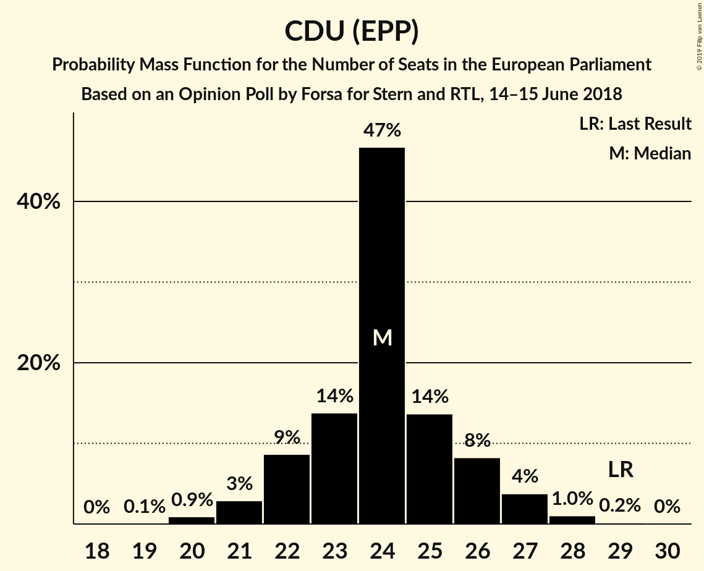
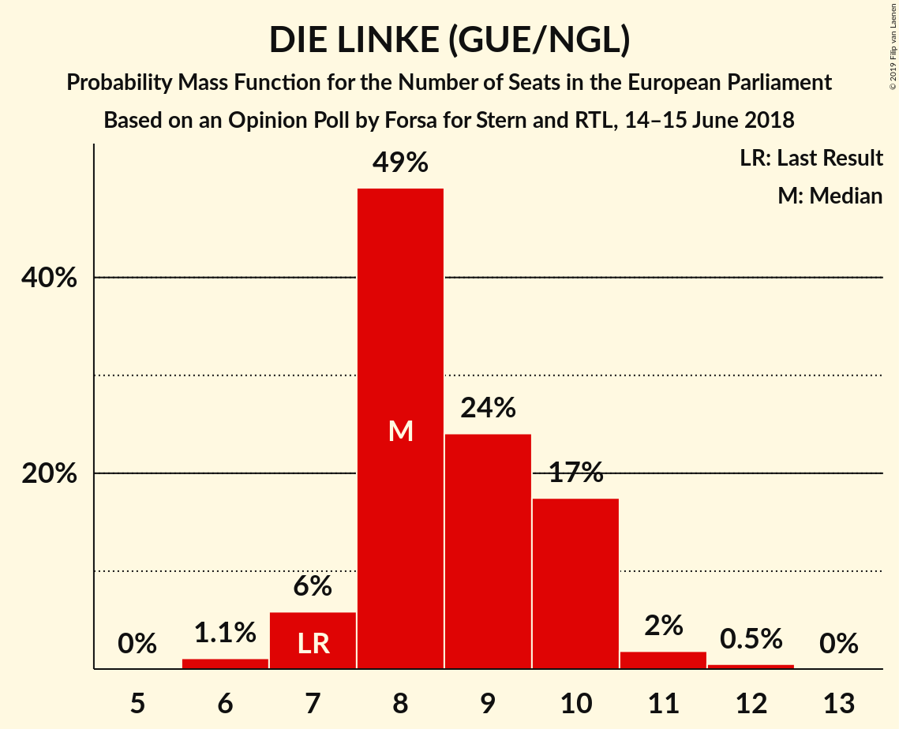
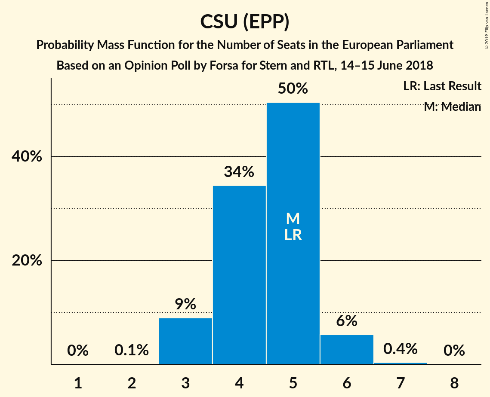

# Opinion Poll by Forsa for Stern and RTL, 14–15 June 2018

<a href="#voting-intentions">Voting Intentions</a> | <a href="#seats">Seats</a> | <a href="#coalitions">Coalitions</a> | <a href="#technical-information">Technical Information</a>

## Voting Intentions

### Confidence Intervals

| Party | Last Result | Poll Result | 80% Confidence Interval | 90% Confidence Interval | 95% Confidence Interval | 99% Confidence Interval |
|:-----:|:-----------:|:-----------:|:-----------------------:|:-----------------------:|:-----------------------:|:-----------------------:|
| CDU (EPP) | 30.0% | 25.5% | 23.5–27.6% |23.0–28.2% |22.5–28.8% |21.6–29.8% |
| SPD (S&D) | 27.3% | 16.1% | 14.4–17.9% |14.0–18.4% |13.6–18.9% |12.8–19.8% |
| Alternative für Deutschland (EFDD) | 7.0% | 15.0% | 13.4–16.8% |13.0–17.3% |12.6–17.7% |11.9–18.6% |
| BÜNDNIS 90/DIE GRÜNEN (Greens/EFA) | 10.7% | 14.0% | 12.5–15.8% |12.1–16.3% |11.7–16.7% |11.0–17.6% |
| FDP (ALDE) | 3.4% | 10.0% | 8.7–11.5% |8.3–12.0% |8.0–12.4% |7.5–13.1% |
| DIE LINKE (GUE/NGL) | 7.4% | 9.0% | 7.8–10.5% |7.5–11.0% |7.2–11.3% |6.6–12.1% |
| CSU (EPP) | 5.3% | 4.6% | 3.7–5.7% |3.5–6.1% |3.3–6.4% |2.9–7.0% |
| FREIE WÄHLER (ALDE) | 1.5% | 1.2% | 0.8–1.9% |0.7–2.1% |0.6–2.3% |0.5–2.7% |
| Die PARTEI (NI) | 0.6% | 1.2% | 0.8–1.9% |0.7–2.1% |0.6–2.3% |0.5–2.7% |
| Partei Mensch Umwelt Tierschutz (GUE/NGL) | 1.2% | 0.9% | 0.6–1.6% |0.5–1.8% |0.5–1.9% |0.3–2.3% |

*Note:* The poll result column reflects the actual value used in the calculations. Published results may vary slightly, and in addition be rounded to fewer digits.

## Seats

### Confidence Intervals

| Party | Last Result | Median | 80% Confidence Interval | 90% Confidence Interval | 95% Confidence Interval | 99% Confidence Interval |
|:-----:|:-----------:|:------:|:-----------------------:|:-----------------------:|:-----------------------:|:-----------------------:|
| <a href="#cdu-(epp)">CDU (EPP)</a> | 29 | 24 | 22–26 |22–27 |21–27 |20–28 |
| <a href="#spd-(s&d)">SPD (S&D)</a> | 27 | 15 | 13–17 |13–17 |13–18 |12–19 |
| <a href="#alternative-für-deutschland-(efdd)">Alternative für Deutschland (EFDD)</a> | 7 | 15 | 13–16 |12–16 |12–16 |11–18 |
| <a href="#bündnis-90/die-grünen-(greens/efa)">BÜNDNIS 90/DIE GRÜNEN (Greens/EFA)</a> | 11 | 13 | 12–15 |12–15 |11–16 |10–17 |
| <a href="#fdp-(alde)">FDP (ALDE)</a> | 3 | 10 | 9–11 |8–11 |8–12 |7–12 |
| <a href="#die-linke-(gue/ngl)">DIE LINKE (GUE/NGL)</a> | 7 | 8 | 8–10 |7–10 |7–10 |6–12 |
| <a href="#csu-(epp)">CSU (EPP)</a> | 5 | 5 | 4–5 |3–6 |3–6 |3–6 |
| <a href="#freie-wähler-(alde)">FREIE WÄHLER (ALDE)</a> | 1 | 1 | 1–2 |1–2 |1–2 |1–3 |
| <a href="#die-partei-(ni)">Die PARTEI (NI)</a> | 1 | 1 | 1–2 |1–2 |1–2 |1–3 |
| <a href="#partei-mensch-umwelt-tierschutz-(gue/ngl)">Partei Mensch Umwelt Tierschutz (GUE/NGL)</a> | 1 | 1 | 1 |0–2 |0–2 |0–2 |

### CDU (EPP)

*For a full overview of the results for this party, see the [CDU (EPP)](party-cduepp.html) page.*

| Number of Seats | Probability | Accumulated | Special Marks |
|:---------------:|:-----------:|:-----------:|:-------------:|
| 19 | 0.1% | 100% |  |
| 20 | 0.9% | 99.9% |  |
| 21 | 3% | 99.0% |  |
| 22 | 9% | 96% |  |
| 23 | 14% | 87% |  |
| 24 | 47% | 74% | Median |
| 25 | 14% | 27% |  |
| 26 | 8% | 13% |  |
| 27 | 4% | 5% |  |
| 28 | 1.0% | 1.3% |  |
| 29 | 0.2% | 0.2% | Last Result |
| 30 | 0% | 0% |  |

### SPD (S&D)

*For a full overview of the results for this party, see the [SPD (S&D)](party-spdsd.html) page.*

| Number of Seats | Probability | Accumulated | Special Marks |
|:---------------:|:-----------:|:-----------:|:-------------:|
| 11 | 0.1% | 100% |  |
| 12 | 0.5% | 99.9% |  |
| 13 | 11% | 99.5% |  |
| 14 | 13% | 88% |  |
| 15 | 54% | 75% | Median |
| 16 | 11% | 21% |  |
| 17 | 7% | 10% |  |
| 18 | 2% | 3% |  |
| 19 | 0.5% | 0.7% |  |
| 20 | 0.1% | 0.1% |  |
| 21 | 0% | 0% |  |
| 22 | 0% | 0% |  |
| 23 | 0% | 0% |  |
| 24 | 0% | 0% |  |
| 25 | 0% | 0% |  |
| 26 | 0% | 0% |  |
| 27 | 0% | 0% | Last Result |

### Alternative für Deutschland (EFDD)

*For a full overview of the results for this party, see the [Alternative für Deutschland (EFDD)](party-alternativefürdeutschlandefdd.html) page.*

| Number of Seats | Probability | Accumulated | Special Marks |
|:---------------:|:-----------:|:-----------:|:-------------:|
| 7 | 0% | 100% | Last Result |
| 8 | 0% | 100% |  |
| 9 | 0% | 100% |  |
| 10 | 0% | 100% |  |
| 11 | 1.2% | 100% |  |
| 12 | 8% | 98.8% |  |
| 13 | 4% | 91% |  |
| 14 | 11% | 87% |  |
| 15 | 38% | 76% | Median |
| 16 | 37% | 38% |  |
| 17 | 0.3% | 1.0% |  |
| 18 | 0.4% | 0.7% |  |
| 19 | 0.3% | 0.3% |  |
| 20 | 0% | 0% |  |

### BÜNDNIS 90/DIE GRÜNEN (Greens/EFA)

*For a full overview of the results for this party, see the [BÜNDNIS 90/DIE GRÜNEN (Greens/EFA)](party-bündnis90diegrünengreensefa.html) page.*

| Number of Seats | Probability | Accumulated | Special Marks |
|:---------------:|:-----------:|:-----------:|:-------------:|
| 10 | 0.5% | 100% |  |
| 11 | 4% | 99.5% | Last Result |
| 12 | 41% | 96% |  |
| 13 | 20% | 55% | Median |
| 14 | 23% | 35% |  |
| 15 | 9% | 12% |  |
| 16 | 3% | 3% |  |
| 17 | 0.5% | 0.6% |  |
| 18 | 0.1% | 0.1% |  |
| 19 | 0% | 0% |  |

### FDP (ALDE)

*For a full overview of the results for this party, see the [FDP (ALDE)](party-fdpalde.html) page.*

| Number of Seats | Probability | Accumulated | Special Marks |
|:---------------:|:-----------:|:-----------:|:-------------:|
| 3 | 0% | 100% | Last Result |
| 4 | 0% | 100% |  |
| 5 | 0% | 100% |  |
| 6 | 0.1% | 100% |  |
| 7 | 2% | 99.9% |  |
| 8 | 6% | 98% |  |
| 9 | 19% | 92% |  |
| 10 | 56% | 74% | Median |
| 11 | 14% | 18% |  |
| 12 | 4% | 4% |  |
| 13 | 0.4% | 0.5% |  |
| 14 | 0% | 0% |  |

### DIE LINKE (GUE/NGL)

*For a full overview of the results for this party, see the [DIE LINKE (GUE/NGL)](party-dielinkeguengl.html) page.*

| Number of Seats | Probability | Accumulated | Special Marks |
|:---------------:|:-----------:|:-----------:|:-------------:|
| 6 | 1.1% | 100% |  |
| 7 | 6% | 98.9% | Last Result |
| 8 | 49% | 93% | Median |
| 9 | 24% | 44% |  |
| 10 | 17% | 20% |  |
| 11 | 2% | 2% |  |
| 12 | 0.5% | 0.5% |  |
| 13 | 0% | 0% |  |

### CSU (EPP)

*For a full overview of the results for this party, see the [CSU (EPP)](party-csuepp.html) page.*

| Number of Seats | Probability | Accumulated | Special Marks |
|:---------------:|:-----------:|:-----------:|:-------------:|
| 2 | 0.1% | 100% |  |
| 3 | 9% | 99.9% |  |
| 4 | 34% | 91% |  |
| 5 | 50% | 57% | Last Result, Median |
| 6 | 6% | 6% |  |
| 7 | 0.4% | 0.4% |  |
| 8 | 0% | 0% |  |

### FREIE WÄHLER (ALDE)

*For a full overview of the results for this party, see the [FREIE WÄHLER (ALDE)](party-freiewähleralde.html) page.*

| Number of Seats | Probability | Accumulated | Special Marks |
|:---------------:|:-----------:|:-----------:|:-------------:|
| 0 | 0.3% | 100% |  |
| 1 | 55% | 99.7% | Last Result, Median |
| 2 | 44% | 45% |  |
| 3 | 0.8% | 0.8% |  |
| 4 | 0% | 0% |  |

### Die PARTEI (NI)

*For a full overview of the results for this party, see the [Die PARTEI (NI)](party-dieparteini.html) page.*

| Number of Seats | Probability | Accumulated | Special Marks |
|:---------------:|:-----------:|:-----------:|:-------------:|
| 0 | 0.3% | 100% |  |
| 1 | 81% | 99.7% | Last Result, Median |
| 2 | 18% | 19% |  |
| 3 | 0.6% | 0.6% |  |
| 4 | 0% | 0% |  |

### Partei Mensch Umwelt Tierschutz (GUE/NGL)

*For a full overview of the results for this party, see the [Partei Mensch Umwelt Tierschutz (GUE/NGL)](party-parteimenschumwelttierschutzguengl.html) page.*

| Number of Seats | Probability | Accumulated | Special Marks |
|:---------------:|:-----------:|:-----------:|:-------------:|
| 0 | 6% | 100% |  |
| 1 | 88% | 94% | Last Result, Median |
| 2 | 6% | 6% |  |
| 3 | 0.1% | 0.1% |  |
| 4 | 0% | 0% |  |

## Coalitions

### Confidence Intervals

| Coalition | Last Result | Median | Majority? | 80% Confidence Interval | 90% Confidence Interval | 95% Confidence Interval | 99% Confidence Interval |
|:---------:|:-----------:|:------:|:---------:|:-----------------------:|:-----------------------:|:-----------------------:|:-----------------------:|
| CDU (EPP) – CSU (EPP) | 34 | 29 | 0% | 27–30 | 26–31 | 26–32 | 25–33 |
| SPD (S&D) | 27 | 15 | 0% | 13–17 | 13–17 | 13–18 | 12–19 |
| Alternative für Deutschland (EFDD) | 7 | 15 | 0% | 13–16 | 12–16 | 12–16 | 11–18 |
| FDP (ALDE) – FREIE WÄHLER (ALDE) | 4 | 12 | 0% | 10–12 | 9–13 | 9–13 | 8–14 |
| Die PARTEI (NI) | 1 | 1 | 0% | 1–2 | 1–2 | 1–2 | 1–3 |

### CDU (EPP) – CSU (EPP)

| Number of Seats | Probability | Accumulated | Special Marks |
|:---------------:|:-----------:|:-----------:|:-------------:|
| 23 | 0% | 100% |  |
| 24 | 0.4% | 99.9% |  |
| 25 | 2% | 99.6% |  |
| 26 | 6% | 98% |  |
| 27 | 13% | 92% |  |
| 28 | 19% | 79% |  |
| 29 | 43% | 60% | Median |
| 30 | 7% | 16% |  |
| 31 | 7% | 9% |  |
| 32 | 2% | 3% |  |
| 33 | 0.6% | 0.8% |  |
| 34 | 0.1% | 0.2% | Last Result |
| 35 | 0% | 0.1% |  |
| 36 | 0% | 0% |  |

### SPD (S&D)

| Number of Seats | Probability | Accumulated | Special Marks |
|:---------------:|:-----------:|:-----------:|:-------------:|
| 11 | 0.1% | 100% |  |
| 12 | 0.5% | 99.9% |  |
| 13 | 11% | 99.5% |  |
| 14 | 13% | 88% |  |
| 15 | 54% | 75% | Median |
| 16 | 11% | 21% |  |
| 17 | 7% | 10% |  |
| 18 | 2% | 3% |  |
| 19 | 0.5% | 0.7% |  |
| 20 | 0.1% | 0.1% |  |
| 21 | 0% | 0% |  |
| 22 | 0% | 0% |  |
| 23 | 0% | 0% |  |
| 24 | 0% | 0% |  |
| 25 | 0% | 0% |  |
| 26 | 0% | 0% |  |
| 27 | 0% | 0% | Last Result |

### Alternative für Deutschland (EFDD)

| Number of Seats | Probability | Accumulated | Special Marks |
|:---------------:|:-----------:|:-----------:|:-------------:|
| 7 | 0% | 100% | Last Result |
| 8 | 0% | 100% |  |
| 9 | 0% | 100% |  |
| 10 | 0% | 100% |  |
| 11 | 1.2% | 100% |  |
| 12 | 8% | 98.8% |  |
| 13 | 4% | 91% |  |
| 14 | 11% | 87% |  |
| 15 | 38% | 76% | Median |
| 16 | 37% | 38% |  |
| 17 | 0.3% | 1.0% |  |
| 18 | 0.4% | 0.7% |  |
| 19 | 0.3% | 0.3% |  |
| 20 | 0% | 0% |  |

### FDP (ALDE) – FREIE WÄHLER (ALDE)

| Number of Seats | Probability | Accumulated | Special Marks |
|:---------------:|:-----------:|:-----------:|:-------------:|
| 4 | 0% | 100% | Last Result |
| 5 | 0% | 100% |  |
| 6 | 0% | 100% |  |
| 7 | 0.1% | 100% |  |
| 8 | 1.2% | 99.9% |  |
| 9 | 4% | 98.7% |  |
| 10 | 15% | 95% |  |
| 11 | 28% | 79% | Median |
| 12 | 45% | 51% |  |
| 13 | 6% | 7% |  |
| 14 | 0.9% | 1.0% |  |
| 15 | 0.1% | 0.1% |  |
| 16 | 0% | 0% |  |

### Die PARTEI (NI)

| Number of Seats | Probability | Accumulated | Special Marks |
|:---------------:|:-----------:|:-----------:|:-------------:|
| 0 | 0.3% | 100% |  |
| 1 | 81% | 99.7% | Last Result, Median |
| 2 | 18% | 19% |  |
| 3 | 0.6% | 0.6% |  |
| 4 | 0% | 0% |  |

## Technical Information

### Opinion Poll

+ **Polling firm:** Forsa
+ **Commissioner(s):** Stern and RTL
+ **Fieldwork period:** 14–15 June 2018

### Calculations

+ **Sample size:** 741
+ **Simulations done:** 1,048,576
+ **Error estimate:** 1.23%

