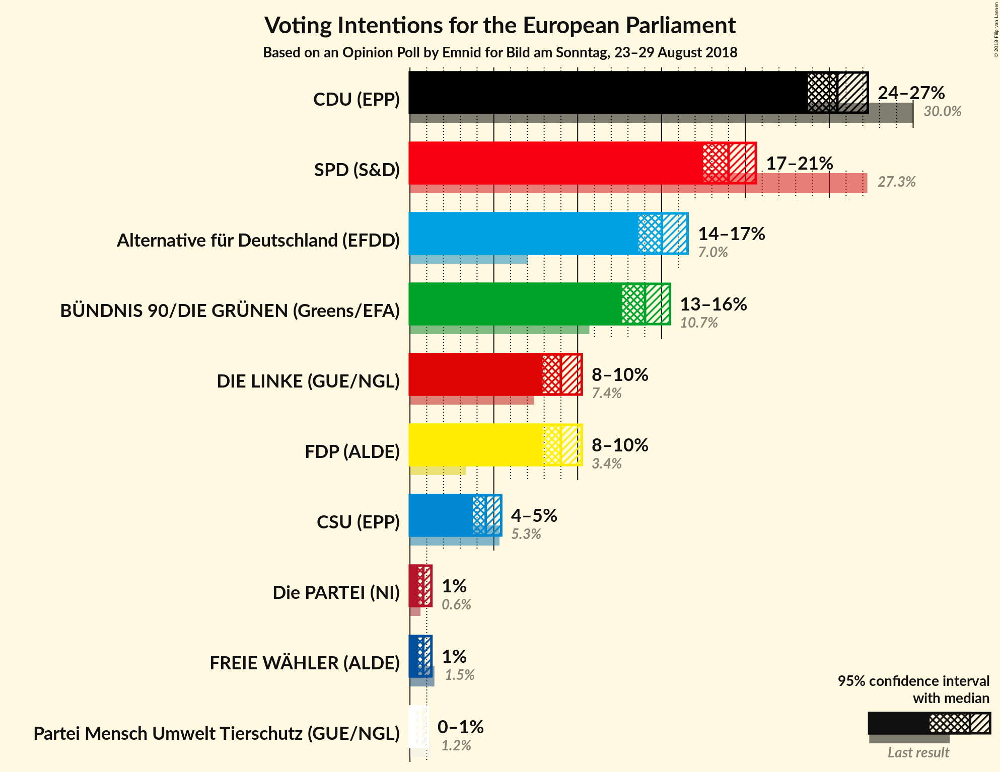
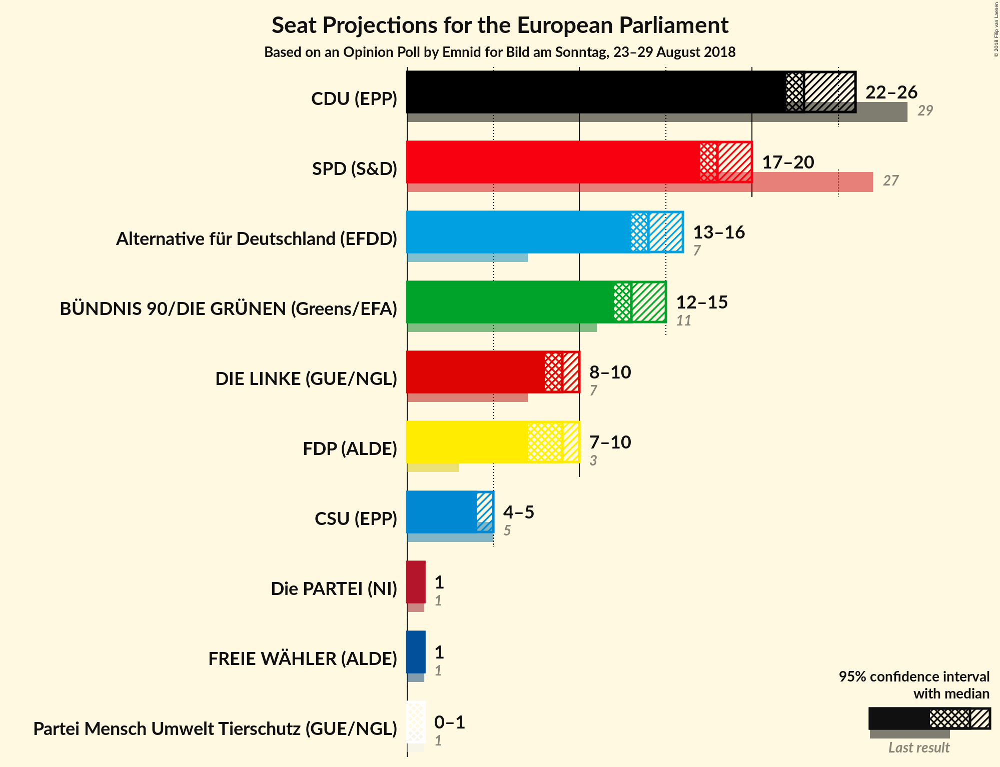
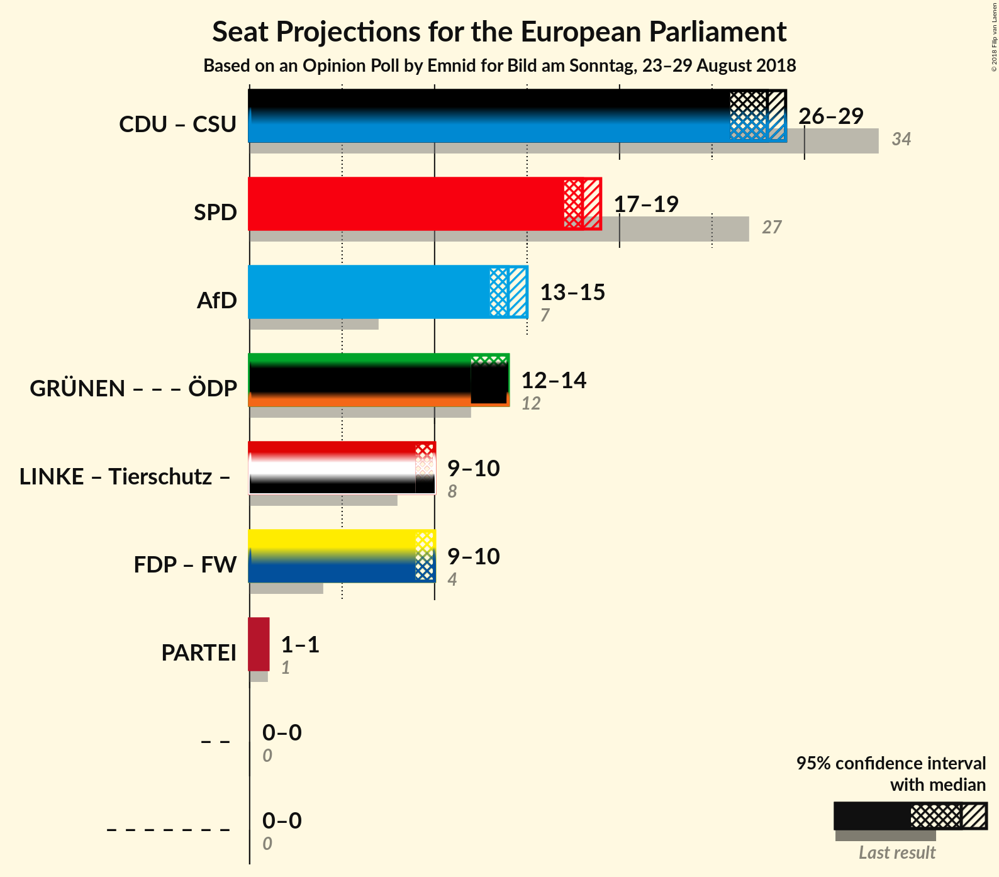

# Opinion Poll by Emnid for Bild am Sonntag, 23–29 August 2018

<a href="#voting-intentions">Voting Intentions</a> | <a href="#seats">Seats</a> | <a href="#coalitions">Coalitions</a> | <a href="#technical-information">Technical Information</a>

## Voting Intentions

### Confidence Intervals

| Party | Last Result | Poll Result | 80% Confidence Interval | 90% Confidence Interval | 95% Confidence Interval | 99% Confidence Interval |
|:-----:|:-----------:|:-----------:|:-----------------------:|:-----------------------:|:-----------------------:|:-----------------------:|
| CDU (EPP) | 30.0% | 25.5% | 24.3–26.7% |24.0–27.0% |23.7–27.3% |23.2–27.8% |
| SPD (S&D) | 27.3% | 19.0% | 18.0–20.1% |17.7–20.4% |17.5–20.6% |17.0–21.2% |
| Alternative für Deutschland (EFDD) | 7.0% | 15.0% | 14.1–16.0% |13.9–16.3% |13.6–16.6% |13.2–17.0% |
| BÜNDNIS 90/DIE GRÜNEN (Greens/EFA) | 10.7% | 14.0% | 13.1–15.0% |12.9–15.3% |12.7–15.5% |12.3–16.0% |
| FDP (ALDE) | 3.4% | 9.0% | 8.3–9.8% |8.0–10.0% |7.9–10.2% |7.5–10.6% |
| DIE LINKE (GUE/NGL) | 7.4% | 9.0% | 8.3–9.8% |8.0–10.0% |7.9–10.2% |7.5–10.6% |
| CSU (EPP) | 5.3% | 4.5% | 4.0–5.1% |3.8–5.3% |3.7–5.4% |3.5–5.8% |
| FREIE WÄHLER (ALDE) | 1.5% | 0.8% | 0.6–1.1% |0.5–1.2% |0.5–1.3% |0.4–1.4% |
| Die PARTEI (NI) | 0.6% | 0.8% | 0.6–1.1% |0.5–1.2% |0.5–1.3% |0.4–1.4% |
| Partei Mensch Umwelt Tierschutz (GUE/NGL) | 1.2% | 0.6% | 0.5–0.9% |0.4–1.0% |0.4–1.1% |0.3–1.2% |

*Note:* The poll result column reflects the actual value used in the calculations. Published results may vary slightly, and in addition be rounded to fewer digits.

## Seats

### Confidence Intervals

| Party | Last Result | Median | 80% Confidence Interval | 90% Confidence Interval | 95% Confidence Interval | 99% Confidence Interval |
|:-----:|:-----------:|:------:|:-----------------------:|:-----------------------:|:-----------------------:|:-----------------------:|
| <a href="#cdu-(epp)">CDU (EPP)</a> | 29 | N/A | N/A |N/A |N/A |N/A |
| <a href="#spd-(s&d)">SPD (S&D)</a> | 27 | N/A | N/A |N/A |N/A |N/A |
| <a href="#alternative-für-deutschland-(efdd)">Alternative für Deutschland (EFDD)</a> | 7 | N/A | N/A |N/A |N/A |N/A |
| <a href="#bündnis-90/die-grünen-(greens/efa)">BÜNDNIS 90/DIE GRÜNEN (Greens/EFA)</a> | 11 | N/A | N/A |N/A |N/A |N/A |
| <a href="#fdp-(alde)">FDP (ALDE)</a> | 3 | N/A | N/A |N/A |N/A |N/A |
| <a href="#die-linke-(gue/ngl)">DIE LINKE (GUE/NGL)</a> | 7 | N/A | N/A |N/A |N/A |N/A |
| <a href="#csu-(epp)">CSU (EPP)</a> | 5 | N/A | N/A |N/A |N/A |N/A |
| <a href="#freie-wähler-(alde)">FREIE WÄHLER (ALDE)</a> | 1 | N/A | N/A |N/A |N/A |N/A |
| <a href="#die-partei-(ni)">Die PARTEI (NI)</a> | 1 | N/A | N/A |N/A |N/A |N/A |
| <a href="#partei-mensch-umwelt-tierschutz-(gue/ngl)">Partei Mensch Umwelt Tierschutz (GUE/NGL)</a> | 1 | N/A | N/A |N/A |N/A |N/A |

## Coalitions

## Technical Information

### Opinion Poll

+ **Polling firm:** Emnid
+ **Commissioner(s):** Bild am Sonntag
+ **Fieldwork period:** 23–29 August 2018

### Calculations

+ **Sample size:** 2390
+ **Simulations done:** 0
+ **Error estimate:** 100.00%

