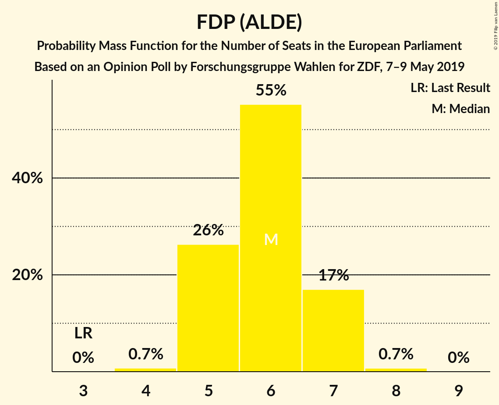
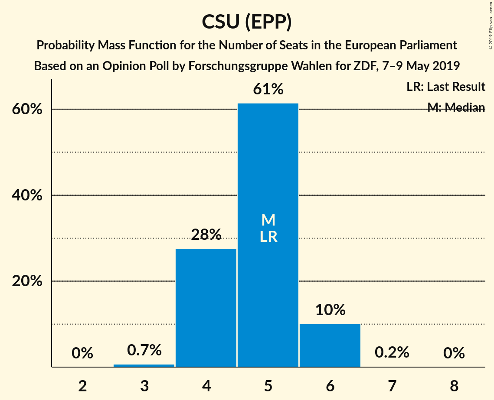
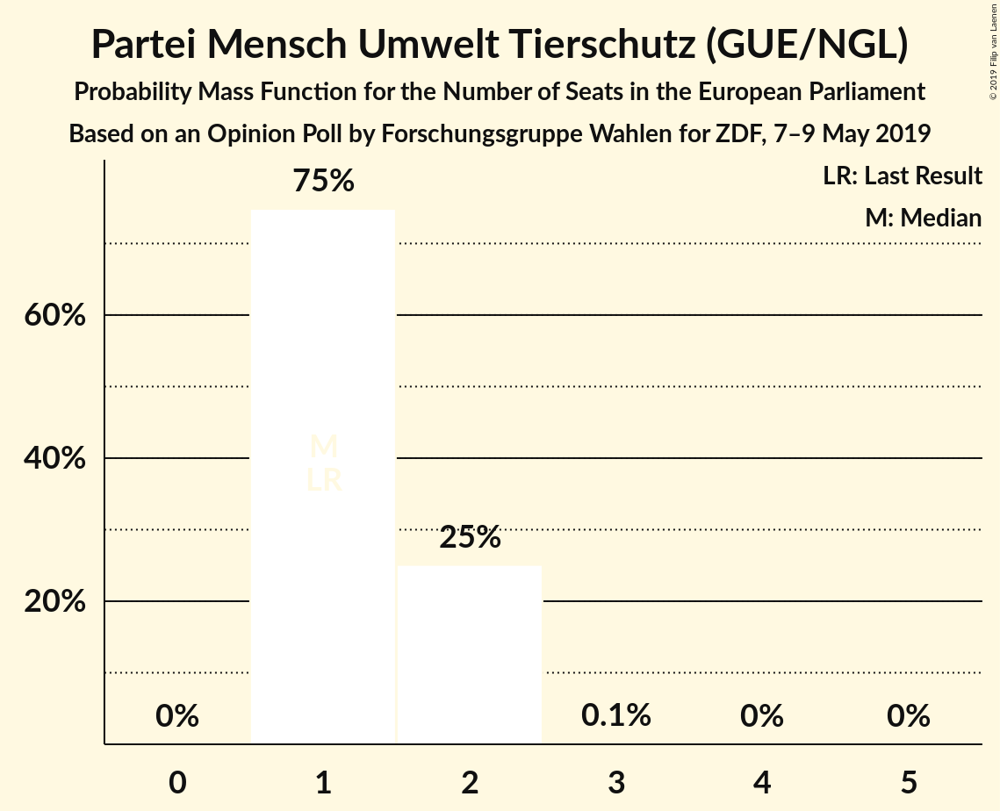
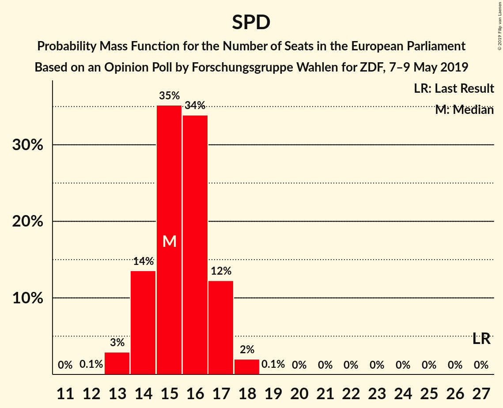
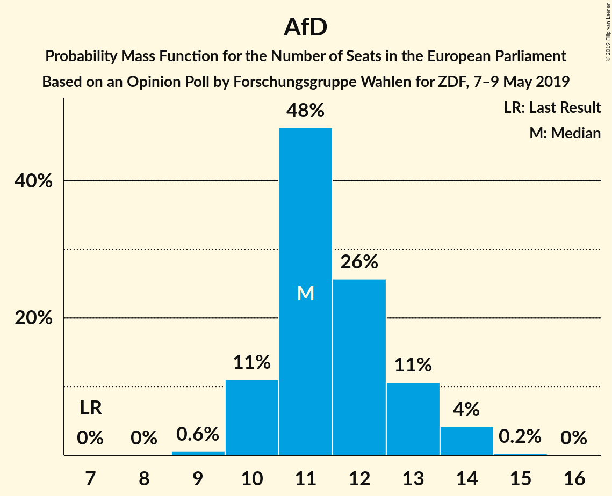
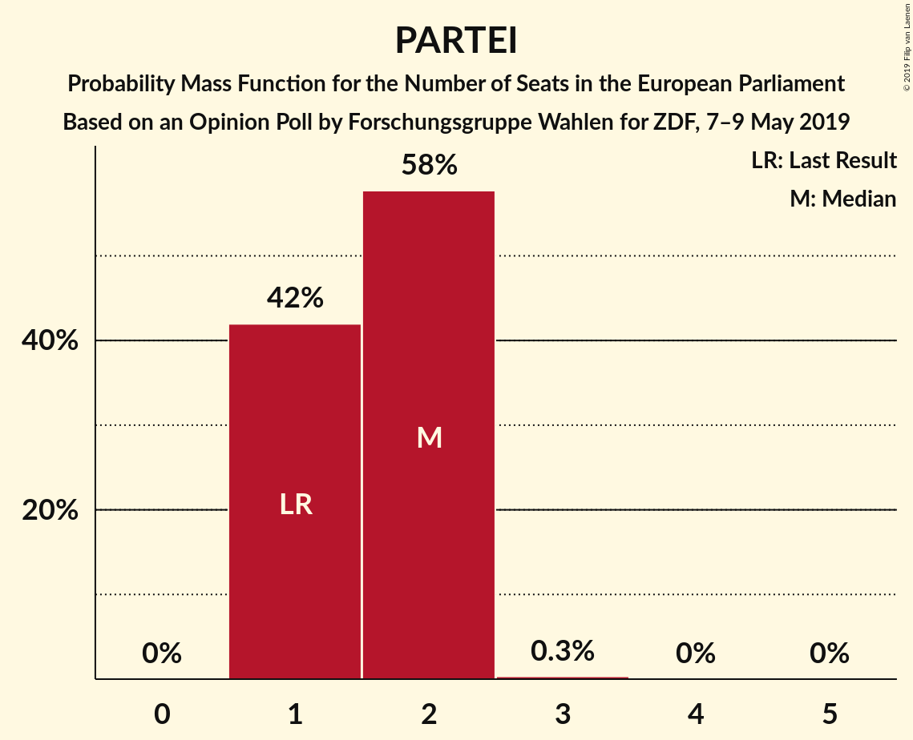

# Opinion Poll by Forschungsgruppe Wahlen for ZDF, 7–9 May 2019

<a href="#voting-intentions">Voting Intentions</a> | <a href="#seats">Seats</a> | <a href="#coalitions">Coalitions</a> | <a href="#technical-information">Technical Information</a>

## Voting Intentions

### Confidence Intervals

| Party | Last Result | Poll Result | 80% Confidence Interval | 90% Confidence Interval | 95% Confidence Interval | 99% Confidence Interval |
|:-----:|:-----------:|:-----------:|:-----------------------:|:-----------------------:|:-----------------------:|:-----------------------:|
| CDU (EPP) | 30.0% | 27.5% | 25.9–29.1% |25.5–29.6% |25.1–30.0% |24.3–30.8% |
| BÜNDNIS 90/DIE GRÜNEN (Greens/EFA) | 10.7% | 19.2% | 17.8–20.7% |17.5–21.1% |17.1–21.4% |16.5–22.2% |
| SPD (S&D) | 27.3% | 16.1% | 14.9–17.5% |14.5–17.9% |14.2–18.3% |13.6–18.9% |
| Alternative für Deutschland (EAPN) | 7.0% | 12.1% | 11.0–13.3% |10.7–13.7% |10.4–14.0% |9.9–14.6% |
| FDP (ALDE) | 3.4% | 6.1% | 5.3–7.0% |5.1–7.3% |4.9–7.5% |4.5–8.0% |
| DIE LINKE (GUE/NGL) | 7.4% | 6.1% | 5.3–7.0% |5.1–7.3% |4.9–7.5% |4.5–8.0% |
| CSU (EPP) | 5.3% | 4.9% | 4.2–5.8% |4.0–6.0% |3.9–6.2% |3.6–6.7% |
| FREIE WÄHLER (ALDE) | 1.5% | 1.6% | 1.3–2.2% |1.2–2.4% |1.1–2.5% |0.9–2.8% |
| Die PARTEI (NI) | 0.6% | 1.6% | 1.2–2.1% |1.1–2.3% |1.0–2.4% |0.9–2.7% |
| Partei Mensch Umwelt Tierschutz (GUE/NGL) | 1.2% | 1.3% | 1.0–1.8% |0.9–2.0% |0.8–2.1% |0.7–2.4% |

*Note:* The poll result column reflects the actual value used in the calculations. Published results may vary slightly, and in addition be rounded to fewer digits.

## Seats

### Confidence Intervals

| Party | Last Result | Median | 80% Confidence Interval | 90% Confidence Interval | 95% Confidence Interval | 99% Confidence Interval |
|:-----:|:-----------:|:------:|:-----------------------:|:-----------------------:|:-----------------------:|:-----------------------:|
| <a href="#cdu-(epp)">CDU (EPP)</a> | 29 | 24 | 24–29 |24–29 |24–29 |23–29 |
| <a href="#bündnis-90/die-grünen-(greens/efa)">BÜNDNIS 90/DIE GRÜNEN (Greens/EFA)</a> | 11 | 18 | 14–20 |14–20 |14–20 |14–21 |
| <a href="#spd-(s&d)">SPD (S&D)</a> | 27 | 16 | 15–19 |15–19 |14–19 |13–19 |
| <a href="#alternative-für-deutschland-(eapn)">Alternative für Deutschland (EAPN)</a> | 7 | 11 | 11–15 |8–15 |8–15 |8–15 |
| <a href="#fdp-(alde)">FDP (ALDE)</a> | 3 | 6 | 5–6 |5–6 |4–6 |3–9 |
| <a href="#die-linke-(gue/ngl)">DIE LINKE (GUE/NGL)</a> | 7 | 7 | 5–7 |5–7 |5–7 |4–7 |
| <a href="#csu-(epp)">CSU (EPP)</a> | 5 | 6 | 4–6 |4–7 |4–7 |4–7 |
| <a href="#freie-wähler-(alde)">FREIE WÄHLER (ALDE)</a> | 1 | 1 | 1–2 |1–2 |1–2 |1–2 |
| <a href="#die-partei-(ni)">Die PARTEI (NI)</a> | 1 | 1 | 1–2 |1–2 |1–2 |1–3 |
| <a href="#partei-mensch-umwelt-tierschutz-(gue/ngl)">Partei Mensch Umwelt Tierschutz (GUE/NGL)</a> | 1 | 1 | 1–3 |0–3 |0–3 |0–3 |

### CDU (EPP)

*For a full overview of the results for this party, see the [CDU (EPP)](party-cduepp.html) page.*

| Number of Seats | Probability | Accumulated | Special Marks |
|:---------------:|:-----------:|:-----------:|:-------------:|
| 22 | 0.3% | 100% |  |
| 23 | 0.7% | 99.7% |  |
| 24 | 52% | 99.0% | Median |
| 25 | 9% | 47% |  |
| 26 | 8% | 38% |  |
| 27 | 0.1% | 30% |  |
| 28 | 3% | 30% |  |
| 29 | 27% | 27% | Last Result |
| 30 | 0% | 0.1% |  |
| 31 | 0.1% | 0.1% |  |
| 32 | 0% | 0% |  |

### BÜNDNIS 90/DIE GRÜNEN (Greens/EFA)

*For a full overview of the results for this party, see the [BÜNDNIS 90/DIE GRÜNEN (Greens/EFA)](party-bündnis90diegrünengreensefa.html) page.*

| Number of Seats | Probability | Accumulated | Special Marks |
|:---------------:|:-----------:|:-----------:|:-------------:|
| 11 | 0% | 100% | Last Result |
| 12 | 0% | 100% |  |
| 13 | 0% | 100% |  |
| 14 | 11% | 100% |  |
| 15 | 16% | 89% |  |
| 16 | 1.1% | 73% |  |
| 17 | 1.0% | 72% |  |
| 18 | 50% | 71% | Median |
| 19 | 10% | 20% |  |
| 20 | 10% | 10% |  |
| 21 | 0.2% | 0.7% |  |
| 22 | 0.5% | 0.5% |  |
| 23 | 0% | 0% |  |

### SPD (S&D)

*For a full overview of the results for this party, see the [SPD (S&D)](party-spdsd.html) page.*

| Number of Seats | Probability | Accumulated | Special Marks |
|:---------------:|:-----------:|:-----------:|:-------------:|
| 13 | 1.1% | 100% |  |
| 14 | 2% | 98.9% |  |
| 15 | 18% | 97% |  |
| 16 | 51% | 79% | Median |
| 17 | 1.0% | 28% |  |
| 18 | 11% | 27% |  |
| 19 | 16% | 16% |  |
| 20 | 0% | 0% |  |
| 21 | 0% | 0% |  |
| 22 | 0% | 0% |  |
| 23 | 0% | 0% |  |
| 24 | 0% | 0% |  |
| 25 | 0% | 0% |  |
| 26 | 0% | 0% |  |
| 27 | 0% | 0% | Last Result |

### Alternative für Deutschland (EAPN)

*For a full overview of the results for this party, see the [Alternative für Deutschland (EAPN)](party-alternativefürdeutschlandeapn.html) page.*

| Number of Seats | Probability | Accumulated | Special Marks |
|:---------------:|:-----------:|:-----------:|:-------------:|
| 7 | 0% | 100% | Last Result |
| 8 | 7% | 100% |  |
| 9 | 0% | 93% |  |
| 10 | 0.1% | 93% |  |
| 11 | 78% | 93% | Median |
| 12 | 3% | 14% |  |
| 13 | 2% | 12% |  |
| 14 | 0% | 10% |  |
| 15 | 10% | 10% |  |
| 16 | 0% | 0% |  |

### FDP (ALDE)

*For a full overview of the results for this party, see the [FDP (ALDE)](party-fdpalde.html) page.*

| Number of Seats | Probability | Accumulated | Special Marks |
|:---------------:|:-----------:|:-----------:|:-------------:|
| 3 | 1.0% | 100% | Last Result |
| 4 | 2% | 99.0% |  |
| 5 | 38% | 97% |  |
| 6 | 58% | 60% | Median |
| 7 | 0.8% | 2% |  |
| 8 | 0% | 1.1% |  |
| 9 | 1.1% | 1.1% |  |
| 10 | 0% | 0% |  |

### DIE LINKE (GUE/NGL)

*For a full overview of the results for this party, see the [DIE LINKE (GUE/NGL)](party-dielinkeguengl.html) page.*

| Number of Seats | Probability | Accumulated | Special Marks |
|:---------------:|:-----------:|:-----------:|:-------------:|
| 4 | 1.0% | 100% |  |
| 5 | 28% | 99.0% |  |
| 6 | 20% | 71% |  |
| 7 | 51% | 51% | Last Result, Median |
| 8 | 0.1% | 0.1% |  |
| 9 | 0% | 0% |  |

### CSU (EPP)

*For a full overview of the results for this party, see the [CSU (EPP)](party-csuepp.html) page.*

| Number of Seats | Probability | Accumulated | Special Marks |
|:---------------:|:-----------:|:-----------:|:-------------:|
| 3 | 0.1% | 100% |  |
| 4 | 21% | 99.9% |  |
| 5 | 19% | 79% | Last Result |
| 6 | 52% | 60% | Median |
| 7 | 7% | 7% |  |
| 8 | 0% | 0% |  |

### FREIE WÄHLER (ALDE)

*For a full overview of the results for this party, see the [FREIE WÄHLER (ALDE)](party-freiewähleralde.html) page.*

| Number of Seats | Probability | Accumulated | Special Marks |
|:---------------:|:-----------:|:-----------:|:-------------:|
| 1 | 71% | 100% | Last Result, Median |
| 2 | 29% | 29% |  |
| 3 | 0.1% | 0.1% |  |
| 4 | 0% | 0% |  |

### Die PARTEI (NI)

*For a full overview of the results for this party, see the [Die PARTEI (NI)](party-dieparteini.html) page.*

| Number of Seats | Probability | Accumulated | Special Marks |
|:---------------:|:-----------:|:-----------:|:-------------:|
| 1 | 54% | 100% | Last Result, Median |
| 2 | 46% | 46% |  |
| 3 | 0.7% | 0.7% |  |
| 4 | 0% | 0% |  |

### Partei Mensch Umwelt Tierschutz (GUE/NGL)

*For a full overview of the results for this party, see the [Partei Mensch Umwelt Tierschutz (GUE/NGL)](party-parteimenschumwelttierschutzguengl.html) page.*

| Number of Seats | Probability | Accumulated | Special Marks |
|:---------------:|:-----------:|:-----------:|:-------------:|
| 0 | 8% | 100% |  |
| 1 | 47% | 92% | Last Result, Median |
| 2 | 3% | 46% |  |
| 3 | 42% | 42% |  |
| 4 | 0% | 0% |  |

## Coalitions

### Confidence Intervals

| Coalition | Last Result | Median | Majority? | 80% Confidence Interval | 90% Confidence Interval | 95% Confidence Interval | 99% Confidence Interval |
|:---------:|:-----------:|:------:|:---------:|:-----------------------:|:-----------------------:|:-----------------------:|:-----------------------:|
| CDU (EPP) – CSU (EPP) | 34 | 30 | 0% | 30–34 | 30–34 | 30–34 | 28–34 |
| SPD (S&D) | 27 | 16 | 0% | 15–19 | 15–19 | 14–19 | 13–19 |
| Alternative für Deutschland (EAPN) | 7 | 11 | 0% | 11–15 | 8–15 | 8–15 | 8–15 |
| FDP (ALDE) – FREIE WÄHLER (ALDE) | 4 | 7 | 0% | 6–8 | 6–8 | 6–8 | 4–10 |
| Die PARTEI (NI) | 1 | 1 | 0% | 1–2 | 1–2 | 1–2 | 1–3 |

### CDU (EPP) – CSU (EPP)

| Number of Seats | Probability | Accumulated | Special Marks |
|:---------------:|:-----------:|:-----------:|:-------------:|
| 26 | 0.2% | 100% |  |
| 27 | 0% | 99.8% |  |
| 28 | 0.7% | 99.8% |  |
| 29 | 0.1% | 99.1% |  |
| 30 | 62% | 99.0% | Median |
| 31 | 0% | 37% |  |
| 32 | 9% | 37% |  |
| 33 | 12% | 28% |  |
| 34 | 16% | 16% | Last Result |
| 35 | 0.1% | 0.1% |  |
| 36 | 0% | 0% |  |

### SPD (S&D)

| Number of Seats | Probability | Accumulated | Special Marks |
|:---------------:|:-----------:|:-----------:|:-------------:|
| 13 | 1.1% | 100% |  |
| 14 | 2% | 98.9% |  |
| 15 | 18% | 97% |  |
| 16 | 51% | 79% | Median |
| 17 | 1.0% | 28% |  |
| 18 | 11% | 27% |  |
| 19 | 16% | 16% |  |
| 20 | 0% | 0% |  |
| 21 | 0% | 0% |  |
| 22 | 0% | 0% |  |
| 23 | 0% | 0% |  |
| 24 | 0% | 0% |  |
| 25 | 0% | 0% |  |
| 26 | 0% | 0% |  |
| 27 | 0% | 0% | Last Result |

### Alternative für Deutschland (EAPN)

| Number of Seats | Probability | Accumulated | Special Marks |
|:---------------:|:-----------:|:-----------:|:-------------:|
| 7 | 0% | 100% | Last Result |
| 8 | 7% | 100% |  |
| 9 | 0% | 93% |  |
| 10 | 0.1% | 93% |  |
| 11 | 78% | 93% | Median |
| 12 | 3% | 14% |  |
| 13 | 2% | 12% |  |
| 14 | 0% | 10% |  |
| 15 | 10% | 10% |  |
| 16 | 0% | 0% |  |

### FDP (ALDE) – FREIE WÄHLER (ALDE)

| Number of Seats | Probability | Accumulated | Special Marks |
|:---------------:|:-----------:|:-----------:|:-------------:|
| 4 | 1.0% | 100% | Last Result |
| 5 | 0% | 99.0% |  |
| 6 | 27% | 99.0% |  |
| 7 | 54% | 72% | Median |
| 8 | 16% | 17% |  |
| 9 | 0.3% | 1.4% |  |
| 10 | 1.0% | 1.1% |  |
| 11 | 0.1% | 0.1% |  |
| 12 | 0% | 0% |  |

### Die PARTEI (NI)

| Number of Seats | Probability | Accumulated | Special Marks |
|:---------------:|:-----------:|:-----------:|:-------------:|
| 1 | 54% | 100% | Last Result, Median |
| 2 | 46% | 46% |  |
| 3 | 0.7% | 0.7% |  |
| 4 | 0% | 0% |  |

## Technical Information

### Opinion Poll

+ **Polling firm:** Forschungsgruppe Wahlen
+ **Commissioner(s):** ZDF
+ **Fieldwork period:** 7–9 May 2019

### Calculations

+ **Sample size:** 1282
+ **Simulations done:** 1,024
+ **Error estimate:** 6.10%

