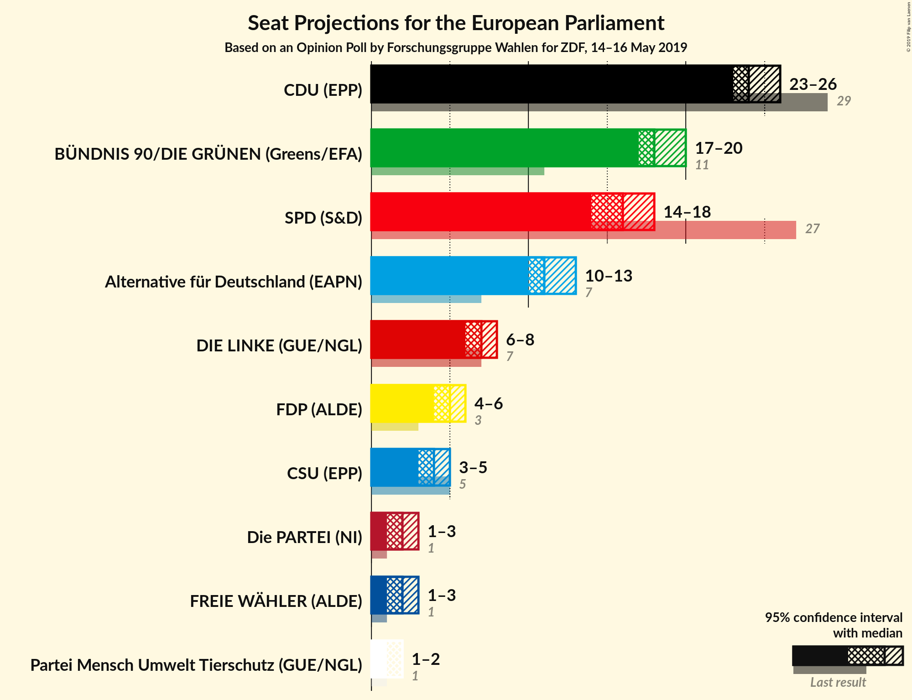
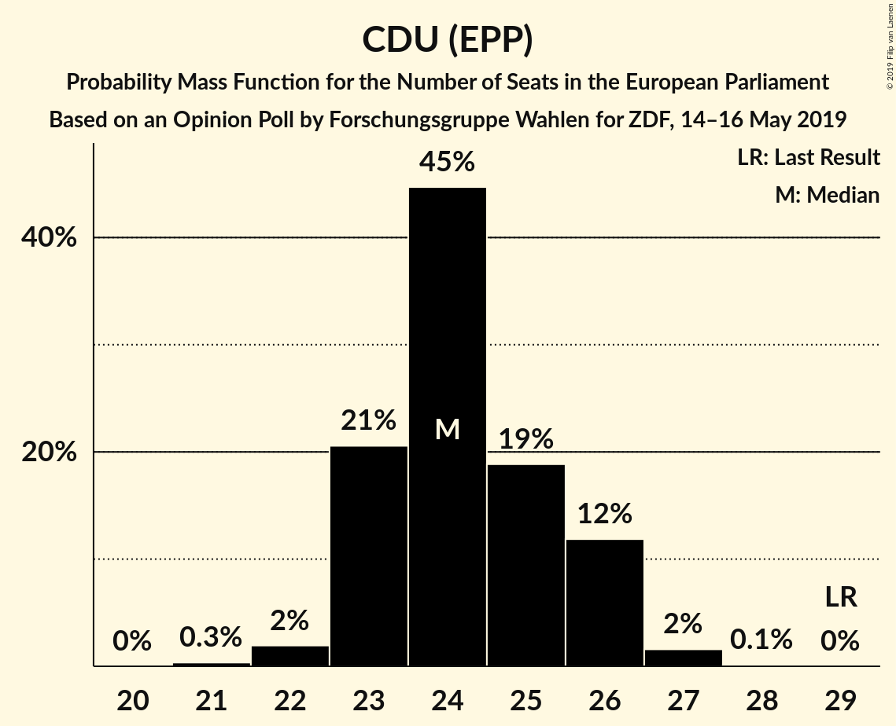
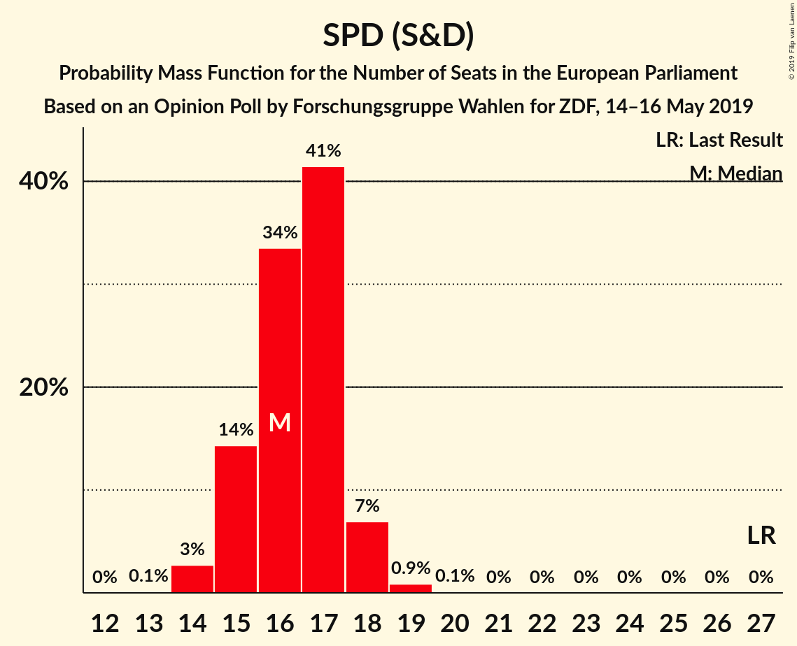
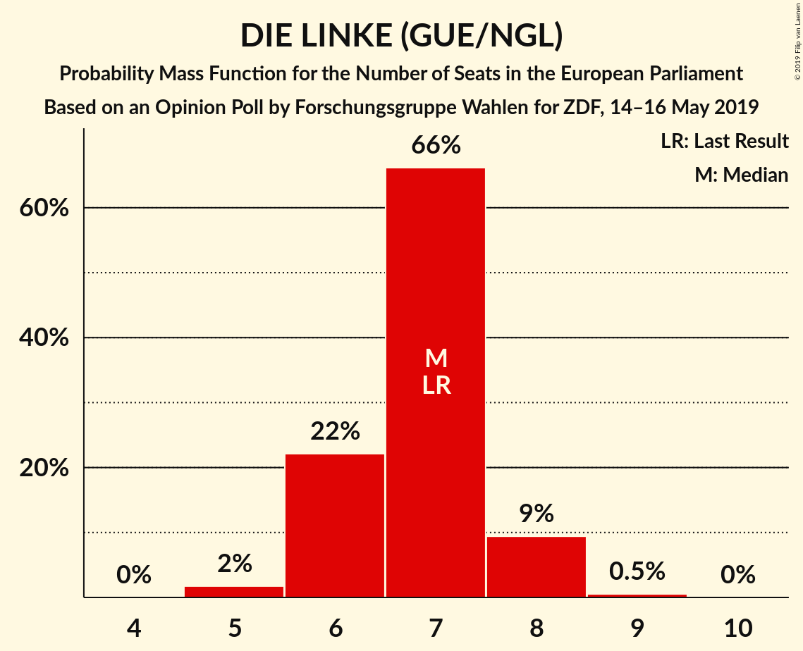
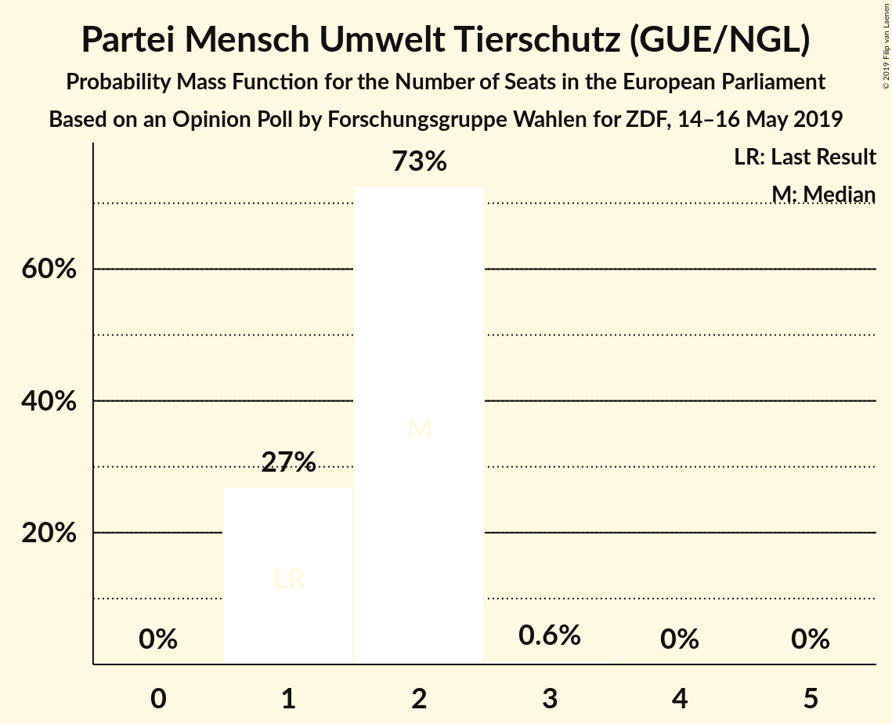
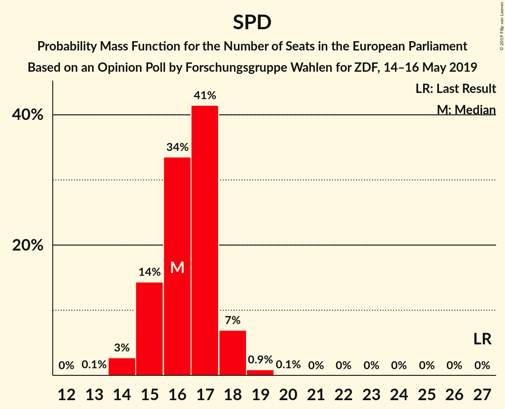
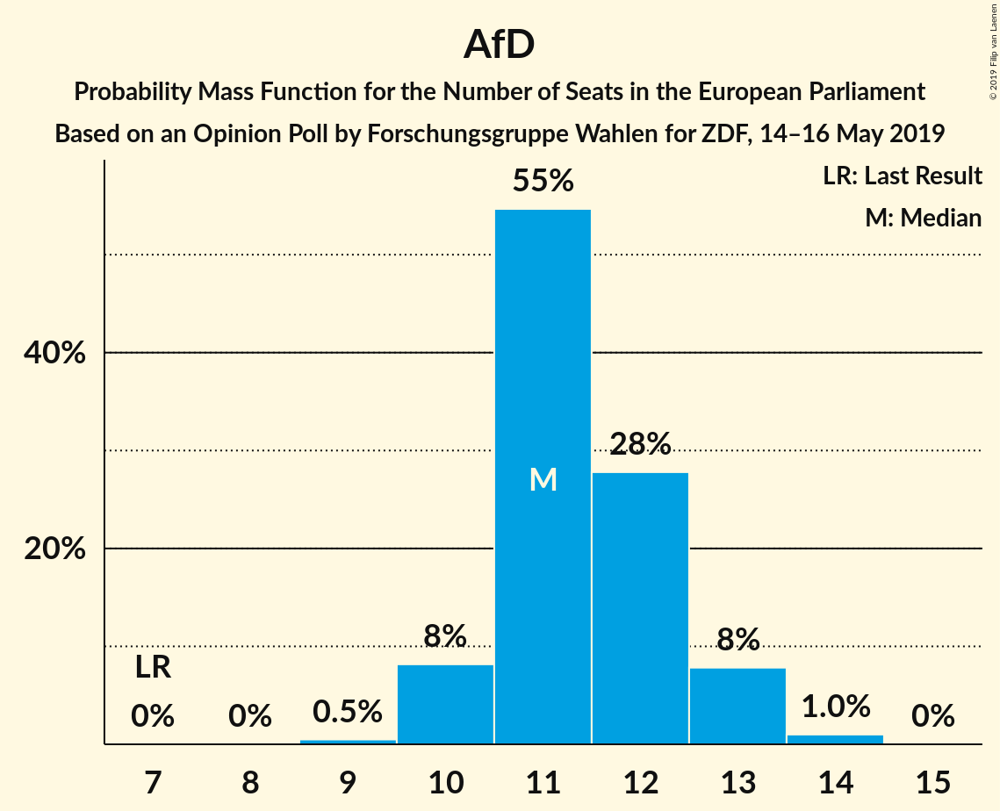
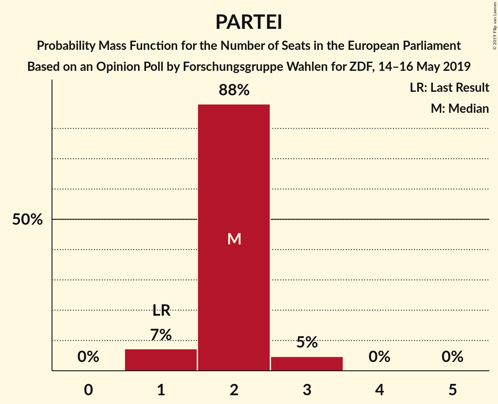

# Opinion Poll by Forschungsgruppe Wahlen for ZDF, 14–16 May 2019

<a href="#voting-intentions">Voting Intentions</a> | <a href="#seats">Seats</a> | <a href="#coalitions">Coalitions</a> | <a href="#technical-information">Technical Information</a>

## Voting Intentions

### Confidence Intervals

| Party | Last Result | Poll Result | 80% Confidence Interval | 90% Confidence Interval | 95% Confidence Interval | 99% Confidence Interval |
|:-----:|:-----------:|:-----------:|:-----------------------:|:-----------------------:|:-----------------------:|:-----------------------:|
| CDU (EPP) | 30.0% | 25.4% | 23.9–27.0% |23.5–27.5% |23.2–27.9% |22.5–28.6% |
| BÜNDNIS 90/DIE GRÜNEN (Greens/EFA) | 10.7% | 19.0% | 17.6–20.4% |17.3–20.8% |16.9–21.2% |16.3–21.9% |
| SPD (S&D) | 27.3% | 17.0% | 15.7–18.4% |15.3–18.8% |15.0–19.1% |14.4–19.8% |
| Alternative für Deutschland (EAPN) | 7.0% | 12.0% | 10.9–13.3% |10.6–13.6% |10.4–13.9% |9.9–14.5% |
| DIE LINKE (GUE/NGL) | 7.4% | 7.0% | 6.2–8.0% |5.9–8.3% |5.7–8.5% |5.4–9.0% |
| FDP (ALDE) | 3.4% | 5.0% | 4.3–5.9% |4.1–6.1% |4.0–6.4% |3.7–6.8% |
| CSU (EPP) | 5.3% | 4.6% | 3.9–5.4% |3.7–5.6% |3.6–5.9% |3.3–6.3% |
| FREIE WÄHLER (ALDE) | 1.5% | 2.0% | 1.6–2.6% |1.4–2.7% |1.4–2.9% |1.2–3.2% |
| Die PARTEI (NI) | 0.6% | 2.0% | 1.6–2.6% |1.4–2.7% |1.4–2.9% |1.2–3.2% |
| Partei Mensch Umwelt Tierschutz (GUE/NGL) | 1.2% | 1.6% | 1.2–2.1% |1.1–2.3% |1.1–2.4% |0.9–2.7% |

*Note:* The poll result column reflects the actual value used in the calculations. Published results may vary slightly, and in addition be rounded to fewer digits.

## Seats

### Confidence Intervals

| Party | Last Result | Median | 80% Confidence Interval | 90% Confidence Interval | 95% Confidence Interval | 99% Confidence Interval |
|:-----:|:-----------:|:------:|:-----------------------:|:-----------------------:|:-----------------------:|:-----------------------:|
| <a href="#cdu-(epp)">CDU (EPP)</a> | 29 | 22 | 22–23 |22–24 |22–24 |21–27 |
| <a href="#bündnis-90/die-grünen-(greens/efa)">BÜNDNIS 90/DIE GRÜNEN (Greens/EFA)</a> | 11 | 19 | 19 |19–20 |18–20 |16–20 |
| <a href="#spd-(s&d)">SPD (S&D)</a> | 27 | 15 | 15 |13–16 |13–16 |13–18 |
| <a href="#alternative-für-deutschland-(eapn)">Alternative für Deutschland (EAPN)</a> | 7 | 12 | 10–12 |10–12 |10–12 |10–14 |
| <a href="#die-linke-(gue/ngl)">DIE LINKE (GUE/NGL)</a> | 7 | 7 | 7–9 |7–9 |7–9 |6–9 |
| <a href="#fdp-(alde)">FDP (ALDE)</a> | 3 | 7 | 6–7 |4–7 |4–7 |4–7 |
| <a href="#csu-(epp)">CSU (EPP)</a> | 5 | 4 | 4 |4–5 |4–5 |3–6 |
| <a href="#freie-wähler-(alde)">FREIE WÄHLER (ALDE)</a> | 1 | 1 | 1–2 |1–2 |1–2 |1–2 |
| <a href="#die-partei-(ni)">Die PARTEI (NI)</a> | 1 | 3 | 2–3 |2–3 |2–3 |1–3 |
| <a href="#partei-mensch-umwelt-tierschutz-(gue/ngl)">Partei Mensch Umwelt Tierschutz (GUE/NGL)</a> | 1 | 2 | 2 |1–2 |1–2 |1–2 |

### CDU (EPP)

*For a full overview of the results for this party, see the [CDU (EPP)](party-cduepp.html) page.*

| Number of Seats | Probability | Accumulated | Special Marks |
|:---------------:|:-----------:|:-----------:|:-------------:|
| 20 | 0.1% | 100% |  |
| 21 | 0.7% | 99.9% |  |
| 22 | 83% | 99.3% | Median |
| 23 | 9% | 16% |  |
| 24 | 5% | 7% |  |
| 25 | 0.2% | 1.5% |  |
| 26 | 0.1% | 1.3% |  |
| 27 | 1.1% | 1.1% |  |
| 28 | 0% | 0% |  |
| 29 | 0% | 0% | Last Result |

### BÜNDNIS 90/DIE GRÜNEN (Greens/EFA)

*For a full overview of the results for this party, see the [BÜNDNIS 90/DIE GRÜNEN (Greens/EFA)](party-bündnis90diegrünengreensefa.html) page.*

| Number of Seats | Probability | Accumulated | Special Marks |
|:---------------:|:-----------:|:-----------:|:-------------:|
| 11 | 0% | 100% | Last Result |
| 12 | 0% | 100% |  |
| 13 | 0% | 100% |  |
| 14 | 0.1% | 100% |  |
| 15 | 0% | 99.9% |  |
| 16 | 1.2% | 99.9% |  |
| 17 | 0.1% | 98.6% |  |
| 18 | 1.4% | 98.5% |  |
| 19 | 91% | 97% | Median |
| 20 | 6% | 6% |  |
| 21 | 0.1% | 0.1% |  |
| 22 | 0% | 0% |  |

### SPD (S&D)

*For a full overview of the results for this party, see the [SPD (S&D)](party-spdsd.html) page.*

| Number of Seats | Probability | Accumulated | Special Marks |
|:---------------:|:-----------:|:-----------:|:-------------:|
| 13 | 6% | 100% |  |
| 14 | 0% | 94% |  |
| 15 | 85% | 94% | Median |
| 16 | 9% | 10% |  |
| 17 | 0.1% | 1.2% |  |
| 18 | 1.0% | 1.1% |  |
| 19 | 0% | 0% |  |
| 20 | 0% | 0% |  |
| 21 | 0% | 0% |  |
| 22 | 0% | 0% |  |
| 23 | 0% | 0% |  |
| 24 | 0% | 0% |  |
| 25 | 0% | 0% |  |
| 26 | 0% | 0% |  |
| 27 | 0% | 0% | Last Result |

### Alternative für Deutschland (EAPN)

*For a full overview of the results for this party, see the [Alternative für Deutschland (EAPN)](party-alternativefürdeutschlandeapn.html) page.*

| Number of Seats | Probability | Accumulated | Special Marks |
|:---------------:|:-----------:|:-----------:|:-------------:|
| 7 | 0% | 100% | Last Result |
| 8 | 0% | 100% |  |
| 9 | 0% | 100% |  |
| 10 | 13% | 100% |  |
| 11 | 1.2% | 87% |  |
| 12 | 85% | 86% | Median |
| 13 | 0% | 1.4% |  |
| 14 | 1.4% | 1.4% |  |
| 15 | 0% | 0% |  |

### DIE LINKE (GUE/NGL)

*For a full overview of the results for this party, see the [DIE LINKE (GUE/NGL)](party-dielinkeguengl.html) page.*

| Number of Seats | Probability | Accumulated | Special Marks |
|:---------------:|:-----------:|:-----------:|:-------------:|
| 5 | 0.2% | 100% |  |
| 6 | 0.9% | 99.8% |  |
| 7 | 85% | 98.9% | Last Result, Median |
| 8 | 1.4% | 14% |  |
| 9 | 13% | 13% |  |
| 10 | 0% | 0% |  |

### FDP (ALDE)

*For a full overview of the results for this party, see the [FDP (ALDE)](party-fdpalde.html) page.*

| Number of Seats | Probability | Accumulated | Special Marks |
|:---------------:|:-----------:|:-----------:|:-------------:|
| 3 | 0.2% | 100% | Last Result |
| 4 | 7% | 99.8% |  |
| 5 | 0.5% | 93% |  |
| 6 | 8% | 92% |  |
| 7 | 84% | 84% | Median |
| 8 | 0% | 0% |  |

### CSU (EPP)

*For a full overview of the results for this party, see the [CSU (EPP)](party-csuepp.html) page.*

| Number of Seats | Probability | Accumulated | Special Marks |
|:---------------:|:-----------:|:-----------:|:-------------:|
| 3 | 2% | 100% |  |
| 4 | 91% | 98% | Median |
| 5 | 6% | 6% | Last Result |
| 6 | 0.7% | 0.7% |  |
| 7 | 0% | 0% |  |

### FREIE WÄHLER (ALDE)

*For a full overview of the results for this party, see the [FREIE WÄHLER (ALDE)](party-freiewähleralde.html) page.*

| Number of Seats | Probability | Accumulated | Special Marks |
|:---------------:|:-----------:|:-----------:|:-------------:|
| 1 | 85% | 100% | Last Result, Median |
| 2 | 14% | 15% |  |
| 3 | 0.3% | 0.3% |  |
| 4 | 0% | 0% |  |

### Die PARTEI (NI)

*For a full overview of the results for this party, see the [Die PARTEI (NI)](party-dieparteini.html) page.*

| Number of Seats | Probability | Accumulated | Special Marks |
|:---------------:|:-----------:|:-----------:|:-------------:|
| 1 | 2% | 100% | Last Result |
| 2 | 15% | 98% |  |
| 3 | 84% | 84% | Median |
| 4 | 0% | 0% |  |

### Partei Mensch Umwelt Tierschutz (GUE/NGL)

*For a full overview of the results for this party, see the [Partei Mensch Umwelt Tierschutz (GUE/NGL)](party-parteimenschumwelttierschutzguengl.html) page.*

| Number of Seats | Probability | Accumulated | Special Marks |
|:---------------:|:-----------:|:-----------:|:-------------:|
| 1 | 8% | 100% | Last Result |
| 2 | 92% | 92% | Median |
| 3 | 0% | 0% |  |

## Coalitions

### Confidence Intervals

| Coalition | Last Result | Median | Majority? | 80% Confidence Interval | 90% Confidence Interval | 95% Confidence Interval | 99% Confidence Interval |
|:---------:|:-----------:|:------:|:---------:|:-----------------------:|:-----------------------:|:-----------------------:|:-----------------------:|
| CDU (EPP) – CSU (EPP) | 34 | 26 | 0% | 26–27 | 26–29 | 26–29 | 26–30 |
| SPD (S&D) | 27 | 15 | 0% | 15 | 13–16 | 13–16 | 13–18 |
| Alternative für Deutschland (EAPN) | 7 | 12 | 0% | 10–12 | 10–12 | 10–12 | 10–14 |
| FDP (ALDE) – FREIE WÄHLER (ALDE) | 4 | 8 | 0% | 8 | 6–8 | 6–8 | 5–9 |
| Die PARTEI (NI) | 1 | 3 | 0% | 2–3 | 2–3 | 2–3 | 1–3 |

### CDU (EPP) – CSU (EPP)

| Number of Seats | Probability | Accumulated | Special Marks |
|:---------------:|:-----------:|:-----------:|:-------------:|
| 24 | 0.1% | 100% |  |
| 25 | 0% | 99.9% |  |
| 26 | 85% | 99.9% | Median |
| 27 | 8% | 15% |  |
| 28 | 0.4% | 7% |  |
| 29 | 5% | 7% |  |
| 30 | 1.0% | 1.3% |  |
| 31 | 0.3% | 0.3% |  |
| 32 | 0% | 0% |  |
| 33 | 0% | 0% |  |
| 34 | 0% | 0% | Last Result |

### SPD (S&D)

| Number of Seats | Probability | Accumulated | Special Marks |
|:---------------:|:-----------:|:-----------:|:-------------:|
| 13 | 6% | 100% |  |
| 14 | 0% | 94% |  |
| 15 | 85% | 94% | Median |
| 16 | 9% | 10% |  |
| 17 | 0.1% | 1.2% |  |
| 18 | 1.0% | 1.1% |  |
| 19 | 0% | 0% |  |
| 20 | 0% | 0% |  |
| 21 | 0% | 0% |  |
| 22 | 0% | 0% |  |
| 23 | 0% | 0% |  |
| 24 | 0% | 0% |  |
| 25 | 0% | 0% |  |
| 26 | 0% | 0% |  |
| 27 | 0% | 0% | Last Result |

### Alternative für Deutschland (EAPN)

| Number of Seats | Probability | Accumulated | Special Marks |
|:---------------:|:-----------:|:-----------:|:-------------:|
| 7 | 0% | 100% | Last Result |
| 8 | 0% | 100% |  |
| 9 | 0% | 100% |  |
| 10 | 13% | 100% |  |
| 11 | 1.2% | 87% |  |
| 12 | 85% | 86% | Median |
| 13 | 0% | 1.4% |  |
| 14 | 1.4% | 1.4% |  |
| 15 | 0% | 0% |  |

### FDP (ALDE) – FREIE WÄHLER (ALDE)

| Number of Seats | Probability | Accumulated | Special Marks |
|:---------------:|:-----------:|:-----------:|:-------------:|
| 4 | 0% | 100% | Last Result |
| 5 | 1.4% | 100% |  |
| 6 | 6% | 98.6% |  |
| 7 | 0.2% | 92% |  |
| 8 | 91% | 92% | Median |
| 9 | 1.0% | 1.0% |  |
| 10 | 0% | 0% |  |

### Die PARTEI (NI)

| Number of Seats | Probability | Accumulated | Special Marks |
|:---------------:|:-----------:|:-----------:|:-------------:|
| 1 | 2% | 100% | Last Result |
| 2 | 15% | 98% |  |
| 3 | 84% | 84% | Median |
| 4 | 0% | 0% |  |

## Technical Information

### Opinion Poll

+ **Polling firm:** Forschungsgruppe Wahlen
+ **Commissioner(s):** ZDF
+ **Fieldwork period:** 14–16 May 2019

### Calculations

+ **Sample size:** 1313
+ **Simulations done:** 1,024
+ **Error estimate:** 3.40%

