# Opinion Poll by Kantar for Bild am Sonntag, 23–28 May 2019

<a href="#voting-intentions">Voting Intentions</a> | <a href="#seats">Seats</a> | <a href="#coalitions">Coalitions</a> | <a href="#technical-information">Technical Information</a>

## Voting Intentions

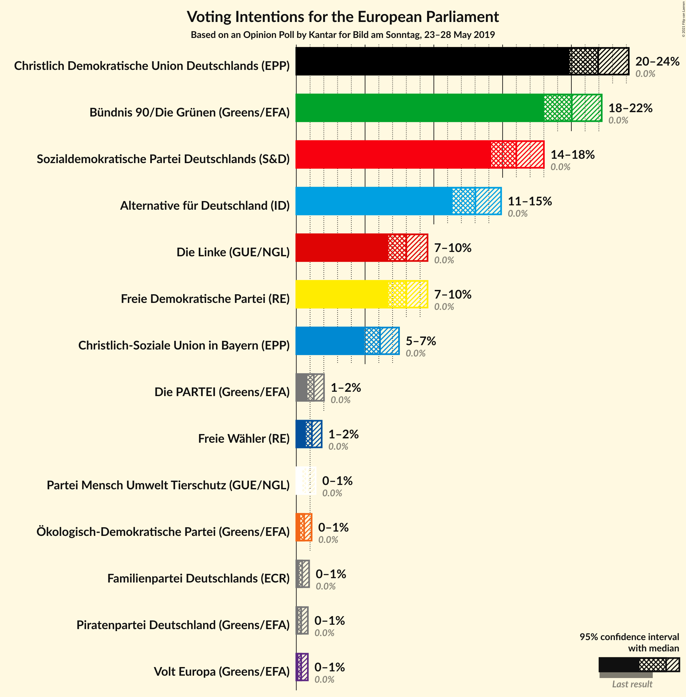

### Confidence Intervals

| Party | Last Result | Poll Result | 80% Confidence Interval | 90% Confidence Interval | 95% Confidence Interval | 99% Confidence Interval |
|:-----:|:-----------:|:-----------:|:-----------------------:|:-----------------------:|:-----------------------:|:-----------------------:|
| Christlich Demokratische Union Deutschlands (EPP) | 0.0% | 21.9% | 20.6–23.4% |20.2–23.8% |19.9–24.2% |19.2–24.9% |
| Bündnis 90/Die Grünen (Greens/EFA) | 0.0% | 20.0% | 18.7–21.4% |18.3–21.9% |18.0–22.2% |17.4–22.9% |
| Sozialdemokratische Partei Deutschlands (S&D) | 0.0% | 16.0% | 14.8–17.3% |14.5–17.7% |14.2–18.0% |13.6–18.7% |
| Alternative für Deutschland (ID) | 0.0% | 13.0% | 11.9–14.2% |11.6–14.6% |11.4–14.9% |10.9–15.5% |
| Freie Demokratische Partei (RE) | 0.0% | 8.0% | 7.1–9.0% |6.9–9.3% |6.7–9.5% |6.3–10.0% |
| Die Linke (GUE/NGL) | 0.0% | 8.0% | 7.1–9.0% |6.9–9.3% |6.7–9.5% |6.3–10.0% |
| Christlich-Soziale Union in Bayern (EPP) | 0.0% | 6.1% | 5.3–7.0% |5.1–7.2% |5.0–7.5% |4.6–7.9% |
| Die PARTEI (Greens/EFA) | 0.0% | 1.3% | 1.0–1.8% |0.9–1.9% |0.8–2.0% |0.7–2.3% |
| Freie Wähler (RE) | 0.0% | 1.1% | 0.8–1.6% |0.8–1.7% |0.7–1.8% |0.6–2.1% |
| Partei Mensch Umwelt Tierschutz (GUE/NGL) | 0.0% | 0.8% | 0.5–1.2% |0.5–1.3% |0.4–1.4% |0.3–1.6% |
| Ökologisch-Demokratische Partei (Greens/EFA) | 0.0% | 0.6% | 0.4–0.9% |0.3–1.0% |0.3–1.1% |0.2–1.3% |
| Familienpartei Deutschlands (ECR) | 0.0% | 0.4% | 0.3–0.7% |0.2–0.8% |0.2–0.9% |0.1–1.1% |
| Piratenpartei Deutschland (Greens/EFA) | 0.0% | 0.4% | 0.2–0.7% |0.2–0.7% |0.2–0.8% |0.1–1.0% |
| Volt Europa (Greens/EFA) | 0.0% | 0.4% | 0.2–0.7% |0.2–0.7% |0.2–0.8% |0.1–1.0% |

*Note:* The poll result column reflects the actual value used in the calculations. Published results may vary slightly, and in addition be rounded to fewer digits.

## Seats

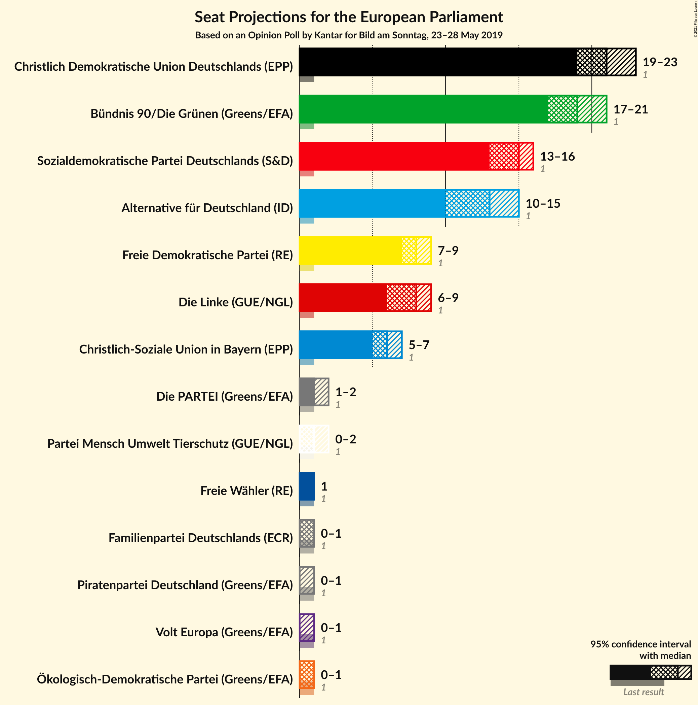

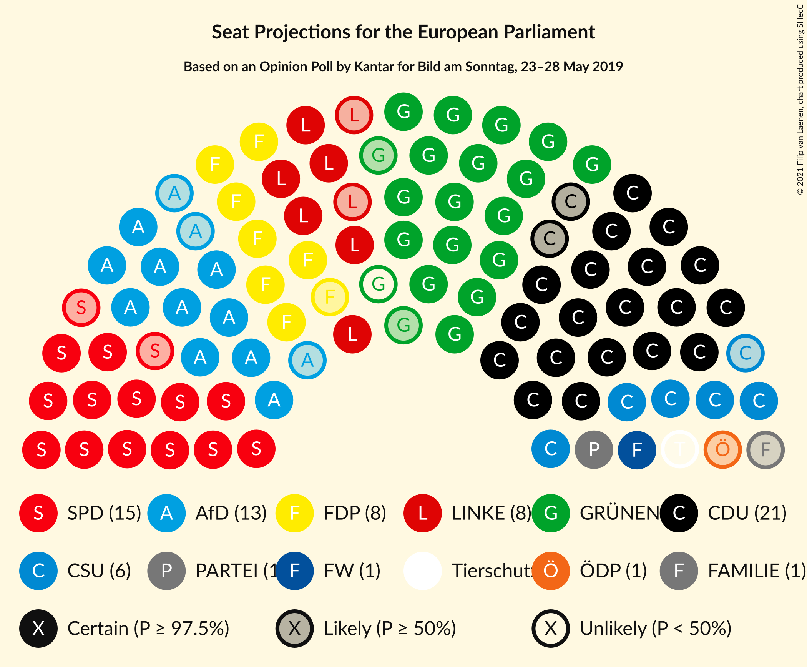

### Confidence Intervals

| Party | Last Result | Median | 80% Confidence Interval | 90% Confidence Interval | 95% Confidence Interval | 99% Confidence Interval |
|:-----:|:-----------:|:------:|:-----------------------:|:-----------------------:|:-----------------------:|:-----------------------:|
| <a href="#christlich-demokratische-union-deutschlands-(epp)">Christlich Demokratische Union Deutschlands (EPP)</a> | 1 | 21 | 19–23 |19–23 |19–23 |18–24 |
| <a href="#bündnis-90/die-grünen-(greens/efa)">Bündnis 90/Die Grünen (Greens/EFA)</a> | 1 | 19 | 17–20 |17–20 |17–21 |17–21 |
| <a href="#sozialdemokratische-partei-deutschlands-(s&d)">Sozialdemokratische Partei Deutschlands (S&D)</a> | 1 | 15 | 13–16 |13–16 |13–16 |13–17 |
| <a href="#alternative-für-deutschland-(id)">Alternative für Deutschland (ID)</a> | 1 | 13 | 11–14 |10–15 |10–15 |10–15 |
| <a href="#freie-demokratische-partei-(re)">Freie Demokratische Partei (RE)</a> | 1 | 8 | 7–8 |7–9 |7–9 |6–9 |
| <a href="#die-linke-(gue/ngl)">Die Linke (GUE/NGL)</a> | 1 | 8 | 6–9 |6–9 |6–9 |6–9 |
| <a href="#christlich-soziale-union-in-bayern-(epp)">Christlich-Soziale Union in Bayern (EPP)</a> | 1 | 6 | 5–7 |5–7 |5–7 |5–7 |
| <a href="#die-partei-(greens/efa)">Die PARTEI (Greens/EFA)</a> | 1 | 1 | 1–2 |1–2 |1–2 |1–2 |
| <a href="#freie-wähler-(re)">Freie Wähler (RE)</a> | 1 | 1 | 1 |1 |1 |1–2 |
| <a href="#partei-mensch-umwelt-tierschutz-(gue/ngl)">Partei Mensch Umwelt Tierschutz (GUE/NGL)</a> | 1 | 1 | 0–1 |0–1 |0–2 |0–2 |
| <a href="#ökologisch-demokratische-partei-(greens/efa)">Ökologisch-Demokratische Partei (Greens/EFA)</a> | 1 | 1 | 0–1 |0–1 |0–1 |0–1 |
| <a href="#familienpartei-deutschlands-(ecr)">Familienpartei Deutschlands (ECR)</a> | 1 | 1 | 0–1 |0–1 |0–1 |0–1 |
| <a href="#piratenpartei-deutschland-(greens/efa)">Piratenpartei Deutschland (Greens/EFA)</a> | 1 | 0 | 0–1 |0–1 |0–1 |0–1 |
| <a href="#volt-europa-(greens/efa)">Volt Europa (Greens/EFA)</a> | 1 | 0 | 0–1 |0–1 |0–1 |0–1 |

### Christlich Demokratische Union Deutschlands (EPP)

*For a full overview of the results for this party, see the [Christlich Demokratische Union Deutschlands (EPP)](party-christlichdemokratischeuniondeutschlandsepp.html) page.*

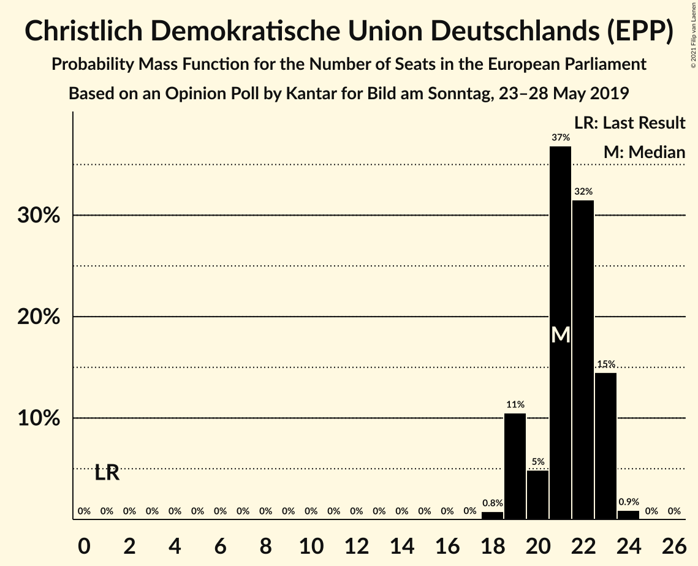

| Number of Seats | Probability | Accumulated | Special Marks |
|:---------------:|:-----------:|:-----------:|:-------------:|
| 1 | 0% | 100% | Last Result |
| 2 | 0% | 100% |  |
| 3 | 0% | 100% |  |
| 4 | 0% | 100% |  |
| 5 | 0% | 100% |  |
| 6 | 0% | 100% |  |
| 7 | 0% | 100% |  |
| 8 | 0% | 100% |  |
| 9 | 0% | 100% |  |
| 10 | 0% | 100% |  |
| 11 | 0% | 100% |  |
| 12 | 0% | 100% |  |
| 13 | 0% | 100% |  |
| 14 | 0% | 100% |  |
| 15 | 0% | 100% |  |
| 16 | 0% | 100% |  |
| 17 | 0% | 100% |  |
| 18 | 0.8% | 100% |  |
| 19 | 11% | 99.2% |  |
| 20 | 5% | 89% |  |
| 21 | 37% | 84% | Median |
| 22 | 32% | 47% |  |
| 23 | 15% | 15% |  |
| 24 | 0.9% | 0.9% |  |
| 25 | 0% | 0% |  |

### Bündnis 90/Die Grünen (Greens/EFA)

*For a full overview of the results for this party, see the [Bündnis 90/Die Grünen (Greens/EFA)](party-bündnis90diegrünengreensefa.html) page.*

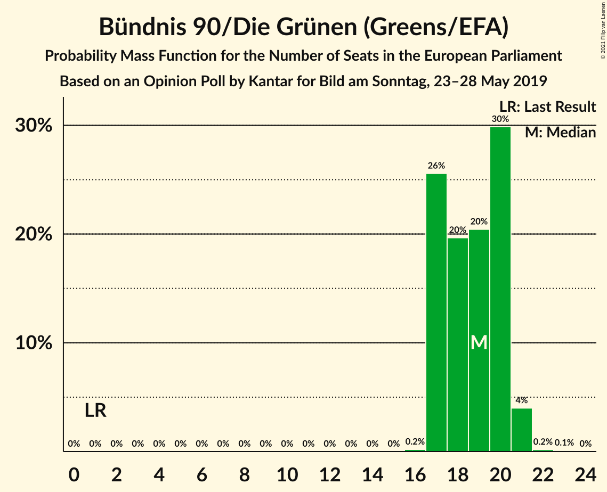

| Number of Seats | Probability | Accumulated | Special Marks |
|:---------------:|:-----------:|:-----------:|:-------------:|
| 1 | 0% | 100% | Last Result |
| 2 | 0% | 100% |  |
| 3 | 0% | 100% |  |
| 4 | 0% | 100% |  |
| 5 | 0% | 100% |  |
| 6 | 0% | 100% |  |
| 7 | 0% | 100% |  |
| 8 | 0% | 100% |  |
| 9 | 0% | 100% |  |
| 10 | 0% | 100% |  |
| 11 | 0% | 100% |  |
| 12 | 0% | 100% |  |
| 13 | 0% | 100% |  |
| 14 | 0% | 100% |  |
| 15 | 0% | 100% |  |
| 16 | 0.2% | 100% |  |
| 17 | 26% | 99.8% |  |
| 18 | 20% | 74% |  |
| 19 | 20% | 55% | Median |
| 20 | 30% | 34% |  |
| 21 | 4% | 4% |  |
| 22 | 0.2% | 0.3% |  |
| 23 | 0.1% | 0.1% |  |
| 24 | 0% | 0% |  |

### Sozialdemokratische Partei Deutschlands (S&D)

*For a full overview of the results for this party, see the [Sozialdemokratische Partei Deutschlands (S&D)](party-sozialdemokratischeparteideutschlandssd.html) page.*

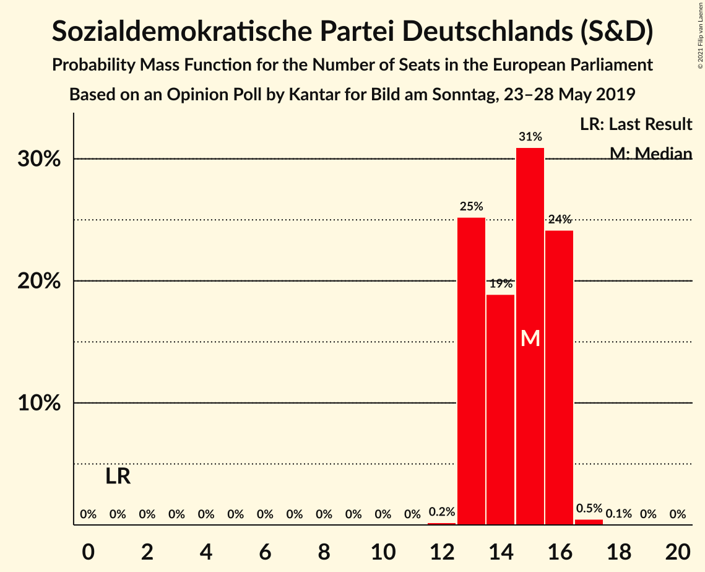

| Number of Seats | Probability | Accumulated | Special Marks |
|:---------------:|:-----------:|:-----------:|:-------------:|
| 1 | 0% | 100% | Last Result |
| 2 | 0% | 100% |  |
| 3 | 0% | 100% |  |
| 4 | 0% | 100% |  |
| 5 | 0% | 100% |  |
| 6 | 0% | 100% |  |
| 7 | 0% | 100% |  |
| 8 | 0% | 100% |  |
| 9 | 0% | 100% |  |
| 10 | 0% | 100% |  |
| 11 | 0% | 100% |  |
| 12 | 0.2% | 100% |  |
| 13 | 25% | 99.8% |  |
| 14 | 19% | 75% |  |
| 15 | 31% | 56% | Median |
| 16 | 24% | 25% |  |
| 17 | 0.5% | 0.5% |  |
| 18 | 0.1% | 0.1% |  |
| 19 | 0% | 0% |  |

### Alternative für Deutschland (ID)

*For a full overview of the results for this party, see the [Alternative für Deutschland (ID)](party-alternativefürdeutschlandid.html) page.*

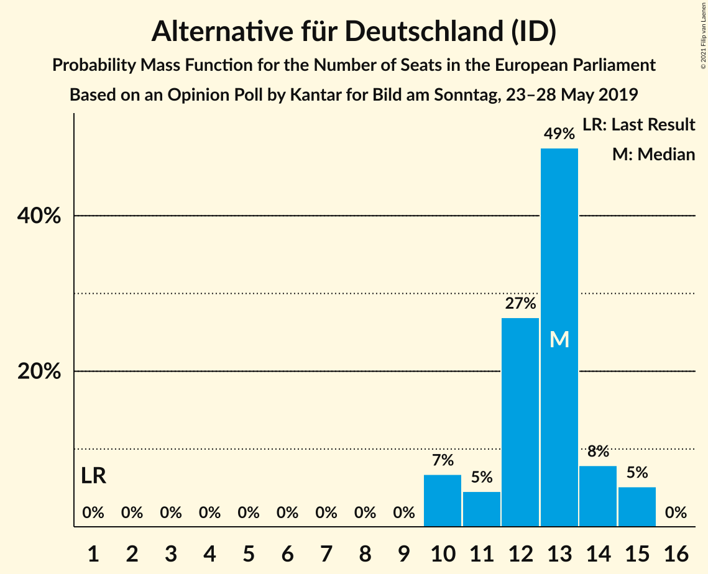

| Number of Seats | Probability | Accumulated | Special Marks |
|:---------------:|:-----------:|:-----------:|:-------------:|
| 1 | 0% | 100% | Last Result |
| 2 | 0% | 100% |  |
| 3 | 0% | 100% |  |
| 4 | 0% | 100% |  |
| 5 | 0% | 100% |  |
| 6 | 0% | 100% |  |
| 7 | 0% | 100% |  |
| 8 | 0% | 100% |  |
| 9 | 0% | 100% |  |
| 10 | 7% | 100% |  |
| 11 | 5% | 93% |  |
| 12 | 27% | 89% |  |
| 13 | 49% | 62% | Median |
| 14 | 8% | 13% |  |
| 15 | 5% | 5% |  |
| 16 | 0% | 0% |  |

### Freie Demokratische Partei (RE)

*For a full overview of the results for this party, see the [Freie Demokratische Partei (RE)](party-freiedemokratischeparteire.html) page.*

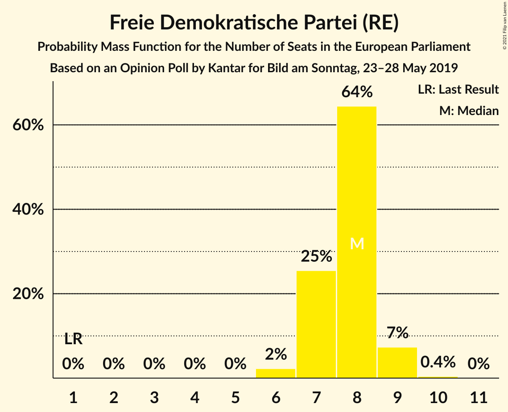

| Number of Seats | Probability | Accumulated | Special Marks |
|:---------------:|:-----------:|:-----------:|:-------------:|
| 1 | 0% | 100% | Last Result |
| 2 | 0% | 100% |  |
| 3 | 0% | 100% |  |
| 4 | 0% | 100% |  |
| 5 | 0% | 100% |  |
| 6 | 2% | 100% |  |
| 7 | 25% | 98% |  |
| 8 | 64% | 72% | Median |
| 9 | 7% | 8% |  |
| 10 | 0.4% | 0.4% |  |
| 11 | 0% | 0% |  |

### Die Linke (GUE/NGL)

*For a full overview of the results for this party, see the [Die Linke (GUE/NGL)](party-dielinkeguengl.html) page.*

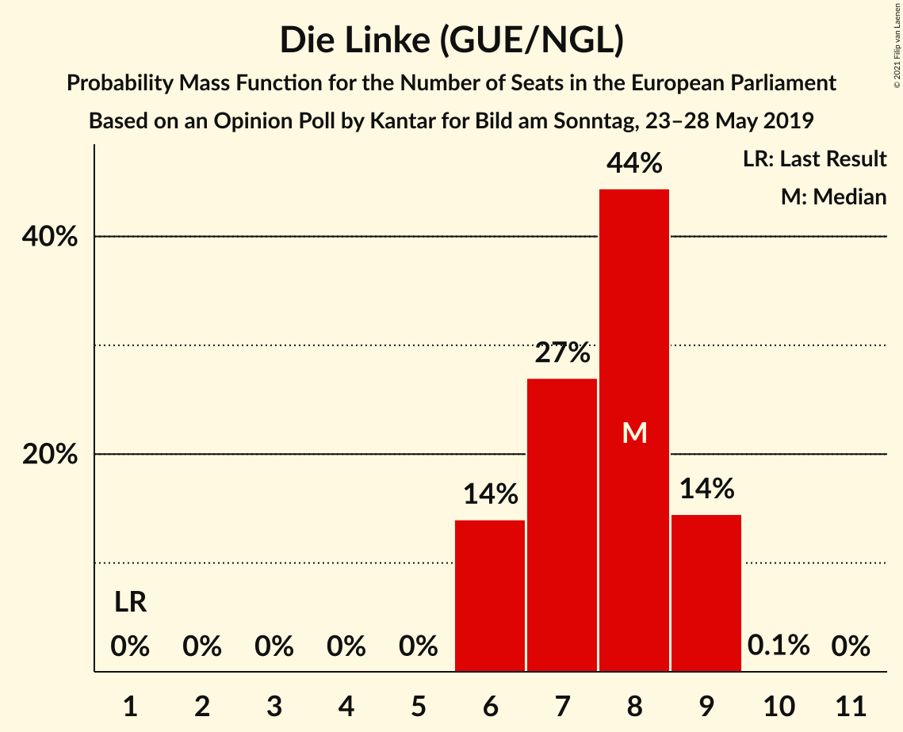

| Number of Seats | Probability | Accumulated | Special Marks |
|:---------------:|:-----------:|:-----------:|:-------------:|
| 1 | 0% | 100% | Last Result |
| 2 | 0% | 100% |  |
| 3 | 0% | 100% |  |
| 4 | 0% | 100% |  |
| 5 | 0% | 100% |  |
| 6 | 14% | 100% |  |
| 7 | 27% | 86% |  |
| 8 | 44% | 59% | Median |
| 9 | 14% | 15% |  |
| 10 | 0.1% | 0.1% |  |
| 11 | 0% | 0% |  |

### Christlich-Soziale Union in Bayern (EPP)

*For a full overview of the results for this party, see the [Christlich-Soziale Union in Bayern (EPP)](party-christlich-sozialeunioninbayernepp.html) page.*

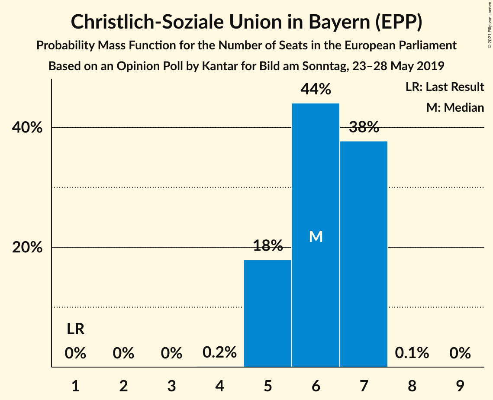

| Number of Seats | Probability | Accumulated | Special Marks |
|:---------------:|:-----------:|:-----------:|:-------------:|
| 1 | 0% | 100% | Last Result |
| 2 | 0% | 100% |  |
| 3 | 0% | 100% |  |
| 4 | 0.2% | 100% |  |
| 5 | 18% | 99.8% |  |
| 6 | 44% | 82% | Median |
| 7 | 38% | 38% |  |
| 8 | 0.1% | 0.1% |  |
| 9 | 0% | 0% |  |

### Die PARTEI (Greens/EFA)

*For a full overview of the results for this party, see the [Die PARTEI (Greens/EFA)](party-dieparteigreensefa.html) page.*

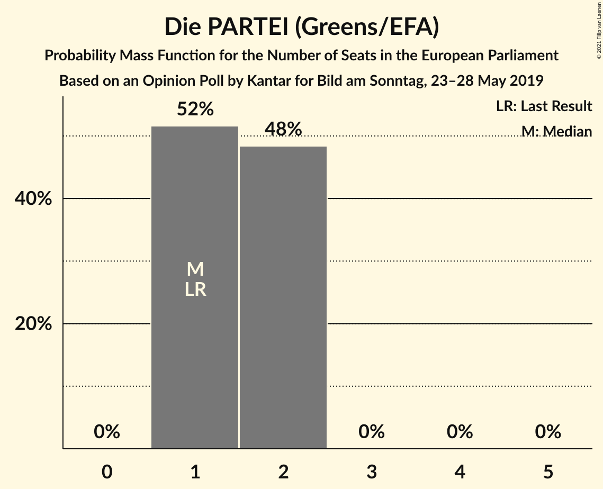

| Number of Seats | Probability | Accumulated | Special Marks |
|:---------------:|:-----------:|:-----------:|:-------------:|
| 1 | 52% | 100% | Last Result, Median |
| 2 | 48% | 48% |  |
| 3 | 0% | 0% |  |

### Freie Wähler (RE)

*For a full overview of the results for this party, see the [Freie Wähler (RE)](party-freiewählerre.html) page.*

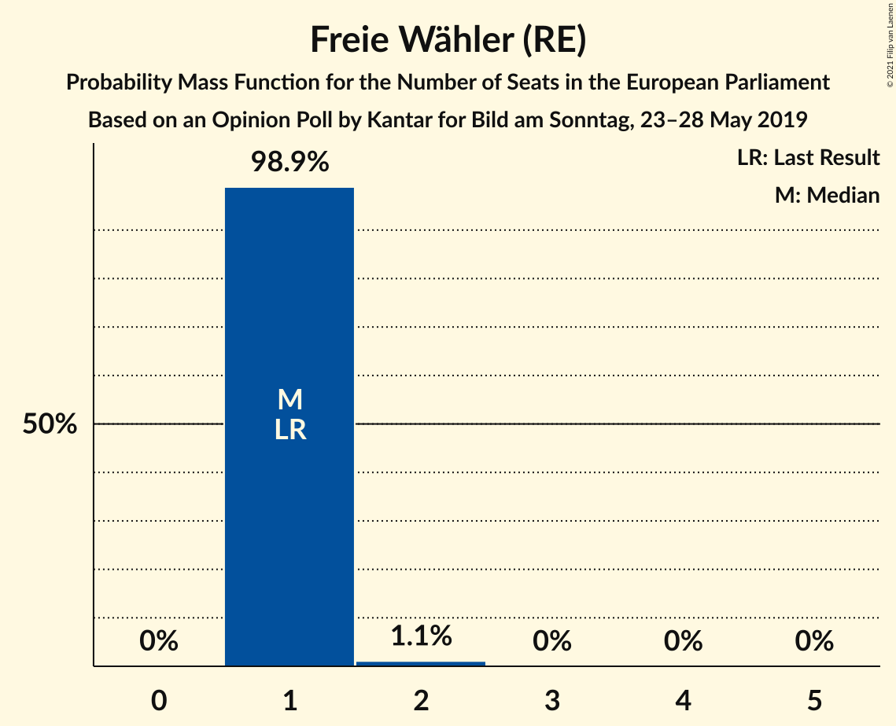

| Number of Seats | Probability | Accumulated | Special Marks |
|:---------------:|:-----------:|:-----------:|:-------------:|
| 1 | 98.9% | 100% | Last Result, Median |
| 2 | 1.1% | 1.1% |  |
| 3 | 0% | 0% |  |

### Partei Mensch Umwelt Tierschutz (GUE/NGL)

*For a full overview of the results for this party, see the [Partei Mensch Umwelt Tierschutz (GUE/NGL)](party-parteimenschumwelttierschutzguengl.html) page.*

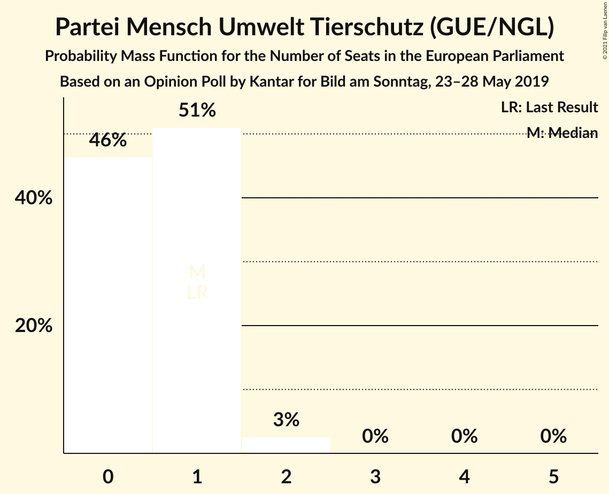

| Number of Seats | Probability | Accumulated | Special Marks |
|:---------------:|:-----------:|:-----------:|:-------------:|
| 0 | 46% | 100% |  |
| 1 | 51% | 54% | Last Result, Median |
| 2 | 3% | 3% |  |
| 3 | 0% | 0% |  |

### Ökologisch-Demokratische Partei (Greens/EFA)

*For a full overview of the results for this party, see the [Ökologisch-Demokratische Partei (Greens/EFA)](party-ökologisch-demokratischeparteigreensefa.html) page.*

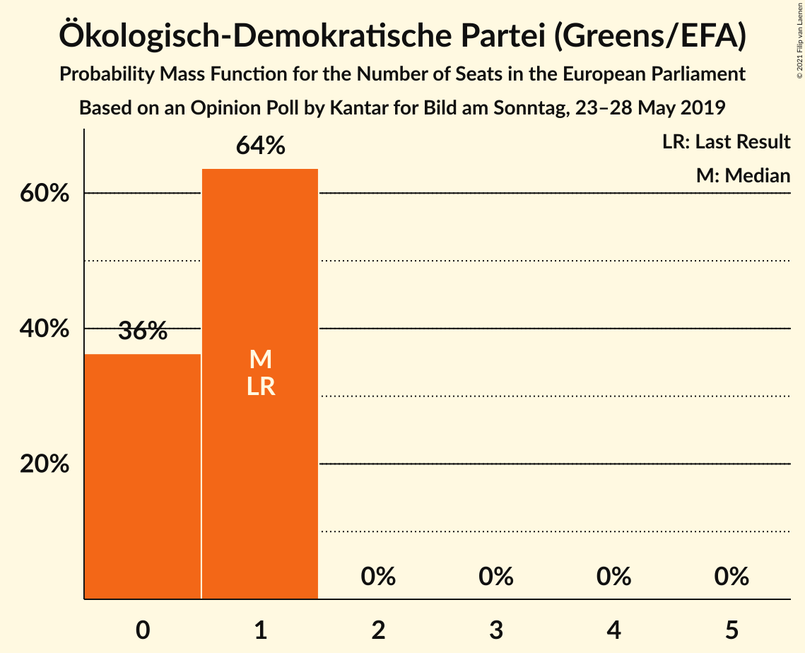

| Number of Seats | Probability | Accumulated | Special Marks |
|:---------------:|:-----------:|:-----------:|:-------------:|
| 0 | 36% | 100% |  |
| 1 | 64% | 64% | Last Result, Median |
| 2 | 0% | 0% |  |

### Familienpartei Deutschlands (ECR)

*For a full overview of the results for this party, see the [Familienpartei Deutschlands (ECR)](party-familienparteideutschlandsecr.html) page.*

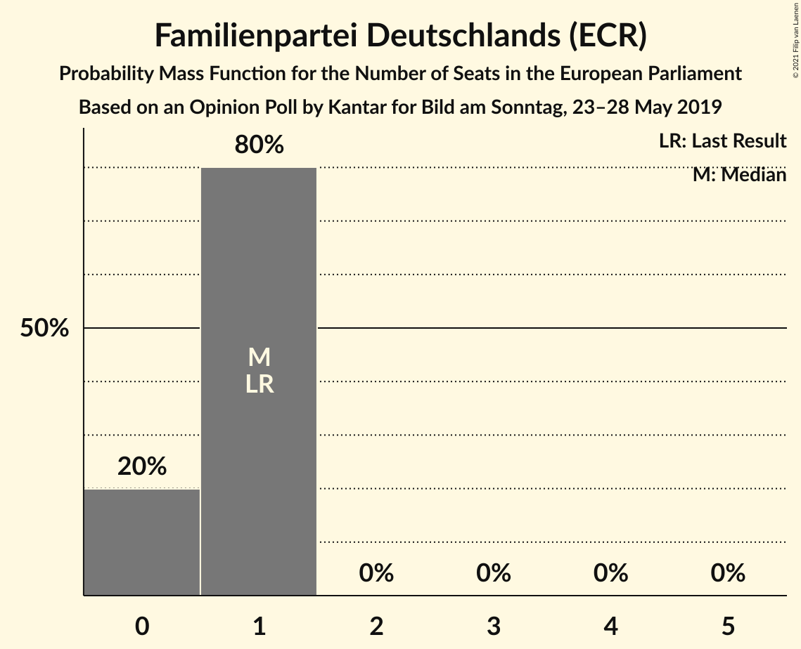

| Number of Seats | Probability | Accumulated | Special Marks |
|:---------------:|:-----------:|:-----------:|:-------------:|
| 0 | 20% | 100% |  |
| 1 | 80% | 80% | Last Result, Median |
| 2 | 0% | 0% |  |

### Piratenpartei Deutschland (Greens/EFA)

*For a full overview of the results for this party, see the [Piratenpartei Deutschland (Greens/EFA)](party-piratenparteideutschlandgreensefa.html) page.*

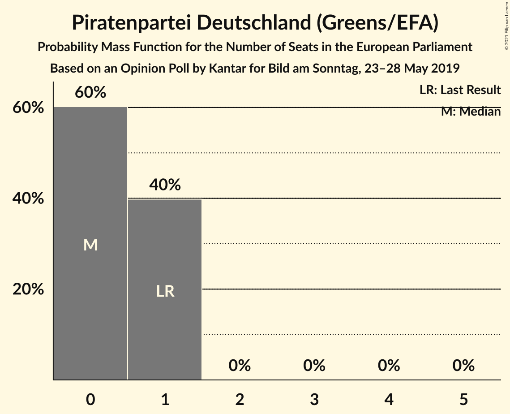

| Number of Seats | Probability | Accumulated | Special Marks |
|:---------------:|:-----------:|:-----------:|:-------------:|
| 0 | 60% | 100% | Median |
| 1 | 40% | 40% | Last Result |
| 2 | 0% | 0% |  |

### Volt Europa (Greens/EFA)

*For a full overview of the results for this party, see the [Volt Europa (Greens/EFA)](party-volteuropagreensefa.html) page.*

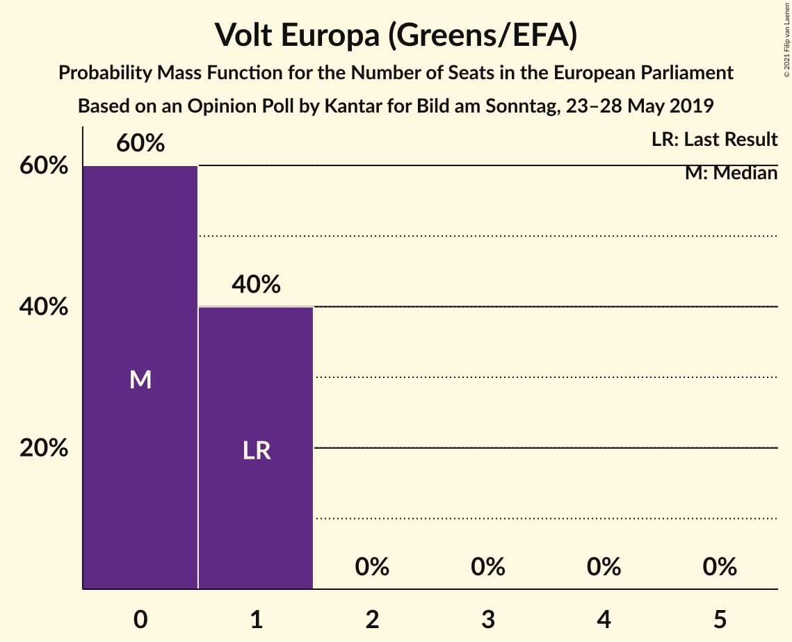

| Number of Seats | Probability | Accumulated | Special Marks |
|:---------------:|:-----------:|:-----------:|:-------------:|
| 0 | 60% | 100% | Median |
| 1 | 40% | 40% | Last Result |
| 2 | 0% | 0% |  |

## Coalitions

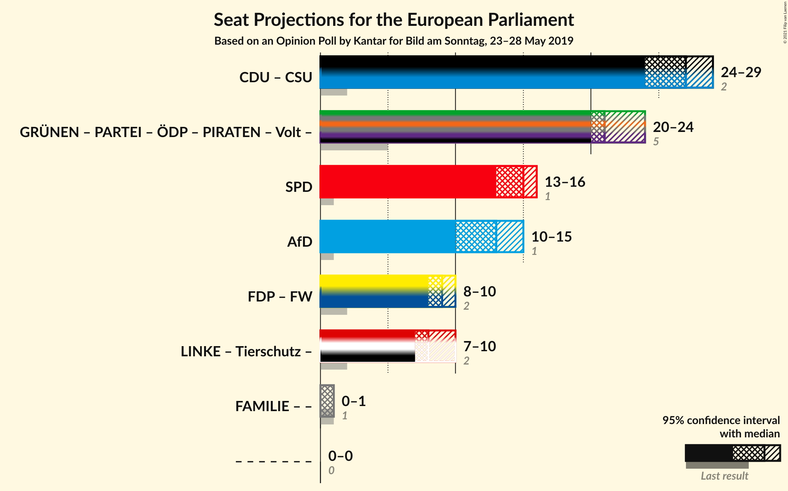

### Confidence Intervals

| Coalition | Last Result | Median | Majority? | 80% Confidence Interval | 90% Confidence Interval | 95% Confidence Interval | 99% Confidence Interval |
|:---------:|:-----------:|:------:|:---------:|:-----------------------:|:-----------------------:|:-----------------------:|:-----------------------:|
| Christlich Demokratische Union Deutschlands (EPP) – Christlich-Soziale Union in Bayern (EPP) | 2 | 27 | 0% | 26–29 | 26–29 | 24–29 | 24–29 |
| Sozialdemokratische Partei Deutschlands (S&D) | 1 | 15 | 0% | 13–16 | 13–16 | 13–16 | 13–17 |
| Alternative für Deutschland (ID) | 1 | 13 | 0% | 11–14 | 10–15 | 10–15 | 10–15 |
| Freie Demokratische Partei (RE) – Freie Wähler (RE) | 2 | 9 | 0% | 8–9 | 8–10 | 8–10 | 7–11 |

### Christlich Demokratische Union Deutschlands (EPP) – Christlich-Soziale Union in Bayern (EPP)

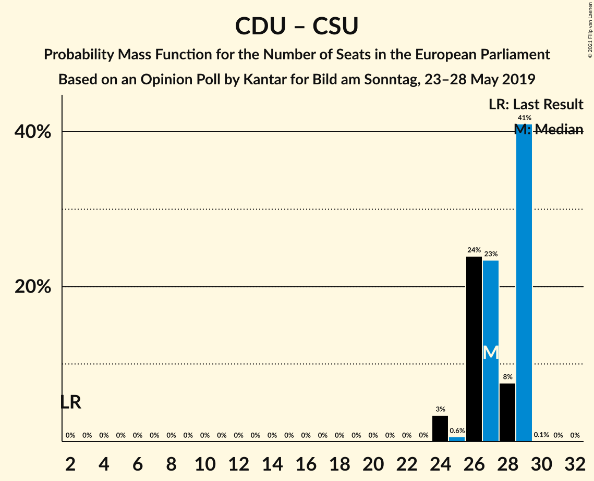

| Number of Seats | Probability | Accumulated | Special Marks |
|:---------------:|:-----------:|:-----------:|:-------------:|
| 2 | 0% | 100% | Last Result |
| 3 | 0% | 100% |  |
| 4 | 0% | 100% |  |
| 5 | 0% | 100% |  |
| 6 | 0% | 100% |  |
| 7 | 0% | 100% |  |
| 8 | 0% | 100% |  |
| 9 | 0% | 100% |  |
| 10 | 0% | 100% |  |
| 11 | 0% | 100% |  |
| 12 | 0% | 100% |  |
| 13 | 0% | 100% |  |
| 14 | 0% | 100% |  |
| 15 | 0% | 100% |  |
| 16 | 0% | 100% |  |
| 17 | 0% | 100% |  |
| 18 | 0% | 100% |  |
| 19 | 0% | 100% |  |
| 20 | 0% | 100% |  |
| 21 | 0% | 100% |  |
| 22 | 0% | 100% |  |
| 23 | 0% | 100% |  |
| 24 | 3% | 100% |  |
| 25 | 0.6% | 97% |  |
| 26 | 24% | 96% |  |
| 27 | 23% | 72% | Median |
| 28 | 8% | 49% |  |
| 29 | 41% | 41% |  |
| 30 | 0.1% | 0.1% |  |
| 31 | 0% | 0% |  |

### Sozialdemokratische Partei Deutschlands (S&D)

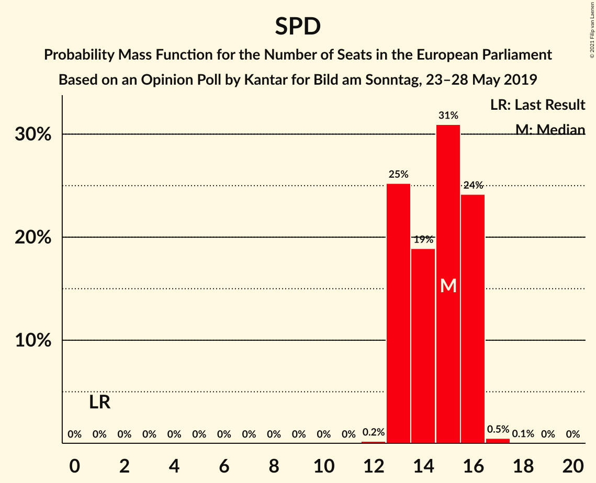

| Number of Seats | Probability | Accumulated | Special Marks |
|:---------------:|:-----------:|:-----------:|:-------------:|
| 1 | 0% | 100% | Last Result |
| 2 | 0% | 100% |  |
| 3 | 0% | 100% |  |
| 4 | 0% | 100% |  |
| 5 | 0% | 100% |  |
| 6 | 0% | 100% |  |
| 7 | 0% | 100% |  |
| 8 | 0% | 100% |  |
| 9 | 0% | 100% |  |
| 10 | 0% | 100% |  |
| 11 | 0% | 100% |  |
| 12 | 0.2% | 100% |  |
| 13 | 25% | 99.8% |  |
| 14 | 19% | 75% |  |
| 15 | 31% | 56% | Median |
| 16 | 24% | 25% |  |
| 17 | 0.5% | 0.5% |  |
| 18 | 0.1% | 0.1% |  |
| 19 | 0% | 0% |  |

### Alternative für Deutschland (ID)

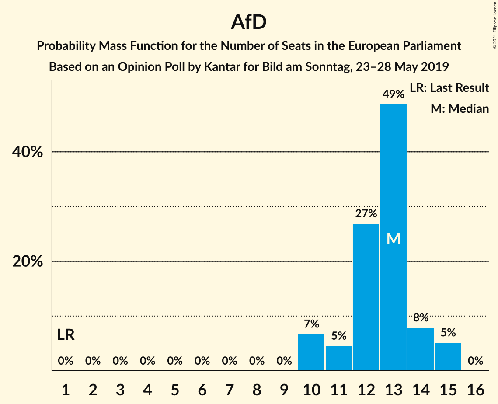

| Number of Seats | Probability | Accumulated | Special Marks |
|:---------------:|:-----------:|:-----------:|:-------------:|
| 1 | 0% | 100% | Last Result |
| 2 | 0% | 100% |  |
| 3 | 0% | 100% |  |
| 4 | 0% | 100% |  |
| 5 | 0% | 100% |  |
| 6 | 0% | 100% |  |
| 7 | 0% | 100% |  |
| 8 | 0% | 100% |  |
| 9 | 0% | 100% |  |
| 10 | 7% | 100% |  |
| 11 | 5% | 93% |  |
| 12 | 27% | 89% |  |
| 13 | 49% | 62% | Median |
| 14 | 8% | 13% |  |
| 15 | 5% | 5% |  |
| 16 | 0% | 0% |  |

### Freie Demokratische Partei (RE) – Freie Wähler (RE)

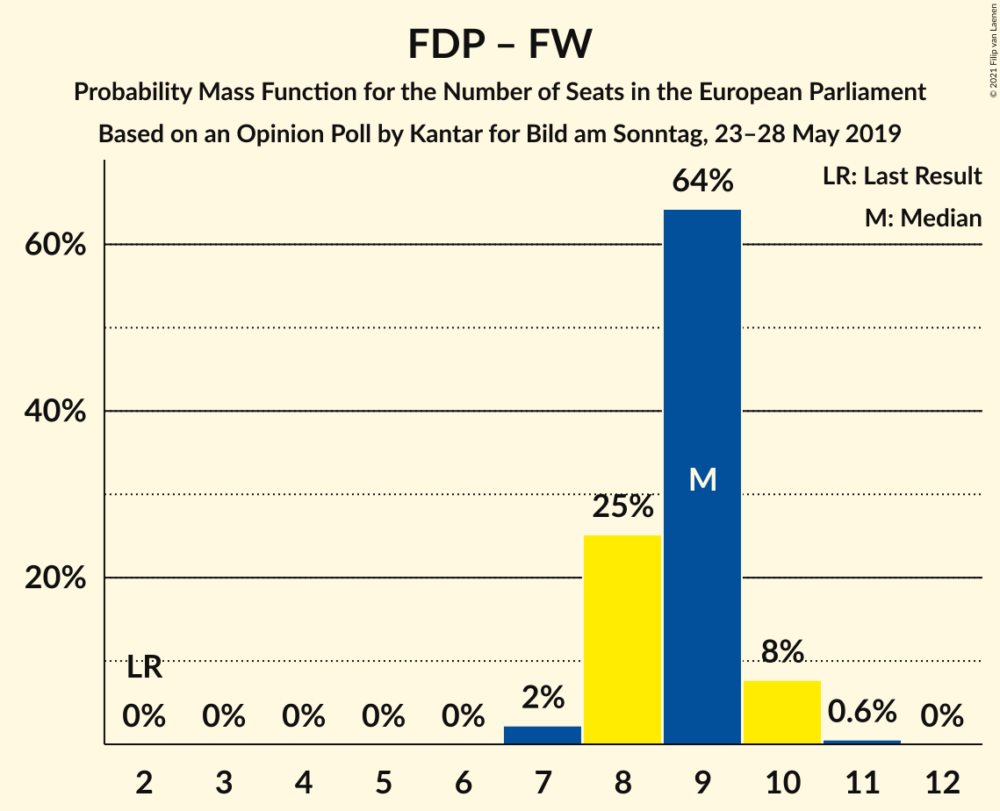

| Number of Seats | Probability | Accumulated | Special Marks |
|:---------------:|:-----------:|:-----------:|:-------------:|
| 2 | 0% | 100% | Last Result |
| 3 | 0% | 100% |  |
| 4 | 0% | 100% |  |
| 5 | 0% | 100% |  |
| 6 | 0% | 100% |  |
| 7 | 2% | 100% |  |
| 8 | 25% | 98% |  |
| 9 | 64% | 73% | Median |
| 10 | 8% | 8% |  |
| 11 | 0.6% | 0.6% |  |
| 12 | 0% | 0% |  |

## Technical Information

### Opinion Poll

+ **Polling firm:** Kantar
+ **Commissioner(s):** Bild am Sonntag
+ **Fieldwork period:** 23–28 May 2019

### Calculations

+ **Sample size:** 1413
+ **Simulations done:** 1,048,576
+ **Error estimate:** 1.68%

