# Opinion Poll by INSA, 3 June 2019

<a href="#voting-intentions">Voting Intentions</a> | <a href="#seats">Seats</a> | <a href="#coalitions">Coalitions</a> | <a href="#technical-information">Technical Information</a>

## Voting Intentions

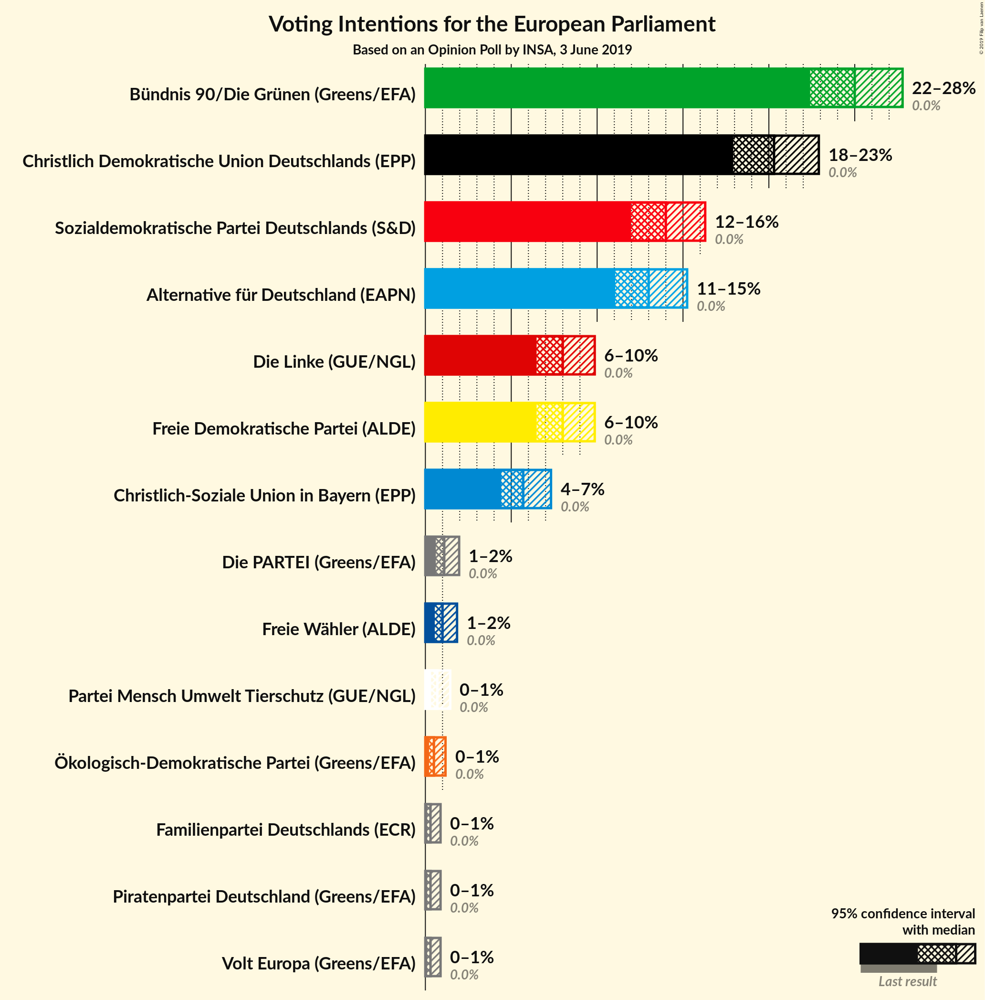

### Confidence Intervals

| Party | Last Result | Poll Result | 80% Confidence Interval | 90% Confidence Interval | 95% Confidence Interval | 99% Confidence Interval |
|:-----:|:-----------:|:-----------:|:-----------------------:|:-----------------------:|:-----------------------:|:-----------------------:|
| Bündnis 90/Die Grünen (Greens/EFA) | 0.0% | 25.0% | 23.3–26.8% |22.8–27.3% |22.4–27.8% |21.6–28.7% |
| Christlich Demokratische Union Deutschlands (EPP) | 0.0% | 20.3% | 18.7–22.0% |18.3–22.5% |17.9–22.9% |17.2–23.7% |
| Sozialdemokratische Partei Deutschlands (S&D) | 0.0% | 14.0% | 12.7–15.5% |12.3–15.9% |12.0–16.3% |11.4–17.0% |
| Alternative für Deutschland (EAPN) | 0.0% | 13.0% | 11.7–14.5% |11.4–14.9% |11.1–15.2% |10.5–16.0% |
| Freie Demokratische Partei (ALDE) | 0.0% | 8.0% | 7.0–9.2% |6.7–9.6% |6.5–9.9% |6.0–10.5% |
| Die Linke (GUE/NGL) | 0.0% | 8.0% | 7.0–9.2% |6.7–9.6% |6.5–9.9% |6.0–10.5% |
| Christlich-Soziale Union in Bayern (EPP) | 0.0% | 5.7% | 4.9–6.8% |4.6–7.1% |4.4–7.3% |4.1–7.9% |
| Die PARTEI (Greens/EFA) | 0.0% | 1.1% | 0.8–1.7% |0.7–1.8% |0.6–2.0% |0.5–2.3% |
| Freie Wähler (ALDE) | 0.0% | 1.0% | 0.7–1.5% |0.6–1.7% |0.5–1.8% |0.4–2.1% |
| Partei Mensch Umwelt Tierschutz (GUE/NGL) | 0.0% | 0.7% | 0.5–1.2% |0.4–1.3% |0.3–1.4% |0.2–1.7% |
| Ökologisch-Demokratische Partei (Greens/EFA) | 0.0% | 0.5% | 0.3–0.9% |0.3–1.1% |0.2–1.2% |0.2–1.4% |
| Familienpartei Deutschlands (ECR) | 0.0% | 0.3% | 0.2–0.7% |0.1–0.8% |0.1–0.9% |0.1–1.1% |
| Volt Europa (Greens/EFA) | 0.0% | 0.3% | 0.2–0.7% |0.1–0.8% |0.1–0.9% |0.1–1.1% |
| Piratenpartei Deutschland (Greens/EFA) | 0.0% | 0.3% | 0.2–0.7% |0.1–0.8% |0.1–0.9% |0.1–1.1% |

*Note:* The poll result column reflects the actual value used in the calculations. Published results may vary slightly, and in addition be rounded to fewer digits.

## Seats

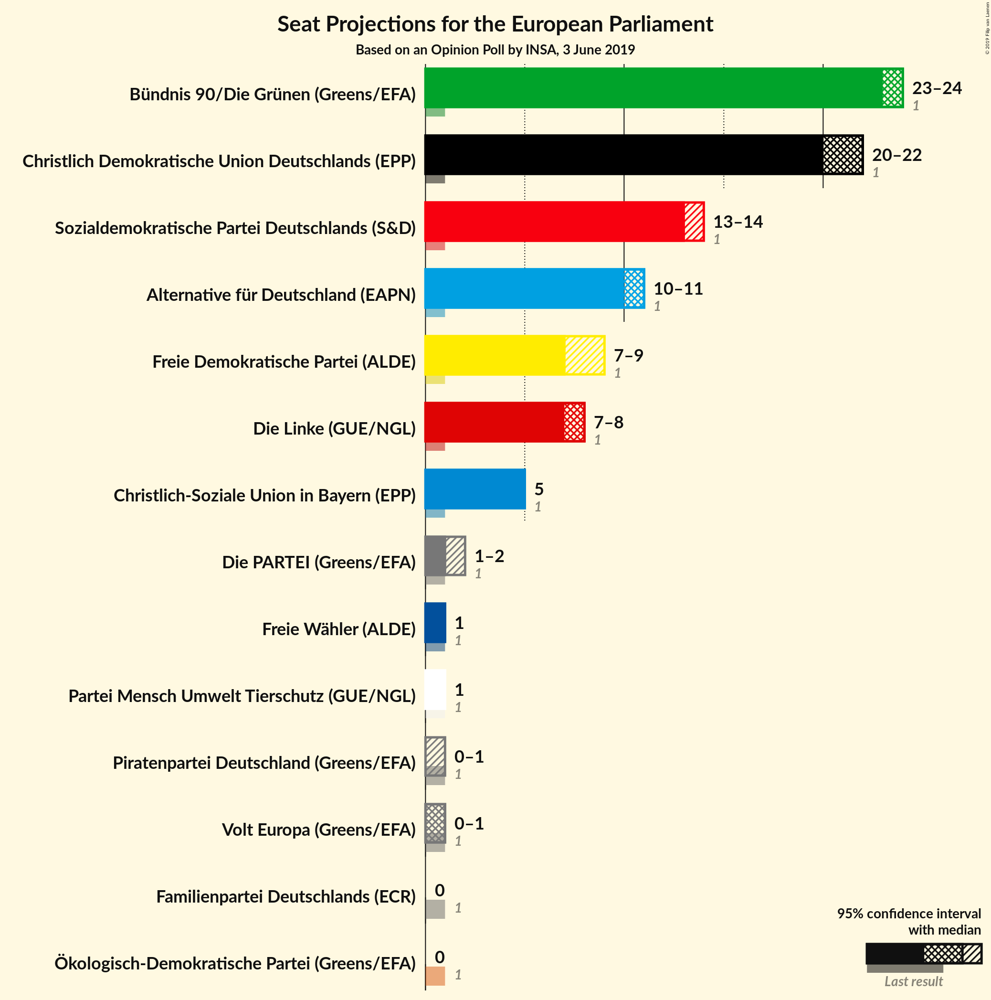

### Confidence Intervals

| Party | Last Result | Median | 80% Confidence Interval | 90% Confidence Interval | 95% Confidence Interval | 99% Confidence Interval |
|:-----:|:-----------:|:------:|:-----------------------:|:-----------------------:|:-----------------------:|:-----------------------:|
| <a href="#bündnis-90/die-grünen-(greens/efa)">Bündnis 90/Die Grünen (Greens/EFA)</a> | 1 | 24 | 24 |23–24 |23–24 |23–24 |
| <a href="#christlich-demokratische-union-deutschlands-(epp)">Christlich Demokratische Union Deutschlands (EPP)</a> | 1 | 22 | 22 |20–22 |20–22 |17–22 |
| <a href="#sozialdemokratische-partei-deutschlands-(s&d)">Sozialdemokratische Partei Deutschlands (S&D)</a> | 1 | 13 | 13 |13–14 |13–14 |13–15 |
| <a href="#alternative-für-deutschland-(eapn)">Alternative für Deutschland (EAPN)</a> | 1 | 11 | 11 |10–11 |10–11 |10–13 |
| <a href="#freie-demokratische-partei-(alde)">Freie Demokratische Partei (ALDE)</a> | 1 | 7 | 7 |7–9 |7–9 |7–9 |
| <a href="#die-linke-(gue/ngl)">Die Linke (GUE/NGL)</a> | 1 | 8 | 8 |7–8 |7–8 |7–9 |
| <a href="#christlich-soziale-union-in-bayern-(epp)">Christlich-Soziale Union in Bayern (EPP)</a> | 1 | 5 | 5 |5 |5 |5–6 |
| <a href="#die-partei-(greens/efa)">Die PARTEI (Greens/EFA)</a> | 1 | 1 | 1 |1–2 |1–2 |1–2 |
| <a href="#freie-wähler-(alde)">Freie Wähler (ALDE)</a> | 1 | 1 | 1 |1 |1 |1 |
| <a href="#partei-mensch-umwelt-tierschutz-(gue/ngl)">Partei Mensch Umwelt Tierschutz (GUE/NGL)</a> | 1 | 1 | 1 |1 |1 |1 |
| <a href="#ökologisch-demokratische-partei-(greens/efa)">Ökologisch-Demokratische Partei (Greens/EFA)</a> | 1 | 0 | 0 |0 |0 |0–1 |
| <a href="#familienpartei-deutschlands-(ecr)">Familienpartei Deutschlands (ECR)</a> | 1 | 0 | 0 |0 |0 |0–1 |
| <a href="#volt-europa-(greens/efa)">Volt Europa (Greens/EFA)</a> | 1 | 1 | 1 |0–1 |0–1 |0–1 |
| <a href="#piratenpartei-deutschland-(greens/efa)">Piratenpartei Deutschland (Greens/EFA)</a> | 1 | 0 | 0 |0–1 |0–1 |0–1 |

### Bündnis 90/Die Grünen (Greens/EFA)

*For a full overview of the results for this party, see the [Bündnis 90/Die Grünen (Greens/EFA)](party-bündnis90diegrünengreensefa.html) page.*

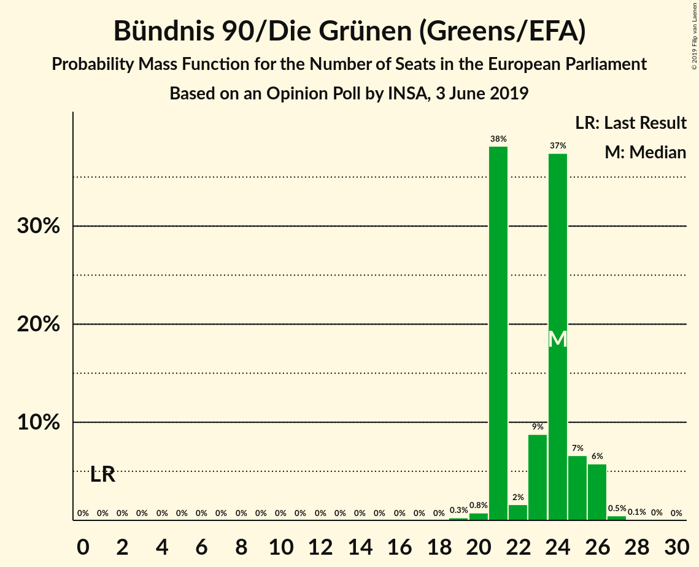

| Number of Seats | Probability | Accumulated | Special Marks |
|:---------------:|:-----------:|:-----------:|:-------------:|
| 1 | 0% | 100% | Last Result |
| 2 | 0% | 100% |  |
| 3 | 0% | 100% |  |
| 4 | 0% | 100% |  |
| 5 | 0% | 100% |  |
| 6 | 0% | 100% |  |
| 7 | 0% | 100% |  |
| 8 | 0% | 100% |  |
| 9 | 0% | 100% |  |
| 10 | 0% | 100% |  |
| 11 | 0% | 100% |  |
| 12 | 0% | 100% |  |
| 13 | 0% | 100% |  |
| 14 | 0% | 100% |  |
| 15 | 0% | 100% |  |
| 16 | 0% | 100% |  |
| 17 | 0% | 100% |  |
| 18 | 0% | 100% |  |
| 19 | 0% | 100% |  |
| 20 | 0.1% | 100% |  |
| 21 | 0% | 99.9% |  |
| 22 | 0.3% | 99.9% |  |
| 23 | 6% | 99.5% |  |
| 24 | 93% | 93% | Median |
| 25 | 0.2% | 0.2% |  |
| 26 | 0% | 0% |  |

### Christlich Demokratische Union Deutschlands (EPP)

*For a full overview of the results for this party, see the [Christlich Demokratische Union Deutschlands (EPP)](party-christlichdemokratischeuniondeutschlandsepp.html) page.*

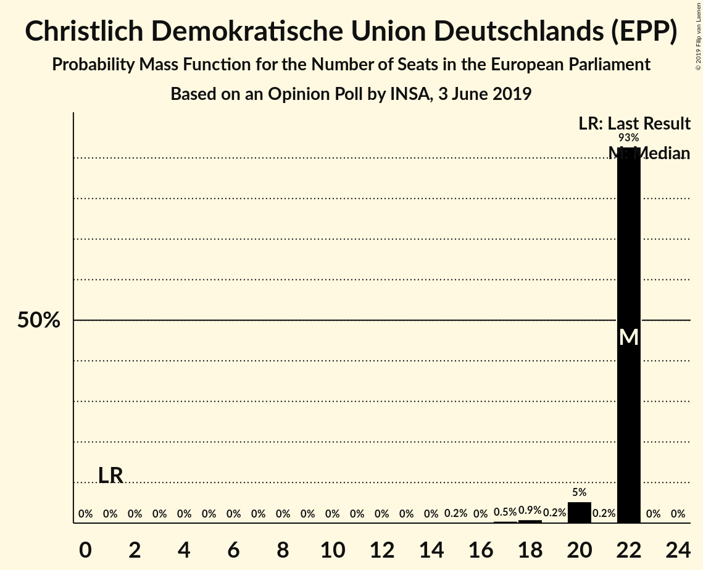

| Number of Seats | Probability | Accumulated | Special Marks |
|:---------------:|:-----------:|:-----------:|:-------------:|
| 1 | 0% | 100% | Last Result |
| 2 | 0% | 100% |  |
| 3 | 0% | 100% |  |
| 4 | 0% | 100% |  |
| 5 | 0% | 100% |  |
| 6 | 0% | 100% |  |
| 7 | 0% | 100% |  |
| 8 | 0% | 100% |  |
| 9 | 0% | 100% |  |
| 10 | 0% | 100% |  |
| 11 | 0% | 100% |  |
| 12 | 0% | 100% |  |
| 13 | 0% | 100% |  |
| 14 | 0% | 100% |  |
| 15 | 0.2% | 100% |  |
| 16 | 0% | 99.8% |  |
| 17 | 0.5% | 99.8% |  |
| 18 | 0.9% | 99.3% |  |
| 19 | 0.2% | 98% |  |
| 20 | 5% | 98% |  |
| 21 | 0.2% | 93% |  |
| 22 | 93% | 93% | Median |
| 23 | 0% | 0% |  |

### Sozialdemokratische Partei Deutschlands (S&D)

*For a full overview of the results for this party, see the [Sozialdemokratische Partei Deutschlands (S&D)](party-sozialdemokratischeparteideutschlandssd.html) page.*

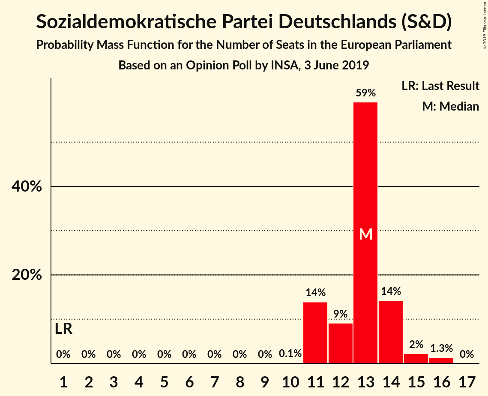

| Number of Seats | Probability | Accumulated | Special Marks |
|:---------------:|:-----------:|:-----------:|:-------------:|
| 1 | 0% | 100% | Last Result |
| 2 | 0% | 100% |  |
| 3 | 0% | 100% |  |
| 4 | 0% | 100% |  |
| 5 | 0% | 100% |  |
| 6 | 0% | 100% |  |
| 7 | 0% | 100% |  |
| 8 | 0% | 100% |  |
| 9 | 0% | 100% |  |
| 10 | 0% | 100% |  |
| 11 | 0.2% | 100% |  |
| 12 | 0.1% | 99.8% |  |
| 13 | 93% | 99.7% | Median |
| 14 | 6% | 7% |  |
| 15 | 0.4% | 0.8% |  |
| 16 | 0.4% | 0.4% |  |
| 17 | 0% | 0% |  |

### Alternative für Deutschland (EAPN)

*For a full overview of the results for this party, see the [Alternative für Deutschland (EAPN)](party-alternativefürdeutschlandeapn.html) page.*

| Number of Seats | Probability | Accumulated | Special Marks |
|:---------------:|:-----------:|:-----------:|:-------------:|
| 1 | 0% | 100% | Last Result |
| 2 | 0% | 100% |  |
| 3 | 0% | 100% |  |
| 4 | 0% | 100% |  |
| 5 | 0% | 100% |  |
| 6 | 0% | 100% |  |
| 7 | 0% | 100% |  |
| 8 | 0% | 100% |  |
| 9 | 0% | 100% |  |
| 10 | 5% | 100% |  |
| 11 | 93% | 95% | Median |
| 12 | 1.0% | 2% |  |
| 13 | 0.5% | 0.9% |  |
| 14 | 0.2% | 0.4% |  |
| 15 | 0.2% | 0.2% |  |
| 16 | 0% | 0% |  |

### Freie Demokratische Partei (ALDE)

*For a full overview of the results for this party, see the [Freie Demokratische Partei (ALDE)](party-freiedemokratischeparteialde.html) page.*

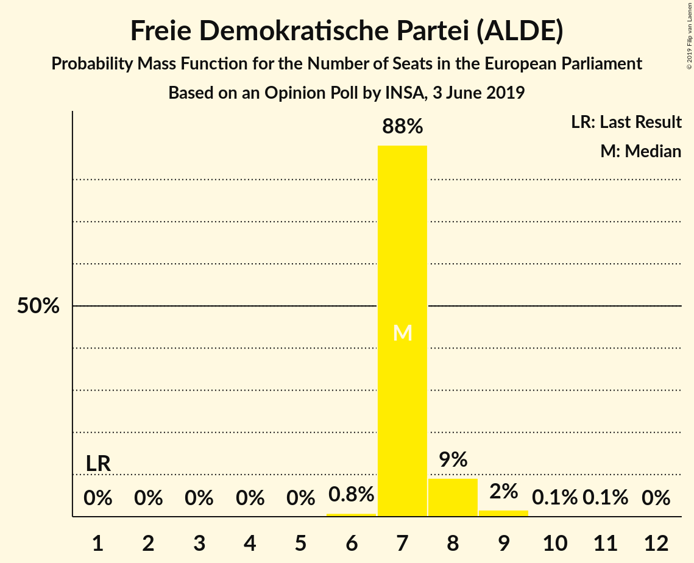

| Number of Seats | Probability | Accumulated | Special Marks |
|:---------------:|:-----------:|:-----------:|:-------------:|
| 1 | 0% | 100% | Last Result |
| 2 | 0% | 100% |  |
| 3 | 0% | 100% |  |
| 4 | 0% | 100% |  |
| 5 | 0% | 100% |  |
| 6 | 0.2% | 100% |  |
| 7 | 95% | 99.8% | Median |
| 8 | 0.1% | 5% |  |
| 9 | 5% | 5% |  |
| 10 | 0.2% | 0.2% |  |
| 11 | 0% | 0% |  |

### Die Linke (GUE/NGL)

*For a full overview of the results for this party, see the [Die Linke (GUE/NGL)](party-dielinkeguengl.html) page.*

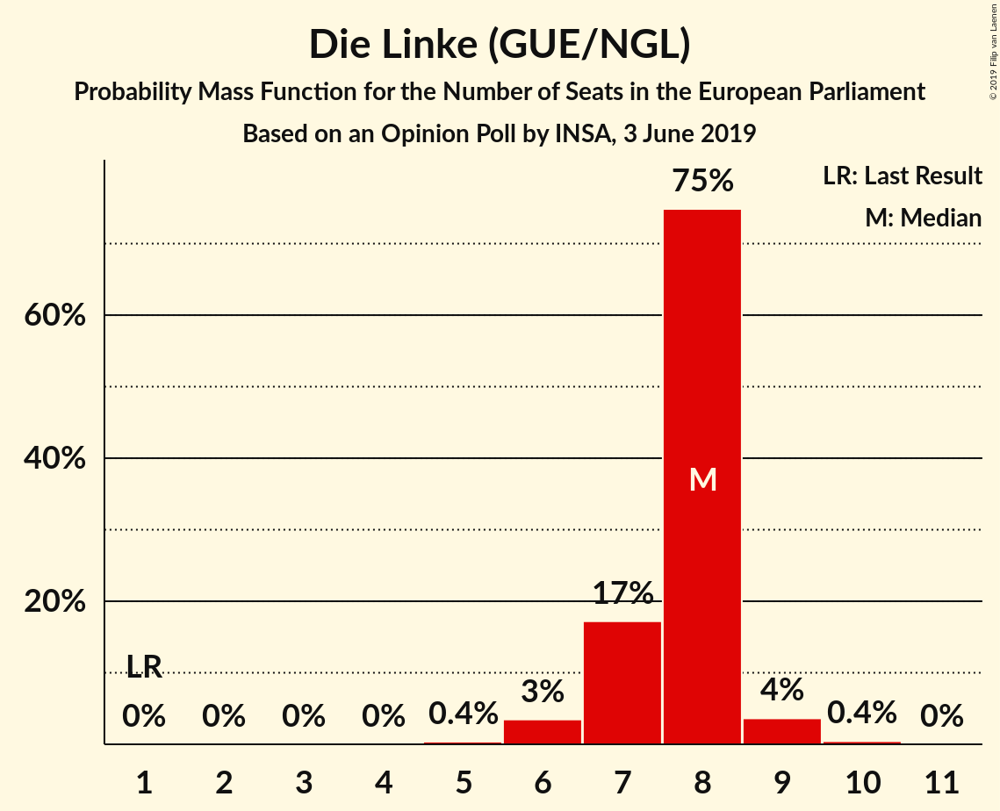

| Number of Seats | Probability | Accumulated | Special Marks |
|:---------------:|:-----------:|:-----------:|:-------------:|
| 1 | 0% | 100% | Last Result |
| 2 | 0% | 100% |  |
| 3 | 0% | 100% |  |
| 4 | 0% | 100% |  |
| 5 | 0% | 100% |  |
| 6 | 0.1% | 100% |  |
| 7 | 6% | 99.9% |  |
| 8 | 93% | 94% | Median |
| 9 | 1.0% | 1.4% |  |
| 10 | 0.4% | 0.4% |  |
| 11 | 0% | 0% |  |

### Christlich-Soziale Union in Bayern (EPP)

*For a full overview of the results for this party, see the [Christlich-Soziale Union in Bayern (EPP)](party-christlich-sozialeunioninbayernepp.html) page.*

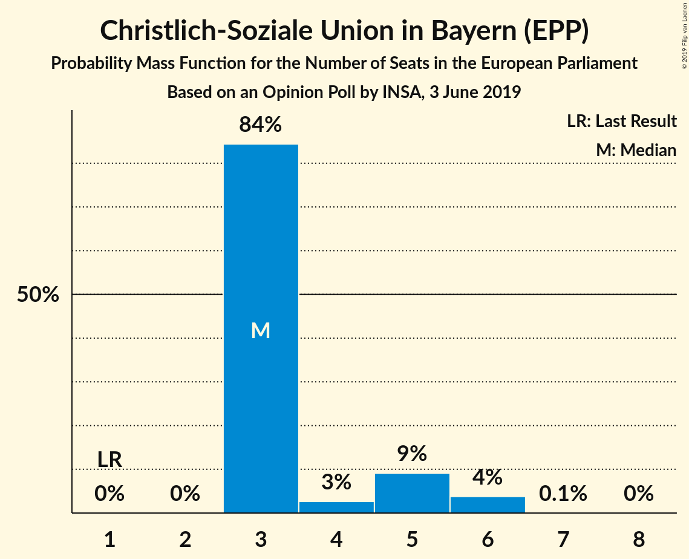

| Number of Seats | Probability | Accumulated | Special Marks |
|:---------------:|:-----------:|:-----------:|:-------------:|
| 1 | 0% | 100% | Last Result |
| 2 | 0% | 100% |  |
| 3 | 0% | 100% |  |
| 4 | 0.2% | 100% |  |
| 5 | 98.9% | 99.8% | Median |
| 6 | 0.9% | 0.9% |  |
| 7 | 0% | 0% |  |

### Die PARTEI (Greens/EFA)

*For a full overview of the results for this party, see the [Die PARTEI (Greens/EFA)](party-dieparteigreensefa.html) page.*

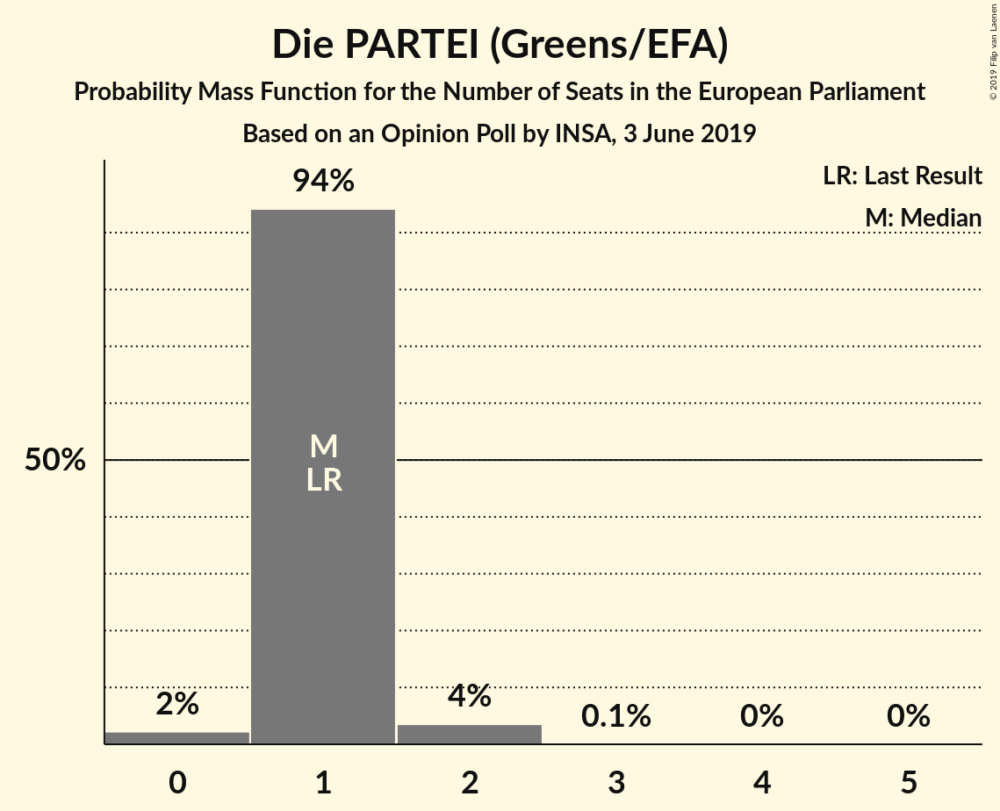

| Number of Seats | Probability | Accumulated | Special Marks |
|:---------------:|:-----------:|:-----------:|:-------------:|
| 0 | 0.1% | 100% |  |
| 1 | 95% | 99.9% | Last Result, Median |
| 2 | 5% | 5% |  |
| 3 | 0% | 0% |  |

### Freie Wähler (ALDE)

*For a full overview of the results for this party, see the [Freie Wähler (ALDE)](party-freiewähleralde.html) page.*

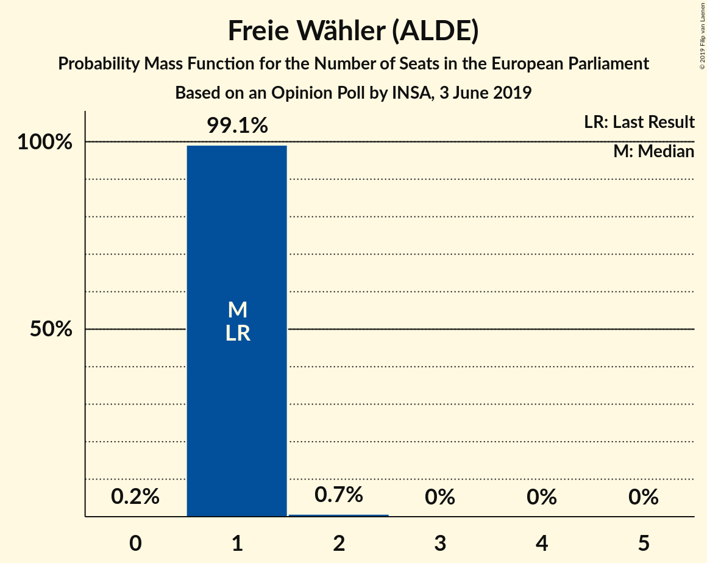

| Number of Seats | Probability | Accumulated | Special Marks |
|:---------------:|:-----------:|:-----------:|:-------------:|
| 0 | 0.2% | 100% |  |
| 1 | 99.4% | 99.8% | Last Result, Median |
| 2 | 0.4% | 0.4% |  |
| 3 | 0% | 0% |  |

### Partei Mensch Umwelt Tierschutz (GUE/NGL)

*For a full overview of the results for this party, see the [Partei Mensch Umwelt Tierschutz (GUE/NGL)](party-parteimenschumwelttierschutzguengl.html) page.*

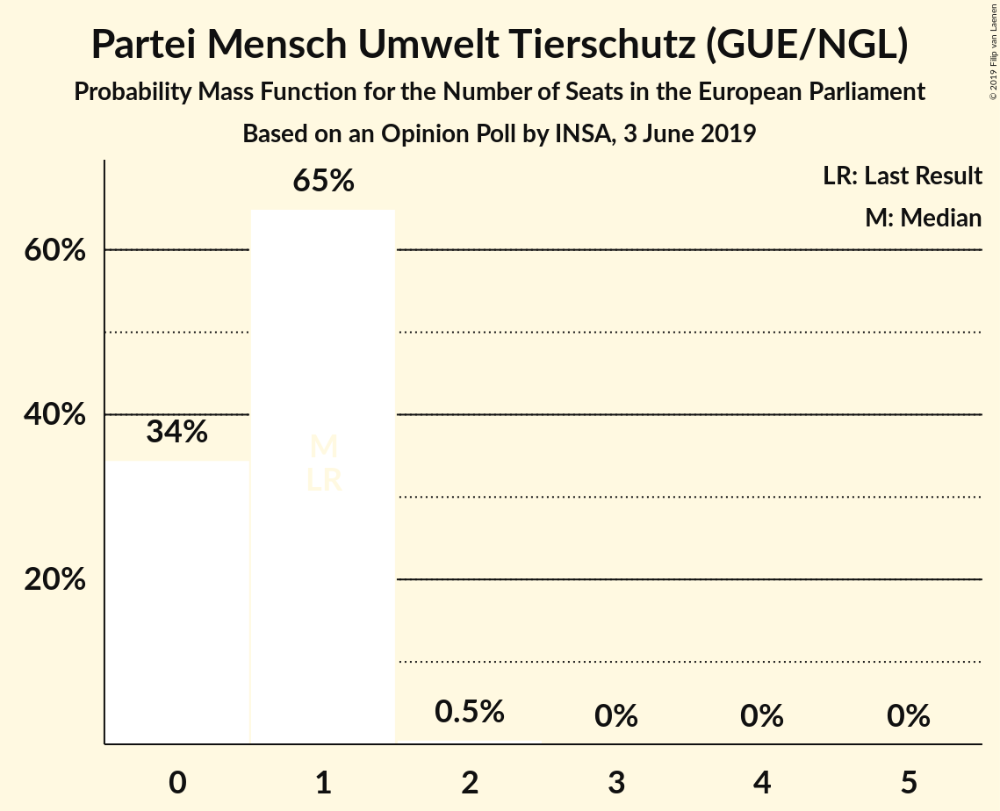

| Number of Seats | Probability | Accumulated | Special Marks |
|:---------------:|:-----------:|:-----------:|:-------------:|
| 0 | 0.4% | 100% |  |
| 1 | 99.4% | 99.6% | Last Result, Median |
| 2 | 0.1% | 0.1% |  |
| 3 | 0% | 0% |  |

### Ökologisch-Demokratische Partei (Greens/EFA)

*For a full overview of the results for this party, see the [Ökologisch-Demokratische Partei (Greens/EFA)](party-ökologisch-demokratischeparteigreensefa.html) page.*

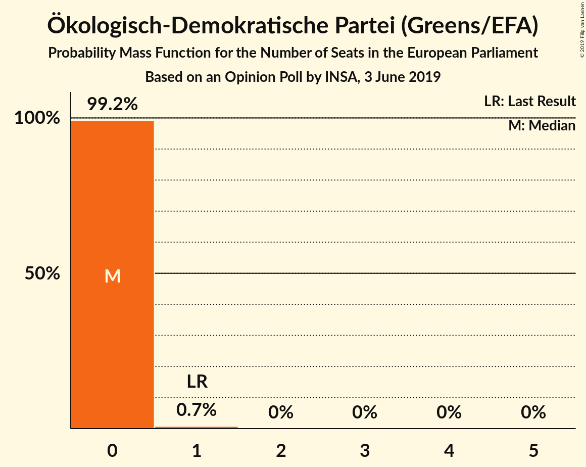

| Number of Seats | Probability | Accumulated | Special Marks |
|:---------------:|:-----------:|:-----------:|:-------------:|
| 0 | 99.2% | 100% | Median |
| 1 | 0.7% | 0.8% | Last Result |
| 2 | 0% | 0% |  |

### Familienpartei Deutschlands (ECR)

*For a full overview of the results for this party, see the [Familienpartei Deutschlands (ECR)](party-familienparteideutschlandsecr.html) page.*

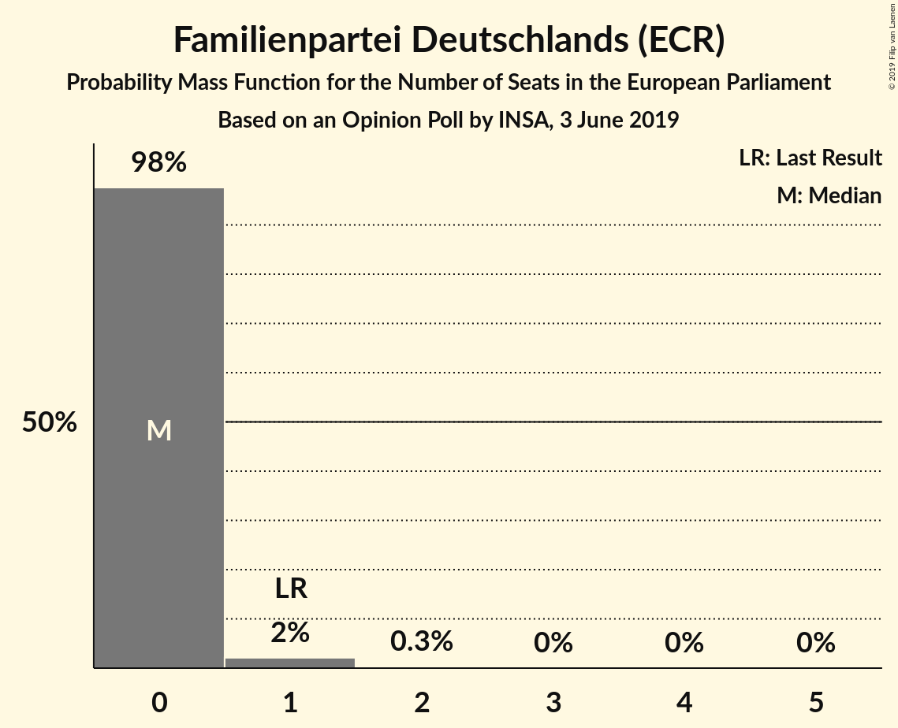

| Number of Seats | Probability | Accumulated | Special Marks |
|:---------------:|:-----------:|:-----------:|:-------------:|
| 0 | 98.7% | 100% | Median |
| 1 | 1.3% | 1.3% | Last Result |
| 2 | 0% | 0% |  |

### Volt Europa (Greens/EFA)

*For a full overview of the results for this party, see the [Volt Europa (Greens/EFA)](party-volteuropagreensefa.html) page.*

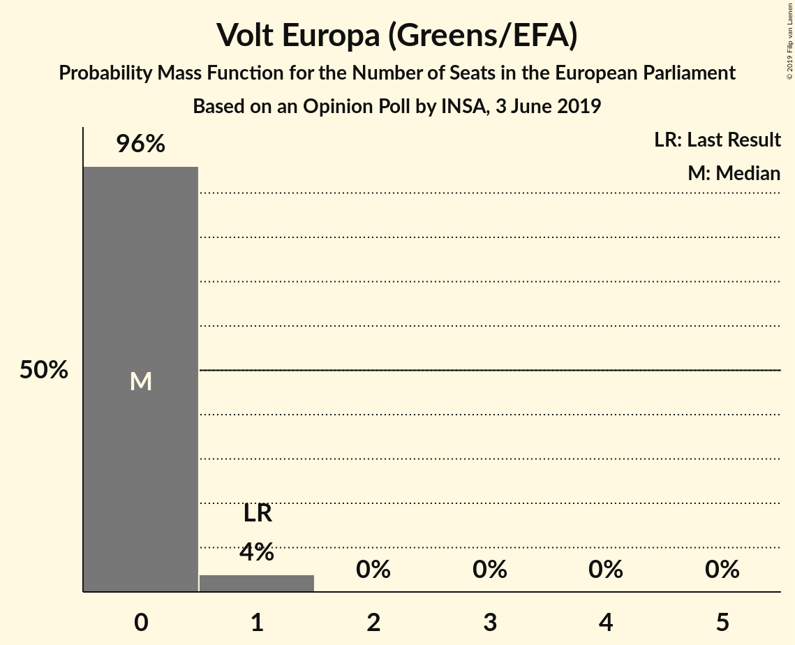

| Number of Seats | Probability | Accumulated | Special Marks |
|:---------------:|:-----------:|:-----------:|:-------------:|
| 0 | 6% | 100% |  |
| 1 | 94% | 94% | Last Result, Median |
| 2 | 0% | 0% |  |

### Piratenpartei Deutschland (Greens/EFA)

*For a full overview of the results for this party, see the [Piratenpartei Deutschland (Greens/EFA)](party-piratenparteideutschlandgreensefa.html) page.*

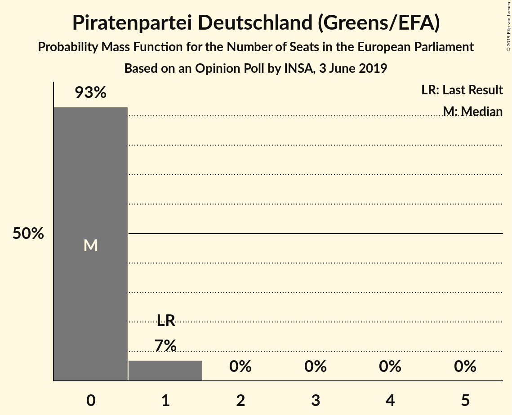

| Number of Seats | Probability | Accumulated | Special Marks |
|:---------------:|:-----------:|:-----------:|:-------------:|
| 0 | 93% | 100% | Median |
| 1 | 7% | 7% | Last Result |
| 2 | 0% | 0% |  |

## Coalitions

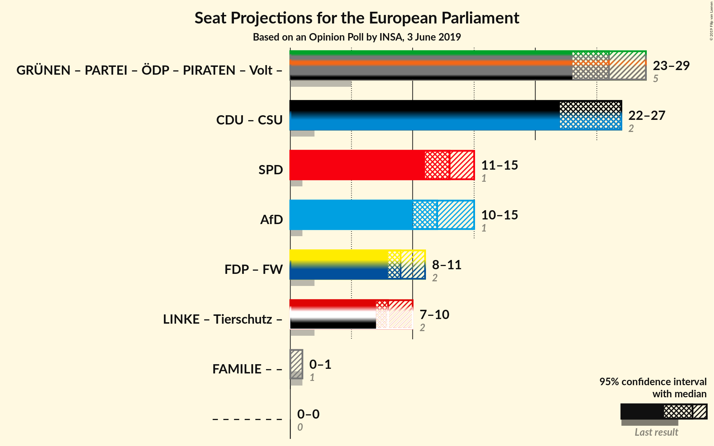

### Confidence Intervals

| Coalition | Last Result | Median | Majority? | 80% Confidence Interval | 90% Confidence Interval | 95% Confidence Interval | 99% Confidence Interval |
|:---------:|:-----------:|:------:|:---------:|:-----------------------:|:-----------------------:|:-----------------------:|:-----------------------:|
| Christlich Demokratische Union Deutschlands (EPP) – Christlich-Soziale Union in Bayern (EPP) | 2 | 27 | 0% | 27 | 25–27 | 25–27 | 23–27 |
| Sozialdemokratische Partei Deutschlands (S&D) | 1 | 13 | 0% | 13 | 13–14 | 13–14 | 13–15 |
| Alternative für Deutschland (EAPN) | 1 | 11 | 0% | 11 | 10–11 | 10–11 | 10–13 |
| Freie Demokratische Partei (ALDE) – Freie Wähler (ALDE) | 2 | 8 | 0% | 8 | 8–10 | 8–10 | 8–10 |

### Christlich Demokratische Union Deutschlands (EPP) – Christlich-Soziale Union in Bayern (EPP)

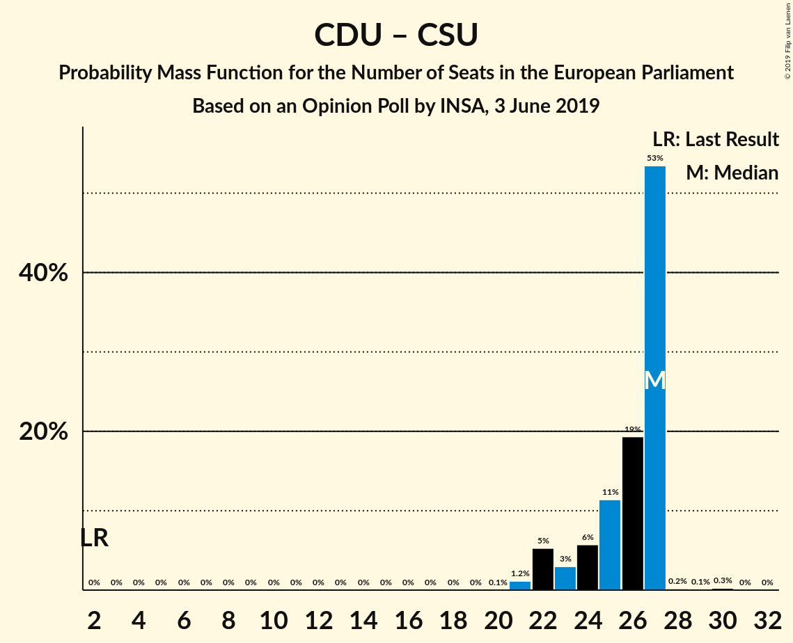

| Number of Seats | Probability | Accumulated | Special Marks |
|:---------------:|:-----------:|:-----------:|:-------------:|
| 2 | 0% | 100% | Last Result |
| 3 | 0% | 100% |  |
| 4 | 0% | 100% |  |
| 5 | 0% | 100% |  |
| 6 | 0% | 100% |  |
| 7 | 0% | 100% |  |
| 8 | 0% | 100% |  |
| 9 | 0% | 100% |  |
| 10 | 0% | 100% |  |
| 11 | 0% | 100% |  |
| 12 | 0% | 100% |  |
| 13 | 0% | 100% |  |
| 14 | 0% | 100% |  |
| 15 | 0% | 100% |  |
| 16 | 0% | 100% |  |
| 17 | 0% | 100% |  |
| 18 | 0% | 100% |  |
| 19 | 0% | 100% |  |
| 20 | 0.2% | 100% |  |
| 21 | 0% | 99.8% |  |
| 22 | 0.2% | 99.8% |  |
| 23 | 1.2% | 99.7% |  |
| 24 | 0.2% | 98% |  |
| 25 | 5% | 98% |  |
| 26 | 0.5% | 93% |  |
| 27 | 93% | 93% | Median |
| 28 | 0% | 0% |  |

### Sozialdemokratische Partei Deutschlands (S&D)

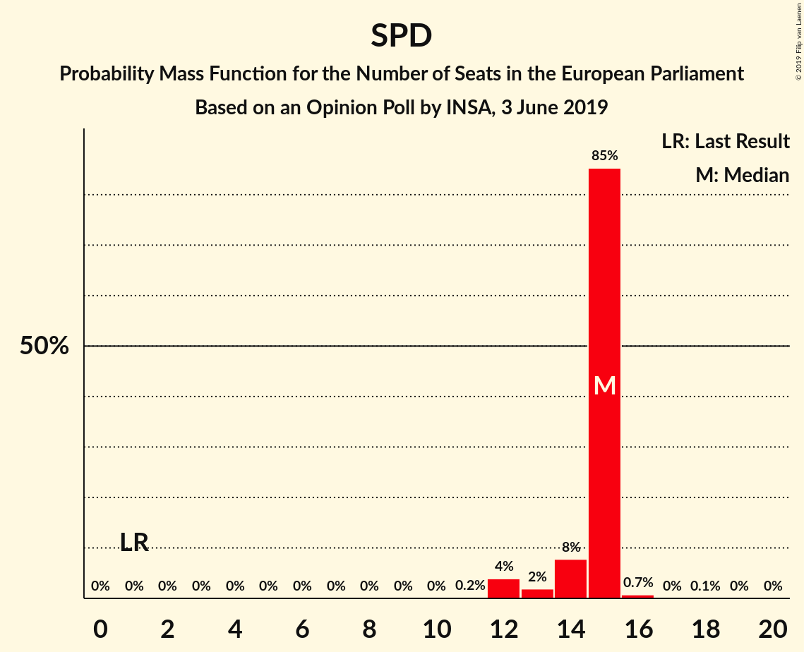

| Number of Seats | Probability | Accumulated | Special Marks |
|:---------------:|:-----------:|:-----------:|:-------------:|
| 1 | 0% | 100% | Last Result |
| 2 | 0% | 100% |  |
| 3 | 0% | 100% |  |
| 4 | 0% | 100% |  |
| 5 | 0% | 100% |  |
| 6 | 0% | 100% |  |
| 7 | 0% | 100% |  |
| 8 | 0% | 100% |  |
| 9 | 0% | 100% |  |
| 10 | 0% | 100% |  |
| 11 | 0.2% | 100% |  |
| 12 | 0.1% | 99.8% |  |
| 13 | 93% | 99.7% | Median |
| 14 | 6% | 7% |  |
| 15 | 0.4% | 0.8% |  |
| 16 | 0.4% | 0.4% |  |
| 17 | 0% | 0% |  |

### Alternative für Deutschland (EAPN)

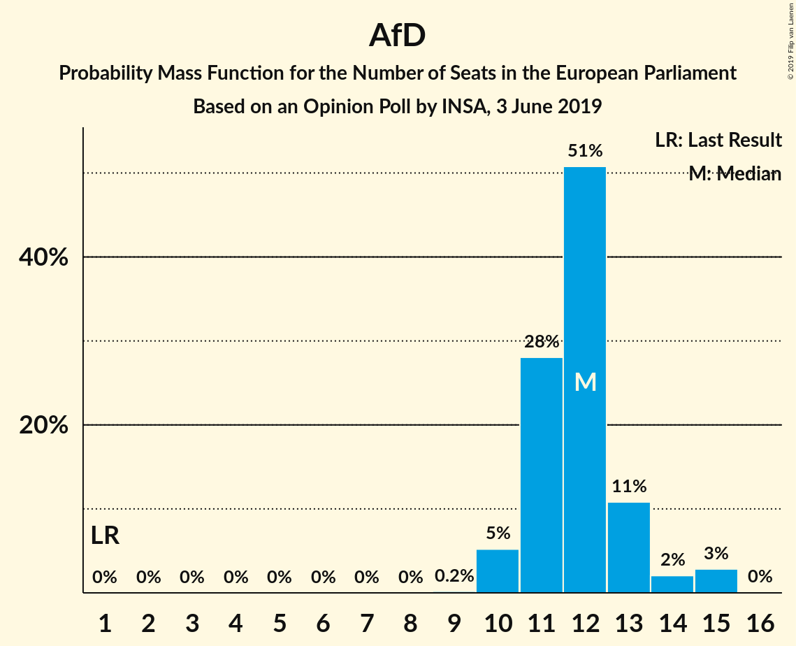

| Number of Seats | Probability | Accumulated | Special Marks |
|:---------------:|:-----------:|:-----------:|:-------------:|
| 1 | 0% | 100% | Last Result |
| 2 | 0% | 100% |  |
| 3 | 0% | 100% |  |
| 4 | 0% | 100% |  |
| 5 | 0% | 100% |  |
| 6 | 0% | 100% |  |
| 7 | 0% | 100% |  |
| 8 | 0% | 100% |  |
| 9 | 0% | 100% |  |
| 10 | 5% | 100% |  |
| 11 | 93% | 95% | Median |
| 12 | 1.0% | 2% |  |
| 13 | 0.5% | 0.9% |  |
| 14 | 0.2% | 0.4% |  |
| 15 | 0.2% | 0.2% |  |
| 16 | 0% | 0% |  |

### Freie Demokratische Partei (ALDE) – Freie Wähler (ALDE)

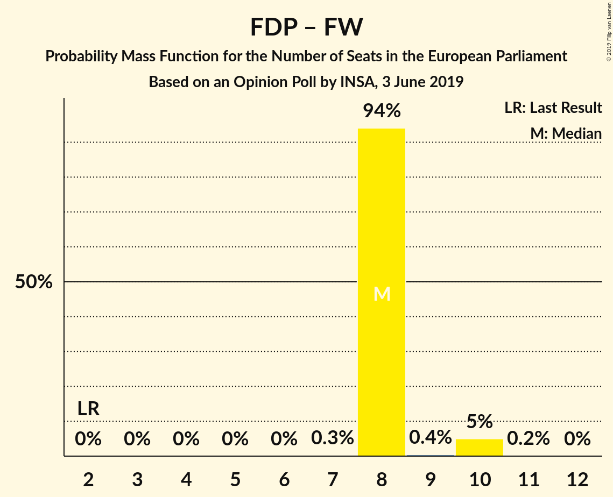

| Number of Seats | Probability | Accumulated | Special Marks |
|:---------------:|:-----------:|:-----------:|:-------------:|
| 2 | 0% | 100% | Last Result |
| 3 | 0% | 100% |  |
| 4 | 0% | 100% |  |
| 5 | 0% | 100% |  |
| 6 | 0% | 100% |  |
| 7 | 0.3% | 100% |  |
| 8 | 94% | 99.7% | Median |
| 9 | 0.4% | 6% |  |
| 10 | 5% | 5% |  |
| 11 | 0.2% | 0.2% |  |
| 12 | 0% | 0% |  |

## Technical Information

### Opinion Poll

+ **Polling firm:** INSA
+ **Commissioner(s):** —
+ **Fieldwork period:** 3 June 2019

### Calculations

+ **Sample size:** 1000
+ **Simulations done:** 131,072
+ **Error estimate:** 2.79%

