# Opinion Poll by Emnid for Bild am Sonntag, 29 May–5 June 2019

<a href="#voting-intentions">Voting Intentions</a> | <a href="#seats">Seats</a> | <a href="#coalitions">Coalitions</a> | <a href="#technical-information">Technical Information</a>

## Voting Intentions

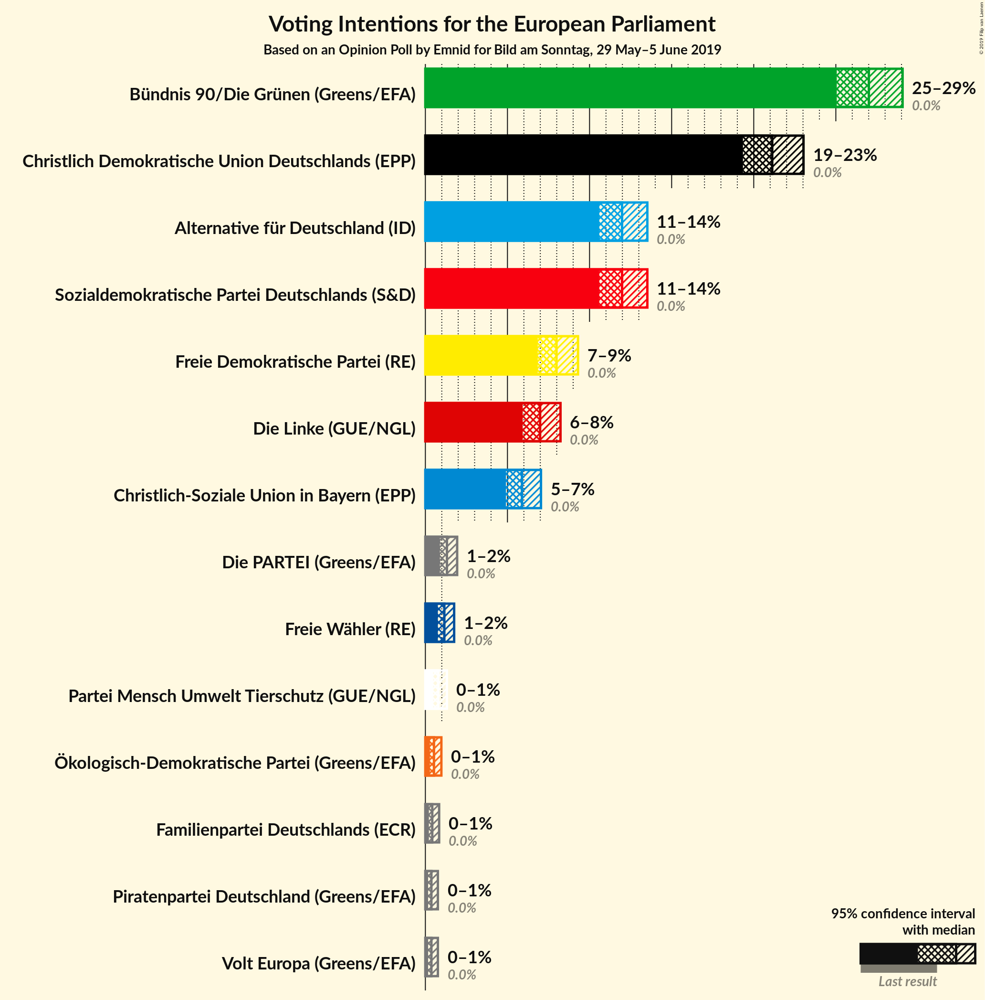

### Confidence Intervals

| Party | Last Result | Poll Result | 80% Confidence Interval | 90% Confidence Interval | 95% Confidence Interval | 99% Confidence Interval |
|:-----:|:-----------:|:-----------:|:-----------------------:|:-----------------------:|:-----------------------:|:-----------------------:|
| Bündnis 90/Die Grünen (Greens/EFA) | 0.0% | 27.0% | 25.7–28.3% |25.4–28.7% |25.1–29.1% |24.4–29.7% |
| Christlich Demokratische Union Deutschlands (EPP) | 0.0% | 21.1% | 20.0–22.4% |19.6–22.7% |19.3–23.0% |18.8–23.6% |
| Sozialdemokratische Partei Deutschlands (S&D) | 0.0% | 12.0% | 11.1–13.0% |10.8–13.3% |10.6–13.5% |10.2–14.0% |
| Alternative für Deutschland (ID) | 0.0% | 12.0% | 11.1–13.0% |10.8–13.3% |10.6–13.5% |10.2–14.0% |
| Freie Demokratische Partei (RE) | 0.0% | 8.0% | 7.2–8.8% |7.0–9.1% |6.8–9.3% |6.5–9.7% |
| Die Linke (GUE/NGL) | 0.0% | 7.0% | 6.3–7.8% |6.1–8.0% |5.9–8.2% |5.6–8.6% |
| Christlich-Soziale Union in Bayern (EPP) | 0.0% | 5.9% | 5.2–6.6% |5.1–6.9% |4.9–7.0% |4.6–7.4% |
| Die PARTEI (Greens/EFA) | 0.0% | 1.3% | 1.0–1.7% |0.9–1.8% |0.9–1.9% |0.8–2.1% |
| Freie Wähler (RE) | 0.0% | 1.2% | 0.9–1.5% |0.8–1.6% |0.8–1.8% |0.7–2.0% |
| Partei Mensch Umwelt Tierschutz (GUE/NGL) | 0.0% | 0.8% | 0.6–1.1% |0.5–1.2% |0.5–1.3% |0.4–1.5% |
| Ökologisch-Demokratische Partei (Greens/EFA) | 0.0% | 0.5% | 0.4–0.8% |0.3–0.9% |0.3–1.0% |0.2–1.1% |
| Familienpartei Deutschlands (ECR) | 0.0% | 0.4% | 0.3–0.7% |0.2–0.8% |0.2–0.8% |0.2–1.0% |
| Volt Europa (Greens/EFA) | 0.0% | 0.4% | 0.2–0.6% |0.2–0.7% |0.2–0.8% |0.1–0.9% |
| Piratenpartei Deutschland (Greens/EFA) | 0.0% | 0.4% | 0.2–0.6% |0.2–0.7% |0.2–0.8% |0.1–0.9% |

*Note:* The poll result column reflects the actual value used in the calculations. Published results may vary slightly, and in addition be rounded to fewer digits.

## Seats

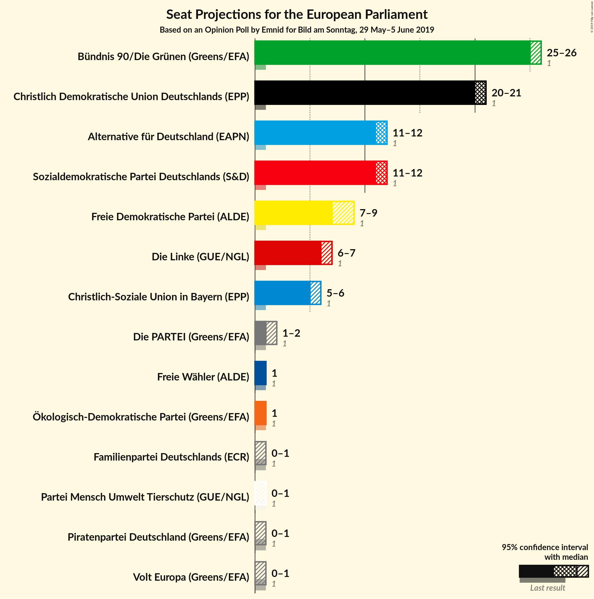

### Confidence Intervals

| Party | Last Result | Median | 80% Confidence Interval | 90% Confidence Interval | 95% Confidence Interval | 99% Confidence Interval |
|:-----:|:-----------:|:------:|:-----------------------:|:-----------------------:|:-----------------------:|:-----------------------:|
| <a href="#bündnis-90/die-grünen-(greens/efa)">Bündnis 90/Die Grünen (Greens/EFA)</a> | 1 | 26 | 25–26 |25–27 |25–27 |24–28 |
| <a href="#christlich-demokratische-union-deutschlands-(epp)">Christlich Demokratische Union Deutschlands (EPP)</a> | 1 | 20 | 20–21 |20–22 |19–23 |18–23 |
| <a href="#sozialdemokratische-partei-deutschlands-(s&d)">Sozialdemokratische Partei Deutschlands (S&D)</a> | 1 | 11 | 11 |10–12 |10–12 |10–14 |
| <a href="#alternative-für-deutschland-(id)">Alternative für Deutschland (ID)</a> | 1 | 12 | 11–13 |10–13 |10–13 |9–13 |
| <a href="#freie-demokratische-partei-(re)">Freie Demokratische Partei (RE)</a> | 1 | 7 | 6–8 |6–8 |6–8 |6–9 |
| <a href="#die-linke-(gue/ngl)">Die Linke (GUE/NGL)</a> | 1 | 7 | 6–7 |6–7 |6–8 |6–9 |
| <a href="#christlich-soziale-union-in-bayern-(epp)">Christlich-Soziale Union in Bayern (EPP)</a> | 1 | 6 | 5–6 |5–6 |5–7 |4–7 |
| <a href="#die-partei-(greens/efa)">Die PARTEI (Greens/EFA)</a> | 1 | 1 | 1 |1–2 |1–2 |1–2 |
| <a href="#freie-wähler-(re)">Freie Wähler (RE)</a> | 1 | 1 | 1 |1 |1 |1–2 |
| <a href="#partei-mensch-umwelt-tierschutz-(gue/ngl)">Partei Mensch Umwelt Tierschutz (GUE/NGL)</a> | 1 | 1 | 1 |1 |1 |0–1 |
| <a href="#ökologisch-demokratische-partei-(greens/efa)">Ökologisch-Demokratische Partei (Greens/EFA)</a> | 1 | 1 | 0–1 |0–1 |0–1 |0–1 |
| <a href="#familienpartei-deutschlands-(ecr)">Familienpartei Deutschlands (ECR)</a> | 1 | 1 | 0–1 |0–1 |0–1 |0–1 |
| <a href="#volt-europa-(greens/efa)">Volt Europa (Greens/EFA)</a> | 1 | 0 | 0–1 |0–1 |0–1 |0–1 |
| <a href="#piratenpartei-deutschland-(greens/efa)">Piratenpartei Deutschland (Greens/EFA)</a> | 1 | 0 | 0–1 |0–1 |0–1 |0–1 |

### Bündnis 90/Die Grünen (Greens/EFA)

*For a full overview of the results for this party, see the [Bündnis 90/Die Grünen (Greens/EFA)](party-bündnis90diegrünengreensefa.html) page.*

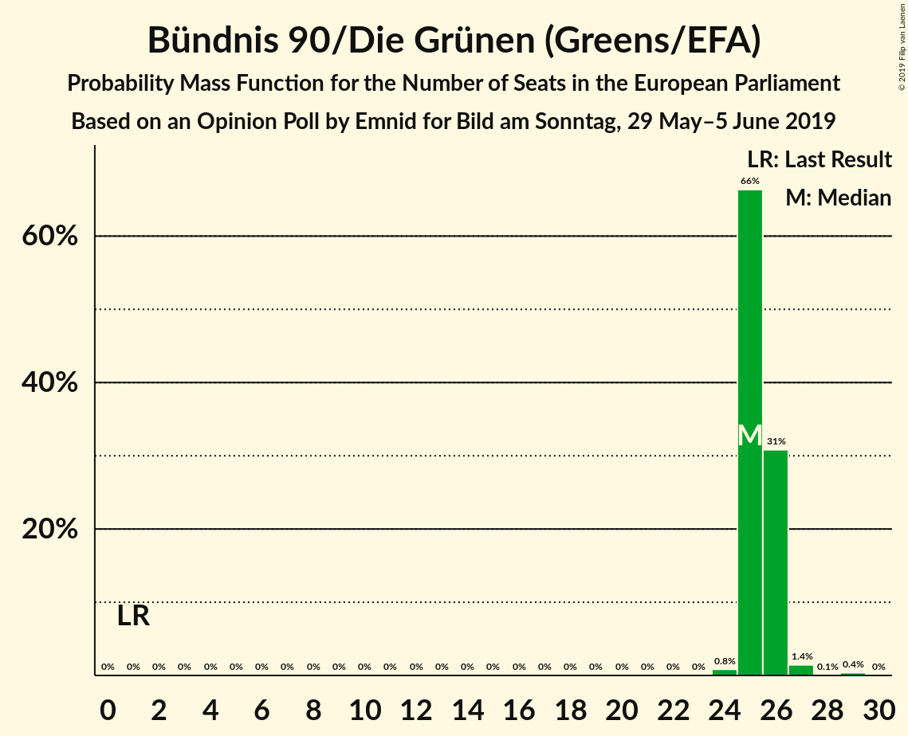

| Number of Seats | Probability | Accumulated | Special Marks |
|:---------------:|:-----------:|:-----------:|:-------------:|
| 1 | 0% | 100% | Last Result |
| 2 | 0% | 100% |  |
| 3 | 0% | 100% |  |
| 4 | 0% | 100% |  |
| 5 | 0% | 100% |  |
| 6 | 0% | 100% |  |
| 7 | 0% | 100% |  |
| 8 | 0% | 100% |  |
| 9 | 0% | 100% |  |
| 10 | 0% | 100% |  |
| 11 | 0% | 100% |  |
| 12 | 0% | 100% |  |
| 13 | 0% | 100% |  |
| 14 | 0% | 100% |  |
| 15 | 0% | 100% |  |
| 16 | 0% | 100% |  |
| 17 | 0% | 100% |  |
| 18 | 0% | 100% |  |
| 19 | 0% | 100% |  |
| 20 | 0% | 100% |  |
| 21 | 0% | 100% |  |
| 22 | 0% | 100% |  |
| 23 | 0.3% | 100% |  |
| 24 | 1.0% | 99.7% |  |
| 25 | 10% | 98.8% |  |
| 26 | 82% | 89% | Median |
| 27 | 6% | 7% |  |
| 28 | 1.0% | 1.0% |  |
| 29 | 0% | 0.1% |  |
| 30 | 0% | 0% |  |

### Christlich Demokratische Union Deutschlands (EPP)

*For a full overview of the results for this party, see the [Christlich Demokratische Union Deutschlands (EPP)](party-christlichdemokratischeuniondeutschlandsepp.html) page.*

| Number of Seats | Probability | Accumulated | Special Marks |
|:---------------:|:-----------:|:-----------:|:-------------:|
| 1 | 0% | 100% | Last Result |
| 2 | 0% | 100% |  |
| 3 | 0% | 100% |  |
| 4 | 0% | 100% |  |
| 5 | 0% | 100% |  |
| 6 | 0% | 100% |  |
| 7 | 0% | 100% |  |
| 8 | 0% | 100% |  |
| 9 | 0% | 100% |  |
| 10 | 0% | 100% |  |
| 11 | 0% | 100% |  |
| 12 | 0% | 100% |  |
| 13 | 0% | 100% |  |
| 14 | 0% | 100% |  |
| 15 | 0% | 100% |  |
| 16 | 0% | 100% |  |
| 17 | 0.1% | 100% |  |
| 18 | 0.4% | 99.9% |  |
| 19 | 4% | 99.5% |  |
| 20 | 48% | 95% | Median |
| 21 | 39% | 47% |  |
| 22 | 5% | 8% |  |
| 23 | 3% | 3% |  |
| 24 | 0% | 0% |  |

### Sozialdemokratische Partei Deutschlands (S&D)

*For a full overview of the results for this party, see the [Sozialdemokratische Partei Deutschlands (S&D)](party-sozialdemokratischeparteideutschlandssd.html) page.*

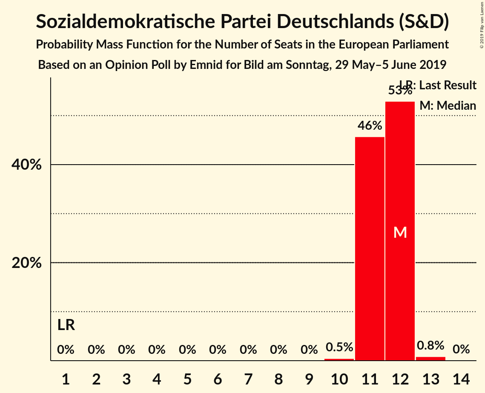

| Number of Seats | Probability | Accumulated | Special Marks |
|:---------------:|:-----------:|:-----------:|:-------------:|
| 1 | 0% | 100% | Last Result |
| 2 | 0% | 100% |  |
| 3 | 0% | 100% |  |
| 4 | 0% | 100% |  |
| 5 | 0% | 100% |  |
| 6 | 0% | 100% |  |
| 7 | 0% | 100% |  |
| 8 | 0% | 100% |  |
| 9 | 0% | 100% |  |
| 10 | 7% | 100% |  |
| 11 | 85% | 93% | Median |
| 12 | 6% | 8% |  |
| 13 | 2% | 2% |  |
| 14 | 0.5% | 0.5% |  |
| 15 | 0% | 0% |  |

### Alternative für Deutschland (ID)

*For a full overview of the results for this party, see the [Alternative für Deutschland (ID)](party-alternativefürdeutschlandid.html) page.*

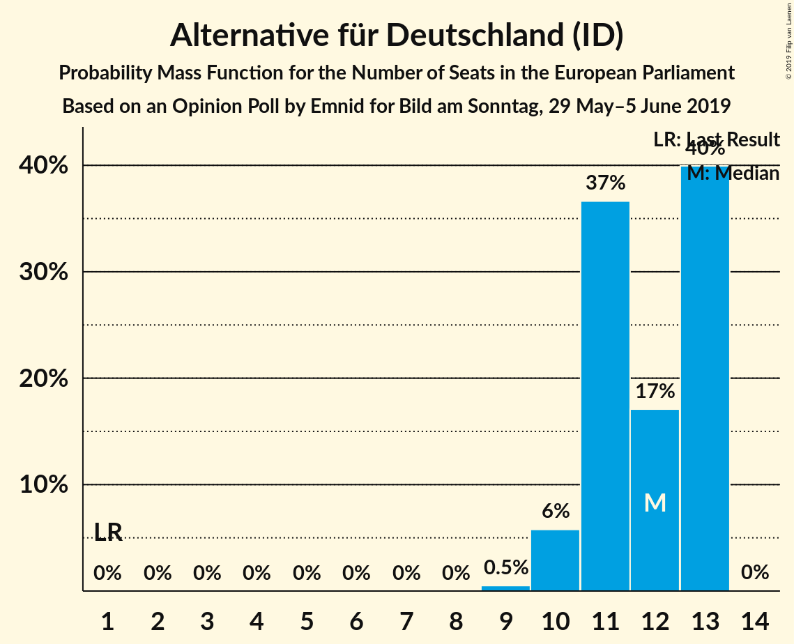

| Number of Seats | Probability | Accumulated | Special Marks |
|:---------------:|:-----------:|:-----------:|:-------------:|
| 1 | 0% | 100% | Last Result |
| 2 | 0% | 100% |  |
| 3 | 0% | 100% |  |
| 4 | 0% | 100% |  |
| 5 | 0% | 100% |  |
| 6 | 0% | 100% |  |
| 7 | 0% | 100% |  |
| 8 | 0% | 100% |  |
| 9 | 0.5% | 100% |  |
| 10 | 6% | 99.5% |  |
| 11 | 37% | 94% |  |
| 12 | 17% | 57% | Median |
| 13 | 40% | 40% |  |
| 14 | 0% | 0% |  |

### Freie Demokratische Partei (RE)

*For a full overview of the results for this party, see the [Freie Demokratische Partei (RE)](party-freiedemokratischeparteire.html) page.*

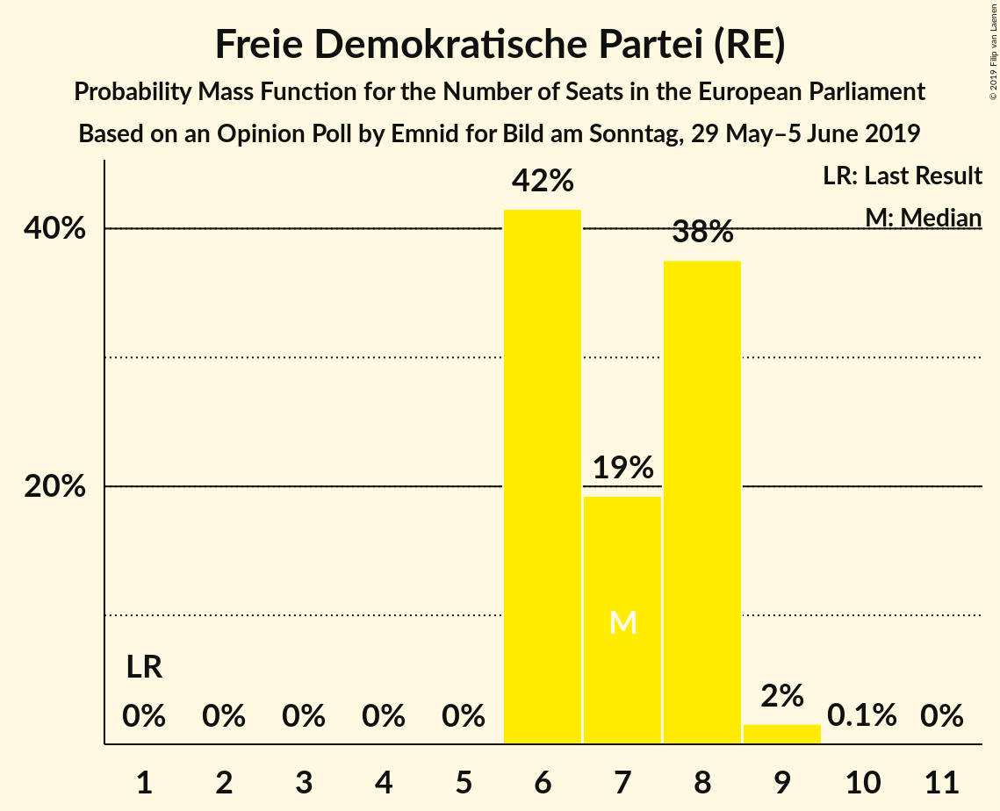

| Number of Seats | Probability | Accumulated | Special Marks |
|:---------------:|:-----------:|:-----------:|:-------------:|
| 1 | 0% | 100% | Last Result |
| 2 | 0% | 100% |  |
| 3 | 0% | 100% |  |
| 4 | 0% | 100% |  |
| 5 | 0% | 100% |  |
| 6 | 42% | 100% |  |
| 7 | 19% | 58% | Median |
| 8 | 38% | 39% |  |
| 9 | 2% | 2% |  |
| 10 | 0.1% | 0.1% |  |
| 11 | 0% | 0% |  |

### Die Linke (GUE/NGL)

*For a full overview of the results for this party, see the [Die Linke (GUE/NGL)](party-dielinkeguengl.html) page.*

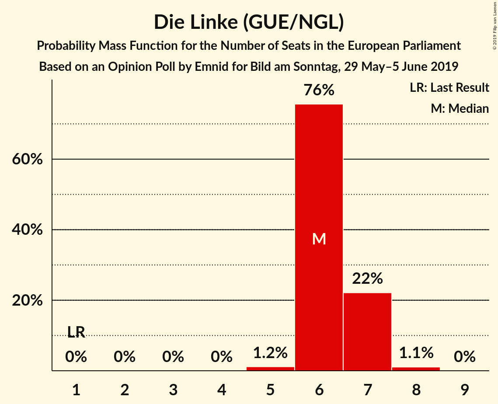

| Number of Seats | Probability | Accumulated | Special Marks |
|:---------------:|:-----------:|:-----------:|:-------------:|
| 1 | 0% | 100% | Last Result |
| 2 | 0% | 100% |  |
| 3 | 0% | 100% |  |
| 4 | 0% | 100% |  |
| 5 | 0.4% | 100% |  |
| 6 | 17% | 99.6% |  |
| 7 | 78% | 83% | Median |
| 8 | 4% | 5% |  |
| 9 | 0.5% | 0.5% |  |
| 10 | 0% | 0% |  |

### Christlich-Soziale Union in Bayern (EPP)

*For a full overview of the results for this party, see the [Christlich-Soziale Union in Bayern (EPP)](party-christlich-sozialeunioninbayernepp.html) page.*

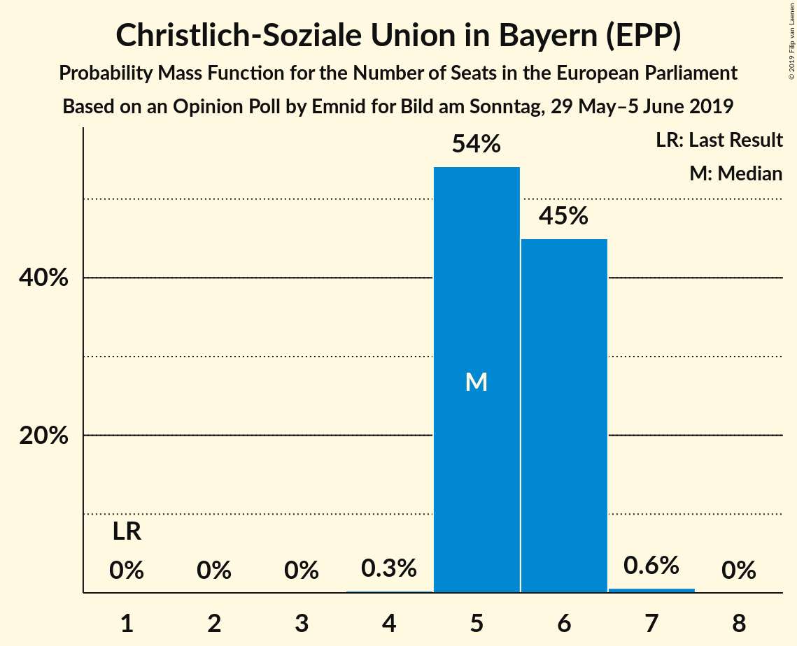

| Number of Seats | Probability | Accumulated | Special Marks |
|:---------------:|:-----------:|:-----------:|:-------------:|
| 1 | 0% | 100% | Last Result |
| 2 | 0% | 100% |  |
| 3 | 0% | 100% |  |
| 4 | 0.8% | 100% |  |
| 5 | 39% | 99.2% |  |
| 6 | 56% | 61% | Median |
| 7 | 5% | 5% |  |
| 8 | 0% | 0% |  |

### Die PARTEI (Greens/EFA)

*For a full overview of the results for this party, see the [Die PARTEI (Greens/EFA)](party-dieparteigreensefa.html) page.*

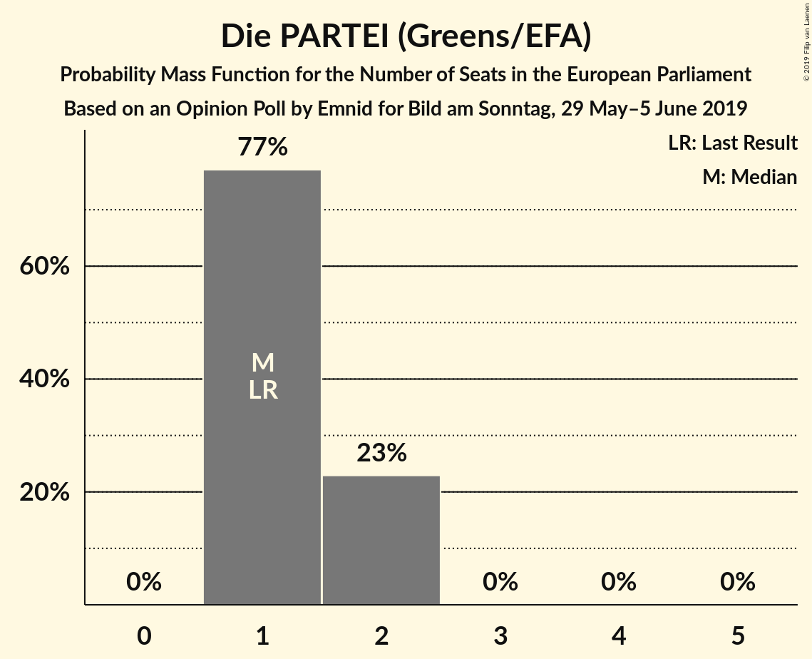

| Number of Seats | Probability | Accumulated | Special Marks |
|:---------------:|:-----------:|:-----------:|:-------------:|
| 1 | 91% | 100% | Last Result, Median |
| 2 | 9% | 9% |  |
| 3 | 0% | 0% |  |

### Freie Wähler (RE)

*For a full overview of the results for this party, see the [Freie Wähler (RE)](party-freiewählerre.html) page.*

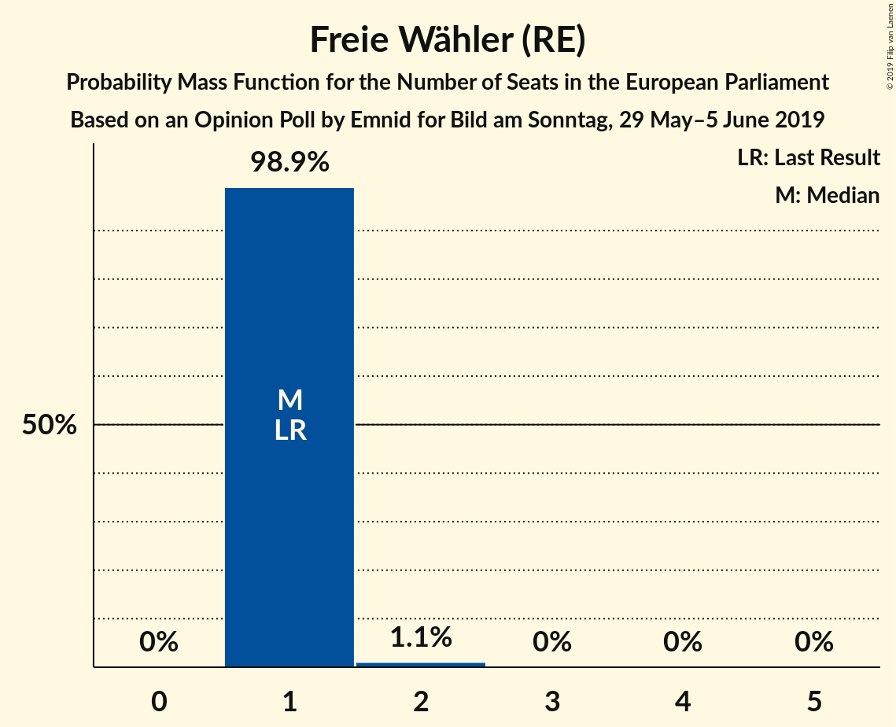

| Number of Seats | Probability | Accumulated | Special Marks |
|:---------------:|:-----------:|:-----------:|:-------------:|
| 1 | 98.9% | 100% | Last Result, Median |
| 2 | 1.1% | 1.1% |  |
| 3 | 0% | 0% |  |

### Partei Mensch Umwelt Tierschutz (GUE/NGL)

*For a full overview of the results for this party, see the [Partei Mensch Umwelt Tierschutz (GUE/NGL)](party-parteimenschumwelttierschutzguengl.html) page.*

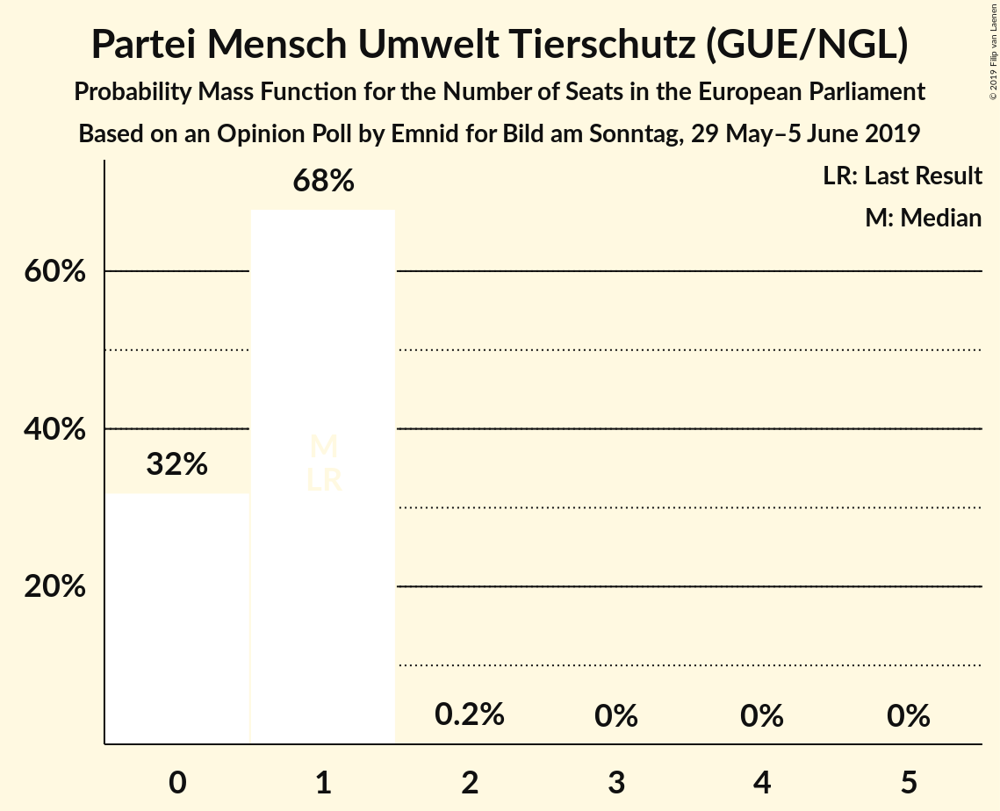

| Number of Seats | Probability | Accumulated | Special Marks |
|:---------------:|:-----------:|:-----------:|:-------------:|
| 0 | 2% | 100% |  |
| 1 | 97% | 98% | Last Result, Median |
| 2 | 0.1% | 0.1% |  |
| 3 | 0% | 0% |  |

### Ökologisch-Demokratische Partei (Greens/EFA)

*For a full overview of the results for this party, see the [Ökologisch-Demokratische Partei (Greens/EFA)](party-ökologisch-demokratischeparteigreensefa.html) page.*

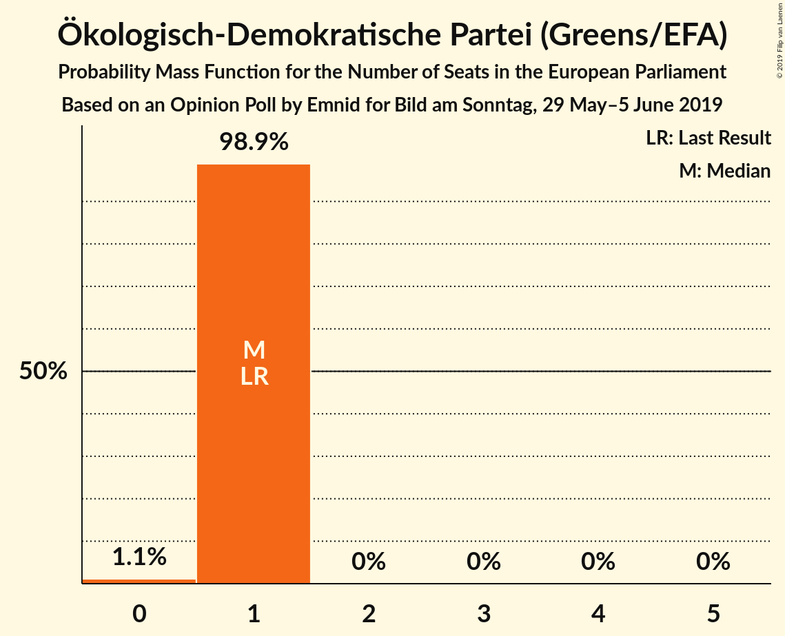

| Number of Seats | Probability | Accumulated | Special Marks |
|:---------------:|:-----------:|:-----------:|:-------------:|
| 0 | 41% | 100% |  |
| 1 | 59% | 59% | Last Result, Median |
| 2 | 0% | 0% |  |

### Familienpartei Deutschlands (ECR)

*For a full overview of the results for this party, see the [Familienpartei Deutschlands (ECR)](party-familienparteideutschlandsecr.html) page.*

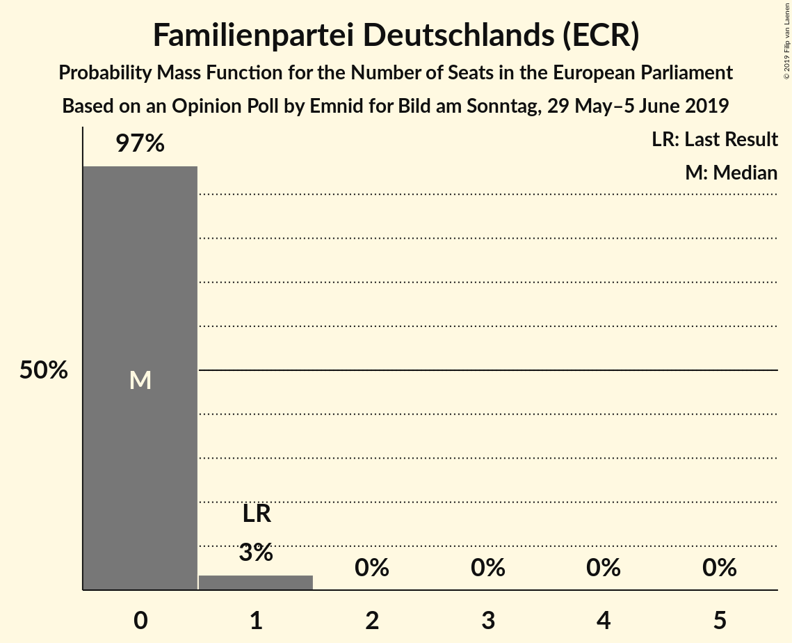

| Number of Seats | Probability | Accumulated | Special Marks |
|:---------------:|:-----------:|:-----------:|:-------------:|
| 0 | 22% | 100% |  |
| 1 | 78% | 78% | Last Result, Median |
| 2 | 0% | 0% |  |

### Volt Europa (Greens/EFA)

*For a full overview of the results for this party, see the [Volt Europa (Greens/EFA)](party-volteuropagreensefa.html) page.*

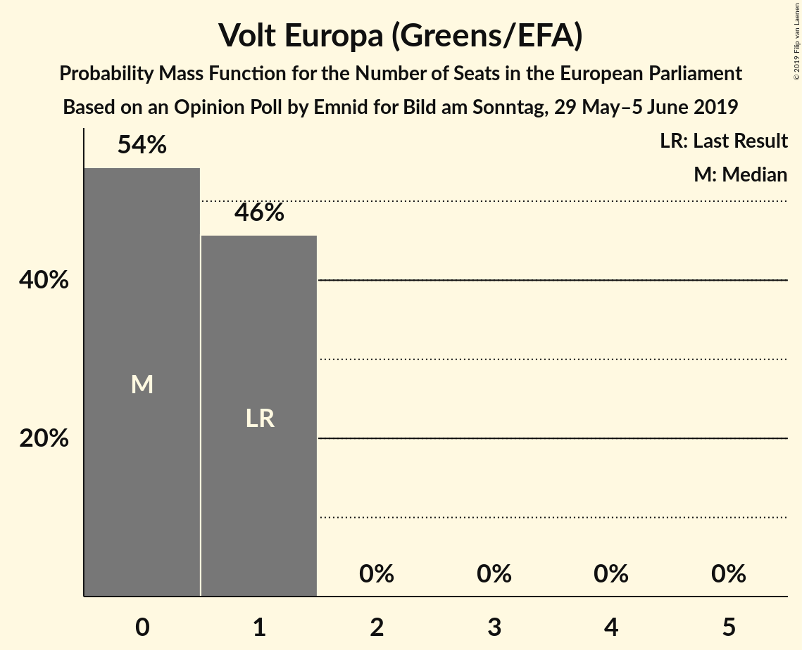

| Number of Seats | Probability | Accumulated | Special Marks |
|:---------------:|:-----------:|:-----------:|:-------------:|
| 0 | 58% | 100% | Median |
| 1 | 42% | 42% | Last Result |
| 2 | 0% | 0% |  |

### Piratenpartei Deutschland (Greens/EFA)

*For a full overview of the results for this party, see the [Piratenpartei Deutschland (Greens/EFA)](party-piratenparteideutschlandgreensefa.html) page.*

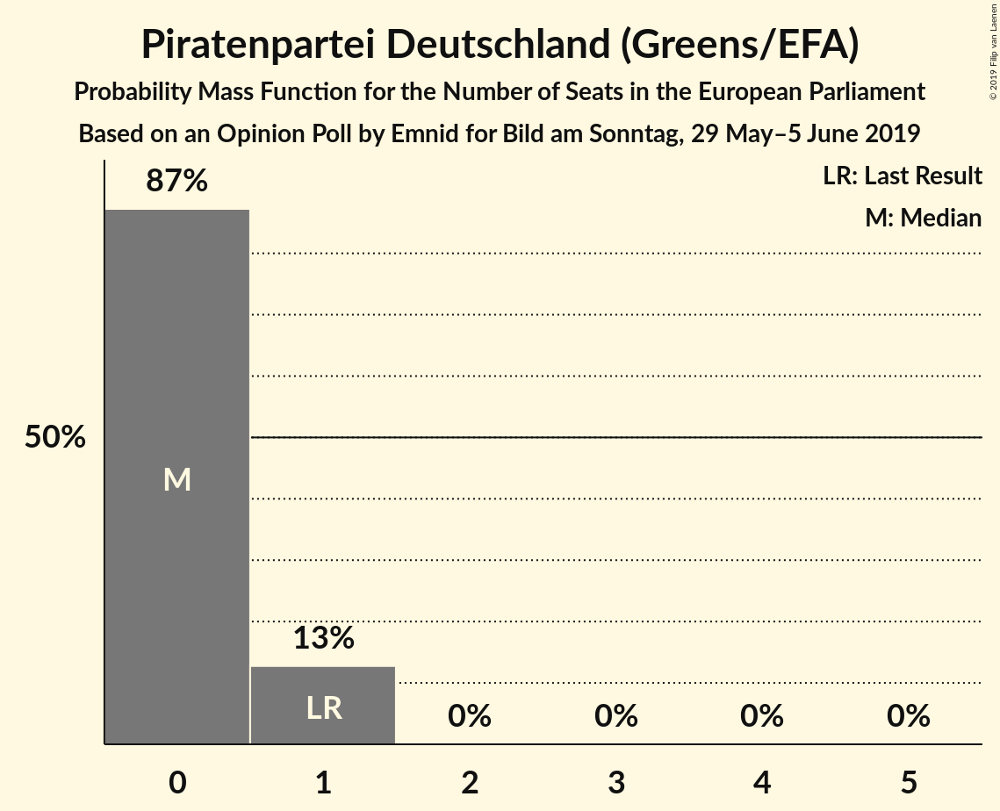

| Number of Seats | Probability | Accumulated | Special Marks |
|:---------------:|:-----------:|:-----------:|:-------------:|
| 0 | 87% | 100% | Median |
| 1 | 13% | 13% | Last Result |
| 2 | 0% | 0% |  |

## Coalitions

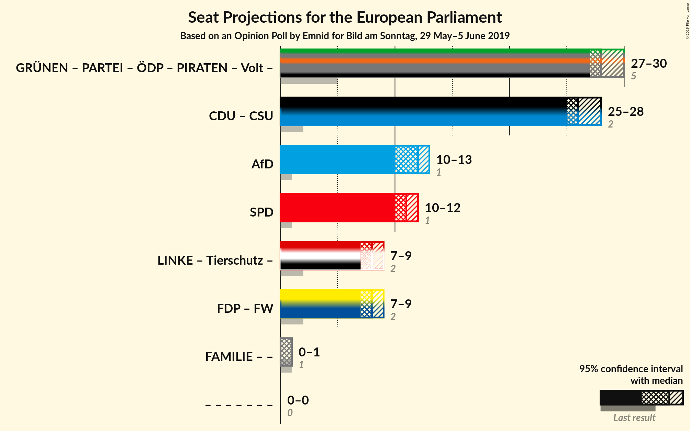

### Confidence Intervals

| Coalition | Last Result | Median | Majority? | 80% Confidence Interval | 90% Confidence Interval | 95% Confidence Interval | 99% Confidence Interval |
|:---------:|:-----------:|:------:|:---------:|:-----------------------:|:-----------------------:|:-----------------------:|:-----------------------:|
| Christlich Demokratische Union Deutschlands (EPP) – Christlich-Soziale Union in Bayern (EPP) | 2 | 26 | 0% | 26–27 | 25–28 | 25–28 | 24–28 |
| Alternative für Deutschland (ID) | 1 | 12 | 0% | 11–13 | 10–13 | 10–13 | 9–13 |
| Sozialdemokratische Partei Deutschlands (S&D) | 1 | 11 | 0% | 11 | 10–12 | 10–12 | 10–14 |
| Freie Demokratische Partei (RE) – Freie Wähler (RE) | 2 | 8 | 0% | 7–9 | 7–9 | 7–9 | 7–10 |

### Christlich Demokratische Union Deutschlands (EPP) – Christlich-Soziale Union in Bayern (EPP)

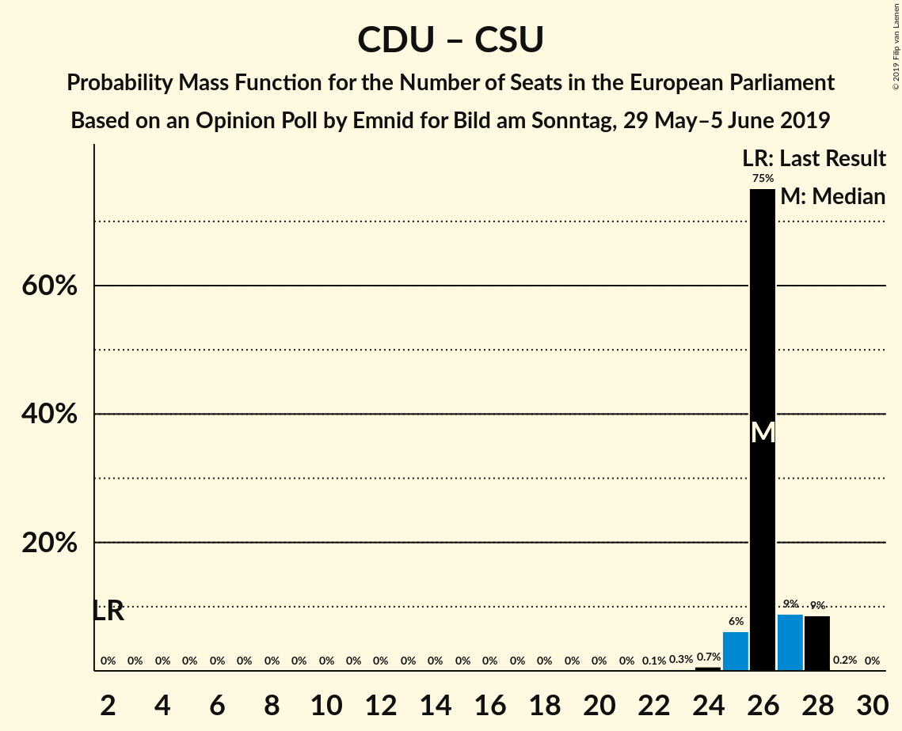

| Number of Seats | Probability | Accumulated | Special Marks |
|:---------------:|:-----------:|:-----------:|:-------------:|
| 2 | 0% | 100% | Last Result |
| 3 | 0% | 100% |  |
| 4 | 0% | 100% |  |
| 5 | 0% | 100% |  |
| 6 | 0% | 100% |  |
| 7 | 0% | 100% |  |
| 8 | 0% | 100% |  |
| 9 | 0% | 100% |  |
| 10 | 0% | 100% |  |
| 11 | 0% | 100% |  |
| 12 | 0% | 100% |  |
| 13 | 0% | 100% |  |
| 14 | 0% | 100% |  |
| 15 | 0% | 100% |  |
| 16 | 0% | 100% |  |
| 17 | 0% | 100% |  |
| 18 | 0% | 100% |  |
| 19 | 0% | 100% |  |
| 20 | 0% | 100% |  |
| 21 | 0% | 100% |  |
| 22 | 0.1% | 100% |  |
| 23 | 0.3% | 99.9% |  |
| 24 | 0.7% | 99.7% |  |
| 25 | 6% | 99.0% |  |
| 26 | 75% | 93% | Median |
| 27 | 9% | 18% |  |
| 28 | 9% | 9% |  |
| 29 | 0.2% | 0.2% |  |
| 30 | 0% | 0% |  |

### Alternative für Deutschland (ID)

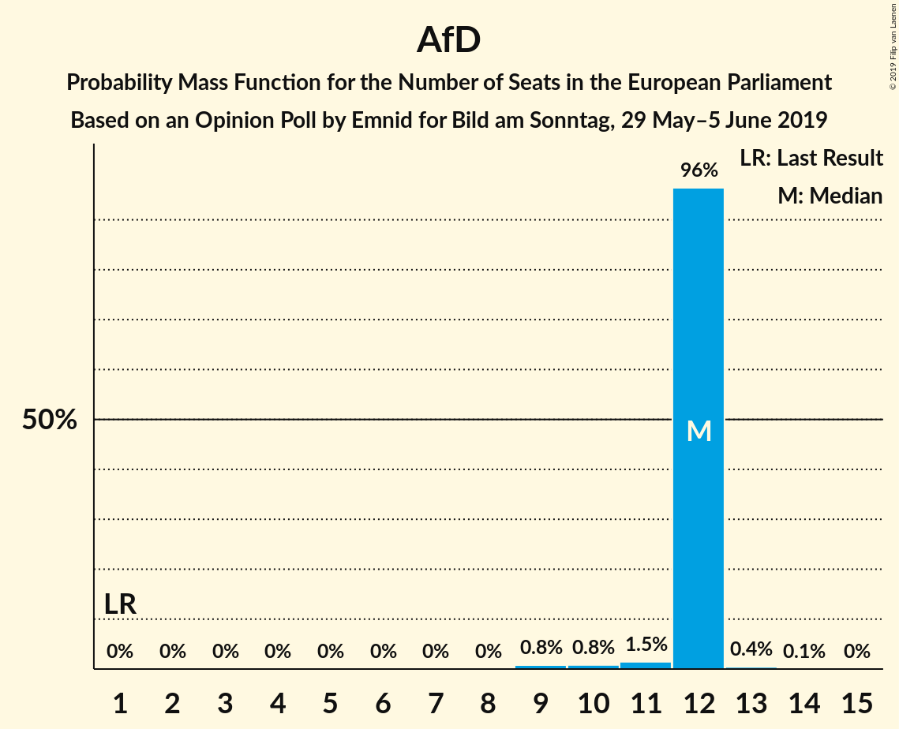

| Number of Seats | Probability | Accumulated | Special Marks |
|:---------------:|:-----------:|:-----------:|:-------------:|
| 1 | 0% | 100% | Last Result |
| 2 | 0% | 100% |  |
| 3 | 0% | 100% |  |
| 4 | 0% | 100% |  |
| 5 | 0% | 100% |  |
| 6 | 0% | 100% |  |
| 7 | 0% | 100% |  |
| 8 | 0% | 100% |  |
| 9 | 0.5% | 100% |  |
| 10 | 6% | 99.5% |  |
| 11 | 37% | 94% |  |
| 12 | 17% | 57% | Median |
| 13 | 40% | 40% |  |
| 14 | 0% | 0% |  |

### Sozialdemokratische Partei Deutschlands (S&D)

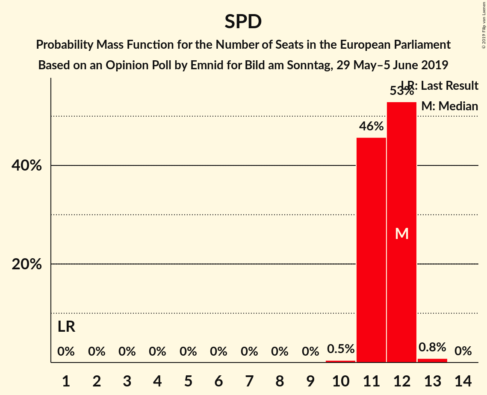

| Number of Seats | Probability | Accumulated | Special Marks |
|:---------------:|:-----------:|:-----------:|:-------------:|
| 1 | 0% | 100% | Last Result |
| 2 | 0% | 100% |  |
| 3 | 0% | 100% |  |
| 4 | 0% | 100% |  |
| 5 | 0% | 100% |  |
| 6 | 0% | 100% |  |
| 7 | 0% | 100% |  |
| 8 | 0% | 100% |  |
| 9 | 0% | 100% |  |
| 10 | 7% | 100% |  |
| 11 | 85% | 93% | Median |
| 12 | 6% | 8% |  |
| 13 | 2% | 2% |  |
| 14 | 0.5% | 0.5% |  |
| 15 | 0% | 0% |  |

### Freie Demokratische Partei (RE) – Freie Wähler (RE)

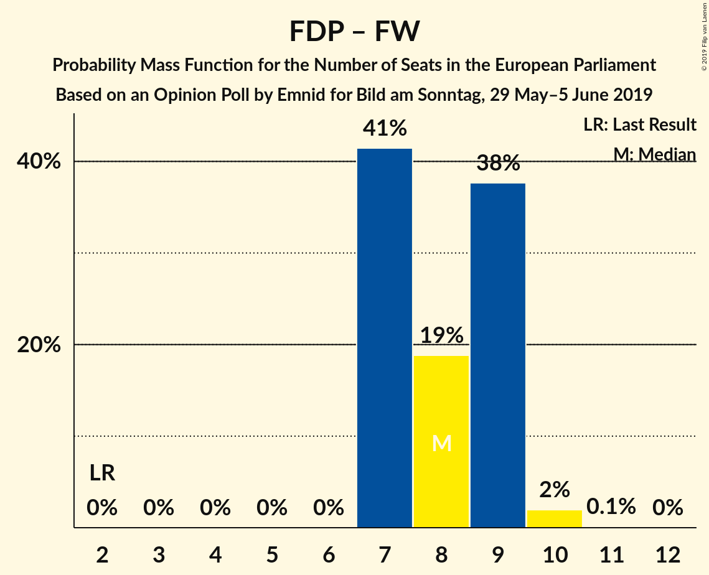

| Number of Seats | Probability | Accumulated | Special Marks |
|:---------------:|:-----------:|:-----------:|:-------------:|
| 2 | 0% | 100% | Last Result |
| 3 | 0% | 100% |  |
| 4 | 0% | 100% |  |
| 5 | 0% | 100% |  |
| 6 | 0% | 100% |  |
| 7 | 41% | 100% |  |
| 8 | 19% | 59% | Median |
| 9 | 38% | 40% |  |
| 10 | 2% | 2% |  |
| 11 | 0.1% | 0.1% |  |
| 12 | 0% | 0% |  |

## Technical Information

### Opinion Poll

+ **Polling firm:** Emnid
+ **Commissioner(s):** Bild am Sonntag
+ **Fieldwork period:** 29 May–5 June 2019

### Calculations

+ **Sample size:** 1903
+ **Simulations done:** 1,048,576
+ **Error estimate:** 1.62%

