# Poll Average

<a href="#voting-intentions">Voting Intentions</a> | <a href="#seats">Seats</a> | <a href="#coalitions">Coalitions</a> | <a href="#technical-information">Technical Information</a>

## Summary

The table below lists the polls on which the average is based. They are the most recent polls (less than 60 days old) registered and analyzed so far.

| Period     | Polling firm/Commissioner(s) | CDU | SPD | GRÜNEN | LINKE | AfD | CSU | FDP | FW | Tierschutz | ÖDP | PARTEI |
|:----------:|:----------------------------:|:--:|:--:|:--:|:--:|:--:|:--:|:--:|:--:|:--:|:--:|:--:|
| 25 May 2014 | General Election | 30.0%   29 | 27.3%   27 | 10.7%   11 | 7.4%   7 | 7.0%   7 | 5.3%   5 | 3.4%   3 | 1.5%   1 | 1.2%   1 | 0.6%   1 | 0.6%   1 |
| N/A | Poll Average | 22–28%   21–27 | 15–20%   14–20 | 16–21%   15–20 | 5–10%   5–10 | 9–15%   8–14 | 4–6%   3–6 | 6–11%   6–10 | 0–2%   1–2 | 0–2%   0–2 | N/A   N/A | 0–2%   1–2 |
| [29–30 April 2019](2019-04-30-Infratestdimap.html) | Infratest dimap   ARD | 23–27%   22–25 | 17–21%   16–20 | 17–21%   16–20 | 6–8%   6–8 | 9–12%   8–11 | 3–6%   3–5 | 6–8%   6–8 | 1–3%   1–3 | 1–2%   1–2 | N/A   N/A | 1–3%   1–2 |
| [25–30 April 2019](2019-04-30-Emnid.html) | Emnid   Bild am Sonntag | 22–26%   21–24 | 15–19%   15–18 | 17–21%   17–20 | 8–10%   8–10 | 12–15%   11–14 | 3–5%   3–5 | 8–10%   7–10 | 1–2%   1 | 0–1%   0–1 | N/A   N/A | 1–2%   1–2 |
| [26–29 April 2019](2019-04-29-YouGov.html) | YouGov   RedaktionsNetzwerk Deutschland | 23–27%   22–26 | 16–20%   16–19 | 15–19%   15–18 | 8–11%   7–10 | 11–15%   11–14 | 3–6%   3–5 | 8–11%   7–10 | 1–2%   1 | 0–1%   0–1 | N/A   N/A | 1–2%   1–2 |
| [26–29 April 2019](2019-04-29-INSAandYouGov.html) | INSA and YouGov   Bild | 21–25%   20–23 | 14–18%   14–17 | 17–21%   17–19 | 8–10%   8–9 | 13–16%   12–15 | 4–6%   4–6 | 9–11%   8–11 | 0–1%   1 | 0–1%   0–1 | N/A   N/A | 0–1%   1 |
| [23–26 April 2019](2019-04-26-Forsa.html) | Forsa   Stern and RTL | 21–25%   20–24 | 15–19%   15–18 | 18–22%   17–21 | 8–11%   7–10 | 11–15%   11–14 | 3–5%   3–5 | 7–9%   6–9 | 1–2%   1–2 | 1–2%   1–2 | N/A   N/A | 1–2%   1–2 |
| [1–12 April 2019](2019-04-12-Allensbach.html) | Allensbach   Frankfurter Allgemeine Zeitung | 23–28%   22–26 | 16–21%   16–19 | 16–20%   15–19 | 7–10%   6–9 | 11–14%   10–14 | 4–6%   3–5 | 8–11%   7–10 | 0–1%   0–1 | 0–1%   0–1 | N/A   N/A | 0–1%   0–1 |
| [9–11 April 2019](2019-04-11-ForschungsgruppeWahlen.html) | Forschungsgruppe Wahlen   ZDF | 25–30%   24–28 | 16–20%   15–20 | 17–21%   16–20 | 5–7%   5–7 | 8–12%   8–11 | 4–6%   4–6 | 6–9%   5–8 | 1–2%   1–2 | 1–2%   1–2 | N/A   N/A | 1–2%   1–2 |
| 25 May 2014 | General Election | 30.0%   29 | 27.3%   27 | 10.7%   11 | 7.4%   7 | 7.0%   7 | 5.3%   5 | 3.4%   3 | 1.5%   1 | 1.2%   1 | 0.6%   1 | 0.6%   1 |

Only polls for which at least the sample size has been published are included in the table above.

**Legend:**
+ **Top half of each row:** Voting intentions (95% confidence interval)
+ **Bottom half of each row:** Seat projections for the European Parliament (95% confidence interval)
+ **CDU:** CDU (EPP)
+ **SPD:** SPD (S&D)
+ **GRÜNEN:** BÜNDNIS 90/DIE GRÜNEN (Greens/EFA)
+ **LINKE:** DIE LINKE (GUE/NGL)
+ **AfD:** Alternative für Deutschland (EAPN)
+ **CSU:** CSU (EPP)
+ **FDP:** FDP (ALDE)
+ **FW:** FREIE WÄHLER (ALDE)
+ **Tierschutz:** Partei Mensch Umwelt Tierschutz (GUE/NGL)
+ **ÖDP:** ÖDP (Greens/EFA)
+ **PARTEI:** Die PARTEI (NI)
+ **N/A (single party):** Party not included the published results
+ **N/A (entire row):** Calculation for this opinion poll not started yet

## Voting Intentions

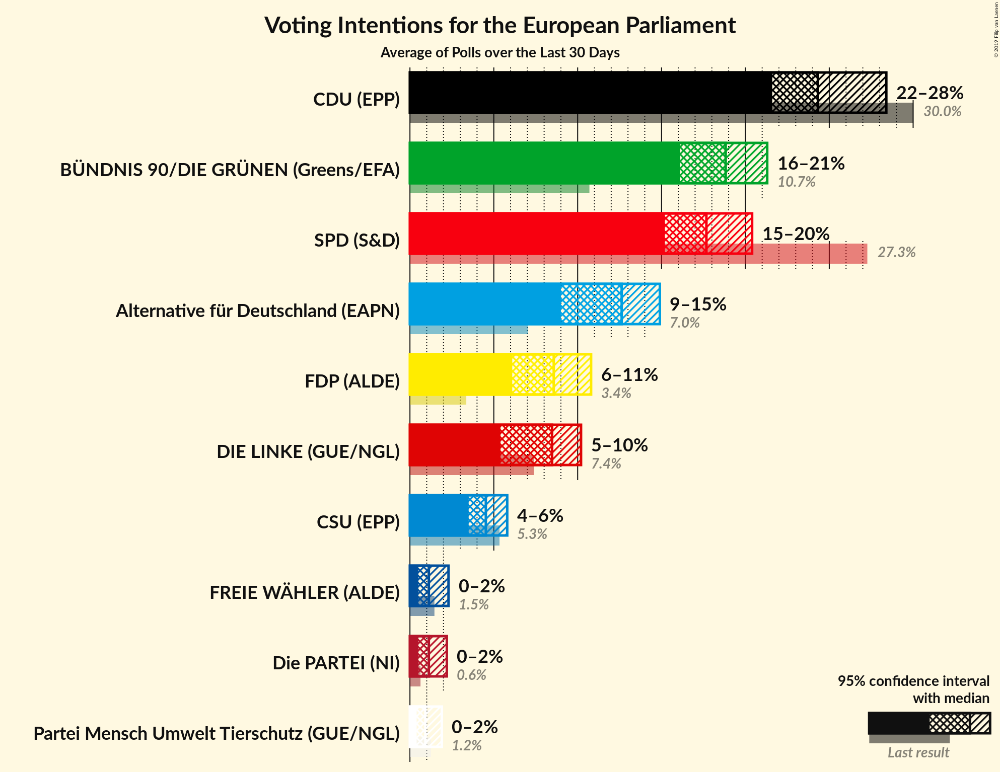

### Confidence Intervals

| Party | Last Result | Median | 80% Confidence Interval | 90% Confidence Interval | 95% Confidence Interval | 99% Confidence Interval |
|:-----:|:-----------:|:------:|:-----------------------:|:-----------------------:|:-----------------------:|:-----------------------:|
| <a href="#cdu-(epp)">CDU (EPP)</a> | 30.0% | 24.3% | 22.4–27.0% |22.0–27.8% | 21.6–28.4% | 20.9–29.5% |
| <a href="#spd-(s&d)">SPD (S&D)</a> | 27.3% | 17.7% | 15.9–19.5% |15.5–19.9% | 15.2–20.4% | 14.5–21.1% |
| <a href="#bündnis-90/die-grünen-(greens/efa)">BÜNDNIS 90/DIE GRÜNEN (Greens/EFA)</a> | 10.7% | 18.8% | 17.0–20.4% |16.5–20.9% | 16.1–21.3% | 15.3–22.0% |
| <a href="#die-linke-(gue/ngl)">DIE LINKE (GUE/NGL)</a> | 7.4% | 8.5% | 6.2–9.7% |5.8–10.0% | 5.4–10.2% | 4.9–10.8% |
| <a href="#alternative-für-deutschland-(eapn)">Alternative für Deutschland (EAPN)</a> | 7.0% | 12.6% | 9.7–14.2% |9.3–14.6% | 9.0–14.9% | 8.4–15.6% |
| <a href="#csu-(epp)">CSU (EPP)</a> | 5.3% | 4.5% | 3.8–5.3% |3.6–5.6% | 3.5–5.8% | 3.2–6.2% |
| <a href="#fdp-(alde)">FDP (ALDE)</a> | 3.4% | 8.6% | 6.8–10.1% |6.4–10.5% | 6.1–10.8% | 5.7–11.4% |
| <a href="#freie-wähler-(alde)">FREIE WÄHLER (ALDE)</a> | 1.5% | 1.1% | 0.7–1.9% |0.6–2.1% | 0.5–2.3% | 0.4–2.6% |
| <a href="#partei-mensch-umwelt-tierschutz-(gue/ngl)">Partei Mensch Umwelt Tierschutz (GUE/NGL)</a> | 1.2% | 0.9% | 0.6–1.6% |0.5–1.8% | 0.4–1.9% | 0.3–2.2% |
| <a href="#ödp-(greens/efa)">ÖDP (Greens/EFA)</a> | 0.6% | N/A | N/A |N/A | N/A | N/A |
| <a href="#die-partei-(ni)">Die PARTEI (NI)</a> | 0.6% | 1.1% | 0.7–1.9% |0.6–2.0% | 0.5–2.2% | 0.4–2.5% |

### CDU (EPP)

*For a full overview of the results for this party, see the [CDU (EPP)](party-cduepp.html) page.*

| Voting Intentions | Probability | Accumulated | Special Marks |
|:-----------------:|:-----------:|:-----------:|:-------------:|
| 18.5–19.5% | 0% | 100% |  |
| 19.5–20.5% | 0.2% | 100% |  |
| 20.5–21.5% | 2% | 99.8% |  |
| 21.5–22.5% | 10% | 98% |  |
| 22.5–23.5% | 19% | 88% |  |
| 23.5–24.5% | 23% | 69% | Median |
| 24.5–25.5% | 19% | 45% |  |
| 25.5–26.5% | 13% | 26% |  |
| 26.5–27.5% | 8% | 14% |  |
| 27.5–28.5% | 4% | 6% |  |
| 28.5–29.5% | 2% | 2% |  |
| 29.5–30.5% | 0.4% | 0.4% | Last Result |
| 30.5–31.5% | 0.1% | 0.1% |  |
| 31.5–32.5% | 0% | 0% |  |

### SPD (S&D)

*For a full overview of the results for this party, see the [SPD (S&D)](party-spdsd.html) page.*

| Voting Intentions | Probability | Accumulated | Special Marks |
|:-----------------:|:-----------:|:-----------:|:-------------:|
| 12.5–13.5% | 0% | 100% |  |
| 13.5–14.5% | 0.5% | 100% |  |
| 14.5–15.5% | 5% | 99.5% |  |
| 15.5–16.5% | 16% | 95% |  |
| 16.5–17.5% | 25% | 79% |  |
| 17.5–18.5% | 27% | 54% | Median |
| 18.5–19.5% | 18% | 27% |  |
| 19.5–20.5% | 7% | 9% |  |
| 20.5–21.5% | 2% | 2% |  |
| 21.5–22.5% | 0.2% | 0.2% |  |
| 22.5–23.5% | 0% | 0% |  |
| 23.5–24.5% | 0% | 0% |  |
| 24.5–25.5% | 0% | 0% |  |
| 25.5–26.5% | 0% | 0% |  |
| 26.5–27.5% | 0% | 0% | Last Result |

### BÜNDNIS 90/DIE GRÜNEN (Greens/EFA)

*For a full overview of the results for this party, see the [BÜNDNIS 90/DIE GRÜNEN (Greens/EFA)](party-bündnis90diegrünengreensefa.html) page.*

| Voting Intentions | Probability | Accumulated | Special Marks |
|:-----------------:|:-----------:|:-----------:|:-------------:|
| 10.5–11.5% | 0% | 100% | Last Result |
| 11.5–12.5% | 0% | 100% |  |
| 12.5–13.5% | 0% | 100% |  |
| 13.5–14.5% | 0% | 100% |  |
| 14.5–15.5% | 0.8% | 100% |  |
| 15.5–16.5% | 5% | 99.1% |  |
| 16.5–17.5% | 12% | 94% |  |
| 17.5–18.5% | 24% | 82% |  |
| 18.5–19.5% | 30% | 58% | Median |
| 19.5–20.5% | 20% | 28% |  |
| 20.5–21.5% | 7% | 8% |  |
| 21.5–22.5% | 1.3% | 1.4% |  |
| 22.5–23.5% | 0.1% | 0.1% |  |
| 23.5–24.5% | 0% | 0% |  |

### DIE LINKE (GUE/NGL)

*For a full overview of the results for this party, see the [DIE LINKE (GUE/NGL)](party-dielinkeguengl.html) page.*

| Voting Intentions | Probability | Accumulated | Special Marks |
|:-----------------:|:-----------:|:-----------:|:-------------:|
| 2.5–3.5% | 0% | 100% |  |
| 3.5–4.5% | 0.1% | 100% |  |
| 4.5–5.5% | 3% | 99.9% |  |
| 5.5–6.5% | 11% | 97% |  |
| 6.5–7.5% | 15% | 85% | Last Result |
| 7.5–8.5% | 23% | 70% | Median |
| 8.5–9.5% | 34% | 47% |  |
| 9.5–10.5% | 12% | 13% |  |
| 10.5–11.5% | 1.0% | 1.0% |  |
| 11.5–12.5% | 0% | 0% |  |

### Alternative für Deutschland (EAPN)

*For a full overview of the results for this party, see the [Alternative für Deutschland (EAPN)](party-alternativefürdeutschlandeapn.html) page.*

| Voting Intentions | Probability | Accumulated | Special Marks |
|:-----------------:|:-----------:|:-----------:|:-------------:|
| 6.5–7.5% | 0% | 100% | Last Result |
| 7.5–8.5% | 0.7% | 100% |  |
| 8.5–9.5% | 7% | 99.3% |  |
| 9.5–10.5% | 13% | 92% |  |
| 10.5–11.5% | 10% | 79% |  |
| 11.5–12.5% | 17% | 69% |  |
| 12.5–13.5% | 28% | 52% | Median |
| 13.5–14.5% | 18% | 23% |  |
| 14.5–15.5% | 5% | 5% |  |
| 15.5–16.5% | 0.5% | 0.5% |  |
| 16.5–17.5% | 0% | 0% |  |

### CSU (EPP)

*For a full overview of the results for this party, see the [CSU (EPP)](party-csuepp.html) page.*

| Voting Intentions | Probability | Accumulated | Special Marks |
|:-----------------:|:-----------:|:-----------:|:-------------:|
| 1.5–2.5% | 0% | 100% |  |
| 2.5–3.5% | 4% | 100% |  |
| 3.5–4.5% | 49% | 96% |  |
| 4.5–5.5% | 42% | 47% | Last Result, Median |
| 5.5–6.5% | 6% | 6% |  |
| 6.5–7.5% | 0.1% | 0.1% |  |
| 7.5–8.5% | 0% | 0% |  |

### FDP (ALDE)

*For a full overview of the results for this party, see the [FDP (ALDE)](party-fdpalde.html) page.*

| Voting Intentions | Probability | Accumulated | Special Marks |
|:-----------------:|:-----------:|:-----------:|:-------------:|
| 2.5–3.5% | 0% | 100% | Last Result |
| 3.5–4.5% | 0% | 100% |  |
| 4.5–5.5% | 0.3% | 100% |  |
| 5.5–6.5% | 7% | 99.7% |  |
| 6.5–7.5% | 19% | 93% |  |
| 7.5–8.5% | 24% | 74% |  |
| 8.5–9.5% | 29% | 50% | Median |
| 9.5–10.5% | 17% | 21% |  |
| 10.5–11.5% | 4% | 4% |  |
| 11.5–12.5% | 0.3% | 0.3% |  |
| 12.5–13.5% | 0% | 0% |  |

### FREIE WÄHLER (ALDE)

*For a full overview of the results for this party, see the [FREIE WÄHLER (ALDE)](party-freiewähleralde.html) page.*

| Voting Intentions | Probability | Accumulated | Special Marks |
|:-----------------:|:-----------:|:-----------:|:-------------:|
| 0.0–0.5% | 3% | 100% |  |
| 0.5–1.5% | 75% | 97% | Last Result, Median |
| 1.5–2.5% | 22% | 22% |  |
| 2.5–3.5% | 0.6% | 0.6% |  |
| 3.5–4.5% | 0% | 0% |  |

### Partei Mensch Umwelt Tierschutz (GUE/NGL)

*For a full overview of the results for this party, see the [Partei Mensch Umwelt Tierschutz (GUE/NGL)](party-parteimenschumwelttierschutzguengl.html) page.*

| Voting Intentions | Probability | Accumulated | Special Marks |
|:-----------------:|:-----------:|:-----------:|:-------------:|
| 0.0–0.5% | 9% | 100% |  |
| 0.5–1.5% | 79% | 91% | Last Result, Median |
| 1.5–2.5% | 11% | 11% |  |
| 2.5–3.5% | 0.1% | 0.1% |  |
| 3.5–4.5% | 0% | 0% |  |

### Die PARTEI (NI)

*For a full overview of the results for this party, see the [Die PARTEI (NI)](party-dieparteini.html) page.*

| Voting Intentions | Probability | Accumulated | Special Marks |
|:-----------------:|:-----------:|:-----------:|:-------------:|
| 0.0–0.5% | 3% | 100% |  |
| 0.5–1.5% | 76% | 97% | Last Result, Median |
| 1.5–2.5% | 21% | 21% |  |
| 2.5–3.5% | 0.5% | 0.5% |  |
| 3.5–4.5% | 0% | 0% |  |

## Seats

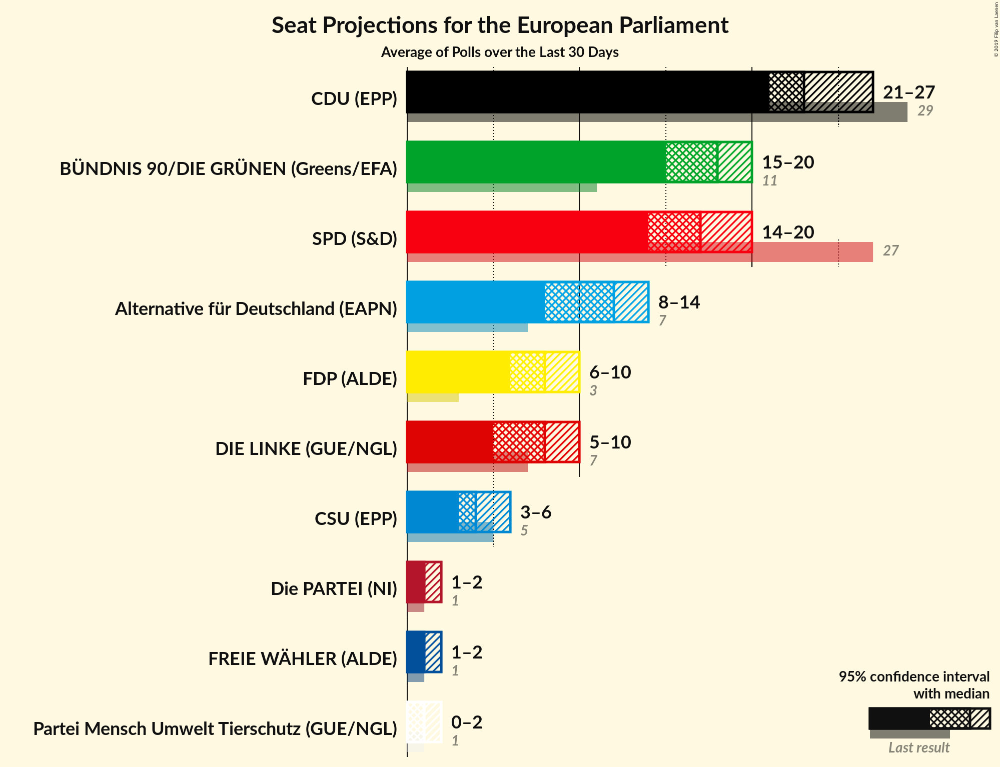

### Confidence Intervals

| Party | Last Result | Median | 80% Confidence Interval | 90% Confidence Interval | 95% Confidence Interval | 99% Confidence Interval |
|:-----:|:-----------:|:------:|:-----------------------:|:-----------------------:|:-----------------------:|:-----------------------:|
| <a href="#cdu-(epp)">CDU (EPP)</a> | 29 | 23 | 21–26 |21–27 | 21–27 | 20–28 |
| <a href="#spd-(s&d)">SPD (S&D)</a> | 27 | 17 | 15–19 |15–19 | 14–20 | 14–20 |
| <a href="#bündnis-90/die-grünen-(greens/efa)">BÜNDNIS 90/DIE GRÜNEN (Greens/EFA)</a> | 11 | 18 | 16–19 |16–20 | 15–20 | 15–21 |
| <a href="#die-linke-(gue/ngl)">DIE LINKE (GUE/NGL)</a> | 7 | 8 | 6–9 |6–9 | 5–10 | 5–10 |
| <a href="#alternative-für-deutschland-(eapn)">Alternative für Deutschland (EAPN)</a> | 7 | 12 | 9–13 |9–14 | 8–14 | 8–15 |
| <a href="#csu-(epp)">CSU (EPP)</a> | 5 | 4 | 4–5 |3–5 | 3–6 | 3–6 |
| <a href="#fdp-(alde)">FDP (ALDE)</a> | 3 | 8 | 7–10 |6–10 | 6–10 | 5–11 |
| <a href="#freie-wähler-(alde)">FREIE WÄHLER (ALDE)</a> | 1 | 1 | 1–2 |1–2 | 1–2 | 0–3 |
| <a href="#partei-mensch-umwelt-tierschutz-(gue/ngl)">Partei Mensch Umwelt Tierschutz (GUE/NGL)</a> | 1 | 1 | 1–2 |0–2 | 0–2 | 0–2 |
| <a href="#ödp-(greens/efa)">ÖDP (Greens/EFA)</a> | 1 | N/A | N/A |N/A | N/A | N/A |
| <a href="#die-partei-(ni)">Die PARTEI (NI)</a> | 1 | 1 | 1–2 |1–2 | 1–2 | 0–2 |

### CDU (EPP)

*For a full overview of the results for this party, see the [CDU (EPP)](party-cduepp.html) page.*

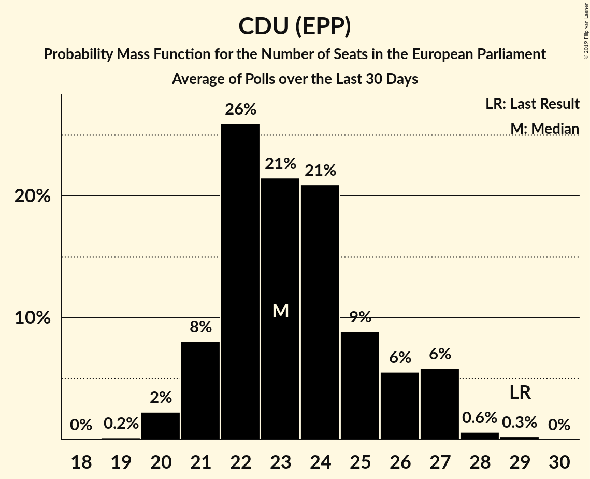

| Number of Seats | Probability | Accumulated | Special Marks |
|:---------------:|:-----------:|:-----------:|:-------------:|
| 19 | 0.2% | 100% |  |
| 20 | 2% | 99.8% |  |
| 21 | 8% | 98% |  |
| 22 | 26% | 90% |  |
| 23 | 21% | 64% | Median |
| 24 | 21% | 42% |  |
| 25 | 9% | 21% |  |
| 26 | 6% | 12% |  |
| 27 | 6% | 7% |  |
| 28 | 0.6% | 0.9% |  |
| 29 | 0.3% | 0.3% | Last Result |
| 30 | 0% | 0% |  |

### SPD (S&D)

*For a full overview of the results for this party, see the [SPD (S&D)](party-spdsd.html) page.*

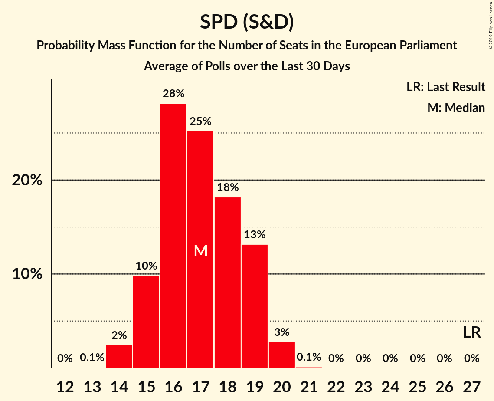

| Number of Seats | Probability | Accumulated | Special Marks |
|:---------------:|:-----------:|:-----------:|:-------------:|
| 13 | 0.1% | 100% |  |
| 14 | 2% | 99.9% |  |
| 15 | 10% | 97% |  |
| 16 | 28% | 88% |  |
| 17 | 25% | 59% | Median |
| 18 | 18% | 34% |  |
| 19 | 13% | 16% |  |
| 20 | 3% | 3% |  |
| 21 | 0.1% | 0.1% |  |
| 22 | 0% | 0% |  |
| 23 | 0% | 0% |  |
| 24 | 0% | 0% |  |
| 25 | 0% | 0% |  |
| 26 | 0% | 0% |  |
| 27 | 0% | 0% | Last Result |

### BÜNDNIS 90/DIE GRÜNEN (Greens/EFA)

*For a full overview of the results for this party, see the [BÜNDNIS 90/DIE GRÜNEN (Greens/EFA)](party-bündnis90diegrünengreensefa.html) page.*

| Number of Seats | Probability | Accumulated | Special Marks |
|:---------------:|:-----------:|:-----------:|:-------------:|
| 11 | 0% | 100% | Last Result |
| 12 | 0% | 100% |  |
| 13 | 0% | 100% |  |
| 14 | 0.3% | 100% |  |
| 15 | 2% | 99.7% |  |
| 16 | 8% | 97% |  |
| 17 | 32% | 90% |  |
| 18 | 23% | 58% | Median |
| 19 | 26% | 35% |  |
| 20 | 6% | 8% |  |
| 21 | 2% | 2% |  |
| 22 | 0.1% | 0.1% |  |
| 23 | 0% | 0% |  |

### DIE LINKE (GUE/NGL)

*For a full overview of the results for this party, see the [DIE LINKE (GUE/NGL)](party-dielinkeguengl.html) page.*

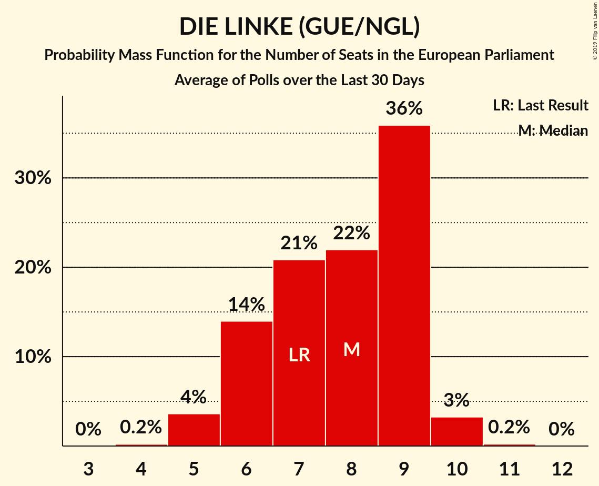

| Number of Seats | Probability | Accumulated | Special Marks |
|:---------------:|:-----------:|:-----------:|:-------------:|
| 4 | 0.2% | 100% |  |
| 5 | 4% | 99.8% |  |
| 6 | 14% | 96% |  |
| 7 | 21% | 82% | Last Result |
| 8 | 22% | 61% | Median |
| 9 | 36% | 39% |  |
| 10 | 3% | 3% |  |
| 11 | 0.2% | 0.2% |  |
| 12 | 0% | 0% |  |

### Alternative für Deutschland (EAPN)

*For a full overview of the results for this party, see the [Alternative für Deutschland (EAPN)](party-alternativefürdeutschlandeapn.html) page.*

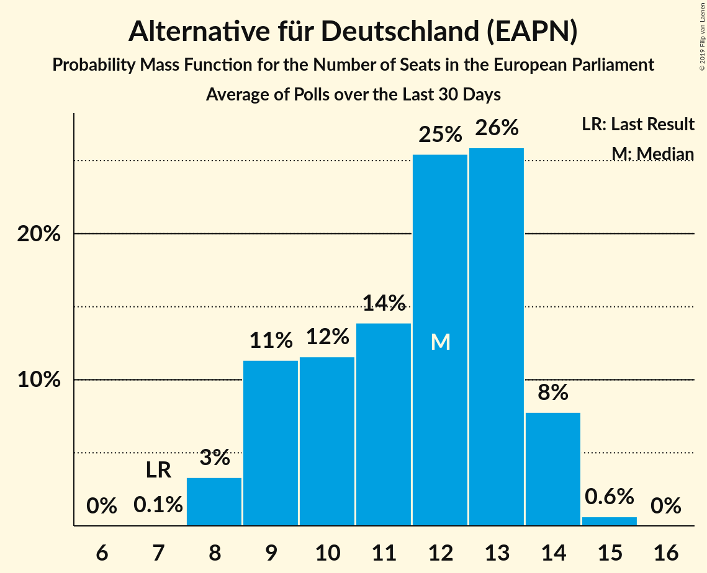

| Number of Seats | Probability | Accumulated | Special Marks |
|:---------------:|:-----------:|:-----------:|:-------------:|
| 7 | 0.1% | 100% | Last Result |
| 8 | 3% | 99.9% |  |
| 9 | 11% | 97% |  |
| 10 | 12% | 85% |  |
| 11 | 14% | 74% |  |
| 12 | 25% | 60% | Median |
| 13 | 26% | 34% |  |
| 14 | 8% | 8% |  |
| 15 | 0.6% | 0.7% |  |
| 16 | 0% | 0% |  |

### CSU (EPP)

*For a full overview of the results for this party, see the [CSU (EPP)](party-csuepp.html) page.*

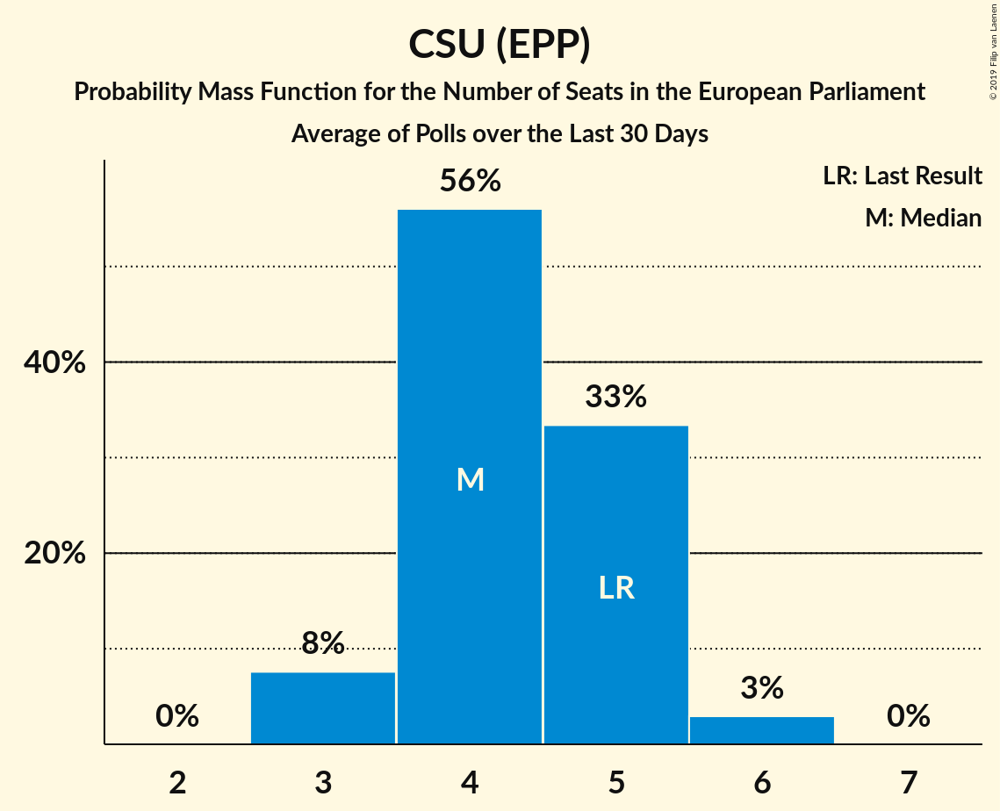

| Number of Seats | Probability | Accumulated | Special Marks |
|:---------------:|:-----------:|:-----------:|:-------------:|
| 3 | 8% | 100% |  |
| 4 | 56% | 92% | Median |
| 5 | 33% | 36% | Last Result |
| 6 | 3% | 3% |  |
| 7 | 0% | 0% |  |

### FDP (ALDE)

*For a full overview of the results for this party, see the [FDP (ALDE)](party-fdpalde.html) page.*

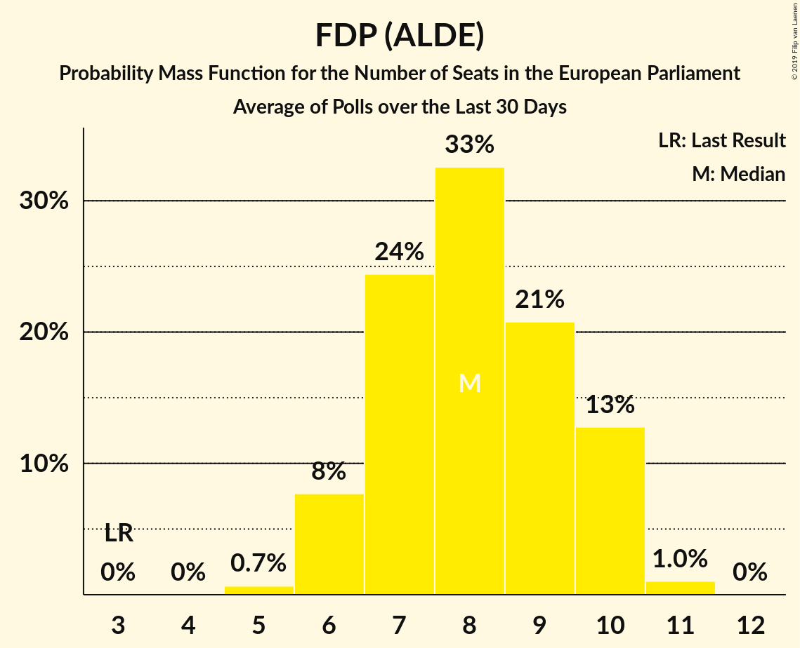

| Number of Seats | Probability | Accumulated | Special Marks |
|:---------------:|:-----------:|:-----------:|:-------------:|
| 3 | 0% | 100% | Last Result |
| 4 | 0% | 100% |  |
| 5 | 0.7% | 100% |  |
| 6 | 8% | 99.3% |  |
| 7 | 24% | 92% |  |
| 8 | 33% | 67% | Median |
| 9 | 21% | 35% |  |
| 10 | 13% | 14% |  |
| 11 | 1.0% | 1.1% |  |
| 12 | 0% | 0% |  |

### FREIE WÄHLER (ALDE)

*For a full overview of the results for this party, see the [FREIE WÄHLER (ALDE)](party-freiewähleralde.html) page.*

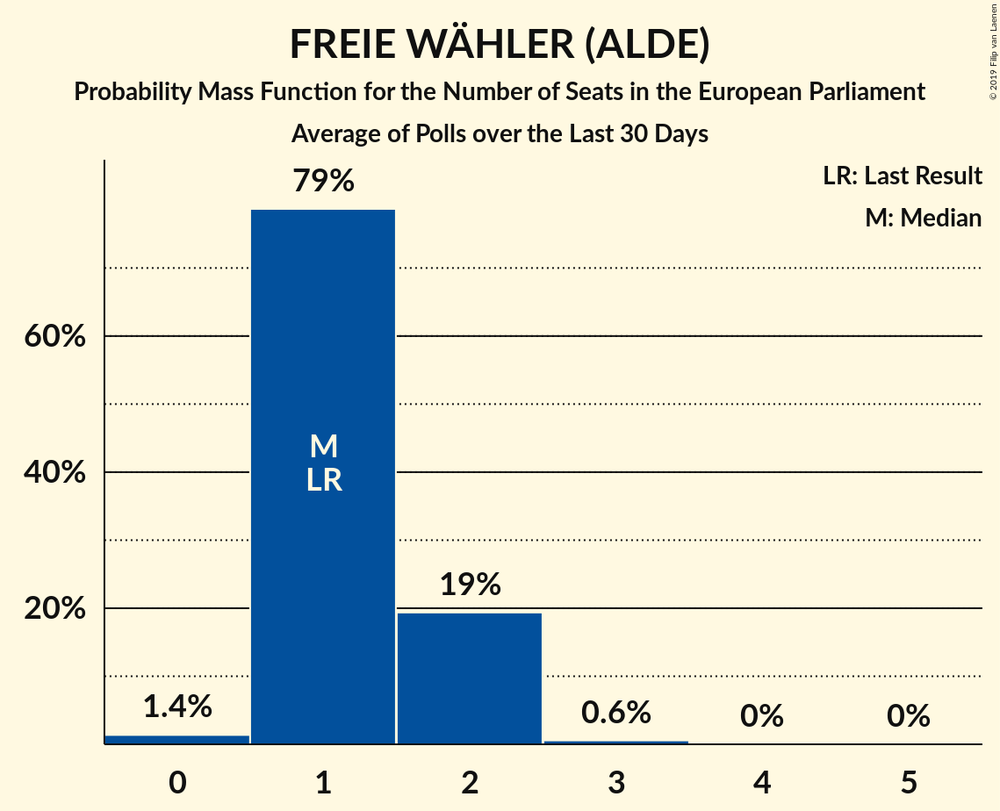

| Number of Seats | Probability | Accumulated | Special Marks |
|:---------------:|:-----------:|:-----------:|:-------------:|
| 0 | 1.4% | 100% |  |
| 1 | 79% | 98.6% | Last Result, Median |
| 2 | 19% | 20% |  |
| 3 | 0.6% | 0.6% |  |
| 4 | 0% | 0% |  |

### Partei Mensch Umwelt Tierschutz (GUE/NGL)

*For a full overview of the results for this party, see the [Partei Mensch Umwelt Tierschutz (GUE/NGL)](party-parteimenschumwelttierschutzguengl.html) page.*

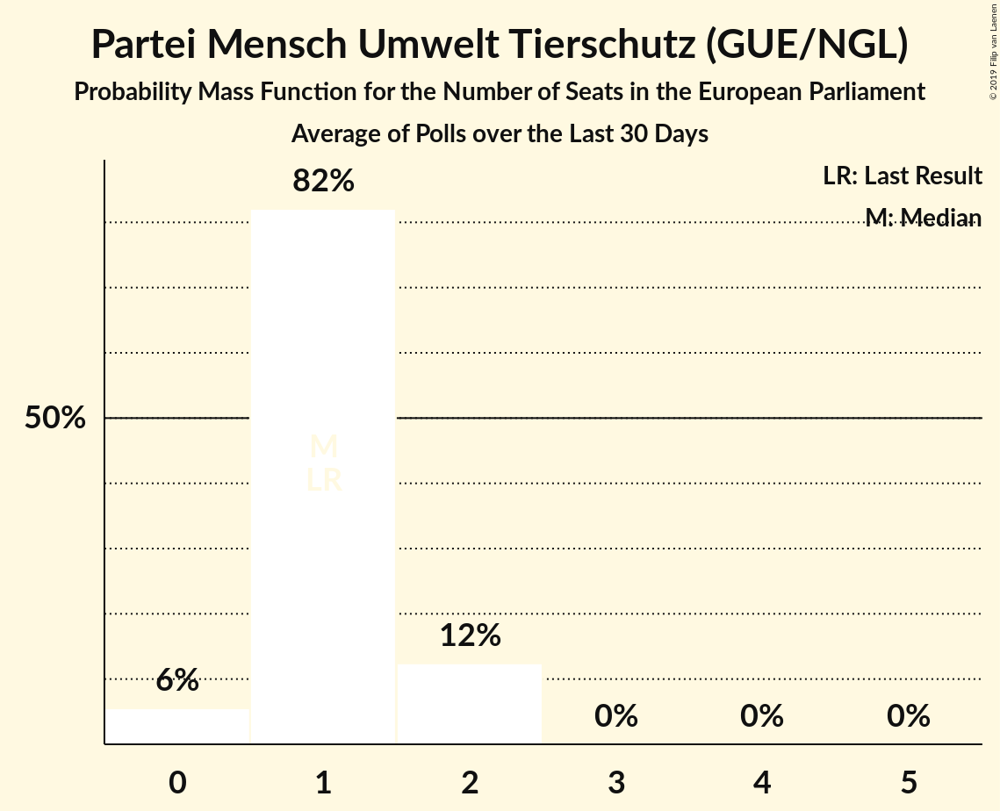

| Number of Seats | Probability | Accumulated | Special Marks |
|:---------------:|:-----------:|:-----------:|:-------------:|
| 0 | 6% | 100% |  |
| 1 | 82% | 94% | Last Result, Median |
| 2 | 12% | 12% |  |
| 3 | 0% | 0% |  |

### Die PARTEI (NI)

*For a full overview of the results for this party, see the [Die PARTEI (NI)](party-dieparteini.html) page.*

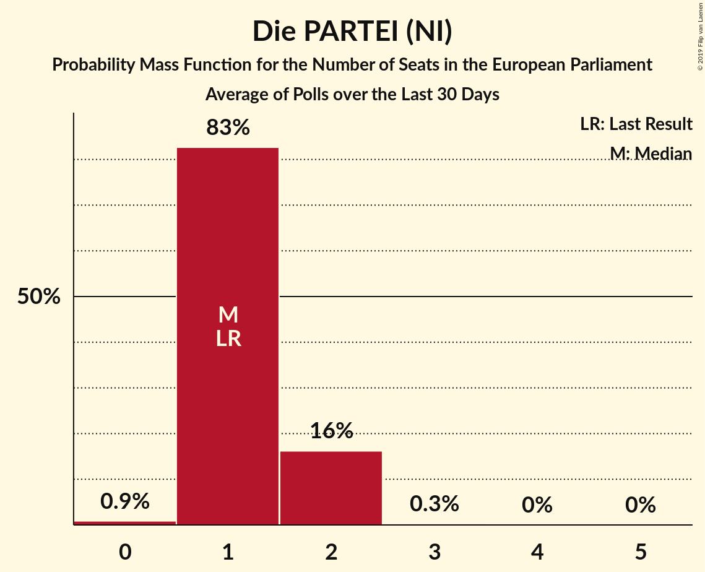

| Number of Seats | Probability | Accumulated | Special Marks |
|:---------------:|:-----------:|:-----------:|:-------------:|
| 0 | 0.9% | 100% |  |
| 1 | 83% | 99.1% | Last Result, Median |
| 2 | 16% | 16% |  |
| 3 | 0.3% | 0.3% |  |
| 4 | 0% | 0% |  |

## Coalitions

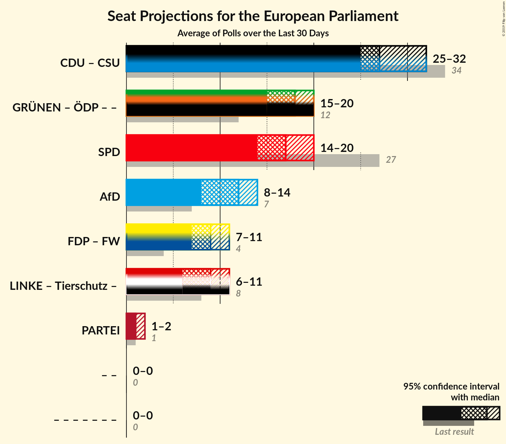

### Confidence Intervals

| Coalition | Last Result | Median | Majority? | 80% Confidence Interval | 90% Confidence Interval | 95% Confidence Interval | 99% Confidence Interval |
|:---------:|:-----------:|:------:|:---------:|:-----------------------:|:-----------------------:|:-----------------------:|:-----------------------:|
| CDU (EPP) – CSU (EPP) | 34 | 27 | 0% | 26–30 | 25–32 | 25–32 | 24–33 |
| SPD (S&D) | 27 | 17 | 0% | 15–19 | 15–19 | 14–20 | 14–20 |
| Alternative für Deutschland (EAPN) | 7 | 12 | 0% | 9–13 | 9–14 | 8–14 | 8–15 |
| FDP (ALDE) – FREIE WÄHLER (ALDE) | 4 | 9 | 0% | 8–11 | 8–11 | 7–11 | 7–12 |
| Die PARTEI (NI) | 1 | 1 | 0% | 1–2 | 1–2 | 1–2 | 0–2 |

### CDU (EPP) – CSU (EPP)

| Number of Seats | Probability | Accumulated | Special Marks |
|:---------------:|:-----------:|:-----------:|:-------------:|
| 23 | 0.3% | 100% |  |
| 24 | 2% | 99.7% |  |
| 25 | 6% | 98% |  |
| 26 | 23% | 92% |  |
| 27 | 24% | 69% | Median |
| 28 | 16% | 45% |  |
| 29 | 13% | 29% |  |
| 30 | 6% | 16% |  |
| 31 | 5% | 10% |  |
| 32 | 4% | 5% |  |
| 33 | 0.6% | 0.8% |  |
| 34 | 0.2% | 0.2% | Last Result |
| 35 | 0% | 0% |  |

### SPD (S&D)

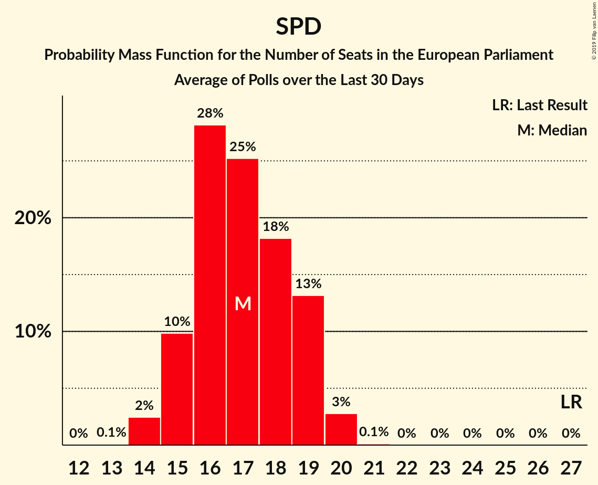

| Number of Seats | Probability | Accumulated | Special Marks |
|:---------------:|:-----------:|:-----------:|:-------------:|
| 13 | 0.1% | 100% |  |
| 14 | 2% | 99.9% |  |
| 15 | 10% | 97% |  |
| 16 | 28% | 88% |  |
| 17 | 25% | 59% | Median |
| 18 | 18% | 34% |  |
| 19 | 13% | 16% |  |
| 20 | 3% | 3% |  |
| 21 | 0.1% | 0.1% |  |
| 22 | 0% | 0% |  |
| 23 | 0% | 0% |  |
| 24 | 0% | 0% |  |
| 25 | 0% | 0% |  |
| 26 | 0% | 0% |  |
| 27 | 0% | 0% | Last Result |

### Alternative für Deutschland (EAPN)

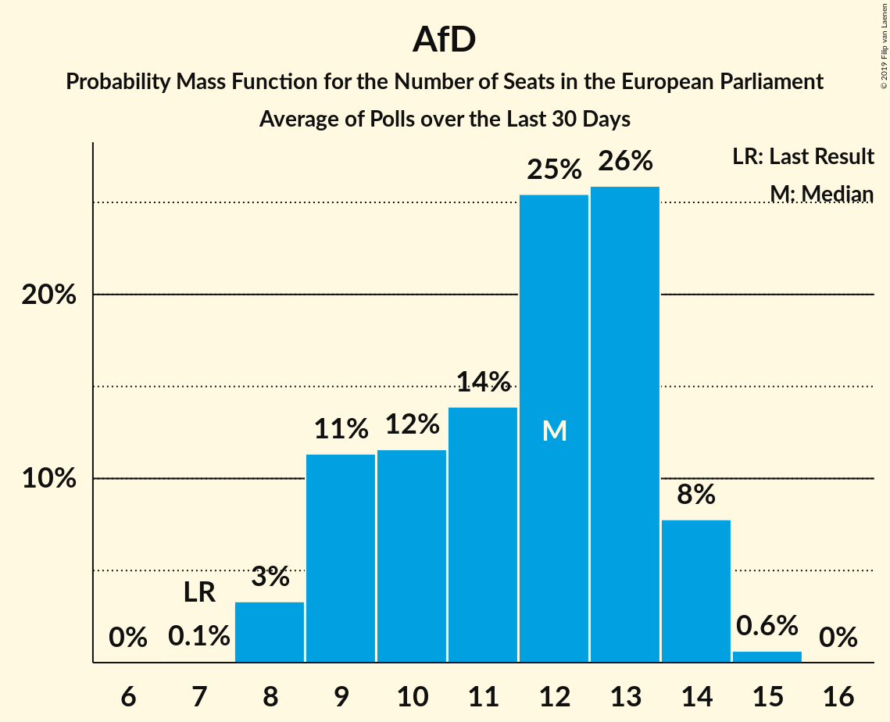

| Number of Seats | Probability | Accumulated | Special Marks |
|:---------------:|:-----------:|:-----------:|:-------------:|
| 7 | 0.1% | 100% | Last Result |
| 8 | 3% | 99.9% |  |
| 9 | 11% | 97% |  |
| 10 | 12% | 85% |  |
| 11 | 14% | 74% |  |
| 12 | 25% | 60% | Median |
| 13 | 26% | 34% |  |
| 14 | 8% | 8% |  |
| 15 | 0.6% | 0.7% |  |
| 16 | 0% | 0% |  |

### FDP (ALDE) – FREIE WÄHLER (ALDE)

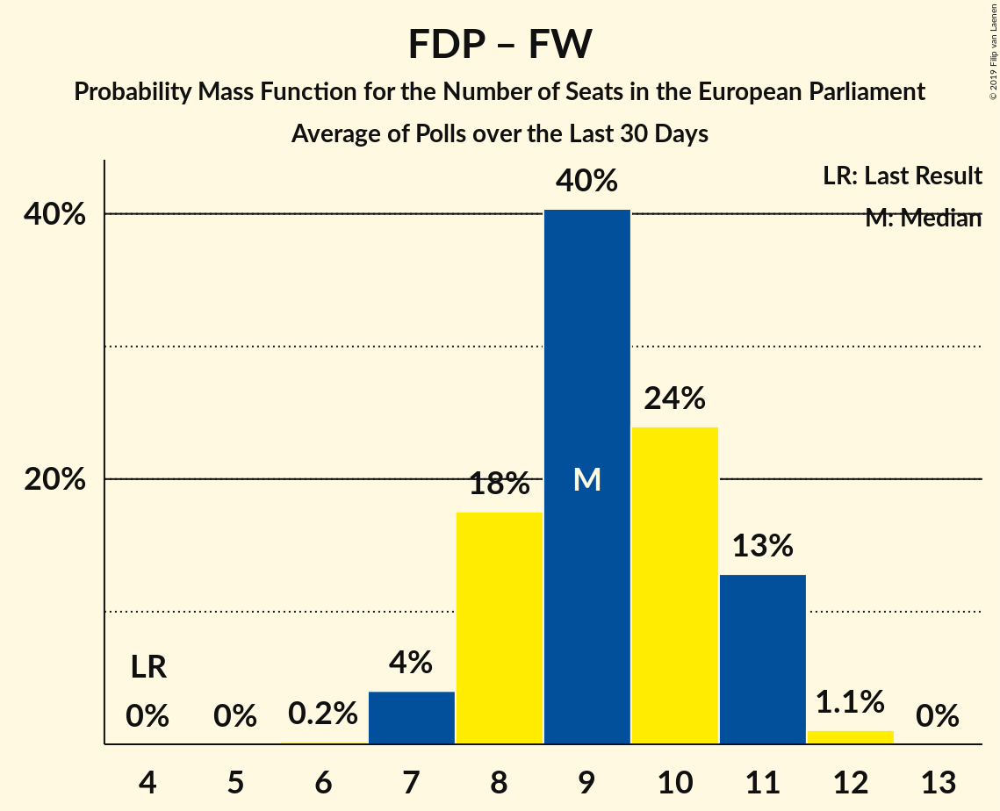

| Number of Seats | Probability | Accumulated | Special Marks |
|:---------------:|:-----------:|:-----------:|:-------------:|
| 4 | 0% | 100% | Last Result |
| 5 | 0% | 100% |  |
| 6 | 0.2% | 100% |  |
| 7 | 4% | 99.8% |  |
| 8 | 18% | 96% |  |
| 9 | 40% | 78% | Median |
| 10 | 24% | 38% |  |
| 11 | 13% | 14% |  |
| 12 | 1.1% | 1.1% |  |
| 13 | 0% | 0% |  |

### Die PARTEI (NI)

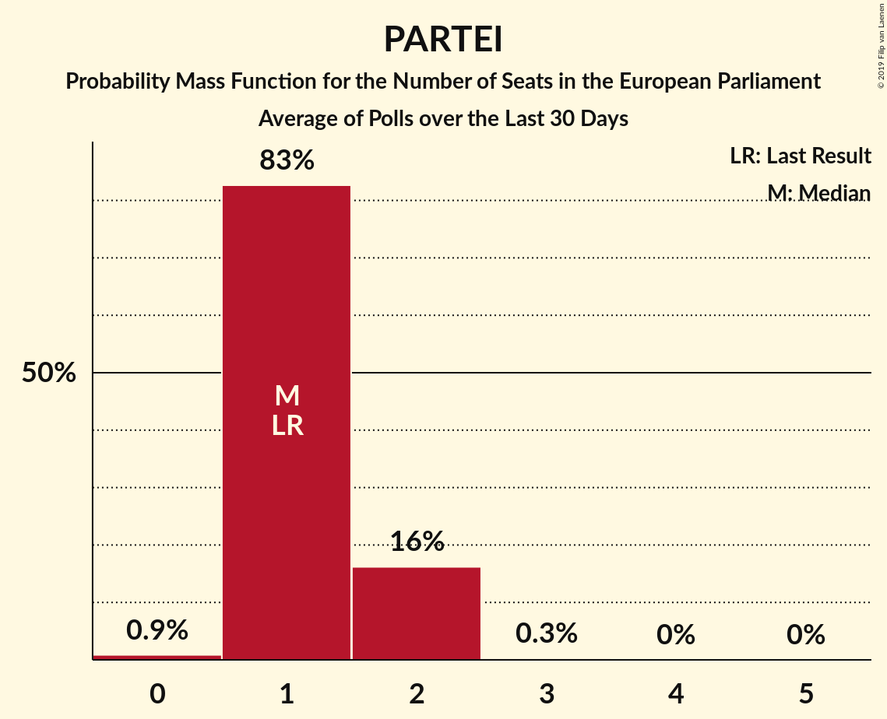

| Number of Seats | Probability | Accumulated | Special Marks |
|:---------------:|:-----------:|:-----------:|:-------------:|
| 0 | 0.9% | 100% |  |
| 1 | 83% | 99.1% | Last Result, Median |
| 2 | 16% | 16% |  |
| 3 | 0.3% | 0.3% |  |
| 4 | 0% | 0% |  |

## Technical Information

+ **Number of polls included in this average:** 7
+ **Lowest number of simulations done in a poll included in this average:** 1,048,576
+ **Total number of simulations done in the polls included in this average:** 7,340,032
+ **Error estimate:** 1.74%
