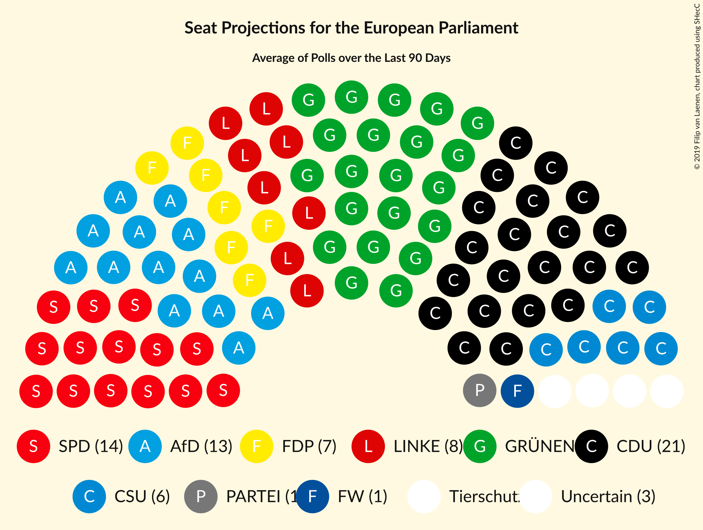
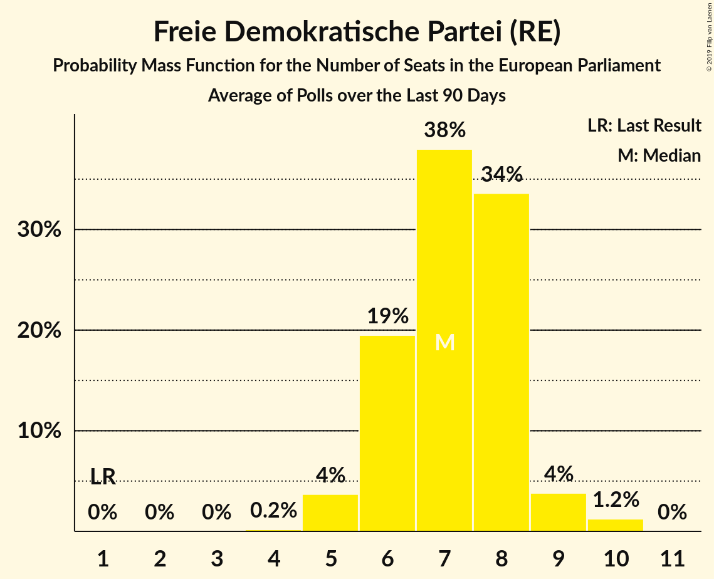
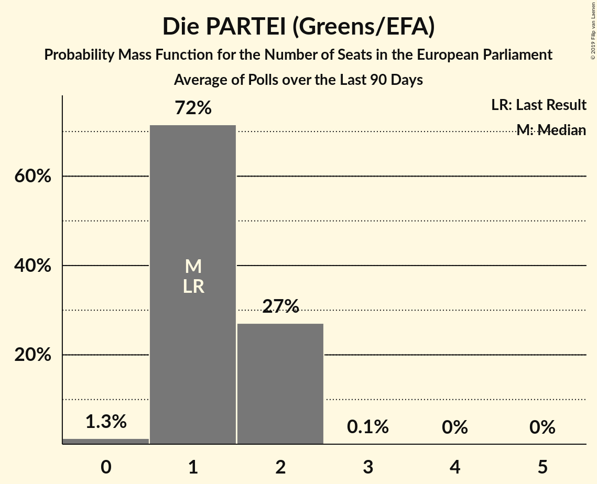
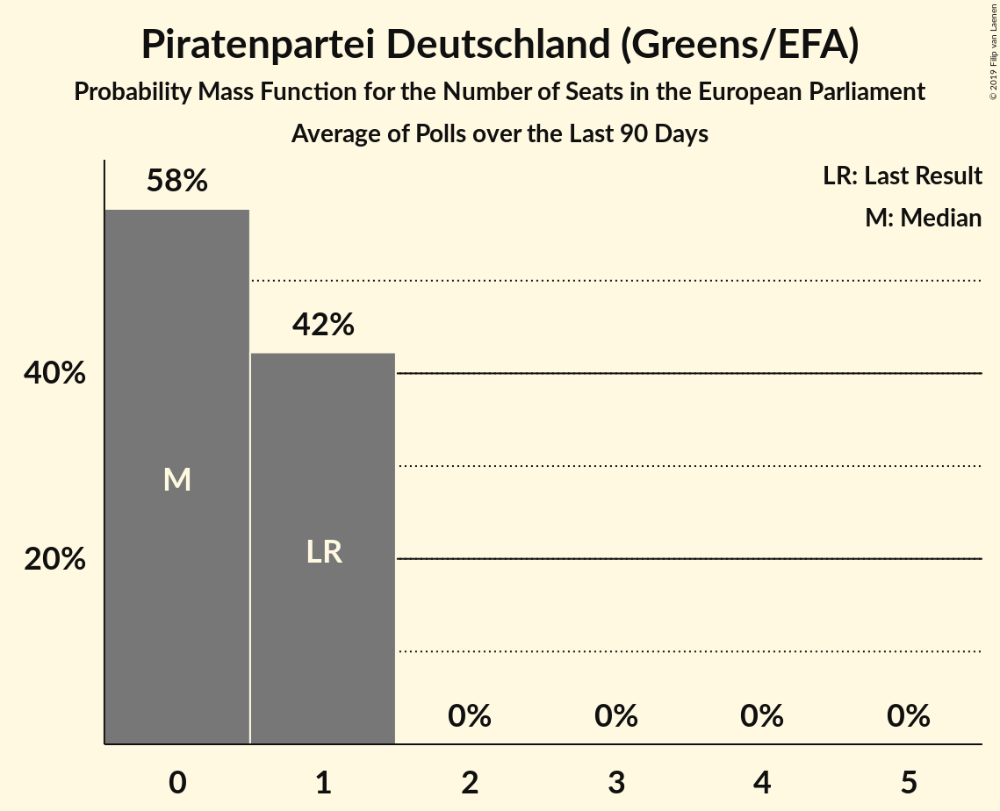

# Poll Average

<a href="#voting-intentions">Voting Intentions</a> | <a href="#seats">Seats</a> | <a href="#coalitions">Coalitions</a> | <a href="#technical-information">Technical Information</a>

## Summary

The table below lists the polls on which the average is based. They are the most recent polls (less than 90 days old) registered and analyzed so far.

| Period     | Polling firm/Commissioner(s) | CDU | SPD | GRÜNEN | LINKE | AfD | CSU | FDP | FW | Tierschutz | ÖDP | PARTEI | Volt | FAMILIE | PIRATEN |
|:----------:|:----------------------------:|:--:|:--:|:--:|:--:|:--:|:--:|:--:|:--:|:--:|:--:|:--:|:--:|:--:|:--:|
| 26 May 2019 | General Election | 0.0%   1 | 0.0%   1 | 0.0%   1 | 0.0%   1 | 0.0%   1 | 0.0%   1 | 0.0%   1 | 0.0%   1 | 0.0%   1 | 0.0%   1 | 0.0%   1 | 0.0%   1 | 0.0%   1 | 0.0%   1 |
| N/A | Poll Average | 19–25%   18–24 | 12–17%   11–17 | 19–25%   18–24 | 6–10%   5–10 | 12–16%   11–16 | 5–8%   4–7 | 5–9%   5–9 | 0–2%   0–2 | 0–1%   0–1 | 0–1%   0–1 | 1–2%   1–2 | 0–1%   0–1 | 0–1%   0–1 | 0–1%   0–1 |
| [21–25 October 2019](2019-10-25-Forsa.html) | Forsa | 21–24%   21–24 | 13–15%   12–15 | 18–22%   18–21 | 7–9%   7–9 | 12–14%   11–14 | 5–7%   5–7 | 7–9%   6–8 | 1–2%   1–2 | 1%   1 | 0–1%   0–1 | 1–2%   1–2 | 0–1%   0–1 | 0–1%   0–1 | 0–1%   0–1 |
| [17–23 October 2019](2019-10-23-Emnid.html) | Emnid   Bild am Sonntag | 21–25%   20–23 | 13–17%   13–17 | 18–22%   17–21 | 8–11%   7–10 | 12–16%   12–15 | 5–8%   5–8 | 7–9%   6–9 | 0–1%   1 | 0–1%   0–1 | 0–1%   0–1 | 1–2%   1 | 0–1%   0–1 | 0–1%   0–1 | 0–1%   0–1 |
| [18–21 October 2019](2019-10-21-INSA.html) | INSA | 19–23%   19–22 | 12–15%   11–16 | 21–24%   19–23 | 8–10%   8–10 | 14–17%   13–16 | 5–7%   5–7 | 6–9%   6–9 | 1%   0–1 | 0–1%   0–1 | 0–1%   0–1 | 1–2%   1 | 0–1%   0–1 | 0–1%   0–1 | 0–1%   0–1 |
| [15–17 October 2019](2019-10-17-ForschungsgruppeWahlen.html) | Forschungsgruppe Wahlen   ZDF | 20–25%   19–23 | 12–16%   12–16 | 22–26%   20–25 | 7–10%   6–9 | 11–15%   11–14 | 5–8%   5–8 | 5–8%   5–7 | 1–2%   1–2 | 0–1%   0–1 | 0–1%   0–1 | 1–2%   1–2 | 0–1%   0–1 | 0–1%   0–1 | 0–1%   0–1 |
| [14–16 October 2019](2019-10-16-Infratestdimap.html) | Infratest dimap   ARD | 19–24%   18–23 | 12–16%   11–16 | 20–25%   17–23 | 7–10%   6–9 | 12–16%   12–15 | 5–8%   5–8 | 6–9%   6–9 | 1–2%   1–2 | 0–1%   0–1 | 0–1%   0–1 | 1–2%   1–2 | 0–1%   0–1 | 0–1%   0–1 | 0–1%   0–1 |
| [29 September–10 October 2019](2019-10-10-Allensbach.html) | Allensbach | 21–25%   19–24 | 14–18%   13–17 | 21–26%   20–26 | 6–9%   5–9 | 11–15%   11–15 | 5–8%   5–8 | 5–8%   5–8 | 0–1%   0–1 | 0–1%   0–1 | 0–1%   0–1 | 0–1%   0–1 | 0–1%   0–1 | 0–1%   0–1 | 0–1%   0–1 |
| [1–7 October 2019](2019-10-07-GMS.html) | GMS | 19–24%   18–23 | 12–16%   11–14 | 19–25%   19–22 | 6–9%   5–8 | 13–17%   13–16 | 5–8%   4–6 | 6–10%   6–10 | 1–2%   1–2 | 0–2%   0–2 | 0–1%   0–1 | 1–2%   1–2 | 0–1%   0–1 | 0–1%   0–1 | 0–1%   0–1 |
| [27 September–1 October 2019](2019-10-01-YouGov.html) | YouGov | 18–22%   18–21 | 11–15%   11–14 | 20–24%   19–23 | 7–9%   6–9 | 13–17%   13–16 | 5–7%   4–6 | 7–9%   7–10 | 1–2%   1–2 | 1%   1 | 0–1%   0–1 | 1–2%   1–2 | 0–1%   0–1 | 0–1%   0–1 | 0–1%   0–1 |
| 26 May 2019 | General Election | 0.0%   1 | 0.0%   1 | 0.0%   1 | 0.0%   1 | 0.0%   1 | 0.0%   1 | 0.0%   1 | 0.0%   1 | 0.0%   1 | 0.0%   1 | 0.0%   1 | 0.0%   1 | 0.0%   1 | 0.0%   1 |

Only polls for which at least the sample size has been published are included in the table above.

**Legend:**
+ **Top half of each row:** Voting intentions (95% confidence interval)
+ **Bottom half of each row:** Seat projections for the European Parliament (95% confidence interval)
+ **CDU:** Christlich Demokratische Union Deutschlands (EPP)
+ **SPD:** Sozialdemokratische Partei Deutschlands (S&D)
+ **GRÜNEN:** Bündnis 90/Die Grünen (Greens/EFA)
+ **LINKE:** Die Linke (GUE/NGL)
+ **AfD:** Alternative für Deutschland (ID)
+ **CSU:** Christlich-Soziale Union in Bayern (EPP)
+ **FDP:** Freie Demokratische Partei (RE)
+ **FW:** Freie Wähler (RE)
+ **Tierschutz:** Partei Mensch Umwelt Tierschutz (GUE/NGL)
+ **ÖDP:** Ökologisch-Demokratische Partei (Greens/EFA)
+ **PARTEI:** Die PARTEI (Greens/EFA)
+ **Volt:** Volt Europa (Greens/EFA)
+ **FAMILIE:** Familienpartei Deutschlands (ECR)
+ **PIRATEN:** Piratenpartei Deutschland (Greens/EFA)
+ **N/A (single party):** Party not included the published results
+ **N/A (entire row):** Calculation for this opinion poll not started yet

## Voting Intentions

### Confidence Intervals

| Party | Last Result | Median | 80% Confidence Interval | 90% Confidence Interval | 95% Confidence Interval | 99% Confidence Interval |
|:-----:|:-----------:|:------:|:-----------------------:|:-----------------------:|:-----------------------:|:-----------------------:|
| <a href="#christlich-demokratische-union-deutschlands-(epp)">Christlich Demokratische Union Deutschlands (EPP)</a> | 0.0% | 22.0% | 20.1–23.8% |19.6–24.3% | 19.2–24.7% | 18.4–25.6% |
| <a href="#sozialdemokratische-partei-deutschlands-(s&d)">Sozialdemokratische Partei Deutschlands (S&D)</a> | 0.0% | 14.1% | 12.7–16.0% |12.3–16.6% | 12.0–17.0% | 11.4–17.9% |
| <a href="#bündnis-90/die-grünen-(greens/efa)">Bündnis 90/Die Grünen (Greens/EFA)</a> | 0.0% | 22.1% | 19.7–24.3% |19.2–24.9% | 18.8–25.4% | 18.1–26.4% |
| <a href="#die-linke-(gue/ngl)">Die Linke (GUE/NGL)</a> | 0.0% | 8.1% | 6.7–9.4% |6.4–9.7% | 6.1–10.0% | 5.6–10.6% |
| <a href="#alternative-für-deutschland-(id)">Alternative für Deutschland (ID)</a> | 0.0% | 14.0% | 12.4–15.7% |12.0–16.1% | 11.7–16.5% | 11.1–17.3% |
| <a href="#christlich-soziale-union-in-bayern-(epp)">Christlich-Soziale Union in Bayern (EPP)</a> | 0.0% | 6.2% | 5.3–7.1% |5.1–7.4% | 4.9–7.6% | 4.5–8.2% |
| <a href="#freie-demokratische-partei-(re)">Freie Demokratische Partei (RE)</a> | 0.0% | 7.5% | 6.0–8.7% |5.7–9.0% | 5.4–9.3% | 4.9–9.9% |
| <a href="#freie-wähler-(re)">Freie Wähler (RE)</a> | 0.0% | 1.1% | 0.7–1.6% |0.6–1.7% | 0.5–1.9% | 0.4–2.2% |
| <a href="#partei-mensch-umwelt-tierschutz-(gue/ngl)">Partei Mensch Umwelt Tierschutz (GUE/NGL)</a> | 0.0% | 0.8% | 0.4–1.2% |0.4–1.3% | 0.3–1.4% | 0.2–1.6% |
| <a href="#ökologisch-demokratische-partei-(greens/efa)">Ökologisch-Demokratische Partei (Greens/EFA)</a> | 0.0% | 0.5% | 0.3–0.9% |0.3–1.0% | 0.2–1.1% | 0.1–1.3% |
| <a href="#die-partei-(greens/efa)">Die PARTEI (Greens/EFA)</a> | 0.0% | 1.2% | 0.8–1.8% |0.7–1.9% | 0.6–2.1% | 0.5–2.4% |
| <a href="#volt-europa-(greens/efa)">Volt Europa (Greens/EFA)</a> | 0.0% | 0.4% | 0.2–0.7% |0.2–0.8% | 0.1–0.9% | 0.1–1.1% |
| <a href="#familienpartei-deutschlands-(ecr)">Familienpartei Deutschlands (ECR)</a> | 0.0% | 0.4% | 0.2–0.7% |0.2–0.8% | 0.1–0.9% | 0.1–1.1% |
| <a href="#piratenpartei-deutschland-(greens/efa)">Piratenpartei Deutschland (Greens/EFA)</a> | 0.0% | 0.4% | 0.2–0.6% |0.2–0.7% | 0.1–0.8% | 0.1–1.1% |

### Sozialdemokratische Partei Deutschlands (S&D)

*For a full overview of the results for this party, see the [Sozialdemokratische Partei Deutschlands (S&D)](party-sozialdemokratischeparteideutschlandssd.html) page.*

| Voting Intentions | Probability | Accumulated | Special Marks |
|:-----------------:|:-----------:|:-----------:|:-------------:|
| 0.0–0.5% | 0% | 100% | Last Result |
| 0.5–1.5% | 0% | 100% |  |
| 1.5–2.5% | 0% | 100% |  |
| 2.5–3.5% | 0% | 100% |  |
| 3.5–4.5% | 0% | 100% |  |
| 4.5–5.5% | 0% | 100% |  |
| 5.5–6.5% | 0% | 100% |  |
| 6.5–7.5% | 0% | 100% |  |
| 7.5–8.5% | 0% | 100% |  |
| 8.5–9.5% | 0% | 100% |  |
| 9.5–10.5% | 0% | 100% |  |
| 10.5–11.5% | 0.7% | 100% |  |
| 11.5–12.5% | 7% | 99.2% |  |
| 12.5–13.5% | 24% | 92% |  |
| 13.5–14.5% | 32% | 69% | Median |
| 14.5–15.5% | 21% | 37% |  |
| 15.5–16.5% | 11% | 16% |  |
| 16.5–17.5% | 4% | 5% |  |
| 17.5–18.5% | 0.9% | 1.1% |  |
| 18.5–19.5% | 0.1% | 0.1% |  |
| 19.5–20.5% | 0% | 0% |  |

### Alternative für Deutschland (ID)

*For a full overview of the results for this party, see the [Alternative für Deutschland (ID)](party-alternativefürdeutschlandid.html) page.*

| Voting Intentions | Probability | Accumulated | Special Marks |
|:-----------------:|:-----------:|:-----------:|:-------------:|
| 0.0–0.5% | 0% | 100% | Last Result |
| 0.5–1.5% | 0% | 100% |  |
| 1.5–2.5% | 0% | 100% |  |
| 2.5–3.5% | 0% | 100% |  |
| 3.5–4.5% | 0% | 100% |  |
| 4.5–5.5% | 0% | 100% |  |
| 5.5–6.5% | 0% | 100% |  |
| 6.5–7.5% | 0% | 100% |  |
| 7.5–8.5% | 0% | 100% |  |
| 8.5–9.5% | 0% | 100% |  |
| 9.5–10.5% | 0.1% | 100% |  |
| 10.5–11.5% | 2% | 99.9% |  |
| 11.5–12.5% | 11% | 98% |  |
| 12.5–13.5% | 25% | 88% |  |
| 13.5–14.5% | 28% | 63% | Median |
| 14.5–15.5% | 23% | 36% |  |
| 15.5–16.5% | 10% | 13% |  |
| 16.5–17.5% | 2% | 2% |  |
| 17.5–18.5% | 0.3% | 0.3% |  |
| 18.5–19.5% | 0% | 0% |  |

### Freie Demokratische Partei (RE)

*For a full overview of the results for this party, see the [Freie Demokratische Partei (RE)](party-freiedemokratischeparteire.html) page.*

| Voting Intentions | Probability | Accumulated | Special Marks |
|:-----------------:|:-----------:|:-----------:|:-------------:|
| 0.0–0.5% | 0% | 100% | Last Result |
| 0.5–1.5% | 0% | 100% |  |
| 1.5–2.5% | 0% | 100% |  |
| 2.5–3.5% | 0% | 100% |  |
| 3.5–4.5% | 0.1% | 100% |  |
| 4.5–5.5% | 4% | 99.9% |  |
| 5.5–6.5% | 17% | 96% |  |
| 6.5–7.5% | 31% | 79% |  |
| 7.5–8.5% | 36% | 49% | Median |
| 8.5–9.5% | 11% | 12% |  |
| 9.5–10.5% | 1.1% | 1.1% |  |
| 10.5–11.5% | 0.1% | 0.1% |  |
| 11.5–12.5% | 0% | 0% |  |

### Die Linke (GUE/NGL)

*For a full overview of the results for this party, see the [Die Linke (GUE/NGL)](party-dielinkeguengl.html) page.*

| Voting Intentions | Probability | Accumulated | Special Marks |
|:-----------------:|:-----------:|:-----------:|:-------------:|
| 0.0–0.5% | 0% | 100% | Last Result |
| 0.5–1.5% | 0% | 100% |  |
| 1.5–2.5% | 0% | 100% |  |
| 2.5–3.5% | 0% | 100% |  |
| 3.5–4.5% | 0% | 100% |  |
| 4.5–5.5% | 0.4% | 100% |  |
| 5.5–6.5% | 7% | 99.6% |  |
| 6.5–7.5% | 23% | 93% |  |
| 7.5–8.5% | 38% | 70% | Median |
| 8.5–9.5% | 25% | 32% |  |
| 9.5–10.5% | 7% | 7% |  |
| 10.5–11.5% | 0.6% | 0.6% |  |
| 11.5–12.5% | 0% | 0% |  |

### Bündnis 90/Die Grünen (Greens/EFA)

*For a full overview of the results for this party, see the [Bündnis 90/Die Grünen (Greens/EFA)](party-bündnis90diegrünengreensefa.html) page.*

| Voting Intentions | Probability | Accumulated | Special Marks |
|:-----------------:|:-----------:|:-----------:|:-------------:|
| 0.0–0.5% | 0% | 100% | Last Result |
| 0.5–1.5% | 0% | 100% |  |
| 1.5–2.5% | 0% | 100% |  |
| 2.5–3.5% | 0% | 100% |  |
| 3.5–4.5% | 0% | 100% |  |
| 4.5–5.5% | 0% | 100% |  |
| 5.5–6.5% | 0% | 100% |  |
| 6.5–7.5% | 0% | 100% |  |
| 7.5–8.5% | 0% | 100% |  |
| 8.5–9.5% | 0% | 100% |  |
| 9.5–10.5% | 0% | 100% |  |
| 10.5–11.5% | 0% | 100% |  |
| 11.5–12.5% | 0% | 100% |  |
| 12.5–13.5% | 0% | 100% |  |
| 13.5–14.5% | 0% | 100% |  |
| 14.5–15.5% | 0% | 100% |  |
| 15.5–16.5% | 0% | 100% |  |
| 16.5–17.5% | 0.1% | 100% |  |
| 17.5–18.5% | 1.3% | 99.9% |  |
| 18.5–19.5% | 7% | 98.6% |  |
| 19.5–20.5% | 14% | 92% |  |
| 20.5–21.5% | 17% | 78% |  |
| 21.5–22.5% | 21% | 61% | Median |
| 22.5–23.5% | 20% | 39% |  |
| 23.5–24.5% | 12% | 20% |  |
| 24.5–25.5% | 6% | 8% |  |
| 25.5–26.5% | 2% | 2% |  |
| 26.5–27.5% | 0.3% | 0.4% |  |
| 27.5–28.5% | 0% | 0% |  |

### Christlich Demokratische Union Deutschlands (EPP)

*For a full overview of the results for this party, see the [Christlich Demokratische Union Deutschlands (EPP)](party-christlichdemokratischeuniondeutschlandsepp.html) page.*

| Voting Intentions | Probability | Accumulated | Special Marks |
|:-----------------:|:-----------:|:-----------:|:-------------:|
| 0.0–0.5% | 0% | 100% | Last Result |
| 0.5–1.5% | 0% | 100% |  |
| 1.5–2.5% | 0% | 100% |  |
| 2.5–3.5% | 0% | 100% |  |
| 3.5–4.5% | 0% | 100% |  |
| 4.5–5.5% | 0% | 100% |  |
| 5.5–6.5% | 0% | 100% |  |
| 6.5–7.5% | 0% | 100% |  |
| 7.5–8.5% | 0% | 100% |  |
| 8.5–9.5% | 0% | 100% |  |
| 9.5–10.5% | 0% | 100% |  |
| 10.5–11.5% | 0% | 100% |  |
| 11.5–12.5% | 0% | 100% |  |
| 12.5–13.5% | 0% | 100% |  |
| 13.5–14.5% | 0% | 100% |  |
| 14.5–15.5% | 0% | 100% |  |
| 15.5–16.5% | 0% | 100% |  |
| 16.5–17.5% | 0% | 100% |  |
| 17.5–18.5% | 0.6% | 100% |  |
| 18.5–19.5% | 4% | 99.3% |  |
| 19.5–20.5% | 12% | 95% |  |
| 20.5–21.5% | 21% | 83% |  |
| 21.5–22.5% | 26% | 62% | Median |
| 22.5–23.5% | 22% | 36% |  |
| 23.5–24.5% | 11% | 14% |  |
| 24.5–25.5% | 3% | 3% |  |
| 25.5–26.5% | 0.5% | 0.5% |  |
| 26.5–27.5% | 0% | 0% |  |
| 27.5–28.5% | 0% | 0% |  |

### Christlich-Soziale Union in Bayern (EPP)

*For a full overview of the results for this party, see the [Christlich-Soziale Union in Bayern (EPP)](party-christlich-sozialeunioninbayernepp.html) page.*

| Voting Intentions | Probability | Accumulated | Special Marks |
|:-----------------:|:-----------:|:-----------:|:-------------:|
| 0.0–0.5% | 0% | 100% | Last Result |
| 0.5–1.5% | 0% | 100% |  |
| 1.5–2.5% | 0% | 100% |  |
| 2.5–3.5% | 0% | 100% |  |
| 3.5–4.5% | 0.7% | 100% |  |
| 4.5–5.5% | 17% | 99.3% |  |
| 5.5–6.5% | 53% | 82% | Median |
| 6.5–7.5% | 26% | 29% |  |
| 7.5–8.5% | 3% | 3% |  |
| 8.5–9.5% | 0.1% | 0.1% |  |
| 9.5–10.5% | 0% | 0% |  |

### Die PARTEI (Greens/EFA)

*For a full overview of the results for this party, see the [Die PARTEI (Greens/EFA)](party-dieparteigreensefa.html) page.*

| Voting Intentions | Probability | Accumulated | Special Marks |
|:-----------------:|:-----------:|:-----------:|:-------------:|
| 0.0–0.5% | 2% | 100% | Last Result |
| 0.5–1.5% | 76% | 98% | Median |
| 1.5–2.5% | 23% | 23% |  |
| 2.5–3.5% | 0.2% | 0.2% |  |
| 3.5–4.5% | 0% | 0% |  |

### Freie Wähler (RE)

*For a full overview of the results for this party, see the [Freie Wähler (RE)](party-freiewählerre.html) page.*

| Voting Intentions | Probability | Accumulated | Special Marks |
|:-----------------:|:-----------:|:-----------:|:-------------:|
| 0.0–0.5% | 3% | 100% | Last Result |
| 0.5–1.5% | 85% | 97% | Median |
| 1.5–2.5% | 12% | 12% |  |
| 2.5–3.5% | 0% | 0% |  |
| 3.5–4.5% | 0% | 0% |  |

### Partei Mensch Umwelt Tierschutz (GUE/NGL)

*For a full overview of the results for this party, see the [Partei Mensch Umwelt Tierschutz (GUE/NGL)](party-parteimenschumwelttierschutzguengl.html) page.*

| Voting Intentions | Probability | Accumulated | Special Marks |
|:-----------------:|:-----------:|:-----------:|:-------------:|
| 0.0–0.5% | 21% | 100% | Last Result |
| 0.5–1.5% | 78% | 79% | Median |
| 1.5–2.5% | 0.8% | 0.8% |  |
| 2.5–3.5% | 0% | 0% |  |

### Ökologisch-Demokratische Partei (Greens/EFA)

*For a full overview of the results for this party, see the [Ökologisch-Demokratische Partei (Greens/EFA)](party-ökologisch-demokratischeparteigreensefa.html) page.*

| Voting Intentions | Probability | Accumulated | Special Marks |
|:-----------------:|:-----------:|:-----------:|:-------------:|
| 0.0–0.5% | 51% | 100% | Last Result |
| 0.5–1.5% | 49% | 49% | Median |
| 1.5–2.5% | 0.1% | 0.1% |  |
| 2.5–3.5% | 0% | 0% |  |

### Familienpartei Deutschlands (ECR)

*For a full overview of the results for this party, see the [Familienpartei Deutschlands (ECR)](party-familienparteideutschlandsecr.html) page.*

| Voting Intentions | Probability | Accumulated | Special Marks |
|:-----------------:|:-----------:|:-----------:|:-------------:|
| 0.0–0.5% | 78% | 100% | Last Result, Median |
| 0.5–1.5% | 22% | 22% |  |
| 1.5–2.5% | 0% | 0% |  |

### Volt Europa (Greens/EFA)

*For a full overview of the results for this party, see the [Volt Europa (Greens/EFA)](party-volteuropagreensefa.html) page.*

| Voting Intentions | Probability | Accumulated | Special Marks |
|:-----------------:|:-----------:|:-----------:|:-------------:|
| 0.0–0.5% | 79% | 100% | Last Result, Median |
| 0.5–1.5% | 21% | 21% |  |
| 1.5–2.5% | 0% | 0% |  |

### Piratenpartei Deutschland (Greens/EFA)

*For a full overview of the results for this party, see the [Piratenpartei Deutschland (Greens/EFA)](party-piratenparteideutschlandgreensefa.html) page.*

| Voting Intentions | Probability | Accumulated | Special Marks |
|:-----------------:|:-----------:|:-----------:|:-------------:|
| 0.0–0.5% | 80% | 100% | Last Result, Median |
| 0.5–1.5% | 20% | 20% |  |
| 1.5–2.5% | 0% | 0% |  |

## Seats

### Confidence Intervals

| Party | Last Result | Median | 80% Confidence Interval | 90% Confidence Interval | 95% Confidence Interval | 99% Confidence Interval |
|:-----:|:-----------:|:------:|:-----------------------:|:-----------------------:|:-----------------------:|:-----------------------:|
| <a href="#christlich-demokratische-union-deutschlands-(epp)">Christlich Demokratische Union Deutschlands (EPP)</a> | 1 | 21 | 19–23 |19–23 | 18–24 | 18–24 |
| <a href="#sozialdemokratische-partei-deutschlands-(s&d)">Sozialdemokratische Partei Deutschlands (S&D)</a> | 1 | 14 | 12–16 |11–16 | 11–17 | 11–17 |
| <a href="#bündnis-90/die-grünen-(greens/efa)">Bündnis 90/Die Grünen (Greens/EFA)</a> | 1 | 21 | 19–23 |18–24 | 18–24 | 17–26 |
| <a href="#die-linke-(gue/ngl)">Die Linke (GUE/NGL)</a> | 1 | 8 | 6–9 |6–9 | 5–10 | 5–10 |
| <a href="#alternative-für-deutschland-(id)">Alternative für Deutschland (ID)</a> | 1 | 13 | 11–15 |11–16 | 11–16 | 11–16 |
| <a href="#christlich-soziale-union-in-bayern-(epp)">Christlich-Soziale Union in Bayern (EPP)</a> | 1 | 6 | 5–7 |4–7 | 4–7 | 4–8 |
| <a href="#freie-demokratische-partei-(re)">Freie Demokratische Partei (RE)</a> | 1 | 7 | 6–8 |6–9 | 5–9 | 5–10 |
| <a href="#freie-wähler-(re)">Freie Wähler (RE)</a> | 1 | 1 | 1–2 |1–2 | 0–2 | 0–2 |
| <a href="#partei-mensch-umwelt-tierschutz-(gue/ngl)">Partei Mensch Umwelt Tierschutz (GUE/NGL)</a> | 1 | 1 | 0–1 |0–1 | 0–1 | 0–2 |
| <a href="#ökologisch-demokratische-partei-(greens/efa)">Ökologisch-Demokratische Partei (Greens/EFA)</a> | 1 | 0 | 0–1 |0–1 | 0–1 | 0–1 |
| <a href="#die-partei-(greens/efa)">Die PARTEI (Greens/EFA)</a> | 1 | 1 | 1–2 |1–2 | 1–2 | 0–2 |
| <a href="#volt-europa-(greens/efa)">Volt Europa (Greens/EFA)</a> | 1 | 0 | 0–1 |0–1 | 0–1 | 0–1 |
| <a href="#familienpartei-deutschlands-(ecr)">Familienpartei Deutschlands (ECR)</a> | 1 | 0 | 0–1 |0–1 | 0–1 | 0–1 |
| <a href="#piratenpartei-deutschland-(greens/efa)">Piratenpartei Deutschland (Greens/EFA)</a> | 1 | 0 | 0–1 |0–1 | 0–1 | 0–1 |

### Sozialdemokratische Partei Deutschlands (S&D)

*For a full overview of the results for this party, see the [Sozialdemokratische Partei Deutschlands (S&D)](party-sozialdemokratischeparteideutschlandssd.html) page.*

| Number of Seats | Probability | Accumulated | Special Marks |
|:---------------:|:-----------:|:-----------:|:-------------:|
| 1 | 0% | 100% | Last Result |
| 2 | 0% | 100% |  |
| 3 | 0% | 100% |  |
| 4 | 0% | 100% |  |
| 5 | 0% | 100% |  |
| 6 | 0% | 100% |  |
| 7 | 0% | 100% |  |
| 8 | 0% | 100% |  |
| 9 | 0% | 100% |  |
| 10 | 0.5% | 100% |  |
| 11 | 5% | 99.5% |  |
| 12 | 14% | 94% |  |
| 13 | 23% | 80% |  |
| 14 | 36% | 57% | Median |
| 15 | 11% | 21% |  |
| 16 | 6% | 11% |  |
| 17 | 4% | 4% |  |
| 18 | 0.3% | 0.3% |  |
| 19 | 0% | 0% |  |

### Alternative für Deutschland (ID)

*For a full overview of the results for this party, see the [Alternative für Deutschland (ID)](party-alternativefürdeutschlandid.html) page.*

| Number of Seats | Probability | Accumulated | Special Marks |
|:---------------:|:-----------:|:-----------:|:-------------:|
| 1 | 0% | 100% | Last Result |
| 2 | 0% | 100% |  |
| 3 | 0% | 100% |  |
| 4 | 0% | 100% |  |
| 5 | 0% | 100% |  |
| 6 | 0% | 100% |  |
| 7 | 0% | 100% |  |
| 8 | 0% | 100% |  |
| 9 | 0% | 100% |  |
| 10 | 0.3% | 100% |  |
| 11 | 11% | 99.6% |  |
| 12 | 23% | 89% |  |
| 13 | 21% | 67% | Median |
| 14 | 30% | 46% |  |
| 15 | 10% | 15% |  |
| 16 | 5% | 5% |  |
| 17 | 0.5% | 0.5% |  |
| 18 | 0% | 0% |  |

### Freie Demokratische Partei (RE)

*For a full overview of the results for this party, see the [Freie Demokratische Partei (RE)](party-freiedemokratischeparteire.html) page.*

| Number of Seats | Probability | Accumulated | Special Marks |
|:---------------:|:-----------:|:-----------:|:-------------:|
| 1 | 0% | 100% | Last Result |
| 2 | 0% | 100% |  |
| 3 | 0% | 100% |  |
| 4 | 0.2% | 100% |  |
| 5 | 4% | 99.8% |  |
| 6 | 19% | 96% |  |
| 7 | 38% | 77% | Median |
| 8 | 34% | 39% |  |
| 9 | 4% | 5% |  |
| 10 | 1.2% | 1.2% |  |
| 11 | 0% | 0% |  |

### Die Linke (GUE/NGL)

*For a full overview of the results for this party, see the [Die Linke (GUE/NGL)](party-dielinkeguengl.html) page.*

| Number of Seats | Probability | Accumulated | Special Marks |
|:---------------:|:-----------:|:-----------:|:-------------:|
| 1 | 0% | 100% | Last Result |
| 2 | 0% | 100% |  |
| 3 | 0% | 100% |  |
| 4 | 0% | 100% |  |
| 5 | 3% | 100% |  |
| 6 | 10% | 97% |  |
| 7 | 36% | 86% |  |
| 8 | 29% | 50% | Median |
| 9 | 17% | 21% |  |
| 10 | 4% | 4% |  |
| 11 | 0.1% | 0.1% |  |
| 12 | 0% | 0% |  |

### Bündnis 90/Die Grünen (Greens/EFA)

*For a full overview of the results for this party, see the [Bündnis 90/Die Grünen (Greens/EFA)](party-bündnis90diegrünengreensefa.html) page.*

| Number of Seats | Probability | Accumulated | Special Marks |
|:---------------:|:-----------:|:-----------:|:-------------:|
| 1 | 0% | 100% | Last Result |
| 2 | 0% | 100% |  |
| 3 | 0% | 100% |  |
| 4 | 0% | 100% |  |
| 5 | 0% | 100% |  |
| 6 | 0% | 100% |  |
| 7 | 0% | 100% |  |
| 8 | 0% | 100% |  |
| 9 | 0% | 100% |  |
| 10 | 0% | 100% |  |
| 11 | 0% | 100% |  |
| 12 | 0% | 100% |  |
| 13 | 0% | 100% |  |
| 14 | 0% | 100% |  |
| 15 | 0% | 100% |  |
| 16 | 0.2% | 100% |  |
| 17 | 0.7% | 99.8% |  |
| 18 | 6% | 99.1% |  |
| 19 | 14% | 93% |  |
| 20 | 16% | 80% |  |
| 21 | 18% | 64% | Median |
| 22 | 27% | 46% |  |
| 23 | 11% | 19% |  |
| 24 | 5% | 7% |  |
| 25 | 1.1% | 2% |  |
| 26 | 1.1% | 1.1% |  |
| 27 | 0% | 0% |  |

### Christlich Demokratische Union Deutschlands (EPP)

*For a full overview of the results for this party, see the [Christlich Demokratische Union Deutschlands (EPP)](party-christlichdemokratischeuniondeutschlandsepp.html) page.*

| Number of Seats | Probability | Accumulated | Special Marks |
|:---------------:|:-----------:|:-----------:|:-------------:|
| 1 | 0% | 100% | Last Result |
| 2 | 0% | 100% |  |
| 3 | 0% | 100% |  |
| 4 | 0% | 100% |  |
| 5 | 0% | 100% |  |
| 6 | 0% | 100% |  |
| 7 | 0% | 100% |  |
| 8 | 0% | 100% |  |
| 9 | 0% | 100% |  |
| 10 | 0% | 100% |  |
| 11 | 0% | 100% |  |
| 12 | 0% | 100% |  |
| 13 | 0% | 100% |  |
| 14 | 0% | 100% |  |
| 15 | 0% | 100% |  |
| 16 | 0% | 100% |  |
| 17 | 0.3% | 100% |  |
| 18 | 4% | 99.7% |  |
| 19 | 18% | 96% |  |
| 20 | 21% | 78% |  |
| 21 | 32% | 57% | Median |
| 22 | 13% | 24% |  |
| 23 | 8% | 12% |  |
| 24 | 4% | 4% |  |
| 25 | 0.2% | 0.2% |  |
| 26 | 0.1% | 0.1% |  |
| 27 | 0% | 0% |  |

### Christlich-Soziale Union in Bayern (EPP)

*For a full overview of the results for this party, see the [Christlich-Soziale Union in Bayern (EPP)](party-christlich-sozialeunioninbayernepp.html) page.*

| Number of Seats | Probability | Accumulated | Special Marks |
|:---------------:|:-----------:|:-----------:|:-------------:|
| 1 | 0% | 100% | Last Result |
| 2 | 0% | 100% |  |
| 3 | 0% | 100% |  |
| 4 | 8% | 100% |  |
| 5 | 24% | 92% |  |
| 6 | 46% | 69% | Median |
| 7 | 21% | 22% |  |
| 8 | 2% | 2% |  |
| 9 | 0% | 0% |  |

### Die PARTEI (Greens/EFA)

*For a full overview of the results for this party, see the [Die PARTEI (Greens/EFA)](party-dieparteigreensefa.html) page.*

| Number of Seats | Probability | Accumulated | Special Marks |
|:---------------:|:-----------:|:-----------:|:-------------:|
| 0 | 1.3% | 100% |  |
| 1 | 72% | 98.7% | Last Result, Median |
| 2 | 27% | 27% |  |
| 3 | 0.1% | 0.1% |  |
| 4 | 0% | 0% |  |

### Freie Wähler (RE)

*For a full overview of the results for this party, see the [Freie Wähler (RE)](party-freiewählerre.html) page.*

| Number of Seats | Probability | Accumulated | Special Marks |
|:---------------:|:-----------:|:-----------:|:-------------:|
| 0 | 4% | 100% |  |
| 1 | 75% | 96% | Last Result, Median |
| 2 | 21% | 21% |  |
| 3 | 0% | 0% |  |

### Partei Mensch Umwelt Tierschutz (GUE/NGL)

*For a full overview of the results for this party, see the [Partei Mensch Umwelt Tierschutz (GUE/NGL)](party-parteimenschumwelttierschutzguengl.html) page.*

| Number of Seats | Probability | Accumulated | Special Marks |
|:---------------:|:-----------:|:-----------:|:-------------:|
| 0 | 23% | 100% |  |
| 1 | 76% | 77% | Last Result, Median |
| 2 | 2% | 2% |  |
| 3 | 0% | 0% |  |

### Ökologisch-Demokratische Partei (Greens/EFA)

*For a full overview of the results for this party, see the [Ökologisch-Demokratische Partei (Greens/EFA)](party-ökologisch-demokratischeparteigreensefa.html) page.*

| Number of Seats | Probability | Accumulated | Special Marks |
|:---------------:|:-----------:|:-----------:|:-------------:|
| 0 | 51% | 100% | Median |
| 1 | 49% | 49% | Last Result |
| 2 | 0% | 0% |  |

### Familienpartei Deutschlands (ECR)

*For a full overview of the results for this party, see the [Familienpartei Deutschlands (ECR)](party-familienparteideutschlandsecr.html) page.*

| Number of Seats | Probability | Accumulated | Special Marks |
|:---------------:|:-----------:|:-----------:|:-------------:|
| 0 | 66% | 100% | Median |
| 1 | 34% | 34% | Last Result |
| 2 | 0% | 0% |  |

### Volt Europa (Greens/EFA)

*For a full overview of the results for this party, see the [Volt Europa (Greens/EFA)](party-volteuropagreensefa.html) page.*

| Number of Seats | Probability | Accumulated | Special Marks |
|:---------------:|:-----------:|:-----------:|:-------------:|
| 0 | 61% | 100% | Median |
| 1 | 39% | 39% | Last Result |
| 2 | 0% | 0% |  |

### Piratenpartei Deutschland (Greens/EFA)

*For a full overview of the results for this party, see the [Piratenpartei Deutschland (Greens/EFA)](party-piratenparteideutschlandgreensefa.html) page.*

| Number of Seats | Probability | Accumulated | Special Marks |
|:---------------:|:-----------:|:-----------:|:-------------:|
| 0 | 58% | 100% | Median |
| 1 | 42% | 42% | Last Result |
| 2 | 0% | 0% |  |

## Coalitions

### Confidence Intervals

| Coalition | Last Result | Median | Majority? | 80% Confidence Interval | 90% Confidence Interval | 95% Confidence Interval | 99% Confidence Interval |
|:---------:|:-----------:|:------:|:---------:|:-----------------------:|:-----------------------:|:-----------------------:|:-----------------------:|
| Christlich Demokratische Union Deutschlands (EPP) – Christlich-Soziale Union in Bayern (EPP) | 2 | 27 | 0% | 24–29 | 24–30 | 23–31 | 23–31 |
| Sozialdemokratische Partei Deutschlands (S&D) | 1 | 14 | 0% | 12–16 | 11–16 | 11–17 | 11–17 |
| Alternative für Deutschland (ID) | 1 | 13 | 0% | 11–15 | 11–16 | 11–16 | 11–16 |
| Freie Demokratische Partei (RE) – Freie Wähler (RE) | 2 | 8 | 0% | 7–10 | 7–10 | 6–10 | 6–11 |

### Christlich Demokratische Union Deutschlands (EPP) – Christlich-Soziale Union in Bayern (EPP)

| Number of Seats | Probability | Accumulated | Special Marks |
|:---------------:|:-----------:|:-----------:|:-------------:|
| 2 | 0% | 100% | Last Result |
| 3 | 0% | 100% |  |
| 4 | 0% | 100% |  |
| 5 | 0% | 100% |  |
| 6 | 0% | 100% |  |
| 7 | 0% | 100% |  |
| 8 | 0% | 100% |  |
| 9 | 0% | 100% |  |
| 10 | 0% | 100% |  |
| 11 | 0% | 100% |  |
| 12 | 0% | 100% |  |
| 13 | 0% | 100% |  |
| 14 | 0% | 100% |  |
| 15 | 0% | 100% |  |
| 16 | 0% | 100% |  |
| 17 | 0% | 100% |  |
| 18 | 0% | 100% |  |
| 19 | 0% | 100% |  |
| 20 | 0% | 100% |  |
| 21 | 0% | 100% |  |
| 22 | 0.2% | 100% |  |
| 23 | 3% | 99.8% |  |
| 24 | 17% | 97% |  |
| 25 | 11% | 80% |  |
| 26 | 15% | 69% |  |
| 27 | 26% | 55% | Median |
| 28 | 14% | 28% |  |
| 29 | 7% | 15% |  |
| 30 | 5% | 8% |  |
| 31 | 3% | 3% |  |
| 32 | 0.2% | 0.2% |  |
| 33 | 0% | 0% |  |

### Sozialdemokratische Partei Deutschlands (S&D)

| Number of Seats | Probability | Accumulated | Special Marks |
|:---------------:|:-----------:|:-----------:|:-------------:|
| 1 | 0% | 100% | Last Result |
| 2 | 0% | 100% |  |
| 3 | 0% | 100% |  |
| 4 | 0% | 100% |  |
| 5 | 0% | 100% |  |
| 6 | 0% | 100% |  |
| 7 | 0% | 100% |  |
| 8 | 0% | 100% |  |
| 9 | 0% | 100% |  |
| 10 | 0.5% | 100% |  |
| 11 | 5% | 99.5% |  |
| 12 | 14% | 94% |  |
| 13 | 23% | 80% |  |
| 14 | 36% | 57% | Median |
| 15 | 11% | 21% |  |
| 16 | 6% | 11% |  |
| 17 | 4% | 4% |  |
| 18 | 0.3% | 0.3% |  |
| 19 | 0% | 0% |  |

### Alternative für Deutschland (ID)

| Number of Seats | Probability | Accumulated | Special Marks |
|:---------------:|:-----------:|:-----------:|:-------------:|
| 1 | 0% | 100% | Last Result |
| 2 | 0% | 100% |  |
| 3 | 0% | 100% |  |
| 4 | 0% | 100% |  |
| 5 | 0% | 100% |  |
| 6 | 0% | 100% |  |
| 7 | 0% | 100% |  |
| 8 | 0% | 100% |  |
| 9 | 0% | 100% |  |
| 10 | 0.3% | 100% |  |
| 11 | 11% | 99.6% |  |
| 12 | 23% | 89% |  |
| 13 | 21% | 67% | Median |
| 14 | 30% | 46% |  |
| 15 | 10% | 15% |  |
| 16 | 5% | 5% |  |
| 17 | 0.5% | 0.5% |  |
| 18 | 0% | 0% |  |

### Freie Demokratische Partei (RE) – Freie Wähler (RE)

| Number of Seats | Probability | Accumulated | Special Marks |
|:---------------:|:-----------:|:-----------:|:-------------:|
| 2 | 0% | 100% | Last Result |
| 3 | 0% | 100% |  |
| 4 | 0% | 100% |  |
| 5 | 0.2% | 100% |  |
| 6 | 4% | 99.8% |  |
| 7 | 20% | 96% |  |
| 8 | 30% | 76% | Median |
| 9 | 31% | 46% |  |
| 10 | 13% | 15% |  |
| 11 | 1.4% | 1.5% |  |
| 12 | 0% | 0% |  |

## Technical Information

+ **Number of polls included in this average:** 8
+ **Lowest number of simulations done in a poll included in this average:** 1,048,576
+ **Total number of simulations done in the polls included in this average:** 8,388,608
+ **Error estimate:** 3.12%
