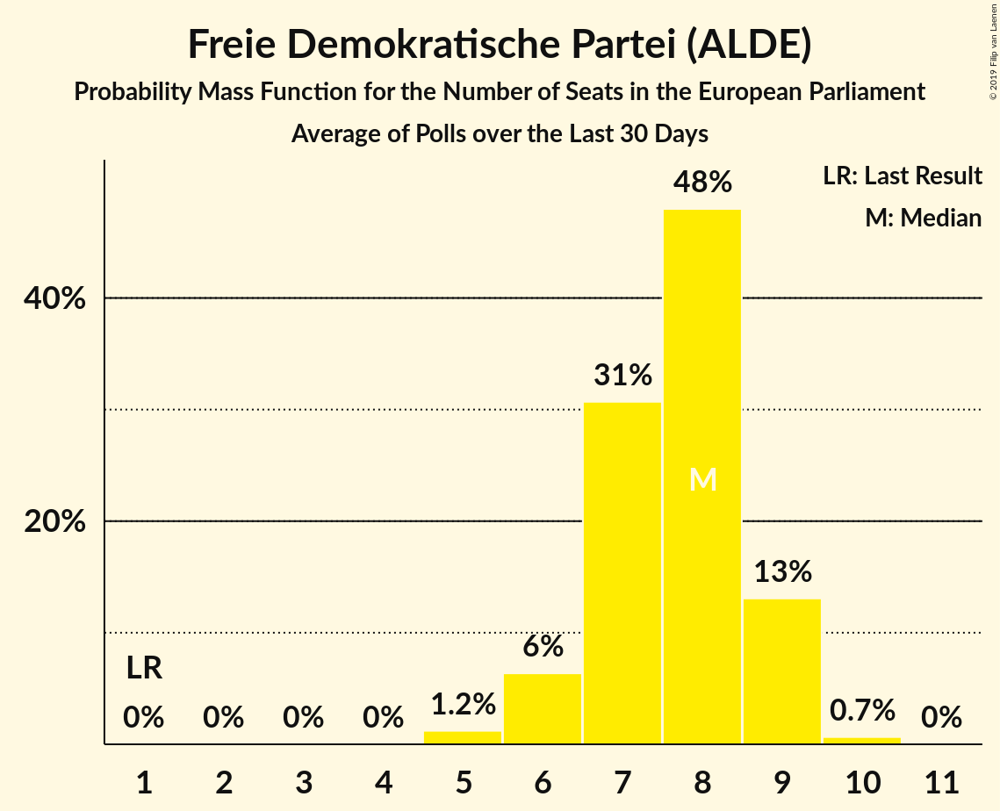

# Freie Demokratische Partei (ALDE)

<a href="#voting-intentions">Voting Intentions</a> | <a href="#seats">Seats</a>

## Voting Intentions

Last result: **0.0%** (General Election of 26 May 2019)

### Confidence Intervals

| Period     | Polling firm/Commissioner(s) | Median | 80% Confidence Interval | 90% Confidence Interval | 95% Confidence Interval | 99% Confidence Interval |
|:----------:|:----------------:|:-----------:|:-----------------------:|:-----------------------:|:-----------------------:|:-----------------------:|
| N/A | [Poll Average](average.html) | 7.8% | 6.7–8.9% | 6.4–9.2% | 6.1–9.5% | 5.7–10.0% |
| [21–24 June 2019](2019-06-24-INSA.html) | INSA | 8.5% | 7.8–9.4% | 7.6–9.6% | 7.4–9.8% | 7.0–10.2% |
| [17–21 June 2019](2019-06-21-Forsa.html) | Forsa | 8.0% | 7.3–8.8% | 7.1–9.1% | 6.9–9.3% | 6.6–9.7% |
| [17–19 June 2019](2019-06-19-ForschungsgruppeWahlen.html) | Forschungsgruppe Wahlen   ZDF | 7.0% | 6.1–8.0% | 5.9–8.2% | 5.7–8.5% | 5.3–9.0% |
| [13–18 June 2019](2019-06-18-Emnid.html) | Emnid   Bild am Sonntag | 7.0% | 6.3–7.8% | 6.1–8.1% | 5.9–8.3% | 5.6–8.7% |
| [14–17 June 2019](2019-06-17-INSA.html) | INSA | 9.5% | 8.7–10.3% | 8.5–10.6% | 8.3–10.8% | 7.9–11.2% |
| [11–14 June 2019](2019-06-14-Forsa.html) | Forsa | 9.0% | 8.2–10.0% | 7.9–10.3% | 7.7–10.5% | 7.3–11.0% |
| [6–12 June 2019](2019-06-12-Emnid.html) | Emnid   Bild am Sonntag | 8.0% | 7.3–8.8% | 7.1–9.0% | 7.0–9.2% | 6.7–9.5% |
| [1–12 June 2019](2019-06-12-Allensbach.html) | Allensbach | 8.0% | 7.1–9.1% | 6.9–9.4% | 6.6–9.6% | 6.2–10.2% |
| [7–10 June 2019](2019-06-10-INSA.html) | INSA | 9.0% | 8.2–9.9% | 8.0–10.1% | 7.8–10.3% | 7.5–10.8% |
| [3–7 June 2019](2019-06-07-Forsa.html) | Forsa | 8.0% | 7.3–8.8% | 7.1–9.1% | 6.9–9.3% | 6.6–9.7% |
| [3–5 June 2019](2019-06-05-Infratestdimap.html) | Infratest dimap   ARD | 8.0% | 7.2–9.0% | 6.9–9.3% | 6.7–9.5% | 6.3–10.0% |
| [3–5 June 2019](2019-06-05-ForschungsgruppeWahlen.html) | Forschungsgruppe Wahlen   ZDF | 7.0% | 6.2–8.0% | 5.9–8.3% | 5.7–8.6% | 5.4–9.0% |
| [29 May–5 June 2019](2019-06-05-Emnid.html) | Emnid   Bild am Sonntag | 8.0% | 7.2–8.8% | 7.0–9.1% | 6.8–9.3% | 6.5–9.7% |
| [3 June 2019](2019-06-03-INSA.html) | INSA | 8.0% | 7.0–9.2% | 6.7–9.6% | 6.5–9.9% | 6.0–10.5% |
| [27–31 May 2019](2019-05-31-Forsa.html) | Forsa | 8.0% | 7.2–8.9% | 7.0–9.2% | 6.8–9.4% | 6.4–9.9% |
| [23–28 May 2019](2019-05-28-Emnid.html) | Emnid   Bild am Sonntag | 8.0% | 7.1–9.0% | 6.9–9.3% | 6.7–9.5% | 6.3–10.0% |
| [24–27 May 2019](2019-05-27-INSA.html) | INSA | 9.5% | 8.7–10.4% | 8.5–10.7% | 8.3–10.9% | 7.9–11.3% |

### Probability Mass Function

The following table shows the probability mass function per percentage block of voting intentions for the [poll average](average.html) for Freie Demokratische Partei (ALDE).

| Voting Intentions | Probability | Accumulated | Special Marks |
|:-----------------:|:-----------:|:-----------:|:-------------:|
| 0.0–0.5% | 0% | 100% | Last Result |
| 0.5–1.5% | 0% | 100% |  |
| 1.5–2.5% | 0% | 100% |  |
| 2.5–3.5% | 0% | 100% |  |
| 3.5–4.5% | 0% | 100% |  |
| 4.5–5.5% | 0.3% | 100% |  |
| 5.5–6.5% | 8% | 99.7% |  |
| 6.5–7.5% | 30% | 92% |  |
| 7.5–8.5% | 41% | 62% | Median |
| 8.5–9.5% | 18% | 20% |  |
| 9.5–10.5% | 2% | 2% |  |
| 10.5–11.5% | 0% | 0% |  |
| 11.5–12.5% | 0% | 0% |  |

## Seats

Last result: **1** seats (General Election of 26 May 2019)

### Confidence Intervals

| Period     | Polling firm/Commissioner(s) | Median | 80% Confidence Interval | 90% Confidence Interval | 95% Confidence Interval | 99% Confidence Interval |
|:----------:|:----------------:|:------:|:-----------------------:|:-----------------------:|:-----------------------:|:-----------------------:|
| N/A | [Poll Average](average.html) | 8 | 7–9 | 6–9 | 6–9 | 5–10 |
| [21–24 June 2019](2019-06-24-INSA.html) | INSA | 8 | 8 | 8–9 | 8–9 | 7–9 |
| [17–21 June 2019](2019-06-21-Forsa.html) | Forsa | 8 | 7–9 | 7–9 | 7–9 | 7–9 |
| [17–19 June 2019](2019-06-19-ForschungsgruppeWahlen.html) | Forschungsgruppe Wahlen   ZDF | 7 | 6–7 | 6–7 | 5–8 | 5–8 |
| [13–18 June 2019](2019-06-18-Emnid.html) | Emnid   Bild am Sonntag | 8 | 6–8 | 6–8 | 6–8 | 5–8 |
| [14–17 June 2019](2019-06-17-INSA.html) | INSA | 10 | 9–10 | 8–10 | 8–11 | 8–11 |
| [11–14 June 2019](2019-06-14-Forsa.html) | Forsa | 9 | 8–9 | 7–9 | 7–10 | 7–10 |
| [6–12 June 2019](2019-06-12-Emnid.html) | Emnid   Bild am Sonntag | 8 | 7–8 | 6–9 | 6–9 | 6–9 |
| [1–12 June 2019](2019-06-12-Allensbach.html) | Allensbach | 9 | 7–9 | 7–9 | 6–10 | 5–10 |
| [7–10 June 2019](2019-06-10-INSA.html) | INSA | 8 | 8–9 | 8–10 | 7–10 | 7–11 |
| [3–7 June 2019](2019-06-07-Forsa.html) | Forsa | 8 | 7–8 | 6–8 | 6–9 | 6–10 |
| [3–5 June 2019](2019-06-05-Infratestdimap.html) | Infratest dimap   ARD | 8 | 7–8 | 7–9 | 7–9 | 6–9 |
| [3–5 June 2019](2019-06-05-ForschungsgruppeWahlen.html) | Forschungsgruppe Wahlen   ZDF | 9 | 6–9 | 6–9 | 6–9 | 5–9 |
| [29 May–5 June 2019](2019-06-05-Emnid.html) | Emnid   Bild am Sonntag | 7 | 6–8 | 6–8 | 6–8 | 6–9 |
| [3 June 2019](2019-06-03-INSA.html) | INSA | 7 | 7–8 | 7–8 | 7–8 | 6–9 |
| [27–31 May 2019](2019-05-31-Forsa.html) | Forsa | 8 | 7–9 | 6–9 | 6–9 | 6–9 |
| [23–28 May 2019](2019-05-28-Emnid.html) | Emnid   Bild am Sonntag | 8 | 7–8 | 7–9 | 7–9 | 6–9 |
| [24–27 May 2019](2019-05-27-INSA.html) | INSA | 9 | 8–10 | 8–10 | 8–10 | 8–10 |

### Probability Mass Function

The following table shows the probability mass function per seat for the [poll average](average.html) for Freie Demokratische Partei (ALDE).

| Number of Seats | Probability | Accumulated | Special Marks |
|:---------------:|:-----------:|:-----------:|:-------------:|
| 1 | 0% | 100% | Last Result |
| 2 | 0% | 100% |  |
| 3 | 0% | 100% |  |
| 4 | 0% | 100% |  |
| 5 | 1.2% | 100% |  |
| 6 | 6% | 98.8% |  |
| 7 | 31% | 92% |  |
| 8 | 48% | 62% | Median |
| 9 | 13% | 14% |  |
| 10 | 0.7% | 0.7% |  |
| 11 | 0% | 0% |  |

