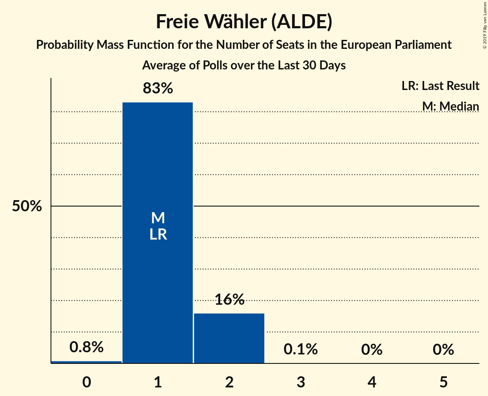

# Freie Wähler (ALDE)

<a href="#voting-intentions">Voting Intentions</a> | <a href="#seats">Seats</a>

## Voting Intentions

Last result: **0.0%** (General Election of 26 May 2019)

### Confidence Intervals

| Period     | Polling firm/Commissioner(s) | Median | 80% Confidence Interval | 90% Confidence Interval | 95% Confidence Interval | 99% Confidence Interval |
|:----------:|:----------------:|:-----------:|:-----------------------:|:-----------------------:|:-----------------------:|:-----------------------:|
| N/A | [Poll Average](average.html) | 1.2% | 0.8–1.7% | 0.7–1.8% | 0.6–2.0% | 0.5–2.3% |
| [21–24 June 2019](2019-06-24-INSA.html) | INSA | 0.9% | 0.7–1.2% | 0.6–1.3% | 0.6–1.4% | 0.5–1.6% |
| [17–21 June 2019](2019-06-21-Forsa.html) | Forsa | 1.3% | 1.0–1.7% | 1.0–1.8% | 0.9–1.9% | 0.8–2.1% |
| [17–19 June 2019](2019-06-19-ForschungsgruppeWahlen.html) | Forschungsgruppe Wahlen   ZDF | 1.0% | 0.7–1.5% | 0.7–1.6% | 0.6–1.7% | 0.5–2.0% |
| [13–18 June 2019](2019-06-18-Emnid.html) | Emnid   Bild am Sonntag | 1.2% | 0.9–1.5% | 0.8–1.6% | 0.8–1.8% | 0.7–2.0% |
| [14–17 June 2019](2019-06-17-INSA.html) | INSA | 0.1% | 0.0–0.3% | 0.0–0.3% | 0.0–0.4% | 0.0–0.5% |
| [11–14 June 2019](2019-06-14-Forsa.html) | Forsa | 1.3% | 1.0–1.8% | 0.9–1.9% | 0.9–2.0% | 0.8–2.3% |
| [6–12 June 2019](2019-06-12-Emnid.html) | Emnid   Bild am Sonntag | 1.2% | 0.9–1.5% | 0.9–1.6% | 0.8–1.7% | 0.7–1.9% |
| [1–12 June 2019](2019-06-12-Allensbach.html) | Allensbach | 1.0% | 0.7–1.5% | 0.7–1.6% | 0.6–1.8% | 0.5–2.0% |
| [7–10 June 2019](2019-06-10-INSA.html) | INSA | 1.1% | 0.8–1.4% | 0.7–1.5% | 0.7–1.6% | 0.6–1.8% |
| [3–7 June 2019](2019-06-07-Forsa.html) | Forsa | 1.5% | 1.2–1.9% | 1.1–2.0% | 1.1–2.1% | 0.9–2.4% |
| [3–5 June 2019](2019-06-05-Infratestdimap.html) | Infratest dimap   ARD | 1.5% | 1.2–2.0% | 1.1–2.2% | 1.0–2.3% | 0.9–2.6% |
| [3–5 June 2019](2019-06-05-ForschungsgruppeWahlen.html) | Forschungsgruppe Wahlen   ZDF | 1.2% | 0.9–1.6% | 0.8–1.8% | 0.7–1.9% | 0.6–2.2% |
| [29 May–5 June 2019](2019-06-05-Emnid.html) | Emnid   Bild am Sonntag | 1.2% | 0.9–1.5% | 0.8–1.6% | 0.8–1.8% | 0.7–2.0% |
| [3 June 2019](2019-06-03-INSA.html) | INSA | 1.0% | 0.7–1.5% | 0.6–1.7% | 0.5–1.8% | 0.4–2.1% |
| [27–31 May 2019](2019-05-31-Forsa.html) | Forsa | 1.5% | 1.2–2.0% | 1.1–2.1% | 1.0–2.2% | 0.9–2.5% |
| [23–28 May 2019](2019-05-28-Emnid.html) | Emnid   Bild am Sonntag | 1.1% | 0.8–1.6% | 0.8–1.7% | 0.7–1.8% | 0.6–2.1% |
| [24–27 May 2019](2019-05-27-INSA.html) | INSA | 1.0% | 0.7–1.3% | 0.7–1.4% | 0.6–1.5% | 0.5–1.7% |

### Probability Mass Function

The following table shows the probability mass function per percentage block of voting intentions for the [poll average](average.html) for Freie Wähler (ALDE).

| Voting Intentions | Probability | Accumulated | Special Marks |
|:-----------------:|:-----------:|:-----------:|:-------------:|
| 0.0–0.5% | 0.7% | 100% | Last Result |
| 0.5–1.5% | 83% | 99.3% | Median |
| 1.5–2.5% | 16% | 16% |  |
| 2.5–3.5% | 0.1% | 0.1% |  |
| 3.5–4.5% | 0% | 0% |  |

## Seats

Last result: **1** seats (General Election of 26 May 2019)

### Confidence Intervals

| Period     | Polling firm/Commissioner(s) | Median | 80% Confidence Interval | 90% Confidence Interval | 95% Confidence Interval | 99% Confidence Interval |
|:----------:|:----------------:|:------:|:-----------------------:|:-----------------------:|:-----------------------:|:-----------------------:|
| N/A | [Poll Average](average.html) | 1 | 1–2 | 1–2 | 1–2 | 0–2 |
| [21–24 June 2019](2019-06-24-INSA.html) | INSA | 1 | 1 | 1 | 1 | 1 |
| [17–21 June 2019](2019-06-21-Forsa.html) | Forsa | 1 | 1–2 | 1–2 | 1–2 | 1–2 |
| [17–19 June 2019](2019-06-19-ForschungsgruppeWahlen.html) | Forschungsgruppe Wahlen   ZDF | 1 | 1–2 | 1–2 | 0–2 | 0–2 |
| [13–18 June 2019](2019-06-18-Emnid.html) | Emnid   Bild am Sonntag | 1 | 1–2 | 1–2 | 1–2 | 1–2 |
| [14–17 June 2019](2019-06-17-INSA.html) | INSA | 0 | 0 | 0 | 0 | 0 |
| [11–14 June 2019](2019-06-14-Forsa.html) | Forsa | 1 | 1 | 1 | 1–2 | 1–2 |
| [6–12 June 2019](2019-06-12-Emnid.html) | Emnid   Bild am Sonntag | 1 | 1–2 | 1–2 | 1–2 | 1–2 |
| [1–12 June 2019](2019-06-12-Allensbach.html) | Allensbach | 1 | 1 | 1–2 | 1–2 | 0–2 |
| [7–10 June 2019](2019-06-10-INSA.html) | INSA | 1 | 1 | 1 | 1–2 | 1–2 |
| [3–7 June 2019](2019-06-07-Forsa.html) | Forsa | 1 | 1–2 | 1–2 | 1–2 | 1–2 |
| [3–5 June 2019](2019-06-05-Infratestdimap.html) | Infratest dimap   ARD | 1 | 1–2 | 1–2 | 1–2 | 1–2 |
| [3–5 June 2019](2019-06-05-ForschungsgruppeWahlen.html) | Forschungsgruppe Wahlen   ZDF | 1 | 1 | 1–2 | 1–2 | 1–2 |
| [29 May–5 June 2019](2019-06-05-Emnid.html) | Emnid   Bild am Sonntag | 1 | 1 | 1 | 1 | 1–2 |
| [3 June 2019](2019-06-03-INSA.html) | INSA | 1 | 1 | 1 | 1 | 1–2 |
| [27–31 May 2019](2019-05-31-Forsa.html) | Forsa | 2 | 1–2 | 1–2 | 1–2 | 1–2 |
| [23–28 May 2019](2019-05-28-Emnid.html) | Emnid   Bild am Sonntag | 1 | 1 | 1 | 1 | 1–2 |
| [24–27 May 2019](2019-05-27-INSA.html) | INSA | 1 | 1 | 1 | 1 | 1 |

### Probability Mass Function

The following table shows the probability mass function per seat for the [poll average](average.html) for Freie Wähler (ALDE).

| Number of Seats | Probability | Accumulated | Special Marks |
|:---------------:|:-----------:|:-----------:|:-------------:|
| 0 | 0.8% | 100% |  |
| 1 | 83% | 99.2% | Last Result, Median |
| 2 | 16% | 16% |  |
| 3 | 0.1% | 0.1% |  |
| 4 | 0% | 0% |  |

