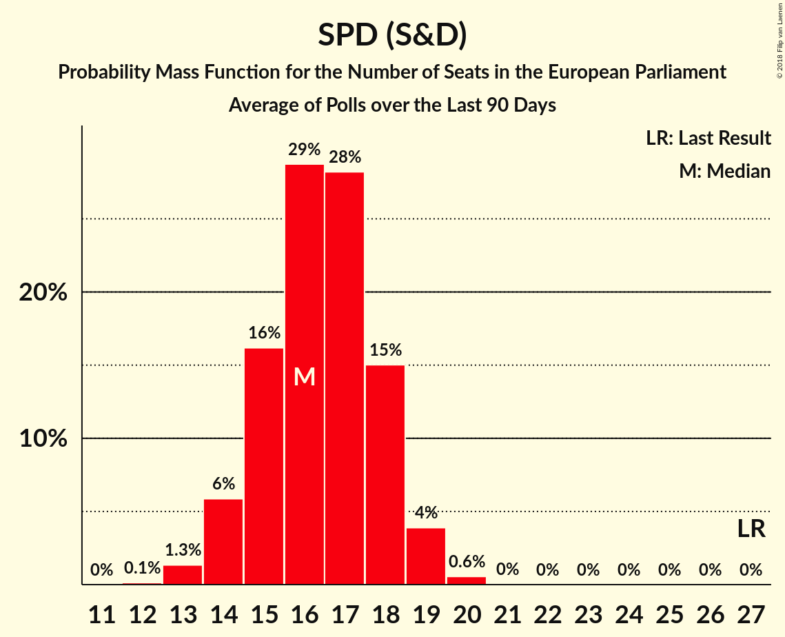
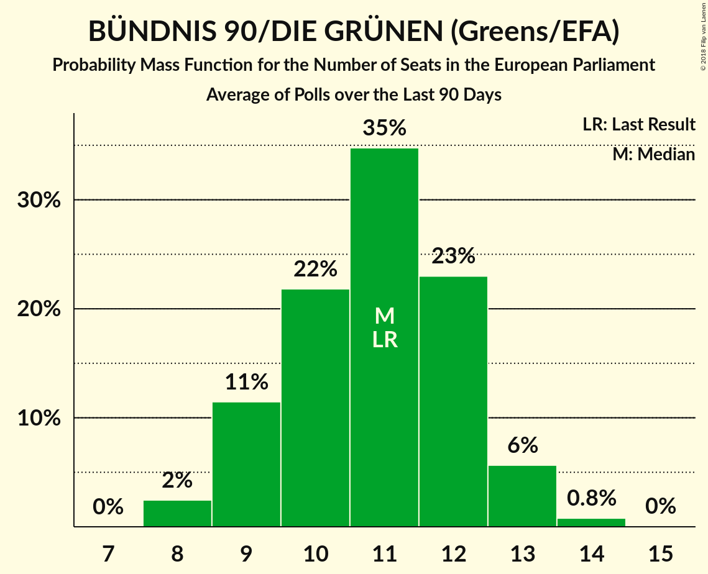
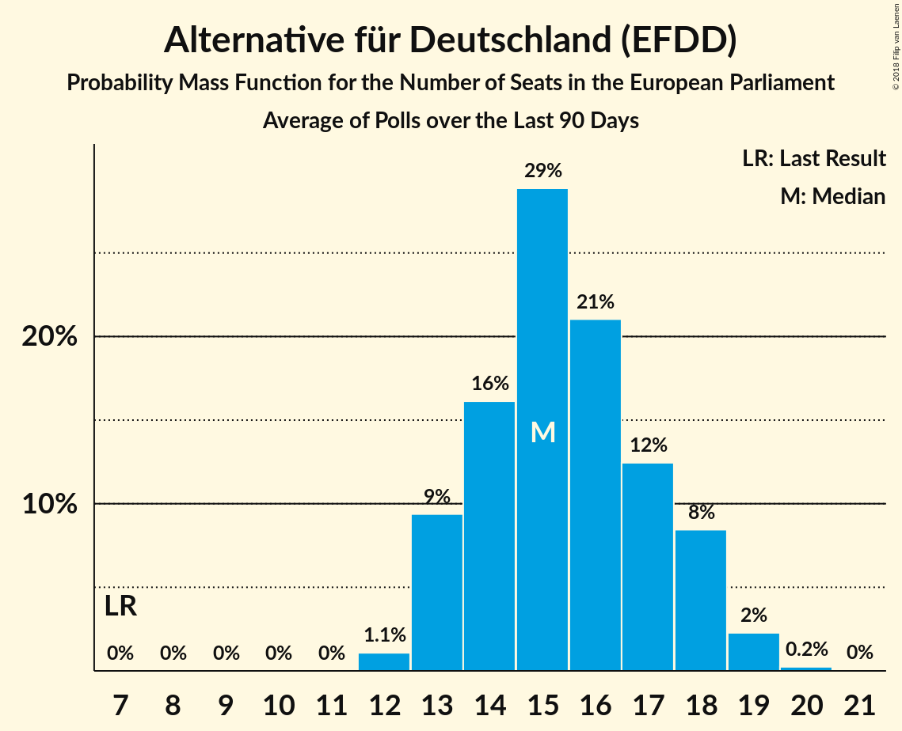
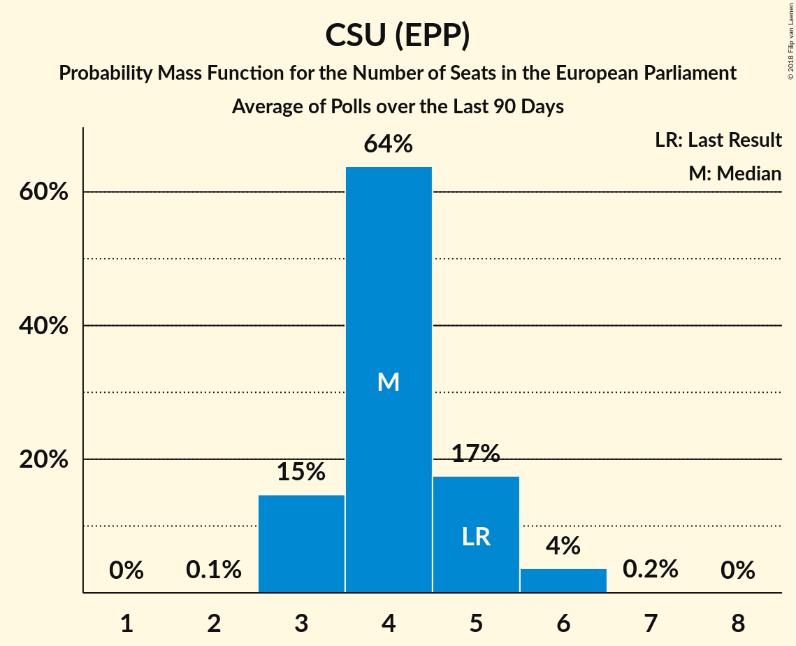
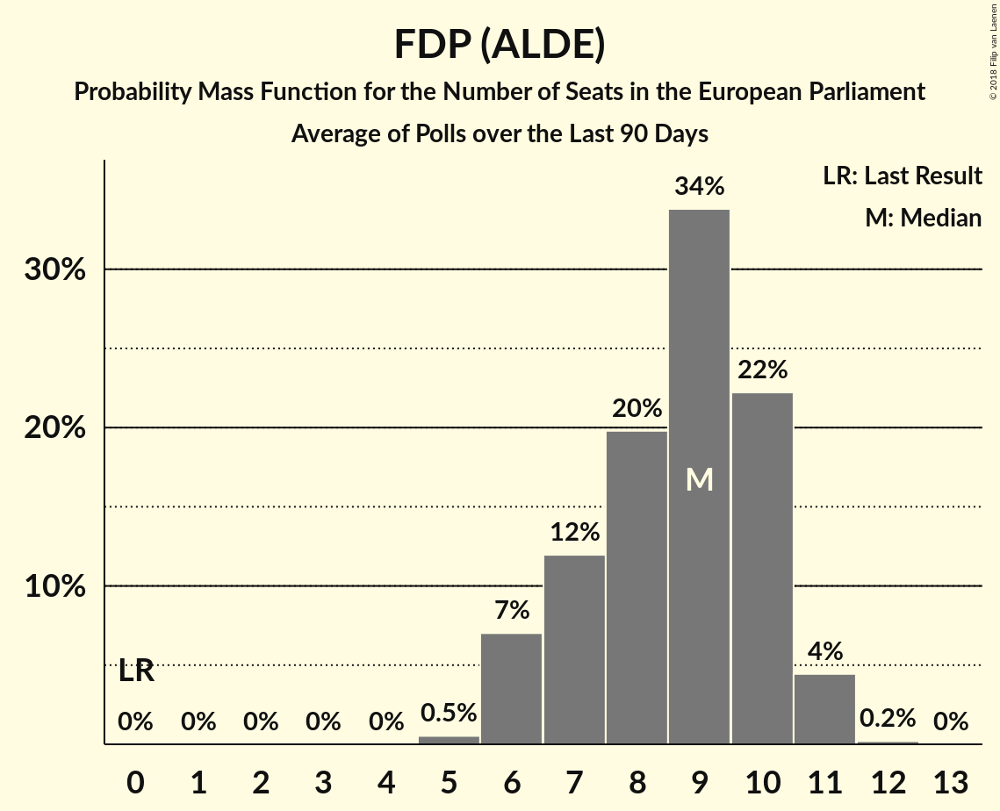

# Poll Average

<a href="#voting-intentions">Voting Intentions</a> | <a href="#seats">Seats</a> | <a href="#coalitions">Coalitions</a> | <a href="#technical-information">Technical Information</a>

## Summary

The table below lists the polls on which the average is based. They are the most recent polls (less than 90 days old) registered and analyzed so far.

| Period     | Polling firm/Commissioner(s) | CDU | SPD | GRÜNEN | LINKE | AfD | CSU | FDP |
|:----------:|:----------------------------:|:--:|:--:|:--:|:--:|:--:|:--:|:--:|
| 25 May 2014 | General Election | 30.0%   29 | 27.3%   27 | 10.7%   11 | 7.4%   7 | 7.0%   7 | 5.3%   5 | 3.4%   3 |
| N/A | Poll Average | 25–30%   24–29 | 15–21%   14–19 | 10–14%   10–14 | 8–13%   7–12 | 12–17%   11–16 | 4–6%   4–6 | 7–12%   7–12 |
| [13–15 March 2018](2018-03-15-ForschungsgruppeWahlen.html) | Forschungsgruppe Wahlen   ZDF | 25–30%   24–27 | 17–21%   17–20 | 10–14%   10–13 | 9–13%   10–12 | 11–15%   11–14 | 4–6%   4–6 | 7–11%   7–10 |
| [8–14 March 2018](2018-03-14-Emnid.html) | Emnid   Bild am Sonntag | 26–30%   N/A | 17–21%   N/A | 10–12%   N/A | 9–11%   N/A | 12–16%   N/A | 4–6%   N/A | 8–10%   N/A |
| [9–12 March 2018](2018-03-12-INSAandYouGov.html) | INSA and YouGov   Bild | N/A   N/A | N/A   N/A | N/A   N/A | N/A   N/A | N/A   N/A | N/A   N/A | N/A   N/A |
| [5–9 March 2018](2018-03-09-Forsa.html) | Forsa   Stern and RTL | N/A   N/A | N/A   N/A | N/A   N/A | N/A   N/A | N/A   N/A | N/A   N/A | N/A   N/A |
| [26–28 February 2018](2018-02-28-YouGov.html) | YouGov   RedaktionsNetzwerk Deutschland | 25–29%   24–28 | 14–18%   14–17 | 10–14%   10–13 | 10–14%   10–13 | 14–18%   14–17 | 4–6%   4–6 | 7–9%   6–9 |
| [26–28 February 2018](2018-02-28-Infratestdimap.html) | Infratest dimap   ARD | 27–31%   25–30 | 16–20%   15–19 | 9–13%   9–12 | 8–11%   7–10 | 13–17%   13–16 | 4–6%   4–6 | 8–11%   7–10 |
| [2–15 February 2018](2018-02-15-Allensbach.html) | Allensbach   Frankfurter Allgemeine Zeitung | 25–30%   24–28 | 15–20%   15–19 | 10–14%   10–13 | 8–11%   8–11 | 11–15%   11–14 | 4–6%   4–6 | 9–13%   9–12 |
| [1–7 February 2018](2018-02-07-GMS.html) | GMS | 25–30%   23–29 | 16–20%   15–20 | 11–15%   11–15 | 7–11%   7–10 | 12–16%   11–16 | 4–6%   4–6 | 7–11%   7–10 |
| 25 May 2014 | General Election | 30.0%   29 | 27.3%   27 | 10.7%   11 | 7.4%   7 | 7.0%   7 | 5.3%   5 | 3.4%   3 |

Only polls for which at least the sample size has been published are included in the table above.

**Legend:**
+ **Top half of each row:** Voting intentions (95% confidence interval)
+ **Bottom half of each row:** Seat projections for the European Parliament (95% confidence interval)
+ **CDU:** CDU (EPP)
+ **SPD:** SPD (S&D)
+ **GRÜNEN:** BÜNDNIS 90/DIE GRÜNEN (Greens/EFA)
+ **LINKE:** DIE LINKE (GUE/NGL)
+ **AfD:** Alternative für Deutschland (EFDD)
+ **CSU:** CSU (EPP)
+ **FDP:** FDP (ALDE)
+ **N/A (single party):** Party not included the published results
+ **N/A (entire row):** Calculation for this opinion poll not started yet

## Voting Intentions

### Confidence Intervals

| Party | Last Result | Median | 80% Confidence Interval | 90% Confidence Interval | 95% Confidence Interval | 99% Confidence Interval |
|:-----:|:-----------:|:------:|:-----------------------:|:-----------------------:|:-----------------------:|:-----------------------:|
| <a href="#cdu-(epp)">CDU (EPP)</a> | 30.0% | 27.6% | 25.9–29.4% |25.4–29.9% | 25.0–30.4% | 24.2–31.3% |
| <a href="#spd-(s&d)">SPD (S&D)</a> | 27.3% | 18.0% | 16.0–19.8% |15.5–20.2% | 15.1–20.6% | 14.3–21.4% |
| <a href="#bÜndnis-90/die-grÜnen-(greens/efa)">BÜNDNIS 90/DIE GRÜNEN (Greens/EFA)</a> | 10.7% | 11.8% | 10.5–13.4% |10.2–13.9% | 9.9–14.3% | 9.4–15.2% |
| <a href="#die-linke-(gue/ngl)">DIE LINKE (GUE/NGL)</a> | 7.4% | 10.0% | 8.5–12.1% |8.2–12.6% | 7.9–13.0% | 7.4–13.7% |
| <a href="#alternative-für-deutschland-(efdd)">Alternative für Deutschland (EFDD)</a> | 7.0% | 14.1% | 12.4–16.2% |12.0–16.7% | 11.7–17.1% | 11.0–17.9% |
| <a href="#csu-(epp)">CSU (EPP)</a> | 5.3% | 5.0% | 4.2–5.8% |4.0–6.0% | 3.9–6.2% | 3.5–6.7% |
| <a href="#fdp-(alde)">FDP (ALDE)</a> | 3.4% | 9.1% | 7.8–11.0% |7.5–11.5% | 7.3–12.0% | 6.8–12.8% |

### CDU (EPP)

*For a full overview of the results for this party, see the [CDU (EPP)](party-cduepp.html) page.*

| Voting Intentions | Probability | Accumulated | Special Marks |
|:-----------------:|:-----------:|:-----------:|:-------------:|
| 21.5–22.5% | 0% | 100% |  |
| 22.5–23.5% | 0.1% | 100% |  |
| 23.5–24.5% | 1.0% | 99.9% |  |
| 24.5–25.5% | 5% | 98.9% |  |
| 25.5–26.5% | 15% | 94% |  |
| 26.5–27.5% | 27% | 79% |  |
| 27.5–28.5% | 27% | 52% | Median |
| 28.5–29.5% | 17% | 25% |  |
| 29.5–30.5% | 6% | 8% | Last Result |
| 30.5–31.5% | 2% | 2% |  |
| 31.5–32.5% | 0.2% | 0.3% |  |
| 32.5–33.5% | 0% | 0% |  |

### SPD (S&D)

*For a full overview of the results for this party, see the [SPD (S&D)](party-spdsd.html) page.*

| Voting Intentions | Probability | Accumulated | Special Marks |
|:-----------------:|:-----------:|:-----------:|:-------------:|
| 12.5–13.5% | 0% | 100% |  |
| 13.5–14.5% | 0.8% | 100% |  |
| 14.5–15.5% | 5% | 99.2% |  |
| 15.5–16.5% | 12% | 94% |  |
| 16.5–17.5% | 20% | 82% |  |
| 17.5–18.5% | 26% | 62% | Median |
| 18.5–19.5% | 23% | 36% |  |
| 19.5–20.5% | 10% | 13% |  |
| 20.5–21.5% | 3% | 3% |  |
| 21.5–22.5% | 0.3% | 0.4% |  |
| 22.5–23.5% | 0% | 0% |  |
| 23.5–24.5% | 0% | 0% |  |
| 24.5–25.5% | 0% | 0% |  |
| 25.5–26.5% | 0% | 0% |  |
| 26.5–27.5% | 0% | 0% | Last Result |

### BÜNDNIS 90/DIE GRÜNEN (Greens/EFA)

*For a full overview of the results for this party, see the [BÜNDNIS 90/DIE GRÜNEN (Greens/EFA)](party-bÜndnis90diegrÜnengreensefa.html) page.*

| Voting Intentions | Probability | Accumulated | Special Marks |
|:-----------------:|:-----------:|:-----------:|:-------------:|
| 7.5–8.5% | 0% | 100% |  |
| 8.5–9.5% | 0.8% | 100% |  |
| 9.5–10.5% | 10% | 99.2% |  |
| 10.5–11.5% | 30% | 89% | Last Result |
| 11.5–12.5% | 32% | 59% | Median |
| 12.5–13.5% | 19% | 27% |  |
| 13.5–14.5% | 6% | 8% |  |
| 14.5–15.5% | 1.4% | 2% |  |
| 15.5–16.5% | 0.2% | 0.2% |  |
| 16.5–17.5% | 0% | 0% |  |

### DIE LINKE (GUE/NGL)

*For a full overview of the results for this party, see the [DIE LINKE (GUE/NGL)](party-dielinkeguengl.html) page.*

| Voting Intentions | Probability | Accumulated | Special Marks |
|:-----------------:|:-----------:|:-----------:|:-------------:|
| 5.5–6.5% | 0% | 100% |  |
| 6.5–7.5% | 0.9% | 100% | Last Result |
| 7.5–8.5% | 10% | 99.0% |  |
| 8.5–9.5% | 26% | 89% |  |
| 9.5–10.5% | 27% | 63% | Median |
| 10.5–11.5% | 18% | 35% |  |
| 11.5–12.5% | 12% | 18% |  |
| 12.5–13.5% | 5% | 5% |  |
| 13.5–14.5% | 0.6% | 0.7% |  |
| 14.5–15.5% | 0% | 0% |  |

### Alternative für Deutschland (EFDD)

*For a full overview of the results for this party, see the [Alternative für Deutschland (EFDD)](party-alternativefürdeutschlandefdd.html) page.*

| Voting Intentions | Probability | Accumulated | Special Marks |
|:-----------------:|:-----------:|:-----------:|:-------------:|
| 6.5–7.5% | 0% | 100% | Last Result |
| 7.5–8.5% | 0% | 100% |  |
| 8.5–9.5% | 0% | 100% |  |
| 9.5–10.5% | 0.1% | 100% |  |
| 10.5–11.5% | 2% | 99.9% |  |
| 11.5–12.5% | 10% | 98% |  |
| 12.5–13.5% | 22% | 88% |  |
| 13.5–14.5% | 27% | 66% | Median |
| 14.5–15.5% | 20% | 39% |  |
| 15.5–16.5% | 13% | 19% |  |
| 16.5–17.5% | 5% | 6% |  |
| 17.5–18.5% | 1.0% | 1.0% |  |
| 18.5–19.5% | 0.1% | 0.1% |  |
| 19.5–20.5% | 0% | 0% |  |

### CSU (EPP)

*For a full overview of the results for this party, see the [CSU (EPP)](party-csuepp.html) page.*

| Voting Intentions | Probability | Accumulated | Special Marks |
|:-----------------:|:-----------:|:-----------:|:-------------:|
| 1.5–2.5% | 0% | 100% |  |
| 2.5–3.5% | 0.6% | 100% |  |
| 3.5–4.5% | 24% | 99.4% |  |
| 4.5–5.5% | 59% | 76% | Last Result, Median |
| 5.5–6.5% | 16% | 17% |  |
| 6.5–7.5% | 0.7% | 0.7% |  |
| 7.5–8.5% | 0% | 0% |  |

### FDP (ALDE)

*For a full overview of the results for this party, see the [FDP (ALDE)](party-fdpalde.html) page.*

| Voting Intentions | Probability | Accumulated | Special Marks |
|:-----------------:|:-----------:|:-----------:|:-------------:|
| 2.5–3.5% | 0% | 100% | Last Result |
| 3.5–4.5% | 0% | 100% |  |
| 4.5–5.5% | 0% | 100% |  |
| 5.5–6.5% | 0.2% | 100% |  |
| 6.5–7.5% | 5% | 99.8% |  |
| 7.5–8.5% | 25% | 95% |  |
| 8.5–9.5% | 37% | 70% | Median |
| 9.5–10.5% | 19% | 33% |  |
| 10.5–11.5% | 9% | 14% |  |
| 11.5–12.5% | 4% | 5% |  |
| 12.5–13.5% | 0.8% | 0.9% |  |
| 13.5–14.5% | 0.1% | 0.1% |  |
| 14.5–15.5% | 0% | 0% |  |

## Seats

### Confidence Intervals

| Party | Last Result | Median | 80% Confidence Interval | 90% Confidence Interval | 95% Confidence Interval | 99% Confidence Interval |
|:-----:|:-----------:|:------:|:-----------------------:|:-----------------------:|:-----------------------:|:-----------------------:|
| <a href="#cdu-(epp)">CDU (EPP)</a> | 29 | 26 | 25–28 |24–29 | 24–29 | 23–30 |
| <a href="#spd-(s&d)">SPD (S&D)</a> | 27 | 17 | 15–19 |15–19 | 14–19 | 14–20 |
| <a href="#bÜndnis-90/die-grÜnen-(greens/efa)">BÜNDNIS 90/DIE GRÜNEN (Greens/EFA)</a> | 11 | 11 | 10–13 |10–13 | 10–14 | 9–15 |
| <a href="#die-linke-(gue/ngl)">DIE LINKE (GUE/NGL)</a> | 7 | 10 | 8–12 |8–12 | 7–12 | 7–13 |
| <a href="#alternative-für-deutschland-(efdd)">Alternative für Deutschland (EFDD)</a> | 7 | 13 | 12–16 |12–16 | 11–16 | 10–17 |
| <a href="#csu-(epp)">CSU (EPP)</a> | 5 | 5 | 4–6 |4–6 | 4–6 | 3–6 |
| <a href="#fdp-(alde)">FDP (ALDE)</a> | 3 | 9 | 7–11 |7–11 | 7–12 | 6–12 |

### CDU (EPP)

*For a full overview of the results for this party, see the [CDU (EPP)](party-cduepp.html) page.*

| Number of Seats | Probability | Accumulated | Special Marks |
|:---------------:|:-----------:|:-----------:|:-------------:|
| 22 | 0.5% | 100% |  |
| 23 | 1.0% | 99.5% |  |
| 24 | 7% | 98.5% |  |
| 25 | 14% | 92% |  |
| 26 | 32% | 77% | Median |
| 27 | 28% | 45% |  |
| 28 | 12% | 17% |  |
| 29 | 5% | 6% | Last Result |
| 30 | 1.1% | 1.3% |  |
| 31 | 0.2% | 0.2% |  |
| 32 | 0% | 0% |  |

### SPD (S&D)

*For a full overview of the results for this party, see the [SPD (S&D)](party-spdsd.html) page.*

| Number of Seats | Probability | Accumulated | Special Marks |
|:---------------:|:-----------:|:-----------:|:-------------:|
| 13 | 0.3% | 100% |  |
| 14 | 3% | 99.7% |  |
| 15 | 12% | 96% |  |
| 16 | 21% | 84% |  |
| 17 | 32% | 63% | Median |
| 18 | 16% | 31% |  |
| 19 | 13% | 14% |  |
| 20 | 1.2% | 1.4% |  |
| 21 | 0.2% | 0.3% |  |
| 22 | 0% | 0% |  |
| 23 | 0% | 0% |  |
| 24 | 0% | 0% |  |
| 25 | 0% | 0% |  |
| 26 | 0% | 0% |  |
| 27 | 0% | 0% | Last Result |

### BÜNDNIS 90/DIE GRÜNEN (Greens/EFA)

*For a full overview of the results for this party, see the [BÜNDNIS 90/DIE GRÜNEN (Greens/EFA)](party-bÜndnis90diegrÜnengreensefa.html) page.*

| Number of Seats | Probability | Accumulated | Special Marks |
|:---------------:|:-----------:|:-----------:|:-------------:|
| 8 | 0.1% | 100% |  |
| 9 | 2% | 99.9% |  |
| 10 | 14% | 98% |  |
| 11 | 35% | 84% | Last Result, Median |
| 12 | 34% | 50% |  |
| 13 | 11% | 15% |  |
| 14 | 3% | 4% |  |
| 15 | 0.5% | 0.6% |  |
| 16 | 0% | 0% |  |

### DIE LINKE (GUE/NGL)

*For a full overview of the results for this party, see the [DIE LINKE (GUE/NGL)](party-dielinkeguengl.html) page.*

| Number of Seats | Probability | Accumulated | Special Marks |
|:---------------:|:-----------:|:-----------:|:-------------:|
| 6 | 0.1% | 100% |  |
| 7 | 3% | 99.9% | Last Result |
| 8 | 19% | 97% |  |
| 9 | 27% | 79% |  |
| 10 | 21% | 52% | Median |
| 11 | 12% | 30% |  |
| 12 | 17% | 19% |  |
| 13 | 2% | 2% |  |
| 14 | 0.2% | 0.2% |  |
| 15 | 0% | 0% |  |

### Alternative für Deutschland (EFDD)

*For a full overview of the results for this party, see the [Alternative für Deutschland (EFDD)](party-alternativefürdeutschlandefdd.html) page.*

| Number of Seats | Probability | Accumulated | Special Marks |
|:---------------:|:-----------:|:-----------:|:-------------:|
| 7 | 0% | 100% | Last Result |
| 8 | 0% | 100% |  |
| 9 | 0% | 100% |  |
| 10 | 0.6% | 100% |  |
| 11 | 4% | 99.4% |  |
| 12 | 28% | 96% |  |
| 13 | 18% | 68% | Median |
| 14 | 20% | 50% |  |
| 15 | 19% | 30% |  |
| 16 | 9% | 11% |  |
| 17 | 2% | 2% |  |
| 18 | 0.2% | 0.2% |  |
| 19 | 0% | 0% |  |

### CSU (EPP)

*For a full overview of the results for this party, see the [CSU (EPP)](party-csuepp.html) page.*

| Number of Seats | Probability | Accumulated | Special Marks |
|:---------------:|:-----------:|:-----------:|:-------------:|
| 3 | 1.0% | 100% |  |
| 4 | 33% | 99.0% |  |
| 5 | 55% | 66% | Last Result, Median |
| 6 | 10% | 10% |  |
| 7 | 0.3% | 0.3% |  |
| 8 | 0% | 0% |  |

### FDP (ALDE)

*For a full overview of the results for this party, see the [FDP (ALDE)](party-fdpalde.html) page.*

| Number of Seats | Probability | Accumulated | Special Marks |
|:---------------:|:-----------:|:-----------:|:-------------:|
| 3 | 0% | 100% | Last Result |
| 4 | 0% | 100% |  |
| 5 | 0% | 100% |  |
| 6 | 0.6% | 100% |  |
| 7 | 10% | 99.4% |  |
| 8 | 34% | 89% |  |
| 9 | 22% | 55% | Median |
| 10 | 21% | 33% |  |
| 11 | 9% | 12% |  |
| 12 | 3% | 3% |  |
| 13 | 0.3% | 0.3% |  |
| 14 | 0% | 0% |  |

## Coalitions

### Confidence Intervals

| Coalition | Last Result | Median | Majority? | 80% Confidence Interval | 90% Confidence Interval | 95% Confidence Interval | 99% Confidence Interval |
|:---------:|:-----------:|:------:|:---------:|:-----------------------:|:-----------------------:|:-----------------------:|:-----------------------:|
| CDU (EPP) – CSU (EPP) | 34 | 31 | 0% | 29–33 | 29–34 | 28–34 | 27–35 |
| SPD (S&D) | 27 | 17 | 0% | 15–19 | 15–19 | 14–19 | 14–20 |
| Alternative für Deutschland (EFDD) | 7 | 13 | 0% | 12–16 | 12–16 | 11–16 | 10–17 |

### CDU (EPP) – CSU (EPP)

| Number of Seats | Probability | Accumulated | Special Marks |
|:---------------:|:-----------:|:-----------:|:-------------:|
| 26 | 0% | 100% |  |
| 27 | 0.7% | 99.9% |  |
| 28 | 2% | 99.3% |  |
| 29 | 8% | 97% |  |
| 30 | 18% | 89% |  |
| 31 | 38% | 71% | Median |
| 32 | 17% | 33% |  |
| 33 | 10% | 16% |  |
| 34 | 4% | 6% | Last Result |
| 35 | 1.2% | 1.4% |  |
| 36 | 0.2% | 0.2% |  |
| 37 | 0% | 0% |  |

### SPD (S&D)

| Number of Seats | Probability | Accumulated | Special Marks |
|:---------------:|:-----------:|:-----------:|:-------------:|
| 13 | 0.3% | 100% |  |
| 14 | 3% | 99.7% |  |
| 15 | 12% | 96% |  |
| 16 | 21% | 84% |  |
| 17 | 32% | 63% | Median |
| 18 | 16% | 31% |  |
| 19 | 13% | 14% |  |
| 20 | 1.2% | 1.4% |  |
| 21 | 0.2% | 0.3% |  |
| 22 | 0% | 0% |  |
| 23 | 0% | 0% |  |
| 24 | 0% | 0% |  |
| 25 | 0% | 0% |  |
| 26 | 0% | 0% |  |
| 27 | 0% | 0% | Last Result |

### Alternative für Deutschland (EFDD)

| Number of Seats | Probability | Accumulated | Special Marks |
|:---------------:|:-----------:|:-----------:|:-------------:|
| 7 | 0% | 100% | Last Result |
| 8 | 0% | 100% |  |
| 9 | 0% | 100% |  |
| 10 | 0.6% | 100% |  |
| 11 | 4% | 99.4% |  |
| 12 | 28% | 96% |  |
| 13 | 18% | 68% | Median |
| 14 | 20% | 50% |  |
| 15 | 19% | 30% |  |
| 16 | 9% | 11% |  |
| 17 | 2% | 2% |  |
| 18 | 0.2% | 0.2% |  |
| 19 | 0% | 0% |  |

## Technical Information

