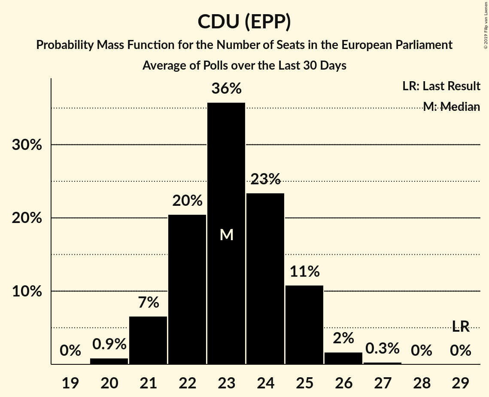

# Poll Average

<a href="#voting-intentions">Voting Intentions</a> | <a href="#seats">Seats</a> | <a href="#coalitions">Coalitions</a> | <a href="#technical-information">Technical Information</a>

## Summary

The table below lists the polls on which the average is based. They are the most recent polls (less than 90 days old) registered and analyzed so far.

| Period     | Polling firm/Commissioner(s) | CDU | SPD | AfD | FDP | LINKE | GRÜNEN | CSU |
|:----------:|:----------------------------:|:--:|:--:|:--:|:--:|:--:|:--:|:--:|
| 25 May 2014 | General Election | 0.0%   0 | 0.0%   0 | 0.0%   0 | 0.0%   0 | 0.0%   0 | 0.0%   0 | 0.0%   0 |
| N/A | Poll Average | 23–31%   23–29 | 15–21%   14–20 | 11–16%   10–16 | 6–12%   6–11 | 8–13%   7–12 | 10–15%   9–15 | 4–6%   4–6 |
| [13–15 February 2018](2018-02-15-Infratestdimap.html) | Infratest dimap   ARD | 25–31%   23–28 | 14–18%   14–18 | 13–17%   14–16 | 7–11%   7–10 | 9–13%   9–12 | 11–15%   11–13 | 4–7%   5–6 |
| [9–12 February 2018](2018-02-12-INSAandYouGov.html) | INSA and YouGov   Bild | 23–26%   23 | 15–18%   15 | 14–16%   14–15 | 9–12%   10–11 | 10–13%   11–12 | 12–14%   12–13 | 5–6%   5 |
| [7–8 February 2018](2018-02-08-Forsa.html) | Forsa   Stern and RTL | 24–29%   23–28 | 16–21%   15–20 | 11–15%   11–15 | 8–12%   8–11 | 8–12%   8–11 | 11–15%   11–14 | 4–6%   3–6 |
| [1–7 February 2018](2018-02-07-GMS.html) | GMS | 25–30%   23–28 | 16–20%   15–19 | 12–16%   12–16 | 7–11%   7–11 | 7–11%   7–10 | 11–15%   10–14 | 4–6%   4–5 |
| [1–7 February 2018](2018-02-07-Emnid.html) | Emnid   Bild am Sonntag | 26–31%   26–30 | 18–22%   17–23 | 10–14%   10–14 | 7–11%   8–10 | 7–11%   7–11 | 9–13%   9–12 | 4–7%   4–6 |
| [30 January–1 February 2018](2018-02-01-ForschungsgruppeWahlen.html) | Forschungsgruppe Wahlen   ZDF | 24–29%   23–28 | 17–21%   16–20 | 12–16%   12–15 | 6–9%   5–8 | 9–13%   9–12 | 12–16%   12–15 | 4–6%   4–6 |
| 25 May 2014 | General Election | 0.0%   0 | 0.0%   0 | 0.0%   0 | 0.0%   0 | 0.0%   0 | 0.0%   0 | 0.0%   0 |

Only polls for which at least the sample size has been published are included in the table above.

**Legend:**
+ **Top half of each row:** Voting intentions (95% confidence interval)
+ **Bottom half of each row:** Seat projections for the European Parliament (95% confidence interval)
+ **CDU:** CDU (EPP)
+ **SPD:** SPD (S&D)
+ **AfD:** Alternative für Deutschland (EFDD)
+ **FDP:** FDP (ALDE)
+ **LINKE:** DIE LINKE (GUE/NGL)
+ **GRÜNEN:** BÜNDNIS 90/DIE GRÜNEN (Greens/EFA)
+ **CSU:** CSU (EPP)
+ **N/A (single party):** Party not included the published results
+ **N/A (entire row):** Calculation for this opinion poll not started yet

## Voting Intentions

### Confidence Intervals

| Party | Last Result | Median | 80% Confidence Interval | 90% Confidence Interval | 95% Confidence Interval | 99% Confidence Interval |
|:-----:|:-----------:|:------:|:-----------------------:|:-----------------------:|:-----------------------:|:-----------------------:|
| <a href="#cdu-(epp)">CDU (EPP)</a> | 0.0% | 26.9% | 24.1–29.4% |23.6–30.0% | 23.2–30.6% | 22.5–31.6% |
| <a href="#spd-(s&d)">SPD (S&D)</a> | 0.0% | 17.9% | 15.8–20.3% |15.2–20.9% | 14.8–21.4% | 13.9–22.3% |
| <a href="#alternative-für-deutschland-(efdd)">Alternative für Deutschland (EFDD)</a> | 0.0% | 14.0% | 11.9–15.7% |11.4–16.1% | 11.0–16.5% | 10.3–17.3% |
| <a href="#fdp-(alde)">FDP (ALDE)</a> | 0.0% | 9.3% | 7.2–10.8% |6.7–11.2% | 6.3–11.5% | 5.8–12.1% |
| <a href="#die-linke-(gue/ngl)">DIE LINKE (GUE/NGL)</a> | 0.0% | 10.4% | 8.5–12.0% |8.2–12.3% | 7.8–12.6% | 7.3–13.2% |
| <a href="#bÜndnis-90/die-grÜnen-(greens/efa)">BÜNDNIS 90/DIE GRÜNEN (Greens/EFA)</a> | 0.0% | 13.0% | 11.1–14.5% |10.5–14.9% | 10.1–15.3% | 9.4–16.1% |
| <a href="#csu-(epp)">CSU (EPP)</a> | 0.0% | 5.0% | 4.2–5.9% |3.9–6.1% | 3.8–6.4% | 3.4–6.8% |

### CDU (EPP)

*For a full overview of the results for this party, see the [CDU (EPP)](party-cduepp.html) page.*

| Voting Intentions | Probability | Accumulated | Special Marks |
|:-----------------:|:-----------:|:-----------:|:-------------:|
| 0.0–0.5% | 0% | 100% | Last Result |
| 0.5–1.5% | 0% | 100% |  |
| 1.5–2.5% | 0% | 100% |  |
| 2.5–3.5% | 0% | 100% |  |
| 3.5–4.5% | 0% | 100% |  |
| 4.5–5.5% | 0% | 100% |  |
| 5.5–6.5% | 0% | 100% |  |
| 6.5–7.5% | 0% | 100% |  |
| 7.5–8.5% | 0% | 100% |  |
| 8.5–9.5% | 0% | 100% |  |
| 9.5–10.5% | 0% | 100% |  |
| 10.5–11.5% | 0% | 100% |  |
| 11.5–12.5% | 0% | 100% |  |
| 12.5–13.5% | 0% | 100% |  |
| 13.5–14.5% | 0% | 100% |  |
| 14.5–15.5% | 0% | 100% |  |
| 15.5–16.5% | 0% | 100% |  |
| 16.5–17.5% | 0% | 100% |  |
| 17.5–18.5% | 0% | 100% |  |
| 18.5–19.5% | 0% | 100% |  |
| 19.5–20.5% | 0% | 100% |  |
| 20.5–21.5% | 0% | 100% |  |
| 21.5–22.5% | 0.5% | 100% |  |
| 22.5–23.5% | 4% | 99.5% |  |
| 23.5–24.5% | 10% | 95% |  |
| 24.5–25.5% | 12% | 85% |  |
| 25.5–26.5% | 16% | 73% |  |
| 26.5–27.5% | 19% | 57% | Median |
| 27.5–28.5% | 17% | 37% |  |
| 28.5–29.5% | 12% | 21% |  |
| 29.5–30.5% | 6% | 9% |  |
| 30.5–31.5% | 2% | 3% |  |
| 31.5–32.5% | 0.4% | 0.5% |  |
| 32.5–33.5% | 0.1% | 0.1% |  |
| 33.5–34.5% | 0% | 0% |  |

### SPD (S&D)

*For a full overview of the results for this party, see the [SPD (S&D)](party-spdsd.html) page.*

| Voting Intentions | Probability | Accumulated | Special Marks |
|:-----------------:|:-----------:|:-----------:|:-------------:|
| 0.0–0.5% | 0% | 100% | Last Result |
| 0.5–1.5% | 0% | 100% |  |
| 1.5–2.5% | 0% | 100% |  |
| 2.5–3.5% | 0% | 100% |  |
| 3.5–4.5% | 0% | 100% |  |
| 4.5–5.5% | 0% | 100% |  |
| 5.5–6.5% | 0% | 100% |  |
| 6.5–7.5% | 0% | 100% |  |
| 7.5–8.5% | 0% | 100% |  |
| 8.5–9.5% | 0% | 100% |  |
| 9.5–10.5% | 0% | 100% |  |
| 10.5–11.5% | 0% | 100% |  |
| 11.5–12.5% | 0% | 100% |  |
| 12.5–13.5% | 0.2% | 100% |  |
| 13.5–14.5% | 1.5% | 99.8% |  |
| 14.5–15.5% | 6% | 98% |  |
| 15.5–16.5% | 16% | 92% |  |
| 16.5–17.5% | 20% | 76% |  |
| 17.5–18.5% | 19% | 57% | Median |
| 18.5–19.5% | 18% | 38% |  |
| 19.5–20.5% | 12% | 20% |  |
| 20.5–21.5% | 6% | 8% |  |
| 21.5–22.5% | 2% | 2% |  |
| 22.5–23.5% | 0.3% | 0.3% |  |
| 23.5–24.5% | 0% | 0% |  |

### Alternative für Deutschland (EFDD)

*For a full overview of the results for this party, see the [Alternative für Deutschland (EFDD)](party-alternativefürdeutschlandefdd.html) page.*

| Voting Intentions | Probability | Accumulated | Special Marks |
|:-----------------:|:-----------:|:-----------:|:-------------:|
| 0.0–0.5% | 0% | 100% | Last Result |
| 0.5–1.5% | 0% | 100% |  |
| 1.5–2.5% | 0% | 100% |  |
| 2.5–3.5% | 0% | 100% |  |
| 3.5–4.5% | 0% | 100% |  |
| 4.5–5.5% | 0% | 100% |  |
| 5.5–6.5% | 0% | 100% |  |
| 6.5–7.5% | 0% | 100% |  |
| 7.5–8.5% | 0% | 100% |  |
| 8.5–9.5% | 0% | 100% |  |
| 9.5–10.5% | 0.9% | 100% |  |
| 10.5–11.5% | 6% | 99.1% |  |
| 11.5–12.5% | 13% | 93% |  |
| 12.5–13.5% | 20% | 80% |  |
| 13.5–14.5% | 25% | 60% | Median |
| 14.5–15.5% | 23% | 35% |  |
| 15.5–16.5% | 10% | 12% |  |
| 16.5–17.5% | 2% | 2% |  |
| 17.5–18.5% | 0.3% | 0.3% |  |
| 18.5–19.5% | 0% | 0% |  |

### FDP (ALDE)

*For a full overview of the results for this party, see the [FDP (ALDE)](party-fdpalde.html) page.*

| Voting Intentions | Probability | Accumulated | Special Marks |
|:-----------------:|:-----------:|:-----------:|:-------------:|
| 0.0–0.5% | 0% | 100% | Last Result |
| 0.5–1.5% | 0% | 100% |  |
| 1.5–2.5% | 0% | 100% |  |
| 2.5–3.5% | 0% | 100% |  |
| 3.5–4.5% | 0% | 100% |  |
| 4.5–5.5% | 0.2% | 100% |  |
| 5.5–6.5% | 4% | 99.8% |  |
| 6.5–7.5% | 10% | 96% |  |
| 7.5–8.5% | 17% | 86% |  |
| 8.5–9.5% | 27% | 69% | Median |
| 9.5–10.5% | 26% | 42% |  |
| 10.5–11.5% | 14% | 16% |  |
| 11.5–12.5% | 2% | 2% |  |
| 12.5–13.5% | 0.1% | 0.1% |  |
| 13.5–14.5% | 0% | 0% |  |

### DIE LINKE (GUE/NGL)

*For a full overview of the results for this party, see the [DIE LINKE (GUE/NGL)](party-dielinkeguengl.html) page.*

| Voting Intentions | Probability | Accumulated | Special Marks |
|:-----------------:|:-----------:|:-----------:|:-------------:|
| 0.0–0.5% | 0% | 100% | Last Result |
| 0.5–1.5% | 0% | 100% |  |
| 1.5–2.5% | 0% | 100% |  |
| 2.5–3.5% | 0% | 100% |  |
| 3.5–4.5% | 0% | 100% |  |
| 4.5–5.5% | 0% | 100% |  |
| 5.5–6.5% | 0% | 100% |  |
| 6.5–7.5% | 1.1% | 100% |  |
| 7.5–8.5% | 9% | 98.9% |  |
| 8.5–9.5% | 21% | 90% |  |
| 9.5–10.5% | 24% | 69% | Median |
| 10.5–11.5% | 27% | 46% |  |
| 11.5–12.5% | 16% | 19% |  |
| 12.5–13.5% | 3% | 3% |  |
| 13.5–14.5% | 0.2% | 0.2% |  |
| 14.5–15.5% | 0% | 0% |  |

### BÜNDNIS 90/DIE GRÜNEN (Greens/EFA)

*For a full overview of the results for this party, see the [BÜNDNIS 90/DIE GRÜNEN (Greens/EFA)](party-bÜndnis90diegrÜnengreensefa.html) page.*

| Voting Intentions | Probability | Accumulated | Special Marks |
|:-----------------:|:-----------:|:-----------:|:-------------:|
| 0.0–0.5% | 0% | 100% | Last Result |
| 0.5–1.5% | 0% | 100% |  |
| 1.5–2.5% | 0% | 100% |  |
| 2.5–3.5% | 0% | 100% |  |
| 3.5–4.5% | 0% | 100% |  |
| 4.5–5.5% | 0% | 100% |  |
| 5.5–6.5% | 0% | 100% |  |
| 6.5–7.5% | 0% | 100% |  |
| 7.5–8.5% | 0% | 100% |  |
| 8.5–9.5% | 0.7% | 100% |  |
| 9.5–10.5% | 4% | 99.3% |  |
| 10.5–11.5% | 11% | 95% |  |
| 11.5–12.5% | 21% | 84% |  |
| 12.5–13.5% | 33% | 63% | Median |
| 13.5–14.5% | 22% | 31% |  |
| 14.5–15.5% | 8% | 9% |  |
| 15.5–16.5% | 1.5% | 2% |  |
| 16.5–17.5% | 0.1% | 0.1% |  |
| 17.5–18.5% | 0% | 0% |  |

### CSU (EPP)

*For a full overview of the results for this party, see the [CSU (EPP)](party-csuepp.html) page.*

| Voting Intentions | Probability | Accumulated | Special Marks |
|:-----------------:|:-----------:|:-----------:|:-------------:|
| 0.0–0.5% | 0% | 100% | Last Result |
| 0.5–1.5% | 0% | 100% |  |
| 1.5–2.5% | 0% | 100% |  |
| 2.5–3.5% | 1.0% | 100% |  |
| 3.5–4.5% | 23% | 99.0% |  |
| 4.5–5.5% | 53% | 76% | Median |
| 5.5–6.5% | 21% | 22% |  |
| 6.5–7.5% | 1.3% | 1.3% |  |
| 7.5–8.5% | 0% | 0% |  |

## Seats

### Confidence Intervals

| Party | Last Result | Median | 80% Confidence Interval | 90% Confidence Interval | 95% Confidence Interval | 99% Confidence Interval |
|:-----:|:-----------:|:------:|:-----------------------:|:-----------------------:|:-----------------------:|:-----------------------:|
| <a href="#cdu-(epp)">CDU (EPP)</a> | 0 | 26 | 23–28 |23–29 | 23–29 | 22–29 |
| <a href="#spd-(s&d)">SPD (S&D)</a> | 0 | 17 | 14–19 |14–19 | 14–20 | 14–23 |
| <a href="#alternative-für-deutschland-(efdd)">Alternative für Deutschland (EFDD)</a> | 0 | 14 | 12–16 |10–16 | 10–16 | 10–16 |
| <a href="#fdp-(alde)">FDP (ALDE)</a> | 0 | 9 | 7–11 |6–11 | 6–11 | 6–11 |
| <a href="#die-linke-(gue/ngl)">DIE LINKE (GUE/NGL)</a> | 0 | 10 | 8–12 |7–12 | 7–12 | 7–12 |
| <a href="#bÜndnis-90/die-grÜnen-(greens/efa)">BÜNDNIS 90/DIE GRÜNEN (Greens/EFA)</a> | 0 | 12 | 10–14 |10–14 | 9–15 | 9–15 |
| <a href="#csu-(epp)">CSU (EPP)</a> | 0 | 5 | 4–5 |4–5 | 4–6 | 3–6 |

### CDU (EPP)

*For a full overview of the results for this party, see the [CDU (EPP)](party-cduepp.html) page.*

| Number of Seats | Probability | Accumulated | Special Marks |
|:---------------:|:-----------:|:-----------:|:-------------:|
| 0 | 0% | 100% | Last Result |
| 1 | 0% | 100% |  |
| 2 | 0% | 100% |  |
| 3 | 0% | 100% |  |
| 4 | 0% | 100% |  |
| 5 | 0% | 100% |  |
| 6 | 0% | 100% |  |
| 7 | 0% | 100% |  |
| 8 | 0% | 100% |  |
| 9 | 0% | 100% |  |
| 10 | 0% | 100% |  |
| 11 | 0% | 100% |  |
| 12 | 0% | 100% |  |
| 13 | 0% | 100% |  |
| 14 | 0% | 100% |  |
| 15 | 0% | 100% |  |
| 16 | 0% | 100% |  |
| 17 | 0% | 100% |  |
| 18 | 0% | 100% |  |
| 19 | 0% | 100% |  |
| 20 | 0% | 100% |  |
| 21 | 0.1% | 100% |  |
| 22 | 0.6% | 99.9% |  |
| 23 | 24% | 99.3% |  |
| 24 | 7% | 75% |  |
| 25 | 11% | 68% |  |
| 26 | 14% | 57% | Median |
| 27 | 9% | 43% |  |
| 28 | 26% | 33% |  |
| 29 | 7% | 8% |  |
| 30 | 0.4% | 0.5% |  |
| 31 | 0% | 0.1% |  |
| 32 | 0% | 0% |  |

### SPD (S&D)

*For a full overview of the results for this party, see the [SPD (S&D)](party-spdsd.html) page.*

| Number of Seats | Probability | Accumulated | Special Marks |
|:---------------:|:-----------:|:-----------:|:-------------:|
| 0 | 0% | 100% | Last Result |
| 1 | 0% | 100% |  |
| 2 | 0% | 100% |  |
| 3 | 0% | 100% |  |
| 4 | 0% | 100% |  |
| 5 | 0% | 100% |  |
| 6 | 0% | 100% |  |
| 7 | 0% | 100% |  |
| 8 | 0% | 100% |  |
| 9 | 0% | 100% |  |
| 10 | 0% | 100% |  |
| 11 | 0% | 100% |  |
| 12 | 0% | 100% |  |
| 13 | 0% | 100% |  |
| 14 | 13% | 100% |  |
| 15 | 18% | 87% |  |
| 16 | 12% | 69% |  |
| 17 | 22% | 58% | Median |
| 18 | 16% | 36% |  |
| 19 | 17% | 20% |  |
| 20 | 2% | 3% |  |
| 21 | 0.3% | 1.0% |  |
| 22 | 0.1% | 0.7% |  |
| 23 | 0.6% | 0.6% |  |
| 24 | 0% | 0% |  |

### Alternative für Deutschland (EFDD)

*For a full overview of the results for this party, see the [Alternative für Deutschland (EFDD)](party-alternativefürdeutschlandefdd.html) page.*

| Number of Seats | Probability | Accumulated | Special Marks |
|:---------------:|:-----------:|:-----------:|:-------------:|
| 0 | 0% | 100% | Last Result |
| 1 | 0% | 100% |  |
| 2 | 0% | 100% |  |
| 3 | 0% | 100% |  |
| 4 | 0% | 100% |  |
| 5 | 0% | 100% |  |
| 6 | 0% | 100% |  |
| 7 | 0% | 100% |  |
| 8 | 0% | 100% |  |
| 9 | 0% | 100% |  |
| 10 | 5% | 100% |  |
| 11 | 4% | 95% |  |
| 12 | 16% | 90% |  |
| 13 | 19% | 74% |  |
| 14 | 37% | 55% | Median |
| 15 | 3% | 19% |  |
| 16 | 16% | 16% |  |
| 17 | 0% | 0% |  |

### FDP (ALDE)

*For a full overview of the results for this party, see the [FDP (ALDE)](party-fdpalde.html) page.*

| Number of Seats | Probability | Accumulated | Special Marks |
|:---------------:|:-----------:|:-----------:|:-------------:|
| 0 | 0% | 100% | Last Result |
| 1 | 0% | 100% |  |
| 2 | 0% | 100% |  |
| 3 | 0% | 100% |  |
| 4 | 0% | 100% |  |
| 5 | 0.4% | 100% |  |
| 6 | 6% | 99.6% |  |
| 7 | 26% | 94% |  |
| 8 | 14% | 68% |  |
| 9 | 25% | 54% | Median |
| 10 | 10% | 29% |  |
| 11 | 19% | 20% |  |
| 12 | 0.4% | 0.5% |  |
| 13 | 0.1% | 0.1% |  |
| 14 | 0% | 0% |  |

### DIE LINKE (GUE/NGL)

*For a full overview of the results for this party, see the [DIE LINKE (GUE/NGL)](party-dielinkeguengl.html) page.*

| Number of Seats | Probability | Accumulated | Special Marks |
|:---------------:|:-----------:|:-----------:|:-------------:|
| 0 | 0% | 100% | Last Result |
| 1 | 0% | 100% |  |
| 2 | 0% | 100% |  |
| 3 | 0% | 100% |  |
| 4 | 0% | 100% |  |
| 5 | 0% | 100% |  |
| 6 | 0% | 100% |  |
| 7 | 7% | 100% |  |
| 8 | 8% | 93% |  |
| 9 | 19% | 85% |  |
| 10 | 18% | 66% | Median |
| 11 | 22% | 48% |  |
| 12 | 26% | 26% |  |
| 13 | 0.2% | 0.3% |  |
| 14 | 0% | 0% |  |

### BÜNDNIS 90/DIE GRÜNEN (Greens/EFA)

*For a full overview of the results for this party, see the [BÜNDNIS 90/DIE GRÜNEN (Greens/EFA)](party-bÜndnis90diegrÜnengreensefa.html) page.*

| Number of Seats | Probability | Accumulated | Special Marks |
|:---------------:|:-----------:|:-----------:|:-------------:|
| 0 | 0% | 100% | Last Result |
| 1 | 0% | 100% |  |
| 2 | 0% | 100% |  |
| 3 | 0% | 100% |  |
| 4 | 0% | 100% |  |
| 5 | 0% | 100% |  |
| 6 | 0% | 100% |  |
| 7 | 0% | 100% |  |
| 8 | 0.1% | 100% |  |
| 9 | 3% | 99.9% |  |
| 10 | 11% | 97% |  |
| 11 | 21% | 86% |  |
| 12 | 24% | 65% | Median |
| 13 | 24% | 41% |  |
| 14 | 14% | 17% |  |
| 15 | 2% | 3% |  |
| 16 | 0.3% | 0.3% |  |
| 17 | 0% | 0% |  |

### CSU (EPP)

*For a full overview of the results for this party, see the [CSU (EPP)](party-csuepp.html) page.*

| Number of Seats | Probability | Accumulated | Special Marks |
|:---------------:|:-----------:|:-----------:|:-------------:|
| 0 | 0% | 100% | Last Result |
| 1 | 0% | 100% |  |
| 2 | 0% | 100% |  |
| 3 | 1.3% | 100% |  |
| 4 | 30% | 98.7% |  |
| 5 | 65% | 69% | Median |
| 6 | 4% | 4% |  |
| 7 | 0.1% | 0.1% |  |
| 8 | 0% | 0% |  |

## Coalitions

### Confidence Intervals

| Coalition | Last Result | Median | Majority? | 80% Confidence Interval | 90% Confidence Interval | 95% Confidence Interval | 99% Confidence Interval |
|:---------:|:-----------:|:------:|:---------:|:-----------------------:|:-----------------------:|:-----------------------:|:-----------------------:|
| CDU (EPP) – CSU (EPP) | 0 | 31 | 0% | 28–33 | 28–34 | 27–34 | 27–34 |
| SPD (S&D) | 0 | 17 | 0% | 14–19 | 14–19 | 14–20 | 14–23 |
| Alternative für Deutschland (EFDD) | 0 | 14 | 0% | 12–16 | 10–16 | 10–16 | 10–16 |

### CDU (EPP) – CSU (EPP)

| Number of Seats | Probability | Accumulated | Special Marks |
|:---------------:|:-----------:|:-----------:|:-------------:|
| 0 | 0% | 100% | Last Result |
| 1 | 0% | 100% |  |
| 2 | 0% | 100% |  |
| 3 | 0% | 100% |  |
| 4 | 0% | 100% |  |
| 5 | 0% | 100% |  |
| 6 | 0% | 100% |  |
| 7 | 0% | 100% |  |
| 8 | 0% | 100% |  |
| 9 | 0% | 100% |  |
| 10 | 0% | 100% |  |
| 11 | 0% | 100% |  |
| 12 | 0% | 100% |  |
| 13 | 0% | 100% |  |
| 14 | 0% | 100% |  |
| 15 | 0% | 100% |  |
| 16 | 0% | 100% |  |
| 17 | 0% | 100% |  |
| 18 | 0% | 100% |  |
| 19 | 0% | 100% |  |
| 20 | 0% | 100% |  |
| 21 | 0% | 100% |  |
| 22 | 0% | 100% |  |
| 23 | 0% | 100% |  |
| 24 | 0% | 100% |  |
| 25 | 0% | 100% |  |
| 26 | 0.2% | 100% |  |
| 27 | 4% | 99.7% |  |
| 28 | 23% | 95% |  |
| 29 | 8% | 72% |  |
| 30 | 10% | 64% |  |
| 31 | 16% | 53% | Median |
| 32 | 10% | 37% |  |
| 33 | 19% | 26% |  |
| 34 | 7% | 8% |  |
| 35 | 0.3% | 0.5% |  |
| 36 | 0.1% | 0.1% |  |
| 37 | 0% | 0% |  |

### SPD (S&D)

| Number of Seats | Probability | Accumulated | Special Marks |
|:---------------:|:-----------:|:-----------:|:-------------:|
| 0 | 0% | 100% | Last Result |
| 1 | 0% | 100% |  |
| 2 | 0% | 100% |  |
| 3 | 0% | 100% |  |
| 4 | 0% | 100% |  |
| 5 | 0% | 100% |  |
| 6 | 0% | 100% |  |
| 7 | 0% | 100% |  |
| 8 | 0% | 100% |  |
| 9 | 0% | 100% |  |
| 10 | 0% | 100% |  |
| 11 | 0% | 100% |  |
| 12 | 0% | 100% |  |
| 13 | 0% | 100% |  |
| 14 | 13% | 100% |  |
| 15 | 18% | 87% |  |
| 16 | 12% | 69% |  |
| 17 | 22% | 58% | Median |
| 18 | 16% | 36% |  |
| 19 | 17% | 20% |  |
| 20 | 2% | 3% |  |
| 21 | 0.3% | 1.0% |  |
| 22 | 0.1% | 0.7% |  |
| 23 | 0.6% | 0.6% |  |
| 24 | 0% | 0% |  |

### Alternative für Deutschland (EFDD)

| Number of Seats | Probability | Accumulated | Special Marks |
|:---------------:|:-----------:|:-----------:|:-------------:|
| 0 | 0% | 100% | Last Result |
| 1 | 0% | 100% |  |
| 2 | 0% | 100% |  |
| 3 | 0% | 100% |  |
| 4 | 0% | 100% |  |
| 5 | 0% | 100% |  |
| 6 | 0% | 100% |  |
| 7 | 0% | 100% |  |
| 8 | 0% | 100% |  |
| 9 | 0% | 100% |  |
| 10 | 5% | 100% |  |
| 11 | 4% | 95% |  |
| 12 | 16% | 90% |  |
| 13 | 19% | 74% |  |
| 14 | 37% | 55% | Median |
| 15 | 3% | 19% |  |
| 16 | 16% | 16% |  |
| 17 | 0% | 0% |  |

## Technical Information

