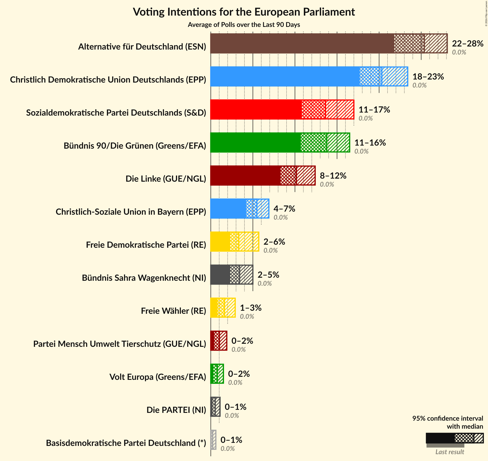
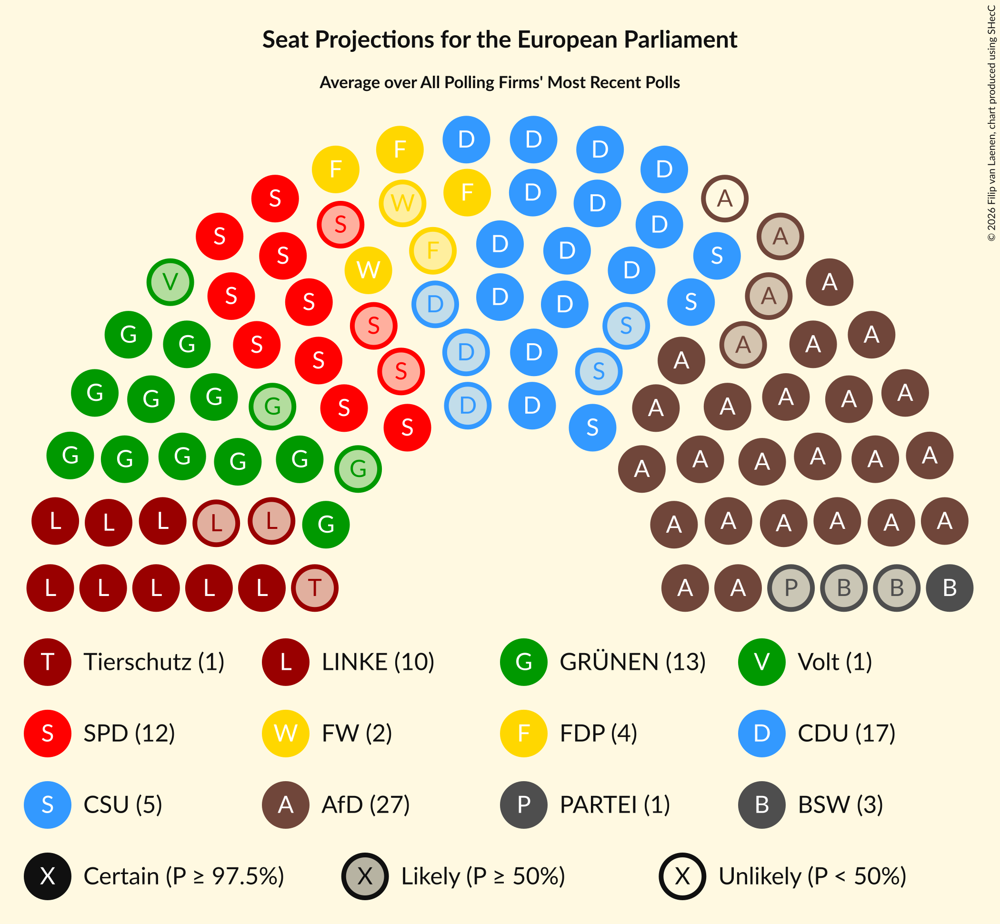

# Overview

The table below lists the most recent polls (less than 90 days old) registered and analyzed so far.

| Period     | Polling firm/Commissioner(s) | LINKE | Tierschutz | GRÜNEN | Volt | PIRATEN | SPD | FDP | FW | CDU | CSU | FAMILIE | ÖDP | AfD | PARTEI | BSW | dieBasis | PDF |
|:----------:|:----------------------------:|:--:|:--:|:--:|:--:|:--:|:--:|:--:|:--:|:--:|:--:|:--:|:--:|:--:|:--:|:--:|:--:|:--:|
| 9 June 2024 | General Election | 0.0%   0 | 0.0%   0 | 0.0%   0 | 0.0%   0 | 0.0%   0 | 0.0%   0 | 0.0%   0 | 0.0%   0 | 0.0%   0 | 0.0%   0 | 0.0%   0 | 0.0%   0 | 0.0%   0 | 0.0%   0 | 0.0%   0 | 0.0%   0 | 0.0%   0 |
| N/A | [Poll Average](average.html) | 8–12%   8–12 | 0–2%   0–2 | 10–16%   10–15 | 0–2%   0–1 | N/A   N/A | 12–18%   11–16 | 0–5%   0–5 | 1–4%   1–3 | 18–24%   17–22 | 4–7%   4–7 | N/A   N/A | N/A   N/A | 21–27%   20–27 | 0–1%   0–1 | 2–5%   2–5 | 0–1%   0–1 | N/A   N/A |
| [20–23 March 2026](2026-03-23-INSAandYouGov.html) | INSA and YouGov   BILD | 9–11%   9–11 | 1%   1 | 11–13%   10–13 | 0–1%   0–1 | N/A   N/A | 14–17%   13–16 | 2–4%   2–4 | 1–2%   1–2 | 19–22%   18–21 | 5–7%   4–6 | N/A   N/A | N/A   N/A | 24–28%   23–27 | 0–1%   0–1 | 3–4%   2–4 | 0%   0 | N/A   N/A |
| [17–23 March 2026](2026-03-23-Forsa.html) | Forsa | 9–11%   9–11 | 1–2%   1–2 | 13–17%   13–17 | 0–1%   0–1 | N/A   N/A | 11–14%   10–13 | 4–5%   3–5 | 1–2%   1–2 | 19–22%   18–22 | 5–7%   5–6 | N/A   N/A | N/A   N/A | 23–27%   22–25 | 0–1%   0–1 | 2–4%   2–4 | 0%   0 | N/A   N/A |
| [13–16 March 2026](2026-03-16-YouGov.html) | YouGov | 8–10%   8–10 | 1–2%   1–2 | 12–15%   11–14 | 1%   1–2 | N/A   N/A | 12–16%   12–14 | 2–4%   2–4 | 1–3%   1–3 | 19–22%   18–21 | 5–7%   4–6 | N/A   N/A | N/A   N/A | 24–28%   23–27 | 0–1%   0–1 | 2–4%   2–4 | 0–1%   0–1 | N/A   N/A |
| [12 March 2026](2026-03-12-Allensbach.html) | Allensbach | 8–12%   8–11 | 0–2%   0–2 | 10–14%   9–13 | 0–1%   0–1 | N/A   N/A | 14–18%   13–17 | 3–5%   2–5 | 1–2%   1–2 | 20–25%   18–23 | 5–8%   5–7 | N/A   N/A | N/A   N/A | 21–26%   19–25 | 0–1%   0–1 | 3–5%   3–5 | 0–1%   0–1 | N/A   N/A |
| [4–10 March 2026](2026-03-10-Verian.html) | Verian   FOCUS | 10–13%   9–12 | 1–2%   1–2 | 11–15%   11–14 | 1–2%   0–1 | N/A   N/A | 13–17%   12–16 | 2–4%   2–4 | 1–3%   1–3 | 19–23%   18–21 | 4–7%   4–6 | N/A   N/A | N/A   N/A | 21–25%   20–24 | 0–1%   0–1 | 2–4%   2–4 | 0–1%   0–1 | N/A   N/A |
| [2–4 March 2026](2026-03-04-Infratestdimap.html) | Infratest dimap   SWR | 8–11%   8–11 | 1–3%   1–3 | 11–15%   11–15 | 1–2%   1–2 | N/A   N/A | 12–16%   12–15 | 0–1%   0–1 | 2–4%   2–4 | 20–24%   19–23 | 5–7%   5–7 | N/A   N/A | N/A   N/A | 21–25%   21–24 | 1–2%   1–2 | 3–5%   3–5 | 0–1%   0–1 | N/A   N/A |
| [25 February–2 March 2026](2026-03-02-GMS.html) | GMS | 8–12%   8–11 | 1–2%   1–2 | 10–14%   9–14 | 0–2%   0–2 | N/A   N/A | 14–18%   13–18 | 2–4%   2–4 | 1–3%   1–3 | 18–23%   17–22 | 4–7%   4–6 | N/A   N/A | N/A   N/A | 21–27%   20–25 | 0–1%   0–1 | 2–4%   2–4 | 0–1%   0–1 | N/A   N/A |
| [27 February–1 March 2026](2026-03-01-Ipsos.html) | Ipsos | 9–13%   8–12 | 0–2%   0–1 | 12–16%   11–15 | 0–1%   0–1 | N/A   N/A | 13–17%   13–16 | 3–5%   3–5 | 1–2%   1–2 | 17–22%   17–21 | 4–7%   4–6 | N/A   N/A | N/A   N/A | 21–27%   21–25 | 0–1%   0–1 | 2–4%   2–4 | 0–1%   0–1 | N/A   N/A |
| [24–26 February 2026](2026-02-26-ForschungsgruppeWahlen.html) | Forschungsgruppe Wahlen   ZDF | 9–13%   9–12 | 0–2%   0–1 | 10–14%   10–13 | 0–1%   0–1 | N/A   N/A | 13–17%   12–16 | 3–5%   3–4 | 1–2%   1–2 | 18–23%   18–22 | 4–7%   5–6 | N/A   N/A | N/A   N/A | 22–26%   22–25 | 0–1%   0–1 | 3–6%   3–5 | 0–1%   0 | N/A   N/A |
| 9 June 2024 | General Election | 0.0%   0 | 0.0%   0 | 0.0%   0 | 0.0%   0 | 0.0%   0 | 0.0%   0 | 0.0%   0 | 0.0%   0 | 0.0%   0 | 0.0%   0 | 0.0%   0 | 0.0%   0 | 0.0%   0 | 0.0%   0 | 0.0%   0 | 0.0%   0 | 0.0%   0 |

Only polls for which at least the sample size has been published are included in the table above.

**Legend:**
+ **Top half of each row:** Voting intentions (95% confidence interval)
+ **Bottom half of each row:** Seat projections for the European Parliament (95% confidence interval)
+ **LINKE:** Die Linke (GUE/NGL)
+ **Tierschutz:** Partei Mensch Umwelt Tierschutz (GUE/NGL)
+ **GRÜNEN:** Bündnis 90/Die Grünen (Greens/EFA)
+ **Volt:** Volt Europa (Greens/EFA)
+ **PIRATEN:** Piratenpartei Deutschland (Greens/EFA)
+ **SPD:** Sozialdemokratische Partei Deutschlands (S&D)
+ **FDP:** Freie Demokratische Partei (RE)
+ **FW:** Freie Wähler (RE)
+ **CDU:** Christlich Demokratische Union Deutschlands (EPP)
+ **CSU:** Christlich-Soziale Union in Bayern (EPP)
+ **FAMILIE:** Familienpartei Deutschlands (EPP)
+ **ÖDP:** Ökologisch-Demokratische Partei (EPP)
+ **AfD:** Alternative für Deutschland (ESN)
+ **PARTEI:** Die PARTEI (NI)
+ **BSW:** Bündnis Sahra Wagenknecht (NI)
+ **dieBasis:** Basisdemokratische Partei Deutschland (*)
+ **PDF:** Partei des Fortschritts (*)
+ **N/A (single party):** Party not included the published results
+ **N/A (entire row):** Calculation for this opinion poll not started yet

