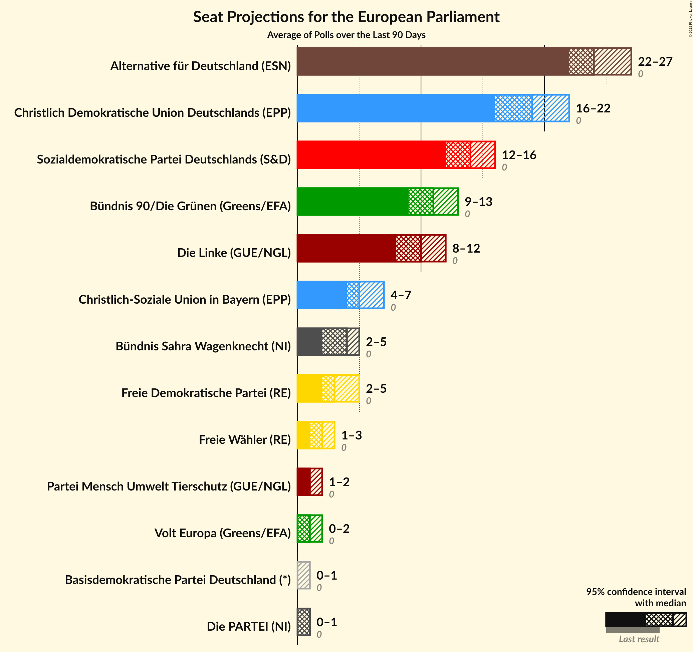

# Overview

The table below lists the most recent polls (less than 90 days old) registered and analyzed so far.

| Period     | Polling firm/Commissioner(s) | CDU | SPD | GRÜNEN | LINKE | AfD | CSU | FDP | FW | Tierschutz | ÖDP | PARTEI |
|:----------:|:----------------------------:|:--:|:--:|:--:|:--:|:--:|:--:|:--:|:--:|:--:|:--:|:--:|
| 25 May 2014 | General Election | 30.0%   29 | 27.3%   27 | 10.7%   11 | 7.4%   7 | 7.0%   7 | 5.3%   5 | 3.4%   3 | 1.5%   1 | 1.2%   1 | 0.6%   1 | 0.6%   1 |
| N/A | [Poll Average](average.html) | 22–30%   21–29 | 15–22%   14–21 | 9–15%   9–14 | 8–12%   8–12 | 12–17%   11–16 | 4–7%   4–6 | 7–11%   7–11 | 0–2%   0–2 | 0–1%   0–1 | N/A   N/A | 0–2%   0–2 |
| [2–6 July 2018](2018-07-06-Forsa.html) | Forsa   Stern and RTL | 24–27%   23–26 | 15–19%   15–18 | 12–15%   11–14 | 8–10%   7–10 | 14–18%   14–17 | 4–6%   3–5 | 9–11%   8–11 | 1–2%   1–2 | 0–1%   0–1 | N/A   N/A | 1–2%   1–2 |
| [3–4 July 2018](2018-07-04-Infratestdimap.html) | Infratest dimap   ARD | 23–28%   22–27 | 16–20%   15–19 | 12–16%   12–15 | 8–11%   7–10 | 14–18%   13–17 | 4–6%   3–6 | 7–9%   6–9 | 1–2%   0–2 | 0–1%   0–1 | N/A   N/A | 1–2%   0–2 |
| [28 June–4 July 2018](2018-07-04-Emnid.html) | Emnid   Bild am Sonntag | 24–27%   23–26 | 15–19%   14–18 | 11–14%   10–13 | 8–10%   8–10 | 15–19%   15–18 | 4–6%   4–5 | 8–10%   8–10 | 1–2%   1–2 | 1–2%   1 | N/A   N/A | 1–2%   1–2 |
| [29 June–2 July 2018](2018-07-02-INSAandYouGov.html) | INSA and YouGov   Bild | 21–25%   21–23 | 17–21%   17–19 | 11–13%   10–13 | 10–12%   10–11 | 15–18%   14–17 | 5–7%   5–7 | 8–10%   8–10 | 0–1%   0–1 | 0–1%   0–1 | N/A   N/A | 0–1%   0–1 |
| [25–28 June 2018](2018-06-28-ForschungsgruppeWahlen.html) | Forschungsgruppe Wahlen   ZDF | 25–30%   24–29 | 16–20%   14–19 | 12–16%   12–15 | 8–12%   8–11 | 12–16%   12–15 | 4–6%   4–6 | 8–11%   7–10 | 0–1%   0–1 | 0–1%   0–1 | N/A   N/A | 0–1%   0–1 |
| [22–26 June 2018](2018-06-26-YouGov.html) | YouGov   RedaktionsNetzwerk Deutschland | 23–28%   22–26 | 15–19%   14–18 | 10–14%   10–13 | 10–13%   9–12 | 14–18%   13–17 | 4–6%   3–5 | 9–12%   8–12 | 0–1%   0–1 | 0–1%   0–1 | N/A   N/A | 0–1%   0–1 |
| [1–13 June 2018](2018-06-13-Allensbach.html) | Allensbach   Frankfurter Allgemeine Zeitung | 26–31%   24–29 | 19–23%   18–22 | 9–13%   9–12 | 8–11%   8–11 | 11–15%   11–14 | 4–6%   4–6 | 8–11%   7–11 | 0–1%   0–1 | 0–1%   0–1 | N/A   N/A | 0–1%   0–1 |
| [11–16 May 2018](2018-05-16-GMS.html) | GMS | 26–32%   25–30 | 14–18%   13–18 | 10–14%   9–14 | 8–12%   8–11 | 12–16%   11–15 | 4–7%   4–6 | 7–11%   7–10 | 1–2%   0–2 | 0–2%   0–2 | N/A   N/A | 1–2%   0–2 |
| 25 May 2014 | General Election | 30.0%   29 | 27.3%   27 | 10.7%   11 | 7.4%   7 | 7.0%   7 | 5.3%   5 | 3.4%   3 | 1.5%   1 | 1.2%   1 | 0.6%   1 | 0.6%   1 |

Only polls for which at least the sample size has been published are included in the table above.

**Legend:**
+ **Top half of each row:** Voting intentions (95% confidence interval)
+ **Bottom half of each row:** Seat projections for the European Parliament (95% confidence interval)
+ **CDU:** CDU (EPP)
+ **SPD:** SPD (S&D)
+ **GRÜNEN:** BÜNDNIS 90/DIE GRÜNEN (Greens/EFA)
+ **LINKE:** DIE LINKE (GUE/NGL)
+ **AfD:** Alternative für Deutschland (EFDD)
+ **CSU:** CSU (EPP)
+ **FDP:** FDP (ALDE)
+ **FW:** FREIE WÄHLER (ALDE)
+ **Tierschutz:** Partei Mensch Umwelt Tierschutz (GUE/NGL)
+ **ÖDP:** ÖDP (Greens/EFA)
+ **PARTEI:** Die PARTEI (NI)
+ **N/A (single party):** Party not included the published results
+ **N/A (entire row):** Calculation for this opinion poll not started yet

