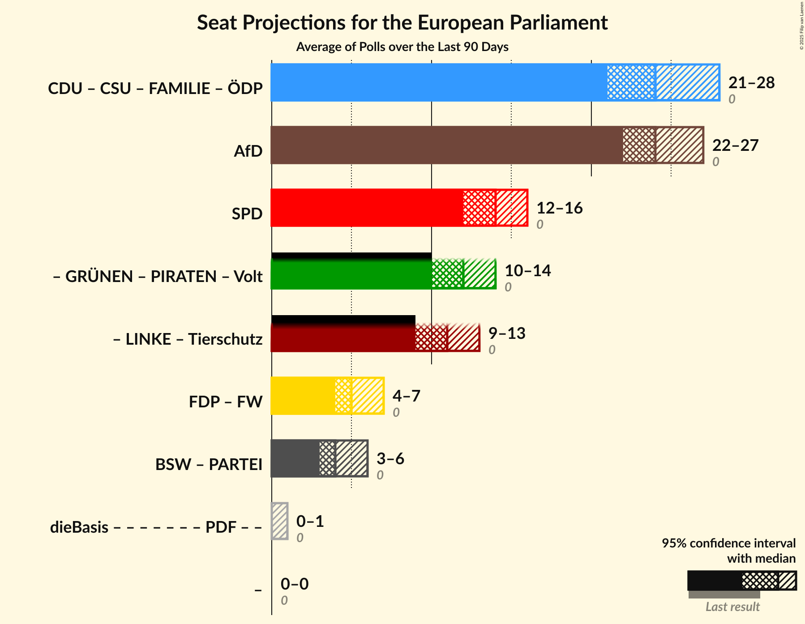

# Overview

The table below lists the most recent polls (less than 90 days old) registered and analyzed so far.

| Period     | Polling firm/Commissioner(s) | CDU | SPD | GRÜNEN | LINKE | AfD | CSU | FDP | FW | Tierschutz | ÖDP | PARTEI | Volt | FAMILIE | PIRATEN |
|:----------:|:----------------------------:|:--:|:--:|:--:|:--:|:--:|:--:|:--:|:--:|:--:|:--:|:--:|:--:|:--:|:--:|
| 26 May 2019 | General Election | 0.0%   1 | 0.0%   1 | 0.0%   1 | 0.0%   1 | 0.0%   1 | 0.0%   1 | 0.0%   1 | 0.0%   1 | 0.0%   1 | 0.0%   1 | 0.0%   1 | 0.0%   1 | 0.0%   1 | 0.0%   1 |
| N/A | [Poll Average](average.html) | 17–23%   16–23 | 20–27%   19–26 | 13–18%   13–18 | 4–9%   4–8 | 8–14%   8–14 | 4–7%   4–7 | 7–13%   7–12 | 1–2%   1–2 | 0–2%   0–1 | 0–1%   0–1 | 1–2%   1–2 | 0–1%   0–1 | 0–1%   0–1 | 0–1%   0–1 |
| [18–21 February 2022](2022-02-21-INSAandYouGov.html) | INSA and YouGov | 19–23%   19–22 | 21–25%   20–25 | 13–16%   12–15 | 5–7%   5–7 | 10–13%   10–13 | 5–7%   5–6 | 11–14%   11–13 | 1–2%   1–2 | 0–1%   0–1 | 0–1%   0–1 | 1–2%   1–2 | 0–1%   0–1 | 0–1%   0–1 | 0–1%   0–1 |
| [15–21 February 2022](2022-02-21-Forsa.html) | Forsa | 19–23%   18–22 | 21–25%   20–24 | 15–19%   14–19 | 5–7%   5–7 | 8–10%   8–10 | 5–7%   4–7 | 8–10%   8–10 | 1–2%   1–2 | 1–2%   1–2 | 0–1%   0–1 | 1–2%   1–2 | 0–1%   0–1 | 0–1%   0–1 | 0–1%   0–1 |
| [15–16 February 2022](2022-02-16-Infratestdimap.html) | Infratest dimap | 18–23%   18–21 | 22–26%   21–26 | 13–17%   13–16 | 4–6%   4–6 | 10–14%   10–13 | 4–7%   4–7 | 7–11%   7–10 | 1–2%   1–2 | 1–2%   1 | 0–1%   0–1 | 1–3%   1–2 | 0–1%   0–1 | 0–1%   0–1 | 0–1%   0–1 |
| [3–16 February 2022](2022-02-16-Allensbach.html) | Allensbach | 19–24%   18–23 | 21–26%   20–24 | 13–18%   13–17 | 5–8%   5–7 | 8–12%   8–11 | 5–8%   4–7 | 9–13%   9–12 | 1–2%   1–2 | 0–2%   0–2 | 0–1%   0–1 | 1–2%   1–2 | 0–1%   0–1 | 0–1%   0–1 | 0–1%   0–1 |
| [10–15 February 2022](2022-02-15-YouGov.html) | YouGov | 19–23%   19–23 | 19–23%   19–22 | 15–19%   15–19 | 6–8%   6–8 | 10–13%   9–12 | 5–7%   5–7 | 8–11%   7–10 | 1–2%   1–2 | 0–1%   0–1 | 0–1%   0–1 | 1–2%   1–2 | 0–1%   0–1 | 0–1%   0–1 | 0–1%   0–1 |
| [8–15 February 2022](2022-02-15-Kantar.html) | Kantar | 17–21%   16–19 | 22–26%   22–26 | 14–18%   13–17 | 5–7%   4–6 | 10–14%   10–14 | 4–7%   4–6 | 9–12%   8–11 | 1–2%   1–2 | 1–2%   1 | 0–1%   0–1 | 1–2%   1–2 | 0–1%   0–1 | 0–1%   0–1 | 0–1%   0–1 |
| [8–10 February 2022](2022-02-10-ForschungsgruppeWahlen.html) | Forschungsgruppe Wahlen | 17–22%   16–20 | 22–28%   22–26 | 14–18%   13–18 | 5–8%   4–7 | 9–13%   9–13 | 4–7%   4–6 | 7–11%   7–10 | 1–2%   1–3 | 0–2%   0–1 | 0–1%   0–1 | 1–2%   1–2 | 0–1%   0–1 | 0–1%   0–1 | 0–1%   0–1 |
| [4–8 February 2022](2022-02-08-pollytix.html) | pollytix | 19–23%   18–21 | 21–25%   21–24 | 13–17%   13–16 | 7–9%   7–9 | 10–14%   10–12 | 5–7%   5–7 | 8–11%   7–10 | 1–2%   1–2 | 0–1%   0–1 | 0–1%   0–1 | 1–2%   1–2 | 0–1%   0 | 0–1%   0–1 | 0–1%   0–1 |
| [4 February 2022](2022-02-04-Ipsos.html) | Ipsos | 16–21%   16–23 | 22–28%   21–26 | 14–19%   14–17 | 6–10%   6–9 | 10–14%   9–12 | 4–7%   4–6 | 6–10%   7–10 | 1–2%   1–2 | 0–2%   0–1 | 0–1%   0–1 | 1–2%   1–2 | 0–1%   0–1 | 0–1%   0–1 | 0–1%   0–1 |
| 26 May 2019 | General Election | 0.0%   1 | 0.0%   1 | 0.0%   1 | 0.0%   1 | 0.0%   1 | 0.0%   1 | 0.0%   1 | 0.0%   1 | 0.0%   1 | 0.0%   1 | 0.0%   1 | 0.0%   1 | 0.0%   1 | 0.0%   1 |

Only polls for which at least the sample size has been published are included in the table above.

**Legend:**
+ **Top half of each row:** Voting intentions (95% confidence interval)
+ **Bottom half of each row:** Seat projections for the European Parliament (95% confidence interval)
+ **CDU:** Christlich Demokratische Union Deutschlands (EPP)
+ **SPD:** Sozialdemokratische Partei Deutschlands (S&D)
+ **GRÜNEN:** Bündnis 90/Die Grünen (Greens/EFA)
+ **LINKE:** Die Linke (GUE/NGL)
+ **AfD:** Alternative für Deutschland (ID)
+ **CSU:** Christlich-Soziale Union in Bayern (EPP)
+ **FDP:** Freie Demokratische Partei (RE)
+ **FW:** Freie Wähler (RE)
+ **Tierschutz:** Partei Mensch Umwelt Tierschutz (GUE/NGL)
+ **ÖDP:** Ökologisch-Demokratische Partei (Greens/EFA)
+ **PARTEI:** Die PARTEI (Greens/EFA)
+ **Volt:** Volt Europa (Greens/EFA)
+ **FAMILIE:** Familienpartei Deutschlands (ECR)
+ **PIRATEN:** Piratenpartei Deutschland (Greens/EFA)
+ **N/A (single party):** Party not included the published results
+ **N/A (entire row):** Calculation for this opinion poll not started yet

