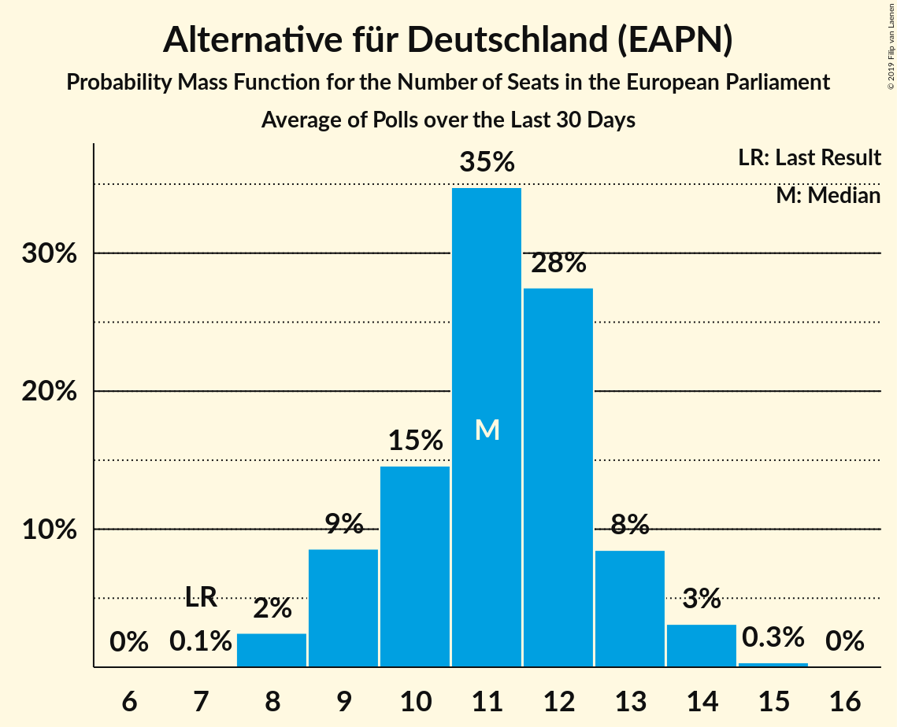

# Alternative für Deutschland (EAPN)

<a href="#voting-intentions">Voting Intentions</a> | <a href="#seats">Seats</a>

## Voting Intentions

Last result: **0.0%** (General Election of 26 May 2019)

### Confidence Intervals

| Period     | Polling firm/Commissioner(s) | Median | 80% Confidence Interval | 90% Confidence Interval | 95% Confidence Interval | 99% Confidence Interval |
|:----------:|:----------------:|:-----------:|:-----------------------:|:-----------------------:|:-----------------------:|:-----------------------:|
| N/A | [Poll Average](average.html) | 13.2% | 11.8–14.4% | 11.4–14.8% | 11.0–15.1% | 10.4–15.7% |
| [21–24 June 2019](2019-06-24-INSA.html) | INSA | 13.5% | 12.6–14.5% | 12.3–14.8% | 12.1–15.1% | 11.7–15.6% |
| [17–21 June 2019](2019-06-21-Forsa.html) | Forsa | 13.0% | 12.1–14.0% | 11.9–14.3% | 11.6–14.6% | 11.2–15.0% |
| [17–19 June 2019](2019-06-19-ForschungsgruppeWahlen.html) | Forschungsgruppe Wahlen   ZDF | 13.0% | 11.9–14.3% | 11.6–14.6% | 11.3–15.0% | 10.8–15.6% |
| [13–18 June 2019](2019-06-18-Emnid.html) | Emnid   Bild am Sonntag | 14.0% | 13.0–15.0% | 12.7–15.3% | 12.5–15.6% | 12.0–16.1% |
| [14–17 June 2019](2019-06-17-INSA.html) | INSA | 14.2% | 13.3–15.3% | 13.0–15.5% | 12.8–15.8% | 12.3–16.3% |
| [11–14 June 2019](2019-06-14-Forsa.html) | Forsa | 13.0% | 12.0–14.1% | 11.7–14.4% | 11.4–14.7% | 11.0–15.3% |
| [6–12 June 2019](2019-06-12-Emnid.html) | Emnid   Bild am Sonntag | 13.0% | 12.1–13.9% | 11.9–14.2% | 11.7–14.4% | 11.3–14.9% |
| [1–12 June 2019](2019-06-12-Allensbach.html) | Allensbach | 12.0% | 10.9–13.3% | 10.6–13.6% | 10.3–13.9% | 9.8–14.5% |
| [7–10 June 2019](2019-06-10-INSA.html) | INSA | 13.5% | 12.6–14.5% | 12.3–14.8% | 12.1–15.0% | 11.7–15.5% |
| [3–7 June 2019](2019-06-07-Forsa.html) | Forsa | 12.0% | 11.1–13.0% | 10.9–13.2% | 10.7–13.5% | 10.2–14.0% |
| [3–5 June 2019](2019-06-05-Infratestdimap.html) | Infratest dimap   ARD | 13.0% | 11.9–14.2% | 11.6–14.5% | 11.4–14.8% | 10.9–15.4% |
| [3–5 June 2019](2019-06-05-ForschungsgruppeWahlen.html) | Forschungsgruppe Wahlen   ZDF | 13.0% | 11.9–14.3% | 11.6–14.7% | 11.3–15.0% | 10.8–15.6% |
| [29 May–5 June 2019](2019-06-05-Emnid.html) | Emnid   Bild am Sonntag | 12.0% | 11.1–13.0% | 10.8–13.3% | 10.6–13.5% | 10.2–14.0% |
| [3 June 2019](2019-06-03-INSA.html) | INSA | 13.0% | 11.7–14.5% | 11.4–14.9% | 11.1–15.2% | 10.5–16.0% |
| [27–31 May 2019](2019-05-31-Forsa.html) | Forsa | 11.0% | 10.1–12.1% | 9.8–12.4% | 9.6–12.6% | 9.2–13.1% |
| [23–28 May 2019](2019-05-28-Emnid.html) | Emnid   Bild am Sonntag | 13.0% | 11.9–14.2% | 11.6–14.6% | 11.4–14.9% | 10.9–15.5% |
| [24–27 May 2019](2019-05-27-INSA.html) | INSA | 13.5% | 12.6–14.5% | 12.3–14.8% | 12.1–15.0% | 11.6–15.5% |

### Probability Mass Function

The following table shows the probability mass function per percentage block of voting intentions for the [poll average](average.html) for Alternative für Deutschland (EAPN).

| Voting Intentions | Probability | Accumulated | Special Marks |
|:-----------------:|:-----------:|:-----------:|:-------------:|
| 0.0–0.5% | 0% | 100% | Last Result |
| 0.5–1.5% | 0% | 100% |  |
| 1.5–2.5% | 0% | 100% |  |
| 2.5–3.5% | 0% | 100% |  |
| 3.5–4.5% | 0% | 100% |  |
| 4.5–5.5% | 0% | 100% |  |
| 5.5–6.5% | 0% | 100% |  |
| 6.5–7.5% | 0% | 100% |  |
| 7.5–8.5% | 0% | 100% |  |
| 8.5–9.5% | 0% | 100% |  |
| 9.5–10.5% | 0.7% | 100% |  |
| 10.5–11.5% | 6% | 99.2% |  |
| 11.5–12.5% | 21% | 93% |  |
| 12.5–13.5% | 38% | 73% | Median |
| 13.5–14.5% | 27% | 35% |  |
| 14.5–15.5% | 7% | 8% |  |
| 15.5–16.5% | 0.7% | 0.7% |  |
| 16.5–17.5% | 0% | 0% |  |

## Seats

Last result: **1** seats (General Election of 26 May 2019)

### Confidence Intervals

| Period     | Polling firm/Commissioner(s) | Median | 80% Confidence Interval | 90% Confidence Interval | 95% Confidence Interval | 99% Confidence Interval |
|:----------:|:----------------:|:------:|:-----------------------:|:-----------------------:|:-----------------------:|:-----------------------:|
| N/A | [Poll Average](average.html) | 13 | 11–14 | 11–14 | 11–14 | 9–15 |
| [21–24 June 2019](2019-06-24-INSA.html) | INSA | 13 | 12–13 | 12–13 | 12–13 | 11–14 |
| [17–21 June 2019](2019-06-21-Forsa.html) | Forsa | 13 | 12–14 | 12–14 | 11–14 | 10–14 |
| [17–19 June 2019](2019-06-19-ForschungsgruppeWahlen.html) | Forschungsgruppe Wahlen   ZDF | 11 | 11–14 | 11–14 | 11–15 | 10–15 |
| [13–18 June 2019](2019-06-18-Emnid.html) | Emnid   Bild am Sonntag | 13 | 13–14 | 12–15 | 11–15 | 11–15 |
| [14–17 June 2019](2019-06-17-INSA.html) | INSA | 14 | 12–15 | 12–16 | 12–16 | 12–16 |
| [11–14 June 2019](2019-06-14-Forsa.html) | Forsa | 13 | 12–13 | 12–13 | 12–14 | 11–14 |
| [6–12 June 2019](2019-06-12-Emnid.html) | Emnid   Bild am Sonntag | 13 | 12–14 | 11–14 | 11–14 | 11–14 |
| [1–12 June 2019](2019-06-12-Allensbach.html) | Allensbach | 12 | 10–13 | 9–13 | 9–13 | 9–15 |
| [7–10 June 2019](2019-06-10-INSA.html) | INSA | 13 | 12–14 | 11–14 | 11–15 | 11–15 |
| [3–7 June 2019](2019-06-07-Forsa.html) | Forsa | 11 | 11–13 | 11–13 | 10–13 | 10–14 |
| [3–5 June 2019](2019-06-05-Infratestdimap.html) | Infratest dimap   ARD | 13 | 12–13 | 11–13 | 11–14 | 11–15 |
| [3–5 June 2019](2019-06-05-ForschungsgruppeWahlen.html) | Forschungsgruppe Wahlen   ZDF | 13 | 11–14 | 11–14 | 11–14 | 10–14 |
| [29 May–5 June 2019](2019-06-05-Emnid.html) | Emnid   Bild am Sonntag | 12 | 11–13 | 10–13 | 10–13 | 9–13 |
| [3 June 2019](2019-06-03-INSA.html) | INSA | 14 | 14 | 12–14 | 12–14 | 11–14 |
| [27–31 May 2019](2019-05-31-Forsa.html) | Forsa | 10 | 10–11 | 10–11 | 9–11 | 8–13 |
| [23–28 May 2019](2019-05-28-Emnid.html) | Emnid   Bild am Sonntag | 13 | 11–14 | 10–15 | 10–15 | 10–15 |
| [24–27 May 2019](2019-05-27-INSA.html) | INSA | 14 | 13–14 | 13–14 | 12–14 | 12–15 |

### Probability Mass Function

The following table shows the probability mass function per seat for the [poll average](average.html) for Alternative für Deutschland (EAPN).

| Number of Seats | Probability | Accumulated | Special Marks |
|:---------------:|:-----------:|:-----------:|:-------------:|
| 1 | 0% | 100% | Last Result |
| 2 | 0% | 100% |  |
| 3 | 0% | 100% |  |
| 4 | 0% | 100% |  |
| 5 | 0% | 100% |  |
| 6 | 0% | 100% |  |
| 7 | 0% | 100% |  |
| 8 | 0% | 100% |  |
| 9 | 1.1% | 100% |  |
| 10 | 1.1% | 98.9% |  |
| 11 | 14% | 98% |  |
| 12 | 21% | 84% |  |
| 13 | 49% | 63% | Median |
| 14 | 12% | 14% |  |
| 15 | 2% | 2% |  |
| 16 | 0% | 0% |  |

