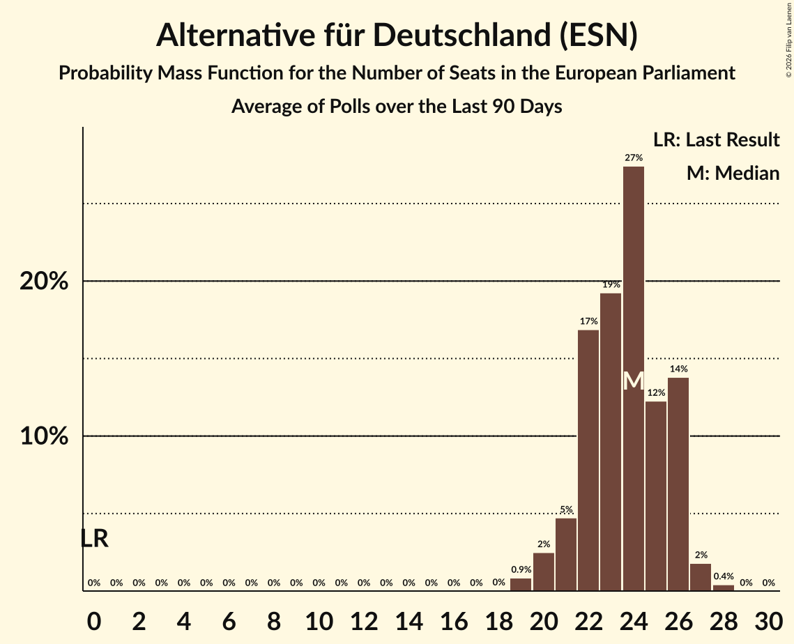

# Alternative für Deutschland (ESN)

<a href="#voting-intentions">Voting Intentions</a> | <a href="#seats">Seats</a>

## Voting Intentions

Last result: **0.0%** (General Election of 9 June 2024)

### Confidence Intervals

| Period     | Polling firm/Commissioner(s) | Median | 80% Confidence Interval | 90% Confidence Interval | 95% Confidence Interval | 99% Confidence Interval |
|:----------:|:----------------:|:-----------:|:-----------------------:|:-----------------------:|:-----------------------:|:-----------------------:|
| N/A | [Poll Average](average.html) | 23.0% | 21.3–24.6% | 20.9–25.0% | 20.4–25.4% | 19.6–26.1% |
| [30 June–2 July 2025](2025-07-02-Infratestdimap.html) | Infratest dimap   ARD | 23.0% | 21.6–24.6% | 21.2–25.0% | 20.8–25.4% | 20.1–26.1% |
| [27–30 June 2025](2025-06-30-INSAandYouGov.html) | INSA and YouGov   BILD | 23.5% | 22.3–24.8% | 22.0–25.1% | 21.7–25.4% | 21.1–26.0% |
| [26–30 June 2025](2025-06-30-GMS.html) | GMS | 22.0% | 20.4–23.8% | 20.0–24.3% | 19.6–24.7% | 18.8–25.6% |
| [24–30 June 2025](2025-06-30-Forsa.html) | Forsa   RTL n-tv | 24.0% | 22.8–25.3% | 22.4–25.7% | 22.1–26.0% | 21.5–26.6% |
| [23–27 June 2025](2025-06-27-INSAandYouGov.html) | INSA and YouGov   BILD | 24.0% | 22.4–25.6% | 22.0–26.1% | 21.6–26.5% | 20.9–27.3% |
| [24–26 June 2025](2025-06-26-ForschungsgruppeWahlen.html) | Forschungsgruppe Wahlen   ZDF | 22.0% | 20.5–23.6% | 20.1–24.1% | 19.8–24.5% | 19.1–25.2% |
| [16–20 June 2025](2025-06-20-INSAandYouGov.html) | INSA and YouGov   BILD | 23.0% | 21.5–24.6% | 21.1–25.1% | 20.7–25.5% | 20.0–26.2% |
| [17–20 June 2025](2025-06-20-Forsa.html) | Forsa   RTL n-tv | 24.0% | 22.8–25.3% | 22.5–25.6% | 22.2–25.9% | 21.6–26.6% |
| [11–17 June 2025](2025-06-17-Verian.html) | Verian   FOCUS | 23.0% | 21.6–24.4% | 21.2–24.9% | 20.9–25.2% | 20.3–25.9% |
| [13–16 June 2025](2025-06-16-YouGov.html) | YouGov | 23.0% | 21.8–24.3% | 21.5–24.6% | 21.2–25.0% | 20.6–25.6% |
| [13–16 June 2025](2025-06-16-INSAandYouGov.html) | INSA and YouGov | 23.0% | 21.8–24.2% | 21.5–24.6% | 21.2–24.9% | 20.6–25.5% |
| [10–16 June 2025](2025-06-16-Forsa.html) | Forsa   RTL n-tv | 23.0% | 21.9–24.1% | 21.6–24.4% | 21.4–24.7% | 20.9–25.2% |
| [10–13 June 2025](2025-06-13-INSAandYouGov.html) | INSA and YouGov   BILD | 23.0% | 21.5–24.6% | 21.1–25.1% | 20.7–25.5% | 20.0–26.3% |
| [1–12 June 2025](2025-06-12-Allensbach.html) | Allensbach   Frankfurter Allgemeine Zeitung | 23.0% | 21.4–24.7% | 20.9–25.2% | 20.5–25.6% | 19.8–26.4% |
| [6–10 June 2025](2025-06-10-INSAandYouGov.html) | INSA and YouGov | 22.5% | N/A | N/A | N/A | N/A |
| [2–6 June 2025](2025-06-06-INSAandYouGov.html) | INSA and YouGov | 23.0% | 21.5–24.6% | 21.0–25.0% | 20.7–25.4% | 20.0–26.2% |
| [3–6 June 2025](2025-06-06-Forsa.html) | Forsa | 24.0% | 22.7–25.4% | 22.3–25.8% | 22.0–26.2% | 21.3–26.9% |
| [3–5 June 2025](2025-06-05-ForschungsgruppeWahlen.html) | Forschungsgruppe Wahlen | 23.0% | 21.5–24.6% | 21.1–25.1% | 20.8–25.4% | 20.1–26.2% |
| [2–3 June 2025](2025-06-03-Infratestdimap.html) | Infratest dimap | 23.0% | 21.5–24.5% | 21.1–25.0% | 20.8–25.4% | 20.1–26.1% |
| [28 May–2 June 2025](2025-06-02-pollytix.html) | pollytix | 23.0% | 21.7–24.4% | 21.3–24.8% | 21.0–25.2% | 20.3–25.8% |
| [30 May–2 June 2025](2025-06-02-INSAandYouGov.html) | INSA and YouGov | 24.5% | 23.3–25.7% | 22.9–26.1% | 22.6–26.4% | 22.1–27.0% |
| [27 May–2 June 2025](2025-06-02-Forsa.html) | Forsa | 23.0% | 21.7–24.4% | 21.3–24.8% | 21.0–25.1% | 20.4–25.8% |
| [30 May–1 June 2025](2025-06-01-Ipsos.html) | Ipsos | 23.0% | 21.4–24.8% | 20.9–25.3% | 20.5–25.7% | 19.7–26.6% |
| [26–30 May 2025](2025-05-30-INSAandYouGov.html) | INSA and YouGov | 24.0% | 22.5–25.7% | 22.1–26.1% | 21.7–26.5% | 21.0–27.3% |
| [23–26 May 2025](2025-05-26-INSAandYouGov.html) | INSA and YouGov | 24.5% | N/A | N/A | N/A | N/A |
| [20–26 May 2025](2025-05-26-Forsa.html) | Forsa | 24.0% | 22.8–25.3% | 22.5–25.6% | 22.2–25.9% | 21.6–26.5% |
| [19–23 May 2025](2025-05-23-INSAandYouGov.html) | INSA and YouGov | 24.0% | 22.5–25.7% | 22.1–26.1% | 21.7–26.6% | 21.0–27.3% |
| [20–22 May 2025](2025-05-22-ForschungsgruppeWahlen.html) | Forschungsgruppe Wahlen | 23.0% | 21.5–24.6% | 21.1–25.1% | 20.7–25.5% | 20.0–26.3% |
| [14–20 May 2025](2025-05-20-Verian.html) | Verian | 23.0% | 21.7–24.5% | 21.3–24.9% | 20.9–25.3% | 20.3–26.0% |
| [16–19 May 2025](2025-05-19-INSAandYouGov.html) | INSA and YouGov | 24.5% | 23.3–25.8% | 23.0–26.1% | 22.7–26.4% | 22.1–27.1% |
| [14–19 May 2025](2025-05-19-GMS.html) | GMS | 23.0% | 21.4–24.8% | 20.9–25.3% | 20.5–25.7% | 19.8–26.6% |
| [13–19 May 2025](2025-05-19-Forsa.html) | Forsa | 24.0% | 22.8–25.3% | 22.5–25.6% | 22.2–25.9% | 21.6–26.6% |
| [12–16 May 2025](2025-05-16-INSAandYouGov.html) | INSA and YouGov | 24.7% | 23.4–26.6% | 23.0–27.1% | 22.6–27.5% | 21.9–28.3% |
| [3–14 May 2025](2025-05-14-Allensbach.html) | Allensbach | 22.5% | 20.9–24.2% | 20.4–24.7% | 20.0–25.1% | 19.3–26.0% |
| [9–12 May 2025](2025-05-12-YouGov.html) | YouGov | 25.0% | 23.8–26.3% | 23.4–26.7% | 23.1–27.0% | 22.5–27.6% |
| [9–12 May 2025](2025-05-12-INSAandYouGov.html) | INSA and YouGov | 24.5% | 23.3–25.8% | 23.0–26.1% | 22.7–26.4% | 22.1–27.1% |
| [5–12 May 2025](2025-05-12-Forsa.html) | Forsa | 25.0% | 24.0–26.0% | 23.7–26.3% | 23.5–26.6% | 23.0–27.1% |
| [9–10 May 2025](2025-05-10-Ipsos.html) | Ipsos | 25.0% | 23.3–26.8% | 22.8–27.3% | 22.4–27.8% | 21.6–28.7% |
| [5–9 May 2025](2025-05-09-INSAandYouGov.html) | INSA and YouGov | 24.0% | N/A | N/A | N/A | N/A |
| [5–6 May 2025](2025-05-06-Infratestdimap.html) | Infratest dimap | 23.0% | 21.6–24.6% | 21.2–25.0% | 20.8–25.4% | 20.1–26.1% |
| [2–5 May 2025](2025-05-05-INSAandYouGov.html) | INSA and YouGov | 24.5% | 23.3–25.8% | 23.0–26.1% | 22.7–26.5% | 22.1–27.1% |
| [28 April–2 May 2025](2025-05-02-INSAandYouGov.html) | INSA and YouGov | 24.0% | N/A | N/A | N/A | N/A |
| [29 April–2 May 2025](2025-05-02-Forsa.html) | Forsa | 25.0% | 23.6–26.5% | 23.2–26.9% | 22.9–27.3% | 22.2–28.0% |
| [28–30 April 2025](2025-04-30-ForschungsgruppeWahlen.html) | Forschungsgruppe Wahlen | 23.0% | 21.4–24.6% | 21.0–25.1% | 20.7–25.5% | 19.9–26.3% |
| [25–28 April 2025](2025-04-28-YouGov.html) | YouGov | 26.0% | 24.8–27.3% | 24.4–27.7% | 24.1–28.0% | 23.5–28.6% |
| [25–28 April 2025](2025-04-28-INSAandYouGov.html) | INSA and YouGov | 25.0% | 23.8–26.3% | 23.5–26.7% | 23.2–27.0% | 22.6–27.6% |
| [22–28 April 2025](2025-04-28-Forsa.html) | Forsa | 26.0% | 24.8–27.3% | 24.4–27.6% | 24.1–28.0% | 23.5–28.6% |
| [22–25 April 2025](2025-04-25-INSAandYouGov.html) | INSA and YouGov | 25.0% | 23.4–26.7% | 23.0–27.1% | 22.6–27.5% | 21.9–28.3% |
| [15–22 April 2025](2025-04-22-Verian.html) | Verian | 24.0% | 22.6–25.5% | 22.3–25.9% | 21.9–26.3% | 21.3–27.0% |
| [17–22 April 2025](2025-04-22-INSAandYouGov.html) | INSA and YouGov | 25.0% | 23.8–26.3% | 23.5–26.7% | 23.2–27.0% | 22.6–27.6% |
| [14–17 April 2025](2025-04-17-INSAandYouGov.html) | INSA and YouGov   BILD | 24.0% | 22.5–25.6% | 22.0–26.1% | 21.7–26.5% | 20.9–27.3% |
| [15–17 April 2025](2025-04-17-Forsa.html) | Forsa   RTL n-tv | 26.0% | 24.6–27.5% | 24.2–28.0% | 23.9–28.3% | 23.2–29.1% |
| [13–15 April 2025](2025-04-15-pollytix.html) | pollytix | 25.0% | 23.6–26.5% | 23.2–26.9% | 22.9–27.3% | 22.3–28.0% |
| [11–14 April 2025](2025-04-14-INSAandYouGov.html) | INSA and YouGov   BILD | 24.5% | 23.3–25.7% | 22.9–26.1% | 22.6–26.4% | 22.1–27.0% |
| [8–14 April 2025](2025-04-14-Forsa.html) | Forsa   RTL n-tv | 24.0% | 22.8–25.2% | 22.4–25.6% | 22.1–25.9% | 21.6–26.5% |
| [7–11 April 2025](2025-04-11-INSAandYouGov.html) | INSA and YouGov | 24.0% | N/A | N/A | N/A | N/A |
| [8–10 April 2025](2025-04-10-ForschungsgruppeWahlen.html) | Forschungsgruppe Wahlen   ZDF | 24.0% | 22.5–25.6% | 22.1–26.1% | 21.7–26.5% | 21.0–27.3% |
| [28 March–9 April 2025](2025-04-09-Allensbach.html) | Allensbach | 23.5% | 21.9–25.2% | 21.4–25.7% | 21.0–26.1% | 20.2–27.0% |
| [4–7 April 2025](2025-04-07-INSAandYouGov.html) | INSA and YouGov   BILD | 24.4% | 23.3–25.8% | 23.0–26.1% | 22.7–26.4% | 22.1–27.1% |
| [2–7 April 2025](2025-04-07-GMS.html) | GMS | 25.0% | 23.4–26.9% | 22.9–27.4% | 22.5–27.8% | 21.7–28.7% |
| [1–7 April 2025](2025-04-07-Forsa.html) | Forsa   RTL n-tv | 24.0% | 22.9–25.1% | 22.6–25.4% | 22.3–25.7% | 21.8–26.3% |
| [4–5 April 2025](2025-04-05-Ipsos.html) | Ipsos | 25.0% | 23.3–26.8% | 22.8–27.3% | 22.4–27.8% | 21.6–28.7% |
| [31 March–4 April 2025](2025-04-04-INSAandYouGov.html) | INSA and YouGov   BILD | 24.0% | 22.4–25.6% | 22.0–26.1% | 21.6–26.5% | 20.9–27.3% |
| [2 April 2025](2025-04-02-Infratestdimap.html) | Infratest dimap | 24.0% | 22.5–25.5% | 22.1–26.0% | 21.8–26.4% | 21.1–27.1% |
| [28–31 March 2025](2025-03-31-INSAandYouGov.html) | INSA and YouGov | 23.5% | 22.3–24.7% | 22.0–25.1% | 21.7–25.4% | 21.1–26.0% |
| [25–31 March 2025](2025-03-31-Forsa.html) | Forsa   RTL n-tv | 24.0% | 22.9–25.1% | 22.6–25.4% | 22.4–25.7% | 21.9–26.3% |
| [24–28 March 2025](2025-03-28-INSAandYouGov.html) | INSA and YouGov | 23.0% | N/A | N/A | N/A | N/A |
| [19–25 March 2025](2025-03-25-Verian.html) | Verian   FOCUS | 22.0% | 20.6–23.5% | 20.2–23.9% | 19.9–24.3% | 19.3–25.0% |
| [21–24 March 2025](2025-03-24-YouGov.html) | YouGov | 24.0% | 22.8–25.3% | 22.4–25.7% | 22.1–26.0% | 21.6–26.6% |
| [21–24 March 2025](2025-03-24-INSAandYouGov.html) | INSA and YouGov   BILD | 23.5% | 22.3–24.8% | 22.0–25.1% | 21.7–25.4% | 21.1–26.0% |
| [18–24 March 2025](2025-03-24-Forsa.html) | Forsa   RTL n-tv | 23.0% | 21.9–24.1% | 21.6–24.4% | 21.4–24.7% | 20.9–25.2% |
| [17–21 March 2025](2025-03-21-INSAandYouGov.html) | INSA and YouGov | 23.0% | 21.5–24.6% | 21.0–25.0% | 20.7–25.4% | 20.0–26.2% |
| [18–20 March 2025](2025-03-20-ForschungsgruppeWahlen.html) | Forschungsgruppe Wahlen   ZDF | 22.0% | 20.5–23.6% | 20.0–24.1% | 19.7–24.4% | 19.0–25.2% |
| [14–17 March 2025](2025-03-17-INSAandYouGov.html) | INSA and YouGov   BILD | 22.0% | N/A | N/A | N/A | N/A |
| [11–17 March 2025](2025-03-17-Forsa.html) | Forsa   RTL n-tv | 23.0% | 21.9–24.1% | 21.6–24.4% | 21.4–24.7% | 20.9–25.2% |
| [10–14 March 2025](2025-03-14-INSAandYouGov.html) | INSA and YouGov   BILD | 22.0% | N/A | N/A | N/A | N/A |
| [11 March 2025](2025-03-11-Allensbach.html) | Allensbach | 21.0% | 19.5–22.8% | 19.0–23.2% | 18.7–23.7% | 17.9–24.5% |
| [7–10 March 2025](2025-03-10-INSAandYouGov.html) | INSA and YouGov | 22.0% | N/A | N/A | N/A | N/A |
| [4–10 March 2025](2025-03-10-Forsa.html) | Forsa   RTL n-tv | 22.0% | N/A | N/A | N/A | N/A |
| [3–7 March 2025](2025-03-07-INSAandYouGov.html) | INSA and YouGov | 20.9% | N/A | N/A | N/A | N/A |
| [4–6 March 2025](2025-03-06-ForschungsgruppeWahlen.html) | Forschungsgruppe Wahlen | 21.0% | N/A | N/A | N/A | N/A |
| [4–5 March 2025](2025-03-05-Infratestdimap.html) | Infratest dimap | 21.0% | 19.6–22.5% | 19.2–22.9% | 18.9–23.3% | 18.2–24.0% |
| [28 February–3 March 2025](2025-03-03-INSAandYouGov.html) | INSA and YouGov | 22.0% | N/A | N/A | N/A | N/A |
| [24 February–3 March 2025](2025-03-03-Forsa.html) | Forsa | 22.0% | N/A | N/A | N/A | N/A |
| [31–2 March 2025](2025-03-02-Infratestdimap.html) | Infratest dimap   ARD | 24.0% | N/A | N/A | N/A | N/A |
| [28 February–1 March 2025](2025-03-01-Ipsos.html) | Ipsos | 21.8% | 20.2–23.5% | 19.7–24.0% | 19.3–24.5% | 18.6–25.3% |
| [24–28 February 2025](2025-02-28-INSAandYouGov.html) | INSA and YouGov | 22.0% | 20.4–23.7% | 19.9–24.2% | 19.5–24.7% | 18.8–25.5% |
| [21–22 February 2025](2025-02-22-INSAandYouGov.html) | INSA and YouGov | 21.0% | N/A | N/A | N/A | N/A |
| [19–21 February 2025](2025-02-21-Ipsos.html) | Ipsos | 21.0% | 19.4–22.7% | 19.0–23.2% | 18.6–23.6% | 17.8–24.5% |
| [17–20 February 2025](2025-02-20-YouGov.html) | YouGov | 20.0% | 18.8–21.3% | 18.4–21.7% | 18.1–22.0% | 17.6–22.6% |
| [19–20 February 2025](2025-02-20-ForschungsgruppeWahlen.html) | Forschungsgruppe Wahlen | 21.0% | 19.6–22.5% | 19.2–22.9% | 18.9–23.2% | 18.2–24.0% |
| [17–20 February 2025](2025-02-20-Forsa.html) | Forsa | 21.0% | 19.8–22.2% | 19.5–22.5% | 19.3–22.8% | 18.7–23.4% |
| [9–20 February 2025](2025-02-20-Allensbach.html) | Allensbach | 20.0% | 18.5–21.7% | 18.1–22.1% | 17.7–22.5% | 17.0–23.4% |
| [12–19 February 2025](2025-02-19-Ipsos.html) | Ipsos | 20.0% | 18.9–21.2% | 18.6–21.5% | 18.3–21.8% | 17.8–22.4% |
| [18–19 February 2025](2025-02-19-INSAandYouGov.html) | INSA and YouGov | 21.0% | 19.9–22.2% | 19.6–22.5% | 19.3–22.8% | 18.8–23.4% |
| [16–19 February 2025](2025-02-19-GMS.html) | GMS | 20.0% | 18.4–21.7% | 18.0–22.1% | 17.6–22.6% | 16.9–23.4% |
| [16–18 February 2025](2025-02-18-Cluster17.html) | Cluster17 | 21.0% | 19.7–22.4% | 19.3–22.8% | 19.0–23.2% | 18.4–23.9% |
| [14–17 February 2025](2025-02-17-YouGov.html) | YouGov | 20.0% | 18.9–21.1% | 18.6–21.5% | 18.3–21.7% | 17.8–22.3% |
| [14–17 February 2025](2025-02-17-INSAandYouGov.html) | INSA and YouGov | 22.0% | N/A | N/A | N/A | N/A |
| [11–17 February 2025](2025-02-17-Forsa.html) | Forsa | 20.0% | 19.0–21.0% | 18.7–21.4% | 18.5–21.6% | 18.0–22.1% |
| [10–14 February 2025](2025-02-14-INSAandYouGov.html) | INSA and YouGov | 21.0% | 19.5–22.6% | 19.1–23.0% | 18.8–23.4% | 18.1–24.2% |
| [11–13 February 2025](2025-02-13-ForschungsgruppeWahlen.html) | Forschungsgruppe Wahlen | 20.0% | 18.6–21.6% | 18.2–22.0% | 17.8–22.4% | 17.1–23.2% |
| [11–12 February 2025](2025-02-12-pollytix.html) | pollytix | 19.0% | 17.7–20.3% | 17.4–20.7% | 17.1–21.1% | 16.5–21.7% |
| [10–12 February 2025](2025-02-12-Infratestdimap.html) | Infratest dimap | 21.0% | 19.8–22.4% | 19.4–22.8% | 19.1–23.1% | 18.5–23.8% |
| [12 February 2025](2025-02-12-Allensbach.html) | Allensbach | 19.8% | 18.2–21.5% | 17.8–21.9% | 17.5–22.3% | 16.7–23.2% |
| [27–11 February 2025](2025-02-11-Allensbach.html) | Allensbach   FAZ | 21.0% | N/A | N/A | N/A | N/A |
| [7–10 February 2025](2025-02-10-YouGov.html) | YouGov | 21.0% | 19.9–22.2% | 19.6–22.5% | 19.3–22.8% | 18.8–23.4% |
| [7–10 February 2025](2025-02-10-INSAandYouGov.html) | INSA and YouGov | 22.0% | 20.8–23.2% | 20.5–23.5% | 20.2–23.9% | 19.7–24.4% |
| [4–10 February 2025](2025-02-10-Forsa.html) | Forsa | 20.0% | 19.0–21.0% | 18.7–21.3% | 18.5–21.6% | 18.0–22.1% |
| [3–7 February 2025](2025-02-07-INSAandYouGov.html) | INSA and YouGov | 21.0% | N/A | N/A | N/A | N/A |
| [4–7 February 2025](2025-02-07-GMS.html) | GMS | 21.0% | 19.4–22.7% | 18.9–23.2% | 18.6–23.6% | 17.8–24.4% |
| [5–6 February 2025](2025-02-06-pollytix.html) | pollytix | 20.0% | 18.7–21.4% | 18.4–21.8% | 18.1–22.1% | 17.5–22.8% |
| [4–6 February 2025](2025-02-06-ForschungsgruppeWahlen.html) | Forschungsgruppe Wahlen | 20.0% | 18.6–21.4% | 18.3–21.9% | 17.9–22.2% | 17.3–22.9% |
| [3–5 February 2025](2025-02-05-Infratestdimap.html) | Infratest dimap | 21.0% | 19.6–22.5% | 19.2–22.9% | 18.8–23.3% | 18.2–24.0% |
| [4 February 2025](2025-02-04-YouGov.html) | YouGov | 21.8% | 20.7–23.0% | 20.4–23.3% | 20.1–23.6% | 19.6–24.1% |
| [3 February 2025](2025-02-03-INSAandYouGov.html) | INSA and YouGov | 22.0% | 20.9–23.2% | 20.5–23.6% | 20.2–23.9% | 19.7–24.5% |
| [3 February 2025](2025-02-03-Forsa.html) | Forsa | 20.0% | 19.0–21.1% | 18.7–21.4% | 18.5–21.6% | 18.0–22.1% |
| [30–31 January 2025](2025-01-31-Ipsos.html) | Ipsos | 21.0% | 19.4–22.7% | 19.0–23.2% | 18.6–23.6% | 17.8–24.5% |
| [30–31 January 2025](2025-01-31-INSAandYouGov.html) | INSA and YouGov | 22.0% | 20.5–23.6% | 20.1–24.1% | 19.8–24.5% | 19.1–25.2% |
| [30 January 2025](2025-01-30-INSAandYouGov.html) | INSA and YouGov | 22.0% | N/A | N/A | N/A | N/A |
| [28–30 January 2025](2025-01-30-DemocracyInstitute.html) | Democracy Institute | 25.0% | 23.9–26.2% | 23.6–26.5% | 23.3–26.8% | 22.8–27.3% |
| [27–29 January 2025](2025-01-29-Infratestdimap.html) | Infratest dimap | 20.0% | 18.6–21.4% | 18.2–21.9% | 17.9–22.2% | 17.3–22.9% |
| [27–29 January 2025](2025-01-29-ForschungsgruppeWahlen.html) | Forschungsgruppe Wahlen | 21.0% | 19.7–22.5% | 19.3–22.8% | 19.0–23.2% | 18.4–23.9% |
| [22–28 January 2025](2025-01-28-Verian.html) | Verian | 20.0% | 18.7–21.4% | 18.3–21.8% | 18.0–22.1% | 17.4–22.8% |
| [24–27 January 2025](2025-01-27-YouGov.html) | YouGov | 23.0% | 21.8–24.3% | 21.4–24.7% | 21.1–25.0% | 20.5–25.7% |
| [24–27 January 2025](2025-01-27-INSAandYouGov.html) | INSA and YouGov | 22.0% | 20.8–23.2% | 20.5–23.5% | 20.2–23.9% | 19.7–24.4% |
| [21–27 January 2025](2025-01-27-Forsa.html) | Forsa | 20.0% | 19.0–21.1% | 18.7–21.4% | 18.5–21.6% | 18.0–22.1% |
| [20–24 January 2025](2025-01-24-INSAandYouGov.html) | INSA and YouGov | 21.0% | 19.6–22.6% | 19.2–23.0% | 18.8–23.4% | 18.1–24.2% |
| [21–23 January 2025](2025-01-23-ForschungsgruppeWahlen.html) | Forschungsgruppe Wahlen | 21.0% | 19.6–22.5% | 19.2–22.9% | 18.9–23.2% | 18.2–24.0% |
| [17–20 January 2025](2025-01-20-YouGov.html) | YouGov | 18.8% | 17.7–20.0% | 17.4–20.4% | 17.1–20.7% | 16.6–21.3% |
| [17–20 January 2025](2025-01-20-INSAandYouGov.html) | INSA and YouGov | 21.5% | 20.4–22.7% | 20.0–23.1% | 19.8–23.4% | 19.2–24.0% |
| [14–20 January 2025](2025-01-20-Forsa.html) | Forsa | 19.0% | 18.0–20.0% | 17.7–20.3% | 17.5–20.6% | 17.0–21.1% |
| [7–19 January 2025](2025-01-19-Allensbach.html) | Allensbach | 20.0% | 18.5–21.7% | 18.0–22.2% | 17.6–22.6% | 16.9–23.4% |
| [16–18 January 2025](2025-01-18-Ipsos.html) | Ipsos | 19.0% | 17.5–20.7% | 17.1–21.1% | 16.7–21.6% | 16.0–22.4% |
| [13–17 January 2025](2025-01-17-INSAandYouGov.html) | INSA and YouGov | 21.0% | 19.5–22.5% | 19.1–23.0% | 18.8–23.4% | 18.1–24.1% |
| [10–14 January 2025](2025-01-14-YouGov.html) | YouGov | 20.6% | 19.4–21.9% | 19.1–22.3% | 18.8–22.6% | 18.2–23.2% |
| [10–13 January 2025](2025-01-13-INSAandYouGov.html) | INSA and YouGov | 22.0% | N/A | N/A | N/A | N/A |
| [7–13 January 2025](2025-01-13-Forsa.html) | Forsa | 20.0% | 19.0–21.1% | 18.7–21.4% | 18.5–21.6% | 18.0–22.1% |
| [6–10 January 2025](2025-01-10-INSAandYouGov.html) | INSA and YouGov | 22.0% | 20.5–23.6% | 20.1–24.0% | 19.7–24.4% | 19.1–25.2% |
| [7–9 January 2025](2025-01-09-ForschungsgruppeWahlen.html) | Forschungsgruppe Wahlen | 20.8% | 19.3–22.3% | 18.9–22.8% | 18.5–23.2% | 17.9–24.0% |
| [6–8 January 2025](2025-01-08-Infratestdimap.html) | Infratest dimap | 20.0% | 18.7–21.5% | 18.3–21.9% | 18.0–22.3% | 17.3–23.0% |
| [3–6 January 2025](2025-01-06-YouGov.html) | YouGov | 21.0% | 19.8–22.3% | 19.5–22.6% | 19.2–22.9% | 18.7–23.5% |
| [3–6 January 2025](2025-01-06-INSAandYouGov.html) | INSA and YouGov | 21.5% | 20.3–22.7% | 20.0–23.0% | 19.7–23.4% | 19.2–23.9% |
| [2–6 January 2025](2025-01-06-Forsa.html) | Forsa | 19.0% | 17.7–20.3% | 17.4–20.7% | 17.1–21.1% | 16.5–21.7% |
| [2–4 January 2025](2025-01-04-Ipsos.html) | Ipsos | 19.0% | 17.5–20.7% | 17.1–21.1% | 16.7–21.6% | 16.0–22.4% |
| [3 January 2025](2025-01-03-INSAandYouGov.html) | INSA and YouGov | 20.0% | N/A | N/A | N/A | N/A |
| [2 January 2025](2025-01-02-GMS.html) | GMS | 18.0% | 16.5–19.6% | 16.1–20.1% | 15.8–20.5% | 15.1–21.3% |
| [27–30 December 2024](2024-12-30-INSAandYouGov.html) | INSA and YouGov | 20.5% | 19.4–21.7% | 19.1–22.0% | 18.8–22.3% | 18.3–22.9% |
| [23–27 December 2024](2024-12-27-INSAandYouGov.html) | INSA and YouGov | 20.0% | N/A | N/A | N/A | N/A |
| [20–23 December 2024](2024-12-23-INSAandYouGov.html) | INSA and YouGov | 19.5% | 18.4–20.7% | 18.1–21.0% | 17.8–21.3% | 17.3–21.9% |
| [17–20 December 2024](2024-12-20-Forsa.html) | Forsa | 19.0% | 17.9–20.2% | 17.6–20.5% | 17.4–20.8% | 16.9–21.4% |
| [16–19 December 2024](2024-12-19-INSAandYouGov.html) | INSA and YouGov | 20.0% | 18.6–21.6% | 18.2–22.0% | 17.8–22.4% | 17.2–23.1% |
| [17–19 December 2024](2024-12-19-ForschungsgruppeWahlen.html) | Forschungsgruppe Wahlen | 19.0% | 17.5–20.5% | 17.1–21.0% | 16.8–21.4% | 16.1–22.1% |
| [16–18 December 2024](2024-12-18-Infratestdimap.html) | Infratest dimap | 19.0% | 17.7–20.5% | 17.3–20.9% | 17.0–21.2% | 16.4–21.9% |
| [11–17 December 2024](2024-12-17-Verian.html) | Verian | 18.0% | 16.7–19.3% | 16.4–19.7% | 16.1–20.0% | 15.5–20.7% |
| [13–16 December 2024](2024-12-16-INSAandYouGov.html) | INSA and YouGov | 19.5% | N/A | N/A | N/A | N/A |
| [10–16 December 2024](2024-12-16-Forsa.html) | Forsa | 19.0% | 18.0–20.0% | 17.7–20.3% | 17.5–20.6% | 17.0–21.1% |
| [9–13 December 2024](2024-12-13-INSAandYouGov.html) | INSA and YouGov | 20.0% | N/A | N/A | N/A | N/A |
| [12 December 2024](2024-12-12-Allensbach.html) | Allensbach | 18.0% | 16.5–19.6% | 16.1–20.1% | 15.7–20.5% | 15.0–21.3% |
| [6–9 December 2024](2024-12-09-INSAandYouGov.html) | INSA and YouGov | 19.5% | N/A | N/A | N/A | N/A |
| [3–9 December 2024](2024-12-09-Forsa.html) | Forsa | 18.0% | N/A | N/A | N/A | N/A |
| [2–6 December 2024](2024-12-06-INSAandYouGov.html) | INSA and YouGov | 19.0% | N/A | N/A | N/A | N/A |
| [3–5 December 2024](2024-12-05-ForschungsgruppeWahlen.html) | Forschungsgruppe Wahlen | 17.0% | 15.7–18.5% | 15.3–18.9% | 15.0–19.2% | 14.3–20.0% |
| [2–4 December 2024](2024-12-04-Infratestdimap.html) | Infratest dimap | 18.0% | 16.7–19.4% | 16.3–19.8% | 16.0–20.2% | 15.4–20.9% |
| [3 December 2024](2024-12-03-YouGov.html) | YouGov | 18.8% | 17.7–20.0% | 17.3–20.3% | 17.1–20.6% | 16.6–21.2% |
| [2 December 2024](2024-12-02-INSAandYouGov.html) | INSA and YouGov | 18.5% | 17.4–19.7% | 17.1–20.0% | 16.9–20.3% | 16.4–20.9% |
| [2 December 2024](2024-12-02-GMS.html) | GMS | 17.0% | 15.6–18.6% | 15.2–19.1% | 14.8–19.5% | 14.1–20.3% |
| [2 December 2024](2024-12-02-Forsa.html) | Forsa | 18.0% | 17.0–19.0% | 16.8–19.3% | 16.5–19.6% | 16.1–20.0% |
| [1 December 2024](2024-12-01-Ipsos.html) | Ipsos | 18.0% | 16.5–19.6% | 16.1–20.1% | 15.7–20.5% | 15.0–21.3% |
| [25–29 November 2024](2024-11-29-INSAandYouGov.html) | INSA and YouGov | 18.0% | 16.6–19.5% | 16.2–19.9% | 15.9–20.3% | 15.3–21.0% |
| [20–26 November 2024](2024-11-26-Verian.html) | Verian | 18.0% | 16.8–19.4% | 16.4–19.8% | 16.1–20.1% | 15.5–20.8% |
| [22–25 November 2024](2024-11-25-INSAandYouGov.html) | INSA and YouGov | 19.5% | 18.4–20.7% | 18.1–21.0% | 17.8–21.3% | 17.3–21.9% |
| [19–25 November 2024](2024-11-25-Forsa.html) | Forsa | 18.0% | 17.0–19.0% | 16.8–19.3% | 16.5–19.6% | 16.1–20.1% |
| [18–21 November 2024](2024-11-21-INSAandYouGov.html) | INSA and YouGov | 19.0% | 17.6–20.6% | 17.3–21.0% | 16.9–21.4% | 16.3–22.1% |
| [19–21 November 2024](2024-11-21-ForschungsgruppeWahlen.html) | Forschungsgruppe Wahlen | 18.0% | 16.6–19.5% | 16.2–19.9% | 15.9–20.3% | 15.3–21.0% |
| [18–20 November 2024](2024-11-20-Infratestdimap.html) | Infratest dimap | 19.0% | 17.6–20.4% | 17.3–20.8% | 16.9–21.2% | 16.3–21.9% |
| [15–18 November 2024](2024-11-18-INSAandYouGov.html) | INSA and YouGov | 19.0% | 17.9–20.2% | 17.6–20.5% | 17.4–20.8% | 16.9–21.4% |
| [12–18 November 2024](2024-11-18-Forsa.html) | Forsa | 18.0% | 17.0–19.0% | 16.8–19.3% | 16.5–19.6% | 16.1–20.1% |
| [11–15 November 2024](2024-11-15-INSAandYouGov.html) | INSA and YouGov | 19.0% | N/A | N/A | N/A | N/A |
| [2–14 November 2024](2024-11-14-Allensbach.html) | Allensbach | 17.0% | 15.5–18.5% | 15.2–19.0% | 14.8–19.4% | 14.2–20.1% |
| [8–12 November 2024](2024-11-12-YouGov.html) | YouGov | 18.8% | 17.7–20.1% | 17.4–20.4% | 17.1–20.7% | 16.6–21.3% |
| [8–11 November 2024](2024-11-11-INSAandYouGov.html) | INSA and YouGov | 19.5% | 18.6–20.5% | 18.4–20.7% | 18.1–21.0% | 17.7–21.4% |
| [5–11 November 2024](2024-11-11-Forsa.html) | Forsa | 17.0% | 16.0–18.0% | 15.8–18.3% | 15.6–18.5% | 15.1–19.0% |
| [7–8 November 2024](2024-11-08-INSAandYouGov.html) | INSA and YouGov | 19.0% | N/A | N/A | N/A | N/A |
| [7 November 2024](2024-11-07-Infratestdimap.html) | Infratest dimap | 18.0% | 16.6–19.6% | 16.2–20.1% | 15.8–20.5% | 15.2–21.2% |
| [5–7 November 2024](2024-11-07-ForschungsgruppeWahlen.html) | Forschungsgruppe Wahlen | 18.0% | 16.5–19.6% | 16.1–20.0% | 15.8–20.4% | 15.1–21.2% |
| [7 November 2024](2024-11-07-Forsa.html) | Forsa | 17.0% | N/A | N/A | N/A | N/A |
| [1–4 November 2024](2024-11-04-INSAandYouGov.html) | INSA and YouGov | 18.0% | N/A | N/A | N/A | N/A |
| [4 November 2024](2024-11-04-Forsa.html) | Forsa | 16.0% | N/A | N/A | N/A | N/A |
| [1–2 November 2024](2024-11-02-Ipsos.html) | Ipsos | 18.0% | 16.5–19.6% | 16.1–20.1% | 15.7–20.5% | 15.0–21.3% |
| [1 November 2024](2024-11-01-INSAandYouGov.html) | INSA and YouGov | 18.0% | N/A | N/A | N/A | N/A |
| [28–30 October 2024](2024-10-30-Infratestdimap.html) | Infratest dimap | 17.0% | 15.8–18.4% | 15.4–18.8% | 15.1–19.1% | 14.5–19.8% |
| [23–29 October 2024](2024-10-29-Verian.html) | Verian | 17.0% | 15.8–18.3% | 15.4–18.7% | 15.1–19.0% | 14.6–19.7% |
| [25–28 October 2024](2024-10-28-INSAandYouGov.html) | INSA and YouGov | 19.0% | 17.9–20.2% | 17.6–20.5% | 17.4–20.8% | 16.9–21.4% |
| [22–28 October 2024](2024-10-28-Forsa.html) | Forsa | 17.0% | 16.0–18.2% | 15.7–18.5% | 15.4–18.8% | 14.9–19.3% |
| [21–25 October 2024](2024-10-25-INSAandYouGov.html) | INSA and YouGov | 19.0% | N/A | N/A | N/A | N/A |
| [18–21 October 2024](2024-10-21-INSAandYouGov.html) | INSA and YouGov | 19.0% | 17.9–20.2% | 17.6–20.5% | 17.3–20.8% | 16.8–21.3% |
| [15–21 October 2024](2024-10-21-Forsa.html) | Forsa | 17.0% | 16.1–18.0% | 15.8–18.3% | 15.6–18.5% | 15.1–19.0% |
| [14–18 October 2024](2024-10-18-INSAandYouGov.html) | INSA and YouGov | 19.0% | 17.6–20.5% | 17.2–20.9% | 16.9–21.3% | 16.2–22.1% |
| [15–17 October 2024](2024-10-17-ForschungsgruppeWahlen.html) | Forschungsgruppe Wahlen | 18.0% | 16.6–19.6% | 16.2–20.0% | 15.9–20.4% | 15.2–21.2% |
| [11–14 October 2024](2024-10-14-INSAandYouGov.html) | INSA and YouGov | 18.5% | 17.4–19.6% | 17.1–20.0% | 16.8–20.3% | 16.3–20.8% |
| [8–14 October 2024](2024-10-14-Forsa.html) | Forsa | 17.0% | 16.0–18.0% | 15.8–18.3% | 15.6–18.5% | 15.1–19.0% |
| [7–11 October 2024](2024-10-11-INSAandYouGov.html) | INSA and YouGov | 19.0% | 17.6–20.5% | 17.2–20.9% | 16.8–21.3% | 16.2–22.0% |
| [11 October 2024](2024-10-11-Allensbach.html) | Allensbach | 15.9% | 14.5–17.4% | 14.1–17.8% | 13.7–18.2% | 13.1–19.0% |
| [7–9 October 2024](2024-10-09-Infratestdimap.html) | Infratest dimap | 17.0% | 15.8–18.4% | 15.4–18.8% | 15.1–19.2% | 14.5–19.8% |
| [4–8 October 2024](2024-10-08-YouGov.html) | YouGov | 18.0% | 16.9–19.2% | 16.5–19.6% | 16.3–19.9% | 15.7–20.5% |
| [4–7 October 2024](2024-10-07-INSAandYouGov.html) | INSA and YouGov | 20.0% | N/A | N/A | N/A | N/A |
| [1–7 October 2024](2024-10-07-Forsa.html) | Forsa | 17.0% | 15.9–18.1% | 15.7–18.4% | 15.4–18.7% | 14.9–19.3% |
| [2–4 October 2024](2024-10-04-Ipsos.html) | Ipsos | 18.0% | 16.5–19.6% | 16.1–20.1% | 15.7–20.5% | 15.0–21.3% |
| [4 October 2024](2024-10-04-INSAandYouGov.html) | INSA and YouGov | 20.0% | 18.6–21.5% | 18.2–21.9% | 17.8–22.3% | 17.2–23.0% |
| [1 October 2024](2024-10-01-Verian.html) | Verian | 17.0% | 15.8–18.3% | 15.5–18.7% | 15.2–19.0% | 14.6–19.7% |
| [27–30 September 2024](2024-09-30-INSAandYouGov.html) | INSA and YouGov | 19.0% | 17.9–20.1% | 17.6–20.5% | 17.3–20.8% | 16.8–21.3% |
| [24–30 September 2024](2024-09-30-Forsa.html) | Forsa | 17.0% | 16.0–18.0% | 15.8–18.3% | 15.6–18.5% | 15.1–19.0% |
| [23–27 September 2024](2024-09-27-INSAandYouGov.html) | INSA and YouGov | 19.0% | N/A | N/A | N/A | N/A |
| [24–26 September 2024](2024-09-26-ForschungsgruppeWahlen.html) | Forschungsgruppe Wahlen | 17.0% | 15.6–18.5% | 15.2–18.9% | 14.9–19.3% | 14.3–20.0% |
| [20–23 September 2024](2024-09-23-INSAandYouGov.html) | INSA and YouGov | 20.0% | 18.9–21.2% | 18.5–21.5% | 18.3–21.8% | 17.8–22.4% |
| [17–23 September 2024](2024-09-23-Forsa.html) | Forsa | 17.0% | 16.1–18.0% | 15.8–18.3% | 15.6–18.5% | 15.1–19.0% |
| [16–19 September 2024](2024-09-19-INSAandYouGov.html) | INSA and YouGov | 20.0% | N/A | N/A | N/A | N/A |
| [13–16 September 2024](2024-09-16-INSAandYouGov.html) | INSA and YouGov | 19.5% | 18.4–20.7% | 18.1–21.0% | 17.8–21.3% | 17.3–21.9% |
| [11–16 September 2024](2024-09-16-GMS.html) | GMS | 18.0% | 16.5–19.6% | 16.1–20.1% | 15.7–20.5% | 15.0–21.3% |
| [10–16 September 2024](2024-09-16-Forsa.html) | Forsa | 17.0% | 16.0–18.0% | 15.8–18.3% | 15.6–18.5% | 15.1–19.0% |
| [9–13 September 2024](2024-09-13-INSAandYouGov.html) | INSA and YouGov | 19.0% | 17.6–20.5% | 17.2–20.9% | 16.9–21.3% | 16.2–22.1% |
| [11 September 2024](2024-09-11-Allensbach.html) | Allensbach | 17.0% | 15.6–18.6% | 15.2–19.1% | 14.8–19.4% | 14.2–20.2% |
| [6–10 September 2024](2024-09-10-YouGov.html) | YouGov | 18.0% | 16.8–19.2% | 16.5–19.6% | 16.2–19.9% | 15.7–20.5% |
| [6–9 September 2024](2024-09-09-INSAandYouGov.html) | INSA and YouGov | 19.5% | N/A | N/A | N/A | N/A |
| [3–9 September 2024](2024-09-09-Forsa.html) | Forsa | 17.0% | 16.1–18.0% | 15.8–18.3% | 15.6–18.5% | 15.1–19.0% |
| [6–7 September 2024](2024-09-07-Ipsos.html) | Ipsos | 18.0% | 16.5–19.6% | 16.1–20.1% | 15.7–20.5% | 15.0–21.3% |
| [2–6 September 2024](2024-09-06-INSAandYouGov.html) | INSA and YouGov | 19.0% | 17.6–20.5% | 17.2–20.9% | 16.8–21.3% | 16.2–22.0% |
| [3–5 September 2024](2024-09-05-ForschungsgruppeWahlen.html) | Forschungsgruppe Wahlen | 17.0% | 15.6–18.5% | 15.2–18.9% | 14.9–19.3% | 14.3–20.0% |
| [3–4 September 2024](2024-09-04-Infratestdimap.html) | Infratest dimap | 17.0% | 15.8–18.4% | 15.4–18.8% | 15.1–19.2% | 14.5–19.9% |
| [3 September 2024](2024-09-03-Verian.html) | Verian | 17.0% | 15.8–18.4% | 15.5–18.7% | 15.2–19.1% | 14.6–19.7% |
| [2 September 2024](2024-09-02-INSAandYouGov.html) | INSA and YouGov | 19.0% | N/A | N/A | N/A | N/A |
| [2 September 2024](2024-09-02-Forsa.html) | Forsa | 17.0% | 16.0–18.0% | 15.8–18.3% | 15.6–18.5% | 15.1–19.0% |
| [26–30 August 2024](2024-08-30-INSAandYouGov.html) | INSA and YouGov | 19.0% | 17.6–20.5% | 17.2–20.9% | 16.8–21.3% | 16.2–22.0% |
| [23–26 August 2024](2024-08-26-INSAandYouGov.html) | INSA and YouGov | 18.5% | 17.4–19.7% | 17.1–20.0% | 16.9–20.3% | 16.4–20.9% |
| [20–26 August 2024](2024-08-26-Forsa.html) | Forsa | 17.0% | 16.0–18.0% | 15.8–18.3% | 15.6–18.5% | 15.1–19.0% |
| [19–23 August 2024](2024-08-23-INSAandYouGov.html) | INSA and YouGov | 18.0% | 16.6–19.5% | 16.2–19.9% | 15.9–20.3% | 15.3–21.0% |
| [16–19 August 2024](2024-08-19-INSAandYouGov.html) | INSA and YouGov | 19.0% | 17.9–20.2% | 17.6–20.5% | 17.3–20.8% | 16.8–21.3% |
| [13–19 August 2024](2024-08-19-Forsa.html) | Forsa | 17.0% | 16.1–18.0% | 15.8–18.3% | 15.6–18.5% | 15.2–19.0% |
| [12–16 August 2024](2024-08-16-INSAandYouGov.html) | INSA and YouGov | 19.0% | N/A | N/A | N/A | N/A |
| [3–15 August 2024](2024-08-15-Allensbach.html) | Allensbach | 16.0% | 14.6–17.5% | 14.2–18.0% | 13.9–18.3% | 13.3–19.1% |
| [12–14 August 2024](2024-08-14-ForschungsgruppeWahlen.html) | Forschungsgruppe Wahlen | 16.0% | 14.7–17.5% | 14.3–17.9% | 14.0–18.3% | 13.4–19.0% |
| [9–13 August 2024](2024-08-13-YouGov.html) | YouGov | 19.0% | 17.9–20.2% | 17.6–20.5% | 17.3–20.8% | 16.8–21.4% |
| [9–12 August 2024](2024-08-12-INSAandYouGov.html) | INSA and YouGov | 18.0% | 16.9–19.1% | 16.6–19.4% | 16.4–19.7% | 15.9–20.3% |
| [6–12 August 2024](2024-08-12-GMS.html) | GMS | 17.0% | 15.5–18.6% | 15.2–19.1% | 14.8–19.4% | 14.1–20.2% |
| [6–12 August 2024](2024-08-12-Forsa.html) | Forsa | 17.0% | 16.0–18.2% | 15.7–18.5% | 15.4–18.7% | 14.9–19.3% |
| [5–9 August 2024](2024-08-09-INSAandYouGov.html) | INSA and YouGov | 18.0% | N/A | N/A | N/A | N/A |
| [5–7 August 2024](2024-08-07-Infratestdimap.html) | Infratest dimap | 16.0% | 14.8–17.4% | 14.4–17.8% | 14.1–18.1% | 13.5–18.8% |
| [31 July–6 August 2024](2024-08-06-Verian.html) | Verian | 16.0% | 14.8–17.3% | 14.5–17.7% | 14.2–18.0% | 13.7–18.6% |
| [2–5 August 2024](2024-08-05-INSAandYouGov.html) | INSA and YouGov | 17.0% | 15.9–18.1% | 15.7–18.4% | 15.4–18.7% | 14.9–19.3% |
| [5 August 2024](2024-08-05-Forsa.html) | Forsa | 17.0% | 16.0–18.1% | 15.7–18.4% | 15.4–18.7% | 14.9–19.3% |
| [2–4 August 2024](2024-08-04-Ipsos.html) | Ipsos | 16.0% | 14.6–17.6% | 14.2–18.0% | 13.9–18.4% | 13.2–19.2% |
| [2 August 2024](2024-08-02-INSAandYouGov.html) | INSA and YouGov | 18.0% | N/A | N/A | N/A | N/A |
| [26–29 July 2024](2024-07-29-INSAandYouGov.html) | INSA and YouGov | 18.0% | 16.9–19.1% | 16.6–19.5% | 16.4–19.8% | 15.9–20.3% |
| [23–29 July 2024](2024-07-29-Forsa.html) | Forsa | 17.0% | 16.0–18.1% | 15.7–18.5% | 15.4–18.7% | 14.9–19.3% |
| [22–26 July 2024](2024-07-26-INSAandYouGov.html) | INSA and YouGov | 18.0% | N/A | N/A | N/A | N/A |
| [19–22 July 2024](2024-07-22-INSAandYouGov.html) | INSA and YouGov | 17.0% | N/A | N/A | N/A | N/A |
| [16–22 July 2024](2024-07-22-Forsa.html) | Forsa | 17.0% | N/A | N/A | N/A | N/A |
| [15–19 July 2024](2024-07-19-INSAandYouGov.html) | INSA and YouGov | 17.0% | N/A | N/A | N/A | N/A |
| [5–19 July 2024](2024-07-19-Allensbach.html) | Allensbach | 17.0% | 15.6–18.7% | 15.2–19.1% | 14.8–19.5% | 14.2–20.3% |
| [12–15 July 2024](2024-07-15-INSAandYouGov.html) | INSA and YouGov | 18.0% | N/A | N/A | N/A | N/A |
| [9–15 July 2024](2024-07-15-Forsa.html) | Forsa | 16.0% | N/A | N/A | N/A | N/A |
| [8–12 July 2024](2024-07-12-INSAandYouGov.html) | INSA and YouGov | 18.0% | N/A | N/A | N/A | N/A |
| [9–11 July 2024](2024-07-11-ForschungsgruppeWahlen.html) | Forschungsgruppe Wahlen | 17.0% | 15.7–18.5% | 15.3–18.9% | 14.9–19.3% | 14.3–20.1% |
| [3–9 July 2024](2024-07-09-Verian.html) | Verian | 16.0% | 14.8–17.3% | 14.5–17.7% | 14.2–18.0% | 13.7–18.6% |
| [5–8 July 2024](2024-07-08-INSAandYouGov.html) | INSA and YouGov | 17.5% | N/A | N/A | N/A | N/A |
| [2–8 July 2024](2024-07-08-Forsa.html) | Forsa | 17.0% | N/A | N/A | N/A | N/A |
| [5–7 July 2024](2024-07-07-Ipsos.html) | Ipsos | 16.0% | 14.6–17.6% | 14.2–18.0% | 13.9–18.4% | 13.2–19.2% |
| [1–5 July 2024](2024-07-05-INSAandYouGov.html) | INSA and YouGov | 18.0% | N/A | N/A | N/A | N/A |
| [3 July 2024](2024-07-03-YouGov.html) | YouGov | 18.8% | 17.6–20.1% | 17.3–20.4% | 17.0–20.7% | 16.5–21.4% |
| [1–3 July 2024](2024-07-03-Infratestdimap.html) | Infratest dimap | 17.0% | 15.7–18.4% | 15.4–18.8% | 15.0–19.2% | 14.4–19.8% |
| [1 July 2024](2024-07-01-INSAandYouGov.html) | INSA and YouGov | 17.5% | N/A | N/A | N/A | N/A |
| [1 July 2024](2024-07-01-Forsa.html) | Forsa | 16.0% | N/A | N/A | N/A | N/A |
| [24–28 June 2024](2024-06-28-INSAandYouGov.html) | INSA and YouGov | 17.0% | N/A | N/A | N/A | N/A |
| [25–27 June 2024](2024-06-27-ForschungsgruppeWahlen.html) | Forschungsgruppe Wahlen | 17.0% | N/A | N/A | N/A | N/A |
| [21–24 June 2024](2024-06-24-INSAandYouGov.html) | INSA and YouGov | 17.5% | N/A | N/A | N/A | N/A |
| [18–24 June 2024](2024-06-24-Forsa.html) | Forsa | 16.0% | N/A | N/A | N/A | N/A |
| [17–21 June 2024](2024-06-21-INSAandYouGov.html) | INSA and YouGov | 17.0% | N/A | N/A | N/A | N/A |
| [14–17 June 2024](2024-06-17-INSAandYouGov.html) | INSA and YouGov | 17.0% | N/A | N/A | N/A | N/A |
| [11–17 June 2024](2024-06-17-GMS.html) | GMS | 18.0% | 16.5–19.6% | 16.1–20.1% | 15.7–20.5% | 15.0–21.3% |
| [11–17 June 2024](2024-06-17-Forsa.html) | Forsa | 16.0% | N/A | N/A | N/A | N/A |
| [10–15 June 2024](2024-06-15-INSAandYouGov.html) | INSA and YouGov | 17.0% | N/A | N/A | N/A | N/A |
| [1–13 June 2024](2024-06-13-Allensbach.html) | Allensbach | 15.0% | N/A | N/A | N/A | N/A |
| [10–12 June 2024](2024-06-12-ForschungsgruppeWahlen.html) | Forschungsgruppe Wahlen | 16.0% | N/A | N/A | N/A | N/A |
| [5–11 June 2024](2024-06-11-Verian.html) | Verian | 17.0% | N/A | N/A | N/A | N/A |
| [7–10 June 2024](2024-06-10-INSAandYouGov.html) | INSA and YouGov | 16.0% | N/A | N/A | N/A | N/A |
| [4–10 June 2024](2024-06-10-Forsa.html) | Forsa | 16.0% | N/A | N/A | N/A | N/A |

### Probability Mass Function

The following table shows the probability mass function per percentage block of voting intentions for the [poll average](average.html) for Alternative für Deutschland (ESN).

| Voting Intentions | Probability | Accumulated | Special Marks |
|:-----------------:|:-----------:|:-----------:|:-------------:|
| 0.0–0.5% | 0% | 100% | Last Result |
| 0.5–1.5% | 0% | 100% |  |
| 1.5–2.5% | 0% | 100% |  |
| 2.5–3.5% | 0% | 100% |  |
| 3.5–4.5% | 0% | 100% |  |
| 4.5–5.5% | 0% | 100% |  |
| 5.5–6.5% | 0% | 100% |  |
| 6.5–7.5% | 0% | 100% |  |
| 7.5–8.5% | 0% | 100% |  |
| 8.5–9.5% | 0% | 100% |  |
| 9.5–10.5% | 0% | 100% |  |
| 10.5–11.5% | 0% | 100% |  |
| 11.5–12.5% | 0% | 100% |  |
| 12.5–13.5% | 0% | 100% |  |
| 13.5–14.5% | 0% | 100% |  |
| 14.5–15.5% | 0% | 100% |  |
| 15.5–16.5% | 0% | 100% |  |
| 16.5–17.5% | 0% | 100% |  |
| 17.5–18.5% | 0% | 100% |  |
| 18.5–19.5% | 0.4% | 100% |  |
| 19.5–20.5% | 3% | 99.5% |  |
| 20.5–21.5% | 10% | 97% |  |
| 21.5–22.5% | 23% | 87% |  |
| 22.5–23.5% | 31% | 64% | Median |
| 23.5–24.5% | 23% | 33% |  |
| 24.5–25.5% | 8% | 10% |  |
| 25.5–26.5% | 2% | 2% |  |
| 26.5–27.5% | 0.2% | 0.2% |  |
| 27.5–28.5% | 0% | 0% |  |

## Seats

Last result: **0** seats (General Election of 9 June 2024)

### Confidence Intervals

| Period     | Polling firm/Commissioner(s) | Median | 80% Confidence Interval | 90% Confidence Interval | 95% Confidence Interval | 99% Confidence Interval |
|:----------:|:----------------:|:------:|:-----------------------:|:-----------------------:|:-----------------------:|:-----------------------:|
| N/A | [Poll Average](average.html) | 22 | 20–23 | 20–23 | 19–24 | 19–25 |
| [30 June–2 July 2025](2025-07-02-Infratestdimap.html) | Infratest dimap   ARD | 22 | 20–22 | 20–24 | 20–24 | 19–24 |
| [27–30 June 2025](2025-06-30-INSAandYouGov.html) | INSA and YouGov   BILD | 22 | 20–23 | 20–23 | 20–23 | 20–25 |
| [26–30 June 2025](2025-06-30-GMS.html) | GMS | 21 | 20–21 | 20–21 | 20–21 | 19–24 |
| [24–30 June 2025](2025-06-30-Forsa.html) | Forsa   RTL n-tv | 23 | 21–24 | 21–24 | 21–24 | 21–25 |
| [23–27 June 2025](2025-06-27-INSAandYouGov.html) | INSA and YouGov   BILD | 22 | 22–23 | 21–24 | 21–24 | 21–26 |
| [24–26 June 2025](2025-06-26-ForschungsgruppeWahlen.html) | Forschungsgruppe Wahlen   ZDF | 21 | 19–22 | 19–23 | 19–24 | 18–24 |
| [16–20 June 2025](2025-06-20-INSAandYouGov.html) | INSA and YouGov   BILD | 21 | 20–23 | 19–24 | 19–24 | 19–24 |
| [17–20 June 2025](2025-06-20-Forsa.html) | Forsa   RTL n-tv | 22 | 22–24 | 22–24 | 22–24 | 20–25 |
| [11–17 June 2025](2025-06-17-Verian.html) | Verian   FOCUS | 22 | 21–23 | 20–23 | 20–24 | 19–25 |
| [13–16 June 2025](2025-06-16-YouGov.html) | YouGov | 22 | 21–22 | 21–23 | 20–23 | 20–24 |
| [13–16 June 2025](2025-06-16-INSAandYouGov.html) | INSA and YouGov | 21 | 21–22 | 21–23 | 20–23 | 20–24 |
| [10–16 June 2025](2025-06-16-Forsa.html) | Forsa   RTL n-tv | 22 | 21–23 | 21–23 | 21–23 | 20–24 |
| [10–13 June 2025](2025-06-13-INSAandYouGov.html) | INSA and YouGov   BILD | 22 | 20–23 | 20–24 | 20–24 | 19–25 |
| [1–12 June 2025](2025-06-12-Allensbach.html) | Allensbach   Frankfurter Allgemeine Zeitung | 22 | 20–23 | 19–24 | 19–24 | 18–25 |
| [6–10 June 2025](2025-06-10-INSAandYouGov.html) | INSA and YouGov |  |  |  |  |  |
| [2–6 June 2025](2025-06-06-INSAandYouGov.html) | INSA and YouGov | 22 | 20–23 | 20–23 | 20–25 | 19–25 |
| [3–6 June 2025](2025-06-06-Forsa.html) | Forsa | 23 | 22–24 | 21–24 | 21–24 | 20–25 |
| [3–5 June 2025](2025-06-05-ForschungsgruppeWahlen.html) | Forschungsgruppe Wahlen | 22 | 21–23 | 21–23 | 20–24 | 19–25 |
| [2–3 June 2025](2025-06-03-Infratestdimap.html) | Infratest dimap | 22 | 19–23 | 19–24 | 19–24 | 19–24 |
| [28 May–2 June 2025](2025-06-02-pollytix.html) | pollytix | 21 | 21–23 | 21–23 | 20–24 | 19–25 |
| [30 May–2 June 2025](2025-06-02-INSAandYouGov.html) | INSA and YouGov | 23 | 22–24 | 22–25 | 21–25 | 21–25 |
| [27 May–2 June 2025](2025-06-02-Forsa.html) | Forsa | 22 | 21–23 | 21–23 | 20–25 | 20–25 |
| [30 May–1 June 2025](2025-06-01-Ipsos.html) | Ipsos | 23 | 20–24 | 20–24 | 19–24 | 19–25 |
| [26–30 May 2025](2025-05-30-INSAandYouGov.html) | INSA and YouGov | 23 | 21–23 | 20–24 | 20–25 | 20–25 |
| [23–26 May 2025](2025-05-26-INSAandYouGov.html) | INSA and YouGov |  |  |  |  |  |
| [20–26 May 2025](2025-05-26-Forsa.html) | Forsa | 22 | 22–24 | 21–25 | 21–25 | 21–25 |
| [19–23 May 2025](2025-05-23-INSAandYouGov.html) | INSA and YouGov | 24 | 22–24 | 21–24 | 21–25 | 20–26 |
| [20–22 May 2025](2025-05-22-ForschungsgruppeWahlen.html) | Forschungsgruppe Wahlen | 21 | 20–23 | 20–25 | 19–25 | 19–25 |
| [14–20 May 2025](2025-05-20-Verian.html) | Verian | 22 | 21–23 | 20–24 | 20–24 | 19–25 |
| [16–19 May 2025](2025-05-19-INSAandYouGov.html) | INSA and YouGov | 23 | 23–25 | 22–25 | 22–25 | 21–25 |
| [14–19 May 2025](2025-05-19-GMS.html) | GMS | 22 | 20–24 | 20–24 | 20–24 | 19–25 |
| [13–19 May 2025](2025-05-19-Forsa.html) | Forsa | 22 | 21–25 | 21–25 | 21–25 | 21–26 |
| [12–16 May 2025](2025-05-16-INSAandYouGov.html) | INSA and YouGov | 24 | 24–25 | 23–26 | 22–26 | 22–26 |
| [3–14 May 2025](2025-05-14-Allensbach.html) | Allensbach | 21 | 20–23 | 20–23 | 20–23 | 18–24 |
| [9–12 May 2025](2025-05-12-YouGov.html) | YouGov | 24 | 22–25 | 22–25 | 22–25 | 22–26 |
| [9–12 May 2025](2025-05-12-INSAandYouGov.html) | INSA and YouGov | 23 | 23–24 | 22–25 | 22–26 | 21–26 |
| [5–12 May 2025](2025-05-12-Forsa.html) | Forsa | 24 | 23–25 | 23–26 | 23–26 | 22–26 |
| [9–10 May 2025](2025-05-10-Ipsos.html) | Ipsos | 24 | 23–26 | 22–27 | 21–27 | 21–28 |
| [5–9 May 2025](2025-05-09-INSAandYouGov.html) | INSA and YouGov |  |  |  |  |  |
| [5–6 May 2025](2025-05-06-Infratestdimap.html) | Infratest dimap | 21 | 20–23 | 20–24 | 20–24 | 19–25 |
| [2–5 May 2025](2025-05-05-INSAandYouGov.html) | INSA and YouGov | 23 | 23–24 | 23–25 | 22–25 | 21–26 |
| [28 April–2 May 2025](2025-05-02-INSAandYouGov.html) | INSA and YouGov |  |  |  |  |  |
| [29 April–2 May 2025](2025-05-02-Forsa.html) | Forsa | 24 | 23–26 | 22–26 | 22–26 | 21–26 |
| [28–30 April 2025](2025-04-30-ForschungsgruppeWahlen.html) | Forschungsgruppe Wahlen | 21 | 20–23 | 20–24 | 19–25 | 19–26 |
| [25–28 April 2025](2025-04-28-YouGov.html) | YouGov | 25 | 24–26 | 23–26 | 23–26 | 22–27 |
| [25–28 April 2025](2025-04-28-INSAandYouGov.html) | INSA and YouGov | 24 | 23–25 | 22–25 | 22–25 | 22–26 |
| [22–28 April 2025](2025-04-28-Forsa.html) | Forsa | 25 | 24–25 | 24–25 | 24–26 | 23–27 |
| [22–25 April 2025](2025-04-25-INSAandYouGov.html) | INSA and YouGov | 24 | 22–25 | 22–25 | 21–25 | 20–26 |
| [15–22 April 2025](2025-04-22-Verian.html) | Verian | 24 | 22–24 | 22–24 | 21–25 | 21–26 |
| [17–22 April 2025](2025-04-22-INSAandYouGov.html) | INSA and YouGov | 23 | 23–25 | 22–26 | 22–26 | 22–26 |
| [14–17 April 2025](2025-04-17-INSAandYouGov.html) | INSA and YouGov   BILD | 23 | 21–24 | 21–25 | 21–25 | 19–26 |
| [15–17 April 2025](2025-04-17-Forsa.html) | Forsa   RTL n-tv | 24 | 24–26 | 23–26 | 22–26 | 22–27 |
| [13–15 April 2025](2025-04-15-pollytix.html) | pollytix | 24 | 23–25 | 22–25 | 22–25 | 22–26 |
| [11–14 April 2025](2025-04-14-INSAandYouGov.html) | INSA and YouGov   BILD | 23 | 22–25 | 22–25 | 22–25 | 21–25 |
| [8–14 April 2025](2025-04-14-Forsa.html) | Forsa   RTL n-tv | 24 | 22–24 | 22–24 | 21–25 | 21–25 |
| [7–11 April 2025](2025-04-11-INSAandYouGov.html) | INSA and YouGov |  |  |  |  |  |
| [8–10 April 2025](2025-04-10-ForschungsgruppeWahlen.html) | Forschungsgruppe Wahlen   ZDF | 24 | 22–24 | 21–24 | 21–25 | 20–26 |
| [28 March–9 April 2025](2025-04-09-Allensbach.html) | Allensbach | 22 | 21–24 | 20–25 | 19–25 | 19–25 |
| [4–7 April 2025](2025-04-07-INSAandYouGov.html) | INSA and YouGov   BILD | 24 | 22–25 | 22–25 | 22–25 | 21–25 |
| [2–7 April 2025](2025-04-07-GMS.html) | GMS | 24 | 22–25 | 21–26 | 21–26 | 21–27 |
| [1–7 April 2025](2025-04-07-Forsa.html) | Forsa   RTL n-tv | 23 | 22–24 | 22–24 | 22–25 | 21–25 |
| [4–5 April 2025](2025-04-05-Ipsos.html) | Ipsos | 25 | 23–26 | 22–26 | 21–27 | 20–27 |
| [31 March–4 April 2025](2025-04-04-INSAandYouGov.html) | INSA and YouGov   BILD | 23 | 21–24 | 21–25 | 20–25 | 20–26 |
| [2 April 2025](2025-04-02-Infratestdimap.html) | Infratest dimap | 23 | 22–24 | 21–25 | 21–26 | 20–26 |
| [28–31 March 2025](2025-03-31-INSAandYouGov.html) | INSA and YouGov | 22 | 21–23 | 21–24 | 21–24 | 20–25 |
| [25–31 March 2025](2025-03-31-Forsa.html) | Forsa   RTL n-tv | 23 | 22–24 | 22–24 | 22–24 | 21–25 |
| [24–28 March 2025](2025-03-28-INSAandYouGov.html) | INSA and YouGov |  |  |  |  |  |
| [19–25 March 2025](2025-03-25-Verian.html) | Verian   FOCUS | 20 | 19–23 | 19–23 | 19–24 | 18–24 |
| [21–24 March 2025](2025-03-24-YouGov.html) | YouGov | 23 | 22–24 | 22–24 | 21–24 | 21–25 |
| [21–24 March 2025](2025-03-24-INSAandYouGov.html) | INSA and YouGov   BILD | 22 | 21–23 | 21–24 | 21–24 | 20–25 |
| [18–24 March 2025](2025-03-24-Forsa.html) | Forsa   RTL n-tv | 22 | 21–23 | 21–24 | 20–24 | 20–24 |
| [17–21 March 2025](2025-03-21-INSAandYouGov.html) | INSA and YouGov | 22 | 21–23 | 20–24 | 19–24 | 19–25 |
| [18–20 March 2025](2025-03-20-ForschungsgruppeWahlen.html) | Forschungsgruppe Wahlen   ZDF | 20 | 20–22 | 19–22 | 19–23 | 17–25 |
| [14–17 March 2025](2025-03-17-INSAandYouGov.html) | INSA and YouGov   BILD |  |  |  |  |  |
| [11–17 March 2025](2025-03-17-Forsa.html) | Forsa   RTL n-tv | 21 | 21–23 | 21–23 | 21–24 | 20–24 |
| [10–14 March 2025](2025-03-14-INSAandYouGov.html) | INSA and YouGov   BILD |  |  |  |  |  |
| [11 March 2025](2025-03-11-Allensbach.html) | Allensbach | 20 | 17–21 | 17–22 | 17–23 | 17–24 |
| [7–10 March 2025](2025-03-10-INSAandYouGov.html) | INSA and YouGov |  |  |  |  |  |
| [4–10 March 2025](2025-03-10-Forsa.html) | Forsa   RTL n-tv |  |  |  |  |  |
| [3–7 March 2025](2025-03-07-INSAandYouGov.html) | INSA and YouGov |  |  |  |  |  |
| [4–6 March 2025](2025-03-06-ForschungsgruppeWahlen.html) | Forschungsgruppe Wahlen |  |  |  |  |  |
| [4–5 March 2025](2025-03-05-Infratestdimap.html) | Infratest dimap | 20 | 18–21 | 18–21 | 17–22 | 17–23 |
| [28 February–3 March 2025](2025-03-03-INSAandYouGov.html) | INSA and YouGov |  |  |  |  |  |
| [24 February–3 March 2025](2025-03-03-Forsa.html) | Forsa |  |  |  |  |  |
| [31–2 March 2025](2025-03-02-Infratestdimap.html) | Infratest dimap   ARD |  |  |  |  |  |
| [28 February–1 March 2025](2025-03-01-Ipsos.html) | Ipsos | 21 | 19–22 | 19–23 | 19–23 | 18–24 |
| [24–28 February 2025](2025-02-28-INSAandYouGov.html) | INSA and YouGov | 22 | 19–22 | 19–22 | 19–23 | 18–24 |
| [21–22 February 2025](2025-02-22-INSAandYouGov.html) | INSA and YouGov |  |  |  |  |  |
| [19–21 February 2025](2025-02-21-Ipsos.html) | Ipsos | 22 | 19–22 | 18–22 | 18–22 | 17–22 |
| [17–20 February 2025](2025-02-20-YouGov.html) | YouGov | 18 | 17–19 | 17–19 | 17–19 | 17–21 |
| [19–20 February 2025](2025-02-20-ForschungsgruppeWahlen.html) | Forschungsgruppe Wahlen | 19 | 19–21 | 19–21 | 19–22 | 17–23 |
| [17–20 February 2025](2025-02-20-Forsa.html) | Forsa | 20 | 20 | 19–20 | 19–21 | 18–23 |
| [9–20 February 2025](2025-02-20-Allensbach.html) | Allensbach | 18 | 17–20 | 17–20 | 17–20 | 16–22 |
| [12–19 February 2025](2025-02-19-Ipsos.html) | Ipsos | 19 | 19 | 19 | 18–20 | 18–20 |
| [18–19 February 2025](2025-02-19-INSAandYouGov.html) | INSA and YouGov | 20 | 19–22 | 19–22 | 19–24 | 18–24 |
| [16–19 February 2025](2025-02-19-GMS.html) | GMS | 17 | 17–22 | 17–22 | 17–22 | 16–22 |
| [16–18 February 2025](2025-02-18-Cluster17.html) | Cluster17 | 21 | 18–22 | 17–22 | 17–22 | 17–22 |
| [14–17 February 2025](2025-02-17-YouGov.html) | YouGov | 20 | 19–21 | 19–21 | 18–21 | 17–21 |
| [14–17 February 2025](2025-02-17-INSAandYouGov.html) | INSA and YouGov |  |  |  |  |  |
| [11–17 February 2025](2025-02-17-Forsa.html) | Forsa | 20 | 19–20 | 19–20 | 19–20 | 18–21 |
| [10–14 February 2025](2025-02-14-INSAandYouGov.html) | INSA and YouGov | 20 | 19–21 | 17–21 | 17–22 | 17–23 |
| [11–13 February 2025](2025-02-13-ForschungsgruppeWahlen.html) | Forschungsgruppe Wahlen | 17 | 16–20 | 16–22 | 16–22 | 16–22 |
| [11–12 February 2025](2025-02-12-pollytix.html) | pollytix | 18 | 16–19 | 16–20 | 16–20 | 15–20 |
| [10–12 February 2025](2025-02-12-Infratestdimap.html) | Infratest dimap | 20 | 19–23 | 19–23 | 18–23 | 18–23 |
| [12 February 2025](2025-02-12-Allensbach.html) | Allensbach | 19 | 18–20 | 17–21 | 17–21 | 16–22 |
| [27–11 February 2025](2025-02-11-Allensbach.html) | Allensbach   FAZ |  |  |  |  |  |
| [7–10 February 2025](2025-02-10-YouGov.html) | YouGov | 19 | 19 | 19–20 | 19–21 | 18–22 |
| [7–10 February 2025](2025-02-10-INSAandYouGov.html) | INSA and YouGov | 22 | 21–22 | 20–22 | 20–22 | 19–23 |
| [4–10 February 2025](2025-02-10-Forsa.html) | Forsa | 19 | 18–19 | 18–20 | 18–20 | 17–21 |
| [3–7 February 2025](2025-02-07-INSAandYouGov.html) | INSA and YouGov |  |  |  |  |  |
| [4–7 February 2025](2025-02-07-GMS.html) | GMS | 19 | 19 | 19–20 | 19–21 | 18–24 |
| [5–6 February 2025](2025-02-06-pollytix.html) | pollytix | 18 | 18–19 | 18–20 | 17–20 | 17–21 |
| [4–6 February 2025](2025-02-06-ForschungsgruppeWahlen.html) | Forschungsgruppe Wahlen | 19 | 18–22 | 18–22 | 17–22 | 16–22 |
| [3–5 February 2025](2025-02-05-Infratestdimap.html) | Infratest dimap | 20 | 18–21 | 18–21 | 18–22 | 17–23 |
| [4 February 2025](2025-02-04-YouGov.html) | YouGov | 20 | 20–23 | 20–23 | 19–23 | 19–23 |
| [3 February 2025](2025-02-03-INSAandYouGov.html) | INSA and YouGov | 20 | 20–22 | 20–23 | 20–23 | 19–23 |
| [3 February 2025](2025-02-03-Forsa.html) | Forsa | 19 | 19–20 | 19–20 | 19–22 | 18–22 |
| [30–31 January 2025](2025-01-31-Ipsos.html) | Ipsos | 19 | 19–22 | 19–22 | 19–22 | 18–22 |
| [30–31 January 2025](2025-01-31-INSAandYouGov.html) | INSA and YouGov | 20 | 20–23 | 20–23 | 20–23 | 19–23 |
| [30 January 2025](2025-01-30-INSAandYouGov.html) | INSA and YouGov |  |  |  |  |  |
| [28–30 January 2025](2025-01-30-DemocracyInstitute.html) | Democracy Institute | 25 | 22–25 | 22–25 | 22–26 | 22–26 |
| [27–29 January 2025](2025-01-29-Infratestdimap.html) | Infratest dimap | 20 | 17–20 | 17–20 | 17–20 | 16–22 |
| [27–29 January 2025](2025-01-29-ForschungsgruppeWahlen.html) | Forschungsgruppe Wahlen | 20 | 20–21 | 19–21 | 19–22 | 18–23 |
| [22–28 January 2025](2025-01-28-Verian.html) | Verian | 19 | 19 | 19 | 18–19 | 18–20 |
| [24–27 January 2025](2025-01-27-YouGov.html) | YouGov | 23 | 23 | 23 | 23 | 21–24 |
| [24–27 January 2025](2025-01-27-INSAandYouGov.html) | INSA and YouGov | 22 | 21–22 | 20–22 | 20–22 | 18–23 |
| [21–27 January 2025](2025-01-27-Forsa.html) | Forsa | 19 | 17–21 | 17–21 | 17–21 | 17–21 |
| [20–24 January 2025](2025-01-24-INSAandYouGov.html) | INSA and YouGov | 19 | 18–21 | 18–21 | 18–21 | 18–22 |
| [21–23 January 2025](2025-01-23-ForschungsgruppeWahlen.html) | Forschungsgruppe Wahlen | 21 | 19–22 | 19–22 | 18–22 | 17–23 |
| [17–20 January 2025](2025-01-20-YouGov.html) | YouGov | 20 | 18–20 | 17–20 | 17–20 | 16–21 |
| [17–20 January 2025](2025-01-20-INSAandYouGov.html) | INSA and YouGov | 21 | 20–22 | 20–22 | 19–22 | 19–23 |
| [14–20 January 2025](2025-01-20-Forsa.html) | Forsa | 18 | 17–19 | 17–19 | 17–20 | 16–20 |
| [7–19 January 2025](2025-01-19-Allensbach.html) | Allensbach | 20 | 18–20 | 18–21 | 17–21 | 16–22 |
| [16–18 January 2025](2025-01-18-Ipsos.html) | Ipsos | 17 | 17–19 | 17–19 | 17–19 | 16–20 |
| [13–17 January 2025](2025-01-17-INSAandYouGov.html) | INSA and YouGov | 20 | 20 | 20 | 20 | 20–21 |
| [10–14 January 2025](2025-01-14-YouGov.html) | YouGov | 20 | 18–21 | 18–21 | 18–21 | 17–23 |
| [10–13 January 2025](2025-01-13-INSAandYouGov.html) | INSA and YouGov |  |  |  |  |  |
| [7–13 January 2025](2025-01-13-Forsa.html) | Forsa | 19 | 18–20 | 17–20 | 17–21 | 17–21 |
| [6–10 January 2025](2025-01-10-INSAandYouGov.html) | INSA and YouGov | 20 | 20–24 | 19–24 | 18–24 | 18–24 |
| [7–9 January 2025](2025-01-09-ForschungsgruppeWahlen.html) | Forschungsgruppe Wahlen | 19 | 18–20 | 18–22 | 18–23 | 17–23 |
| [6–8 January 2025](2025-01-08-Infratestdimap.html) | Infratest dimap | 18 | 18–20 | 18–20 | 18–21 | 16–21 |
| [3–6 January 2025](2025-01-06-YouGov.html) | YouGov | 19 | 19–21 | 19–21 | 19–22 | 18–22 |
| [3–6 January 2025](2025-01-06-INSAandYouGov.html) | INSA and YouGov | 20 | 20–21 | 20–21 | 19–22 | 18–22 |
| [2–6 January 2025](2025-01-06-Forsa.html) | Forsa | 19 | 18–19 | 18–19 | 17–19 | 17–20 |
| [2–4 January 2025](2025-01-04-Ipsos.html) | Ipsos | 20 | 16–20 | 15–20 | 15–20 | 15–20 |
| [3 January 2025](2025-01-03-INSAandYouGov.html) | INSA and YouGov |  |  |  |  |  |
| [2 January 2025](2025-01-02-GMS.html) | GMS | 17 | 16–19 | 15–19 | 14–19 | 14–19 |
| [27–30 December 2024](2024-12-30-INSAandYouGov.html) | INSA and YouGov | 20 | 18–21 | 18–21 | 18–21 | 18–21 |
| [23–27 December 2024](2024-12-27-INSAandYouGov.html) | INSA and YouGov |  |  |  |  |  |
| [20–23 December 2024](2024-12-23-INSAandYouGov.html) | INSA and YouGov | 18 | 16–19 | 16–20 | 16–20 | 16–22 |
| [17–20 December 2024](2024-12-20-Forsa.html) | Forsa | 19 | 17–21 | 17–21 | 16–21 | 16–21 |
| [16–19 December 2024](2024-12-19-INSAandYouGov.html) | INSA and YouGov | 20 | 19–20 | 18–20 | 17–20 | 17–21 |
| [17–19 December 2024](2024-12-19-ForschungsgruppeWahlen.html) | Forschungsgruppe Wahlen | 17 | 16–19 | 16–19 | 16–20 | 16–20 |
| [16–18 December 2024](2024-12-18-Infratestdimap.html) | Infratest dimap | 18 | 16–20 | 16–20 | 16–20 | 16–20 |
| [11–17 December 2024](2024-12-17-Verian.html) | Verian | 17 | 16–19 | 16–19 | 16–19 | 15–19 |
| [13–16 December 2024](2024-12-16-INSAandYouGov.html) | INSA and YouGov |  |  |  |  |  |
| [10–16 December 2024](2024-12-16-Forsa.html) | Forsa | 19 | 17–19 | 16–19 | 16–19 | 16–20 |
| [9–13 December 2024](2024-12-13-INSAandYouGov.html) | INSA and YouGov |  |  |  |  |  |
| [12 December 2024](2024-12-12-Allensbach.html) | Allensbach | 18 | 17–20 | 16–20 | 16–20 | 14–20 |
| [6–9 December 2024](2024-12-09-INSAandYouGov.html) | INSA and YouGov |  |  |  |  |  |
| [3–9 December 2024](2024-12-09-Forsa.html) | Forsa |  |  |  |  |  |
| [2–6 December 2024](2024-12-06-INSAandYouGov.html) | INSA and YouGov |  |  |  |  |  |
| [3–5 December 2024](2024-12-05-ForschungsgruppeWahlen.html) | Forschungsgruppe Wahlen | 17 | 15–17 | 14–18 | 14–19 | 13–19 |
| [2–4 December 2024](2024-12-04-Infratestdimap.html) | Infratest dimap | 19 | 19 | 19 | 18–19 | 17–19 |
| [3 December 2024](2024-12-03-YouGov.html) | YouGov | 19 | 18–20 | 17–20 | 17–20 | 16–20 |
| [2 December 2024](2024-12-02-INSAandYouGov.html) | INSA and YouGov | 17 | 16–19 | 16–20 | 16–20 | 16–20 |
| [2 December 2024](2024-12-02-GMS.html) | GMS | 17 | 17 | 17 | 17 | 14–17 |
| [2 December 2024](2024-12-02-Forsa.html) | Forsa | 16 | 16–18 | 16–18 | 16–18 | 15–19 |
| [1 December 2024](2024-12-01-Ipsos.html) | Ipsos | 17 | 16–19 | 16–19 | 16–19 | 15–20 |
| [25–29 November 2024](2024-11-29-INSAandYouGov.html) | INSA and YouGov | 17 | 16–18 | 16–18 | 16–18 | 14–19 |
| [20–26 November 2024](2024-11-26-Verian.html) | Verian | 19 | 15–19 | 15–20 | 14–20 | 14–20 |
| [22–25 November 2024](2024-11-25-INSAandYouGov.html) | INSA and YouGov | 20 | 19–20 | 18–20 | 16–20 | 16–21 |
| [19–25 November 2024](2024-11-25-Forsa.html) | Forsa | 16 | 16–18 | 16–18 | 16–19 | 15–19 |
| [18–21 November 2024](2024-11-21-INSAandYouGov.html) | INSA and YouGov | 18 | 18 | 18 | 18 | 16–19 |
| [19–21 November 2024](2024-11-21-ForschungsgruppeWahlen.html) | Forschungsgruppe Wahlen | 17 | 17–20 | 16–20 | 16–20 | 15–20 |
| [18–20 November 2024](2024-11-20-Infratestdimap.html) | Infratest dimap | 18 | 17–19 | 17–19 | 17–19 | 16–20 |
| [15–18 November 2024](2024-11-18-INSAandYouGov.html) | INSA and YouGov | 17 | 17–18 | 17–19 | 17–20 | 16–20 |
| [12–18 November 2024](2024-11-18-Forsa.html) | Forsa | 19 | 17–19 | 16–19 | 15–19 | 15–19 |
| [11–15 November 2024](2024-11-15-INSAandYouGov.html) | INSA and YouGov |  |  |  |  |  |
| [2–14 November 2024](2024-11-14-Allensbach.html) | Allensbach | 15 | 15–17 | 15–17 | 15–17 | 15–20 |
| [8–12 November 2024](2024-11-12-YouGov.html) | YouGov | 19 | 18–19 | 18–19 | 17–19 | 17–19 |
| [8–11 November 2024](2024-11-11-INSAandYouGov.html) | INSA and YouGov | 19 | 19 | 19 | 19 | 18–19 |
| [5–11 November 2024](2024-11-11-Forsa.html) | Forsa | 16 | 16 | 16 | 16 | 15–17 |
| [7–8 November 2024](2024-11-08-INSAandYouGov.html) | INSA and YouGov |  |  |  |  |  |
| [7 November 2024](2024-11-07-Infratestdimap.html) | Infratest dimap | 18 | 15–18 | 15–19 | 14–19 | 14–20 |
| [5–7 November 2024](2024-11-07-ForschungsgruppeWahlen.html) | Forschungsgruppe Wahlen | 18 | 16–18 | 15–18 | 15–18 | 14–21 |
| [7 November 2024](2024-11-07-Forsa.html) | Forsa |  |  |  |  |  |
| [1–4 November 2024](2024-11-04-INSAandYouGov.html) | INSA and YouGov |  |  |  |  |  |
| [4 November 2024](2024-11-04-Forsa.html) | Forsa |  |  |  |  |  |
| [1–2 November 2024](2024-11-02-Ipsos.html) | Ipsos | 18 | 15–19 | 15–19 | 15–19 | 14–20 |
| [1 November 2024](2024-11-01-INSAandYouGov.html) | INSA and YouGov |  |  |  |  |  |
| [28–30 October 2024](2024-10-30-Infratestdimap.html) | Infratest dimap | 17 | 15–18 | 15–18 | 15–18 | 15–18 |
| [23–29 October 2024](2024-10-29-Verian.html) | Verian | 16 | 15–18 | 14–18 | 14–18 | 14–19 |
| [25–28 October 2024](2024-10-28-INSAandYouGov.html) | INSA and YouGov | 19 | 17–19 | 17–19 | 17–19 | 17–20 |
| [22–28 October 2024](2024-10-28-Forsa.html) | Forsa | 15 | 15–16 | 15–18 | 15–19 | 15–19 |
| [21–25 October 2024](2024-10-25-INSAandYouGov.html) | INSA and YouGov |  |  |  |  |  |
| [18–21 October 2024](2024-10-21-INSAandYouGov.html) | INSA and YouGov | 20 | 18–20 | 17–20 | 17–20 | 17–20 |
| [15–21 October 2024](2024-10-21-Forsa.html) | Forsa | 17 | 15–18 | 15–18 | 15–18 | 15–18 |
| [14–18 October 2024](2024-10-18-INSAandYouGov.html) | INSA and YouGov | 18 | 16–20 | 16–20 | 16–20 | 16–20 |
| [15–17 October 2024](2024-10-17-ForschungsgruppeWahlen.html) | Forschungsgruppe Wahlen | 18 | 17–19 | 17–19 | 16–19 | 15–20 |
| [11–14 October 2024](2024-10-14-INSAandYouGov.html) | INSA and YouGov | 20 | 17–20 | 17–20 | 17–20 | 16–20 |
| [8–14 October 2024](2024-10-14-Forsa.html) | Forsa | 17 | 15–18 | 15–18 | 14–18 | 14–19 |
| [7–11 October 2024](2024-10-11-INSAandYouGov.html) | INSA and YouGov | 18 | 17–19 | 16–19 | 16–20 | 16–21 |
| [11 October 2024](2024-10-11-Allensbach.html) | Allensbach | 15 | 14–15 | 14–16 | 14–17 | 12–17 |
| [7–9 October 2024](2024-10-09-Infratestdimap.html) | Infratest dimap | 17 | 14–18 | 14–18 | 14–18 | 13–18 |
| [4–8 October 2024](2024-10-08-YouGov.html) | YouGov | 18 | 18 | 18 | 18 | 18 |
| [4–7 October 2024](2024-10-07-INSAandYouGov.html) | INSA and YouGov |  |  |  |  |  |
| [1–7 October 2024](2024-10-07-Forsa.html) | Forsa | 16 | 16–17 | 15–18 | 15–18 | 15–18 |
| [2–4 October 2024](2024-10-04-Ipsos.html) | Ipsos | 17 | 15–20 | 15–20 | 15–21 | 14–21 |
| [4 October 2024](2024-10-04-INSAandYouGov.html) | INSA and YouGov | 18 | 18–21 | 18–21 | 18–22 | 16–22 |
| [1 October 2024](2024-10-01-Verian.html) | Verian | 16 | 16 | 16 | 16–17 | 15–18 |
| [27–30 September 2024](2024-09-30-INSAandYouGov.html) | INSA and YouGov | 17 | 16–20 | 16–20 | 16–20 | 16–20 |
| [24–30 September 2024](2024-09-30-Forsa.html) | Forsa | 16 | 15–17 | 15–17 | 15–17 | 15–18 |
| [23–27 September 2024](2024-09-27-INSAandYouGov.html) | INSA and YouGov |  |  |  |  |  |
| [24–26 September 2024](2024-09-26-ForschungsgruppeWahlen.html) | Forschungsgruppe Wahlen | 17 | 15–17 | 15–17 | 15–17 | 15–18 |
| [20–23 September 2024](2024-09-23-INSAandYouGov.html) | INSA and YouGov | 18 | 18–20 | 18–20 | 18–21 | 17–22 |
| [17–23 September 2024](2024-09-23-Forsa.html) | Forsa | 16 | 16–17 | 16–17 | 16–17 | 15–17 |
| [16–19 September 2024](2024-09-19-INSAandYouGov.html) | INSA and YouGov |  |  |  |  |  |
| [13–16 September 2024](2024-09-16-INSAandYouGov.html) | INSA and YouGov | 18 | 17–20 | 17–20 | 17–20 | 17–21 |
| [11–16 September 2024](2024-09-16-GMS.html) | GMS | 16 | 15–19 | 15–19 | 14–19 | 14–19 |
| [10–16 September 2024](2024-09-16-Forsa.html) | Forsa | 16 | 16 | 16–18 | 15–18 | 15–18 |
| [9–13 September 2024](2024-09-13-INSAandYouGov.html) | INSA and YouGov | 18 | 18–19 | 18–20 | 17–20 | 16–20 |
| [11 September 2024](2024-09-11-Allensbach.html) | Allensbach | 16 | 15–18 | 15–18 | 14–18 | 13–19 |
| [6–10 September 2024](2024-09-10-YouGov.html) | YouGov | 17 | 17–18 | 16–18 | 16–18 | 16–19 |
| [6–9 September 2024](2024-09-09-INSAandYouGov.html) | INSA and YouGov |  |  |  |  |  |
| [3–9 September 2024](2024-09-09-Forsa.html) | Forsa | 15 | 15–16 | 15–16 | 15–16 | 14–18 |
| [6–7 September 2024](2024-09-07-Ipsos.html) | Ipsos | 16 | 15–19 | 15–20 | 14–20 | 14–21 |
| [2–6 September 2024](2024-09-06-INSAandYouGov.html) | INSA and YouGov | 19 | 18–20 | 18–20 | 18–20 | 16–20 |
| [3–5 September 2024](2024-09-05-ForschungsgruppeWahlen.html) | Forschungsgruppe Wahlen | 16 | 14–18 | 14–18 | 14–18 | 14–18 |
| [3–4 September 2024](2024-09-04-Infratestdimap.html) | Infratest dimap | 17 | 16–17 | 15–17 | 15–17 | 15–18 |
| [3 September 2024](2024-09-03-Verian.html) | Verian | 16 | 15–17 | 15–18 | 15–18 | 14–18 |
| [2 September 2024](2024-09-02-INSAandYouGov.html) | INSA and YouGov |  |  |  |  |  |
| [2 September 2024](2024-09-02-Forsa.html) | Forsa | 17 | 16–17 | 16–17 | 16–17 | 16–17 |
| [26–30 August 2024](2024-08-30-INSAandYouGov.html) | INSA and YouGov | 18 | 16–19 | 16–19 | 16–20 | 16–21 |
| [23–26 August 2024](2024-08-26-INSAandYouGov.html) | INSA and YouGov | 19 | 17–19 | 17–19 | 17–20 | 16–20 |
| [20–26 August 2024](2024-08-26-Forsa.html) | Forsa | 16 | 15–17 | 15–17 | 15–18 | 14–19 |
| [19–23 August 2024](2024-08-23-INSAandYouGov.html) | INSA and YouGov | 16 | 15–19 | 15–19 | 14–19 | 13–20 |
| [16–19 August 2024](2024-08-19-INSAandYouGov.html) | INSA and YouGov | 18 | 17–19 | 17–19 | 17–20 | 16–20 |
| [13–19 August 2024](2024-08-19-Forsa.html) | Forsa | 17 | 16–18 | 16–18 | 15–18 | 15–18 |
| [12–16 August 2024](2024-08-16-INSAandYouGov.html) | INSA and YouGov |  |  |  |  |  |
| [3–15 August 2024](2024-08-15-Allensbach.html) | Allensbach | 15 | 14–15 | 14–17 | 13–17 | 13–18 |
| [12–14 August 2024](2024-08-14-ForschungsgruppeWahlen.html) | Forschungsgruppe Wahlen | 13 | 13–17 | 13–18 | 13–18 | 13–18 |
| [9–13 August 2024](2024-08-13-YouGov.html) | YouGov | 18 | 17–20 | 17–21 | 16–21 | 15–21 |
| [9–12 August 2024](2024-08-12-INSAandYouGov.html) | INSA and YouGov | 18 | 17–18 | 17–18 | 16–19 | 16–20 |
| [6–12 August 2024](2024-08-12-GMS.html) | GMS | 15 | 15–18 | 15–18 | 15–18 | 13–18 |
| [6–12 August 2024](2024-08-12-Forsa.html) | Forsa | 17 | 15–17 | 15–18 | 15–18 | 14–18 |
| [5–9 August 2024](2024-08-09-INSAandYouGov.html) | INSA and YouGov |  |  |  |  |  |
| [5–7 August 2024](2024-08-07-Infratestdimap.html) | Infratest dimap | 16 | 15–16 | 15–16 | 15–16 | 14–17 |
| [31 July–6 August 2024](2024-08-06-Verian.html) | Verian | 15 | 15–16 | 14–16 | 13–17 | 13–17 |
| [2–5 August 2024](2024-08-05-INSAandYouGov.html) | INSA and YouGov | 16 | 16 | 16 | 16–18 | 16–18 |
| [5 August 2024](2024-08-05-Forsa.html) | Forsa | 16 | 16–17 | 15–18 | 15–18 | 14–19 |
| [2–4 August 2024](2024-08-04-Ipsos.html) | Ipsos | 15 | 14–16 | 13–16 | 13–17 | 12–18 |
| [2 August 2024](2024-08-02-INSAandYouGov.html) | INSA and YouGov |  |  |  |  |  |
| [26–29 July 2024](2024-07-29-INSAandYouGov.html) | INSA and YouGov | 17 | 17–18 | 16–19 | 16–19 | 15–19 |
| [23–29 July 2024](2024-07-29-Forsa.html) | Forsa | 15 | 15–16 | 15–17 | 14–17 | 14–18 |
| [22–26 July 2024](2024-07-26-INSAandYouGov.html) | INSA and YouGov |  |  |  |  |  |
| [19–22 July 2024](2024-07-22-INSAandYouGov.html) | INSA and YouGov |  |  |  |  |  |
| [16–22 July 2024](2024-07-22-Forsa.html) | Forsa |  |  |  |  |  |
| [15–19 July 2024](2024-07-19-INSAandYouGov.html) | INSA and YouGov |  |  |  |  |  |
| [5–19 July 2024](2024-07-19-Allensbach.html) | Allensbach | 16 | 15–16 | 14–16 | 14–17 | 13–19 |
| [12–15 July 2024](2024-07-15-INSAandYouGov.html) | INSA and YouGov |  |  |  |  |  |
| [9–15 July 2024](2024-07-15-Forsa.html) | Forsa |  |  |  |  |  |
| [8–12 July 2024](2024-07-12-INSAandYouGov.html) | INSA and YouGov |  |  |  |  |  |
| [9–11 July 2024](2024-07-11-ForschungsgruppeWahlen.html) | Forschungsgruppe Wahlen | 17 | 14–18 | 14–19 | 14–19 | 13–19 |
| [3–9 July 2024](2024-07-09-Verian.html) | Verian | 15 | 14–16 | 14–17 | 14–17 | 14–18 |
| [5–8 July 2024](2024-07-08-INSAandYouGov.html) | INSA and YouGov |  |  |  |  |  |
| [2–8 July 2024](2024-07-08-Forsa.html) | Forsa |  |  |  |  |  |
| [5–7 July 2024](2024-07-07-Ipsos.html) | Ipsos | 16 | 15–16 | 14–16 | 14–17 | 13–17 |
| [1–5 July 2024](2024-07-05-INSAandYouGov.html) | INSA and YouGov |  |  |  |  |  |
| [3 July 2024](2024-07-03-YouGov.html) | YouGov | 19 | 16–19 | 16–19 | 16–20 | 16–20 |
| [1–3 July 2024](2024-07-03-Infratestdimap.html) | Infratest dimap | 17 | 17 | 17 | 15–17 | 14–18 |
| [1 July 2024](2024-07-01-INSAandYouGov.html) | INSA and YouGov |  |  |  |  |  |
| [1 July 2024](2024-07-01-Forsa.html) | Forsa |  |  |  |  |  |
| [24–28 June 2024](2024-06-28-INSAandYouGov.html) | INSA and YouGov |  |  |  |  |  |
| [25–27 June 2024](2024-06-27-ForschungsgruppeWahlen.html) | Forschungsgruppe Wahlen |  |  |  |  |  |
| [21–24 June 2024](2024-06-24-INSAandYouGov.html) | INSA and YouGov |  |  |  |  |  |
| [18–24 June 2024](2024-06-24-Forsa.html) | Forsa |  |  |  |  |  |
| [17–21 June 2024](2024-06-21-INSAandYouGov.html) | INSA and YouGov |  |  |  |  |  |
| [14–17 June 2024](2024-06-17-INSAandYouGov.html) | INSA and YouGov |  |  |  |  |  |
| [11–17 June 2024](2024-06-17-GMS.html) | GMS | 19 | 16–19 | 15–19 | 15–19 | 14–21 |
| [11–17 June 2024](2024-06-17-Forsa.html) | Forsa |  |  |  |  |  |
| [10–15 June 2024](2024-06-15-INSAandYouGov.html) | INSA and YouGov |  |  |  |  |  |
| [1–13 June 2024](2024-06-13-Allensbach.html) | Allensbach |  |  |  |  |  |
| [10–12 June 2024](2024-06-12-ForschungsgruppeWahlen.html) | Forschungsgruppe Wahlen |  |  |  |  |  |
| [5–11 June 2024](2024-06-11-Verian.html) | Verian |  |  |  |  |  |
| [7–10 June 2024](2024-06-10-INSAandYouGov.html) | INSA and YouGov |  |  |  |  |  |
| [4–10 June 2024](2024-06-10-Forsa.html) | Forsa |  |  |  |  |  |

### Probability Mass Function

The following table shows the probability mass function per seat for the [poll average](average.html) for Alternative für Deutschland (ESN).

| Number of Seats | Probability | Accumulated | Special Marks |
|:---------------:|:-----------:|:-----------:|:-------------:|
| 0 | 0% | 100% | Last Result |
| 1 | 0% | 100% |  |
| 2 | 0% | 100% |  |
| 3 | 0% | 100% |  |
| 4 | 0% | 100% |  |
| 5 | 0% | 100% |  |
| 6 | 0% | 100% |  |
| 7 | 0% | 100% |  |
| 8 | 0% | 100% |  |
| 9 | 0% | 100% |  |
| 10 | 0% | 100% |  |
| 11 | 0% | 100% |  |
| 12 | 0% | 100% |  |
| 13 | 0% | 100% |  |
| 14 | 0% | 100% |  |
| 15 | 0% | 100% |  |
| 16 | 0% | 100% |  |
| 17 | 0% | 100% |  |
| 18 | 0.3% | 100% |  |
| 19 | 3% | 99.7% |  |
| 20 | 12% | 97% |  |
| 21 | 31% | 85% |  |
| 22 | 33% | 54% | Median |
| 23 | 17% | 21% |  |
| 24 | 4% | 4% |  |
| 25 | 0.7% | 0.8% |  |
| 26 | 0% | 0% |  |

