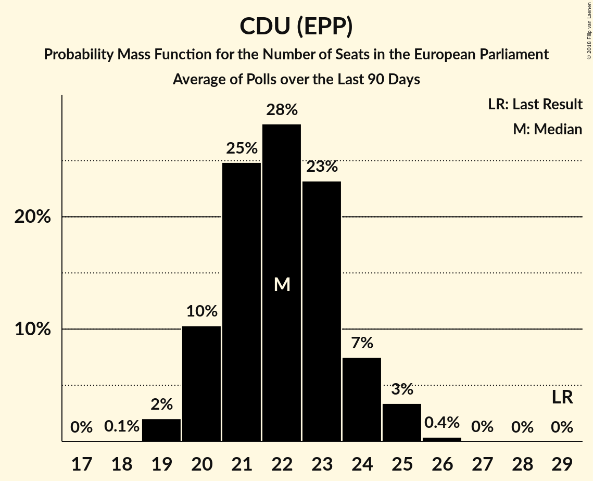

# CDU (EPP)

<a href="#voting-intentions">Voting Intentions</a> | <a href="#seats">Seats</a>

## Voting Intentions

Last result: **30.0%** (General Election of 25 May 2014)

### Confidence Intervals

| Period     | Polling firm/Commissioner(s) | Median | 80% Confidence Interval | 90% Confidence Interval | 95% Confidence Interval | 99% Confidence Interval |
|:----------:|:----------------:|:-----------:|:-----------------------:|:-----------------------:|:-----------------------:|:-----------------------:|
| N/A | [Poll Average](average.html) | 25.8% | 24.1–28.1% | 23.6–28.8% | 23.3–29.3% | 22.6–30.2% |
| [15–18 February 2019](2019-02-18-INSAandYouGov.html) | INSA and YouGov   Bild | 25.0% | 23.8–26.3% | 23.5–26.6% | 23.2–27.0% | 22.6–27.6% |
| [11–15 February 2019](2019-02-15-Forsa.html) | Forsa   Stern and RTL | 24.6% | 23.4–25.9% | 23.0–26.3% | 22.7–26.6% | 22.1–27.3% |
| [11–13 February 2019](2019-02-13-Infratestdimap.html) | Infratest dimap   ARD | 28.0% | 26.6–29.5% | 26.1–30.0% | 25.8–30.3% | 25.1–31.1% |
| [7–13 February 2019](2019-02-13-Emnid.html) | Emnid   Bild am Sonntag | 25.5% | 24.2–26.8% | 23.9–27.2% | 23.6–27.5% | 23.0–28.2% |
| [1–13 February 2019](2019-02-13-Allensbach.html) | Allensbach   Frankfurter Allgemeine Zeitung | 25.5% | 23.9–27.1% | 23.5–27.6% | 23.1–28.0% | 22.4–28.8% |
| [8–11 February 2019](2019-02-11-INSAandYouGov.html) | INSA and YouGov   Bild | 23.9% | 22.7–25.1% | 22.4–25.5% | 22.1–25.8% | 21.5–26.4% |
| [4–8 February 2019](2019-02-08-Forsa.html) | Forsa   Stern and RTL | 26.3% | 25.0–27.6% | 24.7–28.0% | 24.4–28.3% | 23.8–29.0% |
| [5–7 February 2019](2019-02-07-ForschungsgruppeWahlen.html) | Forschungsgruppe Wahlen   ZDF | 25.5% | 24.0–27.1% | 23.6–27.5% | 23.2–27.9% | 22.5–28.6% |
| [31 January–6 February 2019](2019-02-06-Emnid.html) | Emnid   Bild am Sonntag | 25.5% | 24.2–26.8% | 23.9–27.2% | 23.6–27.5% | 23.0–28.1% |
| [1–4 February 2019](2019-02-04-INSAandYouGov.html) | INSA and YouGov   Bild | 24.0% | 22.8–25.2% | 22.5–25.6% | 22.2–25.9% | 21.6–26.5% |
| [28 January–1 February 2019](2019-02-01-Forsa.html) | Forsa   Stern and RTL | 27.2% | 25.9–28.5% | 25.5–28.9% | 25.2–29.2% | 24.6–29.9% |
| [24–30 January 2019](2019-01-30-Emnid.html) | Emnid   Bild am Sonntag | 24.6% | 23.2–26.1% | 22.8–26.6% | 22.5–26.9% | 21.8–27.6% |
| [25–29 January 2019](2019-01-29-YouGov.html) | YouGov   RedaktionsNetzwerk Deutschland | 27.2% | 25.8–28.7% | 25.4–29.1% | 25.0–29.4% | 24.4–30.2% |
| [25–28 January 2019](2019-01-28-INSAandYouGov.html) | INSA and YouGov   Bild | 25.5% | 24.3–26.7% | 23.9–27.1% | 23.6–27.4% | 23.1–28.0% |
| [21–25 January 2019](2019-01-25-Forsa.html) | Forsa   Stern and RTL | 27.1% | 25.9–28.5% | 25.5–28.9% | 25.2–29.2% | 24.6–29.8% |
| [22–24 January 2019](2019-01-24-ForschungsgruppeWahlen.html) | Forschungsgruppe Wahlen   ZDF | 26.3% | 24.8–27.9% | 24.3–28.4% | 24.0–28.8% | 23.2–29.6% |
| [22–23 January 2019](2019-01-23-Infratestdimap.html) | Infratest dimap   ARD | 23.8% | 22.2–25.5% | 21.7–26.0% | 21.3–26.5% | 20.5–27.3% |
| [16–23 January 2019](2019-01-23-GMS.html) | GMS | 26.3% | 24.6–28.2% | 24.1–28.7% | 23.7–29.1% | 22.9–30.0% |
| [17–23 January 2019](2019-01-23-Emnid.html) | Emnid   Bild am Sonntag | 24.6% | 23.4–25.9% | 23.1–26.3% | 22.8–26.6% | 22.2–27.2% |
| [18–21 January 2019](2019-01-21-INSAandYouGov.html) | INSA and YouGov   Bild | 25.0% | 23.8–26.3% | 23.5–26.6% | 23.2–26.9% | 22.6–27.5% |
| [14–18 January 2019](2019-01-18-Forsa.html) | Forsa   Stern and RTL | 27.2% | 25.9–28.5% | 25.5–28.9% | 25.2–29.2% | 24.6–29.9% |
| [5–17 January 2019](2019-01-17-Allensbach.html) | Allensbach   Frankfurter Allgemeine Zeitung | 26.7% | 25.2–28.4% | 24.7–28.9% | 24.4–29.3% | 23.6–30.1% |
| [10–16 January 2019](2019-01-16-Emnid.html) | Emnid   Bild am Sonntag | 25.5% | 24.1–27.0% | 23.6–27.4% | 23.3–27.8% | 22.6–28.5% |
| [11–14 January 2019](2019-01-14-INSAandYouGov.html) | INSA and YouGov   Bild | 22.5% | 21.3–23.7% | 21.0–24.1% | 20.7–24.4% | 20.2–25.0% |
| [9–11 January 2019](2019-01-11-Forsa.html) | Forsa   Stern and RTL | 29.7% | 28.2–31.2% | 27.8–31.7% | 27.4–32.1% | 26.7–32.8% |
| [8–10 January 2019](2019-01-10-ForschungsgruppeWahlen.html) | Forschungsgruppe Wahlen   ZDF | 24.6% | 23.1–26.2% | 22.7–26.7% | 22.3–27.1% | 21.6–27.9% |
| [7–9 January 2019](2019-01-09-Infratestdimap.html) | Infratest dimap   ARD | 24.7% | 23.3–26.1% | 22.9–26.5% | 22.5–26.9% | 21.9–27.6% |
| [3–9 January 2019](2019-01-09-Emnid.html) | Emnid   Bild am Sonntag | 26.3% | 25.1–27.6% | 24.7–28.0% | 24.4–28.3% | 23.8–29.0% |
| [5–7 January 2019](2019-01-07-INSAandYouGov.html) | INSA and YouGov   Bild | 22.4% | 21.2–23.6% | 20.9–23.9% | 20.6–24.2% | 20.1–24.8% |
| [2–4 January 2019](2019-01-04-Forsa.html) | Forsa   Stern and RTL | 27.1% | 25.5–28.9% | 25.0–29.4% | 24.6–29.8% | 23.9–30.7% |
| [2–3 January 2019](2019-01-03-INSAandYouGov.html) | INSA and YouGov   Bild | 23.0% | 21.4–24.8% | 20.9–25.3% | 20.6–25.7% | 19.8–26.6% |
| [21–27 December 2018](2018-12-27-YouGov.html) | YouGov   RedaktionsNetzwerk Deutschland | 25.5% | 24.1–26.9% | 23.7–27.3% | 23.4–27.6% | 22.8–28.3% |
| [20–21 December 2018](2018-12-21-INSAandYouGov.html) | INSA and YouGov   Bild | 23.0% | 21.4–24.8% | 20.9–25.3% | 20.5–25.7% | 19.8–26.5% |
| [17–21 December 2018](2018-12-21-Forsa.html) | Forsa   Stern and RTL | 26.3% | 25.1–27.7% | 24.7–28.0% | 24.4–28.4% | 23.8–29.0% |
| [13–19 December 2018](2018-12-19-Emnid.html) | Emnid   Bild am Sonntag | 24.6% | 23.4–25.9% | 23.0–26.3% | 22.7–26.6% | 22.1–27.3% |
| [14–17 December 2018](2018-12-17-INSAandYouGov.html) | INSA and YouGov   Bild | 23.0% | 21.9–24.2% | 21.5–24.6% | 21.2–24.9% | 20.7–25.5% |
| [10–14 December 2018](2018-12-14-Forsa.html) | Forsa   Stern and RTL | 27.2% | 25.9–28.5% | 25.5–28.9% | 25.2–29.2% | 24.6–29.9% |
| [11–13 December 2018](2018-12-13-ForschungsgruppeWahlen.html) | Forschungsgruppe Wahlen   ZDF | 25.5% | 23.9–27.1% | 23.5–27.6% | 23.2–28.0% | 22.4–28.7% |
| [11–12 December 2018](2018-12-12-Infratestdimap.html) | Infratest dimap   ARD | 26.3% | 24.6–28.1% | 24.2–28.7% | 23.7–29.1% | 23.0–30.0% |
| [6–12 December 2018](2018-12-12-GMS.html) | GMS | 25.5% | 23.8–27.3% | 23.3–27.8% | 22.9–28.3% | 22.1–29.2% |
| [6–12 December 2018](2018-12-12-Emnid.html) | Emnid   Bild am Sonntag | 25.5% | 24.3–26.8% | 23.9–27.1% | 23.6–27.5% | 23.0–28.1% |
| [1–12 December 2018](2018-12-12-Allensbach.html) | Allensbach   Frankfurter Allgemeine Zeitung | 24.6% | 23.1–26.2% | 22.7–26.7% | 22.4–27.1% | 21.7–27.8% |
| [8–10 December 2018](2018-12-10-INSAandYouGov.html) | INSA and YouGov   Bild | 25.5% | 24.2–26.7% | 23.9–27.1% | 23.6–27.4% | 23.0–28.0% |
| [7–9 December 2018](2018-12-09-Forsa.html) | Forsa   Stern and RTL | 27.1% | 25.5–28.9% | 25.1–29.4% | 24.7–29.8% | 23.9–30.6% |
| [3–6 December 2018](2018-12-06-Forsa.html) | Forsa   Stern and RTL | 24.6% | 23.4–25.9% | 23.1–26.3% | 22.8–26.6% | 22.2–27.2% |
| [3–5 December 2018](2018-12-05-Infratestdimap.html) | Infratest dimap   ARD | 25.5% | 24.1–27.0% | 23.7–27.4% | 23.4–27.8% | 22.7–28.5% |
| [29 November–5 December 2018](2018-12-05-Emnid.html) | Emnid   Bild am Sonntag | 24.6% | 23.5–25.8% | 23.2–26.1% | 23.0–26.4% | 22.5–26.9% |
| [30 November–3 December 2018](2018-12-03-INSAandYouGov.html) | INSA and YouGov   Bild | 21.5% | 20.4–22.7% | 20.1–23.0% | 19.8–23.3% | 19.3–23.9% |
| [26–30 November 2018](2018-11-30-Forsa.html) | Forsa   Stern and RTL | 22.9% | 21.7–24.2% | 21.4–24.5% | 21.1–24.8% | 20.5–25.5% |
| [27–28 November 2018](2018-11-28-Infratestdimap.html) | Infratest dimap   ARD | 23.8% | 22.1–25.5% | 21.7–26.0% | 21.3–26.4% | 20.5–27.3% |
| [22–28 November 2018](2018-11-28-Emnid.html) | Emnid   Bild am Sonntag | 23.8% | 22.4–25.2% | 22.0–25.6% | 21.7–26.0% | 21.1–26.7% |
| [23–27 November 2018](2018-11-27-YouGov.html) | YouGov   RedaktionsNetzwerk Deutschland | 22.9% | 21.6–24.3% | 21.2–24.7% | 20.9–25.1% | 20.3–25.7% |
| [23–26 November 2018](2018-11-26-INSAandYouGov.html) | INSA and YouGov   Bild | 22.0% | 20.9–23.2% | 20.5–23.6% | 20.3–23.9% | 19.7–24.4% |
| [19–23 November 2018](2018-11-23-Forsa.html) | Forsa   Stern and RTL | 22.9% | 21.7–24.2% | 21.4–24.5% | 21.1–24.8% | 20.6–25.4% |
| [20–22 November 2018](2018-11-22-ForschungsgruppeWahlen.html) | Forschungsgruppe Wahlen   ZDF | 22.9% | 21.5–24.4% | 21.1–24.9% | 20.7–25.2% | 20.1–26.0% |
| [15–21 November 2018](2018-11-21-Emnid.html) | Emnid   Bild am Sonntag | 22.1% | 21.0–23.2% | 20.7–23.5% | 20.4–23.8% | 19.9–24.3% |
| [16–19 November 2018](2018-11-19-INSAandYouGov.html) | INSA and YouGov   Bild | 20.0% | 18.9–21.2% | 18.6–21.5% | 18.3–21.8% | 17.8–22.3% |
| [12–16 November 2018](2018-11-16-Forsa.html) | Forsa   Stern and RTL | 23.8% | 22.5–25.1% | 22.2–25.4% | 21.9–25.7% | 21.3–26.4% |
| [12–14 November 2018](2018-11-14-Infratestdimap.html) | Infratest dimap   ARD | 22.0% | 20.7–23.5% | 20.3–23.9% | 20.0–24.2% | 19.4–24.9% |
| [8–14 November 2018](2018-11-14-Emnid.html) | Emnid   Bild am Sonntag | 22.1% | 20.9–23.3% | 20.6–23.7% | 20.3–24.0% | 19.8–24.6% |
| [9–12 November 2018](2018-11-12-INSAandYouGov.html) | INSA and YouGov   Bild | 20.7% | 19.6–21.9% | 19.3–22.2% | 19.0–22.5% | 18.5–23.1% |
| [5–9 November 2018](2018-11-09-Forsa.html) | Forsa   Stern and RTL | 22.9% | 21.7–24.2% | 21.4–24.6% | 21.1–24.9% | 20.5–25.5% |
| [6–8 November 2018](2018-11-08-ForschungsgruppeWahlen.html) | Forschungsgruppe Wahlen   ZDF | 22.9% | 21.4–24.5% | 21.0–25.0% | 20.6–25.4% | 19.9–26.2% |
| [5–7 November 2018](2018-11-07-Emnid.html) | Emnid   Bild am Sonntag | 21.2% | 19.9–22.6% | 19.5–23.0% | 19.2–23.4% | 18.6–24.0% |
| [2–5 November 2018](2018-11-05-INSAandYouGov.html) | INSA and YouGov   Bild | 19.3% | 18.4–20.2% | 18.1–20.5% | 17.9–20.7% | 17.5–21.2% |
| [28 October–4 November 2018](2018-11-04-YouGov.html) | YouGov   RedaktionsNetzwerk Deutschland | 21.2% | 19.9–22.6% | 19.5–23.0% | 19.2–23.3% | 18.6–24.0% |
| [29 October–2 November 2018](2018-11-02-Forsa.html) | Forsa   Stern and RTL | 22.9% | 21.7–24.2% | 21.4–24.6% | 21.1–24.9% | 20.5–25.5% |
| [25–31 October 2018](2018-10-31-Emnid.html) | Emnid   Bild am Sonntag | 21.2% | 20.0–22.5% | 19.7–22.8% | 19.4–23.2% | 18.8–23.8% |
| [26–29 October 2018](2018-10-29-INSAandYouGov.html) | INSA and YouGov   Bild | 19.0% | 17.9–20.2% | 17.6–20.5% | 17.4–20.8% | 16.9–21.3% |
| [22–26 October 2018](2018-10-26-Forsa.html) | Forsa   Stern and RTL | 22.1% | 21.0–23.2% | 20.7–23.5% | 20.5–23.7% | 20.0–24.3% |
| [18–24 October 2018](2018-10-24-Emnid.html) | Emnid   Bild am Sonntag | 20.4% | 19.2–21.6% | 18.9–21.9% | 18.6–22.2% | 18.1–22.8% |
| [19–22 October 2018](2018-10-22-INSAandYouGov.html) | INSA and YouGov   Bild | 22.9% | 21.5–24.5% | 21.0–25.0% | 20.7–25.3% | 20.0–26.1% |
| [15–19 October 2018](2018-10-19-Forsa.html) | Forsa   Stern and RTL | 22.9% | 21.7–24.2% | 21.3–24.6% | 21.0–24.9% | 20.5–25.5% |
| [16–18 October 2018](2018-10-18-ForschungsgruppeWahlen.html) | Forschungsgruppe Wahlen   ZDF | 22.9% | 21.4–24.6% | 20.9–25.1% | 20.5–25.5% | 19.8–26.3% |
| [16–17 October 2018](2018-10-17-Infratestdimap.html) | Infratest dimap   ARD | 21.2% | 19.7–23.0% | 19.3–23.4% | 18.9–23.9% | 18.1–24.7% |
| [11–17 October 2018](2018-10-17-Emnid.html) | Emnid   Bild am Sonntag | 21.2% | 19.9–22.5% | 19.6–22.9% | 19.3–23.3% | 18.7–23.9% |
| [12–15 October 2018](2018-10-15-INSAandYouGov.html) | INSA and YouGov   Bild | 21.0% | 19.9–22.2% | 19.6–22.5% | 19.3–22.8% | 18.8–23.4% |
| [8–12 October 2018](2018-10-12-Forsa.html) | Forsa   Stern and RTL | 23.8% | 22.5–25.1% | 22.2–25.5% | 21.9–25.8% | 21.3–26.5% |
| [28 September–11 October 2018](2018-10-11-Allensbach.html) | Allensbach   Frankfurter Allgemeine Zeitung | 24.6% | 23.1–26.2% | 22.7–26.7% | 22.3–27.1% | 21.6–27.9% |
| [8–10 October 2018](2018-10-10-Infratestdimap.html) | Infratest dimap   ARD | 22.1% | 20.7–23.5% | 20.4–23.9% | 20.1–24.2% | 19.4–25.0% |
| [4–10 October 2018](2018-10-10-GMS.html) | GMS | 22.9% | 21.3–24.7% | 20.8–25.2% | 20.4–25.7% | 19.7–26.5% |
| [4–10 October 2018](2018-10-10-Emnid.html) | Emnid   Bild am Sonntag | 22.1% | 20.9–23.3% | 20.5–23.7% | 20.3–24.0% | 19.7–24.6% |
| [5–8 October 2018](2018-10-08-INSAandYouGov.html) | INSA and YouGov   Bild | 21.0% | 19.9–22.2% | 19.5–22.5% | 19.3–22.8% | 18.7–23.4% |
| [1–5 October 2018](2018-10-05-Forsa.html) | Forsa   Stern and RTL | 23.8% | 22.4–25.3% | 22.0–25.7% | 21.6–26.1% | 21.0–26.8% |
| [27 September–2 October 2018](2018-10-02-Emnid.html) | Emnid   Bild am Sonntag | 22.9% | 21.6–24.3% | 21.2–24.7% | 20.9–25.1% | 20.2–25.8% |
| [28 September–1 October 2018](2018-10-01-INSAandYouGov.html) | INSA and YouGov   Bild | 20.0% | 18.9–21.2% | 18.6–21.5% | 18.3–21.8% | 17.8–22.4% |
| [24–28 September 2018](2018-09-28-Forsa.html) | Forsa   Stern and RTL | 23.8% | 22.5–25.1% | 22.1–25.5% | 21.8–25.8% | 21.2–26.5% |
| [25–27 September 2018](2018-09-27-ForschungsgruppeWahlen.html) | Forschungsgruppe Wahlen   ZDF | 23.8% | 22.3–25.4% | 21.9–25.8% | 21.5–26.2% | 20.8–27.0% |
| [20–26 September 2018](2018-09-26-GMS.html) | GMS | 22.9% | 21.2–24.7% | 20.8–25.1% | 20.4–25.6% | 19.6–26.5% |
| [20–26 September 2018](2018-09-26-Emnid.html) | Emnid   Bild am Sonntag | 22.9% | 21.7–24.2% | 21.4–24.6% | 21.1–24.9% | 20.5–25.5% |
| [21–25 September 2018](2018-09-25-YouGov.html) | YouGov   RedaktionsNetzwerk Deutschland | 22.9% | 21.6–24.4% | 21.2–24.8% | 20.9–25.1% | 20.2–25.8% |
| [21–24 September 2018](2018-09-24-INSAandYouGov.html) | INSA and YouGov   Bild | 23.0% | 21.8–24.2% | 21.5–24.6% | 21.2–24.9% | 20.7–25.5% |
| [17–21 September 2018](2018-09-21-Forsa.html) | Forsa   Stern and RTL | 23.8% | 22.5–25.1% | 22.1–25.5% | 21.8–25.8% | 21.2–26.5% |
| [17–19 September 2018](2018-09-19-Infratestdimap.html) | Infratest dimap   ARD | 23.8% | 22.1–25.5% | 21.7–26.0% | 21.3–26.5% | 20.5–27.3% |
| [19 September 2018](2018-09-19-INSA.html) | INSA   Focus | 23.4% | 21.7–25.1% | 21.3–25.6% | 20.9–26.0% | 20.1–26.9% |
| [13–19 September 2018](2018-09-19-Emnid.html) | Emnid   Bild am Sonntag | 23.8% | 22.7–24.9% | 22.4–25.3% | 22.1–25.5% | 21.6–26.1% |
| [14–17 September 2018](2018-09-17-INSAandYouGov.html) | INSA and YouGov   Bild | 23.5% | 22.3–24.8% | 22.0–25.1% | 21.7–25.4% | 21.2–26.0% |
| [10–14 September 2018](2018-09-14-Forsa.html) | Forsa   Stern and RTL | 25.5% | 24.2–26.8% | 23.9–27.2% | 23.5–27.5% | 23.0–28.2% |
| [11–13 September 2018](2018-09-13-ForschungsgruppeWahlen.html) | Forschungsgruppe Wahlen   ZDF | 25.5% | 24.0–27.0% | 23.6–27.5% | 23.2–27.9% | 22.5–28.6% |
| [1–13 September 2018](2018-09-13-Allensbach.html) | Allensbach   Frankfurter Allgemeine Zeitung | 26.7% | 25.1–28.4% | 24.7–28.8% | 24.3–29.2% | 23.6–30.0% |
| [6–12 September 2018](2018-09-12-Emnid.html) | Emnid   Bild am Sonntag | 25.5% | 24.2–26.8% | 23.9–27.1% | 23.6–27.5% | 23.0–28.1% |
| [7–10 September 2018](2018-09-10-INSAandYouGov.html) | INSA and YouGov   Bild | 21.0% | 19.9–22.2% | 19.6–22.5% | 19.3–22.8% | 18.8–23.4% |
| [4–10 September 2018](2018-09-10-GMS.html) | GMS | 24.6% | 22.9–26.4% | 22.5–26.9% | 22.1–27.4% | 21.3–28.3% |
| [3–7 September 2018](2018-09-07-Forsa.html) | Forsa   Stern and RTL | 26.3% | 25.0–27.7% | 24.7–28.1% | 24.4–28.4% | 23.8–29.1% |
| [3–5 September 2018](2018-09-05-Infratestdimap.html) | Infratest dimap   ARD | 24.6% | 23.2–26.1% | 22.8–26.5% | 22.5–26.9% | 21.9–27.6% |
| [30 August–5 September 2018](2018-09-05-Emnid.html) | Emnid   Bild am Sonntag | 24.6% | 23.5–25.8% | 23.2–26.1% | 23.0–26.4% | 22.5–26.9% |
| [31 August–3 September 2018](2018-09-03-INSAandYouGov.html) | INSA and YouGov   Bild | 22.7% | 21.6–23.9% | 21.2–24.3% | 21.0–24.6% | 20.4–25.2% |
| [27–31 August 2018](2018-08-31-Forsa.html) | Forsa   Stern and RTL | 25.5% | 24.2–26.8% | 23.8–27.2% | 23.5–27.5% | 22.9–28.2% |
| [28–30 August 2018](2018-08-30-ForschungsgruppeWahlen.html) | Forschungsgruppe Wahlen   ZDF | 26.3% | 24.7–28.0% | 24.3–28.5% | 23.9–28.9% | 23.2–29.7% |
| [23–29 August 2018](2018-08-29-Emnid.html) | Emnid   Bild am Sonntag | 25.5% | 24.4–26.7% | 24.0–27.0% | 23.8–27.3% | 23.2–27.8% |
| [24–28 August 2018](2018-08-28-YouGov.html) | YouGov   RedaktionsNetzwerk Deutschland | 23.8% | 22.4–25.2% | 22.1–25.6% | 21.7–26.0% | 21.1–26.7% |
| [24–27 August 2018](2018-08-27-INSAandYouGov.html) | INSA and YouGov   Bild | 23.0% | 21.8–24.2% | 21.5–24.6% | 21.2–24.9% | 20.7–25.5% |
| [20–24 August 2018](2018-08-24-Forsa.html) | Forsa   Stern and RTL | 25.4% | 24.2–26.8% | 23.8–27.2% | 23.5–27.5% | 22.9–28.1% |
| [20–22 August 2018](2018-08-22-Infratestdimap.html) | Infratest dimap   ARD | 24.6% | 23.0–26.4% | 22.5–26.9% | 22.1–27.3% | 21.4–28.2% |
| [16–22 August 2018](2018-08-22-Emnid.html) | Emnid   Bild am Sonntag | 25.5% | 24.2–26.8% | 23.9–27.2% | 23.6–27.5% | 23.0–28.2% |
| [16–20 August 2018](2018-08-20-INSAandYouGov.html) | INSA and YouGov   Bild | 22.0% | 21.0–23.0% | 20.8–23.2% | 20.6–23.5% | 20.1–24.0% |
| [13–17 August 2018](2018-08-17-Forsa.html) | Forsa   Stern and RTL | 25.5% | 24.2–26.8% | 23.9–27.2% | 23.5–27.5% | 23.0–28.2% |
| [9–15 August 2018](2018-08-15-Emnid.html) | Emnid   Bild am Sonntag | 25.5% | 24.4–26.5% | 24.2–26.8% | 23.9–27.1% | 23.4–27.6% |
| [10–13 August 2018](2018-08-13-INSAandYouGov.html) | INSA and YouGov   Bild | 21.9% | 20.7–23.1% | 20.4–23.4% | 20.1–23.7% | 19.6–24.3% |
| [6–10 August 2018](2018-08-10-Forsa.html) | Forsa   Stern and RTL | 25.5% | 24.2–26.8% | 23.8–27.2% | 23.5–27.5% | 22.9–28.2% |
| [7–9 August 2018](2018-08-09-ForschungsgruppeWahlen.html) | Forschungsgruppe Wahlen   ZDF | 26.4% | 24.8–28.0% | 24.4–28.4% | 24.0–28.8% | 23.3–29.6% |
| [27 July–9 August 2018](2018-08-09-Allensbach.html) | Allensbach   Frankfurter Allgemeine Zeitung | 26.3% | 24.8–28.0% | 24.4–28.4% | 24.0–28.8% | 23.3–29.6% |
| [2–8 August 2018](2018-08-08-Emnid.html) | Emnid   Bild am Sonntag | 26.3% | 25.2–27.5% | 24.9–27.8% | 24.6–28.1% | 24.1–28.6% |
| [3–6 August 2018](2018-08-06-INSAandYouGov.html) | INSA and YouGov   Bild | 24.0% | 22.8–25.2% | 22.5–25.6% | 22.2–25.9% | 21.7–26.5% |
| [30 July–3 August 2018](2018-08-03-Forsa.html) | Forsa   Stern and RTL | 26.3% | 25.0–27.6% | 24.6–28.0% | 24.3–28.3% | 23.7–29.0% |
| [30 July–1 August 2018](2018-08-01-Infratestdimap.html) | Infratest dimap   ARD | 24.6% | 23.2–26.1% | 22.8–26.5% | 22.5–26.8% | 21.8–27.6% |
| [26 July–1 August 2018](2018-08-01-Emnid.html) | Emnid   Bild am Sonntag | 25.5% | 24.4–26.6% | 24.1–26.9% | 23.8–27.2% | 23.3–27.8% |
| [25–31 July 2018](2018-07-31-GMS.html) | GMS | 25.5% | 23.8–27.3% | 23.3–27.8% | 22.9–28.3% | 22.1–29.2% |
| [27–30 July 2018](2018-07-30-INSAandYouGov.html) | INSA and YouGov   Bild | 24.0% | 22.8–25.3% | 22.5–25.6% | 22.2–25.9% | 21.7–26.5% |
| [23–27 July 2018](2018-07-27-Forsa.html) | Forsa   Stern and RTL | 27.0% | 25.7–28.3% | 25.3–28.7% | 25.0–29.1% | 24.4–29.7% |
| [24–25 July 2018](2018-07-25-Infratestdimap.html) | Infratest dimap   ARD | 25.5% | 23.8–27.3% | 23.4–27.8% | 23.0–28.2% | 22.2–29.1% |
| [19–25 July 2018](2018-07-25-Emnid.html) | Emnid   Bild am Sonntag | 24.6% | 23.4–25.9% | 23.1–26.3% | 22.8–26.6% | 22.2–27.2% |
| [20–24 July 2018](2018-07-24-YouGov.html) | YouGov   RedaktionsNetzwerk Deutschland | 25.5% | 24.1–26.9% | 23.7–27.4% | 23.3–27.7% | 22.7–28.4% |
| [20–23 July 2018](2018-07-23-INSAandYouGov.html) | INSA and YouGov   Bild | 24.0% | 22.8–25.2% | 22.5–25.6% | 22.2–25.9% | 21.6–26.5% |
| [16–20 July 2018](2018-07-20-Forsa.html) | Forsa   Stern and RTL | 26.3% | 25.0–27.6% | 24.6–28.0% | 24.3–28.3% | 23.7–29.0% |
| [12–18 July 2018](2018-07-18-Emnid.html) | Emnid   Bild am Sonntag | 25.5% | 24.4–26.6% | 24.1–27.0% | 23.8–27.3% | 23.3–27.8% |
| [13–16 July 2018](2018-07-16-INSAandYouGov.html) | INSA and YouGov   Bild | 23.0% | 21.8–24.2% | 21.5–24.6% | 21.2–24.8% | 20.7–25.4% |
| [9–13 July 2018](2018-07-13-Forsa.html) | Forsa   Stern and RTL | 26.3% | 25.0–27.6% | 24.7–28.0% | 24.4–28.3% | 23.8–29.0% |
| [9–12 July 2018](2018-07-12-ForschungsgruppeWahlen.html) | Forschungsgruppe Wahlen   ZDF | 26.3% | 24.8–27.9% | 24.4–28.4% | 24.1–28.8% | 23.3–29.6% |
| [1–12 July 2018](2018-07-12-Allensbach.html) | Allensbach   Frankfurter Allgemeine Zeitung | 25.9% | 24.3–27.5% | 23.9–27.9% | 23.5–28.3% | 22.8–29.1% |
| [5–11 July 2018](2018-07-11-GMS.html) | GMS | 25.4% | 23.7–27.3% | 23.3–27.8% | 22.8–28.2% | 22.1–29.1% |
| [5–11 July 2018](2018-07-11-Emnid.html) | Emnid   Bild am Sonntag | 25.5% | 24.3–26.6% | 24.0–27.0% | 23.7–27.3% | 23.2–27.8% |
| [6–9 July 2018](2018-07-09-INSAandYouGov.html) | INSA and YouGov   Bild | 24.0% | 22.8–25.3% | 22.5–25.6% | 22.2–25.9% | 21.7–26.5% |
| [2–6 July 2018](2018-07-06-Forsa.html) | Forsa   Stern and RTL | 25.4% | 24.2–26.8% | 23.8–27.1% | 23.5–27.5% | 22.9–28.1% |
| [3–4 July 2018](2018-07-04-Infratestdimap.html) | Infratest dimap   ARD | 25.4% | 24.0–26.9% | 23.6–27.4% | 23.3–27.7% | 22.6–28.4% |
| [28 June–4 July 2018](2018-07-04-Emnid.html) | Emnid   Bild am Sonntag | 25.4% | 24.2–26.8% | 23.8–27.1% | 23.5–27.5% | 22.9–28.1% |
| [29 June–2 July 2018](2018-07-02-INSAandYouGov.html) | INSA and YouGov   Bild | 23.0% | 21.8–24.2% | 21.5–24.5% | 21.2–24.8% | 20.7–25.4% |
| [25–29 June 2018](2018-06-29-Forsa.html) | Forsa   Stern and RTL | 26.0% | 24.8–27.3% | 24.4–27.7% | 24.1–28.0% | 23.5–28.7% |
| [25–28 June 2018](2018-06-28-ForschungsgruppeWahlen.html) | Forschungsgruppe Wahlen   ZDF | 27.1% | 25.6–28.8% | 25.1–29.2% | 24.8–29.6% | 24.0–30.4% |
| [21–28 June 2018](2018-06-28-Emnid.html) | Emnid   Bild am Sonntag | 27.2% | 25.9–28.5% | 25.5–28.9% | 25.2–29.2% | 24.6–29.8% |
| [22–26 June 2018](2018-06-26-YouGov.html) | YouGov   RedaktionsNetzwerk Deutschland | 25.4% | 24.1–26.9% | 23.7–27.3% | 23.3–27.7% | 22.7–28.4% |
| [25–26 June 2018](2018-06-26-Infratestdimap.html) | Infratest dimap   ARD | 27.1% | 25.4–29.0% | 24.9–29.5% | 24.5–29.9% | 23.7–30.8% |
| [22–25 June 2018](2018-06-25-INSAandYouGov.html) | INSA and YouGov   Bild | 23.0% | 21.8–24.2% | 21.5–24.6% | 21.2–24.9% | 20.7–25.5% |
| [18–22 June 2018](2018-06-22-Forsa.html) | Forsa   Stern and RTL | 25.4% | 24.2–26.8% | 23.8–27.1% | 23.5–27.5% | 22.9–28.1% |
| [14–20 June 2018](2018-06-20-Emnid.html) | Emnid   Bild am Sonntag | 26.3% | 25.2–27.5% | 24.9–27.9% | 24.6–28.2% | 24.0–28.7% |
| [15–18 June 2018](2018-06-18-INSAandYouGov.html) | INSA and YouGov   Bild | 23.0% | 21.8–24.2% | 21.5–24.6% | 21.2–24.9% | 20.7–25.5% |
| [14–15 June 2018](2018-06-15-Forsa.html) | Forsa   Stern and RTL | 25.5% | 23.5–27.6% | 23.0–28.2% | 22.5–28.8% | 21.6–29.8% |
| [11–13 June 2018](2018-06-13-Infratestdimap.html) | Infratest dimap   ARD | 26.3% | 24.9–27.8% | 24.5–28.2% | 24.1–28.6% | 23.5–29.3% |
| [11–13 June 2018](2018-06-13-Forsa.html) | Forsa   Stern and RTL | 28.9% | 27.2–30.7% | 26.7–31.2% | 26.4–31.6% | 25.6–32.4% |
| [7–13 June 2018](2018-06-13-Emnid.html) | Emnid   Bild am Sonntag | 28.0% | 26.8–29.2% | 26.5–29.6% | 26.2–29.9% | 25.7–30.5% |
| [1–13 June 2018](2018-06-13-Allensbach.html) | Allensbach   Frankfurter Allgemeine Zeitung | 28.0% | 26.4–29.6% | 26.0–30.1% | 25.6–30.5% | 24.9–31.3% |
| [8–11 June 2018](2018-06-11-INSAandYouGov.html) | INSA and YouGov   Bild | 24.2% | 23.0–25.4% | 22.7–25.8% | 22.4–26.1% | 21.8–26.7% |
| [4–8 June 2018](2018-06-08-Forsa.html) | Forsa   Stern and RTL | 28.0% | 26.7–29.4% | 26.4–29.7% | 26.0–30.1% | 25.4–30.7% |
| [5–7 June 2018](2018-06-07-ForschungsgruppeWahlen.html) | Forschungsgruppe Wahlen   ZDF | 28.0% | 26.5–29.7% | 26.0–30.2% | 25.6–30.6% | 24.9–31.4% |
| [30 May–6 June 2018](2018-06-06-Emnid.html) | Emnid   Bild am Sonntag | 27.2% | 25.9–28.5% | 25.5–28.9% | 25.2–29.2% | 24.6–29.8% |
| [1–4 June 2018](2018-06-04-INSAandYouGov.html) | INSA and YouGov   Bild | 27.0% | 25.8–28.3% | 25.4–28.6% | 25.1–29.0% | 24.5–29.6% |
| [28 May–1 June 2018](2018-06-01-Forsa.html) | Forsa   Stern and RTL | 28.9% | 27.6–30.3% | 27.2–30.7% | 26.9–31.0% | 26.2–31.6% |
| [25–29 May 2018](2018-05-29-YouGov.html) | YouGov   RedaktionsNetzwerk Deutschland | 28.0% | 26.6–29.5% | 26.2–29.9% | 25.8–30.3% | 25.2–31.0% |
| [24–29 May 2018](2018-05-29-Emnid.html) | Emnid   Bild am Sonntag | 27.2% | 25.7–28.8% | 25.3–29.2% | 24.9–29.6% | 24.2–30.4% |
| [25–28 May 2018](2018-05-28-INSAandYouGov.html) | INSA and YouGov   Bild | 25.6% | 24.4–26.9% | 24.1–27.2% | 23.8–27.5% | 23.2–28.2% |
| [22–25 May 2018](2018-05-25-Forsa.html) | Forsa   Stern and RTL | 28.0% | 26.5–29.5% | 26.1–29.9% | 25.8–30.3% | 25.1–31.0% |
| [17–23 May 2018](2018-05-23-Emnid.html) | Emnid   Bild am Sonntag | 28.0% | 26.7–29.3% | 26.4–29.7% | 26.0–30.1% | 25.4–30.7% |
| [18–22 May 2018](2018-05-22-INSAandYouGov.html) | INSA and YouGov   Bild | 26.9% | 25.7–28.2% | 25.3–28.6% | 25.0–28.9% | 24.4–29.5% |
| [14–18 May 2018](2018-05-18-Forsa.html) | Forsa   Stern and RTL | 28.0% | 26.7–29.4% | 26.4–29.8% | 26.1–30.1% | 25.5–30.7% |
| [15–17 May 2018](2018-05-17-ForschungsgruppeWahlen.html) | Forschungsgruppe Wahlen   ZDF | 28.8% | 27.2–30.6% | 26.7–31.0% | 26.3–31.5% | 25.6–32.3% |
| [14–16 May 2018](2018-05-16-Infratestdimap.html) | Infratest dimap   ARD | 28.0% | 26.3–29.9% | 25.8–30.5% | 25.4–30.9% | 24.5–31.8% |
| [11–16 May 2018](2018-05-16-GMS.html) | GMS | 28.9% | 27.1–30.8% | 26.6–31.3% | 26.2–31.8% | 25.3–32.7% |
| [9–16 May 2018](2018-05-16-Emnid.html) | Emnid   Bild am Sonntag | 28.0% | 26.8–29.3% | 26.4–29.7% | 26.1–30.0% | 25.5–30.7% |
| [11–14 May 2018](2018-05-14-INSAandYouGov.html) | INSA and YouGov   Bild | 26.9% | 25.7–28.2% | 25.3–28.5% | 25.0–28.8% | 24.4–29.4% |
| [7–11 May 2018](2018-05-11-Forsa.html) | Forsa   Stern and RTL | 28.8% | 27.4–30.4% | 27.0–30.8% | 26.6–31.2% | 25.9–31.9% |
| [7–8 May 2018](2018-05-08-Infratestdimap.html) | Infratest dimap   ARD | 27.1% | 25.7–28.7% | 25.3–29.1% | 25.0–29.4% | 24.3–30.2% |
| [3–8 May 2018](2018-05-08-Emnid.html) | Emnid   Bild am Sonntag | 28.0% | 26.5–29.5% | 26.1–30.0% | 25.8–30.3% | 25.1–31.1% |
| [24 April–8 May 2018](2018-05-08-Allensbach.html) | Allensbach   Frankfurter Allgemeine Zeitung | 28.9% | 27.3–30.6% | 26.8–31.1% | 26.4–31.5% | 25.7–32.3% |
| [4–7 May 2018](2018-05-07-INSAandYouGov.html) | INSA and YouGov   Bild | 25.3% | 24.1–26.5% | 23.7–26.9% | 23.4–27.2% | 22.9–27.8% |
| [30 April–4 May 2018](2018-05-04-Forsa.html) | Forsa   Stern and RTL | 28.9% | 27.5–30.4% | 27.1–30.8% | 26.7–31.2% | 26.0–31.9% |
| [26 April–2 May 2018](2018-05-02-Emnid.html) | Emnid   Bild am Sonntag | 28.9% | 27.4–30.4% | 27.0–30.8% | 26.6–31.2% | 25.9–32.0% |
| [27–30 April 2018](2018-04-30-INSAandYouGov.html) | INSA and YouGov   Bild | 26.7% | 25.5–28.0% | 25.1–28.3% | 24.8–28.7% | 24.3–29.3% |
| [23–27 April 2018](2018-04-27-Forsa.html) | Forsa   Stern and RTL | 28.8% | 27.6–30.2% | 27.2–30.6% | 26.9–30.9% | 26.3–31.6% |
| [20–26 April 2018](2018-04-26-GMS.html) | GMS | 28.1% | 26.3–29.9% | 25.8–30.5% | 25.4–30.9% | 24.5–31.8% |
| [24–26 April 2018](2018-04-26-ForschungsgruppeWahlen.html) | Forschungsgruppe Wahlen   ZDF | 28.9% | 27.3–30.5% | 26.8–31.0% | 26.5–31.4% | 25.7–32.2% |
| [19–25 April 2018](2018-04-25-Emnid.html) | Emnid   Bild am Sonntag | 27.1% | 26.0–28.3% | 25.7–28.7% | 25.4–29.0% | 24.8–29.6% |
| [20–24 April 2018](2018-04-24-YouGov.html) | YouGov   RedaktionsNetzwerk Deutschland | 27.1% | 25.7–28.6% | 25.3–29.0% | 25.0–29.4% | 24.3–30.1% |
| [20–23 April 2018](2018-04-23-INSAandYouGov.html) | INSA and YouGov   Bild | 26.0% | 24.8–27.3% | 24.5–27.6% | 24.2–28.0% | 23.6–28.6% |
| [16–20 April 2018](2018-04-20-Forsa.html) | Forsa   Stern and RTL | 28.8% | 27.5–30.2% | 27.2–30.6% | 26.9–30.9% | 26.3–31.6% |
| [16–18 April 2018](2018-04-18-Infratestdimap.html) | Infratest dimap   ARD | 27.1% | 25.4–29.0% | 24.9–29.5% | 24.5–29.9% | 23.7–30.8% |
| [12–18 April 2018](2018-04-18-Emnid.html) | Emnid   Bild am Sonntag | 28.0% | 26.9–29.2% | 26.6–29.6% | 26.3–29.9% | 25.7–30.4% |
| [3–17 April 2018](2018-04-17-Allensbach.html) | Allensbach   Frankfurter Allgemeine Zeitung | 28.9% | 27.3–30.5% | 26.8–31.0% | 26.4–31.4% | 25.7–32.2% |
| [13–16 April 2018](2018-04-16-INSAandYouGov.html) | INSA and YouGov   Bild | 25.2% | 24.0–26.5% | 23.7–26.8% | 23.4–27.1% | 22.8–27.8% |
| [9–13 April 2018](2018-04-13-Forsa.html) | Forsa   Stern and RTL | 28.9% | 27.6–30.2% | 27.2–30.6% | 26.9–30.9% | 26.3–31.6% |
| [10–12 April 2018](2018-04-12-ForschungsgruppeWahlen.html) | Forschungsgruppe Wahlen   ZDF | 28.0% | 26.4–29.8% | 25.9–30.3% | 25.5–30.7% | 24.8–31.6% |
| [5–11 April 2018](2018-04-11-Emnid.html) | Emnid   Bild am Sonntag | 28.0% | 26.7–29.4% | 26.3–29.8% | 26.0–30.1% | 25.3–30.8% |
| [6–9 April 2018](2018-04-09-INSAandYouGov.html) | INSA and YouGov   Bild | 27.0% | 25.8–28.3% | 25.4–28.7% | 25.1–29.0% | 24.5–29.6% |
| [3–6 April 2018](2018-04-06-Forsa.html) | Forsa   Stern and RTL | 27.1% | 25.7–28.6% | 25.3–29.1% | 25.0–29.4% | 24.3–30.1% |
| [29 March–5 April 2018](2018-04-05-Emnid.html) | Emnid   Bild am Sonntag | 28.9% | 27.3–30.4% | 26.9–30.9% | 26.6–31.3% | 25.8–32.1% |
| [23 March–4 April 2018](2018-04-04-pollytix.html) | pollytix | 25.5% | 24.0–27.0% | 23.6–27.5% | 23.2–27.8% | 22.6–28.6% |
| [3–4 April 2018](2018-04-04-Infratestdimap.html) | Infratest dimap   ARD | 28.0% | 26.6–29.5% | 26.1–30.0% | 25.8–30.3% | 25.1–31.1% |
| [29–31 March 2018](2018-03-31-INSAandYouGov.html) | INSA and YouGov   Bild | 26.7% | 25.0–28.5% | 24.6–29.0% | 24.2–29.5% | 23.4–30.3% |
| [26–29 March 2018](2018-03-29-Forsa.html) | Forsa   Stern and RTL | 28.0% | 26.6–29.5% | 26.2–29.9% | 25.8–30.3% | 25.1–31.0% |
| [22–28 March 2018](2018-03-28-Emnid.html) | Emnid   Bild am Sonntag | 28.9% | 27.6–30.2% | 27.2–30.6% | 26.9–30.9% | 26.3–31.6% |
| [23–27 March 2018](2018-03-27-YouGov.html) | YouGov   RedaktionsNetzwerk Deutschland | 28.9% | 27.5–30.4% | 27.0–30.8% | 26.7–31.2% | 26.0–31.9% |
| [23–26 March 2018](2018-03-26-INSAandYouGov.html) | INSA and YouGov   Bild | 26.9% | 25.7–28.2% | 25.3–28.6% | 25.0–28.9% | 24.4–29.5% |
| [19–23 March 2018](2018-03-23-Forsa.html) | Forsa   Stern and RTL | 26.3% | 25.0–27.7% | 24.7–28.0% | 24.4–28.4% | 23.8–29.0% |
| [20–21 March 2018](2018-03-21-Infratestdimap.html) | Infratest dimap   ARD | 28.0% | 26.3–29.9% | 25.8–30.4% | 25.4–30.8% | 24.6–31.7% |
| [16–21 March 2018](2018-03-21-GMS.html) | GMS | 28.0% | 26.2–29.9% | 25.7–30.4% | 25.3–30.9% | 24.5–31.8% |
| [15–21 March 2018](2018-03-21-Emnid.html) | Emnid   Bild am Sonntag | 28.9% | 27.6–30.2% | 27.2–30.6% | 26.9–30.9% | 26.3–31.6% |
| [16–19 March 2018](2018-03-19-INSAandYouGov.html) | INSA and YouGov   Bild | 25.0% | 23.8–26.3% | 23.5–26.6% | 23.2–26.9% | 22.6–27.6% |
| [12–16 March 2018](2018-03-16-Forsa.html) | Forsa   Stern and RTL | 28.9% | 27.6–30.3% | 27.2–30.6% | 26.9–31.0% | 26.2–31.6% |
| [13–15 March 2018](2018-03-15-ForschungsgruppeWahlen.html) | Forschungsgruppe Wahlen   ZDF | 27.2% | 25.6–28.9% | 25.1–29.4% | 24.8–29.8% | 24.0–30.6% |
| [2–15 March 2018](2018-03-15-Allensbach.html) | Allensbach   Frankfurter Allgemeine Zeitung | 28.9% | 27.3–30.6% | 26.8–31.1% | 26.5–31.5% | 25.7–32.3% |
| [8–14 March 2018](2018-03-14-Emnid.html) | Emnid   Bild am Sonntag | 28.0% | 26.7–29.4% | 26.4–29.7% | 26.1–30.1% | 25.5–30.7% |
| [9–12 March 2018](2018-03-12-INSAandYouGov.html) | INSA and YouGov   Bild | 25.9% | 24.7–27.2% | 24.4–27.6% | 24.1–27.9% | 23.5–28.5% |
| [5–9 March 2018](2018-03-09-Forsa.html) | Forsa   Stern and RTL | 28.9% | 27.6–30.2% | 27.2–30.6% | 26.9–31.0% | 26.3–31.6% |
| [1–7 March 2018](2018-03-07-Emnid.html) | Emnid   Bild am Sonntag | 28.0% | 26.7–29.4% | 26.4–29.8% | 26.0–30.1% | 25.4–30.8% |
| [5 March 2018](2018-03-05-INSAandYouGov.html) | INSA and YouGov   Bild | 28.5% | 26.8–30.4% | 26.3–30.9% | 25.9–31.3% | 25.0–32.2% |
| [4–5 March 2018](2018-03-05-Forsa.html) | Forsa   Stern and RTL | 28.9% | 27.2–30.7% | 26.7–31.2% | 26.3–31.6% | 25.5–32.5% |
| [26 February–2 March 2018](2018-03-02-Forsa.html) | Forsa   Stern and RTL | 29.7% | 28.4–31.1% | 28.0–31.5% | 27.7–31.8% | 27.0–32.5% |
| [26–28 February 2018](2018-02-28-YouGov.html) | YouGov   RedaktionsNetzwerk Deutschland | 27.2% | 25.8–28.7% | 25.4–29.1% | 25.1–29.4% | 24.4–30.2% |
| [26–28 February 2018](2018-02-28-Infratestdimap.html) | Infratest dimap   ARD | 28.9% | 27.4–30.4% | 27.0–30.9% | 26.7–31.2% | 26.0–32.0% |
| [22–28 February 2018](2018-02-28-Emnid.html) | Emnid   Bild am Sonntag | 28.0% | 26.7–29.4% | 26.3–29.7% | 26.0–30.1% | 25.4–30.7% |
| [23–26 February 2018](2018-02-26-INSAandYouGov.html) | INSA and YouGov   Bild | 26.8% | 25.1–28.6% | 24.6–29.1% | 24.2–29.6% | 23.4–30.4% |
| [19–23 February 2018](2018-02-23-Forsa.html) | Forsa   Stern and RTL | 29.7% | 28.4–31.1% | 28.0–31.5% | 27.7–31.9% | 27.1–32.5% |
| [20–22 February 2018](2018-02-22-ForschungsgruppeWahlen.html) | Forschungsgruppe Wahlen   ZDF | 28.0% | 26.5–29.6% | 26.1–30.1% | 25.7–30.5% | 25.0–31.2% |
| [20–21 February 2018](2018-02-21-Infratestdimap.html) | Infratest dimap   ARD | 28.9% | 27.1–30.7% | 26.7–31.3% | 26.2–31.7% | 25.4–32.6% |
| [15–21 February 2018](2018-02-21-Emnid.html) | Emnid   Bild am Sonntag | 28.0% | 26.7–29.3% | 26.4–29.7% | 26.1–30.0% | 25.5–30.7% |
| [16–19 February 2018](2018-02-19-INSAandYouGov.html) | INSA and YouGov   Bild | 25.2% | 24.0–26.5% | 23.6–26.8% | 23.4–27.1% | 22.8–27.7% |
| [12–16 February 2018](2018-02-16-Forsa.html) | Forsa   Stern and RTL | 28.9% | 27.6–30.2% | 27.2–30.6% | 26.9–31.0% | 26.3–31.6% |
| [13–15 February 2018](2018-02-15-Infratestdimap.html) | Infratest dimap   ARD | 28.0% | 26.2–29.8% | 25.7–30.4% | 25.3–30.8% | 24.4–31.7% |
| [2–15 February 2018](2018-02-15-Allensbach.html) | Allensbach   Frankfurter Allgemeine Zeitung | 27.1% | 25.6–28.8% | 25.1–29.3% | 24.8–29.7% | 24.0–30.5% |
| [8–14 February 2018](2018-02-14-Emnid.html) | Emnid   Bild am Sonntag | 28.0% | 26.6–29.6% | 26.1–30.0% | 25.8–30.4% | 25.1–31.1% |
| [9–12 February 2018](2018-02-12-INSAandYouGov.html) | INSA and YouGov   Bild | 24.1% | 23.1–25.2% | 22.8–25.5% | 22.5–25.8% | 22.0–26.3% |
| [7–8 February 2018](2018-02-08-Forsa.html) | Forsa   Stern and RTL | 26.3% | 24.6–28.2% | 24.1–28.7% | 23.7–29.1% | 22.9–30.0% |
| [1–7 February 2018](2018-02-07-GMS.html) | GMS | 27.2% | 25.5–29.1% | 25.0–29.6% | 24.5–30.1% | 23.7–31.0% |
| [1–7 February 2018](2018-02-07-Emnid.html) | Emnid   Bild am Sonntag | 28.9% | 27.3–30.6% | 26.8–31.1% | 26.4–31.5% | 25.6–32.3% |
| [2–5 February 2018](2018-02-05-INSAandYouGov.html) | INSA and YouGov   Bild | 24.6% | 23.4–25.8% | 23.0–26.2% | 22.8–26.5% | 22.2–27.1% |
| [27 December 2017–2 February 2018](2018-02-02-GMS.html) | GMS | 27.2% | 25.4–29.0% | 24.9–29.6% | 24.5–30.0% | 23.7–30.9% |
| [29 January–2 February 2018](2018-02-02-Forsa.html) | Forsa   Stern and RTL | 28.0% | 26.7–29.4% | 26.4–29.8% | 26.0–30.1% | 25.4–30.8% |
| [30 January–1 February 2018](2018-02-01-ForschungsgruppeWahlen.html) | Forschungsgruppe Wahlen   ZDF | 26.3% | 24.8–28.0% | 24.4–28.4% | 24.0–28.8% | 23.3–29.6% |
| [29–31 January 2018](2018-01-31-Infratestdimap.html) | Infratest dimap   ARD | 28.0% | 26.6–29.6% | 26.2–30.0% | 25.8–30.4% | 25.1–31.1% |
| [25–31 January 2018](2018-01-31-Emnid.html) | Emnid   Bild am Sonntag | 28.0% | 26.4–29.7% | 25.9–30.1% | 25.6–30.6% | 24.8–31.4% |
| [26–29 January 2018](2018-01-29-INSAandYouGov.html) | INSA and YouGov   Bild | 27.0% | 25.7–28.2% | 25.4–28.6% | 25.1–28.9% | 24.5–29.5% |
| [22–26 January 2018](2018-01-26-Forsa.html) | Forsa   Stern and RTL | 28.8% | 27.5–30.2% | 27.2–30.6% | 26.8–30.9% | 26.2–31.6% |
| [22–24 January 2018](2018-01-24-Infratestdimap.html) | Infratest dimap   ARD | 28.0% | 26.3–29.8% | 25.8–30.4% | 25.3–30.8% | 24.5–31.7% |
| [18–24 January 2018](2018-01-24-Emnid.html) | Emnid   Bild am Sonntag | 28.9% | 27.4–30.4% | 27.0–30.8% | 26.6–31.2% | 26.0–32.0% |
| [19–23 January 2018](2018-01-23-YouGov.html) | YouGov   RedaktionsNetzwerk Deutschland | 28.9% | 27.4–30.4% | 27.0–30.8% | 26.7–31.2% | 26.0–31.9% |
| [22 January 2018](2018-01-22-INSAandYouGov.html) | INSA and YouGov   Bild | 25.6% | 24.0–27.3% | 23.5–27.8% | 23.2–28.2% | 22.4–29.0% |
| [22 January 2018](2018-01-22-Forsa.html) | Forsa   Stern and RTL | 28.9% | 27.3–30.5% | 26.8–31.0% | 26.4–31.4% | 25.7–32.2% |
| [15–19 January 2018](2018-01-19-Forsa.html) | Forsa   Stern and RTL | 28.9% | 27.6–30.2% | 27.2–30.6% | 26.9–30.9% | 26.3–31.6% |
| [16–18 January 2018](2018-01-18-ForschungsgruppeWahlen.html) | Forschungsgruppe Wahlen   ZDF | 28.0% | 26.5–29.6% | 26.0–30.1% | 25.7–30.5% | 24.9–31.3% |
| [5–18 January 2018](2018-01-18-Allensbach.html) | Allensbach   Frankfurter Allgemeine Zeitung | 28.8% | 27.2–30.5% | 26.7–31.0% | 26.4–31.4% | 25.6–32.3% |
| [15–17 January 2018](2018-01-17-Forsa.html) | Forsa   Stern and RTL | 28.9% | 27.4–30.4% | 27.0–30.8% | 26.6–31.2% | 25.9–31.9% |
| [11–17 January 2018](2018-01-17-Emnid.html) | Emnid   Bild am Sonntag | 28.0% | 26.6–29.6% | 26.1–30.1% | 25.8–30.5% | 25.1–31.2% |
| [12–15 January 2018](2018-01-15-INSAandYouGov.html) | INSA and YouGov   Bild | 25.4% | 24.2–26.7% | 23.8–27.1% | 23.5–27.4% | 23.0–28.0% |
| [8–12 January 2018](2018-01-12-Forsa.html) | Forsa   Stern and RTL | 28.0% | 26.7–29.4% | 26.4–29.8% | 26.1–30.1% | 25.5–30.7% |
| [4–10 January 2018](2018-01-10-Emnid.html) | Emnid   Bild am Sonntag | 28.9% | 27.5–30.2% | 27.2–30.6% | 26.9–30.9% | 26.2–31.6% |
| [5–8 January 2018](2018-01-08-INSAandYouGov.html) | INSA and YouGov   Bild | 25.2% | 24.0–26.5% | 23.6–26.8% | 23.4–27.1% | 22.8–27.8% |
| [2–5 January 2018](2018-01-05-Forsa.html) | Forsa   Stern and RTL | 28.8% | 27.5–30.2% | 27.2–30.6% | 26.9–30.9% | 26.3–31.6% |
| [2–3 January 2018](2018-01-03-Infratestdimap.html) | Infratest dimap   ARD | 28.0% | 26.6–29.6% | 26.2–30.0% | 25.8–30.3% | 25.1–31.1% |
| [21 December 2017–3 January 2018](2018-01-03-Emnid.html) | Emnid   Bild am Sonntag | 28.0% | 26.5–29.6% | 26.1–30.0% | 25.7–30.4% | 25.0–31.1% |
| [29 December 2017–2 January 2018](2018-01-02-INSAandYouGov.html) | INSA and YouGov   Bild | 26.9% | 25.6–28.2% | 25.3–28.6% | 25.0–28.9% | 24.4–29.5% |

### Probability Mass Function

The following table shows the probability mass function per percentage block of voting intentions for the [poll average](average.html) for CDU (EPP).

| Voting Intentions | Probability | Accumulated | Special Marks |
|:-----------------:|:-----------:|:-----------:|:-------------:|
| 20.5–21.5% | 0% | 100% |  |
| 21.5–22.5% | 0.4% | 100% |  |
| 22.5–23.5% | 4% | 99.5% |  |
| 23.5–24.5% | 14% | 96% |  |
| 24.5–25.5% | 24% | 82% |  |
| 25.5–26.5% | 23% | 57% | Median |
| 26.5–27.5% | 17% | 34% |  |
| 27.5–28.5% | 10% | 17% |  |
| 28.5–29.5% | 5% | 7% |  |
| 29.5–30.5% | 1.4% | 2% | Last Result |
| 30.5–31.5% | 0.2% | 0.2% |  |
| 31.5–32.5% | 0% | 0% |  |

## Seats

Last result: **29** seats (General Election of 25 May 2014)

### Confidence Intervals

| Period     | Polling firm/Commissioner(s) | Median | 80% Confidence Interval | 90% Confidence Interval | 95% Confidence Interval | 99% Confidence Interval |
|:----------:|:----------------:|:------:|:-----------------------:|:-----------------------:|:-----------------------:|:-----------------------:|
| N/A | [Poll Average](average.html) | 25 | 23–27 | 23–27 | 22–27 | 22–28 |
| [15–18 February 2019](2019-02-18-INSAandYouGov.html) | INSA and YouGov   Bild | 25 | 23–25 | 23–25 | 23–25 | 21–25 |
| [11–15 February 2019](2019-02-15-Forsa.html) | Forsa   Stern and RTL | 25 | 23–25 | 23–25 | 23–25 | 22–25 |
| [11–13 February 2019](2019-02-13-Infratestdimap.html) | Infratest dimap   ARD | 26 | 26–27 | 26–27 | 25–27 | 24–27 |
| [7–13 February 2019](2019-02-13-Emnid.html) | Emnid   Bild am Sonntag | 25 | 25 | 25 | 25 | 25 |
| [1–13 February 2019](2019-02-13-Allensbach.html) | Allensbach   Frankfurter Allgemeine Zeitung | 24 | 22–25 | 22–25 | 22–26 | 22–26 |
| [8–11 February 2019](2019-02-11-INSAandYouGov.html) | INSA and YouGov   Bild | 23 | 22–23 | 22–24 | 21–24 | 21–24 |
| [4–8 February 2019](2019-02-08-Forsa.html) | Forsa   Stern and RTL | 26 | 26 | 26 | 26 | 26 |
| [5–7 February 2019](2019-02-07-ForschungsgruppeWahlen.html) | Forschungsgruppe Wahlen   ZDF | 24 | 24–25 | 24–25 | 23–25 | 23–25 |
| [31 January–6 February 2019](2019-02-06-Emnid.html) | Emnid   Bild am Sonntag | 25 | 24–25 | 24–25 | 24–27 | 24–28 |
| [1–4 February 2019](2019-02-04-INSAandYouGov.html) | INSA and YouGov   Bild | 23 | 21–24 | 21–25 | 21–25 | 20–25 |
| [28 January–1 February 2019](2019-02-01-Forsa.html) | Forsa   Stern and RTL | 26 | 24–27 | 24–28 | 24–28 | 23–28 |
| [24–30 January 2019](2019-01-30-Emnid.html) | Emnid   Bild am Sonntag | 23 | 22–24 | 21–25 | 21–25 | 21–26 |
| [25–29 January 2019](2019-01-29-YouGov.html) | YouGov   RedaktionsNetzwerk Deutschland | 26 | 24–27 | 24–28 | 24–28 | 23–29 |
| [25–28 January 2019](2019-01-28-INSAandYouGov.html) | INSA and YouGov   Bild | 27 | 24–27 | 23–27 | 22–27 | 22–27 |
| [21–25 January 2019](2019-01-25-Forsa.html) | Forsa   Stern and RTL | 24 | 24–27 | 24–27 | 24–27 | 24–27 |
| [22–24 January 2019](2019-01-24-ForschungsgruppeWahlen.html) | Forschungsgruppe Wahlen   ZDF | 25 | 24–27 | 23–27 | 23–27 | 22–28 |
| [22–23 January 2019](2019-01-23-Infratestdimap.html) | Infratest dimap   ARD | 23 | 21–25 | 20–25 | 20–26 | 19–26 |
| [16–23 January 2019](2019-01-23-GMS.html) | GMS | 25 | 24–26 | 23–27 | 23–27 | 22–28 |
| [17–23 January 2019](2019-01-23-Emnid.html) | Emnid   Bild am Sonntag | 23 | 22–24 | 22–25 | 21–25 | 21–25 |
| [18–21 January 2019](2019-01-21-INSAandYouGov.html) | INSA and YouGov   Bild | 24 | 23–25 | 23–26 | 22–26 | 22–26 |
| [14–18 January 2019](2019-01-18-Forsa.html) | Forsa   Stern and RTL | 26 | 26 | 26–27 | 26–27 | 26–29 |
| [5–17 January 2019](2019-01-17-Allensbach.html) | Allensbach   Frankfurter Allgemeine Zeitung | 26 | 24–27 | 23–27 | 23–28 | 22–29 |
| [10–16 January 2019](2019-01-16-Emnid.html) | Emnid   Bild am Sonntag | 24 | 23–26 | 23–26 | 22–27 | 22–27 |
| [11–14 January 2019](2019-01-14-INSAandYouGov.html) | INSA and YouGov   Bild | 21 | 20–23 | 20–23 | 20–23 | 19–24 |
| [9–11 January 2019](2019-01-11-Forsa.html) | Forsa   Stern and RTL | 29 | 27–30 | 26–31 | 26–31 | 25–31 |
| [8–10 January 2019](2019-01-10-ForschungsgruppeWahlen.html) | Forschungsgruppe Wahlen   ZDF | 23 | 22–25 | 22–25 | 21–26 | 21–27 |
| [7–9 January 2019](2019-01-09-Infratestdimap.html) | Infratest dimap   ARD | 24 | 22–25 | 22–25 | 21–25 | 21–26 |
| [3–9 January 2019](2019-01-09-Emnid.html) | Emnid   Bild am Sonntag | 25 | 24–26 | 24–27 | 23–27 | 23–28 |
| [5–7 January 2019](2019-01-07-INSAandYouGov.html) | INSA and YouGov   Bild | 22 | 20–23 | 20–23 | 20–23 | 19–24 |
| [2–4 January 2019](2019-01-04-Forsa.html) | Forsa   Stern and RTL | 26 | 26–28 | 23–28 | 23–28 | 23–29 |
| [2–3 January 2019](2019-01-03-INSAandYouGov.html) | INSA and YouGov   Bild | 22 | 20–23 | 20–24 | 20–24 | 19–25 |
| [21–27 December 2018](2018-12-27-YouGov.html) | YouGov   RedaktionsNetzwerk Deutschland | 24 | 23–25 | 22–26 | 22–26 | 21–27 |
| [20–21 December 2018](2018-12-21-INSAandYouGov.html) | INSA and YouGov   Bild | 23 | 21–23 | 21–23 | 21–23 | 21–23 |
| [17–21 December 2018](2018-12-21-Forsa.html) | Forsa   Stern and RTL | 25 | 24–27 | 24–27 | 23–27 | 23–28 |
| [13–19 December 2018](2018-12-19-Emnid.html) | Emnid   Bild am Sonntag | 24 | 22–25 | 22–25 | 21–26 | 21–26 |
| [14–17 December 2018](2018-12-17-INSAandYouGov.html) | INSA and YouGov   Bild | 23 | 21–23 | 21–25 | 21–25 | 21–25 |
| [10–14 December 2018](2018-12-14-Forsa.html) | Forsa   Stern and RTL | 26 | 25–27 | 24–28 | 24–28 | 23–28 |
| [11–13 December 2018](2018-12-13-ForschungsgruppeWahlen.html) | Forschungsgruppe Wahlen   ZDF | 24 | 23–26 | 23–26 | 22–27 | 21–27 |
| [11–12 December 2018](2018-12-12-Infratestdimap.html) | Infratest dimap   ARD | 25 | 24–27 | 23–27 | 23–28 | 22–28 |
| [6–12 December 2018](2018-12-12-GMS.html) | GMS | 24 | 23–26 | 22–26 | 21–27 | 21–28 |
| [6–12 December 2018](2018-12-12-Emnid.html) | Emnid   Bild am Sonntag | 24 | 23–26 | 23–26 | 22–26 | 22–27 |
| [1–12 December 2018](2018-12-12-Allensbach.html) | Allensbach   Frankfurter Allgemeine Zeitung | 23 | 22–25 | 22–25 | 21–26 | 21–26 |
| [8–10 December 2018](2018-12-10-INSAandYouGov.html) | INSA and YouGov   Bild | 23 | 23–25 | 23–25 | 23–25 | 22–26 |
| [7–9 December 2018](2018-12-09-Forsa.html) | Forsa   Stern and RTL | 25 | 24–27 | 24–28 | 24–29 | 23–30 |
| [3–6 December 2018](2018-12-06-Forsa.html) | Forsa   Stern and RTL | 24 | 23–25 | 22–25 | 22–26 | 21–26 |
| [3–5 December 2018](2018-12-05-Infratestdimap.html) | Infratest dimap   ARD | 25 | 23–26 | 23–27 | 22–27 | 22–27 |
| [29 November–5 December 2018](2018-12-05-Emnid.html) | Emnid   Bild am Sonntag | 24 | 22–25 | 22–25 | 22–25 | 22–26 |
| [30 November–3 December 2018](2018-12-03-INSAandYouGov.html) | INSA and YouGov   Bild | 19 | 19 | 19 | 19–22 | 19–23 |
| [26–30 November 2018](2018-11-30-Forsa.html) | Forsa   Stern and RTL | 22 | 21–23 | 20–24 | 20–24 | 20–24 |
| [27–28 November 2018](2018-11-28-Infratestdimap.html) | Infratest dimap   ARD | 23 | 21–24 | 21–25 | 20–25 | 19–26 |
| [22–28 November 2018](2018-11-28-Emnid.html) | Emnid   Bild am Sonntag | 23 | 21–24 | 21–24 | 21–25 | 20–25 |
| [23–27 November 2018](2018-11-27-YouGov.html) | YouGov   RedaktionsNetzwerk Deutschland | 22 | 21–23 | 20–23 | 20–24 | 20–24 |
| [23–26 November 2018](2018-11-26-INSAandYouGov.html) | INSA and YouGov   Bild | 21 | 20–22 | 20–22 | 19–23 | 19–24 |
| [19–23 November 2018](2018-11-23-Forsa.html) | Forsa   Stern and RTL | 22 | 21–23 | 21–24 | 20–24 | 19–24 |
| [20–22 November 2018](2018-11-22-ForschungsgruppeWahlen.html) | Forschungsgruppe Wahlen   ZDF | 22 | 20–23 | 20–24 | 19–24 | 19–25 |
| [15–21 November 2018](2018-11-21-Emnid.html) | Emnid   Bild am Sonntag | 21 | 20–22 | 20–22 | 19–23 | 19–23 |
| [16–19 November 2018](2018-11-19-INSAandYouGov.html) | INSA and YouGov   Bild | 19 | 18–20 | 18–20 | 17–21 | 17–21 |
| [12–16 November 2018](2018-11-16-Forsa.html) | Forsa   Stern and RTL | 23 | 21–24 | 21–24 | 20–25 | 20–25 |
| [12–14 November 2018](2018-11-14-Infratestdimap.html) | Infratest dimap   ARD | 21 | 20–22 | 19–23 | 19–23 | 18–24 |
| [8–14 November 2018](2018-11-14-Emnid.html) | Emnid   Bild am Sonntag | 21 | 20–22 | 20–23 | 19–23 | 19–23 |
| [9–12 November 2018](2018-11-12-INSAandYouGov.html) | INSA and YouGov   Bild | 19 | 19–21 | 18–21 | 18–21 | 18–22 |
| [5–9 November 2018](2018-11-09-Forsa.html) | Forsa   Stern and RTL | 22 | 21–23 | 21–23 | 21–24 | 20–24 |
| [6–8 November 2018](2018-11-08-ForschungsgruppeWahlen.html) | Forschungsgruppe Wahlen   ZDF | 22 | 20–23 | 20–24 | 20–24 | 19–25 |
| [5–7 November 2018](2018-11-07-Emnid.html) | Emnid   Bild am Sonntag | 20 | 19–21 | 19–22 | 19–22 | 18–23 |
| [2–5 November 2018](2018-11-05-INSAandYouGov.html) | INSA and YouGov   Bild | 18 | 18–19 | 17–19 | 17–19 | 17–20 |
| [28 October–4 November 2018](2018-11-04-YouGov.html) | YouGov   RedaktionsNetzwerk Deutschland | 20 | 19–21 | 19–22 | 19–22 | 18–23 |
| [29 October–2 November 2018](2018-11-02-Forsa.html) | Forsa   Stern and RTL | 22 | 21–23 | 20–24 | 20–24 | 20–24 |
| [25–31 October 2018](2018-10-31-Emnid.html) | Emnid   Bild am Sonntag | 20 | 19–22 | 19–22 | 19–22 | 18–23 |
| [26–29 October 2018](2018-10-29-INSAandYouGov.html) | INSA and YouGov   Bild | 17 | 17–20 | 17–20 | 17–20 | 17–20 |
| [22–26 October 2018](2018-10-26-Forsa.html) | Forsa   Stern and RTL | 21 | 20–22 | 20–23 | 20–23 | 19–23 |
| [18–24 October 2018](2018-10-24-Emnid.html) | Emnid   Bild am Sonntag | 20 | 19–21 | 18–21 | 18–21 | 17–22 |
| [19–22 October 2018](2018-10-22-INSAandYouGov.html) | INSA and YouGov   Bild | 22 | 22–23 | 22–23 | 22–23 | 22–23 |
| [15–19 October 2018](2018-10-19-Forsa.html) | Forsa   Stern and RTL | 22 | 21–23 | 20–23 | 20–24 | 20–24 |
| [16–18 October 2018](2018-10-18-ForschungsgruppeWahlen.html) | Forschungsgruppe Wahlen   ZDF | 22 | 20–23 | 20–24 | 20–24 | 19–25 |
| [16–17 October 2018](2018-10-17-Infratestdimap.html) | Infratest dimap   ARD | 20 | 19–22 | 19–22 | 18–23 | 18–23 |
| [11–17 October 2018](2018-10-17-Emnid.html) | Emnid   Bild am Sonntag | 20 | 19–22 | 19–22 | 18–22 | 18–23 |
| [12–15 October 2018](2018-10-15-INSAandYouGov.html) | INSA and YouGov   Bild | 21 | 21 | 21 | 21 | 21 |
| [8–12 October 2018](2018-10-12-Forsa.html) | Forsa   Stern and RTL | 22 | 22–24 | 21–24 | 21–25 | 20–25 |
| [28 September–11 October 2018](2018-10-11-Allensbach.html) | Allensbach   Frankfurter Allgemeine Zeitung | 23 | 22–25 | 22–25 | 21–25 | 21–26 |
| [8–10 October 2018](2018-10-10-Infratestdimap.html) | Infratest dimap   ARD | 21 | 20–22 | 20–23 | 19–23 | 19–24 |
| [4–10 October 2018](2018-10-10-GMS.html) | GMS | 22 | 20–24 | 20–24 | 19–24 | 19–25 |
| [4–10 October 2018](2018-10-10-Emnid.html) | Emnid   Bild am Sonntag | 21 | 20–22 | 20–23 | 19–23 | 19–24 |
| [5–8 October 2018](2018-10-08-INSAandYouGov.html) | INSA and YouGov   Bild | 22 | 21–22 | 20–22 | 20–22 | 20–22 |
| [1–5 October 2018](2018-10-05-Forsa.html) | Forsa   Stern and RTL | 22 | 22–24 | 21–24 | 21–25 | 20–26 |
| [27 September–2 October 2018](2018-10-02-Emnid.html) | Emnid   Bild am Sonntag | 22 | 20–23 | 20–24 | 20–24 | 19–25 |
| [28 September–1 October 2018](2018-10-01-INSAandYouGov.html) | INSA and YouGov   Bild | 19 | 19–21 | 19–21 | 19–21 | 19–21 |
| [24–28 September 2018](2018-09-28-Forsa.html) | Forsa   Stern and RTL | 23 | 22–24 | 21–24 | 21–25 | 20–25 |
| [25–27 September 2018](2018-09-27-ForschungsgruppeWahlen.html) | Forschungsgruppe Wahlen   ZDF | 23 | 21–24 | 21–24 | 21–25 | 20–26 |
| [20–26 September 2018](2018-09-26-GMS.html) | GMS | 22 | 20–24 | 20–24 | 19–24 | 18–25 |
| [20–26 September 2018](2018-09-26-Emnid.html) | Emnid   Bild am Sonntag | 22 | 21–23 | 20–23 | 20–23 | 19–24 |
| [21–25 September 2018](2018-09-25-YouGov.html) | YouGov   RedaktionsNetzwerk Deutschland | 22 | 20–23 | 20–23 | 20–24 | 19–25 |
| [21–24 September 2018](2018-09-24-INSAandYouGov.html) | INSA and YouGov   Bild | 22 | 21–23 | 20–23 | 20–23 | 20–24 |
| [17–21 September 2018](2018-09-21-Forsa.html) | Forsa   Stern and RTL | 23 | 22–24 | 21–24 | 21–25 | 20–25 |
| [17–19 September 2018](2018-09-19-Infratestdimap.html) | Infratest dimap   ARD | 23 | 21–24 | 21–25 | 20–25 | 20–26 |
| [19 September 2018](2018-09-19-INSA.html) | INSA   Focus | 23 | 21–24 | 20–25 | 20–25 | 19–25 |
| [13–19 September 2018](2018-09-19-Emnid.html) | Emnid   Bild am Sonntag | 23 | 22–24 | 21–24 | 21–25 | 21–25 |
| [14–17 September 2018](2018-09-17-INSAandYouGov.html) | INSA and YouGov   Bild | 23 | 21–23 | 21–24 | 21–24 | 20–25 |
| [10–14 September 2018](2018-09-14-Forsa.html) | Forsa   Stern and RTL | 24 | 23–26 | 23–26 | 22–26 | 22–27 |
| [11–13 September 2018](2018-09-13-ForschungsgruppeWahlen.html) | Forschungsgruppe Wahlen   ZDF | 25 | 23–26 | 23–26 | 22–27 | 22–27 |
| [1–13 September 2018](2018-09-13-Allensbach.html) | Allensbach   Frankfurter Allgemeine Zeitung | 25 | 24–27 | 23–28 | 23–28 | 23–29 |
| [6–12 September 2018](2018-09-12-Emnid.html) | Emnid   Bild am Sonntag | 25 | 23–26 | 23–26 | 23–27 | 22–27 |
| [7–10 September 2018](2018-09-10-INSAandYouGov.html) | INSA and YouGov   Bild | 20 | 19–21 | 19–21 | 18–22 | 18–22 |
| [4–10 September 2018](2018-09-10-GMS.html) | GMS | 23 | 22–25 | 22–26 | 21–26 | 20–27 |
| [3–7 September 2018](2018-09-07-Forsa.html) | Forsa   Stern and RTL | 25 | 24–26 | 24–27 | 23–27 | 23–28 |
| [3–5 September 2018](2018-09-05-Infratestdimap.html) | Infratest dimap   ARD | 23 | 22–25 | 22–25 | 21–26 | 21–26 |
| [30 August–5 September 2018](2018-09-05-Emnid.html) | Emnid   Bild am Sonntag | 24 | 22–24 | 22–25 | 22–26 | 21–26 |
| [31 August–3 September 2018](2018-09-03-INSAandYouGov.html) | INSA and YouGov   Bild | 22 | 21–23 | 20–23 | 20–23 | 20–24 |
| [27–31 August 2018](2018-08-31-Forsa.html) | Forsa   Stern and RTL | 24 | 23–25 | 23–26 | 22–26 | 22–27 |
| [28–30 August 2018](2018-08-30-ForschungsgruppeWahlen.html) | Forschungsgruppe Wahlen   ZDF | 25 | 23–27 | 23–27 | 23–28 | 22–29 |
| [23–29 August 2018](2018-08-29-Emnid.html) | Emnid   Bild am Sonntag | 23 | 23–25 | 23–25 | 22–26 | 22–27 |
| [24–28 August 2018](2018-08-28-YouGov.html) | YouGov   RedaktionsNetzwerk Deutschland | 23 | 21–24 | 21–25 | 21–25 | 20–25 |
| [24–27 August 2018](2018-08-27-INSAandYouGov.html) | INSA and YouGov   Bild | 22 | 21–23 | 20–23 | 20–24 | 20–24 |
| [20–24 August 2018](2018-08-24-Forsa.html) | Forsa   Stern and RTL | 25 | 23–26 | 23–26 | 22–26 | 22–27 |
| [20–22 August 2018](2018-08-22-Infratestdimap.html) | Infratest dimap   ARD | 24 | 22–25 | 21–26 | 21–26 | 20–27 |
| [16–22 August 2018](2018-08-22-Emnid.html) | Emnid   Bild am Sonntag | 24 | 23–25 | 23–26 | 22–26 | 22–27 |
| [16–20 August 2018](2018-08-20-INSAandYouGov.html) | INSA and YouGov   Bild | 21 | 20–22 | 20–22 | 20–23 | 19–23 |
| [13–17 August 2018](2018-08-17-Forsa.html) | Forsa   Stern and RTL | 24 | 23–26 | 22–26 | 22–26 | 22–27 |
| [9–15 August 2018](2018-08-15-Emnid.html) | Emnid   Bild am Sonntag | 24 | 23–25 | 23–26 | 23–26 | 23–26 |
| [10–13 August 2018](2018-08-13-INSAandYouGov.html) | INSA and YouGov   Bild | 21 | 20–22 | 20–22 | 19–23 | 19–23 |
| [6–10 August 2018](2018-08-10-Forsa.html) | Forsa   Stern and RTL | 24 | 23–26 | 22–26 | 22–26 | 22–27 |
| [7–9 August 2018](2018-08-09-ForschungsgruppeWahlen.html) | Forschungsgruppe Wahlen   ZDF | 25 | 24–27 | 23–27 | 23–28 | 22–28 |
| [27 July–9 August 2018](2018-08-09-Allensbach.html) | Allensbach   Frankfurter Allgemeine Zeitung | 25 | 24–27 | 23–27 | 23–27 | 22–28 |
| [2–8 August 2018](2018-08-08-Emnid.html) | Emnid   Bild am Sonntag | 25 | 24–26 | 24–27 | 23–27 | 23–27 |
| [3–6 August 2018](2018-08-06-INSAandYouGov.html) | INSA and YouGov   Bild | 23 | 22–24 | 21–24 | 21–25 | 21–25 |
| [30 July–3 August 2018](2018-08-03-Forsa.html) | Forsa   Stern and RTL | 25 | 24–26 | 23–27 | 23–27 | 23–28 |
| [30 July–1 August 2018](2018-08-01-Infratestdimap.html) | Infratest dimap   ARD | 23 | 22–25 | 22–25 | 21–25 | 21–26 |
| [26 July–1 August 2018](2018-08-01-Emnid.html) | Emnid   Bild am Sonntag | 24 | 23–25 | 23–25 | 23–26 | 22–26 |
| [25–31 July 2018](2018-07-31-GMS.html) | GMS | 24 | 22–26 | 22–26 | 22–27 | 21–27 |
| [27–30 July 2018](2018-07-30-INSAandYouGov.html) | INSA and YouGov   Bild | 22 | 22–24 | 21–24 | 21–25 | 21–25 |
| [23–27 July 2018](2018-07-27-Forsa.html) | Forsa   Stern and RTL | 25 | 25–27 | 25–27 | 24–28 | 23–28 |
| [24–25 July 2018](2018-07-25-Infratestdimap.html) | Infratest dimap   ARD | 25 | 23–26 | 22–27 | 21–27 | 21–27 |
| [19–25 July 2018](2018-07-25-Emnid.html) | Emnid   Bild am Sonntag | 24 | 22–24 | 22–25 | 22–26 | 21–26 |
| [20–24 July 2018](2018-07-24-YouGov.html) | YouGov   RedaktionsNetzwerk Deutschland | 24 | 23–25 | 23–26 | 22–26 | 22–27 |
| [20–23 July 2018](2018-07-23-INSAandYouGov.html) | INSA and YouGov   Bild | 23 | 21–24 | 21–25 | 20–25 | 20–25 |
| [16–20 July 2018](2018-07-20-Forsa.html) | Forsa   Stern and RTL | 25 | 24–27 | 24–27 | 23–27 | 23–28 |
| [12–18 July 2018](2018-07-18-Emnid.html) | Emnid   Bild am Sonntag | 24 | 23–25 | 23–26 | 23–26 | 22–26 |
| [13–16 July 2018](2018-07-16-INSAandYouGov.html) | INSA and YouGov   Bild | 22 | 21–23 | 21–23 | 20–24 | 20–24 |
| [9–13 July 2018](2018-07-13-Forsa.html) | Forsa   Stern and RTL | 25 | 24–26 | 24–27 | 23–27 | 23–28 |
| [9–12 July 2018](2018-07-12-ForschungsgruppeWahlen.html) | Forschungsgruppe Wahlen   ZDF | 25 | 23–26 | 23–27 | 23–27 | 22–28 |
| [1–12 July 2018](2018-07-12-Allensbach.html) | Allensbach   Frankfurter Allgemeine Zeitung | 25 | 23–26 | 23–27 | 22–27 | 22–28 |
| [5–11 July 2018](2018-07-11-GMS.html) | GMS | 25 | 23–26 | 22–26 | 21–27 | 21–27 |
| [5–11 July 2018](2018-07-11-Emnid.html) | Emnid   Bild am Sonntag | 24 | 23–25 | 23–26 | 23–26 | 22–27 |
| [6–9 July 2018](2018-07-09-INSAandYouGov.html) | INSA and YouGov   Bild | 23 | 21–24 | 21–25 | 21–25 | 20–26 |
| [2–6 July 2018](2018-07-06-Forsa.html) | Forsa   Stern and RTL | 24 | 23–26 | 22–26 | 22–26 | 22–27 |
| [3–4 July 2018](2018-07-04-Infratestdimap.html) | Infratest dimap   ARD | 24 | 23–26 | 22–26 | 22–26 | 22–27 |
| [28 June–4 July 2018](2018-07-04-Emnid.html) | Emnid   Bild am Sonntag | 24 | 23–26 | 23–26 | 23–26 | 22–27 |
| [29 June–2 July 2018](2018-07-02-INSAandYouGov.html) | INSA and YouGov   Bild | 22 | 21–23 | 21–23 | 20–24 | 19–25 |
| [25–29 June 2018](2018-06-29-Forsa.html) | Forsa   Stern and RTL | 25 | 24–26 | 23–26 | 23–27 | 22–27 |
| [25–28 June 2018](2018-06-28-ForschungsgruppeWahlen.html) | Forschungsgruppe Wahlen   ZDF | 26 | 24–27 | 24–28 | 24–29 | 22–29 |
| [21–28 June 2018](2018-06-28-Emnid.html) | Emnid   Bild am Sonntag | 26 | 24–27 | 24–28 | 24–28 | 24–28 |
| [22–26 June 2018](2018-06-26-YouGov.html) | YouGov   RedaktionsNetzwerk Deutschland | 24 | 23–26 | 23–26 | 22–26 | 21–27 |
| [25–26 June 2018](2018-06-26-Infratestdimap.html) | Infratest dimap   ARD | 26 | 24–27 | 23–28 | 23–28 | 22–29 |
| [22–25 June 2018](2018-06-25-INSAandYouGov.html) | INSA and YouGov   Bild | 22 | 21–23 | 21–23 | 20–24 | 20–24 |
| [18–22 June 2018](2018-06-22-Forsa.html) | Forsa   Stern and RTL | 25 | 23–25 | 23–26 | 23–26 | 22–27 |
| [14–20 June 2018](2018-06-20-Emnid.html) | Emnid   Bild am Sonntag | 25 | 24–26 | 23–27 | 23–27 | 23–27 |
| [15–18 June 2018](2018-06-18-INSAandYouGov.html) | INSA and YouGov   Bild | 22 | 21–23 | 20–23 | 20–24 | 20–24 |
| [14–15 June 2018](2018-06-15-Forsa.html) | Forsa   Stern and RTL | 24 | 22–26 | 22–27 | 21–27 | 20–28 |
| [11–13 June 2018](2018-06-13-Infratestdimap.html) | Infratest dimap   ARD | 25 | 24–26 | 23–27 | 23–27 | 22–28 |
| [11–13 June 2018](2018-06-13-Forsa.html) | Forsa   Stern and RTL | 28 | 26–29 | 26–30 | 25–30 | 24–31 |
| [7–13 June 2018](2018-06-13-Emnid.html) | Emnid   Bild am Sonntag | 27 | 25–28 | 25–28 | 25–29 | 24–29 |
| [1–13 June 2018](2018-06-13-Allensbach.html) | Allensbach   Frankfurter Allgemeine Zeitung | 27 | 25–28 | 25–29 | 24–29 | 24–30 |
| [8–11 June 2018](2018-06-11-INSAandYouGov.html) | INSA and YouGov   Bild | 24 | 22–25 | 22–25 | 21–25 | 21–26 |
| [4–8 June 2018](2018-06-08-Forsa.html) | Forsa   Stern and RTL | 26 | 25–28 | 25–28 | 25–29 | 25–29 |
| [5–7 June 2018](2018-06-07-ForschungsgruppeWahlen.html) | Forschungsgruppe Wahlen   ZDF | 27 | 25–28 | 25–29 | 24–29 | 24–30 |
| [30 May–6 June 2018](2018-06-06-Emnid.html) | Emnid   Bild am Sonntag | 26 | 25–27 | 24–27 | 24–28 | 23–29 |
| [1–4 June 2018](2018-06-04-INSAandYouGov.html) | INSA and YouGov   Bild | 26 | 25–27 | 24–27 | 24–27 | 23–28 |
| [28 May–1 June 2018](2018-06-01-Forsa.html) | Forsa   Stern and RTL | 28 | 26–29 | 26–29 | 26–29 | 25–30 |
| [25–29 May 2018](2018-05-29-YouGov.html) | YouGov   RedaktionsNetzwerk Deutschland | 26 | 25–28 | 25–29 | 25–29 | 24–30 |
| [24–29 May 2018](2018-05-29-Emnid.html) | Emnid   Bild am Sonntag | 26 | 24–27 | 24–28 | 23–28 | 23–29 |
| [25–28 May 2018](2018-05-28-INSAandYouGov.html) | INSA and YouGov   Bild | 24 | 23–25 | 23–26 | 23–26 | 22–27 |
| [22–25 May 2018](2018-05-25-Forsa.html) | Forsa   Stern and RTL | 27 | 25–28 | 25–29 | 25–29 | 24–30 |
| [17–23 May 2018](2018-05-23-Emnid.html) | Emnid   Bild am Sonntag | 26 | 25–28 | 25–28 | 24–29 | 24–29 |
| [18–22 May 2018](2018-05-22-INSAandYouGov.html) | INSA and YouGov   Bild | 26 | 25–27 | 24–27 | 24–27 | 23–28 |
| [14–18 May 2018](2018-05-18-Forsa.html) | Forsa   Stern and RTL | 27 | 26–28 | 25–28 | 25–29 | 24–30 |
| [15–17 May 2018](2018-05-17-ForschungsgruppeWahlen.html) | Forschungsgruppe Wahlen   ZDF | 27 | 26–29 | 25–30 | 25–30 | 24–31 |
| [14–16 May 2018](2018-05-16-Infratestdimap.html) | Infratest dimap   ARD | 27 | 25–29 | 24–29 | 24–29 | 23–30 |
| [11–16 May 2018](2018-05-16-GMS.html) | GMS | 28 | 26–30 | 25–30 | 25–30 | 24–31 |
| [9–16 May 2018](2018-05-16-Emnid.html) | Emnid   Bild am Sonntag | 27 | 25–28 | 25–28 | 25–28 | 24–30 |
| [11–14 May 2018](2018-05-14-INSAandYouGov.html) | INSA and YouGov   Bild | 25 | 24–27 | 24–27 | 24–27 | 23–28 |
| [7–11 May 2018](2018-05-11-Forsa.html) | Forsa   Stern and RTL | 27 | 26–29 | 26–29 | 25–30 | 25–30 |
| [7–8 May 2018](2018-05-08-Infratestdimap.html) | Infratest dimap   ARD | 25 | 24–27 | 24–28 | 24–28 | 23–29 |
| [3–8 May 2018](2018-05-08-Emnid.html) | Emnid   Bild am Sonntag | 27 | 26–28 | 25–29 | 25–29 | 24–30 |
| [24 April–8 May 2018](2018-05-08-Allensbach.html) | Allensbach   Frankfurter Allgemeine Zeitung | 28 | 26–29 | 25–30 | 25–30 | 25–31 |
| [4–7 May 2018](2018-05-07-INSAandYouGov.html) | INSA and YouGov   Bild | 24 | 23–25 | 23–25 | 22–26 | 22–27 |
| [30 April–4 May 2018](2018-05-04-Forsa.html) | Forsa   Stern and RTL | 28 | 27–29 | 26–30 | 25–30 | 24–30 |
| [26 April–2 May 2018](2018-05-02-Emnid.html) | Emnid   Bild am Sonntag | 28 | 26–29 | 26–30 | 25–30 | 25–30 |
| [27–30 April 2018](2018-04-30-INSAandYouGov.html) | INSA and YouGov   Bild | 25 | 25–27 | 24–27 | 24–27 | 23–28 |
| [23–27 April 2018](2018-04-27-Forsa.html) | Forsa   Stern and RTL | 28 | 26–29 | 26–29 | 25–30 | 25–30 |
| [20–26 April 2018](2018-04-26-GMS.html) | GMS | 26 | 25–28 | 25–29 | 24–29 | 24–30 |
| [24–26 April 2018](2018-04-26-ForschungsgruppeWahlen.html) | Forschungsgruppe Wahlen   ZDF | 27 | 26–29 | 25–29 | 25–30 | 25–31 |
| [19–25 April 2018](2018-04-25-Emnid.html) | Emnid   Bild am Sonntag | 26 | 24–27 | 24–27 | 24–27 | 23–28 |
| [20–24 April 2018](2018-04-24-YouGov.html) | YouGov   RedaktionsNetzwerk Deutschland | 26 | 25–27 | 24–28 | 24–28 | 23–29 |
| [20–23 April 2018](2018-04-23-INSAandYouGov.html) | INSA and YouGov   Bild | 25 | 23–26 | 23–26 | 22–27 | 22–28 |
| [16–20 April 2018](2018-04-20-Forsa.html) | Forsa   Stern and RTL | 27 | 26–29 | 25–29 | 25–30 | 25–30 |
| [16–18 April 2018](2018-04-18-Infratestdimap.html) | Infratest dimap   ARD | 26 | 24–27 | 24–28 | 23–29 | 23–29 |
| [12–18 April 2018](2018-04-18-Emnid.html) | Emnid   Bild am Sonntag | 27 | 26–28 | 25–28 | 25–28 | 24–29 |
| [3–17 April 2018](2018-04-17-Allensbach.html) | Allensbach   Frankfurter Allgemeine Zeitung | 28 | 26–29 | 26–30 | 25–30 | 24–30 |
| [13–16 April 2018](2018-04-16-INSAandYouGov.html) | INSA and YouGov   Bild | 24 | 23–25 | 23–26 | 22–26 | 22–26 |
| [9–13 April 2018](2018-04-13-Forsa.html) | Forsa   Stern and RTL | 27 | 26–29 | 26–29 | 26–30 | 25–30 |
| [10–12 April 2018](2018-04-12-ForschungsgruppeWahlen.html) | Forschungsgruppe Wahlen   ZDF | 27 | 25–28 | 25–29 | 24–29 | 23–30 |
| [5–11 April 2018](2018-04-11-Emnid.html) | Emnid   Bild am Sonntag | 27 | 25–28 | 25–29 | 25–29 | 24–29 |
| [6–9 April 2018](2018-04-09-INSAandYouGov.html) | INSA and YouGov   Bild | 26 | 24–27 | 24–27 | 24–28 | 23–28 |
| [3–6 April 2018](2018-04-06-Forsa.html) | Forsa   Stern and RTL | 26 | 25–27 | 24–28 | 24–28 | 23–29 |
| [29 March–5 April 2018](2018-04-05-Emnid.html) | Emnid   Bild am Sonntag | 28 | 26–28 | 26–29 | 25–30 | 25–30 |
| [23 March–4 April 2018](2018-04-04-pollytix.html) | pollytix | 24 | 23–26 | 23–26 | 22–27 | 22–27 |
| [3–4 April 2018](2018-04-04-Infratestdimap.html) | Infratest dimap   ARD | 27 | 26–28 | 25–28 | 25–29 | 24–29 |
| [29–31 March 2018](2018-03-31-INSAandYouGov.html) | INSA and YouGov   Bild | 26 | 24–27 | 23–28 | 23–28 | 22–30 |
| [26–29 March 2018](2018-03-29-Forsa.html) | Forsa   Stern and RTL | 27 | 25–28 | 25–29 | 25–29 | 24–30 |
| [22–28 March 2018](2018-03-28-Emnid.html) | Emnid   Bild am Sonntag | 27 | 26–29 | 26–29 | 25–29 | 25–30 |
| [23–27 March 2018](2018-03-27-YouGov.html) | YouGov   RedaktionsNetzwerk Deutschland | 28 | 26–29 | 26–29 | 25–29 | 25–31 |
| [23–26 March 2018](2018-03-26-INSAandYouGov.html) | INSA and YouGov   Bild | 26 | 25–27 | 24–27 | 24–28 | 23–28 |
| [19–23 March 2018](2018-03-23-Forsa.html) | Forsa   Stern and RTL | 25 | 24–27 | 23–27 | 23–27 | 23–27 |
| [20–21 March 2018](2018-03-21-Infratestdimap.html) | Infratest dimap   ARD | 26 | 25–28 | 25–29 | 24–29 | 23–30 |
| [16–21 March 2018](2018-03-21-GMS.html) | GMS | 26 | 25–29 | 24–29 | 24–29 | 23–30 |
| [15–21 March 2018](2018-03-21-Emnid.html) | Emnid   Bild am Sonntag | 27 | 26–29 | 26–30 | 26–30 | 25–30 |
| [16–19 March 2018](2018-03-19-INSAandYouGov.html) | INSA and YouGov   Bild | 24 | 23–25 | 22–26 | 22–26 | 22–26 |
| [12–16 March 2018](2018-03-16-Forsa.html) | Forsa   Stern and RTL | 28 | 26–29 | 26–29 | 26–30 | 25–30 |
| [13–15 March 2018](2018-03-15-ForschungsgruppeWahlen.html) | Forschungsgruppe Wahlen   ZDF | 26 | 24–27 | 24–28 | 24–28 | 23–29 |
| [2–15 March 2018](2018-03-15-Allensbach.html) | Allensbach   Frankfurter Allgemeine Zeitung | 28 | 26–29 | 25–29 | 25–31 | 25–31 |
| [8–14 March 2018](2018-03-14-Emnid.html) | Emnid   Bild am Sonntag | 26 | 25–28 | 25–28 | 25–29 | 24–29 |
| [9–12 March 2018](2018-03-12-INSAandYouGov.html) | INSA and YouGov   Bild | 25 | 24–26 | 23–26 | 23–27 | 22–27 |
| [5–9 March 2018](2018-03-09-Forsa.html) | Forsa   Stern and RTL | 27 | 26–29 | 26–29 | 26–29 | 25–30 |
| [1–7 March 2018](2018-03-07-Emnid.html) | Emnid   Bild am Sonntag | 27 | 26–28 | 25–29 | 25–29 | 24–29 |
| [5 March 2018](2018-03-05-INSAandYouGov.html) | INSA and YouGov   Bild | 28 | 25–29 | 25–30 | 25–30 | 23–31 |
| [4–5 March 2018](2018-03-05-Forsa.html) | Forsa   Stern and RTL | 28 | 26–29 | 26–29 | 25–30 | 24–30 |
| [26 February–2 March 2018](2018-03-02-Forsa.html) | Forsa   Stern and RTL | 28 | 27–29 | 27–29 | 27–30 | 26–31 |
| [26–28 February 2018](2018-02-28-YouGov.html) | YouGov   RedaktionsNetzwerk Deutschland | 26 | 25–27 | 24–28 | 24–28 | 23–29 |
| [26–28 February 2018](2018-02-28-Infratestdimap.html) | Infratest dimap   ARD | 28 | 26–29 | 26–30 | 25–30 | 25–31 |
| [22–28 February 2018](2018-02-28-Emnid.html) | Emnid   Bild am Sonntag | 27 | 25–28 | 25–29 | 25–29 | 24–29 |
| [23–26 February 2018](2018-02-26-INSAandYouGov.html) | INSA and YouGov   Bild | 26 | 24–27 | 23–28 | 23–28 | 22–29 |
| [19–23 February 2018](2018-02-23-Forsa.html) | Forsa   Stern and RTL | 28 | 27–30 | 27–30 | 26–31 | 26–31 |
| [20–22 February 2018](2018-02-22-ForschungsgruppeWahlen.html) | Forschungsgruppe Wahlen   ZDF | 27 | 25–28 | 25–29 | 25–29 | 24–30 |
| [20–21 February 2018](2018-02-21-Infratestdimap.html) | Infratest dimap   ARD | 28 | 26–29 | 25–30 | 25–30 | 24–31 |
| [15–21 February 2018](2018-02-21-Emnid.html) | Emnid   Bild am Sonntag | 27 | 26–28 | 25–28 | 25–29 | 24–29 |
| [16–19 February 2018](2018-02-19-INSAandYouGov.html) | INSA and YouGov   Bild | 24 | 23–25 | 23–26 | 22–26 | 22–27 |
| [12–16 February 2018](2018-02-16-Forsa.html) | Forsa   Stern and RTL | 28 | 26–29 | 26–29 | 26–30 | 25–30 |
| [13–15 February 2018](2018-02-15-Infratestdimap.html) | Infratest dimap   ARD | 27 | 25–28 | 25–29 | 24–30 | 23–30 |
| [2–15 February 2018](2018-02-15-Allensbach.html) | Allensbach   Frankfurter Allgemeine Zeitung | 26 | 24–27 | 24–28 | 24–28 | 23–29 |
| [8–14 February 2018](2018-02-14-Emnid.html) | Emnid   Bild am Sonntag | 27 | 25–28 | 25–29 | 25–29 | 24–30 |
| [9–12 February 2018](2018-02-12-INSAandYouGov.html) | INSA and YouGov   Bild | 23 | 22–24 | 22–25 | 22–25 | 21–25 |
| [7–8 February 2018](2018-02-08-Forsa.html) | Forsa   Stern and RTL | 25 | 24–27 | 23–27 | 23–28 | 22–29 |
| [1–7 February 2018](2018-02-07-GMS.html) | GMS | 26 | 24–28 | 24–28 | 23–29 | 23–30 |
| [1–7 February 2018](2018-02-07-Emnid.html) | Emnid   Bild am Sonntag | 28 | 26–29 | 26–30 | 25–30 | 24–31 |
| [2–5 February 2018](2018-02-05-INSAandYouGov.html) | INSA and YouGov   Bild | 24 | 22–25 | 22–25 | 22–25 | 21–26 |
| [27 December 2017–2 February 2018](2018-02-02-GMS.html) | GMS | 25 | 24–28 | 24–29 | 23–29 | 22–29 |
| [29 January–2 February 2018](2018-02-02-Forsa.html) | Forsa   Stern and RTL | 27 | 25–28 | 25–28 | 25–29 | 24–29 |
| [30 January–1 February 2018](2018-02-01-ForschungsgruppeWahlen.html) | Forschungsgruppe Wahlen   ZDF | 25 | 24–27 | 23–27 | 23–28 | 22–28 |
| [29–31 January 2018](2018-01-31-Infratestdimap.html) | Infratest dimap   ARD | 27 | 25–28 | 25–29 | 25–29 | 24–30 |
| [25–31 January 2018](2018-01-31-Emnid.html) | Emnid   Bild am Sonntag | 27 | 25–28 | 25–29 | 24–29 | 24–30 |
| [26–29 January 2018](2018-01-29-INSAandYouGov.html) | INSA and YouGov   Bild | 26 | 25–27 | 24–27 | 24–28 | 23–28 |
| [22–26 January 2018](2018-01-26-Forsa.html) | Forsa   Stern and RTL | 27 | 26–29 | 26–29 | 26–29 | 25–30 |
| [22–24 January 2018](2018-01-24-Infratestdimap.html) | Infratest dimap   ARD | 26 | 25–28 | 25–29 | 24–29 | 24–30 |
| [18–24 January 2018](2018-01-24-Emnid.html) | Emnid   Bild am Sonntag | 28 | 26–29 | 26–30 | 25–30 | 25–31 |
| [19–23 January 2018](2018-01-23-YouGov.html) | YouGov   RedaktionsNetzwerk Deutschland | 27 | 26–29 | 25–29 | 25–30 | 25–30 |
| [22 January 2018](2018-01-22-INSAandYouGov.html) | INSA and YouGov   Bild | 24 | 22–26 | 22–26 | 22–27 | 21–28 |
| [22 January 2018](2018-01-22-Forsa.html) | Forsa   Stern and RTL | 28 | 26–29 | 26–30 | 25–30 | 25–30 |
| [15–19 January 2018](2018-01-19-Forsa.html) | Forsa   Stern and RTL | 28 | 26–29 | 26–29 | 25–29 | 25–30 |
| [16–18 January 2018](2018-01-18-ForschungsgruppeWahlen.html) | Forschungsgruppe Wahlen   ZDF | 27 | 25–29 | 25–29 | 25–29 | 24–30 |
| [5–18 January 2018](2018-01-18-Allensbach.html) | Allensbach   Frankfurter Allgemeine Zeitung | 27 | 25–29 | 25–29 | 25–29 | 24–30 |
| [15–17 January 2018](2018-01-17-Forsa.html) | Forsa   Stern and RTL | 27 | 26–29 | 26–29 | 25–30 | 25–31 |
| [11–17 January 2018](2018-01-17-Emnid.html) | Emnid   Bild am Sonntag | 27 | 26–28 | 25–29 | 25–29 | 24–30 |
| [12–15 January 2018](2018-01-15-INSAandYouGov.html) | INSA and YouGov   Bild | 24 | 23–25 | 23–26 | 22–26 | 22–27 |
| [8–12 January 2018](2018-01-12-Forsa.html) | Forsa   Stern and RTL | 27 | 26–28 | 25–28 | 25–29 | 24–29 |
| [4–10 January 2018](2018-01-10-Emnid.html) | Emnid   Bild am Sonntag | 28 | 26–29 | 25–29 | 25–30 | 25–30 |
| [5–8 January 2018](2018-01-08-INSAandYouGov.html) | INSA and YouGov   Bild | 24 | 23–25 | 23–26 | 22–26 | 22–26 |
| [2–5 January 2018](2018-01-05-Forsa.html) | Forsa   Stern and RTL | 27 | 26–29 | 26–29 | 26–30 | 25–30 |
| [2–3 January 2018](2018-01-03-Infratestdimap.html) | Infratest dimap   ARD | 27 | 26–28 | 25–28 | 25–29 | 24–30 |
| [21 December 2017–3 January 2018](2018-01-03-Emnid.html) | Emnid   Bild am Sonntag | 27 | 25–28 | 25–28 | 24–29 | 23–30 |
| [29 December 2017–2 January 2018](2018-01-02-INSAandYouGov.html) | INSA and YouGov   Bild | 26 | 24–27 | 24–27 | 24–27 | 23–28 |

### Probability Mass Function

The following table shows the probability mass function per seat for the [poll average](average.html) for CDU (EPP).

| Number of Seats | Probability | Accumulated | Special Marks |
|:---------------:|:-----------:|:-----------:|:-------------:|
| 21 | 0.2% | 100% |  |
| 22 | 5% | 99.8% |  |
| 23 | 8% | 95% |  |
| 24 | 19% | 87% |  |
| 25 | 44% | 69% | Median |
| 26 | 14% | 24% |  |
| 27 | 9% | 10% |  |
| 28 | 0.7% | 0.9% |  |
| 29 | 0.3% | 0.3% | Last Result |
| 30 | 0% | 0% |  |

