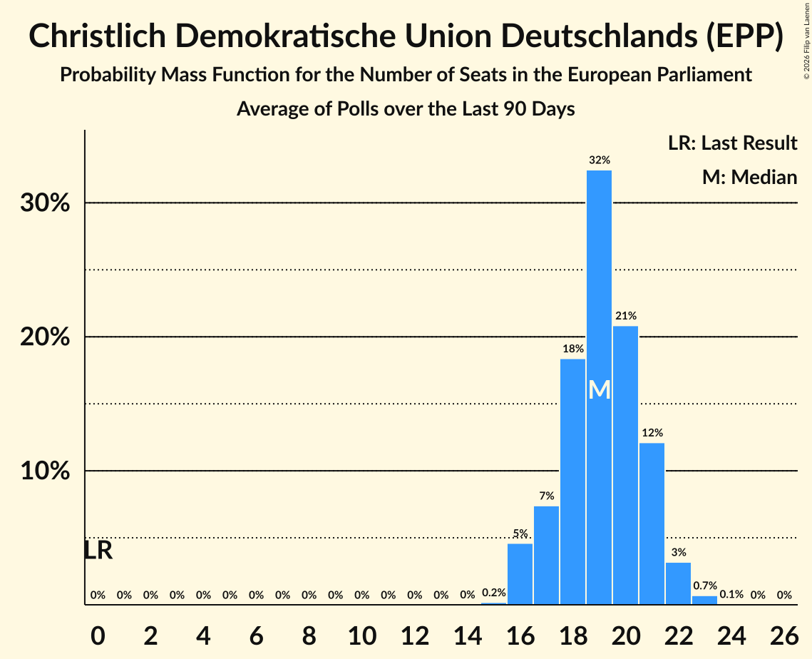

# Christlich Demokratische Union Deutschlands (EPP)

<a href="#voting-intentions">Voting Intentions</a> | <a href="#seats">Seats</a>

## Voting Intentions

Last result: **0.0%** (General Election of 9 June 2024)

### Confidence Intervals

| Period     | Polling firm/Commissioner(s) | Median | 80% Confidence Interval | 90% Confidence Interval | 95% Confidence Interval | 99% Confidence Interval |
|:----------:|:----------------:|:-----------:|:-----------------------:|:-----------------------:|:-----------------------:|:-----------------------:|
| N/A | [Poll Average](average.html) | 25.8% | 24.2–28.4% | 23.7–29.6% | 23.3–30.4% | 22.5–31.7% |
| [18–21 November 2024](2024-11-21-INSAandYouGov.html) | INSA and YouGov | 25.3% | 23.7–26.9% | 23.3–27.4% | 22.9–27.8% | 22.2–28.6% |
| [19–21 November 2024](2024-11-21-ForschungsgruppeWahlen.html) | Forschungsgruppe Wahlen | 25.2% | 23.8–26.8% | 23.4–27.2% | 23.0–27.6% | 22.3–28.3% |
| [18–20 November 2024](2024-11-20-Infratestdimap.html) | Infratest dimap | 26.0% | 24.5–27.6% | 24.1–28.1% | 23.7–28.5% | 23.0–29.2% |
| [15–18 November 2024](2024-11-18-INSAandYouGov.html) | INSA and YouGov | 25.2% | 24.0–26.5% | 23.7–26.9% | 23.4–27.2% | 22.8–27.8% |
| [12–18 November 2024](2024-11-18-Forsa.html) | Forsa | 26.0% | 24.9–27.2% | 24.6–27.5% | 24.4–27.8% | 23.8–28.4% |
| [11–15 November 2024](2024-11-15-INSAandYouGov.html) | INSA and YouGov | 25.2% | N/A | N/A | N/A | N/A |
| [2–14 November 2024](2024-11-14-Allensbach.html) | Allensbach | 29.2% | 27.4–31.0% | 26.9–31.6% | 26.5–32.0% | 25.7–32.9% |
| [8–12 November 2024](2024-11-12-YouGov.html) | YouGov | 25.8% | 24.5–27.2% | 24.2–27.6% | 23.8–27.9% | 23.2–28.5% |
| [8–11 November 2024](2024-11-11-INSAandYouGov.html) | INSA and YouGov | 25.7% | 24.6–26.7% | 24.4–27.0% | 24.1–27.3% | 23.6–27.8% |
| [5–11 November 2024](2024-11-11-Forsa.html) | Forsa | 26.1% | 25.0–27.2% | 24.6–27.6% | 24.4–27.8% | 23.9–28.4% |
| [7–8 November 2024](2024-11-08-INSAandYouGov.html) | INSA and YouGov | 25.3% | N/A | N/A | N/A | N/A |
| [7 November 2024](2024-11-07-Infratestdimap.html) | Infratest dimap | 26.9% | 25.2–28.7% | 24.7–29.2% | 24.3–29.6% | 23.5–30.5% |
| [5–7 November 2024](2024-11-07-ForschungsgruppeWahlen.html) | Forschungsgruppe Wahlen | 26.1% | 24.4–27.9% | 23.9–28.4% | 23.5–28.9% | 22.7–29.7% |
| [7 November 2024](2024-11-07-Forsa.html) | Forsa | 25.2% | N/A | N/A | N/A | N/A |
| [1–4 November 2024](2024-11-04-INSAandYouGov.html) | INSA and YouGov | 24.0% | N/A | N/A | N/A | N/A |
| [4 November 2024](2024-11-04-Forsa.html) | Forsa | 26.0% | N/A | N/A | N/A | N/A |
| [1–2 November 2024](2024-11-02-Ipsos.html) | Ipsos | 25.3% | 23.6–27.1% | 23.1–27.6% | 22.7–28.1% | 21.9–29.0% |
| [1 November 2024](2024-11-01-INSAandYouGov.html) | INSA and YouGov | 25.3% | N/A | N/A | N/A | N/A |
| [28–30 October 2024](2024-10-30-Infratestdimap.html) | Infratest dimap | 26.9% | 25.3–28.5% | 24.9–28.9% | 24.5–29.3% | 23.8–30.1% |
| [23–29 October 2024](2024-10-29-Verian.html) | Verian | 25.3% | 23.9–26.8% | 23.5–27.2% | 23.1–27.6% | 22.4–28.3% |
| [25–28 October 2024](2024-10-28-INSAandYouGov.html) | INSA and YouGov | 24.5% | 23.3–25.8% | 23.0–26.1% | 22.7–26.4% | 22.1–27.1% |
| [22–28 October 2024](2024-10-28-Forsa.html) | Forsa | 25.3% | 24.0–26.6% | 23.7–26.9% | 23.4–27.3% | 22.8–27.9% |
| [21–25 October 2024](2024-10-25-INSAandYouGov.html) | INSA and YouGov | 23.7% | N/A | N/A | N/A | N/A |
| [18–21 October 2024](2024-10-21-INSAandYouGov.html) | INSA and YouGov | 23.5% | 22.3–24.7% | 22.0–25.1% | 21.7–25.4% | 21.1–26.0% |
| [15–21 October 2024](2024-10-21-Forsa.html) | Forsa | 24.5% | 23.4–25.6% | 23.1–25.9% | 22.8–26.2% | 22.3–26.8% |
| [14–18 October 2024](2024-10-18-INSAandYouGov.html) | INSA and YouGov | 24.5% | 22.9–26.1% | 22.5–26.6% | 22.1–27.0% | 21.4–27.8% |
| [15–17 October 2024](2024-10-17-ForschungsgruppeWahlen.html) | Forschungsgruppe Wahlen | 24.5% | 22.9–26.2% | 22.4–26.7% | 22.0–27.1% | 21.3–28.0% |
| [11–14 October 2024](2024-10-14-INSAandYouGov.html) | INSA and YouGov | 24.5% | 23.3–25.7% | 22.9–26.1% | 22.6–26.4% | 22.1–27.0% |
| [8–14 October 2024](2024-10-14-Forsa.html) | Forsa | 24.5% | 23.4–25.6% | 23.1–25.9% | 22.8–26.2% | 22.3–26.7% |
| [7–11 October 2024](2024-10-11-INSAandYouGov.html) | INSA and YouGov | 24.5% | 22.9–26.1% | 22.5–26.6% | 22.1–27.0% | 21.4–27.8% |
| [11 October 2024](2024-10-11-Allensbach.html) | Allensbach | 28.1% | 26.4–30.0% | 25.9–30.5% | 25.5–31.0% | 24.7–31.9% |
| [7–9 October 2024](2024-10-09-Infratestdimap.html) | Infratest dimap | 24.5% | 23.0–26.0% | 22.6–26.5% | 22.2–26.9% | 21.5–27.6% |
| [4–8 October 2024](2024-10-08-YouGov.html) | YouGov | 25.3% | 24.0–26.6% | 23.6–27.0% | 23.3–27.4% | 22.7–28.0% |
| [4–7 October 2024](2024-10-07-INSAandYouGov.html) | INSA and YouGov | 24.9% | N/A | N/A | N/A | N/A |
| [1–7 October 2024](2024-10-07-Forsa.html) | Forsa | 24.5% | 23.3–25.8% | 22.9–26.1% | 22.6–26.4% | 22.1–27.0% |
| [2–4 October 2024](2024-10-04-Ipsos.html) | Ipsos | 24.5% | 22.8–26.3% | 22.3–26.8% | 21.9–27.3% | 21.1–28.2% |
| [4 October 2024](2024-10-04-INSAandYouGov.html) | INSA and YouGov | 24.5% | 23.0–26.1% | 22.5–26.6% | 22.2–27.0% | 21.5–27.8% |
| [1 October 2024](2024-10-01-Verian.html) | Verian | 24.4% | 23.0–25.9% | 22.6–26.4% | 22.3–26.7% | 21.6–27.5% |
| [27–30 September 2024](2024-09-30-INSAandYouGov.html) | INSA and YouGov | 24.9% | 23.7–26.2% | 23.3–26.5% | 23.0–26.8% | 22.5–27.4% |
| [24–30 September 2024](2024-09-30-Forsa.html) | Forsa | 24.5% | 23.4–25.6% | 23.1–25.9% | 22.8–26.2% | 22.3–26.7% |
| [23–27 September 2024](2024-09-27-INSAandYouGov.html) | INSA and YouGov | 25.3% | N/A | N/A | N/A | N/A |
| [24–26 September 2024](2024-09-26-ForschungsgruppeWahlen.html) | Forschungsgruppe Wahlen | 24.5% | 22.9–26.2% | 22.4–26.6% | 22.1–27.1% | 21.3–27.9% |
| [20–23 September 2024](2024-09-23-INSAandYouGov.html) | INSA and YouGov | 25.5% | 24.3–26.8% | 24.0–27.2% | 23.7–27.5% | 23.1–28.1% |
| [17–23 September 2024](2024-09-23-Forsa.html) | Forsa | 25.3% | 24.2–26.4% | 23.9–26.7% | 23.6–27.0% | 23.1–27.6% |
| [16–19 September 2024](2024-09-19-INSAandYouGov.html) | INSA and YouGov | 25.3% | N/A | N/A | N/A | N/A |
| [13–16 September 2024](2024-09-16-INSAandYouGov.html) | INSA and YouGov | 26.0% | 24.8–27.3% | 24.4–27.6% | 24.1–28.0% | 23.5–28.6% |
| [11–16 September 2024](2024-09-16-GMS.html) | GMS | 26.8% | 25.1–28.7% | 24.6–29.2% | 24.2–29.7% | 23.4–30.6% |
| [10–16 September 2024](2024-09-16-Forsa.html) | Forsa | 24.5% | 23.4–25.6% | 23.1–25.9% | 22.8–26.2% | 22.3–26.7% |
| [9–13 September 2024](2024-09-13-INSAandYouGov.html) | INSA and YouGov | 26.0% | 24.5–27.7% | 24.0–28.2% | 23.6–28.6% | 22.9–29.4% |
| [11 September 2024](2024-09-11-Allensbach.html) | Allensbach | 28.0% | 26.3–29.9% | 25.8–30.4% | 25.3–30.9% | 24.5–31.8% |
| [6–10 September 2024](2024-09-10-YouGov.html) | YouGov | 25.3% | 24.0–26.7% | 23.6–27.0% | 23.3–27.4% | 22.7–28.0% |
| [6–9 September 2024](2024-09-09-INSAandYouGov.html) | INSA and YouGov | 25.7% | N/A | N/A | N/A | N/A |
| [3–9 September 2024](2024-09-09-Forsa.html) | Forsa | 26.0% | 24.9–27.2% | 24.6–27.5% | 24.4–27.8% | 23.8–28.4% |
| [6–7 September 2024](2024-09-07-Ipsos.html) | Ipsos | 25.3% | 23.6–27.1% | 23.1–27.6% | 22.7–28.1% | 21.9–29.0% |
| [2–6 September 2024](2024-09-06-INSAandYouGov.html) | INSA and YouGov | 24.5% | 22.9–26.1% | 22.5–26.6% | 22.1–27.0% | 21.4–27.8% |
| [3–5 September 2024](2024-09-05-ForschungsgruppeWahlen.html) | Forschungsgruppe Wahlen | 26.1% | 24.5–27.8% | 24.0–28.3% | 23.6–28.7% | 22.9–29.6% |
| [3–4 September 2024](2024-09-04-Infratestdimap.html) | Infratest dimap | 26.1% | 24.5–27.7% | 24.1–28.1% | 23.7–28.5% | 23.0–29.3% |
| [3 September 2024](2024-09-03-Verian.html) | Verian | 24.5% | 23.0–26.0% | 22.6–26.4% | 22.3–26.8% | 21.6–27.5% |
| [2 September 2024](2024-09-02-INSAandYouGov.html) | INSA and YouGov | 24.5% | N/A | N/A | N/A | N/A |
| [2 September 2024](2024-09-02-Forsa.html) | Forsa | 25.3% | 24.2–26.4% | 23.9–26.7% | 23.6–27.0% | 23.1–27.6% |
| [26–30 August 2024](2024-08-30-INSAandYouGov.html) | INSA and YouGov | 24.5% | 22.9–26.1% | 22.5–26.6% | 22.1–27.0% | 21.4–27.8% |
| [23–26 August 2024](2024-08-26-INSAandYouGov.html) | INSA and YouGov | 24.5% | 23.3–25.8% | 23.0–26.1% | 22.7–26.4% | 22.1–27.1% |
| [20–26 August 2024](2024-08-26-Forsa.html) | Forsa | 24.5% | 23.4–25.6% | 23.1–25.9% | 22.8–26.2% | 22.3–26.7% |
| [19–23 August 2024](2024-08-23-INSAandYouGov.html) | INSA and YouGov | 24.5% | 22.9–26.1% | 22.5–26.6% | 22.1–27.0% | 21.4–27.8% |
| [16–19 August 2024](2024-08-19-INSAandYouGov.html) | INSA and YouGov | 24.1% | 22.9–25.3% | 22.5–25.7% | 22.3–26.0% | 21.7–26.6% |
| [13–19 August 2024](2024-08-19-Forsa.html) | Forsa | 24.5% | 23.4–25.6% | 23.1–25.9% | 22.8–26.2% | 22.3–26.8% |
| [12–16 August 2024](2024-08-16-INSAandYouGov.html) | INSA and YouGov | 23.7% | N/A | N/A | N/A | N/A |
| [3–15 August 2024](2024-08-15-Allensbach.html) | Allensbach | 26.8% | 25.1–28.6% | 24.6–29.2% | 24.2–29.6% | 23.4–30.5% |
| [12–14 August 2024](2024-08-14-ForschungsgruppeWahlen.html) | Forschungsgruppe Wahlen | 25.3% | 23.7–27.0% | 23.2–27.5% | 22.8–27.9% | 22.1–28.7% |
| [9–13 August 2024](2024-08-13-YouGov.html) | YouGov | 24.5% | 23.3–25.7% | 22.9–26.1% | 22.6–26.4% | 22.1–27.0% |
| [9–12 August 2024](2024-08-12-INSAandYouGov.html) | INSA and YouGov | 23.5% | 22.3–24.8% | 22.0–25.1% | 21.7–25.4% | 21.1–26.0% |
| [6–12 August 2024](2024-08-12-GMS.html) | GMS | 25.2% | 23.5–27.1% | 23.1–27.6% | 22.6–28.0% | 21.9–28.9% |
| [6–12 August 2024](2024-08-12-Forsa.html) | Forsa | 23.7% | 22.5–24.9% | 22.1–25.3% | 21.8–25.6% | 21.3–26.2% |
| [5–9 August 2024](2024-08-09-INSAandYouGov.html) | INSA and YouGov | 24.4% | N/A | N/A | N/A | N/A |
| [5–7 August 2024](2024-08-07-Infratestdimap.html) | Infratest dimap | 25.2% | 23.7–26.8% | 23.3–27.3% | 23.0–27.7% | 22.3–28.5% |
| [31 July–6 August 2024](2024-08-06-Verian.html) | Verian | 24.5% | 23.1–26.0% | 22.7–26.4% | 22.3–26.8% | 21.7–27.5% |
| [2–5 August 2024](2024-08-05-INSAandYouGov.html) | INSA and YouGov | 24.1% | 22.9–25.3% | 22.5–25.7% | 22.3–26.0% | 21.7–26.6% |
| [5 August 2024](2024-08-05-Forsa.html) | Forsa | 23.7% | 22.5–25.0% | 22.2–25.3% | 21.9–25.6% | 21.3–26.2% |
| [2–4 August 2024](2024-08-04-Ipsos.html) | Ipsos | 23.7% | 22.0–25.5% | 21.6–26.0% | 21.2–26.4% | 20.4–27.3% |
| [2 August 2024](2024-08-02-INSAandYouGov.html) | INSA and YouGov | 24.4% | N/A | N/A | N/A | N/A |
| [26–29 July 2024](2024-07-29-INSAandYouGov.html) | INSA and YouGov | 23.7% | 22.5–24.9% | 22.1–25.3% | 21.9–25.6% | 21.3–26.2% |
| [23–29 July 2024](2024-07-29-Forsa.html) | Forsa | 23.7% | 22.5–25.0% | 22.1–25.3% | 21.9–25.6% | 21.3–26.2% |
| [22–26 July 2024](2024-07-26-INSAandYouGov.html) | INSA and YouGov | 23.7% | N/A | N/A | N/A | N/A |
| [19–22 July 2024](2024-07-22-INSAandYouGov.html) | INSA and YouGov | 24.5% | N/A | N/A | N/A | N/A |
| [16–22 July 2024](2024-07-22-Forsa.html) | Forsa | 24.5% | N/A | N/A | N/A | N/A |
| [15–19 July 2024](2024-07-19-INSAandYouGov.html) | INSA and YouGov | 23.7% | N/A | N/A | N/A | N/A |
| [5–19 July 2024](2024-07-19-Allensbach.html) | Allensbach | 25.2% | 23.5–27.1% | 23.0–27.6% | 22.6–28.0% | 21.8–28.9% |
| [12–15 July 2024](2024-07-15-INSAandYouGov.html) | INSA and YouGov | 24.5% | N/A | N/A | N/A | N/A |
| [9–15 July 2024](2024-07-15-Forsa.html) | Forsa | 25.2% | N/A | N/A | N/A | N/A |
| [8–12 July 2024](2024-07-12-INSAandYouGov.html) | INSA and YouGov | 23.7% | N/A | N/A | N/A | N/A |
| [9–11 July 2024](2024-07-11-ForschungsgruppeWahlen.html) | Forschungsgruppe Wahlen | 25.3% | 23.7–27.0% | 23.2–27.5% | 22.8–27.9% | 22.1–28.7% |
| [3–9 July 2024](2024-07-09-Verian.html) | Verian | 24.5% | 23.1–26.0% | 22.7–26.4% | 22.4–26.7% | 21.7–27.5% |
| [5–8 July 2024](2024-07-08-INSAandYouGov.html) | INSA and YouGov | 24.0% | N/A | N/A | N/A | N/A |
| [2–8 July 2024](2024-07-08-Forsa.html) | Forsa | 23.7% | N/A | N/A | N/A | N/A |
| [5–7 July 2024](2024-07-07-Ipsos.html) | Ipsos | 23.7% | 22.0–25.5% | 21.6–26.0% | 21.2–26.4% | 20.4–27.3% |
| [1–5 July 2024](2024-07-05-INSAandYouGov.html) | INSA and YouGov | 23.7% | N/A | N/A | N/A | N/A |
| [3 July 2024](2024-07-03-YouGov.html) | YouGov | 23.4% | 22.2–24.8% | 21.8–25.2% | 21.5–25.5% | 20.9–26.2% |
| [1–3 July 2024](2024-07-03-Infratestdimap.html) | Infratest dimap | 24.5% | 23.0–26.1% | 22.6–26.5% | 22.2–26.9% | 21.5–27.7% |
| [1 July 2024](2024-07-01-INSAandYouGov.html) | INSA and YouGov | 24.0% | N/A | N/A | N/A | N/A |
| [1 July 2024](2024-07-01-Forsa.html) | Forsa | 24.5% | N/A | N/A | N/A | N/A |
| [24–28 June 2024](2024-06-28-INSAandYouGov.html) | INSA and YouGov | 23.7% | N/A | N/A | N/A | N/A |
| [25–27 June 2024](2024-06-27-ForschungsgruppeWahlen.html) | Forschungsgruppe Wahlen | 24.4% | N/A | N/A | N/A | N/A |
| [21–24 June 2024](2024-06-24-INSAandYouGov.html) | INSA and YouGov | 24.5% | N/A | N/A | N/A | N/A |
| [18–24 June 2024](2024-06-24-Forsa.html) | Forsa | 24.5% | N/A | N/A | N/A | N/A |
| [17–21 June 2024](2024-06-21-INSAandYouGov.html) | INSA and YouGov | 23.7% | N/A | N/A | N/A | N/A |
| [14–17 June 2024](2024-06-17-INSAandYouGov.html) | INSA and YouGov | 24.5% | N/A | N/A | N/A | N/A |
| [11–17 June 2024](2024-06-17-GMS.html) | GMS | 24.4% | 22.8–26.2% | 22.3–26.7% | 21.9–27.2% | 21.1–28.1% |
| [11–17 June 2024](2024-06-17-Forsa.html) | Forsa | 23.7% | N/A | N/A | N/A | N/A |
| [10–15 June 2024](2024-06-15-INSAandYouGov.html) | INSA and YouGov | 24.5% | N/A | N/A | N/A | N/A |
| [1–13 June 2024](2024-06-13-Allensbach.html) | Allensbach | 25.3% | N/A | N/A | N/A | N/A |
| [10–12 June 2024](2024-06-12-ForschungsgruppeWahlen.html) | Forschungsgruppe Wahlen | 23.7% | N/A | N/A | N/A | N/A |
| [5–11 June 2024](2024-06-11-Verian.html) | Verian | 23.7% | N/A | N/A | N/A | N/A |
| [7–10 June 2024](2024-06-10-INSAandYouGov.html) | INSA and YouGov | 23.0% | N/A | N/A | N/A | N/A |
| [4–10 June 2024](2024-06-10-Forsa.html) | Forsa | 23.7% | N/A | N/A | N/A | N/A |

### Probability Mass Function

The following table shows the probability mass function per percentage block of voting intentions for the [poll average](average.html) for Christlich Demokratische Union Deutschlands (EPP).

| Voting Intentions | Probability | Accumulated | Special Marks |
|:-----------------:|:-----------:|:-----------:|:-------------:|
| 0.0–0.5% | 0% | 100% | Last Result |
| 0.5–1.5% | 0% | 100% |  |
| 1.5–2.5% | 0% | 100% |  |
| 2.5–3.5% | 0% | 100% |  |
| 3.5–4.5% | 0% | 100% |  |
| 4.5–5.5% | 0% | 100% |  |
| 5.5–6.5% | 0% | 100% |  |
| 6.5–7.5% | 0% | 100% |  |
| 7.5–8.5% | 0% | 100% |  |
| 8.5–9.5% | 0% | 100% |  |
| 9.5–10.5% | 0% | 100% |  |
| 10.5–11.5% | 0% | 100% |  |
| 11.5–12.5% | 0% | 100% |  |
| 12.5–13.5% | 0% | 100% |  |
| 13.5–14.5% | 0% | 100% |  |
| 14.5–15.5% | 0% | 100% |  |
| 15.5–16.5% | 0% | 100% |  |
| 16.5–17.5% | 0% | 100% |  |
| 17.5–18.5% | 0% | 100% |  |
| 18.5–19.5% | 0% | 100% |  |
| 19.5–20.5% | 0% | 100% |  |
| 20.5–21.5% | 0% | 100% |  |
| 21.5–22.5% | 0.6% | 100% |  |
| 22.5–23.5% | 3% | 99.4% |  |
| 23.5–24.5% | 13% | 96% |  |
| 24.5–25.5% | 25% | 83% |  |
| 25.5–26.5% | 28% | 58% | Median |
| 26.5–27.5% | 15% | 31% |  |
| 27.5–28.5% | 6% | 15% |  |
| 28.5–29.5% | 4% | 9% |  |
| 29.5–30.5% | 3% | 5% |  |
| 30.5–31.5% | 2% | 2% |  |
| 31.5–32.5% | 0.5% | 0.6% |  |
| 32.5–33.5% | 0.1% | 0.1% |  |
| 33.5–34.5% | 0% | 0% |  |

## Seats

Last result: **0** seats (General Election of 9 June 2024)

### Confidence Intervals

| Period     | Polling firm/Commissioner(s) | Median | 80% Confidence Interval | 90% Confidence Interval | 95% Confidence Interval | 99% Confidence Interval |
|:----------:|:----------------:|:------:|:-----------------------:|:-----------------------:|:-----------------------:|:-----------------------:|
| N/A | [Poll Average](average.html) | 25 | 23–27 | 22–27 | 22–29 | 21–30 |
| [18–21 November 2024](2024-11-21-INSAandYouGov.html) | INSA and YouGov | 24 | 22–26 | 22–27 | 22–27 | 21–27 |
| [19–21 November 2024](2024-11-21-ForschungsgruppeWahlen.html) | Forschungsgruppe Wahlen | 25 | 25 | 23–26 | 22–26 | 21–26 |
| [18–20 November 2024](2024-11-20-Infratestdimap.html) | Infratest dimap | 24 | 23–27 | 23–27 | 23–27 | 22–29 |
| [15–18 November 2024](2024-11-18-INSAandYouGov.html) | INSA and YouGov | 25 | 25 | 24–26 | 23–27 | 21–27 |
| [12–18 November 2024](2024-11-18-Forsa.html) | Forsa | 26 | 25–26 | 23–26 | 23–26 | 23–27 |
| [11–15 November 2024](2024-11-15-INSAandYouGov.html) | INSA and YouGov |  |  |  |  |  |
| [2–14 November 2024](2024-11-14-Allensbach.html) | Allensbach | 27 | 27–29 | 27–30 | 26–30 | 24–30 |
| [8–12 November 2024](2024-11-12-YouGov.html) | YouGov | 26 | 23–26 | 23–26 | 23–26 | 23–26 |
| [8–11 November 2024](2024-11-11-INSAandYouGov.html) | INSA and YouGov | 25 | 25 | 24–25 | 24–25 | 22–25 |
| [5–11 November 2024](2024-11-11-Forsa.html) | Forsa | 25 | 25 | 25 | 25–26 | 24–27 |
| [7–8 November 2024](2024-11-08-INSAandYouGov.html) | INSA and YouGov |  |  |  |  |  |
| [7 November 2024](2024-11-07-Infratestdimap.html) | Infratest dimap | 25 | 24–28 | 24–28 | 22–31 | 22–31 |
| [5–7 November 2024](2024-11-07-ForschungsgruppeWahlen.html) | Forschungsgruppe Wahlen | 26 | 24–26 | 23–26 | 23–27 | 22–28 |
| [7 November 2024](2024-11-07-Forsa.html) | Forsa |  |  |  |  |  |
| [1–4 November 2024](2024-11-04-INSAandYouGov.html) | INSA and YouGov |  |  |  |  |  |
| [4 November 2024](2024-11-04-Forsa.html) | Forsa |  |  |  |  |  |
| [1–2 November 2024](2024-11-02-Ipsos.html) | Ipsos | 25 | 22–25 | 21–25 | 21–26 | 21–27 |
| [1 November 2024](2024-11-01-INSAandYouGov.html) | INSA and YouGov |  |  |  |  |  |
| [28–30 October 2024](2024-10-30-Infratestdimap.html) | Infratest dimap | 26 | 25–26 | 25–27 | 25–27 | 23–27 |
| [23–29 October 2024](2024-10-29-Verian.html) | Verian | 25 | 23–25 | 22–27 | 22–27 | 20–27 |
| [25–28 October 2024](2024-10-28-INSAandYouGov.html) | INSA and YouGov | 23 | 22–24 | 22–25 | 22–25 | 22–25 |
| [22–28 October 2024](2024-10-28-Forsa.html) | Forsa | 26 | 24–26 | 24–26 | 23–26 | 22–26 |
| [21–25 October 2024](2024-10-25-INSAandYouGov.html) | INSA and YouGov |  |  |  |  |  |
| [18–21 October 2024](2024-10-21-INSAandYouGov.html) | INSA and YouGov | 23 | 22–23 | 22–23 | 22–23 | 21–24 |
| [15–21 October 2024](2024-10-21-Forsa.html) | Forsa | 22 | 21–24 | 21–24 | 21–24 | 21–25 |
| [14–18 October 2024](2024-10-18-INSAandYouGov.html) | INSA and YouGov | 24 | 22–24 | 21–24 | 21–25 | 21–27 |
| [15–17 October 2024](2024-10-17-ForschungsgruppeWahlen.html) | Forschungsgruppe Wahlen | 24 | 22–25 | 21–25 | 21–25 | 21–25 |
| [11–14 October 2024](2024-10-14-INSAandYouGov.html) | INSA and YouGov | 24 | 23–24 | 23–24 | 22–24 | 22–25 |
| [8–14 October 2024](2024-10-14-Forsa.html) | Forsa | 23 | 21–23 | 21–24 | 21–24 | 21–25 |
| [7–11 October 2024](2024-10-11-INSAandYouGov.html) | INSA and YouGov | 21 | 21–22 | 21–23 | 21–25 | 20–25 |
| [11 October 2024](2024-10-11-Allensbach.html) | Allensbach | 26 | 26–28 | 26–30 | 25–30 | 25–30 |
| [7–9 October 2024](2024-10-09-Infratestdimap.html) | Infratest dimap | 23 | 22–24 | 22–24 | 22–24 | 21–25 |
| [4–8 October 2024](2024-10-08-YouGov.html) | YouGov | 25 | 25 | 25 | 25 | 25 |
| [4–7 October 2024](2024-10-07-INSAandYouGov.html) | INSA and YouGov |  |  |  |  |  |
| [1–7 October 2024](2024-10-07-Forsa.html) | Forsa | 23 | 22–24 | 22–24 | 22–25 | 21–26 |
| [2–4 October 2024](2024-10-04-Ipsos.html) | Ipsos | 22 | 20–24 | 20–24 | 20–25 | 20–27 |
| [4 October 2024](2024-10-04-INSAandYouGov.html) | INSA and YouGov | 25 | 21–25 | 21–25 | 21–26 | 21–27 |
| [1 October 2024](2024-10-01-Verian.html) | Verian | 23 | 23 | 22–23 | 22–24 | 22–24 |
| [27–30 September 2024](2024-09-30-INSAandYouGov.html) | INSA and YouGov | 25 | 24–26 | 23–27 | 22–27 | 21–27 |
| [24–30 September 2024](2024-09-30-Forsa.html) | Forsa | 23 | 22–24 | 22–24 | 22–25 | 21–25 |
| [23–27 September 2024](2024-09-27-INSAandYouGov.html) | INSA and YouGov |  |  |  |  |  |
| [24–26 September 2024](2024-09-26-ForschungsgruppeWahlen.html) | Forschungsgruppe Wahlen | 21 | 21–27 | 21–27 | 21–27 | 21–27 |
| [20–23 September 2024](2024-09-23-INSAandYouGov.html) | INSA and YouGov | 25 | 24–26 | 23–26 | 23–26 | 21–27 |
| [17–23 September 2024](2024-09-23-Forsa.html) | Forsa | 23 | 22–25 | 22–25 | 22–25 | 22–26 |
| [16–19 September 2024](2024-09-19-INSAandYouGov.html) | INSA and YouGov |  |  |  |  |  |
| [13–16 September 2024](2024-09-16-INSAandYouGov.html) | INSA and YouGov | 23 | 23–26 | 23–26 | 23–26 | 22–27 |
| [11–16 September 2024](2024-09-16-GMS.html) | GMS | 24 | 23–27 | 23–27 | 23–28 | 22–29 |
| [10–16 September 2024](2024-09-16-Forsa.html) | Forsa | 26 | 23–26 | 22–26 | 20–26 | 20–26 |
| [9–13 September 2024](2024-09-13-INSAandYouGov.html) | INSA and YouGov | 24 | 24 | 24 | 24–27 | 23–27 |
| [11 September 2024](2024-09-11-Allensbach.html) | Allensbach | 25 | 25–28 | 25–28 | 25–29 | 23–30 |
| [6–10 September 2024](2024-09-10-YouGov.html) | YouGov | 25 | 23–26 | 23–26 | 23–26 | 22–28 |
| [6–9 September 2024](2024-09-09-INSAandYouGov.html) | INSA and YouGov |  |  |  |  |  |
| [3–9 September 2024](2024-09-09-Forsa.html) | Forsa | 26 | 26 | 25–26 | 24–26 | 23–27 |
| [6–7 September 2024](2024-09-07-Ipsos.html) | Ipsos | 25 | 22–25 | 22–26 | 22–26 | 21–27 |
| [2–6 September 2024](2024-09-06-INSAandYouGov.html) | INSA and YouGov | 23 | 23–24 | 23–24 | 22–24 | 20–25 |
| [3–5 September 2024](2024-09-05-ForschungsgruppeWahlen.html) | Forschungsgruppe Wahlen | 24 | 24–27 | 23–27 | 23–27 | 22–28 |
| [3–4 September 2024](2024-09-04-Infratestdimap.html) | Infratest dimap | 23 | 23–24 | 23–25 | 23–25 | 23–27 |
| [3 September 2024](2024-09-03-Verian.html) | Verian | 23 | 22–25 | 21–25 | 21–25 | 21–25 |
| [2 September 2024](2024-09-02-INSAandYouGov.html) | INSA and YouGov |  |  |  |  |  |
| [2 September 2024](2024-09-02-Forsa.html) | Forsa | 24 | 24–25 | 24–25 | 24–25 | 23–25 |
| [26–30 August 2024](2024-08-30-INSAandYouGov.html) | INSA and YouGov | 21 | 21–24 | 21–24 | 21–25 | 20–26 |
| [23–26 August 2024](2024-08-26-INSAandYouGov.html) | INSA and YouGov | 24 | 22–25 | 22–26 | 22–26 | 22–26 |
| [20–26 August 2024](2024-08-26-Forsa.html) | Forsa | 24 | 22–25 | 22–25 | 22–25 | 21–26 |
| [19–23 August 2024](2024-08-23-INSAandYouGov.html) | INSA and YouGov | 24 | 21–26 | 21–26 | 21–26 | 20–27 |
| [16–19 August 2024](2024-08-19-INSAandYouGov.html) | INSA and YouGov | 22 | 20–23 | 20–24 | 20–24 | 20–24 |
| [13–19 August 2024](2024-08-19-Forsa.html) | Forsa | 23 | 22–25 | 22–25 | 22–25 | 22–25 |
| [12–16 August 2024](2024-08-16-INSAandYouGov.html) | INSA and YouGov |  |  |  |  |  |
| [3–15 August 2024](2024-08-15-Allensbach.html) | Allensbach | 26 | 24–26 | 23–27 | 23–28 | 23–29 |
| [12–14 August 2024](2024-08-14-ForschungsgruppeWahlen.html) | Forschungsgruppe Wahlen | 25 | 22–25 | 22–25 | 22–26 | 21–28 |
| [9–13 August 2024](2024-08-13-YouGov.html) | YouGov | 23 | 21–25 | 21–26 | 21–26 | 21–26 |
| [9–12 August 2024](2024-08-12-INSAandYouGov.html) | INSA and YouGov | 21 | 21–23 | 21–23 | 21–23 | 20–25 |
| [6–12 August 2024](2024-08-12-GMS.html) | GMS | 27 | 23–27 | 23–27 | 22–27 | 22–27 |
| [6–12 August 2024](2024-08-12-Forsa.html) | Forsa | 22 | 22 | 22 | 21–23 | 20–24 |
| [5–9 August 2024](2024-08-09-INSAandYouGov.html) | INSA and YouGov |  |  |  |  |  |
| [5–7 August 2024](2024-08-07-Infratestdimap.html) | Infratest dimap | 24 | 24–25 | 24–25 | 24–25 | 22–25 |
| [31 July–6 August 2024](2024-08-06-Verian.html) | Verian | 23 | 23–25 | 23–25 | 22–25 | 22–25 |
| [2–5 August 2024](2024-08-05-INSAandYouGov.html) | INSA and YouGov | 22 | 22 | 22 | 22–24 | 22–24 |
| [5 August 2024](2024-08-05-Forsa.html) | Forsa | 23 | 21–23 | 21–24 | 21–24 | 20–25 |
| [2–4 August 2024](2024-08-04-Ipsos.html) | Ipsos | 21 | 21–25 | 21–25 | 20–26 | 19–26 |
| [2 August 2024](2024-08-02-INSAandYouGov.html) | INSA and YouGov |  |  |  |  |  |
| [26–29 July 2024](2024-07-29-INSAandYouGov.html) | INSA and YouGov | 23 | 23 | 22–23 | 22–24 | 21–24 |
| [23–29 July 2024](2024-07-29-Forsa.html) | Forsa | 23 | 20–23 | 20–23 | 20–24 | 20–25 |
| [22–26 July 2024](2024-07-26-INSAandYouGov.html) | INSA and YouGov |  |  |  |  |  |
| [19–22 July 2024](2024-07-22-INSAandYouGov.html) | INSA and YouGov |  |  |  |  |  |
| [16–22 July 2024](2024-07-22-Forsa.html) | Forsa |  |  |  |  |  |
| [15–19 July 2024](2024-07-19-INSAandYouGov.html) | INSA and YouGov |  |  |  |  |  |
| [5–19 July 2024](2024-07-19-Allensbach.html) | Allensbach | 23 | 21–26 | 21–26 | 21–26 | 20–28 |
| [12–15 July 2024](2024-07-15-INSAandYouGov.html) | INSA and YouGov |  |  |  |  |  |
| [9–15 July 2024](2024-07-15-Forsa.html) | Forsa |  |  |  |  |  |
| [8–12 July 2024](2024-07-12-INSAandYouGov.html) | INSA and YouGov |  |  |  |  |  |
| [9–11 July 2024](2024-07-11-ForschungsgruppeWahlen.html) | Forschungsgruppe Wahlen | 25 | 22–25 | 21–26 | 21–27 | 21–27 |
| [3–9 July 2024](2024-07-09-Verian.html) | Verian | 23 | 22–26 | 22–26 | 22–26 | 21–26 |
| [5–8 July 2024](2024-07-08-INSAandYouGov.html) | INSA and YouGov |  |  |  |  |  |
| [2–8 July 2024](2024-07-08-Forsa.html) | Forsa |  |  |  |  |  |
| [5–7 July 2024](2024-07-07-Ipsos.html) | Ipsos | 22 | 22–24 | 22–25 | 20–25 | 20–25 |
| [1–5 July 2024](2024-07-05-INSAandYouGov.html) | INSA and YouGov |  |  |  |  |  |
| [3 July 2024](2024-07-03-YouGov.html) | YouGov | 22 | 22–24 | 22–24 | 22–24 | 21–24 |
| [1–3 July 2024](2024-07-03-Infratestdimap.html) | Infratest dimap | 24 | 24 | 24 | 24 | 22–24 |
| [1 July 2024](2024-07-01-INSAandYouGov.html) | INSA and YouGov |  |  |  |  |  |
| [1 July 2024](2024-07-01-Forsa.html) | Forsa |  |  |  |  |  |
| [24–28 June 2024](2024-06-28-INSAandYouGov.html) | INSA and YouGov |  |  |  |  |  |
| [25–27 June 2024](2024-06-27-ForschungsgruppeWahlen.html) | Forschungsgruppe Wahlen |  |  |  |  |  |
| [21–24 June 2024](2024-06-24-INSAandYouGov.html) | INSA and YouGov |  |  |  |  |  |
| [18–24 June 2024](2024-06-24-Forsa.html) | Forsa |  |  |  |  |  |
| [17–21 June 2024](2024-06-21-INSAandYouGov.html) | INSA and YouGov |  |  |  |  |  |
| [14–17 June 2024](2024-06-17-INSAandYouGov.html) | INSA and YouGov |  |  |  |  |  |
| [11–17 June 2024](2024-06-17-GMS.html) | GMS | 23 | 22–23 | 22–23 | 22–24 | 20–25 |
| [11–17 June 2024](2024-06-17-Forsa.html) | Forsa |  |  |  |  |  |
| [10–15 June 2024](2024-06-15-INSAandYouGov.html) | INSA and YouGov |  |  |  |  |  |
| [1–13 June 2024](2024-06-13-Allensbach.html) | Allensbach |  |  |  |  |  |
| [10–12 June 2024](2024-06-12-ForschungsgruppeWahlen.html) | Forschungsgruppe Wahlen |  |  |  |  |  |
| [5–11 June 2024](2024-06-11-Verian.html) | Verian |  |  |  |  |  |
| [7–10 June 2024](2024-06-10-INSAandYouGov.html) | INSA and YouGov |  |  |  |  |  |
| [4–10 June 2024](2024-06-10-Forsa.html) | Forsa |  |  |  |  |  |

### Probability Mass Function

The following table shows the probability mass function per seat for the [poll average](average.html) for Christlich Demokratische Union Deutschlands (EPP).

| Number of Seats | Probability | Accumulated | Special Marks |
|:---------------:|:-----------:|:-----------:|:-------------:|
| 0 | 0% | 100% | Last Result |
| 1 | 0% | 100% |  |
| 2 | 0% | 100% |  |
| 3 | 0% | 100% |  |
| 4 | 0% | 100% |  |
| 5 | 0% | 100% |  |
| 6 | 0% | 100% |  |
| 7 | 0% | 100% |  |
| 8 | 0% | 100% |  |
| 9 | 0% | 100% |  |
| 10 | 0% | 100% |  |
| 11 | 0% | 100% |  |
| 12 | 0% | 100% |  |
| 13 | 0% | 100% |  |
| 14 | 0% | 100% |  |
| 15 | 0% | 100% |  |
| 16 | 0% | 100% |  |
| 17 | 0% | 100% |  |
| 18 | 0% | 100% |  |
| 19 | 0% | 100% |  |
| 20 | 0.2% | 100% |  |
| 21 | 1.1% | 99.8% |  |
| 22 | 5% | 98.7% |  |
| 23 | 15% | 94% |  |
| 24 | 15% | 79% |  |
| 25 | 28% | 63% | Median |
| 26 | 19% | 35% |  |
| 27 | 12% | 16% |  |
| 28 | 2% | 4% |  |
| 29 | 2% | 3% |  |
| 30 | 0.9% | 1.0% |  |
| 31 | 0% | 0% |  |

