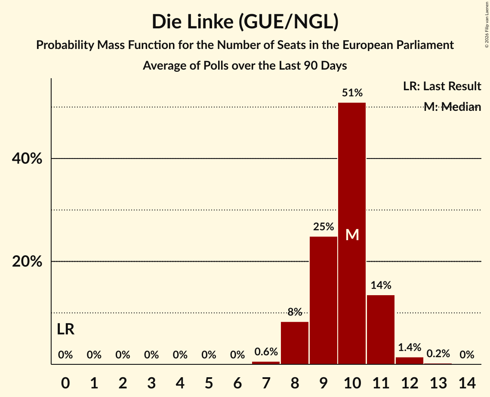

# Die Linke (GUE/NGL)

<a href="#voting-intentions">Voting Intentions</a> | <a href="#seats">Seats</a>

## Voting Intentions

Last result: **0.0%** (General Election of 9 June 2024)

### Confidence Intervals

| Period     | Polling firm/Commissioner(s) | Median | 80% Confidence Interval | 90% Confidence Interval | 95% Confidence Interval | 99% Confidence Interval |
|:----------:|:----------------:|:-----------:|:-----------------------:|:-----------------------:|:-----------------------:|:-----------------------:|
| N/A | [Poll Average](average.html) | 10.4% | 9.2–12.1% | 8.9–12.5% | 8.7–12.8% | 8.2–13.4% |
| [15–18 August 2025](2025-08-18-YouGov.html) | YouGov | 10.0% | 9.1–11.0% | 8.9–11.2% | 8.7–11.5% | 8.3–11.9% |
| [15–18 August 2025](2025-08-18-INSAandYouGov.html) | INSA and YouGov   BILD | 10.0% | 9.2–10.9% | 8.9–11.2% | 8.8–11.4% | 8.4–11.8% |
| [12–18 August 2025](2025-08-18-Forsa.html) | Forsa   RTL n-tv | 12.0% | 11.2–12.9% | 11.0–13.1% | 10.8–13.3% | 10.4–13.8% |
| [11–15 August 2025](2025-08-15-INSAandYouGov.html) | INSA and YouGov   BILD | 9.0% | 8.0–10.2% | 7.8–10.5% | 7.5–10.8% | 7.1–11.4% |
| [1–14 August 2025](2025-08-14-Allensbach.html) | Allensbach   Frankfurter Allgemeine Zeitung | 10.0% | 8.9–11.3% | 8.6–11.6% | 8.3–12.0% | 7.8–12.6% |
| [11–13 August 2025](2025-08-13-ForschungsgruppeWahlen.html) | Forschungsgruppe Wahlen   ZDF | 11.0% | 9.9–12.3% | 9.6–12.6% | 9.3–12.9% | 8.8–13.5% |
| [6–12 August 2025](2025-08-12-Verian.html) | Verian   FOCUS | 10.0% | 9.0–11.1% | 8.8–11.4% | 8.5–11.6% | 8.1–12.2% |
| [8–11 August 2025](2025-08-11-INSAandYouGov.html) | INSA and YouGov   BILD | 9.5% | 8.7–10.4% | 8.5–10.7% | 8.3–10.9% | 7.9–11.3% |
| [5–11 August 2025](2025-08-11-Forsa.html) | Forsa   RTL n-tv | 11.0% | 10.1–12.0% | 9.9–12.3% | 9.7–12.5% | 9.3–13.0% |
| [3–8 August 2025](2025-08-08-INSAandYouGov.html) | INSA and YouGov | 9.0% | N/A | N/A | N/A | N/A |
| [4–6 August 2025](2025-08-06-Infratestdimap.html) | Infratest dimap   ARD | 10.0% | 9.0–11.1% | 8.7–11.4% | 8.5–11.7% | 8.0–12.3% |
| [1–4 August 2025](2025-08-04-INSAandYouGov.html) | INSA and YouGov   BILD | 9.5% | 8.7–10.4% | 8.5–10.6% | 8.3–10.9% | 7.9–11.3% |
| [29 July–4 August 2025](2025-08-04-Forsa.html) | Forsa   RTL n-tv | 12.0% | 11.1–13.0% | 10.8–13.3% | 10.6–13.5% | 10.2–14.0% |
| [1–3 August 2025](2025-08-03-Ipsos.html) | Ipsos | 11.0% | 9.8–12.4% | 9.5–12.8% | 9.2–13.1% | 8.7–13.8% |
| [28 July–1 August 2025](2025-08-01-INSAandYouGov.html) | INSA and YouGov   BILD | 10.0% | 8.9–11.2% | 8.6–11.5% | 8.4–11.8% | 7.9–12.4% |
| [23–29 July 2025](2025-07-29-Verian.html) | Verian   FOCUS | 11.0% | 10.0–12.1% | 9.7–12.4% | 9.5–12.7% | 9.0–13.3% |
| [25–28 July 2025](2025-07-28-INSAandYouGov.html) | INSA and YouGov   BILD | 10.0% | 9.2–10.9% | 9.0–11.2% | 8.8–11.4% | 8.4–11.9% |
| [22–28 July 2025](2025-07-28-Forsa.html) | Forsa   RTL n-tv | 12.0% | 11.2–12.9% | 11.0–13.1% | 10.8–13.3% | 10.4–13.8% |
| [21–25 July 2025](2025-07-25-INSAandYouGov.html) | INSA and YouGov   BILD | 10.0% | 8.9–11.2% | 8.6–11.5% | 8.4–11.8% | 7.9–12.4% |
| [22–24 July 2025](2025-07-24-ForschungsgruppeWahlen.html) | Forschungsgruppe Wahlen   ZDF | 11.0% | 9.9–12.2% | 9.6–12.6% | 9.3–12.9% | 8.8–13.5% |
| [18–21 July 2025](2025-07-21-INSAandYouGov.html) | INSA and YouGov   BILD | 10.5% | N/A | N/A | N/A | N/A |
| [15–21 July 2025](2025-07-21-Forsa.html) | Forsa   RTL n-tv | 12.0% | 11.2–12.9% | 11.0–13.1% | 10.8–13.3% | 10.4–13.8% |
| [14–18 July 2025](2025-07-18-INSAandYouGov.html) | INSA and YouGov   BILD | 11.0% | N/A | N/A | N/A | N/A |
| [4–16 July 2025](2025-07-16-Allensbach.html) | Allensbach   Frankfurter Allgemeine Zeitung | 9.0% | 8.0–10.2% | 7.7–10.6% | 7.4–10.9% | 7.0–11.5% |
| [11–14 July 2025](2025-07-14-YouGov.html) | YouGov | 10.0% | 9.1–11.0% | 8.9–11.2% | 8.7–11.5% | 8.3–11.9% |
| [11–14 July 2025](2025-07-14-INSAandYouGov.html) | INSA and YouGov | 10.5% | N/A | N/A | N/A | N/A |
| [8–14 July 2025](2025-07-14-Forsa.html) | Forsa   RTL n-tv | 11.0% | N/A | N/A | N/A | N/A |
| [7–11 July 2025](2025-07-11-INSAandYouGov.html) | INSA and YouGov   BILD | 11.0% | 9.9–12.2% | 9.6–12.6% | 9.3–12.9% | 8.8–13.5% |
| [4–7 July 2025](2025-07-07-INSAandYouGov.html) | INSA and YouGov | 11.0% | N/A | N/A | N/A | N/A |
| [1–7 July 2025](2025-07-07-Forsa.html) | Forsa   RTL n-tv | 11.0% | 10.2–11.8% | 10.0–12.1% | 9.8–12.3% | 9.5–12.7% |
| [4–5 July 2025](2025-07-05-Ipsos.html) | Ipsos | 12.0% | 10.8–13.4% | 10.4–13.8% | 10.1–14.2% | 9.6–14.9% |
| [30 June–4 July 2025](2025-07-04-INSAandYouGov.html) | INSA and YouGov   BILD | 11.0% | 10.0–12.3% | 9.6–12.6% | 9.4–12.9% | 8.9–13.5% |
| [30 June–2 July 2025](2025-07-02-Infratestdimap.html) | Infratest dimap   ARD | 10.0% | 9.0–11.1% | 8.7–11.4% | 8.5–11.7% | 8.0–12.3% |
| [27–30 June 2025](2025-06-30-INSAandYouGov.html) | INSA and YouGov   BILD | 9.5% | 8.7–10.4% | 8.5–10.7% | 8.3–10.9% | 7.9–11.3% |
| [26–30 June 2025](2025-06-30-GMS.html) | GMS | 8.9% | 8.0–10.3% | 7.7–10.7% | 7.4–11.0% | 6.9–11.6% |
| [24–30 June 2025](2025-06-30-Forsa.html) | Forsa   RTL n-tv | 11.0% | 10.1–12.0% | 9.9–12.3% | 9.7–12.5% | 9.3–13.0% |
| [23–27 June 2025](2025-06-27-INSAandYouGov.html) | INSA and YouGov   BILD | 9.0% | 8.0–10.1% | 7.7–10.5% | 7.5–10.7% | 7.0–11.3% |
| [24–26 June 2025](2025-06-26-ForschungsgruppeWahlen.html) | Forschungsgruppe Wahlen   ZDF | 10.0% | 9.0–11.2% | 8.7–11.6% | 8.4–11.8% | 8.0–12.4% |
| [20–23 June 2025](2025-06-23-INSAandYouGov.html) | INSA and YouGov | 10.0% | N/A | N/A | N/A | N/A |
| [16–20 June 2025](2025-06-20-INSAandYouGov.html) | INSA and YouGov   BILD | 9.0% | 8.0–10.1% | 7.7–10.4% | 7.5–10.7% | 7.0–11.3% |
| [17–20 June 2025](2025-06-20-Forsa.html) | Forsa   RTL n-tv | 11.0% | 10.1–11.9% | 9.9–12.2% | 9.7–12.4% | 9.3–12.9% |
| [11–17 June 2025](2025-06-17-Verian.html) | Verian   FOCUS | 10.0% | 9.0–11.1% | 8.8–11.4% | 8.6–11.6% | 8.1–12.2% |
| [13–16 June 2025](2025-06-16-YouGov.html) | YouGov | 8.0% | 7.3–8.9% | 7.0–9.1% | 6.9–9.3% | 6.5–9.7% |
| [13–16 June 2025](2025-06-16-INSAandYouGov.html) | INSA and YouGov | 10.5% | 9.7–11.4% | 9.4–11.7% | 9.3–11.9% | 8.9–12.4% |
| [10–16 June 2025](2025-06-16-Forsa.html) | Forsa   RTL n-tv | 10.0% | 9.3–10.8% | 9.1–11.0% | 8.9–11.2% | 8.5–11.6% |
| [10–13 June 2025](2025-06-13-INSAandYouGov.html) | INSA and YouGov   BILD | 10.0% | 8.9–11.2% | 8.6–11.5% | 8.4–11.8% | 7.9–12.4% |
| [1–12 June 2025](2025-06-12-Allensbach.html) | Allensbach   Frankfurter Allgemeine Zeitung | 9.0% | 8.0–10.2% | 7.7–10.6% | 7.4–10.9% | 7.0–11.5% |
| [6–10 June 2025](2025-06-10-INSAandYouGov.html) | INSA and YouGov | 10.0% | N/A | N/A | N/A | N/A |
| [2–6 June 2025](2025-06-06-INSAandYouGov.html) | INSA and YouGov | 10.0% | 8.9–11.2% | 8.7–11.5% | 8.4–11.8% | 7.9–12.4% |
| [3–6 June 2025](2025-06-06-Forsa.html) | Forsa | 11.0% | 10.0–12.1% | 9.8–12.4% | 9.5–12.7% | 9.1–13.2% |
| [3–5 June 2025](2025-06-05-ForschungsgruppeWahlen.html) | Forschungsgruppe Wahlen | 11.0% | 9.9–12.2% | 9.6–12.5% | 9.4–12.8% | 8.9–13.5% |
| [2–3 June 2025](2025-06-03-Infratestdimap.html) | Infratest dimap | 9.0% | 8.0–10.1% | 7.8–10.4% | 7.5–10.7% | 7.1–11.2% |
| [28 May–2 June 2025](2025-06-02-pollytix.html) | pollytix | 10.0% | 9.1–11.0% | 8.8–11.3% | 8.6–11.6% | 8.2–12.1% |
| [30 May–2 June 2025](2025-06-02-INSAandYouGov.html) | INSA and YouGov | 10.5% | 9.6–11.4% | 9.4–11.7% | 9.2–11.9% | 8.8–12.4% |
| [27 May–2 June 2025](2025-06-02-Forsa.html) | Forsa | 11.0% | 10.0–12.1% | 9.8–12.4% | 9.5–12.6% | 9.1–13.2% |
| [30 May–1 June 2025](2025-06-01-Ipsos.html) | Ipsos | 11.0% | 9.8–12.4% | 9.5–12.8% | 9.2–13.1% | 8.7–13.8% |
| [26–30 May 2025](2025-05-30-INSAandYouGov.html) | INSA and YouGov | 11.0% | 9.9–12.2% | 9.6–12.6% | 9.3–12.9% | 8.8–13.5% |
| [23–26 May 2025](2025-05-26-INSAandYouGov.html) | INSA and YouGov | 10.0% | N/A | N/A | N/A | N/A |
| [20–26 May 2025](2025-05-26-Forsa.html) | Forsa | 11.0% | 10.1–11.9% | 9.9–12.2% | 9.7–12.5% | 9.3–12.9% |
| [19–23 May 2025](2025-05-23-INSAandYouGov.html) | INSA and YouGov | 10.0% | 9.0–11.2% | 8.7–11.6% | 8.4–11.9% | 8.0–12.5% |
| [20–22 May 2025](2025-05-22-ForschungsgruppeWahlen.html) | Forschungsgruppe Wahlen | 10.0% | 9.0–11.2% | 8.7–11.6% | 8.5–11.9% | 8.0–12.5% |
| [14–20 May 2025](2025-05-20-Verian.html) | Verian | 11.0% | 10.0–12.1% | 9.7–12.4% | 9.5–12.7% | 9.0–13.2% |
| [16–19 May 2025](2025-05-19-INSAandYouGov.html) | INSA and YouGov | 10.0% | N/A | N/A | N/A | N/A |
| [14–19 May 2025](2025-05-19-GMS.html) | GMS | 10.0% | 8.9–11.3% | 8.6–11.7% | 8.3–12.0% | 7.8–12.7% |
| [13–19 May 2025](2025-05-19-Forsa.html) | Forsa | 11.0% | 10.1–11.9% | 9.9–12.2% | 9.7–12.4% | 9.3–12.9% |
| [12–16 May 2025](2025-05-16-INSAandYouGov.html) | INSA and YouGov | 9.9% | 9.0–11.2% | 8.7–11.6% | 8.5–11.9% | 8.0–12.5% |
| [3–14 May 2025](2025-05-14-Allensbach.html) | Allensbach | 10.0% | 8.9–11.3% | 8.6–11.6% | 8.3–12.0% | 7.8–12.6% |
| [9–12 May 2025](2025-05-12-YouGov.html) | YouGov | 9.0% | 8.2–9.9% | 8.0–10.1% | 7.8–10.3% | 7.4–10.8% |
| [9–12 May 2025](2025-05-12-INSAandYouGov.html) | INSA and YouGov | 10.0% | 9.2–10.9% | 8.9–11.2% | 8.7–11.4% | 8.4–11.8% |
| [5–12 May 2025](2025-05-12-Forsa.html) | Forsa | 10.0% | 9.3–10.7% | 9.1–10.9% | 9.0–11.1% | 8.7–11.5% |
| [9–10 May 2025](2025-05-10-Ipsos.html) | Ipsos | 10.0% | 8.9–11.3% | 8.6–11.7% | 8.3–12.0% | 7.8–12.7% |
| [5–9 May 2025](2025-05-09-INSAandYouGov.html) | INSA and YouGov | 10.0% | N/A | N/A | N/A | N/A |
| [5–6 May 2025](2025-05-06-Infratestdimap.html) | Infratest dimap | 10.0% | 9.0–11.2% | 8.8–11.5% | 8.5–11.8% | 8.1–12.3% |
| [2–5 May 2025](2025-05-05-INSAandYouGov.html) | INSA and YouGov | 10.0% | 9.2–10.9% | 8.9–11.2% | 8.7–11.4% | 8.4–11.8% |
| [28 April–2 May 2025](2025-05-02-INSAandYouGov.html) | INSA and YouGov | 10.0% | N/A | N/A | N/A | N/A |
| [29 April–2 May 2025](2025-05-02-Forsa.html) | Forsa | 10.0% | 9.0–11.1% | 8.8–11.3% | 8.6–11.6% | 8.1–12.1% |
| [28–30 April 2025](2025-04-30-ForschungsgruppeWahlen.html) | Forschungsgruppe Wahlen | 10.0% | 8.9–11.2% | 8.7–11.6% | 8.4–11.9% | 7.9–12.5% |
| [25–28 April 2025](2025-04-28-YouGov.html) | YouGov | 10.0% | 9.2–10.9% | 9.0–11.2% | 8.8–11.4% | 8.4–11.9% |
| [25–28 April 2025](2025-04-28-INSAandYouGov.html) | INSA and YouGov | 10.0% | 9.2–10.9% | 9.0–11.2% | 8.8–11.4% | 8.4–11.9% |
| [22–28 April 2025](2025-04-28-Forsa.html) | Forsa | 10.0% | 9.2–10.9% | 8.9–11.2% | 8.7–11.4% | 8.4–11.8% |
| [22–25 April 2025](2025-04-25-INSAandYouGov.html) | INSA and YouGov | 10.0% | 8.9–11.2% | 8.6–11.5% | 8.4–11.8% | 7.9–12.4% |
| [15–22 April 2025](2025-04-22-Verian.html) | Verian | 9.0% | 8.1–10.0% | 7.8–10.3% | 7.6–10.6% | 7.2–11.1% |
| [17–22 April 2025](2025-04-22-INSAandYouGov.html) | INSA and YouGov | 10.0% | 9.2–10.9% | 8.9–11.2% | 8.8–11.4% | 8.4–11.8% |
| [14–17 April 2025](2025-04-17-INSAandYouGov.html) | INSA and YouGov   BILD | 10.0% | 9.0–11.2% | 8.7–11.6% | 8.5–11.9% | 8.0–12.5% |
| [15–17 April 2025](2025-04-17-Forsa.html) | Forsa   RTL n-tv | 9.0% | 8.1–10.0% | 7.8–10.3% | 7.6–10.5% | 7.2–11.1% |
| [13–15 April 2025](2025-04-15-pollytix.html) | pollytix | 10.0% | 9.0–11.0% | 8.8–11.3% | 8.6–11.6% | 8.1–12.1% |
| [11–14 April 2025](2025-04-14-INSAandYouGov.html) | INSA and YouGov   BILD | 10.0% | 9.2–10.9% | 8.9–11.2% | 8.7–11.4% | 8.4–11.8% |
| [8–14 April 2025](2025-04-14-Forsa.html) | Forsa   RTL n-tv | 10.0% | 9.2–10.9% | 9.0–11.2% | 8.8–11.4% | 8.4–11.9% |
| [7–11 April 2025](2025-04-11-INSAandYouGov.html) | INSA and YouGov | 10.0% | N/A | N/A | N/A | N/A |
| [8–10 April 2025](2025-04-10-ForschungsgruppeWahlen.html) | Forschungsgruppe Wahlen   ZDF | 10.0% | 9.0–11.2% | 8.7–11.6% | 8.5–11.9% | 8.0–12.5% |
| [28 March–9 April 2025](2025-04-09-Allensbach.html) | Allensbach | 10.0% | 8.9–11.3% | 8.6–11.7% | 8.3–12.0% | 7.8–12.6% |
| [4–7 April 2025](2025-04-07-INSAandYouGov.html) | INSA and YouGov   BILD | 10.5% | 9.7–11.4% | 9.4–11.7% | 9.2–11.9% | 8.9–12.4% |
| [2–7 April 2025](2025-04-07-GMS.html) | GMS | 10.0% | 8.9–11.3% | 8.6–11.7% | 8.3–12.0% | 7.8–12.6% |
| [1–7 April 2025](2025-04-07-Forsa.html) | Forsa   RTL n-tv | 10.0% | 9.3–10.8% | 9.1–11.0% | 8.9–11.2% | 8.5–11.6% |
| [4–5 April 2025](2025-04-05-Ipsos.html) | Ipsos | 11.0% | 9.8–12.4% | 9.5–12.8% | 9.2–13.1% | 8.7–13.8% |
| [31 March–4 April 2025](2025-04-04-INSAandYouGov.html) | INSA and YouGov   BILD | 11.0% | 9.9–12.3% | 9.6–12.6% | 9.4–12.9% | 8.9–13.5% |
| [2 April 2025](2025-04-02-Infratestdimap.html) | Infratest dimap | 10.0% | 9.0–11.1% | 8.7–11.4% | 8.5–11.7% | 8.0–12.3% |
| [28–31 March 2025](2025-03-31-INSAandYouGov.html) | INSA and YouGov | 10.5% | 9.7–11.4% | 9.4–11.7% | 9.3–11.9% | 8.9–12.4% |
| [25–31 March 2025](2025-03-31-Forsa.html) | Forsa   RTL n-tv | 10.0% | 9.3–10.8% | 9.1–11.1% | 8.9–11.2% | 8.6–11.6% |
| [24–28 March 2025](2025-03-28-INSAandYouGov.html) | INSA and YouGov | 10.0% | N/A | N/A | N/A | N/A |
| [19–25 March 2025](2025-03-25-Verian.html) | Verian   FOCUS | 10.0% | 9.0–11.1% | 8.7–11.4% | 8.5–11.7% | 8.1–12.3% |
| [21–24 March 2025](2025-03-24-YouGov.html) | YouGov | 10.0% | 9.2–10.9% | 8.9–11.2% | 8.7–11.4% | 8.3–11.9% |
| [21–24 March 2025](2025-03-24-INSAandYouGov.html) | INSA and YouGov   BILD | 10.5% | 9.6–11.4% | 9.4–11.7% | 9.2–11.9% | 8.8–12.4% |
| [18–24 March 2025](2025-03-24-Forsa.html) | Forsa   RTL n-tv | 10.0% | 9.3–10.8% | 9.1–11.0% | 8.9–11.2% | 8.5–11.6% |
| [17–21 March 2025](2025-03-21-INSAandYouGov.html) | INSA and YouGov | 10.0% | 8.9–11.2% | 8.7–11.5% | 8.4–11.8% | 7.9–12.4% |
| [18–20 March 2025](2025-03-20-ForschungsgruppeWahlen.html) | Forschungsgruppe Wahlen   ZDF | 10.0% | 8.9–11.2% | 8.6–11.6% | 8.4–11.9% | 7.9–12.5% |
| [14–17 March 2025](2025-03-17-INSAandYouGov.html) | INSA and YouGov   BILD | 10.5% | N/A | N/A | N/A | N/A |
| [11–17 March 2025](2025-03-17-Forsa.html) | Forsa   RTL n-tv | 11.0% | 10.2–11.8% | 10.0–12.1% | 9.8–12.3% | 9.5–12.7% |
| [10–14 March 2025](2025-03-14-INSAandYouGov.html) | INSA and YouGov   BILD | 10.0% | N/A | N/A | N/A | N/A |
| [11 March 2025](2025-03-11-Allensbach.html) | Allensbach | 10.0% | 8.9–11.3% | 8.6–11.7% | 8.3–12.0% | 7.8–12.6% |
| [7–10 March 2025](2025-03-10-INSAandYouGov.html) | INSA and YouGov | 10.5% | N/A | N/A | N/A | N/A |
| [4–10 March 2025](2025-03-10-Forsa.html) | Forsa   RTL n-tv | 11.0% | N/A | N/A | N/A | N/A |
| [3–7 March 2025](2025-03-07-INSAandYouGov.html) | INSA and YouGov | 10.0% | N/A | N/A | N/A | N/A |
| [4–6 March 2025](2025-03-06-ForschungsgruppeWahlen.html) | Forschungsgruppe Wahlen | 10.0% | N/A | N/A | N/A | N/A |
| [4–5 March 2025](2025-03-05-Infratestdimap.html) | Infratest dimap | 9.0% | 8.0–10.1% | 7.8–10.4% | 7.6–10.7% | 7.1–11.2% |
| [28 February–3 March 2025](2025-03-03-INSAandYouGov.html) | INSA and YouGov | 9.5% | N/A | N/A | N/A | N/A |
| [24 February–3 March 2025](2025-03-03-Forsa.html) | Forsa | 12.0% | N/A | N/A | N/A | N/A |
| [31–2 March 2025](2025-03-02-Infratestdimap.html) | Infratest dimap   ARD | 10.0% | N/A | N/A | N/A | N/A |
| [28 February–1 March 2025](2025-03-01-Ipsos.html) | Ipsos | 8.9% | 7.8–10.2% | 7.5–10.5% | 7.3–10.8% | 6.8–11.5% |
| [24–28 February 2025](2025-02-28-INSAandYouGov.html) | INSA and YouGov | 9.0% | 7.9–10.3% | 7.6–10.6% | 7.4–10.9% | 6.9–11.6% |
| [21–22 February 2025](2025-02-22-INSAandYouGov.html) | INSA and YouGov | 7.5% | N/A | N/A | N/A | N/A |
| [19–21 February 2025](2025-02-21-Ipsos.html) | Ipsos | 7.0% | 6.1–8.2% | 5.8–8.5% | 5.6–8.8% | 5.2–9.3% |
| [17–20 February 2025](2025-02-20-YouGov.html) | YouGov | 8.0% | 7.2–8.9% | 7.0–9.1% | 6.8–9.4% | 6.4–9.8% |
| [19–20 February 2025](2025-02-20-ForschungsgruppeWahlen.html) | Forschungsgruppe Wahlen | 8.0% | 7.1–9.0% | 6.9–9.3% | 6.7–9.6% | 6.3–10.1% |
| [17–20 February 2025](2025-02-20-Forsa.html) | Forsa | 8.0% | 7.3–8.8% | 7.1–9.1% | 6.9–9.3% | 6.5–9.7% |
| [9–20 February 2025](2025-02-20-Allensbach.html) | Allensbach | 7.5% | 6.6–8.7% | 6.3–9.0% | 6.1–9.3% | 5.7–9.8% |
| [12–19 February 2025](2025-02-19-Ipsos.html) | Ipsos | 7.0% | 6.3–7.8% | 6.1–8.0% | 6.0–8.2% | 5.6–8.6% |
| [18–19 February 2025](2025-02-19-INSAandYouGov.html) | INSA and YouGov | 7.0% | 6.3–7.8% | 6.1–8.0% | 6.0–8.2% | 5.7–8.6% |
| [16–19 February 2025](2025-02-19-GMS.html) | GMS | 6.0% | 5.1–7.1% | 4.9–7.4% | 4.7–7.7% | 4.3–8.2% |
| [16–18 February 2025](2025-02-18-Cluster17.html) | Cluster17 | 7.0% | 6.2–7.9% | 6.0–8.2% | 5.8–8.4% | 5.4–8.9% |
| [14–17 February 2025](2025-02-17-YouGov.html) | YouGov | 9.0% | 8.3–9.9% | 8.0–10.1% | 7.9–10.3% | 7.5–10.7% |
| [14–17 February 2025](2025-02-17-INSAandYouGov.html) | INSA and YouGov | 6.5% | N/A | N/A | N/A | N/A |
| [11–17 February 2025](2025-02-17-Forsa.html) | Forsa | 7.0% | 6.4–7.7% | 6.2–7.9% | 6.1–8.1% | 5.8–8.4% |
| [10–14 February 2025](2025-02-14-INSAandYouGov.html) | INSA and YouGov | 6.0% | 5.2–7.0% | 5.0–7.2% | 4.8–7.5% | 4.4–8.0% |
| [11–13 February 2025](2025-02-13-ForschungsgruppeWahlen.html) | Forschungsgruppe Wahlen | 7.0% | 6.1–8.0% | 5.9–8.4% | 5.7–8.6% | 5.3–9.1% |
| [11–12 February 2025](2025-02-12-pollytix.html) | pollytix | 6.0% | 5.3–6.9% | 5.1–7.1% | 4.9–7.3% | 4.6–7.8% |
| [10–12 February 2025](2025-02-12-Infratestdimap.html) | Infratest dimap | 6.0% | 5.3–6.9% | 5.1–7.1% | 4.9–7.3% | 4.6–7.7% |
| [12 February 2025](2025-02-12-Allensbach.html) | Allensbach | 6.0% | 5.1–7.0% | 4.9–7.3% | 4.7–7.6% | 4.3–8.2% |
| [27–11 February 2025](2025-02-11-Allensbach.html) | Allensbach   FAZ | 10.0% | N/A | N/A | N/A | N/A |
| [7–10 February 2025](2025-02-10-YouGov.html) | YouGov | 6.0% | 5.4–6.7% | 5.2–6.9% | 5.1–7.1% | 4.8–7.5% |
| [7–10 February 2025](2025-02-10-INSAandYouGov.html) | INSA and YouGov | 6.0% | 5.3–6.7% | 5.2–6.9% | 5.0–7.1% | 4.7–7.5% |
| [4–10 February 2025](2025-02-10-Forsa.html) | Forsa | 6.0% | 5.4–6.7% | 5.3–6.8% | 5.1–7.0% | 4.9–7.3% |
| [3–7 February 2025](2025-02-07-INSAandYouGov.html) | INSA and YouGov | 5.0% | N/A | N/A | N/A | N/A |
| [4–7 February 2025](2025-02-07-GMS.html) | GMS | 5.0% | 4.3–6.1% | 4.0–6.3% | 3.9–6.6% | 3.5–7.1% |
| [5–6 February 2025](2025-02-06-pollytix.html) | pollytix | 6.0% | 5.3–6.9% | 5.1–7.1% | 4.9–7.3% | 4.6–7.8% |
| [4–6 February 2025](2025-02-06-ForschungsgruppeWahlen.html) | Forschungsgruppe Wahlen | 6.0% | 5.2–6.9% | 5.0–7.1% | 4.8–7.4% | 4.5–7.8% |
| [3–5 February 2025](2025-02-05-Infratestdimap.html) | Infratest dimap | 5.0% | 4.3–5.9% | 4.1–6.1% | 3.9–6.3% | 3.6–6.8% |
| [4 February 2025](2025-02-04-YouGov.html) | YouGov | 6.0% | 5.3–6.7% | 5.2–6.9% | 5.0–7.0% | 4.8–7.4% |
| [3 February 2025](2025-02-03-INSAandYouGov.html) | INSA and YouGov | 5.0% | 4.4–5.7% | 4.3–5.9% | 4.1–6.0% | 3.9–6.4% |
| [3 February 2025](2025-02-03-Forsa.html) | Forsa | 5.0% | 4.5–5.6% | 4.3–5.8% | 4.2–5.9% | 4.0–6.2% |
| [30–31 January 2025](2025-01-31-Ipsos.html) | Ipsos | 4.0% | 3.3–4.9% | 3.1–5.2% | 2.9–5.4% | 2.7–5.9% |
| [30–31 January 2025](2025-01-31-INSAandYouGov.html) | INSA and YouGov | 4.0% | 3.4–4.8% | 3.2–5.0% | 3.0–5.3% | 2.7–5.7% |
| [30 January 2025](2025-01-30-INSAandYouGov.html) | INSA and YouGov | 4.0% | N/A | N/A | N/A | N/A |
| [28–30 January 2025](2025-01-30-DemocracyInstitute.html) | Democracy Institute | 5.0% | 4.5–5.6% | 4.3–5.8% | 4.2–6.0% | 4.0–6.3% |
| [27–29 January 2025](2025-01-29-Infratestdimap.html) | Infratest dimap | 5.0% | 4.3–5.9% | 4.1–6.1% | 4.0–6.3% | 3.7–6.8% |
| [27–29 January 2025](2025-01-29-ForschungsgruppeWahlen.html) | Forschungsgruppe Wahlen | 5.0% | 4.3–5.8% | 4.1–6.0% | 4.0–6.2% | 3.7–6.6% |
| [22–28 January 2025](2025-01-28-Verian.html) | Verian | 4.0% | 3.4–4.7% | 3.2–4.9% | 3.1–5.1% | 2.8–5.5% |
| [24–27 January 2025](2025-01-27-YouGov.html) | YouGov | 5.0% | 4.4–5.7% | 4.2–5.9% | 4.1–6.1% | 3.8–6.5% |
| [24–27 January 2025](2025-01-27-INSAandYouGov.html) | INSA and YouGov | 4.5% | 3.9–5.1% | 3.8–5.3% | 3.7–5.5% | 3.4–5.8% |
| [21–27 January 2025](2025-01-27-Forsa.html) | Forsa | 4.0% | 3.5–4.5% | 3.4–4.7% | 3.3–4.8% | 3.1–5.1% |
| [20–24 January 2025](2025-01-24-INSAandYouGov.html) | INSA and YouGov | 4.0% | 3.4–4.8% | 3.2–5.0% | 3.0–5.3% | 2.7–5.7% |
| [21–23 January 2025](2025-01-23-ForschungsgruppeWahlen.html) | Forschungsgruppe Wahlen | 5.0% | 4.3–5.8% | 4.1–6.1% | 3.9–6.3% | 3.6–6.7% |
| [17–20 January 2025](2025-01-20-YouGov.html) | YouGov | 4.0% | 3.4–4.6% | 3.3–4.8% | 3.2–5.0% | 2.9–5.3% |
| [17–20 January 2025](2025-01-20-INSAandYouGov.html) | INSA and YouGov | 4.0% | 3.5–4.6% | 3.3–4.8% | 3.2–4.9% | 3.0–5.3% |
| [14–20 January 2025](2025-01-20-Forsa.html) | Forsa | 3.0% | 2.6–3.5% | 2.5–3.6% | 2.4–3.7% | 2.2–4.0% |
| [7–19 January 2025](2025-01-19-Allensbach.html) | Allensbach | 1.1% | 0.8–1.6% | 0.7–1.8% | 0.6–1.9% | 0.5–2.2% |
| [16–18 January 2025](2025-01-18-Ipsos.html) | Ipsos | 3.0% | 2.4–3.8% | 2.2–4.1% | 2.1–4.3% | 1.9–4.7% |
| [13–17 January 2025](2025-01-17-INSAandYouGov.html) | INSA and YouGov | 4.0% | 3.3–4.8% | 3.2–5.0% | 3.0–5.2% | 2.7–5.7% |
| [10–14 January 2025](2025-01-14-YouGov.html) | YouGov | 3.9% | 3.4–4.6% | 3.2–4.7% | 3.1–4.9% | 2.9–5.2% |
| [10–13 January 2025](2025-01-13-INSAandYouGov.html) | INSA and YouGov | 3.5% | N/A | N/A | N/A | N/A |
| [7–13 January 2025](2025-01-13-Forsa.html) | Forsa | 3.0% | 2.6–3.5% | 2.5–3.6% | 2.4–3.7% | 2.2–4.0% |
| [6–10 January 2025](2025-01-10-INSAandYouGov.html) | INSA and YouGov | 3.0% | 2.4–3.7% | 2.3–3.9% | 2.2–4.1% | 1.9–4.5% |
| [7–9 January 2025](2025-01-09-ForschungsgruppeWahlen.html) | Forschungsgruppe Wahlen | 4.0% | 3.4–4.8% | 3.2–5.1% | 3.0–5.3% | 2.7–5.7% |
| [6–8 January 2025](2025-01-08-Infratestdimap.html) | Infratest dimap | 4.0% | 3.4–4.8% | 3.2–5.0% | 3.1–5.2% | 2.8–5.6% |
| [3–6 January 2025](2025-01-06-YouGov.html) | YouGov | 3.0% | 2.5–3.6% | 2.4–3.7% | 2.3–3.9% | 2.1–4.1% |
| [3–6 January 2025](2025-01-06-INSAandYouGov.html) | INSA and YouGov | 3.0% | 2.6–3.6% | 2.4–3.7% | 2.3–3.9% | 2.1–4.1% |
| [2–6 January 2025](2025-01-06-Forsa.html) | Forsa | 3.0% | 2.5–3.6% | 2.4–3.8% | 2.2–4.0% | 2.0–4.3% |
| [2–4 January 2025](2025-01-04-Ipsos.html) | Ipsos | 3.0% | 2.4–3.8% | 2.2–4.1% | 2.1–4.3% | 1.9–4.7% |
| [3 January 2025](2025-01-03-INSAandYouGov.html) | INSA and YouGov | 3.0% | N/A | N/A | N/A | N/A |
| [2 January 2025](2025-01-02-GMS.html) | GMS | 3.0% | 2.4–3.8% | 2.2–4.0% | 2.1–4.2% | 1.8–4.6% |
| [27–30 December 2024](2024-12-30-INSAandYouGov.html) | INSA and YouGov | 4.0% | 3.5–4.6% | 3.3–4.8% | 3.2–5.0% | 3.0–5.3% |
| [23–27 December 2024](2024-12-27-INSAandYouGov.html) | INSA and YouGov | 3.0% | N/A | N/A | N/A | N/A |
| [20–23 December 2024](2024-12-23-INSAandYouGov.html) | INSA and YouGov | 3.0% | 2.5–3.5% | 2.4–3.7% | 2.3–3.8% | 2.1–4.1% |
| [17–20 December 2024](2024-12-20-Forsa.html) | Forsa | 4.0% | 3.5–4.6% | 3.3–4.8% | 3.2–4.9% | 3.0–5.3% |
| [16–19 December 2024](2024-12-19-INSAandYouGov.html) | INSA and YouGov | 3.0% | 2.4–3.7% | 2.3–3.9% | 2.2–4.1% | 1.9–4.5% |
| [17–19 December 2024](2024-12-19-ForschungsgruppeWahlen.html) | Forschungsgruppe Wahlen | 4.0% | 3.4–4.9% | 3.2–5.1% | 3.0–5.3% | 2.7–5.8% |
| [16–18 December 2024](2024-12-18-Infratestdimap.html) | Infratest dimap | 3.0% | 2.5–3.7% | 2.3–3.9% | 2.2–4.1% | 2.0–4.4% |
| [11–17 December 2024](2024-12-17-Verian.html) | Verian | 3.0% | 2.5–3.7% | 2.4–3.9% | 2.3–4.1% | 2.0–4.4% |
| [13–16 December 2024](2024-12-16-INSAandYouGov.html) | INSA and YouGov | 2.5% | N/A | N/A | N/A | N/A |
| [10–16 December 2024](2024-12-16-Forsa.html) | Forsa | 3.0% | 2.6–3.5% | 2.5–3.6% | 2.4–3.7% | 2.2–4.0% |
| [9–13 December 2024](2024-12-13-INSAandYouGov.html) | INSA and YouGov | 3.0% | N/A | N/A | N/A | N/A |
| [12 December 2024](2024-12-12-Allensbach.html) | Allensbach | 1.3% | 0.9–1.9% | 0.8–2.1% | 0.8–2.2% | 0.6–2.5% |
| [6–9 December 2024](2024-12-09-INSAandYouGov.html) | INSA and YouGov | 3.0% | N/A | N/A | N/A | N/A |
| [3–9 December 2024](2024-12-09-Forsa.html) | Forsa | 3.0% | N/A | N/A | N/A | N/A |
| [2–6 December 2024](2024-12-06-INSAandYouGov.html) | INSA and YouGov | 4.0% | N/A | N/A | N/A | N/A |
| [3–5 December 2024](2024-12-05-ForschungsgruppeWahlen.html) | Forschungsgruppe Wahlen | 3.0% | 2.5–3.8% | 2.3–4.0% | 2.2–4.2% | 2.0–4.6% |
| [2–4 December 2024](2024-12-04-Infratestdimap.html) | Infratest dimap | 3.0% | 2.5–3.7% | 2.3–3.9% | 2.2–4.1% | 2.0–4.4% |
| [3 December 2024](2024-12-03-YouGov.html) | YouGov | 3.0% | 2.5–3.6% | 2.4–3.7% | 2.3–3.9% | 2.1–4.1% |
| [2 December 2024](2024-12-02-INSAandYouGov.html) | INSA and YouGov | 3.5% | 3.0–4.1% | 2.9–4.3% | 2.8–4.4% | 2.6–4.7% |
| [2 December 2024](2024-12-02-GMS.html) | GMS | 3.0% | 2.4–3.8% | 2.2–4.0% | 2.1–4.2% | 1.8–4.7% |
| [2 December 2024](2024-12-02-Forsa.html) | Forsa | 4.0% | 3.5–4.6% | 3.4–4.7% | 3.3–4.8% | 3.1–5.1% |
| [1 December 2024](2024-12-01-Ipsos.html) | Ipsos | 3.0% | 2.4–3.8% | 2.2–4.1% | 2.1–4.3% | 1.9–4.7% |
| [25–29 November 2024](2024-11-29-INSAandYouGov.html) | INSA and YouGov | 3.0% | 2.5–3.7% | 2.3–3.9% | 2.2–4.1% | 1.9–4.5% |
| [20–26 November 2024](2024-11-26-Verian.html) | Verian | 3.0% | 2.5–3.7% | 2.3–3.9% | 2.2–4.0% | 2.0–4.4% |
| [22–25 November 2024](2024-11-25-INSAandYouGov.html) | INSA and YouGov | 3.5% | 3.0–4.1% | 2.9–4.3% | 2.8–4.4% | 2.6–4.7% |
| [19–25 November 2024](2024-11-25-Forsa.html) | Forsa | 4.0% | 3.5–4.6% | 3.4–4.7% | 3.3–4.8% | 3.1–5.1% |
| [18–21 November 2024](2024-11-21-INSAandYouGov.html) | INSA and YouGov | 4.0% | 3.4–4.8% | 3.2–5.0% | 3.0–5.3% | 2.7–5.7% |
| [19–21 November 2024](2024-11-21-ForschungsgruppeWahlen.html) | Forschungsgruppe Wahlen | 4.0% | 3.4–4.9% | 3.2–5.1% | 3.0–5.3% | 2.8–5.7% |
| [18–20 November 2024](2024-11-20-Infratestdimap.html) | Infratest dimap | 3.0% | 2.5–3.7% | 2.4–3.9% | 2.2–4.1% | 2.0–4.5% |
| [15–18 November 2024](2024-11-18-INSAandYouGov.html) | INSA and YouGov | 3.5% | 3.0–4.1% | 2.9–4.2% | 2.8–4.4% | 2.5–4.7% |
| [12–18 November 2024](2024-11-18-Forsa.html) | Forsa | 4.0% | 3.5–4.6% | 3.4–4.7% | 3.3–4.8% | 3.1–5.1% |
| [11–15 November 2024](2024-11-15-INSAandYouGov.html) | INSA and YouGov | 4.0% | N/A | N/A | N/A | N/A |
| [2–14 November 2024](2024-11-14-Allensbach.html) | Allensbach | 1.5% | 1.1–2.1% | 1.0–2.3% | 0.9–2.5% | 0.8–2.8% |
| [8–12 November 2024](2024-11-12-YouGov.html) | YouGov | 3.0% | 2.5–3.6% | 2.4–3.7% | 2.3–3.9% | 2.1–4.2% |
| [8–11 November 2024](2024-11-11-INSAandYouGov.html) | INSA and YouGov | 3.5% | 3.1–4.0% | 3.0–4.1% | 2.9–4.2% | 2.7–4.5% |
| [5–11 November 2024](2024-11-11-Forsa.html) | Forsa | 3.0% | 2.6–3.5% | 2.5–3.6% | 2.4–3.7% | 2.2–4.0% |
| [7–8 November 2024](2024-11-08-INSAandYouGov.html) | INSA and YouGov | 4.0% | N/A | N/A | N/A | N/A |
| [7 November 2024](2024-11-07-Infratestdimap.html) | Infratest dimap | 1.5% | 1.0–2.0% | 0.9–2.2% | 0.9–2.3% | 0.7–2.6% |
| [5–7 November 2024](2024-11-07-ForschungsgruppeWahlen.html) | Forschungsgruppe Wahlen | 4.0% | 3.3–4.9% | 3.1–5.2% | 3.0–5.4% | 2.7–5.9% |
| [7 November 2024](2024-11-07-Forsa.html) | Forsa | 3.0% | N/A | N/A | N/A | N/A |
| [1–4 November 2024](2024-11-04-INSAandYouGov.html) | INSA and YouGov | 3.5% | N/A | N/A | N/A | N/A |
| [4 November 2024](2024-11-04-Forsa.html) | Forsa | 3.0% | N/A | N/A | N/A | N/A |
| [1–2 November 2024](2024-11-02-Ipsos.html) | Ipsos | 3.0% | 2.4–3.8% | 2.2–4.1% | 2.1–4.3% | 1.9–4.7% |
| [1 November 2024](2024-11-01-INSAandYouGov.html) | INSA and YouGov | 4.0% | N/A | N/A | N/A | N/A |
| [28–30 October 2024](2024-10-30-Infratestdimap.html) | Infratest dimap | 2.0% | 1.5–2.5% | 1.4–2.6% | 1.3–2.8% | 1.1–3.1% |
| [23–29 October 2024](2024-10-29-Verian.html) | Verian | 3.0% | 2.5–3.6% | 2.3–3.8% | 2.2–4.0% | 2.0–4.3% |
| [25–28 October 2024](2024-10-28-INSAandYouGov.html) | INSA and YouGov | 2.5% | 2.1–3.0% | 2.0–3.1% | 1.9–3.3% | 1.7–3.5% |
| [22–28 October 2024](2024-10-28-Forsa.html) | Forsa | 3.0% | 2.6–3.6% | 2.4–3.7% | 2.3–3.9% | 2.1–4.2% |
| [21–25 October 2024](2024-10-25-INSAandYouGov.html) | INSA and YouGov | 3.0% | N/A | N/A | N/A | N/A |
| [18–21 October 2024](2024-10-21-INSAandYouGov.html) | INSA and YouGov | 2.5% | 2.1–3.0% | 2.0–3.2% | 1.9–3.3% | 1.7–3.5% |
| [15–21 October 2024](2024-10-21-Forsa.html) | Forsa | 3.0% | 2.6–3.5% | 2.5–3.6% | 2.4–3.7% | 2.2–4.0% |
| [14–18 October 2024](2024-10-18-INSAandYouGov.html) | INSA and YouGov | 3.0% | 2.5–3.7% | 2.3–3.9% | 2.2–4.1% | 1.9–4.5% |
| [15–17 October 2024](2024-10-17-ForschungsgruppeWahlen.html) | Forschungsgruppe Wahlen | 4.0% | 3.3–4.9% | 3.2–5.1% | 3.0–5.3% | 2.7–5.8% |
| [11–14 October 2024](2024-10-14-INSAandYouGov.html) | INSA and YouGov | 3.5% | 3.0–4.1% | 2.9–4.3% | 2.8–4.4% | 2.6–4.7% |
| [8–14 October 2024](2024-10-14-Forsa.html) | Forsa | 3.0% | 2.6–3.5% | 2.5–3.6% | 2.4–3.7% | 2.2–4.0% |
| [7–11 October 2024](2024-10-11-INSAandYouGov.html) | INSA and YouGov | 3.0% | 2.5–3.7% | 2.3–3.9% | 2.2–4.1% | 1.9–4.5% |
| [11 October 2024](2024-10-11-Allensbach.html) | Allensbach | 1.4% | 1.1–2.0% | 1.0–2.2% | 0.9–2.4% | 0.7–2.7% |
| [7–9 October 2024](2024-10-09-Infratestdimap.html) | Infratest dimap | 3.0% | 2.5–3.7% | 2.3–3.9% | 2.2–4.1% | 2.0–4.5% |
| [4–8 October 2024](2024-10-08-YouGov.html) | YouGov | 3.0% | 2.5–3.6% | 2.4–3.7% | 2.3–3.9% | 2.1–4.2% |
| [4–7 October 2024](2024-10-07-INSAandYouGov.html) | INSA and YouGov | 2.5% | N/A | N/A | N/A | N/A |
| [1–7 October 2024](2024-10-07-Forsa.html) | Forsa | 3.0% | 2.6–3.6% | 2.4–3.7% | 2.3–3.9% | 2.1–4.1% |
| [2–4 October 2024](2024-10-04-Ipsos.html) | Ipsos | 3.0% | 2.4–3.8% | 2.2–4.1% | 2.1–4.3% | 1.9–4.7% |
| [4 October 2024](2024-10-04-INSAandYouGov.html) | INSA and YouGov | 3.0% | 2.5–3.7% | 2.3–3.9% | 2.2–4.1% | 1.9–4.5% |
| [1 October 2024](2024-10-01-Verian.html) | Verian | 3.0% | 2.5–3.7% | 2.4–3.9% | 2.3–4.1% | 2.0–4.4% |
| [27–30 September 2024](2024-09-30-INSAandYouGov.html) | INSA and YouGov | 2.5% | 2.1–3.0% | 2.0–3.2% | 1.9–3.3% | 1.7–3.6% |
| [24–30 September 2024](2024-09-30-Forsa.html) | Forsa | 3.0% | 2.6–3.5% | 2.5–3.6% | 2.4–3.7% | 2.2–4.0% |
| [23–27 September 2024](2024-09-27-INSAandYouGov.html) | INSA and YouGov | 3.0% | N/A | N/A | N/A | N/A |
| [24–26 September 2024](2024-09-26-ForschungsgruppeWahlen.html) | Forschungsgruppe Wahlen | 4.0% | 3.3–4.8% | 3.1–5.1% | 3.0–5.3% | 2.7–5.7% |
| [20–23 September 2024](2024-09-23-INSAandYouGov.html) | INSA and YouGov | 2.5% | 2.1–3.0% | 2.0–3.2% | 1.9–3.3% | 1.7–3.6% |
| [17–23 September 2024](2024-09-23-Forsa.html) | Forsa | 2.3% | 1.9–2.7% | 1.8–2.8% | 1.7–2.9% | 1.6–3.1% |
| [16–19 September 2024](2024-09-19-INSAandYouGov.html) | INSA and YouGov | 2.0% | N/A | N/A | N/A | N/A |
| [13–16 September 2024](2024-09-16-INSAandYouGov.html) | INSA and YouGov | 2.5% | 2.1–3.0% | 2.0–3.1% | 1.9–3.3% | 1.7–3.5% |
| [11–16 September 2024](2024-09-16-GMS.html) | GMS | 2.0% | 1.5–2.7% | 1.4–2.9% | 1.3–3.1% | 1.1–3.4% |
| [10–16 September 2024](2024-09-16-Forsa.html) | Forsa | 3.0% | 2.6–3.5% | 2.5–3.6% | 2.4–3.7% | 2.2–4.0% |
| [9–13 September 2024](2024-09-13-INSAandYouGov.html) | INSA and YouGov | 3.0% | 2.4–3.7% | 2.3–3.9% | 2.2–4.1% | 1.9–4.5% |
| [11 September 2024](2024-09-11-Allensbach.html) | Allensbach | 1.4% | 0.9–1.9% | 0.8–2.0% | 0.7–2.2% | 0.6–2.5% |
| [6–10 September 2024](2024-09-10-YouGov.html) | YouGov | 4.0% | 3.4–4.7% | 3.3–4.9% | 3.2–5.0% | 2.9–5.4% |
| [6–9 September 2024](2024-09-09-INSAandYouGov.html) | INSA and YouGov | 2.5% | N/A | N/A | N/A | N/A |
| [3–9 September 2024](2024-09-09-Forsa.html) | Forsa | 3.0% | 2.6–3.5% | 2.5–3.6% | 2.4–3.7% | 2.2–4.0% |
| [6–7 September 2024](2024-09-07-Ipsos.html) | Ipsos | 3.0% | 2.4–3.8% | 2.2–4.1% | 2.1–4.3% | 1.9–4.7% |
| [2–6 September 2024](2024-09-06-INSAandYouGov.html) | INSA and YouGov | 3.0% | 2.5–3.7% | 2.3–3.9% | 2.2–4.1% | 1.9–4.5% |
| [3–5 September 2024](2024-09-05-ForschungsgruppeWahlen.html) | Forschungsgruppe Wahlen | 4.0% | 3.4–4.9% | 3.2–5.1% | 3.0–5.3% | 2.7–5.8% |
| [3–4 September 2024](2024-09-04-Infratestdimap.html) | Infratest dimap | 3.0% | 2.5–3.7% | 2.3–3.9% | 2.2–4.1% | 2.0–4.4% |
| [3 September 2024](2024-09-03-Verian.html) | Verian | 3.0% | 2.5–3.7% | 2.4–3.9% | 2.2–4.0% | 2.0–4.4% |
| [2 September 2024](2024-09-02-INSAandYouGov.html) | INSA and YouGov | 2.5% | N/A | N/A | N/A | N/A |
| [2 September 2024](2024-09-02-Forsa.html) | Forsa | 3.0% | 2.6–3.5% | 2.5–3.6% | 2.4–3.7% | 2.2–4.0% |
| [26–30 August 2024](2024-08-30-INSAandYouGov.html) | INSA and YouGov | 3.0% | 2.5–3.7% | 2.3–3.9% | 2.2–4.1% | 1.9–4.5% |
| [23–26 August 2024](2024-08-26-INSAandYouGov.html) | INSA and YouGov | 3.0% | 2.6–3.6% | 2.4–3.7% | 2.3–3.8% | 2.1–4.1% |
| [20–26 August 2024](2024-08-26-Forsa.html) | Forsa | 3.0% | 2.6–3.5% | 2.5–3.6% | 2.4–3.7% | 2.2–4.0% |
| [19–23 August 2024](2024-08-23-INSAandYouGov.html) | INSA and YouGov | 3.0% | 2.5–3.7% | 2.3–3.9% | 2.2–4.1% | 1.9–4.5% |
| [16–19 August 2024](2024-08-19-INSAandYouGov.html) | INSA and YouGov | 3.0% | 2.5–3.6% | 2.4–3.7% | 2.3–3.8% | 2.1–4.1% |
| [13–19 August 2024](2024-08-19-Forsa.html) | Forsa | 3.0% | 2.6–3.5% | 2.5–3.6% | 2.4–3.7% | 2.2–4.0% |
| [12–16 August 2024](2024-08-16-INSAandYouGov.html) | INSA and YouGov | 3.0% | N/A | N/A | N/A | N/A |
| [3–15 August 2024](2024-08-15-Allensbach.html) | Allensbach | 3.0% | 2.5–3.8% | 2.3–4.1% | 2.2–4.3% | 1.9–4.7% |
| [12–14 August 2024](2024-08-14-ForschungsgruppeWahlen.html) | Forschungsgruppe Wahlen | 3.0% | 2.4–3.7% | 2.3–3.9% | 2.1–4.1% | 1.9–4.5% |
| [9–13 August 2024](2024-08-13-YouGov.html) | YouGov | 3.0% | 2.6–3.6% | 2.4–3.7% | 2.3–3.9% | 2.1–4.1% |
| [9–12 August 2024](2024-08-12-INSAandYouGov.html) | INSA and YouGov | 3.0% | 2.5–3.5% | 2.4–3.7% | 2.3–3.8% | 2.1–4.1% |
| [6–12 August 2024](2024-08-12-GMS.html) | GMS | 3.0% | 2.4–3.8% | 2.2–4.0% | 2.1–4.2% | 1.8–4.6% |
| [6–12 August 2024](2024-08-12-Forsa.html) | Forsa | 3.0% | 2.6–3.6% | 2.5–3.7% | 2.3–3.9% | 2.1–4.2% |
| [5–9 August 2024](2024-08-09-INSAandYouGov.html) | INSA and YouGov | 3.0% | N/A | N/A | N/A | N/A |
| [5–7 August 2024](2024-08-07-Infratestdimap.html) | Infratest dimap | 1.8% | 1.4–2.3% | 1.2–2.5% | 1.2–2.6% | 1.0–2.9% |
| [31 July–6 August 2024](2024-08-06-Verian.html) | Verian | 3.0% | 2.5–3.6% | 2.3–3.8% | 2.2–4.0% | 2.0–4.3% |
| [2–5 August 2024](2024-08-05-INSAandYouGov.html) | INSA and YouGov | 3.0% | 2.6–3.6% | 2.4–3.7% | 2.3–3.8% | 2.1–4.1% |
| [5 August 2024](2024-08-05-Forsa.html) | Forsa | 3.0% | 2.6–3.6% | 2.4–3.7% | 2.3–3.9% | 2.1–4.1% |
| [2–4 August 2024](2024-08-04-Ipsos.html) | Ipsos | 3.0% | 2.4–3.8% | 2.2–4.1% | 2.1–4.3% | 1.9–4.7% |
| [2 August 2024](2024-08-02-INSAandYouGov.html) | INSA and YouGov | 3.0% | N/A | N/A | N/A | N/A |
| [26–29 July 2024](2024-07-29-INSAandYouGov.html) | INSA and YouGov | 3.5% | 3.0–4.1% | 2.9–4.3% | 2.8–4.4% | 2.6–4.7% |
| [23–29 July 2024](2024-07-29-Forsa.html) | Forsa | 3.0% | 2.5–3.6% | 2.4–3.7% | 2.3–3.8% | 2.1–4.1% |
| [22–26 July 2024](2024-07-26-INSAandYouGov.html) | INSA and YouGov | 3.0% | N/A | N/A | N/A | N/A |
| [19–22 July 2024](2024-07-22-INSAandYouGov.html) | INSA and YouGov | 3.5% | N/A | N/A | N/A | N/A |
| [16–22 July 2024](2024-07-22-Forsa.html) | Forsa | 4.0% | N/A | N/A | N/A | N/A |
| [15–19 July 2024](2024-07-19-INSAandYouGov.html) | INSA and YouGov | 3.0% | N/A | N/A | N/A | N/A |
| [5–19 July 2024](2024-07-19-Allensbach.html) | Allensbach | 1.5% | 1.0–2.0% | 0.9–2.2% | 0.8–2.3% | 0.7–2.7% |
| [12–15 July 2024](2024-07-15-INSAandYouGov.html) | INSA and YouGov | 3.0% | N/A | N/A | N/A | N/A |
| [9–15 July 2024](2024-07-15-Forsa.html) | Forsa | 3.0% | N/A | N/A | N/A | N/A |
| [8–12 July 2024](2024-07-12-INSAandYouGov.html) | INSA and YouGov | 2.0% | N/A | N/A | N/A | N/A |
| [9–11 July 2024](2024-07-11-ForschungsgruppeWahlen.html) | Forschungsgruppe Wahlen | 3.0% | 2.4–3.7% | 2.3–3.9% | 2.1–4.1% | 1.9–4.5% |
| [3–9 July 2024](2024-07-09-Verian.html) | Verian | 3.0% | 2.5–3.7% | 2.4–3.9% | 2.3–4.0% | 2.0–4.4% |
| [5–8 July 2024](2024-07-08-INSAandYouGov.html) | INSA and YouGov | 3.0% | N/A | N/A | N/A | N/A |
| [2–8 July 2024](2024-07-08-Forsa.html) | Forsa | 2.4% | N/A | N/A | N/A | N/A |
| [5–7 July 2024](2024-07-07-Ipsos.html) | Ipsos | 3.0% | 2.4–3.8% | 2.2–4.1% | 2.1–4.3% | 1.9–4.7% |
| [1–5 July 2024](2024-07-05-INSAandYouGov.html) | INSA and YouGov | 2.0% | N/A | N/A | N/A | N/A |
| [3 July 2024](2024-07-03-YouGov.html) | YouGov | 3.0% | 2.5–3.6% | 2.4–3.7% | 2.3–3.9% | 2.1–4.2% |
| [1–3 July 2024](2024-07-03-Infratestdimap.html) | Infratest dimap | 3.0% | 2.5–3.7% | 2.3–3.9% | 2.2–4.1% | 2.0–4.5% |
| [1 July 2024](2024-07-01-INSAandYouGov.html) | INSA and YouGov | 2.5% | N/A | N/A | N/A | N/A |
| [1 July 2024](2024-07-01-Forsa.html) | Forsa | 2.3% | N/A | N/A | N/A | N/A |
| [24–28 June 2024](2024-06-28-INSAandYouGov.html) | INSA and YouGov | 2.0% | N/A | N/A | N/A | N/A |
| [25–27 June 2024](2024-06-27-ForschungsgruppeWahlen.html) | Forschungsgruppe Wahlen | 3.0% | N/A | N/A | N/A | N/A |
| [21–24 June 2024](2024-06-24-INSAandYouGov.html) | INSA and YouGov | 3.0% | N/A | N/A | N/A | N/A |
| [18–24 June 2024](2024-06-24-Forsa.html) | Forsa | 2.3% | N/A | N/A | N/A | N/A |
| [17–21 June 2024](2024-06-21-INSAandYouGov.html) | INSA and YouGov | 3.0% | N/A | N/A | N/A | N/A |
| [14–17 June 2024](2024-06-17-INSAandYouGov.html) | INSA and YouGov | 3.0% | N/A | N/A | N/A | N/A |
| [11–17 June 2024](2024-06-17-GMS.html) | GMS | 3.0% | 2.4–3.8% | 2.2–4.0% | 2.1–4.2% | 1.8–4.6% |
| [11–17 June 2024](2024-06-17-Forsa.html) | Forsa | 2.5% | N/A | N/A | N/A | N/A |
| [10–15 June 2024](2024-06-15-INSAandYouGov.html) | INSA and YouGov | 3.0% | N/A | N/A | N/A | N/A |
| [1–13 June 2024](2024-06-13-Allensbach.html) | Allensbach | 3.0% | N/A | N/A | N/A | N/A |
| [10–12 June 2024](2024-06-12-ForschungsgruppeWahlen.html) | Forschungsgruppe Wahlen | 2.3% | N/A | N/A | N/A | N/A |
| [5–11 June 2024](2024-06-11-Verian.html) | Verian | 3.0% | N/A | N/A | N/A | N/A |
| [7–10 June 2024](2024-06-10-INSAandYouGov.html) | INSA and YouGov | 3.0% | N/A | N/A | N/A | N/A |
| [4–10 June 2024](2024-06-10-Forsa.html) | Forsa | 2.1% | N/A | N/A | N/A | N/A |

### Probability Mass Function

The following table shows the probability mass function per percentage block of voting intentions for the [poll average](average.html) for Die Linke (GUE/NGL).

| Voting Intentions | Probability | Accumulated | Special Marks |
|:-----------------:|:-----------:|:-----------:|:-------------:|
| 0.0–0.5% | 0% | 100% | Last Result |
| 0.5–1.5% | 0% | 100% |  |
| 1.5–2.5% | 0% | 100% |  |
| 2.5–3.5% | 0% | 100% |  |
| 3.5–4.5% | 0% | 100% |  |
| 4.5–5.5% | 0% | 100% |  |
| 5.5–6.5% | 0% | 100% |  |
| 6.5–7.5% | 0% | 100% |  |
| 7.5–8.5% | 2% | 100% |  |
| 8.5–9.5% | 16% | 98% |  |
| 9.5–10.5% | 36% | 82% | Median |
| 10.5–11.5% | 27% | 46% |  |
| 11.5–12.5% | 15% | 19% |  |
| 12.5–13.5% | 4% | 4% |  |
| 13.5–14.5% | 0.3% | 0.3% |  |
| 14.5–15.5% | 0% | 0% |  |

## Seats

Last result: **0** seats (General Election of 9 June 2024)

### Confidence Intervals

| Period     | Polling firm/Commissioner(s) | Median | 80% Confidence Interval | 90% Confidence Interval | 95% Confidence Interval | 99% Confidence Interval |
|:----------:|:----------------:|:------:|:-----------------------:|:-----------------------:|:-----------------------:|:-----------------------:|
| N/A | [Poll Average](average.html) | 10 | 9–11 | 8–12 | 8–12 | 8–13 |
| [15–18 August 2025](2025-08-18-YouGov.html) | YouGov | 10 | 9–10 | 9–10 | 9–10 | 8–12 |
| [15–18 August 2025](2025-08-18-INSAandYouGov.html) | INSA and YouGov   BILD | 10 | 9–10 | 9–10 | 8–11 | 8–12 |
| [12–18 August 2025](2025-08-18-Forsa.html) | Forsa   RTL n-tv | 11 | 11–12 | 10–12 | 10–12 | 10–13 |
| [11–15 August 2025](2025-08-15-INSAandYouGov.html) | INSA and YouGov   BILD | 9 | 8–9 | 8–10 | 7–10 | 7–11 |
| [1–14 August 2025](2025-08-14-Allensbach.html) | Allensbach   Frankfurter Allgemeine Zeitung | 10 | 9–11 | 8–11 | 8–11 | 7–12 |
| [11–13 August 2025](2025-08-13-ForschungsgruppeWahlen.html) | Forschungsgruppe Wahlen   ZDF | 10 | 9–11 | 9–12 | 9–12 | 8–13 |
| [6–12 August 2025](2025-08-12-Verian.html) | Verian   FOCUS | 9 | 8–11 | 8–11 | 8–11 | 8–12 |
| [8–11 August 2025](2025-08-11-INSAandYouGov.html) | INSA and YouGov   BILD | 9 | 8–10 | 8–10 | 8–10 | 8–11 |
| [5–11 August 2025](2025-08-11-Forsa.html) | Forsa   RTL n-tv | 10 | 10–11 | 10–11 | 10–12 | 9–12 |
| [3–8 August 2025](2025-08-08-INSAandYouGov.html) | INSA and YouGov |  |  |  |  |  |
| [4–6 August 2025](2025-08-06-Infratestdimap.html) | Infratest dimap   ARD | 9 | 9–10 | 8–11 | 8–11 | 8–12 |
| [1–4 August 2025](2025-08-04-INSAandYouGov.html) | INSA and YouGov   BILD | 9 | 8–9 | 8–10 | 8–10 | 8–10 |
| [29 July–4 August 2025](2025-08-04-Forsa.html) | Forsa   RTL n-tv | 12 | 10–12 | 10–13 | 10–13 | 10–14 |
| [1–3 August 2025](2025-08-03-Ipsos.html) | Ipsos | 10 | 9–12 | 9–12 | 9–13 | 9–13 |
| [28 July–1 August 2025](2025-08-01-INSAandYouGov.html) | INSA and YouGov   BILD | 10 | 9–10 | 8–11 | 8–11 | 8–12 |
| [23–29 July 2025](2025-07-29-Verian.html) | Verian   FOCUS | 11 | 9–12 | 9–12 | 9–12 | 9–12 |
| [25–28 July 2025](2025-07-28-INSAandYouGov.html) | INSA and YouGov   BILD | 10 | 9–10 | 9–10 | 9–10 | 8–11 |
| [22–28 July 2025](2025-07-28-Forsa.html) | Forsa   RTL n-tv | 11 | 10–12 | 10–12 | 10–13 | 10–13 |
| [21–25 July 2025](2025-07-25-INSAandYouGov.html) | INSA and YouGov   BILD | 9 | 9–11 | 8–11 | 8–11 | 7–11 |
| [22–24 July 2025](2025-07-24-ForschungsgruppeWahlen.html) | Forschungsgruppe Wahlen   ZDF | 11 | 10–12 | 9–12 | 9–12 | 9–13 |
| [18–21 July 2025](2025-07-21-INSAandYouGov.html) | INSA and YouGov   BILD |  |  |  |  |  |
| [15–21 July 2025](2025-07-21-Forsa.html) | Forsa   RTL n-tv | 11 | 10–12 | 10–12 | 10–13 | 10–13 |
| [14–18 July 2025](2025-07-18-INSAandYouGov.html) | INSA and YouGov   BILD |  |  |  |  |  |
| [4–16 July 2025](2025-07-16-Allensbach.html) | Allensbach   Frankfurter Allgemeine Zeitung | 9 | 8–9 | 8–10 | 7–10 | 6–12 |
| [11–14 July 2025](2025-07-14-YouGov.html) | YouGov | 10 | 10 | 9–10 | 9–11 | 8–11 |
| [11–14 July 2025](2025-07-14-INSAandYouGov.html) | INSA and YouGov |  |  |  |  |  |
| [8–14 July 2025](2025-07-14-Forsa.html) | Forsa   RTL n-tv |  |  |  |  |  |
| [7–11 July 2025](2025-07-11-INSAandYouGov.html) | INSA and YouGov   BILD | 11 | 10–11 | 10–11 | 9–11 | 8–13 |
| [4–7 July 2025](2025-07-07-INSAandYouGov.html) | INSA and YouGov |  |  |  |  |  |
| [1–7 July 2025](2025-07-07-Forsa.html) | Forsa   RTL n-tv | 11 | 10–11 | 10–11 | 10–11 | 9–12 |
| [4–5 July 2025](2025-07-05-Ipsos.html) | Ipsos | 11 | 10–13 | 10–13 | 10–14 | 9–14 |
| [30 June–4 July 2025](2025-07-04-INSAandYouGov.html) | INSA and YouGov   BILD | 11 | 10–12 | 9–12 | 8–12 | 8–13 |
| [30 June–2 July 2025](2025-07-02-Infratestdimap.html) | Infratest dimap   ARD | 10 | 9–11 | 8–11 | 8–11 | 8–11 |
| [27–30 June 2025](2025-06-30-INSAandYouGov.html) | INSA and YouGov   BILD | 9 | 9–10 | 9–10 | 9–10 | 8–11 |
| [26–30 June 2025](2025-06-30-GMS.html) | GMS | 8 | 8–9 | 8–9 | 8–9 | 7–10 |
| [24–30 June 2025](2025-06-30-Forsa.html) | Forsa   RTL n-tv | 11 | 10–11 | 9–12 | 9–12 | 9–13 |
| [23–27 June 2025](2025-06-27-INSAandYouGov.html) | INSA and YouGov   BILD | 9 | 8–9 | 8–9 | 8–9 | 7–10 |
| [24–26 June 2025](2025-06-26-ForschungsgruppeWahlen.html) | Forschungsgruppe Wahlen   ZDF | 10 | 9–11 | 8–11 | 8–11 | 8–12 |
| [20–23 June 2025](2025-06-23-INSAandYouGov.html) | INSA and YouGov |  |  |  |  |  |
| [16–20 June 2025](2025-06-20-INSAandYouGov.html) | INSA and YouGov   BILD | 9 | 8–10 | 8–11 | 7–11 | 7–11 |
| [17–20 June 2025](2025-06-20-Forsa.html) | Forsa   RTL n-tv | 11 | 10–11 | 10–11 | 9–11 | 9–12 |
| [11–17 June 2025](2025-06-17-Verian.html) | Verian   FOCUS | 9 | 8–11 | 8–11 | 8–11 | 8–12 |
| [13–16 June 2025](2025-06-16-YouGov.html) | YouGov | 8 | 7–8 | 7–8 | 7–8 | 6–9 |
| [13–16 June 2025](2025-06-16-INSAandYouGov.html) | INSA and YouGov | 10 | 9–11 | 9–11 | 9–11 | 9–11 |
| [10–16 June 2025](2025-06-16-Forsa.html) | Forsa   RTL n-tv | 10 | 9–10 | 9–11 | 9–11 | 8–11 |
| [10–13 June 2025](2025-06-13-INSAandYouGov.html) | INSA and YouGov   BILD | 9 | 8–10 | 8–10 | 8–11 | 8–11 |
| [1–12 June 2025](2025-06-12-Allensbach.html) | Allensbach   Frankfurter Allgemeine Zeitung | 9 | 8–10 | 7–11 | 7–11 | 6–11 |
| [6–10 June 2025](2025-06-10-INSAandYouGov.html) | INSA and YouGov |  |  |  |  |  |
| [2–6 June 2025](2025-06-06-INSAandYouGov.html) | INSA and YouGov | 9 | 9–10 | 9–10 | 8–11 | 7–12 |
| [3–6 June 2025](2025-06-06-Forsa.html) | Forsa | 11 | 10–11 | 10–11 | 9–12 | 9–13 |
| [3–5 June 2025](2025-06-05-ForschungsgruppeWahlen.html) | Forschungsgruppe Wahlen | 10 | 9–12 | 9–12 | 9–12 | 8–13 |
| [2–3 June 2025](2025-06-03-Infratestdimap.html) | Infratest dimap | 10 | 8–10 | 7–10 | 7–10 | 6–11 |
| [28 May–2 June 2025](2025-06-02-pollytix.html) | pollytix | 9 | 9–10 | 8–11 | 8–11 | 8–11 |
| [30 May–2 June 2025](2025-06-02-INSAandYouGov.html) | INSA and YouGov | 10 | 9–11 | 9–11 | 9–11 | 9–12 |
| [27 May–2 June 2025](2025-06-02-Forsa.html) | Forsa | 10 | 9–11 | 9–11 | 9–12 | 9–12 |
| [30 May–1 June 2025](2025-06-01-Ipsos.html) | Ipsos | 11 | 9–12 | 9–12 | 9–13 | 8–13 |
| [26–30 May 2025](2025-05-30-INSAandYouGov.html) | INSA and YouGov | 11 | 9–12 | 9–12 | 9–12 | 9–13 |
| [23–26 May 2025](2025-05-26-INSAandYouGov.html) | INSA and YouGov |  |  |  |  |  |
| [20–26 May 2025](2025-05-26-Forsa.html) | Forsa | 11 | 10–12 | 10–12 | 9–12 | 9–12 |
| [19–23 May 2025](2025-05-23-INSAandYouGov.html) | INSA and YouGov | 9 | 9–10 | 8–11 | 8–11 | 8–12 |
| [20–22 May 2025](2025-05-22-ForschungsgruppeWahlen.html) | Forschungsgruppe Wahlen | 10 | 9–11 | 8–11 | 8–12 | 7–12 |
| [14–20 May 2025](2025-05-20-Verian.html) | Verian | 11 | 9–12 | 9–12 | 9–12 | 9–13 |
| [16–19 May 2025](2025-05-19-INSAandYouGov.html) | INSA and YouGov |  |  |  |  |  |
| [14–19 May 2025](2025-05-19-GMS.html) | GMS | 9 | 8–10 | 8–11 | 8–11 | 8–13 |
| [13–19 May 2025](2025-05-19-Forsa.html) | Forsa | 11 | 10–12 | 9–12 | 9–12 | 9–13 |
| [12–16 May 2025](2025-05-16-INSAandYouGov.html) | INSA and YouGov | 9 | 9–10 | 9–10 | 9–10 | 8–11 |
| [3–14 May 2025](2025-05-14-Allensbach.html) | Allensbach | 10 | 8–10 | 8–10 | 8–10 | 8–11 |
| [9–12 May 2025](2025-05-12-YouGov.html) | YouGov | 8 | 8–9 | 7–10 | 7–10 | 7–10 |
| [9–12 May 2025](2025-05-12-INSAandYouGov.html) | INSA and YouGov | 9 | 9–10 | 8–10 | 8–11 | 8–11 |
| [5–12 May 2025](2025-05-12-Forsa.html) | Forsa | 9 | 9–10 | 9–10 | 9–11 | 8–11 |
| [9–10 May 2025](2025-05-10-Ipsos.html) | Ipsos | 10 | 9–10 | 9–11 | 8–11 | 8–12 |
| [5–9 May 2025](2025-05-09-INSAandYouGov.html) | INSA and YouGov |  |  |  |  |  |
| [5–6 May 2025](2025-05-06-Infratestdimap.html) | Infratest dimap | 10 | 8–12 | 8–12 | 7–12 | 7–12 |
| [2–5 May 2025](2025-05-05-INSAandYouGov.html) | INSA and YouGov | 9 | 9–10 | 9–10 | 8–11 | 8–11 |
| [28 April–2 May 2025](2025-05-02-INSAandYouGov.html) | INSA and YouGov |  |  |  |  |  |
| [29 April–2 May 2025](2025-05-02-Forsa.html) | Forsa | 10 | 8–11 | 8–11 | 8–12 | 7–12 |
| [28–30 April 2025](2025-04-30-ForschungsgruppeWahlen.html) | Forschungsgruppe Wahlen | 10 | 9–11 | 8–12 | 8–12 | 8–12 |
| [25–28 April 2025](2025-04-28-YouGov.html) | YouGov | 10 | 9–11 | 9–11 | 8–11 | 8–11 |
| [25–28 April 2025](2025-04-28-INSAandYouGov.html) | INSA and YouGov | 9 | 9–10 | 9–11 | 9–11 | 9–11 |
| [22–28 April 2025](2025-04-28-Forsa.html) | Forsa | 10 | 9–10 | 9–10 | 9–11 | 8–11 |
| [22–25 April 2025](2025-04-25-INSAandYouGov.html) | INSA and YouGov | 9 | 9–12 | 8–12 | 8–12 | 8–12 |
| [15–22 April 2025](2025-04-22-Verian.html) | Verian | 9 | 8–10 | 8–10 | 7–10 | 7–10 |
| [17–22 April 2025](2025-04-22-INSAandYouGov.html) | INSA and YouGov | 10 | 9–10 | 9–11 | 8–11 | 8–11 |
| [14–17 April 2025](2025-04-17-INSAandYouGov.html) | INSA and YouGov   BILD | 10 | 9–11 | 8–11 | 8–11 | 7–12 |
| [15–17 April 2025](2025-04-17-Forsa.html) | Forsa   RTL n-tv | 9 | 8–10 | 8–10 | 8–10 | 7–10 |
| [13–15 April 2025](2025-04-15-pollytix.html) | pollytix | 10 | 9–10 | 8–11 | 8–11 | 8–11 |
| [11–14 April 2025](2025-04-14-INSAandYouGov.html) | INSA and YouGov   BILD | 9 | 9–10 | 9–10 | 8–11 | 8–11 |
| [8–14 April 2025](2025-04-14-Forsa.html) | Forsa   RTL n-tv | 10 | 9–11 | 9–11 | 8–11 | 8–11 |
| [7–11 April 2025](2025-04-11-INSAandYouGov.html) | INSA and YouGov |  |  |  |  |  |
| [8–10 April 2025](2025-04-10-ForschungsgruppeWahlen.html) | Forschungsgruppe Wahlen   ZDF | 10 | 9–11 | 8–11 | 8–11 | 8–12 |
| [28 March–9 April 2025](2025-04-09-Allensbach.html) | Allensbach | 10 | 8–11 | 8–12 | 8–12 | 8–12 |
| [4–7 April 2025](2025-04-07-INSAandYouGov.html) | INSA and YouGov   BILD | 10 | 9–11 | 9–11 | 9–11 | 8–12 |
| [2–7 April 2025](2025-04-07-GMS.html) | GMS | 10 | 9–11 | 8–11 | 8–11 | 7–12 |
| [1–7 April 2025](2025-04-07-Forsa.html) | Forsa   RTL n-tv | 9 | 9–10 | 9–10 | 9–10 | 8–11 |
| [4–5 April 2025](2025-04-05-Ipsos.html) | Ipsos | 10 | 9–11 | 9–11 | 9–12 | 8–12 |
| [31 March–4 April 2025](2025-04-04-INSAandYouGov.html) | INSA and YouGov   BILD | 10 | 10–12 | 9–12 | 9–13 | 8–13 |
| [2 April 2025](2025-04-02-Infratestdimap.html) | Infratest dimap | 10 | 9–11 | 8–11 | 8–11 | 8–12 |
| [28–31 March 2025](2025-03-31-INSAandYouGov.html) | INSA and YouGov | 10 | 9–11 | 9–11 | 9–11 | 8–12 |
| [25–31 March 2025](2025-03-31-Forsa.html) | Forsa   RTL n-tv | 10 | 9–10 | 9–10 | 9–11 | 8–11 |
| [24–28 March 2025](2025-03-28-INSAandYouGov.html) | INSA and YouGov |  |  |  |  |  |
| [19–25 March 2025](2025-03-25-Verian.html) | Verian   FOCUS | 10 | 9–11 | 9–11 | 8–11 | 7–12 |
| [21–24 March 2025](2025-03-24-YouGov.html) | YouGov | 9 | 9–10 | 8–10 | 8–10 | 8–11 |
| [21–24 March 2025](2025-03-24-INSAandYouGov.html) | INSA and YouGov   BILD | 10 | 9–11 | 9–11 | 9–11 | 9–12 |
| [18–24 March 2025](2025-03-24-Forsa.html) | Forsa   RTL n-tv | 9 | 9–11 | 9–11 | 8–11 | 8–11 |
| [17–21 March 2025](2025-03-21-INSAandYouGov.html) | INSA and YouGov | 10 | 9–10 | 9–11 | 8–11 | 7–12 |
| [18–20 March 2025](2025-03-20-ForschungsgruppeWahlen.html) | Forschungsgruppe Wahlen   ZDF | 9 | 8–11 | 8–11 | 8–11 | 8–12 |
| [14–17 March 2025](2025-03-17-INSAandYouGov.html) | INSA and YouGov   BILD |  |  |  |  |  |
| [11–17 March 2025](2025-03-17-Forsa.html) | Forsa   RTL n-tv | 11 | 10–11 | 10–11 | 9–11 | 9–12 |
| [10–14 March 2025](2025-03-14-INSAandYouGov.html) | INSA and YouGov   BILD |  |  |  |  |  |
| [11 March 2025](2025-03-11-Allensbach.html) | Allensbach | 10 | 8–11 | 8–11 | 8–11 | 8–12 |
| [7–10 March 2025](2025-03-10-INSAandYouGov.html) | INSA and YouGov |  |  |  |  |  |
| [4–10 March 2025](2025-03-10-Forsa.html) | Forsa   RTL n-tv |  |  |  |  |  |
| [3–7 March 2025](2025-03-07-INSAandYouGov.html) | INSA and YouGov |  |  |  |  |  |
| [4–6 March 2025](2025-03-06-ForschungsgruppeWahlen.html) | Forschungsgruppe Wahlen |  |  |  |  |  |
| [4–5 March 2025](2025-03-05-Infratestdimap.html) | Infratest dimap | 8 | 7–10 | 7–10 | 7–10 | 7–11 |
| [28 February–3 March 2025](2025-03-03-INSAandYouGov.html) | INSA and YouGov |  |  |  |  |  |
| [24 February–3 March 2025](2025-03-03-Forsa.html) | Forsa |  |  |  |  |  |
| [31–2 March 2025](2025-03-02-Infratestdimap.html) | Infratest dimap   ARD |  |  |  |  |  |
| [28 February–1 March 2025](2025-03-01-Ipsos.html) | Ipsos | 8 | 7–9 | 7–9 | 7–10 | 7–11 |
| [24–28 February 2025](2025-02-28-INSAandYouGov.html) | INSA and YouGov | 8 | 8–9 | 7–10 | 7–10 | 6–11 |
| [21–22 February 2025](2025-02-22-INSAandYouGov.html) | INSA and YouGov |  |  |  |  |  |
| [19–21 February 2025](2025-02-21-Ipsos.html) | Ipsos | 6 | 6–7 | 6–7 | 6–8 | 5–9 |
| [17–20 February 2025](2025-02-20-YouGov.html) | YouGov | 8 | 7–8 | 7–9 | 7–9 | 6–9 |
| [19–20 February 2025](2025-02-20-ForschungsgruppeWahlen.html) | Forschungsgruppe Wahlen | 8 | 7–8 | 7–9 | 7–9 | 6–9 |
| [17–20 February 2025](2025-02-20-Forsa.html) | Forsa | 8 | 7–8 | 7–9 | 7–9 | 7–9 |
| [9–20 February 2025](2025-02-20-Allensbach.html) | Allensbach | 7 | 6–8 | 6–8 | 6–8 | 5–9 |
| [12–19 February 2025](2025-02-19-Ipsos.html) | Ipsos | 7 | 7 | 7 | 6–7 | 6–7 |
| [18–19 February 2025](2025-02-19-INSAandYouGov.html) | INSA and YouGov | 8 | 6–8 | 5–8 | 5–8 | 5–8 |
| [16–19 February 2025](2025-02-19-GMS.html) | GMS | 7 | 5–7 | 5–7 | 4–7 | 4–7 |
| [16–18 February 2025](2025-02-18-Cluster17.html) | Cluster17 | 6 | 6–8 | 6–8 | 6–8 | 5–9 |
| [14–17 February 2025](2025-02-17-YouGov.html) | YouGov | 8 | 7–9 | 7–10 | 7–10 | 7–10 |
| [14–17 February 2025](2025-02-17-INSAandYouGov.html) | INSA and YouGov |  |  |  |  |  |
| [11–17 February 2025](2025-02-17-Forsa.html) | Forsa | 6 | 6 | 6–7 | 6–7 | 6–7 |
| [10–14 February 2025](2025-02-14-INSAandYouGov.html) | INSA and YouGov | 6 | 5–7 | 5–7 | 5–7 | 3–7 |
| [11–13 February 2025](2025-02-13-ForschungsgruppeWahlen.html) | Forschungsgruppe Wahlen | 7 | 6–8 | 6–8 | 6–9 | 5–9 |
| [11–12 February 2025](2025-02-12-pollytix.html) | pollytix | 6 | 5–7 | 5–7 | 4–7 | 4–8 |
| [10–12 February 2025](2025-02-12-Infratestdimap.html) | Infratest dimap | 6 | 5–6 | 5–6 | 4–7 | 4–7 |
| [12 February 2025](2025-02-12-Allensbach.html) | Allensbach | 6 | 5–6 | 5–6 | 5–7 | 4–7 |
| [27–11 February 2025](2025-02-11-Allensbach.html) | Allensbach   FAZ |  |  |  |  |  |
| [7–10 February 2025](2025-02-10-YouGov.html) | YouGov | 6 | 6 | 6 | 5–6 | 5–7 |
| [7–10 February 2025](2025-02-10-INSAandYouGov.html) | INSA and YouGov | 6 | 5–6 | 5–7 | 5–7 | 5–8 |
| [4–10 February 2025](2025-02-10-Forsa.html) | Forsa | 5 | 5–6 | 5–6 | 5–7 | 5–7 |
| [3–7 February 2025](2025-02-07-INSAandYouGov.html) | INSA and YouGov |  |  |  |  |  |
| [4–7 February 2025](2025-02-07-GMS.html) | GMS | 5 | 5 | 5 | 4–5 | 4–6 |
| [5–6 February 2025](2025-02-06-pollytix.html) | pollytix | 6 | 5–6 | 5–6 | 5–6 | 4–7 |
| [4–6 February 2025](2025-02-06-ForschungsgruppeWahlen.html) | Forschungsgruppe Wahlen | 6 | 5–7 | 5–7 | 5–7 | 4–7 |
| [3–5 February 2025](2025-02-05-Infratestdimap.html) | Infratest dimap | 4 | 4–5 | 4–5 | 4–5 | 4–6 |
| [4 February 2025](2025-02-04-YouGov.html) | YouGov | 6 | 6 | 6 | 6–7 | 5–7 |
| [3 February 2025](2025-02-03-INSAandYouGov.html) | INSA and YouGov | 5 | 5 | 5 | 5 | 4–6 |
| [3 February 2025](2025-02-03-Forsa.html) | Forsa | 5 | 5 | 4–5 | 4–5 | 3–6 |
| [30–31 January 2025](2025-01-31-Ipsos.html) | Ipsos | 3 | 3–5 | 3–5 | 3–5 | 3–5 |
| [30–31 January 2025](2025-01-31-INSAandYouGov.html) | INSA and YouGov | 4 | 3–4 | 3–4 | 3–5 | 3–6 |
| [30 January 2025](2025-01-30-INSAandYouGov.html) | INSA and YouGov |  |  |  |  |  |
| [28–30 January 2025](2025-01-30-DemocracyInstitute.html) | Democracy Institute | 4 | 4–5 | 4–5 | 4–6 | 4–6 |
| [27–29 January 2025](2025-01-29-Infratestdimap.html) | Infratest dimap | 5 | 4–5 | 3–6 | 3–6 | 3–6 |
| [27–29 January 2025](2025-01-29-ForschungsgruppeWahlen.html) | Forschungsgruppe Wahlen | 5 | 4–6 | 4–6 | 4–6 | 4–6 |
| [22–28 January 2025](2025-01-28-Verian.html) | Verian | 4 | 4 | 4 | 3–4 | 3–4 |
| [24–27 January 2025](2025-01-27-YouGov.html) | YouGov | 5 | 5 | 5 | 4–5 | 4–5 |
| [24–27 January 2025](2025-01-27-INSAandYouGov.html) | INSA and YouGov | 4 | 4–5 | 4–5 | 4–5 | 4–5 |
| [21–27 January 2025](2025-01-27-Forsa.html) | Forsa | 4 | 4 | 4 | 4 | 3–5 |
| [20–24 January 2025](2025-01-24-INSAandYouGov.html) | INSA and YouGov | 4 | 3–5 | 3–5 | 3–5 | 3–5 |
| [21–23 January 2025](2025-01-23-ForschungsgruppeWahlen.html) | Forschungsgruppe Wahlen | 5 | 4–6 | 4–6 | 4–6 | 3–6 |
| [17–20 January 2025](2025-01-20-YouGov.html) | YouGov | 4 | 4 | 3–5 | 3–5 | 3–5 |
| [17–20 January 2025](2025-01-20-INSAandYouGov.html) | INSA and YouGov | 4 | 3–4 | 3–4 | 3–4 | 3–5 |
| [14–20 January 2025](2025-01-20-Forsa.html) | Forsa | 3 | 3 | 3 | 2–4 | 2–4 |
| [7–19 January 2025](2025-01-19-Allensbach.html) | Allensbach | 1 | 1 | 1 | 1–2 | 0–2 |
| [16–18 January 2025](2025-01-18-Ipsos.html) | Ipsos | 3 | 3 | 3 | 3–4 | 2–4 |
| [13–17 January 2025](2025-01-17-INSAandYouGov.html) | INSA and YouGov | 4 | 4–5 | 4–5 | 4–5 | 3–5 |
| [10–14 January 2025](2025-01-14-YouGov.html) | YouGov | 3 | 3–4 | 3–4 | 3–4 | 3–5 |
| [10–13 January 2025](2025-01-13-INSAandYouGov.html) | INSA and YouGov |  |  |  |  |  |
| [7–13 January 2025](2025-01-13-Forsa.html) | Forsa | 3 | 3–4 | 3–4 | 3–4 | 2–4 |
| [6–10 January 2025](2025-01-10-INSAandYouGov.html) | INSA and YouGov | 3 | 2–3 | 2–3 | 2–3 | 2–4 |
| [7–9 January 2025](2025-01-09-ForschungsgruppeWahlen.html) | Forschungsgruppe Wahlen | 4 | 3–4 | 3–5 | 3–5 | 3–5 |
| [6–8 January 2025](2025-01-08-Infratestdimap.html) | Infratest dimap | 5 | 3–5 | 3–5 | 3–5 | 2–5 |
| [3–6 January 2025](2025-01-06-YouGov.html) | YouGov | 3 | 3 | 2–3 | 2–3 | 2–4 |
| [3–6 January 2025](2025-01-06-INSAandYouGov.html) | INSA and YouGov | 3 | 2–4 | 2–4 | 2–4 | 2–4 |
| [2–6 January 2025](2025-01-06-Forsa.html) | Forsa | 2 | 2–4 | 2–4 | 2–4 | 2–4 |
| [2–4 January 2025](2025-01-04-Ipsos.html) | Ipsos | 3 | 3–4 | 2–4 | 2–4 | 2–4 |
| [3 January 2025](2025-01-03-INSAandYouGov.html) | INSA and YouGov |  |  |  |  |  |
| [2 January 2025](2025-01-02-GMS.html) | GMS | 4 | 2–4 | 2–4 | 2–4 | 2–4 |
| [27–30 December 2024](2024-12-30-INSAandYouGov.html) | INSA and YouGov | 4 | 4 | 4 | 3–4 | 3–5 |
| [23–27 December 2024](2024-12-27-INSAandYouGov.html) | INSA and YouGov |  |  |  |  |  |
| [20–23 December 2024](2024-12-23-INSAandYouGov.html) | INSA and YouGov | 3 | 2–4 | 2–4 | 2–4 | 2–4 |
| [17–20 December 2024](2024-12-20-Forsa.html) | Forsa | 4 | 3–5 | 3–5 | 3–5 | 3–5 |
| [16–19 December 2024](2024-12-19-INSAandYouGov.html) | INSA and YouGov | 3 | 3–4 | 3–4 | 3–4 | 2–4 |
| [17–19 December 2024](2024-12-19-ForschungsgruppeWahlen.html) | Forschungsgruppe Wahlen | 3 | 3–5 | 3–5 | 3–5 | 3–5 |
| [16–18 December 2024](2024-12-18-Infratestdimap.html) | Infratest dimap | 3 | 2–4 | 2–4 | 2–4 | 2–4 |
| [11–17 December 2024](2024-12-17-Verian.html) | Verian | 3 | 2–3 | 2–4 | 2–4 | 2–4 |
| [13–16 December 2024](2024-12-16-INSAandYouGov.html) | INSA and YouGov |  |  |  |  |  |
| [10–16 December 2024](2024-12-16-Forsa.html) | Forsa | 2 | 2–3 | 2–3 | 2–4 | 2–4 |
| [9–13 December 2024](2024-12-13-INSAandYouGov.html) | INSA and YouGov |  |  |  |  |  |
| [12 December 2024](2024-12-12-Allensbach.html) | Allensbach | 1 | 1–2 | 1–2 | 1–2 | 1–2 |
| [6–9 December 2024](2024-12-09-INSAandYouGov.html) | INSA and YouGov |  |  |  |  |  |
| [3–9 December 2024](2024-12-09-Forsa.html) | Forsa |  |  |  |  |  |
| [2–6 December 2024](2024-12-06-INSAandYouGov.html) | INSA and YouGov |  |  |  |  |  |
| [3–5 December 2024](2024-12-05-ForschungsgruppeWahlen.html) | Forschungsgruppe Wahlen | 4 | 2–4 | 2–4 | 2–4 | 2–4 |
| [2–4 December 2024](2024-12-04-Infratestdimap.html) | Infratest dimap | 3 | 3 | 3 | 2–3 | 2–3 |
| [3 December 2024](2024-12-03-YouGov.html) | YouGov | 3 | 2–3 | 2–3 | 2–3 | 2–4 |
| [2 December 2024](2024-12-02-INSAandYouGov.html) | INSA and YouGov | 4 | 3–4 | 3–4 | 3–4 | 2–5 |
| [2 December 2024](2024-12-02-GMS.html) | GMS | 4 | 4 | 4 | 3–4 | 2–4 |
| [2 December 2024](2024-12-02-Forsa.html) | Forsa | 4 | 4 | 3–4 | 3–5 | 3–5 |
| [1 December 2024](2024-12-01-Ipsos.html) | Ipsos | 3 | 2–4 | 2–4 | 2–4 | 2–5 |
| [25–29 November 2024](2024-11-29-INSAandYouGov.html) | INSA and YouGov | 3 | 2–4 | 2–4 | 2–4 | 2–4 |
| [20–26 November 2024](2024-11-26-Verian.html) | Verian | 3 | 2–4 | 2–4 | 2–4 | 2–4 |
| [22–25 November 2024](2024-11-25-INSAandYouGov.html) | INSA and YouGov | 3 | 3–4 | 3–4 | 3–4 | 2–5 |
| [19–25 November 2024](2024-11-25-Forsa.html) | Forsa | 4 | 4–5 | 3–5 | 3–5 | 3–5 |
| [18–21 November 2024](2024-11-21-INSAandYouGov.html) | INSA and YouGov | 4 | 4 | 4 | 4 | 3–5 |
| [19–21 November 2024](2024-11-21-ForschungsgruppeWahlen.html) | Forschungsgruppe Wahlen | 4 | 4 | 3–4 | 3–5 | 3–5 |
| [18–20 November 2024](2024-11-20-Infratestdimap.html) | Infratest dimap | 3 | 3 | 2–3 | 2–3 | 2–4 |
| [15–18 November 2024](2024-11-18-INSAandYouGov.html) | INSA and YouGov | 3 | 3 | 3–4 | 3–4 | 3–4 |
| [12–18 November 2024](2024-11-18-Forsa.html) | Forsa | 3 | 3–4 | 3–4 | 3–4 | 3–5 |
| [11–15 November 2024](2024-11-15-INSAandYouGov.html) | INSA and YouGov |  |  |  |  |  |
| [2–14 November 2024](2024-11-14-Allensbach.html) | Allensbach | 2 | 1–2 | 1–3 | 1–3 | 1–3 |
| [8–12 November 2024](2024-11-12-YouGov.html) | YouGov | 3 | 3 | 3 | 3 | 2–4 |
| [8–11 November 2024](2024-11-11-INSAandYouGov.html) | INSA and YouGov | 3 | 3 | 3 | 3 | 3–4 |
| [5–11 November 2024](2024-11-11-Forsa.html) | Forsa | 3 | 3 | 3 | 3 | 2–4 |
| [7–8 November 2024](2024-11-08-INSAandYouGov.html) | INSA and YouGov |  |  |  |  |  |
| [7 November 2024](2024-11-07-Infratestdimap.html) | Infratest dimap | 2 | 1–2 | 1–2 | 1–2 | 1–2 |
| [5–7 November 2024](2024-11-07-ForschungsgruppeWahlen.html) | Forschungsgruppe Wahlen | 3 | 3–5 | 3–5 | 3–6 | 3–6 |
| [7 November 2024](2024-11-07-Forsa.html) | Forsa |  |  |  |  |  |
| [1–4 November 2024](2024-11-04-INSAandYouGov.html) | INSA and YouGov |  |  |  |  |  |
| [4 November 2024](2024-11-04-Forsa.html) | Forsa |  |  |  |  |  |
| [1–2 November 2024](2024-11-02-Ipsos.html) | Ipsos | 2 | 2–3 | 2–4 | 2–4 | 2–5 |
| [1 November 2024](2024-11-01-INSAandYouGov.html) | INSA and YouGov |  |  |  |  |  |
| [28–30 October 2024](2024-10-30-Infratestdimap.html) | Infratest dimap | 2 | 1–2 | 1–2 | 1–2 | 1–2 |
| [23–29 October 2024](2024-10-29-Verian.html) | Verian | 2 | 2–3 | 2–3 | 2–3 | 2–4 |
| [25–28 October 2024](2024-10-28-INSAandYouGov.html) | INSA and YouGov | 2 | 2–3 | 2–3 | 2–3 | 2–3 |
| [22–28 October 2024](2024-10-28-Forsa.html) | Forsa | 3 | 3 | 3 | 3 | 2–4 |
| [21–25 October 2024](2024-10-25-INSAandYouGov.html) | INSA and YouGov |  |  |  |  |  |
| [18–21 October 2024](2024-10-21-INSAandYouGov.html) | INSA and YouGov | 2 | 2 | 2 | 2–3 | 2–4 |
| [15–21 October 2024](2024-10-21-Forsa.html) | Forsa | 3 | 3 | 3 | 3 | 2–4 |
| [14–18 October 2024](2024-10-18-INSAandYouGov.html) | INSA and YouGov | 3 | 3 | 2–4 | 2–4 | 2–4 |
| [15–17 October 2024](2024-10-17-ForschungsgruppeWahlen.html) | Forschungsgruppe Wahlen | 4 | 3–5 | 3–5 | 3–5 | 3–5 |
| [11–14 October 2024](2024-10-14-INSAandYouGov.html) | INSA and YouGov | 3 | 3 | 3–4 | 3–4 | 3–5 |
| [8–14 October 2024](2024-10-14-Forsa.html) | Forsa | 3 | 3 | 2–3 | 2–3 | 2–4 |
| [7–11 October 2024](2024-10-11-INSAandYouGov.html) | INSA and YouGov | 3 | 3–4 | 3–4 | 3–4 | 2–4 |
| [11 October 2024](2024-10-11-Allensbach.html) | Allensbach | 2 | 1–2 | 1–2 | 1–2 | 1–3 |
| [7–9 October 2024](2024-10-09-Infratestdimap.html) | Infratest dimap | 3 | 2–3 | 2–4 | 2–4 | 2–4 |
| [4–8 October 2024](2024-10-08-YouGov.html) | YouGov | 3 | 3 | 3 | 3 | 3 |
| [4–7 October 2024](2024-10-07-INSAandYouGov.html) | INSA and YouGov |  |  |  |  |  |
| [1–7 October 2024](2024-10-07-Forsa.html) | Forsa | 3 | 3–4 | 2–4 | 2–4 | 2–4 |
| [2–4 October 2024](2024-10-04-Ipsos.html) | Ipsos | 3 | 2–3 | 2–4 | 2–4 | 2–4 |
| [4 October 2024](2024-10-04-INSAandYouGov.html) | INSA and YouGov | 3 | 3–4 | 2–4 | 2–4 | 2–4 |
| [1 October 2024](2024-10-01-Verian.html) | Verian | 4 | 4 | 3–4 | 3–4 | 2–4 |
| [27–30 September 2024](2024-09-30-INSAandYouGov.html) | INSA and YouGov | 3 | 2–3 | 2–3 | 2–3 | 2–3 |
| [24–30 September 2024](2024-09-30-Forsa.html) | Forsa | 3 | 3–4 | 2–4 | 2–4 | 2–4 |
| [23–27 September 2024](2024-09-27-INSAandYouGov.html) | INSA and YouGov |  |  |  |  |  |
| [24–26 September 2024](2024-09-26-ForschungsgruppeWahlen.html) | Forschungsgruppe Wahlen | 3 | 3–4 | 3–4 | 3–5 | 3–5 |
| [20–23 September 2024](2024-09-23-INSAandYouGov.html) | INSA and YouGov | 3 | 2–3 | 2–3 | 2–3 | 2–3 |
| [17–23 September 2024](2024-09-23-Forsa.html) | Forsa | 2 | 2 | 2–3 | 2–3 | 2–3 |
| [16–19 September 2024](2024-09-19-INSAandYouGov.html) | INSA and YouGov |  |  |  |  |  |
| [13–16 September 2024](2024-09-16-INSAandYouGov.html) | INSA and YouGov | 2 | 2–3 | 2–3 | 2–3 | 2–4 |
| [11–16 September 2024](2024-09-16-GMS.html) | GMS | 1 | 1–2 | 1–3 | 1–3 | 1–3 |
| [10–16 September 2024](2024-09-16-Forsa.html) | Forsa | 3 | 3 | 3–4 | 2–4 | 2–4 |
| [9–13 September 2024](2024-09-13-INSAandYouGov.html) | INSA and YouGov | 3 | 3 | 3 | 3 | 2–4 |
| [11 September 2024](2024-09-11-Allensbach.html) | Allensbach | 1 | 1–2 | 1–2 | 1–2 | 1–2 |
| [6–10 September 2024](2024-09-10-YouGov.html) | YouGov | 3 | 3–5 | 3–5 | 3–5 | 3–5 |
| [6–9 September 2024](2024-09-09-INSAandYouGov.html) | INSA and YouGov |  |  |  |  |  |
| [3–9 September 2024](2024-09-09-Forsa.html) | Forsa | 3 | 3 | 3 | 3 | 2–3 |
| [6–7 September 2024](2024-09-07-Ipsos.html) | Ipsos | 3 | 3–4 | 2–4 | 2–5 | 2–5 |
| [2–6 September 2024](2024-09-06-INSAandYouGov.html) | INSA and YouGov | 3 | 3–4 | 3–4 | 3–4 | 2–4 |
| [3–5 September 2024](2024-09-05-ForschungsgruppeWahlen.html) | Forschungsgruppe Wahlen | 3 | 3–5 | 3–5 | 3–5 | 3–6 |
| [3–4 September 2024](2024-09-04-Infratestdimap.html) | Infratest dimap | 3 | 3–4 | 3–4 | 2–4 | 2–4 |
| [3 September 2024](2024-09-03-Verian.html) | Verian | 3 | 2–4 | 2–4 | 2–4 | 2–4 |
| [2 September 2024](2024-09-02-INSAandYouGov.html) | INSA and YouGov |  |  |  |  |  |
| [2 September 2024](2024-09-02-Forsa.html) | Forsa | 3 | 3 | 2–3 | 2–3 | 2–3 |
| [26–30 August 2024](2024-08-30-INSAandYouGov.html) | INSA and YouGov | 3 | 3–4 | 3–4 | 2–4 | 2–4 |
| [23–26 August 2024](2024-08-26-INSAandYouGov.html) | INSA and YouGov | 2 | 2–3 | 2–3 | 2–4 | 2–4 |
| [20–26 August 2024](2024-08-26-Forsa.html) | Forsa | 3 | 3–4 | 2–4 | 2–4 | 2–4 |
| [19–23 August 2024](2024-08-23-INSAandYouGov.html) | INSA and YouGov | 3 | 2–4 | 2–4 | 2–4 | 2–4 |
| [16–19 August 2024](2024-08-19-INSAandYouGov.html) | INSA and YouGov | 3 | 3–4 | 2–4 | 2–4 | 2–4 |
| [13–19 August 2024](2024-08-19-Forsa.html) | Forsa | 3 | 2–3 | 2–3 | 2–3 | 2–4 |
| [12–16 August 2024](2024-08-16-INSAandYouGov.html) | INSA and YouGov |  |  |  |  |  |
| [3–15 August 2024](2024-08-15-Allensbach.html) | Allensbach | 2 | 2–4 | 2–4 | 2–4 | 2–4 |
| [12–14 August 2024](2024-08-14-ForschungsgruppeWahlen.html) | Forschungsgruppe Wahlen | 3 | 3 | 2–3 | 2–4 | 2–4 |
| [9–13 August 2024](2024-08-13-YouGov.html) | YouGov | 3 | 2–4 | 2–4 | 2–4 | 2–4 |
| [9–12 August 2024](2024-08-12-INSAandYouGov.html) | INSA and YouGov | 3 | 2–3 | 2–3 | 2–4 | 2–4 |
| [6–12 August 2024](2024-08-12-GMS.html) | GMS | 2 | 2–3 | 2–3 | 2–4 | 2–5 |
| [6–12 August 2024](2024-08-12-Forsa.html) | Forsa | 2 | 2–4 | 2–4 | 2–4 | 2–4 |
| [5–9 August 2024](2024-08-09-INSAandYouGov.html) | INSA and YouGov |  |  |  |  |  |
| [5–7 August 2024](2024-08-07-Infratestdimap.html) | Infratest dimap | 2 | 2 | 2 | 2 | 1–2 |
| [31 July–6 August 2024](2024-08-06-Verian.html) | Verian | 3 | 3 | 3–4 | 2–4 | 2–4 |
| [2–5 August 2024](2024-08-05-INSAandYouGov.html) | INSA and YouGov | 3 | 3 | 3 | 3 | 3 |
| [5 August 2024](2024-08-05-Forsa.html) | Forsa | 3 | 2–3 | 2–4 | 2–4 | 2–4 |
| [2–4 August 2024](2024-08-04-Ipsos.html) | Ipsos | 3 | 3–4 | 2–4 | 2–4 | 2–4 |
| [2 August 2024](2024-08-02-INSAandYouGov.html) | INSA and YouGov |  |  |  |  |  |
| [26–29 July 2024](2024-07-29-INSAandYouGov.html) | INSA and YouGov | 3 | 3–4 | 3–4 | 3–4 | 3–4 |
| [23–29 July 2024](2024-07-29-Forsa.html) | Forsa | 3 | 3–4 | 2–4 | 2–4 | 2–4 |
| [22–26 July 2024](2024-07-26-INSAandYouGov.html) | INSA and YouGov |  |  |  |  |  |
| [19–22 July 2024](2024-07-22-INSAandYouGov.html) | INSA and YouGov |  |  |  |  |  |
| [16–22 July 2024](2024-07-22-Forsa.html) | Forsa |  |  |  |  |  |
| [15–19 July 2024](2024-07-19-INSAandYouGov.html) | INSA and YouGov |  |  |  |  |  |
| [5–19 July 2024](2024-07-19-Allensbach.html) | Allensbach | 2 | 1–2 | 1–2 | 1–2 | 1–3 |
| [12–15 July 2024](2024-07-15-INSAandYouGov.html) | INSA and YouGov |  |  |  |  |  |
| [9–15 July 2024](2024-07-15-Forsa.html) | Forsa |  |  |  |  |  |
| [8–12 July 2024](2024-07-12-INSAandYouGov.html) | INSA and YouGov |  |  |  |  |  |
| [9–11 July 2024](2024-07-11-ForschungsgruppeWahlen.html) | Forschungsgruppe Wahlen | 3 | 2–5 | 2–5 | 2–5 | 2–5 |
| [3–9 July 2024](2024-07-09-Verian.html) | Verian | 3 | 3 | 2–4 | 2–4 | 2–4 |
| [5–8 July 2024](2024-07-08-INSAandYouGov.html) | INSA and YouGov |  |  |  |  |  |
| [2–8 July 2024](2024-07-08-Forsa.html) | Forsa |  |  |  |  |  |
| [5–7 July 2024](2024-07-07-Ipsos.html) | Ipsos | 3 | 3 | 3–4 | 2–4 | 2–5 |
| [1–5 July 2024](2024-07-05-INSAandYouGov.html) | INSA and YouGov |  |  |  |  |  |
| [3 July 2024](2024-07-03-YouGov.html) | YouGov | 3 | 2–3 | 2–3 | 2–3 | 2–3 |
| [1–3 July 2024](2024-07-03-Infratestdimap.html) | Infratest dimap | 3 | 3 | 3 | 3 | 3–4 |
| [1 July 2024](2024-07-01-INSAandYouGov.html) | INSA and YouGov |  |  |  |  |  |
| [1 July 2024](2024-07-01-Forsa.html) | Forsa |  |  |  |  |  |
| [24–28 June 2024](2024-06-28-INSAandYouGov.html) | INSA and YouGov |  |  |  |  |  |
| [25–27 June 2024](2024-06-27-ForschungsgruppeWahlen.html) | Forschungsgruppe Wahlen |  |  |  |  |  |
| [21–24 June 2024](2024-06-24-INSAandYouGov.html) | INSA and YouGov |  |  |  |  |  |
| [18–24 June 2024](2024-06-24-Forsa.html) | Forsa |  |  |  |  |  |
| [17–21 June 2024](2024-06-21-INSAandYouGov.html) | INSA and YouGov |  |  |  |  |  |
| [14–17 June 2024](2024-06-17-INSAandYouGov.html) | INSA and YouGov |  |  |  |  |  |
| [11–17 June 2024](2024-06-17-GMS.html) | GMS | 4 | 3–4 | 3–4 | 2–4 | 2–4 |
| [11–17 June 2024](2024-06-17-Forsa.html) | Forsa |  |  |  |  |  |
| [10–15 June 2024](2024-06-15-INSAandYouGov.html) | INSA and YouGov |  |  |  |  |  |
| [1–13 June 2024](2024-06-13-Allensbach.html) | Allensbach |  |  |  |  |  |
| [10–12 June 2024](2024-06-12-ForschungsgruppeWahlen.html) | Forschungsgruppe Wahlen |  |  |  |  |  |
| [5–11 June 2024](2024-06-11-Verian.html) | Verian |  |  |  |  |  |
| [7–10 June 2024](2024-06-10-INSAandYouGov.html) | INSA and YouGov |  |  |  |  |  |
| [4–10 June 2024](2024-06-10-Forsa.html) | Forsa |  |  |  |  |  |

### Probability Mass Function

The following table shows the probability mass function per seat for the [poll average](average.html) for Die Linke (GUE/NGL).

| Number of Seats | Probability | Accumulated | Special Marks |
|:---------------:|:-----------:|:-----------:|:-------------:|
| 0 | 0% | 100% | Last Result |
| 1 | 0% | 100% |  |
| 2 | 0% | 100% |  |
| 3 | 0% | 100% |  |
| 4 | 0% | 100% |  |
| 5 | 0% | 100% |  |
| 6 | 0% | 100% |  |
| 7 | 0.3% | 100% |  |
| 8 | 6% | 99.7% |  |
| 9 | 27% | 94% |  |
| 10 | 40% | 67% | Median |
| 11 | 19% | 27% |  |
| 12 | 6% | 7% |  |
| 13 | 0.8% | 0.8% |  |
| 14 | 0% | 0% |  |

