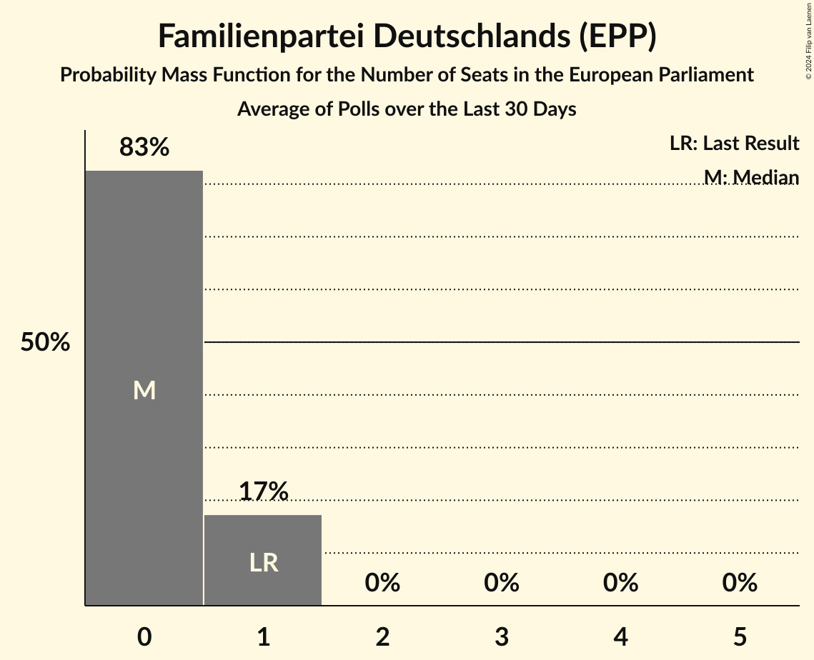

# Familienpartei Deutschlands (EPP)

<a href="#voting-intentions">Voting Intentions</a> | <a href="#seats">Seats</a>

## Voting Intentions

Last result: **0.0%** (General Election of 26 May 2019)

### Confidence Intervals

| Period     | Polling firm/Commissioner(s) | Median | 80% Confidence Interval | 90% Confidence Interval | 95% Confidence Interval | 99% Confidence Interval |
|:----------:|:----------------:|:-----------:|:-----------------------:|:-----------------------:|:-----------------------:|:-----------------------:|
| N/A | [Poll Average](average.html) | 0.4% | 0.2–0.6% | 0.1–0.7% | 0.1–0.8% | 0.1–1.0% |
| [17–20 February 2023](2023-02-20-INSAandYouGov.html) | INSA and YouGov | 0.2% | 0.2–0.5% | 0.1–0.5% | 0.1–0.6% | 0.1–0.7% |
| [15–20 February 2023](2023-02-20-GMS.html) | GMS | 0.3% | 0.2–0.7% | 0.1–0.8% | 0.1–0.9% | 0.1–1.1% |
| [14–20 February 2023](2023-02-20-Forsa.html) | Forsa | 0.4% | 0.2–0.6% | 0.2–0.6% | 0.2–0.7% | 0.1–0.8% |
| [13–17 February 2023](2023-02-17-INSAandYouGov.html) | INSA and YouGov | 0.2% | 0.1–0.6% | 0.1–0.7% | 0.1–0.7% | 0.0–0.9% |
| [14–16 February 2023](2023-02-16-ForschungsgruppeWahlen.html) | Forschungsgruppe Wahlen | 0.3% | 0.2–0.7% | 0.1–0.8% | 0.1–0.9% | 0.1–1.1% |
| [14–15 February 2023](2023-02-15-Infratestdimap.html) | Infratest dimap | 0.3% | 0.2–0.7% | 0.2–0.8% | 0.1–0.9% | 0.1–1.0% |
| [8–14 February 2023](2023-02-14-Kantar.html) | Kantar | 0.4% | 0.2–0.7% | 0.2–0.8% | 0.2–0.9% | 0.1–1.0% |
| [10–13 February 2023](2023-02-13-INSAandYouGov.html) | INSA and YouGov | 0.3% | N/A | N/A | N/A | N/A |
| [7–13 February 2023](2023-02-13-Forsa.html) | Forsa | 0.4% | 0.4–0.8% | 0.3–0.9% | 0.3–1.0% | 0.2–1.1% |
| [6–10 February 2023](2023-02-10-INSAandYouGov.html) | INSA and YouGov | 0.3% | N/A | N/A | N/A | N/A |
| [3–9 February 2023](2023-02-09-YouGov.html) | YouGov | 0.3% | 0.2–0.6% | 0.2–0.7% | 0.2–0.8% | 0.1–0.9% |
| [9 February 2023](2023-02-09-Allensbach.html) | Allensbach | 0.3% | 0.2–0.6% | 0.1–0.7% | 0.1–0.8% | 0.1–1.0% |
| [7 February 2023](2023-02-07-Kantar.html) | Kantar | 0.4% | 0.3–0.7% | 0.2–0.8% | 0.2–0.9% | 0.1–1.1% |
| [3–6 February 2023](2023-02-06-INSAandYouGov.html) | INSA and YouGov | 0.3% | 0.3–0.7% | 0.3–0.8% | 0.2–0.9% | 0.2–1.0% |
| [6 February 2023](2023-02-06-Forsa.html) | Forsa | 0.3% | 0.3–0.7% | 0.3–0.7% | 0.2–0.8% | 0.2–0.9% |
| [3 February 2023](2023-02-03-Ipsos.html) | Ipsos | 0.3% | 0.2–0.7% | 0.1–0.8% | 0.1–0.9% | 0.1–1.1% |
| [3 February 2023](2023-02-03-INSAandYouGov.html) | INSA and YouGov | 0.3% | 0.3–0.7% | 0.2–0.8% | 0.2–0.9% | 0.1–1.1% |
| [1 February 2023](2023-02-01-Infratestdimap.html) | Infratest dimap | 0.4% | 0.4–0.9% | 0.3–1.0% | 0.3–1.1% | 0.2–1.3% |
| [25–31 January 2023](2023-01-31-Kantar.html) | Kantar | 0.4% | 0.2–0.7% | 0.2–0.7% | 0.2–0.8% | 0.1–1.0% |
| [27–30 January 2023](2023-01-30-INSAandYouGov.html) | INSA and YouGov | 0.3% | 0.2–0.5% | 0.2–0.6% | 0.1–0.7% | 0.1–0.8% |
| [24–30 January 2023](2023-01-30-Forsa.html) | Forsa | 0.4% | 0.2–0.6% | 0.2–0.6% | 0.2–0.7% | 0.1–0.8% |
| [24–27 January 2023](2023-01-27-INSAandYouGov.html) | INSA and YouGov | 0.3% | N/A | N/A | N/A | N/A |
| [24–26 January 2023](2023-01-26-ForschungsgruppeWahlen.html) | Forschungsgruppe Wahlen | 0.2% | 0.1–0.5% | 0.1–0.6% | 0.1–0.7% | 0.0–0.9% |
| [18–24 January 2023](2023-01-24-Kantar.html) | Kantar | 0.3% | N/A | N/A | N/A | N/A |
| [20–23 January 2023](2023-01-23-INSAandYouGov.html) | INSA and YouGov | 0.3% | N/A | N/A | N/A | N/A |
| [17–23 January 2023](2023-01-23-Forsa.html) | Forsa | 0.4% | N/A | N/A | N/A | N/A |
| [16–21 January 2023](2023-01-21-INSAandYouGov.html) | INSA and YouGov | 0.3% | 0.4–0.9% | 0.3–1.0% | 0.3–1.1% | 0.2–1.2% |
| [17–18 January 2023](2023-01-18-Infratestdimap.html) | Infratest dimap | 0.3% | 0.2–0.7% | 0.2–0.8% | 0.1–0.9% | 0.1–1.0% |
| [5–18 January 2023](2023-01-18-Allensbach.html) | Allensbach | 0.3% | 0.2–0.7% | 0.1–0.8% | 0.1–0.9% | 0.1–1.1% |
| [11–17 January 2023](2023-01-17-Kantar.html) | Kantar | 0.4% | 0.3–0.7% | 0.2–0.8% | 0.2–0.9% | 0.1–1.1% |
| [13–16 January 2023](2023-01-16-INSAandYouGov.html) | INSA and YouGov | 0.3% | 0.3–0.7% | 0.2–0.7% | 0.2–0.8% | 0.2–0.9% |
| [10–16 January 2023](2023-01-16-Forsa.html) | Forsa | 0.4% | 0.4–0.8% | 0.3–0.9% | 0.3–1.0% | 0.2–1.1% |
| [9–13 January 2023](2023-01-13-INSAandYouGov.html) | INSA and YouGov | 0.3% | 0.3–0.9% | 0.3–1.0% | 0.2–1.1% | 0.2–1.3% |
| [10–12 January 2023](2023-01-12-ForschungsgruppeWahlen.html) | Forschungsgruppe Wahlen | 0.2% | 0.2–0.7% | 0.1–0.8% | 0.1–0.9% | 0.1–1.2% |
| [6–10 January 2023](2023-01-10-YouGov.html) | YouGov | 0.3% | 0.2–0.5% | 0.1–0.6% | 0.1–0.7% | 0.1–0.8% |
| [4–10 January 2023](2023-01-10-Kantar.html) | Kantar | 0.4% | 0.4–0.9% | 0.3–1.0% | 0.3–1.1% | 0.2–1.3% |
| [9–10 January 2023](2023-01-10-Ipsos.html) | Ipsos | 0.3% | 0.2–0.7% | 0.1–0.8% | 0.1–0.9% | 0.1–1.1% |
| [6–9 January 2023](2023-01-09-INSAandYouGov.html) | INSA and YouGov | 0.3% | N/A | N/A | N/A | N/A |
| [3–9 January 2023](2023-01-09-Forsa.html) | Forsa | 0.3% | 0.3–0.7% | 0.3–0.8% | 0.2–0.9% | 0.2–1.0% |
| [2–6 January 2023](2023-01-06-INSAandYouGov.html) | INSA and YouGov | 0.3% | 0.3–0.8% | 0.3–0.9% | 0.2–1.0% | 0.2–1.2% |
| [2–4 January 2023](2023-01-04-Infratestdimap.html) | Infratest dimap | 0.3% | 0.3–0.8% | 0.2–0.9% | 0.2–1.0% | 0.2–1.2% |
| [3 January 2023](2023-01-03-GMS.html) | GMS | 0.4% | 0.2–0.8% | 0.2–0.9% | 0.2–1.0% | 0.1–1.3% |
| [2 January 2023](2023-01-02-INSAandYouGov.html) | INSA and YouGov | 0.3% | N/A | N/A | N/A | N/A |
| [27–29 December 2022](2022-12-29-INSAandYouGov.html) | INSA and YouGov | 0.5% | 0.3–0.9% | 0.3–1.0% | 0.2–1.1% | 0.2–1.3% |
| [19–22 December 2022](2022-12-22-INSAandYouGov.html) | INSA and YouGov | 0.4% | 0.3–0.8% | 0.2–0.9% | 0.2–1.0% | 0.1–1.2% |
| [16–21 December 2022](2022-12-21-YouGov.html) | YouGov | 0.5% | 0.3–0.8% | 0.3–0.9% | 0.2–1.0% | 0.2–1.2% |
| [16–19 December 2022](2022-12-19-INSAandYouGov.html) | INSA and YouGov | 0.4% | 0.3–0.7% | 0.3–0.8% | 0.2–0.9% | 0.2–1.0% |
| [13–19 December 2022](2022-12-19-Forsa.html) | Forsa | 0.5% | 0.4–0.8% | 0.3–0.9% | 0.3–1.0% | 0.2–1.1% |
| [12–16 December 2022](2022-12-16-INSAandYouGov.html) | INSA and YouGov | 0.4% | N/A | N/A | N/A | N/A |
| [13–15 December 2022](2022-12-15-Kantar.html) | Kantar | 0.5% | 0.3–0.8% | 0.3–0.9% | 0.2–0.9% | 0.2–1.1% |
| [12–15 December 2022](2022-12-15-ForschungsgruppeWahlen.html) | Forschungsgruppe Wahlen | 0.4% | 0.2–0.8% | 0.2–0.9% | 0.2–1.0% | 0.1–1.2% |
| [2–15 December 2022](2022-12-15-Allensbach.html) | Allensbach | 0.3% | 0.2–0.7% | 0.1–0.7% | 0.1–0.9% | 0.1–1.1% |
| [7–12 December 2022](2022-12-12-Kantar.html) | Kantar | 0.5% | 0.3–0.8% | 0.3–0.9% | 0.2–1.0% | 0.2–1.2% |
| [9–12 December 2022](2022-12-12-INSAandYouGov.html) | INSA and YouGov | 0.4% | 0.3–0.7% | 0.2–0.7% | 0.2–0.8% | 0.2–0.9% |
| [6–12 December 2022](2022-12-12-Forsa.html) | Forsa | 0.5% | 0.4–0.8% | 0.3–0.9% | 0.3–1.0% | 0.2–1.1% |
| [2–9 December 2022](2022-12-09-INSAandYouGov.html) | INSA and YouGov | 0.5% | N/A | N/A | N/A | N/A |
| [6–7 December 2022](2022-12-07-Infratestdimap.html) | Infratest dimap | 0.5% | 0.3–0.8% | 0.3–0.9% | 0.2–1.0% | 0.2–1.2% |
| [6 December 2022](2022-12-06-Kantar.html) | Kantar | 0.5% | 0.3–0.8% | 0.3–0.9% | 0.2–1.0% | 0.2–1.2% |
| [3–5 December 2022](2022-12-05-INSAandYouGov.html) | INSA and YouGov | 0.4% | N/A | N/A | N/A | N/A |
| [5 December 2022](2022-12-05-Forsa.html) | Forsa | 0.5% | N/A | N/A | N/A | N/A |
| [2–3 December 2022](2022-12-03-Ipsos.html) | Ipsos | 0.5% | 0.3–0.9% | 0.3–1.1% | 0.2–1.2% | 0.2–1.4% |
| [2 December 2022](2022-12-02-INSAandYouGov.html) | INSA and YouGov | 0.5% | N/A | N/A | N/A | N/A |
| [1 December 2022](2022-12-01-GMS.html) | GMS | 0.6% | 0.4–1.1% | 0.3–1.2% | 0.3–1.3% | 0.2–1.6% |
| [28–30 November 2022](2022-11-30-Infratestdimap.html) | Infratest dimap | 0.5% | 0.4–0.9% | 0.3–1.0% | 0.3–1.1% | 0.2–1.3% |
| [22–29 November 2022](2022-11-29-Kantar.html) | Kantar | 0.5% | 0.3–0.8% | 0.3–0.9% | 0.2–1.0% | 0.2–1.2% |
| [25–28 November 2022](2022-11-28-INSAandYouGov.html) | INSA and YouGov | 0.4% | 0.3–0.7% | 0.3–0.8% | 0.2–0.9% | 0.2–1.0% |
| [22–28 November 2022](2022-11-28-Forsa.html) | Forsa | 0.5% | 0.4–0.8% | 0.3–0.9% | 0.3–1.0% | 0.2–1.1% |
| [21–25 November 2022](2022-11-25-INSAandYouGov.html) | INSA and YouGov | 0.4% | N/A | N/A | N/A | N/A |
| [22–24 November 2022](2022-11-24-ForschungsgruppeWahlen.html) | Forschungsgruppe Wahlen | 0.3% | 0.2–0.7% | 0.1–0.8% | 0.1–0.9% | 0.1–1.2% |
| [15–22 November 2022](2022-11-22-Kantar.html) | Kantar | 0.5% | N/A | N/A | N/A | N/A |
| [18–21 November 2022](2022-11-21-INSAandYouGov.html) | INSA and YouGov | 0.4% | 0.3–0.7% | 0.3–0.8% | 0.2–0.9% | 0.2–1.0% |
| [15–21 November 2022](2022-11-21-Forsa.html) | Forsa | 0.5% | 0.4–0.8% | 0.3–0.9% | 0.3–1.0% | 0.2–1.1% |
| [14–18 November 2022](2022-11-18-INSAandYouGov.html) | INSA and YouGov | 0.5% | N/A | N/A | N/A | N/A |
| [5–17 November 2022](2022-11-17-Allensbach.html) | Allensbach | 0.3% | 0.2–0.6% | 0.1–0.7% | 0.1–0.8% | 0.1–1.1% |
| [9–15 November 2022](2022-11-15-Kantar.html) | Kantar | 0.5% | 0.3–0.8% | 0.3–0.9% | 0.2–1.0% | 0.2–1.2% |
| [11–14 November 2022](2022-11-14-INSAandYouGov.html) | INSA and YouGov | 0.4% | 0.3–0.7% | 0.3–0.8% | 0.2–0.9% | 0.2–1.0% |
| [8–14 November 2022](2022-11-14-Forsa.html) | Forsa | 0.5% | 0.4–0.8% | 0.3–0.9% | 0.3–1.0% | 0.2–1.1% |
| [8–11 November 2022](2022-11-11-INSAandYouGov.html) | INSA and YouGov | 0.4% | 0.2–0.7% | 0.2–0.8% | 0.2–0.9% | 0.1–1.1% |
| [8–10 November 2022](2022-11-10-ForschungsgruppeWahlen.html) | Forschungsgruppe Wahlen | 0.3% | 0.2–0.7% | 0.1–0.8% | 0.1–0.9% | 0.1–1.1% |
| [4–9 November 2022](2022-11-09-YouGov.html) | YouGov | 0.3% | 0.2–0.6% | 0.2–0.7% | 0.1–0.7% | 0.1–0.9% |
| [8–9 November 2022](2022-11-09-Infratestdimap.html) | Infratest dimap | 0.6% | 0.4–1.0% | 0.3–1.1% | 0.3–1.2% | 0.2–1.4% |
| [2–8 November 2022](2022-11-08-Kantar.html) | Kantar | 0.4% | 0.3–0.7% | 0.2–0.8% | 0.2–0.9% | 0.1–1.1% |
| [4–7 November 2022](2022-11-07-Ipsos.html) | Ipsos | 0.5% | 0.3–0.9% | 0.3–1.1% | 0.2–1.2% | 0.2–1.4% |
| [4–7 November 2022](2022-11-07-INSAandYouGov.html) | INSA and YouGov | 0.4% | 0.3–0.7% | 0.3–0.8% | 0.2–0.9% | 0.2–1.0% |
| [1–7 November 2022](2022-11-07-Forsa.html) | Forsa | 0.5% | 0.4–0.8% | 0.3–0.9% | 0.3–1.0% | 0.2–1.1% |
| [1–4 November 2022](2022-11-04-INSAandYouGov.html) | INSA and YouGov | 0.4% | 0.2–0.7% | 0.2–0.8% | 0.2–0.9% | 0.1–1.1% |
| [2 November 2022](2022-11-02-Kantar.html) | Kantar | 0.4% | 0.2–0.7% | 0.2–0.8% | 0.2–0.9% | 0.1–1.0% |
| [2 November 2022](2022-11-02-Infratestdimap.html) | Infratest dimap | 0.5% | 0.4–0.9% | 0.3–1.0% | 0.3–1.1% | 0.2–1.3% |
| [28–31 October 2022](2022-10-31-INSAandYouGov.html) | INSA and YouGov | 0.4% | 0.3–0.7% | 0.2–0.7% | 0.2–0.8% | 0.2–0.9% |
| [25–31 October 2022](2022-10-31-Forsa.html) | Forsa | 0.5% | 0.4–0.8% | 0.3–0.9% | 0.3–1.0% | 0.2–1.1% |
| [24–28 October 2022](2022-10-28-INSAandYouGov.html) | INSA and YouGov | 0.4% | N/A | N/A | N/A | N/A |
| [19–25 October 2022](2022-10-25-Kantar.html) | Kantar | 0.4% | 0.3–0.8% | 0.2–0.9% | 0.2–0.9% | 0.1–1.1% |
| [19–25 October 2022](2022-10-25-GMS.html) | GMS | 0.5% | 0.3–0.9% | 0.3–1.1% | 0.2–1.2% | 0.2–1.4% |
| [21–24 October 2022](2022-10-24-INSAandYouGov.html) | INSA and YouGov | 0.4% | 0.3–0.7% | 0.3–0.8% | 0.2–0.9% | 0.2–1.0% |
| [18–24 October 2022](2022-10-24-Forsa.html) | Forsa | 0.5% | 0.4–0.8% | 0.3–0.9% | 0.3–0.9% | 0.2–1.1% |
| [17–21 October 2022](2022-10-21-INSAandYouGov.html) | INSA and YouGov | 0.4% | N/A | N/A | N/A | N/A |
| [18–20 October 2022](2022-10-20-ForschungsgruppeWahlen.html) | Forschungsgruppe Wahlen | 0.4% | 0.2–0.7% | 0.2–0.9% | 0.1–0.9% | 0.1–1.2% |
| [12–18 October 2022](2022-10-18-Kantar.html) | Kantar | 0.5% | 0.3–0.8% | 0.3–0.9% | 0.2–1.0% | 0.2–1.2% |
| [14–17 October 2022](2022-10-17-INSAandYouGov.html) | INSA and YouGov | 0.4% | 0.3–0.7% | 0.2–0.7% | 0.2–0.8% | 0.2–0.9% |
| [11–17 October 2022](2022-10-17-Forsa.html) | Forsa | 0.5% | 0.4–0.8% | 0.3–0.8% | 0.3–0.9% | 0.2–1.0% |
| [10–14 October 2022](2022-10-14-INSAandYouGov.html) | INSA and YouGov | 0.4% | 0.2–0.7% | 0.2–0.8% | 0.2–0.9% | 0.1–1.1% |
| [1–13 October 2022](2022-10-13-Allensbach.html) | Allensbach | 0.3% | 0.2–0.7% | 0.1–0.8% | 0.1–0.9% | 0.1–1.1% |
| [7–12 October 2022](2022-10-12-YouGov.html) | YouGov | 0.5% | 0.3–0.8% | 0.3–0.9% | 0.2–1.0% | 0.2–1.2% |
| [11–12 October 2022](2022-10-12-Infratestdimap.html) | Infratest dimap | 0.5% | 0.3–0.9% | 0.3–1.0% | 0.2–1.1% | 0.2–1.3% |
| [5–11 October 2022](2022-10-11-Kantar.html) | Kantar | 0.4% | 0.3–0.7% | 0.2–0.8% | 0.2–0.9% | 0.1–1.1% |
| [4–10 October 2022](2022-10-10-INSAandYouGov.html) | INSA and YouGov | 0.3% | 0.2–0.6% | 0.2–0.7% | 0.2–0.7% | 0.1–0.9% |
| [4–10 October 2022](2022-10-10-Forsa.html) | Forsa | 0.5% | 0.4–0.8% | 0.3–0.9% | 0.3–1.0% | 0.2–1.1% |
| [7–9 October 2022](2022-10-09-Ipsos.html) | Ipsos | 0.5% | 0.3–0.9% | 0.3–1.1% | 0.2–1.2% | 0.2–1.4% |
| [4–7 October 2022](2022-10-07-INSAandYouGov.html) | INSA and YouGov | 0.4% | 0.2–0.7% | 0.2–0.8% | 0.2–0.9% | 0.1–1.1% |
| [3–5 October 2022](2022-10-05-Infratestdimap.html) | Infratest dimap | 0.5% | 0.4–0.9% | 0.3–1.0% | 0.3–1.1% | 0.2–1.3% |
| [4 October 2022](2022-10-04-Kantar.html) | Kantar | 0.4% | 0.2–0.6% | 0.2–0.7% | 0.2–0.8% | 0.1–0.9% |
| [3 October 2022](2022-10-03-INSAandYouGov.html) | INSA and YouGov | 0.3% | 0.2–0.6% | 0.2–0.7% | 0.2–0.7% | 0.1–0.9% |
| [26–30 September 2022](2022-09-30-INSAandYouGov.html) | INSA and YouGov | 0.3% | 0.2–0.7% | 0.2–0.8% | 0.1–0.9% | 0.1–1.0% |
| [27–30 September 2022](2022-09-30-Forsa.html) | Forsa | 0.5% | 0.4–0.9% | 0.3–1.0% | 0.3–1.1% | 0.2–1.2% |
| [27–29 September 2022](2022-09-29-ForschungsgruppeWahlen.html) | Forschungsgruppe Wahlen | 0.4% | 0.2–0.8% | 0.2–0.9% | 0.2–1.0% | 0.1–1.3% |
| [22–27 September 2022](2022-09-27-Kantar.html) | Kantar | 0.4% | 0.3–0.8% | 0.2–0.9% | 0.2–0.9% | 0.1–1.1% |
| [23–26 September 2022](2022-09-26-INSAandYouGov.html) | INSA and YouGov | 0.4% | 0.2–0.6% | 0.2–0.7% | 0.2–0.8% | 0.1–0.9% |
| [20–26 September 2022](2022-09-26-Forsa.html) | Forsa | 0.5% | N/A | N/A | N/A | N/A |
| [19–23 September 2022](2022-09-23-INSAandYouGov.html) | INSA and YouGov | 0.4% | N/A | N/A | N/A | N/A |
| [14–20 September 2022](2022-09-20-Kantar.html) | Kantar | 0.5% | 0.3–0.8% | 0.3–0.9% | 0.2–1.0% | 0.2–1.2% |
| [14–20 September 2022](2022-09-20-GMS.html) | GMS | 0.5% | 0.3–0.9% | 0.3–1.1% | 0.2–1.2% | 0.2–1.4% |
| [16–19 September 2022](2022-09-19-INSAandYouGov.html) | INSA and YouGov | 0.4% | 0.3–0.6% | 0.2–0.7% | 0.2–0.8% | 0.1–0.9% |
| [13–19 September 2022](2022-09-19-Forsa.html) | Forsa | 0.5% | 0.4–0.8% | 0.3–0.8% | 0.3–0.9% | 0.2–1.0% |
| [12–16 September 2022](2022-09-16-INSAandYouGov.html) | INSA and YouGov | 0.5% | 0.3–0.8% | 0.3–0.9% | 0.2–1.0% | 0.2–1.2% |
| [13–14 September 2022](2022-09-14-Infratestdimap.html) | Infratest dimap | 0.5% | 0.3–0.9% | 0.3–1.0% | 0.2–1.1% | 0.2–1.3% |
| [1–14 September 2022](2022-09-14-Allensbach.html) | Allensbach | 0.3% | 0.2–0.7% | 0.1–0.8% | 0.1–0.9% | 0.1–1.1% |
| [9–13 September 2022](2022-09-13-YouGov.html) | YouGov | 0.5% | 0.3–0.8% | 0.3–0.9% | 0.2–1.0% | 0.2–1.1% |
| [7–13 September 2022](2022-09-13-Kantar.html) | Kantar | 0.5% | 0.3–0.8% | 0.3–0.9% | 0.2–1.0% | 0.2–1.2% |
| [6–13 September 2022](2022-09-13-Forsa.html) | Forsa | 0.5% | N/A | N/A | N/A | N/A |
| [9–12 September 2022](2022-09-12-INSAandYouGov.html) | INSA and YouGov | 0.4% | N/A | N/A | N/A | N/A |
| [5–9 September 2022](2022-09-09-INSAandYouGov.html) | INSA and YouGov | 0.5% | N/A | N/A | N/A | N/A |
| [6–8 September 2022](2022-09-08-ForschungsgruppeWahlen.html) | Forschungsgruppe Wahlen | 0.3% | 0.2–0.7% | 0.1–0.8% | 0.1–0.9% | 0.1–1.1% |
| [6 September 2022](2022-09-06-Kantar.html) | Kantar | 0.5% | 0.3–0.8% | 0.3–0.9% | 0.2–1.0% | 0.2–1.2% |
| [2–5 September 2022](2022-09-05-INSAandYouGov.html) | INSA and YouGov | 0.4% | 0.3–0.7% | 0.2–0.7% | 0.2–0.8% | 0.2–0.9% |
| [5 September 2022](2022-09-05-Forsa.html) | Forsa | 0.5% | 0.4–0.8% | 0.3–0.9% | 0.3–1.0% | 0.2–1.1% |
| [2–4 September 2022](2022-09-04-Ipsos.html) | Ipsos | 0.5% | 0.3–0.9% | 0.3–1.1% | 0.2–1.2% | 0.2–1.4% |
| [2 September 2022](2022-09-02-INSAandYouGov.html) | INSA and YouGov | 0.4% | N/A | N/A | N/A | N/A |
| [29–31 August 2022](2022-08-31-Infratestdimap.html) | Infratest dimap | 0.5% | 0.3–0.8% | 0.2–0.9% | 0.2–1.0% | 0.2–1.2% |
| [24–30 August 2022](2022-08-30-Kantar.html) | Kantar | 0.4% | 0.3–0.7% | 0.2–0.8% | 0.2–0.9% | 0.1–1.1% |
| [26–29 August 2022](2022-08-29-INSAandYouGov.html) | INSA and YouGov | 0.4% | 0.2–0.6% | 0.2–0.7% | 0.2–0.7% | 0.1–0.9% |
| [23–29 August 2022](2022-08-29-Forsa.html) | Forsa | 0.5% | 0.4–0.8% | 0.3–0.9% | 0.3–1.0% | 0.2–1.1% |
| [22–26 August 2022](2022-08-26-INSAandYouGov.html) | INSA and YouGov | 0.3% | N/A | N/A | N/A | N/A |
| [17–23 August 2022](2022-08-23-Kantar.html) | Kantar | 0.4% | 0.3–0.7% | 0.2–0.8% | 0.2–0.9% | 0.1–1.1% |
| [19–22 August 2022](2022-08-22-INSAandYouGov.html) | INSA and YouGov | 0.4% | 0.3–0.6% | 0.2–0.7% | 0.2–0.8% | 0.1–0.9% |
| [16–22 August 2022](2022-08-22-Forsa.html) | Forsa | 0.5% | 0.4–0.8% | 0.3–0.9% | 0.3–1.0% | 0.2–1.1% |
| [15–19 August 2022](2022-08-19-INSAandYouGov.html) | INSA and YouGov | 0.4% | 0.3–0.7% | 0.2–0.8% | 0.2–0.9% | 0.1–1.1% |
| [5–18 August 2022](2022-08-18-Allensbach.html) | Allensbach | 0.3% | 0.2–0.7% | 0.1–0.7% | 0.1–0.9% | 0.1–1.1% |
| [16–17 August 2022](2022-08-17-Infratestdimap.html) | Infratest dimap | 0.5% | 0.3–0.8% | 0.2–0.9% | 0.2–1.0% | 0.2–1.2% |
| [10–16 August 2022](2022-08-16-Kantar.html) | Kantar | 0.4% | 0.3–0.7% | 0.2–0.8% | 0.2–0.9% | 0.1–1.1% |
| [12–15 August 2022](2022-08-15-INSAandYouGov.html) | INSA and YouGov | 0.3% | 0.2–0.5% | 0.2–0.6% | 0.2–0.7% | 0.1–0.8% |
| [9–15 August 2022](2022-08-15-Forsa.html) | Forsa | 0.6% | 0.4–0.9% | 0.3–0.9% | 0.3–1.0% | 0.2–1.2% |
| [8–12 August 2022](2022-08-12-INSAandYouGov.html) | INSA and YouGov | 0.3% | N/A | N/A | N/A | N/A |
| [9–11 August 2022](2022-08-11-ForschungsgruppeWahlen.html) | Forschungsgruppe Wahlen | 0.4% | 0.2–0.8% | 0.2–0.9% | 0.2–1.0% | 0.1–1.2% |
| [5–10 August 2022](2022-08-10-YouGov.html) | YouGov | 0.4% | 0.3–0.7% | 0.2–0.8% | 0.2–0.9% | 0.2–1.1% |
| [3–9 August 2022](2022-08-09-Kantar.html) | Kantar | 0.4% | 0.3–0.7% | 0.2–0.8% | 0.2–0.9% | 0.1–1.1% |
| [5–8 August 2022](2022-08-08-Ipsos.html) | Ipsos | 0.5% | 0.3–0.9% | 0.3–1.1% | 0.2–1.2% | 0.2–1.4% |
| [5–8 August 2022](2022-08-08-INSAandYouGov.html) | INSA and YouGov | 0.4% | N/A | N/A | N/A | N/A |
| [2–8 August 2022](2022-08-08-Forsa.html) | Forsa | 0.5% | N/A | N/A | N/A | N/A |
| [1–5 August 2022](2022-08-05-INSAandYouGov.html) | INSA and YouGov | 0.4% | N/A | N/A | N/A | N/A |
| [1–3 August 2022](2022-08-03-Infratestdimap.html) | Infratest dimap | 0.5% | 0.3–0.8% | 0.2–0.9% | 0.2–1.0% | 0.2–1.2% |
| [2 August 2022](2022-08-02-Kantar.html) | Kantar | 0.5% | N/A | N/A | N/A | N/A |
| [1 August 2022](2022-08-01-INSAandYouGov.html) | INSA and YouGov | 0.5% | N/A | N/A | N/A | N/A |
| [1 August 2022](2022-08-01-Forsa.html) | Forsa | 0.5% | N/A | N/A | N/A | N/A |
| [25–29 July 2022](2022-07-29-INSAandYouGov.html) | INSA and YouGov | 0.4% | 0.3–0.8% | 0.2–0.9% | 0.2–1.0% | 0.1–1.2% |
| [19–26 July 2022](2022-07-26-Kantar.html) | Kantar | 0.4% | 0.3–0.7% | 0.2–0.8% | 0.2–0.9% | 0.1–1.1% |
| [22–25 July 2022](2022-07-25-INSAandYouGov.html) | INSA and YouGov | 0.4% | N/A | N/A | N/A | N/A |
| [20–25 July 2022](2022-07-25-GMS.html) | GMS | 0.5% | 0.3–0.9% | 0.3–1.1% | 0.2–1.2% | 0.2–1.4% |
| [19–25 July 2022](2022-07-25-Forsa.html) | Forsa | 0.6% | 0.4–0.9% | 0.4–0.9% | 0.3–1.0% | 0.2–1.2% |
| [18–22 July 2022](2022-07-22-INSAandYouGov.html) | INSA and YouGov | 0.4% | 0.3–0.7% | 0.2–0.8% | 0.2–0.9% | 0.1–1.1% |
| [8–21 July 2022](2022-07-21-Allensbach.html) | Allensbach | 0.3% | 0.2–0.7% | 0.1–0.8% | 0.1–0.9% | 0.1–1.1% |
| [19–20 July 2022](2022-07-20-Infratestdimap.html) | Infratest dimap | 0.5% | 0.3–0.9% | 0.3–1.0% | 0.2–1.1% | 0.2–1.3% |
| [13–19 July 2022](2022-07-19-Kantar.html) | Kantar | 0.5% | 0.3–0.9% | 0.3–0.9% | 0.2–1.0% | 0.2–1.2% |
| [15–18 July 2022](2022-07-18-INSAandYouGov.html) | INSA and YouGov | 0.5% | 0.3–0.7% | 0.3–0.8% | 0.3–0.9% | 0.2–1.0% |
| [12–18 July 2022](2022-07-18-Forsa.html) | Forsa | 0.6% | 0.4–0.8% | 0.4–0.9% | 0.3–0.9% | 0.3–1.1% |
| [11–15 July 2022](2022-07-15-INSAandYouGov.html) | INSA and YouGov | 0.5% | N/A | N/A | N/A | N/A |
| [12–14 July 2022](2022-07-14-ForschungsgruppeWahlen.html) | Forschungsgruppe Wahlen | 0.3% | 0.2–0.8% | 0.2–0.9% | 0.1–1.0% | 0.1–1.2% |
| [6–12 July 2022](2022-07-12-Kantar.html) | Kantar | 0.4% | 0.3–0.7% | 0.2–0.8% | 0.2–0.9% | 0.1–1.1% |
| [8–11 July 2022](2022-07-11-INSAandYouGov.html) | INSA and YouGov | 0.4% | 0.3–0.7% | 0.3–0.8% | 0.2–0.8% | 0.2–1.0% |
| [5–11 July 2022](2022-07-11-Forsa.html) | Forsa | 0.6% | 0.4–0.9% | 0.4–0.9% | 0.3–1.0% | 0.2–1.2% |
| [4–8 July 2022](2022-07-08-INSAandYouGov.html) | INSA and YouGov | 0.5% | N/A | N/A | N/A | N/A |
| [4–6 July 2022](2022-07-06-Infratestdimap.html) | Infratest dimap | 0.5% | 0.3–0.8% | 0.2–0.9% | 0.2–1.0% | 0.2–1.2% |
| [1–5 July 2022](2022-07-05-YouGov.html) | YouGov | 0.5% | 0.3–0.8% | 0.3–0.9% | 0.2–1.0% | 0.2–1.1% |
| [5 July 2022](2022-07-05-Kantar.html) | Kantar | 0.5% | 0.3–0.8% | 0.3–0.9% | 0.2–1.0% | 0.2–1.2% |
| [1–4 July 2022](2022-07-04-INSAandYouGov.html) | INSA and YouGov | 0.4% | N/A | N/A | N/A | N/A |
| [4 July 2022](2022-07-04-Forsa.html) | Forsa | 0.5% | N/A | N/A | N/A | N/A |
| [1–2 July 2022](2022-07-02-Ipsos.html) | Ipsos | 0.5% | 0.3–0.9% | 0.3–1.1% | 0.2–1.2% | 0.2–1.4% |
| [2 July 2022](2022-07-02-INSAandYouGov.html) | INSA and YouGov | 0.4% | N/A | N/A | N/A | N/A |
| [28–30 June 2022](2022-06-30-ForschungsgruppeWahlen.html) | Forschungsgruppe Wahlen | 0.3% | 0.2–0.7% | 0.1–0.8% | 0.1–0.9% | 0.1–1.1% |
| [21–28 June 2022](2022-06-28-Kantar.html) | Kantar | 0.4% | 0.3–0.7% | 0.2–0.8% | 0.2–0.9% | 0.1–1.1% |
| [24–27 June 2022](2022-06-27-INSAandYouGov.html) | INSA and YouGov | 0.5% | 0.3–0.7% | 0.3–0.8% | 0.3–0.9% | 0.2–1.0% |
| [21–27 June 2022](2022-06-27-Forsa.html) | Forsa | 0.5% | 0.4–0.8% | 0.3–0.9% | 0.3–0.9% | 0.2–1.1% |
| [20–24 June 2022](2022-06-24-INSAandYouGov.html) | INSA and YouGov | 0.4% | N/A | N/A | N/A | N/A |
| [21–22 June 2022](2022-06-22-Infratestdimap.html) | Infratest dimap | 0.4% | 0.2–0.7% | 0.2–0.9% | 0.2–0.9% | 0.1–1.1% |
| [14–21 June 2022](2022-06-21-Kantar.html) | Kantar | 0.5% | N/A | N/A | N/A | N/A |
| [17–20 June 2022](2022-06-20-INSAandYouGov.html) | INSA and YouGov | 0.4% | 0.3–0.7% | 0.3–0.8% | 0.2–0.8% | 0.2–1.0% |
| [15–20 June 2022](2022-06-20-GMS.html) | GMS | 0.5% | 0.3–0.9% | 0.3–1.1% | 0.2–1.2% | 0.2–1.4% |
| [14–20 June 2022](2022-06-20-Forsa.html) | Forsa | 0.5% | 0.4–0.8% | 0.3–0.9% | 0.3–1.0% | 0.2–1.1% |
| [13–17 June 2022](2022-06-17-INSAandYouGov.html) | INSA and YouGov | 0.5% | N/A | N/A | N/A | N/A |
| [3–17 June 2022](2022-06-17-Allensbach.html) | Allensbach | 0.3% | 0.2–0.6% | 0.1–0.7% | 0.1–0.8% | 0.1–1.1% |
| [13–15 June 2022](2022-06-15-ForschungsgruppeWahlen.html) | Forschungsgruppe Wahlen | 0.3% | 0.2–0.8% | 0.2–0.9% | 0.1–1.0% | 0.1–1.2% |
| [8–14 June 2022](2022-06-14-Kantar.html) | Kantar | 0.5% | 0.4–0.8% | 0.3–0.9% | 0.3–1.0% | 0.2–1.1% |
| [10–13 June 2022](2022-06-13-INSAandYouGov.html) | INSA and YouGov | 0.4% | N/A | N/A | N/A | N/A |
| [7–13 June 2022](2022-06-13-Forsa.html) | Forsa | 0.5% | N/A | N/A | N/A | N/A |
| [7–10 June 2022](2022-06-10-INSAandYouGov.html) | INSA and YouGov | 0.4% | N/A | N/A | N/A | N/A |
| [3–7 June 2022](2022-06-07-YouGov.html) | YouGov | 0.4% | 0.2–0.7% | 0.2–0.7% | 0.2–0.8% | 0.1–1.0% |
| [1–7 June 2022](2022-06-07-Kantar.html) | Kantar | 0.5% | 0.3–0.8% | 0.3–0.9% | 0.2–1.0% | 0.2–1.2% |
| [3–7 June 2022](2022-06-07-Ipsos.html) | Ipsos | 0.5% | 0.3–0.9% | 0.3–1.1% | 0.2–1.2% | 0.2–1.4% |
| [3–7 June 2022](2022-06-07-INSAandYouGov.html) | INSA and YouGov | 0.4% | 0.3–0.7% | 0.3–0.8% | 0.2–0.8% | 0.2–1.0% |
| [3 June 2022](2022-06-03-INSAandYouGov.html) | INSA and YouGov | 0.5% | 0.4–0.9% | 0.3–1.0% | 0.3–1.1% | 0.2–1.2% |
| [3 June 2022](2022-06-03-Forsa.html) | Forsa | 0.5% | 0.3–0.8% | 0.3–0.9% | 0.2–1.0% | 0.2–1.2% |
| [1 June 2022](2022-06-01-Infratestdimap.html) | Infratest dimap | 0.5% | 0.3–0.9% | 0.3–1.0% | 0.2–1.1% | 0.2–1.3% |
| [24–31 May 2022](2022-05-31-Kantar.html) | Kantar | 0.5% | 0.3–0.8% | 0.3–0.9% | 0.2–1.0% | 0.2–1.2% |
| [27–30 May 2022](2022-05-30-INSAandYouGov.html) | INSA and YouGov | 0.5% | 0.3–0.8% | 0.3–0.8% | 0.3–0.9% | 0.2–1.1% |
| [25–30 May 2022](2022-05-30-GMS.html) | GMS | 0.5% | 0.3–0.9% | 0.3–1.1% | 0.2–1.2% | 0.2–1.4% |
| [24–30 May 2022](2022-05-30-Forsa.html) | Forsa | 0.4% | 0.3–0.7% | 0.2–0.8% | 0.2–0.9% | 0.2–1.1% |
| [23–27 May 2022](2022-05-27-INSAandYouGov.html) | INSA and YouGov | 0.5% | N/A | N/A | N/A | N/A |
| [17–24 May 2022](2022-05-24-Kantar.html) | Kantar | 0.5% | N/A | N/A | N/A | N/A |
| [20–23 May 2022](2022-05-23-INSAandYouGov.html) | INSA and YouGov | 0.4% | 0.3–0.7% | 0.2–0.7% | 0.2–0.8% | 0.2–1.0% |
| [17–23 May 2022](2022-05-23-Forsa.html) | Forsa | 0.5% | 0.3–0.7% | 0.3–0.8% | 0.2–0.9% | 0.2–1.0% |
| [16–20 May 2022](2022-05-20-INSAandYouGov.html) | INSA and YouGov | 0.5% | N/A | N/A | N/A | N/A |
| [17–19 May 2022](2022-05-19-ForschungsgruppeWahlen.html) | Forschungsgruppe Wahlen | 0.4% | 0.3–0.9% | 0.2–1.0% | 0.2–1.1% | 0.1–1.4% |
| [6–18 May 2022](2022-05-18-Allensbach.html) | Allensbach | 0.3% | 0.2–0.6% | 0.1–0.7% | 0.1–0.8% | 0.0–1.0% |
| [11–17 May 2022](2022-05-17-Kantar.html) | Kantar | 0.4% | 0.3–0.7% | 0.2–0.8% | 0.2–0.9% | 0.1–1.1% |
| [13–16 May 2022](2022-05-16-INSAandYouGov.html) | INSA and YouGov | 0.4% | 0.3–0.7% | 0.2–0.7% | 0.2–0.8% | 0.2–0.9% |
| [10–16 May 2022](2022-05-16-Forsa.html) | Forsa | 0.5% | 0.4–0.8% | 0.3–0.9% | 0.3–1.0% | 0.2–1.1% |
| [9–13 May 2022](2022-05-13-INSAandYouGov.html) | INSA and YouGov | 0.5% | N/A | N/A | N/A | N/A |
| [10–11 May 2022](2022-05-11-Infratestdimap.html) | Infratest dimap | 0.5% | 0.3–0.9% | 0.3–1.0% | 0.2–1.1% | 0.2–1.3% |
| [6–10 May 2022](2022-05-10-YouGov.html) | YouGov | 0.5% | 0.3–0.8% | 0.3–0.9% | 0.2–1.0% | 0.2–1.1% |
| [4–10 May 2022](2022-05-10-Kantar.html) | Kantar | 0.4% | 0.3–0.7% | 0.2–0.8% | 0.2–0.9% | 0.1–1.1% |
| [6–9 May 2022](2022-05-09-INSAandYouGov.html) | INSA and YouGov | 0.4% | 0.3–0.6% | 0.2–0.7% | 0.2–0.8% | 0.1–0.9% |
| [3–9 May 2022](2022-05-09-Forsa.html) | Forsa | 0.4% | 0.3–0.7% | 0.3–0.7% | 0.2–0.8% | 0.2–0.9% |
| [6 May 2022](2022-05-06-Ipsos.html) | Ipsos | 0.4% | 0.3–0.9% | 0.2–1.0% | 0.2–1.1% | 0.1–1.4% |
| [2–6 May 2022](2022-05-06-INSAandYouGov.html) | INSA and YouGov | 0.5% | N/A | N/A | N/A | N/A |
| [4 May 2022](2022-05-04-pollytix.html) | pollytix | 0.3% | 0.2–0.6% | 0.1–0.7% | 0.1–0.8% | 0.1–1.0% |
| [3 May 2022](2022-05-03-Kantar.html) | Kantar | 0.4% | 0.3–0.8% | 0.2–0.8% | 0.2–0.9% | 0.2–1.1% |
| [2 May 2022](2022-05-02-INSAandYouGov.html) | INSA and YouGov | 0.4% | N/A | N/A | N/A | N/A |
| [2 May 2022](2022-05-02-Forsa.html) | Forsa | 0.5% | 0.4–0.8% | 0.3–0.8% | 0.3–0.9% | 0.2–1.0% |
| [25–29 April 2022](2022-04-29-INSAandYouGov.html) | INSA and YouGov | 0.5% | 0.3–0.9% | 0.3–1.0% | 0.2–1.1% | 0.2–1.3% |
| [26–28 April 2022](2022-04-28-ForschungsgruppeWahlen.html) | Forschungsgruppe Wahlen | 0.4% | 0.3–0.9% | 0.2–1.0% | 0.2–1.1% | 0.1–1.4% |
| [25–27 April 2022](2022-04-27-Infratestdimap.html) | Infratest dimap | 0.5% | 0.4–0.9% | 0.3–1.0% | 0.3–1.1% | 0.2–1.3% |
| [19–26 April 2022](2022-04-26-Kantar.html) | Kantar | 0.5% | 0.3–0.8% | 0.3–0.9% | 0.2–1.0% | 0.2–1.2% |
| [22–25 April 2022](2022-04-25-INSAandYouGov.html) | INSA and YouGov | 0.4% | 0.3–0.6% | 0.2–0.7% | 0.2–0.8% | 0.2–0.9% |
| [20–25 April 2022](2022-04-25-GMS.html) | GMS | 0.5% | 0.3–0.9% | 0.3–1.1% | 0.2–1.2% | 0.2–1.4% |
| [19–25 April 2022](2022-04-25-Forsa.html) | Forsa | 0.5% | 0.4–0.8% | 0.3–0.9% | 0.3–1.0% | 0.2–1.1% |
| [19–22 April 2022](2022-04-22-INSAandYouGov.html) | INSA and YouGov | 0.4% | 0.2–0.7% | 0.2–0.8% | 0.2–0.9% | 0.1–1.1% |
| [12–19 April 2022](2022-04-19-Kantar.html) | Kantar | 0.5% | 0.4–0.8% | 0.3–0.9% | 0.3–1.0% | 0.2–1.2% |
| [15–18 April 2022](2022-04-18-INSAandYouGov.html) | INSA and YouGov | 0.4% | 0.3–0.6% | 0.2–0.7% | 0.2–0.8% | 0.1–0.9% |
| [11–14 April 2022](2022-04-14-INSAandYouGov.html) | INSA and YouGov | 0.4% | 0.3–0.8% | 0.2–0.9% | 0.2–0.9% | 0.1–1.1% |
| [12–14 April 2022](2022-04-14-Forsa.html) | Forsa | 0.5% | 0.3–0.9% | 0.3–1.1% | 0.2–1.2% | 0.2–1.4% |
| [8–12 April 2022](2022-04-12-YouGov.html) | YouGov | 0.4% | 0.3–0.7% | 0.2–0.8% | 0.2–0.9% | 0.2–1.1% |
| [6–12 April 2022](2022-04-12-Kantar.html) | Kantar | 0.5% | 0.3–0.7% | 0.3–0.8% | 0.2–0.9% | 0.2–1.0% |
| [11–12 April 2022](2022-04-12-Infratestdimap.html) | Infratest dimap | 0.5% | 0.3–0.9% | 0.3–1.0% | 0.2–1.1% | 0.2–1.3% |
| [8–11 April 2022](2022-04-11-INSAandYouGov.html) | INSA and YouGov | 0.3% | N/A | N/A | N/A | N/A |
| [5–11 April 2022](2022-04-11-Forsa.html) | Forsa | 0.5% | 0.4–0.8% | 0.3–0.9% | 0.3–1.0% | 0.2–1.1% |
| [4–8 April 2022](2022-04-08-INSAandYouGov.html) | INSA and YouGov | 0.5% | N/A | N/A | N/A | N/A |
| [5–7 April 2022](2022-04-07-ForschungsgruppeWahlen.html) | Forschungsgruppe Wahlen | 0.4% | 0.2–0.8% | 0.2–0.9% | 0.2–1.0% | 0.1–1.2% |
| [4–6 April 2022](2022-04-06-Infratestdimap.html) | Infratest dimap | 0.5% | 0.3–0.8% | 0.2–0.9% | 0.2–1.0% | 0.2–1.2% |
| [6 April 2022](2022-04-06-Allensbach.html) | Allensbach | 0.4% | 0.2–0.7% | 0.2–0.9% | 0.1–1.0% | 0.1–1.2% |
| [5 April 2022](2022-04-05-Kantar.html) | Kantar | 0.4% | 0.3–0.7% | 0.2–0.8% | 0.2–0.9% | 0.1–1.1% |
| [1–4 April 2022](2022-04-04-INSAandYouGov.html) | INSA and YouGov | 0.3% | 0.2–0.6% | 0.2–0.6% | 0.2–0.7% | 0.1–0.8% |
| [4 April 2022](2022-04-04-Forsa.html) | Forsa | 0.5% | 0.4–0.8% | 0.3–0.9% | 0.3–1.0% | 0.2–1.1% |
| [1 April 2022](2022-04-01-Ipsos.html) | Ipsos | 0.4% | 0.3–0.9% | 0.2–1.0% | 0.2–1.1% | 0.1–1.4% |
| [1 April 2022](2022-04-01-INSAandYouGov.html) | INSA and YouGov | 0.4% | N/A | N/A | N/A | N/A |
| [23–29 March 2022](2022-03-29-Kantar.html) | Kantar | 0.4% | 0.3–0.7% | 0.2–0.8% | 0.2–0.9% | 0.1–1.1% |
| [25–28 March 2022](2022-03-28-INSAandYouGov.html) | INSA and YouGov | 0.4% | 0.3–0.6% | 0.2–0.7% | 0.2–0.8% | 0.1–0.9% |
| [22–28 March 2022](2022-03-28-Forsa.html) | Forsa | 0.5% | 0.4–0.8% | 0.3–0.9% | 0.3–0.9% | 0.2–1.1% |
| [21–25 March 2022](2022-03-25-INSAandYouGov.html) | INSA and YouGov | 0.3% | N/A | N/A | N/A | N/A |
| [16–22 March 2022](2022-03-22-Kantar.html) | Kantar | 0.4% | 0.3–0.7% | 0.2–0.8% | 0.2–0.9% | 0.1–1.1% |
| [18–21 March 2022](2022-03-21-INSAandYouGov.html) | INSA and YouGov | 0.3% | 0.2–0.6% | 0.2–0.6% | 0.2–0.7% | 0.1–0.8% |
| [15–21 March 2022](2022-03-21-Forsa.html) | Forsa | 0.5% | 0.3–0.7% | 0.3–0.8% | 0.2–0.9% | 0.2–1.0% |
| [9–21 March 2022](2022-03-21-Allensbach.html) | Allensbach | 0.4% | 0.2–0.8% | 0.2–0.9% | 0.2–1.0% | 0.1–1.2% |
| [14–18 March 2022](2022-03-18-INSAandYouGov.html) | INSA and YouGov | 0.4% | 0.3–0.8% | 0.2–0.9% | 0.2–1.0% | 0.1–1.2% |
| [15–16 March 2022](2022-03-16-Infratestdimap.html) | Infratest dimap | 0.5% | 0.3–0.8% | 0.3–0.9% | 0.2–1.1% | 0.2–1.2% |
| [9–15 March 2022](2022-03-15-Kantar.html) | Kantar | 0.4% | 0.3–0.7% | 0.2–0.8% | 0.2–0.9% | 0.1–1.1% |
| [11–14 March 2022](2022-03-14-INSAandYouGov.html) | INSA and YouGov | 0.4% | N/A | N/A | N/A | N/A |
| [8–14 March 2022](2022-03-14-Forsa.html) | Forsa | 0.4% | 0.3–0.7% | 0.3–0.7% | 0.2–0.8% | 0.2–0.9% |
| [7–11 March 2022](2022-03-11-INSAandYouGov.html) | INSA and YouGov | 0.5% | N/A | N/A | N/A | N/A |
| [8–10 March 2022](2022-03-10-ForschungsgruppeWahlen.html) | Forschungsgruppe Wahlen | 0.4% | 0.2–0.7% | 0.2–0.8% | 0.1–0.9% | 0.1–1.2% |
| [4–8 March 2022](2022-03-08-YouGov.html) | YouGov | 0.5% | 0.3–0.8% | 0.3–0.9% | 0.2–1.0% | 0.2–1.1% |
| [2–8 March 2022](2022-03-08-Kantar.html) | Kantar | 0.4% | 0.3–0.7% | 0.2–0.8% | 0.2–0.9% | 0.1–1.1% |
| [4–7 March 2022](2022-03-07-INSAandYouGov.html) | INSA and YouGov | 0.4% | 0.3–0.7% | 0.2–0.7% | 0.2–0.8% | 0.2–1.0% |
| [1–7 March 2022](2022-03-07-Forsa.html) | Forsa | 0.5% | 0.4–0.8% | 0.3–0.9% | 0.3–0.9% | 0.2–1.1% |
| [4 March 2022](2022-03-04-Ipsos.html) | Ipsos | 0.4% | 0.3–0.9% | 0.2–1.0% | 0.2–1.1% | 0.1–1.3% |
| [4 March 2022](2022-03-04-INSAandYouGov.html) | INSA and YouGov | 0.4% | N/A | N/A | N/A | N/A |
| [2 March 2022](2022-03-02-Infratestdimap.html) | Infratest dimap | 0.5% | 0.3–0.8% | 0.2–0.9% | 0.2–1.0% | 0.2–1.2% |
| [1 March 2022](2022-03-01-Kantar.html) | Kantar | 0.4% | N/A | N/A | N/A | N/A |
| [25–28 February 2022](2022-02-28-INSAandYouGov.html) | INSA and YouGov | 0.4% | 0.3–0.6% | 0.2–0.7% | 0.2–0.8% | 0.1–0.9% |
| [24–28 February 2022](2022-02-28-Forsa.html) | Forsa | 0.5% | 0.4–0.9% | 0.3–1.0% | 0.3–1.1% | 0.2–1.2% |
| [23–26 February 2022](2022-02-26-GMS.html) | GMS | 0.5% | 0.3–0.9% | 0.3–1.1% | 0.2–1.2% | 0.2–1.4% |
| [21–25 February 2022](2022-02-25-INSAandYouGov.html) | INSA and YouGov | 0.4% | N/A | N/A | N/A | N/A |
| [21–23 February 2022](2022-02-23-ForschungsgruppeWahlen.html) | Forschungsgruppe Wahlen | 0.5% | 0.3–0.9% | 0.2–1.0% | 0.2–1.2% | 0.1–1.4% |
| [16–22 February 2022](2022-02-22-Kantar.html) | Kantar | 0.3% | 0.2–0.7% | 0.2–0.7% | 0.2–0.8% | 0.1–1.0% |
| [18–21 February 2022](2022-02-21-INSAandYouGov.html) | INSA and YouGov | 0.3% | N/A | N/A | N/A | N/A |
| [15–21 February 2022](2022-02-21-Forsa.html) | Forsa | 0.5% | 0.4–0.8% | 0.3–0.9% | 0.3–1.0% | 0.2–1.1% |
| [14–18 February 2022](2022-02-18-INSAandYouGov.html) | INSA and YouGov | 0.3% | N/A | N/A | N/A | N/A |
| [15–16 February 2022](2022-02-16-Infratestdimap.html) | Infratest dimap | 0.5% | 0.3–0.9% | 0.3–1.0% | 0.2–1.1% | 0.2–1.3% |
| [3–16 February 2022](2022-02-16-Allensbach.html) | Allensbach | 0.4% | 0.2–0.8% | 0.2–0.9% | 0.2–1.0% | 0.1–1.2% |
| [10–15 February 2022](2022-02-15-YouGov.html) | YouGov | 0.4% | 0.3–0.7% | 0.2–0.8% | 0.2–0.9% | 0.2–1.0% |
| [8–15 February 2022](2022-02-15-Kantar.html) | Kantar | 0.5% | 0.3–0.8% | 0.3–0.9% | 0.2–1.0% | 0.2–1.2% |
| [11–14 February 2022](2022-02-14-INSAandYouGov.html) | INSA and YouGov | 0.4% | N/A | N/A | N/A | N/A |
| [8–14 February 2022](2022-02-14-Forsa.html) | Forsa | 0.6% | 0.4–0.9% | 0.4–0.9% | 0.3–1.0% | 0.2–1.2% |
| [7–11 February 2022](2022-02-11-INSAandYouGov.html) | INSA and YouGov | 0.4% | 0.2–0.7% | 0.2–0.8% | 0.2–0.9% | 0.1–1.1% |
| [8–10 February 2022](2022-02-10-ForschungsgruppeWahlen.html) | Forschungsgruppe Wahlen | 0.5% | 0.3–0.9% | 0.3–1.1% | 0.2–1.2% | 0.2–1.4% |
| [4–8 February 2022](2022-02-08-pollytix.html) | pollytix | 0.3% | 0.2–0.6% | 0.2–0.7% | 0.1–0.8% | 0.1–0.9% |
| [1–8 February 2022](2022-02-08-Kantar.html) | Kantar | 0.5% | 0.3–0.8% | 0.2–0.9% | 0.2–1.0% | 0.2–1.2% |
| [4–7 February 2022](2022-02-07-INSAandYouGov.html) | INSA and YouGov | 0.3% | N/A | N/A | N/A | N/A |
| [1–7 February 2022](2022-02-07-Forsa.html) | Forsa | 0.6% | 0.4–0.9% | 0.4–0.9% | 0.3–1.0% | 0.2–1.2% |
| [4 February 2022](2022-02-04-Ipsos.html) | Ipsos | 0.4% | 0.3–0.9% | 0.2–1.0% | 0.2–1.1% | 0.1–1.4% |
| [1–4 February 2022](2022-02-04-INSAandYouGov.html) | INSA and YouGov | 0.4% | N/A | N/A | N/A | N/A |
| [2 February 2022](2022-02-02-Infratestdimap.html) | Infratest dimap | 0.4% | 0.3–0.8% | 0.2–0.9% | 0.2–1.0% | 0.2–1.2% |
| [1 February 2022](2022-02-01-Kantar.html) | Kantar | 0.5% | 0.3–0.8% | 0.3–0.9% | 0.2–1.0% | 0.2–1.2% |
| [28–31 January 2022](2022-01-31-INSAandYouGov.html) | INSA and YouGov | 0.4% | 0.3–0.7% | 0.2–0.7% | 0.2–0.8% | 0.2–0.9% |
| [25–31 January 2022](2022-01-31-Forsa.html) | Forsa | 0.5% | 0.4–0.8% | 0.3–0.9% | 0.3–1.0% | 0.2–1.1% |
| [24–28 January 2022](2022-01-28-INSAandYouGov.html) | INSA and YouGov | 0.4% | N/A | N/A | N/A | N/A |
| [25–27 January 2022](2022-01-27-ForschungsgruppeWahlen.html) | Forschungsgruppe Wahlen | 0.4% | 0.2–0.8% | 0.2–0.9% | 0.2–1.0% | 0.1–1.3% |
| [21–25 January 2022](2022-01-25-YouGov.html) | YouGov | 0.5% | 0.3–0.8% | 0.3–0.9% | 0.2–1.0% | 0.2–1.2% |
| [19–25 January 2022](2022-01-25-Kantar.html) | Kantar | 0.4% | 0.3–0.7% | 0.2–0.8% | 0.2–0.9% | 0.1–1.1% |
| [21–24 January 2022](2022-01-24-INSAandYouGov.html) | INSA and YouGov | 0.4% | 0.2–0.6% | 0.2–0.7% | 0.2–0.7% | 0.1–0.9% |
| [18–24 January 2022](2022-01-24-Forsa.html) | Forsa | 0.5% | 0.4–0.8% | 0.3–0.9% | 0.3–0.9% | 0.2–1.1% |
| [17–21 January 2022](2022-01-21-INSAandYouGov.html) | INSA and YouGov | 0.2% | 0.1–0.6% | 0.1–0.7% | 0.1–0.7% | 0.0–0.9% |
| [6–20 January 2022](2022-01-20-Allensbach.html) | Allensbach | 0.4% | 0.2–0.7% | 0.2–0.8% | 0.1–0.9% | 0.1–1.2% |
| [18–19 January 2022](2022-01-19-Infratestdimap.html) | Infratest dimap | 0.4% | 0.3–0.7% | 0.2–0.8% | 0.2–0.9% | 0.1–1.1% |
| [12–18 January 2022](2022-01-18-Kantar.html) | Kantar | 0.5% | 0.3–0.8% | 0.3–0.9% | 0.2–1.0% | 0.2–1.2% |
| [14–17 January 2022](2022-01-17-INSAandYouGov.html) | INSA and YouGov | 0.3% | N/A | N/A | N/A | N/A |
| [11–17 January 2022](2022-01-17-Forsa.html) | Forsa | 0.5% | 0.4–0.8% | 0.3–0.9% | 0.3–0.9% | 0.2–1.1% |
| [10–14 January 2022](2022-01-14-INSAandYouGov.html) | INSA and YouGov | 0.3% | N/A | N/A | N/A | N/A |
| [11–13 January 2022](2022-01-13-ForschungsgruppeWahlen.html) | Forschungsgruppe Wahlen | 0.4% | 0.3–0.8% | 0.2–0.9% | 0.2–1.0% | 0.1–1.2% |
| [5–11 January 2022](2022-01-11-Kantar.html) | Kantar | 0.4% | 0.3–0.7% | 0.2–0.8% | 0.2–0.9% | 0.1–1.1% |
| [7–10 January 2022](2022-01-10-INSAandYouGov.html) | INSA and YouGov | 0.4% | 0.2–0.6% | 0.2–0.7% | 0.2–0.7% | 0.1–0.9% |
| [3–10 January 2022](2022-01-10-Forsa.html) | Forsa | 0.5% | 0.4–0.8% | 0.3–0.8% | 0.3–0.9% | 0.2–1.0% |
| [6–9 January 2022](2022-01-09-Ipsos.html) | Ipsos | 0.5% | 0.3–1.0% | 0.3–1.1% | 0.2–1.3% | 0.2–1.5% |
| [3–7 January 2022](2022-01-07-INSAandYouGov.html) | INSA and YouGov | 0.3% | N/A | N/A | N/A | N/A |
| [3–5 January 2022](2022-01-05-Infratestdimap.html) | Infratest dimap | 0.5% | 0.3–0.8% | 0.2–0.9% | 0.2–1.0% | 0.2–1.2% |
| [3 January 2022](2022-01-03-INSAandYouGov.html) | INSA and YouGov | 0.4% | N/A | N/A | N/A | N/A |
| [3 January 2022](2022-01-03-GMS.html) | GMS | 0.4% | 0.2–0.8% | 0.2–0.9% | 0.2–1.0% | 0.1–1.2% |
| [27–30 December 2021](2021-12-30-INSAandYouGov.html) | INSA and YouGov | 0.4% | 0.3–0.8% | 0.2–0.9% | 0.2–1.0% | 0.1–1.2% |
| [20–23 December 2021](2021-12-23-INSAandYouGov.html) | INSA and YouGov | 0.4% | 0.3–0.8% | 0.2–0.9% | 0.2–1.0% | 0.1–1.2% |
| [17–20 December 2021](2021-12-20-INSAandYouGov.html) | INSA and YouGov | 0.4% | N/A | N/A | N/A | N/A |
| [14–20 December 2021](2021-12-20-Forsa.html) | Forsa | 0.6% | 0.4–0.8% | 0.4–0.9% | 0.3–0.9% | 0.3–1.1% |
| [13–18 December 2021](2021-12-18-INSAandYouGov.html) | INSA and YouGov | 0.4% | 0.3–0.7% | 0.2–0.8% | 0.2–0.9% | 0.1–1.1% |
| [14–16 December 2021](2021-12-16-Kantar.html) | Kantar | 0.4% | 0.3–0.7% | 0.2–0.8% | 0.2–0.9% | 0.1–1.1% |
| [1–15 December 2021](2021-12-15-Allensbach.html) | Allensbach | 0.4% | 0.2–0.7% | 0.2–0.9% | 0.1–1.0% | 0.1–1.2% |
| [10–14 December 2021](2021-12-14-YouGov.html) | YouGov | 0.5% | 0.3–0.8% | 0.3–0.9% | 0.2–0.9% | 0.2–1.1% |
| [8–14 December 2021](2021-12-14-Kantar.html) | Kantar | 0.5% | 0.3–0.8% | 0.3–0.9% | 0.2–1.0% | 0.2–1.2% |
| [10–13 December 2021](2021-12-13-INSAandYouGov.html) | INSA and YouGov | 0.4% | N/A | N/A | N/A | N/A |
| [7–13 December 2021](2021-12-13-Forsa.html) | Forsa | 0.6% | 0.4–0.8% | 0.4–0.9% | 0.3–0.9% | 0.3–1.1% |
| [6–10 December 2021](2021-12-10-INSAandYouGov.html) | INSA and YouGov | 0.5% | N/A | N/A | N/A | N/A |
| [7–9 December 2021](2021-12-09-ForschungsgruppeWahlen.html) | Forschungsgruppe Wahlen | 0.4% | 0.2–0.8% | 0.2–0.9% | 0.2–1.0% | 0.1–1.2% |
| [7–8 December 2021](2021-12-08-Infratestdimap.html) | Infratest dimap | 0.4% | 0.2–0.7% | 0.2–0.8% | 0.2–0.9% | 0.1–1.1% |
| [1–7 December 2021](2021-12-07-Kantar.html) | Kantar | 0.5% | 0.3–0.8% | 0.3–0.9% | 0.2–1.0% | 0.2–1.2% |
| [3–6 December 2021](2021-12-06-INSAandYouGov.html) | INSA and YouGov | 0.4% | 0.2–0.6% | 0.2–0.7% | 0.2–0.7% | 0.1–0.9% |
| [6 December 2021](2021-12-06-Forsa.html) | Forsa | 0.6% | 0.4–0.8% | 0.4–0.9% | 0.3–0.9% | 0.3–1.1% |
| [3 December 2021](2021-12-03-INSAandYouGov.html) | INSA and YouGov | 0.4% | N/A | N/A | N/A | N/A |
| [1 December 2021](2021-12-01-Infratestdimap.html) | Infratest dimap | 0.4% | 0.2–0.7% | 0.2–0.8% | 0.2–0.9% | 0.1–1.1% |
| [24–30 November 2021](2021-11-30-Kantar.html) | Kantar | 0.4% | 0.3–0.7% | 0.2–0.8% | 0.2–0.9% | 0.1–1.1% |
| [26–29 November 2021](2021-11-29-INSAandYouGov.html) | INSA and YouGov | 0.4% | 0.3–0.7% | 0.2–0.7% | 0.2–0.8% | 0.2–0.9% |
| [23–29 November 2021](2021-11-29-Forsa.html) | Forsa | 0.6% | 0.4–0.8% | 0.4–0.9% | 0.3–0.9% | 0.3–1.1% |
| [22–26 November 2021](2021-11-26-INSAandYouGov.html) | INSA and YouGov | 0.4% | N/A | N/A | N/A | N/A |
| [23–25 November 2021](2021-11-25-ForschungsgruppeWahlen.html) | Forschungsgruppe Wahlen | 0.4% | 0.2–0.7% | 0.2–0.8% | 0.1–0.9% | 0.1–1.2% |
| [23–24 November 2021](2021-11-24-Infratestdimap.html) | Infratest dimap | 0.5% | 0.3–0.9% | 0.3–1.0% | 0.2–1.1% | 0.2–1.3% |
| [19–23 November 2021](2021-11-23-YouGov.html) | YouGov | 0.4% | 0.3–0.7% | 0.2–0.7% | 0.2–0.8% | 0.1–1.0% |
| [17–23 November 2021](2021-11-23-Kantar.html) | Kantar | 0.4% | 0.3–0.7% | 0.2–0.8% | 0.2–0.9% | 0.1–1.1% |
| [19–22 November 2021](2021-11-22-INSAandYouGov.html) | INSA and YouGov | 0.4% | 0.3–0.7% | 0.2–0.8% | 0.2–0.8% | 0.2–1.0% |
| [16–22 November 2021](2021-11-22-Forsa.html) | Forsa | 0.6% | 0.4–0.9% | 0.4–0.9% | 0.3–1.0% | 0.2–1.2% |
| [15–19 November 2021](2021-11-19-INSAandYouGov.html) | INSA and YouGov | 0.5% | N/A | N/A | N/A | N/A |
| [10–16 November 2021](2021-11-16-Kantar.html) | Kantar | 0.4% | 0.3–0.7% | 0.2–0.8% | 0.2–0.9% | 0.1–1.1% |
| [12–15 November 2021](2021-11-15-INSAandYouGov.html) | INSA and YouGov | 0.4% | 0.3–0.6% | 0.2–0.7% | 0.2–0.8% | 0.1–0.9% |
| [9–15 November 2021](2021-11-15-Forsa.html) | Forsa | 0.6% | 0.4–0.8% | 0.4–0.9% | 0.3–0.9% | 0.3–1.1% |
| [8–12 November 2021](2021-11-12-INSAandYouGov.html) | INSA and YouGov | 0.5% | N/A | N/A | N/A | N/A |
| [9–11 November 2021](2021-11-11-ForschungsgruppeWahlen.html) | Forschungsgruppe Wahlen | 0.4% | 0.2–0.8% | 0.2–0.9% | 0.2–1.0% | 0.1–1.2% |
| [11 November 2021](2021-11-11-Allensbach.html) | Allensbach | 0.3% | 0.2–0.7% | 0.1–0.8% | 0.1–0.9% | 0.1–1.1% |
| [3–9 November 2021](2021-11-09-Kantar.html) | Kantar | 0.5% | N/A | N/A | N/A | N/A |
| [5–8 November 2021](2021-11-08-INSAandYouGov.html) | INSA and YouGov | 0.4% | N/A | N/A | N/A | N/A |
| [2–8 November 2021](2021-11-08-Forsa.html) | Forsa | 0.5% | 0.4–0.8% | 0.3–0.8% | 0.3–0.9% | 0.2–1.0% |
| [1–5 November 2021](2021-11-05-INSAandYouGov.html) | INSA and YouGov | 0.4% | 0.3–0.8% | 0.2–0.9% | 0.2–1.0% | 0.1–1.2% |
| [1–4 November 2021](2021-11-04-GMS.html) | GMS | 0.5% | 0.3–0.9% | 0.3–1.1% | 0.2–1.2% | 0.2–1.4% |
| [2–3 November 2021](2021-11-03-Infratestdimap.html) | Infratest dimap | 0.5% | 0.3–0.8% | 0.2–0.9% | 0.2–1.0% | 0.2–1.2% |
| [2 November 2021](2021-11-02-Kantar.html) | Kantar | 0.5% | N/A | N/A | N/A | N/A |
| [1 November 2021](2021-11-01-INSAandYouGov.html) | INSA and YouGov | 0.4% | N/A | N/A | N/A | N/A |
| [1 November 2021](2021-11-01-Forsa.html) | Forsa | 0.5% | N/A | N/A | N/A | N/A |
| [25–29 October 2021](2021-10-29-INSAandYouGov.html) | INSA and YouGov | 0.4% | N/A | N/A | N/A | N/A |
| [26–28 October 2021](2021-10-28-ForschungsgruppeWahlen.html) | Forschungsgruppe Wahlen | 0.4% | N/A | N/A | N/A | N/A |
| [26–27 October 2021](2021-10-27-Infratestdimap.html) | Infratest dimap | 0.5% | N/A | N/A | N/A | N/A |
| [19–26 October 2021](2021-10-26-Kantar.html) | Kantar | 0.4% | N/A | N/A | N/A | N/A |
| [22–25 October 2021](2021-10-25-INSAandYouGov.html) | INSA and YouGov | 0.3% | N/A | N/A | N/A | N/A |
| [19–25 October 2021](2021-10-25-Forsa.html) | Forsa | 0.4% | N/A | N/A | N/A | N/A |
| [18–22 October 2021](2021-10-22-INSAandYouGov.html) | INSA and YouGov | 0.4% | N/A | N/A | N/A | N/A |
| [13–19 October 2021](2021-10-19-Kantar.html) | Kantar | 0.5% | N/A | N/A | N/A | N/A |
| [15–18 October 2021](2021-10-18-INSAandYouGov.html) | INSA and YouGov | 0.3% | N/A | N/A | N/A | N/A |
| [12–18 October 2021](2021-10-18-Forsa.html) | Forsa | 0.5% | N/A | N/A | N/A | N/A |
| [11–15 October 2021](2021-10-15-INSAandYouGov.html) | INSA and YouGov | 0.5% | N/A | N/A | N/A | N/A |
| [12–14 October 2021](2021-10-14-ForschungsgruppeWahlen.html) | Forschungsgruppe Wahlen | 0.4% | N/A | N/A | N/A | N/A |
| [1–14 October 2021](2021-10-14-Allensbach.html) | Allensbach | 0.4% | N/A | N/A | N/A | N/A |
| [6–12 October 2021](2021-10-12-Kantar.html) | Kantar | 0.5% | N/A | N/A | N/A | N/A |
| [8–11 October 2021](2021-10-11-INSAandYouGov.html) | INSA and YouGov | 0.4% | N/A | N/A | N/A | N/A |
| [5–11 October 2021](2021-10-11-Forsa.html) | Forsa | 0.6% | N/A | N/A | N/A | N/A |
| [4–8 October 2021](2021-10-08-INSAandYouGov.html) | INSA and YouGov | 0.5% | N/A | N/A | N/A | N/A |
| [5 October 2021](2021-10-05-Kantar.html) | Kantar | 0.4% | N/A | N/A | N/A | N/A |
| [1–4 October 2021](2021-10-04-INSAandYouGov.html) | INSA and YouGov | 0.4% | N/A | N/A | N/A | N/A |
| [4 October 2021](2021-10-04-Forsa.html) | Forsa | 0.6% | N/A | N/A | N/A | N/A |
| [1 October 2021](2021-10-01-INSAandYouGov.html) | INSA and YouGov | 0.5% | N/A | N/A | N/A | N/A |
| [28–30 September 2021](2021-09-30-ForschungsgruppeWahlen.html) | Forschungsgruppe Wahlen | 0.5% | N/A | N/A | N/A | N/A |
| [22–23 September 2021](2021-09-23-Ipsos.html) | Ipsos | 0.4% | 0.2–0.6% | 0.2–0.7% | 0.2–0.7% | 0.1–0.9% |
| [22–23 September 2021](2021-09-23-ForschungsgruppeWahlen.html) | Forschungsgruppe Wahlen | 0.4% | N/A | N/A | N/A | N/A |
| [20–23 September 2021](2021-09-23-Forsa.html) | Forsa | 0.3% | N/A | N/A | N/A | N/A |
| [16–23 September 2021](2021-09-23-Allensbach.html) | Allensbach | 0.5% | N/A | N/A | N/A | N/A |
| [16–22 September 2021](2021-09-22-YouGov.html) | YouGov | 0.5% | 0.3–0.7% | 0.3–0.8% | 0.3–0.8% | 0.2–1.0% |
| [15–21 September 2021](2021-09-21-Kantar.html) | Kantar | 0.5% | N/A | N/A | N/A | N/A |
| [17–20 September 2021](2021-09-20-INSAandYouGov.html) | INSA and YouGov | 0.5% | N/A | N/A | N/A | N/A |
| [14–20 September 2021](2021-09-20-Forsa.html) | Forsa | 0.3% | N/A | N/A | N/A | N/A |
| [13–17 September 2021](2021-09-17-INSAandYouGov.html) | INSA and YouGov | 0.4% | N/A | N/A | N/A | N/A |
| [13–16 September 2021](2021-09-16-TrendResearch.html) | Trend Research | 0.5% | 0.3–0.9% | 0.2–1.0% | 0.2–1.1% | 0.1–1.3% |
| [15–16 September 2021](2021-09-16-Ipsos.html) | Ipsos | 0.4% | N/A | N/A | N/A | N/A |
| [14–16 September 2021](2021-09-16-ForschungsgruppeWahlen.html) | Forschungsgruppe Wahlen | 0.5% | N/A | N/A | N/A | N/A |
| [13–15 September 2021](2021-09-15-Infratestdimap.html) | Infratest dimap | 0.4% | N/A | N/A | N/A | N/A |
| [9–14 September 2021](2021-09-14-YouGov.html) | YouGov | 0.5% | N/A | N/A | N/A | N/A |
| [8–14 September 2021](2021-09-14-Kantar.html) | Kantar | 0.5% | N/A | N/A | N/A | N/A |
| [10–13 September 2021](2021-09-13-INSAandYouGov.html) | INSA and YouGov | 0.4% | N/A | N/A | N/A | N/A |
| [8–13 September 2021](2021-09-13-GMS.html) | GMS | 0.3% | N/A | N/A | N/A | N/A |
| [7–13 September 2021](2021-09-13-Forsa.html) | Forsa | 0.4% | N/A | N/A | N/A | N/A |
| [6–10 September 2021](2021-09-10-INSAandYouGov.html) | INSA and YouGov | 0.5% | N/A | N/A | N/A | N/A |
| [7–9 September 2021](2021-09-09-ForschungsgruppeWahlen.html) | Forschungsgruppe Wahlen | 0.3% | N/A | N/A | N/A | N/A |
| [3–7 September 2021](2021-09-07-YouGov.html) | YouGov | 0.6% | N/A | N/A | N/A | N/A |
| [1–7 September 2021](2021-09-07-Kantar.html) | Kantar | 0.4% | N/A | N/A | N/A | N/A |
| [1–7 September 2021](2021-09-07-Allensbach.html) | Allensbach | 0.3% | N/A | N/A | N/A | N/A |
| [3–6 September 2021](2021-09-06-INSAandYouGov.html) | INSA and YouGov | 0.3% | N/A | N/A | N/A | N/A |
| [1–6 September 2021](2021-09-06-GMS.html) | GMS | 0.3% | N/A | N/A | N/A | N/A |
| [31 August–6 September 2021](2021-09-06-Forsa.html) | Forsa | 0.5% | N/A | N/A | N/A | N/A |
| [30 August–3 September 2021](2021-09-03-INSAandYouGov.html) | INSA and YouGov | 0.4% | N/A | N/A | N/A | N/A |
| [30 August–2 September 2021](2021-09-02-TrendResearch.html) | Trend Research | 0.4% | N/A | N/A | N/A | N/A |
| [31 August–2 September 2021](2021-09-02-ForschungsgruppeWahlen.html) | Forschungsgruppe Wahlen | 0.4% | N/A | N/A | N/A | N/A |
| [30 August–1 September 2021](2021-09-01-Infratestdimap.html) | Infratest dimap | 0.4% | N/A | N/A | N/A | N/A |
| [27–31 August 2021](2021-08-31-YouGov.html) | YouGov | 0.5% | N/A | N/A | N/A | N/A |
| [25–31 August 2021](2021-08-31-Kantar.html) | Kantar | 0.3% | N/A | N/A | N/A | N/A |
| [27–30 August 2021](2021-08-30-INSAandYouGov.html) | INSA and YouGov | 0.4% | N/A | N/A | N/A | N/A |
| [24–30 August 2021](2021-08-30-Forsa.html) | Forsa | 0.5% | N/A | N/A | N/A | N/A |
| [28–29 August 2021](2021-08-29-Ipsos.html) | Ipsos | 0.3% | N/A | N/A | N/A | N/A |
| [23–27 August 2021](2021-08-27-INSAandYouGov.html) | INSA and YouGov | 0.5% | N/A | N/A | N/A | N/A |
| [24–26 August 2021](2021-08-26-ForschungsgruppeWahlen.html) | Forschungsgruppe Wahlen | 0.4% | N/A | N/A | N/A | N/A |
| [18–26 August 2021](2021-08-26-Allensbach.html) | Allensbach | 0.4% | N/A | N/A | N/A | N/A |
| [20–24 August 2021](2021-08-24-YouGov.html) | YouGov | 0.4% | N/A | N/A | N/A | N/A |
| [18–24 August 2021](2021-08-24-Kantar.html) | Kantar | 0.4% | N/A | N/A | N/A | N/A |
| [20–23 August 2021](2021-08-23-INSAandYouGov.html) | INSA and YouGov | 0.3% | N/A | N/A | N/A | N/A |
| [16–23 August 2021](2021-08-23-Forsa.html) | Forsa | 0.5% | N/A | N/A | N/A | N/A |
| [16–20 August 2021](2021-08-20-INSAandYouGov.html) | INSA and YouGov | 0.4% | N/A | N/A | N/A | N/A |
| [12–18 August 2021](2021-08-18-TrendResearch.html) | Trend Research | 0.5% | N/A | N/A | N/A | N/A |
| [17–18 August 2021](2021-08-18-Infratestdimap.html) | Infratest dimap | 0.5% | N/A | N/A | N/A | N/A |
| [11–17 August 2021](2021-08-17-Kantar.html) | Kantar | 0.5% | N/A | N/A | N/A | N/A |
| [5–17 August 2021](2021-08-17-Allensbach.html) | Allensbach | 0.3% | N/A | N/A | N/A | N/A |
| [13–16 August 2021](2021-08-16-INSAandYouGov.html) | INSA and YouGov | 0.4% | N/A | N/A | N/A | N/A |
| [10–16 August 2021](2021-08-16-Forsa.html) | Forsa | 0.5% | N/A | N/A | N/A | N/A |
| [9–13 August 2021](2021-08-13-INSAandYouGov.html) | INSA and YouGov | 0.3% | 0.2–0.6% | 0.1–0.6% | 0.1–0.7% | 0.1–0.9% |
| [10–12 August 2021](2021-08-12-ForschungsgruppeWahlen.html) | Forschungsgruppe Wahlen | 0.4% | 0.2–0.7% | 0.2–0.8% | 0.2–0.9% | 0.1–1.1% |
| [4–10 August 2021](2021-08-10-Kantar.html) | Kantar | 0.5% | 0.3–0.8% | 0.3–0.9% | 0.2–1.0% | 0.2–1.2% |
| [6–9 August 2021](2021-08-09-INSAandYouGov.html) | INSA and YouGov | 0.4% | 0.2–0.6% | 0.2–0.7% | 0.2–0.7% | 0.1–0.9% |
| [3–9 August 2021](2021-08-09-Forsa.html) | Forsa | 0.5% | 0.4–0.8% | 0.3–0.9% | 0.3–1.0% | 0.2–1.2% |
| [2–6 August 2021](2021-08-06-INSAandYouGov.html) | INSA and YouGov | 0.4% | 0.3–0.7% | 0.3–0.8% | 0.2–0.9% | 0.2–1.0% |
| [2–4 August 2021](2021-08-04-Infratestdimap.html) | Infratest dimap | 0.5% | 0.3–0.8% | 0.2–0.9% | 0.2–1.0% | 0.2–1.2% |
| [28 July–3 August 2021](2021-08-03-Kantar.html) | Kantar | 0.4% | 0.2–0.7% | 0.2–0.7% | 0.2–0.8% | 0.1–1.0% |
| [30 July–2 August 2021](2021-08-02-INSAandYouGov.html) | INSA and YouGov | 0.3% | 0.2–0.6% | 0.2–0.6% | 0.2–0.7% | 0.1–0.8% |
| [27 July–2 August 2021](2021-08-02-Forsa.html) | Forsa | 0.5% | 0.4–0.8% | 0.3–0.9% | 0.3–1.0% | 0.2–1.1% |
| [21–31 July 2021](2021-07-31-Ipsos.html) | Ipsos | 0.4% | 0.3–0.7% | 0.2–0.7% | 0.2–0.8% | 0.2–0.9% |
| [26–30 July 2021](2021-07-30-INSAandYouGov.html) | INSA and YouGov | 0.4% | 0.3–0.8% | 0.2–0.9% | 0.2–1.0% | 0.1–1.2% |
| [27–29 July 2021](2021-07-29-ForschungsgruppeWahlen.html) | Forschungsgruppe Wahlen | 0.3% | 0.2–0.7% | 0.1–0.8% | 0.1–0.9% | 0.1–1.2% |
| [20–27 July 2021](2021-07-27-Kantar.html) | Kantar | 0.4% | 0.3–0.7% | 0.2–0.8% | 0.2–0.9% | 0.1–1.1% |
| [21–27 July 2021](2021-07-27-GMS.html) | GMS | 0.5% | 0.3–0.9% | 0.3–1.1% | 0.2–1.2% | 0.2–1.4% |
| [23–26 July 2021](2021-07-26-YouGov.html) | YouGov | 0.5% | 0.3–0.7% | 0.3–0.8% | 0.2–0.9% | 0.2–1.1% |
| [23–26 July 2021](2021-07-26-INSAandYouGov.html) | INSA and YouGov | 0.4% | 0.3–0.7% | 0.2–0.7% | 0.2–0.8% | 0.2–0.9% |
| [20–26 July 2021](2021-07-26-Forsa.html) | Forsa | 0.5% | 0.3–0.8% | 0.3–0.8% | 0.2–0.9% | 0.2–1.1% |
| [19–23 July 2021](2021-07-23-INSAandYouGov.html) | INSA and YouGov | 0.4% | 0.2–0.7% | 0.2–0.8% | 0.2–0.9% | 0.1–1.1% |
| [3–22 July 2021](2021-07-22-Allensbach.html) | Allensbach | 0.3% | 0.2–0.7% | 0.2–0.7% | 0.1–0.8% | 0.1–1.0% |
| [20–21 July 2021](2021-07-21-Infratestdimap.html) | Infratest dimap | 0.3% | 0.2–0.7% | 0.2–0.8% | 0.1–0.9% | 0.1–1.1% |
| [14–20 July 2021](2021-07-20-Kantar.html) | Kantar | 0.4% | 0.3–0.7% | 0.2–0.8% | 0.2–0.9% | 0.1–1.1% |
| [16–19 July 2021](2021-07-19-INSAandYouGov.html) | INSA and YouGov | 0.4% | 0.3–0.6% | 0.2–0.7% | 0.2–0.8% | 0.1–0.9% |
| [13–19 July 2021](2021-07-19-Forsa.html) | Forsa | 0.5% | 0.3–0.7% | 0.3–0.8% | 0.2–0.9% | 0.2–1.0% |
| [12–16 July 2021](2021-07-16-INSAandYouGov.html) | INSA and YouGov | 0.4% | 0.2–0.7% | 0.2–0.8% | 0.2–0.9% | 0.1–1.1% |
| [13–15 July 2021](2021-07-15-ForschungsgruppeWahlen.html) | Forschungsgruppe Wahlen | 0.5% | 0.3–0.9% | 0.3–1.0% | 0.2–1.1% | 0.2–1.3% |
| [3–14 July 2021](2021-07-14-Allensbach.html) | Allensbach | 0.3% | 0.2–0.7% | 0.1–0.8% | 0.1–0.9% | 0.1–1.1% |
| [7–13 July 2021](2021-07-13-Kantar.html) | Kantar | 0.4% | 0.3–0.7% | 0.2–0.8% | 0.2–0.9% | 0.1–1.1% |
| [9–12 July 2021](2021-07-12-INSAandYouGov.html) | INSA and YouGov | 0.4% | 0.3–0.7% | 0.3–0.8% | 0.2–0.8% | 0.2–1.0% |
| [6–12 July 2021](2021-07-12-Forsa.html) | Forsa | 0.5% | 0.3–0.7% | 0.3–0.8% | 0.2–0.9% | 0.2–1.0% |
| [5–9 July 2021](2021-07-09-INSAandYouGov.html) | INSA and YouGov | 0.4% | 0.2–0.7% | 0.2–0.8% | 0.2–0.9% | 0.1–1.1% |
| [29 June–6 July 2021](2021-07-06-Kantar.html) | Kantar | 0.4% | 0.3–0.8% | 0.2–0.9% | 0.2–0.9% | 0.1–1.1% |
| [2–5 July 2021](2021-07-05-INSAandYouGov.html) | INSA and YouGov | 0.4% | 0.3–0.6% | 0.2–0.7% | 0.2–0.8% | 0.2–0.9% |
| [29 June–5 July 2021](2021-07-05-Forsa.html) | Forsa | 0.5% | 0.3–0.7% | 0.3–0.8% | 0.2–0.9% | 0.2–1.0% |
| [28 June–2 July 2021](2021-07-02-INSAandYouGov.html) | INSA and YouGov | 0.4% | 0.3–0.8% | 0.2–0.9% | 0.2–1.0% | 0.1–1.2% |
| [28–30 June 2021](2021-06-30-Infratestdimap.html) | Infratest dimap | 0.5% | 0.3–0.8% | 0.2–0.9% | 0.2–1.0% | 0.2–1.2% |
| [23–29 June 2021](2021-06-29-Kantar.html) | Kantar | 0.4% | 0.3–0.7% | 0.2–0.8% | 0.2–0.9% | 0.1–1.1% |
| [25–28 June 2021](2021-06-28-YouGov.html) | YouGov | 0.4% | 0.3–0.7% | 0.2–0.8% | 0.2–0.9% | 0.2–1.0% |
| [25–28 June 2021](2021-06-28-INSAandYouGov.html) | INSA and YouGov | 0.3% | 0.2–0.5% | 0.2–0.6% | 0.1–0.6% | 0.1–0.8% |
| [22–28 June 2021](2021-06-28-Forsa.html) | Forsa | 0.5% | 0.3–0.7% | 0.3–0.8% | 0.2–0.9% | 0.2–1.0% |
| [21–27 June 2021](2021-06-27-Ipsos.html) | Ipsos | 0.4% | 0.3–0.7% | 0.2–0.7% | 0.2–0.8% | 0.2–0.9% |
| [21–25 June 2021](2021-06-25-INSAandYouGov.html) | INSA and YouGov | 0.3% | 0.2–0.7% | 0.2–0.8% | 0.1–0.9% | 0.1–1.1% |
| [22–24 June 2021](2021-06-24-ForschungsgruppeWahlen.html) | Forschungsgruppe Wahlen | 0.4% | 0.2–0.8% | 0.2–0.9% | 0.2–1.1% | 0.1–1.3% |
| [22–23 June 2021](2021-06-23-Infratestdimap.html) | Infratest dimap | 0.2% | 0.1–0.5% | 0.1–0.6% | 0.1–0.7% | 0.0–0.9% |
| [15–22 June 2021](2021-06-22-Kantar.html) | Kantar | 0.4% | 0.3–0.7% | 0.2–0.8% | 0.2–0.9% | 0.1–1.1% |
| [18–21 June 2021](2021-06-21-INSAandYouGov.html) | INSA and YouGov | 0.3% | 0.2–0.5% | 0.2–0.6% | 0.1–0.6% | 0.1–0.8% |
| [16–21 June 2021](2021-06-21-GMS.html) | GMS | 0.3% | 0.2–0.7% | 0.1–0.8% | 0.1–0.9% | 0.1–1.1% |
| [15–21 June 2021](2021-06-21-Forsa.html) | Forsa | 0.4% | 0.3–0.7% | 0.2–0.8% | 0.2–0.8% | 0.2–1.0% |
| [14–18 June 2021](2021-06-18-INSAandYouGov.html) | INSA and YouGov | 0.3% | 0.2–0.6% | 0.2–0.7% | 0.1–0.8% | 0.1–0.9% |
| [9–15 June 2021](2021-06-15-Kantar.html) | Kantar | 0.4% | 0.3–0.7% | 0.2–0.8% | 0.2–0.9% | 0.1–1.1% |
| [11–14 June 2021](2021-06-14-INSAandYouGov.html) | INSA and YouGov | 0.3% | 0.2–0.6% | 0.2–0.7% | 0.2–0.7% | 0.1–0.8% |
| [8–14 June 2021](2021-06-14-Forsa.html) | Forsa | 0.4% | 0.3–0.7% | 0.2–0.8% | 0.2–0.8% | 0.2–1.0% |
| [7–11 June 2021](2021-06-11-INSAandYouGov.html) | INSA and YouGov | 0.4% | 0.2–0.7% | 0.2–0.8% | 0.2–0.8% | 0.1–1.0% |
| [8–9 June 2021](2021-06-09-RedfieldWiltonStrategies.html) | Redfield & Wilton Strategies | 0.3% | 0.2–0.6% | 0.2–0.7% | 0.1–0.8% | 0.1–0.9% |
| [7–9 June 2021](2021-06-09-Infratestdimap.html) | Infratest dimap | 0.4% | 0.2–0.7% | 0.2–0.8% | 0.2–0.9% | 0.1–1.1% |
| [7–9 June 2021](2021-06-09-ForschungsgruppeWahlen.html) | Forschungsgruppe Wahlen | 0.2% | 0.1–0.5% | 0.1–0.6% | 0.1–0.7% | 0.0–0.9% |
| [28 May–9 June 2021](2021-06-09-Allensbach.html) | Allensbach | 0.3% | 0.2–0.6% | 0.1–0.7% | 0.1–0.8% | 0.1–1.0% |
| [2–8 June 2021](2021-06-08-Kantar.html) | Kantar | 0.4% | 0.2–0.7% | 0.2–0.7% | 0.2–0.8% | 0.1–1.0% |
| [4–7 June 2021](2021-06-07-INSAandYouGov.html) | INSA and YouGov | 0.3% | 0.2–0.6% | 0.2–0.7% | 0.2–0.7% | 0.1–0.9% |
| [1–7 June 2021](2021-06-07-Forsa.html) | Forsa | 0.5% | 0.3–0.7% | 0.3–0.8% | 0.2–0.9% | 0.2–1.1% |
| [31 May–4 June 2021](2021-06-04-INSAandYouGov.html) | INSA and YouGov | 0.4% | 0.2–0.7% | 0.2–0.8% | 0.2–0.9% | 0.1–1.0% |
| [26 May–1 June 2021](2021-06-01-Kantar.html) | Kantar | 0.4% | 0.3–0.7% | 0.2–0.8% | 0.2–0.9% | 0.1–1.1% |
| [28–31 May 2021](2021-05-31-INSAandYouGov.html) | INSA and YouGov | 0.4% | 0.3–0.6% | 0.2–0.7% | 0.2–0.8% | 0.2–0.9% |
| [25–31 May 2021](2021-05-31-Forsa.html) | Forsa | 0.4% | 0.3–0.7% | 0.2–0.8% | 0.2–0.9% | 0.2–1.0% |
| [25–28 May 2021](2021-05-28-INSAandYouGov.html) | INSA and YouGov | 0.3% | 0.2–0.6% | 0.1–0.7% | 0.1–0.8% | 0.1–1.0% |
| [19–25 May 2021](2021-05-25-Kantar.html) | Kantar | 0.4% | 0.2–0.7% | 0.2–0.7% | 0.2–0.8% | 0.1–1.0% |
| [18–25 May 2021](2021-05-25-Ipsos.html) | Ipsos | 0.3% | 0.2–0.6% | 0.2–0.7% | 0.2–0.7% | 0.1–0.9% |
| [21–25 May 2021](2021-05-25-INSAandYouGov.html) | INSA and YouGov | 0.3% | 0.2–0.6% | 0.2–0.6% | 0.2–0.7% | 0.1–0.8% |
| [21–24 May 2021](2021-05-24-YouGov.html) | YouGov | 0.4% | 0.3–0.7% | 0.2–0.8% | 0.2–0.9% | 0.1–1.0% |
| [17–21 May 2021](2021-05-21-INSAandYouGov.html) | INSA and YouGov | 0.3% | 0.2–0.6% | 0.1–0.7% | 0.1–0.7% | 0.1–0.9% |
| [18–21 May 2021](2021-05-21-Forsa.html) | Forsa | 0.5% | 0.3–0.8% | 0.3–0.9% | 0.2–0.9% | 0.2–1.1% |
| [18–20 May 2021](2021-05-20-ForschungsgruppeWahlen.html) | Forschungsgruppe Wahlen | 0.3% | 0.2–0.7% | 0.2–0.7% | 0.1–0.8% | 0.1–1.0% |
| [11–18 May 2021](2021-05-18-Kantar.html) | Kantar | 0.3% | 0.2–0.7% | 0.2–0.7% | 0.2–0.8% | 0.1–1.0% |
| [14–17 May 2021](2021-05-17-INSAandYouGov.html) | INSA and YouGov | 0.3% | 0.2–0.5% | 0.2–0.6% | 0.1–0.7% | 0.1–0.8% |
| [11–17 May 2021](2021-05-17-GMS.html) | GMS | 0.3% | 0.2–0.7% | 0.1–0.8% | 0.1–0.9% | 0.1–1.1% |
| [11–17 May 2021](2021-05-17-Forsa.html) | Forsa | 0.5% | 0.3–0.8% | 0.3–0.9% | 0.2–1.0% | 0.2–1.1% |
| [10–14 May 2021](2021-05-14-INSAandYouGov.html) | INSA and YouGov | 0.3% | 0.2–0.6% | 0.1–0.7% | 0.1–0.8% | 0.1–0.9% |
| [1–13 May 2021](2021-05-13-Allensbach.html) | Allensbach | 0.4% | 0.2–0.8% | 0.2–0.9% | 0.2–1.0% | 0.1–1.2% |
| [6–11 May 2021](2021-05-11-Kantar.html) | Kantar | 0.4% | 0.2–0.7% | 0.2–0.7% | 0.2–0.8% | 0.1–1.0% |
| [10–11 May 2021](2021-05-11-Infratestdimap.html) | Infratest dimap | 0.3% | 0.2–0.7% | 0.2–0.8% | 0.1–0.9% | 0.1–1.1% |
| [7–10 May 2021](2021-05-10-INSAandYouGov.html) | INSA and YouGov | 0.3% | 0.2–0.5% | 0.2–0.6% | 0.1–0.6% | 0.1–0.8% |
| [4–10 May 2021](2021-05-10-Forsa.html) | Forsa | 0.4% | 0.3–0.7% | 0.2–0.8% | 0.2–0.8% | 0.2–1.0% |
| [5–6 May 2021](2021-05-06-RedfieldWiltonStrategies.html) | Redfield & Wilton Strategies | 0.4% | 0.2–0.7% | 0.2–0.8% | 0.2–0.9% | 0.1–1.1% |
| [4–6 May 2021](2021-05-06-ForschungsgruppeWahlen.html) | Forschungsgruppe Wahlen | 0.4% | 0.2–0.8% | 0.2–1.0% | 0.2–1.1% | 0.1–1.3% |
| [29 April–5 May 2021](2021-05-05-Kantar.html) | Kantar | 0.3% | 0.2–0.6% | 0.2–0.6% | 0.1–0.7% | 0.1–0.8% |
| [3–5 May 2021](2021-05-05-Infratestdimap.html) | Infratest dimap | 0.4% | 0.2–0.7% | 0.2–0.8% | 0.2–0.9% | 0.1–1.1% |
| [30 April–3 May 2021](2021-05-03-INSAandYouGov.html) | INSA and YouGov | 0.3% | 0.2–0.6% | 0.2–0.6% | 0.2–0.7% | 0.1–0.8% |
| [27 April–3 May 2021](2021-05-03-Forsa.html) | Forsa | 0.4% | 0.2–0.6% | 0.2–0.7% | 0.2–0.8% | 0.1–0.9% |
| [22–28 April 2021](2021-04-28-Kantar.html) | Kantar | 0.3% | 0.2–0.7% | 0.2–0.7% | 0.2–0.8% | 0.1–1.0% |
| [23–26 April 2021](2021-04-26-YouGov.html) | YouGov | 0.4% | 0.3–0.7% | 0.2–0.8% | 0.2–0.9% | 0.2–1.1% |
| [23–26 April 2021](2021-04-26-INSAandYouGov.html) | INSA and YouGov | 0.3% | 0.2–0.6% | 0.2–0.6% | 0.2–0.7% | 0.1–0.8% |
| [20–26 April 2021](2021-04-26-Forsa.html) | Forsa | 0.4% | 0.2–0.6% | 0.2–0.7% | 0.2–0.8% | 0.1–0.9% |
| [23 April 2021](2021-04-23-INSAandYouGov.html) | INSA and YouGov | 0.3% | 0.2–0.7% | 0.1–0.8% | 0.1–0.9% | 0.1–1.1% |
| [15–21 April 2021](2021-04-21-Kantar.html) | Kantar | 0.3% | 0.2–0.7% | 0.2–0.7% | 0.1–0.8% | 0.1–1.0% |
| [20 April 2021](2021-04-20-INSAandYouGov.html) | INSA and YouGov | 0.3% | 0.2–0.7% | 0.1–0.8% | 0.1–0.9% | 0.1–1.1% |
| [19–20 April 2021](2021-04-20-Forsa.html) | Forsa | 0.4% | 0.3–0.8% | 0.2–0.9% | 0.2–1.0% | 0.1–1.2% |
| [16–19 April 2021](2021-04-19-INSAandYouGov.html) | INSA and YouGov | 0.3% | 0.2–0.5% | 0.2–0.5% | 0.2–0.6% | 0.1–0.7% |
| [13–16 April 2021](2021-04-16-Forsa.html) | Forsa | 0.4% | 0.3–0.7% | 0.2–0.7% | 0.2–0.8% | 0.2–0.9% |
| [15 April 2021](2021-04-15-INSAandYouGov.html) | INSA and YouGov | 0.2% | 0.1–0.5% | 0.1–0.6% | 0.1–0.7% | 0.0–0.9% |
| [13–15 April 2021](2021-04-15-ForschungsgruppeWahlen.html) | Forschungsgruppe Wahlen | 0.4% | 0.2–0.7% | 0.2–0.8% | 0.2–0.9% | 0.1–1.1% |
| [6–15 April 2021](2021-04-15-Allensbach.html) | Allensbach | 0.3% | 0.2–0.6% | 0.1–0.7% | 0.1–0.8% | 0.1–1.1% |
| [8–14 April 2021](2021-04-14-Kantar.html) | Kantar | 0.3% | 0.2–0.7% | 0.2–0.7% | 0.2–0.8% | 0.1–1.0% |
| [13–14 April 2021](2021-04-14-Infratestdimap.html) | Infratest dimap | 0.4% | 0.3–0.8% | 0.2–0.9% | 0.2–1.0% | 0.1–1.2% |
| [9–12 April 2021](2021-04-12-INSAandYouGov.html) | INSA and YouGov | 0.3% | 0.2–0.5% | 0.2–0.6% | 0.2–0.6% | 0.2–0.7% |
| [6–12 April 2021](2021-04-12-Forsa.html) | Forsa | 0.4% | 0.3–0.7% | 0.2–0.8% | 0.2–0.8% | 0.2–1.0% |
| [31 March–7 April 2021](2021-04-07-Kantar.html) | Kantar | 0.4% | 0.3–0.7% | 0.2–0.8% | 0.2–0.9% | 0.1–1.1% |
| [30 March–1 April 2021](2021-04-01-INSAandYouGov.html) | INSA and YouGov | 0.3% | 0.2–0.5% | 0.2–0.6% | 0.2–0.6% | 0.1–0.7% |
| [30 March–1 April 2021](2021-04-01-Forsa.html) | Forsa | 0.4% | 0.3–0.8% | 0.2–0.9% | 0.2–1.0% | 0.1–1.2% |
| [25–31 March 2021](2021-03-31-Kantar.html) | Kantar   BamS | 0.4% | 0.3–0.7% | 0.2–0.8% | 0.2–0.9% | 0.1–1.1% |
| [29–30 March 2021](2021-03-30-Infratestdimap.html) | Infratest dimap   ARD | 0.4% | 0.3–0.8% | 0.2–0.9% | 0.2–1.0% | 0.1–1.2% |
| [25–29 March 2021](2021-03-29-YouGov.html) | YouGov | 0.3% | 0.2–0.6% | 0.2–0.6% | 0.2–0.7% | 0.1–0.8% |
| [26–29 March 2021](2021-03-29-INSAandYouGov.html) | INSA and YouGov | 0.4% | 0.2–0.5% | 0.2–0.6% | 0.2–0.7% | 0.2–0.7% |
| [24–29 March 2021](2021-03-29-GMS.html) | GMS | 0.4% | 0.2–0.8% | 0.2–0.9% | 0.2–1.0% | 0.1–1.2% |
| [23–29 March 2021](2021-03-29-Forsa.html) | Forsa | 0.4% | 0.3–0.7% | 0.2–0.7% | 0.2–0.8% | 0.2–1.0% |
| [23–25 March 2021](2021-03-25-ForschungsgruppeWahlen.html) | Forschungsgruppe Wahlen | 0.4% | 0.2–0.9% | 0.2–1.0% | 0.1–1.1% | 0.1–1.4% |
| [18–24 March 2021](2021-03-24-Kantar.html) | Kantar | 0.3% | 0.2–0.6% | 0.2–0.7% | 0.1–0.8% | 0.1–1.0% |
| [19–22 March 2021](2021-03-22-INSAandYouGov.html) | INSA and YouGov | 0.3% | 0.2–0.5% | 0.2–0.5% | 0.2–0.6% | 0.1–0.7% |
| [16–22 March 2021](2021-03-22-Forsa.html) | Forsa | 0.5% | 0.3–0.7% | 0.3–0.8% | 0.2–0.9% | 0.2–1.0% |
| [8–21 March 2021](2021-03-21-Allensbach.html) | Allensbach | 0.3% | 0.2–0.7% | 0.1–0.8% | 0.1–0.9% | 0.1–1.1% |
| [11–17 March 2021](2021-03-17-Kantar.html) | Kantar | 0.4% | 0.2–0.6% | 0.2–0.7% | 0.2–0.7% | 0.1–0.9% |
| [15–17 March 2021](2021-03-17-Infratestdimap.html) | Infratest dimap | 0.4% | 0.3–0.8% | 0.2–0.9% | 0.2–1.0% | 0.1–1.2% |
| [12–15 March 2021](2021-03-15-INSAandYouGov.html) | INSA and YouGov | 0.4% | 0.3–0.6% | 0.2–0.7% | 0.2–0.8% | 0.1–0.9% |
| [9–15 March 2021](2021-03-15-Forsa.html) | Forsa | 0.5% | 0.3–0.7% | 0.3–0.8% | 0.2–0.9% | 0.2–1.0% |
| [4–10 March 2021](2021-03-10-Kantar.html) | Kantar | 0.4% | 0.3–0.7% | 0.3–0.7% | 0.2–0.8% | 0.2–0.9% |
| [5–8 March 2021](2021-03-08-INSAandYouGov.html) | INSA and YouGov | 0.3% | 0.2–0.5% | 0.2–0.6% | 0.1–0.6% | 0.1–0.8% |
| [2–8 March 2021](2021-03-08-Forsa.html) | Forsa | 0.4% | 0.3–0.7% | 0.2–0.7% | 0.2–0.8% | 0.2–1.0% |
| [25 February–3 March 2021](2021-03-03-Kantar.html) | Kantar | 0.3% | 0.2–0.5% | 0.2–0.5% | 0.1–0.6% | 0.1–0.7% |
| [1–2 March 2021](2021-03-02-Infratestdimap.html) | Infratest dimap | 0.3% | 0.2–0.6% | 0.1–0.7% | 0.1–0.8% | 0.1–1.0% |
| [26 February–1 March 2021](2021-03-01-INSAandYouGov.html) | INSA and YouGov | 0.2% | 0.2–0.5% | 0.1–0.5% | 0.1–0.6% | 0.1–0.7% |
| [25 February–1 March 2021](2021-03-01-Forsa.html) | Forsa | 0.4% | 0.3–0.7% | 0.2–0.8% | 0.2–0.8% | 0.2–1.0% |
| [23–25 February 2021](2021-02-25-ForschungsgruppeWahlen.html) | Forschungsgruppe Wahlen | 0.3% | 0.2–0.7% | 0.1–0.9% | 0.1–1.0% | 0.1–1.2% |
| [18–24 February 2021](2021-02-24-Kantar.html) | Kantar | 0.3% | 0.2–0.6% | 0.2–0.6% | 0.1–0.7% | 0.1–0.8% |
| [18–22 February 2021](2021-02-22-YouGov.html) | YouGov | 0.4% | 0.2–0.7% | 0.2–0.7% | 0.2–0.8% | 0.1–1.0% |
| [19–22 February 2021](2021-02-22-INSAandYouGov.html) | INSA and YouGov | 0.3% | 0.2–0.5% | 0.2–0.6% | 0.1–0.6% | 0.1–0.8% |
| [16–22 February 2021](2021-02-22-Forsa.html) | Forsa | 0.4% | 0.3–0.7% | 0.2–0.7% | 0.2–0.8% | 0.2–1.0% |
| [11–17 February 2021](2021-02-17-Kantar.html) | Kantar | 0.4% | 0.2–0.6% | 0.2–0.7% | 0.2–0.8% | 0.1–0.9% |
| [15–17 February 2021](2021-02-17-Infratestdimap.html) | Infratest dimap | 0.3% | 0.2–0.7% | 0.1–0.8% | 0.1–0.9% | 0.1–1.1% |
| [4–17 February 2021](2021-02-17-Allensbach.html) | Allensbach | 0.3% | 0.2–0.6% | 0.1–0.7% | 0.1–0.8% | 0.1–1.0% |
| [12–15 February 2021](2021-02-15-INSAandYouGov.html) | INSA and YouGov | 0.2% | 0.2–0.5% | 0.1–0.5% | 0.1–0.6% | 0.1–0.7% |
| [10–15 February 2021](2021-02-15-GMS.html) | GMS | 0.3% | 0.2–0.7% | 0.1–0.8% | 0.1–0.9% | 0.1–1.1% |
| [9–15 February 2021](2021-02-15-Forsa.html) | Forsa | 0.4% | 0.3–0.7% | 0.2–0.7% | 0.2–0.8% | 0.2–0.9% |
| [4–10 February 2021](2021-02-10-Kantar.html) | Kantar | 0.3% | 0.2–0.5% | 0.1–0.6% | 0.1–0.7% | 0.1–0.8% |
| [5–8 February 2021](2021-02-08-INSAandYouGov.html) | INSA and YouGov | 0.2% | 0.1–0.4% | 0.1–0.5% | 0.1–0.6% | 0.1–0.7% |
| [2–8 February 2021](2021-02-08-Forsa.html) | Forsa | 0.4% | 0.3–0.7% | 0.2–0.7% | 0.2–0.8% | 0.2–0.9% |
| [28 January–3 February 2021](2021-02-03-Kantar.html) | Kantar | 0.4% | 0.2–0.7% | 0.2–0.7% | 0.2–0.8% | 0.1–1.0% |
| [1–3 February 2021](2021-02-03-Infratestdimap.html) | Infratest dimap | 0.3% | 0.2–0.6% | 0.2–0.7% | 0.1–0.8% | 0.1–0.9% |
| [29 January–1 February 2021](2021-02-01-YouGov.html) | YouGov | 0.3% | 0.2–0.5% | 0.2–0.6% | 0.1–0.7% | 0.1–0.8% |
| [29 January–1 February 2021](2021-02-01-INSAandYouGov.html) | INSA and YouGov | 0.3% | 0.2–0.5% | 0.2–0.6% | 0.1–0.6% | 0.1–0.8% |
| [26 January–1 February 2021](2021-02-01-Forsa.html) | Forsa | 0.4% | 0.3–0.7% | 0.2–0.8% | 0.2–0.8% | 0.2–1.0% |
| [21–27 January 2021](2021-01-27-Kantar.html) | Kantar | 0.4% | 0.2–0.7% | 0.2–0.7% | 0.2–0.8% | 0.1–1.0% |
| [25–27 January 2021](2021-01-27-ForschungsgruppeWahlen.html) | Forschungsgruppe Wahlen | 0.4% | 0.2–0.7% | 0.2–0.8% | 0.2–0.9% | 0.1–1.0% |
| [22–25 January 2021](2021-01-25-INSAandYouGov.html) | INSA and YouGov   Bild | 0.3% | 0.2–0.6% | 0.2–0.7% | 0.2–0.7% | 0.1–0.8% |
| [18–25 January 2021](2021-01-25-Forsa.html) | Forsa | 0.4% | 0.3–0.6% | 0.2–0.7% | 0.2–0.7% | 0.2–0.9% |
| [14–20 January 2021](2021-01-20-Kantar.html) | Kantar | 0.4% | 0.2–0.6% | 0.2–0.7% | 0.2–0.8% | 0.1–0.9% |
| [18–20 January 2021](2021-01-20-Infratestdimap.html) | Infratest dimap | 0.4% | 0.2–0.8% | 0.2–0.9% | 0.2–1.0% | 0.1–1.2% |
| [10–20 January 2021](2021-01-20-Allensbach.html) | Allensbach | 0.2% | 0.1–0.5% | 0.1–0.6% | 0.0–0.7% | 0.0–0.9% |
| [17–18 January 2021](2021-01-18-INSAandYouGov.html) | INSA and YouGov | 0.3% | 0.2–0.5% | 0.1–0.6% | 0.1–0.6% | 0.1–0.8% |
| [16–17 January 2021](2021-01-17-Forsa.html) | Forsa | 0.4% | 0.2–0.7% | 0.2–0.8% | 0.2–0.9% | 0.1–1.0% |
| [11–15 January 2021](2021-01-15-Forsa.html) | Forsa | 0.4% | 0.3–0.7% | 0.2–0.8% | 0.2–0.8% | 0.2–1.0% |
| [12–14 January 2021](2021-01-14-ForschungsgruppeWahlen.html) | Forschungsgruppe Wahlen | 0.3% | 0.2–0.6% | 0.2–0.7% | 0.1–0.8% | 0.1–1.0% |
| [5–13 January 2021](2021-01-13-Kantar.html) | Kantar | 0.3% | 0.2–0.5% | 0.2–0.6% | 0.2–0.7% | 0.1–0.8% |
| [8–11 January 2021](2021-01-11-INSAandYouGov.html) | INSA and YouGov | 0.3% | 0.2–0.5% | 0.2–0.6% | 0.1–0.6% | 0.1–0.8% |
| [4–8 January 2021](2021-01-08-Forsa.html) | Forsa | 0.4% | 0.3–0.7% | 0.2–0.7% | 0.2–0.8% | 0.2–0.9% |
| [4–6 January 2021](2021-01-06-Infratestdimap.html) | Infratest dimap | 0.3% | 0.2–0.6% | 0.2–0.7% | 0.1–0.8% | 0.1–0.9% |
| [30 December 2020–5 January 2021](2021-01-05-YouGov.html) | YouGov | 0.3% | 0.2–0.6% | 0.2–0.7% | 0.1–0.7% | 0.1–0.9% |
| [1–4 January 2021](2021-01-04-INSAandYouGov.html) | INSA and YouGov | 0.3% | 0.2–0.5% | 0.2–0.6% | 0.1–0.6% | 0.1–0.8% |
| [29 December 2020–4 January 2021](2021-01-04-GMS.html) | GMS | 0.3% | 0.2–0.7% | 0.1–0.8% | 0.1–0.9% | 0.1–1.1% |
| [21–23 December 2020](2020-12-23-Forsa.html) | Forsa | 0.4% | 0.3–0.7% | 0.2–0.8% | 0.2–0.9% | 0.1–1.1% |
| [18–21 December 2020](2020-12-21-INSAandYouGov.html) | INSA and YouGov | 0.3% | 0.2–0.6% | 0.2–0.6% | 0.2–0.7% | 0.1–0.8% |
| [14–18 December 2020](2020-12-18-Forsa.html) | Forsa | 0.4% | 0.3–0.7% | 0.2–0.7% | 0.2–0.8% | 0.2–1.0% |
| [10–16 December 2020](2020-12-16-Kantar.html) | Kantar | 0.3% | 0.2–0.5% | 0.2–0.5% | 0.1–0.6% | 0.1–0.7% |
| [11–14 December 2020](2020-12-14-INSAandYouGov.html) | INSA and YouGov | 0.3% | 0.2–0.5% | 0.2–0.6% | 0.1–0.7% | 0.1–0.8% |
| [7–11 December 2020](2020-12-11-Forsa.html) | Forsa | 0.4% | 0.3–0.7% | 0.2–0.8% | 0.2–0.8% | 0.2–1.0% |
| [28 November–10 December 2020](2020-12-10-Allensbach.html) | Allensbach | 0.3% | 0.2–0.7% | 0.1–0.8% | 0.1–0.9% | 0.1–1.1% |
| [3–9 December 2020](2020-12-09-Kantar.html) | Kantar | 0.3% | 0.2–0.5% | 0.2–0.6% | 0.2–0.7% | 0.1–0.8% |
| [7–9 December 2020](2020-12-09-Infratestdimap.html) | Infratest dimap | 0.3% | 0.2–0.7% | 0.1–0.8% | 0.1–0.9% | 0.1–1.1% |
| [7–9 December 2020](2020-12-09-ForschungsgruppeWahlen.html) | Forschungsgruppe Wahlen | 0.2% | 0.1–0.5% | 0.1–0.6% | 0.1–0.7% | 0.0–0.9% |
| [4–7 December 2020](2020-12-07-INSAandYouGov.html) | INSA and YouGov | 0.3% | 0.2–0.6% | 0.2–0.6% | 0.2–0.7% | 0.1–0.8% |
| [30 November–4 December 2020](2020-12-04-Forsa.html) | Forsa | 0.4% | 0.3–0.7% | 0.2–0.7% | 0.2–0.8% | 0.2–0.9% |
| [26 November–2 December 2020](2020-12-02-Kantar.html) | Kantar | 0.3% | 0.2–0.7% | 0.2–0.7% | 0.2–0.8% | 0.1–1.0% |
| [30 November–2 December 2020](2020-12-02-Infratestdimap.html) | Infratest dimap | 0.3% | 0.2–0.5% | 0.1–0.6% | 0.1–0.7% | 0.1–0.8% |
| [27–30 November 2020](2020-11-30-INSAandYouGov.html) | INSA and YouGov | 0.3% | 0.2–0.6% | 0.2–0.7% | 0.2–0.7% | 0.1–0.8% |
| [23–27 November 2020](2020-11-27-Forsa.html) | Forsa | 0.4% | 0.2–0.6% | 0.2–0.6% | 0.2–0.7% | 0.1–0.8% |
| [24–26 November 2020](2020-11-26-ForschungsgruppeWahlen.html) | Forschungsgruppe Wahlen | 0.3% | 0.2–0.6% | 0.1–0.7% | 0.1–0.8% | 0.1–0.9% |
| [19–25 November 2020](2020-11-25-Kantar.html) | Kantar | 0.4% | 0.2–0.7% | 0.2–0.8% | 0.2–0.9% | 0.1–1.0% |
| [24–25 November 2020](2020-11-25-Infratestdimap.html) | Infratest dimap | 0.2% | 0.1–0.5% | 0.1–0.6% | 0.0–0.7% | 0.0–0.9% |
| [19–23 November 2020](2020-11-23-YouGov.html) | YouGov | 0.3% | 0.2–0.6% | 0.2–0.7% | 0.1–0.7% | 0.1–0.9% |
| [20–23 November 2020](2020-11-23-INSAandYouGov.html) | INSA and YouGov | 0.3% | 0.2–0.6% | 0.2–0.6% | 0.2–0.7% | 0.1–0.8% |
| [16–19 November 2020](2020-11-19-Forsa.html) | Forsa | 0.4% | 0.3–0.6% | 0.2–0.7% | 0.2–0.7% | 0.2–0.9% |
| [12–18 November 2020](2020-11-18-Kantar.html) | Kantar | 0.4% | 0.3–0.7% | 0.2–0.8% | 0.2–0.8% | 0.2–1.0% |
| [13–16 November 2020](2020-11-16-INSAandYouGov.html) | INSA and YouGov | 0.3% | 0.2–0.5% | 0.2–0.6% | 0.1–0.6% | 0.1–0.8% |
| [9–13 November 2020](2020-11-13-Forsa.html) | Forsa | 0.4% | 0.3–0.7% | 0.2–0.7% | 0.2–0.8% | 0.2–1.0% |
| [10–12 November 2020](2020-11-12-ForschungsgruppeWahlen.html) | Forschungsgruppe Wahlen | 0.4% | 0.2–0.7% | 0.2–0.8% | 0.2–0.9% | 0.1–1.1% |
| [5–11 November 2020](2020-11-11-Kantar.html) | Kantar | 0.4% | 0.3–0.6% | 0.2–0.7% | 0.2–0.8% | 0.2–0.9% |
| [9–11 November 2020](2020-11-11-Infratestdimap.html) | Infratest dimap | 0.3% | 0.2–0.6% | 0.2–0.7% | 0.1–0.8% | 0.1–0.9% |
| [1–11 November 2020](2020-11-11-Allensbach.html) | Allensbach | 0.2% | 0.1–0.5% | 0.1–0.6% | 0.1–0.7% | 0.0–0.9% |
| [6–9 November 2020](2020-11-09-INSAandYouGov.html) | INSA and YouGov | 0.3% | 0.2–0.6% | 0.2–0.7% | 0.2–0.7% | 0.1–0.9% |
| [4–9 November 2020](2020-11-09-GMS.html) | GMS | 0.4% | 0.2–0.8% | 0.2–0.9% | 0.2–1.0% | 0.1–1.2% |
| [2–6 November 2020](2020-11-06-Forsa.html) | Forsa | 0.4% | 0.3–0.7% | 0.2–0.7% | 0.2–0.8% | 0.2–1.0% |
| [29 October–4 November 2020](2020-11-04-Kantar.html) | Kantar | 0.4% | 0.2–0.7% | 0.2–0.7% | 0.2–0.8% | 0.1–1.0% |
| [30 October–2 November 2020](2020-11-02-INSAandYouGov.html) | INSA and YouGov | 0.3% | 0.2–0.6% | 0.2–0.7% | 0.2–0.7% | 0.1–0.9% |
| [26–30 October 2020](2020-10-30-Forsa.html) | Forsa | 0.4% | 0.2–0.6% | 0.2–0.7% | 0.2–0.7% | 0.1–0.9% |
| [22–28 October 2020](2020-10-28-Kantar.html) | Kantar | 0.4% | 0.2–0.6% | 0.2–0.7% | 0.2–0.7% | 0.1–0.9% |
| [22–26 October 2020](2020-10-26-YouGov.html) | YouGov | 0.3% | 0.2–0.6% | 0.2–0.6% | 0.1–0.7% | 0.1–0.9% |
| [23–26 October 2020](2020-10-26-INSAandYouGov.html) | INSA and YouGov | 0.4% | 0.3–0.6% | 0.2–0.7% | 0.2–0.8% | 0.1–0.9% |
| [19–23 October 2020](2020-10-23-Forsa.html) | Forsa | 0.4% | 0.3–0.7% | 0.2–0.7% | 0.2–0.8% | 0.2–1.0% |
| [20–22 October 2020](2020-10-22-ForschungsgruppeWahlen.html) | Forschungsgruppe Wahlen | 0.3% | 0.2–0.6% | 0.1–0.7% | 0.1–0.8% | 0.1–1.0% |
| [15–21 October 2020](2020-10-21-Kantar.html) | Kantar | 0.3% | 0.2–0.7% | 0.2–0.7% | 0.2–0.8% | 0.1–1.0% |
| [7–20 October 2020](2020-10-20-Allensbach.html) | Allensbach | 0.3% | 0.2–0.6% | 0.1–0.7% | 0.1–0.8% | 0.1–1.1% |
| [16–19 October 2020](2020-10-19-INSAandYouGov.html) | INSA and YouGov | 0.3% | 0.2–0.5% | 0.2–0.6% | 0.1–0.6% | 0.1–0.8% |
| [12–16 October 2020](2020-10-16-Forsa.html) | Forsa | 0.4% | 0.3–0.7% | 0.2–0.8% | 0.2–0.8% | 0.2–1.0% |
| [8–14 October 2020](2020-10-14-Kantar.html) | Kantar | 0.3% | 0.2–0.5% | 0.2–0.6% | 0.2–0.7% | 0.1–0.8% |
| [12–14 October 2020](2020-10-14-Infratestdimap.html) | Infratest dimap | 0.4% | 0.2–0.8% | 0.2–0.9% | 0.2–1.0% | 0.1–1.2% |
| [9–12 October 2020](2020-10-12-INSAandYouGov.html) | INSA and YouGov | 0.3% | 0.2–0.6% | 0.2–0.6% | 0.2–0.7% | 0.1–0.8% |
| [7–12 October 2020](2020-10-12-GMS.html) | GMS | 0.3% | 0.2–0.7% | 0.1–0.8% | 0.1–0.9% | 0.1–1.1% |
| [5–9 October 2020](2020-10-09-Forsa.html) | Forsa | 0.4% | 0.3–0.7% | 0.2–0.7% | 0.2–0.8% | 0.2–0.9% |
| [6–8 October 2020](2020-10-08-ForschungsgruppeWahlen.html) | Forschungsgruppe Wahlen | 0.2% | 0.1–0.5% | 0.1–0.6% | 0.1–0.7% | 0.0–0.9% |
| [1–7 October 2020](2020-10-07-Kantar.html) | Kantar | 0.4% | 0.3–0.7% | 0.2–0.8% | 0.2–0.9% | 0.1–1.1% |
| [2–5 October 2020](2020-10-05-INSAandYouGov.html) | INSA and YouGov | 0.4% | 0.3–0.6% | 0.2–0.7% | 0.2–0.8% | 0.2–0.9% |
| [29 September–2 October 2020](2020-10-02-Forsa.html) | Forsa | 0.4% | 0.3–0.7% | 0.2–0.7% | 0.2–0.8% | 0.2–1.0% |
| [22–30 September 2020](2020-09-30-Kantar.html) | Kantar | 0.3% | 0.2–0.5% | 0.2–0.5% | 0.1–0.6% | 0.1–0.7% |
| [28–30 September 2020](2020-09-30-Infratestdimap.html) | Infratest dimap | 0.3% | 0.2–0.5% | 0.1–0.6% | 0.1–0.7% | 0.1–0.8% |
| [25–28 September 2020](2020-09-28-INSAandYouGov.html) | INSA and YouGov | 0.3% | 0.2–0.6% | 0.2–0.6% | 0.2–0.7% | 0.1–0.8% |
| [21–25 September 2020](2020-09-25-Forsa.html) | Forsa | 0.4% | 0.2–0.6% | 0.2–0.7% | 0.2–0.7% | 0.1–0.9% |
| [17–23 September 2020](2020-09-23-Kantar.html) | Kantar | 0.3% | 0.2–0.5% | 0.1–0.6% | 0.1–0.7% | 0.1–0.8% |
| [19–21 September 2020](2020-09-21-YouGov.html) | YouGov | 0.3% | 0.2–0.6% | 0.2–0.7% | 0.1–0.8% | 0.1–1.0% |
| [18–21 September 2020](2020-09-21-INSAandYouGov.html) | INSA and YouGov | 0.3% | 0.2–0.6% | 0.2–0.6% | 0.2–0.7% | 0.1–0.8% |
| [14–18 September 2020](2020-09-18-Forsa.html) | Forsa | 0.4% | 0.3–0.7% | 0.2–0.7% | 0.2–0.8% | 0.2–1.0% |
| [10–16 September 2020](2020-09-16-Kantar.html) | Kantar | 0.3% | 0.2–0.6% | 0.2–0.7% | 0.1–0.8% | 0.1–0.9% |
| [15–16 September 2020](2020-09-16-Infratestdimap.html) | Infratest dimap | 0.3% | 0.2–0.6% | 0.1–0.7% | 0.1–0.8% | 0.1–1.1% |
| [14–16 September 2020](2020-09-16-ForschungsgruppeWahlen.html) | Forschungsgruppe Wahlen | 0.3% | 0.2–0.7% | 0.2–0.7% | 0.1–0.8% | 0.1–1.0% |
| [4–16 September 2020](2020-09-16-Allensbach.html) | Allensbach | 0.3% | 0.2–0.6% | 0.1–0.7% | 0.1–0.8% | 0.1–1.1% |
| [11–14 September 2020](2020-09-14-INSAandYouGov.html) | INSA and YouGov | 0.3% | 0.2–0.5% | 0.2–0.6% | 0.1–0.6% | 0.1–0.8% |
| [7–11 September 2020](2020-09-11-Forsa.html) | Forsa | 0.4% | 0.3–0.7% | 0.2–0.8% | 0.2–0.8% | 0.2–1.0% |
| [3–9 September 2020](2020-09-09-Kantar.html) | Kantar | 0.3% | 0.2–0.6% | 0.1–0.6% | 0.1–0.7% | 0.1–0.9% |
| [4–7 September 2020](2020-09-07-INSAandYouGov.html) | INSA and YouGov | 0.3% | 0.2–0.6% | 0.2–0.6% | 0.2–0.7% | 0.1–0.8% |
| [31 August–4 September 2020](2020-09-04-Forsa.html) | Forsa | 0.4% | 0.3–0.7% | 0.2–0.7% | 0.2–0.8% | 0.2–1.0% |
| [27 August–2 September 2020](2020-09-02-Kantar.html) | Kantar | 0.3% | 0.2–0.6% | 0.1–0.6% | 0.1–0.7% | 0.1–0.9% |
| [31 August–2 September 2020](2020-09-02-Infratestdimap.html) | Infratest dimap | 0.3% | 0.2–0.5% | 0.1–0.6% | 0.1–0.7% | 0.1–0.8% |
| [28–31 August 2020](2020-08-31-INSAandYouGov.html) | INSA and YouGov | 0.3% | 0.2–0.5% | 0.2–0.6% | 0.1–0.6% | 0.1–0.8% |
| [24–28 August 2020](2020-08-28-Forsa.html) | Forsa | 0.5% | 0.3–0.7% | 0.3–0.8% | 0.2–0.9% | 0.2–1.0% |
| [25–27 August 2020](2020-08-27-ForschungsgruppeWahlen.html) | Forschungsgruppe Wahlen | 0.3% | 0.2–0.6% | 0.1–0.7% | 0.1–0.8% | 0.1–1.0% |
| [18–26 August 2020](2020-08-26-Kantar.html) | Kantar | 0.3% | 0.1–0.5% | 0.1–0.6% | 0.1–0.6% | 0.1–0.8% |
| [20–24 August 2020](2020-08-24-YouGov.html) | YouGov | 0.3% | 0.2–0.6% | 0.2–0.7% | 0.1–0.7% | 0.1–0.9% |
| [21–24 August 2020](2020-08-24-INSAandYouGov.html) | INSA and YouGov | 0.3% | 0.2–0.5% | 0.2–0.6% | 0.1–0.6% | 0.1–0.8% |
| [17–21 August 2020](2020-08-21-Forsa.html) | Forsa | 0.5% | 0.3–0.7% | 0.3–0.8% | 0.2–0.9% | 0.2–1.0% |
| [13–19 August 2020](2020-08-19-Kantar.html) | Kantar | 0.3% | 0.2–0.6% | 0.2–0.6% | 0.2–0.7% | 0.1–0.8% |
| [18–19 August 2020](2020-08-19-Infratestdimap.html) | Infratest dimap | 0.4% | 0.2–0.8% | 0.2–0.9% | 0.2–1.0% | 0.1–1.2% |
| [5–18 August 2020](2020-08-18-Allensbach.html) | Allensbach | 0.2% | 0.1–0.5% | 0.1–0.6% | 0.1–0.7% | 0.0–0.9% |
| [14–17 August 2020](2020-08-17-INSAandYouGov.html) | INSA and YouGov | 0.3% | 0.2–0.5% | 0.2–0.6% | 0.1–0.6% | 0.1–0.7% |
| [10–14 August 2020](2020-08-14-Forsa.html) | Forsa | 0.4% | 0.3–0.7% | 0.2–0.7% | 0.2–0.8% | 0.2–1.0% |
| [6–12 August 2020](2020-08-12-Kantar.html) | Kantar | 0.3% | 0.2–0.5% | 0.1–0.5% | 0.1–0.6% | 0.1–0.7% |
| [11 August 2020](2020-08-11-INSAandYouGov.html) | INSA and YouGov | 0.2% | 0.1–0.5% | 0.1–0.6% | 0.1–0.7% | 0.0–0.9% |
| [7–10 August 2020](2020-08-10-INSAandYouGov.html) | INSA and YouGov | 0.3% | N/A | N/A | N/A | N/A |
| [3–7 August 2020](2020-08-07-Forsa.html) | Forsa | 0.5% | 0.3–0.7% | 0.3–0.8% | 0.2–0.9% | 0.2–1.0% |
| [30 July–6 August 2020](2020-08-06-Kantar.html) | Kantar | 0.3% | 0.2–0.5% | 0.1–0.6% | 0.1–0.7% | 0.1–0.8% |
| [3–5 August 2020](2020-08-05-Infratestdimap.html) | Infratest dimap | 0.3% | 0.2–0.5% | 0.1–0.6% | 0.1–0.7% | 0.1–0.8% |
| [30 July–4 August 2020](2020-08-04-YouGov.html) | YouGov | 0.4% | 0.2–0.7% | 0.2–0.7% | 0.2–0.8% | 0.1–1.0% |
| [31 July–3 August 2020](2020-08-03-INSAandYouGov.html) | INSA and YouGov | 0.3% | 0.2–0.6% | 0.2–0.6% | 0.2–0.7% | 0.1–0.8% |
| [27–31 July 2020](2020-07-31-Forsa.html) | Forsa | 0.5% | 0.3–0.7% | 0.3–0.8% | 0.2–0.9% | 0.2–1.0% |
| [28–30 July 2020](2020-07-30-ForschungsgruppeWahlen.html) | Forschungsgruppe Wahlen | 0.3% | 0.2–0.6% | 0.2–0.7% | 0.1–0.8% | 0.1–1.0% |
| [23–29 July 2020](2020-07-29-Kantar.html) | Kantar | 0.3% | 0.2–0.6% | 0.2–0.7% | 0.1–0.8% | 0.1–1.0% |
| [24–27 July 2020](2020-07-27-INSAandYouGov.html) | INSA and YouGov | 0.4% | 0.3–0.6% | 0.2–0.7% | 0.2–0.8% | 0.2–0.9% |
| [22–27 July 2020](2020-07-27-GMS.html) | GMS | 0.4% | 0.2–0.8% | 0.2–0.9% | 0.2–1.0% | 0.1–1.2% |
| [20–24 July 2020](2020-07-24-Forsa.html) | Forsa | 0.4% | 0.3–0.7% | 0.2–0.8% | 0.2–0.8% | 0.2–1.0% |
| [16–22 July 2020](2020-07-22-Kantar.html) | Kantar | 0.3% | 0.2–0.5% | 0.2–0.6% | 0.1–0.7% | 0.1–0.8% |
| [21–22 July 2020](2020-07-22-Infratestdimap.html) | Infratest dimap | 0.4% | 0.2–0.8% | 0.2–0.9% | 0.2–1.0% | 0.1–1.2% |
| [17–20 July 2020](2020-07-20-INSAandYouGov.html) | INSA and YouGov | 0.4% | 0.3–0.6% | 0.2–0.7% | 0.2–0.8% | 0.2–0.9% |
| [13–16 July 2020](2020-07-16-Forsa.html) | Forsa | 0.4% | 0.3–0.7% | 0.2–0.8% | 0.2–0.8% | 0.2–1.0% |
| [3–16 July 2020](2020-07-16-Allensbach.html) | Allensbach | 0.2% | 0.1–0.5% | 0.1–0.6% | 0.1–0.7% | 0.0–0.9% |
| [9–15 July 2020](2020-07-15-Kantar.html) | Kantar | 0.3% | 0.2–0.6% | 0.1–0.6% | 0.1–0.7% | 0.1–0.9% |
| [10–13 July 2020](2020-07-13-INSAandYouGov.html) | INSA and YouGov | 0.3% | 0.2–0.5% | 0.2–0.6% | 0.1–0.6% | 0.1–0.8% |
| [6–10 July 2020](2020-07-10-Forsa.html) | Forsa | 0.4% | 0.3–0.7% | 0.2–0.8% | 0.2–0.8% | 0.2–1.0% |
| [7–9 July 2020](2020-07-09-ForschungsgruppeWahlen.html) | Forschungsgruppe Wahlen | 0.3% | 0.2–0.7% | 0.2–0.7% | 0.1–0.8% | 0.1–1.0% |
| [2–8 July 2020](2020-07-08-Kantar.html) | Kantar | 0.3% | 0.2–0.6% | 0.1–0.7% | 0.1–0.7% | 0.1–0.9% |
| [3–6 July 2020](2020-07-06-INSAandYouGov.html) | INSA and YouGov | 0.3% | 0.2–0.6% | 0.2–0.7% | 0.2–0.7% | 0.1–0.8% |
| [29 June–3 July 2020](2020-07-03-Forsa.html) | Forsa | 0.4% | 0.2–0.7% | 0.2–0.7% | 0.2–0.8% | 0.1–0.9% |
| [24 June–2 July 2020](2020-07-02-Kantar.html) | Kantar | 0.2% | 0.1–0.5% | 0.1–0.5% | 0.1–0.6% | 0.0–0.8% |
| [29 June–1 July 2020](2020-07-01-Infratestdimap.html) | Infratest dimap | 0.3% | 0.2–0.5% | 0.1–0.6% | 0.1–0.7% | 0.1–0.8% |
| [26–29 June 2020](2020-06-29-INSAandYouGov.html) | INSA and YouGov | 0.3% | 0.2–0.5% | 0.2–0.6% | 0.1–0.6% | 0.1–0.8% |
| [22–26 June 2020](2020-06-26-Forsa.html) | Forsa | 0.4% | 0.2–0.7% | 0.2–0.7% | 0.2–0.8% | 0.1–0.9% |
| [23–25 June 2020](2020-06-25-ForschungsgruppeWahlen.html) | Forschungsgruppe Wahlen | 0.3% | 0.2–0.7% | 0.2–0.7% | 0.1–0.8% | 0.1–1.0% |
| [18–24 June 2020](2020-06-24-Kantar.html) | Kantar | 0.3% | 0.2–0.5% | 0.1–0.6% | 0.1–0.7% | 0.1–0.8% |
| [23–24 June 2020](2020-06-24-Infratestdimap.html) | Infratest dimap | 0.3% | 0.2–0.6% | 0.1–0.7% | 0.1–0.8% | 0.1–1.0% |
| [18–22 June 2020](2020-06-22-YouGov.html) | YouGov | 0.4% | 0.2–0.7% | 0.2–0.7% | 0.2–0.8% | 0.1–1.0% |
| [19–22 June 2020](2020-06-22-INSAandYouGov.html) | INSA and YouGov | 0.3% | 0.2–0.5% | 0.2–0.6% | 0.1–0.6% | 0.1–0.8% |
| [15–19 June 2020](2020-06-19-Forsa.html) | Forsa | 0.4% | 0.2–0.6% | 0.2–0.7% | 0.2–0.8% | 0.1–0.9% |
| [10–17 June 2020](2020-06-17-Kantar.html) | Kantar | 0.3% | 0.2–0.5% | 0.2–0.5% | 0.1–0.6% | 0.1–0.7% |
| [12–15 June 2020](2020-06-15-INSAandYouGov.html) | INSA and YouGov | 0.3% | 0.2–0.5% | 0.2–0.6% | 0.1–0.6% | 0.1–0.8% |
| [9–15 June 2020](2020-06-15-GMS.html) | GMS | 0.3% | 0.2–0.7% | 0.1–0.8% | 0.1–0.9% | 0.1–1.1% |
| [8–13 June 2020](2020-06-13-Forsa.html) | Forsa | 0.4% | 0.2–0.6% | 0.2–0.7% | 0.2–0.8% | 0.1–0.9% |
| [1–13 June 2020](2020-06-13-Allensbach.html) | Allensbach | 0.2% | 0.1–0.5% | 0.1–0.6% | 0.1–0.7% | 0.0–0.8% |
| [8–10 June 2020](2020-06-10-ForschungsgruppeWahlen.html) | Forschungsgruppe Wahlen | 0.3% | 0.2–0.6% | 0.2–0.7% | 0.1–0.8% | 0.1–1.0% |
| [4–9 June 2020](2020-06-09-Kantar.html) | Kantar | 0.4% | 0.2–0.6% | 0.2–0.7% | 0.2–0.7% | 0.1–0.9% |
| [5–8 June 2020](2020-06-08-INSAandYouGov.html) | INSA and YouGov | 0.3% | 0.2–0.5% | 0.2–0.6% | 0.1–0.6% | 0.1–0.8% |
| [2–5 June 2020](2020-06-05-Forsa.html) | Forsa | 0.4% | 0.3–0.7% | 0.2–0.8% | 0.2–0.9% | 0.1–1.1% |
| [28 May–3 June 2020](2020-06-03-Kantar.html) | Kantar | 0.5% | 0.3–0.8% | 0.3–0.9% | 0.2–1.0% | 0.2–1.2% |
| [2–3 June 2020](2020-06-03-Infratestdimap.html) | Infratest dimap | 0.3% | 0.2–0.5% | 0.1–0.6% | 0.1–0.7% | 0.1–0.8% |
| [29 May–2 June 2020](2020-06-02-INSAandYouGov.html) | INSA and YouGov | 0.3% | 0.2–0.6% | 0.2–0.7% | 0.2–0.7% | 0.1–0.8% |
| [27–29 May 2020](2020-05-29-Forsa.html) | Forsa | 0.4% | 0.2–0.7% | 0.2–0.8% | 0.1–0.9% | 0.1–1.1% |
| [26–28 May 2020](2020-05-28-ForschungsgruppeWahlen.html) | Forschungsgruppe Wahlen | 0.4% | 0.2–0.7% | 0.2–0.8% | 0.2–0.9% | 0.1–1.0% |
| [20–26 May 2020](2020-05-26-YouGov.html) | YouGov | 0.4% | 0.2–0.7% | 0.2–0.7% | 0.2–0.8% | 0.1–1.0% |
| [20–26 May 2020](2020-05-26-Kantar.html) | Kantar | 0.3% | 0.2–0.5% | 0.2–0.6% | 0.1–0.7% | 0.1–0.8% |
| [22–25 May 2020](2020-05-25-INSAandYouGov.html) | INSA and YouGov | 0.4% | 0.3–0.6% | 0.2–0.7% | 0.2–0.8% | 0.1–0.9% |
| [18–22 May 2020](2020-05-22-Forsa.html) | Forsa | 0.4% | 0.3–0.7% | 0.2–0.8% | 0.2–0.9% | 0.1–1.1% |
| [14–19 May 2020](2020-05-19-Kantar.html) | Kantar | 0.4% | 0.2–0.6% | 0.2–0.7% | 0.2–0.8% | 0.1–0.9% |
| [15–18 May 2020](2020-05-18-INSAandYouGov.html) | INSA and YouGov | 0.4% | 0.3–0.6% | 0.2–0.7% | 0.2–0.8% | 0.1–0.9% |
| [11–15 May 2020](2020-05-15-Forsa.html) | Forsa | 0.4% | 0.3–0.7% | 0.2–0.8% | 0.2–0.8% | 0.2–1.0% |
| [12–14 May 2020](2020-05-14-ForschungsgruppeWahlen.html) | Forschungsgruppe Wahlen | 0.3% | 0.2–0.6% | 0.2–0.7% | 0.1–0.8% | 0.1–1.0% |
| [6–14 May 2020](2020-05-14-Allensbach.html) | Allensbach | 0.3% | 0.2–0.7% | 0.1–0.8% | 0.1–0.9% | 0.1–1.1% |
| [7–13 May 2020](2020-05-13-Kantar.html) | Kantar | 0.3% | 0.2–0.6% | 0.2–0.7% | 0.1–0.7% | 0.1–0.9% |
| [12–13 May 2020](2020-05-13-Infratestdimap.html) | Infratest dimap | 0.4% | 0.2–0.7% | 0.2–0.9% | 0.1–1.0% | 0.1–1.2% |
| [8–11 May 2020](2020-05-11-INSAandYouGov.html) | INSA and YouGov | 0.4% | 0.3–0.6% | 0.2–0.7% | 0.2–0.8% | 0.1–0.9% |
| [4–8 May 2020](2020-05-08-Forsa.html) | Forsa | 0.4% | 0.3–0.6% | 0.2–0.7% | 0.2–0.7% | 0.2–0.9% |
| [30 April–6 May 2020](2020-05-06-Kantar.html) | Kantar | 0.4% | 0.2–0.7% | 0.2–0.7% | 0.2–0.8% | 0.1–1.0% |
| [4–6 May 2020](2020-05-06-Infratestdimap.html) | Infratest dimap | 0.3% | 0.2–0.5% | 0.1–0.6% | 0.1–0.7% | 0.1–0.8% |
| [1–4 May 2020](2020-05-04-INSAandYouGov.html) | INSA and YouGov | 0.3% | 0.2–0.6% | 0.2–0.6% | 0.2–0.7% | 0.1–0.8% |
| [27–30 April 2020](2020-04-30-Forsa.html) | Forsa | 0.4% | 0.3–0.7% | 0.2–0.8% | 0.2–0.9% | 0.1–1.1% |
| [22–29 April 2020](2020-04-29-Kantar.html) | Kantar | 0.3% | 0.2–0.7% | 0.2–0.7% | 0.2–0.8% | 0.1–1.0% |
| [23–27 April 2020](2020-04-27-YouGov.html) | YouGov | 0.4% | 0.2–0.7% | 0.2–0.7% | 0.2–0.8% | 0.1–1.0% |
| [24–27 April 2020](2020-04-27-INSAandYouGov.html) | INSA and YouGov | 0.3% | 0.2–0.6% | 0.2–0.6% | 0.2–0.7% | 0.1–0.8% |
| [20–27 April 2020](2020-04-27-GMS.html) | GMS | 0.3% | 0.2–0.7% | 0.1–0.8% | 0.1–0.9% | 0.1–1.1% |
| [20–24 April 2020](2020-04-24-Forsa.html) | Forsa | 0.4% | 0.3–0.7% | 0.2–0.8% | 0.2–0.8% | 0.2–1.0% |
| [20–23 April 2020](2020-04-23-ForschungsgruppeWahlen.html) | Forschungsgruppe Wahlen | 0.3% | 0.2–0.6% | 0.1–0.7% | 0.1–0.8% | 0.1–1.0% |
| [16–22 April 2020](2020-04-22-Kantar.html) | Kantar | 0.3% | 0.2–0.5% | 0.2–0.6% | 0.1–0.7% | 0.1–0.8% |
| [17–20 April 2020](2020-04-20-INSAandYouGov.html) | INSA and YouGov | 0.3% | 0.2–0.5% | 0.2–0.6% | 0.1–0.6% | 0.1–0.8% |
| [14–17 April 2020](2020-04-17-Forsa.html) | Forsa | 0.4% | 0.3–0.7% | 0.2–0.8% | 0.2–0.9% | 0.1–1.1% |
| [9–15 April 2020](2020-04-15-Kantar.html) | Kantar | 0.3% | 0.2–0.5% | 0.1–0.6% | 0.1–0.7% | 0.1–0.8% |
| [14–15 April 2020](2020-04-15-Infratestdimap.html) | Infratest dimap | 0.3% | 0.2–0.6% | 0.1–0.7% | 0.1–0.8% | 0.1–1.0% |
| [1–15 April 2020](2020-04-15-Allensbach.html) | Allensbach | 0.3% | 0.1–0.6% | 0.1–0.7% | 0.1–0.8% | 0.0–1.0% |
| [9–14 April 2020](2020-04-14-INSAandYouGov.html) | INSA and YouGov | 0.3% | 0.2–0.6% | 0.2–0.6% | 0.2–0.7% | 0.1–0.8% |
| [6–9 April 2020](2020-04-09-Forsa.html) | Forsa | 0.4% | 0.3–0.7% | 0.2–0.7% | 0.2–0.8% | 0.2–0.9% |
| [2–8 April 2020](2020-04-08-Kantar.html) | Kantar | 0.3% | 0.2–0.5% | 0.1–0.5% | 0.1–0.6% | 0.1–0.7% |
| [6–8 April 2020](2020-04-08-ForschungsgruppeWahlen.html) | Forschungsgruppe Wahlen | 0.3% | 0.2–0.7% | 0.2–0.8% | 0.1–0.9% | 0.1–1.1% |
| [3–6 April 2020](2020-04-06-INSAandYouGov.html) | INSA and YouGov | 0.3% | 0.2–0.5% | 0.2–0.6% | 0.1–0.6% | 0.1–0.8% |
| [30 March–3 April 2020](2020-04-03-Forsa.html) | Forsa | 0.4% | 0.2–0.6% | 0.2–0.7% | 0.2–0.8% | 0.1–0.9% |
| [25 March–1 April 2020](2020-04-01-Kantar.html) | Kantar | 0.3% | 0.2–0.6% | 0.1–0.7% | 0.1–0.7% | 0.1–0.9% |
| [30 March–1 April 2020](2020-04-01-Infratestdimap.html) | Infratest dimap | 0.3% | 0.2–0.6% | 0.2–0.7% | 0.1–0.8% | 0.1–0.9% |
| [27–30 March 2020](2020-03-30-YouGov.html) | YouGov | 0.3% | 0.2–0.6% | 0.2–0.7% | 0.1–0.7% | 0.1–0.9% |
| [27–30 March 2020](2020-03-30-INSAandYouGov.html) | INSA and YouGov | 0.3% | 0.2–0.6% | 0.2–0.6% | 0.2–0.7% | 0.1–0.8% |
| [23–27 March 2020](2020-03-27-Forsa.html) | Forsa | 0.5% | 0.3–0.8% | 0.3–0.8% | 0.2–0.9% | 0.2–1.1% |
| [23–26 March 2020](2020-03-26-ForschungsgruppeWahlen.html) | Forschungsgruppe Wahlen | 0.3% | 0.2–0.6% | 0.2–0.7% | 0.1–0.8% | 0.1–1.0% |
| [18–25 March 2020](2020-03-25-Kantar.html) | Kantar | 0.3% | 0.2–0.6% | 0.1–0.6% | 0.1–0.7% | 0.1–0.9% |
| [23–25 March 2020](2020-03-25-Forsa.html) | Forsa | 0.4% | 0.3–0.8% | 0.2–0.9% | 0.2–1.0% | 0.1–1.2% |
| [20–23 March 2020](2020-03-23-INSAandYouGov.html) | INSA and YouGov | 0.3% | 0.2–0.6% | 0.2–0.6% | 0.2–0.7% | 0.1–0.8% |
| [16–20 March 2020](2020-03-20-Forsa.html) | Forsa | 0.5% | 0.3–0.7% | 0.3–0.8% | 0.2–0.9% | 0.2–1.1% |
| [12–18 March 2020](2020-03-18-Kantar.html) | Kantar | 0.4% | 0.2–0.7% | 0.2–0.7% | 0.2–0.8% | 0.1–1.0% |
| [17–18 March 2020](2020-03-18-Infratestdimap.html) | Infratest dimap | 0.4% | 0.2–0.8% | 0.2–0.9% | 0.2–1.0% | 0.1–1.2% |
| [5–18 March 2020](2020-03-18-Allensbach.html) | Allensbach | 0.2% | 0.1–0.5% | 0.1–0.6% | 0.1–0.7% | 0.0–0.9% |
| [13–16 March 2020](2020-03-16-INSAandYouGov.html) | INSA and YouGov | 0.3% | 0.2–0.5% | 0.2–0.6% | 0.1–0.6% | 0.1–0.8% |
| [9–13 March 2020](2020-03-13-Forsa.html) | Forsa | 0.5% | 0.4–0.8% | 0.3–0.9% | 0.3–0.9% | 0.2–1.1% |
| [4–11 March 2020](2020-03-11-Kantar.html) | Kantar | 0.4% | 0.3–0.7% | 0.2–0.8% | 0.2–0.9% | 0.1–1.1% |
| [6–9 March 2020](2020-03-09-INSAandYouGov.html) | INSA and YouGov | 0.3% | 0.2–0.6% | 0.2–0.6% | 0.2–0.7% | 0.1–0.8% |
| [2–6 March 2020](2020-03-06-Forsa.html) | Forsa | 0.4% | 0.3–0.7% | 0.2–0.8% | 0.2–0.9% | 0.2–1.0% |
| [3–5 March 2020](2020-03-05-ForschungsgruppeWahlen.html) | Forschungsgruppe Wahlen | 0.4% | 0.2–0.7% | 0.2–0.8% | 0.2–0.9% | 0.1–1.1% |
| [27 February–4 March 2020](2020-03-04-Kantar.html) | Kantar | 0.4% | 0.3–0.7% | 0.2–0.8% | 0.2–0.9% | 0.1–1.1% |
| [2–4 March 2020](2020-03-04-Infratestdimap.html) | Infratest dimap | 0.4% | 0.3–0.7% | 0.2–0.8% | 0.2–0.9% | 0.1–1.1% |
| [28 February–2 March 2020](2020-03-02-YouGov.html) | YouGov | 0.4% | 0.2–0.7% | 0.2–0.7% | 0.2–0.8% | 0.1–1.0% |
| [28 February–2 March 2020](2020-03-02-INSAandYouGov.html) | INSA and YouGov | 0.3% | 0.2–0.5% | 0.2–0.6% | 0.1–0.6% | 0.1–0.8% |
| [24–28 February 2020](2020-02-28-Forsa.html) | Forsa | 0.5% | 0.3–0.8% | 0.3–0.8% | 0.2–0.9% | 0.2–1.1% |
| [20–27 February 2020](2020-02-27-Kantar.html) | Kantar | 0.4% | 0.2–0.7% | 0.2–0.8% | 0.2–0.9% | 0.1–1.0% |
| [21–24 February 2020](2020-02-24-INSAandYouGov.html) | INSA and YouGov | 0.4% | 0.3–0.6% | 0.2–0.7% | 0.2–0.8% | 0.2–0.9% |
| [17–21 February 2020](2020-02-21-Forsa.html) | Forsa | 0.5% | 0.3–0.7% | 0.3–0.8% | 0.2–0.9% | 0.2–1.0% |
| [13–19 February 2020](2020-02-19-Kantar.html) | Kantar | 0.4% | 0.3–0.7% | 0.2–0.8% | 0.2–0.9% | 0.1–1.1% |
| [14–17 February 2020](2020-02-17-INSAandYouGov.html) | INSA and YouGov | 0.4% | 0.3–0.6% | 0.2–0.7% | 0.2–0.8% | 0.1–0.9% |
| [10–14 February 2020](2020-02-14-Forsa.html) | Forsa | 0.4% | 0.3–0.7% | 0.3–0.8% | 0.2–0.9% | 0.2–1.0% |
| [11–13 February 2020](2020-02-13-Infratestdimap.html) | Infratest dimap | 0.3% | 0.2–0.7% | 0.1–0.8% | 0.1–0.9% | 0.1–1.1% |
| [6–12 February 2020](2020-02-12-Kantar.html) | Kantar | 0.3% | 0.2–0.6% | 0.2–0.6% | 0.1–0.7% | 0.1–0.8% |
| [1–12 February 2020](2020-02-12-Allensbach.html) | Allensbach | 0.2% | 0.1–0.5% | 0.1–0.6% | 0.1–0.7% | 0.0–0.9% |
| [7–10 February 2020](2020-02-10-INSAandYouGov.html) | INSA and YouGov | 0.3% | 0.2–0.6% | 0.2–0.6% | 0.2–0.7% | 0.1–0.8% |
| [3–7 February 2020](2020-02-07-Forsa.html) | Forsa | 0.4% | 0.3–0.7% | 0.3–0.7% | 0.2–0.8% | 0.2–0.9% |
| [4–6 February 2020](2020-02-06-ForschungsgruppeWahlen.html) | Forschungsgruppe Wahlen   ZDF | 0.4% | 0.2–0.8% | 0.2–0.9% | 0.1–1.0% | 0.1–1.2% |
| [30 January–5 February 2020](2020-02-05-Kantar.html) | Kantar | 0.3% | 0.2–0.5% | 0.1–0.6% | 0.1–0.6% | 0.1–0.7% |
| [3–5 February 2020](2020-02-05-Infratestdimap.html) | Infratest dimap | 0.3% | 0.2–0.6% | 0.2–0.7% | 0.1–0.8% | 0.1–0.9% |
| [31 January–3 February 2020](2020-02-03-INSAandYouGov.html) | INSA and YouGov | 0.3% | 0.2–0.6% | 0.2–0.6% | 0.2–0.7% | 0.1–0.8% |
| [27–31 January 2020](2020-01-31-Forsa.html) | Forsa | 0.5% | 0.3–0.7% | 0.3–0.8% | 0.2–0.9% | 0.2–1.1% |
| [23–29 January 2020](2020-01-29-Kantar.html) | Kantar | 0.3% | 0.2–0.7% | 0.2–0.7% | 0.2–0.8% | 0.1–1.0% |
| [24–27 January 2020](2020-01-27-INSAandYouGov.html) | INSA and YouGov | 0.3% | 0.2–0.6% | 0.2–0.6% | 0.2–0.7% | 0.1–0.8% |
| [20–24 January 2020](2020-01-24-Forsa.html) | Forsa | 0.4% | 0.3–0.6% | 0.2–0.7% | 0.2–0.7% | 0.2–0.9% |
| [16–22 January 2020](2020-01-22-Kantar.html) | Kantar | 0.3% | 0.2–0.5% | 0.2–0.6% | 0.1–0.6% | 0.1–0.7% |
| [21–22 January 2020](2020-01-22-Infratestdimap.html) | Infratest dimap   ARD | 0.4% | 0.2–0.8% | 0.2–0.9% | 0.2–1.0% | 0.1–1.2% |
| [9–22 January 2020](2020-01-22-Allensbach.html) | Allensbach | 0.3% | 0.2–0.6% | 0.2–0.7% | 0.1–0.8% | 0.1–1.0% |
| [17–20 January 2020](2020-01-20-INSAandYouGov.html) | INSA and YouGov | 0.3% | 0.2–0.6% | 0.2–0.6% | 0.2–0.7% | 0.1–0.8% |
| [13–17 January 2020](2020-01-17-Forsa.html) | Forsa | 0.4% | 0.3–0.7% | 0.2–0.7% | 0.2–0.8% | 0.2–1.0% |
| [9–15 January 2020](2020-01-15-Kantar.html) | Kantar | 0.3% | 0.2–0.6% | 0.2–0.7% | 0.2–0.7% | 0.1–0.9% |
| [13–15 January 2020](2020-01-15-ForschungsgruppeWahlen.html) | Forschungsgruppe Wahlen   ZDF | 0.3% | 0.2–0.6% | 0.2–0.7% | 0.1–0.8% | 0.1–1.0% |
| [10–13 January 2020](2020-01-13-INSAandYouGov.html) | INSA and YouGov | 0.3% | 0.2–0.6% | 0.2–0.7% | 0.2–0.7% | 0.1–0.8% |
| [6–10 January 2020](2020-01-10-Forsa.html) | Forsa | 0.5% | 0.3–0.7% | 0.3–0.8% | 0.2–0.9% | 0.2–1.0% |
| [19 December 2019–8 January 2020](2020-01-08-Kantar.html) | Kantar | 0.3% | 0.2–0.6% | 0.2–0.7% | 0.2–0.7% | 0.1–0.9% |
| [7–8 January 2020](2020-01-08-Infratestdimap.html) | Infratest dimap   ARD | 0.3% | 0.2–0.6% | 0.2–0.7% | 0.1–0.8% | 0.1–0.9% |
| [3–6 January 2020](2020-01-06-INSAandYouGov.html) | INSA and YouGov | 0.3% | 0.2–0.5% | 0.2–0.6% | 0.1–0.6% | 0.1–0.8% |
| [27 December 2019–2 January 2020](2020-01-02-GMS.html) | GMS | 0.4% | 0.2–0.8% | 0.2–0.9% | 0.2–1.0% | 0.1–1.2% |
| [20–23 December 2019](2019-12-23-INSAandYouGov.html) | INSA and YouGov | 0.3% | 0.2–0.5% | 0.2–0.6% | 0.1–0.7% | 0.1–0.8% |
| [16–20 December 2019](2019-12-20-Forsa.html) | Forsa | 0.5% | 0.3–0.7% | 0.3–0.8% | 0.2–0.9% | 0.2–1.0% |
| [12–18 December 2019](2019-12-18-Kantar.html) | Kantar   Bild am Sonntag | 0.3% | 0.2–0.6% | 0.2–0.6% | 0.1–0.7% | 0.1–0.8% |
| [13–17 December 2019](2019-12-17-YouGov.html) | YouGov | 0.4% | 0.2–0.7% | 0.2–0.7% | 0.2–0.8% | 0.1–1.0% |
| [13–16 December 2019](2019-12-16-INSAandYouGov.html) | INSA and YouGov | 0.3% | 0.2–0.6% | 0.2–0.7% | 0.2–0.7% | 0.1–0.9% |
| [9–13 December 2019](2019-12-13-Forsa.html) | Forsa | 0.5% | 0.3–0.7% | 0.3–0.8% | 0.2–0.9% | 0.2–1.0% |
| [10–12 December 2019](2019-12-12-ForschungsgruppeWahlen.html) | Forschungsgruppe Wahlen   ZDF | 0.4% | 0.2–0.7% | 0.2–0.8% | 0.2–0.9% | 0.1–1.0% |
| [5–11 December 2019](2019-12-11-Kantar.html) | Kantar   Bild am Sonntag | 0.3% | 0.2–0.5% | 0.2–0.6% | 0.1–0.7% | 0.1–0.8% |
| [10–11 December 2019](2019-12-11-Infratestdimap.html) | Infratest dimap   ARD | 0.4% | 0.3–0.6% | 0.2–0.7% | 0.2–0.7% | 0.2–0.9% |
| [1–11 December 2019](2019-12-11-Allensbach.html) | Allensbach | 0.3% | 0.2–0.6% | 0.2–0.7% | 0.1–0.8% | 0.1–1.0% |
| [6–9 December 2019](2019-12-09-INSAandYouGov.html) | INSA and YouGov | 0.3% | 0.2–0.5% | 0.2–0.6% | 0.1–0.6% | 0.1–0.8% |
| [2–6 December 2019](2019-12-06-Forsa.html) | Forsa | 0.4% | 0.3–0.7% | 0.3–0.7% | 0.2–0.8% | 0.2–0.9% |
| [28 November–4 December 2019](2019-12-04-Kantar.html) | Kantar   Bild am Sonntag | 0.3% | 0.2–0.6% | 0.2–0.6% | 0.1–0.7% | 0.1–0.8% |
| [2–4 December 2019](2019-12-04-Infratestdimap.html) | Infratest dimap   ARD | 0.4% | 0.2–0.7% | 0.2–0.8% | 0.2–0.9% | 0.1–1.0% |
| [29 November–2 December 2019](2019-12-02-INSAandYouGov.html) | INSA and YouGov | 0.3% | 0.2–0.6% | 0.2–0.6% | 0.2–0.7% | 0.1–0.8% |
| [27 November–2 December 2019](2019-12-02-GMS.html) | GMS | 0.3% | 0.2–0.7% | 0.1–0.8% | 0.1–0.9% | 0.1–1.1% |
| [25–29 November 2019](2019-11-29-Forsa.html) | Forsa | 0.5% | 0.3–0.7% | 0.3–0.8% | 0.2–0.9% | 0.2–1.0% |
| [26–28 November 2019](2019-11-28-ForschungsgruppeWahlen.html) | Forschungsgruppe Wahlen   ZDF | 0.4% | 0.2–0.7% | 0.2–0.8% | 0.2–0.9% | 0.1–1.1% |
| [20–27 November 2019](2019-11-27-Kantar.html) | Kantar   Bild am Sonntag | 0.3% | 0.2–0.6% | 0.2–0.6% | 0.1–0.7% | 0.1–0.8% |
| [22–26 November 2019](2019-11-26-YouGov.html) | YouGov | 0.4% | 0.3–0.7% | 0.2–0.8% | 0.2–0.9% | 0.2–1.0% |
| [22–25 November 2019](2019-11-25-INSAandYouGov.html) | INSA and YouGov | 0.3% | 0.2–0.5% | 0.2–0.6% | 0.1–0.6% | 0.1–0.8% |
| [18–22 November 2019](2019-11-22-Forsa.html) | Forsa | 0.5% | 0.3–0.7% | 0.3–0.8% | 0.2–0.9% | 0.2–1.0% |
| [13–20 November 2019](2019-11-20-Kantar.html) | Kantar   Bild am Sonntag | 0.4% | 0.2–0.6% | 0.2–0.7% | 0.2–0.8% | 0.1–0.9% |
| [15–18 November 2019](2019-11-18-INSAandYouGov.html) | INSA and YouGov | 0.3% | 0.2–0.4% | 0.2–0.5% | 0.2–0.5% | 0.1–0.6% |
| [11–15 November 2019](2019-11-15-Forsa.html) | Forsa | 0.5% | 0.3–0.7% | 0.3–0.8% | 0.2–0.9% | 0.2–1.0% |
| [7–13 November 2019](2019-11-13-Kantar.html) | Kantar   Bild am Sonntag | 0.3% | 0.2–0.6% | 0.2–0.7% | 0.1–0.8% | 0.1–0.9% |
| [12–13 November 2019](2019-11-13-Infratestdimap.html) | Infratest dimap   ARD | 0.5% | 0.3–0.9% | 0.2–1.0% | 0.2–1.1% | 0.1–1.4% |
| [2–13 November 2019](2019-11-13-Allensbach.html) | Allensbach | 0.3% | 0.2–0.6% | 0.1–0.7% | 0.1–0.8% | 0.1–1.0% |
| [8–11 November 2019](2019-11-11-INSAandYouGov.html) | INSA and YouGov | 0.3% | 0.2–0.6% | 0.2–0.6% | 0.2–0.7% | 0.1–0.8% |
| [4–8 November 2019](2019-11-08-Forsa.html) | Forsa | 0.5% | 0.3–0.7% | 0.3–0.8% | 0.2–0.9% | 0.2–1.1% |
| [5–7 November 2019](2019-11-07-ForschungsgruppeWahlen.html) | Forschungsgruppe Wahlen   ZDF | 0.3% | 0.2–0.6% | 0.2–0.7% | 0.1–0.8% | 0.1–1.0% |
| [30 October–6 November 2019](2019-11-06-Kantar.html) | Kantar   Bild am Sonntag | 0.3% | 0.2–0.7% | 0.2–0.7% | 0.2–0.8% | 0.1–1.0% |
| [4–6 November 2019](2019-11-06-Infratestdimap.html) | Infratest dimap   ARD | 0.4% | 0.2–0.7% | 0.2–0.8% | 0.2–0.9% | 0.1–1.0% |
| [31 October–5 November 2019](2019-11-05-YouGov.html) | YouGov | 0.4% | 0.2–0.7% | 0.2–0.7% | 0.2–0.8% | 0.1–1.0% |
| [1–4 November 2019](2019-11-04-INSAandYouGov.html) | INSA and YouGov | 0.3% | 0.2–0.6% | 0.2–0.7% | 0.2–0.7% | 0.1–0.8% |
| [28 October–1 November 2019](2019-11-01-Forsa.html) | Forsa | 0.5% | 0.3–0.8% | 0.3–0.8% | 0.2–0.9% | 0.2–1.1% |
| [24–30 October 2019](2019-10-30-Kantar.html) | Kantar   Bild am Sonntag | 0.4% | 0.2–0.6% | 0.2–0.7% | 0.2–0.8% | 0.1–0.9% |
| [25–28 October 2019](2019-10-28-INSAandYouGov.html) | INSA and YouGov | 0.3% | 0.2–0.5% | 0.2–0.6% | 0.1–0.6% | 0.1–0.8% |
| [21–25 October 2019](2019-10-25-Forsa.html) | Forsa | 0.4% | 0.3–0.7% | 0.3–0.7% | 0.2–0.8% | 0.2–0.9% |
| [17–23 October 2019](2019-10-23-Kantar.html) | Kantar   Bild am Sonntag | 0.3% | 0.2–0.6% | 0.1–0.6% | 0.1–0.7% | 0.1–0.9% |
| [18–21 October 2019](2019-10-21-INSAandYouGov.html) | INSA and YouGov | 0.3% | 0.2–0.5% | 0.2–0.6% | 0.1–0.6% | 0.1–0.8% |
| [14–18 October 2019](2019-10-18-Forsa.html) | Forsa | 0.4% | 0.3–0.7% | 0.3–0.7% | 0.2–0.8% | 0.2–0.9% |
| [15–17 October 2019](2019-10-17-ForschungsgruppeWahlen.html) | Forschungsgruppe Wahlen   ZDF | 0.3% | 0.2–0.7% | 0.2–0.7% | 0.1–0.8% | 0.1–1.0% |
| [10–16 October 2019](2019-10-16-Kantar.html) | Kantar   Bild am Sonntag | 0.4% | 0.3–0.7% | 0.2–0.8% | 0.2–0.9% | 0.1–1.1% |
| [14–16 October 2019](2019-10-16-Infratestdimap.html) | Infratest dimap   ARD | 0.4% | 0.2–0.8% | 0.2–0.9% | 0.2–1.0% | 0.1–1.2% |
| [11–14 October 2019](2019-10-14-INSAandYouGov.html) | INSA and YouGov | 0.3% | 0.2–0.6% | 0.2–0.6% | 0.2–0.7% | 0.1–0.8% |
| [7–11 October 2019](2019-10-11-Forsa.html) | Forsa | 0.5% | 0.3–0.7% | 0.3–0.8% | 0.2–0.9% | 0.2–1.0% |
| [29 September–10 October 2019](2019-10-10-Allensbach.html) | Allensbach | 0.2% | 0.1–0.5% | 0.1–0.6% | 0.1–0.7% | 0.0–0.9% |
| [2–9 October 2019](2019-10-09-Kantar.html) | Kantar   Bild am Sonntag | 0.4% | 0.3–0.7% | 0.2–0.8% | 0.2–0.8% | 0.2–1.0% |
| [7–9 October 2019](2019-10-09-Infratestdimap.html) | Infratest dimap   ARD | 0.3% | 0.2–0.6% | 0.2–0.7% | 0.1–0.8% | 0.1–0.9% |
| [4–7 October 2019](2019-10-07-INSAandYouGov.html) | INSA and YouGov | 0.3% | 0.2–0.5% | 0.2–0.6% | 0.1–0.6% | 0.1–0.8% |
| [1–7 October 2019](2019-10-07-GMS.html) | GMS | 0.4% | 0.2–0.8% | 0.2–0.9% | 0.2–1.0% | 0.1–1.3% |
| [30 September–4 October 2019](2019-10-04-Forsa.html) | Forsa | 0.5% | 0.3–0.7% | 0.3–0.8% | 0.2–0.9% | 0.2–1.0% |
| [27 September–1 October 2019](2019-10-01-YouGov.html) | YouGov | 0.4% | 0.3–0.7% | 0.2–0.8% | 0.2–0.9% | 0.2–1.1% |
| [26 September–1 October 2019](2019-10-01-Kantar.html) | Kantar   Bild am Sonntag | 0.3% | 0.2–0.6% | 0.2–0.7% | 0.1–0.8% | 0.1–1.0% |
| [27–30 September 2019](2019-09-30-INSAandYouGov.html) | INSA and YouGov | 0.4% | 0.3–0.6% | 0.2–0.7% | 0.2–0.8% | 0.2–0.9% |
| [23–27 September 2019](2019-09-27-Forsa.html) | Forsa | 0.4% | 0.3–0.7% | 0.3–0.8% | 0.2–0.9% | 0.2–1.0% |
| [24–26 September 2019](2019-09-26-ForschungsgruppeWahlen.html) | Forschungsgruppe Wahlen   ZDF | 0.3% | 0.2–0.6% | 0.1–0.7% | 0.1–0.8% | 0.1–1.0% |
| [19–25 September 2019](2019-09-25-Kantar.html) | Kantar   Bild am Sonntag | 0.3% | 0.2–0.6% | 0.2–0.7% | 0.2–0.8% | 0.1–0.9% |
| [20–23 September 2019](2019-09-23-INSAandYouGov.html) | INSA and YouGov | 0.3% | 0.2–0.6% | 0.2–0.6% | 0.2–0.7% | 0.1–0.8% |
| [16–20 September 2019](2019-09-20-Forsa.html) | Forsa | 0.5% | 0.3–0.7% | 0.3–0.8% | 0.2–0.9% | 0.2–1.0% |
| [12–18 September 2019](2019-09-18-Kantar.html) | Kantar   Bild am Sonntag | 0.3% | 0.2–0.6% | 0.2–0.6% | 0.1–0.7% | 0.1–0.9% |
| [17–18 September 2019](2019-09-18-Infratestdimap.html) | Infratest dimap   ARD | 0.4% | 0.2–0.8% | 0.2–0.9% | 0.1–1.0% | 0.1–1.2% |
| [13–16 September 2019](2019-09-16-INSAandYouGov.html) | INSA and YouGov | 0.4% | 0.3–0.6% | 0.2–0.7% | 0.2–0.8% | 0.2–0.9% |
| [9–13 September 2019](2019-09-13-Forsa.html) | Forsa | 0.4% | 0.3–0.7% | 0.2–0.7% | 0.2–0.8% | 0.2–0.9% |
| [6–12 September 2019](2019-09-12-GMS.html) | GMS | 0.4% | 0.2–0.8% | 0.2–0.9% | 0.2–1.0% | 0.1–1.2% |
| [1–12 September 2019](2019-09-12-Allensbach.html) | Allensbach | 0.3% | 0.2–0.6% | 0.2–0.7% | 0.1–0.8% | 0.1–1.0% |
| [5–11 September 2019](2019-09-11-Kantar.html) | Kantar   Bild am Sonntag | 0.3% | 0.2–0.5% | 0.2–0.5% | 0.1–0.6% | 0.1–0.7% |
| [6–10 September 2019](2019-09-10-YouGov.html) | YouGov | 0.4% | 0.3–0.7% | 0.2–0.8% | 0.2–0.9% | 0.2–1.1% |
| [6–9 September 2019](2019-09-09-INSAandYouGov.html) | INSA and YouGov | 0.4% | 0.3–0.6% | 0.2–0.7% | 0.2–0.8% | 0.2–0.9% |
| [2–6 September 2019](2019-09-06-Forsa.html) | Forsa | 0.4% | 0.3–0.7% | 0.3–0.8% | 0.2–0.9% | 0.2–1.0% |
| [29 August–4 September 2019](2019-09-04-Kantar.html) | Kantar   Bild am Sonntag | 0.3% | 0.2–0.5% | 0.1–0.6% | 0.1–0.6% | 0.1–0.8% |
| [3–4 September 2019](2019-09-04-Infratestdimap.html) | Infratest dimap   ARD | 0.4% | 0.2–0.7% | 0.2–0.8% | 0.2–0.9% | 0.1–1.0% |
| [2–4 September 2019](2019-09-04-ForschungsgruppeWahlen.html) | Forschungsgruppe Wahlen   ZDF | 0.4% | 0.2–0.7% | 0.2–0.8% | 0.2–0.9% | 0.1–1.1% |
| [30 August–2 September 2019](2019-09-02-INSAandYouGov.html) | INSA and YouGov | 0.3% | 0.2–0.5% | 0.2–0.6% | 0.1–0.7% | 0.1–0.8% |
| [26–30 August 2019](2019-08-30-Forsa.html) | Forsa | 0.3% | 0.2–0.6% | 0.2–0.7% | 0.2–0.7% | 0.1–0.9% |
| [22–28 August 2019](2019-08-28-Kantar.html) | Kantar   Bild am Sonntag | 0.3% | 0.2–0.7% | 0.2–0.7% | 0.2–0.8% | 0.1–1.0% |
| [23–26 August 2019](2019-08-26-INSAandYouGov.html) | INSA and YouGov | 0.3% | 0.2–0.6% | 0.2–0.6% | 0.2–0.7% | 0.1–0.8% |
| [19–23 August 2019](2019-08-23-Forsa.html) | Forsa | 0.4% | 0.3–0.7% | 0.2–0.7% | 0.2–0.8% | 0.2–0.9% |
| [15–21 August 2019](2019-08-21-Kantar.html) | Kantar   Bild am Sonntag | 0.3% | 0.2–0.5% | 0.1–0.6% | 0.1–0.7% | 0.1–0.8% |
| [20–21 August 2019](2019-08-21-Infratestdimap.html) | Infratest dimap   ARD | 0.4% | 0.2–0.8% | 0.2–0.9% | 0.2–1.0% | 0.1–1.2% |
| [16–19 August 2019](2019-08-19-INSAandYouGov.html) | INSA and YouGov | 0.3% | 0.2–0.5% | 0.2–0.6% | 0.1–0.6% | 0.1–0.8% |
| [12–16 August 2019](2019-08-16-Forsa.html) | Forsa | 0.5% | 0.3–0.7% | 0.3–0.8% | 0.2–0.9% | 0.2–1.0% |
| [2–15 August 2019](2019-08-15-Allensbach.html) | Allensbach | 0.3% | 0.2–0.6% | 0.2–0.7% | 0.1–0.8% | 0.1–1.0% |
| [8–14 August 2019](2019-08-14-Kantar.html) | Kantar   Bild am Sonntag | 0.3% | 0.2–0.6% | 0.2–0.6% | 0.1–0.7% | 0.1–0.8% |
| [9–11 August 2019](2019-08-11-INSAandYouGov.html) | INSA and YouGov | 0.3% | 0.2–0.5% | 0.2–0.6% | 0.1–0.6% | 0.1–0.8% |
| [5–9 August 2019](2019-08-09-Forsa.html) | Forsa | 0.5% | 0.3–0.7% | 0.3–0.8% | 0.2–0.9% | 0.2–1.0% |
| [6–8 August 2019](2019-08-08-ForschungsgruppeWahlen.html) | Forschungsgruppe Wahlen   ZDF | 0.4% | 0.2–0.7% | 0.2–0.8% | 0.2–0.9% | 0.1–1.1% |
| [1–7 August 2019](2019-08-07-Kantar.html) | Kantar   Bild am Sonntag | 0.3% | 0.2–0.5% | 0.2–0.6% | 0.2–0.7% | 0.1–0.8% |
| [2–5 August 2019](2019-08-05-INSAandYouGov.html) | INSA and YouGov | 0.2% | 0.2–0.5% | 0.1–0.5% | 0.1–0.6% | 0.1–0.7% |
| [29 July–2 August 2019](2019-08-02-Forsa.html) | Forsa | 0.4% | 0.3–0.7% | 0.2–0.7% | 0.2–0.8% | 0.2–1.0% |
| [25–31 July 2019](2019-07-31-Kantar.html) | Kantar   Bild am Sonntag | 0.4% | 0.3–0.7% | 0.2–0.8% | 0.2–0.9% | 0.1–1.1% |
| [29–31 July 2019](2019-07-31-Infratestdimap.html) | Infratest dimap   ARD | 0.4% | 0.3–0.7% | 0.2–0.8% | 0.2–0.9% | 0.1–1.1% |
| [26–29 July 2019](2019-07-29-YouGov.html) | YouGov | 0.4% | 0.2–0.7% | 0.2–0.7% | 0.2–0.8% | 0.1–1.0% |
| [26–29 July 2019](2019-07-29-INSAandYouGov.html) | INSA and YouGov | 0.2% | 0.2–0.5% | 0.1–0.5% | 0.1–0.6% | 0.1–0.7% |
| [22–26 July 2019](2019-07-26-Forsa.html) | Forsa | 0.4% | 0.3–0.7% | 0.2–0.7% | 0.2–0.8% | 0.2–0.9% |
| [18–24 July 2019](2019-07-24-Kantar.html) | Kantar   Bild am Sonntag | 0.4% | 0.2–0.7% | 0.2–0.8% | 0.2–0.9% | 0.1–1.0% |
| [22–24 July 2019](2019-07-24-Infratestdimap.html) | Infratest dimap   ARD | 0.4% | 0.2–0.8% | 0.2–0.9% | 0.2–1.0% | 0.1–1.2% |
| [19–22 July 2019](2019-07-22-INSAandYouGov.html) | INSA and YouGov | 0.3% | 0.2–0.6% | 0.2–0.6% | 0.2–0.7% | 0.1–0.8% |
| [17–22 July 2019](2019-07-22-GMS.html) | GMS | 0.3% | 0.2–0.7% | 0.1–0.8% | 0.1–0.9% | 0.1–1.1% |
| [15–19 July 2019](2019-07-19-Forsa.html) | Forsa | 0.4% | 0.3–0.7% | 0.3–0.8% | 0.2–0.9% | 0.2–1.0% |
| [16–18 July 2019](2019-07-18-ForschungsgruppeWahlen.html) | Forschungsgruppe Wahlen   ZDF | 0.3% | 0.2–0.6% | 0.2–0.7% | 0.1–0.8% | 0.1–1.0% |
| [11–17 July 2019](2019-07-17-Kantar.html) | Kantar   Bild am Sonntag | 0.3% | 0.2–0.6% | 0.2–0.6% | 0.1–0.7% | 0.1–0.8% |
| [12–15 July 2019](2019-07-15-INSAandYouGov.html) | INSA and YouGov | 0.3% | 0.2–0.5% | 0.2–0.6% | 0.1–0.6% | 0.1–0.8% |
| [8–12 July 2019](2019-07-12-Forsa.html) | Forsa | 0.4% | 0.3–0.7% | 0.3–0.8% | 0.2–0.9% | 0.2–1.0% |
| [1–11 July 2019](2019-07-11-Allensbach.html) | Allensbach | 0.3% | 0.2–0.7% | 0.2–0.7% | 0.1–0.8% | 0.1–1.0% |
| [4–10 July 2019](2019-07-10-Kantar.html) | Kantar   Bild am Sonntag | 0.3% | 0.2–0.5% | 0.2–0.6% | 0.1–0.6% | 0.1–0.7% |
| [5–8 July 2019](2019-07-08-INSAandYouGov.html) | INSA and YouGov | 0.3% | 0.2–0.5% | 0.2–0.6% | 0.1–0.6% | 0.1–0.8% |
| [1–5 July 2019](2019-07-05-Forsa.html) | Forsa | 0.4% | 0.3–0.7% | 0.3–0.8% | 0.2–0.9% | 0.2–1.0% |
| [27 June–3 July 2019](2019-07-03-Kantar.html) | Kantar   Bild am Sonntag | 0.4% | 0.3–0.6% | 0.2–0.7% | 0.2–0.7% | 0.2–0.8% |
| [1–3 July 2019](2019-07-03-Infratestdimap.html) | Infratest dimap   ARD | 0.4% | 0.2–0.7% | 0.2–0.8% | 0.2–0.9% | 0.1–1.0% |
| [28 June–2 July 2019](2019-07-02-YouGov.html) | YouGov | 0.4% | 0.3–0.7% | 0.2–0.8% | 0.2–0.9% | 0.2–1.1% |
| [28 June–1 July 2019](2019-07-01-INSAandYouGov.html) | INSA and YouGov | 0.3% | 0.2–0.6% | 0.2–0.6% | 0.2–0.7% | 0.1–0.8% |
| [24–28 June 2019](2019-06-28-Forsa.html) | Forsa | 0.4% | 0.3–0.7% | 0.3–0.8% | 0.2–0.9% | 0.2–1.0% |
| [21–26 June 2019](2019-06-26-Kantar.html) | Kantar   Bild am Sonntag | 0.5% | 0.3–0.7% | 0.3–0.8% | 0.2–0.9% | 0.2–1.1% |
| [24–26 June 2019](2019-06-26-Infratestdimap.html) | Infratest dimap   ARD | 0.5% | 0.3–0.9% | 0.2–1.0% | 0.2–1.1% | 0.1–1.3% |
| [21–24 June 2019](2019-06-24-INSAandYouGov.html) | INSA and YouGov | 0.3% | 0.2–0.5% | 0.2–0.6% | 0.1–0.6% | 0.1–0.8% |
| [18–24 June 2019](2019-06-24-GMS.html) | GMS | 0.3% | 0.2–0.7% | 0.1–0.8% | 0.1–0.9% | 0.1–1.1% |
| [17–21 June 2019](2019-06-21-Forsa.html) | Forsa | 0.4% | 0.3–0.7% | 0.3–0.8% | 0.2–0.8% | 0.2–1.0% |
| [17–19 June 2019](2019-06-19-ForschungsgruppeWahlen.html) | Forschungsgruppe Wahlen   ZDF | 0.3% | 0.2–0.6% | 0.2–0.7% | 0.1–0.8% | 0.1–1.0% |
| [13–18 June 2019](2019-06-18-Kantar.html) | Kantar   Bild am Sonntag | 0.4% | 0.3–0.7% | 0.2–0.8% | 0.2–0.8% | 0.2–1.0% |
| [14–17 June 2019](2019-06-17-INSAandYouGov.html) | INSA and YouGov | 0.0% | 0.0–0.2% | 0.0–0.2% | 0.0–0.3% | 0.0–0.4% |
| [11–14 June 2019](2019-06-14-Forsa.html) | Forsa | 0.4% | 0.3–0.7% | 0.2–0.8% | 0.2–0.9% | 0.2–1.1% |
| [6–12 June 2019](2019-06-12-Kantar.html) | Kantar   Bild am Sonntag | 0.4% | 0.3–0.7% | 0.3–0.7% | 0.2–0.8% | 0.2–0.9% |
| [1–12 June 2019](2019-06-12-Allensbach.html) | Allensbach | 0.3% | 0.2–0.6% | 0.2–0.7% | 0.1–0.8% | 0.1–1.0% |
| [7–10 June 2019](2019-06-10-INSAandYouGov.html) | INSA and YouGov | 0.4% | 0.3–0.6% | 0.2–0.7% | 0.2–0.8% | 0.1–0.9% |
| [3–7 June 2019](2019-06-07-Forsa.html) | Forsa | 0.5% | 0.4–0.8% | 0.3–0.9% | 0.3–1.0% | 0.2–1.1% |
| [29 May–5 June 2019](2019-06-05-Kantar.html) | Kantar   Bild am Sonntag | 0.4% | 0.3–0.7% | 0.2–0.8% | 0.2–0.8% | 0.2–1.0% |
| [3–5 June 2019](2019-06-05-Infratestdimap.html) | Infratest dimap   ARD | 0.5% | 0.4–0.9% | 0.3–1.0% | 0.3–1.1% | 0.2–1.2% |
| [3–5 June 2019](2019-06-05-ForschungsgruppeWahlen.html) | Forschungsgruppe Wahlen   ZDF | 0.4% | 0.2–0.7% | 0.2–0.8% | 0.2–0.9% | 0.1–1.1% |
| [3 June 2019](2019-06-03-INSAandYouGov.html) | INSA and YouGov | 0.3% | 0.2–0.7% | 0.1–0.8% | 0.1–0.9% | 0.1–1.1% |
| [27–31 May 2019](2019-05-31-Forsa.html) | Forsa | 0.5% | 0.4–0.9% | 0.3–0.9% | 0.3–1.0% | 0.2–1.2% |
| [23–28 May 2019](2019-05-28-Kantar.html) | Kantar   Bild am Sonntag | 0.4% | 0.3–0.7% | 0.2–0.8% | 0.2–0.9% | 0.1–1.1% |
| [24–27 May 2019](2019-05-27-INSAandYouGov.html) | INSA and YouGov | 0.3% | 0.2–0.6% | 0.2–0.7% | 0.2–0.7% | 0.1–0.8% |

### Probability Mass Function

The following table shows the probability mass function per percentage block of voting intentions for the [poll average](average.html) for Familienpartei Deutschlands (EPP).

| Voting Intentions | Probability | Accumulated | Special Marks |
|:-----------------:|:-----------:|:-----------:|:-------------:|
| 0.0–0.5% | 83% | 100% | Last Result, Median |
| 0.5–1.5% | 17% | 17% |  |
| 1.5–2.5% | 0% | 0% |  |

## Seats

Last result: **1** seats (General Election of 26 May 2019)

### Confidence Intervals

| Period     | Polling firm/Commissioner(s) | Median | 80% Confidence Interval | 90% Confidence Interval | 95% Confidence Interval | 99% Confidence Interval |
|:----------:|:----------------:|:------:|:-----------------------:|:-----------------------:|:-----------------------:|:-----------------------:|
| N/A | [Poll Average](average.html) | 0 | 0–1 | 0–1 | 0–1 | 0–1 |
| [17–20 February 2023](2023-02-20-INSAandYouGov.html) | INSA and YouGov | 0 | 0 | 0 | 0 | 0–1 |
| [15–20 February 2023](2023-02-20-GMS.html) | GMS | 0 | 0–1 | 0–1 | 0–1 | 0–1 |
| [14–20 February 2023](2023-02-20-Forsa.html) | Forsa | 0 | 0 | 0 | 0–1 | 0–1 |
| [13–17 February 2023](2023-02-17-INSAandYouGov.html) | INSA and YouGov | 0 | 0–1 | 0–1 | 0–1 | 0–1 |
| [14–16 February 2023](2023-02-16-ForschungsgruppeWahlen.html) | Forschungsgruppe Wahlen | 0 | 0 | 0 | 0–1 | 0–1 |
| [14–15 February 2023](2023-02-15-Infratestdimap.html) | Infratest dimap | 1 | 0–1 | 0–1 | 0–1 | 0–1 |
| [8–14 February 2023](2023-02-14-Kantar.html) | Kantar | 1 | 0–1 | 0–1 | 0–1 | 0–1 |
| [10–13 February 2023](2023-02-13-INSAandYouGov.html) | INSA and YouGov |  |  |  |  |  |
| [7–13 February 2023](2023-02-13-Forsa.html) | Forsa | 1 | 0–1 | 0–1 | 0–1 | 0–1 |
| [6–10 February 2023](2023-02-10-INSAandYouGov.html) | INSA and YouGov |  |  |  |  |  |
| [3–9 February 2023](2023-02-09-YouGov.html) | YouGov | 0 | 0 | 0 | 0–1 | 0–1 |
| [9 February 2023](2023-02-09-Allensbach.html) | Allensbach | 0 | 0 | 0–1 | 0–1 | 0–1 |
| [7 February 2023](2023-02-07-Kantar.html) | Kantar | 0 | 0–1 | 0–1 | 0–1 | 0–1 |
| [3–6 February 2023](2023-02-06-INSAandYouGov.html) | INSA and YouGov | 0 | 0–1 | 0–1 | 0–1 | 0–1 |
| [6 February 2023](2023-02-06-Forsa.html) | Forsa | 1 | 0–1 | 0–1 | 0–1 | 0–1 |
| [3 February 2023](2023-02-03-Ipsos.html) | Ipsos | 1 | 0–1 | 0–1 | 0–1 | 0–1 |
| [3 February 2023](2023-02-03-INSAandYouGov.html) | INSA and YouGov | 0 | 0–1 | 0–1 | 0–1 | 0–1 |
| [1 February 2023](2023-02-01-Infratestdimap.html) | Infratest dimap | 1 | 0–1 | 0–1 | 0–1 | 0–1 |
| [25–31 January 2023](2023-01-31-Kantar.html) | Kantar | 0 | 0 | 0 | 0 | 0 |
| [27–30 January 2023](2023-01-30-INSAandYouGov.html) | INSA and YouGov | 0 | 0 | 0–1 | 0–1 | 0–1 |
| [24–30 January 2023](2023-01-30-Forsa.html) | Forsa | 0 | 0 | 0 | 0 | 0–1 |
| [24–27 January 2023](2023-01-27-INSAandYouGov.html) | INSA and YouGov |  |  |  |  |  |
| [24–26 January 2023](2023-01-26-ForschungsgruppeWahlen.html) | Forschungsgruppe Wahlen | 0 | 0 | 0 | 0 | 0–1 |
| [18–24 January 2023](2023-01-24-Kantar.html) | Kantar |  |  |  |  |  |
| [20–23 January 2023](2023-01-23-INSAandYouGov.html) | INSA and YouGov |  |  |  |  |  |
| [17–23 January 2023](2023-01-23-Forsa.html) | Forsa |  |  |  |  |  |
| [16–21 January 2023](2023-01-21-INSAandYouGov.html) | INSA and YouGov | 1 | 0–1 | 0–1 | 0–1 | 0–1 |
| [17–18 January 2023](2023-01-18-Infratestdimap.html) | Infratest dimap | 0 | 0–1 | 0–1 | 0–1 | 0–1 |
| [5–18 January 2023](2023-01-18-Allensbach.html) | Allensbach | 0 | 0–1 | 0–1 | 0–1 | 0–1 |
| [11–17 January 2023](2023-01-17-Kantar.html) | Kantar | 1 | 0–1 | 0–1 | 0–1 | 0–1 |
| [13–16 January 2023](2023-01-16-INSAandYouGov.html) | INSA and YouGov | 0 | 0–1 | 0–1 | 0–1 | 0–1 |
| [10–16 January 2023](2023-01-16-Forsa.html) | Forsa | 1 | 0–1 | 0–1 | 0–1 | 0–1 |
| [9–13 January 2023](2023-01-13-INSAandYouGov.html) | INSA and YouGov | 0 | 0–1 | 0–1 | 0–1 | 0–1 |
| [10–12 January 2023](2023-01-12-ForschungsgruppeWahlen.html) | Forschungsgruppe Wahlen | 0 | 0–1 | 0–1 | 0–1 | 0–1 |
| [6–10 January 2023](2023-01-10-YouGov.html) | YouGov | 0 | 0 | 0 | 0 | 0–1 |
| [4–10 January 2023](2023-01-10-Kantar.html) | Kantar | 1 | 0–1 | 0–1 | 0–1 | 0–1 |
| [9–10 January 2023](2023-01-10-Ipsos.html) | Ipsos | 0 | 0–1 | 0–1 | 0–1 | 0–1 |
| [6–9 January 2023](2023-01-09-INSAandYouGov.html) | INSA and YouGov |  |  |  |  |  |
| [3–9 January 2023](2023-01-09-Forsa.html) | Forsa | 0 | 0–1 | 0–1 | 0–1 | 0–1 |
| [2–6 January 2023](2023-01-06-INSAandYouGov.html) | INSA and YouGov | 1 | 0–1 | 0–1 | 0–1 | 0–1 |
| [2–4 January 2023](2023-01-04-Infratestdimap.html) | Infratest dimap | 0 | 0–1 | 0–1 | 0–1 | 0–1 |
| [3 January 2023](2023-01-03-GMS.html) | GMS | 0 | 0–1 | 0–1 | 0–1 | 0–1 |
| [2 January 2023](2023-01-02-INSAandYouGov.html) | INSA and YouGov |  |  |  |  |  |
| [27–29 December 2022](2022-12-29-INSAandYouGov.html) | INSA and YouGov | 0 | 0–1 | 0–1 | 0–1 | 0–1 |
| [19–22 December 2022](2022-12-22-INSAandYouGov.html) | INSA and YouGov | 0 | 0–1 | 0–1 | 0–1 | 0–1 |
| [16–21 December 2022](2022-12-21-YouGov.html) | YouGov | 0 | 0–1 | 0–1 | 0–1 | 0–1 |
| [16–19 December 2022](2022-12-19-INSAandYouGov.html) | INSA and YouGov | 1 | 0–1 | 0–1 | 0–1 | 0–1 |
| [13–19 December 2022](2022-12-19-Forsa.html) | Forsa | 1 | 0–1 | 0–1 | 0–1 | 0–1 |
| [12–16 December 2022](2022-12-16-INSAandYouGov.html) | INSA and YouGov |  |  |  |  |  |
| [13–15 December 2022](2022-12-15-Kantar.html) | Kantar | 0 | 0–1 | 0–1 | 0–1 | 0–1 |
| [12–15 December 2022](2022-12-15-ForschungsgruppeWahlen.html) | Forschungsgruppe Wahlen | 0 | 0–1 | 0–1 | 0–1 | 0–1 |
| [2–15 December 2022](2022-12-15-Allensbach.html) | Allensbach | 1 | 0–1 | 0–1 | 0–1 | 0–1 |
| [7–12 December 2022](2022-12-12-Kantar.html) | Kantar | 0 | 0–1 | 0–1 | 0–1 | 0–1 |
| [9–12 December 2022](2022-12-12-INSAandYouGov.html) | INSA and YouGov | 0 | 0–1 | 0–1 | 0–1 | 0–1 |
| [6–12 December 2022](2022-12-12-Forsa.html) | Forsa | 1 | 0–1 | 0–1 | 0–1 | 0–1 |
| [2–9 December 2022](2022-12-09-INSAandYouGov.html) | INSA and YouGov |  |  |  |  |  |
| [6–7 December 2022](2022-12-07-Infratestdimap.html) | Infratest dimap | 0 | 0–1 | 0–1 | 0–1 | 0–1 |
| [6 December 2022](2022-12-06-Kantar.html) | Kantar | 1 | 0–1 | 0–1 | 0–1 | 0–1 |
| [3–5 December 2022](2022-12-05-INSAandYouGov.html) | INSA and YouGov |  |  |  |  |  |
| [5 December 2022](2022-12-05-Forsa.html) | Forsa |  |  |  |  |  |
| [2–3 December 2022](2022-12-03-Ipsos.html) | Ipsos | 1 | 0–1 | 0–1 | 0–1 | 0–1 |
| [2 December 2022](2022-12-02-INSAandYouGov.html) | INSA and YouGov |  |  |  |  |  |
| [1 December 2022](2022-12-01-GMS.html) | GMS | 1 | 0–1 | 0–1 | 0–1 | 0–2 |
| [28–30 November 2022](2022-11-30-Infratestdimap.html) | Infratest dimap | 1 | 0–1 | 0–1 | 0–1 | 0–1 |
| [22–29 November 2022](2022-11-29-Kantar.html) | Kantar | 0 | 0–1 | 0–1 | 0–1 | 0–1 |
| [25–28 November 2022](2022-11-28-INSAandYouGov.html) | INSA and YouGov | 0 | 0 | 0–1 | 0–1 | 0–1 |
| [22–28 November 2022](2022-11-28-Forsa.html) | Forsa | 1 | 0–1 | 0–1 | 0–1 | 0–1 |
| [21–25 November 2022](2022-11-25-INSAandYouGov.html) | INSA and YouGov |  |  |  |  |  |
| [22–24 November 2022](2022-11-24-ForschungsgruppeWahlen.html) | Forschungsgruppe Wahlen | 1 | 0–1 | 0–1 | 0–1 | 0–1 |
| [15–22 November 2022](2022-11-22-Kantar.html) | Kantar |  |  |  |  |  |
| [18–21 November 2022](2022-11-21-INSAandYouGov.html) | INSA and YouGov | 1 | 0–1 | 0–1 | 0–1 | 0–1 |
| [15–21 November 2022](2022-11-21-Forsa.html) | Forsa | 1 | 0–1 | 0–1 | 0–1 | 0–1 |
| [14–18 November 2022](2022-11-18-INSAandYouGov.html) | INSA and YouGov |  |  |  |  |  |
| [5–17 November 2022](2022-11-17-Allensbach.html) | Allensbach | 0 | 0–1 | 0–1 | 0–1 | 0–1 |
| [9–15 November 2022](2022-11-15-Kantar.html) | Kantar | 0 | 0–1 | 0–1 | 0–1 | 0–1 |
| [11–14 November 2022](2022-11-14-INSAandYouGov.html) | INSA and YouGov | 1 | 0–1 | 0–1 | 0–1 | 0–1 |
| [8–14 November 2022](2022-11-14-Forsa.html) | Forsa | 0 | 0–1 | 0–1 | 0–1 | 0–1 |
| [8–11 November 2022](2022-11-11-INSAandYouGov.html) | INSA and YouGov | 0 | 0 | 0–1 | 0–1 | 0–1 |
| [8–10 November 2022](2022-11-10-ForschungsgruppeWahlen.html) | Forschungsgruppe Wahlen | 0 | 0–1 | 0–1 | 0–1 | 0–1 |
| [4–9 November 2022](2022-11-09-YouGov.html) | YouGov | 1 | 0–1 | 0–1 | 0–1 | 0–1 |
| [8–9 November 2022](2022-11-09-Infratestdimap.html) | Infratest dimap | 0 | 0 | 0–1 | 0–1 | 0–1 |
| [2–8 November 2022](2022-11-08-Kantar.html) | Kantar | 0 | 0–1 | 0–1 | 0–1 | 0–1 |
| [4–7 November 2022](2022-11-07-Ipsos.html) | Ipsos | 1 | 0–1 | 0–1 | 0–1 | 0–1 |
| [4–7 November 2022](2022-11-07-INSAandYouGov.html) | INSA and YouGov | 0 | 0–1 | 0–1 | 0–1 | 0–1 |
| [1–7 November 2022](2022-11-07-Forsa.html) | Forsa | 1 | 0–1 | 0–1 | 0–1 | 0–1 |
| [1–4 November 2022](2022-11-04-INSAandYouGov.html) | INSA and YouGov | 0 | 0 | 0 | 0 | 0–1 |
| [2 November 2022](2022-11-02-Kantar.html) | Kantar | 0 | 0 | 0–1 | 0–1 | 0–1 |
| [2 November 2022](2022-11-02-Infratestdimap.html) | Infratest dimap | 1 | 0–1 | 0–1 | 0–1 | 0–1 |
| [28–31 October 2022](2022-10-31-INSAandYouGov.html) | INSA and YouGov | 0 | 0 | 0–1 | 0–1 | 0–1 |
| [25–31 October 2022](2022-10-31-Forsa.html) | Forsa | 0 | 0–1 | 0–1 | 0–1 | 0–1 |
| [24–28 October 2022](2022-10-28-INSAandYouGov.html) | INSA and YouGov |  |  |  |  |  |
| [19–25 October 2022](2022-10-25-Kantar.html) | Kantar | 0 | 0–1 | 0–1 | 0–1 | 0–1 |
| [19–25 October 2022](2022-10-25-GMS.html) | GMS | 0 | 0–1 | 0–1 | 0–1 | 0–2 |
| [21–24 October 2022](2022-10-24-INSAandYouGov.html) | INSA and YouGov | 0 | 0–1 | 0–1 | 0–1 | 0–1 |
| [18–24 October 2022](2022-10-24-Forsa.html) | Forsa | 1 | 0–1 | 0–1 | 0–1 | 0–1 |
| [17–21 October 2022](2022-10-21-INSAandYouGov.html) | INSA and YouGov |  |  |  |  |  |
| [18–20 October 2022](2022-10-20-ForschungsgruppeWahlen.html) | Forschungsgruppe Wahlen | 0 | 0–1 | 0–1 | 0–1 | 0–1 |
| [12–18 October 2022](2022-10-18-Kantar.html) | Kantar | 1 | 0–1 | 0–1 | 0–1 | 0–1 |
| [14–17 October 2022](2022-10-17-INSAandYouGov.html) | INSA and YouGov | 0 | 0–1 | 0–1 | 0–1 | 0–1 |
| [11–17 October 2022](2022-10-17-Forsa.html) | Forsa | 1 | 0–1 | 0–1 | 0–1 | 0–1 |
| [10–14 October 2022](2022-10-14-INSAandYouGov.html) | INSA and YouGov | 0 | 0–1 | 0–1 | 0–1 | 0–1 |
| [1–13 October 2022](2022-10-13-Allensbach.html) | Allensbach | 0 | 0 | 0–1 | 0–1 | 0–1 |
| [7–12 October 2022](2022-10-12-YouGov.html) | YouGov | 1 | 0–1 | 0–1 | 0–1 | 0–1 |
| [11–12 October 2022](2022-10-12-Infratestdimap.html) | Infratest dimap | 1 | 0–1 | 0–1 | 0–1 | 0–1 |
| [5–11 October 2022](2022-10-11-Kantar.html) | Kantar | 0 | 0–1 | 0–1 | 0–1 | 0–1 |
| [4–10 October 2022](2022-10-10-INSAandYouGov.html) | INSA and YouGov | 0 | 0 | 0–1 | 0–1 | 0–1 |
| [4–10 October 2022](2022-10-10-Forsa.html) | Forsa | 1 | 1 | 0–1 | 0–1 | 0–1 |
| [7–9 October 2022](2022-10-09-Ipsos.html) | Ipsos | 1 | 0–1 | 0–1 | 0–1 | 0–1 |
| [4–7 October 2022](2022-10-07-INSAandYouGov.html) | INSA and YouGov | 1 | 0–1 | 0–1 | 0–1 | 0–1 |
| [3–5 October 2022](2022-10-05-Infratestdimap.html) | Infratest dimap | 1 | 0–1 | 0–1 | 0–1 | 0–1 |
| [4 October 2022](2022-10-04-Kantar.html) | Kantar | 0 | 0–1 | 0–1 | 0–1 | 0–1 |
| [3 October 2022](2022-10-03-INSAandYouGov.html) | INSA and YouGov | 0 | 0–1 | 0–1 | 0–1 | 0–1 |
| [26–30 September 2022](2022-09-30-INSAandYouGov.html) | INSA and YouGov | 1 | 0–1 | 0–1 | 0–1 | 0–1 |
| [27–30 September 2022](2022-09-30-Forsa.html) | Forsa | 1 | 0–1 | 0–1 | 0–1 | 0–1 |
| [27–29 September 2022](2022-09-29-ForschungsgruppeWahlen.html) | Forschungsgruppe Wahlen | 0 | 0–1 | 0–1 | 0–1 | 0–1 |
| [22–27 September 2022](2022-09-27-Kantar.html) | Kantar | 0 | 0–1 | 0–1 | 0–1 | 0–1 |
| [23–26 September 2022](2022-09-26-INSAandYouGov.html) | INSA and YouGov | 0 | 0–1 | 0–1 | 0–1 | 0–1 |
| [20–26 September 2022](2022-09-26-Forsa.html) | Forsa |  |  |  |  |  |
| [19–23 September 2022](2022-09-23-INSAandYouGov.html) | INSA and YouGov |  |  |  |  |  |
| [14–20 September 2022](2022-09-20-Kantar.html) | Kantar | 0 | 0–1 | 0–1 | 0–1 | 0–1 |
| [14–20 September 2022](2022-09-20-GMS.html) | GMS | 1 | 0–1 | 0–1 | 0–1 | 0–1 |
| [16–19 September 2022](2022-09-19-INSAandYouGov.html) | INSA and YouGov | 0 | 0–1 | 0–1 | 0–1 | 0–1 |
| [13–19 September 2022](2022-09-19-Forsa.html) | Forsa | 1 | 0–1 | 0–1 | 0–1 | 0–1 |
| [12–16 September 2022](2022-09-16-INSAandYouGov.html) | INSA and YouGov | 1 | 1 | 0–1 | 0–1 | 0–1 |
| [13–14 September 2022](2022-09-14-Infratestdimap.html) | Infratest dimap | 1 | 0–1 | 0–1 | 0–1 | 0–1 |
| [1–14 September 2022](2022-09-14-Allensbach.html) | Allensbach | 0 | 0–1 | 0–1 | 0–1 | 0–1 |
| [9–13 September 2022](2022-09-13-YouGov.html) | YouGov | 0 | 0–1 | 0–1 | 0–1 | 0–1 |
| [7–13 September 2022](2022-09-13-Kantar.html) | Kantar | 0 | 0–1 | 0–1 | 0–1 | 0–1 |
| [6–13 September 2022](2022-09-13-Forsa.html) | Forsa |  |  |  |  |  |
| [9–12 September 2022](2022-09-12-INSAandYouGov.html) | INSA and YouGov |  |  |  |  |  |
| [5–9 September 2022](2022-09-09-INSAandYouGov.html) | INSA and YouGov |  |  |  |  |  |
| [6–8 September 2022](2022-09-08-ForschungsgruppeWahlen.html) | Forschungsgruppe Wahlen | 0 | 0–1 | 0–1 | 0–1 | 0–1 |
| [6 September 2022](2022-09-06-Kantar.html) | Kantar | 0 | 0–1 | 0–1 | 0–1 | 0–1 |
| [2–5 September 2022](2022-09-05-INSAandYouGov.html) | INSA and YouGov | 0 | 0 | 0–1 | 0–1 | 0–1 |
| [5 September 2022](2022-09-05-Forsa.html) | Forsa | 1 | 0–1 | 0–1 | 0–1 | 0–1 |
| [2–4 September 2022](2022-09-04-Ipsos.html) | Ipsos | 1 | 0–1 | 0–1 | 0–1 | 0–1 |
| [2 September 2022](2022-09-02-INSAandYouGov.html) | INSA and YouGov |  |  |  |  |  |
| [29–31 August 2022](2022-08-31-Infratestdimap.html) | Infratest dimap | 0 | 0–1 | 0–1 | 0–1 | 0–1 |
| [24–30 August 2022](2022-08-30-Kantar.html) | Kantar | 0 | 0–1 | 0–1 | 0–1 | 0–1 |
| [26–29 August 2022](2022-08-29-INSAandYouGov.html) | INSA and YouGov | 0 | 0–1 | 0–1 | 0–1 | 0–1 |
| [23–29 August 2022](2022-08-29-Forsa.html) | Forsa | 0 | 0–1 | 0–1 | 0–1 | 0–1 |
| [22–26 August 2022](2022-08-26-INSAandYouGov.html) | INSA and YouGov |  |  |  |  |  |
| [17–23 August 2022](2022-08-23-Kantar.html) | Kantar | 1 | 0–1 | 0–1 | 0–1 | 0–1 |
| [19–22 August 2022](2022-08-22-INSAandYouGov.html) | INSA and YouGov | 0 | 0 | 0 | 0–1 | 0–1 |
| [16–22 August 2022](2022-08-22-Forsa.html) | Forsa | 1 | 0–1 | 0–1 | 0–1 | 0–1 |
| [15–19 August 2022](2022-08-19-INSAandYouGov.html) | INSA and YouGov | 1 | 0–1 | 0–1 | 0–1 | 0–1 |
| [5–18 August 2022](2022-08-18-Allensbach.html) | Allensbach | 0 | 0 | 0–1 | 0–1 | 0–1 |
| [16–17 August 2022](2022-08-17-Infratestdimap.html) | Infratest dimap | 0 | 0–1 | 0–1 | 0–1 | 0–1 |
| [10–16 August 2022](2022-08-16-Kantar.html) | Kantar | 0 | 0 | 0 | 0–1 | 0–1 |
| [12–15 August 2022](2022-08-15-INSAandYouGov.html) | INSA and YouGov | 0 | 0 | 0 | 0 | 0–1 |
| [9–15 August 2022](2022-08-15-Forsa.html) | Forsa | 1 | 0–1 | 0–1 | 0–1 | 0–1 |
| [8–12 August 2022](2022-08-12-INSAandYouGov.html) | INSA and YouGov |  |  |  |  |  |
| [9–11 August 2022](2022-08-11-ForschungsgruppeWahlen.html) | Forschungsgruppe Wahlen | 0 | 0–1 | 0–1 | 0–1 | 0–1 |
| [5–10 August 2022](2022-08-10-YouGov.html) | YouGov | 0 | 0–1 | 0–1 | 0–1 | 0–1 |
| [3–9 August 2022](2022-08-09-Kantar.html) | Kantar | 1 | 0–1 | 0–1 | 0–1 | 0–1 |
| [5–8 August 2022](2022-08-08-Ipsos.html) | Ipsos | 1 | 0–1 | 0–1 | 0–1 | 0–2 |
| [5–8 August 2022](2022-08-08-INSAandYouGov.html) | INSA and YouGov |  |  |  |  |  |
| [2–8 August 2022](2022-08-08-Forsa.html) | Forsa |  |  |  |  |  |
| [1–5 August 2022](2022-08-05-INSAandYouGov.html) | INSA and YouGov |  |  |  |  |  |
| [1–3 August 2022](2022-08-03-Infratestdimap.html) | Infratest dimap | 0 | 0–1 | 0–1 | 0–1 | 0–1 |
| [2 August 2022](2022-08-02-Kantar.html) | Kantar |  |  |  |  |  |
| [1 August 2022](2022-08-01-INSAandYouGov.html) | INSA and YouGov |  |  |  |  |  |
| [1 August 2022](2022-08-01-Forsa.html) | Forsa |  |  |  |  |  |
| [25–29 July 2022](2022-07-29-INSAandYouGov.html) | INSA and YouGov | 1 | 0–1 | 0–1 | 0–1 | 0–1 |
| [19–26 July 2022](2022-07-26-Kantar.html) | Kantar | 0 | 0–1 | 0–1 | 0–1 | 0–1 |
| [22–25 July 2022](2022-07-25-INSAandYouGov.html) | INSA and YouGov |  |  |  |  |  |
| [20–25 July 2022](2022-07-25-GMS.html) | GMS | 0 | 0–1 | 0–1 | 0–1 | 0–1 |
| [19–25 July 2022](2022-07-25-Forsa.html) | Forsa | 1 | 0–1 | 0–1 | 0–1 | 0–1 |
| [18–22 July 2022](2022-07-22-INSAandYouGov.html) | INSA and YouGov | 0 | 0–1 | 0–1 | 0–1 | 0–1 |
| [8–21 July 2022](2022-07-21-Allensbach.html) | Allensbach | 0 | 0–1 | 0–1 | 0–1 | 0–1 |
| [19–20 July 2022](2022-07-20-Infratestdimap.html) | Infratest dimap | 1 | 0–1 | 0–1 | 0–1 | 0–1 |
| [13–19 July 2022](2022-07-19-Kantar.html) | Kantar | 1 | 0–1 | 0–1 | 0–1 | 0–1 |
| [15–18 July 2022](2022-07-18-INSAandYouGov.html) | INSA and YouGov | 0 | 0–1 | 0–1 | 0–1 | 0–1 |
| [12–18 July 2022](2022-07-18-Forsa.html) | Forsa | 1 | 0–1 | 0–1 | 0–1 | 0–1 |
| [11–15 July 2022](2022-07-15-INSAandYouGov.html) | INSA and YouGov |  |  |  |  |  |
| [12–14 July 2022](2022-07-14-ForschungsgruppeWahlen.html) | Forschungsgruppe Wahlen | 1 | 0–1 | 0–1 | 0–1 | 0–1 |
| [6–12 July 2022](2022-07-12-Kantar.html) | Kantar | 1 | 0–1 | 0–1 | 0–1 | 0–1 |
| [8–11 July 2022](2022-07-11-INSAandYouGov.html) | INSA and YouGov | 1 | 0–1 | 0–1 | 0–1 | 0–1 |
| [5–11 July 2022](2022-07-11-Forsa.html) | Forsa | 0 | 0–1 | 0–1 | 0–1 | 0–1 |
| [4–8 July 2022](2022-07-08-INSAandYouGov.html) | INSA and YouGov |  |  |  |  |  |
| [4–6 July 2022](2022-07-06-Infratestdimap.html) | Infratest dimap | 1 | 1 | 1 | 1 | 0–1 |
| [1–5 July 2022](2022-07-05-YouGov.html) | YouGov | 1 | 0–1 | 0–1 | 0–1 | 0–1 |
| [5 July 2022](2022-07-05-Kantar.html) | Kantar | 1 | 0–1 | 0–1 | 0–1 | 0–1 |
| [1–4 July 2022](2022-07-04-INSAandYouGov.html) | INSA and YouGov |  |  |  |  |  |
| [4 July 2022](2022-07-04-Forsa.html) | Forsa |  |  |  |  |  |
| [1–2 July 2022](2022-07-02-Ipsos.html) | Ipsos | 0 | 0–1 | 0–1 | 0–1 | 0–2 |
| [2 July 2022](2022-07-02-INSAandYouGov.html) | INSA and YouGov |  |  |  |  |  |
| [28–30 June 2022](2022-06-30-ForschungsgruppeWahlen.html) | Forschungsgruppe Wahlen | 0 | 0 | 0 | 0–1 | 0–1 |
| [21–28 June 2022](2022-06-28-Kantar.html) | Kantar | 0 | 0–1 | 0–1 | 0–1 | 0–1 |
| [24–27 June 2022](2022-06-27-INSAandYouGov.html) | INSA and YouGov | 1 | 0–1 | 0–1 | 0–1 | 0–1 |
| [21–27 June 2022](2022-06-27-Forsa.html) | Forsa | 1 | 0–1 | 0–1 | 0–1 | 0–1 |
| [20–24 June 2022](2022-06-24-INSAandYouGov.html) | INSA and YouGov |  |  |  |  |  |
| [21–22 June 2022](2022-06-22-Infratestdimap.html) | Infratest dimap | 0 | 0–1 | 0–1 | 0–1 | 0–1 |
| [14–21 June 2022](2022-06-21-Kantar.html) | Kantar |  |  |  |  |  |
| [17–20 June 2022](2022-06-20-INSAandYouGov.html) | INSA and YouGov | 0 | 0–1 | 0–1 | 0–1 | 0–1 |
| [15–20 June 2022](2022-06-20-GMS.html) | GMS | 0 | 0–1 | 0–1 | 0–1 | 0–1 |
| [14–20 June 2022](2022-06-20-Forsa.html) | Forsa | 0 | 0–1 | 0–1 | 0–1 | 0–1 |
| [13–17 June 2022](2022-06-17-INSAandYouGov.html) | INSA and YouGov |  |  |  |  |  |
| [3–17 June 2022](2022-06-17-Allensbach.html) | Allensbach | 1 | 0–1 | 0–1 | 0–1 | 0–1 |
| [13–15 June 2022](2022-06-15-ForschungsgruppeWahlen.html) | Forschungsgruppe Wahlen | 0 | 0 | 0–1 | 0–1 | 0–1 |
| [8–14 June 2022](2022-06-14-Kantar.html) | Kantar | 1 | 1 | 1 | 0–1 | 0–1 |
| [10–13 June 2022](2022-06-13-INSAandYouGov.html) | INSA and YouGov |  |  |  |  |  |
| [7–13 June 2022](2022-06-13-Forsa.html) | Forsa |  |  |  |  |  |
| [7–10 June 2022](2022-06-10-INSAandYouGov.html) | INSA and YouGov |  |  |  |  |  |
| [3–7 June 2022](2022-06-07-YouGov.html) | YouGov | 0 | 0–1 | 0–1 | 0–1 | 0–1 |
| [1–7 June 2022](2022-06-07-Kantar.html) | Kantar | 0 | 0 | 0–1 | 0–1 | 0–1 |
| [3–7 June 2022](2022-06-07-Ipsos.html) | Ipsos | 1 | 0–1 | 0–1 | 0–1 | 0–1 |
| [3–7 June 2022](2022-06-07-INSAandYouGov.html) | INSA and YouGov | 1 | 0–1 | 0–1 | 0–1 | 0–1 |
| [3 June 2022](2022-06-03-INSAandYouGov.html) | INSA and YouGov | 0 | 0–1 | 0–1 | 0–1 | 0–1 |
| [3 June 2022](2022-06-03-Forsa.html) | Forsa | 1 | 1 | 0–1 | 0–1 | 0–1 |
| [1 June 2022](2022-06-01-Infratestdimap.html) | Infratest dimap | 1 | 0–1 | 0–1 | 0–1 | 0–1 |
| [24–31 May 2022](2022-05-31-Kantar.html) | Kantar | 0 | 0–1 | 0–1 | 0–1 | 0–1 |
| [27–30 May 2022](2022-05-30-INSAandYouGov.html) | INSA and YouGov | 0 | 0 | 0–1 | 0–1 | 0–1 |
| [25–30 May 2022](2022-05-30-GMS.html) | GMS | 0 | 0–1 | 0–1 | 0–1 | 0–1 |
| [24–30 May 2022](2022-05-30-Forsa.html) | Forsa | 1 | 0–1 | 0–1 | 0–1 | 0–1 |
| [23–27 May 2022](2022-05-27-INSAandYouGov.html) | INSA and YouGov |  |  |  |  |  |
| [17–24 May 2022](2022-05-24-Kantar.html) | Kantar |  |  |  |  |  |
| [20–23 May 2022](2022-05-23-INSAandYouGov.html) | INSA and YouGov | 0 | 0–1 | 0–1 | 0–1 | 0–1 |
| [17–23 May 2022](2022-05-23-Forsa.html) | Forsa | 1 | 0–1 | 0–1 | 0–1 | 0–1 |
| [16–20 May 2022](2022-05-20-INSAandYouGov.html) | INSA and YouGov |  |  |  |  |  |
| [17–19 May 2022](2022-05-19-ForschungsgruppeWahlen.html) | Forschungsgruppe Wahlen | 1 | 0–1 | 0–1 | 0–1 | 0–1 |
| [6–18 May 2022](2022-05-18-Allensbach.html) | Allensbach | 0 | 0 | 0 | 0 | 0–1 |
| [11–17 May 2022](2022-05-17-Kantar.html) | Kantar | 1 | 0–1 | 0–1 | 0–1 | 0–1 |
| [13–16 May 2022](2022-05-16-INSAandYouGov.html) | INSA and YouGov | 1 | 0–1 | 0–1 | 0–1 | 0–1 |
| [10–16 May 2022](2022-05-16-Forsa.html) | Forsa | 0 | 0–1 | 0–1 | 0–1 | 0–1 |
| [9–13 May 2022](2022-05-13-INSAandYouGov.html) | INSA and YouGov |  |  |  |  |  |
| [10–11 May 2022](2022-05-11-Infratestdimap.html) | Infratest dimap | 0 | 0–1 | 0–1 | 0–1 | 0–1 |
| [6–10 May 2022](2022-05-10-YouGov.html) | YouGov | 1 | 0–1 | 0–1 | 0–1 | 0–1 |
| [4–10 May 2022](2022-05-10-Kantar.html) | Kantar | 0 | 0–1 | 0–1 | 0–1 | 0–1 |
| [6–9 May 2022](2022-05-09-INSAandYouGov.html) | INSA and YouGov | 1 | 0–1 | 0–1 | 0–1 | 0–1 |
| [3–9 May 2022](2022-05-09-Forsa.html) | Forsa | 0 | 0–1 | 0–1 | 0–1 | 0–1 |
| [6 May 2022](2022-05-06-Ipsos.html) | Ipsos | 0 | 0–1 | 0–1 | 0–1 | 0–1 |
| [2–6 May 2022](2022-05-06-INSAandYouGov.html) | INSA and YouGov |  |  |  |  |  |
| [4 May 2022](2022-05-04-pollytix.html) | pollytix | 0 | 0–1 | 0–1 | 0–1 | 0–1 |
| [3 May 2022](2022-05-03-Kantar.html) | Kantar | 1 | 1 | 0–1 | 0–1 | 0–1 |
| [2 May 2022](2022-05-02-INSAandYouGov.html) | INSA and YouGov |  |  |  |  |  |
| [2 May 2022](2022-05-02-Forsa.html) | Forsa | 1 | 0–1 | 0–1 | 0–1 | 0–1 |
| [25–29 April 2022](2022-04-29-INSAandYouGov.html) | INSA and YouGov | 1 | 1 | 0–1 | 0–1 | 0–1 |
| [26–28 April 2022](2022-04-28-ForschungsgruppeWahlen.html) | Forschungsgruppe Wahlen | 1 | 0–1 | 0–1 | 0–1 | 0–1 |
| [25–27 April 2022](2022-04-27-Infratestdimap.html) | Infratest dimap | 1 | 0–1 | 0–1 | 0–1 | 0–1 |
| [19–26 April 2022](2022-04-26-Kantar.html) | Kantar | 1 | 0–1 | 0–1 | 0–1 | 0–1 |
| [22–25 April 2022](2022-04-25-INSAandYouGov.html) | INSA and YouGov | 0 | 0 | 0 | 0 | 0–1 |
| [20–25 April 2022](2022-04-25-GMS.html) | GMS | 1 | 0–1 | 0–1 | 0–1 | 0–1 |
| [19–25 April 2022](2022-04-25-Forsa.html) | Forsa | 1 | 0–1 | 0–1 | 0–1 | 0–1 |
| [19–22 April 2022](2022-04-22-INSAandYouGov.html) | INSA and YouGov | 0 | 0–1 | 0–1 | 0–1 | 0–1 |
| [12–19 April 2022](2022-04-19-Kantar.html) | Kantar | 1 | 0–1 | 0–1 | 0–1 | 0–1 |
| [15–18 April 2022](2022-04-18-INSAandYouGov.html) | INSA and YouGov | 0 | 0–1 | 0–1 | 0–1 | 0–1 |
| [11–14 April 2022](2022-04-14-INSAandYouGov.html) | INSA and YouGov | 0 | 0–1 | 0–1 | 0–1 | 0–1 |
| [12–14 April 2022](2022-04-14-Forsa.html) | Forsa | 1 | 1 | 0–1 | 0–1 | 0–1 |
| [8–12 April 2022](2022-04-12-YouGov.html) | YouGov | 1 | 0–1 | 0–1 | 0–1 | 0–1 |
| [6–12 April 2022](2022-04-12-Kantar.html) | Kantar | 1 | 0–1 | 0–1 | 0–1 | 0–1 |
| [11–12 April 2022](2022-04-12-Infratestdimap.html) | Infratest dimap | 1 | 0–1 | 0–1 | 0–1 | 0–2 |
| [8–11 April 2022](2022-04-11-INSAandYouGov.html) | INSA and YouGov |  |  |  |  |  |
| [5–11 April 2022](2022-04-11-Forsa.html) | Forsa | 1 | 0–1 | 0–1 | 0–1 | 0–1 |
| [4–8 April 2022](2022-04-08-INSAandYouGov.html) | INSA and YouGov |  |  |  |  |  |
| [5–7 April 2022](2022-04-07-ForschungsgruppeWahlen.html) | Forschungsgruppe Wahlen | 0 | 0–1 | 0–1 | 0–1 | 0–1 |
| [4–6 April 2022](2022-04-06-Infratestdimap.html) | Infratest dimap | 1 | 1 | 0–1 | 0–1 | 0–1 |
| [6 April 2022](2022-04-06-Allensbach.html) | Allensbach | 0 | 0–1 | 0–1 | 0–1 | 0–1 |
| [5 April 2022](2022-04-05-Kantar.html) | Kantar | 0 | 0–1 | 0–1 | 0–1 | 0–1 |
| [1–4 April 2022](2022-04-04-INSAandYouGov.html) | INSA and YouGov | 0 | 0–1 | 0–1 | 0–1 | 0–1 |
| [4 April 2022](2022-04-04-Forsa.html) | Forsa | 0 | 0–1 | 0–1 | 0–1 | 0–1 |
| [1 April 2022](2022-04-01-Ipsos.html) | Ipsos | 1 | 0–1 | 0–1 | 0–1 | 0–1 |
| [1 April 2022](2022-04-01-INSAandYouGov.html) | INSA and YouGov |  |  |  |  |  |
| [23–29 March 2022](2022-03-29-Kantar.html) | Kantar | 0 | 0–1 | 0–1 | 0–1 | 0–1 |
| [25–28 March 2022](2022-03-28-INSAandYouGov.html) | INSA and YouGov | 0 | 0 | 0–1 | 0–1 | 0–1 |
| [22–28 March 2022](2022-03-28-Forsa.html) | Forsa | 1 | 0–1 | 0–1 | 0–1 | 0–1 |
| [21–25 March 2022](2022-03-25-INSAandYouGov.html) | INSA and YouGov |  |  |  |  |  |
| [16–22 March 2022](2022-03-22-Kantar.html) | Kantar | 0 | 0 | 0–1 | 0–1 | 0–1 |
| [18–21 March 2022](2022-03-21-INSAandYouGov.html) | INSA and YouGov | 0 | 0 | 0–1 | 0–1 | 0–1 |
| [15–21 March 2022](2022-03-21-Forsa.html) | Forsa | 1 | 0–1 | 0–1 | 0–1 | 0–1 |
| [9–21 March 2022](2022-03-21-Allensbach.html) | Allensbach | 1 | 0–1 | 0–1 | 0–1 | 0–1 |
| [14–18 March 2022](2022-03-18-INSAandYouGov.html) | INSA and YouGov | 0 | 0–1 | 0–1 | 0–1 | 0–1 |
| [15–16 March 2022](2022-03-16-Infratestdimap.html) | Infratest dimap | 1 | 0–1 | 0–1 | 0–1 | 0–1 |
| [9–15 March 2022](2022-03-15-Kantar.html) | Kantar | 0 | 0–1 | 0–1 | 0–1 | 0–1 |
| [11–14 March 2022](2022-03-14-INSAandYouGov.html) | INSA and YouGov |  |  |  |  |  |
| [8–14 March 2022](2022-03-14-Forsa.html) | Forsa | 1 | 0–1 | 0–1 | 0–1 | 0–1 |
| [7–11 March 2022](2022-03-11-INSAandYouGov.html) | INSA and YouGov |  |  |  |  |  |
| [8–10 March 2022](2022-03-10-ForschungsgruppeWahlen.html) | Forschungsgruppe Wahlen | 0 | 0–1 | 0–1 | 0–1 | 0–1 |
| [4–8 March 2022](2022-03-08-YouGov.html) | YouGov | 1 | 0–1 | 0–1 | 0–1 | 0–1 |
| [2–8 March 2022](2022-03-08-Kantar.html) | Kantar | 0 | 0–1 | 0–1 | 0–1 | 0–1 |
| [4–7 March 2022](2022-03-07-INSAandYouGov.html) | INSA and YouGov | 1 | 0–1 | 0–1 | 0–1 | 0–1 |
| [1–7 March 2022](2022-03-07-Forsa.html) | Forsa | 0 | 0–1 | 0–1 | 0–1 | 0–1 |
| [4 March 2022](2022-03-04-Ipsos.html) | Ipsos | 1 | 1 | 1 | 1 | 0–1 |
| [4 March 2022](2022-03-04-INSAandYouGov.html) | INSA and YouGov |  |  |  |  |  |
| [2 March 2022](2022-03-02-Infratestdimap.html) | Infratest dimap | 1 | 0–1 | 0–1 | 0–1 | 0–1 |
| [1 March 2022](2022-03-01-Kantar.html) | Kantar |  |  |  |  |  |
| [25–28 February 2022](2022-02-28-INSAandYouGov.html) | INSA and YouGov | 0 | 0–1 | 0–1 | 0–1 | 0–1 |
| [24–28 February 2022](2022-02-28-Forsa.html) | Forsa | 1 | 0–1 | 0–1 | 0–1 | 0–1 |
| [23–26 February 2022](2022-02-26-GMS.html) | GMS | 1 | 0–1 | 0–1 | 0–1 | 0–1 |
| [21–25 February 2022](2022-02-25-INSAandYouGov.html) | INSA and YouGov |  |  |  |  |  |
| [21–23 February 2022](2022-02-23-ForschungsgruppeWahlen.html) | Forschungsgruppe Wahlen | 0 | 0 | 0–1 | 0–1 | 0–1 |
| [16–22 February 2022](2022-02-22-Kantar.html) | Kantar | 0 | 0–1 | 0–1 | 0–1 | 0–1 |
| [18–21 February 2022](2022-02-21-INSAandYouGov.html) | INSA and YouGov |  |  |  |  |  |
| [15–21 February 2022](2022-02-21-Forsa.html) | Forsa | 1 | 0–1 | 0–1 | 0–1 | 0–1 |
| [14–18 February 2022](2022-02-18-INSAandYouGov.html) | INSA and YouGov |  |  |  |  |  |
| [15–16 February 2022](2022-02-16-Infratestdimap.html) | Infratest dimap | 0 | 0–1 | 0–1 | 0–1 | 0–1 |
| [3–16 February 2022](2022-02-16-Allensbach.html) | Allensbach | 0 | 0–1 | 0–1 | 0–1 | 0–1 |
| [10–15 February 2022](2022-02-15-YouGov.html) | YouGov | 0 | 0–1 | 0–1 | 0–1 | 0–1 |
| [8–15 February 2022](2022-02-15-Kantar.html) | Kantar | 1 | 0–1 | 0–1 | 0–1 | 0–1 |
| [11–14 February 2022](2022-02-14-INSAandYouGov.html) | INSA and YouGov |  |  |  |  |  |
| [8–14 February 2022](2022-02-14-Forsa.html) | Forsa | 1 | 0–1 | 0–1 | 0–1 | 0–1 |
| [7–11 February 2022](2022-02-11-INSAandYouGov.html) | INSA and YouGov | 0 | 0 | 0–1 | 0–1 | 0–1 |
| [8–10 February 2022](2022-02-10-ForschungsgruppeWahlen.html) | Forschungsgruppe Wahlen | 1 | 0–1 | 0–1 | 0–1 | 0–1 |
| [4–8 February 2022](2022-02-08-pollytix.html) | pollytix | 0 | 0–1 | 0–1 | 0–1 | 0–1 |
| [1–8 February 2022](2022-02-08-Kantar.html) | Kantar | 0 | 0–1 | 0–1 | 0–1 | 0–1 |
| [4–7 February 2022](2022-02-07-INSAandYouGov.html) | INSA and YouGov |  |  |  |  |  |
| [1–7 February 2022](2022-02-07-Forsa.html) | Forsa | 0 | 0–1 | 0–1 | 0–1 | 0–1 |
| [4 February 2022](2022-02-04-Ipsos.html) | Ipsos | 0 | 0–1 | 0–1 | 0–1 | 0–1 |
| [1–4 February 2022](2022-02-04-INSAandYouGov.html) | INSA and YouGov |  |  |  |  |  |
| [2 February 2022](2022-02-02-Infratestdimap.html) | Infratest dimap | 1 | 0–1 | 0–1 | 0–1 | 0–1 |
| [1 February 2022](2022-02-01-Kantar.html) | Kantar | 1 | 0–1 | 0–1 | 0–1 | 0–1 |
| [28–31 January 2022](2022-01-31-INSAandYouGov.html) | INSA and YouGov | 0 | 0–1 | 0–1 | 0–1 | 0–1 |
| [25–31 January 2022](2022-01-31-Forsa.html) | Forsa | 1 | 0–1 | 0–1 | 0–1 | 0–1 |
| [24–28 January 2022](2022-01-28-INSAandYouGov.html) | INSA and YouGov |  |  |  |  |  |
| [25–27 January 2022](2022-01-27-ForschungsgruppeWahlen.html) | Forschungsgruppe Wahlen | 0 | 0 | 0 | 0 | 0–1 |
| [21–25 January 2022](2022-01-25-YouGov.html) | YouGov | 0 | 0–1 | 0–1 | 0–1 | 0–1 |
| [19–25 January 2022](2022-01-25-Kantar.html) | Kantar | 0 | 0–1 | 0–1 | 0–1 | 0–1 |
| [21–24 January 2022](2022-01-24-INSAandYouGov.html) | INSA and YouGov | 0 | 0–1 | 0–1 | 0–1 | 0–1 |
| [18–24 January 2022](2022-01-24-Forsa.html) | Forsa | 1 | 0–1 | 0–1 | 0–1 | 0–1 |
| [17–21 January 2022](2022-01-21-INSAandYouGov.html) | INSA and YouGov | 0 | 0–1 | 0–1 | 0–1 | 0–1 |
| [6–20 January 2022](2022-01-20-Allensbach.html) | Allensbach | 0 | 0–1 | 0–1 | 0–1 | 0–1 |
| [18–19 January 2022](2022-01-19-Infratestdimap.html) | Infratest dimap | 0 | 0–1 | 0–1 | 0–1 | 0–1 |
| [12–18 January 2022](2022-01-18-Kantar.html) | Kantar | 0 | 0–1 | 0–1 | 0–1 | 0–1 |
| [14–17 January 2022](2022-01-17-INSAandYouGov.html) | INSA and YouGov |  |  |  |  |  |
| [11–17 January 2022](2022-01-17-Forsa.html) | Forsa | 1 | 1 | 0–1 | 0–1 | 0–1 |
| [10–14 January 2022](2022-01-14-INSAandYouGov.html) | INSA and YouGov |  |  |  |  |  |
| [11–13 January 2022](2022-01-13-ForschungsgruppeWahlen.html) | Forschungsgruppe Wahlen | 1 | 0–1 | 0–1 | 0–1 | 0–1 |
| [5–11 January 2022](2022-01-11-Kantar.html) | Kantar | 0 | 0–1 | 0–1 | 0–1 | 0–1 |
| [7–10 January 2022](2022-01-10-INSAandYouGov.html) | INSA and YouGov | 0 | 0–1 | 0–1 | 0–1 | 0–1 |
| [3–10 January 2022](2022-01-10-Forsa.html) | Forsa | 1 | 0–1 | 0–1 | 0–1 | 0–1 |
| [6–9 January 2022](2022-01-09-Ipsos.html) | Ipsos | 1 | 0–1 | 0–1 | 0–1 | 0–2 |
| [3–7 January 2022](2022-01-07-INSAandYouGov.html) | INSA and YouGov |  |  |  |  |  |
| [3–5 January 2022](2022-01-05-Infratestdimap.html) | Infratest dimap | 1 | 0–1 | 0–1 | 0–1 | 0–1 |
| [3 January 2022](2022-01-03-INSAandYouGov.html) | INSA and YouGov |  |  |  |  |  |
| [3 January 2022](2022-01-03-GMS.html) | GMS | 1 | 0–1 | 0–1 | 0–1 | 0–1 |
| [27–30 December 2021](2021-12-30-INSAandYouGov.html) | INSA and YouGov | 0 | 0–1 | 0–1 | 0–1 | 0–1 |
| [20–23 December 2021](2021-12-23-INSAandYouGov.html) | INSA and YouGov | 0 | 0–1 | 0–1 | 0–1 | 0–1 |
| [17–20 December 2021](2021-12-20-INSAandYouGov.html) | INSA and YouGov |  |  |  |  |  |
| [14–20 December 2021](2021-12-20-Forsa.html) | Forsa | 0 | 0–1 | 0–1 | 0–1 | 0–1 |
| [13–18 December 2021](2021-12-18-INSAandYouGov.html) | INSA and YouGov | 0 | 0–1 | 0–1 | 0–1 | 0–1 |
| [14–16 December 2021](2021-12-16-Kantar.html) | Kantar | 0 | 0–1 | 0–1 | 0–1 | 0–1 |
| [1–15 December 2021](2021-12-15-Allensbach.html) | Allensbach | 1 | 0–1 | 0–1 | 0–1 | 0–1 |
| [10–14 December 2021](2021-12-14-YouGov.html) | YouGov | 1 | 0–1 | 0–1 | 0–1 | 0–1 |
| [8–14 December 2021](2021-12-14-Kantar.html) | Kantar | 1 | 0–1 | 0–1 | 0–1 | 0–1 |
| [10–13 December 2021](2021-12-13-INSAandYouGov.html) | INSA and YouGov |  |  |  |  |  |
| [7–13 December 2021](2021-12-13-Forsa.html) | Forsa | 0 | 0–1 | 0–1 | 0–1 | 0–1 |
| [6–10 December 2021](2021-12-10-INSAandYouGov.html) | INSA and YouGov |  |  |  |  |  |
| [7–9 December 2021](2021-12-09-ForschungsgruppeWahlen.html) | Forschungsgruppe Wahlen | 1 | 0–1 | 0–1 | 0–1 | 0–1 |
| [7–8 December 2021](2021-12-08-Infratestdimap.html) | Infratest dimap | 0 | 0–1 | 0–1 | 0–1 | 0–1 |
| [1–7 December 2021](2021-12-07-Kantar.html) | Kantar | 0 | 0 | 0 | 0 | 0–1 |
| [3–6 December 2021](2021-12-06-INSAandYouGov.html) | INSA and YouGov | 0 | 0–1 | 0–1 | 0–1 | 0–1 |
| [6 December 2021](2021-12-06-Forsa.html) | Forsa | 1 | 1 | 1 | 0–1 | 0–1 |
| [3 December 2021](2021-12-03-INSAandYouGov.html) | INSA and YouGov |  |  |  |  |  |
| [1 December 2021](2021-12-01-Infratestdimap.html) | Infratest dimap | 0 | 0–1 | 0–1 | 0–1 | 0–1 |
| [24–30 November 2021](2021-11-30-Kantar.html) | Kantar | 1 | 0–1 | 0–1 | 0–1 | 0–1 |
| [26–29 November 2021](2021-11-29-INSAandYouGov.html) | INSA and YouGov | 1 | 0–1 | 0–1 | 0–1 | 0–1 |
| [23–29 November 2021](2021-11-29-Forsa.html) | Forsa | 1 | 0–1 | 0–1 | 0–1 | 0–1 |
| [22–26 November 2021](2021-11-26-INSAandYouGov.html) | INSA and YouGov |  |  |  |  |  |
| [23–25 November 2021](2021-11-25-ForschungsgruppeWahlen.html) | Forschungsgruppe Wahlen | 0 | 0 | 0 | 0 | 0–1 |
| [23–24 November 2021](2021-11-24-Infratestdimap.html) | Infratest dimap | 0 | 0–1 | 0–1 | 0–1 | 0–1 |
| [19–23 November 2021](2021-11-23-YouGov.html) | YouGov | 0 | 0–1 | 0–1 | 0–1 | 0–1 |
| [17–23 November 2021](2021-11-23-Kantar.html) | Kantar | 0 | 0–1 | 0–1 | 0–1 | 0–1 |
| [19–22 November 2021](2021-11-22-INSAandYouGov.html) | INSA and YouGov | 0 | 0–1 | 0–1 | 0–1 | 0–1 |
| [16–22 November 2021](2021-11-22-Forsa.html) | Forsa | 1 | 0–1 | 0–1 | 0–1 | 0–1 |
| [15–19 November 2021](2021-11-19-INSAandYouGov.html) | INSA and YouGov |  |  |  |  |  |
| [10–16 November 2021](2021-11-16-Kantar.html) | Kantar | 0 | 0 | 0 | 0 | 0–1 |
| [12–15 November 2021](2021-11-15-INSAandYouGov.html) | INSA and YouGov | 0 | 0–1 | 0–1 | 0–1 | 0–1 |
| [9–15 November 2021](2021-11-15-Forsa.html) | Forsa | 1 | 0–1 | 0–1 | 0–1 | 0–1 |
| [8–12 November 2021](2021-11-12-INSAandYouGov.html) | INSA and YouGov |  |  |  |  |  |
| [9–11 November 2021](2021-11-11-ForschungsgruppeWahlen.html) | Forschungsgruppe Wahlen | 1 | 0–1 | 0–1 | 0–1 | 0–1 |
| [11 November 2021](2021-11-11-Allensbach.html) | Allensbach | 0 | 0–1 | 0–1 | 0–1 | 0–1 |
| [3–9 November 2021](2021-11-09-Kantar.html) | Kantar |  |  |  |  |  |
| [5–8 November 2021](2021-11-08-INSAandYouGov.html) | INSA and YouGov |  |  |  |  |  |
| [2–8 November 2021](2021-11-08-Forsa.html) | Forsa | 0 | 0 | 0 | 0 | 0–1 |
| [1–5 November 2021](2021-11-05-INSAandYouGov.html) | INSA and YouGov | 0 | 0–1 | 0–1 | 0–1 | 0–1 |
| [1–4 November 2021](2021-11-04-GMS.html) | GMS | 0 | 0–1 | 0–1 | 0–1 | 0–1 |
| [2–3 November 2021](2021-11-03-Infratestdimap.html) | Infratest dimap | 0 | 0–1 | 0–1 | 0–1 | 0–1 |
| [2 November 2021](2021-11-02-Kantar.html) | Kantar |  |  |  |  |  |
| [1 November 2021](2021-11-01-INSAandYouGov.html) | INSA and YouGov |  |  |  |  |  |
| [1 November 2021](2021-11-01-Forsa.html) | Forsa |  |  |  |  |  |
| [25–29 October 2021](2021-10-29-INSAandYouGov.html) | INSA and YouGov |  |  |  |  |  |
| [26–28 October 2021](2021-10-28-ForschungsgruppeWahlen.html) | Forschungsgruppe Wahlen |  |  |  |  |  |
| [26–27 October 2021](2021-10-27-Infratestdimap.html) | Infratest dimap |  |  |  |  |  |
| [19–26 October 2021](2021-10-26-Kantar.html) | Kantar |  |  |  |  |  |
| [22–25 October 2021](2021-10-25-INSAandYouGov.html) | INSA and YouGov |  |  |  |  |  |
| [19–25 October 2021](2021-10-25-Forsa.html) | Forsa |  |  |  |  |  |
| [18–22 October 2021](2021-10-22-INSAandYouGov.html) | INSA and YouGov |  |  |  |  |  |
| [13–19 October 2021](2021-10-19-Kantar.html) | Kantar |  |  |  |  |  |
| [15–18 October 2021](2021-10-18-INSAandYouGov.html) | INSA and YouGov |  |  |  |  |  |
| [12–18 October 2021](2021-10-18-Forsa.html) | Forsa |  |  |  |  |  |
| [11–15 October 2021](2021-10-15-INSAandYouGov.html) | INSA and YouGov |  |  |  |  |  |
| [12–14 October 2021](2021-10-14-ForschungsgruppeWahlen.html) | Forschungsgruppe Wahlen |  |  |  |  |  |
| [1–14 October 2021](2021-10-14-Allensbach.html) | Allensbach |  |  |  |  |  |
| [6–12 October 2021](2021-10-12-Kantar.html) | Kantar |  |  |  |  |  |
| [8–11 October 2021](2021-10-11-INSAandYouGov.html) | INSA and YouGov |  |  |  |  |  |
| [5–11 October 2021](2021-10-11-Forsa.html) | Forsa |  |  |  |  |  |
| [4–8 October 2021](2021-10-08-INSAandYouGov.html) | INSA and YouGov |  |  |  |  |  |
| [5 October 2021](2021-10-05-Kantar.html) | Kantar |  |  |  |  |  |
| [1–4 October 2021](2021-10-04-INSAandYouGov.html) | INSA and YouGov |  |  |  |  |  |
| [4 October 2021](2021-10-04-Forsa.html) | Forsa |  |  |  |  |  |
| [1 October 2021](2021-10-01-INSAandYouGov.html) | INSA and YouGov |  |  |  |  |  |
| [28–30 September 2021](2021-09-30-ForschungsgruppeWahlen.html) | Forschungsgruppe Wahlen |  |  |  |  |  |
| [22–23 September 2021](2021-09-23-Ipsos.html) | Ipsos | 0 | 0–1 | 0–1 | 0–1 | 0–1 |
| [22–23 September 2021](2021-09-23-ForschungsgruppeWahlen.html) | Forschungsgruppe Wahlen |  |  |  |  |  |
| [20–23 September 2021](2021-09-23-Forsa.html) | Forsa |  |  |  |  |  |
| [16–23 September 2021](2021-09-23-Allensbach.html) | Allensbach |  |  |  |  |  |
| [16–22 September 2021](2021-09-22-YouGov.html) | YouGov | 1 | 0–1 | 0–1 | 0–1 | 0–1 |
| [15–21 September 2021](2021-09-21-Kantar.html) | Kantar |  |  |  |  |  |
| [17–20 September 2021](2021-09-20-INSAandYouGov.html) | INSA and YouGov |  |  |  |  |  |
| [14–20 September 2021](2021-09-20-Forsa.html) | Forsa |  |  |  |  |  |
| [13–17 September 2021](2021-09-17-INSAandYouGov.html) | INSA and YouGov |  |  |  |  |  |
| [13–16 September 2021](2021-09-16-TrendResearch.html) | Trend Research | 1 | 0–1 | 0–1 | 0–1 | 0–1 |
| [15–16 September 2021](2021-09-16-Ipsos.html) | Ipsos |  |  |  |  |  |
| [14–16 September 2021](2021-09-16-ForschungsgruppeWahlen.html) | Forschungsgruppe Wahlen |  |  |  |  |  |
| [13–15 September 2021](2021-09-15-Infratestdimap.html) | Infratest dimap |  |  |  |  |  |
| [9–14 September 2021](2021-09-14-YouGov.html) | YouGov |  |  |  |  |  |
| [8–14 September 2021](2021-09-14-Kantar.html) | Kantar |  |  |  |  |  |
| [10–13 September 2021](2021-09-13-INSAandYouGov.html) | INSA and YouGov |  |  |  |  |  |
| [8–13 September 2021](2021-09-13-GMS.html) | GMS |  |  |  |  |  |
| [7–13 September 2021](2021-09-13-Forsa.html) | Forsa |  |  |  |  |  |
| [6–10 September 2021](2021-09-10-INSAandYouGov.html) | INSA and YouGov |  |  |  |  |  |
| [7–9 September 2021](2021-09-09-ForschungsgruppeWahlen.html) | Forschungsgruppe Wahlen |  |  |  |  |  |
| [3–7 September 2021](2021-09-07-YouGov.html) | YouGov |  |  |  |  |  |
| [1–7 September 2021](2021-09-07-Kantar.html) | Kantar |  |  |  |  |  |
| [1–7 September 2021](2021-09-07-Allensbach.html) | Allensbach |  |  |  |  |  |
| [3–6 September 2021](2021-09-06-INSAandYouGov.html) | INSA and YouGov |  |  |  |  |  |
| [1–6 September 2021](2021-09-06-GMS.html) | GMS |  |  |  |  |  |
| [31 August–6 September 2021](2021-09-06-Forsa.html) | Forsa |  |  |  |  |  |
| [30 August–3 September 2021](2021-09-03-INSAandYouGov.html) | INSA and YouGov |  |  |  |  |  |
| [30 August–2 September 2021](2021-09-02-TrendResearch.html) | Trend Research |  |  |  |  |  |
| [31 August–2 September 2021](2021-09-02-ForschungsgruppeWahlen.html) | Forschungsgruppe Wahlen |  |  |  |  |  |
| [30 August–1 September 2021](2021-09-01-Infratestdimap.html) | Infratest dimap |  |  |  |  |  |
| [27–31 August 2021](2021-08-31-YouGov.html) | YouGov |  |  |  |  |  |
| [25–31 August 2021](2021-08-31-Kantar.html) | Kantar |  |  |  |  |  |
| [27–30 August 2021](2021-08-30-INSAandYouGov.html) | INSA and YouGov |  |  |  |  |  |
| [24–30 August 2021](2021-08-30-Forsa.html) | Forsa |  |  |  |  |  |
| [28–29 August 2021](2021-08-29-Ipsos.html) | Ipsos |  |  |  |  |  |
| [23–27 August 2021](2021-08-27-INSAandYouGov.html) | INSA and YouGov |  |  |  |  |  |
| [24–26 August 2021](2021-08-26-ForschungsgruppeWahlen.html) | Forschungsgruppe Wahlen |  |  |  |  |  |
| [18–26 August 2021](2021-08-26-Allensbach.html) | Allensbach |  |  |  |  |  |
| [20–24 August 2021](2021-08-24-YouGov.html) | YouGov |  |  |  |  |  |
| [18–24 August 2021](2021-08-24-Kantar.html) | Kantar |  |  |  |  |  |
| [20–23 August 2021](2021-08-23-INSAandYouGov.html) | INSA and YouGov |  |  |  |  |  |
| [16–23 August 2021](2021-08-23-Forsa.html) | Forsa |  |  |  |  |  |
| [16–20 August 2021](2021-08-20-INSAandYouGov.html) | INSA and YouGov |  |  |  |  |  |
| [12–18 August 2021](2021-08-18-TrendResearch.html) | Trend Research |  |  |  |  |  |
| [17–18 August 2021](2021-08-18-Infratestdimap.html) | Infratest dimap |  |  |  |  |  |
| [11–17 August 2021](2021-08-17-Kantar.html) | Kantar |  |  |  |  |  |
| [5–17 August 2021](2021-08-17-Allensbach.html) | Allensbach |  |  |  |  |  |
| [13–16 August 2021](2021-08-16-INSAandYouGov.html) | INSA and YouGov |  |  |  |  |  |
| [10–16 August 2021](2021-08-16-Forsa.html) | Forsa |  |  |  |  |  |
| [9–13 August 2021](2021-08-13-INSAandYouGov.html) | INSA and YouGov | 0 | 0 | 0–1 | 0–1 | 0–1 |
| [10–12 August 2021](2021-08-12-ForschungsgruppeWahlen.html) | Forschungsgruppe Wahlen | 1 | 0–1 | 0–1 | 0–1 | 0–1 |
| [4–10 August 2021](2021-08-10-Kantar.html) | Kantar | 0 | 0 | 0 | 0–1 | 0–1 |
| [6–9 August 2021](2021-08-09-INSAandYouGov.html) | INSA and YouGov | 0 | 0–1 | 0–1 | 0–1 | 0–1 |
| [3–9 August 2021](2021-08-09-Forsa.html) | Forsa | 1 | 0–1 | 0–1 | 0–1 | 0–1 |
| [2–6 August 2021](2021-08-06-INSAandYouGov.html) | INSA and YouGov | 1 | 0–1 | 0–1 | 0–1 | 0–1 |
| [2–4 August 2021](2021-08-04-Infratestdimap.html) | Infratest dimap | 1 | 0–1 | 0–1 | 0–1 | 0–2 |
| [28 July–3 August 2021](2021-08-03-Kantar.html) | Kantar | 1 | 0–1 | 0–1 | 0–1 | 0–1 |
| [30 July–2 August 2021](2021-08-02-INSAandYouGov.html) | INSA and YouGov | 0 | 0 | 0 | 0–1 | 0–1 |
| [27 July–2 August 2021](2021-08-02-Forsa.html) | Forsa | 0 | 0–1 | 0–1 | 0–1 | 0–1 |
| [21–31 July 2021](2021-07-31-Ipsos.html) | Ipsos | 0 | 0–1 | 0–1 | 0–1 | 0–1 |
| [26–30 July 2021](2021-07-30-INSAandYouGov.html) | INSA and YouGov | 1 | 0–1 | 0–1 | 0–1 | 0–1 |
| [27–29 July 2021](2021-07-29-ForschungsgruppeWahlen.html) | Forschungsgruppe Wahlen | 1 | 0–1 | 0–1 | 0–1 | 0–1 |
| [20–27 July 2021](2021-07-27-Kantar.html) | Kantar | 1 | 1 | 1 | 0–1 | 0–1 |
| [21–27 July 2021](2021-07-27-GMS.html) | GMS | 1 | 0–1 | 0–1 | 0–1 | 0–1 |
| [23–26 July 2021](2021-07-26-YouGov.html) | YouGov | 1 | 0–1 | 0–1 | 0–1 | 0–1 |
| [23–26 July 2021](2021-07-26-INSAandYouGov.html) | INSA and YouGov | 1 | 0–1 | 0–1 | 0–1 | 0–1 |
| [20–26 July 2021](2021-07-26-Forsa.html) | Forsa | 0 | 0–1 | 0–1 | 0–1 | 0–1 |
| [19–23 July 2021](2021-07-23-INSAandYouGov.html) | INSA and YouGov | 0 | 0–1 | 0–1 | 0–1 | 0–1 |
| [3–22 July 2021](2021-07-22-Allensbach.html) | Allensbach | 0 | 0–1 | 0–1 | 0–1 | 0–1 |
| [20–21 July 2021](2021-07-21-Infratestdimap.html) | Infratest dimap | 1 | 0–1 | 0–1 | 0–1 | 0–1 |
| [14–20 July 2021](2021-07-20-Kantar.html) | Kantar | 1 | 0–1 | 0–1 | 0–1 | 0–1 |
| [16–19 July 2021](2021-07-19-INSAandYouGov.html) | INSA and YouGov | 0 | 0–1 | 0–1 | 0–1 | 0–1 |
| [13–19 July 2021](2021-07-19-Forsa.html) | Forsa | 0 | 0–1 | 0–1 | 0–1 | 0–1 |
| [12–16 July 2021](2021-07-16-INSAandYouGov.html) | INSA and YouGov | 0 | 0–1 | 0–1 | 0–1 | 0–1 |
| [13–15 July 2021](2021-07-15-ForschungsgruppeWahlen.html) | Forschungsgruppe Wahlen | 1 | 0–1 | 0–1 | 0–1 | 0–1 |
| [3–14 July 2021](2021-07-14-Allensbach.html) | Allensbach | 0 | 0–1 | 0–1 | 0–1 | 0–1 |
| [7–13 July 2021](2021-07-13-Kantar.html) | Kantar | 1 | 0–1 | 0–1 | 0–1 | 0–1 |
| [9–12 July 2021](2021-07-12-INSAandYouGov.html) | INSA and YouGov | 0 | 0–1 | 0–1 | 0–1 | 0–1 |
| [6–12 July 2021](2021-07-12-Forsa.html) | Forsa | 0 | 0–1 | 0–1 | 0–1 | 0–1 |
| [5–9 July 2021](2021-07-09-INSAandYouGov.html) | INSA and YouGov | 0 | 0–1 | 0–1 | 0–1 | 0–1 |
| [29 June–6 July 2021](2021-07-06-Kantar.html) | Kantar | 0 | 0–1 | 0–1 | 0–1 | 0–1 |
| [2–5 July 2021](2021-07-05-INSAandYouGov.html) | INSA and YouGov | 1 | 0–1 | 0–1 | 0–1 | 0–1 |
| [29 June–5 July 2021](2021-07-05-Forsa.html) | Forsa | 1 | 0–1 | 0–1 | 0–1 | 0–1 |
| [28 June–2 July 2021](2021-07-02-INSAandYouGov.html) | INSA and YouGov | 0 | 0 | 0 | 0–1 | 0–1 |
| [28–30 June 2021](2021-06-30-Infratestdimap.html) | Infratest dimap | 0 | 0–1 | 0–1 | 0–1 | 0–1 |
| [23–29 June 2021](2021-06-29-Kantar.html) | Kantar | 1 | 0–1 | 0–1 | 0–1 | 0–1 |
| [25–28 June 2021](2021-06-28-YouGov.html) | YouGov | 0 | 0–1 | 0–1 | 0–1 | 0–1 |
| [25–28 June 2021](2021-06-28-INSAandYouGov.html) | INSA and YouGov | 0 | 0 | 0–1 | 0–1 | 0–1 |
| [22–28 June 2021](2021-06-28-Forsa.html) | Forsa | 0 | 0–1 | 0–1 | 0–1 | 0–1 |
| [21–27 June 2021](2021-06-27-Ipsos.html) | Ipsos | 0 | 0 | 0–1 | 0–1 | 0–1 |
| [21–25 June 2021](2021-06-25-INSAandYouGov.html) | INSA and YouGov | 1 | 0–1 | 0–1 | 0–1 | 0–1 |
| [22–24 June 2021](2021-06-24-ForschungsgruppeWahlen.html) | Forschungsgruppe Wahlen | 0 | 0–1 | 0–1 | 0–1 | 0–2 |
| [22–23 June 2021](2021-06-23-Infratestdimap.html) | Infratest dimap | 0 | 0 | 0–1 | 0–1 | 0–1 |
| [15–22 June 2021](2021-06-22-Kantar.html) | Kantar | 0 | 0–1 | 0–1 | 0–1 | 0–1 |
| [18–21 June 2021](2021-06-21-INSAandYouGov.html) | INSA and YouGov | 0 | 0–1 | 0–1 | 0–1 | 0–1 |
| [16–21 June 2021](2021-06-21-GMS.html) | GMS | 1 | 0–1 | 0–1 | 0–1 | 0–1 |
| [15–21 June 2021](2021-06-21-Forsa.html) | Forsa | 1 | 0–1 | 0–1 | 0–1 | 0–1 |
| [14–18 June 2021](2021-06-18-INSAandYouGov.html) | INSA and YouGov | 0 | 0–1 | 0–1 | 0–1 | 0–1 |
| [9–15 June 2021](2021-06-15-Kantar.html) | Kantar | 0 | 0–1 | 0–1 | 0–1 | 0–1 |
| [11–14 June 2021](2021-06-14-INSAandYouGov.html) | INSA and YouGov | 0 | 0–1 | 0–1 | 0–1 | 0–1 |
| [8–14 June 2021](2021-06-14-Forsa.html) | Forsa | 0 | 0–1 | 0–1 | 0–1 | 0–1 |
| [7–11 June 2021](2021-06-11-INSAandYouGov.html) | INSA and YouGov | 0 | 0–1 | 0–1 | 0–1 | 0–1 |
| [8–9 June 2021](2021-06-09-RedfieldWiltonStrategies.html) | Redfield & Wilton Strategies | 0 | 0–1 | 0–1 | 0–1 | 0–1 |
| [7–9 June 2021](2021-06-09-Infratestdimap.html) | Infratest dimap | 0 | 0 | 0–1 | 0–1 | 0–1 |
| [7–9 June 2021](2021-06-09-ForschungsgruppeWahlen.html) | Forschungsgruppe Wahlen | 0 | 0 | 0 | 0–1 | 0–1 |
| [28 May–9 June 2021](2021-06-09-Allensbach.html) | Allensbach | 0 | 0 | 0–1 | 0–1 | 0–1 |
| [2–8 June 2021](2021-06-08-Kantar.html) | Kantar | 0 | 0 | 0 | 0 | 0–1 |
| [4–7 June 2021](2021-06-07-INSAandYouGov.html) | INSA and YouGov | 0 | 0–1 | 0–1 | 0–1 | 0–1 |
| [1–7 June 2021](2021-06-07-Forsa.html) | Forsa | 1 | 0–1 | 0–1 | 0–1 | 0–1 |
| [31 May–4 June 2021](2021-06-04-INSAandYouGov.html) | INSA and YouGov | 1 | 0–1 | 0–1 | 0–1 | 0–1 |
| [26 May–1 June 2021](2021-06-01-Kantar.html) | Kantar | 0 | 0–1 | 0–1 | 0–1 | 0–1 |
| [28–31 May 2021](2021-05-31-INSAandYouGov.html) | INSA and YouGov | 0 | 0–1 | 0–1 | 0–1 | 0–1 |
| [25–31 May 2021](2021-05-31-Forsa.html) | Forsa | 0 | 0–1 | 0–1 | 0–1 | 0–1 |
| [25–28 May 2021](2021-05-28-INSAandYouGov.html) | INSA and YouGov | 0 | 0–1 | 0–1 | 0–1 | 0–1 |
| [19–25 May 2021](2021-05-25-Kantar.html) | Kantar | 0 | 0–1 | 0–1 | 0–1 | 0–1 |
| [18–25 May 2021](2021-05-25-Ipsos.html) | Ipsos | 0 | 0–1 | 0–1 | 0–1 | 0–1 |
| [21–25 May 2021](2021-05-25-INSAandYouGov.html) | INSA and YouGov | 0 | 0–1 | 0–1 | 0–1 | 0–1 |
| [21–24 May 2021](2021-05-24-YouGov.html) | YouGov | 0 | 0 | 0 | 0–1 | 0–1 |
| [17–21 May 2021](2021-05-21-INSAandYouGov.html) | INSA and YouGov | 0 | 0 | 0 | 0 | 0–1 |
| [18–21 May 2021](2021-05-21-Forsa.html) | Forsa | 1 | 0–1 | 0–1 | 0–1 | 0–1 |
| [18–20 May 2021](2021-05-20-ForschungsgruppeWahlen.html) | Forschungsgruppe Wahlen | 0 | 0–1 | 0–1 | 0–1 | 0–1 |
| [11–18 May 2021](2021-05-18-Kantar.html) | Kantar | 0 | 0–1 | 0–1 | 0–1 | 0–1 |
| [14–17 May 2021](2021-05-17-INSAandYouGov.html) | INSA and YouGov | 0 | 0 | 0 | 0 | 0–1 |
| [11–17 May 2021](2021-05-17-GMS.html) | GMS | 1 | 0–1 | 0–1 | 0–1 | 0–1 |
| [11–17 May 2021](2021-05-17-Forsa.html) | Forsa | 0 | 0–1 | 0–1 | 0–1 | 0–1 |
| [10–14 May 2021](2021-05-14-INSAandYouGov.html) | INSA and YouGov | 0 | 0–1 | 0–1 | 0–1 | 0–1 |
| [1–13 May 2021](2021-05-13-Allensbach.html) | Allensbach | 1 | 0–1 | 0–1 | 0–1 | 0–1 |
| [6–11 May 2021](2021-05-11-Kantar.html) | Kantar | 0 | 0–1 | 0–1 | 0–1 | 0–1 |
| [10–11 May 2021](2021-05-11-Infratestdimap.html) | Infratest dimap | 0 | 0–1 | 0–1 | 0–1 | 0–1 |
| [7–10 May 2021](2021-05-10-INSAandYouGov.html) | INSA and YouGov | 0 | 0–1 | 0–1 | 0–1 | 0–1 |
| [4–10 May 2021](2021-05-10-Forsa.html) | Forsa | 0 | 0–1 | 0–1 | 0–1 | 0–1 |
| [5–6 May 2021](2021-05-06-RedfieldWiltonStrategies.html) | Redfield & Wilton Strategies | 1 | 0–1 | 0–1 | 0–1 | 0–1 |
| [4–6 May 2021](2021-05-06-ForschungsgruppeWahlen.html) | Forschungsgruppe Wahlen | 0 | 0–1 | 0–1 | 0–1 | 0–1 |
| [29 April–5 May 2021](2021-05-05-Kantar.html) | Kantar | 1 | 0–1 | 0–1 | 0–1 | 0–1 |
| [3–5 May 2021](2021-05-05-Infratestdimap.html) | Infratest dimap | 0 | 0 | 0 | 0–1 | 0–1 |
| [30 April–3 May 2021](2021-05-03-INSAandYouGov.html) | INSA and YouGov | 0 | 0–1 | 0–1 | 0–1 | 0–1 |
| [27 April–3 May 2021](2021-05-03-Forsa.html) | Forsa | 1 | 1 | 0–1 | 0–1 | 0–1 |
| [22–28 April 2021](2021-04-28-Kantar.html) | Kantar | 0 | 0–1 | 0–1 | 0–1 | 0–1 |
| [23–26 April 2021](2021-04-26-YouGov.html) | YouGov | 1 | 0–1 | 0–1 | 0–1 | 0–1 |
| [23–26 April 2021](2021-04-26-INSAandYouGov.html) | INSA and YouGov | 1 | 0–1 | 0–1 | 0–1 | 0–1 |
| [20–26 April 2021](2021-04-26-Forsa.html) | Forsa | 1 | 0–1 | 0–1 | 0–1 | 0–1 |
| [23 April 2021](2021-04-23-INSAandYouGov.html) | INSA and YouGov | 0 | 0–1 | 0–1 | 0–1 | 0–1 |
| [15–21 April 2021](2021-04-21-Kantar.html) | Kantar | 0 | 0 | 0–1 | 0–1 | 0–1 |
| [20 April 2021](2021-04-20-INSAandYouGov.html) | INSA and YouGov | 0 | 0 | 0–1 | 0–1 | 0–1 |
| [19–20 April 2021](2021-04-20-Forsa.html) | Forsa | 1 | 0–1 | 0–1 | 0–1 | 0–1 |
| [16–19 April 2021](2021-04-19-INSAandYouGov.html) | INSA and YouGov | 0 | 0 | 0 | 0–1 | 0–1 |
| [13–16 April 2021](2021-04-16-Forsa.html) | Forsa | 0 | 0–1 | 0–1 | 0–1 | 0–1 |
| [15 April 2021](2021-04-15-INSAandYouGov.html) | INSA and YouGov | 0 | 0 | 0 | 0 | 0–1 |
| [13–15 April 2021](2021-04-15-ForschungsgruppeWahlen.html) | Forschungsgruppe Wahlen | 0 | 0–1 | 0–1 | 0–1 | 0–1 |
| [6–15 April 2021](2021-04-15-Allensbach.html) | Allensbach | 0 | 0–1 | 0–1 | 0–1 | 0–1 |
| [8–14 April 2021](2021-04-14-Kantar.html) | Kantar | 0 | 0–1 | 0–1 | 0–1 | 0–1 |
| [13–14 April 2021](2021-04-14-Infratestdimap.html) | Infratest dimap | 0 | 0–1 | 0–1 | 0–1 | 0–1 |
| [9–12 April 2021](2021-04-12-INSAandYouGov.html) | INSA and YouGov | 0 | 0–1 | 0–1 | 0–1 | 0–1 |
| [6–12 April 2021](2021-04-12-Forsa.html) | Forsa | 0 | 0–1 | 0–1 | 0–1 | 0–1 |
| [31 March–7 April 2021](2021-04-07-Kantar.html) | Kantar | 0 | 0 | 0–1 | 0–1 | 0–1 |
| [30 March–1 April 2021](2021-04-01-INSAandYouGov.html) | INSA and YouGov | 0 | 0–1 | 0–1 | 0–1 | 0–1 |
| [30 March–1 April 2021](2021-04-01-Forsa.html) | Forsa | 1 | 0–1 | 0–1 | 0–1 | 0–1 |
| [25–31 March 2021](2021-03-31-Kantar.html) | Kantar   BamS | 0 | 0–1 | 0–1 | 0–1 | 0–1 |
| [29–30 March 2021](2021-03-30-Infratestdimap.html) | Infratest dimap   ARD | 1 | 0–1 | 0–1 | 0–1 | 0–1 |
| [25–29 March 2021](2021-03-29-YouGov.html) | YouGov | 0 | 0 | 0 | 0 | 0–1 |
| [26–29 March 2021](2021-03-29-INSAandYouGov.html) | INSA and YouGov | 0 | 0 | 0 | 0–1 | 0–1 |
| [24–29 March 2021](2021-03-29-GMS.html) | GMS | 0 | 0–1 | 0–1 | 0–1 | 0–1 |
| [23–29 March 2021](2021-03-29-Forsa.html) | Forsa | 0 | 0 | 0–1 | 0–1 | 0–1 |
| [23–25 March 2021](2021-03-25-ForschungsgruppeWahlen.html) | Forschungsgruppe Wahlen | 0 | 0–1 | 0–1 | 0–1 | 0–1 |
| [18–24 March 2021](2021-03-24-Kantar.html) | Kantar | 1 | 0–1 | 0–1 | 0–1 | 0–1 |
| [19–22 March 2021](2021-03-22-INSAandYouGov.html) | INSA and YouGov | 0 | 0–1 | 0–1 | 0–1 | 0–1 |
| [16–22 March 2021](2021-03-22-Forsa.html) | Forsa | 1 | 0–1 | 0–1 | 0–1 | 0–1 |
| [8–21 March 2021](2021-03-21-Allensbach.html) | Allensbach | 0 | 0–1 | 0–1 | 0–1 | 0–1 |
| [11–17 March 2021](2021-03-17-Kantar.html) | Kantar | 0 | 0–1 | 0–1 | 0–1 | 0–1 |
| [15–17 March 2021](2021-03-17-Infratestdimap.html) | Infratest dimap | 0 | 0–1 | 0–1 | 0–1 | 0–1 |
| [12–15 March 2021](2021-03-15-INSAandYouGov.html) | INSA and YouGov | 1 | 0–1 | 0–1 | 0–1 | 0–1 |
| [9–15 March 2021](2021-03-15-Forsa.html) | Forsa | 0 | 0–1 | 0–1 | 0–1 | 0–1 |
| [4–10 March 2021](2021-03-10-Kantar.html) | Kantar | 0 | 0–1 | 0–1 | 0–1 | 0–1 |
| [5–8 March 2021](2021-03-08-INSAandYouGov.html) | INSA and YouGov | 0 | 0 | 0 | 0 | 0–1 |
| [2–8 March 2021](2021-03-08-Forsa.html) | Forsa | 1 | 0–1 | 0–1 | 0–1 | 0–1 |
| [25 February–3 March 2021](2021-03-03-Kantar.html) | Kantar | 0 | 0 | 0 | 0 | 0–1 |
| [1–2 March 2021](2021-03-02-Infratestdimap.html) | Infratest dimap | 0 | 0 | 0 | 0–1 | 0–1 |
| [26 February–1 March 2021](2021-03-01-INSAandYouGov.html) | INSA and YouGov | 0 | 0–1 | 0–1 | 0–1 | 0–1 |
| [25 February–1 March 2021](2021-03-01-Forsa.html) | Forsa | 0 | 0–1 | 0–1 | 0–1 | 0–1 |
| [23–25 February 2021](2021-02-25-ForschungsgruppeWahlen.html) | Forschungsgruppe Wahlen | 1 | 1 | 1 | 0–1 | 0–1 |
| [18–24 February 2021](2021-02-24-Kantar.html) | Kantar | 0 | 0–1 | 0–1 | 0–1 | 0–1 |
| [18–22 February 2021](2021-02-22-YouGov.html) | YouGov | 0 | 0–1 | 0–1 | 0–1 | 0–1 |
| [19–22 February 2021](2021-02-22-INSAandYouGov.html) | INSA and YouGov | 0 | 0 | 0–1 | 0–1 | 0–1 |
| [16–22 February 2021](2021-02-22-Forsa.html) | Forsa | 0 | 0–1 | 0–1 | 0–1 | 0–1 |
| [11–17 February 2021](2021-02-17-Kantar.html) | Kantar | 1 | 0–1 | 0–1 | 0–1 | 0–1 |
| [15–17 February 2021](2021-02-17-Infratestdimap.html) | Infratest dimap | 0 | 0–1 | 0–1 | 0–1 | 0–1 |
| [4–17 February 2021](2021-02-17-Allensbach.html) | Allensbach | 0 | 0 | 0–1 | 0–1 | 0–1 |
| [12–15 February 2021](2021-02-15-INSAandYouGov.html) | INSA and YouGov | 0 | 0–1 | 0–1 | 0–1 | 0–1 |
| [10–15 February 2021](2021-02-15-GMS.html) | GMS | 0 | 0–1 | 0–1 | 0–1 | 0–1 |
| [9–15 February 2021](2021-02-15-Forsa.html) | Forsa | 0 | 0–1 | 0–1 | 0–1 | 0–1 |
| [4–10 February 2021](2021-02-10-Kantar.html) | Kantar | 0 | 0 | 0 | 0–1 | 0–1 |
| [5–8 February 2021](2021-02-08-INSAandYouGov.html) | INSA and YouGov | 0 | 0 | 0 | 0–1 | 0–1 |
| [2–8 February 2021](2021-02-08-Forsa.html) | Forsa | 0 | 0–1 | 0–1 | 0–1 | 0–1 |
| [28 January–3 February 2021](2021-02-03-Kantar.html) | Kantar | 0 | 0–1 | 0–1 | 0–1 | 0–1 |
| [1–3 February 2021](2021-02-03-Infratestdimap.html) | Infratest dimap | 1 | 0–1 | 0–1 | 0–1 | 0–1 |
| [29 January–1 February 2021](2021-02-01-YouGov.html) | YouGov | 0 | 0–1 | 0–1 | 0–1 | 0–1 |
| [29 January–1 February 2021](2021-02-01-INSAandYouGov.html) | INSA and YouGov | 0 | 0 | 0 | 0 | 0–1 |
| [26 January–1 February 2021](2021-02-01-Forsa.html) | Forsa | 0 | 0–1 | 0–1 | 0–1 | 0–1 |
| [21–27 January 2021](2021-01-27-Kantar.html) | Kantar | 0 | 0–1 | 0–1 | 0–1 | 0–1 |
| [25–27 January 2021](2021-01-27-ForschungsgruppeWahlen.html) | Forschungsgruppe Wahlen | 0 | 0–1 | 0–1 | 0–1 | 0–1 |
| [22–25 January 2021](2021-01-25-INSAandYouGov.html) | INSA and YouGov   Bild | 0 | 0–1 | 0–1 | 0–1 | 0–1 |
| [18–25 January 2021](2021-01-25-Forsa.html) | Forsa | 0 | 0–1 | 0–1 | 0–1 | 0–1 |
| [14–20 January 2021](2021-01-20-Kantar.html) | Kantar | 0 | 0 | 0–1 | 0–1 | 0–1 |
| [18–20 January 2021](2021-01-20-Infratestdimap.html) | Infratest dimap | 1 | 0–1 | 0–1 | 0–1 | 0–1 |
| [10–20 January 2021](2021-01-20-Allensbach.html) | Allensbach | 0 | 0 | 0 | 0 | 0–1 |
| [17–18 January 2021](2021-01-18-INSAandYouGov.html) | INSA and YouGov | 0 | 0–1 | 0–1 | 0–1 | 0–1 |
| [16–17 January 2021](2021-01-17-Forsa.html) | Forsa | 0 | 0–1 | 0–1 | 0–1 | 0–1 |
| [11–15 January 2021](2021-01-15-Forsa.html) | Forsa | 1 | 0–1 | 0–1 | 0–1 | 0–1 |
| [12–14 January 2021](2021-01-14-ForschungsgruppeWahlen.html) | Forschungsgruppe Wahlen | 0 | 0 | 0–1 | 0–1 | 0–1 |
| [5–13 January 2021](2021-01-13-Kantar.html) | Kantar | 0 | 0 | 0–1 | 0–1 | 0–1 |
| [8–11 January 2021](2021-01-11-INSAandYouGov.html) | INSA and YouGov | 0 | 0 | 0 | 0–1 | 0–1 |
| [4–8 January 2021](2021-01-08-Forsa.html) | Forsa | 0 | 0–1 | 0–1 | 0–1 | 0–1 |
| [4–6 January 2021](2021-01-06-Infratestdimap.html) | Infratest dimap | 0 | 0–1 | 0–1 | 0–1 | 0–1 |
| [30 December 2020–5 January 2021](2021-01-05-YouGov.html) | YouGov | 1 | 0–1 | 0–1 | 0–1 | 0–1 |
| [1–4 January 2021](2021-01-04-INSAandYouGov.html) | INSA and YouGov | 1 | 0–1 | 0–1 | 0–1 | 0–1 |
| [29 December 2020–4 January 2021](2021-01-04-GMS.html) | GMS | 0 | 0–1 | 0–1 | 0–1 | 0–1 |
| [21–23 December 2020](2020-12-23-Forsa.html) | Forsa | 0 | 0–1 | 0–1 | 0–1 | 0–1 |
| [18–21 December 2020](2020-12-21-INSAandYouGov.html) | INSA and YouGov | 0 | 0 | 0 | 0 | 0–1 |
| [14–18 December 2020](2020-12-18-Forsa.html) | Forsa | 0 | 0–1 | 0–1 | 0–1 | 0–1 |
| [10–16 December 2020](2020-12-16-Kantar.html) | Kantar | 0 | 0–1 | 0–1 | 0–1 | 0–1 |
| [11–14 December 2020](2020-12-14-INSAandYouGov.html) | INSA and YouGov | 0 | 0 | 0–1 | 0–1 | 0–1 |
| [7–11 December 2020](2020-12-11-Forsa.html) | Forsa | 0 | 0–1 | 0–1 | 0–1 | 0–1 |
| [28 November–10 December 2020](2020-12-10-Allensbach.html) | Allensbach | 0 | 0 | 0–1 | 0–1 | 0–1 |
| [3–9 December 2020](2020-12-09-Kantar.html) | Kantar | 0 | 0–1 | 0–1 | 0–1 | 0–1 |
| [7–9 December 2020](2020-12-09-Infratestdimap.html) | Infratest dimap | 0 | 0–1 | 0–1 | 0–1 | 0–1 |
| [7–9 December 2020](2020-12-09-ForschungsgruppeWahlen.html) | Forschungsgruppe Wahlen | 1 | 0–1 | 0–1 | 0–1 | 0–1 |
| [4–7 December 2020](2020-12-07-INSAandYouGov.html) | INSA and YouGov | 0 | 0 | 0–1 | 0–1 | 0–1 |
| [30 November–4 December 2020](2020-12-04-Forsa.html) | Forsa | 0 | 0 | 0 | 0 | 0–1 |
| [26 November–2 December 2020](2020-12-02-Kantar.html) | Kantar | 0 | 0–1 | 0–1 | 0–1 | 0–1 |
| [30 November–2 December 2020](2020-12-02-Infratestdimap.html) | Infratest dimap | 1 | 0–1 | 0–1 | 0–1 | 0–1 |
| [27–30 November 2020](2020-11-30-INSAandYouGov.html) | INSA and YouGov | 0 | 0–1 | 0–1 | 0–1 | 0–1 |
| [23–27 November 2020](2020-11-27-Forsa.html) | Forsa | 0 | 0–1 | 0–1 | 0–1 | 0–1 |
| [24–26 November 2020](2020-11-26-ForschungsgruppeWahlen.html) | Forschungsgruppe Wahlen | 1 | 0–1 | 0–1 | 0–1 | 0–1 |
| [19–25 November 2020](2020-11-25-Kantar.html) | Kantar | 1 | 0–1 | 0–1 | 0–1 | 0–1 |
| [24–25 November 2020](2020-11-25-Infratestdimap.html) | Infratest dimap | 0 | 0 | 0 | 0 | 0–1 |
| [19–23 November 2020](2020-11-23-YouGov.html) | YouGov | 0 | 0 | 0 | 0 | 0 |
| [20–23 November 2020](2020-11-23-INSAandYouGov.html) | INSA and YouGov | 0 | 0–1 | 0–1 | 0–1 | 0–1 |
| [16–19 November 2020](2020-11-19-Forsa.html) | Forsa | 0 | 0 | 0–1 | 0–1 | 0–1 |
| [12–18 November 2020](2020-11-18-Kantar.html) | Kantar | 0 | 0–1 | 0–1 | 0–1 | 0–1 |
| [13–16 November 2020](2020-11-16-INSAandYouGov.html) | INSA and YouGov | 0 | 0 | 0–1 | 0–1 | 0–1 |
| [9–13 November 2020](2020-11-13-Forsa.html) | Forsa | 1 | 0–1 | 0–1 | 0–1 | 0–1 |
| [10–12 November 2020](2020-11-12-ForschungsgruppeWahlen.html) | Forschungsgruppe Wahlen | 0 | 0–1 | 0–1 | 0–1 | 0–1 |
| [5–11 November 2020](2020-11-11-Kantar.html) | Kantar | 0 | 0–1 | 0–1 | 0–1 | 0–1 |
| [9–11 November 2020](2020-11-11-Infratestdimap.html) | Infratest dimap | 0 | 0 | 0 | 0–1 | 0–1 |
| [1–11 November 2020](2020-11-11-Allensbach.html) | Allensbach | 0 | 0 | 0–1 | 0–1 | 0–1 |
| [6–9 November 2020](2020-11-09-INSAandYouGov.html) | INSA and YouGov | 0 | 0–1 | 0–1 | 0–1 | 0–1 |
| [4–9 November 2020](2020-11-09-GMS.html) | GMS | 0 | 0–1 | 0–1 | 0–1 | 0–1 |
| [2–6 November 2020](2020-11-06-Forsa.html) | Forsa | 0 | 0–1 | 0–1 | 0–1 | 0–1 |
| [29 October–4 November 2020](2020-11-04-Kantar.html) | Kantar | 0 | 0 | 0–1 | 0–1 | 0–1 |
| [30 October–2 November 2020](2020-11-02-INSAandYouGov.html) | INSA and YouGov | 0 | 0 | 0–1 | 0–1 | 0–1 |
| [26–30 October 2020](2020-10-30-Forsa.html) | Forsa | 0 | 0–1 | 0–1 | 0–1 | 0–1 |
| [22–28 October 2020](2020-10-28-Kantar.html) | Kantar | 0 | 0–1 | 0–1 | 0–1 | 0–1 |
| [22–26 October 2020](2020-10-26-YouGov.html) | YouGov | 0 | 0 | 0–1 | 0–1 | 0–1 |
| [23–26 October 2020](2020-10-26-INSAandYouGov.html) | INSA and YouGov | 0 | 0–1 | 0–1 | 0–1 | 0–1 |
| [19–23 October 2020](2020-10-23-Forsa.html) | Forsa | 0 | 0–1 | 0–1 | 0–1 | 0–1 |
| [20–22 October 2020](2020-10-22-ForschungsgruppeWahlen.html) | Forschungsgruppe Wahlen | 0 | 0–1 | 0–1 | 0–1 | 0–1 |
| [15–21 October 2020](2020-10-21-Kantar.html) | Kantar | 0 | 0 | 0–1 | 0–1 | 0–1 |
| [7–20 October 2020](2020-10-20-Allensbach.html) | Allensbach | 0 | 0–1 | 0–1 | 0–1 | 0–1 |
| [16–19 October 2020](2020-10-19-INSAandYouGov.html) | INSA and YouGov | 0 | 0 | 0–1 | 0–1 | 0–1 |
| [12–16 October 2020](2020-10-16-Forsa.html) | Forsa | 1 | 0–1 | 0–1 | 0–1 | 0–1 |
| [8–14 October 2020](2020-10-14-Kantar.html) | Kantar | 0 | 0 | 0–1 | 0–1 | 0–1 |
| [12–14 October 2020](2020-10-14-Infratestdimap.html) | Infratest dimap | 0 | 0–1 | 0–1 | 0–1 | 0–1 |
| [9–12 October 2020](2020-10-12-INSAandYouGov.html) | INSA and YouGov | 1 | 0–1 | 0–1 | 0–1 | 0–1 |
| [7–12 October 2020](2020-10-12-GMS.html) | GMS | 0 | 0 | 0 | 0–1 | 0–1 |
| [5–9 October 2020](2020-10-09-Forsa.html) | Forsa | 0 | 0 | 0 | 0 | 0–1 |
| [6–8 October 2020](2020-10-08-ForschungsgruppeWahlen.html) | Forschungsgruppe Wahlen | 0 | 0 | 0 | 0–1 | 0–1 |
| [1–7 October 2020](2020-10-07-Kantar.html) | Kantar | 1 | 0–1 | 0–1 | 0–1 | 0–1 |
| [2–5 October 2020](2020-10-05-INSAandYouGov.html) | INSA and YouGov | 0 | 0 | 0 | 0 | 0–1 |
| [29 September–2 October 2020](2020-10-02-Forsa.html) | Forsa | 0 | 0–1 | 0–1 | 0–1 | 0–1 |
| [22–30 September 2020](2020-09-30-Kantar.html) | Kantar | 0 | 0 | 0 | 0 | 0 |
| [28–30 September 2020](2020-09-30-Infratestdimap.html) | Infratest dimap | 0 | 0 | 0 | 0–1 | 0–1 |
| [25–28 September 2020](2020-09-28-INSAandYouGov.html) | INSA and YouGov | 0 | 0–1 | 0–1 | 0–1 | 0–1 |
| [21–25 September 2020](2020-09-25-Forsa.html) | Forsa | 1 | 0–1 | 0–1 | 0–1 | 0–1 |
| [17–23 September 2020](2020-09-23-Kantar.html) | Kantar | 0 | 0–1 | 0–1 | 0–1 | 0–1 |
| [19–21 September 2020](2020-09-21-YouGov.html) | YouGov | 0 | 0 | 0–1 | 0–1 | 0–1 |
| [18–21 September 2020](2020-09-21-INSAandYouGov.html) | INSA and YouGov | 0 | 0 | 0 | 0–1 | 0–1 |
| [14–18 September 2020](2020-09-18-Forsa.html) | Forsa | 0 | 0 | 0–1 | 0–1 | 0–1 |
| [10–16 September 2020](2020-09-16-Kantar.html) | Kantar | 0 | 0–1 | 0–1 | 0–1 | 0–1 |
| [15–16 September 2020](2020-09-16-Infratestdimap.html) | Infratest dimap | 0 | 0 | 0–1 | 0–1 | 0–1 |
| [14–16 September 2020](2020-09-16-ForschungsgruppeWahlen.html) | Forschungsgruppe Wahlen | 0 | 0 | 0 | 0 | 0–1 |
| [4–16 September 2020](2020-09-16-Allensbach.html) | Allensbach | 0 | 0 | 0–1 | 0–1 | 0–1 |
| [11–14 September 2020](2020-09-14-INSAandYouGov.html) | INSA and YouGov | 0 | 0–1 | 0–1 | 0–1 | 0–1 |
| [7–11 September 2020](2020-09-11-Forsa.html) | Forsa | 0 | 0 | 0–1 | 0–1 | 0–1 |
| [3–9 September 2020](2020-09-09-Kantar.html) | Kantar | 0 | 0 | 0 | 0 | 0–1 |
| [4–7 September 2020](2020-09-07-INSAandYouGov.html) | INSA and YouGov | 0 | 0–1 | 0–1 | 0–1 | 0–1 |
| [31 August–4 September 2020](2020-09-04-Forsa.html) | Forsa | 1 | 0–1 | 0–1 | 0–1 | 0–1 |
| [27 August–2 September 2020](2020-09-02-Kantar.html) | Kantar | 0 | 0–1 | 0–1 | 0–1 | 0–1 |
| [31 August–2 September 2020](2020-09-02-Infratestdimap.html) | Infratest dimap | 0 | 0 | 0–1 | 0–1 | 0–1 |
| [28–31 August 2020](2020-08-31-INSAandYouGov.html) | INSA and YouGov | 0 | 0–1 | 0–1 | 0–1 | 0–1 |
| [24–28 August 2020](2020-08-28-Forsa.html) | Forsa | 1 | 1 | 0–1 | 0–1 | 0–1 |
| [25–27 August 2020](2020-08-27-ForschungsgruppeWahlen.html) | Forschungsgruppe Wahlen | 0 | 0 | 0 | 0 | 0–1 |
| [18–26 August 2020](2020-08-26-Kantar.html) | Kantar | 0 | 0–1 | 0–1 | 0–1 | 0–1 |
| [20–24 August 2020](2020-08-24-YouGov.html) | YouGov | 0 | 0–1 | 0–1 | 0–1 | 0–1 |
| [21–24 August 2020](2020-08-24-INSAandYouGov.html) | INSA and YouGov | 0 | 0 | 0–1 | 0–1 | 0–1 |
| [17–21 August 2020](2020-08-21-Forsa.html) | Forsa | 0 | 0–1 | 0–1 | 0–1 | 0–1 |
| [13–19 August 2020](2020-08-19-Kantar.html) | Kantar | 0 | 0 | 0 | 0–1 | 0–1 |
| [18–19 August 2020](2020-08-19-Infratestdimap.html) | Infratest dimap | 1 | 0–1 | 0–1 | 0–1 | 0–1 |
| [5–18 August 2020](2020-08-18-Allensbach.html) | Allensbach | 1 | 0–1 | 0–1 | 0–1 | 0–1 |
| [14–17 August 2020](2020-08-17-INSAandYouGov.html) | INSA and YouGov | 0 | 0 | 0 | 0 | 0–1 |
| [10–14 August 2020](2020-08-14-Forsa.html) | Forsa | 0 | 0–1 | 0–1 | 0–1 | 0–1 |
| [6–12 August 2020](2020-08-12-Kantar.html) | Kantar | 0 | 0 | 0 | 0–1 | 0–1 |
| [11 August 2020](2020-08-11-INSAandYouGov.html) | INSA and YouGov | 0 | 0–1 | 0–1 | 0–1 | 0–1 |
| [7–10 August 2020](2020-08-10-INSAandYouGov.html) | INSA and YouGov | 0 | 0 | 0 | 0 | 0 |
| [3–7 August 2020](2020-08-07-Forsa.html) | Forsa | 0 | 0–1 | 0–1 | 0–1 | 0–1 |
| [30 July–6 August 2020](2020-08-06-Kantar.html) | Kantar | 0 | 0 | 0 | 0 | 0–1 |
| [3–5 August 2020](2020-08-05-Infratestdimap.html) | Infratest dimap | 0 | 0 | 0–1 | 0–1 | 0–1 |
| [30 July–4 August 2020](2020-08-04-YouGov.html) | YouGov | 0 | 0–1 | 0–1 | 0–1 | 0–1 |
| [31 July–3 August 2020](2020-08-03-INSAandYouGov.html) | INSA and YouGov | 1 | 0–1 | 0–1 | 0–1 | 0–1 |
| [27–31 July 2020](2020-07-31-Forsa.html) | Forsa | 0 | 0–1 | 0–1 | 0–1 | 0–1 |
| [28–30 July 2020](2020-07-30-ForschungsgruppeWahlen.html) | Forschungsgruppe Wahlen | 0 | 0–1 | 0–1 | 0–1 | 0–1 |
| [23–29 July 2020](2020-07-29-Kantar.html) | Kantar | 0 | 0–1 | 0–1 | 0–1 | 0–1 |
| [24–27 July 2020](2020-07-27-INSAandYouGov.html) | INSA and YouGov | 0 | 0 | 0–1 | 0–1 | 0–1 |
| [22–27 July 2020](2020-07-27-GMS.html) | GMS | 0 | 0–1 | 0–1 | 0–1 | 0–1 |
| [20–24 July 2020](2020-07-24-Forsa.html) | Forsa | 0 | 0–1 | 0–1 | 0–1 | 0–1 |
| [16–22 July 2020](2020-07-22-Kantar.html) | Kantar | 0 | 0 | 0–1 | 0–1 | 0–1 |
| [21–22 July 2020](2020-07-22-Infratestdimap.html) | Infratest dimap | 1 | 0–1 | 0–1 | 0–1 | 0–1 |
| [17–20 July 2020](2020-07-20-INSAandYouGov.html) | INSA and YouGov | 0 | 0 | 0–1 | 0–1 | 0–1 |
| [13–16 July 2020](2020-07-16-Forsa.html) | Forsa | 0 | 0–1 | 0–1 | 0–1 | 0–1 |
| [3–16 July 2020](2020-07-16-Allensbach.html) | Allensbach | 0 | 0 | 0 | 0 | 0–1 |
| [9–15 July 2020](2020-07-15-Kantar.html) | Kantar | 0 | 0 | 0 | 0 | 0–1 |
| [10–13 July 2020](2020-07-13-INSAandYouGov.html) | INSA and YouGov | 0 | 0–1 | 0–1 | 0–1 | 0–1 |
| [6–10 July 2020](2020-07-10-Forsa.html) | Forsa | 0 | 0–1 | 0–1 | 0–1 | 0–1 |
| [7–9 July 2020](2020-07-09-ForschungsgruppeWahlen.html) | Forschungsgruppe Wahlen | 0 | 0–1 | 0–1 | 0–1 | 0–1 |
| [2–8 July 2020](2020-07-08-Kantar.html) | Kantar | 0 | 0–1 | 0–1 | 0–1 | 0–1 |
| [3–6 July 2020](2020-07-06-INSAandYouGov.html) | INSA and YouGov | 0 | 0 | 0 | 0 | 0–1 |
| [29 June–3 July 2020](2020-07-03-Forsa.html) | Forsa | 0 | 0–1 | 0–1 | 0–1 | 0–1 |
| [24 June–2 July 2020](2020-07-02-Kantar.html) | Kantar | 0 | 0 | 0 | 0–1 | 0–1 |
| [29 June–1 July 2020](2020-07-01-Infratestdimap.html) | Infratest dimap | 0 | 0–1 | 0–1 | 0–1 | 0–1 |
| [26–29 June 2020](2020-06-29-INSAandYouGov.html) | INSA and YouGov | 0 | 0–1 | 0–1 | 0–1 | 0–1 |
| [22–26 June 2020](2020-06-26-Forsa.html) | Forsa | 0 | 0–1 | 0–1 | 0–1 | 0–1 |
| [23–25 June 2020](2020-06-25-ForschungsgruppeWahlen.html) | Forschungsgruppe Wahlen | 0 | 0–1 | 0–1 | 0–1 | 0–1 |
| [18–24 June 2020](2020-06-24-Kantar.html) | Kantar | 0 | 0 | 0 | 0 | 0–1 |
| [23–24 June 2020](2020-06-24-Infratestdimap.html) | Infratest dimap | 0 | 0–1 | 0–1 | 0–1 | 0–1 |
| [18–22 June 2020](2020-06-22-YouGov.html) | YouGov | 0 | 0–1 | 0–1 | 0–1 | 0–1 |
| [19–22 June 2020](2020-06-22-INSAandYouGov.html) | INSA and YouGov | 0 | 0 | 0 | 0 | 0–1 |
| [15–19 June 2020](2020-06-19-Forsa.html) | Forsa | 1 | 0–1 | 0–1 | 0–1 | 0–1 |
| [10–17 June 2020](2020-06-17-Kantar.html) | Kantar | 0 | 0 | 0–1 | 0–1 | 0–1 |
| [12–15 June 2020](2020-06-15-INSAandYouGov.html) | INSA and YouGov | 0 | 0 | 0–1 | 0–1 | 0–1 |
| [9–15 June 2020](2020-06-15-GMS.html) | GMS | 0 | 0–1 | 0–1 | 0–1 | 0–1 |
| [8–13 June 2020](2020-06-13-Forsa.html) | Forsa | 0 | 0–1 | 0–1 | 0–1 | 0–1 |
| [1–13 June 2020](2020-06-13-Allensbach.html) | Allensbach | 0 | 0 | 0 | 0 | 0–1 |
| [8–10 June 2020](2020-06-10-ForschungsgruppeWahlen.html) | Forschungsgruppe Wahlen | 0 | 0 | 0–1 | 0–1 | 0–1 |
| [4–9 June 2020](2020-06-09-Kantar.html) | Kantar | 0 | 0–1 | 0–1 | 0–1 | 0–1 |
| [5–8 June 2020](2020-06-08-INSAandYouGov.html) | INSA and YouGov | 1 | 1 | 0–1 | 0–1 | 0–1 |
| [2–5 June 2020](2020-06-05-Forsa.html) | Forsa | 0 | 0 | 0 | 0 | 0–1 |
| [28 May–3 June 2020](2020-06-03-Kantar.html) | Kantar | 0 | 0–1 | 0–1 | 0–1 | 0–1 |
| [2–3 June 2020](2020-06-03-Infratestdimap.html) | Infratest dimap | 1 | 0–1 | 0–1 | 0–1 | 0–1 |
| [29 May–2 June 2020](2020-06-02-INSAandYouGov.html) | INSA and YouGov | 0 | 0–1 | 0–1 | 0–1 | 0–1 |
| [27–29 May 2020](2020-05-29-Forsa.html) | Forsa | 0 | 0–1 | 0–1 | 0–1 | 0–1 |
| [26–28 May 2020](2020-05-28-ForschungsgruppeWahlen.html) | Forschungsgruppe Wahlen | 0 | 0 | 0–1 | 0–1 | 0–1 |
| [20–26 May 2020](2020-05-26-YouGov.html) | YouGov | 0 | 0–1 | 0–1 | 0–1 | 0–1 |
| [20–26 May 2020](2020-05-26-Kantar.html) | Kantar | 0 | 0 | 0 | 0–1 | 0–1 |
| [22–25 May 2020](2020-05-25-INSAandYouGov.html) | INSA and YouGov | 0 | 0–1 | 0–1 | 0–1 | 0–1 |
| [18–22 May 2020](2020-05-22-Forsa.html) | Forsa | 0 | 0 | 0–1 | 0–1 | 0–1 |
| [14–19 May 2020](2020-05-19-Kantar.html) | Kantar | 0 | 0–1 | 0–1 | 0–1 | 0–1 |
| [15–18 May 2020](2020-05-18-INSAandYouGov.html) | INSA and YouGov | 0 | 0–1 | 0–1 | 0–1 | 0–1 |
| [11–15 May 2020](2020-05-15-Forsa.html) | Forsa | 1 | 0–1 | 0–1 | 0–1 | 0–1 |
| [12–14 May 2020](2020-05-14-ForschungsgruppeWahlen.html) | Forschungsgruppe Wahlen | 0 | 0 | 0–1 | 0–1 | 0–1 |
| [6–14 May 2020](2020-05-14-Allensbach.html) | Allensbach | 0 | 0–1 | 0–1 | 0–1 | 0–1 |
| [7–13 May 2020](2020-05-13-Kantar.html) | Kantar | 0 | 0–1 | 0–1 | 0–1 | 0–1 |
| [12–13 May 2020](2020-05-13-Infratestdimap.html) | Infratest dimap | 0 | 0–1 | 0–1 | 0–1 | 0–1 |
| [8–11 May 2020](2020-05-11-INSAandYouGov.html) | INSA and YouGov | 0 | 0–1 | 0–1 | 0–1 | 0–1 |
| [4–8 May 2020](2020-05-08-Forsa.html) | Forsa | 0 | 0–1 | 0–1 | 0–1 | 0–1 |
| [30 April–6 May 2020](2020-05-06-Kantar.html) | Kantar | 0 | 0–1 | 0–1 | 0–1 | 0–1 |
| [4–6 May 2020](2020-05-06-Infratestdimap.html) | Infratest dimap | 0 | 0–1 | 0–1 | 0–1 | 0–1 |
| [1–4 May 2020](2020-05-04-INSAandYouGov.html) | INSA and YouGov | 0 | 0 | 0 | 0–1 | 0–1 |
| [27–30 April 2020](2020-04-30-Forsa.html) | Forsa | 0 | 0–1 | 0–1 | 0–1 | 0–1 |
| [22–29 April 2020](2020-04-29-Kantar.html) | Kantar | 0 | 0 | 0–1 | 0–1 | 0–1 |
| [23–27 April 2020](2020-04-27-YouGov.html) | YouGov | 0 | 0–1 | 0–1 | 0–1 | 0–1 |
| [24–27 April 2020](2020-04-27-INSAandYouGov.html) | INSA and YouGov | 0 | 0–1 | 0–1 | 0–1 | 0–1 |
| [20–27 April 2020](2020-04-27-GMS.html) | GMS | 0 | 0 | 0 | 0 | 0–1 |
| [20–24 April 2020](2020-04-24-Forsa.html) | Forsa | 0 | 0–1 | 0–1 | 0–1 | 0–1 |
| [20–23 April 2020](2020-04-23-ForschungsgruppeWahlen.html) | Forschungsgruppe Wahlen | 0 | 0–1 | 0–1 | 0–1 | 0–1 |
| [16–22 April 2020](2020-04-22-Kantar.html) | Kantar | 0 | 0 | 0 | 0–1 | 0–1 |
| [17–20 April 2020](2020-04-20-INSAandYouGov.html) | INSA and YouGov | 0 | 0 | 0 | 0 | 0–1 |
| [14–17 April 2020](2020-04-17-Forsa.html) | Forsa | 0 | 0–1 | 0–1 | 0–1 | 0–1 |
| [9–15 April 2020](2020-04-15-Kantar.html) | Kantar | 0 | 0 | 0 | 0–1 | 0–1 |
| [14–15 April 2020](2020-04-15-Infratestdimap.html) | Infratest dimap | 0 | 0–1 | 0–1 | 0–1 | 0–1 |
| [1–15 April 2020](2020-04-15-Allensbach.html) | Allensbach | 0 | 0–1 | 0–1 | 0–1 | 0–1 |
| [9–14 April 2020](2020-04-14-INSAandYouGov.html) | INSA and YouGov | 0 | 0 | 0–1 | 0–1 | 0–1 |
| [6–9 April 2020](2020-04-09-Forsa.html) | Forsa | 1 | 0–1 | 0–1 | 0–1 | 0–1 |
| [2–8 April 2020](2020-04-08-Kantar.html) | Kantar | 1 | 0–1 | 0–1 | 0–1 | 0–1 |
| [6–8 April 2020](2020-04-08-ForschungsgruppeWahlen.html) | Forschungsgruppe Wahlen | 0 | 0–1 | 0–1 | 0–1 | 0–1 |
| [3–6 April 2020](2020-04-06-INSAandYouGov.html) | INSA and YouGov | 0 | 0–1 | 0–1 | 0–1 | 0–1 |
| [30 March–3 April 2020](2020-04-03-Forsa.html) | Forsa | 0 | 0–1 | 0–1 | 0–1 | 0–1 |
| [25 March–1 April 2020](2020-04-01-Kantar.html) | Kantar | 0 | 0 | 0 | 0 | 0–1 |
| [30 March–1 April 2020](2020-04-01-Infratestdimap.html) | Infratest dimap | 0 | 0–1 | 0–1 | 0–1 | 0–1 |
| [27–30 March 2020](2020-03-30-YouGov.html) | YouGov | 0 | 0 | 0 | 0 | 0–1 |
| [27–30 March 2020](2020-03-30-INSAandYouGov.html) | INSA and YouGov | 0 | 0–1 | 0–1 | 0–1 | 0–1 |
| [23–27 March 2020](2020-03-27-Forsa.html) | Forsa | 0 | 0–1 | 0–1 | 0–1 | 0–1 |
| [23–26 March 2020](2020-03-26-ForschungsgruppeWahlen.html) | Forschungsgruppe Wahlen | 1 | 0–1 | 0–1 | 0–1 | 0–1 |
| [18–25 March 2020](2020-03-25-Kantar.html) | Kantar | 0 | 0 | 0 | 0 | 0–1 |
| [23–25 March 2020](2020-03-25-Forsa.html) | Forsa | 1 | 1 | 0–1 | 0–1 | 0–1 |
| [20–23 March 2020](2020-03-23-INSAandYouGov.html) | INSA and YouGov | 0 | 0–1 | 0–1 | 0–1 | 0–1 |
| [16–20 March 2020](2020-03-20-Forsa.html) | Forsa | 1 | 0–1 | 0–1 | 0–1 | 0–1 |
| [12–18 March 2020](2020-03-18-Kantar.html) | Kantar | 1 | 0–1 | 0–1 | 0–1 | 0–1 |
| [17–18 March 2020](2020-03-18-Infratestdimap.html) | Infratest dimap | 0 | 0 | 0–1 | 0–1 | 0–1 |
| [5–18 March 2020](2020-03-18-Allensbach.html) | Allensbach | 0 | 0 | 0–1 | 0–1 | 0–1 |
| [13–16 March 2020](2020-03-16-INSAandYouGov.html) | INSA and YouGov | 0 | 0 | 0–1 | 0–1 | 0–1 |
| [9–13 March 2020](2020-03-13-Forsa.html) | Forsa | 1 | 0–1 | 0–1 | 0–1 | 0–1 |
| [4–11 March 2020](2020-03-11-Kantar.html) | Kantar | 0 | 0–1 | 0–1 | 0–1 | 0–1 |
| [6–9 March 2020](2020-03-09-INSAandYouGov.html) | INSA and YouGov | 0 | 0 | 0 | 0–1 | 0–1 |
| [2–6 March 2020](2020-03-06-Forsa.html) | Forsa | 0 | 0–1 | 0–1 | 0–1 | 0–1 |
| [3–5 March 2020](2020-03-05-ForschungsgruppeWahlen.html) | Forschungsgruppe Wahlen | 1 | 0–1 | 0–1 | 0–1 | 0–1 |
| [27 February–4 March 2020](2020-03-04-Kantar.html) | Kantar | 0 | 0–1 | 0–1 | 0–1 | 0–1 |
| [2–4 March 2020](2020-03-04-Infratestdimap.html) | Infratest dimap | 0 | 0 | 0–1 | 0–1 | 0–1 |
| [28 February–2 March 2020](2020-03-02-YouGov.html) | YouGov | 0 | 0–1 | 0–1 | 0–1 | 0–1 |
| [28 February–2 March 2020](2020-03-02-INSAandYouGov.html) | INSA and YouGov | 0 | 0 | 0 | 0–1 | 0–1 |
| [24–28 February 2020](2020-02-28-Forsa.html) | Forsa | 1 | 0–1 | 0–1 | 0–1 | 0–1 |
| [20–27 February 2020](2020-02-27-Kantar.html) | Kantar | 0 | 0–1 | 0–1 | 0–1 | 0–1 |
| [21–24 February 2020](2020-02-24-INSAandYouGov.html) | INSA and YouGov | 0 | 0 | 0 | 0–1 | 0–1 |
| [17–21 February 2020](2020-02-21-Forsa.html) | Forsa | 0 | 0–1 | 0–1 | 0–1 | 0–1 |
| [13–19 February 2020](2020-02-19-Kantar.html) | Kantar | 0 | 0–1 | 0–1 | 0–1 | 0–1 |
| [14–17 February 2020](2020-02-17-INSAandYouGov.html) | INSA and YouGov | 0 | 0–1 | 0–1 | 0–1 | 0–1 |
| [10–14 February 2020](2020-02-14-Forsa.html) | Forsa | 0 | 0–1 | 0–1 | 0–1 | 0–1 |
| [11–13 February 2020](2020-02-13-Infratestdimap.html) | Infratest dimap | 0 | 0 | 0–1 | 0–1 | 0–1 |
| [6–12 February 2020](2020-02-12-Kantar.html) | Kantar | 0 | 0 | 0 | 0–1 | 0–1 |
| [1–12 February 2020](2020-02-12-Allensbach.html) | Allensbach | 0 | 0 | 0–1 | 0–1 | 0–1 |
| [7–10 February 2020](2020-02-10-INSAandYouGov.html) | INSA and YouGov | 0 | 0 | 0 | 0–1 | 0–1 |
| [3–7 February 2020](2020-02-07-Forsa.html) | Forsa | 0 | 0–1 | 0–1 | 0–1 | 0–1 |
| [4–6 February 2020](2020-02-06-ForschungsgruppeWahlen.html) | Forschungsgruppe Wahlen   ZDF | 0 | 0 | 0 | 0–1 | 0–1 |
| [30 January–5 February 2020](2020-02-05-Kantar.html) | Kantar | 0 | 0 | 0 | 0 | 0 |
| [3–5 February 2020](2020-02-05-Infratestdimap.html) | Infratest dimap | 0 | 0 | 0–1 | 0–1 | 0–1 |
| [31 January–3 February 2020](2020-02-03-INSAandYouGov.html) | INSA and YouGov | 0 | 0 | 0–1 | 0–1 | 0–1 |
| [27–31 January 2020](2020-01-31-Forsa.html) | Forsa | 0 | 0 | 0 | 0 | 0–1 |
| [23–29 January 2020](2020-01-29-Kantar.html) | Kantar | 0 | 0–1 | 0–1 | 0–1 | 0–1 |
| [24–27 January 2020](2020-01-27-INSAandYouGov.html) | INSA and YouGov | 0 | 0 | 0–1 | 0–1 | 0–1 |
| [20–24 January 2020](2020-01-24-Forsa.html) | Forsa | 0 | 0–1 | 0–1 | 0–1 | 0–1 |
| [16–22 January 2020](2020-01-22-Kantar.html) | Kantar | 0 | 0 | 0 | 0 | 0 |
| [21–22 January 2020](2020-01-22-Infratestdimap.html) | Infratest dimap   ARD | 0 | 0–1 | 0–1 | 0–1 | 0–1 |
| [9–22 January 2020](2020-01-22-Allensbach.html) | Allensbach | 0 | 0–1 | 0–1 | 0–1 | 0–1 |
| [17–20 January 2020](2020-01-20-INSAandYouGov.html) | INSA and YouGov | 0 | 0 | 0–1 | 0–1 | 0–1 |
| [13–17 January 2020](2020-01-17-Forsa.html) | Forsa | 0 | 0 | 0–1 | 0–1 | 0–1 |
| [9–15 January 2020](2020-01-15-Kantar.html) | Kantar | 0 | 0 | 0 | 0 | 0–1 |
| [13–15 January 2020](2020-01-15-ForschungsgruppeWahlen.html) | Forschungsgruppe Wahlen   ZDF | 0 | 0–1 | 0–1 | 0–1 | 0–1 |
| [10–13 January 2020](2020-01-13-INSAandYouGov.html) | INSA and YouGov | 0 | 0 | 0 | 0 | 0–1 |
| [6–10 January 2020](2020-01-10-Forsa.html) | Forsa | 0 | 0–1 | 0–1 | 0–1 | 0–1 |
| [19 December 2019–8 January 2020](2020-01-08-Kantar.html) | Kantar | 0 | 0 | 0–1 | 0–1 | 0–1 |
| [7–8 January 2020](2020-01-08-Infratestdimap.html) | Infratest dimap   ARD | 0 | 0–1 | 0–1 | 0–1 | 0–1 |
| [3–6 January 2020](2020-01-06-INSAandYouGov.html) | INSA and YouGov | 0 | 0 | 0 | 0–1 | 0–1 |
| [27 December 2019–2 January 2020](2020-01-02-GMS.html) | GMS | 0 | 0–1 | 0–1 | 0–1 | 0–1 |
| [20–23 December 2019](2019-12-23-INSAandYouGov.html) | INSA and YouGov | 0 | 0–1 | 0–1 | 0–1 | 0–1 |
| [16–20 December 2019](2019-12-20-Forsa.html) | Forsa | 0 | 0–1 | 0–1 | 0–1 | 0–1 |
| [12–18 December 2019](2019-12-18-Kantar.html) | Kantar   Bild am Sonntag | 1 | 0–1 | 0–1 | 0–1 | 0–1 |
| [13–17 December 2019](2019-12-17-YouGov.html) | YouGov | 0 | 0–1 | 0–1 | 0–1 | 0–1 |
| [13–16 December 2019](2019-12-16-INSAandYouGov.html) | INSA and YouGov | 1 | 0–1 | 0–1 | 0–1 | 0–1 |
| [9–13 December 2019](2019-12-13-Forsa.html) | Forsa | 0 | 0–1 | 0–1 | 0–1 | 0–1 |
| [10–12 December 2019](2019-12-12-ForschungsgruppeWahlen.html) | Forschungsgruppe Wahlen   ZDF | 0 | 0–1 | 0–1 | 0–1 | 0–1 |
| [5–11 December 2019](2019-12-11-Kantar.html) | Kantar   Bild am Sonntag | 0 | 0–1 | 0–1 | 0–1 | 0–1 |
| [10–11 December 2019](2019-12-11-Infratestdimap.html) | Infratest dimap   ARD | 0 | 0–1 | 0–1 | 0–1 | 0–1 |
| [1–11 December 2019](2019-12-11-Allensbach.html) | Allensbach | 0 | 0–1 | 0–1 | 0–1 | 0–1 |
| [6–9 December 2019](2019-12-09-INSAandYouGov.html) | INSA and YouGov | 0 | 0 | 0 | 0 | 0–1 |
| [2–6 December 2019](2019-12-06-Forsa.html) | Forsa | 0 | 0 | 0 | 0–1 | 0–1 |
| [28 November–4 December 2019](2019-12-04-Kantar.html) | Kantar   Bild am Sonntag | 0 | 0–1 | 0–1 | 0–1 | 0–1 |
| [2–4 December 2019](2019-12-04-Infratestdimap.html) | Infratest dimap   ARD | 0 | 0–1 | 0–1 | 0–1 | 0–1 |
| [29 November–2 December 2019](2019-12-02-INSAandYouGov.html) | INSA and YouGov | 0 | 0 | 0 | 0 | 0–1 |
| [27 November–2 December 2019](2019-12-02-GMS.html) | GMS | 0 | 0–1 | 0–1 | 0–1 | 0–1 |
| [25–29 November 2019](2019-11-29-Forsa.html) | Forsa | 1 | 0–1 | 0–1 | 0–1 | 0–1 |
| [26–28 November 2019](2019-11-28-ForschungsgruppeWahlen.html) | Forschungsgruppe Wahlen   ZDF | 0 | 0 | 0 | 0 | 0–1 |
| [20–27 November 2019](2019-11-27-Kantar.html) | Kantar   Bild am Sonntag | 0 | 0 | 0–1 | 0–1 | 0–1 |
| [22–26 November 2019](2019-11-26-YouGov.html) | YouGov | 1 | 0–1 | 0–1 | 0–1 | 0–1 |
| [22–25 November 2019](2019-11-25-INSAandYouGov.html) | INSA and YouGov | 0 | 0–1 | 0–1 | 0–1 | 0–1 |
| [18–22 November 2019](2019-11-22-Forsa.html) | Forsa | 0 | 0–1 | 0–1 | 0–1 | 0–1 |
| [13–20 November 2019](2019-11-20-Kantar.html) | Kantar   Bild am Sonntag | 0 | 0 | 0 | 0–1 | 0–1 |
| [15–18 November 2019](2019-11-18-INSAandYouGov.html) | INSA and YouGov | 0 | 0 | 0–1 | 0–1 | 0–1 |
| [11–15 November 2019](2019-11-15-Forsa.html) | Forsa | 1 | 0–1 | 0–1 | 0–1 | 0–1 |
| [7–13 November 2019](2019-11-13-Kantar.html) | Kantar   Bild am Sonntag | 0 | 0–1 | 0–1 | 0–1 | 0–1 |
| [12–13 November 2019](2019-11-13-Infratestdimap.html) | Infratest dimap   ARD | 1 | 0–1 | 0–1 | 0–1 | 0–1 |
| [2–13 November 2019](2019-11-13-Allensbach.html) | Allensbach | 0 | 0–1 | 0–1 | 0–1 | 0–1 |
| [8–11 November 2019](2019-11-11-INSAandYouGov.html) | INSA and YouGov | 1 | 0–1 | 0–1 | 0–1 | 0–1 |
| [4–8 November 2019](2019-11-08-Forsa.html) | Forsa | 0 | 0–1 | 0–1 | 0–1 | 0–1 |
| [5–7 November 2019](2019-11-07-ForschungsgruppeWahlen.html) | Forschungsgruppe Wahlen   ZDF | 0 | 0–1 | 0–1 | 0–1 | 0–1 |
| [30 October–6 November 2019](2019-11-06-Kantar.html) | Kantar   Bild am Sonntag | 1 | 0–1 | 0–1 | 0–1 | 0–1 |
| [4–6 November 2019](2019-11-06-Infratestdimap.html) | Infratest dimap   ARD | 1 | 0–1 | 0–1 | 0–1 | 0–1 |
| [31 October–5 November 2019](2019-11-05-YouGov.html) | YouGov | 1 | 0–1 | 0–1 | 0–1 | 0–1 |
| [1–4 November 2019](2019-11-04-INSAandYouGov.html) | INSA and YouGov | 0 | 0 | 0 | 0–1 | 0–1 |
| [28 October–1 November 2019](2019-11-01-Forsa.html) | Forsa | 1 | 0–1 | 0–1 | 0–1 | 0–1 |
| [24–30 October 2019](2019-10-30-Kantar.html) | Kantar   Bild am Sonntag | 0 | 0 | 0 | 0–1 | 0–1 |
| [25–28 October 2019](2019-10-28-INSAandYouGov.html) | INSA and YouGov | 0 | 0 | 0 | 0 | 0–1 |
| [21–25 October 2019](2019-10-25-Forsa.html) | Forsa | 1 | 0–1 | 0–1 | 0–1 | 0–1 |
| [17–23 October 2019](2019-10-23-Kantar.html) | Kantar   Bild am Sonntag | 0 | 0–1 | 0–1 | 0–1 | 0–1 |
| [18–21 October 2019](2019-10-21-INSAandYouGov.html) | INSA and YouGov | 0 | 0 | 0 | 0–1 | 0–1 |
| [14–18 October 2019](2019-10-18-Forsa.html) | Forsa | 1 | 0–1 | 0–1 | 0–1 | 0–1 |
| [15–17 October 2019](2019-10-17-ForschungsgruppeWahlen.html) | Forschungsgruppe Wahlen   ZDF | 1 | 0–1 | 0–1 | 0–1 | 0–1 |
| [10–16 October 2019](2019-10-16-Kantar.html) | Kantar   Bild am Sonntag | 0 | 0 | 0–1 | 0–1 | 0–1 |
| [14–16 October 2019](2019-10-16-Infratestdimap.html) | Infratest dimap   ARD | 0 | 0–1 | 0–1 | 0–1 | 0–1 |
| [11–14 October 2019](2019-10-14-INSAandYouGov.html) | INSA and YouGov | 0 | 0 | 0 | 0–1 | 0–1 |
| [7–11 October 2019](2019-10-11-Forsa.html) | Forsa | 1 | 0–1 | 0–1 | 0–1 | 0–1 |
| [29 September–10 October 2019](2019-10-10-Allensbach.html) | Allensbach | 0 | 0–1 | 0–1 | 0–1 | 0–1 |
| [2–9 October 2019](2019-10-09-Kantar.html) | Kantar   Bild am Sonntag | 0 | 0–1 | 0–1 | 0–1 | 0–1 |
| [7–9 October 2019](2019-10-09-Infratestdimap.html) | Infratest dimap   ARD | 0 | 0–1 | 0–1 | 0–1 | 0–1 |
| [4–7 October 2019](2019-10-07-INSAandYouGov.html) | INSA and YouGov | 0 | 0 | 0 | 0 | 0–1 |
| [1–7 October 2019](2019-10-07-GMS.html) | GMS | 0 | 0–1 | 0–1 | 0–1 | 0–1 |
| [30 September–4 October 2019](2019-10-04-Forsa.html) | Forsa | 1 | 0–1 | 0–1 | 0–1 | 0–1 |
| [27 September–1 October 2019](2019-10-01-YouGov.html) | YouGov | 0 | 0–1 | 0–1 | 0–1 | 0–1 |
| [26 September–1 October 2019](2019-10-01-Kantar.html) | Kantar   Bild am Sonntag | 0 | 0–1 | 0–1 | 0–1 | 0–1 |
| [27–30 September 2019](2019-09-30-INSAandYouGov.html) | INSA and YouGov | 0 | 0–1 | 0–1 | 0–1 | 0–1 |
| [23–27 September 2019](2019-09-27-Forsa.html) | Forsa | 1 | 0–1 | 0–1 | 0–1 | 0–1 |
| [24–26 September 2019](2019-09-26-ForschungsgruppeWahlen.html) | Forschungsgruppe Wahlen   ZDF | 0 | 0–1 | 0–1 | 0–1 | 0–1 |
| [19–25 September 2019](2019-09-25-Kantar.html) | Kantar   Bild am Sonntag | 0 | 0–1 | 0–1 | 0–1 | 0–1 |
| [20–23 September 2019](2019-09-23-INSAandYouGov.html) | INSA and YouGov | 1 | 0–1 | 0–1 | 0–1 | 0–1 |
| [16–20 September 2019](2019-09-20-Forsa.html) | Forsa | 0 | 0–1 | 0–1 | 0–1 | 0–1 |
| [12–18 September 2019](2019-09-18-Kantar.html) | Kantar   Bild am Sonntag | 0 | 0 | 0 | 0–1 | 0–1 |
| [17–18 September 2019](2019-09-18-Infratestdimap.html) | Infratest dimap   ARD | 1 | 0–1 | 0–1 | 0–1 | 0–1 |
| [13–16 September 2019](2019-09-16-INSAandYouGov.html) | INSA and YouGov | 0 | 0–1 | 0–1 | 0–1 | 0–1 |
| [9–13 September 2019](2019-09-13-Forsa.html) | Forsa | 1 | 0–1 | 0–1 | 0–1 | 0–1 |
| [6–12 September 2019](2019-09-12-GMS.html) | GMS | 0 | 0 | 0–1 | 0–1 | 0–1 |
| [1–12 September 2019](2019-09-12-Allensbach.html) | Allensbach | 0 | 0–1 | 0–1 | 0–1 | 0–1 |
| [5–11 September 2019](2019-09-11-Kantar.html) | Kantar   Bild am Sonntag | 0 | 0 | 0 | 0 | 0–1 |
| [6–10 September 2019](2019-09-10-YouGov.html) | YouGov | 1 | 0–1 | 0–1 | 0–1 | 0–1 |
| [6–9 September 2019](2019-09-09-INSAandYouGov.html) | INSA and YouGov | 0 | 0–1 | 0–1 | 0–1 | 0–1 |
| [2–6 September 2019](2019-09-06-Forsa.html) | Forsa | 0 | 0–1 | 0–1 | 0–1 | 0–1 |
| [29 August–4 September 2019](2019-09-04-Kantar.html) | Kantar   Bild am Sonntag | 0 | 0–1 | 0–1 | 0–1 | 0–1 |
| [3–4 September 2019](2019-09-04-Infratestdimap.html) | Infratest dimap   ARD | 0 | 0–1 | 0–1 | 0–1 | 0–1 |
| [2–4 September 2019](2019-09-04-ForschungsgruppeWahlen.html) | Forschungsgruppe Wahlen   ZDF | 0 | 0–1 | 0–1 | 0–1 | 0–1 |
| [30 August–2 September 2019](2019-09-02-INSAandYouGov.html) | INSA and YouGov | 0 | 0 | 0 | 0–1 | 0–1 |
| [26–30 August 2019](2019-08-30-Forsa.html) | Forsa | 0 | 0–1 | 0–1 | 0–1 | 0–1 |
| [22–28 August 2019](2019-08-28-Kantar.html) | Kantar   Bild am Sonntag | 0 | 0–1 | 0–1 | 0–1 | 0–1 |
| [23–26 August 2019](2019-08-26-INSAandYouGov.html) | INSA and YouGov | 0 | 0–1 | 0–1 | 0–1 | 0–1 |
| [19–23 August 2019](2019-08-23-Forsa.html) | Forsa | 0 | 0 | 0–1 | 0–1 | 0–1 |
| [15–21 August 2019](2019-08-21-Kantar.html) | Kantar   Bild am Sonntag | 0 | 0 | 0 | 0 | 0 |
| [20–21 August 2019](2019-08-21-Infratestdimap.html) | Infratest dimap   ARD | 0 | 0–1 | 0–1 | 0–1 | 0–1 |
| [16–19 August 2019](2019-08-19-INSAandYouGov.html) | INSA and YouGov | 0 | 0 | 0 | 0 | 0–1 |
| [12–16 August 2019](2019-08-16-Forsa.html) | Forsa | 1 | 1 | 1 | 0–1 | 0–1 |
| [2–15 August 2019](2019-08-15-Allensbach.html) | Allensbach | 0 | 0 | 0–1 | 0–1 | 0–1 |
| [8–14 August 2019](2019-08-14-Kantar.html) | Kantar   Bild am Sonntag | 0 | 0–1 | 0–1 | 0–1 | 0–1 |
| [9–11 August 2019](2019-08-11-INSAandYouGov.html) | INSA and YouGov | 1 | 0–1 | 0–1 | 0–1 | 0–1 |
| [5–9 August 2019](2019-08-09-Forsa.html) | Forsa | 0 | 0–1 | 0–1 | 0–1 | 0–1 |
| [6–8 August 2019](2019-08-08-ForschungsgruppeWahlen.html) | Forschungsgruppe Wahlen   ZDF | 0 | 0–1 | 0–1 | 0–1 | 0–1 |
| [1–7 August 2019](2019-08-07-Kantar.html) | Kantar   Bild am Sonntag | 0 | 0–1 | 0–1 | 0–1 | 0–1 |
| [2–5 August 2019](2019-08-05-INSAandYouGov.html) | INSA and YouGov | 0 | 0 | 0 | 0 | 0–1 |
| [29 July–2 August 2019](2019-08-02-Forsa.html) | Forsa | 1 | 1 | 0–1 | 0–1 | 0–1 |
| [25–31 July 2019](2019-07-31-Kantar.html) | Kantar   Bild am Sonntag | 1 | 0–1 | 0–1 | 0–1 | 0–1 |
| [29–31 July 2019](2019-07-31-Infratestdimap.html) | Infratest dimap   ARD | 0 | 0–1 | 0–1 | 0–1 | 0–1 |
| [26–29 July 2019](2019-07-29-YouGov.html) | YouGov | 0 | 0–1 | 0–1 | 0–1 | 0–1 |
| [26–29 July 2019](2019-07-29-INSAandYouGov.html) | INSA and YouGov | 0 | 0 | 0 | 0 | 0 |
| [22–26 July 2019](2019-07-26-Forsa.html) | Forsa | 0 | 0 | 0–1 | 0–1 | 0–1 |
| [18–24 July 2019](2019-07-24-Kantar.html) | Kantar   Bild am Sonntag | 0 | 0–1 | 0–1 | 0–1 | 0–1 |
| [22–24 July 2019](2019-07-24-Infratestdimap.html) | Infratest dimap   ARD | 1 | 0–1 | 0–1 | 0–1 | 0–1 |
| [19–22 July 2019](2019-07-22-INSAandYouGov.html) | INSA and YouGov | 0 | 0 | 0 | 0–1 | 0–1 |
| [17–22 July 2019](2019-07-22-GMS.html) | GMS | 0 | 0–1 | 0–1 | 0–1 | 0–1 |
| [15–19 July 2019](2019-07-19-Forsa.html) | Forsa | 1 | 0–1 | 0–1 | 0–1 | 0–1 |
| [16–18 July 2019](2019-07-18-ForschungsgruppeWahlen.html) | Forschungsgruppe Wahlen   ZDF | 0 | 0 | 0 | 0–1 | 0–1 |
| [11–17 July 2019](2019-07-17-Kantar.html) | Kantar   Bild am Sonntag | 0 | 0–1 | 0–1 | 0–1 | 0–1 |
| [12–15 July 2019](2019-07-15-INSAandYouGov.html) | INSA and YouGov | 0 | 0 | 0–1 | 0–1 | 0–1 |
| [8–12 July 2019](2019-07-12-Forsa.html) | Forsa | 1 | 0–1 | 0–1 | 0–1 | 0–1 |
| [1–11 July 2019](2019-07-11-Allensbach.html) | Allensbach | 0 | 0–1 | 0–1 | 0–1 | 0–1 |
| [4–10 July 2019](2019-07-10-Kantar.html) | Kantar   Bild am Sonntag | 0 | 0 | 0–1 | 0–1 | 0–1 |
| [5–8 July 2019](2019-07-08-INSAandYouGov.html) | INSA and YouGov | 0 | 0–1 | 0–1 | 0–1 | 0–1 |
| [1–5 July 2019](2019-07-05-Forsa.html) | Forsa | 0 | 0–1 | 0–1 | 0–1 | 0–1 |
| [27 June–3 July 2019](2019-07-03-Kantar.html) | Kantar   Bild am Sonntag | 0 | 0–1 | 0–1 | 0–1 | 0–1 |
| [1–3 July 2019](2019-07-03-Infratestdimap.html) | Infratest dimap   ARD | 0 | 0–1 | 0–1 | 0–1 | 0–1 |
| [28 June–2 July 2019](2019-07-02-YouGov.html) | YouGov | 1 | 0–1 | 0–1 | 0–1 | 0–1 |
| [28 June–1 July 2019](2019-07-01-INSAandYouGov.html) | INSA and YouGov | 0 | 0–1 | 0–1 | 0–1 | 0–1 |
| [24–28 June 2019](2019-06-28-Forsa.html) | Forsa | 0 | 0–1 | 0–1 | 0–1 | 0–1 |
| [21–26 June 2019](2019-06-26-Kantar.html) | Kantar   Bild am Sonntag | 0 | 0–1 | 0–1 | 0–1 | 0–1 |
| [24–26 June 2019](2019-06-26-Infratestdimap.html) | Infratest dimap   ARD | 1 | 0–1 | 0–1 | 0–1 | 0–1 |
| [21–24 June 2019](2019-06-24-INSAandYouGov.html) | INSA and YouGov | 0 | 0 | 0 | 0 | 0–1 |
| [18–24 June 2019](2019-06-24-GMS.html) | GMS | 0 | 0–1 | 0–1 | 0–1 | 0–1 |
| [17–21 June 2019](2019-06-21-Forsa.html) | Forsa | 1 | 0–1 | 0–1 | 0–1 | 0–1 |
| [17–19 June 2019](2019-06-19-ForschungsgruppeWahlen.html) | Forschungsgruppe Wahlen   ZDF | 0 | 0–1 | 0–1 | 0–1 | 0–1 |
| [13–18 June 2019](2019-06-18-Kantar.html) | Kantar   Bild am Sonntag | 1 | 0–1 | 0–1 | 0–1 | 0–1 |
| [14–17 June 2019](2019-06-17-INSAandYouGov.html) | INSA and YouGov | 0 | 0 | 0 | 0 | 0 |
| [11–14 June 2019](2019-06-14-Forsa.html) | Forsa | 0 | 0–1 | 0–1 | 0–1 | 0–1 |
| [6–12 June 2019](2019-06-12-Kantar.html) | Kantar   Bild am Sonntag | 0 | 0–1 | 0–1 | 0–1 | 0–1 |
| [1–12 June 2019](2019-06-12-Allensbach.html) | Allensbach | 0 | 0–1 | 0–1 | 0–1 | 0–1 |
| [7–10 June 2019](2019-06-10-INSAandYouGov.html) | INSA and YouGov | 0 | 0–1 | 0–1 | 0–1 | 0–1 |
| [3–7 June 2019](2019-06-07-Forsa.html) | Forsa | 1 | 0–1 | 0–1 | 0–1 | 0–1 |
| [29 May–5 June 2019](2019-06-05-Kantar.html) | Kantar   Bild am Sonntag | 1 | 0–1 | 0–1 | 0–1 | 0–1 |
| [3–5 June 2019](2019-06-05-Infratestdimap.html) | Infratest dimap   ARD | 1 | 0–1 | 0–1 | 0–1 | 0–1 |
| [3–5 June 2019](2019-06-05-ForschungsgruppeWahlen.html) | Forschungsgruppe Wahlen   ZDF | 0 | 0–1 | 0–1 | 0–1 | 0–1 |
| [3 June 2019](2019-06-03-INSAandYouGov.html) | INSA and YouGov | 0 | 0 | 0 | 0 | 0–1 |
| [27–31 May 2019](2019-05-31-Forsa.html) | Forsa | 1 | 0–1 | 0–1 | 0–1 | 0–1 |
| [23–28 May 2019](2019-05-28-Kantar.html) | Kantar   Bild am Sonntag | 1 | 0–1 | 0–1 | 0–1 | 0–1 |
| [24–27 May 2019](2019-05-27-INSAandYouGov.html) | INSA and YouGov | 0 | 0 | 0 | 0 | 0–1 |

### Probability Mass Function

The following table shows the probability mass function per seat for the [poll average](average.html) for Familienpartei Deutschlands (EPP).

| Number of Seats | Probability | Accumulated | Special Marks |
|:---------------:|:-----------:|:-----------:|:-------------:|
| 0 | 75% | 100% | Median |
| 1 | 25% | 25% | Last Result |
| 2 | 0% | 0% |  |

